# `MinerU\mineru\model\table\rec\unet_table\utils.py` 详细设计文档

该代码实现了一个基于ONNX Runtime的表格识别推理框架，提供了图像加载与预处理、ONNX模型推理、以及表格结果可视化等核心功能，支持多种图像格式输入和灵活的推理配置。

## 整体流程

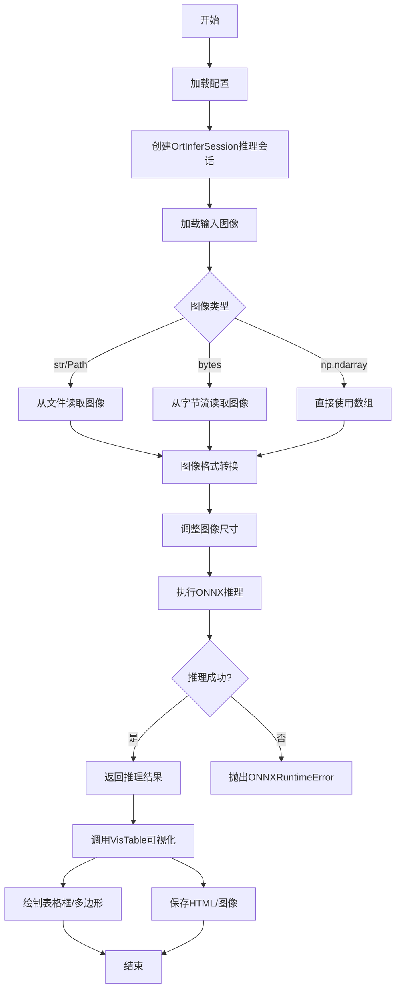

## 类结构

```
Object
├── Enum
│   └── EP (CPU执行提供者枚举)
├── Exception
│   ├── ONNXRuntimeError
│   └── LoadImageError
├── OrtInferSession (ONNX推理会话管理)
├── LoadImage (图像加载与转换)
└── VisTable (表格结果可视化)
```

## 全局变量及字段


### `root_dir`
    
脚本所在目录的绝对路径

类型：`Path`
    


### `InputType`
    
图像输入类型，支持字符串路径、numpy数组、字节流或Path对象

类型：`Union[str, np.ndarray, bytes, Path]`
    


### `pillow_interp_codes`
    
Pillow插值方法代码映射字典，用于图像缩放时选择不同的插值算法

类型：`Dict[str, Any]`
    


### `cv2_interp_codes`
    
OpenCV插值方法代码映射字典，用于图像缩放时选择不同的插值算法

类型：`Dict[str, int]`
    


### `EP.CPU_EP`
    
CPU执行提供者枚举成员，用于指定ONNX使用CPU进行推理

类型：`Enum`
    


### `OrtInferSession.logger`
    
日志记录器实例，用于输出运行日志信息

类型：`loguru.logger`
    


### `OrtInferSession.had_providers`
    
系统可用的ONNX Runtime执行提供者列表

类型：`List[str]`
    


### `OrtInferSession.session`
    
ONNX推理会话对象，用于执行模型推理

类型：`InferenceSession`
    


### `VisTable.load_img`
    
图像加载器实例，用于加载和预处理输入图像

类型：`LoadImage`
    
    

## 全局函数及方法


### `resize_img`

该函数用于调整图像大小，支持保持宽高比的智能缩放，并根据图像尺寸自动选择最优插值方法（缩小使用area插值以保持更多细节，放大使用bicubic插值）。

参数：

- `img`：`np.ndarray`，输入的原始图像
- `scale`：`float | tuple[int]`，缩放因子或目标尺寸（如果是浮点数则按比例缩放，如果是元组则表示最大尺寸限制）
- `keep_ratio`：`bool`，是否保持宽高比，默认为 True

返回值：`tuple[np.ndarray, float, float]`，返回调整后的图像、宽度缩放因子、高度缩放因子

#### 流程图

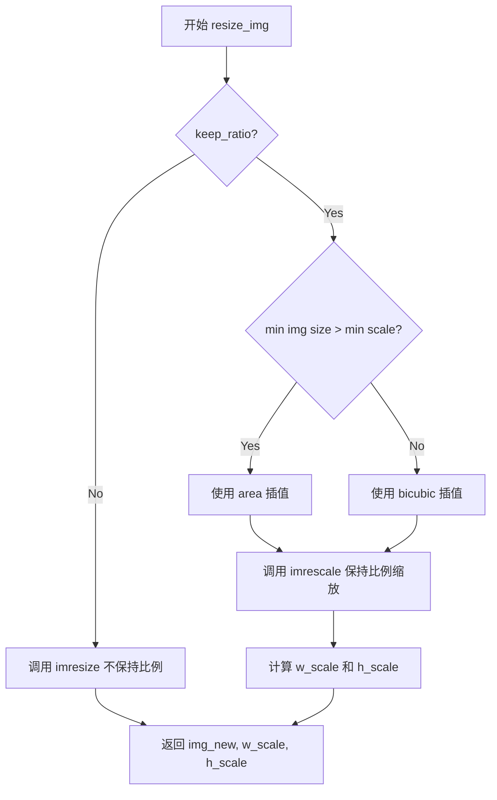

#### 带注释源码

```python
def resize_img(img, scale, keep_ratio=True):
    """
    调整图像大小，支持保持宽高比或非保持宽高比模式。
    
    参数:
        img: 输入图像，numpy.ndarray 类型
        scale: 目标缩放尺寸，可以是浮点数（缩放因子）或元组（目标宽高）
        keep_ratio: 是否保持宽高比，默认为 True
    
    返回:
        tuple: (调整后的图像, 宽度缩放因子, 高度缩放因子)
    """
    # 判断是否需要保持宽高比
    if keep_ratio:
        # 缩小使用 area 插值更保真，放大使用 bicubic
        # 比较原图最小边长与目标尺寸最小边长
        if min(img.shape[:2]) > min(scale):
            interpolation = "area"  # 缩小用 area，插值质量更好
        else:
            interpolation = "bicubic"  # 放大用 bicubic
        
        # 调用 imrescale 进行保持比例的缩放
        img_new, scale_factor = imrescale(
            img, scale, return_scale=True, interpolation=interpolation
        )
        
        # 计算宽高缩放因子（与 mmcv.imrescale 返回的 scale_factor 可能有细微差异）
        new_h, new_w = img_new.shape[:2]
        h, w = img.shape[:2]
        w_scale = new_w / w
        h_scale = new_h / h
    else:
        # 不保持比例，直接拉伸或压缩到目标尺寸
        img_new, w_scale, h_scale = imresize(img, scale, return_scale=True)
    
    # 返回调整后的图像和缩放因子
    return img_new, w_scale, h_scale
```


### `imrescale`

该函数用于在保持图像宽高比的同时调整图像大小，支持通过缩放因子或目标尺寸进行图像缩放，并可选择返回缩放因子。

参数：

- `img`：`np.ndarray`，输入图像
- `scale`：`float | tuple[int]`，缩放因子或最大尺寸。如果是浮点数，则按该因子缩放；如果是2个整数的元组，则在给定的尺寸范围内尽可能大地缩放
- `return_scale`：`bool`，是否返回缩放因子，默认为False
- `interpolation`：`str`，插值方法，默认为"bilinear"，与`resize`函数相同
- `backend`：`str | None`，图像缩放后端类型，默认为None，与`resize`函数相同

返回值：`np.ndarray | tuple`，当`return_scale`为False时返回缩放后的图像；当为True时返回(缩放后的图像, 缩放因子)的元组

#### 流程图

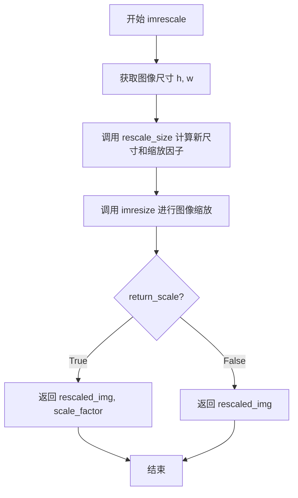

#### 带注释源码

```python
def imrescale(img, scale, return_scale=False, interpolation="bilinear", backend=None):
    """Resize image while keeping the aspect ratio.

    Args:
        img (ndarray): The input image.
        scale (float | tuple[int]): The scaling factor or maximum size.
            If it is a float number, then the image will be rescaled by this
            factor, else if it is a tuple of 2 integers, then the image will
            be rescaled as large as possible within the scale.
        return_scale (bool): Whether to return the scaling factor besides the
            rescaled image.
        interpolation (str): Same as :func:`resize`.
        backend (str | None): Same as :func:`resize`.

    Returns:
        ndarray: The rescaled image.
    """
    # 步骤1: 获取原始图像的高度和宽度
    h, w = img.shape[:2]
    
    # 步骤2: 调用rescale_size函数计算目标尺寸和缩放因子
    # rescale_size会根据scale参数计算保持宽高比的最佳新尺寸
    new_size, scale_factor = rescale_size((w, h), scale, return_scale=True)
    
    # 步骤3: 调用imresize函数执行实际的图像缩放操作
    # 使用指定的插值方法和后端进行缩放
    rescaled_img = imresize(img, new_size, interpolation=interpolation, backend=backend)
    
    # 步骤4: 根据return_scale参数决定返回值
    if return_scale:
        # 返回缩放后的图像和缩放因子
        return rescaled_img, scale_factor
    else:
        # 仅返回缩放后的图像
        return rescaled_img
```


### `imresize`

该函数是一个图像缩放工具函数，支持通过不同的后端（OpenCV或Pillow）将输入图像调整到指定的尺寸，并可选择返回缩放比例。

参数：

- `img`：`np.ndarray`，输入图像
- `size`：`tuple[int]`，目标尺寸 (w, h)
- `return_scale`：`bool`，是否返回缩放因子
- `interpolation`：`str`，插值方法，对应cv2后端支持"nearest", "bilinear", "bicubic", "area", "lanczos"，对应pillow后端支持"nearest", "bilinear"
- `out`：`np.ndarray`，输出目标数组
- `backend`：`str | None`，图像缩放后端类型，选项为"cv2"、"pillow"或None（默认为"cv2"）

返回值：`tuple[np.ndarray, float, float] | np.ndarray`，当return_scale为True时返回(缩放后的图像, 水平缩放因子, 垂直缩放因子)，否则只返回缩放后的图像

#### 流程图

```mermaid
flowchart TD
    A[开始 imresize] --> B[获取图像高度h和宽度w]
    B --> C{backend是否为None}
    C -->|是| D[设置backend为'cv2']
    C -->|否| E{backend是否在['cv2', 'pillow']中}
    D --> E
    E -->|否| F[抛出ValueError: 不支持的backend]
    E -->|是| G{backend == 'pillow'}
    G -->|是| H{检查图像类型是否为uint8}
    H -->|否| I[抛出AssertionError]
    H -->|是| J[使用PIL进行缩放]
    J --> K[将PIL图像转回numpy数组]
    G -->|否| L[使用OpenCV进行缩放]
    L --> M{return_scale是否为True}
    M -->|是| N[计算w_scale和h_scale]
    N --> O[返回resized_img, w_scale, h_scale]
    M -->|否| P[返回resized_img]
    K --> M
    F --> Q[结束]
    I --> Q
    O --> Q
    P --> Q
```

#### 带注释源码

```python
def imresize(
    img, size, return_scale=False, interpolation="bilinear", out=None, backend=None
):
    """Resize image to a given size.

    Args:
        img (ndarray): The input image.
        size (tuple[int]): Target size (w, h).
        return_scale (bool): Whether to return `w_scale` and `h_scale`.
        interpolation (str): Interpolation method, accepted values are
            "nearest", "bilinear", "bicubic", "area", "lanczos" for 'cv2'
            backend, "nearest", "bilinear" for 'pillow' backend.
        out (ndarray): The output destination.
        backend (str | None): The image resize backend type. Options are `cv2`,
            `pillow`, `None`. If backend is None, the global imread_backend
            specified by ``mmcv.use_backend()`` will be used. Default: None.

    Returns:
        tuple | ndarray: (`resized_img`, `w_scale`, `h_scale`) or
        `resized_img`.
    """
    # 获取输入图像的高度和宽度
    h, w = img.shape[:2]
    
    # 如果未指定后端，默认使用cv2
    if backend is None:
        backend = "cv2"
    
    # 验证后端是否支持
    if backend not in ["cv2", "pillow"]:
        raise ValueError(
            f"backend: {backend} is not supported for resize."
            f"Supported backends are 'cv2', 'pillow'"
        )

    # 根据后端选择不同的缩放实现
    if backend == "pillow":
        # Pillow后端只支持uint8类型
        assert img.dtype == np.uint8, "Pillow backend only support uint8 type"
        # 将numpy数组转换为PIL图像
        pil_image = Image.fromarray(img)
        # 使用PIL的resize方法进行缩放
        pil_image = pil_image.resize(size, pillow_interp_codes[interpolation])
        # 将PIL图像转换回numpy数组
        resized_img = np.array(pil_image)
    else:
        # 使用OpenCV的resize函数进行缩放
        resized_img = cv2.resize(
            img, size, dst=out, interpolation=cv2_interp_codes[interpolation]
        )
    
    # 根据return_scale参数决定返回值
    if not return_scale:
        return resized_img
    else:
        # 计算水平和垂直缩放因子
        w_scale = size[0] / w
        h_scale = size[1] / h
        return resized_img, w_scale, h_scale
```


### `rescale_size`

该函数用于根据给定的缩放因子或目标尺寸，计算图像缩放后的新尺寸（宽高），同时支持可选地返回缩放因子。

参数：

- `old_size`：`tuple[int]`，原始图像尺寸，格式为 (w, h)，其中 w 为宽度，h 为高度
- `scale`：`float | tuple[int]`，缩放因子或目标最大尺寸。如果是浮点数或整数，则直接作为缩放因子；如果是元组，则表示目标尺寸范围，图像将在该范围内尽可能大地缩放
- `return_scale`：`bool`，是否同时返回计算得到的缩放因子，默认为 False

返回值：`tuple[int] | tuple[int, float]`，当 `return_scale=False` 时返回新尺寸 (new_w, new_h)；当 `return_scale=True` 时返回 (new_size, scale_factor)，其中 new_size 为 (new_w, new_h)，scale_factor 为计算得到的缩放因子

#### 流程图

```mermaid
flowchart TD
    A[开始 rescale_size] --> B[从 old_size 提取 w, h]
    B --> C{scale 类型判断}
    C -->|float 或 int| D{scale <= 0?}
    C -->|tuple| E[获取 scale 中的最大边和最小边]
    D -->|是| F[抛出 ValueError: Invalid scale]
    D -->|否| G[scale_factor = scale]
    E --> H[计算 scale_factor = min<br/>max_long_edge / max h,w<br/>max_short_edge / min h,w]
    C -->|其他类型| I[抛出 TypeError]
    G --> J[调用 _scale_size 计算新尺寸]
    H --> J
    J --> K{return_scale?]
    K -->|True| L[返回 new_size, scale_factor]
    K -->|False| M[返回 new_size]
```

#### 带注释源码

```python
def rescale_size(old_size, scale, return_scale=False):
    """Calculate the new size to be rescaled to.

    Args:
        old_size (tuple[int]): The old size (w, h) of image.
        scale (float | tuple[int]): The scaling factor or maximum size.
            If it is a float number, then the image will be rescaled by this
            factor, else if it is a tuple of 2 integers, then the image will
            be rescaled as large as possible within the scale.
        return_scale (bool): Whether to return the scaling factor besides the
            rescaled image size.

    Returns:
        tuple[int]: The new rescaled image size.
    """
    # 从原始尺寸元组中解包出宽度 w 和高度 h
    w, h = old_size
    
    # 判断 scale 的类型：如果是数字（float 或 int）
    if isinstance(scale, (float, int)):
        # 检查缩放因子是否为正数，负数或零无效
        if scale <= 0:
            raise ValueError(f"Invalid scale {scale}, must be positive.")
        # 直接将 scale 作为缩放因子
        scale_factor = scale
    
    # 如果 scale 是元组类型，表示指定了目标尺寸范围
    elif isinstance(scale, tuple):
        # 获取范围中的最长边和最短边
        max_long_edge = max(scale)
        max_short_edge = min(scale)
        # 计算缩放因子：取 长边/原长边 和 短边/原短边 的较小值
        # 这样可以确保图像在指定范围内且保持宽高比
        scale_factor = min(max_long_edge / max(h, w), max_short_edge / min(h, w))
    
    # 如果 scale 既不是数字也不是元组，抛出类型错误
    else:
        raise TypeError(
            f"Scale must be a number or tuple of int, but got {type(scale)}"
        )

    # 调用内部函数 _scale_size 根据缩放因子计算新尺寸
    new_size = _scale_size((w, h), scale_factor)

    # 根据 return_scale 参数决定返回值格式
    if return_scale:
        # 同时返回新尺寸和缩放因子
        return new_size, scale_factor
    else:
        # 仅返回新尺寸
        return new_size
```


### `_scale_size`

该函数是一个全局工具函数，用于根据缩放比例计算图像或尺寸的新大小。它接受原始尺寸和缩放因子作为输入，返回缩放后的新尺寸（宽高），支持均匀和非均匀缩放。

参数：

- `size`：`tuple[int]`，表示原始尺寸，格式为 (宽, 高)
- `scale`：`float | tuple(float)`，表示缩放因子，可以是一个数值（均匀缩放）或一个元组（非均匀缩放）

返回值：`tuple[int]`，返回缩放后的新尺寸，格式为 (新宽, 新高)

#### 流程图

```mermaid
flowchart TD
    A[开始] --> B{scale 是 float 或 int?}
    B -->|是| C[将 scale 转换为 tuple: (scale, scale)]
    B -->|否| D[保持 scale 为 tuple 格式]
    C --> E[从 size 中提取 w, h]
    D --> E
    E --> F[计算新宽度: int(w * scale[0] + 0.5)]
    F --> G[计算新高度: int(h * scale[1] + 0.5)]
    G --> H[返回新尺寸 (新宽度, 新高度)]
    H --> I[结束]
```

#### 带注释源码

```python
def _scale_size(size, scale):
    """Rescale a size by a ratio.

    Args:
        size (tuple[int]): (w, h).
        scale (float | tuple(float)): Scaling factor.

    Returns:
        tuple[int]: scaled size.
    """
    # 如果缩放因子是单个数值（float或int），将其转换为元组形式
    # 以便进行统一的宽高缩放计算
    if isinstance(scale, (float, int)):
        scale = (scale, scale)
    
    # 从输入尺寸元组中提取宽度和高度
    w, h = size
    
    # 计算新的宽度和高度：
    # 乘以缩放因子后加0.5是为了实现四舍五入
    # int() 转换确保返回整数像素值
    return int(w * float(scale[0]) + 0.5), int(h * float(scale[1]) + 0.5)
```


### `OrtInferSession.__init__`

该方法是 `OrtInferSession` 类的构造函数，用于初始化 ONNX Runtime 推理会话。它接收配置字典，设置日志记录器，获取模型路径，初始化会话选项，并创建推理会话实例。

参数：

- `config`：`Dict[str, Any]`，配置字典，包含模型路径（model_path）以及可选的线程配置参数（intra_op_num_threads、inter_op_num_threads）

返回值：无返回值（构造函数）

#### 流程图

```mermaid
flowchart TD
    A[开始初始化] --> B[设置日志记录器: self.logger = loguru.logger]
    B --> C[从配置获取模型路径: model_path = config.get('model_path', None)]
    C --> D[获取可用执行提供者: self.had_providers = get_available_providers]
    D --> E[获取执行提供者列表: EP_list = self._get_ep_list]
    E --> F[初始化会话选项: sess_opt = self._init_sess_opts(config)]
    F --> G[创建推理会话: self.session = InferenceSession(model_path, sess_opt, EP_list)]
    G --> H[结束初始化]
```

#### 带注释源码

```python
def __init__(self, config: Dict[str, Any]):
    """
    初始化 ONNX Runtime 推理会话
    
    参数:
        config: 包含模型路径和会话选项的配置字典
    """
    # 初始化日志记录器，使用 loguru 库
    self.logger = loguru.logger

    # 从配置字典中获取模型路径，默认为 None
    model_path = config.get("model_path", None)

    # 获取当前环境中可用的执行提供者（如 CPU、CUDA 等）
    self.had_providers: List[str] = get_available_providers()
    
    # 获取配置的执行提供者列表（默认为 CPU）
    EP_list = self._get_ep_list()

    # 初始化 ONNX Runtime 会话选项
    sess_opt = self._init_sess_opts(config)
    
    # 创建 ONNX Runtime 推理会话
    # model_path: ONNX 模型文件路径
    # sess_options: 会话配置选项
    # providers: 执行提供者列表
    self.session = InferenceSession(
        model_path,
        sess_options=sess_opt,
        providers=EP_list,
    )
```


### `OrtInferSession._init_sess_opts`

该方法是一个静态方法，用于初始化ONNX Runtime推理会话的会话选项（SessionOptions），包括日志级别、内存优化、图优化级别以及线程配置等。

参数：

-  `config`：`Dict[str, Any]`，包含推理会话配置的字典，支持配置`intra_op_num_threads`（操作内线程数）和`inter_op_num_threads`（操作间线程数）

返回值：`SessionOptions`，返回配置好的ONNX Runtime会话选项对象

#### 流程图

```mermaid
flowchart TD
    A[开始 _init_sess_opts] --> B[创建 SessionOptions 对象]
    B --> C[设置 log_severity_level = 4]
    C --> D[设置 enable_cpu_mem_arena = False]
    D --> E[设置 graph_optimization_level = ORT_ENABLE_ALL]
    E --> F[获取 CPU 核心数: cpu_nums = os.cpu_count]
    F --> G{config 中是否有 intra_op_num_threads}
    G -->|是| H{intra_op_num_threads 在 [1, cpu_nums] 范围内}
    H -->|是| I[设置 sess_opt.intra_op_num_threads]
    H -->|否| J[跳过设置]
    I --> K{config 中是否有 inter_op_num_threads}
    G -->|否| J
    K -->|是| L{inter_op_num_threads 在 [1, cpu_nums] 范围内}
    L -->|是| M[设置 sess_opt.inter_op_num_threads]
    L -->|否| N[跳过设置]
    M --> O[返回 sess_opt]
    J --> K
    N --> O
```

#### 带注释源码

```python
@staticmethod
def _init_sess_opts(config: Dict[str, Any]) -> SessionOptions:
    """
    初始化ONNX Runtime推理会话的会话选项
    
    参数:
        config: 包含会话配置的字典，可包含 intra_op_num_threads 和 inter_op_num_threads
    
    返回:
        配置好的 SessionOptions 对象
    """
    # 创建会话选项对象
    sess_opt = SessionOptions()
    
    # 设置日志严重级别为4（kVERBOSE），仅输出最详细的调试信息
    sess_opt.log_severity_level = 4
    
    # 禁用CPU内存 arena，有助于减少内存碎片
    sess_opt.enable_cpu_mem_arena = False
    
    # 启用所有图优化级别，包括常量折叠、节点融合、内存优化等
    sess_opt.graph_optimization_level = GraphOptimizationLevel.ORT_ENABLE_ALL

    # 获取当前系统的CPU核心数
    cpu_nums = os.cpu_count()
    
    # 从配置中获取操作内线程数，默认值为-1（表示使用ONNX Runtime默认值）
    intra_op_num_threads = config.get("intra_op_num_threads", -1)
    
    # 如果配置了有效的线程数（范围在1到cpu_nums之间），则设置线程数
    if intra_op_num_threads != -1 and 1 <= intra_op_num_threads <= cpu_nums:
        sess_opt.intra_op_num_threads = intra_op_num_threads

    # 从配置中获取操作间线程数，默认值为-1
    inter_op_num_threads = config.get("inter_op_num_threads", -1)
    
    # 如果配置了有效的线程数（范围在1到cpu_nums之间），则设置线程数
    if inter_op_num_threads != -1 and 1 <= inter_op_num_threads <= cpu_nums:
        sess_opt.inter_op_num_threads = inter_op_num_threads

    # 返回配置好的会话选项对象
    return sess_opt
```


### `OrtInferSession._get_ep_list`

该方法用于获取 ONNX Runtime 的执行提供者（Execution Provider）列表，目前仅配置了 CPU 执行提供者，并设置了相关的 CPU 提供者选项。

参数：

- （无额外参数，仅实例方法隐含的 `self`）

返回值：`List[Tuple[str, Dict[str, Any]]]` ，返回一个包含执行提供者及其配置选项的列表，每个元素为元组 `(provider_name, provider_options)`

#### 流程图

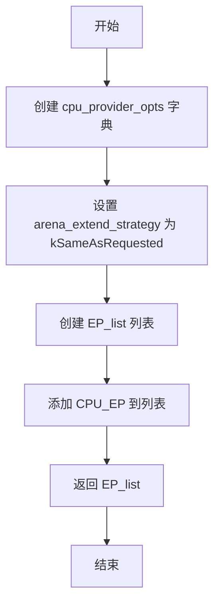

#### 带注释源码

```python
def _get_ep_list(self) -> List[Tuple[str, Dict[str, Any]]]:
    """获取 ONNX Runtime 执行提供者列表
    
    Returns:
        List[Tuple[str, Dict[str, Any]]]: 包含执行提供者及其选项的列表
    """
    # 定义 CPU 执行提供者的配置选项
    # arena_extend_strategy 设置为 kSameAsRequested，
    # 表示内存扩展策略与请求的内存大小一致
    cpu_provider_opts = {
        "arena_extend_strategy": "kSameAsRequested",
    }
    
    # 构建执行提供者列表，包含提供者名称和对应选项
    # EP.CPU_EP.value 为 "CPUExecutionProvider"
    EP_list = [(EP.CPU_EP.value, cpu_provider_opts)]

    # 返回配置好的执行提供者列表
    return EP_list
```


### `OrtInferSession.__call__`

该方法是 `OrtInferSession` 类的核心推理接口，使实例可像函数一样被调用。它接收模型输入数据，将其转换为 ONNX Runtime 所需的字典格式，执行推理并返回结果。

参数：

- `input_content`：`List[np.ndarray]`，输入的图像数据列表，每个元素为一个 np.ndarray 类型的输入数据

返回值：`np.ndarray`，推理结果，实际类型为 `List[np.ndarray]`（ONNX Runtime 的 session.run 返回值）

#### 流程图

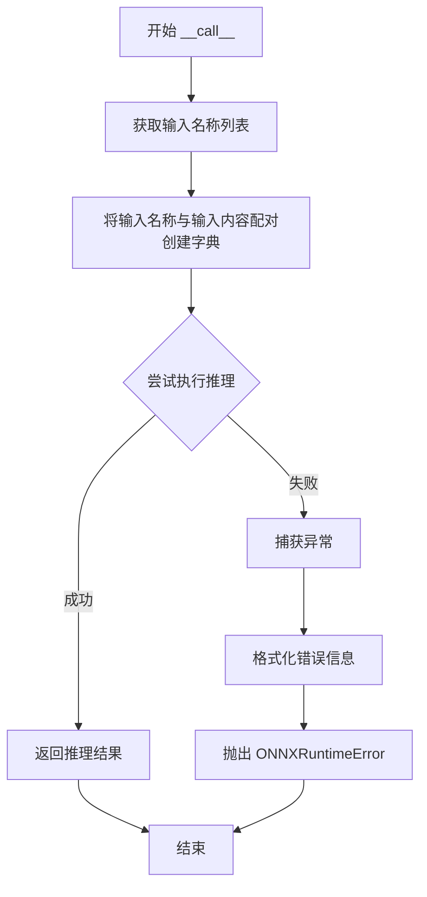

#### 带注释源码

```python
def __call__(self, input_content: List[np.ndarray]) -> np.ndarray:
    """
    使 OrtInferSession 实例可以像函数一样被调用，执行 ONNX 模型推理。
    
    参数:
        input_content: 输入的图像数据列表，每个元素对应模型的一个输入节点
        
    返回值:
        推理结果，类型为 np.ndarray（实际是 List[np.ndarray]，ONNX Runtime 返回）
        
    异常:
        ONNXRuntimeError: 当模型推理发生错误时抛出
    """
    # 1. 获取模型的输入节点名称列表
    # 2. 将输入名称与实际输入数据通过 zip 配对
    # 3. 使用 dict() 转换为 {输入名称: 输入数据} 格式的字典
    input_dict = dict(zip(self.get_input_names(), input_content))
    
    try:
        # 执行推理
        # 第一个参数 None 表示返回所有输出节点的结果
        # 第二个参数为输入数据字典
        return self.session.run(None, input_dict)
    except Exception as e:
        # 捕获推理过程中的所有异常
        # 使用 traceback.format_exc() 获取完整的错误堆栈信息
        error_info = traceback.format_exc()
        # 抛出自定义 ONNXRuntimeError，保留原始异常作为 cause
        raise ONNXRuntimeError(error_info) from e
```


### `OrtInferSession.get_input_names`

获取ONNX模型的所有输入节点名称

参数： 无

返回值：`List[str]`，返回ONNX模型的输入节点名称列表

#### 流程图

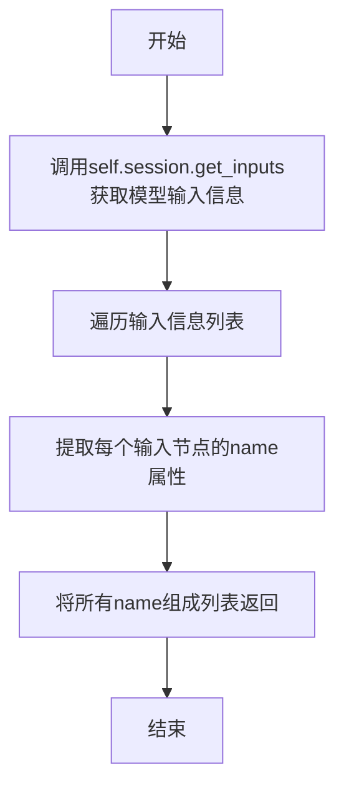

#### 带注释源码

```python
def get_input_names(self) -> List[str]:
    """
    获取ONNX模型的所有输入节点名称
    
    该方法通过调用ONNX Runtime的InferenceSession对象的get_inputs方法，
    获取模型的输入张量信息，然后提取每个输入张量的名称并返回列表。
    
    Returns:
        List[str]: 模型输入节点的名称列表
    """
    # 使用列表推导式从session的输入信息中提取所有输入节点的名称
    # self.session.get_inputs()返回一个列表，列表中每个元素包含name、type、shape等信息
    return [v.name for v in self.session.get_inputs()]
```


### `LoadImage.__call__`

该方法是 `LoadImage` 类的核心调用接口，接收多种格式的图像输入（文件路径、NumPy 数组、字节数据），进行类型验证、图像加载与格式转换，最终返回统一为 BGR 格式的 NumPy 数组。

参数：

- `img`：`InputType`（即 `Union[str, np.ndarray, bytes, Path]`），输入图像，支持文件路径、NumPy 数组、字节数据或 Path 对象

返回值：`np.ndarray`，转换后的 BGR 格式图像数组

#### 流程图

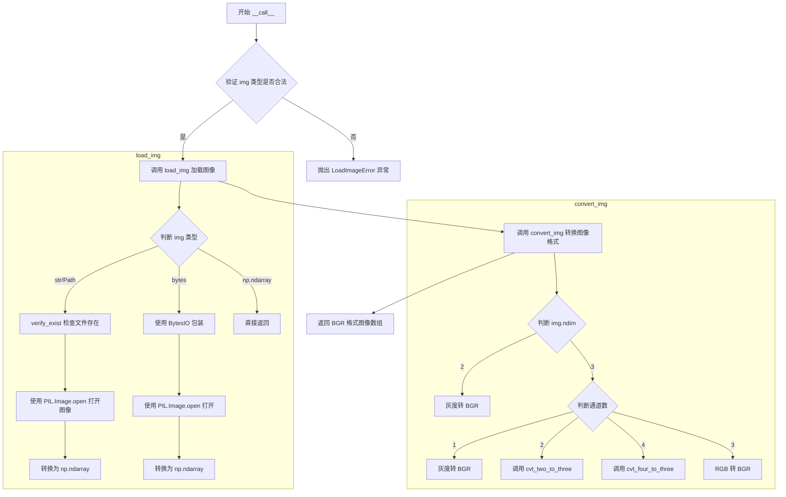

#### 带注释源码

```python
def __call__(self, img: InputType) -> np.ndarray:
    """
    LoadImage 的主调用方法，将输入图像加载并转换为 BGR 格式的 NumPy 数组
    
    Args:
        img: 输入图像，支持以下类型:
            - str: 图像文件路径
            - Path: 图像文件路径 (Path 对象)
            - bytes: 图像数据的字节流
            - np.ndarray: 已加载的图像数组
    
    Returns:
        np.ndarray: 转换后的 BGR 格式图像数组
    
    Raises:
        LoadImageError: 当图像类型不在支持列表中时抛出
    """
    # 验证输入图像类型是否在支持的类型列表中
    # InputType.__args__ 包含: (str, np.ndarray, bytes, Path)
    if not isinstance(img, InputType.__args__):
        raise LoadImageError(
            f"The img type {type(img)} does not in {InputType.__args__}"
        )

    # 第一步：加载图像，根据输入类型使用不同的加载策略
    # 支持从文件路径加载、从字节数据加载、直接使用已有数组
    img = self.load_img(img)
    
    # 第二步：转换图像格式，统一转换为 BGR 格式
    # 处理灰度图、RGBA、RGB 等多种格式的转换
    img = self.convert_img(img)
    
    # 返回转换后的 BGR 格式图像
    return img
```


### `LoadImage.load_img`

该方法负责从多种输入类型（文件路径、字节数据、NumPy数组）加载图像，并将其转换为NumPy数组格式，是图像加载模块的核心入口。

参数：
- `img`：`InputType`，要加载的图像，支持字符串路径、Path对象、字节数据或NumPy数组

返回值：`np.ndarray`，加载后的图像NumPy数组

#### 流程图

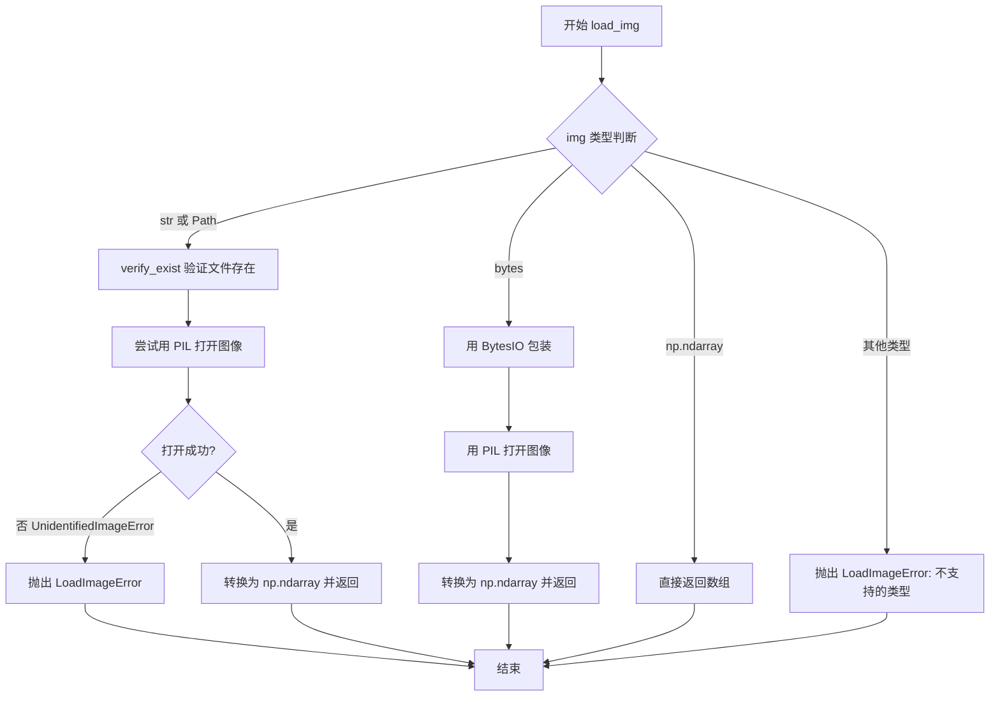

#### 带注释源码

```python
def load_img(self, img: InputType) -> np.ndarray:
    """加载图像并返回NumPy数组
    
    支持三种输入类型：
    1. str/Path: 从文件路径加载图像
    2. bytes: 从字节数据加载图像
    3. np.ndarray: 直接返回数组
    
    Args:
        img: 输入图像，类型为 str/Path/bytes/np.ndarray
        
    Returns:
        np.ndarray: 加载后的图像数组
        
    Raises:
        LoadImageError: 当图像类型不支持或文件不存在时
    """
    # 处理文件路径类型（str或Path）
    if isinstance(img, (str, Path)):
        # 先验证文件是否存在
        self.verify_exist(img)
        try:
            # 使用PIL打开图像并转换为NumPy数组
            img = np.array(Image.open(img))
        except UnidentifiedImageError as e:
            # 处理无法识别的图像文件格式
            raise LoadImageError(f"cannot identify image file {img}") from e
        return img

    # 处理字节类型（用于内存中的图像数据）
    if isinstance(img, bytes):
        # 将bytes包装为BytesIO后用PIL打开
        img = np.array(Image.open(BytesIO(img)))
        return img

    # 处理NumPy数组类型（直接返回，不做处理）
    if isinstance(img, np.ndarray):
        return img

    # 如果都不匹配，抛出不支持的类型错误
    raise LoadImageError(f"{type(img)} is not supported!")
```


### `LoadImage.convert_img`

该方法负责将不同通道数（如灰度、单通道、2通道、3通道、4通道）的图像统一转换为 BGR 格式的三通道图像，以适配后续的图像处理流程。

参数：

- `self`：`LoadImage` 实例本身，隐式参数，用于调用类内部的其他方法（如 `cvt_two_to_three`、`cvt_four_to_three`）
- `img`：`np.ndarray`，输入的图像数组，可能包含不同的维度（2D 灰度图或 3D 多通道图）

返回值：`np.ndarray`，转换后的 BGR 格式三通道图像数组

#### 流程图

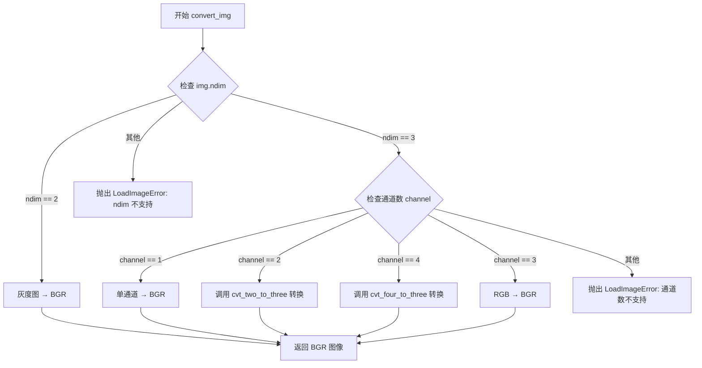

#### 带注释源码

```python
def convert_img(self, img: np.ndarray):
    """
    将不同通道数的图像统一转换为 BGR 格式的三通道图像。
    
    处理逻辑：
    - 2D 灰度图 (ndim=2) → 转换为 BGR
    - 3D 单通道图 (shape[2]=1) → 转换为 BGR
    - 3D 双通道图 (shape[2]=2) → 调用 cvt_two_to_three 转换为 BGR
    - 3D 三通道图 (shape[2]=3) → RGB 转换为 BGR
    - 3D 四通道图 (shape[2]=4) → RGBA 转换为 BGR
    
    参数:
        img: 输入的 numpy 数组图像
        
    返回:
        转换后的 BGR 格式三通道图像
        
    异常:
        LoadImageError: 当通道数不在 [1,2,3,4] 或 ndim 不在 [2,3] 时抛出
    """
    # 处理 2D 灰度图像：直接转换为 BGR 格式
    if img.ndim == 2:
        return cv2.cvtColor(img, cv2.COLOR_GRAY2BGR)

    # 处理 3D 多通道图像
    if img.ndim == 3:
        channel = img.shape[2]
        
        # 单通道图像：灰度转 BGR
        if channel == 1:
            return cv2.cvtColor(img, cv2.COLOR_GRAY2BGR)

        # 双通道图像（灰度 + Alpha）：调用专用转换函数
        if channel == 2:
            return self.cvt_two_to_three(img)

        # 四通道图像（RGBA）：调用专用转换函数
        if channel == 4:
            return self.cvt_four_to_three(img)

        # 三通道图像：RGB 转 BGR（OpenCV 使用 BGR 格式）
        if channel == 3:
            return cv2.cvtColor(img, cv2.COLOR_RGB2BGR)

        # 通道数不支持：抛出异常
        raise LoadImageError(
            f"The channel({channel}) of the img is not in [1, 2, 3, 4]"
        )

    # 维度不支持：抛出异常
    raise LoadImageError(f"The ndim({img.ndim}) of the img is not in [2, 3]")
```


### `LoadImage.cvt_four_to_three`

该方法为静态方法，负责将RGBA格式的4通道图像转换为BGR格式的3通道图像，同时基于Alpha通道进行透明度合成处理，实现图像色彩空间转换与透明度融合的核心逻辑。

参数：

- `img`：`np.ndarray`，输入的RGBA格式图像（4通道，通道顺序为R、G、B、A）

返回值：`np.ndarray`，转换后的BGR格式图像（3通道）

#### 流程图

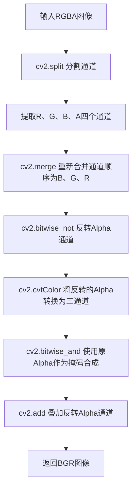

#### 带注释源码

```python
@staticmethod
def cvt_four_to_three(img: np.ndarray) -> np.ndarray:
    """RGBA → BGR"""
    # 步骤1: 将4通道RGBA图像分割为R、G、B、A四个独立通道
    r, g, b, a = cv2.split(img)
    
    # 步骤2: 将通道重新合并为BGR顺序（OpenCV使用BGR格式）
    new_img = cv2.merge((b, g, r))
    
    # 步骤3: 对Alpha通道进行按位取反操作（用于合成）
    not_a = cv2.bitwise_not(a)
    
    # 步骤4: 将单通道的反转Alpha转换为三通道格式（与BGR图像匹配）
    not_a = cv2.cvtColor(not_a, cv2.COLOR_GRAY2BGR)
    
    # 步骤5: 使用原Alpha通道作为掩码，与BGR图像进行按位与操作
    # 保留BGR图像中Alpha通道对应的像素区域
    new_img = cv2.bitwise_and(new_img, new_img, mask=a)
    
    # 步骤6: 叠加反转的Alpha通道，实现透明度合成效果
    new_img = cv2.add(new_img, not_a)
    
    # 返回转换后的BGR格式图像
    return new_img
```


### `LoadImage.cvt_two_to_three`

该方法将两通道图像（灰度+Alpha）转换为三通道BGR图像，主要用于处理带有Alpha通道的灰度图像，通过位运算将灰度信息与Alpha透明度信息融合生成标准的彩色图像。

参数：

- `img`：`np.ndarray`，输入的两通道图像数组，第一通道为灰度信息，第二通道为Alpha透明度信息

返回值：`np.ndarray`，转换后的三通道BGR图像

#### 流程图

```mermaid
flowchart TD
    A[输入两通道图像 img] --> B[提取灰度通道<br/>img_gray = img[..., 0]]
    B --> C[灰度转BGR<br/>cv2.cvtColor]
    C --> D[提取Alpha通道<br/>img_alpha = img[..., 1]]
    D --> E[Alpha取反<br/>cv2.bitwise_not]
    E --> F[反转Alpha转BGR<br/>cv2.cvtColor]
    F --> G[按位与操作<br/>cv2.bitwise_and<br/>使用Alpha作为mask]
    G --> H[叠加反转Alpha<br/>cv2.add]
    H --> I[返回三通道BGR图像]
```

#### 带注释源码

```python
@staticmethod
def cvt_two_to_three(img: np.ndarray) -> np.ndarray:
    """gray + alpha → BGR
    
    将两通道图像（灰度+Alpha）转换为三通道BGR图像。
    该方法将灰度信息作为颜色基础，结合Alpha通道实现透明度混合。
    
    Args:
        img: 输入的两通道图像数组，shape为(H, W, 2)
            - 第一通道: 灰度信息 (0-255)
            - 第二通道: Alpha透明度信息 (0-255)
    
    Returns:
        转换后的三通道BGR图像，shape为(H, W, 3)
    """
    # 提取第一个通道（灰度通道）
    img_gray = img[..., 0]
    
    # 将灰度图像转换为三通道BGR格式
    # 灰度图每个像素的R=G=B=原灰度值
    img_bgr = cv2.cvtColor(img_gray, cv2.COLOR_GRAY2BGR)
    
    # 提取第二个通道（Alpha通道）
    img_alpha = img[..., 1]
    
    # 对Alpha通道进行取反操作
    # 用于作为背景叠加的掩码
    not_a = cv2.bitwise_not(img_alpha)
    
    # 将反转后的Alpha单通道图像转换为三通道
    not_a = cv2.cvtColor(not_a, cv2.COLOR_GRAY2BGR)
    
    # 使用Alpha通道作为掩码进行按位与操作
    # 保留img_bgr中与Alpha对应位置的前景内容
    new_img = cv2.bitwise_and(img_bgr, img_bgr, mask=img_alpha)
    
    # 将前景与背景（反转的Alpha）叠加
    # 生成最终的BGR图像
    new_img = cv2.add(new_img, not_a)
    
    return new_img
```


### `LoadImage.verify_exist`

该方法是一个静态方法，用于验证给定的文件路径是否存在。如果文件不存在，则抛出 `LoadImageError` 异常；如果文件存在，则正常返回。

参数：

- `file_path`：`Union[str, Path]`，待验证的文件路径，可以是字符串类型或 `Path` 对象类型

返回值：`None`，该方法没有返回值，通过抛出异常来处理错误情况

#### 流程图

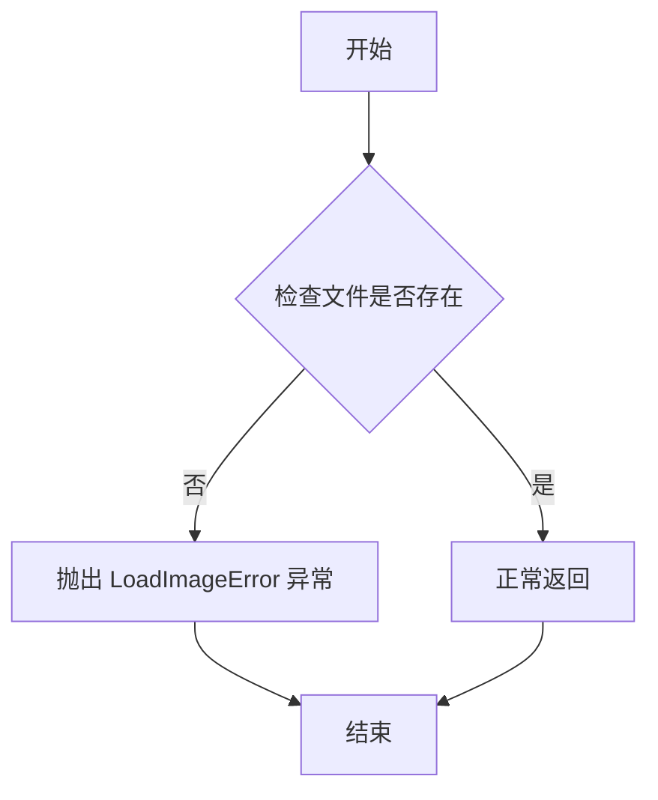

#### 带注释源码

```python
@staticmethod
def verify_exist(file_path: Union[str, Path]):
    """
    验证文件路径是否存在
    
    参数:
        file_path: 待验证的文件路径,支持字符串或Path对象
    
    异常:
        LoadImageError: 当文件路径不存在时抛出
    """
    # 将输入转换为Path对象并检查是否存在
    if not Path(file_path).exists():
        # 文件不存在时抛出自定义异常
        raise LoadImageError(f"{file_path} does not exist.")
```


### `VisTable.__call__`

该方法是`VisTable`类的可调用接口，接收图片路径和表格识别结果，根据表格的单元格边界框在原图上绘制可视化结果（矩形或多边形），同时支持将表格HTML、绘制后的图片以及带逻辑坐标的可视化图片保存为文件，并返回绘制了边界框的图像。

参数：

- `img_path`：`Union[str, Path]`，待可视化图片的路径
- `table_results`：表格识别结果对象，包含`pred_html`、`cell_bboxes`和`logic_points`属性
- `save_html_path`：`Optional[Union[str, Path]]`，可选，表格HTML文件的保存路径
- `save_drawed_path`：`Optional[Union[str, Path]]`，可选，绘制了单元格边界框的图片保存路径
- `save_logic_path`：`Optional[Union[str, Path]]`，可选，包含行列逻辑坐标的可视化图片保存路径

返回值：`Optional[np.ndarray]`，返回绘制了单元格边界框的图像；若`cell_bboxes`为`None`则返回`None`

#### 流程图

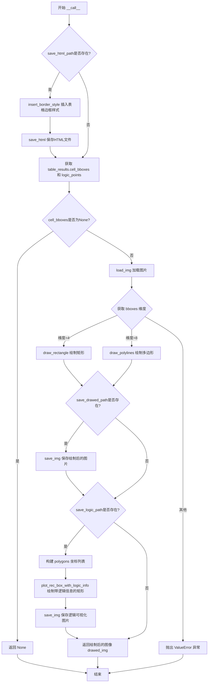

#### 带注释源码

```python
def __call__(
    self,
    img_path: Union[str, Path],
    table_results,
    save_html_path: Optional[Union[str, Path]] = None,
    save_drawed_path: Optional[Union[str, Path]] = None,
    save_logic_path: Optional[Union[str, Path]] = None,
):
    """
    可视化表格识别结果，在原图上绘制单元格边界框并可选保存各类结果

    Args:
        img_path: 图片路径
        table_results: 表格识别结果对象，需包含 pred_html, cell_bboxes, logic_points 属性
        save_html_path: 可选，保存带边框样式的HTML文件路径
        save_drawed_path: 可选，保存绘制了单元格框的图片路径
        save_logic_path: 可选，保存带行列逻辑坐标的可视化图片路径

    Returns:
        绘制了单元格边界框的图像，若 cell_bboxes 为 None 则返回 None
    """
    # 1. 保存HTML结果（若需要）
    if save_html_path:
        # 为表格HTML插入边框样式
        html_with_border = self.insert_border_style(table_results.pred_html)
        # 保存HTML文件
        self.save_html(save_html_path, html_with_border)

    # 2. 获取表格的单元格边界框和逻辑坐标
    table_cell_bboxes = table_results.cell_bboxes
    table_logic_points = table_results.logic_points
    
    # 3. 若无单元格边界框，直接返回None
    if table_cell_bboxes is None:
        return None

    # 4. 加载原始图片
    img = self.load_img(img_path)

    # 5. 根据边界框维度绘制图形（4维为矩形，8维为多边形）
    dims_bboxes = table_cell_bboxes.shape[1]
    if dims_bboxes == 4:
        # 绘制轴对齐矩形框
        drawed_img = self.draw_rectangle(img, table_cell_bboxes)
    elif dims_bboxes == 8:
        # 绘制任意四边形框
        drawed_img = self.draw_polylines(img, table_cell_bboxes)
    else:
        # 维度不支持，抛出异常
        raise ValueError("Shape of table bounding boxes is not between in 4 or 8.")

    # 6. 保存绘制后的图片（若需要）
    if save_drawed_path:
        self.save_img(save_drawed_path, drawed_img)

    # 7. 保存带逻辑信息的可视化图片（若需要）
    if save_logic_path:
        # 从8维坐标中提取左上角和右下角构成矩形
        polygons = [[box[0], box[1], box[4], box[5]] for box in table_cell_bboxes]
        # 绘制包含行列逻辑坐标的矩形框
        self.plot_rec_box_with_logic_info(
            img, save_logic_path, table_logic_points, polygons
        )
    
    # 8. 返回绘制完成的图像
    return drawed_img
```


### VisTable.insert_border_style

该方法用于在 HTML 表格字符串中插入 CSS 边框样式，使表格在浏览器中显示时具有标准的边框、表头背景色等视觉效果。

参数：

- `table_html_str`：`str`，原始的 HTML 表格字符串，需要包含 `<body>` 标签以便进行样式插入

返回值：`str`，添加了边框样式后的完整 HTML 字符串

#### 流程图

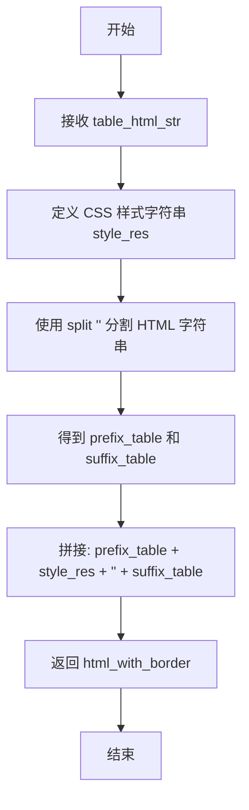

#### 带注释源码

```python
def insert_border_style(self, table_html_str: str):
    """
    在 HTML 表格字符串中插入边框样式

    Args:
        table_html_str: 原始的 HTML 表格字符串，需要包含 <body> 标签

    Returns:
        添加了边框样式后的完整 HTML 字符串
    """
    # 定义 CSS 样式，包含表格的基本样式、单元格边框、表头背景色等
    style_res = """<meta charset="UTF-8"><style>
    table {
        border-collapse: collapse;
        width: 100%;
    }
    th, td {
        border: 1px solid black;
        padding: 8px;
        text-align: center;
    }
    th {
        background-color: #f2f2f2;
    }
                </style>"""

    # 将 HTML 字符串按 <body> 标签分割成前缀和后缀两部分
    prefix_table, suffix_table = table_html_str.split("<body>")
    
    # 重新拼接：前缀 + 样式 + <body> 标签 + 后缀
    html_with_border = f"{prefix_table}{style_res}<body>{suffix_table}"
    
    # 返回带有边框样式的完整 HTML 字符串
    return html_with_border
```


### VisTable.plot_rec_box_with_logic_info

该方法用于在表格图像上绘制单元格边界框，并标注每个单元格的逻辑坐标信息（行号范围和列号范围），同时支持将处理后的图像保存到指定路径。

参数：

- `self`：VisTable 类实例上下文
- `img`：`np.ndarray`，输入的表格图像数据
- `output_path`：`Union[str, Path]`，输出图像的保存路径
- `logic_points`：`List[List[int]]`，每个单元格的逻辑坐标信息，格式为 `[row_start, row_end, col_start, col_end]`
- `sorted_polygons`：`List[List[float]]`，每个单元格的边界框坐标，格式为 `[xmin, ymin, xmax, ymax]`

返回值：无（`None`），该方法直接保存图像文件到磁盘

#### 流程图

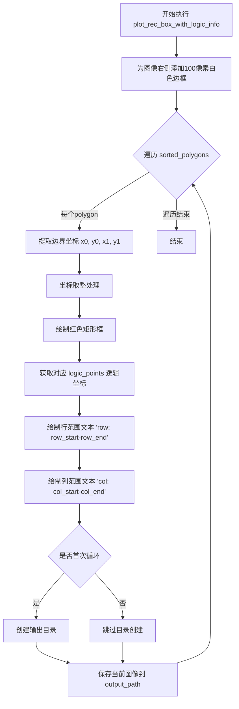

#### 带注释源码

```python
def plot_rec_box_with_logic_info(
    self, img, output_path, logic_points, sorted_polygons
):
    """
    在表格图像上绘制单元格边界框及逻辑坐标信息
    
    :param img: 输入图像数组
    :param output_path: 输出图像保存路径
    :param logic_points: 逻辑坐标列表 [row_start,row_end,col_start,col_end]
    :param sorted_polygons: 边界框坐标列表 [xmin,ymin,xmax,ymax]
    :return: 无返回值，直接保存图像到指定路径
    """
    # 为原始图像右侧添加100像素宽的白色边框，为文字标注留出空间
    img = cv2.copyMakeBorder(
        img, 0, 0, 0, 100, cv2.BORDER_CONSTANT, value=[255, 255, 255]
    )
    
    # 遍历每个单元格的多边形边界框
    for idx, polygon in enumerate(sorted_polygons):
        # 提取边界框的四个坐标点
        x0, y0, x1, y1 = polygon[0], polygon[1], polygon[2], polygon[3]
        
        # 对坐标进行四舍五入取整，确保绘制位置为整数像素
        x0 = round(x0)
        y0 = round(y0)
        x1 = round(x1)
        y1 = round(y1)
        
        # 绘制红色矩形框标记单元格区域
        # 参数: 图像, 左上角坐标, 右下角坐标, 颜色(BGR:红色), 线宽
        cv2.rectangle(img, (x0, y0), (x1, y1), (0, 0, 255), 1)
        
        # 设置文字字体大小和线条粗细
        font_scale = 0.9  # 增大字体大小以便更清晰显示
        thickness = 1     # 线条粗细
        
        # 获取当前单元格对应的逻辑坐标信息
        logic_point = logic_points[idx]
        
        # 在矩形框内绘制行范围标注
        # 格式: "row: start-end"
        cv2.putText(
            img,
            f"row: {logic_point[0]}-{logic_point[1]}",
            (x0 + 3, y0 + 8),              # 文本起始位置
            cv2.FONT_HERSHEY_PLAIN,        # 字体类型
            font_scale,
            (0, 0, 255),                    # 文字颜色(红色)
            thickness,
        )
        
        # 在矩形框内绘制列范围标注
        # 格式: "col: start-end"
        cv2.putText(
            img,
            f"col: {logic_point[2]}-{logic_point[3]}",
            (x0 + 3, y0 + 18),             # 文本起始位置(位于行范围下方)
            cv2.FONT_HERSHEY_PLAIN,
            font_scale,
            (0, 0, 255),
            thickness,
        )
        
        # 确保输出目录存在(存在冗余:应在循环外执行一次)
        os.makedirs(os.path.dirname(output_path), exist_ok=True)
        
        # 保存绘制后的图像(存在冗余:每次循环都保存，应在循环结束后统一保存)
        self.save_img(output_path, img)
```


### `VisTable.draw_rectangle`

该方法是一个静态方法，用于在输入图像上绘制矩形边界框。它接收原始图像和边界框坐标数组，遍历每个边界框并使用 OpenCV 的 `rectangle` 函数绘制蓝色边框，最后返回绘制后的图像副本。

参数：

- `img`：`np.ndarray`，输入的原始图像
- `boxes`：`np.ndarray`，边界框坐标数组，形状为 (N, 4)，每行包含 [x1, y1, x2, y2] 格式的坐标

返回值：`np.ndarray`，绘制了矩形边框的图像副本

#### 流程图

```mermaid
flowchart TD
    A[开始 draw_rectangle] --> B[复制输入图像 img_copy = img.copy]
    B --> C[遍历 boxes 中的每个边界框]
    C --> D{遍历是否结束}
    D -->|否| E[将边界框坐标转换为整数]
    E --> F[提取 x1, y1, x2, y2 坐标]
    F --> G[使用 cv2.rectangle 绘制矩形]
    G --> C
    D -->|是| H[返回绘制后的图像副本]
    H --> I[结束]
```

#### 带注释源码

```python
@staticmethod
def draw_rectangle(img: np.ndarray, boxes: np.ndarray) -> np.ndarray:
    """
    在图像上绘制矩形边界框
    
    Args:
        img: 输入的原始图像，类型为 numpy.ndarray
        boxes: 边界框坐标数组，形状为 (N, 4)，每行包含 [x1, y1, x2, y2]
    
    Returns:
        绘制了矩形边框的图像副本
    """
    # 创建图像的深拷贝，避免修改原始图像
    img_copy = img.copy()
    
    # 遍历每个边界框
    for box in boxes.astype(int):
        # 解包边界框坐标：左上角 (x1, y1) 和右下角 (x2, y2)
        x1, y1, x2, y2 = box
        
        # 使用 OpenCV 在图像上绘制矩形
        # 参数说明：
        # - img_copy: 要绘制矩形的图像
        # - (x1, y1): 矩形左上角坐标
        # - (x2, y2): 矩形右下角坐标
        # - (255, 0, 0): 矩形颜色（BGR格式，蓝色）
        # - 2: 矩形边框线条粗细
        cv2.rectangle(img_copy, (x1, y1), (x2, y2), (255, 0, 0), 2)
    
    # 返回绘制了矩形边框的图像副本
    return img_copy
```


### `VisTable.draw_polylines`

该方法是一个静态方法，用于在图像上绘制多段线（代表表格单元格的 quadrilateral 边界框），以便可视化表格识别结果。它遍历所有点集，将每个点集重塑为 4 个顶点组成的多边形，然后使用 OpenCV 的 `polylines` 函数在图像副本上绘制蓝色线条。

参数：

-  `img`：`np.ndarray`，输入的原始图像
-  `points`：`np.ndarray`（根据使用推断），包含多个多边形顶点坐标的数组，每个多边形有 8 个坐标值（4 个点的 x, y 坐标）

返回值：`np.ndarray`，绘制了多段线之后的图像副本

#### 流程图

```mermaid
flowchart TD
    A[开始 draw_polylines] --> B[复制输入图像到 img_copy]
    B --> C[遍历 points 数组中的每个点集]
    C --> D[将当前点集转换为整数类型]
    D --> E[将点集重塑为 4x2 的矩阵 - 4个顶点]
    E --> F[调用 cv2.polylines 绘制多边形]
    F --> G{是否还有更多点集?}
    G -->|是| C
    G -->|否| H[返回绘制后的图像 img_copy]
    H --> I[结束]
```

#### 带注释源码

```python
@staticmethod
def draw_polylines(img: np.ndarray, points) -> np.ndarray:
    """
    在图像上绘制多段线（多边形/四边形）
    
    Args:
        img: 输入图像数组
        points: 包含多个多边形顶点坐标的数组，形状为 (n, 8)，每个多边形有4个顶点，每个顶点2个坐标(x,y)
    
    Returns:
        绘制了多段线后的图像副本
    """
    # 创建图像的深拷贝，避免修改原始图像
    img_copy = img.copy()
    
    # 遍历所有多边形点集
    for point in points.astype(int):
        # 将点集重塑为 (4, 2) 的形状，代表4个顶点的坐标
        # 每个点的格式为 [x1, y1, x2, y2, x3, y3, x4, y4]
        point = point.reshape(4, 2)
        
        # 使用 OpenCV 的 polylines 函数绘制多边形
        # 参数说明：
        #   - img_copy: 要绘制多段线的图像
        #   - [point.astype(int)]: 多边形顶点数组（需要是整数类型）
        #   - True: 闭合多段线（首尾相连）
        #   - (255, 0, 0): 蓝色颜色 (BGR格式)
        #   - 2: 线条粗细
        cv2.polylines(img_copy, [point.astype(int)], True, (255, 0, 0), 2)
    
    # 返回绘制了多段线的图像副本
    return img_copy
```


### `VisTable.save_img`

该方法是一个静态方法，用于将NumPy数组格式的图像数据保存到指定的文件路径，支持字符串或Path对象指定的保存路径。

参数：

- `save_path`：`Union[str, Path]`，指定保存图像的文件路径，支持字符串或Path对象
- `img`：`np.ndarray`，要保存的图像数据，通常为BGR格式（OpenCV默认格式）

返回值：`None`，该方法通过`cv2.imwrite`保存图像，不返回任何值

#### 流程图

```mermaid
flowchart TD
    A[开始 save_img] --> B{检查save_path是否为Path对象}
    B -->|是| C[转换为字符串]
    B -->|否| D[直接使用字符串]
    C --> E[调用cv2.imwrite保存图像]
    D --> E
    E --> F[结束方法]
```

#### 带注释源码

```python
@staticmethod
def save_img(save_path: Union[str, Path], img: np.ndarray):
    """
    将图像保存到指定路径
    
    这是一个静态方法，用于将OpenCV格式的图像（NumPy数组）
    保存到文件系统。
    
    Args:
        save_path: Union[str, Path], 保存图像的路径
        img: np.ndarray, 图像数据，通常为BGR格式
    
    Returns:
        None
    """
    # 调用OpenCV的imwrite方法将图像保存到指定路径
    # str()确保Path对象被转换为字符串格式
    cv2.imwrite(str(save_path), img)
```


### `VisTable.save_html`

将HTML内容保存到指定路径的文件中。

参数：

- `save_path`：`Union[str, Path]`，保存HTML文件的路径
- `html`：`str`，要写入的HTML内容字符串

返回值：`None`，该方法无返回值

#### 流程图

```mermaid
flowchart TD
    A[开始] --> B{打开文件}
    B -->|成功| C[写入HTML内容]
    C --> D[关闭文件]
    B -->|失败| E[抛出异常]
    D --> F[结束]
```

#### 带注释源码

```python
@staticmethod
def save_html(save_path: Union[str, Path], html: str):
    """
    将HTML内容保存到指定路径的文件中
    
    Args:
        save_path: Union[str, Path], 保存HTML文件的路径
        html: str, 要写入的HTML内容字符串
    
    Returns:
        None
    """
    # 使用UTF-8编码打开文件，模式为写入
    with open(save_path, "w", encoding="utf-8") as f:
        # 将HTML内容写入文件
        f.write(html)
```

## 关键组件


### ONNX推理会话管理 (OrtInferSession)

负责加载ONNX模型并执行推理的封装类，支持CPU执行提供者，提供可配置的会话选项包括线程数和图优化级别。

### 图像加载与预处理 (LoadImage)

支持多种输入格式（str、Path、bytes、np.ndarray）的图像加载与格式转换，将各种格式图像统一转换为BGR格式供后续处理使用。

### 图像缩放模块 (resize_img, imrescale, imresize)

提供保持宽高比和固定尺寸两种图像缩放方式，支持多种插值算法（nearest、bilinear、bicubic、area、lanczos），并返回缩放因子。

### 表格可视化 (VisTable)

将表格识别结果可视化，包括绘制单元格边界框、生成带边框的HTML表格、在图像上标注行列逻辑信息。

### 执行提供者枚举 (EP)

定义ONNX Runtime执行提供者枚举，当前仅支持CPU_EP（CPU执行提供者）。

### 异常类 (ONNXRuntimeError, LoadImageError)

自定义异常类，用于处理ONNX推理和图像加载过程中的错误。

### 插值码表 (pillow_interp_codes, cv2_interp_codes)

根据Pillow和OpenCV版本兼容的图像插值方法映射表，用于统一不同库的插值算法调用。

### 图像尺寸计算 (rescale_size, _scale_size)

根据缩放因子或目标尺寸计算新的图像尺寸，支持浮点数和元组两种缩放参数格式。


## 问题及建议


### 已知问题

-   **类型检查问题**：`LoadImage.__call__` 中使用 `isinstance(img, InputType.__args__)` 进行类型检查，在某些 Python 版本中 `Union.__args__` 的访问方式可能不稳定，建议使用 `typing.get_type_hints` 或重新设计类型检查逻辑。
-   **模型路径未验证**：`OrtInferSession.__init__` 中获取 `model_path` 后未检查文件是否存在，也未处理 `model_path` 为 `None` 的情况，可能导致 `InferenceSession` 初始化失败时难以定位问题。
-   **执行提供程序硬编码**：`OrtInferSession._get_ep_list` 只能配置 CPU 执行提供程序，且没有回退逻辑，当 CPU EP 不可用时会直接报错。
-   **图像路径处理不一致**：`VisTable.__call__` 接收 `img_path` 参数但直接传给 `LoadImage`，未考虑可能需要预先加载或缓存图像。
-   **循环内重复保存文件**：`VisTable.plot_rec_box_with_logic_info` 方法在 `for` 循环内部调用 `self.save_img(output_path, img)`，导致同一图像被重复写入多次，应移至循环外部。
-   **魔法数字和硬编码值**：代码中存在多处硬编码值（如 `100`、`0.9`、`3`、`8`、`18`、`(255, 0, 0)` 等），缺乏配置说明，难以调整。
-   **图像色彩空间处理不明确**：`LoadImage.convert_img` 方法将图像转换为 BGR 格式，但未在文档中明确说明，导致与下游处理（如 ONNX 模型期望的输入格式）可能存在不兼容。
-   **变量遮蔽**：`VisTable.plot_rec_box_with_logic_info` 方法参数 `img` 与内部重新赋值的 `img` 变量产生遮蔽，且注释"# 读取原图"与实际逻辑不符（并未重新读取）。
-   **日志记录未使用**：`OrtInferSession.__init__` 中初始化了 `self.logger = loguru.logger`，但在后续代码中未使用日志功能。
-   **会话资源未管理**：`InferenceSession` 对象创建后没有提供显式的资源释放机制（如 `__del__` 或上下文管理器支持），可能导致资源泄漏。
-   **线程数验证不完整**：`OrtInferSession._init_sess_opts` 中对 `intra_op_num_threads` 和 `inter_op_num_threads` 的验证逻辑允许负数 `-1` 通过，但未明确处理其他负值或零值的情况。

### 优化建议

-   **添加模型路径验证**：在 `OrtInferSession.__init__` 开头添加模型文件存在性检查和路径类型验证，提供明确的错误信息。
-   **增强执行提供程序配置**：支持从配置文件或参数中动态选择执行提供程序，添加自动回退机制（如 CPU 不可用时尝试其他 EP）。
-   **优化文件保存逻辑**：将 `VisTable.plot_rec_box_with_logic_info` 中的 `self.save_img` 调用移至 `for` 循环外部，避免重复 I/O 操作。
-   **提取配置常量**：将图像边框宽度、字体大小、颜色值等硬编码值提取为类属性或配置文件，提高可维护性。
-   **统一图像格式约定**：在类文档或配置中明确说明图像色彩空间转换规则（BGR 格式），并在 `OrtInferSession` 文档中说明模型期望的输入格式。
-   **添加日志记录**：在关键流程（模型加载、推理、图像处理）中添加适当的日志记录，便于调试和监控。
-   **实现上下文管理器**：为 `OrtInferSession` 实现 `__enter__` 和 `__exit__` 方法，支持 `with` 语句管理资源。
-   **完善类型注解**：为缺少类型注解的参数和返回值添加类型提示，提高代码可读性和 IDE 支持。
-   **添加文档字符串**：为关键方法（如 `resize_img`、`imrescale`、`VisTable` 相关方法）补充详细的文档字符串，说明参数含义和返回值。


## 其它


### 设计目标与约束

本项目旨在提供一个基于ONNX Runtime的表格识别推理和可视化框架，核心目标包括：1）支持多种图像格式（str、Path、bytes、np.ndarray）作为输入；2）通过ONNX Runtime进行高效的CPU推理；3）提供表格结果的可视化功能，包括边界框绘制和HTML表格生成；4）确保图像预处理的一致性（统一转换为BGR格式）。主要约束包括：仅支持CPU执行 provider，模型推理基于ONNX Runtime，图像处理依赖OpenCV和PIL库。

### 错误处理与异常设计

项目定义了两种自定义异常类：`ONNXRuntimeError`用于封装ONNX推理过程中的错误，`LoadImageError`用于处理图像加载和转换相关的错误。在`OrtInferSession.__call__`方法中，通过try-except捕获推理异常并重新抛出`ONNXRuntimeError`，保留原始堆栈信息。在`LoadImage`类中，对不支持的输入类型、不存在的文件、无法识别的图像格式、图像维度异常等情况均抛出`LoadImageError`。建议在调用层统一捕获这些异常并进行相应处理。

### 数据流与状态机

数据流主要分为两条路径：推理路径和可视化路径。推理路径：输入图像 → LoadImage加载 → convert_img转换为BGR格式 → OrtInferSession推理 → 返回结果。可视化路径：输入图像+推理结果 → LoadImage加载图像 → 根据边界框维度选择绘制方法（draw_rectangle或draw_polylines）→ 保存可视化图像 → 生成带边框的HTML表格 → 保存HTML文件。状态转换主要体现在LoadImage的图像格式转换逻辑，根据输入图像的通道数（1/2/3/4）进行相应转换。

### 外部依赖与接口契约

主要外部依赖包括：1）onnxruntime：模型推理；2）opencv-python：图像处理和绘制；3）Pillow：图像加载；4）numpy：数值计算；5）loguru：日志记录。核心接口契约：OrtInferSession接收config字典（包含model_path、intra_op_num_threads、inter_op_num_threads），__call__方法接受List[np.ndarray]输入，返回np.ndarray；LoadImage.__call__接受InputType（Union[str, np.ndarray, bytes, Path]），返回BGR格式的np.ndarray；VisTable.__call__接受img_path、table_results及可选的保存路径，返回绘制后的图像。

### 性能考虑与优化空间

当前实现中存在以下优化空间：1）_get_ep_list方法目前仅配置了CPU EP，可扩展支持GPU EP以提升推理性能；2）OrtInferSession中线程数配置支持自定义，但默认值-1由ONNX Runtime自行决定，建议根据实际部署环境调优；3）VisTable.plot_rec_box_with_logic_info方法在循环中重复调用os.makedirs和save_img，应提取到循环外部以减少IO操作；4）图像预处理（LoadImage）可考虑批量处理以提升吞吐量；5）可添加推理结果缓存机制避免重复推理。

### 配置管理

当前配置通过config字典传入，主要配置项包括：model_path（模型路径）、intra_op_num_threads（算子内线程数）、inter_op_num_threads（算子间线程数）。建议将配置项扩展为完整配置类，支持从配置文件加载，并添加配置校验逻辑。SessionOptions中硬编码了log_severity_level=4和enable_cpu_mem_arena=False，建议这些优化参数也可通过配置控制。

### 资源管理

内存管理方面：LoadImage中通过np.array创建图像副本，convert_img方法也创建新的BGR图像副本，建议在内存敏感场景下添加in-place选项。线程管理方面：intra_op_num_threads和inter_op_num_threads控制ONNX Runtime的线程池大小，需根据CPU核心数和推理并发量进行调优。文件资源管理方面：save_html使用with语句确保文件正确关闭，save_img通过cv2.imwrite自动管理资源。

### 线程安全性

OrtInferSession的InferenceSession对象在初始化后为线程安全，但多个线程共享同一session时需注意：1）onnxruntime的session.run方法是线程安全的；2）get_input_names方法返回的是模型输入名称列表，该列表在模型加载后不会改变，访问是安全的。VisTable的实例方法中load_img实例变量可能被多线程共享，建议设计为无状态或提供线程安全版本。

### 日志记录设计

当前仅在OrtInferSession中通过self.logger = loguru.logger初始化日志记录器，但未在关键节点添加日志。建议在以下位置添加日志：1）模型加载成功时记录模型路径和输入输出信息；2）推理开始和结束时记录耗时；3）图像加载和转换时记录输入尺寸和格式；4）异常发生时记录详细错误信息。日志级别建议：DEBUG级别记录详细执行信息，INFO级别记录关键业务流程，ERROR级别记录异常信息。

### 兼容性考虑

代码已处理Pillow不同版本的API差异（Resampling vs 旧版本命名）。cv2_interp_codes和pillow_interp_codes定义了支持的插值方法映射。InputType使用typing.Union定义，支持Python 3.9+的写法，兼容Python 3.8需改用Union写法。建议添加Python版本检测和依赖版本检查，确保运行时兼容性。

### 测试策略建议

建议添加以下测试用例：1）单元测试覆盖LoadImage的各类输入格式转换；2）集成测试验证完整的推理-可视化流程；3）边界条件测试：空图像、超大图像、损坏图像、边界框维度异常等；4）性能测试：单次推理延迟、批量处理吞吐量；5）并发测试：多线程同时推理的正确性和稳定性。


    