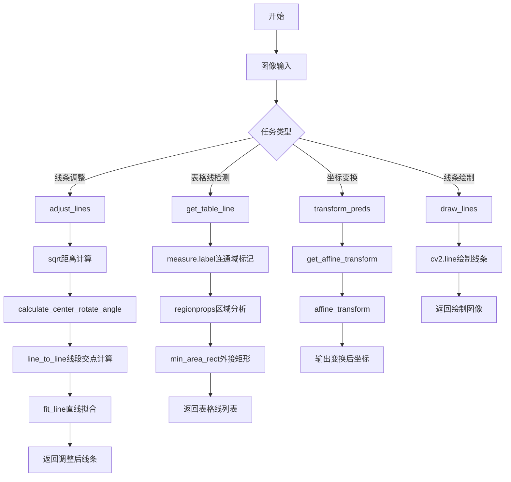
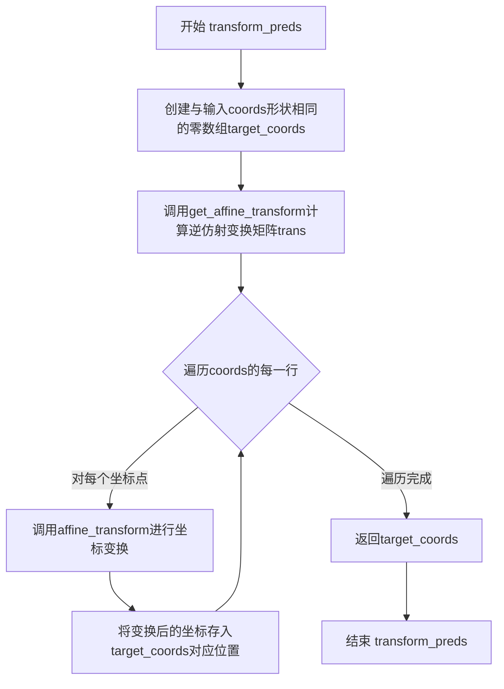
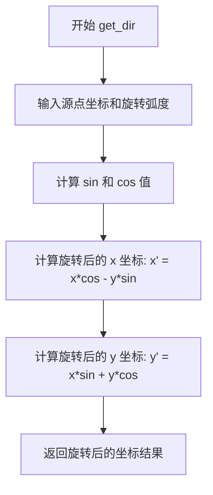
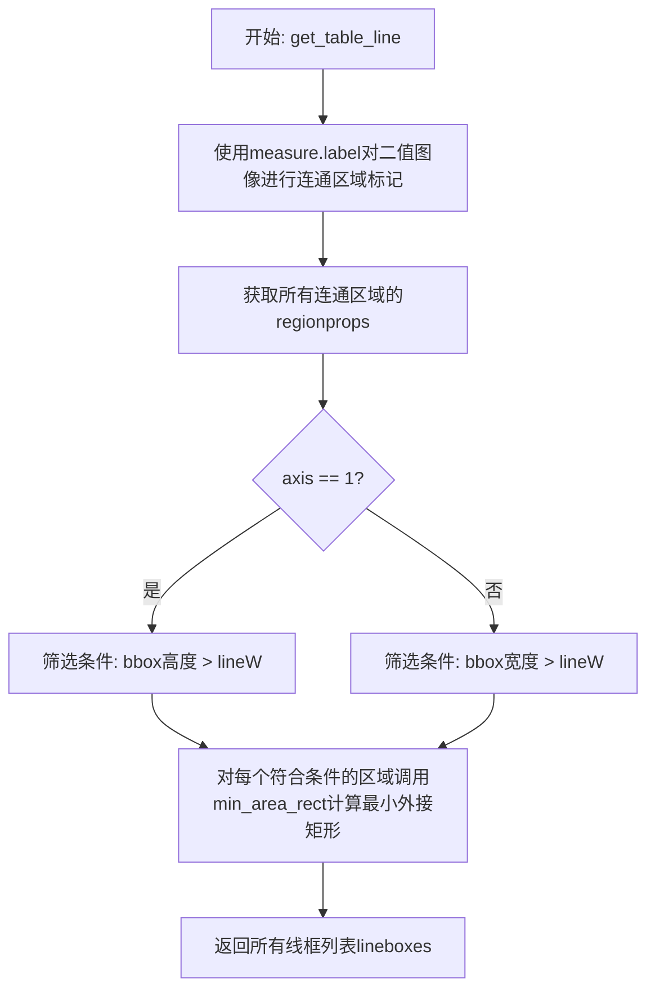
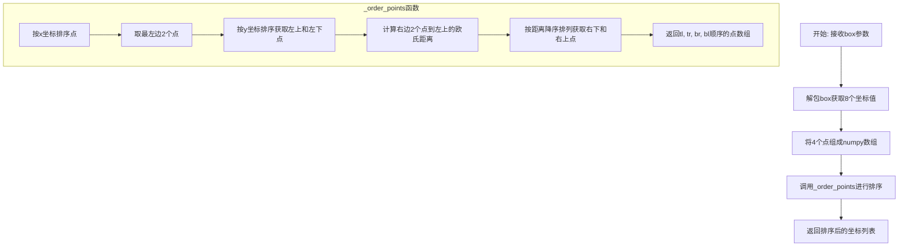
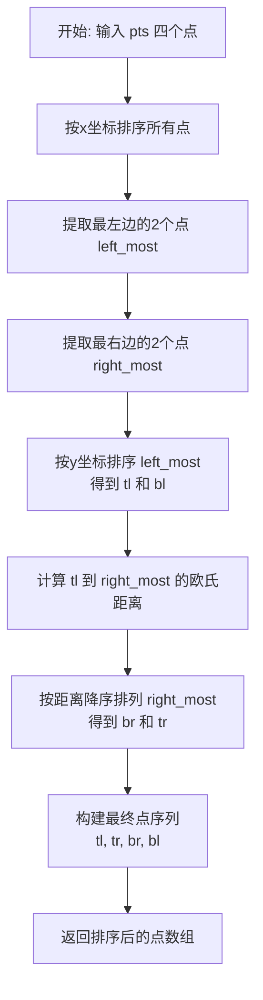
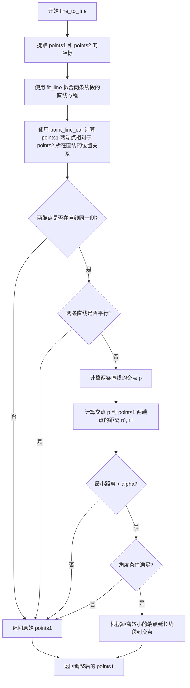
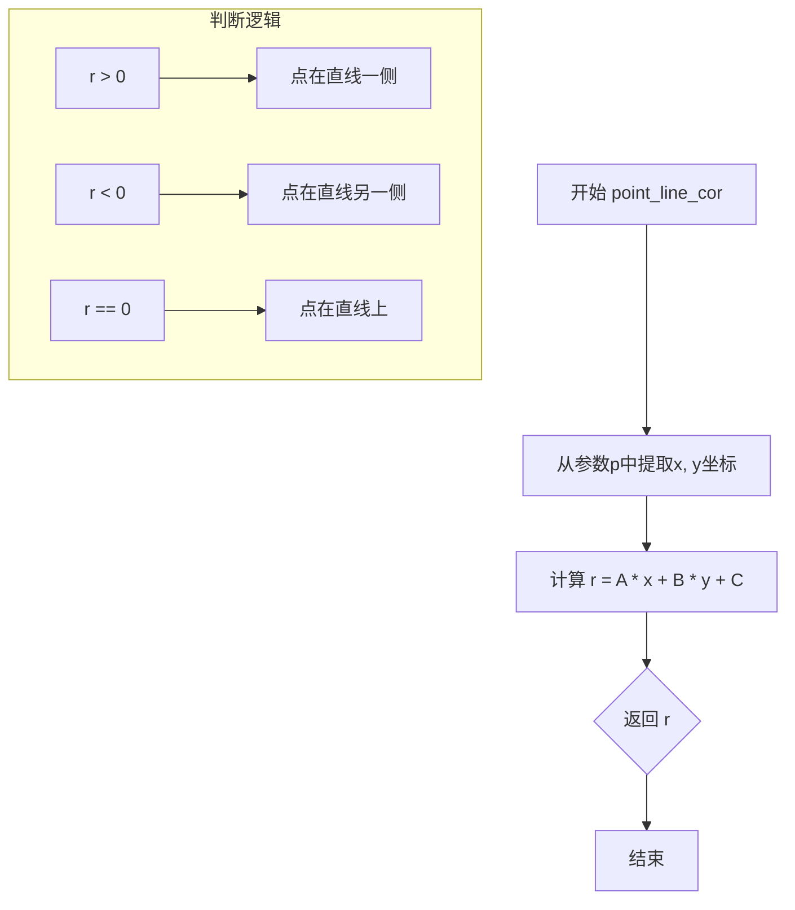
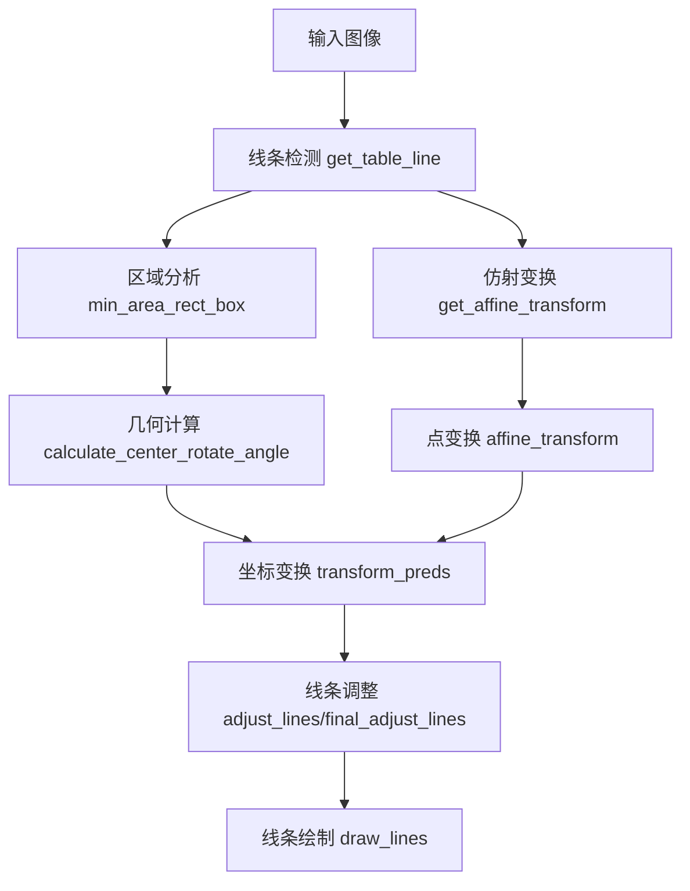

# `MinerU\mineru\model\table\rec\unet_table\utils_table_line_rec.py` 详细设计文档

该代码是一个图像处理工具库，主要用于表格文档图像的几何变换、表格线检测、线条校正和区域框选等操作。核心功能包括：仿射变换坐标转换、连通区域分析、线条检测与调整、旋转角度计算、直线拟合以及图像绘制等，常见于OCR表格识别和文档图像预处理场景。

## 整体流程



## 类结构

```
该文件为纯函数模块，无类定义
所有函数均为模块级全局函数
按功能可分为以下组：
├── 仿射变换组
│   ├── transform_preds
│   ├── get_affine_transform
│   ├── affine_transform
│   ├── get_dir
│   └── get_3rd_point
├── 表格线检测组
│   ├── get_table_line
│   ├── min_area_rect
│   ├── image_location_sort_box
│   └── min_area_rect_box
├── 几何计算组
│   ├── calculate_center_rotate_angle
│   ├── _order_points
│   └── sqrt
├── 线条调整组
│   ├── adjust_lines
│   ├── final_adjust_lines
│   └── line_to_line
├── 直线拟合组
│   ├── fit_line
│   └── point_line_cor
└── 图像绘制组
    └── draw_lines
```

## 全局变量及字段


### `skimage_version`
    
scikit-image库的版本号字符串

类型：`str`
    


### `binimg`
    
输入的二值图像数组

类型：`np.ndarray`
    


### `axis`
    
表格线检测轴向，0表示横线，1表示竖线

类型：`int`
    


### `lineW`
    
线宽阈值，用于过滤细小线条

类型：`int`
    


### `coords`
    
轮廓或区域的坐标点数组

类型：`np.ndarray`
    


### `box`
    
包含8个元素的边界框坐标列表 [x1,y1,x2,y2,x3,y3,x4,y4]

类型：`list[float]`
    


### `lines`
    
线段列表，每个元素为[x1,y1,x2,y2]格式

类型：`list[list[float]]`
    


### `rowboxes`
    
水平表格线列表，每条线包含4个坐标值

类型：`list[list[float]]`
    


### `colboxes`
    
垂直表格线列表，每条线包含4个坐标值

类型：`list[list[float]]`
    


### `im`
    
输入的图像数组

类型：`np.ndarray`
    


### `bboxes`
    
边界框列表，每个元素为[x1,y1,x2,y2]格式

类型：`list[list[float]]`
    


### `regions`
    
由skimage.measure.regionprops返回的区域对象列表

类型：`list[regionprops]`
    


    

## 全局函数及方法


### `transform_preds`

该函数用于将预测的坐标从图像空间反向映射回原始图像空间，通过计算逆仿射变换矩阵并对每个坐标点进行变换，常用于目标检测或关键点检测后处理阶段，将归一化后的坐标转换回原始图像坐标系。

参数：

- `coords`：`numpy.ndarray`，输入的坐标点数组，通常为模型输出的预测坐标
- `center`：`float` 或 `numpy.ndarray`，原始图像的中心点坐标，用于确定仿射变换的参考点
- `scale`：`float` 或 `numpy.ndarray`，原始图像的缩放比例，用于确定变换尺度
- `output_size`：`tuple` 或 `list`，模型输入的目标尺寸，通常为 (width, height) 或 (height, width)
- `rot`：`float`，旋转角度，默认为 0 度，用于处理图像旋转情况

返回值：`numpy.ndarray`，变换后的目标坐标数组，形状与输入 coords 相同

#### 流程图



#### 带注释源码

```python
def transform_preds(coords, center, scale, output_size, rot=0):
    """
    将坐标从模型输出空间反向映射回原始图像空间
    
    参数:
        coords: 输入坐标数组，形状为 (N, 2) 或类似，包含N个点的x,y坐标
        center: 原始图像的中心点坐标，用于确定仿射变换的基准点
        scale: 原始图像的缩放比例，可以是单个数值或 [scale_x, scale_y]
        output_size: 目标输出尺寸，通常为模型的输入尺寸 (width, height)
        rot: 旋转角度，默认为0度
    
    返回:
        target_coords: 变换后的坐标数组，形状与输入coords相同
    """
    # 创建一个与输入coords形状相同的零数组，用于存储变换后的坐标
    target_coords = np.zeros(coords.shape)
    
    # 获取逆仿射变换矩阵
    # inv=1 表示计算逆变换，即从输出空间映射回输入空间
    trans = get_affine_transform(center, scale, rot, output_size, inv=1)
    
    # 遍历每个坐标点进行仿射变换
    for p in range(coords.shape[0]):
        # 对每个坐标点应用仿射变换，并将结果存入target_coords
        # 只取前2个维度（x, y坐标）
        target_coords[p, 0:2] = affine_transform(coords[p, 0:2], trans)
    
    # 返回变换后的坐标数组
    return target_coords
```


### `get_affine_transform`

计算仿射变换矩阵，将图像坐标从原始尺度变换到目标尺寸。该函数通过定义三对对应点（原始图像的目标中心、旋转方向点、计算出的第三点与目标图像的对应点），利用OpenCV的`getAffineTransform`方法求解仿射变换矩阵。可选地，通过设置`inv=1`获取逆变换矩阵，用于将目标坐标映射回原始图像坐标。

参数：

- `center`：`np.ndarray` 或 `list`，输入图像中目标或关键点的中心坐标，通常为 `[x, y]` 形式
- `scale`：`float`、`np.ndarray` 或 `list`，目标的尺度或尺寸，若为单个数值则转换为等宽高的二维数组
- `rot`：`float`，旋转角度，单位为度（degrees），正值表示逆时针旋转
- `output_size`：`tuple` 或 `list`，目标输出尺寸，格式为 `[width, height]`
- `shift`：`np.ndarray`，可选，尺度归一化的偏移量，默认为 `[0, 0]`，用于调整关键点在目标框中的相对位置
- `inv`：`int`，可选，标志位，1 表示计算逆变换矩阵（从输出坐标映射回输入坐标），0 表示计算正向变换矩阵，默认为 0

返回值：`np.ndarray`，形状为 `(2, 3)` 的仿射变换矩阵，可直接用于 `cv2.warpAffine` 或 `affine_transform` 函数

#### 流程图

```mermaid
flowchart TD
    A[开始 get_affine_transform] --> B{scale是否为数组或列表}
    B -->|否| C[将scale转换为np.array [scale, scale]]
    B -->|是| D[直接使用scale]
    C --> E[提取src_w, dst_w, dst_h]
    D --> E
    E --> F[将rot度转换为弧度 rot_rad]
    F --> G[调用get_dir计算旋转后的方向向量src_dir]
    G --> H[定义目标方向向量dst_dir]
    H --> I[初始化src和dst矩阵各3个点]
    I --> J[计算src的三个关键点]
    J --> K[计算dst的三个关键点]
    K --> L{inv是否为1}
    L -->|是| M[调用cv2.getAffineTransform dst -> src]
    L -->|否| N[调用cv2.getAffineTransform src -> dst]
    M --> O[返回逆变换矩阵]
    N --> P[返回正向变换矩阵]
    O --> Q[结束]
    P --> Q
```

#### 带注释源码

```python
def get_affine_transform(
    center, scale, rot, output_size, shift=np.array([0, 0], dtype=np.float32), inv=0
):
    """
    计算仿射变换矩阵，用于图像坐标变换
    
    参数:
        center: 目标中心点坐标 [x, y]
        scale: 目标尺度，可以是单个数值或 [width, height]
        rot: 旋转角度（度）
        output_size: 输出图像尺寸 [width, height]
        shift: 归一化偏移量，用于调整关键点相对位置
        inv: 1表示计算逆变换，0表示正向变换
    
    返回:
        2x3 仿射变换矩阵
    """
    # 如果scale不是ndarray或list，则转换为等值的二维数组
    if not isinstance(scale, np.ndarray) and not isinstance(scale, list):
        scale = np.array([scale, scale], dtype=np.float32)

    scale_tmp = scale
    src_w = scale_tmp[0]  # 源宽度
    dst_w = output_size[0]  # 目标宽度
    dst_h = output_size[1]  # 目标高度

    # 将角度转换为弧度
    rot_rad = np.pi * rot / 180
    
    # 计算旋转后的方向向量（相对于中心点）
    # 初始方向为 [0, -src_w * 0.5]，逆时针旋转rot_rad角度
    src_dir = get_dir([0, src_w * -0.5], rot_rad)
    
    # 目标图像的方向向量（固定为向上方向）
    dst_dir = np.array([0, dst_w * -0.5], np.float32)

    # 初始化源和目标的三对对应点（仿射变换需要3个不共线的点）
    src = np.zeros((3, 2), dtype=np.float32)
    dst = np.zeros((3, 2), dtype=np.float32)
    
    # 第一个点：中心点 + 偏移
    src[0, :] = center + scale_tmp * shift
    # 第二个点：中心点 + 旋转方向向量 + 偏移
    src[1, :] = center + src_dir + scale_tmp * shift
    
    # 目标图像第一个点：输出图像的中心
    dst[0, :] = [dst_w * 0.5, dst_h * 0.5]
    # 目标图像第二个点：中心 + 方向向量
    dst[1, :] = np.array([dst_w * 0.5, dst_h * 0.5], np.float32) + dst_dir

    # 计算第三个点：已知两点求直角三角形的第三点
    # 使得前两点与第三点构成直角三角形，用于确定旋转角度
    src[2:, :] = get_3rd_point(src[0, :], src[1, :])
    dst[2:, :] = get_3rd_point(dst[0, :], dst[1, :])

    # 根据inv标志位决定计算正向还是逆向变换
    if inv:
        # 逆变换：从输出坐标映射回输入坐标
        trans = cv2.getAffineTransform(np.float32(dst), np.float32(src))
    else:
        # 正变换：从输入坐标映射到输出坐标
        trans = cv2.getAffineTransform(np.float32(src), np.float32(dst))

    return trans
```


### `affine_transform`

对 2D 点应用仿射变换，通过矩阵乘法将点从原始坐标空间变换到目标坐标空间。

参数：

- `pt`：`numpy.ndarray`，原始 2D 点坐标 [x, y]
- `t`：`numpy.ndarray`，2×3 的仿射变换矩阵

返回值：`numpy.ndarray`，变换后的 2D 点坐标 [x, y]

#### 流程图

```mermaid
graph TD
    A[输入: pt = [x, y], t = 2x3 变换矩阵] --> B[构造齐次坐标: new_pt = [x, y, 1.0]]
    B --> C[矩阵乘法: new_pt = dot(t, new_pt)]
    C --> D[提取前两个坐标: new_pt[:2]]
    E[输出: 变换后的2D点]
    D --> E
```

#### 带注释源码

```python
def affine_transform(pt, t):
    """
    对2D点应用仿射变换
    
    参数:
        pt: 原始2D点坐标 [x, y]
        t: 2x3 仿射变换矩阵
    
    返回:
        变换后的2D点坐标 [x, y]
    """
    # 将2D点转换为齐次坐标 [x, y, 1]
    # 齐次坐标允许使用矩阵乘法表示仿射变换
    new_pt = np.array([pt[0], pt[1], 1.0], dtype=np.float32).T
    
    # 执行矩阵乘法: 2x3 矩阵乘以 3x1 向量 = 2x1 向量
    # 这是仿射变换的核心: output = M * input
    new_pt = np.dot(t, new_pt)
    
    # 返回变换后的2D坐标 (去掉齐次坐标的第三个分量)
    return new_pt[:2]
```


### `get_dir`

根据旋转角度计算给定源点在旋转后的方向向量，主要用于仿射变换中计算旋转后的关键点坐标。

参数：

- `src_point`：`list` 或 `np.ndarray`，源点坐标 [x, y]，表示需要旋转的原始点
- `rot_rad`：`float`，旋转角度（弧度），正值为逆时针旋转

返回值：`list`，旋转后的点坐标 [x, y]

#### 流程图



#### 带注释源码

```python
def get_dir(src_point, rot_rad):
    """
    根据旋转角度计算给定源点在旋转后的方向向量
    
    参数:
        src_point: 源点坐标 [x, y]
        rot_rad: 旋转角度（弧度）
    
    返回:
        旋转后的坐标 [x', y']
    """
    # 计算旋转角度的正弦和余弦值
    sn, cs = np.sin(rot_rad), np.cos(rot_rad)

    # 初始化结果向量
    src_result = [0, 0]
    
    # 应用2D旋转公式计算旋转后的坐标
    # x' = x * cos(θ) - y * sin(θ)
    src_result[0] = src_point[0] * cs - src_point[1] * sn
    
    # y' = x * sin(θ) + y * cos(θ)
    src_result[1] = src_point[0] * sn + src_point[1] * cs

    return src_result
```


### `get_3rd_point`

该函数用于根据两个已知点计算第三个点，使得三点构成一个直角三角形的顶点。这是构建仿射变换矩阵时获取三个参考点的常用方法，常用于图像处理中的几何变换场景。

参数：

- `a`：`np.ndarray`，第一个点的二维坐标向量 (x, y)
- `b`：`np.ndarray`，第二个点的二维坐标向量 (x, y)

返回值：`np.ndarray`，计算得到的第三个点的二维坐标向量 (x, y)，数据类型为 `np.float32`

#### 流程图

```mermaid
graph TD
    A[开始: 输入点a和点b] --> B[计算方向向量 direct = a - b]
    B --> C[计算垂直向量: [-direct[1], direct[0]]]
    C --> D[计算第三个点: b + 垂直向量]
    D --> E[返回第三个点坐标]
```

#### 带注释源码

```python
def get_3rd_point(a, b):
    """
    根据两个点计算第三个点，构成直角三角形的三个顶点
    
    参数:
        a: 第一个点坐标 (x, y)
        b: 第二个点坐标 (x, y)
    
    返回:
        第三个点坐标，使得三点构成直角三角形
    """
    # 计算从点b指向点a的方向向量
    # direct 表示 a -> b 的向量
    direct = a - b
    
    # 将方向向量逆时针旋转90度
    # 旋转公式: [x, y] -> [-y, x]
    # direct[0] 为 x 分量, direct[1] 为 y 分量
    # [-direct[1], direct[0]] 即为旋转后的垂直向量
    rotated = np.array([-direct[1], direct[0]], dtype=np.float32)
    
    # 将垂直向量加到点b上，计算出第三个点
    # 这样形成的三个点: a, b, return_value 构成直角三角形
    return b + rotated
```


### `get_table_line`

该函数用于从二值图像中提取表格线（横线或竖线），通过连通区域分析和最小外接矩形计算，返回符合条件的表格线边界框列表。

参数：

- `binimg`：`numpy.ndarray`，输入的二值图像，用于检测表格线的像素图像
- `axis`：`int`，指定检测线条的方向，0表示检测水平线条（横线），1表示检测垂直线条（竖线），默认为0
- `lineW`：`int`，线条宽度阈值，用于过滤小于该宽度的连通区域，默认为10

返回值：`list`，返回由四个坐标值 `[xmin, ymin, xmax, ymax]` 组成的列表，每个元素代表一条检测到的表格线的最小外接矩形

#### 流程图



#### 带注释源码

```python
def get_table_line(binimg, axis=0, lineW=10):
    ##获取表格线
    ##axis=0 横线
    ##axis=1 竖线
    
    # 使用skimage库的label函数对二值图像进行连通区域标记
    # connectivity=2表示使用8连通区域分析
    # binimg > 0 将二值图像转换为布尔值，标记非零像素区域
    labels = measure.label(binimg > 0, connectivity=2)
    
    # 获取所有连通区域的属性信息，包括边界框、坐标等
    regions = measure.regionprops(labels)
    
    # 根据axis参数判断是检测竖线还是横线
    if axis == 1:
        # 检测竖线：筛选高度大于lineW的连通区域
        # line.bbox返回(min_row, min_col, max_row, max_col)
        # bbox[2] - bbox[0] 表示区域的高度
        lineboxes = [
            min_area_rect(line.coords)
            for line in regions
            if line.bbox[2] - line.bbox[0] > lineW
        ]
    else:
        # 检测横线：筛选宽度大于lineW的连通区域
        # bbox[3] - bbox[1] 表示区域的宽度
        lineboxes = [
            min_area_rect(line.coords)
            for line in regions
            if line.bbox[3] - line.bbox[1] > lineW
        ]
    
    # 返回计算得到的表格线外接矩形列表
    return lineboxes
```


### `min_area_rect`

该函数用于计算给定坐标点集的最小外接矩形，通过OpenCV的minAreaRect算法获取旋转矩形的四个顶点，并根据宽高比确定矩形的边界坐标，返回[xmin, ymin, xmax, ymax]格式的边界框。

参数：

- `coords`：`numpy.ndarray`，输入的坐标点集，通常为二维数组，每行包含[x, y]坐标

返回值：`list`，返回四个边界值 [xmin, ymin, xmax, ymax]，分别是外接矩形的左、右、上、下边界坐标

#### 流程图

```mermaid
flowchart TD
    A[开始: 接收coords点集] --> B[交换坐标维度: coords[:, ::-1]]
    B --> C[调用cv2.minAreaRect计算最小外接矩形]
    C --> D[获取矩形四个顶点: cv2.boxPoints]
    D --> E[reshape为8元素列表]
    E --> F[调用image_location_sort_box排序顶点]
    F --> G[解包顶点坐标: x1,y1,x2,y2,x3,y3,x4,y4]
    G --> H[调用calculate_center_rotate_angle计算角度和尺寸]
    H --> I{判断 w < h?}
    I -->|是| J[计算横向矩形边界:<br/>xmin=(x1+x2)/2<br/>xmax=(x3+x4)/2<br/>ymin=(y1+y2)/2<br/>ymax=(y3+y4)/2]
    I -->|否| K[计算纵向矩形边界:<br/>xmin=(x1+x4)/2<br/>xmax=(x2+x3)/2<br/>ymin=(y1+y4)/2<br/>ymax=(y2+y3)/2]
    J --> L[返回边界列表: [xmin, ymin, xmax, ymax]]
    K --> L
```

#### 带注释源码

```python
def min_area_rect(coords):
    """
    多边形外接矩形
    
    该函数计算给定坐标点集的最小外接矩形（Minimum Area Rectangle），
    并返回矩形边界坐标。
    
    Args:
        coords: numpy.ndarray，输入的点坐标集，形状为(n, 2)，每行是[x, y]坐标
        
    Returns:
        list: [xmin, ymin, xmax, ymax] 四个边界值
    """
    # 步骤1: 交换坐标维度
    # OpenCV的minAreaRect要求输入格式为(y, x)，即先列后行
    # coords[:, ::-1] 将输入从(x, y)转换为(y, x)格式
    rect = cv2.minAreaRect(coords[:, ::-1])
    
    # 步骤2: 获取旋转矩形的四个顶点
    # cv2.minAreaRect返回(center(x,y), (width, height), angle)
    # cv2.boxPoints将上述表示转换为四个顶点坐标
    box = cv2.boxPoints(rect)
    
    # 步骤3: 将顶点 reshape 为 8 元素的一维列表
    # box 原来是 (4, 2) 的数组，reshape 为 (8,) 即 [x1,y1,x2,y2,x3,y3,x4,y4]
    box = box.reshape((8,)).tolist()
    
    # 步骤4: 对顶点进行位置排序
    # 确保顶点按照左上、右上、右下、左下的顺序排列
    # 这是一个关键步骤，后续计算边界时依赖于正确的顶点顺序
    box = image_location_sort_box(box)
    
    # 步骤5: 解包排序后的四个顶点坐标
    x1, y1, x2, y2, x3, y3, x4, y4 = box
    
    # 步骤6: 计算矩形的中心点、旋转角度、宽度和高度
    # 这里实际计算了degree（角度）、w（宽）、h（高）、cx（中心x）、cy（中心y）
    # 注意: 原代码中degree变量未使用，可能是有意为之或遗留代码
    degree, w, h, cx, cy = calculate_center_rotate_angle(box)
    
    # 步骤7: 根据宽高比确定边界
    # 如果宽度小于高度，说明是横向矩形
    # 否则是纵向矩形，不同方向使用不同的顶点对来计算边界
    if w < h:
        # 横向矩形边界计算
        # 取左右两侧顶点的中点作为x边界
        xmin = (x1 + x2) / 2  # 左边界：取左上+右上中点
        xmax = (x3 + x4) / 2  # 右边界：取右下+左下中点
        # 取上下两侧顶点的中点作为y边界
        ymin = (y1 + y2) / 2  # 上边界：取左上+右上中点
        ymax = (y3 + y4) / 2  # 下边界：取右下+左下中点
    else:
        # 纵向矩形边界计算
        # 当矩形是纵向时，需要使用不同的顶点对
        xmin = (x1 + x4) / 2  # 左边界：取左上+左下中点
        xmax = (x2 + x3) / 2  # 右边界：取右上+右下中点
        ymin = (y1 + y4) / 2  # 上边界：取左上+左下中点
        ymax = (y2 + y3) / 2  # 下边界：取右上+右下中点
    
    # 步骤8: 返回边界列表 [xmin, ymin, xmax, ymax]
    # 原代码中有多行注释掉的代码，可能是用于调试或返回更多参数
    # degree,w,h,cx,cy = solve(box)
    # x1,y1,x2,y2,x3,y3,x4,y4 = box
    # return {'degree':degree,'w':w,'h':h,'cx':cx,'cy':cy}
    return [xmin, ymin, xmax, ymax]
```


### `image_location_sort_box`

该函数用于对图像中四边形的四个顶点进行排序，将任意顺序的四个点按照左上、右上、右下、左下的顺序排列，便于后续的图像处理操作（如透视变换）。

参数：

- `box`：`list` 或 `tuple`，包含8个元素的无序四边形顶点坐标，格式为 `[x1, y1, x2, y2, x3, y3, x4, y4]`

返回值：`list`，返回排序后的四个顶点坐标，格式为 `[x1, y1, x2, y2, x3, y3, x4, y4]`，其中 (x1,y1) 为左上角点，(x2,y2) 为右上角点，(x3,y3) 为右下角点，(x4,y4) 为左下角点

#### 流程图



#### 带注释源码

```python
def image_location_sort_box(box):
    """
    对四边形顶点进行排序
    
    该函数将任意顺序的四边形四个顶点按照顺时针顺序排列：
    左上角 -> 右上角 -> 右下角 -> 左下角
    
    参数:
        box: 包含8个元素的列表 [x1, y1, x2, y2, x3, y3, x4, y4]
             代表四边形的四个顶点坐标
    
    返回:
        list: 排序后的四个顶点坐标 [x1, y1, x2, y2, x3, y3, x4, y4]
              按左上、右上、右下、左下顺序排列
    """
    # 解包获取8个坐标值
    x1, y1, x2, y2, x3, y3, x4, y4 = box[:8]
    
    # 将四个点组成元组列表
    pts = (x1, y1), (x2, y2), (x3, y3), (x4, y4)
    
    # 转换为numpy数组，指定float32类型以保证精度
    pts = np.array(pts, dtype="float32")
    
    # 调用内部函数对点进行排序
    # _order_points函数将点排序为: (左上, 右上, 右下, 左下)
    (x1, y1), (x2, y2), (x3, y3), (x4, y4) = _order_points(pts)
    
    # 返回排序后的坐标列表
    return [x1, y1, x2, y2, x3, y3, x4, y4]
```

#### 依赖函数 `_order_points` 源码

```python
def _order_points(pts):
    """
    对四个点进行排序，返回左上、右上、右下、左下的顺序
    
    排序逻辑:
    1. 先按x坐标排序，取最左边两个点和最右边两个点
    2. 对左边两个点按y坐标排序，得到左上角和左下角
    3. 计算右边两个点到左上角的欧氏距离
    4. 距离大的为右下角，距离小的为右上角
    
    参数:
        pts: numpy数组，形状为(4,2)，包含四个点的坐标
    
    返回:
        numpy数组: 形状为(4,2)，按顺序排列的四个点
    """
    # 按x坐标对所有点进行排序
    x_sorted = pts[np.argsort(pts[:, 0]), :]

    # 取出最左边的两个点
    left_most = x_sorted[:2, :]
    # 取出最右边的两个点
    right_most = x_sorted[2:, :]
    
    # 对左边的两个点按y坐标排序，得到左上(tl)和左下(bl)
    left_most = left_most[np.argsort(left_most[:, 1]), :]
    (tl, bl) = left_most

    # 计算左上角点到右边两个点的欧氏距离
    distance = dist.cdist(tl[np.newaxis], right_most, "euclidean")[0]
    # 按距离降序排列，距离大的是右下角(br)，小的是右上角(tr)
    (br, tr) = right_most[np.argsort(distance)[::-1], :]

    # 返回按顺时针顺序排列的点: 左上、右上、右下、左下
    return np.array([tl, tr, br, bl], dtype="float32")
```

#### 关键组件信息

| 组件名称 | 说明 |
|---------|------|
| `image_location_sort_box` | 主函数，对四边形顶点进行排序 |
| `_order_points` | 内部函数，实现具体的排序逻辑 |
| `scipy.spatial.distance.cdist` | 用于计算欧氏距离的外部依赖函数 |

#### 潜在技术债务与优化空间

1. **函数职责单一**：当前函数依赖外部 `_order_points` 函数，建议将内部逻辑内联或明确文档说明依赖关系
2. **缺少输入验证**：未对输入的 box 参数进行有效性检查（如点数量不足、坐标类型错误等）
3. **硬编码排序顺序**：函数文档中描述的顺序（左上→右上→右下→左下）是基于特定应用场景的假设，缺乏灵活性
4. **文档注释不完整**：缺少对函数作者、来源版权等信息的说明（代码中提到CSDN但未明确）
5. **数值精度**：使用 `float32` 可能在大尺寸图像坐标计算中引入精度问题，建议根据实际图像尺寸评估


### `calculate_center_rotate_angle`

该函数用于计算旋转矩形的中心点坐标(cx, cy)、宽度(w)、高度(h)以及旋转角度(angle)。它通过分析矩形的四个角点坐标，结合几何变换公式，推导出矩形的倾斜角度和尺寸信息，常用于图像处理中的表格线、区域检测等场景。

参数：

- `box`：`list` 或 `numpy.ndarray`，包含8个元素，代表矩形的4个角点坐标，顺序为 [x1, y1, x2, y2, x3, y3, x4, y4]

返回值：`tuple`，包含四个浮点数 (angle, w, h, cx, cy)，分别是旋转角度、宽度、高度和中心点坐标

#### 流程图

```mermaid
flowchart TD
    A[开始: 接收box参数] --> B[解包8个坐标点<br/>x1, y1, x2, y2, x3, y3, x4, y4]
    B --> C[计算中心点cx, cy<br/>cx = (x1+x2+x3+x4)/4<br/>cy = (y1+y2+y3+y4)/4]
    C --> D[计算宽度w<br/>w = (边12长度 + 边34长度)/2]
    D --> E[计算高度h<br/>h = (边23长度 + 边14长度)/2]
    E --> F[计算sinA值<br/>sinA = 2*(h*(x1-cx) - w*(y1-cy))/(h²+w²)]
    F --> G[计算旋转角度<br/>angle = arcsin(sinA)]
    G --> H[返回angle, w, h, cx, cy]
```

#### 带注释源码

```python
def calculate_center_rotate_angle(box):
    """
    绕 cx,cy点 w,h 旋转 angle 的坐标,能一定程度缓解图片的内部倾斜，但是还是依赖模型稳妥
    旋转矩阵的坐标变换公式推导：
    x = cx-w/2
    y = cy-h/2
    x1-cx = -w/2*cos(angle) + h/2*sin(angle)
    y1 -cy = -w/2*sin(angle) - h/2*cos(angle)

    通过数学推导可得：
    h(x1-cx) = -wh/2*cos(angle) + hh/2*sin(angle)
    w(y1 -cy) = -ww/2*sin(angle) - hw/2*cos(angle)
    (hh+ww)/2 * sin(angle) = h(x1-cx) - w(y1 -cy)
    """
    # 从输入的box中解包出8个坐标点（4个角点的x,y坐标）
    x1, y1, x2, y2, x3, y3, x4, y4 = box[:8]
    
    # 计算矩形的中心点坐标（四个角点的平均值）
    cx = (x1 + x3 + x2 + x4) / 4.0
    cy = (y1 + y3 + y4 + y2) / 4.0
    
    # 计算矩形的宽度w：取两对平行边长度的平均值
    # 边1-2的长度（点1到点2的欧氏距离）+ 边3-4的长度（点3到点4的欧氏距离），除以2
    w = (
        np.sqrt((x2 - x1) ** 2 + (y2 - y1) ** 2)
        + np.sqrt((x3 - x4) ** 2 + (y3 - y4) ** 2)
    ) / 2
    
    # 计算矩形的高度h：取两对平行边长度的平均值
    # 边2-3的长度 + 边1-4的长度，除以2
    h = (
        np.sqrt((x2 - x3) ** 2 + (y2 - y3) ** 2)
        + np.sqrt((x1 - x4) ** 2 + (y1 - y4) ** 2)
    ) / 2
    
    # 根据推导的公式计算sinA值，再通过arcsin得到旋转角度
    # sinA = 2 * (h*(x1-cx) - w*(y1-cy)) / (h^2 + w^2)
    # 添加1e-10防止除零错误
    sinA = (h * (x1 - cx) - w * (y1 - cy)) * 1.0 / (h * h + w * w + 1e-10) * 2
    
    # 使用arcsin函数将sinA转换为角度（弧度制）
    angle = np.arcsin(sinA)
    
    # 返回旋转角度、宽度、高度和中心点坐标
    return angle, w, h, cx, cy
```


### `_order_points`

该函数用于对输入的四个角点进行排序，返回按顺时针方向排列的点序列（左上、右上、右下、左下），常用于图像处理中的边界框角点排序场景。

参数：

-  `pts`：`np.ndarray`，形状为 (4, 2) 的点坐标数组，包含四个二维坐标点

返回值：`np.ndarray`，按照 `[左上, 右上, 右下, 左下]` 顺序排列的 float32 类型点数组

#### 流程图



#### 带注释源码

```python
def _order_points(pts):
    """
    根据x坐标对点进行排序
    
    本项目中是为了排序后得到[(xmin,ymin),(xmax,ymin),(xmax,ymax),(xmin,ymax)]
    作者：Tong_T
    来源：CSDN
    原文：https://blog.csdn.net/Tong_T/article/details/81907132
    版权声明：本文为博主原创文章，附上博文链接！
    """
    # 第一步：按x坐标对所有点进行排序
    x_sorted = pts[np.argsort(pts[:, 0]), :]

    # 第二步：分离最左边和最右边的两个点
    left_most = x_sorted[:2, :]    # x坐标最小的2个点
    right_most = x_sorted[2:, :]   # x坐标最大的2个点

    # 第三步：对最左边的两个点按y坐标排序，确定左上(tl)和左下(bl)
    left_most = left_most[np.argsort(left_most[:, 1]), :]
    (tl, bl) = left_most  # tl = top-left, bl = bottom-left

    # 第四步：计算左上角点 tl 到右边两个点的欧氏距离
    # 使用 scipy.spatial.distance.cdist 计算距离
    distance = dist.cdist(tl[np.newaxis], right_most, "euclidean")[0]
    
    # 第五步：按距离降序排列，得到右下角(br)和右上角(tr)
    # 距离最大的点是右下角，次大的是右上角
    (br, tr) = right_most[np.argsort(distance)[::-1], :]

    # 第六步：按顺时针顺序组装四个点并返回
    # 顺序为：左上 -> 右上 -> 右下 -> 左下
    return np.array([tl, tr, br, bl], dtype="float32")
```


### `sqrt`

计算两个二维坐标点之间的欧氏距离。

参数：

- `p1`：`List[float]` 或 `Tuple[float, float]`，第一个点的坐标 (x, y)
- `p2`：`List[float]` 或 `Tuple[float, float]`，第二个点的坐标 (x, y)

返回值：`float`，两点之间的欧氏距离

#### 流程图

```mermaid
graph TD
    A[开始] --> B[输入点 p1, p2]
    B --> C[计算 x 方向差值: p1[0] - p2[0]]
    B --> D[计算 y 方向差值: p1[1] - p2[1]]
    C --> E[计算 x 方向差的平方: (p1[0] - p2[0]) ** 2]
    D --> F[计算 y 方向差的平方: (p1[1] - p2[1]) ** 2]
    E --> G[平方和: (p1[0] - p2[0]) ** 2 + (p1[1] - p2[1]) ** 2]
    F --> G
    G --> H[开平方: np.sqrt]
    H --> I[返回距离值]
    I --> J[结束]
```

#### 带注释源码

```python
def sqrt(p1, p2):
    """
    计算两个二维坐标点之间的欧氏距离
    
    参数:
        p1: 第一个点的坐标 (x, y)
        p2: 第二个点的坐标 (x, y)
    
    返回:
        float: 两点之间的欧氏距离
    """
    # 使用欧氏距离公式: sqrt((x1-x2)^2 + (y1-y2)^2)
    return np.sqrt((p1[0] - p2[0]) ** 2 + (p1[1] - p2[1]) ** 2)
```


### `adjust_lines`

该函数用于调整表格中的线条，通过计算线条端点之间的距离和角度，找出满足距离阈值（alph）和角度阈值（angle）条件的新连接线，用于修复表格线条的不连续或断裂问题。

参数：

- `lines`：`list`，输入的线条列表，每条线由4个坐标(x1, y1, x2, y2)表示
- `alph`：`float`，距离阈值，默认值为50，用于控制线条端点连接的最大距离
- `angle`：`float`，角度阈值，默认值为50（度），用于控制线条连接的最大角度

返回值：`list`，返回新生成的线条列表，包含满足距离和角度条件的连接线

#### 流程图

```mermaid
flowchart TD
    A[开始 adjust_lines] --> B[获取线条数量 lines_n<br/>初始化空列表 new_lines]
    B --> C[外层循环 i = 0 到 lines_n-1]
    C --> D[取出第i条线 x1,y1,x2,y2<br/>计算中点 cx1, cy1]
    D --> E[内层循环 j = 0 到 lines_n-1]
    E --> F{判断 i != j}
    F -->|否| G[继续下一个j]
    F -->|是| H[取出第j条线 x3,y3,x4,y4<br/>计算中点 cx2, cy2]
    H --> I{判断投影重叠<br/>x3<cx1<x4 or y3<cy1<y4<br/>or x1<cx2<x2 or y1<cy2<y2}
    I -->|重叠| G
    I -->|不重叠| J[计算端点组合1: (x1,y1)-(x3,y3)<br/>距离r, 角度a]
    J --> K{r < alph 且 a < angle?}
    K -->|是| L[添加连接线 (x1,y1,x3,y3) 到 new_lines]
    K -->|否| M[计算端点组合2: (x1,y1)-(x4,y4)]
    M --> N{r < alph 且 a < angle?}
    N -->|是| O[添加连接线 (x1,y1,x4,y4) 到 new_lines]
    N -->|否| P[计算端点组合3: (x2,y2)-(x3,y3)]
    P --> Q{r < alph 且 a < angle?}
    Q -->|是| R[添加连接线 (x2,y2,x3,y3) 到 new_lines]
    Q -->|否| S[计算端点组合4: (x2,y2)-(x4,y4)]
    S --> T{r < alph 且 a < angle?}
    T -->|是| U[添加连接线 (x2,y2,x4,y4) 到 new_lines]
    T -->|否| G
    L --> G
    O --> G
    R --> G
    U --> V{内循环结束?}
    V -->|否| E
    V -->|是| W{外循环结束?}
    W -->|否| C
    W -->|是| X[返回 new_lines]
    G --> V
```

#### 带注释源码

```python
def adjust_lines(lines, alph=50, angle=50):
    """
    调整线条连接
    
    该函数通过比较线条端点之间的距离和角度，
    找出满足条件的新连接线，用于修复断裂的表格线条。
    
    参数:
        lines: 输入的线条列表，每条线为 (x1, y1, x2, y2) 格式
        alph: 距离阈值，控制最大连接距离
        angle: 角度阈值，控制最大连接角度（度）
    
    返回:
        new_lines: 满足条件的新连接线列表
    """
    # 获取输入线条的数量
    lines_n = len(lines)
    # 初始化存储新线条的列表
    new_lines = []
    
    # 外层循环：遍历每一条线作为参考线
    for i in range(lines_n):
        # 取出当前线条的端点坐标
        x1, y1, x2, y2 = lines[i]
        # 计算当前线条的中心点坐标
        cx1, cy1 = (x1 + x2) / 2, (y1 + y2) / 2
        
        # 内层循环：遍历其他线条进行比较
        for j in range(lines_n):
            # 跳过与自身比较
            if i != j:
                # 取出另一条线条的端点坐标
                x3, y3, x4, y4 = lines[j]
                # 计算另一条线条的中心点坐标
                cx2, cy2 = (x3 + x4) / 2, (y3 + y4) / 2
                
                # 判断两条线在投影方向上是否重叠
                # 条件：线条i的中点是否在线条j的范围内，或反之
                if (x3 < cx1 < x4 or y3 < cy1 < y4) or (
                    x1 < cx2 < x2 or y1 < cy2 < y2
                ):
                    # 如果投影重叠，则跳过此次比较，继续检查下一条线
                    continue
                else:
                    # ========== 组合1: 线条i的起点(x1,y1) 到 线条j的起点(x3,y3) ==========
                    # 计算两点之间的欧氏距离
                    r = sqrt((x1, y1), (x3, y3))
                    # 计算斜率k（取绝对值）
                    k = abs((y3 - y1) / (x3 - x1 + 1e-10))
                    # 将斜率转换为角度（度）
                    a = math.atan(k) * 180 / math.pi
                    # 如果距离和角度都满足阈值条件，则添加新连接线
                    if r < alph and a < angle:
                        new_lines.append((x1, y1, x3, y3))

                    # ========== 组合2: 线条i的起点(x1,y1) 到 线条j的终点(x4,y4) ==========
                    r = sqrt((x1, y1), (x4, y4))
                    k = abs((y4 - y1) / (x4 - x1 + 1e-10))
                    a = math.atan(k) * 180 / math.pi
                    if r < alph and a < angle:
                        new_lines.append((x1, y1, x4, y4))

                    # ========== 组合3: 线条i的终点(x2,y2) 到 线条j的起点(x3,y3) ==========
                    r = sqrt((x2, y2), (x3, y3))
                    k = abs((y3 - y2) / (x3 - x2 + 1e-10))
                    a = math.atan(k) * 180 / math.pi
                    if r < alph and a < angle:
                        new_lines.append((x2, y2, x3, y3))
                    
                    # ========== 组合4: 线条i的终点(x2,y2) 到 线条j的终点(x4,y4) ==========
                    r = sqrt((x2, y2), (x4, y4))
                    k = abs((y4 - y2) / (x4 - x2 + 1e-10))
                    a = math.atan(k) * 180 / math.pi
                    if r < alph and a < angle:
                        new_lines.append((x2, y2, x4, y4))
    
    # 返回满足条件的新线条列表
    return new_lines
```


### `final_adjust_lines`

该函数用于对表格的行线段和列线段进行最终的调整，通过迭代处理每一对行线段和列线段，使它们在指定的距离和角度阈值下进行对齐或延伸，以确保表格线条的准确性。

参数：

- `rowboxes`：`List`，表示行线段的列表，每个元素通常为包含线段坐标的列表或元组（如 [x1, y1, x2, y2]）
- `colboxes`：`List`，表示列线段的列表，每个元素通常为包含线段坐标的列表或元组（如 [x1, y1, x2, y2]）

返回值：`Tuple[List, List]`，返回调整后的行线段列表和列线段列表

#### 流程图

```mermaid
flowchart TD
    A[开始 final_adjust_lines] --> B[获取 rowboxes 数量 nrow]
    B --> C[获取 colboxes 数量 ncol]
    C --> D[外层循环: 遍历每一行 i from 0 to nrow-1]
    D --> E[内层循环: 遍历每一列 j from 0 to ncol-1]
    E --> F[调用 line_to_line 调整 rowboxes[i]]
    F --> G[使用 colboxes[j] 作为参考线段]
    G --> H[alpha=20, angle=30]
    H --> I[更新 rowboxes[i]]
    I --> J[调用 line_to_line 调整 colboxes[j]]
    J --> K[使用更新后的 rowboxes[i] 作为参考]
    K --> L[alpha=20, angle=30]
    L --> M[更新 colboxes[j]]
    M --> N[内循环结束?]
    N -->|否| E
    N -->|是| O[外循环结束?]
    O -->|否| D
    O -->|是| P[返回 rowboxes, colboxes]
    P --> Q[结束]
```

#### 带注释源码

```python
def final_adjust_lines(rowboxes, colboxes):
    """
    对表格的行线段和列线段进行最终调整
    
    该函数通过双重循环遍历所有行线段和列线段的组合，
    对每一对线段调用 line_to_line 进行距离和角度调整，
    以确保表格线条在交叉处能够正确对齐或延伸。
    
    参数:
        rowboxes: 行线段列表，每个元素为 [x1, y1, x2, y2] 格式的坐标
        colboxes: 列线段列表，每个元素为 [x1, y1, x2, y2] 格式的坐标
    
    返回:
        tuple: (调整后的rowboxes, 调整后的colboxes)
    """
    # 获取行线段和列线段的数量
    nrow = len(rowboxes)
    ncol = len(colboxes)
    
    # 双重循环遍历每一对行线段和列线段
    for i in range(nrow):
        for j in range(ncol):
            # 使用 line_to_line 函数调整行线段
            # 参数 alpha=20 表示距离阈值（小于此距离才进行延伸）
            # 参数 angle=30 表示角度阈值（角度小于此值才进行延伸）
            rowboxes[i] = line_to_line(rowboxes[i], colboxes[j], alpha=20, angle=30)
            
            # 使用 line_to_line 函数调整列线段
            # 使用更新后的 rowboxes[i] 作为参考
            colboxes[j] = line_to_line(colboxes[j], rowboxes[i], alpha=20, angle=30)
    
    # 返回调整后的行线段和列线段
    return rowboxes, colboxes
```


### `draw_lines`

该函数用于在图像上绘制表格线条，接收输入图像和边界框列表，遍历每个边界框提取线条坐标，通过 OpenCV 的 line 方法在图像副本上绘制指定颜色的线条，最终返回绘制了线条的图像副本。

参数：

- `im`：`numpy.ndarray`，输入图像，用于确定图像尺寸和作为绘制线条的底图
- `bboxes`：`list`，边界框列表，每个元素为包含4个坐标值的列表或元组 `[x1, y1, x2, y2]`，表示线条的起点和终点
- `color`：`tuple`，线条颜色，默认为 `(0, 0, 0)` 黑色，格式为 BGR
- `lineW`：`int`，线条宽度，默认为 3

返回值：`numpy.ndarray`，返回绘制了线条后的图像副本

#### 流程图

```mermaid
flowchart TD
    A[开始 draw_lines] --> B[复制输入图像 im 到 tmp]
    B --> C[设置颜色 c = color]
    C --> D[获取图像尺寸 h, w]
    D --> E{遍历 bboxes 中的每个 box}
    E -->|是| F[提取 box[:4] 得到 x1, y1, x2, y2]
    F --> G[使用 cv2.line 在 tmp 上绘制线条]
    G --> H{是否还有下一个 box}
    H -->|是| E
    H -->|否| I[返回 tmp]
    I --> J[结束]
```

#### 带注释源码

```python
def draw_lines(im, bboxes, color=(0, 0, 0), lineW=3):
    """
    在图像上绘制线条
    boxes: bounding boxes，边界框列表
    """
    # 复制输入图像，避免修改原始图像
    tmp = np.copy(im)
    # 设置线条颜色，默认为黑色 (0, 0, 0)
    c = color
    # 获取图像的高度和宽度
    h, w = im.shape[:2]

    # 遍历每个边界框
    for box in bboxes:
        # 提取边界框的前4个值：x1, y1, x2, y2
        x1, y1, x2, y2 = box[:4]
        # 使用 OpenCV 的 line 方法绘制线条
        # 参数：图像，起始点，结束点，颜色，线宽，线型
        cv2.line(
            tmp, 
            (int(x1), int(y1)),  # 起点坐标，转换为整数
            (int(x2), int(y2)),  # 终点坐标，转换为整数
            c,                   # 线条颜色
            lineW,               # 线条宽度
            lineType=cv2.LINE_AA # 抗锯齿线型
        )

    # 返回绘制了线条的图像副本
    return tmp
```


### `line_to_line`

该函数用于计算两条线段之间的距离，并根据给定的阈值（alpha 和 angle）判断是否需要将一条线段延长到与另一条线段的交点位置，主要用于表格线条的调整和对齐。

参数：

- `points1`：`numpy.ndarray` 或 `list`，第一条线段的端点坐标，格式为 `[x1, y1, x2, y2]`
- `points2`：`numpy.ndarray` 或 `list`，第二条线段的端点坐标，格式为 `[ox1, oy1, ox2, oy2]`
- `alpha`：`float`，默认为 10，表示判断交点与线段端点距离的阈值
- `angle`：`float`，默认为 30，表示判断线段角度的阈值（度）

返回值：`numpy.ndarray`，返回调整后的第一条线段端点坐标，格式为 `[x1, y1, x2, y2]`（可能已被延长）

#### 流程图



#### 带注释源码

```python
def line_to_line(points1, points2, alpha=10, angle=30):
    """
    线段之间的距离
    """
    # 提取第一条线段的端点坐标
    x1, y1, x2, y2 = points1
    # 提取第二条线段的端点坐标
    ox1, oy1, ox2, oy2 = points2
    
    # 将第一条线段端点转换为 numpy 数组
    xy = np.array([(x1, y1), (x2, y2)], dtype="float32")
    # 拟合第一条线段的直线方程，得到一般式系数 A1, B1, C1
    A1, B1, C1 = fit_line(xy)
    
    # 将第二条线段端点转换为 numpy 数组
    oxy = np.array([(ox1, oy1), (ox2, oy2)], dtype="float32")
    # 拟合第二条线段的直线方程，得到一般式系数 A2, B2, C2
    A2, B2, C2 = fit_line(oxy)
    
    # 计算第一个端点 (x1, y1) 相对于第二条直线 (A2, B2, C2) 的位置关系
    flag1 = point_line_cor(np.array([x1, y1], dtype="float32"), A2, B2, C2)
    # 计算第二个端点 (x2, y2) 相对于第二条直线 (A2, B2, C2) 的位置关系
    flag2 = point_line_cor(np.array([x2, y2], dtype="float32"), A2, B2, C2)

    # 判断条件：两个端点都在第二条直线的同一侧（都为正或都为负）
    # 表示第一条线段和第二条线段可能是横线与竖线的关系
    if (flag1 > 0 and flag2 > 0) or (flag1 < 0 and flag2 < 0):
        # 判断两条直线是否平行（通过检查系数行列式是否为 0）
        if (A1 * B2 - A2 * B1) != 0:
            # 计算两条直线的交点坐标
            x = (B1 * C2 - B2 * C1) / (A1 * B2 - A2 * B1)
            y = (A2 * C1 - A1 * C2) / (A1 * B2 - A2 * B1)
            
            # 交点坐标
            p = (x, y)
            
            # 计算交点到线段两个端点的欧氏距离
            r0 = sqrt(p, (x1, y1))
            r1 = sqrt(p, (x2, y2))

            # 如果交点到线段最近端点的距离小于阈值 alpha，则延长线段到交点
            if min(r0, r1) < alpha:
                # 如果 r0 较小（靠近第一个端点），则从第一个端点延长到交点
                if r0 < r1:
                    # 计算线段与水平线的夹角
                    k = abs((y2 - p[1]) / (x2 - p[0] + 1e-10))
                    a = math.atan(k) * 180 / math.pi
                    # 判断角度是否满足条件（小于 angle 或接近 90 度）
                    if a < angle or abs(90 - a) < angle:
                        # 延长线段到交点
                        points1 = np.array([p[0], p[1], x2, y2], dtype="float32")
                else:
                    # 如果 r1 较小（靠近第二个端点），则从第二个端点延长到交点
                    k = abs((y1 - p[1]) / (x1 - p[0] + 1e-10))
                    a = math.atan(k) * 180 / math.pi
                    if a < angle or abs(90 - a) < angle:
                        points1 = np.array([x1, y1, p[0], p[1]], dtype="float32")
    
    # 返回可能调整后的线段坐标
    return points1
```


### `min_area_rect_box`

该函数用于从图像区域（regionprops）中提取符合条件的外接矩形框，通过面积阈值和尺寸过滤，筛选出符合条件的矩形区域列表。主要应用于表格识别场景中单元格的检测与筛选。

参数：

- `regions`：`List[region]`（来自 skimage.measure.regionprops 的区域对象列表），需要进行矩形提取的连通区域列表
- `flag`：`bool`，默认为 `True`，保留参数（代码中未实际使用）
- `W`：`int`，默认为 `0`，参考图像宽度，用于面积过滤计算
- `H`：`int`，默认为 `0`，参考图像高度，用于面积过滤计算
- `filtersmall`：`bool`，默认为 `False`，是否过滤过小的矩形区域
- `adjust_box`：`bool`，默认为 `False`，保留参数（代码中未实际使用）

返回值：`List[List[float]]`，返回符合条件的矩形框列表，每个矩形由 8 个浮点数表示（x1, y1, x2, y2, x3, y3, x4, y4）

#### 流程图

```mermaid
flowchart TD
    A[开始 min_area_rect_box] --> B[初始化空列表 boxes]
    B --> C[遍历 regions 中的每个 region]
    C --> D{skimage 版本 >= 0.26.0?}
    D -->|是| E[使用 region.area_bbox]
    D -->|否| F[使用 region.bbox_area]
    E --> G{region_bbox_area > H*W*3/4?}
    F --> G
    G -->|是| H[跳过当前 region，继续下一个]
    G -->|否| I[计算最小外接矩形 cv2.minAreaRect]
    I --> J[获取矩形四个角点 cv2.boxPoints]
    J --> K[角点排序 image_location_sort_box]
    K --> L[计算旋转角度和尺寸 calculate_center_rotate_angle]
    L --> M{w*h < 0.5*W*H?}
    M -->|否| H
    M -->|是| N{filtersmall 为 True 且 w<15 或 h<15?}
    N -->|是| H
    N -->|否| O[将矩形 [x1,y1,x2,y2,x3,y3,x4,y4] 加入 boxes]
    O --> P{还有下一个 region?}
    P -->|是| C
    P -->|否| Q[返回 boxes 列表]
```

#### 带注释源码

```python
def min_area_rect_box(
    regions, flag=True, W=0, H=0, filtersmall=False, adjust_box=False
):
    """
    多边形外接矩形
    
    参数:
        regions: 连通区域列表（来自 skimage.measure.regionprops）
        flag: 保留参数，未使用
        W: 参考图像宽度
        H: 参考图像高度
        filtersmall: 是否过滤过小的矩形
        adjust_box: 保留参数，未使用
    
    返回:
        boxes: 符合条件的矩形列表，每个矩形由8个坐标点组成
    """
    boxes = []  # 存储符合条件的外接矩形
    
    # 遍历所有连通区域
    for region in regions:
        # 根据 skimage 版本获取 bbox 面积（0.26.0+ 版本 API 变更）
        if version.parse(skimage_version) >= version.parse("0.26.0"):
            region_bbox_area = region.area_bbox  # 新版本 API
        else:
            region_bbox_area = region.bbox_area  # 旧版本 API
        
        # 过滤面积过大的单元格（超过参考区域面积的 3/4）
        if region_bbox_area > H * W * 3 / 4:
            continue
        
        # 使用 OpenCV 计算给定坐标点的最小外接矩形
        # 注意：region.coords[:, ::-1] 将 (y, x) 转换为 (x, y)
        rect = cv2.minAreaRect(region.coords[:, ::-1])
        
        # 获取矩形的四个角点
        box = cv2.boxPoints(rect)
        # 将角点展平为 8 个元素的列表
        box = box.reshape((8,)).tolist()
        
        # 对角点进行顺序排序（左上、右上、右下、左下）
        box = image_location_sort_box(box)
        
        # 解析排序后的角点坐标
        x1, y1, x2, y2, x3, y3, x4, y4 = box
        
        # 计算矩形的旋转角度、宽度、高度和中心点
        angle, w, h, cx, cy = calculate_center_rotate_angle(box)
        
        # 根据面积阈值过滤矩形（面积小于参考区域的 50%）
        if w * h < 0.5 * W * H:
            # 如果启用小区域过滤，且宽或高小于 15 像素，则跳过
            if filtersmall and (
                w < 15 or h < 15
            ):  
                continue
            
            # 将符合条件的矩形添加到结果列表
            boxes.append([x1, y1, x2, y2, x3, y3, x4, y4])
    
    return boxes
```


### `point_line_cor`

该函数用于判断点与直线之间的位置关系，通过计算点代入直线一般方程 Ax + By + C = 0 的结果值来确定点是在直线的某一侧、另一侧还是就在直线上。

参数：

- `p`：`numpy.ndarray` 或类似数组类型，点坐标 (x, y)
- `A`：`float`，直线方程一般式 Ax + By + C = 0 中的 A 系数（y2 - y1）
- `B`：`float`，直线方程一般式 Ax + By + C = 0 中的 B 系数（x1 - x2）
- `C`：`float`，直线方程一般式 Ax + By + C = 0 中的 C 系数（x2*y1 - x1*y2）

返回值：`float`，计算结果值，表示点与直线的位置关系（正数表示在一侧，负数表示在另一侧，零表示在直线上）

#### 流程图



#### 带注释源码

```python
def point_line_cor(p, A, B, C):
    """
    判断点与线之间的位置关系
    # 一般式直线方程(Ax+By+C)=0
    
    参数:
        p: numpy.ndarray, 点坐标 (x, y)
        A: float, 直线方程一般式 Ax + By + C = 0 中的 A 系数
        B: float, 直线方程一般式 Ax + By + C = 0 中的 B 系数
        C: float, 直线方程一般式 Ax + By + C = 0 中的 C 系数
    
    返回值:
        float: 计算结果 r = A*x + B*y + C
            - r > 0: 点在直线一侧
            - r < 0: 点在直线另一侧
            - r = 0: 点在直线上
    """
    # 从点坐标数组中提取 x 和 y 坐标
    x, y = p
    
    # 将点坐标代入直线一般方程 Ax + By + C 计算结果
    r = A * x + B * y + C
    
    # 返回计算结果，用于判断点与直线的位置关系
    return r
```


### `fit_line`

该函数根据输入的两点坐标计算直线的一般式方程系数 AX + BY + C = 0 中的 A、B、C 三个参数。

参数：

- `p`：`numpy.ndarray`，包含两个点的坐标，形状为 (2, 2) 的数组，每行是一个点的 [x, y] 坐标

返回值：`tuple`，返回直线一般式方程 AX + BY + C = 0 的三个系数 (A, B, C)

#### 流程图

```mermaid
flowchart TD
    A[输入点坐标p] --> B[提取点坐标: x1, y1 = p[0]<br/>x2, y2 = p[1]]
    B --> C[计算A = y2 - y1]
    B --> D[计算B = x1 - x2]
    B --> E[计算C = x2 * y1 - x1 * y2]
    C --> F[返回系数元组A, B, C]
    D --> F
    E --> F
```

#### 带注释源码

```python
def fit_line(p):
    """
    根据两点坐标计算直线一般式方程 AX + BY + C = 0 的系数
    
    方程系数计算公式:
    A = Y2 - Y1
    B = X1 - X2
    C = X2*Y1 - X1*Y2
    
    参数:
        p: 包含两个点的numpy数组，形状为 (2, 2)
           p[0] 为第一个点 [x1, y1]
           p[1] 为第二个点 [x2, y2]
    
    返回:
        tuple: (A, B, C) 直线一般式方程的三个系数
    """
    # 提取两个点的坐标
    x1, y1 = p[0]  # 第一个点的 x, y 坐标
    x2, y2 = p[1]  # 第二个点的 x, y 坐标
    
    # 计算直线一般式方程 AX + BY + C = 0 的系数
    A = y2 - y1      # A = Y2 - Y1
    B = x1 - x2      # B = X1 - X2
    C = x2 * y1 - x1 * y2  # C = X2*Y1 - X1*Y2
    
    return A, B, C
```

## 关键组件


# 代码详细设计文档

## 1. 代码概述

本代码是一个图像处理工具库，主要功能是**对表格图像进行几何变换、线条检测、区域分析以及线条调整优化**，广泛应用于文档图像分析和表格结构识别场景。

---

## 2. 文件整体运行流程



---

## 3. 类详细信息

### 3.1 模块级（无类定义）

本代码为**模块级函数集合**，无类定义。所有函数均为全局函数。

---

## 4. 全局变量与全局函数详细信息

### 4.1 全局变量

| 名称 | 类型 | 描述 |
|------|------|------|
| binimg | np.ndarray | 二值化图像数据 |
| coords | np.ndarray | 坐标点数组 |
| scale | float/np.ndarray | 图像缩放比例 |
| output_size | tuple | 输出图像尺寸 |

---

### 4.2 全局函数

#### 4.2.1 transform_preds

| 项目 | 详情 |
|------|------|
| **名称** | transform_preds |
| **参数** | coords (np.ndarray, 输入坐标), center (np.ndarray, 中心点), scale (float/np.ndarray, 缩放), output_size (tuple, 输出尺寸), rot (float, 旋转角度，默认0) |
| **返回值** | np.ndarray - 变换后的目标坐标 |
| **描述** | 对坐标点进行仿射变换预测 |

**源码：**
```python
def transform_preds(coords, center, scale, output_size, rot=0):
    target_coords = np.zeros(coords.shape)
    trans = get_affine_transform(center, scale, rot, output_size, inv=1)
    for p in range(coords.shape[0]):
        target_coords[p, 0:2] = affine_transform(coords[p, 0:2], trans)
    return target_coords
```

---

#### 4.2.2 get_affine_transform

| 项目 | 详情 |
|------|------|
| **名称** | get_affine_transform |
| **参数** | center (np.ndarray, 中心点), scale (float/np.ndarray, 缩放), rot (float, 旋转角度), output_size (tuple, 输出尺寸), shift (np.ndarray, 偏移量，默认[0,0]), inv (int, 逆变换标志，默认0) |
| **返回值** | np.ndarray - 仿射变换矩阵 |
| **描述** | 计算二维仿射变换矩阵，用于图像坐标变换 |

**源码：**
```python
def get_affine_transform(
    center, scale, rot, output_size, shift=np.array([0, 0], dtype=np.float32), inv=0
):
    if not isinstance(scale, np.ndarray) and not isinstance(scale, list):
        scale = np.array([scale, scale], dtype=np.float32)

    scale_tmp = scale
    src_w = scale_tmp[0]
    dst_w = output_size[0]
    dst_h = output_size[1]

    rot_rad = np.pi * rot / 180
    src_dir = get_dir([0, src_w * -0.5], rot_rad)
    dst_dir = np.array([0, dst_w * -0.5], np.float32)

    src = np.zeros((3, 2), dtype=np.float32)
    dst = np.zeros((3, 2), dtype=np.float32)
    src[0, :] = center + scale_tmp * shift
    src[1, :] = center + src_dir + scale_tmp * shift
    dst[0, :] = [dst_w * 0.5, dst_h * 0.5]
    dst[1, :] = np.array([dst_w * 0.5, dst_h * 0.5], np.float32) + dst_dir

    src[2:, :] = get_3rd_point(src[0, :], src[1, :])
    dst[2:, :] = get_3rd_point(dst[0, :], dst[1, :])

    if inv:
        trans = cv2.getAffineTransform(np.float32(dst), np.float32(src))
    else:
        trans = cv2.getAffineTransform(np.float32(src), np.float32(dst))

    return trans
```

---

#### 4.2.3 affine_transform

| 项目 | 详情 |
|------|------|
| **名称** | affine_transform |
| **参数** | pt (np.ndarray, 输入点坐标), t (np.ndarray, 仿射变换矩阵) |
| **返回值** | np.ndarray - 变换后的点坐标 |
| **描述** | 对单个点应用仿射变换 |

**源码：**
```python
def affine_transform(pt, t):
    new_pt = np.array([pt[0], pt[1], 1.0], dtype=np.float32).T
    new_pt = np.dot(t, new_pt)
    return new_pt[:2]
```

---

#### 4.2.4 get_dir

| 项目 | 详情 |
|------|------|
| **名称** | get_dir |
| **参数** | src_point (list, 源点坐标), rot_rad (float, 旋转弧度) |
| **返回值** | list - 旋转变换后的方向向量 |
| **描述** | 计算旋转后的方向向量 |

**源码：**
```python
def get_dir(src_point, rot_rad):
    sn, cs = np.sin(rot_rad), np.cos(rot_rad)

    src_result = [0, 0]
    src_result[0] = src_point[0] * cs - src_point[1] * sn
    src_result[1] = src_point[0] * sn + src_point[1] * cs

    return src_result
```

---

#### 4.2.5 get_3rd_point

| 项目 | 详情 |
|------|------|
| **名称** | get_3rd_point |
| **参数** | a (np.ndarray, 第一个点), b (np.ndarray, 第二个点) |
| **返回值** | np.ndarray - 第三个点坐标 |
| **描述** | 计算与两点构成直角三角形的第三个顶点 |

**源码：**
```python
def get_3rd_point(a, b):
    direct = a - b
    return b + np.array([-direct[1], direct[0]], dtype=np.float32)
```

---

#### 4.2.6 get_table_line

| 项目 | 详情 |
|------|------|
| **名称** | get_table_line |
| **参数** | binimg (np.ndarray, 二值图像), axis (int, 方向:0横线/1竖线), lineW (int, 线宽阈值) |
| **返回值** | list - 表格线矩形框列表 |
| **描述** | 从二值图像中提取表格线，支持横线和竖线检测 |

**源码：**
```python
def get_table_line(binimg, axis=0, lineW=10):
    ##获取表格线
    ##axis=0 横线
    ##axis=1 竖线
    labels = measure.label(binimg > 0, connectivity=2)  # 8连通区域标记
    regions = measure.regionprops(labels)
    if axis == 1:
        lineboxes = [
            min_area_rect(line.coords)
            for line in regions
            if line.bbox[2] - line.bbox[0] > lineW
        ]
    else:
        lineboxes = [
            min_area_rect(line.coords)
            for line in regions
            if line.bbox[3] - line.bbox[1] > lineW
        ]
    return lineboxes
```

---

#### 4.2.7 min_area_rect

| 项目 | 详情 |
|------|------|
| **名称** | min_area_rect |
| **参数** | coords (np.ndarray, 轮廓坐标点) |
| **返回值** | list - 外接矩形坐标 [xmin, ymin, xmax, ymax] |
| **描述** | 计算多边形的外接矩形 |

**源码：**
```python
def min_area_rect(coords):
    """
    多边形外接矩形
    """
    rect = cv2.minAreaRect(coords[:, ::-1])
    box = cv2.boxPoints(rect)
    box = box.reshape((8,)).tolist()

    box = image_location_sort_box(box)

    x1, y1, x2, y2, x3, y3, x4, y4 = box
    degree, w, h, cx, cy = calculate_center_rotate_angle(box)
    if w < h:
        xmin = (x1 + x2) / 2
        xmax = (x3 + x4) / 2
        ymin = (y1 + y2) / 2
        ymax = (y3 + y4) / 2

    else:
        xmin = (x1 + x4) / 2
        xmax = (x2 + x3) / 2
        ymin = (y1 + y4) / 2
        ymax = (y2 + y3) / 2
    return [xmin, ymin, xmax, ymax]
```

---

#### 4.2.8 image_location_sort_box

| 项目 | 详情 |
|------|------|
| **名称** | image_location_sort_box |
| **参数** | box (list, 8点坐标) |
| **返回值** | list - 排序后的坐标 |
| **描述** | 对矩形四个顶点按左上、右上、右下、左下顺序排序 |

**源码：**
```python
def image_location_sort_box(box):
    x1, y1, x2, y2, x3, y3, x4, y4 = box[:8]
    pts = (x1, y1), (x2, y2), (x3, y3), (x4, y4)
    pts = np.array(pts, dtype="float32")
    (x1, y1), (x2, y2), (x3, y3), (x4, y4) = _order_points(pts)
    return [x1, y1, x2, y2, x3, y3, x4, y4]
```

---

#### 4.2.9 calculate_center_rotate_angle

| 项目 | 详情 |
|------|------|
| **名称** | calculate_center_rotate_angle |
| **参数** | box (list, 矩形四顶点坐标) |
| **返回值** | tuple - (angle, w, h, cx, cy) 旋转角、宽高、中心点 |
| **描述** | 计算矩形的中心点、宽度、高度和旋转角度 |

**源码：**
```python
def calculate_center_rotate_angle(box):
    """
    绕 cx,cy点 w,h 旋转 angle 的坐标,能一定程度缓解图片的内部倾斜
    """
    x1, y1, x2, y2, x3, y3, x4, y4 = box[:8]
    cx = (x1 + x3 + x2 + x4) / 4.0
    cy = (y1 + y3 + y4 + y2) / 4.0
    w = (
        np.sqrt((x2 - x1) ** 2 + (y2 - y1) ** 2)
        + np.sqrt((x3 - x4) ** 2 + (y3 - y4) ** 2)
    ) / 2
    h = (
        np.sqrt((x2 - x3) ** 2 + (y2 - y3) ** 2)
        + np.sqrt((x1 - x4) ** 2 + (y1 - y4) ** 2)
    ) / 2
    sinA = (h * (x1 - cx) - w * (y1 - cy)) * 1.0 / (h * h + w * w + 1e-10) * 2
    angle = np.arcsin(sinA)
    return angle, w, h, cx, cy
```

---

#### 4.2.10 _order_points

| 项目 | 详情 |
|------|------|
| **名称** | _order_points |
| **参数** | pts (np.ndarray, 四个点坐标) |
| **返回值** | np.ndarray - 按序排列的四个点 [tl, tr, br, bl] |
| **描述** | 对四个点按左上、右上、右下、左下顺序排序 |

**源码：**
```python
def _order_points(pts):
    # 根据x坐标对点进行排序
    x_sorted = pts[np.argsort(pts[:, 0]), :]

    left_most = x_sorted[:2, :]
    right_most = x_sorted[2:, :]
    left_most = left_most[np.argsort(left_most[:, 1]), :]
    (tl, bl) = left_most

    distance = dist.cdist(tl[np.newaxis], right_most, "euclidean")[0]
    (br, tr) = right_most[np.argsort(distance)[::-1], :]

    return np.array([tl, tr, br, bl], dtype="float32")
```

---

#### 4.2.11 adjust_lines

| 项目 | 详情 |
|------|------|
| **名称** | adjust_lines |
| **参数** | lines (list, 线段列表), alph (float, 距离阈值), angle (float, 角度阈值) |
| **返回值** | list - 调整后的新线段列表 |
| **描述** | 根据距离和角度条件调整线段，连接相邻的短线条 |

**源码：**
```python
def adjust_lines(lines, alph=50, angle=50):
    lines_n = len(lines)
    new_lines = []
    for i in range(lines_n):
        x1, y1, x2, y2 = lines[i]
        cx1, cy1 = (x1 + x2) / 2, (y1 + y2) / 2
        for j in range(lines_n):
            if i != j:
                x3, y3, x4, y4 = lines[j]
                cx2, cy2 = (x3 + x4) / 2, (y3 + y4) / 2
                if (x3 < cx1 < x4 or y3 < cy1 < y4) or (
                    x1 < cx2 < x2 or y1 < cy2 < y2
                ):  # 判断两个横线在y方向的投影重不重合
                    continue
                else:
                    # 计算距离和角度，添加满足条件的线段
                    # ... 详细逻辑见源码
    return new_lines
```

---

#### 4.2.12 final_adjust_lines

| 项目 | 详情 |
|------|------|
| **名称** | final_adjust_lines |
| **参数** | rowboxes (list, 横线列表), colboxes (list, 竖线列表) |
| **返回值** | tuple - (rowboxes, colboxes) 调整后的行列线 |
| **描述** | 对行列线进行迭代调整，使横竖线在交点处连接 |

**源码：**
```python
def final_adjust_lines(rowboxes, colboxes):
    nrow = len(rowboxes)
    ncol = len(colboxes)
    for i in range(nrow):
        for j in range(ncol):
            rowboxes[i] = line_to_line(rowboxes[i], colboxes[j], alpha=20, angle=30)
            colboxes[j] = line_to_line(colboxes[j], rowboxes[i], alpha=20, angle=30)
    return rowboxes, colboxes
```

---

#### 4.2.13 draw_lines

| 项目 | 详情 |
|------|------|
| **名称** | draw_lines |
| **参数** | im (np.ndarray, 输入图像), bboxes (list, 线段列表), color (tuple, 颜色), lineW (int, 线宽) |
| **返回值** | np.ndarray - 绘制了线段的图像 |
| **描述** | 在图像上绘制线段 |

**源码：**
```python
def draw_lines(im, bboxes, color=(0, 0, 0), lineW=3):
    """
    boxes: bounding boxes
    """
    tmp = np.copy(im)
    c = color
    h, w = im.shape[:2]

    for box in bboxes:
        x1, y1, x2, y2 = box[:4]
        cv2.line(
            tmp, (int(x1), int(y1)), (int(x2), int(y2)), c, lineW, lineType=cv2.LINE_AA
        )

    return tmp
```

---

#### 4.2.14 line_to_line

| 项目 | 详情 |
|------|------|
| **名称** | line_to_line |
| **参数** | points1 (list, 线段1), points2 (list, 线段2), alpha (float, 距离阈值), angle (float, 角度阈值) |
| **返回值** | np.ndarray - 调整后的线段 |
| **描述** | 计算两线段交点，若满足条件则延长线段至交点 |

**源码：**
```python
def line_to_line(points1, points2, alpha=10, angle=30):
    """
    线段之间的距离
    """
    x1, y1, x2, y2 = points1
    ox1, oy1, ox2, oy2 = points2
    xy = np.array([(x1, y1), (x2, y2)], dtype="float32")
    A1, B1, C1 = fit_line(xy)
    oxy = np.array([(ox1, oy1), (ox2, oy2)], dtype="float32")
    A2, B2, C2 = fit_line(oxy)
    flag1 = point_line_cor(np.array([x1, y1], dtype="float32"), A2, B2, C2)
    flag2 = point_line_cor(np.array([x2, y2], dtype="float32"), A2, B2, C2)

    if (flag1 > 0 and flag2 > 0) or (flag1 < 0 and flag2 < 0):
        if (A1 * B2 - A2 * B1) != 0:
            x = (B1 * C2 - B2 * C1) / (A1 * B2 - A2 * B1)
            y = (A2 * C1 - A1 * C2) / (A1 * B2 - A2 * B1)
            p = (x, y)  # 横线与竖线的交点
            r0 = sqrt(p, (x1, y1))
            r1 = sqrt(p, (x2, y2))

            if min(r0, r1) < alpha:
                # 根据角度条件调整线段
                # ...
    return points1
```

---

#### 4.2.15 min_area_rect_box

| 项目 | 详情 |
|------|------|
| **名称** | min_area_rect_box |
| **参数** | regions (list, 连通区域), flag (bool), W (int), H (int), filtersmall (bool), adjust_box (bool) |
| **返回值** | list - 矩形框列表 |
| **描述** | 从连通区域中提取满足条件的外接矩形 |

**源码：**
```python
def min_area_rect_box(
    regions, flag=True, W=0, H=0, filtersmall=False, adjust_box=False
):
    """
    多边形外接矩形
    """
    boxes = []
    for region in regions:
        if version.parse(skimage_version) >= version.parse("0.26.0"):
            region_bbox_area = region.area_bbox
        else:
            region_bbox_area = region.bbox_area
        if region_bbox_area > H * W * 3 / 4:  # 过滤大的单元格
            continue
        rect = cv2.minAreaRect(region.coords[:, ::-1])

        box = cv2.boxPoints(rect)
        box = box.reshape((8,)).tolist()
        box = image_location_sort_box(box)
        # ... 后续处理
        if w * h < 0.5 * W * H:
            if filtersmall and (w < 15 or h < 15):
                continue
            boxes.append([x1, y1, x2, y2, x3, y3, x4, y4])
    return boxes
```

---

#### 4.2.16 point_line_cor

| 项目 | 详情 |
|------|------|
| **名称** | point_line_cor |
| **参数** | p (np.ndarray, 点坐标), A, B, C (float, 直线方程系数) |
| **返回值** | float - 位置关系值 |
| **描述** | 判断点与直线的位置关系（直线方程一般式 Ax+By+C=0） |

**源码：**
```python
def point_line_cor(p, A, B, C):
    ##判断点与线之间的位置关系
    # 一般式直线方程(Ax+By+c)=0
    x, y = p
    r = A * x + B * y + C
    return r
```

---

#### 4.2.17 fit_line

| 项目 | 详情 |
|------|------|
| **名称** | fit_line |
| **参数** | p (np.ndarray, 两点坐标) |
| **返回值** | tuple - (A, B, C) 直线方程系数 |
| **描述** | 根据两点计算直线一般式 Ax+By+C=0 的系数 |

**源码：**
```python
def fit_line(p):
    """A = Y2 - Y1
       B = X1 - X2
       C = X2*Y1 - X1*Y2
       AX+BY+C=0
    直线一般方程
    """
    x1, y1 = p[0]
    x2, y2 = p[1]
    A = y2 - y1
    B = x1 - x2
    C = x2 * y1 - x1 * y2
    return A, B, C
```

---

#### 4.2.18 sqrt

| 项目 | 详情 |
|------|------|
| **名称** | sqrt |
| **参数** | p1 (tuple/list, 点1), p2 (tuple/list, 点2) |
| **返回值** | float - 两点欧氏距离 |
| **描述** | 计算两点间的欧氏距离 |

**源码：**
```python
def sqrt(p1, p2):
    return np.sqrt((p1[0] - p2[0]) ** 2 + (p1[1] - p2[1]) ** 2)
```

---

## 5. 关键组件信息

### 组件1: 仿射变换模块 (transform_preds, get_affine_transform, affine_transform)

负责图像坐标的几何变换，包括平移、旋转、缩放

### 组件2: 表格线检测 (get_table_line, min_area_rect)

基于连通区域分析从二值图像中提取表格横线和竖线

### 组件3: 几何计算核心 (calculate_center_rotate_angle, image_location_sort_box, _order_points)

实现矩形顶点排序、中心点、旋转角度等几何计算

### 组件4: 线条调整优化 (adjust_lines, final_adjust_lines, line_to_line)

对断裂或分离的表格线进行连接和延长优化

### 组件5: 区域分析 (min_area_rect_box, point_line_cor, fit_line)

提取连通区域的外接矩形并处理点线位置关系

---

## 6. 潜在技术债务与优化空间

1. **代码复用性差**: 大量重复的几何计算逻辑可封装为工具类
2. **魔法数字**: 阈值参数如50、20、30等硬编码，应提取为配置参数
3. **缺少类型注解**: 函数无类型提示，影响代码可维护性
4. **错误处理不足**: 除零操作仅用简单加1e-10处理，缺乏系统性异常捕获
5. **文档注释缺失**: 核心函数如calculate_center_rotate_angle数学原理未详细说明

---

## 7. 其它项目

### 7.1 设计目标与约束

- **目标**: 实现表格图像的几何校正和结构线检测
- **约束**: 依赖OpenCV、Scikit-image、NumPy、SciPy库

### 7.2 错误处理与异常设计

- 使用`1e-10`防止除零错误
- 版本兼容判断`version.parse(skimage_version)`
- 坐标索引越界未做边界检查

### 7.3 数据流与状态机

```
输入图像 → 二值化 → 连通区域标记 → 区域筛选 → 矩形提取 → 线条调整 → 坐标变换 → 输出
```

### 7.4 外部依赖与接口契约

| 库 | 版本要求 | 用途 |
|---|---|---|
| cv2 | - | 图像处理、仿射变换 |
| numpy | - | 数值计算 |
| scipy | - | 空间距离计算 |
| skimage | ≥0.26.0推荐 | 连通区域分析 |
| packaging | - | 版本比较 |
| math | - | 数学运算 |

## 问题及建议


### 已知问题

-   **缺少类型注解**：整个代码没有任何函数参数和返回值的类型注解，降低了代码的可读性和可维护性。
-   **缺少文档字符串**：大多数函数没有详细的文档字符串，特别是 `transform_preds`、`adjust_lines`、`draw_lines` 等关键函数，难以理解其用途和参数含义。
-   **全局函数缺乏组织**：所有函数都是裸全局函数，没有使用类进行封装，导致代码结构松散。
-   **硬编码魔法数字**：多处使用硬编码的数值如 `50`、`10`、`20`、`30`、`15` 等，缺乏常量定义，可配置性差。
-   **重复计算 `sqrt`**：代码中定义了 `sqrt` 函数但同时也可以使用 `numpy.sqrt` 或 `math.sqrt`，造成功能重复。
-   **未使用的计算结果**：在 `min_area_rect` 函数中，`calculate_center_rotate_angle` 返回的 `degree, w, h, cx, cy` 中只有 `w, h` 被部分使用，其他变量被计算但未使用，浪费计算资源。
-   **版本比较逻辑冗余**：使用 `version.parse` 进行版本比较的逻辑可以简化为更直接的方式。
-   **除零防护不一致**：使用 `+ 1e-10` 来避免除零的地方不一致，有些地方用 `1e-10`，有些地方没有防护。
-   **代码注释混乱**：存在大量被注释掉的代码（如 `min_area_rect`、`min_area_rect_box` 中的注释部分），影响代码阅读。
-   **注释版权声明**：`_order_points` 函数中包含 CSDN 版权声明注释，不应在生产代码中出现。
-   **缺少错误处理**：所有函数都没有参数验证和异常处理，例如 `cv2.getAffineTransform` 可能返回 `None` 但未被检查。
-   **命名不一致**：有些函数使用下划线命名（如 `get_affine_transform`），有些使用驼峰命名（如 `imageLocationSortBox` 应为 `image_location_sort_box`）。
-   **NumPy 类型转换冗余**：多次使用 `np.float32()` 包装已经是 `np.float32` 类型的数据。

### 优化建议

-   **添加类型注解**：为所有函数添加 Python 类型提示（typing），提高代码可读性。
-   **完善文档字符串**：为每个函数添加详细的 docstring，包括参数说明、返回值说明和功能描述。
-   **重构为类**：将相关函数封装到类中，例如 `TransformUtils`、`LineProcessor` 等，提高代码组织性。
-   **提取常量**：将魔法数字提取为模块级常量或配置文件，如 `DEFAULT_ALPHA = 50`、`DEFAULT_ANGLE = 50` 等。
-   **移除重复代码**：删除自定义的 `sqrt` 函数，统一使用 `numpy.linalg.norm` 或 `math.hypot`。
-   **清理未使用代码**：移除 `min_area_rect` 中未使用的变量计算，或将其重构为仅计算必要的值。
-   **统一除零防护**：定义一个常量 `EPS = 1e-10` 并统一使用。
-   **清理注释代码**：删除所有被注释掉的代码段，保持代码整洁。
-   **移除版权注释**：删除函数中的版权声明注释。
-   **添加参数验证**：在函数入口添加必要的参数检查，如类型检查、范围检查等。
-   **统一命名规范**：遵循 Python 命名规范（snake_case），修正命名不一致的问题。
-   **优化版本检查逻辑**：可以预先检查一次版本，而不是每次调用都检查。


## 其它


### 设计目标与约束

本代码主要用于表格识别和处理，核心目标是从图像中提取表格线并进行校正、对齐和优化。具体设计目标包括：1）实现表格线的自动检测与提取；2）对倾斜表格进行几何校正；3）优化表格线使其对齐；4）支持横线和竖线的分别处理。约束条件包括：依赖OpenCV、scikit-image、scipy、numpy等库；输入图像需为二值化后的表格图像；主要处理8连通域的表格线检测。

### 错误处理与异常设计

1）对于`get_affine_transform`函数，当scale为list或ndarray时进行类型检查与转换；2）`transform_preds`函数中coords维度检查，确保坐标数组形状正确；3）`get_table_line`函数中当binimg为空或无连通区域时返回空列表；4）`calculate_center_rotate_angle`中除法操作添加1e-10避免除零；5）`line_to_line`中平行线检测`(A1*B2-A2*B1)!=0`防止除零错误；6）`min_area_rect_box`中版本兼容性处理使用try-except或版本判断处理不同版本API差异。

### 数据流与状态机

数据流：输入二值化图像→连通域标记(measure.label)→区域筛选→最小外接矩形计算(cv2.minAreaRect)→box排序与角度计算→表格线校正与对齐→输出优化后的坐标。状态机包含：1）表格线检测状态（横线/竖线分离）；2）box计算状态（计算中心、旋转角、宽高）；3）线段调整状态（初步调整adjust_lines+最终调整final_adjust_lines）；4）线段延长状态（line_to_line判断是否需要延长到交点）。

### 外部依赖与接口契约

主要依赖：1）opencv-python(cv2)：图像处理、仿射变换、线段检测；2）numpy：数值计算、数组操作；3）scipy.spatial.distance：欧氏距离计算；4）scikit-image：连通域标记、区域属性计算；5）packaging：版本号解析与比较；6）math：数学运算。接口契约：1）输入图像为numpy数组格式；2）坐标点为float32类型；3）所有返回坐标的函数统一返回列表或numpy数组；4）线段格式为[x1,y1,x2,y2]或[xmin,ymin,xmax,ymax]。

### 性能考虑与优化空间

性能瓶颈：1）双重循环`adjust_lines`时间复杂度O(n²)，当线段数量多时性能差；2）`calculate_center_rotate_angle`中多次调用np.sqrt；3）连通域标记处理整幅图像效率低。优化方向：1）使用KD-Tree或空间索引加速邻近线段查找；2）向量化计算替代逐点循环；3）ROI区域检测缩小处理范围；4）并行处理支持多核加速。

### 兼容性设计

1）scikit-image版本兼容性：0.26.0版本前后API变化（region.bbox_area vs region.area_bbox），通过version.parse处理；2）NumPy版本兼容性：确保np.float32等类型在不同版本一致；3）OpenCV版本兼容：使用cv2.LINE_AA抗锯齿线型需确认OpenCV版本支持。

### 测试策略建议

1）单元测试：对每个几何计算函数（sqrt, get_dir, get_3rd_point等）进行边界值测试；2）集成测试：使用标准表格图像测试完整流程；3）性能测试：对比优化前后处理时间；4）异常测试：空图像、极小图像、倾斜图像等边界情况。

    