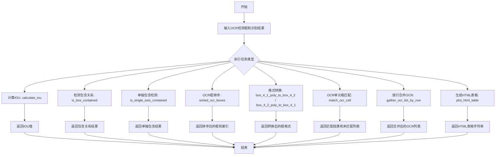
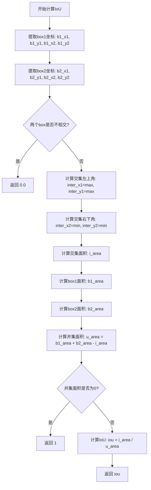
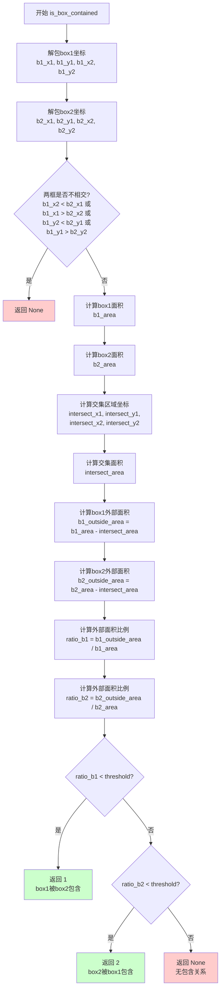

# `MinerU\mineru\model\table\rec\unet_table\utils_table_recover.py` 详细设计文档

该文件包含一组用于OCR（光学字符识别）后处理的工具函数，主要实现边界框（bounding box）的IOU计算、包含关系检测、排序、匹配以及HTML表格生成等功能，常用于表格识别场景下的OCR结果处理。

## 整体流程



## 类结构

```
无类定义 (纯函数模块)
```

## 全局变量及字段


### `calculate_iou`
    
计算两个边界框的交并比（IOU），返回0-1之间的值

类型：`function`
    


### `is_box_contained`
    
判断两个边界框是否存在包含关系，返回包含类型或None

类型：`function`
    


### `is_single_axis_contained`
    
在单轴（x或y）上判断两个边界框的包含关系

类型：`function`
    


### `sorted_ocr_boxes`
    
对OCR检测到的文本框进行排序，先从上到下再从左到右

类型：`function`
    


### `box_4_1_poly_to_box_4_2`
    
将4点坐标格式（xmin,ymin,xmax,ymax）转换为4_2格式（4个顶点坐标对）

类型：`function`
    


### `box_4_2_poly_to_box_4_1`
    
将4_2格式（4个顶点坐标对）转换为4点坐标格式（xmin,ymin,xmax,ymax）

类型：`function`
    


### `match_ocr_cell`
    
将OCR识别结果与预测的边界框进行匹配，返回匹配和不匹配的OCR框

类型：`function`
    


### `gather_ocr_list_by_row`
    
按行合并OCR识别结果，将同一行的OCR文本合并

类型：`function`
    


### `plot_html_table`
    
根据逻辑点和OCR识别结果生成HTML格式的表格

类型：`function`
    


    

## 全局函数及方法


### `calculate_iou`

该函数用于计算两个二维边界框（bounding box）之间的交并比（IoU，Intersection over Union），是目标检测和图像识别中评估框重叠程度的常用指标。

参数：

- `box1`：`Union[np.ndarray, List]`，第一个边界框，格式为 [xmin, ymin, xmax, ymax]
- `box2`：`Union[np.ndarray, List]`，第二个边界框，格式为 [xmin, ymin, xmax, ymax]

返回值：`float`，IoU值，范围在0到1之间

#### 流程图



#### 带注释源码

```python
def calculate_iou(
    box1: Union[np.ndarray, List], box2: Union[np.ndarray, List]
) -> float:
    """
    :param box1: Iterable [xmin,ymin,xmax,ymax]
    :param box2: Iterable [xmin,ymin,xmax,ymax]
    :return: iou: float 0-1
    """
    # 从box1中提取四个坐标点
    b1_x1, b1_y1, b1_x2, b1_y2 = box1[0], box1[1], box1[2], box1[3]
    # 从box2中提取四个坐标点
    b2_x1, b2_y1, b2_x2, b2_y2 = box2[0], box2[1], box2[2], box2[3]
    
    # 不相交直接退出检测
    # 如果box1的右边界在box2的左边界左侧，或box1的左边界在box2的右边界右侧，
    # 或box1的下边界在box2的上边界上方，或box1的上边界在box2的下边界下方，则两box不相交
    if b1_x2 < b2_x1 or b1_x1 > b2_x2 or b1_y2 < b2_y1 or b1_y1 > b2_y2:
        return 0.0
    
    # 计算交集区域的左上角坐标（取两个box在x和y方向上的较大值）
    inter_x1 = max(b1_x1, b2_x1)
    inter_y1 = max(b1_y1, b2_y1)
    # 计算交集区域的右下角坐标（取两个box在x和y方向上的较小值）
    inter_x2 = min(b1_x2, b2_x2)
    inter_y2 = min(b1_y2, b2_y2)
    # 计算交集面积，使用max(0, ...)确保当box不相交时面积为0
    i_area = max(0, inter_x2 - inter_x1) * max(0, inter_y2 - inter_y1)

    # 计算box1的面积
    b1_area = (b1_x2 - b1_x1) * (b1_y2 - b1_y1)
    # 计算box2的面积
    b2_area = (b2_x2 - b2_x1) * (b2_y2 - b2_y1)
    # 计算并集面积 = 面积1 + 面积2 - 交集面积
    u_area = b1_area + b2_area - i_area

    # 避免除零错误，如果区域小到乘积为0,认为是错误识别，直接去掉
    # 注意：此处返回1存在逻辑问题，通常应返回0或抛出异常
    if u_area == 0:
        return 1
        # 检查完全包含
    # 计算IoU = 交集面积 / 并集面积
    iou = i_area / u_area
    return iou
```

#### 潜在技术债务与优化空间

1. **返回值逻辑不一致**：当 `u_area == 0` 时返回 `1`，这在逻辑上存在问题。通常当两个box面积为0时，应返回0或抛出异常。
2. **缺少输入验证**：函数未验证输入box的坐标是否合法（如 xmin > xmax, ymin > ymax）。
3. **类型提示可优化**：可使用 `Sequence` 替代 `Union[np.ndarray, List]` 以支持更广泛的序列类型。
4. **性能优化**：可考虑使用向量化计算替代逐元素计算，提升批量处理效率。


### `is_box_contained`

该函数用于判断两个二维边界框（bounding box）之间是否存在包含关系，通过计算各自框外部面积占总面积的比例来确定包含的顺序。如果一个框外部面积小于总面积的阈值（threshold），则认为该框被另一个框包含，返回1表示box1被box2包含，返回2表示box2被box1包含，若两框不相交或外部面积比例均大于阈值则返回None。

参数：

- `box1`：`Union[np.ndarray, List]`，第一个边界框，格式为 [xmin, ymin, xmax, ymax]
- `box2`：`Union[np.ndarray, List]`，第二个边界框，格式为 [xmin, ymin, xmax, ymax]
- `threshold`：`float`，可选参数，默认为0.2，表示外部面积占总面积的比例阈值，用于判断是否存在包含关系

返回值：`Union[int, None]`，返回1表示box1被box2包含，返回2表示box2被box1包含，返回None表示两框不相交或无包含关系

#### 流程图



#### 带注释源码

```python
def is_box_contained(
    box1: Union[np.ndarray, List], box2: Union[np.ndarray, List], threshold=0.2
) -> Union[int, None]:
    """
    判断两个边界框是否存在包含关系
    :param box1: 第一个边界框，格式为 [xmin, ymin, xmax, ymax]
    :param box2: 第二个边界框，格式为 [xmin, ymin, xmax, ymax]
    :param threshold: 外部面积占比阈值，默认0.2，当外部面积占比小于此值时认为存在包含关系
    :return: 1表示box1被box2包含，2表示box2被box1包含，None表示无包含关系
    """
    # 解包box1的坐标信息
    b1_x1, b1_y1, b1_x2, b1_y2 = box1[0], box1[1], box1[2], box1[3]
    # 解包box2的坐标信息
    b2_x1, b2_y1, b2_x2, b2_y2 = box2[0], box2[1], box2[2], box2[3]
    
    # 不相交直接退出检测：如果两个框在任意方向上都不重叠，则直接返回None
    if b1_x2 < b2_x1 or b1_x1 > b2_x2 or b1_y2 < b2_y1 or b1_y1 > b2_y2:
        return None
    
    # 计算box2的总面积
    b2_area = (b2_x2 - b2_x1) * (b2_y2 - b2_y1)
    # 计算box1的总面积
    b1_area = (b1_x2 - b1_x1) * (b1_y2 - b1_y1)

    # 计算box1和box2的交集区域坐标
    intersect_x1 = max(b1_x1, b2_x1)  # 交集区域左上角x坐标
    intersect_y1 = max(b1_y1, b2_y1)  # 交集区域左上角y坐标
    intersect_x2 = min(b1_x2, b2_x2)  # 交集区域右下角x坐标
    intersect_y2 = min(b1_y2, b2_y2)  # 交集区域右下角y坐标

    # 计算交集的面积，使用max(0, ...)确保不出现负值
    intersect_area = max(0, intersect_x2 - intersect_x1) * max(
        0, intersect_y2 - intersect_y1
    )

    # 计算box1外部的面积（box1面积减去交集面积）
    b1_outside_area = b1_area - intersect_area
    # 计算box2外部的面积（box2面积减去交集面积）
    b2_outside_area = b2_area - intersect_area

    # 计算box1外部面积占box1总面积的比例，避免除零错误
    ratio_b1 = b1_outside_area / b1_area if b1_area > 0 else 0
    # 计算box2外部面积占box2总面积的比例，避免除零错误
    ratio_b2 = b2_outside_area / b2_area if b2_area > 0 else 0

    # 如果box1外部面积占比小于阈值，认为box1被box2包含
    if ratio_b1 < threshold:
        return 1
    # 如果box2外部面积占比小于阈值，认为box2被box1包含
    if ratio_b2 < threshold:
        return 2
    
    # 两框相交但都不被对方包含，返回None
    return None
```


### `is_single_axis_contained`

该函数用于判断两个矩形框在指定轴（X轴或Y轴）方向上是否存在包含关系，通过计算各矩形在轴向上的外部区域占比来确定哪个矩形被包含或是否互不包含。

参数：

- `box1`：`Union[np.ndarray, List]`，第一个矩形框，格式为 [xmin, ymin, xmax, ymax]
- `box2`：`Union[np.ndarray, List]`，第二个矩形框，格式为 [xmin, ymin, xmax, ymax]
- `axis`：`str`，指定判断的轴向，默认为 "x"（X轴），可选 "y"（Y轴）
- `threhold`：`float`，包含阈值，默认为 0.2，表示外部区域占比小于此值时判定为包含

返回值：`Union[int, None]`，返回 1 表示 box1 被包含，返回 2 表示 box2 被包含，返回 None 表示无包含关系

#### 流程图

```mermaid
flowchart TD
    A[开始 is_single_axis_contained] --> B[解包 box1 和 box2 的坐标]
    B --> C{axis == 'x'?}
    C -->|Yes| D[计算 X 轴方向上的长度和重叠区域]
    C -->|No| E[计算 Y 轴方向上的长度和重叠区域]
    D --> F[计算外部区域面积]
    E --> F
    F --> G[计算外部区域占比]
    G --> H{ratio_b1 < threhold?]
    H -->|Yes| I[返回 1]
    H -->|No| J{ratio_b2 < threhold?}
    J -->|Yes| K[返回 2]
    J -->|No| L[返回 None]
```

#### 带注释源码

```python
def is_single_axis_contained(
    box1: Union[np.ndarray, List],
    box2: Union[np.ndarray, List],
    axis="x",
    threhold: float = 0.2,
) -> Union[int, None]:
    """
    :param box1: Iterable [xmin,ymin,xmax,ymax]
    :param box2: Iterable [xmin,ymin,xmax,ymax]
    :return: 1: box1 is contained 2: box2 is contained None: no contain these
    """
    # 解包两个矩形框的坐标信息
    b1_x1, b1_y1, b1_x2, b1_y2 = box1[0], box1[1], box1[2], box1[3]
    b2_x1, b2_y1, b2_x2, b2_y2 = box2[0], box2[1], box2[2], box2[3]

    # 根据指定轴向计算重叠区域大小
    if axis == "x":
        # X轴方向：计算宽度和水平重叠区域
        b1_area = b1_x2 - b1_x1  # box1 在 X 轴方向的长度
        b2_area = b2_x2 - b2_x1  # box2 在 X 轴方向的长度
        i_area = min(b1_x2, b2_x2) - max(b1_x1, b2_x1)  # 重叠区域长度
    else:
        # Y轴方向：计算高度和垂直重叠区域
        b1_area = b1_y2 - b1_y1  # box1 在 Y 轴方向的长度
        b2_area = b2_y2 - b2_y1  # box2 在 Y 轴方向的长度
        i_area = min(b1_y2, b2_y2) - max(b1_y1, b2_y1)  # 重叠区域长度
        # 计算外面的面积
    # 计算各矩形在轴向上的外部区域（未重叠部分）长度
    b1_outside_area = b1_area - i_area
    b2_outside_area = b2_area - i_area

    # 计算外部区域占各自总长度的比例，避免除零错误
    ratio_b1 = b1_outside_area / b1_area if b1_area > 0 else 0
    ratio_b2 = b2_outside_area / b2_area if b2_area > 0 else 0
    
    # 根据阈值判断包含关系：比例小于阈值表示被包含
    if ratio_b1 < threhold:
        return 1  # box1 被 box2 包含
    if ratio_b2 < threhold:
        return 2  # box2 被 box1 包含
    # 无包含关系
    return None
```


### `sorted_ocr_boxes`

该函数用于对OCR检测到的文本框进行排序，遵循从上到下、从左到右的阅读顺序。首先按y坐标（行）和x坐标（列）进行初步排序，然后通过检测相邻框在Y轴上的重叠关系来调整顺序，确保同一行的文本框按从左到右排列。

参数：

- `dt_boxes`：`Union[np.ndarray, list]`，待排序的检测文本框列表，每个框格式为 (xmin, ymin, xmax, ymax)
- `threhold`：`float`，单轴重叠检测阈值，默认为 0.2，用于判断两个框是否在同一行

返回值：`Tuple[Union[np.ndarray, list], List[int]]`，返回排序后的文本框列表和对应的原始索引

#### 流程图

```mermaid
flowchart TD
    A[开始 sorted_ocr_boxes] --> B{num_boxes <= 0?}
    B -->|是| C[返回原框和空列表]
    B -->|否| D[为每个框创建索引元组]
    E[按y坐标和x坐标排序] --> F[解包得到排序后的框和索引]
    G{输入是np.ndarray?}
    G -->|是| H[转换为numpy数组]
    G -->|否| I[保持list类型]
    J[外层循环遍历框] --> K[内层从当前位置向前比较]
    L{检测Y轴重叠情况} --> M{满足交换条件?}
    M -->|是| N[交换框和索引位置]
    M -->|否| O[跳出内层循环]
    P{循环完成?} --> J
    P --> Q[返回排序后的框和索引]
    
    subgraph 交换条件
        L --> c1{c_idx is not None}
        c1 --> c2{_boxes[j+1][0] < _boxes[j][0]}
        c2 --> c3{abs差异 < 20}
    end
```

#### 带注释源码

```
def sorted_ocr_boxes(
    dt_boxes: Union[np.ndarray, list], threhold: float = 0.2
) -> Tuple[Union[np.ndarray, list], List[int]]:
    """
    Sort text boxes in order from top to bottom, left to right
    args:
        dt_boxes(array):detected text boxes with (xmin, ymin, xmax, ymax)
    return:
        sorted boxes(array) with (xmin, ymin, xmax, ymax)
    """
    # 获取输入框的数量
    num_boxes = len(dt_boxes)
    
    # 空输入直接返回空结果
    if num_boxes <= 0:
        return dt_boxes, []
    
    # 为每个框绑定原始索引，保留顺序映射关系
    indexed_boxes = [(box, idx) for idx, box in enumerate(dt_boxes)]
    
    # 初次排序：先按y坐标(行)，再按x坐标(列)
    sorted_boxes_with_idx = sorted(indexed_boxes, key=lambda x: (x[0][1], x[0][0]))
    
    # 解包出排序后的框和对应的原始索引
    _boxes, indices = zip(*sorted_boxes_with_idx)
    indices = list(indices)
    
    # 根据原始索引重建框列表，保持与索引的一致性
    _boxes = [dt_boxes[i] for i in indices]
    
    # 定义水平距离阈值(固定值20像素)，用于判断是否同一行
    threahold = 20
    
    # 保持输出格式与输入一致
    if isinstance(dt_boxes, np.ndarray):
        _boxes = np.array(_boxes)
    
    # 冒泡排序：从后向前比较相邻框，处理同一行的左右顺序
    for i in range(num_boxes - 1):
        for j in range(i, -1, -1):
            # 检测当前两个相邻框在Y轴上的重叠关系
            c_idx = is_single_axis_contained(
                _boxes[j], _boxes[j + 1], axis="y", threhold=threhold
            )
            
            # 交换条件：
            # 1. Y轴存在重叠或包含关系
            # 2. 后一个框的x坐标小于前一个框(需要从右到左调整)
            # 3. 两个框的y坐标差异小于水平阈值(确保在同一行)
            if (
                c_idx is not None
                and _boxes[j + 1][0] < _boxes[j][0]
                and abs(_boxes[j][1] - _boxes[j + 1][1]) < threahold
            ):
                # 交换框的位置
                _boxes[j], _boxes[j + 1] = _boxes[j + 1].copy(), _boxes[j].copy()
                # 同步交换对应的原始索引
                indices[j], indices[j + 1] = indices[j + 1], indices[j]
            else:
                # 当前顺序正确，无需继续向前比较
                break
    
    return _boxes, indices
```


### `box_4_1_poly_to_box_4_2`

将 box_4_1 格式（[xmin, ymin, xmax, ymax]）转换为 box_4_2 格式（四个角点坐标列表），用于在不同的边界框表示法之间进行转换。

参数：

- `poly_box`：`Union[list, np.ndarray]`，输入的边界框，格式为 [xmin, ymin, xmax, ymax]

返回值：`List[List[float]]`，返回四个角点坐标的列表，格式为 [[xmin,ymin], [xmax,ymin], [xmax,ymax], [xmin,ymax]]

#### 流程图

```mermaid
flowchart TD
    A[开始] --> B[输入 poly_box: Unionlist, np.ndarray]
    B --> C{解包坐标}
    C --> D[提取 xmin, ymin, xmax, ymax]
    D --> E[构建角点列表]
    E --> F[返回 [[xmin,ymin], [xmax,ymin], [xmax,ymax], [xmin,ymax]]]
    F --> G[结束]
```

#### 带注释源码

```python
def box_4_1_poly_to_box_4_2(poly_box: Union[list, np.ndarray]) -> List[List[float]]:
    """
    将 box_4_1 格式转换为 box_4_2 格式
    :param poly_box: 输入边界框 [xmin, ymin, xmax, ymax]
    :return: 四个角点坐标 [[xmin,ymin], [xmax,ymin], [xmax,ymax], [xmin,ymax]]
    """
    # 从输入的 4 元素数组中解包出四个坐标值
    xmin, ymin, xmax, ymax = tuple(poly_box)
    # 按照顺时针方向返回四个角点坐标（左上角 -> 右上角 -> 右下角 -> 左下角）
    return [[xmin, ymin], [xmax, ymin], [xmax, ymax], [xmin, ymax]]
```


### `box_4_2_poly_to_box_4_1`

将4.2格式的多边形框（4个顶点的坐标列表）转换为4.1格式的轴对齐包围盒（xmin, ymin, xmax, ymax）。

参数：

- `poly_box`：`Union[list, np.ndarray]`，4.2格式的多边形框，包含4个顶点坐标，每个顶点为[x, y]形式

返回值：`List[Any]`，4.1格式的包围盒 [xmin, ymin, xmax, ymax]

#### 流程图

```mermaid
flowchart TD
    A[开始] --> B[输入 poly_box]
    B --> C[提取 poly_box[0][0] 作为 xmin]
    C --> D[提取 poly_box[0][1] 作为 ymin]
    D --> E[提取 poly_box[2][0] 作为 xmax]
    E --> F[提取 poly_box[2][1] 作为 ymax]
    F --> G[返回 [xmin, ymin, xmax, ymax]]
    G --> H[结束]
```

#### 带注释源码

```python
def box_4_2_poly_to_box_4_1(poly_box: Union[list, np.ndarray]) -> List[Any]:
    """
    将poly_box转换为box_4_1
    :param poly_box: 4.2格式的多边形框 [[x1,y1], [x2,y2], [x3,y3], [x4,y4]]
    :return: 4.1格式的包围盒 [xmin, ymin, xmax, ymax]
    """
    # poly_box[0] 取第一个顶点 [x1, y1]，其中 [0] 为 x 坐标，[1] 为 y 坐标
    # poly_box[2] 取第三个顶点 [x3, y3]，对应右下角坐标
    return [poly_box[0][0], poly_box[0][1], poly_box[2][0], poly_box[2][1]]
```


### `match_ocr_cell`

该函数用于将OCR识别出的文本框与预测的表格边界框进行匹配，通过计算包围盒的包含关系和IoU（交并比）来建立OCR结果与表格单元格的对应关系，并返回匹配结果和未匹配的OCR文本框。

参数：

- `dt_rec_boxes`：`List[List[Union[Any, str]]]`，OCR识别结果列表，每个元素包含OCR文本框坐标、识别文本和置信度
- `pred_bboxes`：`np.ndarray`，预测的表格单元格边界框数组，形状为(4,2)

返回值：`Tuple[Dict[int, List[List[Union[Any, str]]]], List[List[Union[Any, str]]]]`，返回一个元组，包含：
- `matched`：字典，键为预测框索引，值为匹配到的OCR文本框列表
- `not_match_orc_boxes`：列表，未匹配到任何预测框的OCR文本框列表

#### 流程图

```mermaid
flowchart TD
    A[开始 match_ocr_cell] --> B[初始化空字典matched和空列表not_match_orc_boxes]
    B --> C[遍历dt_rec_boxes中的每个gt_box]
    C --> D[遍历pred_bboxes中的每个pred_box]
    D --> E[将pred_box转换为[xmin,ymin,xmax,ymax]格式]
    E --> F[从gt_box提取ocr_box坐标]
    F --> G[调用is_box_contained检查ocr_box是否被pred_box包含]
    G --> H{contained == 1 或 calculate_iou > 0.8?}
    H -->|是| I{j是否已在matched中?}
    I -->|否| J[matched[j] = [gt_box]]
    I -->|是| K[matched[j].append(gt_box)]
    H -->|否| L[将gt_box添加到not_match_orc_boxes]
    J --> M[继续下一个pred_box]
    K --> M
    L --> M
    M --> N{还有更多pred_box?}
    N -->|是| D
    N -->|否| O{还有更多gt_box?}
    O -->|是| C
    O -->|否| P[返回matched和not_match_orc_boxes]
```

#### 带注释源码

```python
def match_ocr_cell(dt_rec_boxes: List[List[Union[Any, str]]], pred_bboxes: np.ndarray):
    """
    :param dt_rec_boxes: [[(4.2), text, score]] - OCR识别结果列表
    :param pred_bboxes: shap (4,2) - 预测的表格单元格边界框
    :return: matched字典和未匹配的ocr_boxes列表
    """
    # 存储匹配结果，键为pred_bboxes的索引，值为匹配的OCR文本框列表
    matched = {}
    # 存储未匹配到任何预测框的OCR文本框
    not_match_orc_boxes = []
    
    # 遍历每一个OCR识别结果（文本框）
    for i, gt_box in enumerate(dt_rec_boxes):
        # 遍历每一个预测的表格单元格边界框
        for j, pred_box in enumerate(pred_bboxes):
            # 将pred_box从[[x1,y1],[x2,y2]]格式转换为[xmin,ymin,xmax,ymax]
            pred_box = [pred_box[0][0], pred_box[0][1], pred_box[2][0], pred_box[2][1]]
            
            # 获取OCR文本框的坐标
            ocr_boxes = gt_box[0]
            # xmin,ymin,xmax,ymax 格式
            ocr_box = (
                ocr_boxes[0][0],
                ocr_boxes[0][1],
                ocr_boxes[2][0],
                ocr_boxes[2][1],
            )
            
            # 检查OCR框是否被预测框包含（阈值0.6）
            contained = is_box_contained(ocr_box, pred_box, 0.6)
            
            # 判断条件：被包含 或者 IoU > 0.8
            if contained == 1 or calculate_iou(ocr_box, pred_box) > 0.8:
                # 如果该预测框索引尚未在matched中，创建新列表
                if j not in matched:
                    matched[j] = [gt_box]
                # 否则追加到已有列表
                else:
                    matched[j].append(gt_box)
            else:
                # 未匹配，添加到未匹配列表
                not_match_orc_boxes.append(gt_box)

    # 返回匹配结果和未匹配的OCR框
    return matched, not_match_orc_boxes
```


### `gather_ocr_list_by_row`

该函数接收一个OCR识别结果列表（每个元素包含文本框坐标和识别文本），通过比较文本框在Y轴上的重叠关系，将同一行的多个OCR条目合并为一个，同时根据文本框之间的水平距离插入相应数量的空格，最后返回合并后的OCR列表。

参数：

- `ocr_list`：`List[Any]`，输入的OCR列表，每个元素为`[[xmin, ymin, xmax, ymax], text]`格式的列表
- `threhold`：`float`，Y轴包含检测的阈值，默认为0.2

返回值：`List[Any]`，合并后的OCR列表

#### 流程图

```mermaid
flowchart TD
    A[开始 gather_ocr_list_by_row] --> B[初始化 threshold = 10]
    B --> C[外层循环遍历 ocr_list 索引 i]
    C --> D{ocr_list[i] 是否为空}
    D -->|是| C1[继续下一个 i]
    D -->|否| E[内层循环遍历 ocr_list 索引 j = i+1 到 len]
    E --> F{ocr_list[j] 是否为空}
    F -->|是| E
    F -->否| G[调用 is_single_axis_contained 检查 Y 轴是否包含]
    G --> H{c_idx 是否为真}
    H -->|否| E
    H -->|是| I[计算水平距离 dis]
    I --> J[根据距离生成空格字符串 blank_str]
    J --> K[合并文本: cur[1] = cur[1] + blank_str + next[1]]
    K --> L[合并边界框: 更新 xmin, xmax, ymin, ymax]
    L --> M[将 ocr_list[j] 设为 None]
    M --> E
    C1 --> N[过滤掉 None 值]
    N --> O[返回合并后的列表]
    O --> P[结束]
```

#### 带注释源码

```python
def gather_ocr_list_by_row(ocr_list: List[Any], threhold: float = 0.2) -> List[Any]:
    """
    合并同一行的OCR识别结果
    :param ocr_list: [[[xmin,ymin,xmax,ymax], text]]  # OCR列表，每个元素包含边界框和文本
    :param threhold: Y轴包含检测阈值
    :return: 合并后的OCR列表
    """
    # 定义水平间距阈值，用于计算空格数量
    threshold = 10
    
    # 外层循环：遍历每个OCR条目作为当前行
    for i in range(len(ocr_list)):
        # 跳过空条目（已合并的条目会被置为None）
        if not ocr_list[i]:
            continue

        # 内层循环：查找当前行之后可以合并的条目
        for j in range(i + 1, len(ocr_list)):
            if not ocr_list[j]:
                continue
            
            # 获取当前条目和下一个条目的引用
            cur = ocr_list[i]
            next = ocr_list[j]
            cur_box = cur[0]  # 当前边界框
            next_box = next[0]  # 下一个边界框
            
            # 检查两个边界框在Y轴方向上是否满足包含关系（同一行）
            c_idx = is_single_axis_contained(
                cur[0], next[0], axis="y", threhold=threhold
            )
            
            # 如果Y轴满足包含条件，则进行合并
            if c_idx:
                # 计算水平距离：next左边缘 - cur右边缘
                dis = max(next_box[0] - cur_box[2], 0)
                # 根据距离生成空格字符串（距离越大，空格越多）
                blank_str = int(dis / threshold) * " "
                
                # 合并文本内容，在中间插入空格
                cur[1] = cur[1] + blank_str + next[1]
                
                # 合并边界框：取两个框的并集
                xmin = min(cur_box[0], next_box[0])
                xmax = max(cur_box[2], next_box[2])
                ymin = min(cur_box[1], next_box[1])
                ymax = max(cur_box[3], next_box[3])
                
                # 更新当前边界框
                cur_box[0] = xmin
                cur_box[1] = ymin
                cur_box[2] = xmax
                cur_box[3] = ymax
                
                # 将已合并的条目置为空，后续过滤
                ocr_list[j] = None
    
    # 过滤掉所有空条目（已合并的）
    ocr_list = [x for x in ocr_list if x]
    return ocr_list
```


### `plot_html_table`

该函数接收逻辑坐标点（包含行列起始结束位置）和OCR识别结果映射，将逻辑表格结构转换为HTML表格字符串，支持单元格跨行跨列显示。

参数：

- `logi_points`：`Union[Union[np.ndarray, List]]`，逻辑坐标点列表，每个元素包含 [row_start, row_end, col_start, col_end]，表示单元格的起始和结束行列位置
- `cell_box_map`：`Dict[int, List[str]]`，字典，键为逻辑点的索引，值为该单元格对应的OCR识别文本列表

返回值：`str`，生成的HTML表格字符串

#### 流程图

```mermaid
flowchart TD
    A[开始 plot_html_table] --> B[初始化 max_row=0, max_col=0]
    B --> C[遍历 logi_points 计算最大行列值]
    C --> D[创建二维数组 grid[max_row][max_col]]
    D --> E[初始化 valid_start_row/col 为最大值, valid_end_col 为0]
    E --> F[遍历 logi_points 填充 grid 数组]
    F --> G{ocr_rec_text_list 是否有效}
    G -->|是| H[更新有效区域边界]
    G -->|否| I[跳过]
    H --> I
    I --> J[开始构建 HTML 表格字符串]
    J --> K[遍历每一行]
    K --> L{行是否在有效区域内}
    L -->|否| M[跳过该行]
    L -->|是| N[遍历每一列]
    N --> O{列是否在有效区域内}
    O -->|否| P[跳过该列]
    O -->|是| Q{grid[row][col] 是否有值}
    Q -->|否| R[添加空单元格 td]
    Q -->|是| S{是否为起始单元格}
    S -->|否| T[不添加内容]
    S -->|是| U[计算 rowspan 和 colspan]
    U --> V[添加单元格内容和跨度属性]
    V --> P
    T --> P
    R --> P
    P --> W{遍历是否结束}
    W -->|否| N
    W -->|是| X{行遍历是否结束}
    X -->|否| K
    X -->|是| Y[结束并返回 HTML 字符串]
```

#### 带注释源码

```python
def plot_html_table(
    logi_points: Union[Union[np.ndarray, List]], cell_box_map: Dict[int, List[str]]
) -> str:
    # 初始化最大行数和列数
    max_row = 0
    max_col = 0
    
    # 计算最大行数和列数
    # logi_points 每个元素格式: [row_start, row_end, col_start, col_end]
    # 加1是因为结束下标是包含在内的
    for point in logi_points:
        max_row = max(max_row, point[1] + 1)  # 取最大行号+1作为行数
        max_col = max(max_col, point[3] + 1)  # 取最大列号+1作为列数

    # 创建一个二维数组来存储 sorted_logi_points 中的元素
    # grid[row][col] 存储该位置对应的逻辑点信息 (i, row_start, row_end, col_start, col_end)
    grid = [[None] * max_col for _ in range(max_row)]

    # 初始化有效区域的边界值
    # 使用 65535 (2^16-1) 作为初始最大值
    valid_start_row = (1 << 16) - 1
    valid_start_col = (1 << 16) - 1
    valid_end_col = 0
    
    # 将 sorted_logi_points 中的元素填充到 grid 中
    for i, logic_point in enumerate(logi_points):
        # 解析逻辑点的行列范围
        row_start, row_end, col_start, col_end = (
            logic_point[0],
            logic_point[1],
            logic_point[2],
            logic_point[3],
        )
        
        # 获取该逻辑点对应的OCR识别文本列表
        ocr_rec_text_list = cell_box_map.get(i)
        
        # 如果存在有效文本，更新有效区域的边界
        if ocr_rec_text_list and "".join(ocr_rec_text_list):
            valid_start_row = min(row_start, valid_start_row)
            valid_start_col = min(col_start, valid_start_col)
            valid_end_col = max(col_end, valid_end_col)
        
        # 将该逻辑点填充到其覆盖的所有网格位置
        for row in range(row_start, row_end + 1):
            for col in range(col_start, col_end + 1):
                grid[row][col] = (i, row_start, row_end, col_start, col_end)

    # 创建表格 HTML 标签
    table_html = "<html><body><table>"

    # 遍历每行，从有效起始行开始
    for row in range(max_row):
        # 跳过无效行（位于有效起始行之前的行）
        if row < valid_start_row:
            continue
        
        temp = "<tr>"
        
        # 遍历每一列，在有效列范围内
        for col in range(max_col):
            # 跳过无效列（位于有效起始列之前或结束列之后的列）
            if col < valid_start_col or col > valid_end_col:
                continue
            
            # 如果该网格位置没有数据，添加空单元格
            if not grid[row][col]:
                temp += "<td></td>"
            else:
                # 解包网格中的数据
                i, row_start, row_end, col_start, col_end = grid[row][col]
                
                # 如果没有对应的OCR文本，跳过
                if not cell_box_map.get(i):
                    continue
                
                # 只有在起始单元格位置才添加内容（避免重复）
                if row == row_start and col == col_start:
                    # 获取OCR识别文本
                    ocr_rec_text = cell_box_map.get(i)
                    # 将文本列表连接为字符串
                    text = "".join(ocr_rec_text)
                    
                    # 计算跨行跨列数量
                    row_span = row_end - row_start + 1
                    col_span = col_end - col_start + 1
                    
                    # 生成带有 rowspan 和 colspan 属性的单元格
                    cell_content = (
                        f"<td rowspan={row_span} colspan={col_span}>{text}</td>"
                    )
                    temp += cell_content

        # 完成该行，拼接行标签
        table_html = table_html + temp + "</tr>"

    # 添加表格结束标签
    table_html += "</table></body></html>"
    return table_html
```

## 关键组件


### IOU计算引擎

负责计算两个矩形边界框之间的交并比（Intersection over Union），用于评估目标检测和OCR识别中框的重叠程度，是目标匹配的核心算法。

### 框包含检测模块

提供矩形框之间的包含关系判断，支持完全包含和部分包含的检测，并通过阈值参数控制容差，可用于判断OCR识别结果是否落在预测区域内。

### 单轴包含检测器

针对X轴或Y轴方向的框重叠检测，专门用于行对齐和列对齐场景，是OCR框排序和行收集的关键辅助函数。

### OCR框排序器

将检测到的文本框按照从上到下、从左到右的顺序进行排序，并对同一行内的框进行二次排序修正，解决OCR输出顺序混乱的问题。

### 多边形格式转换器

提供4点坐标格式（4_2）与最小外接矩形格式（4_1）之间的相互转换，用于兼容不同算法模块的输入输出格式。

### OCR单元格匹配器

将OCR识别结果与预测的表格单元格边界框进行匹配，通过IOU和包含关系双重判断，实现OCR结果与表格结构的对应。

### OCR列表行收集器

将属于同一行但被分割的OCR识别结果进行合并，根据Y轴重叠和水平距离判断是否为同一行文本，支持跨行文本的重组。

### HTML表格生成器

根据逻辑坐标点和OCR识别结果生成可视化的HTML表格，支持单元格跨行跨列，自动过滤空单元格，输出可直接在浏览器中查看的表格。


## 问题及建议


### 已知问题

- **类型注解不一致**：`calculate_iou`函数参数为`Union[np.ndarray, List]`，但实际使用box1[0]等索引，期望的是List[float]或np.ndarray的具体结构
- **拼写错误**：多处阈值参数名称不一致：`threshold`、`threhold`（两次出现拼写错误）、`threahold`（在sorted_ocr_boxes中为20，且变量名拼写错误），`gather_ocr_list_by_row`中内部变量`threshold = 10`与参数`threhold`不同
- **错误处理不当**：`calculate_iou`函数当`u_area == 0`时返回1（不符合IoU定义，IoU为0才合理），且注释"检查完全包含"后无对应代码
- **逻辑缺陷**：`match_ocr_cell`函数中`not_match_orc_boxes`的收集逻辑错误，只要OCR框与任意pred_box不匹配就被加入未匹配列表，而不是在所有pred_box遍历完后确定是否真正未匹配
- **副作用问题**：`gather_ocr_list_by_row`函数直接修改输入参数`ocr_list`（`cur[1] = ...`、`cur_box[0] = ...`、`ocr_list[j] = None`），违反函数纯浄性原则
- **性能问题**：`sorted_ocr_boxes`使用冒泡排序（O(n²)），`match_ocr_cell`在双层循环内重复计算`pred_box`坐标，`gather_ocr_list_by_row`使用嵌套循环合并OCR结果
- **边界条件**：`sorted_ocr_boxes`、`match_ocr_cell`、`plot_html_table`等函数未对空输入进行有效处理
- **魔法数字**：代码中多处硬编码数值如`0.6`、`0.8`、`20`、`10`未提取为常量，缺乏注释说明
- **文档不完整**：部分函数（如`box_4_1_poly_to_box_4_2`、`plot_html_table`）缺少参数和返回值的详细说明

### 优化建议

- 统一修复所有阈值相关参数的拼写错误（threshold），并将硬编码的阈值提取为函数参数或模块级常量
- 修复`calculate_iou`中`u_area == 0`时返回1的错误，应返回0.0或抛出异常
- 修复`match_ocr_cell`中未匹配框的收集逻辑，应在遍历完所有pred_box后再判断是否加入`not_match_orc_boxes`
- 将`gather_ocr_list_by_row`改为非修改输入的方式，返回新的列表
- 在`match_ocr_cell`中将`pred_box`的计算提取到内层循环外
- 优化`sorted_ocr_boxes`排序算法，替换冒泡排序为更高效的排序方式
- 为所有函数添加完整的类型注解和详细的文档字符串，包括参数说明和返回值描述
- 添加输入有效性检查，处理空列表、None等边界情况

## 其它


### 设计目标与约束

本模块旨在提供一套完整的OCR表格后处理工具链，实现从OCR识别结果到结构化HTML表格的转换。核心目标包括：1）提供精确的边界框IoU计算和包含关系检测；2）实现文本框的空间排序算法；3）支持OCR识别结果与预测单元格的匹配；4）生成符合视觉布局的HTML表格表示。约束条件主要体现在：输入的边界框格式统一为[xmin, ymin, xmax, ymax]或4x2多点格式；依赖NumPy和Typing标准库；性能要求在处理千级文本框时响应时间控制在可接受范围内。

### 错误处理与异常设计

代码采用防御式编程策略，主要错误处理场景包括：1）除零错误防护：在calculate_iou和is_box_contained中，当计算得到并集面积为0时返回1或0，避免除零导致程序崩溃；2）空输入处理：sorted_ocr_boxes函数在num_boxes <= 0时直接返回空结果；3）数组索引越界防护：使用max(0, ...)确保交集面积计算结果非负；4）类型兼容性处理：通过isinstance判断输入为np.ndarray还是list并相应返回对应类型。当前实现缺少显式的异常抛出机制，建议在关键入口点增加参数类型校验和数值范围检查。

### 数据流与状态机

整体数据处理流程呈现典型的管道式结构：输入层接收OCR识别结果（文本框坐标+文本+置信度）→ 预处理层进行格式统一（box_4_2_poly_to_box_4_1）→ 空间关系分析层计算IoU和包含关系 → 排序层执行二维空间排序 → 匹配层与预测单元格建立对应关系 → 聚合层按行合并相邻文本 → 输出层生成HTML表格表示。状态转换主要体现在sorted_ocr_boxes中的排序算法迭代过程，通过is_single_axis_contained判断相邻框的空间关系并动态调整顺序。

### 外部依赖与接口契约

本模块直接依赖两个外部包：numpy（提供高效的数值数组操作能力）和typing（提供类型注解支持）。接口契约明确规定：calculate_iou和is_box_contained系列函数接受Union[np.ndarray, List]类型的4元素坐标序列；sorted_ocr_boxes返回类型保持与输入一致（np.ndarray或list）；match_ocr_cell的pred_bboxes参数要求为numpy数组且shape为(4,2)；plot_html_table的cell_box_map参数为Dict[int, List[str]]类型，键为单元格索引，值为该单元格对应的OCR识别文本列表。

### 性能考量与优化空间

当前实现存在以下性能瓶颈：1）sorted_ocr_boxes采用O(n²)的冒泡排序进行同层文本框位置调整；2）多次重复计算相同框的面积和包含关系；3）gather_ocr_list_by_row中使用字符串拼接和列表操作效率较低。优化建议：使用快速排序或基于x轴的哈希分桶替代当前的排序算法；引入缓存机制存储已计算的面积和IoU值；考虑使用numpy向量化操作替代显式循环；plot_html_table中的网格填充可使用稀疏矩阵优化。

### 边界情况与特殊输入处理

代码对以下边界情况进行了处理：1）完全不相交的边界框直接返回IoU=0或None；2）完全包含的情况通过阈值判断（默认0.2）确定主从关系；3）空输入返回空列表或原样返回；4）单行单列的特殊网格布局通过rowspan/colspan=1生成有效HTML。然而仍存在边界情况未覆盖：输入坐标为负数时的行为未定义；坐标xmax < xmin或ymax < ymin的逆序输入可能导致错误结果；浮点数精度问题可能影响IoU计算的准确性。

### 使用示例与典型场景

典型应用场景一：OCR表格识别后处理。输入为PPOCR等模型输出的文本框列表（含坐标、文本、置信度），经过sorted_ocr_boxes排序后获得符合阅读顺序的文本框序列，再通过gather_ocr_list_by_row合并同一行的跨列文本，最终调用plot_html_table生成可展示的HTML表格。典型应用场景二：目标检测结果的后处理。在目标检测任务中，使用calculate_iou计算预测框与真值框的重叠度，使用is_box_contained筛选被完全包含的低置信度候选框，实现NMS后处理逻辑。


    