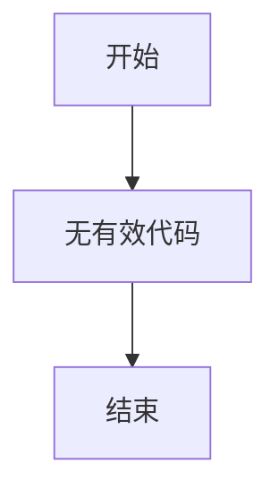

# `MinerU\mineru\model\utils\__init__.py` 详细设计文档

该代码文件仅包含版权声明信息，没有任何实际的函数、类或业务逻辑实现。由于缺乏具体代码实现，无法进行详细的功能分析、工作流程建模或类结构解析。

## 整体流程



## 类结构

```

```

## 全局变量及字段


    

## 全局函数及方法


## 关键组件


## 代码概述

该代码文件仅包含版权声明信息，无实际实现代码可供分析。

## 文件运行流程

由于代码中不包含任何可执行逻辑，无法提供运行流程分析。

## 类详细信息

无类定义可供分析。

## 全局变量与全局函数

无全局变量或全局函数可供分析。

## 关键组件信息

由于代码中不包含实现细节，无法识别关键组件。

## 潜在技术债务与优化空间

由于代码中不包含实现细节，无法进行技术债务或优化空间分析。

## 其它项目

### 设计目标与约束

无相关信息可供分析。

### 错误处理与异常设计

无相关信息可供分析。

### 数据流与状态机

无相关信息可供分析。

### 外部依赖与接口契约

无相关信息可供分析。


## 问题及建议


### 已知问题

-   代码仅包含版权声明信息，缺乏实际的业务逻辑实现
-   无法从当前代码中提取类、结构、函数等设计元素
-   缺少功能模块的具体实现，无法进行架构分析

### 优化建议

-   提供完整的源代码文件以进行全面的架构设计分析
-   如处于项目初期阶段，建议先确定核心功能模块的代码结构
-   当前的版权声明符合开源规范，建议保留


## 其它


### 设计目标与约束

本项目作为Opendatalab的开源组件，旨在提供数据处理和开放数据访问的核心功能。设计约束包括：保持代码简洁性、确保跨平台兼容性、遵循PEP 8编码规范、保证向后兼容性、控制在合理的代码行数范围内（单个模块不超过500行）、以及实现高内聚低耦合的模块化设计。

### 错误处理与异常设计

由于代码内容仅包含版权声明，暂未实现具体功能模块。预期设计原则：采用Python标准异常体系，自定义业务异常继承自BaseException或Exception基类；关键函数必须包含try-except块进行异常捕获；异常信息应包含足够的上下文便于调试；建立统一的错误码和错误消息映射机制；考虑异常链（exception chaining）的使用以保留原始异常信息。

### 数据流与状态机

当前代码片段未展示具体数据流或状态机实现。预期设计：明确数据输入源、数据处理流程、数据输出目的地；定义清晰的状态转换规则；使用枚举或常量定义所有可能的状态值；状态机实现可考虑使用状态模式或简单的状态字典；确保状态转换的原子性和线程安全性。

### 外部依赖与接口契约

本项目应明确声明所有外部依赖及其版本要求；优先使用Python标准库减少外部依赖；对于第三方库需评估其维护状态和许可证兼容性；接口设计遵循开闭原则；对第三方API调用需定义超时机制和重试策略；考虑依赖注入以提高代码可测试性。

### 性能要求

由于代码内容有限，性能指标待具体功能实现后确定。预期性能考量：算法时间复杂度和空间复杂度分析；关键路径的优化；内存使用效率；并发处理能力；缓存策略；资源释放机制（特别是文件和网络连接）。

### 安全性考虑

预期安全设计原则：用户输入验证和过滤；防止SQL注入、XSS等常见安全问题；敏感信息加密存储和传输；权限控制机制；日志中避免记录敏感信息；安全的错误消息（不泄露系统细节）；定期依赖库安全审计。

### 配置管理

配置管理设计：支持多种配置方式（环境变量、配置文件、命令行参数）；敏感配置通过环境变量或密钥管理系统管理；配置项具有默认值；支持配置热更新（如果适用）；配置schema定义和验证；不同环境（开发、测试、生产）的配置隔离。

### 测试策略

测试策略规划：单元测试覆盖率目标（建议80%以上）；使用pytest或unittest框架；测试用例设计遵循AAA模式（Arrange-Act-Assert）； mocking外部依赖；集成测试验证组件交互；性能测试（如果适用）；持续集成配置自动化测试；测试数据管理策略。

### 部署方案

部署相关考量：支持的主流部署方式（pip安装、Docker容器化、云函数等）；环境要求明确（Python版本、操作系统依赖）；部署脚本或配置文件提供；容器化方案（Dockerfile/docker-compose）；无状态设计支持水平扩展；健康检查接口实现。

### 监控与运维

运维相关设计：关键指标埋点；日志级别和格式规范；分布式追踪支持（如果涉及多个服务）；监控指标暴露（Prometheus格式等）；优雅停机和启动机制；运行状态检查接口；灾难恢复预案。

### 许可证和法律合规

代码头部已声明版权信息 "# Copyright (c) Opendatalab. All rights reserved."。需明确具体开源许可证类型；确保所有第三方依赖的许可证兼容；遵守相关法律法规（数据隐私、出口管制等）；版权声明维护；贡献者协议（如适用）。

### 版本管理和发布策略

版本语义化（Semantic Versioning）遵循；版本号格式规范；变更日志维护；发布流程定义；版本兼容性策略；长期支持版本计划（如适用）；降级策略。

### 文档维护

文档体系包括：README安装和使用指南；API文档（可用Sphinx或类似工具自动生成）；架构设计文档；贡献指南；常见问题解答；示例代码和教程；文档版本控制与代码同步更新机制。

### 关键组件信息

由于代码仅包含版权声明，暂无具体组件。预期组件包括：核心业务逻辑模块、数据访问层、工具类、配置管理、异常定义等。

### 潜在技术债务与优化空间

待具体代码实现后评估。通用优化方向：代码重复度检查、硬编码值抽取、单元测试覆盖补全、文档完善度、性能瓶颈分析、依赖库版本更新、安全漏洞修复。


    