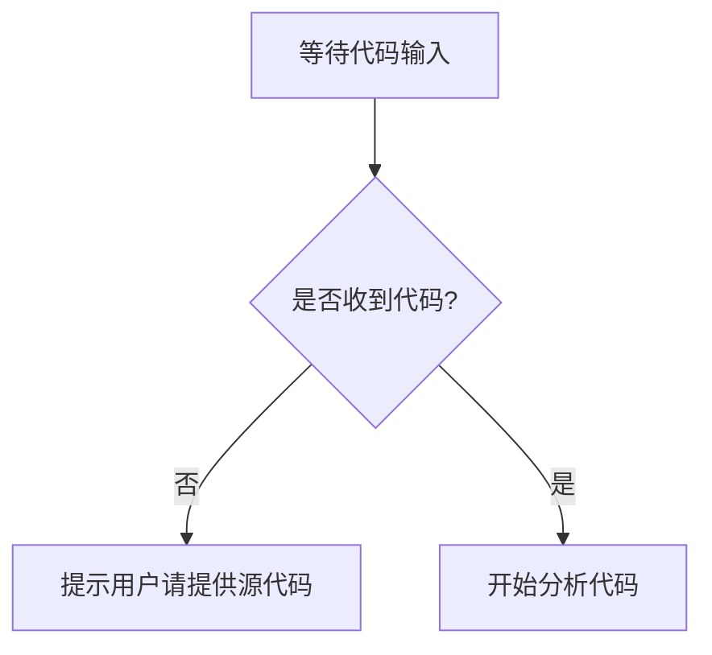

# `MinerU\mineru\model\utils\pytorchocr\__init__.py` 详细设计文档

未提供源代码文件

## 整体流程



## 类结构

```

```

## 全局变量及字段


    

## 全局函数及方法


## 关键组件


No source code was provided to analyze. Please provide the code you'd like me to document.


## 问题及建议


### 已知问题

-   代码文件为空，无法进行具体分析
-   缺少代码实现，无法识别具体的技术债务和潜在问题
-   无法确定具体的类结构、方法和全局变量

### 优化建议

-   请提供具体的代码文件以便进行详细分析
-   建议添加代码后，可以从代码规范、复杂度、重复代码、错误处理、测试覆盖等方面进行技术债务分析
-   如需通用架构优化建议，请明确说明代码的功能领域和技术栈


## 其它


### 设计目标与约束

描述系统的设计目标，包括功能目标、性能目标、安全目标等；列出技术约束、平台约束、时间约束等。

### 错误处理与异常设计

描述系统中的错误分类、异常处理机制、错误码定义、错误日志记录策略以及降级方案。

### 数据流与状态机

描述主要数据流向、数据转换过程、状态机的状态定义、状态转换条件以及边界条件处理。

### 外部依赖与接口契约

列出系统依赖的外部服务、库、模块；详细描述接口的输入输出规范、协议格式、版本兼容性以及超时和重试策略。

### 安全性设计

描述身份认证机制、授权策略、数据加密方案、敏感信息保护措施以及安全审计日志。

### 性能要求与约束

明确性能指标，如响应时间、吞吐量、并发用户数；描述资源限制（内存、CPU、网络带宽）以及性能监控方案。

### 兼容性设计

描述向前向后兼容性策略、API版本管理方案、数据格式演进策略以及多平台支持计划。

### 配置管理

描述配置项分类、配置加载机制、配置验证规则、配置更新策略以及环境差异化配置方案。

### 部署架构

描述部署拓扑结构、容器化方案、负载均衡策略、高可用架构以及灾备方案。

### 术语表

解释文档中使用的专业术语、缩略语及其定义。

### 参考资料

列出设计文档引用的需求规格说明书、接口文档、技术方案等相关资料。

### 修订历史

记录文档的版本号、修订日期、修订人、修订内容摘要。

    