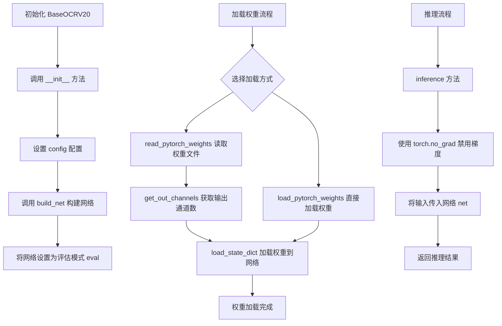
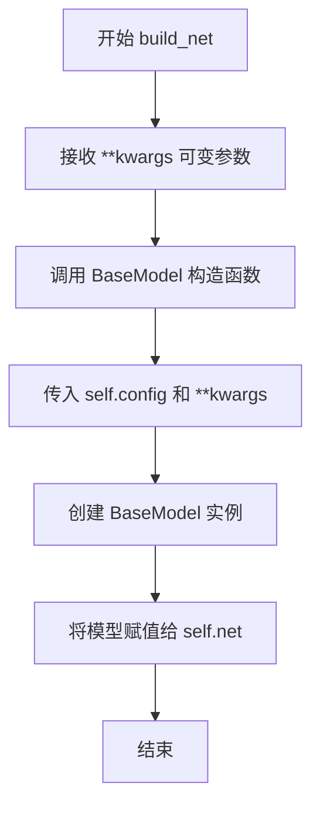
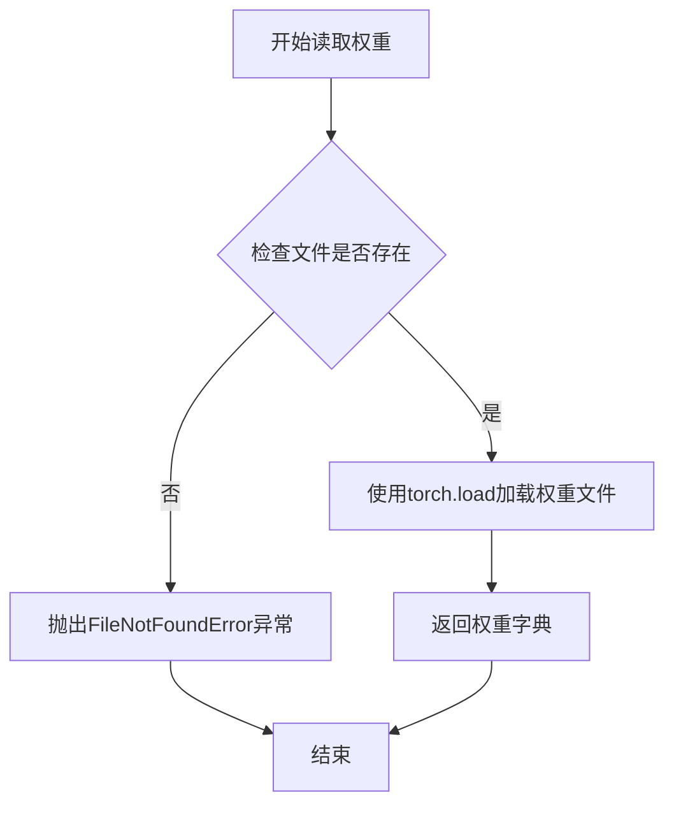
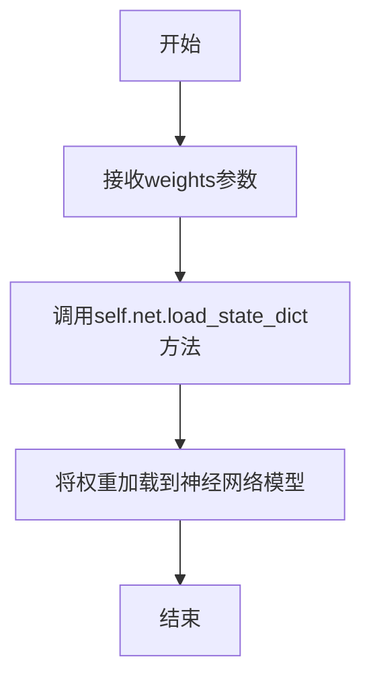
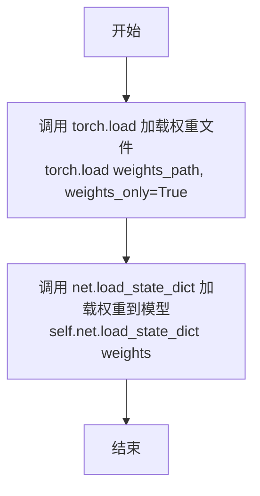
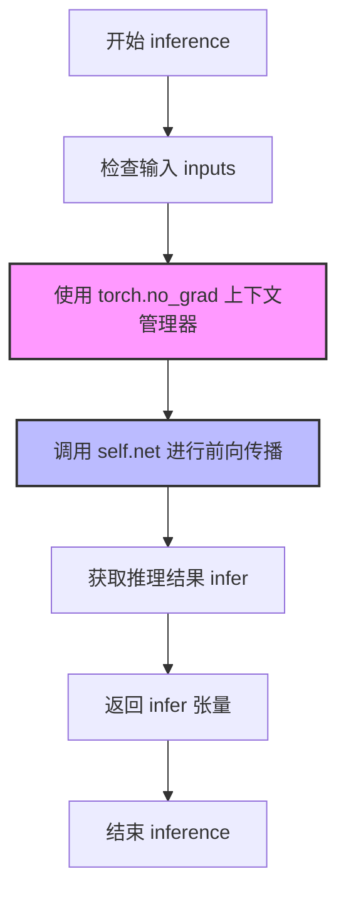

# `MinerU\mineru\model\utils\pytorchocr\base_ocr_v20.py` 详细设计文档

这是一个用于OCR（光学字符识别）模型的基类，提供了网络构建、权重加载和推理的完整流程，基于PyTorch框架和自定义的BaseModel架构。

## 整体流程



## 类结构

```
BaseModel (抽象基类/外部依赖)
└── BaseOCRV20 (OCR模型基类)
```

## 全局变量及字段


### `BaseOCRV20.config`
    
模型配置文件，包含模型结构相关参数

类型：`Any`
    


### `BaseOCRV20.net`
    
PyTorch神经网络模型实例

类型：`torch.nn.Module`
    
    

## 全局函数及方法


### `BaseOCRV20.__init__`

构造函数，初始化配置并构建网络模型。

参数：

- `config`：`Any`，模型配置对象
- `**kwargs`：`Any`，可变关键字参数，用于传递额外配置

返回值：`None`，构造函数没有返回值

#### 流程图

```mermaid
flowchart TD
    A[开始 __init__] --> B[接收参数: config, **kwargs]
    B --> C[self.config = config]
    C --> D[调用 self.build_net(**kwargs)]
    D --> E[self.net.eval 设置评估模式]
    E --> F[结束 __init__]
```

#### 带注释源码

```python
def __init__(self, config, **kwargs):
    """
    构造函数，初始化配置并构建网络模型
    
    参数:
        config: 模型配置对象
        **kwargs: 可变关键字参数，用于传递额外配置
    """
    # 将传入的配置保存为实例属性，供后续方法使用
    self.config = config
    
    # 调用 build_net 方法构建网络模型，传入额外参数
    self.build_net(**kwargs)
    
    # 将网络模型设置为评估模式
    # 评估模式会关闭 Dropout、启用 BatchNorm 的训练模式等
    self.net.eval()
```


### `BaseOCRV20.build_net`

构建神经网络模型，使用BaseModel和配置初始化

参数：

-  `**kwargs`：`Any`，可变关键字参数，传递给BaseModel，用于配置模型的具体参数

返回值：`None`，无返回值，该方法通过副作用将模型实例赋值给self.net

#### 流程图



#### 带注释源码

```python
def build_net(self, **kwargs):
    """
    构建神经网络模型
    
    该方法使用配置和可选的额外参数创建BaseModel实例，
    并将创建的模型存储在实例属性self.net中
    
    参数:
        **kwargs: 可变关键字参数，会原样传递给BaseModel构造函数
                  用于覆盖或扩展默认配置
    
    返回值:
        None
    
    示例:
        # 基础调用
        self.build_net()
        
        # 带额外参数
        self.build_net(pretrained=True, freeze_backbone=True)
    """
    # 使用BaseModel类根据配置初始化神经网络模型
    # self.config 提供基础配置信息
    # **kwargs 允许调用者传入额外的模型参数进行定制
    self.net = BaseModel(self.config, **kwargs)
```

#### 补充说明

1. **设计意图**：该方法将模型构建逻辑封装在类中，实现了配置与模型创建的解耦
2. **依赖关系**：依赖于`BaseModel`类和`self.config`配置对象
3. **状态变更**：该方法会修改实例状态，将新创建的模型赋值给`self.net`
4. **异常情况**：如果`BaseModel`初始化失败或配置无效，可能会抛出相应异常
5. **潜在优化空间**：可以添加模型缓存机制，避免重复构建；对于相同的config和kwargs，可以考虑缓存已创建的模型实例


### BaseOCRV20.read_pytorch_weights

该方法用于读取指定路径的PyTorch权重文件（.pth或.pt格式），检查文件是否存在后使用torch.load加载权重数据，并返回包含模型参数的字典对象。

参数：

- `weights_path`：`str`，权重文件的路径

返回值：`dict`，从PyTorch权重文件中加载的模型参数字典

#### 流程图



#### 带注释源码

```python
def read_pytorch_weights(self, weights_path):
    """
    读取指定路径的PyTorch权重文件并返回权重字典
    
    Args:
        weights_path: 权重文件的路径，支持.pth或.pt格式
        
    Returns:
        dict: 包含模型所有参数的状态字典
        
    Raises:
        FileNotFoundError: 当指定的权重文件路径不存在时抛出
    """
    # 检查权重文件是否存在，如果不存在则抛出FileNotFoundError异常
    if not os.path.exists(weights_path):
        raise FileNotFoundError('{} is not existed.'.format(weights_path))
    
    # 使用torch.load加载权重文件，返回包含所有参数的字典
    weights = torch.load(weights_path)
    
    # 返回加载的权重字典，可用于模型权重初始化或参数分析
    return weights
```


### `BaseOCRV20.get_out_channels`

从权重字典中获取模型的输出通道数，通过检查权重字典中最后一个键值对来判断输出通道数是位于权重张量的第一个维度还是第二个维度。

参数：

- `weights`：`dict`，权重字典

返回值：`int`，模型的输出通道数

#### 流程图

```mermaid
flowchart TD
    A[开始 get_out_channels] --> B[获取weights.keys()最后一个键 last_key]
    B --> C{last_key.endswith('.weight') 且<br>len(weights.values()最后一个值.shape) == 2?}
    C -->|是| D[out_channels = 最后权重值.shape[1]]
    C -->|否| E[out_channels = 最后权重值.shape[0]]
    D --> F[返回 out_channels]
    E --> F
    F --> G[结束]
```

#### 带注释源码

```python
def get_out_channels(self, weights):
    """
    从权重字典中获取模型的输出通道数
    
    参数:
        weights (dict): 权重字典，通常来自PyTorch模型的state_dict
    
    返回值:
        int: 模型的输出通道数
    """
    # 获取权重字典的最后一个键（通常是最后一层的权重）
    last_key = list(weights.keys())[-1]
    
    # 判断逻辑：
    # 1. 如果最后一层权重以'.weight'结尾（排除'.bias'等偏置项）
    # 2. 且是2维张量（通常是权重矩阵，如Linear层的weight）
    #    - 对于2D张量，shape[1]表示输出通道数（如Linear的out_features）
    #    - 对于非2D张量（如卷积层4D），shape[0]表示输出通道数
    if last_key.endswith('.weight') and len(list(weights.values())[-1].shape) == 2:
        # 2D权重（如Linear层）：取列数作为输出通道数
        out_channels = list(weights.values())[-1].numpy().shape[1]
    else:
        # 非2D权重（如Conv层）：取行数作为输出通道数
        out_channels = list(weights.values())[-1].numpy().shape[0]
    
    return out_channels
```


### BaseOCRV20.load_state_dict

将权重字典加载到神经网络模型中，实现模型参数的恢复和迁移学习。

参数：

- `weights`：`dict`，权重字典，包含模型各层的参数键值对

返回值：`None`，无返回值，执行成功后模型权重被更新

#### 流程图



#### 带注释源码

```python
def load_state_dict(self, weights):
    """
    将权重加载到网络模型中
    
    参数:
        weights (dict): 权重字典，包含模型各层的参数键值对
    
    返回:
        None: 无返回值，直接修改模型内部状态
    """
    # 调用PyTorch模型的load_state_dict方法加载权重
    # self.net是BaseModel实例，继承自torch.nn.Module
    # 该方法会按照键名匹配将权重逐层加载到模型中
    self.net.load_state_dict(weights)
    # 打印语句被注释掉：# print('weights is loaded.')
```


### `BaseOCRV20.load_pytorch_weights`

直接从文件加载权重到网络模型

参数：

-  `weights_path`：`str`，权重文件的路径

返回值：`None`，无返回值，直接修改模型内部状态

#### 流程图



#### 带注释源码

```python
def load_pytorch_weights(self, weights_path):
    """
    直接从文件加载权重到网络模型
    
    该方法简化了权重加载流程,直接使用 torch.load 读取权重文件,
    并通过 load_state_dict 将权重加载到 self.net 模型中。
    使用 weights_only=True 参数以提高安全性,防止潜在的安全风险。
    
    参数:
        weights_path: str, 权重文件的路径
    
    返回:
        None, 无返回值,模型权重在原地被更新
    """
    # 使用 torch.load 直接从文件加载权重,weights_only=True 提高安全性
    self.net.load_state_dict(torch.load(weights_path, weights_only=True))
    # 注释: 模型权重加载完成,可进行推理或保存
    # print('model is loaded: {}'.format(weights_path))
```


### `BaseOCRV20.inference`

执行推理操作，使用已加载的神经网络模型对输入张量进行前向传播，并返回模型输出。

参数：

- `inputs`：`torch.Tensor`，输入数据张量

返回值：`torch.Tensor`，执行推理操作，返回模型输出

#### 流程图



#### 带注释源码

```python
def inference(self, inputs):
    """
    执行推理操作
    
    参数:
        inputs: torch.Tensor, 输入数据张量
        
    返回:
        torch.Tensor, 模型推理结果
    """
    # 使用 torch.no_grad() 上下文管理器，禁用梯度计算
    # 这样可以减少内存消耗并提高推理速度
    with torch.no_grad():
        # 将输入张量传递给神经网络模型进行前向传播
        infer = self.net(inputs)
    
    # 返回推理结果
    return infer
```

## 关键组件


### 张量索引与惰性加载

通过 `list(weights.keys())[-1]` 和 `list(weights.values())[-1]` 直接访问权重字典的最后一个元素，实现对模型最后一层权重张量的动态索引，用于获取输出通道数。

### 反量化支持

`get_out_channels` 方法通过解析 PyTorch 权重文件的形状信息，支持量化感知训练后模型的权重维度获取，为反量化操作提供基础维度信息。

### 量化策略基类接口

作为 `BaseOCRV20` 基类，定义了加载 PyTorch 权重、模型推理的标准化接口，为后续量化模型的加载和推理提供统一的架构基础。


## 问题及建议


### 已知问题

-   **硬编码的输出通道获取逻辑**：`get_out_channels` 方法通过假设最后一个权重键是输出层来判断输出通道数，这种实现极其脆弱，不同模型架构会导致错误结果
-   **冗余且未使用的方法**：`read_pytorch_weights` 方法未被调用，与 `load_pytorch_weights` 存在功能重复
-   **缺乏输入验证**：所有公开方法均未对输入参数进行类型或有效性验证，可能导致运行时错误
-   **权重加载缺少兼容性检查**：`load_state_dict` 和 `load_pytorch_weights` 未验证权重形状与模型结构是否匹配，加载不匹配的权重会抛出难以调试的错误
-   **缺少设备管理**：推理过程未显式指定设备（CPU/GPU），依赖全局默认设置，在多设备环境下可能出现问题
-   **不一致的权重加载安全策略**：`load_pytorch_weights` 使用 `weights_only=True`，但 `read_pytorch_weights` 未使用，参数化不一致
-   **缺少模型配置验证**：初始化时未验证 `config` 的有效性，`build_net` 中的异常会被直接抛出而不做包装
-   **eval 模式未考虑训练状态**：直接调用 `self.net.eval()` 但未提供切换回训练模式的方法
-   **无日志和调试信息**：代码中注释掉的 print 语句被移除，生产环境下难以追踪问题

### 优化建议

-   **重构输出通道获取逻辑**：通过模型结构本身获取输出通道数，而非依赖权重文件
-   **移除冗余代码**：删除 `read_pytorch_weights` 方法，统一权重加载逻辑
-   **添加输入验证**：在所有方法入口处添加参数类型和有效性检查
-   **添加权重兼容性验证**：加载权重前检查 shape 匹配性，提供友好的错误信息
-   **添加设备管理**：显式管理模型和张量的设备，支持 CPU/GPU 灵活切换
-   **统一权重加载参数**：确保所有 torch.load 调用使用一致的参数
-   **添加配置验证**：在初始化时验证 config 的必要字段和类型
-   **添加训练/推理模式切换方法**：提供 `train()` 和 `eval()` 包装方法
-   **引入日志框架**：使用 Python logging 模块替代被注释的 print 语句
-   **添加类型注解和文档字符串**：提高代码可读性和可维护性


## 其它


### 设计目标与约束

本类旨在为OCR模型提供统一的推理框架，支持加载PyTorch预训练权重并进行推理。设计约束包括：仅支持PyTorch模型格式、模型权重必须包含可解析的.state_dict结构、输入输出需与BaseModel定义保持一致。不支持多GPU分布式推理，不支持动态图训练模式。

### 错误处理与异常设计

代码包含以下异常处理场景：FileNotFoundError用于权重文件不存在的情况。weights加载时使用torch.load的weights_only=True参数防止恶意权重文件执行任意代码。get_out_channels方法对权重结构进行假设验证，当权重最后键值不符合预期格式时会自动调整输出通道计算逻辑。inference方法使用torch.no_grad()上下文管理器确保不产生梯度计算。

### 外部依赖与接口契约

主要外部依赖包括：os模块（文件路径验证）、torch（模型加载与推理）、.modeling.architectures.base_model.BaseModel（模型基类）。接口契约方面：config参数需包含BaseModel所需的配置字典；weights_path需为有效文件系统路径；inputs需为torch.Tensor且形状符合BaseModel的forward方法要求；load_pytorch_weights方法假设权重文件可直接被torch.load解析为state_dict格式。

### 配置管理

config参数直接传递给BaseModel，用于配置模型结构、激活函数、归一化层等。kwargs允许传入额外参数如设备指定（device）、精度设置（dtype）等。config应为字典类型，具体结构依赖BaseModel的实现。配置验证逻辑在BaseModel内部处理，BaseOCRV20层不进行配置校验。

### 性能考虑与优化空间

当前实现已使用torch.no_grad()禁用梯度计算以提升推理性能。潜在优化方向包括：支持TensorRT、ONNX等加速推理框架；添加批处理（batch inference）支持；实现模型预热（warm-up）逻辑；支持FP16/INT8量化推理；添加推理结果缓存机制。权重加载方法可考虑使用mmap或流式加载优化大模型场景。

### 兼容性设计

weights_only=True参数确保与PyTorch 1.6+安全加载机制兼容。模型推理依赖PyTorch版本，建议在项目依赖中明确PyTorch版本要求。BaseModel的具体接口定义决定了与不同OCR架构的兼容性。跨平台性依赖PyTorch本身的多平台支持。

### 安全性考虑

load_pytorch_weights使用weights_only=True防止加载恶意权重文件执行任意代码。weights_path在加载前通过os.path.exists进行存在性验证。建议后续添加路径遍历攻击防护（如检查weights_path是否为绝对路径或位于允许目录下）。

### 版本兼容性说明

本类设计基于PyTorch 1.6+版本（weights_only参数支持）。与PyTorch 2.0+的torch.compile等特性暂无集成。BaseModel的具体实现可能随版本变化，建议锁定torch和modeling模块的版本范围。

    