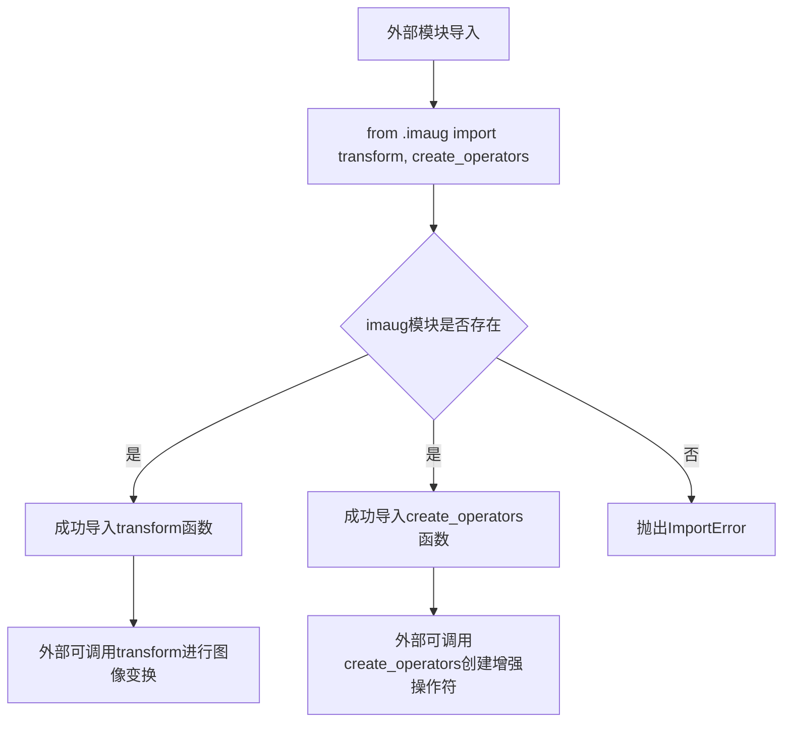
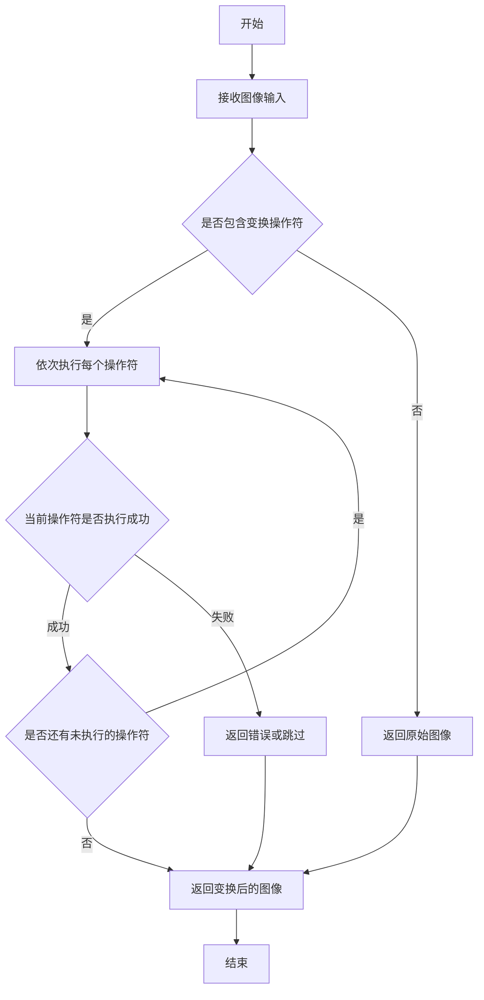
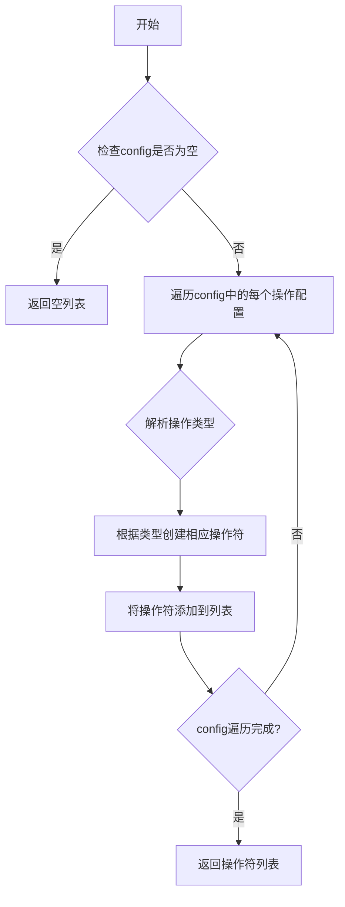

# `MinerU\mineru\model\utils\pytorchocr\data\__init__.py` 详细设计文档

这是一个图像数据增强模块的初始化文件，通过从子模块imaug导入transform和create_operators函数，为外部提供图像变换和数据增强操作符创建的接口支持。

## 整体流程



## 类结构

```
无类层次结构（纯函数模块）
imaug 子模块
└── transform 函数
└── create_operators 函数
```

## 全局变量及字段


    

## 全局函数及方法


### `transform` (从 `.imaug` 模块导入)

该函数是图像增强/数据预处理的核心变换函数，负责对输入图像进行一系列的几何或颜色变换，以实现数据增强效果，提高模型的泛化能力。由于代码中仅包含导入语句，未展示具体实现，以下信息基于模块名称和常见图像处理框架的推断。

#### 参数

- 由于代码中仅包含导入语句，未定义具体参数。根据常见图像增强模块的典型设计，推断参数可能包含：
  - `img`：`numpy.ndarray` 或 `PIL.Image`，输入图像数据
  - `ops`：`list`，由 `create_operators` 创建的操作符列表，用于定义具体的变换序列

#### 返回值

- 推断返回值为变换后的图像数据，类型与输入类型一致（通常为 `numpy.ndarray`）。

#### 流程图



#### 带注释源码

```python
# 当前代码文件仅包含以下导入语句：
from __future__ import absolute_import
from __future__ import division
from __future__ import print_function
from __future__ import unicode_literals

# 从当前包下的 imaug 模块导入 transform 函数
# imaug 通常是 'image augmentation' 的缩写，表示图像增强模块
# transform 函数的具体实现位于 imaug.py 文件中，当前代码不可见
from .imaug import transform, create_operators

# transform 函数通常的调用模式（推断）：
# import numpy as np
# from imaug import transform, create_operators
#
# # 假设已定义操作符配置
# config = [{'type': 'Resize', 'size': [224, 224]}, {'type': 'Normalize'}]
# operators = create_operators(config)
#
# # 读取图像
# img = np.array(...)  # 原始图像数据
#
# # 应用变换
# transformed_img = transform(img, operators)
```

#### 备注

由于提供的代码片段仅包含导入语句，未包含 `transform` 函数的实际定义，无法获取其完整方法签名、详细流程图和带注释的完整源码。建议查看 `imaug.py` 文件以获取 `transform` 函数的完整实现细节。


### `create_operators`

根据提供的代码片段，`create_operators` 是从 `imaug` 模块导入的函数，但代码中未包含其具体实现。以下是基于常见图像数据增强模式的典型分析。

参数：

- `config`： `list`，数据增强配置列表，每个元素通常为一个字典，包含操作类型和对应参数
- `global_config`： `dict`（可选），全局配置信息，如图像尺寸、归一化参数等

返回值：`list`，返回数据增强操作符（operators）列表，每个操作符为可调用对象

#### 流程图



#### 带注释源码

```python
# 注意：以下为基于常见图像增强库的典型实现示例，非给定代码中的实际实现
def create_operators(config, global_config=None):
    """
    创建数据增强操作符列表
    
    参数:
        config: 数据增强配置列表，如 [{'type': 'Resize', 'size': [224, 224]}, {'type': 'Normalize'}]
        global_config: 全局配置，可选
    
    返回:
        操作符列表，每个元素为可调用对象
    """
    # 初始化操作符列表
    ops = []
    
    # 检查配置是否为空
    if not config:
        return ops
    
    # 遍历每个增强配置
    for item in config:
        # 获取操作类型
        op_type = item.get('type')
        # 获取该操作的参数（排除type字段）
        params = {k: v for k, v in item.items() if k != 'type'}
        
        # 根据类型创建相应的操作符
        # 这里通常有操作符注册表，根据op_type实例化对应类
        # 示例：
        # if op_type == 'Resize':
        #     op = ResizeOperator(**params)
        # elif op_type == 'Normalize':
        #     op = NormalizeOperator(**params)
        # ops.append(op)
        
        # 实际实现需要查看imaug模块中的注册机制
        pass
    
    return ops
```

#### 备注

由于提供的代码片段仅包含导入语句，未展示 `create_operators` 的具体实现，因此无法提供精确的源码。若需完整分析，请提供 `imaug.py` 模块中该函数的实际实现代码。

## 关键组件


这段代码是Python 2/3兼容的模块初始化文件，主要用于从子模块`imaug`导入图像增强相关的核心操作函数`transform`和`create_operators`，为上层调用者提供统一的接口。

文件整体运行流程非常简单：Python解释器首先执行兼容性导入，然后从本地包`imaug`模块导入所需的变换操作符。导入语句在模块首次被加载时执行，这些函数随后可用于其他模块的调用。

由于该代码片段仅包含导入语句，未定义任何类，因此无类字段、类方法、全局变量或全局函数的信息可提供。

关键组件如下：

### transform 函数
从imaug模块导入的图像变换核心函数，负责对输入图像执行预定义的增强操作。

### create_operators 函数
从imaug模块导入的操作符工厂函数，用于创建图像增强操作符集合。

由于代码仅包含导入语句，缺乏具体的实现细节，因此无法进行深入的技术债务分析。从现有代码来看，潜在优化空间包括：为导入的函数添加类型注解和详细的文档字符串，以及考虑使用惰性导入来加速模块初始化。

其他方面，设计目标主要考虑Python 2/3兼容性，错误处理依赖于imaug模块的具体实现。外部依赖为imaug子模块，需要确保该模块存在且导出的函数接口稳定。数据流方面，transform函数接收图像数据并返回增强后的图像，create_operators返回操作符列表供transform使用。


## 问题及建议


### 已知问题

-   **过时的Python 2兼容代码**：代码中使用了`from __future__ import absolute_import`等语句，表明项目曾需兼容Python 2，但Python 2已停止支持，这些导入可能不再必要，增加了代码复杂性。
-   **缺少文档和注释**：当前文件（可能为`__init__.py`）没有模块文档字符串，未说明该包的功能及导出的`transform`和`create_operators`的用途。
-   **紧耦合的导入**：直接通过相对导入从`.imaug`模块获取`transform`和`create_operators`，如果`imaug`模块结构变化或存在循环导入风险，会导致该包脆弱。
-   **无错误处理**：导入语句未包含任何异常处理，若`imaug`模块缺失或导入失败，将抛出模糊的模块未找到错误。

### 优化建议

-   **移除过时的Python 2支持**：如果项目不再需要Python 2兼容，移除所有`__future__`导入，以简化代码并遵循现代Python实践。
-   **添加文档字符串**：在文件开头添加模块级docstring，描述该包为图像数据增强（imaug）接口，并说明导出的函数/类的用途。
-   **考虑延迟导入或重构**：如果`imaug`模块较重或频繁变动，可考虑在函数内部导入（延迟导入），或通过`__all__`明确公共API，减少直接导入带来的耦合。
-   **增强错误处理**：使用try-except捕获导入错误，提供更友好的错误信息，例如提示依赖未安装。


## 其它


### 设计目标与约束

本模块作为图像数据增强（Data Augmentation）模块的入口点，核心目标是对外提供统一的图像变换接口。设计约束包括：1）必须兼容Python 2.7和Python 3.x版本；2）依赖的imaug模块必须实现transform和create_operators两个核心函数；3）保持模块接口的简洁性和稳定性。

### 错误处理与异常设计

模块级别的错误处理主要依赖imaug子模块的实现。当import语句执行时，如果imaug模块不存在或缺少指定的函数，将抛出ImportError或AttributeError。建议在调用transform和create_operators时进行异常捕获，并向上层调用者提供清晰的错误信息。

### 外部依赖与接口契约

本模块的直接外部依赖为imaug模块，需要imaug模块提供以下接口契约：1）transform函数：接收图像数据和操作符列表，返回变换后的图像；2）create_operators函数：接收配置参数，返回操作符列表。两个函数的参数类型、返回值类型和异常行为需要在imaug模块中明确定义。

### 版本兼容性

通过from __future__ import语句确保了与Python 2.7的兼容性（absolute_import、division、print_function、unicode_literals）。imaug模块及其依赖的第三方库（如NumPy、PIL等）也需要考虑版本兼容性问题。

### 配置管理

当前模块未包含配置管理功能，配置通过create_operators函数的参数传入。配置内容可能包括：数据增强的操作类型、操作顺序、参数值、随机种子等。建议使用配置文件或配置类来集中管理这些参数。

### 性能考虑

模块本身仅为简单的导入中转，性能开销可忽略。主要性能瓶颈在transform函数的图像处理逻辑和create_operators的操作符创建过程。建议：1）对频繁调用的操作符进行缓存；2）对于大数据量处理，考虑批量处理和并行化。

### 安全性考虑

当前模块不涉及用户输入处理或网络通信，安全性风险较低。但需要注意：1）imaug模块中加载的图像处理库可能存在安全漏洞，需要定期更新；2）如果配置中包含文件路径，应进行路径遍历检查。

### 测试策略

建议为该模块编写以下测试：1）导入测试：验证模块可以正常导入且imaug模块可用；2）接口测试：验证transform和create_operators函数的存在性和可调用性；3）集成测试：与imaug模块联合测试，验证完整的图像增强流程。

### 日志与监控

当前模块未包含日志功能。建议在imaug模块的transform和create_operators函数中添加适当的日志记录，包括：函数调用入口、操作符执行情况、处理耗时、异常信息等。日志级别建议使用DEBUG和INFO级别，便于问题排查和性能监控。


    