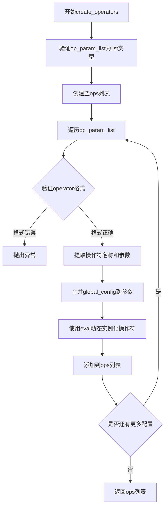

# `MinerU\mineru\model\utils\pytorchocr\data\imaug\__init__.py` 详细设计文档

这是一个数据转换与增强管道模块，提供通用的数据处理流程框架。它通过可配置的算子（operators）列表对输入数据（如图像、文本等）进行连续转换处理，常见于OCR识别或图像预处理Pipeline中。

## 整体流程

```mermaid
graph TD
    A[开始] --> B{ops参数为空?}
    B -- 是 --> C[直接返回原始data]
    B -- 否 --> D[遍历ops列表]
    D --> E{当前operator处理data}
    E -- data为None --> F[立即返回None]
    E -- data有效 --> G[更新data]
    G --> D
    D --> H[完成所有转换]
    H --> I[返回处理后的data]

graph TD
    J[create_operators开始] --> K{验证op_param_list类型}
    K -- 不是list --> L[抛出AssertionError]
    K -- 是list --> M[创建空ops列表]
    M --> N[遍历operator配置列表]
    N --> O{验证单个operator格式}
    O -- 格式错误 --> P[抛出AssertionError]
    O -- 格式正确 --> Q[提取op_name和param]
    Q --> R[合并global_config到param]
    R --> S[使用eval动态创建算子实例]
    S --> T[添加到ops列表]
    T --> N
    N --> U[返回ops列表]
```

## 类结构

```
transforms (模块包)
└── functions
    ├── transform() - 数据转换主函数
    └── create_operators() - 算子工厂函数

operators (子模块,导入)
└── 各类算子实现
```

## 全局变量及字段


### `ops`
    
存储算子实例的列表，用于对输入数据依次执行变换操作

类型：`list`
    


### `operator`
    
单个算子的配置字典，包含算子名称和对应的参数字典

类型：`dict`
    


### `op_name`
    
算子名称字符串，用于从配置中定位并实例化对应的算子类

类型：`str`
    


### `param`
    
算子参数字典，包含算子的具体参数，可选地合并全局配置

类型：`dict`
    


### `data`
    
输入或输出的数据对象，经过算子链处理后可能返回None或变换后的数据

类型：`any`
    


### `op_param_list`
    
算子配置列表，每个元素是一个单键字典，键为算子名称，值为参数字典或None

类型：`list`
    


### `global_config`
    
全局配置字典，可选，用于为所有算子提供共享的默认参数

类型：`dict`
    


    

## 全局函数及方法


### `transform`

数据转换管道，遍历算子列表依次处理数据，将输入数据通过每个算子进行转换，如果某个算子返回None则提前终止并返回None。

参数：

- `data`：任意类型，输入数据，待处理的数据对象
- `ops`：可选参数，默认为`None`，实际类型为`list`，算子列表，每个元素是一个可调用对象（算子），用于依次处理数据

返回值：`任意类型`，处理后的数据或`None`，如果所有算子处理成功则返回最终数据，如果某个算子返回`None`则提前终止并返回`None`

#### 流程图

```mermaid
flowchart TD
    A[开始 transform] --> B{ops is None?}
    B -->|是| C[将 ops 设置为空列表]
    B -->|否| D[保持 ops 不变]
    C --> E[遍历 ops 中的每个算子]
    D --> E
    E --> F[调用 op(data) 处理数据]
    F --> G{data is None?}
    G -->|是| H[返回 None]
    G -->|否| I[将处理后的数据赋值给 data]
    I --> J{还有更多算子?}
    J -->|是| F
    J -->|否| K[返回最终处理后的 data]
```

#### 带注释源码

```python
def transform(data, ops=None):
    """ transform 
    数据转换管道，遍历算子列表依次处理数据
    
    Args:
        data: 输入数据，待处理的数据对象
        ops: 算子列表，每个元素是一个可调用对象，默认为空列表
    
    Returns:
        处理后的数据，如果某个算子返回None则返回None
    """
    # 如果没有传入ops参数，默认为空列表
    if ops is None:
        ops = []
    # 遍历每一个算子，依次处理数据
    for op in ops:
        # 使用当前算子处理数据
        data = op(data)
        # 如果当前算子返回None，提前终止处理流程
        if data is None:
            return None
    # 返回处理后的数据
    return data
```


### `create_operators`

算子工厂函数，根据配置动态创建算子实例。该函数接收算子配置列表，通过eval动态实例化算子对象，支持全局配置参数合并。

参数：

- `op_param_list`：`list`，算子配置列表，每个元素为单键字典，键为算子类名，值为算子参数字典（可为None）
- `global_config`：`dict`，可选的全局配置参数，会合并到每个算子的参数中

返回值：`list`，返回创建的算子实例列表

#### 流程图

```mermaid
flowchart TD
    A[开始 create_operators] --> B{op_param_list 是否为列表}
    B -- 否 --> C[断言失败，抛出异常]
    B -- 是 --> D[初始化空列表 ops]
    E[遍历 op_param_list 中的每个 operator] --> F{operator 是否为单键字典}
    F -- 否 --> G[断言失败，抛出异常]
    F -- 是 --> H[提取算子名称 op_name]
    I{operator[op_name] 是否为 None} --> |是| J[param = {}]
    I --> |否| K[param = operator[op_name]]
    J --> L{global_config 是否为 None}
    K --> L
    L -- 否 --> M[param.update(global_config)]
    L -- 是 --> N[使用 eval 创建算子实例: op = eval(op_name)(**param)]
    M --> N
    N --> O[ops.append(op)]
    O --> P{是否还有更多 operator}
    P -- 是 --> E
    P -- 否 --> Q[返回 ops 列表]
    Q --> R[结束]
```

#### 带注释源码

```python
def create_operators(op_param_list, global_config=None):
    """
    create operators based on the config
    Args:
        params(list): a dict list, used to create some operators
    """
    # 断言 op_param_list 必须为列表类型，否则抛出 AssertionError
    assert isinstance(op_param_list, list), ('operator config should be a list')
    
    # 初始化空列表，用于存储创建的算子实例
    ops = []
    
    # 遍历配置列表中的每个算子配置
    for operator in op_param_list:
        # 断言每个配置必须为单键字典格式，否则抛出 AssertionError
        assert isinstance(operator, dict) and len(operator) == 1, "yaml format error"
        
        # 提取算子名称（字典的第一个键）
        op_name = list(operator)[0]
        
        # 如果算子参数为 None，则使用空字典；否则使用配置参数字典
        param = {} if operator[op_name] is None else operator[op_name]
        
        # 如果存在全局配置，将其合并到算子参数中（全局配置优先级较低，会被算子特定参数覆盖）
        if global_config is not None:
            param.update(global_config)
        
        # 使用 eval 动态创建算子实例：eval(op_name) 获取类对象，(**param) 传入参数
        op = eval(op_name)(**param)
        
        # 将创建的算子实例添加到列表中
        ops.append(op)
    
    # 返回所有创建的算子实例列表
    return ops
```

## 关键组件


### transform 函数

数据转换主管道，接收输入数据和操作符列表，依次执行每个操作符的处理，如果某个操作符返回 None 则终止流水线，适用于图像预处理和数据增强场景。

### create_operators 函数

动态操作符工厂，根据配置列表使用 eval 动态实例化操作符对象，支持全局配置合并，返回可执行的操作符实例列表，用于构建数据处理管道。

### operators 模块（.operators）

惰性加载的操作符集合，通过 `from .operators import *` 实现按需导入，封装了各类图像处理操作（可能包含数据增强、变换、标签处理等功能），是数据流水线的核心组件。

### 全局配置机制

通过 `global_config` 参数实现全局配置共享，允许在多个操作符间传递共享参数（如图像尺寸、通道数等），避免配置重复。

### 操作符注册与反射机制

使用 `eval(op_name)(**param)` 实现运行时动态实例化，通过操作符名称字符串动态创建对象，提供灵活的扩展性。


## 问题及建议


### 已知问题

-   **使用eval()动态执行代码**：在`create_operators`函数中使用`eval(op_name)(**param)`动态创建运算符，存在严重的安全风险，可能导致代码注入攻击。
-   **大量废弃代码未清理**：文件顶部存在大量被注释掉的导入语句（IaaAugment、MakeBorderMap、RecAug等），这些可能是过时的依赖或已废弃的功能，造成代码混乱。
-   **缺乏输入验证与错误处理**：当`eval()`调用失败或运算符构造失败时，代码没有捕获异常，只依赖断言，错误信息不够友好。
-   **缺少类型注解**：函数参数和返回值都没有类型提示，不利于IDE自动补全和静态类型检查。
-   **全局配置传递方式不清晰**：`global_config`参数的使用方式较为隐式，且直接修改param字典可能导致意外副作用。
-   **transform函数缺乏文档**：仅以"transform"作为docstring，缺少对参数和返回值的说明。
-   **硬编码的断言逻辑**：使用断言进行配置验证，生产环境中可能被Python -O选项禁用。

### 优化建议

-   **替换eval为安全的类注册机制**：建立运算符注册表（Registry）模式，使用字典映射替代eval，提高安全性并便于维护。
-   **清理废弃代码**：移除或归档被注释的导入语句，保持代码库整洁。
-   **添加异常处理**：使用try-except捕获运算符创建和执行过程中的异常，提供有意义的错误信息。
-   **添加类型注解**：使用Python typing模块为函数参数和返回值添加类型提示。
-   **改进文档**：为所有函数添加完整的docstring，包括参数说明、返回值描述和使用示例。
-   **使用logging替代断言**：在生产环境中使用logging进行配置验证，确保验证逻辑始终执行。
-   **考虑使用数据类或配置类**：使用dataclass或Pydantic模型定义配置结构，提供更清晰的配置格式和自动验证。

## 其它


### 核心功能概述

该代码模块是PaddleOCR框架中的数据预处理与增强核心模块，通过统一的transform接口和create_operators工厂函数，动态加载并执行各种图像预处理操作符，用于OCR识别前的图像标准化、增强和格式转换。

### 文件整体运行流程

1. 模块初始化时导入operators子模块中的所有操作符
2. 用户调用create_operators函数，传入操作符配置列表
3. 函数解析配置，提取操作符名称和参数
4. 使用eval动态实例化每个操作符对象
5. 用户调用transform函数，传入原始数据和已创建的操作符列表
6. transform依次执行每个操作符，任何操作返回None则终止流程
7. 返回处理后的数据字典

### 全局变量和全局函数详细信息

#### 全局变量

| 名称 | 类型 | 描述 |
|------|------|------|
| operators | module | 从.operators模块导入的所有图像处理操作符集合 |

#### 全局函数

##### transform

- **参数**:
  - data: dict, 输入数据字典，包含待处理的图像数据
  - ops: list, 操作符列表，默认为空列表
- **返回值**: dict or None, 处理后的数据字典，操作失败返回None
- **mermaid流程图**:
```mermaid
flowchart TD
    A[开始transform] --> B{ops是否为空}
    B -->|是| C[返回原始data]
    B -->|否| D[遍历ops列表]
    D --> E[执行op[data]]
    E --> F{data是否为None}
    F -->|是| G[返回None]
    F -->|否| H{是否还有更多ops}
    H -->|是| D
    H -->|否| I[返回处理后的data]
```
- **源码**:
```python
def transform(data, ops=None):
    """ transform """
    if ops is None:
        ops = []
    for op in ops:
        data = op(data)
        if data is None:
            return None
    return data
```

##### create_operators

- **参数**:
  - op_param_list: list, 操作符配置字典列表，每个元素为{操作符名: 参数dict}格式
  - global_config: dict, 可选的全局配置参数，会合并到每个操作符参数中
- **返回值**: list, 实例化后的操作符对象列表
- **mermaid流程图**:

- **源码**:
```python
def create_operators(op_param_list, global_config=None):
    """
    create operators based on the config
    Args:
        params(list): a dict list, used to create some operators
    """
    assert isinstance(op_param_list, list), ('operator config should be a list')
    ops = []
    for operator in op_param_list:
        assert isinstance(operator,
                          dict) and len(operator) == 1, "yaml format error"
        op_name = list(operator)[0]
        param = {} if operator[op_name] is None else operator[op_name]
        if global_config is not None:
            param.update(global_config)
        op = eval(op_name)(**param)
        ops.append(op)
    return ops
```

### 关键组件信息

| 名称 | 描述 |
|------|------|
| operators模块 | 包含各种图像预处理操作符的集合，如IaaAugment、MakeBorderMap、MakeShrinkMap等 |
| transform函数 | 数据转换管道，执行已配置的操作序列 |
| create_operators工厂函数 | 动态创建操作符实例的工厂方法 |

### 潜在技术债务或优化空间

1. **eval安全风险**: 使用eval动态执行代码存在严重的安全风险，建议使用getattr或注册机制替代
2. **缺乏类型提示**: 代码未使用Python类型注解，不利于IDE支持和代码审查
3. **错误信息不够详细**: 断言失败信息过于简略，缺少上下文信息
4. **注释代码过多**: 存在大量被注释掉的导入语句，应清理或启用
5. **无日志记录**: 缺少日志打印，调试困难，生产环境难以追踪问题

### 设计目标与约束

- **设计目标**: 提供统一的图像预处理流水线，支持灵活的操作符配置和动态加载
- **约束条件**: 
  - 操作符必须实现可调用接口（__call__方法）
  - 操作符必须接受单个data字典参数并返回处理后的data字典或None
  - 配置格式必须为{操作符名: 参数dict}或{操作符名: None}

### 错误处理与异常设计

- **参数类型验证**: 使用assert验证op_param_list必须为list类型
- **配置格式验证**: 验证每个operator必须为dict且长度为1
- **处理失败处理**: 单个操作符返回None时立即终止流水线并向上传递None
- **潜在异常**: 
  - TypeError: 操作符参数类型不匹配时抛出
  - AttributeError: 操作符不存在或未正确定义时抛出
  - NameError: eval无法找到对应操作符类时抛出

### 数据流与状态机

数据流为线性流水线模式：
```
原始数据字典 -> 操作符1 -> 处理后数据字典 -> 操作符2 -> ... -> 操作符N -> 最终数据字典
```

状态机包含两种状态：
- **正常状态**: 所有操作符成功执行，数据正常流转
- **终止状态**: 任何操作符返回None，流水线终止并返回None

### 外部依赖与接口契约

- **输入数据格式**: 字典类型，必须包含图像数据键（通常为'image'）
- **输出数据格式**: 字典类型，包含处理后的图像数据和可能产生的中间结果
- **操作符接口契约**: 
  - 必须实现__call__(self, data)方法
  - data参数为字典类型
  - 返回值必须为字典类型或None
- **依赖模块**: 
  - __future__模块: 用于Python 2/3兼容性
  - .operators模块: 包含实际图像处理操作符

### 性能考虑与优化空间

1. **操作符延迟实例化**: 考虑缓存已创建的操作符实例，避免重复创建
2. **并行处理**: 可考虑对独立的操作符进行并行处理
3. **内存优化**: 对于大图像处理，考虑使用生成器或流式处理

### 安全性考虑

1. **eval使用风险**: 当前使用eval动态实例化操作符，存在代码注入风险
2. **建议改进**: 使用操作符注册表或getattr反射机制替代eval
3. **输入验证**: 应增加对操作符参数的schema验证

### 测试策略建议

1. **单元测试**: 测试create_operators对各种配置格式的处理
2. **集成测试**: 测试完整transform流水线的正确性
3. **边界测试**: 测试空操作符列表、单操作符、返回None的处理
4. **异常测试**: 测试各种错误配置下的异常抛出

### 配置管理

- **配置来源**: 通过op_param_list参数传入，通常来自YAML配置文件
- **全局配置**: 支持通过global_config参数传入全局共享参数
- **参数合并**: 全局配置与个体操作符参数合并，个体参数优先级更高

    