# `MinerU\mineru\model\utils\pytorchocr\data\imaug\operators.py` 详细设计文档

这是PaddlePaddle PPOCR框架的图片预处理管道，包含了多个图像转换类，用于OCR任务中的图像解码、归一化、resize等操作，支持文本检测、识别、端到端和关键信息提取等多种场景。

## 整体流程

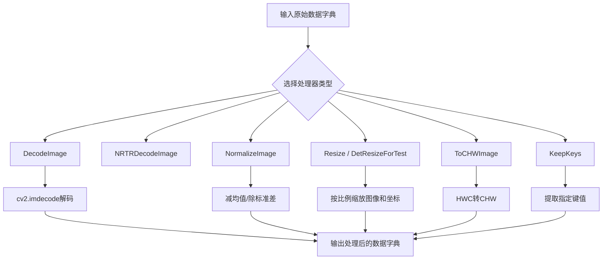

## 类结构

```
Preprocessing Pipeline (图像预处理基类)
├── DecodeImage (图像解码类)
├── NRTRDecodeImage (NRTR图像解码类)
├── NormalizeImage (图像归一化类)
├── ToCHWImage (图像格式转换类)
├── Fasttext (FastText标签处理类)
├── KeepKeys (键值保留类)
├── Resize (通用缩放类)
├── DetResizeForTest (检测任务缩放类)
│   ├── resize_image_type0 (限制边长类型)
│   ├── resize_image_type1 (指定尺寸类型)
│   └── resize_image_type2 (长边缩放类型)
├── E2EResizeForTest (端到端缩放类)
└── KieResize (关键信息提取缩放类)
```

## 全局变量及字段


### `DecodeImage.img_mode`
    
图像模式 ('RGB' 或 'GRAY')

类型：`str`
    


### `DecodeImage.channel_first`
    
是否将通道维度放在第一位

类型：`bool`
    


### `NRTRDecodeImage.img_mode`
    
图像模式

类型：`str`
    


### `NRTRDecodeImage.channel_first`
    
是否通道优先

类型：`bool`
    


### `NormalizeImage.scale`
    
缩放因子

类型：`float`
    


### `NormalizeImage.mean`
    
均值

类型：`list`
    


### `NormalizeImage.std`
    
标准差

类型：`list`
    


### `NormalizeImage.order`
    
通道顺序 ('chw' 或 'hwc')

类型：`str`
    


### `Fasttext.fast_model`
    
FastText模型对象

类型：`object`
    


### `KeepKeys.keep_keys`
    
需要保留的键列表

类型：`list`
    


### `Resize.size`
    
目标尺寸 (高, 宽)

类型：`tuple`
    


### `DetResizeForTest.resize_type`
    
缩放类型标识

类型：`int`
    


### `DetResizeForTest.image_shape`
    
目标图像形状

类型：`tuple`
    


### `DetResizeForTest.limit_side_len`
    
限制边长

类型：`int`
    


### `DetResizeForTest.limit_type`
    
限制类型 ('min'/'max'/'resize_long')

类型：`str`
    


### `DetResizeForTest.resize_long`
    
长边目标长度

类型：`int`
    


### `E2EResizeForTest.max_side_len`
    
最大边长限制

类型：`int`
    


### `E2EResizeForTest.valid_set`
    
验证集类型

类型：`str`
    


### `KieResize.max_side`
    
最大边长

类型：`int`
    


### `KieResize.min_side`
    
最小边长

类型：`int`
    
    

## 全局函数及方法


### DecodeImage.__init__

该方法是图像解码类 DecodeImage 的构造函数，用于初始化图像解码所需的参数，包括图像色彩模式和通道顺序配置。

参数：

- `img_mode`：`str`，图像色彩模式，默认为 'RGB'，支持 'RGB' 和 'GRAY' 两种模式，用于指定解码后图像的色彩空间
- `channel_first`：`bool`，通道顺序标志，默认为 False，当设为 True 时将图像从 HWC 格式转换为 CHW 格式
- `**kwargs`：`dict`，可变关键字参数，用于接收其他可选配置参数

返回值：`None`，该方法无返回值，仅完成实例属性的初始化

#### 流程图

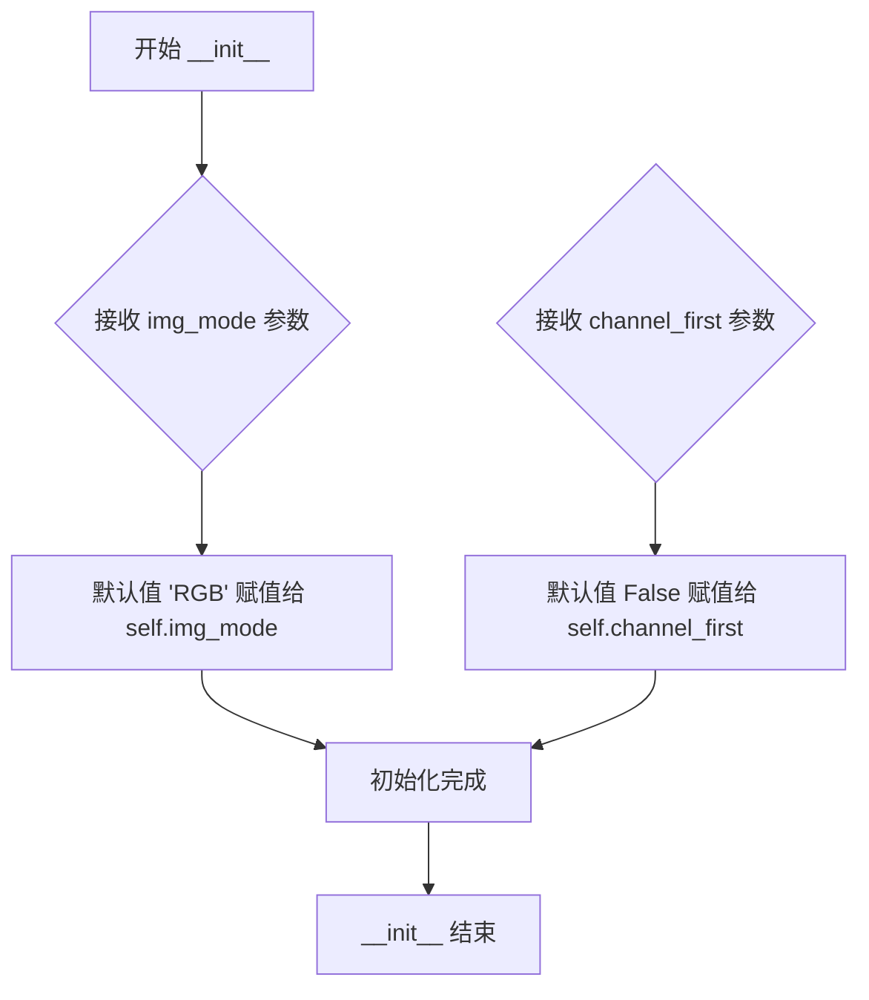

#### 带注释源码

```python
def __init__(self, img_mode='RGB', channel_first=False, **kwargs):
    """
    初始化解码图像转换器
    
    参数:
        img_mode (str): 目标图像色彩模式，支持 'RGB' 和 'GRAY'，默认为 'RGB'
        channel_first (bool): 是否将通道维度前置，False 表示 HWC 格式，True 表示 CHW 格式
        **kwargs: 接受其他可选参数用于接口兼容性
    """
    # 设置图像色彩模式属性，用于后续 __call__ 方法中决定图像转换方式
    self.img_mode = img_mode
    
    # 设置通道顺序属性，用于决定是否需要转置图像维度
    self.channel_first = channel_first
```


### `DecodeImage.__call__`

该方法是 DecodeImage 类的核心调用方法，负责将输入的图像字节数据解码为 NumPy 数组，并根据配置进行颜色通道转换和格式调整，最后将解码后的图像数据放回数据字典中返回。

参数：

- `data`：`dict`，包含键 `'image'` 的字典，其中 `'image'` 的值是图像的字节数据（Python 3 中为 `bytes`，Python 2 中为 `str`）

返回值：`dict` 或 `None`，返回包含解码后图像的字典，如果解码失败则返回 `None`

#### 流程图

```mermaid
flowchart TD
    A[开始: data] --> B[获取 data['image']]
    B --> C{检查 Python 版本}
    C -->|PY2| D{type is str 且 len > 0}
    C -->|PY3| E{type is bytes 且 len > 0}
    D --> F[断言失败则抛出异常]
    E --> F
    F --> G[使用 np.frombuffer 转换为 uint8 数组]
    G --> H[使用 cv2.imdecode 解码图像]
    H --> I{解码结果是否为 None}
    I -->|是| J[返回 None]
    I -->|否| K{img_mode == 'GRAY'}
    K -->|是| L[cv2.cvtColor GRAY2BGR]
    K -->|否| M{img_mode == 'RGB'}
    M -->|是| N[通道反转: img[:, :, ::-1]]
    M -->|否| O[保持原样]
    N --> P{channel_first}
    L --> P
    O --> P
    P -->|是| Q[transpose (2,0,1) HWC->CHW]
    P -->|否| R[保持 HWC]
    Q --> S[data['image'] = img]
    R --> S
    S --> T[返回 data]
```

#### 带注释源码

```python
def __call__(self, data):
    """
    解码图像数据并返回处理后的数据字典
    
    参数:
        data: dict, 包含 'image' 键的字典，'image' 值为图像字节数据
    
    返回:
        dict: 包含解码后图像数据的字典
        None: 如果图像解码失败
    """
    # 从输入数据字典中获取图像字节数据
    img = data['image']
    
    # 根据 Python 版本进行类型检查
    # Python 2: 图像应为字符串类型
    # Python 3: 图像应为字节类型
    if six.PY2:
        assert type(img) is str and len(
            img) > 0, "invalid input 'img' in DecodeImage"
    else:
        assert type(img) is bytes and len(
            img) > 0, "invalid input 'img' in DecodeImage"
    
    # 将字节数据转换为 NumPy uint8 数组
    # 使用 frombuffer 而非 fromstring，以避免复制数据
    img = np.frombuffer(img, dtype='uint8')
    
    # 使用 OpenCV 解码图像
    # 第二个参数 1 表示加载为 BGR 彩色图像
    img = cv2.imdecode(img, 1)
    
    # 检查解码是否成功
    if img is None:
        return None
    
    # 根据 img_mode 进行颜色空间转换
    if self.img_mode == 'GRAY':
        # 如果需要灰度图，先转换为灰度再转为 BGR（保持 3 通道）
        img = cv2.cvtColor(img, cv2.COLOR_GRAY2BGR)
    elif self.img_mode == 'RGB':
        # 验证图像确实是 3 通道
        assert img.shape[2] == 3, 'invalid shape of image[%s]' % (img.shape)
        # BGR 转 RGB：通道顺序反转
        img = img[:, :, ::-1]

    # 如果需要通道优先（CHW 格式），进行维度转置
    # 从 HWC (高度, 宽度, 通道) 转为 CHW (通道, 高度, 宽度)
    if self.channel_first:
        img = img.transpose((2, 0, 1))

    # 将解码后的图像存回数据字典
    data['image'] = img
    
    # 返回包含解码图像的数据字典
    return data
```


### `NRTRDecodeImage.__init__`

初始化 NRTR（No-Recognition Text Recognition）图像解码器的参数，设置图像处理模式和通道顺序。

参数：

- `img_mode`：`str`，默认值 `'RGB'`，图像色彩模式，支持 `'RGB'` 或 `'GRAY'`
- `channel_first`：`bool`，默认值 `False`，是否将通道维度置于图像维度之前（CHW 格式）
- `**kwargs`：`dict`，接收其他可选参数（未使用但保持接口一致性）

返回值：`None`，`__init__` 方法不返回任何值

#### 流程图

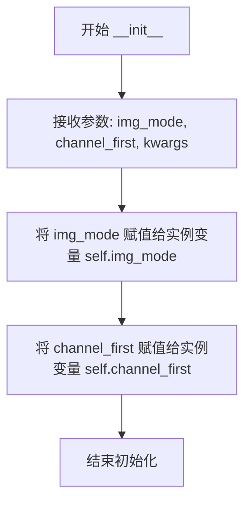

#### 带注释源码

```python
def __init__(self, img_mode='RGB', channel_first=False, **kwargs):
    """
    初始化 NRTRDecodeImage 解码器
    
    参数:
        img_mode: str, 图像色彩模式，默认为 'RGB'，也支持 'GRAY'
        channel_first: bool, 是否使用通道优先格式（CHW），默认为 False（HWC）
        **kwargs: 接收其他可选参数，保持接口兼容性
    """
    self.img_mode = img_mode      # 存储图像模式配置
    self.channel_first = channel_first  # 存储通道顺序配置
```


### `NRTRDecodeImage.__call__`

该方法是NRTRDecodeImage类的可调用接口，负责将输入的图像字节数据解码为OpenCV图像格式，并转换为灰度图，以供下游OCR任务使用。

参数：

- `data`：`dict`，包含图像数据的字典，必须包含键`'image'`，其值为图像的字节数据（bytes类型）

返回值：`dict`，处理后的数据字典，键`'image'`的值被替换为解码并转换后的灰度图像数组（numpy.ndarray）

#### 流程图

```mermaid
flowchart TD
    A[输入data字典] --> B[提取data['image']]
    B --> C{检查Python版本}
    C -->|PY2| D{检查img是str且长度>0}
    C -->|PY3| E{检查img是bytes且长度>0}
    D --> F[断言失败则抛异常]
    E --> F
    F --> G[使用np.frombuffer将bytes转为uint8数组]
    G --> H[使用cv2.imdecode解码图像]
    H --> I{解码结果是否为None}
    I -->|是| J[返回None]
    I -->|否| K{img_mode是否为'GRAY'}
    K -->|是| L[将灰度图转为BGR]
    K -->|否| M{img_mode是否为'RGB'}
    M -->|是| N[检查通道数为3<br/>BGR转RGB]
    M -->|否| O[不做处理]
    L --> P
    N --> P
    O --> P
    P[将BGR图转为灰度图GRAY]
    P --> Q{channel_first为True?}
    Q -->|是| R[转置图像维度<br/>HWC转CHW]
    Q -->|否| S[保持原样]
    R --> T[更新data['image']]
    S --> T
    T --> U[返回data]
```

#### 带注释源码

```python
def __call__(self, data):
    """
    解码图像并转换为灰度图
    
    参数:
        data (dict): 包含'image'键的字典，'image'值为图像字节数据
    
    返回:
        dict: 处理后的字典，'image'键的值被替换为灰度图像数组
    """
    # 从输入字典中提取图像数据
    img = data['image']
    
    # Python2和Python3的兼容性处理：检查输入类型
    if six.PY2:
        # Python2下image应为字符串路径或字节数据
        assert type(img) is str and len(img) > 0, "invalid input 'img' in DecodeImage"
    else:
        # Python3下image必须为bytes类型且非空
        assert type(img) is bytes and len(img) > 0, "invalid input 'img' in DecodeImage"
    
    # 将字节数据转换为uint8类型的NumPy数组
    img = np.frombuffer(img, dtype='uint8')
    
    # 使用OpenCV解码图像，参数1表示加载为彩色图像(BGR)
    img = cv2.imdecode(img, 1)
    
    # 解码失败时返回None
    if img is None:
        return None
    
    # 根据img_mode进行颜色空间转换
    if self.img_mode == 'GRAY':
        # 如果模式为GRAY，先转为BGR（为后续统一处理做准备）
        img = cv2.cvtColor(img, cv2.COLOR_GRAY2BGR)
    elif self.img_mode == 'RGB':
        # 检查图像通道数是否为3
        assert img.shape[2] == 3, 'invalid shape of image[%s]' % (img.shape)
        # BGR转RGB（通道顺序反转）
        img = img[:, :, ::-1]
    
    # 核心操作：将彩色图像转为灰度图（NRTR任务特定）
    img = cv2.cvtColor(img, cv2.COLOR_BGR2GRAY)
    
    # 如果需要通道优先格式(HWC->CHW)
    if self.channel_first:
        # 注意：这里有个潜在bug，灰度图只有2维，转置会报错
        img = img.transpose((2, 0, 1))
    
    # 将处理后的图像存回字典
    data['image'] = img
    return data
```


### NormalizeImage.__init__

初始化归一化参数，包括缩放因子、均值、标准差和通道顺序，用于后续图像归一化处理。

参数：

- `scale`：`float` 或 `str`，缩放因子，字符串会被eval解析，默认为 1.0/255.0
- `mean`：`list`，RGB通道均值，默认为 [0.485, 0.456, 0.406]
- `std`：`list`，RGB通道标准差，默认为 [0.229, 0.224, 0.225]
- `order`：`str`，图像维度顺序，'chw' 表示通道优先，'hwc' 表示高度宽度优先，默认为 'chw'
- `**kwargs`：`dict`，其他关键字参数，用于兼容接口

返回值：`None`，无返回值（构造函数）

#### 流程图

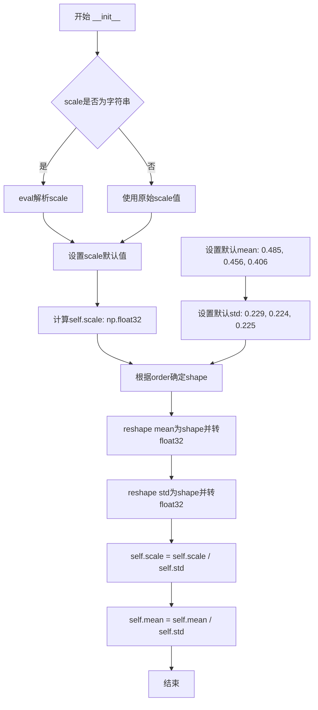

#### 带注释源码

```python
def __init__(self, scale=None, mean=None, std=None, order='chw', **kwargs):
    """
    初始化归一化参数
    
    参数:
        scale: 缩放因子，字符串会被eval解析，默认为1.0/255.0
        mean: RGB通道均值，默认为[0.485, 0.456, 0.406]
        std: RGB通道标准差，默认为[0.229, 0.224, 0.225]
        order: 图像维度顺序，'chw'表示通道优先
        **kwargs: 其他关键字参数
    """
    # 如果scale是字符串，解析为数值
    if isinstance(scale, str):
        scale = eval(scale)
    
    # 设置缩放因子，默认为1.0/255.0，并转换为float32类型
    self.scale = np.float32(scale if scale is not None else 1.0 / 255.0)
    
    # 设置默认均值（ImageNet数据集标准化的均值）
    mean = mean if mean is not None else [0.485, 0.456, 0.406]
    # 设置默认标准差（ImageNet数据集标准化的标准差）
    std = std if std is not None else [0.229, 0.224, 0.225]

    # 根据order确定shape：(3,1,1)表示CHW格式，(1,1,3)表示HWC格式
    shape = (3, 1, 1) if order == 'chw' else (1, 1, 3)
    
    # 将mean和stdreshape为指定形状并转换为float32
    self.mean = np.array(mean).reshape(shape).astype('float32')
    self.std = np.array(std).reshape(shape).astype('float32')
    
    # 预计算：scale和mean都已除以std，简化后续归一化计算
    # 归一化公式: img * scale - mean (其中scale和mean已包含std的处理)
    self.scale = self.scale / self.std
    self.mean = self.mean / self.std
```


### `NormalizeImage.__call__`

对输入图像进行归一化处理，通过减去均值并除以标准差（结合缩放因子）将图像像素值转换到标准分布，用于神经网络模型的输入预处理。

参数：

- `data`：`dict`，包含图像数据的字典，必须包含键 `'image'`，其值为图像数据（numpy 数组或 PIL Image 对象）

返回值：`dict`，归一化后的数据字典，`'image'` 键对应归一化后的浮点类型图像数组

#### 流程图

```mermaid
flowchart TD
    A[开始 __call__] --> B[从 data 获取 image]
    B --> C{判断 img 是否为 PIL Image}
    C -->|是| D[将 PIL Image 转换为 numpy 数组]
    C -->|否| E[直接使用 numpy 数组]
    D --> F[将图像转换为 float32 类型]
    E --> F
    F --> G[乘以缩放因子 self.scale]
    G --> H[减去归一化均值 self.mean]
    H --> I[更新 data['image']]
    I --> J[返回 data]
```

#### 带注释源码

```python
def __call__(self, data):
    """
    执行图像归一化操作
    
    处理流程：
    1. 从输入字典中提取图像数据
    2. 如果是PIL Image对象则转换为numpy数组
    3. 对图像像素值进行归一化：(img * scale) - mean
    """
    # 从输入数据字典中获取图像
    img = data['image']
    
    # 检查图像是否为PIL Image对象
    if isinstance(img, Image.Image):
        # 如果是PIL Image，转换为numpy数组以便处理
        img = np.array(img)
    
    # 归一化处理：(img.astype('float32') * self.scale) - self.mean
    # 其中 self.scale 已经除以了标准差，self.mean 已经除以了标准差
    # 这一步完成了 (img / 255 - mean) / std 的归一化操作
    data['image'] = img.astype('float32') * self.scale - self.mean
    
    # 返回处理后的数据字典
    return data
```


### `ToCHWImage.__init__`

该方法是 `ToCHWImage` 类的构造函数，用于初始化 `ToCHWImage` 类的实例。`ToCHWImage` 类的作用是将 HWC（高度-宽度-通道）格式的图像转换为 CHW（通道-高度-宽度）格式，以适配某些深度学习框架（如 PaddlePaddle）的输入要求。

参数：

- `**kwargs`：`dict`，可变关键字参数，用于接收额外的配置参数（当前实现中未使用，保留以支持接口扩展）

返回值：`None`，该方法为构造函数，不返回任何值

#### 流程图

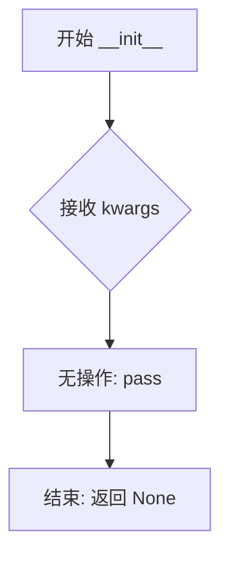

#### 带注释源码

```python
def __init__(self, **kwargs):
    """
    初始化 ToCHWImage 类的实例
    
    参数:
        **kwargs: 可变关键字参数，用于接收额外的配置参数
                  当前实现中未使用，保留以保持接口一致性
    返回:
        None
    """
    pass  # 该方法目前为空实现，不执行任何操作
```

#### 备注

- 该类的实际图像转换逻辑在 `__call__` 方法中实现
- `__init__` 方法设计为空实现，体现了该类无状态（stateless）的特点
- 这种设计允许在数据处理流水线中灵活地插入该转换步骤，而无需额外的初始化参数


### `ToCHWImage.__call__`

将输入图像从HWC（高度-宽度-通道）格式转换为CHW（通道-高度-宽度）格式，以适配深度学习模型的输入要求。

#### 参数

- `data`：`dict`，包含图像数据的字典，必须包含键 `'image'`，其值为图像数据（numpy数组或PIL Image对象）

#### 返回值

- `dict`，返回更新后的数据字典，其中 `'image'` 键的值被替换为转置后的CHW格式图像

#### 流程图

```mermaid
flowchart TD
    A[开始 __call__] --> B[从data中获取图像]
    B --> C{检查图像类型}
    C -->|PIL Image| D[转换为numpy数组]
    C -->|numpy数组| E[直接使用]
    D --> F[执行transpose(2, 0, 1)]
    E --> F
    F --> G[更新data['image']]
    G --> H[返回data]
```

#### 带注释源码

```python
class ToCHWImage(object):
    """ 
    将HWC格式图像转换为CHW格式的类
    
    在深度学习中，通常需要将图像从HWC（高度-宽度-通道）格式
    转换为CHW（通道-高度-宽度）格式以适配神经网络的输入要求
    """

    def __init__(self, **kwargs):
        """
        初始化方法，目前为空实现
        
        参数:
            **kwargs: 接受任意关键字参数，但不使用
        """
        pass

    def __call__(self, data):
        """
        执行图像格式转换的主方法
        
        参数:
            data (dict): 包含图像数据的字典，必须包含 'image' 键
            
        返回值:
            dict: 更新后的数据字典，'image' 键的值已转换为CHW格式
        """
        # 从输入数据字典中获取图像
        img = data['image']
        
        # 导入PIL Image类（延迟导入以优化性能）
        from PIL import Image
        
        # 如果图像是PIL Image对象，转换为numpy数组
        if isinstance(img, Image.Image):
            img = np.array(img)
        
        # 执行维度转置：将HWC (height, width, channel) 转换为CHW (channel, height, width)
        # 例如：从 (H, W, 3) 转换为 (3, H, W)
        data['image'] = img.transpose((2, 0, 1))
        
        # 返回更新后的数据字典
        return data
```


### `Fasttext.__init__`

初始化FastText模型，加载指定路径的预训练FastText模型文件，以便后续通过`__call__`方法对文本标签进行向量化和处理。

参数：

- `self`：自动传递的实例引用
- `path`：`str`，FastText模型文件路径，默认为"None"
- `**kwargs`：`dict`，关键字参数，用于接收额外的配置参数（当前未被使用）

返回值：`None`，无返回值，这是一个初始化方法

#### 流程图

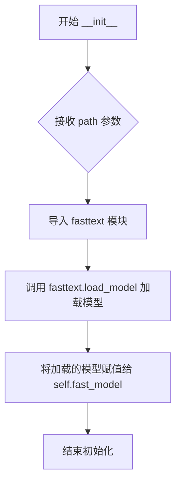

#### 带注释源码

```python
class Fasttext(object):
    def __init__(self, path="None", **kwargs):
        """
        初始化FastText模型
        
        参数:
            path (str): FastText模型文件路径，默认为"None"
            **kwargs: 额外的关键字参数（当前未使用）
        """
        # 动态导入fasttext模块，确保在需要时才加载依赖
        import fasttext
        
        # 使用fasttext.load_model加载预训练模型
        # path参数指定模型文件的路径
        self.fast_model = fasttext.load_model(path)
```


### `Fasttext.__call__`

该方法是 Fasttext 类的核心调用接口，接收包含标签的数据字典，通过预加载的 FastText 模型将文本标签转换为对应的向量表示，并将结果存储回数据字典中返回。

参数：

- `data`：`dict`，输入数据字典，必须包含键 `'label'`（字符串类型，表示需要转换的文本标签）

返回值：`dict`，返回输入数据的引用，其中新增了 `'fast_label'` 键，值为 FastText 模型生成的标签向量（numpy 数组或列表类型）

#### 流程图

```mermaid
graph TD
    A[开始 __call__] --> B[接收 data 参数]
    B --> C[从 data 中提取 'label']
    C --> D[调用 self.fast_model 预测标签向量]
    D --> E[将向量赋值给 fast_label]
    E --> F[更新 data['fast_label'] = fast_label]
    F --> G[返回更新后的 data]
```

#### 带注释源码

```python
def __call__(self, data):
    """
    Fasttext 模型调用接口，处理标签并生成向量表示
    
    参数:
        data (dict): 包含 'label' 键的字典，'label' 为文本标签字符串
        
    返回:
        dict: 更新后的 data 字典，新增 'fast_label' 键存储向量结果
    """
    # 从输入数据中提取标签文本
    label = data['label']
    
    # 使用预加载的 FastText 模型将标签转换为向量
    fast_label = self.fast_model[label]
    
    # 将生成的向量添加到数据字典中
    data['fast_label'] = fast_label
    
    # 返回更新后的数据字典
    return data
```


### `KeepKeys.__init__`

该方法是 `KeepKeys` 类的构造函数，用于初始化保留键的名称，以便在数据处理流水线中筛选并保留指定的键值对。

参数：

- `keep_keys`：需要保留的键列表，用于指定哪些数据键需要在后续处理中被保留。
- `**kwargs`：额外的关键字参数，用于接口兼容性，当前未使用。

返回值：`None`，构造函数不返回值，仅初始化实例属性。

#### 流程图

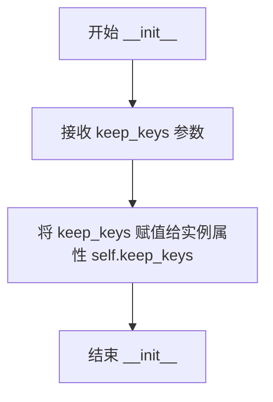

#### 带注释源码

```python
def __init__(self, keep_keys, **kwargs):
    """
    初始化 KeepKeys 对象
    
    参数:
        keep_keys: 需要保留的键列表，类型为 list，用于指定数据字典中需要保留的键
        **kwargs: 额外的关键字参数，用于接口兼容性，当前未使用
    
    返回:
        None: 构造函数不返回值
    """
    self.keep_keys = keep_keys  # 将传入的保留键列表存储为实例属性
```


### `KeepKeys.__call__`

从输入数据字典中提取指定键（keep_keys）的值，并返回包含这些值的列表。

参数：

- `data`：`dict`，输入的数据字典，包含键值对，需要从中提取指定的键

返回值：`list`，从 data 中提取的 keep_keys 列表中指定键对应的值组成的列表

#### 流程图

```mermaid
graph TD
    A[开始 __call__] --> B[接收 data 参数]
    B --> C[初始化空列表 data_list]
    C --> D{遍历 keep_keys 中的每个 key}
    D -->|是| E[从 data 中获取 data[key]]
    E --> F[将 data[key] 添加到 data_list]
    F --> D
    D -->|否| G[返回 data_list]
    G --> H[结束]
```

#### 带注释源码

```python
def __call__(self, data):
    """
    从输入数据字典中提取指定键的值
    args:
        data(dict): 输入的数据字典，包含键值对
    return:
        list: 包含指定键对应值的列表
    """
    # 初始化用于存储提取值的空列表
    data_list = []
    # 遍历需要保留的每个键
    for key in self.keep_keys:
        # 从输入数据字典中获取对应键的值，并添加到列表中
        data_list.append(data[key])
    # 返回提取的值列表
    return data_list
```


### `Resize.__init__`

该方法用于初始化Resize类，设置图像缩放的目标尺寸。

参数：

- `size`：`tuple`，目标尺寸，默认为(640, 640)，用于指定图像resize后的宽度和高度
- `**kwargs`：`dict`，关键字参数，用于接收其他可选配置参数

返回值：`None`，无返回值（`__init__`方法不返回值）

#### 流程图

```mermaid
flowchart TD
    A[开始 __init__] --> B{检查size参数}
    B -->|有传入size| C[使用传入的size]
    B -->|无传入size| D[使用默认值 (640, 640)]
    C --> E[self.size = size]
    D --> E
    E --> F[结束]
```

#### 带注释源码

```python
class Resize(object):
    def __init__(self, size=(640, 640), **kwargs):
        """
        初始化Resize变换类
        
        参数:
            size: tuple, 目标尺寸，默认为(640, 640)
            **kwargs: 关键字参数，用于接收其他可选参数
        """
        self.size = size  # 设置目标尺寸，用于后续图像resize操作
```


### Resize.resize_image

该方法用于将输入图像调整到指定的目标尺寸，同时计算并返回图像在高度和宽度方向的缩放比例，以便后续对图像相关的坐标（如边界框、多边形点等）进行相应的缩放处理。

参数：

- `img`：`numpy.ndarray`，输入的需要调整大小的图像数据，形状为 (h, w, c)，其中 h 为高度，w 为宽度，c 为通道数

返回值：`tuple`，返回一个元组，包含两个元素：
- 第一个元素：`numpy.ndarray`，调整大小后的图像
- 第二个元素：`list`，缩放比例列表 [ratio_h, ratio_w]，其中 ratio_h 表示高度方向的缩放比例，ratio_w 表示宽度方向的缩放比例

#### 流程图

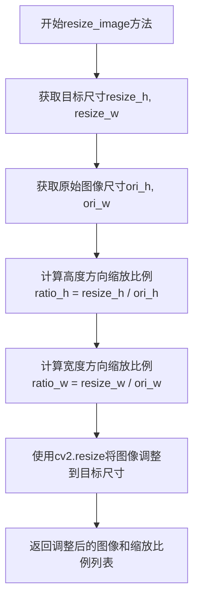

#### 带注释源码

```python
def resize_image(self, img):
    """
    调整图像大小到指定尺寸，并返回缩放比例
    
    参数:
        img: 输入的图像数组，形状为 (h, w, c)
    
    返回:
        tuple: (调整后的图像, [高度缩放比例, 宽度缩放比例])
    """
    # 从类属性中获取目标resize尺寸（高度和宽度）
    resize_h, resize_w = self.size
    
    # 获取原始图像的尺寸信息，img.shape返回(h, w, c)
    # 这里取前两位获取高度和宽度
    ori_h, ori_w = img.shape[:2]  # (h, w, c)
    
    # 计算高度方向的缩放比例：目标高度 / 原始高度
    ratio_h = float(resize_h) / ori_h
    
    # 计算宽度方向的缩放比例：目标宽度 / 原始宽度
    ratio_w = float(resize_w) / ori_w
    
    # 使用OpenCV的resize函数将图像调整到目标尺寸
    # cv2.resize参数: (输入图像, (目标宽度, 目标高度))
    img = cv2.resize(img, (int(resize_w), int(resize_h)))
    
    # 返回调整后的图像和缩放比例列表
    # 缩放比例用于后续对图像中的坐标点进行相应的缩放处理
    return img, [ratio_h, ratio_w]
```


### `Resize.__call__`

执行图像resize操作，并同步更新图像中文本多边形的坐标，保持坐标与缩放后的图像对齐。

参数：

- `data`：`dict`，包含待处理图像和多边形坐标的字典，必须包含键 `'image'`（numpy.ndarray类型）和 `'polys'`（numpy.ndarray类型，表示文本框坐标）

返回值：`dict`，返回包含缩放后图像和更新后多边形坐标的字典，键 `'image'` 对应缩放后的图像，键 `'polys'` 对应缩放后的坐标（numpy.ndarray类型，dtype=np.float32）

#### 流程图

```mermaid
graph TD
    A[开始 __call__] --> B[从data中提取image和polys]
    B --> C[调用resize_image方法]
    C --> D[计算缩放比例 ratio_h, ratio_w]
    D --> E[使用cv2.resize进行图像缩放]
    E --> F[返回缩放后的图像和缩放比例]
    F --> G[遍历text_polys中的每个box]
    G --> H[对每个坐标点乘以对应缩放比例]
    H --> I[构建新的box坐标]
    I --> J[将所有新box添加到new_boxes列表]
    J --> K[更新data['image']为缩放后的图像]
    K --> L[将data['polys']转换为numpy数组]
    L --> M[返回更新后的data]
```

#### 带注释源码

```python
def __call__(self, data):
    """
    对图像进行缩放并同步更新多边形坐标
    
    参数:
        data (dict): 包含'image'和'polys'键的字典
            - 'image': 输入图像，numpy.ndarray格式
            - 'polys': 文本多边形坐标，numpy.ndarray格式，shape为[n, 4, 2]
    
    返回:
        dict: 更新后的数据字典
            - 'image': 缩放后的图像
            - 'polys': 缩放后的多边形坐标，dtype=np.float32
    """
    # 从data字典中提取原始图像和文本多边形坐标
    img = data['image']
    text_polys = data['polys']

    # 调用resize_image方法进行图像缩放，获取缩放后的图像和缩放比例
    # resize_h, resize_w为目标尺寸，ratio_h, ratio_w为对应的缩放比例
    img_resize, [ratio_h, ratio_w] = self.resize_image(img)
    
    # 初始化新boxes列表，用于存储缩放后的多边形坐标
    new_boxes = []
    
    # 遍历原始多边形坐标中的每个文本框
    for box in text_polys:
        # 初始化当前文本框的新坐标列表
        new_box = []
        
        # 遍历文本框的每个顶点坐标（4个顶点）
        for cord in box:
            # 将每个坐标点分别乘以对应的宽高缩放比例
            # x坐标乘以ratio_w，y坐标乘以ratio_h
            new_box.append([cord[0] * ratio_w, cord[1] * ratio_h])
        
        # 将当前文本框的新坐标添加到列表中
        new_boxes.append(new_box)
    
    # 用缩放后的图像更新data字典中的'image'键
    data['image'] = img_resize
    
    # 将缩放后的多边形坐标转换为numpy数组并指定float32类型
    # 更新data字典中的'polys'键
    data['polys'] = np.array(new_boxes, dtype=np.float32)
    
    # 返回更新后的数据字典
    return data
```


### `DetResizeForTest.__init__`

该方法是检测图像缩放策略的初始化函数，通过解析传入的可变关键字参数（kwargs）来确定图像缩放类型（resize_type），支持三种缩放策略：无参数默认策略（按最小边限制）、指定图像形状策略（type1）、按长边缩放策略（type2）。

参数：

- `**kwargs`：`dict`，可变关键字参数，支持以下键值对：
  - `image_shape`：`tuple` 或 `list`，指定目标图像的形状（如 (640, 640)），传入时设置 resize_type=1
  - `limit_side_len`：`int`，限制图像的边长阈值，传入时设置 resize_type=0
  - `limit_type`：`str`，限制类型，可选值为 'min'（最小边限制）或 'max'（最大边限制），默认值为 'min'
  - `resize_long`：`int`，长边缩放的目标值，传入时设置 resize_type=2，默认值为 960

返回值：`None`，无返回值（Python 初始化方法默认返回 None）

#### 流程图

```mermaid
flowchart TD
    A[开始 __init__] --> B[调用父类初始化 super().__init__]
    B --> C[设置 resize_type = 0]
    C --> D{检查 kwargs 中是否有 'image_shape'}
    D -->|是| E[获取 image_shape 并设置 resize_type = 1]
    E --> J[结束]
    D -->|否| F{检查 kwargs 中是否有 'limit_side_len'}
    F -->|是| G[获取 limit_side_len 和 limit_type]
    G --> J
    F -->|否| I{检查 kwargs 中是否有 'resize_long'}
    I -->|是| K[设置 resize_type = 2 并获取 resize_long]
    K --> J
    I -->|否| L[设置默认 limit_side_len = 736 和 limit_type = 'min']
    L --> J
```

#### 带注释源码

```python
def __init__(self, **kwargs):
    """
    初始化检测图像的缩放策略
    
    根据传入的kwargs参数确定三种不同的图像缩放策略：
    - type 0: 默认策略，根据limit_side_len和limit_type限制图像尺寸
    - type 1: 指定图像形状，将图像缩放到固定尺寸
    - type 2: 长边缩放策略，将图像的长边缩放到指定尺寸
    
    Args:
        **kwargs: 可变关键字参数，支持以下键:
            - image_shape (tuple/list): 目标图像尺寸，传入时使用type1策略
            - limit_side_len (int): 限制边长度，配合limit_type使用，默认为736
            - limit_type (str): 限制类型，'min'或'max'，默认为'min'
            - resize_long (int): 长边目标尺寸，传入时使用type2策略，默认为960
    """
    # 调用父类object的初始化方法，确保类正确初始化
    super(DetResizeForTest, self).__init__()
    
    # 默认为type 0，表示使用limit_side_len进行缩放
    self.resize_type = 0
    
    # 策略1: 如果指定了image_shape，则使用固定形状缩放策略(type1)
    if 'image_shape' in kwargs:
        self.image_shape = kwargs['image_shape']
        self.resize_type = 1  # 标记为type1策略
    
    # 策略0: 如果指定了limit_side_len，则使用边长限制策略(type0)
    elif 'limit_side_len' in kwargs:
        self.limit_side_len = kwargs['limit_side_len']
        # 获取限制类型，默认为'min'（最小边限制）
        self.limit_type = kwargs.get('limit_type', 'min')
    
    # 策略2: 如果指定了resize_long，则使用长边缩放策略(type2)
    elif 'resize_long' in kwargs:
        self.resize_type = 2  # 标记为type2策略
        self.resize_long = kwargs.get('resize_long', 960)  # 默认长边为960
    
    # 默认策略: 如果都没有指定，使用默认的limit_side_len=736和limit_type='min'
    else:
        self.limit_side_len = 736
        self.limit_type = 'min'
```


### `DetResizeForTest.__call__`

执行检测任务resize操作，根据初始化时设置的resize_type选择合适的图像resize方法，输出调整大小后的图像及原始尺寸与缩放比例信息。

参数：

- `data`：`dict`，包含图像数据的字典，必须包含键 `'image'`（原始图像数据，numpy数组格式）

返回值：`dict`，包含以下键值对：
  - `'image'`：`numpy.ndarray`，resize后的图像
  - `'shape'`：`numpy.ndarray`，形状为 `[src_h, src_w, ratio_h, ratio_w]`，包含原始高度、原始宽度、垂直缩放比例和水平缩放比例

#### 流程图

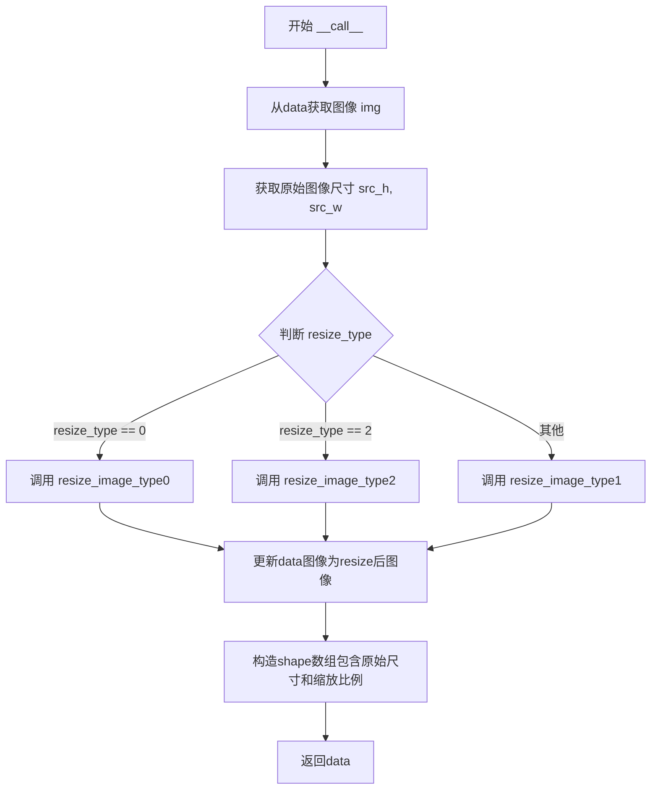

#### 带注释源码

```python
def __call__(self, data):
    """
    对输入图像进行resize操作，用于检测任务
    根据初始化时设置的resize_type选择不同的resize策略
    
    参数:
        data (dict): 包含图像数据的字典，必须有'image'键
        
    返回:
        dict: 包含resize后图像和形状信息的字典
    """
    # 从输入数据中获取图像
    img = data['image']
    # 获取原始图像的高度和宽度
    src_h, src_w, _ = img.shape

    # 根据resize_type选择不同的resize方法
    if self.resize_type == 0:
        # 类型0：使用limit_side_len限制图像边长
        img, [ratio_h, ratio_w] = self.resize_image_type0(img)
    elif self.resize_type == 2:
        # 类型2：使用resize_long参数调整长边
        img, [ratio_h, ratio_w] = self.resize_image_type2(img)
    else:
        # 类型1：使用image_shape固定尺寸
        img, [ratio_h, ratio_w] = self.resize_image_type1(img)
    
    # 更新图像数据
    data['image'] = img
    # 存储形状信息：[原始高度, 原始宽度, 垂直缩放比例, 水平缩放比例]
    data['shape'] = np.array([src_h, src_w, ratio_h, ratio_w])
    return data
```


### `DetResizeForTest.resize_image_type0`

该方法是图像预处理模块中用于限制边长缩放的核心方法，通过根据配置的limit_type和limit_side_len参数对图像进行缩放，并确保输出图像的宽高都是32的倍数以满足神经网络的输入要求。

参数：

- `img`：`numpy.ndarray`，输入图像数组，shape为[h, w, c]

返回值：`tuple`，返回包含(缩放后的图像, [ratio_h, ratio_w])的元组，其中ratio_h和ratio_w分别为图像高度和宽度的缩放比例

#### 流程图

```mermaid
flowchart TD
    A[开始] --> B[获取limit_side_len和图像尺寸h, w, c]
    B --> C{判断limit_type类型}
    
    C -->|max| D{检查max&#40;h, w&#41; > limit_side_len}
    D -->|是| E[根据h>w计算ratio]
    D -->|否| F[ratio = 1.0]
    
    C -->|min| G{检查min&#40;h, w&#41; < limit_side_len}
    G -->|是| H[根据h<w计算ratio]
    G -->|否| F
    
    C -->|resize_long| I[ratio = limit_side_len / max&#40;h, w&#41;]
    C -->|其他| J[抛出异常]
    
    E --> K[计算resize_h和resize_w]
    H --> K
    F --> K
    I --> K
    
    K --> L[将resize_h向上取整到32的倍数, 最小为32]
    L --> M[将resize_w向上取整到32的倍数, 最小为32]
    
    M --> N{检查resize_w和resize_h是否大于0}
    N -->|否| O[返回None, None]
    N -->|是| P[使用cv2.resize进行图像缩放]
    
    P --> Q[计算实际缩放比例ratio_h和ratio_w]
    Q --> R[返回缩放后的图像和比例]
    
    O --> R
```

#### 带注释源码

```python
def resize_image_type0(self, img):
    """
    resize image to a size multiple of 32 which is required by the network
    args:
        img(array): array with shape [h, w, c]
    return(tuple):
        img, (ratio_h, ratio_w)
    """
    # 获取初始化时设置的限制边长参数
    limit_side_len = self.limit_side_len
    h, w, c = img.shape

    # 根据limit_type类型决定缩放策略
    # limit_type = 'max': 限制较长边不超过limit_side_len
    # limit_type = 'min': 限制较短边不小于limit_side_len
    # limit_type = 'resize_long': 将较长边缩放到limit_side_len
    if self.limit_type == 'max':
        if max(h, w) > limit_side_len:
            if h > w:
                ratio = float(limit_side_len) / h
            else:
                ratio = float(limit_side_len) / w
        else:
            ratio = 1.
    elif self.limit_type == 'min':
        if min(h, w) < limit_side_len:
            if h < w:
                ratio = float(limit_side_len) / h
            else:
                ratio = float(limit_side_len) / w
        else:
            ratio = 1.
    elif self.limit_type == 'resize_long':
        ratio = float(limit_side_len) / max(h, w)
    else:
        raise Exception('not support limit type, image ')
    
    # 计算初步缩放后的尺寸
    resize_h = int(h * ratio)
    resize_w = int(w * ratio)

    # 确保缩放后的尺寸是32的倍数，且最小为32（网络要求）
    # 通过向上取整到最近的32倍数
    resize_h = max(int(round(resize_h / 32) * 32), 32)
    resize_w = max(int(round(resize_w / 32) * 32), 32)

    try:
        # 验证尺寸有效性，防止无效的图像尺寸导致cv2.resize失败
        if int(resize_w) <= 0 or int(resize_h) <= 0:
            return None, (None, None)
        # 使用OpenCV进行图像缩放
        img = cv2.resize(img, (int(resize_w), int(resize_h)))
    except:
        # 捕获异常并打印调试信息后退出
        print(img.shape, resize_w, resize_h)
        sys.exit(0)
    
    # 计算实际缩放比例，用于后续坐标变换
    ratio_h = resize_h / float(h)
    ratio_w = resize_w / float(w)
    return img, [ratio_h, ratio_w]
```


### `DetResizeForTest.resize_image_type1`

该方法用于将图像按照预设的固定尺寸（image_shape）进行缩放，并返回缩放后的图像及宽高缩放比例。

参数：

- `img`：`numpy.ndarray`，输入的原始图像数据，形状为 (h, w, c)

返回值：`tuple`，返回包含两个元素的元组
  - 第一个元素：`numpy.ndarray`，缩放后的图像
  - 第二个元素：`list`，包含 [ratio_h, ratio_w]，分别为图像高度和宽度的缩放比例

#### 流程图

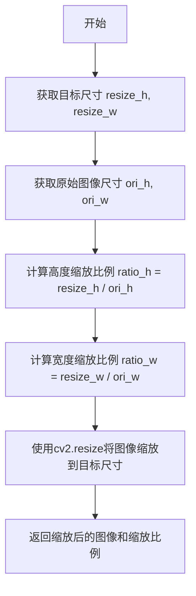

#### 带注释源码

```python
def resize_image_type1(self, img):
    """
    按照预设的固定尺寸（image_shape）缩放图像
    
    参数:
        img: 输入的图像数组，形状为 [h, w, c]
    
    返回:
        tuple: (缩放后的图像, [高度缩放比例, 宽度缩放比例])
    """
    # 从实例属性中获取目标尺寸（由__init__中的image_shape参数设置）
    resize_h, resize_w = self.image_shape
    
    # 获取原始图像的高度和宽度
    ori_h, ori_w = img.shape[:2]  # (h, w, c)
    
    # 计算高度的缩放比例
    ratio_h = float(resize_h) / ori_h
    
    # 计算宽度的缩放比例
    ratio_w = float(resize_w) / ori_w
    
    # 使用OpenCV的resize函数将图像缩放到目标尺寸
    # 参数为(宽度, 高度)的顺序
    img = cv2.resize(img, (int(resize_w), int(resize_h)))
    
    # 返回缩放后的图像以及缩放比例信息
    # return img, np.array([ori_h, ori_w])  # 原注释的备选方案
    return img, [ratio_h, ratio_w]
```


### `DetResizeForTest.resize_image_type2`

该方法是长边缩放策略，将图像的最长边缩放到指定长度（resize_long），同时保持宽高比，并将缩放后的尺寸向上取整到128的倍数以满足网络要求。

参数：

- `img`：`numpy.ndarray`，输入的原始图像数据，形状为 (h, w, c)

返回值：

- `img`：`numpy.ndarray`，缩放后的图像
- `[ratio_h, ratio_w]`：`list`，包含高度缩放比例和宽度缩放比例的列表

#### 流程图

```mermaid
flowchart TD
    A[输入图像 img] --> B[获取图像高度h和宽度w]
    B --> C{判断h是否大于w}
    C -->|是| D[计算ratio = resize_long / h]
    C -->|否| E[计算ratio = resize_long / w]
    D --> F[计算新的resize_h和resize_w]
    E --> F
    F --> G[将resize_h向上取整到128的倍数]
    G --> H[将resize_w向上取整到128的倍数]
    H --> I[使用cv2.resize进行图像缩放]
    I --> J[计算ratio_h和ratio_w]
    J --> K[返回缩放后的图像和比例]
```

#### 带注释源码

```python
def resize_image_type2(self, img):
    """
    长边缩放策略：将图像的最长边缩放到指定长度，保持宽高比
    参数:
        img: 输入图像，形状为 (h, w, c)
    返回:
        img: 缩放后的图像
        [ratio_h, ratio_w]: 缩放比例列表
    """
    # 获取图像的高度和宽度
    h, w, _ = img.shape

    # 初始化目标尺寸为原始尺寸
    resize_w = w
    resize_h = h

    # 根据长边计算缩放比例
    if resize_h > resize_w:
        # 如果高度大于宽度，按高度进行缩放
        ratio = float(self.resize_long) / resize_h
    else:
        # 否则按宽度进行缩放
        ratio = float(self.resize_long) / resize_w

    # 计算缩放后的尺寸
    resize_h = int(resize_h * ratio)
    resize_w = int(resize_w * ratio)

    # 设置最大步长为128，向上取整以满足网络要求
    max_stride = 128
    resize_h = (resize_h + max_stride - 1) // max_stride * max_stride
    resize_w = (resize_w + max_stride - 1) // max_stride * max_stride

    # 使用OpenCV进行图像缩放
    img = cv2.resize(img, (int(resize_w), int(resize_h)))

    # 计算实际的缩放比例
    ratio_h = resize_h / float(h)
    ratio_w = resize_w / float(w)

    # 返回缩放后的图像和缩放比例
    return img, [ratio_h, ratio_w]
```


### `E2EResizeForTest.__init__`

这是E2EResizeForTest类的初始化方法，用于配置端到端测试中的图像Resize参数，包括最大边长限制和验证集类型。

参数：

- `**kwargs`：可变关键字参数，包含以下必需参数
  - `max_side_len`：`int`，最大边长度，用于限制图像resize后的最大尺寸
  - `valid_set`：`str`，验证集类型，用于决定使用哪种resize策略（如'totaltext'或其他）

返回值：`None`，该方法为构造函数，不返回任何值

#### 流程图

```mermaid
graph TD
    A[开始 __init__] --> B[调用父类初始化 super]
    B --> C[从kwargs提取max_side_len]
    C --> D[从kwargs提取valid_set]
    D --> E[设置实例属性self.max_side_len]
    E --> F[设置实例属性self.valid_set]
    F --> G[结束]
```

#### 带注释源码

```python
def __init__(self, **kwargs):
    """
    初始化E2EResizeForTest类
    
    参数:
        **kwargs: 可变关键字参数，必须包含:
            - max_side_len (int): 图像resize后的最大边长度
            - valid_set (str): 验证集类型，决定resize策略
    """
    # 调用父类object的初始化方法
    super(E2EResizeForTest, self).__init__()
    
    # 从kwargs字典中提取max_side_len参数
    # 用于限制图像resize后的最大边长，避免GPU内存溢出
    self.max_side_len = kwargs['max_side_len']
    
    # 从kwargs字典中提取valid_set参数
    # 用于决定使用哪种图像resize策略
    # 如果valid_set为'totaltext'，则使用专门的totaltext数据集resize策略
    self.valid_set = kwargs['valid_set']
```


### `E2EResizeForTest.__call__`

该方法是端到端测试图像预处理的核心理方法，根据 `valid_set` 参数选择不同的图像缩放策略（totaltext 数据集采用专用缩放方法，其他数据集采用通用缩放方法），将输入图像调整到适合网络输入的尺寸（要求是 128 的倍数），同时记录原始图像尺寸和缩放比例供后续处理使用。

参数：

- `self`：实例本身
- `data`：`dict`，包含键 `'image'` 的字典，其中 `'image'` 值为待处理的图像数据（numpy array，形状为 [h, w, c]）

返回值：`dict`，包含处理后的图像数据和形状信息：
  - `'image'`：缩放后的图像（numpy array）
  - `'shape'`：numpy array，存储 [原图高度, 原图宽度, 高度缩放比例, 宽度缩放比例]

#### 流程图

```mermaid
flowchart TD
    A[开始 __call__ 方法] --> B[从 data 中获取图像 img]
    C[获取原图尺寸 src_h, src_w]
    D{valid_set == 'totaltext'?}
    D -->|Yes| E[调用 resize_image_for_totaltext]
    D -->|No| F[调用 resize_image]
    E --> G[获取缩放后图像 im_resized 和缩放比例 ratio_h, ratio_w]
    F --> G
    G --> H[更新 data['image'] = im_resized]
    I[更新 data['shape'] = [src_h, src_w, ratio_h, ratio_w]]
    H --> I
    I --> J[返回 data]
```

#### 带注释源码

```python
def __call__(self, data):
    """
    执行端到端测试的图像缩放操作
    
    参数:
        data (dict): 包含图像数据的字典，必须包含 'image' 键
                    图像格式为 numpy array，形状为 [height, width, channels]
    
    返回:
        dict: 处理后的数据字典，包含:
            - 'image': 缩放后的图像
            - 'shape': 原始尺寸和缩放比例 [原高, 原宽, 高缩放比, 宽缩放比]
    """
    # 从输入数据中获取图像
    img = data['image']
    
    # 记录原始图像的尺寸
    src_h, src_w, _ = img.shape
    
    # 根据 valid_set 选择不同的缩放策略
    if self.valid_set == 'totaltext':
        # TotalText 数据集使用专用缩放方法（固定比例 1.25）
        im_resized, [ratio_h, ratio_w] = self.resize_image_for_totaltext(
            img, max_side_len=self.max_side_len)
    else:
        # 其他数据集使用通用缩放方法（按最长边等比例缩放）
        im_resized, (ratio_h, ratio_w) = self.resize_image(
            img, max_side_len=self.max_side_len)
    
    # 更新数据中的图像为缩放后的图像
    data['image'] = im_resized
    
    # 记录原始尺寸和缩放比例，供后续处理使用（如恢复坐标等）
    data['shape'] = np.array([src_h, src_w, ratio_h, ratio_w])
    
    return data
```


### `E2EResizeForTest.resize_image_for_totaltext`

该方法是E2EResizeForTest类中的成员方法，专门为TotalText数据集设计。它采用1.25的初始缩放比例将图像调整到最大边长度限制内，然后确保缩放后的尺寸是128的倍数以满足网络要求，最后返回缩放后的图像和缩放比例。

参数：

- `self`：`E2EResizeForTest`，E2EResizeForTest类的实例，调用该方法的对象本身
- `im`：`numpy.ndarray`，输入的原始图像，形状为(H, W, C)
- `max_side_len`：`int`，限制的最大边长度，默认为512，用于控制图像缩放后的最大尺寸

返回值：`tuple`，包含两个元素：

- 第一个元素：`numpy.ndarray`，缩放后的图像
- 第二个元素：`tuple`，缩放比例( ratio_h, ratio_w)，分别为高度和宽度的缩放因子

#### 流程图

```mermaid
flowchart TD
    A[开始 resize_image_for_totaltext] --> B[获取图像尺寸 h, w]
    B --> C[初始化 resize_w = w, resize_h = h]
    C --> D[设置 ratio = 1.25]
    D --> E{判断 h * ratio > max_side_len?}
    E -->|是| F[重新计算 ratio = max_side_len / resize_h]
    E -->|否| G[保持 ratio = 1.25]
    F --> H[计算 resize_h = int(h * ratio)]
    G --> H
    H --> I[计算 resize_w = int(w * ratio)]
    I --> J[调整 resize_h 为128的倍数]
    J --> K[调整 resize_w 为128的倍数]
    K --> L[使用 cv2.resize 缩放图像]
    L --> M[计算 ratio_h = resize_h / float(h)]
    M --> N[计算 ratio_w = resize_w / float(w)]
    N --> O[返回 缩放后的图像和比例 tuple]
```

#### 带注释源码

```python
def resize_image_for_totaltext(self, im, max_side_len=512):
    """
    为TotalText数据集专用设计的图像缩放方法
    
    参数:
        im: 输入的原始图像，numpy.ndarray类型，形状为(h, w, c)
        max_side_len: 限制的最大边长度，默认为512
    
    返回:
        im: 缩放后的图像
        (ratio_h, ratio_w): 缩放比例的元组
    """
    # 获取原始图像的高度和宽度
    h, w, _ = im.shape
    
    # 初始化目标缩放尺寸为原始图像尺寸
    resize_w = w
    resize_h = h
    
    # 设置初始缩放比例为1.25（针对TotalText数据集的经验值）
    ratio = 1.25
    
    # 如果计算后的高度超过最大边限制，则重新计算缩放比例
    if h * ratio > max_side_len:
        ratio = float(max_side_len) / resize_h
    
    # 根据缩放比例计算新的高度和宽度
    resize_h = int(resize_h * ratio)
    resize_w = int(resize_w * ratio)

    # 定义最大步长为128，确保缩放后的尺寸是128的倍数（网络要求）
    max_stride = 128
    # 向上取整到128的倍数：例如 100 -> 128, 256 -> 256, 300 -> 384
    resize_h = (resize_h + max_stride - 1) // max_stride * max_stride
    resize_w = (resize_w + max_stride - 1) // max_stride * max_stride
    
    # 使用OpenCV进行图像缩放
    im = cv2.resize(im, (int(resize_w), int(resize_h)))
    
    # 计算实际缩放比例（用于后续坐标变换）
    ratio_h = resize_h / float(h)
    ratio_w = resize_w / float(w)
    
    # 返回缩放后的图像和缩放比例
    return im, (ratio_h, ratio_w)
```


### E2EResizeForTest.resize_image

该方法是端到端文本检测/识别流水线中的通用图像 resize 工具函数，用于将输入图像调整到适合网络处理的尺寸，同时保持图像的长宽比，并通过将尺寸对齐到 max_stride（128）来满足网络的内存和计算要求。

参数：

- `self`：E2EResizeForTest 实例本身
- `im`：`numpy.ndarray`，输入的原始图像，形状为 (h, w, c)
- `max_side_len`：`int`，可选参数，默认为 512，限制图像最大边长度以避免 GPU 内存溢出

返回值：`tuple`，返回调整大小后的图像和缩放比例元组 (ratio_h, ratio_w)

- 第一个元素：`numpy.ndarray`，调整大小后的图像
- 第二个元素：`tuple`，缩放比例 (ratio_h, ratio_w)，其中 ratio_h 表示高度缩放比例，ratio_w 表示宽度缩放比例

#### 流程图

```mermaid
flowchart TD
    A[开始 resize_image] --> B[获取图像尺寸 h, w]
    B --> C{判断高度是否大于宽度}
    C -->|是| D[ratio = max_side_len / h]
    C -->|否| E[ratio = max_side_len / w]
    D --> F[计算目标尺寸 resize_h, resize_w]
    E --> F
    F --> G[将尺寸对齐到 max_stride=128]
    G --> H[使用 cv2.resize 调整图像大小]
    H --> I[计算实际缩放比例 ratio_h, ratio_w]
    I --> J[返回图像和缩放比例]
```

#### 带注释源码

```python
def resize_image(self, im, max_side_len=512):
    """
    resize image to a size multiple of max_stride which is required by the network
    :param im: the resized image
    :param max_side_len: limit of max image size to avoid out of memory in gpu
    :return: the resized image and the resize ratio
    """
    # 获取输入图像的高度和宽度
    h, w, _ = im.shape

    # 初始化目标尺寸为原始尺寸
    resize_w = w
    resize_h = h

    # 根据较长边计算缩放比例，使较长边等于 max_side_len
    if resize_h > resize_w:
        ratio = float(max_side_len) / resize_h
    else:
        ratio = float(max_side_len) / resize_w

    # 应用缩放比例计算目标尺寸
    resize_h = int(resize_h * ratio)
    resize_w = int(resize_w * ratio)

    # 将尺寸对齐到 max_stride（128）的倍数，满足网络要求
    max_stride = 128
    resize_h = (resize_h + max_stride - 1) // max_stride * max_stride
    resize_w = (resize_w + max_stride - 1) // max_stride * max_stride

    # 使用 OpenCV 调整图像大小
    im = cv2.resize(im, (int(resize_w), int(resize_h)))

    # 计算实际的缩放比例（可能与原始计算的 ratio 不同，因为对齐操作）
    ratio_h = resize_h / float(h)
    ratio_w = resize_w / float(w)

    # 返回调整后的图像和缩放比例
    return im, (ratio_h, ratio_w)
```


### `KieResize.__init__`

初始化 KieResize 类的尺寸范围，从 kwargs 中提取 img_scale 参数设置最大边和最小边，用于后续图像resize操作。

参数：

- `self`：隐式参数，类的实例本身
- `**kwargs`：`dict`，关键字参数字典，包含 `img_scale` 参数，该参数应为 `[max_side, min_side]` 形式的列表或元组

返回值：`None`，无返回值（`__init__` 方法）

#### 流程图

```mermaid
flowchart TD
    A[开始 __init__] --> B[调用父类构造函数]
    B --> C[从 kwargs 提取 img_scale 参数]
    C --> D[获取 img_scale[0] 作为最大边]
    E[获取 img_scale[1] 作为最小边]
    D --> F[赋值给 self.max_side]
    E --> G[赋值给 self.min_side]
    F --> H[结束]
    G --> H
```

#### 带注释源码

```python
def __init__(self, **kwargs):
    """
    初始化 KieResize 类的尺寸范围
    
    参数:
        **kwargs: 关键字参数字典，必须包含 'img_scale' 键
                  img_scale 格式: [max_side, min_side]
    """
    # 调用父类 object 的初始化方法
    super(KieResize, self).__init__()
    
    # 从 kwargs 中提取 img_scale 参数
    # img_scale[0] -> 最大边长限制
    # img_scale[1] -> 最小边长限制
    self.max_side, self.min_side = kwargs['img_scale'][0], kwargs[
        'img_scale'][1]
```


### `KieResize.__call__`

该方法是KieResize类的核心调用接口，用于执行KIE（关键信息抽取）任务的图像Resize操作。它接收包含图像和关键点坐标的数据字典，通过内部方法调整图像尺寸和关键点坐标，并返回处理后的数据。

参数：

- `data`：`dict`，包含图像数据（'image'）和关键点坐标（'points'）的字典

返回值：`dict`，返回更新后的数据字典，包含原始图像、原始boxes、调整后的points、调整后的图像和新的尺寸信息

#### 流程图

```mermaid
flowchart TD
    A[开始 __call__] --> B[从data中获取image和points]
    B --> C[获取图像原始尺寸 src_h, src_w]
    C --> D[调用resize_image调整图像尺寸]
    D --> E[获取scale_factor和新的宽高比]
    E --> F[调用resize_boxes调整points坐标]
    F --> G[将原始图像和boxes存入data]
    G --> H[将调整后的points存入data]
    H --> I[将调整后的图像存入data]
    I --> J[将新尺寸存入data]
    J --> K[返回data]
```

#### 带注释源码

```python
def __call__(self, data):
    """
    执行KIE任务的Resize操作
    
    参数:
        data (dict): 包含以下键值的字典
            - 'image': 输入图像 (numpy.ndarray)
            - 'points': 图像中的关键点坐标 (numpy.ndarray)
    
    返回:
        data (dict): 处理后的字典，包含以下新增/更新的键值
            - 'ori_image': 原始输入图像
            - 'ori_boxes': 原始关键点坐标
            - 'points': 调整后的关键点坐标
            - 'image': 调整大小后的图像
            - 'shape': 调整后的图像尺寸 [new_h, new_w]
    """
    # 从输入数据中提取图像和关键点坐标
    img = data['image']
    points = data['points']
    
    # 获取原始图像的高度和宽度
    src_h, src_w, _ = img.shape
    
    # 调用内部方法resize_image进行图像尺寸调整
    # 返回: im_resized-调整后的图像, scale_factor-缩放因子, 
    #       [ratio_h, ratio_w]-高宽比, [new_h, new_w]-新尺寸
    im_resized, scale_factor, [ratio_h, ratio_w], [new_h, new_w] = self.resize_image(img)
    
    # 根据缩放因子调整关键点坐标
    resize_points = self.resize_boxes(img, points, scale_factor)
    
    # 保存原始图像和原始boxes到返回数据中
    data['ori_image'] = img
    data['ori_boxes'] = points
    
    # 更新关键点坐标为调整后的坐标
    data['points'] = resize_points
    
    # 更新图像为调整大小后的图像
    data['image'] = im_resized
    
    # 保存调整后的图像尺寸信息
    data['shape'] = np.array([new_h, new_w])
    
    # 返回处理后的数据字典
    return data
```


### `KieResize.resize_image`

该方法实现图像的缩放并归一化，将输入图像调整到符合KIE（关键信息抽取）网络要求的尺寸，同时保持图像比例并生成相应的缩放因子。

参数：

- `img`：`numpy.ndarray`，输入的原始图像数据

返回值：`tuple`，包含四个元素：

- `norm_img`：`numpy.ndarray`，归一化后的图像（尺寸为1024x1024，float32类型）
- `scale_factor`：`numpy.ndarray`，缩放因子数组（\[w_scale, h_scale, w_scale, h_scale\]）
- `ratio`：`list`，\[h_scale, w_scale\]，高度和宽度的缩放比例
- `new_size`：`list`，\[new_h, new_w\]，缩放后的图像高度和宽度

#### 流程图

```mermaid
flowchart TD
    A[输入原始图像img] --> B[创建1024x1024零矩阵norm_img]
    B --> C[获取图像高度h和宽度w]
    C --> D[计算最长边和最短边阈值]
    D --> E[计算缩放因子scale_factor]
    E --> F[计算目标尺寸resize_w, resize_h]
    F --> G[将尺寸对齐到32的倍数]
    G --> H[使用cv2.resize进行图像缩放]
    H --> I[计算实际缩放比例h_scale, w_scale]
    I --> J[生成scale_factor数组]
    J --> K[将缩放后的图像放入norm_img]
    K --> L[返回norm_img, scale_factor, [h_scale, w_scale], [new_h, new_w]]
```

#### 带注释源码

```python
def resize_image(self, img):
    """
    图像缩放并归一化
    Args:
        img: 输入的原始图像，形状为(h, w, c)
    Returns:
        norm_img: 归一化后的图像，尺寸为1024x1024，float32类型
        scale_factor: 缩放因子数组，用于后续boxes的缩放
        [h_scale, w_scale]: 高度和宽度的缩放比例
        [new_h, new_w]: 缩放后的图像尺寸
    """
    # 创建1024x1024的归一化画布，初始值为0
    norm_img = np.zeros([1024, 1024, 3], dtype='float32')
    
    # 定义缩放范围：最长边1024，最短边512
    scale = [512, 1024]
    
    # 获取原始图像的高度和宽度
    h, w = img.shape[:2]
    
    # 获取缩放边界值
    max_long_edge = max(scale)
    max_short_edge = min(scale)
    
    # 计算缩放因子：取最长边比例和最短边比例的最小值，保证图像在指定范围内
    scale_factor = min(max_long_edge / max(h, w),
                       max_short_edge / min(h, w))
    
    # 计算目标宽度和高度（四舍五入）
    resize_w, resize_h = int(w * float(scale_factor) + 0.5), int(h * float(
        scale_factor) + 0.5)
    
    # 设置步长对齐（网络要求尺寸为32的倍数）
    max_stride = 32
    resize_h = (resize_h + max_stride - 1) // max_stride * max_stride
    resize_w = (resize_w + max_stride - 1) // max_stride * max_stride
    
    # 使用OpenCV进行图像缩放
    im = cv2.resize(img, (resize_w, resize_h))
    
    # 获取缩放后的图像尺寸
    new_h, new_w = im.shape[:2]
    
    # 计算实际缩放比例
    w_scale = new_w / w
    h_scale = new_h / h
    
    # 生成用于boxes缩放的因子数组
    scale_factor = np.array(
        [w_scale, h_scale, w_scale, h_scale], dtype=np.float32)
    
    # 将缩放后的图像放入归一化画布的左上角
    norm_img[:new_h, :new_w, :] = im
    
    # 返回：归一化图像、缩放因子、高宽比例、新尺寸
    return norm_img, scale_factor, [h_scale, w_scale], [new_h, new_w]
```


### `KieResize.resize_boxes`

坐标框同步缩放方法，根据图像缩放因子对坐标框（边界框/关键点）进行等比例缩放，并确保坐标不超出图像边界。

参数：

- `self`：`KieResize`，KieResize 类的实例本身
- `im`：`numpy.ndarray`，原始输入图像，用于获取图像高度和宽度以进行边界裁剪
- `points`：`numpy.ndarray`，待缩放的坐标框点集，形状为 (n, 4) 或 (n, 2*m)，其中每行表示一个框的坐标点
- `scale_factor`：`numpy.ndarray`，缩放因子数组，形状为 (4,)，包含 [w_scale, h_scale, w_scale, h_scale]

返回值：`numpy.ndarray`，缩放并裁剪后的坐标框点集，类型与输入 points 相同

#### 流程图

```mermaid
flowchart TD
    A[开始 resize_boxes] --> B[输入: im, points, scale_factor]
    B --> C[points = points × scale_factor]
    C --> D[获取图像形状 img_shape = im.shape[:2]]
    D --> E[裁剪 X 坐标: points[:, 0::2] = clip<br/>points[:, 0::2], 0, img_shape[1]]
    E --> F[裁剪 Y 坐标: points[:, 1::2] = clip<br/>points[:, 1::2], 0, img_shape[0]]
    F --> G[返回缩放并裁剪后的 points]
```

#### 带注释源码

```python
def resize_boxes(self, im, points, scale_factor):
    """
    根据缩放因子对坐标框进行同步缩放，并裁剪到图像范围内
    
    参数:
        im (numpy.ndarray): 原始输入图像，用于获取图像形状边界
        points (numpy.ndarray): 待缩放的坐标框点集，形状为 (n, 4) 或 (n, 2m)
        scale_factor (numpy.ndarray): 缩放因子，形状为 (4,)，值为 [w_scale, h_scale, w_scale, h_scale]
    
    返回:
        numpy.ndarray: 缩放并裁剪后的坐标框点集
    """
    
    # 步骤1: 使用缩放因子对所有坐标点进行等比例缩放
    # points * scale_factor 会按元素逐个相乘，实现宽高方向的缩放
    points = points * scale_factor
    
    # 步骤2: 获取图像的高度和宽度，用于后续坐标边界限制
    # im.shape[:2] 返回 (height, width)
    img_shape = im.shape[:2]
    
    # 步骤3: 对 X 坐标（偶数索引）进行边界裁剪
    # points[:, 0::2] 选取所有行的偶数列（X坐标）
    # np.clip 确保 X 坐标不超过图像宽度范围 [0, img_shape[1]]
    points[:, 0::2] = np.clip(points[:, 0::2], 0, img_shape[1])
    
    # 步骤4: 对 Y 坐标（奇数索引）进行边界裁剪
    # points[:, 1::2] 选取所有行的奇数列（Y坐标）
    # np.clip 确保 Y 坐标不超过图像高度范围 [0, img_shape[0]]
    points[:, 1::2] = np.clip(points[:, 1::2], 0, img_shape[0])
    
    # 步骤5: 返回缩放并裁剪后的坐标点集
    return points
```

## 关键组件


### 图像解码组件 (DecodeImage)

将输入的字节数据解码为numpy数组格式的图像，支持RGB和GRAY模式，可选转换为通道优先格式

### NRTR图像解码组件 (NRTRDecodeImage)

NRTR模型专用的图像解码器，将字节数据解码后转换为灰度图，支持通道优先格式转换

### 图像归一化组件 (NormalizeImage)

对图像进行标准化处理，包含均值减法和标准差除法，支持CHW和HWC两种通道顺序

### 通道顺序转换组件 (ToCHWImage)

将图像从HWC（高度×宽度×通道）格式转换为CHW（通道×高度×宽度）格式

### FastText嵌入组件 (Fasttext)

加载FastText预训练模型，将文本标签转换为词向量表示

### 键值保留组件 (KeepKeys)

从数据字典中提取指定的键值对，返回键对应的值列表

### 通用缩放组件 (Resize)

对图像进行固定尺寸缩放，同时对文本多边形坐标进行对应的比例变换

### 检测任务缩放组件 (DetResizeForTest)

支持三种图像缩放策略：限制短边、限制长边、限制最大边，输出缩放后的尺寸信息

### 端到端测试缩放组件 (E2EResizeForTest)

针对端到端OCR任务的图像缩放，支持totaltext数据集的特殊处理，确保缩放后尺寸为128的倍数

### 关键信息提取缩放组件 (KieResize)

KIE任务专用的图像缩放，将图像缩放到指定范围同时保留原始坐标信息


## 问题及建议


### 已知问题

-   **重复代码**：多个类存在高度相似的功能实现，如 `DecodeImage` 和 `NRTRDecodeImage` 类、`DetResizeForTest` 中的多个 resize 方法以及 `E2EResizeForTest` 中的 resize 方法，这导致代码冗余和维护成本增加。
-   **魔法数字和硬编码**：代码中多处使用硬编码的数值和参数，如图像归一化的均值和标准差、`KieResize` 中的图像尺寸 `1024x1024`、各种 resize 方法中的步长 `32`、`128`、`512` 等，缺乏可配置性。
-   **不恰当的错误处理**：大量使用 `assert` 进行参数验证，在生产环境中可能因优化而被忽略，且错误信息不够详细。`cv2.imdecode` 返回 `None` 时的处理也过于简单，仅返回 `None` 而未提供足够的调试信息。
-   **性能问题**：在 `ToCHWImage` 类的方法内部重复导入 `PIL.Image`，在循环或频繁调用时会影响性能。此外，`NRTRDecodeImage` 中对灰度图像进行 `transpose((2, 0, 1))` 操作会导致维度错误。
-   **类型检查方式**：使用 `type(img) is str` 而非 `isinstance()` 进行类型检查，不够灵活且不符合最佳实践。
-   **数据依赖假设不明确**：`Resize` 类直接访问 `data['polys']` 但未检查其是否存在，可能导致 `KeyError`。`KeepKeys` 类在访问不存在的 key 时也会抛出异常。
-   **资源管理**：`Fasttext` 类在初始化时加载模型，如果模型路径无效会导致程序失败，且模型加载失败时缺乏优雅的错误处理。
-   **文档不完整**：部分类的文档字符串过于简略，如 `""" decode image """`，未能充分说明功能、参数和返回值。

### 优化建议

-   **提取公共逻辑**：创建基类或使用装饰器模式来抽象共享的初始化和调用逻辑，例如将图像解码、格式转换的通用步骤提取到基类中。
-   **配置化**：将硬编码的参数（如均值、标准差、步长、默认尺寸）提取为配置文件或类属性，提高代码的可维护性和灵活性。
-   **改进错误处理**：将 `assert` 替换为显式的异常抛出和捕获机制，提供更详细的错误信息。对关键函数添加输入验证和边界检查。
-   **性能优化**：将模块级别的导入移到文件顶部，避免在方法内部重复导入。对于大规模图像处理，考虑使用内存池或就地操作减少内存分配。
-   **修复逻辑错误**：修正 `NRTRDecodeImage` 中灰度图像的通道转换逻辑，确保在 `channel_first` 模式下正确处理维度。明确 `Resize` 等类对输入数据结构的假设，或添加必要的初始化检查。
-   **类型检查**：使用 `isinstance()` 进行类型检查，并考虑添加类型注解以提高代码的可读性和可维护性。
-   **完善文档**：为所有类和关键方法添加详细的文档字符串，说明功能、参数、返回值以及可能的异常。
-   **单元测试**：为关键组件（如图像解码、 resize 逻辑）编写单元测试，确保在边界条件下的正确性。

## 其它


### 设计目标与约束

本模块的设计目标是提供一套统一的、可扩展的图像预处理流水线，用于OCR任务的各个环节（检测、识别、端到端、KIE等）。核心约束包括：1) 输入数据必须为字节流或文件路径；2) 输出图像尺寸需满足网络要求（通常为32的倍数）；3) 所有变换操作需保持坐标变换的一致性；4) 需兼容Python 2和Python 3。

### 错误处理与异常设计

本模块采用断言+返回None的错误处理策略。关键错误场景包括：1) DecodeImage中输入img为空或类型不匹配时抛出AssertionError；2) 图像解码失败（cv2.imdecode返回None）时直接返回None，上游需做空值检查；3) Resize操作中尺寸为0时返回(None, None)；4) 未支持的limit_type参数抛出Exception。目前缺少详细的错误码定义和日志记录，建议增加自定义异常类和错误日志机制。

### 数据流与状态机

数据流采用字典（dict）作为数据容器，在流水线各节点间传递。核心数据结构为data={'image': np.ndarray, 'polys': np.ndarray, 'label': str, ...}。状态转换遵循"输入验证→图像解码→格式转换→归一化→ resize"的固定顺序。各Transform类通过__call__方法实现数据的状态转换，输出作为下一阶段的输入。KieResize等类会额外保存原始图像和坐标信息用于后续后处理。

### 外部依赖与接口契约

主要依赖包括：1) opencv-python (cv2) - 图像解码和几何变换；2) numpy - 数值计算和数组操作；3) PIL (Pillow) - 图像格式转换（备选）；4) fasttext（可选）- 标签嵌入。接口契约方面：所有Transform类需实现__init__(**kwargs)和__call__(data)两个方法；输入data必须为dict且包含'image'键；返回值需保持dict结构或返回None（表示处理失败）。

### 配置参数说明

关键配置参数包括：1) img_mode - 图像色彩空间模式（RGB/GRAY）；2) channel_first - 是否转换为CHW格式；3) scale/mean/std - 归一化参数；4) size - resize目标尺寸；5) limit_side_len/max_side_len - 图像尺寸限制；6) limit_type - 尺寸限制策略（max/min/resize_long）。参数通过kwargs传入，支持字符串形式（如scale="1.0/255.0"）。

### 性能考虑与优化建议

性能瓶颈主要集中在：1) cv2.imdecode和cv2.resize的重复调用；2) 图像格式转换（GRAY↔BGR↔RGB）的冗余操作；3) NormalizeImage中对std的除法操作可预先计算。建议优化方向：1) 使用numpy的原地操作减少内存分配；2) 合并连续的resize和归一化操作；3) 对于大批量处理可考虑使用OpenCV的UMat或GPU加速；4) 增加图像缓存机制避免重复解码。

### 兼容性说明

代码兼容Python 2.7和Python 3.x（通过six模块处理字符串/字节差异），但Python 2支持已标记为deprecated。依赖库版本要求：opencv-python>=3.0, numpy>=1.15, Pillow>=5.0。需要注意cv2.imdecode在不同OpenCV版本中的行为可能略有差异。

### 使用示例与最佳实践

典型使用流程：```python
# 创建预处理流水线
transforms = [
    DecodeImage(img_mode='RGB'),
    DetResizeForTest(limit_side_len=736, limit_type='min'),
    NormalizeImage(mean=[0.485, 0.456, 0.406], std=[0.229, 0.224, 0.225]),
    ToCHWImage(),
    KeepKeys(keep_keys=['image', 'shape'])
]
# 应用流水线
data = {'image': img_bytes, 'polys': boxes, 'label': 'text'}
for t in transforms:
    data = t(data)
    if data is None:
        break
```

最佳实践：1) 根据具体任务选择合适的Resize类；2) 保持polys坐标与图像resize比例同步；3) 端到端任务需保存shape信息用于后处理坐标还原。


    