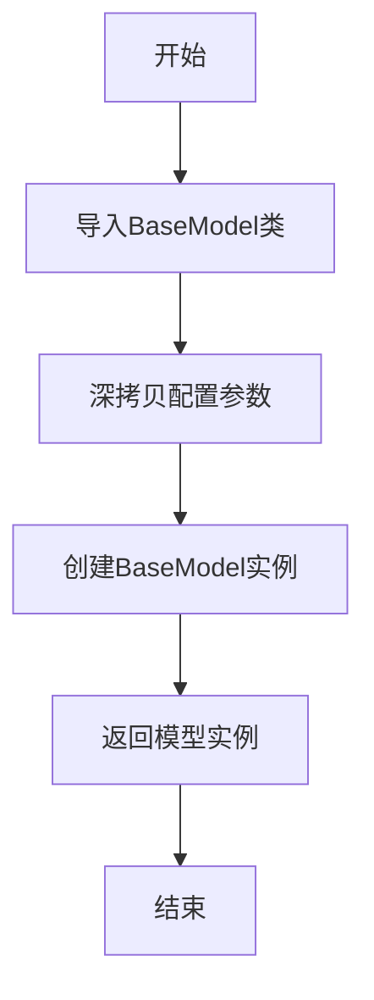
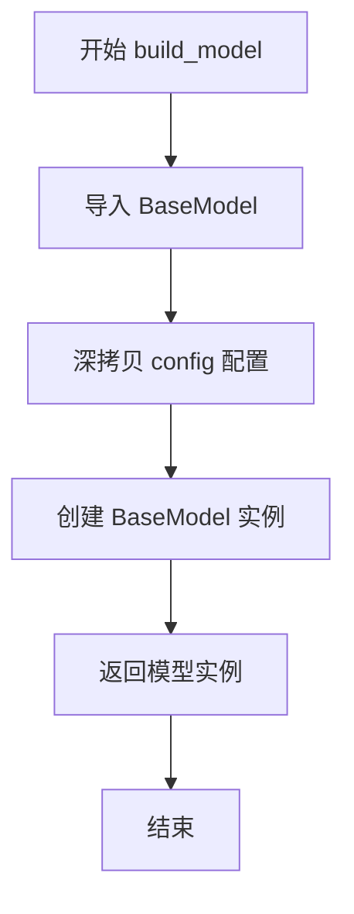
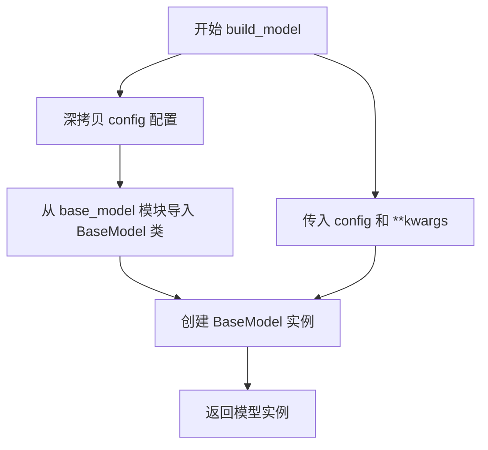

# `MinerU\mineru\model\utils\pytorchocr\modeling\architectures\__init__.py` 详细设计文档

这是一个PaddlePaddle模型构建模块，通过build_model函数接收配置参数，深度复制配置后实例化BaseModel基类并返回模型对象，用于统一管理各类预训练模型的创建流程。

## 整体流程



## 类结构

```
BaseModel (抽象基类，从base_model导入)
```

## 全局变量及字段


### `__all__`
    
模块公开接口列表，定义允许从模块导入的符号

类型：`list`
    


### `build_model`
    
构建并返回模型实例的工厂函数

类型：`function`
    


### `config`
    
模型配置参数，包含模型结构、训练参数等配置信息

类型：`dict or object`
    


### `kwargs`
    
可选关键字参数，用于传递额外的模型配置或运行时参数

类型：`dict`
    


### `copy`
    
Python标准库模块，用于深拷贝操作

类型：`module`
    


### `module_class`
    
实例化后的模型对象，返回给调用者

类型：`BaseModel`
    


### `BaseModel.config`
    
模型配置对象，存储模型的结构参数和训练超参数

类型：`dict or object`
    


### `BaseModel.kwargs`
    
可变关键字参数，传递额外的模型初始化参数

类型：`dict`
    
    

## 全局函数及方法


### `build_model`

该函数是模型构建的入口函数，通过深拷贝配置参数并实例化 `BaseModel` 类来创建模型对象。

参数：

- `config`：字典或配置对象，模型的配置文件，包含模型结构、参数等配置信息
- `**kwargs`：可变关键字参数，用于传递额外的参数给 `BaseModel` 构造函数

返回值：`BaseModel` 实例，创建好的模型对象

#### 流程图



#### 带注释源码

```python
import copy

__all__ = ["build_model"]


def build_model(config, **kwargs):
    """
    构建并返回一个模型实例
    
    参数:
        config: 模型配置字典或配置对象
        **kwargs: 传递给 BaseModel 的额外关键字参数
    
    返回:
        BaseModel 实例对象
    """
    # 从同目录下的 base_model 模块导入 BaseModel 基类
    from .base_model import BaseModel

    # 对配置进行深拷贝，避免修改原始配置
    config = copy.deepcopy(config)
    
    # 使用配置和额外参数实例化 BaseModel
    module_class = BaseModel(config, **kwargs)
    
    # 返回创建的模型实例
    return module_class
```


# 代码设计文档

## 注意事项

提供的代码片段中只包含 `build_model` 函数，并未包含 `BaseModel` 类的实际实现代码。该函数内部导入了 `BaseModel` 类但该类的 `__init__` 方法未在当前代码片段中展示。以下是基于提供的代码能够提取的 `build_model` 函数详细信息：

---

### `build_model`

该函数是模型构建的入口函数，接收配置参数并实例化 BaseModel 模型类。首先对配置进行深拷贝以避免修改原始配置，然后根据配置创建模型实例并返回。

参数：

- `config`：`dict`，模型配置文件，包含模型架构、参数等配置信息
- `**kwargs`：可变关键字参数，其他传递给 BaseModel 的参数

返回值：`BaseModel` 实例，返回配置好的模型对象

#### 流程图



#### 带注释源码

```python
# 导入 copy 模块用于深拷贝
import copy

# 定义模块公开接口
__all__ = ["build_model"]


def build_model(config, **kwargs):
    """
    构建模型实例的入口函数
    
    参数:
        config: 模型配置字典
        **kwargs: 其他可选参数
        
    返回:
        BaseModel 实例
    """
    # 从当前包的 base_model 模块导入 BaseModel 类
    # 注意: 这里的 BaseModel.__init__ 实现未在当前代码片段中展示
    from .base_model import BaseModel

    # 对配置进行深拷贝,避免修改原始配置对象
    config = copy.deepcopy(config)
    
    # 使用配置和额外参数实例化 BaseModel
    module_class = BaseModel(config, **kwargs)
    
    # 返回模型实例
    return module_class
```

---

## 补充说明

由于 `BaseModel.__init__` 方法的具体实现未在提供的代码中，无法提取该方法的详细参数、返回值和流程信息。若需要 `BaseModel.__init__` 的完整文档，请提供 `base_model.py` 文件中 `BaseModel` 类的实现代码。

## 关键组件


### build_model 函数

模型的构建入口函数，负责根据配置参数创建并返回 BaseModel 实例，同时对配置进行深拷贝以防止原始配置被修改。

### BaseModel 类

从 base_model 模块导入的基模型类，是所有模型的基础类，接收配置参数并初始化模型结构。

### config 参数处理

使用 copy.deepcopy 对传入的配置进行深拷贝，确保原始配置对象不会被后续操作修改，实现配置隔离。

### 模块导入机制

通过动态导入（from .base_model import BaseModel）实现模块解耦，支持懒加载和模块间的松耦合设计。


## 问题及建议


### 已知问题

-   **动态导入位置不当**：在函数内部导入`BaseModel`违反了Python最佳实践，应在模块顶部进行导入，以提高可读性和避免重复导入开销
-   **缺乏错误处理**：没有对`BaseModel`导入失败或初始化异常进行捕获和处理，可能导致调试困难
-   **配置验证缺失**：`config`参数未进行有效性检查，传入无效配置时难以定位问题
-   **性能开销**：`copy.deepcopy(config)`在每次调用时都会深拷贝整个配置对象，当配置较大或调用频繁时会产生不必要的性能开销
-   **类型提示缺失**：函数签名缺少参数类型和返回值类型的标注，影响代码可读性和IDE支持
-   **日志缺失**：没有日志记录机制，难以追踪模型构建过程和调试问题

### 优化建议

-   将`from .base_model import BaseModel`移至文件顶部进行导入
-   添加try-except块捕获导入和初始化异常，提供有意义的错误信息
-   在函数开头添加配置验证逻辑，检查必要字段是否存在
-   考虑使用浅拷贝或仅拷贝必要部分，避免不必要的深拷贝开销
-   添加类型提示：`def build_model(config: dict, **kwargs) -> BaseModel`
-   添加日志记录，记录模型构建的开始和结束状态

## 其它


### 设计目标与约束

该模块的设计目标是提供一个统一的模型构建入口，简化模型实例化流程。约束包括：1) 必须使用深拷贝保护原始配置；2) 必须继承BaseModel基类；3) 配置参数必须符合BaseModel的接口要求。

### 错误处理与异常设计

主要异常场景包括：1) 导入BaseModel失败时抛出ImportError；2) 配置参数不合法时由BaseModel抛出相应异常；3) 实例化失败时向上传递异常。当前实现未进行显式的错误处理和异常捕获，建议调用方做好异常处理。

### 外部依赖与接口契约

外部依赖包括：1) PaddlePaddle框架（base_model.py中的BaseModel类）；2) Python标准库copy模块。接口契约：config参数必须为字典类型，kwargs传递给BaseModel构造函数，返回值为BaseModel或其子类的实例。

### 配置管理

配置通过config字典传入，采用深拷贝机制避免修改原始配置。建议配置包含模型类型、参数维度、优化器设置等关键信息。配置校验逻辑由BaseModel类负责。

### 版本兼容性说明

该代码基于PaddlePaddle 2.x版本设计，使用了__all__导出机制。需注意BaseModel类的接口在不同版本间可能存在差异，建议锁定PaddlePaddle版本或提供版本适配层。

### 性能考虑

当前实现性能开销主要包括：1) copy.deepcopy的深拷贝操作，建议对大型配置进行性能评估；2) 动态导入模块的首次调用开销。可考虑缓存已导入的模块类以优化性能。

### 安全性考虑

1) kwargs参数传递需注意参数过滤，避免注入不安全配置；2) 配置深拷贝可防止外部配置被意外修改；3) 建议对config进行Schema校验后再传入。

    