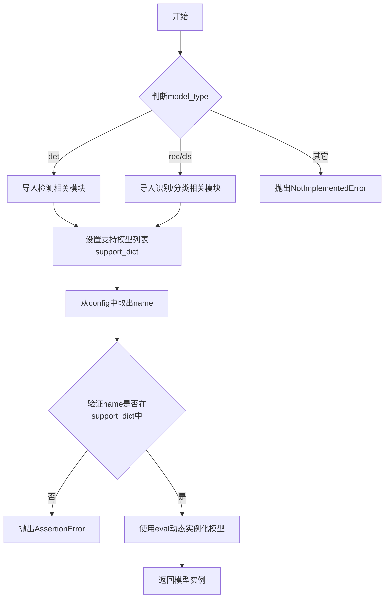

# `MinerU\mineru\model\utils\pytorchocr\modeling\backbones\__init__.py` 详细设计文档

这是一个PaddlePaddle的模型构建模块，负责根据配置和模型类型动态选择并实例化不同的骨干网络（Backbone）模型，支持检测（det）、识别（rec）和分类（cls）三种模型类型。

## 整体流程



## 类结构

```
build_backbone (模块级函数)
无类定义
所有模型类从子模块导入
```

## 全局变量及字段


### `__all__`
    
模块公开的函数列表，指定了from module import *时导入的符号，这里仅包含build_backbone函数。

类型：`list`
    


    

## 全局函数及方法


### `build_backbone`

工厂函数，根据配置和模型类型动态构建骨干网络模型实例。根据 `model_type` 参数选择性地导入相应的模型类，并从配置中获取模型名称进行实例化。

参数：

- `config`：`dict`，模型配置字典，包含模型名称（name 键）和其他模型参数
- `model_type`：`str`，模型类型，可选值为 "det"（检测）、"rec"（识别）或 "cls"（分类）

返回值：`object`，返回构建好的模型实例对象

#### 流程图

```mermaid
flowchart TD
    A[开始 build_backbone] --> B{model_type == "det"?}
    B -->|Yes| C[导入检测模型模块]
    B -->|No| D{model_type in ["rec", "cls"]?}
    D -->|Yes| E[导入识别/分类模型模块]
    D -->|No| F[raise NotImplementedError]
    
    C --> G[support_dict = 检测模型列表]
    E --> H[support_dict = 识别/分类模型列表]
    G --> I[module_name = config.pop]
    H --> I
    
    I --> J{module_name in support_dict?}
    J -->|No| K[raise Exception 不支持的模型]
    J -->|Yes| L[eval创建模型实例]
    L --> M[返回模型实例]
    F --> M
```

#### 带注释源码

```python
def build_backbone(config, model_type):
    """
    工厂函数：根据配置和模型类型构建骨干网络模型
    
    参数:
        config: 模型配置字典，需要包含 'name' 键指定模型类名
        model_type: 模型类型，"det" / "rec" / "cls"
    
    返回:
        模型实例对象
    """
    
    # 根据模型类型导入不同的模块并设置支持的模型列表
    if model_type == "det":
        # 检测模型：导入检测专用的骨干网络
        from .det_mobilenet_v3 import MobileNetV3
        from .rec_hgnet import PPHGNet_small
        from .rec_lcnetv3 import PPLCNetV3
        from .rec_pphgnetv2 import PPHGNetV2_B4

        # 检测模型支持列表
        support_dict = [
            "MobileNetV3",
            "ResNet",
            "ResNet_vd",
            "ResNet_SAST",
            "PPLCNetV3",
            "PPHGNet_small",
            'PPHGNetV2_B4',
        ]
    
    # 识别和分类模型使用相同的模块支持
    elif model_type == "rec" or model_type == "cls":
        # 导入识别/分类模型模块
        from .rec_hgnet import PPHGNet_small
        from .rec_lcnetv3 import PPLCNetV3
        from .rec_mobilenet_v3 import MobileNetV3
        from .rec_svtrnet import SVTRNet
        from .rec_mv1_enhance import MobileNetV1Enhance
        from .rec_pphgnetv2 import PPHGNetV2_B4, PPHGNetV2_B6_Formula
        
        # 识别/分类模型支持列表
        support_dict = [
            "MobileNetV1Enhance",
            "MobileNetV3",
            "ResNet",
            "ResNetFPN",
            "MTB",
            "ResNet31",
            "SVTRNet",
            "ViTSTR",
            "DenseNet",
            "PPLCNetV3",
            "PPHGNet_small",
            "PPHGNetV2_B4",
            "PPHGNetV2_B6_Formula"
        ]
    else:
        # 不支持的模型类型抛出异常
        raise NotImplementedError

    # 从配置中提取模型名称
    module_name = config.pop("name")
    
    # 验证模型名称是否在支持列表中
    assert module_name in support_dict, Exception(
        "when model typs is {}, backbone only support {}".format(
            model_type, support_dict
        )
    )
    
    # 使用 eval 动态创建模型实例，传入剩余配置参数
    module_class = eval(module_name)(**config)
    return module_class
```

## 关键组件


### build_backbone 函数

核心入口函数，根据传入的config和model_type参数，动态导入相应的模块并实例化对应的骨干网络模型。

### 模型类型路由机制

根据model_type参数（"det"、"rec"、"cls"）决定加载哪些模块和支持的骨干网络列表，实现不同任务类型使用不同模型集合的逻辑分离。

### 动态模块导入

根据model_type条件分支，动态导入不同的骨干网络实现模块（如det_mobilenet_v3、rec_hgnet等），实现按需加载减少初始化开销。

### 配置解析与验证

从config字典中提取"name"字段作为要实例化的模型类名，并验证该名称是否在当前model_type对应的support_dict中，不合法则抛出异常。

### 骨干网络模型集合（Detection）

支持MobileNetV3、ResNet、ResNet_vd、ResNet_SAST、PPLCNetV3、PPHGNet_small、PPHGNetV2_B4等检测任务骨干网络。

### 骨干网络模型集合（Recognition/Classification）

支持MobileNetV1Enhance、MobileNetV3、ResNet、ResNetFPN、MTB、ResNet31、SVTRNet、ViTSTR、DenseNet、PPLCNetV3、PPHGNet_small、PPHGNetV2_B4、PPHGNetV2_B6_Formula等识别/分类任务骨干网络。

### 异常处理机制

当model_type不是"det"、"rec"或"cls"时抛出NotImplementedError；当指定的模型名称不在支持列表中时抛出AssertionError并附带友好提示信息。


## 问题及建议


### 已知问题

-   **使用 eval() 动态执行代码**：通过 `eval(module_name)(**config)` 动态实例化类，存在安全风险，恶意输入可能导致代码注入攻击。
-   **修改输入参数 config**：使用 `config.pop("name")` 直接修改传入的字典对象，可能导致调用方持有的 config 引用被意外修改，产生副作用。
-   **函数内重复导入模块**：每次调用 `build_backbone` 都会执行导入语句，在高频调用场景下会有性能开销。
-   **异常信息不够具体**：使用通用的 `Exception` 类型抛出错误，缺乏具体的错误类型和更详细的错误信息。
-   **缺少类型注解**：函数参数和返回值没有类型提示，不利于静态分析和 IDE 自动补全。
-   **不支持扩展**：模型支持列表硬编码，新增模型需要修改源码，不符合开闭原则。

### 优化建议

-   **替换 eval() 为安全的类实例化方式**：可使用字典映射或 `getattr` 从已导入模块中获取类，例如 `model_class = globals()[module_name](**config)`，或建立显式的注册表。
-   **避免修改原始 config**：使用 `config.copy()` 或 `config.get("name")` 并结合 `pop("name", None)` 来保护输入参数不被修改。
-   **添加导入缓存或使用懒加载**：在模块级别维护已导入模块的缓存，避免重复导入；对于大规模模型可考虑延迟导入。
-   **改进异常处理**：定义自定义异常类如 `UnsupportedModelError`，并在验证失败时抛出具体错误信息。
-   **添加类型注解**：为 `config` 参数添加 `Dict` 类型，为 `model_type` 添加 `str` 类型，为返回值添加基类类型注解。
-   **采用注册模式**：使用装饰器或注册表模式管理模型类，支持插件式扩展，新增模型时只需注册无需修改核心逻辑。

## 其它


### 设计目标与约束

该模块的设计目标是提供一个统一的骨干网络构建接口，支持检测、识别、分类三种模型类型，通过配置动态选择和实例化不同的骨干网络模型。约束条件包括：model_type必须为"det"、"rec"或"cls"之一，config中的name必须在对应模型类型的support_dict中，且依赖的骨干网络类必须已实现。

### 错误处理与异常设计

代码中包含两类异常处理：1) NotImplementedError - 当model_type不支持时抛出；2) AssertionError - 当指定的模块名称不在support_dict中时抛出。异常信息会明确告知用户当前模型类型支持的骨干网络列表，便于定位问题。

### 外部依赖与接口契约

该模块依赖多个外部骨干网络实现模块：det_mobilenet_v3、rec_hgnet、rec_lcnetv3、rec_pphgnetv2、rec_mobilenet_v3、rec_svtrnet、rec_mv1_enhance。接口契约要求：调用者传入config字典必须包含"name"键，且值为字符串类型的骨干网络类名；model_type必须为预定义的三个值之一；config字典中的其他参数将直接传递给对应的骨干网络类的构造函数。

### 配置说明

config参数为字典类型，包含name键和其他骨干网络初始化参数。model_type为字符串类型，限定值为"det"、"rec"、"cls"。函数返回值是对应的骨干网络类实例对象。

### 使用示例

```python
# 检测模型骨干网络构建
det_config = {"name": "MobileNetV3", "scale": 0.5}
det_backbone = build_backbone(det_config, "det")

# 识别模型骨干网络构建
rec_config = {"name": "SVTRNet", "img_size": [32, 128]}
rec_backbone = build_backbone(rec_config, "rec")
```

### 性能考虑

该模块采用延迟导入策略，仅在需要时导入对应的骨干网络模块，减少启动时的依赖加载开销。使用eval动态类实例化会带来一定的性能开销，但提供了灵活性。在高频调用场景下，建议缓存已构建的骨干网络实例。

### 安全性考虑

使用eval动态执行类名字符串存在潜在的安全风险，如果config["name"]被恶意注入可能导致代码执行。建议增加白名单验证机制，确保name参数来自可信的配置来源。


    