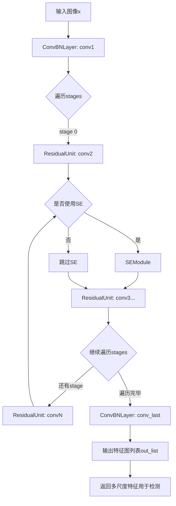
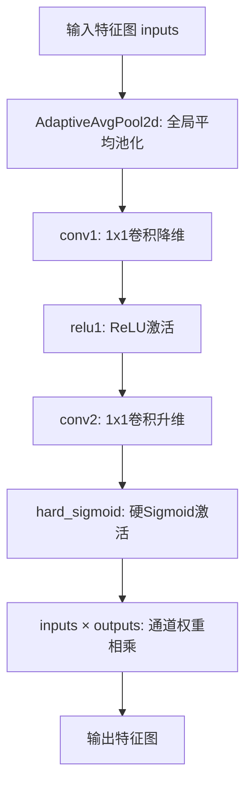
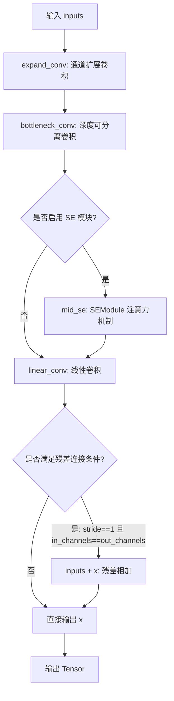

# `MinerU\mineru\model\utils\pytorchocr\modeling\backbones\det_mobilenet_v3.py` 详细设计文档

这是一个MobileNetV3骨干网络的PyTorch实现，用于目标检测任务。该实现包含ConvBNLayer（卷积+BN+激活）、SEModule（Squeeze-and-Excitation注意力模块）、ResidualUnit（残差单元）和MobileNetV3（主网络）四个核心组件，支持large和small两种模型配置，以及0.35到1.25的多种缩放比例。

## 整体流程



## 类结构

```
nn.Module (PyTorch基类)
├── ConvBNLayer (卷积+BN+激活组合层)
├── SEModule (SE注意力模块)
├── ResidualUnit (残差单元)
└── MobileNetV3 (主网络)
    ├── conv (初始卷积层)
    ├── stages (多个ResidualUnit组成的模块列表)
    └── out_channels (输出通道列表)
```

## 全局变量及字段


### `supported_scale`
    
支持的缩放比例列表 [0.35, 0.5, 0.75, 1.0, 1.25]

类型：`list`
    


### `cfg`
    
模型配置列表，包含卷积核大小、膨胀通道数、输出通道数、SE模块使用标志、激活函数类型和步长

类型：`list`
    


### `ConvBNLayer.if_act`
    
是否使用激活函数

类型：`bool`
    


### `ConvBNLayer.conv`
    
卷积层

类型：`nn.Conv2d`
    


### `ConvBNLayer.bn`
    
批归一化层

类型：`nn.BatchNorm2d`
    


### `ConvBNLayer.act`
    
激活函数

类型：`Activation`
    


### `SEModule.avg_pool`
    
全局平均池化

类型：`nn.AdaptiveAvgPool2d`
    


### `SEModule.conv1`
    
通道压缩卷积

类型：`nn.Conv2d`
    


### `SEModule.relu1`
    
ReLU激活

类型：`Activation`
    


### `SEModule.conv2`
    
通道恢复卷积

类型：`nn.Conv2d`
    


### `SEModule.hard_sigmoid`
    
硬sigmoid

类型：`Activation`
    


### `ResidualUnit.if_shortcut`
    
是否使用Shortcut连接

类型：`bool`
    


### `ResidualUnit.if_se`
    
是否使用SE模块

类型：`bool`
    


### `ResidualUnit.expand_conv`
    
扩展卷积

类型：`ConvBNLayer`
    


### `ResidualUnit.bottleneck_conv`
    
深度可分离卷积

类型：`ConvBNLayer`
    


### `ResidualUnit.mid_se`
    
SE模块(可选)

类型：`SEModule`
    


### `ResidualUnit.linear_conv`
    
线性卷积

类型：`ConvBNLayer`
    


### `MobileNetV3.disable_se`
    
是否禁用SE模块

类型：`bool`
    


### `MobileNetV3.conv`
    
初始卷积层

类型：`ConvBNLayer`
    


### `MobileNetV3.stages`
    
多个阶段的模块列表

类型：`nn.ModuleList`
    


### `MobileNetV3.out_channels`
    
输出通道数列表

类型：`list`
    
    

## 全局函数及方法


### `make_divisible`

该函数用于将输入值调整为可被指定除数整除的最小值，常用于神经网络中确保通道数符合硬件加速要求（如8的倍数）。

参数：
- `v`：数值（int 或 float），需要调整的原始值，通常表示通道数。
- `divisor`：int，除数，默认值为 8，要求结果必须是该数的倍数。
- `min_value`：int 或 None，最小值限制，默认值为 None，此时默认为 divisor。

返回值：`int`，返回调整后的值，满足可被 divisor 整除且不小于 min_value。

#### 流程图

```mermaid
flowchart TD
    A([开始]) --> B{min_value is None?}
    B -- 是 --> C[min_value = divisor]
    B -- 否 --> D[保持 min_value 不变]
    C --> E[new_v = max(min_value, int(v + divisor / 2) // divisor * divisor)]
    D --> E
    E --> F{new_v < 0.9 * v?}
    F -- 是 --> G[new_v = new_v + divisor]
    F -- 否 --> H[返回 new_v]
    G --> H
    H --> I([结束])
```

#### 带注释源码

```python
def make_divisible(v, divisor=8, min_value=None):
    """
    将数值 v 调整为可被 divisor 整除的最小值。

    参数:
        v: 数值，原始值（通常为通道数）。
        divisor: int，除数，默认 8。
        min_value: int or None，最小值，默认 None 时设为 divisor。

    返回:
        int: 调整后的值，确保是 divisor 的倍数且不小于 min_value。
    """
    # 如果未指定最小值，则默认为 divisor
    if min_value is None:
        min_value = divisor

    # 计算调整后的值：先加上 divisor/2 进行四舍五入，再整除 divisor，最后乘以 divisor
    # 例如 v=17, divisor=8: (17+4)=21, 21//8=2, 2*8=16
    new_v = max(min_value, int(v + divisor / 2) // divisor * divisor)

    # 如果调整后的值小于原值的 0.9 倍，则增加一个 divisor 以避免过度减小
    if new_v < 0.9 * v:
        new_v += divisor

    return new_v
```


### `ConvBNLayer.forward(x)`

该方法是 `ConvBNLayer` 类的前向传播实现，对输入特征图依次进行卷积、批归一化处理，并根据配置决定是否应用激活函数，是 MobileNetV3 网络中卷积块的核心前向计算逻辑。

参数：

- `x`：`torch.Tensor`，输入的特征图张量，形状为 `(batch_size, in_channels, height, width)`

返回值：`torch.Tensor`，经过卷积、批归一化和激活处理后的输出特征图张量，形状为 `(batch_size, out_channels, out_height, out_width)`

#### 流程图

```mermaid
flowchart TD
    A[开始: 输入特征图 x] --> B[卷积操作: self.conv(x)]
    B --> C[批归一化: self.bn(x)]
    C --> D{是否激活?}
    D -->|是| E[激活函数: self.act(x)]
    D -->|否| F[跳过激活]
    E --> G[返回输出特征图]
    F --> G
```

#### 带注释源码

```python
def forward(self, x):
    """
    ConvBNLayer 的前向传播方法
    
    流程: 输入 -> 卷积 -> 批归一化 -> 激活(可选) -> 输出
    
    参数:
        x: torch.Tensor, 输入特征图, 形状为 (batch_size, in_channels, H, W)
    
    返回:
        torch.Tensor, 输出特征图, 形状为 (batch_size, out_channels, H', W')
    """
    # 第一步: 卷积操作
    # 使用预定义的卷积核对输入特征图进行卷积运算
    # 参数包括: 输入通道数、输出通道数、核大小、步长、填充、分组
    x = self.conv(x)
    
    # 第二步: 批归一化
    # 对卷积输出进行批次归一化, 用于加速训练和提高稳定性
    # 包含均值减法、方差归一化、可学习的缩放和平移参数
    x = self.bn(x)
    
    # 第三步: 激活函数(可选)
    # 根据 self.if_act 标志位决定是否应用激活函数
    # 激活函数类型在初始化时通过 act 参数指定(如 relu, hard_swish 等)
    if self.if_act:
        x = self.act(x)
    
    # 返回处理后的特征图
    return x
```


### `SEModule.forward`

该方法实现了Squeeze-and-Excitation（SE）模块的核心逻辑，通过全局平均池化压缩空间信息，然后利用两层全连接（这里用1x1卷积实现）学习通道注意力权重，最后使用hard_sigmoid激活函数将权重归一化到[0,1]区间，并与原始输入特征图进行逐通道相乘，实现通道特征的重标定，增强模型对重要通道特征的提取能力。

参数：

- `inputs`：`torch.Tensor`，输入的特征图，形状为 (batch_size, channels, height, width)

返回值：`torch.Tensor`，经过SE模块处理后的特征图，形状与输入相同 (batch_size, channels, height, width)

#### 流程图



#### 带注释源码

```python
def forward(self, inputs):
    """
    SE模块的前向传播方法
    
    处理流程：
    1. Squeeze（压缩）：全局平均池化，将空间信息压缩为通道级别的全局描述符
    2. Excitation（激励）：通过两层全连接层（1x1卷积）学习每个通道的权重
    3. Scale（缩放）：将学习到的通道权重与原始特征图逐通道相乘
    
    Args:
        inputs: 输入特征图，形状为 (batch_size, channels, height, width)
    
    Returns:
        输出特征图，经过通道注意力加权后的结果，形状与输入相同
    """
    # Step 1: Squeeze操作
    # 全局平均池化，将 (batch, C, H, W) 变为 (batch, C, 1, 1)
    # 这一步提取每个通道的全局空间信息
    outputs = self.avg_pool(inputs)
    
    # Step 2: 第一个全连接层（使用1x1卷积实现）
    # 降维操作，将通道数从 C 降至 C//reduction
    # 减少计算量，同时学习更紧凑的通道描述符
    outputs = self.conv1(outputs)
    
    # Step 3: ReLU激活函数
    # 增加非线性表达能力
    outputs = self.relu1(outputs)
    
    # Step 4: 第二个全连接层（使用1x1卷积实现）
    # 升维操作，将通道数从 C//reduction 恢复至 C
    # 输出每个通道的原始scale因子
    outputs = self.conv2(outputs)
    
    # Step 5: 硬Sigmoid激活
    # 将scale因子限制在 [0, 1] 区间
    # hard_sigmoid比sigmoid计算更高效
    outputs = self.hard_sigmoid(outputs)
    
    # Step 6: 通道权重相乘（Re-scale）
    # 将学习到的通道权重与原始输入特征图逐通道相乘
    # 重要通道被放大，不重要通道被缩小
    outputs = inputs * outputs
    
    return outputs
```


### `ResidualUnit.forward(inputs)`

该方法实现了 MobileNetV3 中的残差单元（Residual Unit），包含通道扩展、深度可分离卷积、可选的 SE 注意力机制以及残差连接，用于构建高效的特征提取块。

参数：

- `inputs`：`torch.Tensor`，输入张量，形状为 `(batch_size, in_channels, height, width)`

返回值：`torch.Tensor`，经过残差单元处理后的输出张量，形状为 `(batch_size, out_channels, height // stride, width // stride)`

#### 流程图



#### 带注释源码

```python
def forward(self, inputs):
    """
    残差单元的前向传播
    
    执行流程:
    1. expand_conv: 1x1 卷积扩展通道数 (in_channels -> mid_channels)
    2. bottleneck_conv: 深度可分离卷积 (depthwise separable convolution)
    3. mid_se: 可选的 SE 注意力机制 (Squeeze-and-Excitation)
    4. linear_conv: 1x1 卷积调整通道数 (mid_channels -> out_channels)
    5. 残差连接: 当 stride==1 且输入输出通道相同时执行 short-cut
    """
    # 步骤1: 通道扩展 - 将输入通道数扩展到中间通道数
    x = self.expand_conv(inputs)
    
    # 步骤2: 深度可分离卷积 - 提取空间特征
    x = self.bottleneck_conv(x)
    
    # 步骤3: 可选的 SE 注意力机制 - 通道重校准
    if self.if_se:
        x = self.mid_se(x)
    
    # 步骤4: 线性卷积 - 调整输出通道数，不使用激活函数
    x = self.linear_conv(x)
    
    # 步骤5: 残差连接 - 当 stride=1 且通道数相同时添加 shortcut
    if self.if_shortcut:
        x = inputs + x
    
    return x
```


### MobileNetV3.forward

这是MobileNetV3骨干网络的前向传播方法，负责将输入图像依次通过初始卷积层和多个由ResidualUnit组成的stage进行特征提取，并返回包含所有stage输出的列表供后续检测任务使用。

参数：

- `x`：`torch.Tensor`，输入的图像张量，形状为 (batch_size, in_channels, height, width)

返回值：`List[torch.Tensor]`，包含网络各stage输出张量的列表，形状为 [stage1_output, stage2_output, ..., stageN_output]

#### 流程图

```mermaid
graph TD
    A([开始 forward]) --> B[输入 x]
    B --> C[通过 self.conv 初始卷积]
    C --> D[初始化空列表 out_list]
    D --> E{遍历 self.stages}
    E -->|每个 stage| F[stage(x) 特征提取]
    F --> G[将输出追加到 out_list]
    G --> E
    E --> H[返回 out_list 列表]
    H --> I([结束 forward])
```

#### 带注释源码

```python
def forward(self, x):
    """
    MobileNetV3 前向传播方法
    
    Args:
        x: 输入图像张量，形状为 (batch_size, in_channels, height, width)
    
    Returns:
        out_list: 包含所有stage输出张量的列表
    """
    # 第一步：输入通过初始卷积层（ConvBNLayer）
    # 将输入从 in_channels 通道转换为初始特征图
    x = self.conv(x)
    
    # 初始化输出列表，用于保存每个stage的输出
    out_list = []
    
    # 遍历所有stages（每个stage包含多个ResidualUnit）
    # 进行逐级特征提取
    for stage in self.stages:
        # 当前stage对x进行特征提取
        x = stage(x)
        # 将当前stage的输出添加到列表
        out_list.append(x)
    
    # 返回包含所有stage输出的列表
    return out_list
```

## 关键组件


### make_divisible

辅助函数，确保数值可被指定的除数整除，常用于调整卷积通道数使其符合硬件加速要求（如8的倍数）。

### ConvBNLayer

卷积+批归一化+激活函数的组合模块，是MobileNetV3的基本构建单元，包含卷积层、BatchNorm层和可选的激活层。

### SEModule

Squeeze-and-Excitation注意力模块，通过全局平均池化、通道压缩和激励来增强特征表示的通道注意力机制。

### ResidualUnit

残差单元，包含扩展卷积（1x1）、深度可分离卷积（kxk）、可选的SE注意力模块和线性投影，支持残差连接。

### MobileNetV3

主网络类，支持large和small两种模型配置，通过堆叠多个ResidualUnit构建完整的骨干网络，可输出多尺度特征图。


## 问题及建议


### 已知问题

- **Activation类依赖外部模块**：代码中使用了`from ..common import Activation`，但未在代码中展示该类的具体实现，如果该类不存在或接口不兼容，将导致运行时错误。
- **SE模块中bias参数设置不一致**：SEModule中conv1和conv2使用了`bias=True`，但在标准MobileNetV3实现中卷积层通常设置为`bias=False`（因为后续有BatchNorm层）。
- **hard_sigmoid数值稳定性风险**：在SEModule中，`hard_sigmoid`激活后直接与输入相乘，可能在某些边界情况下产生数值溢出或不稳定问题。
- **模型配置缺乏验证**：MobileNetV3的cfg配置列表缺少明确的注释说明各列含义（k, exp, c, se, nl, s），且在构建网络时直接使用索引访问，容易因配置错误导致难以调试的问题。
- **未使用的kwargs参数**：构造函数接收`**kwargs`但未使用，可能导致隐藏的配置错误被忽略。
- **ResidualUnit激活函数配置冗余**：虽然`linear_conv`的`if_act=False`，但仍传递了`act=None`参数，语义不够清晰。
- **输出通道管理不够清晰**：`out_channels`列表的构建逻辑依赖于特定的cfg索引（`if s == 2 and i > 2`），缺乏明确的说明，可读性较差。
- **stage分割逻辑硬编码**：在MobileNetV3中，stage的分割基于特定的步长和索引条件，这种硬编码限制了代码的通用性和可维护性。

### 优化建议

- **统一Activation封装**：建议直接使用PyTorch原生的激活函数（如`nn.ReLU`、`nn.Hardsigmoid`），或确保自定义Activation类的接口与使用方式完全匹配。
- **修正SE模块bias设置**：将SEModule中conv1和conv2的`bias`参数改为`False`，与BatchNorm层配合使用更符合标准实践。
- **增加配置参数说明**：为cfg配置列表添加明确的列名注释，提高代码可读性和可维护性。
- **移除未使用参数**：如果`disable_se`参数不需要全局禁用SE模块，可考虑移除该参数；如需要，应在文档中明确说明其作用。
- **规范化Activation对象创建**：在ConvBNLayer中统一激活函数的创建方式，避免在forward中重复创建Activation对象。
- **添加配置验证**：在解析cfg配置前增加参数有效性检查，确保配置完整性。
- **改进stage管理逻辑**：考虑使用更显式的方式管理stage的划分，如在cfg配置中直接指定stage边界。


## 其它


### 设计目标与约束

本代码实现MobileNetV3骨干网络，主要目标是为目标检测等视觉任务提供轻量级、高效率的特征提取能力。设计约束包括：1）支持large和small两种模型规模；2）支持0.35、0.5、0.75、1.0、1.25五种缩放因子；3）通过disable_se参数控制是否禁用SE模块；4）仅支持PyTorch框架；5）输入通道数默认为3（RGB图像）。

### 错误处理与异常设计

代码中的错误处理主要通过以下方式实现：1）model_name参数只支持"large"和"small"，不支持时抛出NotImplementedError；2）scale参数必须在supported_scale列表中，否则触发AssertionError；3）make_divisible函数处理除法时确保返回合法的通道数。在实际部署时建议增加更友好的错误提示信息，并考虑使用自定义异常类进行统一管理。

### 数据流与状态机

数据流如下：输入图像x首先经过初始卷积层self.conv进行下采样，然后依次通过self.stages中的每个Stage（由多个ResidualUnit组成），每经过一个Stride=2的Stage后输出一个特征图到out_list。最终返回包含多个尺度特征图的列表out_list，供下游检测网络使用。状态机主要由模型初始化状态和前向推理状态组成，初始化时构建网络结构，前向传播时执行推理逻辑。

### 外部依赖与接口契约

主要外部依赖包括：1）torch.nn：PyTorch神经网络基础模块；2）torch：张量运算；3）..common.Activation：自定义激活函数模块。接口契约方面：1）forward方法输入为torch.Tensor，形状为(N, C, H, W)；2）forward方法输出为list of torch.Tensor，每个元素为不同尺度的特征图；3）类初始化参数in_channels默认为3，model_name支持"large"/"small"，scale支持数值类型，disable_se为布尔类型。

### 兼容性考虑

本代码兼容PyTorch 1.x版本，建议使用PyTorch 1.7及以上版本以获得最佳性能。模型权重与官方MobileNetV3预训练模型不直接兼容，因为实现细节存在差异。输入图像尺寸建议为224x224或能被32整除的其他尺寸。在不同硬件平台上需注意CUDA和CPU推理的差异。

### 版本历史和变更记录

当前版本为初始实现版本。暂无版本历史记录，建议在后续维护中添加CHANGELOG文档记录每次变更的内容、日期和作者信息。

### 使用示例和用例

```python
# 创建large模型
model = MobileNetV3(in_channels=3, model_name="large", scale=1.0, disable_se=False)
# 创建small模型
model = MobileNetV3(in_channels=3, model_name="small", scale=0.5, disable_se=False)
# 前向传播
import torch
x = torch.randn(1, 3, 224, 224)
features = model(x)  # 返回特征图列表
```

主要用例包括：1）作为目标检测网络的骨干网络；2）用于图像分类任务的特征提取；3）迁移学习的基础模型。

### 测试策略

建议添加以下测试用例：1）模型初始化测试，验证不同参数组合下模型能正常创建；2）前向传播测试，验证输出形状符合预期；3）梯度传播测试，验证反向传播正常；4）模型导出测试，验证能转换为ONNX格式；5）性能基准测试，测量推理速度和内存占用。

### 部署和集成注意事项

部署时需注意：1）模型文件大小约为10-20MB（取决于模型规模）；2）推理时建议使用torch.jit.trace进行优化；3）在移动端部署时可考虑量化（INT8）以减少模型体积和提高推理速度；4）集成到检测框架时需注意特征图顺序和尺寸；5）建议在生产环境中设置随机种子以确保结果可复现。


    