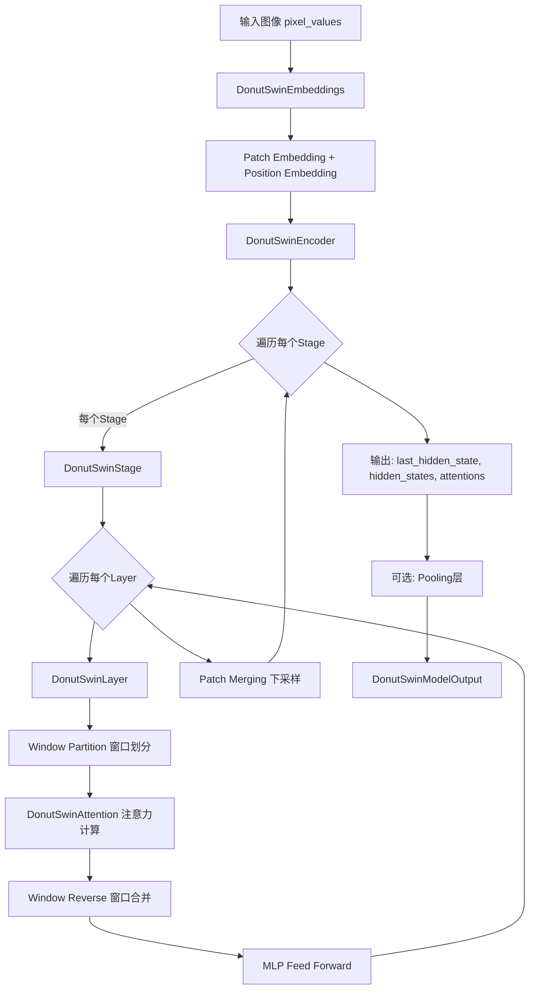
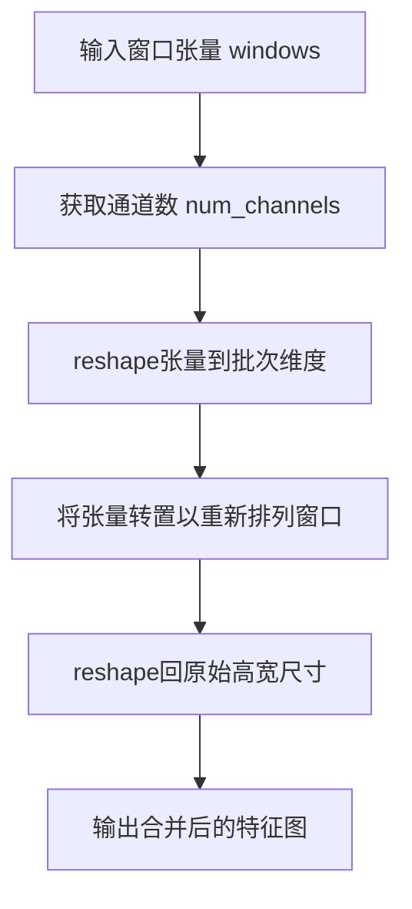
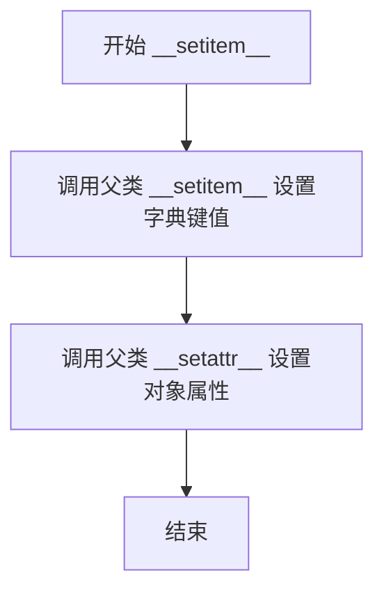
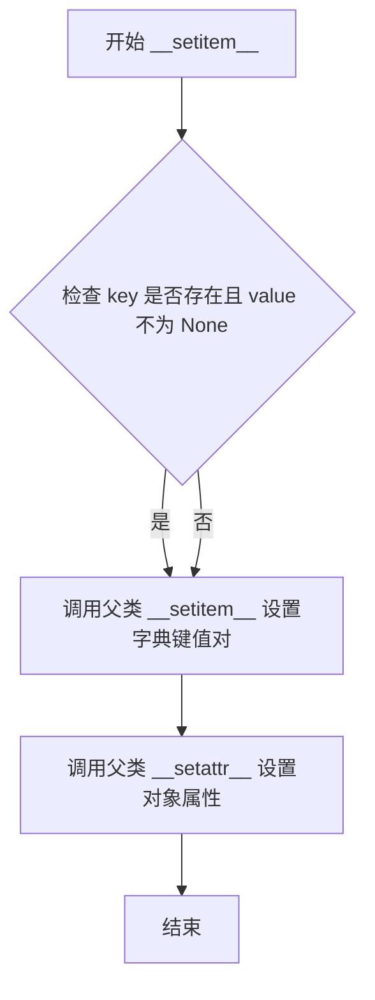
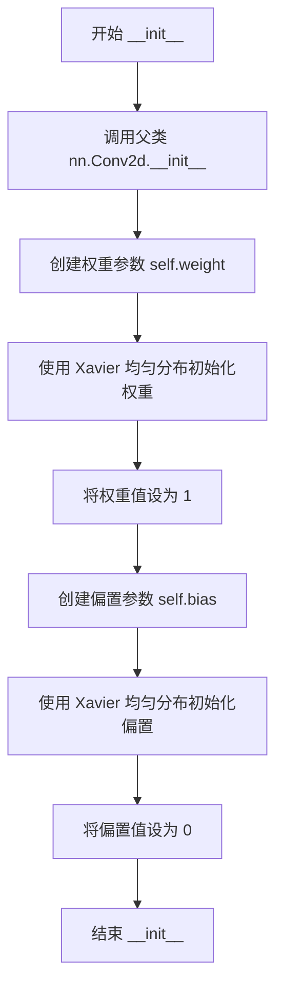
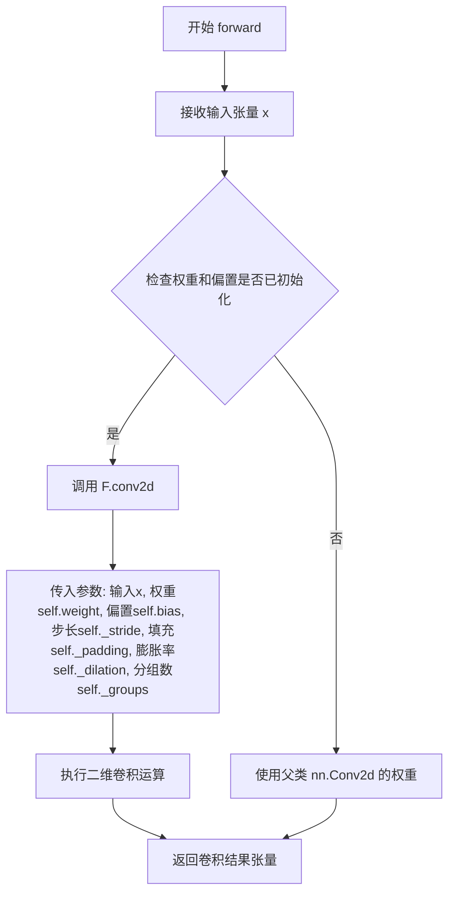

# `MinerU\mineru\model\utils\pytorchocr\modeling\backbones\rec_donut_swin.py` 详细设计文档

这是DonutSwin视觉编码器的PyTorch实现，基于Swin Transformer架构，专门为Donut文档理解模型设计。该实现包含完整的配置类、数据类、嵌入层、注意力机制、Transformer编码器层和预训练模型封装，支持图像patch嵌入、窗口注意力机制、位置编码和多层特征输出。

## 整体流程



## 类结构

```
配置与数据类
├── DonutSwinConfig (配置类)
├── DonutSwinEncoderOutput (编码器输出)
└── DonutSwinModelOutput (模型输出)
嵌入层
├── DonutSwinEmbeddings (完整嵌入含位置编码)
├── DonutSwinPatchEmbeddings (Patch嵌入)
└── MyConv2d (自定义卷积)
注意力机制
├── DonutSwinSelfAttention (自注意力)
├── DonutSwinSelfOutput (注意力输出)
└── DonutSwinAttention (完整注意力块)
Transformer组件
├── DonutSwinIntermediate (MLP中间层)
├── DonutSwinOutput (MLP输出层)
├── DonutSwinLayer (单个Transformer层)
├── DonutSwinStage (多个Layer+下采样)
├── DonutSwinEncoder (完整编码器)
└── DonutSwinDropPath (随机深度)
预训练模型基类
└── DonutSwinPreTrainedModel
主模型
└── DonutSwinModel
```

## 全局变量及字段


### `model_type`
    
The model type identifier string for DonutSwin

类型：`str`
    


### `attribute_map`
    
Dictionary mapping attribute names between different naming conventions

类型：`dict`
    


### `DonutSwinConfig.model_type`
    
The model type identifier

类型：`str`
    


### `DonutSwinConfig.attribute_map`
    
Dictionary mapping attribute names for compatibility

类型：`dict`
    


### `DonutSwinConfig.image_size`
    
Input image size (height, width)

类型：`int or tuple`
    


### `DonutSwinConfig.patch_size`
    
Size of patches to split image into

类型：`int or tuple`
    


### `DonutSwinConfig.num_channels`
    
Number of input image channels

类型：`int`
    


### `DonutSwinConfig.embed_dim`
    
Embedding dimension for patch tokens

类型：`int`
    


### `DonutSwinConfig.depths`
    
Number of layers in each stage of the encoder

类型：`list`
    


### `DonutSwinConfig.num_layers`
    
Total number of encoder layers

类型：`int`
    


### `DonutSwinConfig.num_heads`
    
Number of attention heads per stage

类型：`list`
    


### `DonutSwinConfig.window_size`
    
Window size for shifted window self-attention

类型：`int`
    


### `DonutSwinConfig.mlp_ratio`
    
Ratio of MLP hidden dimension to embedding dimension

类型：`float`
    


### `DonutSwinConfig.qkv_bias`
    
Whether to use bias in QKV linear layers

类型：`bool`
    


### `DonutSwinConfig.hidden_dropout_prob`
    
Dropout probability for hidden layers

类型：`float`
    


### `DonutSwinConfig.attention_probs_dropout_prob`
    
Dropout probability for attention probabilities

类型：`float`
    


### `DonutSwinConfig.drop_path_rate`
    
Stochastic depth drop rate for drop path regularization

类型：`float`
    


### `DonutSwinConfig.hidden_act`
    
Activation function for hidden layers

类型：`str`
    


### `DonutSwinConfig.use_absolute_embeddings`
    
Whether to use absolute position embeddings

类型：`bool`
    


### `DonutSwinConfig.initializer_range`
    
Standard deviation for weight initialization

类型：`float`
    


### `DonutSwinConfig.layer_norm_eps`
    
Epsilon for layer normalization

类型：`float`
    


### `DonutSwinConfig.hidden_size`
    
Hidden size of the final feature map

类型：`int`
    


### `DonutSwinEncoderOutput.last_hidden_state`
    
The final hidden state output from encoder

类型：`torch.Tensor`
    


### `DonutSwinEncoderOutput.hidden_states`
    
Hidden states from all encoder layers

类型：`tuple of torch.Tensor`
    


### `DonutSwinEncoderOutput.attentions`
    
Attention weights from all encoder layers

类型：`tuple of torch.Tensor`
    


### `DonutSwinEncoderOutput.reshaped_hidden_states`
    
Reshaped hidden states in (B, C, H, W) format

类型：`tuple of torch.Tensor`
    


### `DonutSwinModelOutput.last_hidden_state`
    
Final hidden state from the model

类型：`torch.Tensor`
    


### `DonutSwinModelOutput.pooler_output`
    
Pooled output from global average pooling

类型：`torch.Tensor`
    


### `DonutSwinModelOutput.hidden_states`
    
Hidden states from all layers

类型：`tuple of torch.Tensor`
    


### `DonutSwinModelOutput.attentions`
    
Attention weights from all layers

类型：`tuple of torch.Tensor`
    


### `DonutSwinModelOutput.reshaped_hidden_states`
    
Reshaped hidden states in spatial format

类型：`tuple of torch.Tensor`
    


### `DonutSwinEmbeddings.patch_embeddings`
    
Module for converting pixel values to patch embeddings

类型：`DonutSwinPatchEmbeddings`
    


### `DonutSwinEmbeddings.num_patches`
    
Total number of patches in the input

类型：`int`
    


### `DonutSwinEmbeddings.patch_grid`
    
Grid size of patches (height, width)

类型：`tuple`
    


### `DonutSwinEmbeddings.mask_token`
    
Learnable mask token for masked image modeling

类型：`nn.Parameter`
    


### `DonutSwinEmbeddings.position_embeddings`
    
Position embeddings for patch tokens

类型：`nn.Parameter`
    


### `DonutSwinEmbeddings.norm`
    
Layer normalization for embeddings

类型：`nn.LayerNorm`
    


### `DonutSwinEmbeddings.dropout`
    
Dropout layer for embeddings

类型：`nn.Dropout`
    


### `MyConv2d.weight`
    
Learnable convolution weights

类型：`torch.Parameter`
    


### `MyConv2d.bias`
    
Learnable convolution bias

类型：`torch.Parameter`
    


### `DonutSwinPatchEmbeddings.image_size`
    
Input image dimensions

类型：`tuple`
    


### `DonutSwinPatchEmbeddings.patch_size`
    
Dimensions of each patch

类型：`tuple`
    


### `DonutSwinPatchEmbeddings.num_channels`
    
Number of input channels

类型：`int`
    


### `DonutSwinPatchEmbeddings.num_patches`
    
Total number of patches

类型：`int`
    


### `DonutSwinPatchEmbeddings.is_export`
    
Flag for export mode compatibility

类型：`bool`
    


### `DonutSwinPatchEmbeddings.grid_size`
    
Grid dimensions for patches

类型：`tuple`
    


### `DonutSwinPatchEmbeddings.projection`
    
Convolution layer for patch projection

类型：`nn.Conv2D`
    


### `DonutSwinPatchMerging.input_resolution`
    
Resolution of input features

类型：`tuple`
    


### `DonutSwinPatchMerging.dim`
    
Number of input channels

类型：`int`
    


### `DonutSwinPatchMerging.reduction`
    
Linear layer for dimension reduction

类型：`nn.Linear`
    


### `DonutSwinPatchMerging.norm`
    
Normalization layer before reduction

类型：`nn.Module`
    


### `DonutSwinPatchMerging.is_export`
    
Flag for export mode compatibility

类型：`bool`
    


### `DonutSwinDropPath.drop_prob`
    
Probability for stochastic depth drop

类型：`Optional[float]`
    


### `DonutSwinSelfAttention.num_attention_heads`
    
Number of attention heads

类型：`int`
    


### `DonutSwinSelfAttention.attention_head_size`
    
Dimension of each attention head

类型：`int`
    


### `DonutSwinSelfAttention.all_head_size`
    
Total dimension of all attention heads

类型：`int`
    


### `DonutSwinSelfAttention.window_size`
    
Window dimensions for attention

类型：`tuple`
    


### `DonutSwinSelfAttention.relative_position_bias_table`
    
Table of relative position biases

类型：`torch.Parameter`
    


### `DonutSwinSelfAttention.relative_position_index`
    
Relative position indices for window attention

类型：`torch.Tensor`
    


### `DonutSwinSelfAttention.query`
    
Linear layer for query projection

类型：`nn.Linear`
    


### `DonutSwinSelfAttention.key`
    
Linear layer for key projection

类型：`nn.Linear`
    


### `DonutSwinSelfAttention.value`
    
Linear layer for value projection

类型：`nn.Linear`
    


### `DonutSwinSelfAttention.dropout`
    
Dropout for attention probabilities

类型：`nn.Dropout`
    


### `DonutSwinSelfOutput.dense`
    
Linear layer for output transformation

类型：`nn.Linear`
    


### `DonutSwinSelfOutput.dropout`
    
Dropout for output

类型：`nn.Dropout`
    


### `DonutSwinAttention.self`
    
Self-attention module

类型：`DonutSwinSelfAttention`
    


### `DonutSwinAttention.output`
    
Output projection module

类型：`DonutSwinSelfOutput`
    


### `DonutSwinAttention.pruned_heads`
    
Set of pruned attention heads

类型：`set`
    


### `DonutSwinIntermediate.dense`
    
Linear layer for intermediate projection

类型：`nn.Linear`
    


### `DonutSwinIntermediate.intermediate_act_fn`
    
Activation function for intermediate layer

类型：`function`
    


### `DonutSwinOutput.dense`
    
Linear layer for output projection

类型：`nn.Linear`
    


### `DonutSwinOutput.dropout`
    
Dropout for output

类型：`nn.Dropout`
    


### `DonutSwinLayer.chunk_size_feed_forward`
    
Chunk size for feed-forward computation

类型：`int`
    


### `DonutSwinLayer.shift_size`
    
Shift size for shifted window attention

类型：`int`
    


### `DonutSwinLayer.window_size`
    
Window size for attention

类型：`int`
    


### `DonutSwinLayer.input_resolution`
    
Resolution of input features

类型：`tuple`
    


### `DonutSwinLayer.layernorm_before`
    
Layer normalization before attention

类型：`nn.LayerNorm`
    


### `DonutSwinLayer.attention`
    
Self-attention module

类型：`DonutSwinAttention`
    


### `DonutSwinLayer.drop_path`
    
Drop path stochastic depth module

类型：`DonutSwinDropPath`
    


### `DonutSwinLayer.layernorm_after`
    
Layer normalization after attention

类型：`nn.LayerNorm`
    


### `DonutSwinLayer.intermediate`
    
Intermediate MLP module

类型：`DonutSwinIntermediate`
    


### `DonutSwinLayer.output`
    
Output MLP module

类型：`DonutSwinOutput`
    


### `DonutSwinLayer.is_export`
    
Flag for export mode compatibility

类型：`bool`
    


### `DonutSwinStage.config`
    
Configuration object for the stage

类型：`DonutSwinConfig`
    


### `DonutSwinStage.dim`
    
Number of channels in the stage

类型：`int`
    


### `DonutSwinStage.blocks`
    
List of Swin transformer layers

类型：`nn.ModuleList`
    


### `DonutSwinStage.is_export`
    
Flag for export mode compatibility

类型：`bool`
    


### `DonutSwinStage.downsample`
    
Optional patch merging layer for downsampling

类型：`Optional[DonutSwinPatchMerging]`
    


### `DonutSwinStage.pointing`
    
Flag indicating if layer points to next stage

类型：`bool`
    


### `DonutSwinEncoder.num_layers`
    
Total number of stages in encoder

类型：`int`
    


### `DonutSwinEncoder.config`
    
Configuration for the encoder

类型：`DonutSwinConfig`
    


### `DonutSwinEncoder.layers`
    
List of encoder stages

类型：`nn.ModuleList`
    


### `DonutSwinEncoder.gradient_checkpointing`
    
Whether gradient checkpointing is enabled

类型：`bool`
    


### `DonutSwinPreTrainedModel.config_class`
    
Configuration class for the model

类型：`type`
    


### `DonutSwinPreTrainedModel.base_model_prefix`
    
Prefix for base model weights

类型：`str`
    


### `DonutSwinPreTrainedModel.main_input_name`
    
Name of the main input tensor

类型：`str`
    


### `DonutSwinPreTrainedModel.supports_gradient_checkpointing`
    
Whether model supports gradient checkpointing

类型：`bool`
    


### `DonutSwinModel.config`
    
Model configuration object

类型：`DonutSwinConfig`
    


### `DonutSwinModel.num_layers`
    
Number of encoder layers

类型：`int`
    


### `DonutSwinModel.num_features`
    
Number of features in the final layer

类型：`int`
    


### `DonutSwinModel.embeddings`
    
Patch and position embeddings module

类型：`DonutSwinEmbeddings`
    


### `DonutSwinModel.encoder`
    
Swin transformer encoder

类型：`DonutSwinEncoder`
    


### `DonutSwinModel.pooler`
    
Global average pooling layer

类型：`Optional[nn.AdaptiveAvgPool1D]`
    


### `DonutSwinModel.out_channels`
    
Number of output channels

类型：`int`
    
    

## 全局函数及方法


### `window_partition`

将输入特征张量按照指定的窗口大小分割成多个非重叠的窗口，以便在Swin Transformer中进行局部自注意力计算。

参数：

- `input_feature`：`torch.Tensor`，输入特征张量，形状为 (batch_size, height, width, num_channels)，其中 batch_size 是批量大小，height 和 width 是特征图的高度和宽度，num_channels 是通道数
- `window_size`：`int`，窗口大小，用于将特征图分割成 window_size × window_size 的窗口

返回值：`torch.Tensor`，分割后的窗口张量，形状为 (batch_size * num_windows, window_size, window_size, num_channels)，其中 num_windows = (height // window_size) * (width // window_size)

#### 流程图

```mermaid
flowchart TD
    A[输入: input_feature<br/>shape: (B, H, W, C)] --> B[获取输入维度信息<br/>batch_size, height, width, num_channels]
    B --> C[reshape 操作<br/>将输入分割成网格形式<br/>shape: (B, H/ws, ws, W/ws, ws, C)]
    C --> D[transpose 操作<br/>重新排列维度顺序<br/>shape: (B, H/ws, W/ws, ws, ws, C)]
    D --> E[reshape 操作<br/>展平窗口维度<br/>shape: (B * H/ws * W/ws, ws, ws, C)]
    E --> F[输出: windows<br/>shape: (B * num_windows, ws, ws, C)]
```

#### 带注释源码

```python
def window_partition(input_feature, window_size):
    """
    Partitions the given input into windows.
    
    该函数将输入的4D特征张量按照window_size大小分割成多个非重叠的窗口。
    这是在Swin Transformer中实现局部注意力机制的关键步骤。
    
    参数:
        input_feature: 输入特征张量，形状为 (batch_size, height, width, num_channels)
        window_size: 窗口大小，是一个整数
    
    返回:
        windows: 分割后的窗口张量，形状为 (batch_size * num_windows, window_size, window_size, num_channels)
    """
    # 获取输入张量的维度信息
    # batch_size: 批量大小
    # height: 特征图高度
    # width: 特征图宽度  
    # num_channels: 通道数
    batch_size, height, width, num_channels = input_feature.shape
    
    # 使用reshape将输入特征图分割成网格形式
    # 原始形状: (B, H, W, C)
    # 变形后: (B, H//ws, ws, W//ws, ws, C)
    # 这样每个 window_size x window_size 的区域被组织在一起
    input_feature = input_feature.reshape(
        [
            batch_size,
            height // window_size,   # 将高度分割成多个窗口
            window_size,             # 窗口高度
            width // window_size,    # 将宽度分割成多个窗口
            window_size,             # 窗口宽度
            num_channels,             # 通道数保持不变
        ]
    )
    
    # 使用transpose重新排列维度，将窗口维度移到最后
    # 输入形状: (B, H//ws, ws, W//ws, ws, C)
    # 输出形状: (B, H//ws, W//ws, ws, ws, C)
    # 这样做是为了将同一个位置的窗口排列在一起
    windows = input_feature.transpose([0, 1, 3, 2, 4, 5]).reshape(
        [-1, window_size, window_size, num_channels]
    )
    # 最终reshape成 (batch_size * num_windows, window_size, window_size, num_channels)
    # 其中 num_windows = (height // window_size) * (width // window_size)
    
    return windows
```


### `window_reverse`

将窗口张量重新排列并合并回原始高分辨率特征图，实现窗口逆变换操作。

参数：

- `windows`：`torch.Tensor`，窗口化后的输入张量，形状为`(num_windows, window_size, window_size, num_channels)`
- `window_size`：`int`，窗口的尺寸大小
- `height`：`int`，原始特征图的高度（未填充）
- `width`：`int`，原始特征图的宽度（未填充）

返回值：`torch.Tensor`，合并后的高分辨率特征图张量，形状为`(batch_size, height, width, num_channels)`

#### 流程图



#### 带注释源码

```python
def window_reverse(windows, window_size, height, width):
    """
    Merges windows to produce higher resolution features.
    
    此函数是window_partition的逆操作，将窗口化的特征图重新合并为
    完整的特征图。常见于Swin Transformer中，将窗口注意力后的特征
    还原为空间维度。
    
    参数:
        windows: 窗口化后的张量，形状为 (num_windows, window_size, window_size, num_channels)
        window_size: 窗口大小
        height: 原始高度
        width: 原始宽度
    
    返回:
        合并后的特征图，形状为 (batch_size, height, width, num_channels)
    """
    # 获取通道数
    num_channels = windows.shape[-1]
    
    # 将张量reshape回原始的网格布局
    # -1 表示自动计算批次大小
    # height // window_size 和 width // window_size 表示窗口网格的高度和宽度
    windows = windows.reshape(
        [
            -1,
            height // window_size,
            width // window_size,
            window_size,
            window_size,
            num_channels,
        ]
    )
    
    # 转置维度以重新排列窗口位置
    # 从 (batch, grid_h, grid_w, window_h, window_w, channels)
    # 转换为 (batch, grid_h, window_h, grid_w, window_w, channels)
    windows = windows.transpose([0, 1, 3, 2, 4, 5]).reshape(
        [-1, height, width, num_channels]
    )
    
    return windows
```


### `drop_path`

该函数实现了Stochastic Depth（随机深度）技术，通过在训练过程中随机丢弃输入张量的某些元素来增强模型的泛化能力。这是深度学习中一种有效的正则化方法，灵感来自于Dropout，但在残差块的主路径上应用。

参数：

- `input`：`torch.Tensor`，输入的张量，可以是任意维度的张量
- `drop_prob`：`float`，丢弃概率，默认为0.0，表示不进行随机丢弃
- `training`：`bool`，训练模式标志，默认为False，仅在训练模式下生效

返回值：`torch.Tensor`，经过随机深度处理后的张量

#### 流程图

```mermaid
flowchart TD
    A[开始] --> B{drop_prob == 0.0 或 not training?}
    B -->|Yes| C[直接返回输入]
    B -->|No| D[计算 keep_prob = 1 - drop_prob]
    D --> E[生成随机张量形状: (batch_size, 1, 1, ...)]
    E --> F[生成 keep_prob + random_tensor]
    F --> G[floor_() 二值化]
    G --> H[output = input / keep_prob * random_tensor]
    H --> I[返回输出]
```

#### 带注释源码

```
# Copied from transformers.models.beit.modeling_beit.drop_path
def drop_path(
    input: torch.Tensor, drop_prob: float = 0.0, training: bool = False
) -> torch.Tensor:
    """
    实现Stochastic Depth（随机深度）功能。
    
    参数:
        input: 输入张量，任意维度
        drop_prob: 丢弃概率，范围[0, 1)
        training: 是否处于训练模式
    
    返回:
        处理后的张量
    """
    # 如果丢弃概率为0或不处于训练模式，则直接返回输入，不做任何处理
    if drop_prob == 0.0 or not training:
        return input
    
    # 计算保留概率
    keep_prob = 1 - drop_prob
    
    # 生成与输入batch size相同形状的张量，其余维度为1
    # 支持任意维度张量，不仅限于2D卷积网络
    # 例如: 输入为(batch, height, width, channels)
    # 输出形状为(batch, 1, 1, 1)
    shape = (input.shape[0],) + (1,) * (input.ndim - 1)
    
    # 生成[0, 1)范围内的随机数，并加上keep_prob
    # 结果范围: [keep_prob, keep_prob + 1)
    random_tensor = keep_prob + torch.rand(
        shape,
        dtype=input.dtype,
    )
    
    # 二值化：将随机张量转换为0或1
    # 如果 random_tensor >= 1.0，则 floor_() = 1
    # 否则为0
    # 这实现了按概率 drop_prob 将元素置零
    random_tensor.floor_()  # binarize
    
    # 关键步骤：
    # 1. input / keep_prob: 补偿被丢弃的元素，保持期望值不变
    # 2. * random_tensor: 随机将部分元素置零（乘以0）
    output = input / keep_prob * random_tensor
    
    return output
```


### DonutSwinConfig.__init__

该方法是DonutSwinConfig类的初始化构造函数，用于配置DonutSwin模型的超参数。它接受多个图像处理和Transformer相关的参数，并将它们设置为对象的属性，同时处理额外的关键字参数。

参数：

- `image_size`：`int` 或 `tuple`，输入图像的尺寸，默认为224
- `patch_size`：`int`，将图像划分为补丁的窗口大小，默认为4
- `num_channels`：`int`，输入图像的通道数，默认为3（RGB）
- `embed_dim`：`int`，补丁嵌入的维度，默认为96
- `depths`：`list`，每个编码器层的块数量列表，默认为[2, 2, 6, 2]
- `num_heads`：`list`，每个编码器层的注意力头数量列表，默认为[3, 6, 12, 24]
- `window_size`：`int`，注意力窗口的大小，默认为7
- `mlp_ratio`：`float`，MLP层隐藏维度与输入维度的比率，默认为4.0
- `qkv_bias`：`bool`，是否在QKV线性层中使用偏置，默认为True
- `hidden_dropout_prob`：`float`，隐藏层的dropout概率，默认为0.0
- `attention_probs_dropout_prob`：`float`，注意力概率的dropout概率，默认为0.0
- `drop_path_rate`：`float`，随机深度的drop path比率，默认为0.1
- `hidden_act`：`str` 或 `Callable`，隐藏层的激活函数，默认为"gelu"
- `use_absolute_embeddings`：`bool`，是否使用绝对位置嵌入，默认为False
- `initializer_range`：`float`，权重初始化的标准差范围，默认为0.02
- `layer_norm_eps`：`float`，LayerNorm的epsilon值，默认为1e-5
- `**kwargs`：`dict`，额外的关键字参数，会被设置为对象的属性

返回值：`None`，该方法没有返回值，仅初始化对象状态

#### 流程图

```mermaid
flowchart TD
    A[开始 __init__] --> B[调用 super().__init__]
    B --> C[设置基础配置参数]
    C --> D[设置 image_size, patch_size, num_channels, embed_dim, depths]
    C --> E[计算 num_layers = len(depths)]
    C --> F[设置 num_heads, window_size, mlp_ratio]
    C --> G[设置 qkv_bias, dropout相关参数]
    C --> H[设置 hidden_act, use_absolute_embeddings, layer_norm_eps, initializer_range]
    C --> I[计算 hidden_size = embed_dim * 2^(len(depths)-1)]
    I --> J[遍历 kwargs]
    J --> K{遍历完成?}
    K -->|否| L[尝试设置属性]
    L --> K
    K -->|是| M[结束 __init__]
```

#### 带注释源码

```python
def __init__(
    self,
    image_size=224,              # 输入图像的高度/宽度
    patch_size=4,                # 每个补丁的像素大小
    num_channels=3,               # 输入通道数(RGB=3)
    embed_dim=96,                # 补丁嵌入维度
    depths=[2, 2, 6, 2],         # 每个阶段的块数
    num_heads=[3, 6, 12, 24],   # 每层的注意力头数
    window_size=7,               # 局部窗口注意力大小
    mlp_ratio=4.0,               # MLP隐藏层扩展倍数
    qkv_bias=True,               # QKV投影是否使用偏置
    hidden_dropout_prob=0.0,    # 隐藏层dropout概率
    attention_probs_dropout_prob=0.0, # 注意力dropout概率
    drop_path_rate=0.1,         # 随机深度drop比率
    hidden_act="gelu",           # 隐藏层激活函数
    use_absolute_embeddings=False, # 是否使用绝对位置编码
    initializer_range=0.02,     # 权重初始化范围
    layer_norm_eps=1e-5,        # LayerNorm epsilon
    **kwargs,                    # 其他自定义参数
):
    # 调用父类初始化
    super().__init__()

    # ==================== 基础图像参数 ====================
    self.image_size = image_size       # 图像尺寸
    self.patch_size = patch_size       # 补丁大小
    self.num_channels = num_channels   # 通道数
    self.embed_dim = embed_dim          # 嵌入维度

    # ==================== Transformer结构参数 ====================
    self.depths = depths                       # 各层深度
    self.num_layers = len(depths)              # 计算总层数
    self.num_heads = num_heads                 # 注意力头数
    self.window_size = window_size             # 窗口大小
    self.mlp_ratio = mlp_ratio                 # MLP扩展比率

    # ==================== 注意力与Dropout参数 ====================
    self.qkv_bias = qkv_bias                          # QKV偏置
    self.hidden_dropout_prob = hidden_dropout_prob   # 隐藏层dropout
    self.attention_probs_dropout_prob = attention_probs_dropout_prob  # 注意力dropout
    self.drop_path_rate = drop_path_rate             # 路径dropout

    # ==================== 激活函数与归一化参数 ====================
    self.hidden_act = hidden_act                      # 激活函数
    self.use_absolute_embeddings = use_absolute_embeddings  # 位置编码类型
    self.layer_norm_eps = layer_norm_eps             # LayerNorm epsilon
    self.initializer_range = initializer_range       # 初始化范围

    # ==================== 计算隐藏层大小 ====================
    # 最终隐藏大小 = 嵌入维度 * 2^(层数-1)
    self.hidden_size = int(embed_dim * 2 ** (len(depths) - 1))

    # ==================== 处理额外参数 ====================
    # 遍历所有额外的关键字参数
    for key, value in kwargs.items():
        try:
            # 尝试将额外参数设置为对象属性
            setattr(self, key, value)
        except AttributeError as err:
            # 如果设置失败，打印错误信息并重新抛出异常
            print(f"Can't set {key} with value {value} for {self}")
            raise err
```


### `DonutSwinEncoderOutput.__init__`

用于初始化 DonutSwinEncoderOutput 对象，该类是继承自 OrderedDict 的数据类，用于存储 Swin Encoder 的输出结果（包括最后的隐藏状态、隐藏状态列表、注意力权重和重塑后的隐藏状态）。

参数：

- `*args`：可变位置参数，传递给父类 OrderedDict 的位置参数
- `**kwargs`：可变关键字参数，传递给父类 OrderedDict 的关键字参数

返回值：无（`None`），`__init__` 方法不返回任何值

#### 流程图

```mermaid
flowchart TD
    A[开始 __init__] --> B[调用 super().__init__(*args, **kwargs)]
    B --> C[结束初始化]
```

#### 带注释源码

```python
def __init__(self, *args, **kwargs):
    """
    初始化 DonutSwinEncoderOutput 对象。
    
    该方法是数据类的构造函数，继承自 OrderedDict，用于存储 Swin Encoder 的输出。
    它将参数传递给父类 OrderedDict 的构造函数进行初始化。
    
    参数:
        *args: 可变位置参数，传递给父类 OrderedDict
        **kwargs: 可变关键字参数，传递给父类 OrderedDict
    """
    # 调用父类 OrderedDict 的 __init__ 方法
    # 这会初始化字典结构，使其可以存储键值对
    super().__init__(*args, **kwargs)
```


### `DonutSwinEncoderOutput.__getitem__`

该方法实现了 Python 字典的 `__getitem__` 接口，使得 `DonutSwinEncoderOutput` 对象可以通过键（字符串）或索引（整数）两种方式访问其内部属性。当传入字符串键时，从内部字典中获取对应属性值；当传入整数索引时，将所有非空属性转换为元组并返回指定索引位置的元素。

参数：

- `k`：`Union[str, int]`，可以是字符串类型的键名，也可以是整数类型的索引。当为字符串时，作为键名访问 `OrderedDict` 中的属性；当为整数时，作为索引访问 `to_tuple()` 方法生成的元组中的元素。

返回值：`Any`，返回对应键或索引的属性值。如果键不存在且 `k` 为字符串，可能抛出 `KeyError`；如果索引超出范围且 `k` 为整数，可能抛出 `IndexError`。

#### 流程图

```mermaid
flowchart TD
    A[开始 __getitem__] --> B{判断 k 的类型}
    B -->|k 是 str| C[创建 inner_dict = dict(self.items())]
    C --> D[返回 inner_dict[k]]
    B -->|k 不是 str| E[调用 self.to_tuple() 获取元组]
    E --> F[返回 to_tuple()[k]]
    D --> G[结束]
    F --> G
```

#### 带注释源码

```python
def __getitem__(self, k):
    """
    获取指定键或索引对应的值。

    参数:
        k (Union[str, int]): 如果是字符串，则作为键名从内部字典中获取值；
                           如果是整数，则作为索引从 to_tuple() 返回的元组中获取值。

    返回值:
        Any: 对应键或索引的属性值。
    """
    # 判断 k 是否为字符串类型
    if isinstance(k, str):
        # 将 OrderedDict 转换为普通字典
        inner_dict = dict(self.items())
        # 从内部字典中获取键对应的值
        return inner_dict[k]
    else:
        # 将所有非空属性转换为元组，然后按索引获取
        return self.to_tuple()[k]
```


### `DonutSwinEncoderOutput.__setattr__`

#### 描述

该方法是 `DonutSwinEncoderOutput` 类的自定义属性设置器（Magic Method）。该类继承自 `OrderedDict` 并被装饰为 `@dataclass`。`__setattr__` 方法实现了一个双向同步机制：当设置实例属性时，如果属性名称存在于字典的键（Keys）中且值不为 `None`，则同时更新字典中的项（Item）；否则仅执行标准的对象属性设置。这确保了对象既可以像字典一样通过键访问，也可以像普通对象一样通过属性访问，同时避免在字典中写入无意义的 `None` 值或未声明的键。

#### 参数

- `name`：`str`，要设置的属性的名称。
- `value`：`Any`（任意类型），要赋予该属性的值。

#### 返回值

`None`。Python 中的 `__setattr__` 方法通常不返回值，其主要职责是修改对象状态。

#### 流程图

```mermaid
flowchart TD
    A[开始: 调用 __setattr__(name, value)] --> B{检查条件: name 在 self.keys() 中\n且 value 不是 None?}
    B -- 是 --> C[调用 super().__setitem__(name, value)\n更新字典内容]
    B -- 否 --> D[跳过字典更新]
    C --> E[调用 super().__setattr__(name, value)\n更新对象属性]
    D --> E
    E --> F[结束]
```

#### 带注释源码

```python
def __setattr__(self, name, value):
    """
    自定义属性设置器。
    逻辑：
    1. 检查该属性名是否已经是字典中的一个键，并且值不为 None。
    2. 如果满足条件，同步更新 OrderedDict 中的项。
    3. 无论如何都更新对象本身的属性（确保对象属性和字典键值同步）。
    """
    # 检查字典中是否已存在该键，且传入的值不是 None
    if name in self.keys() and value is not None:
        # 如果是，则同时更新字典结构
        super().__setitem__(name, value)
    
    # 无论字典是否更新，都执行标准的属性设置操作
    # (这会调用 object 类的 __setattr__，将属性绑定到实例上)
    super().__setattr__(name, value)
```


### `DonutSwinEncoderOutput.__setitem__`

该方法用于设置 `DonutSwinEncoderOutput` 对象中的键值对，同时更新内部字典和对象属性，确保字典和对象属性的同步。

参数：

- `key`：任意类型，字典的键，用于索引或设置值
- `value`：任意类型，要设置的值

返回值：`None`，无返回值（该方法直接修改对象状态）

#### 流程图



#### 带注释源码

```python
def __setitem__(self, key, value):
    """
    设置字典项并同步更新对象属性。
    
    Args:
        key: 字典的键，可以是字符串或其他可哈希类型
        value: 要设置的值，任意类型
    """
    # 调用父类(OrderedDict)的__setitem__方法，将键值对添加到字典中
    super().__setitem__(key, value)
    # 调用父类的__setattr__方法，将键作为属性名，值作为属性值同步到对象属性中
    # 这样确保了字典和对象属性的一致性，既可以通过dict方式访问，也可以通过属性方式访问
    super().__setattr__(key, value)
```


### `DonutSwinEncoderOutput.to_tuple`

将 `DonutSwinEncoderOutput` 对象转换为包含所有非空属性值的元组。

参数：

- 无参数（仅包含 `self`）

返回值：`tuple`，返回一个元组，包含当前对象中所有非空的键值。

#### 流程图

```mermaid
flowchart TD
    A[开始 to_tuple 方法] --> B{遍历 self.keys}
    B --> C[获取键 k]
    C --> D[self[k] 获取值]
    D --> E{值是否为 None}
    E -->|否| F[将值添加到结果列表]
    E -->|是| G[跳过]
    F --> H{是否还有更多键}
    H -->|是| C
    H -->|否| I[返回由所有非空值组成的元组]
    G --> H
```

#### 带注释源码

```python
def to_tuple(self):
    """
    Convert self to a tuple containing all the attributes/keys that are not `None`.
    """
    # 遍历对象的所有键（keys），将非 None 的值收集到元组中并返回
    # self.keys() 继承自 OrderedDict，返回所有已设置的键
    # self[k] 通过 __getitem__ 方法获取键对应的值
    return tuple(self[k] for k in self.keys())
```


### DonutSwinModelOutput.__init__

这是 DonutSwinModelOutput 类的初始化方法，继承自 OrderedDict，用于存储 Swin 模型的输出结果，包括最后一层隐藏状态、池化输出、隐藏状态和注意力权重等。

参数：

- `*args`：可变位置参数，用于传递给父类 OrderedDict 的位置参数
- `**kwargs`：可变关键字参数，用于传递给父类 OrderedDict 的关键字参数

返回值：无（None），该方法为构造函数，不返回值

#### 流程图

```mermaid
flowchart TD
    A[开始 __init__] --> B[调用 super().__init__(*args, **kwargs)]
    B --> C[结束初始化]
```

#### 带注释源码

```python
def __init__(self, *args, **kwargs):
    """
    初始化 DonutSwinModelOutput 对象。
    
    Args:
        *args: 可变位置参数，传递给父类 OrderedDict
        **kwargs: 可变关键字参数，传递给父类 OrderedDict
    
    Returns:
        None: 构造函数不返回值
    """
    # 调用父类 OrderedDict 的初始化方法
    # 允许传入任意数量的位置参数和关键字参数
    # 这些参数将被传递给 OrderedDict 的 __init__ 方法
    super().__init__(*args, **kwargs)
```


### `DonutSwinModelOutput.__getitem__`

该方法实现了对 `DonutSwinModelOutput` 对象的下标访问操作，允许通过字符串键（如属性名）或整数索引（如位置）来获取对应的值。当使用字符串时，从内部字典中查找；当使用整数时，将所有非空属性转换为元组后按索引获取。

参数：

- `k`：`Union[str, int]`，要获取的键名（字符串类型，对应属性名）或索引（整数类型，对应元组位置）

返回值：`Any`，返回对应的属性值。如果键是字符串，则返回字典中对应的值；如果键是整数，则返回元组中对应位置的元素。

#### 流程图

```mermaid
flowchart TD
    A[开始 __getitem__] --> B{参数 k 是字符串类型?}
    B -->|是| C[创建 inner_dict = dict(self.items())]
    C --> D[返回 inner_dict[k]]
    B -->|否| E[调用 self.to_tuple() 获取元组]
    E --> F[返回 to_tuple()[k]]
    D --> G[结束]
    F --> G
```

#### 带注释源码

```python
def __getitem__(self, k):
    """
    获取字典或元组中的元素。
    
    该方法支持两种访问方式：
    1. 字符串键访问：从内部字典中获取属性值
    2. 整数索引访问：从转换为元组的所有属性中按位置获取
    
    参数:
        k (Union[str, int]): 
            - 如果是 str 类型：表示属性名称（键名）
            - 如果是 int 类型：表示在元组中的位置索引
    
    返回:
        Any: 
            - 当 k 是 str 时：返回字典中键 k 对应的值
            - 当 k 是 int 时：返回元组中索引 k 对应的元素
    """
    # 判断传入的参数是否为字符串类型
    if isinstance(k, str):
        # 如果是字符串，则将当前 OrderedDict 转换为普通字典
        # 这样可以确保获取到最新的属性值
        inner_dict = dict(self.items())
        # 从内部字典中返回指定键对应的值
        return inner_dict[k]
    else:
        # 如果不是字符串（通常为整数索引）
        # 则将所有非空的属性值转换为元组
        # 然后返回指定索引位置的元素
        return self.to_tuple()[k]
```


### `DonutSwinModelOutput.__setattr__`

该方法是`DonutSwinModelOutput`数据类的属性设置拦截器，用于在设置属性时同时维护`OrderedDict`的键值对和对象属性，确保两者的一致性。当设置的属性名存在于字典的键中且值不为`None`时，会同时更新字典项和对象属性；否则仅设置对象属性。

参数：

- `name`：`str`，要设置的属性的名称
- `value`：`任意类型`，要设置的值

返回值：`None`，该方法不返回任何值（隐式返回`None`）

#### 流程图

```mermaid
flowchart TD
    A[开始 __setattr__] --> B{检查: name in self.keys() 且 value is not None?}
    B -->|是| C[调用 super().__setitem__(name, value)]
    C --> D[调用 super().__setattr__(name, value)]
    B -->|否| D
    D --> E[结束]
```

#### 带注释源码

```python
def __setattr__(self, name, value):
    """
    设置属性值的拦截器方法。
    
    该方法重写了对象属性设置行为，使其同时维护OrderedDict的键值对和对象属性。
    当设置的属性名存在于OrderedDict的键中且值不为None时，会同时更新字典项；
    否则仅执行普通的对象属性设置。
    
    参数:
        name: str，要设置的属性名称
        value: 任意类型，要设置的属性值
    
    返回:
        None，该方法不返回值
    """
    # 检查属性名是否在OrderedDict的键集合中，且值不为None
    if name in self.keys() and value is not None:
        # 如果条件满足，同时更新OrderedDict中的键值对
        super().__setitem__(name, value)
    # 无论条件是否满足，都调用父类的__setattr__方法设置对象属性
    super().__setattr__(name, value)
```


### `DonutSwinModelOutput.__setitem__`

该方法用于同时设置 `DonutSwinModelOutput` 对象的字典键值对和对象属性，确保字典和对象属性的同步更新。

参数：

- `key`：`Union[str, int]`，字典的键，可以是字符串键名或整数索引
- `value`：任意类型，要设置的值

返回值：`None`，无返回值

#### 流程图



#### 带注释源码

```python
def __setitem__(self, key, value):
    """
    设置字典项并同步到对象属性
    
    参数:
        key: 字典的键，可以是字符串或整数
        value: 要设置的值
    """
    # 首先调用父类的 __setitem__ 方法，将键值对添加到字典中
    super().__setitem__(key, value)
    # 然后调用父类的 __setattr__ 方法，将键值对设置为对象属性
    # 这样可以确保字典和对象属性保持同步
    super().__setattr__(key, value)
```


### `DonutSwinModelOutput.to_tuple`

该方法继承自`OrderedDict`，用于将`DonutSwinModelOutput`对象转换为一个元组，其中包含所有非`None`的属性值。

参数：

- 该方法无显式参数（隐式参数`self`为调用该方法的实例）

返回值：`tuple`，返回一个由所有非`None`属性值组成的元组

#### 流程图

```mermaid
flowchart TD
    A[开始执行 to_tuple] --> B[获取self的所有键]
    B --> C{遍历键集合}
    C -->|对于每个键k| D{self[k]是否为None}
    D -->|否| E[将self[k]添加到结果元组]
    D -->|是| F[跳过该键]
    E --> C
    F --> C
    C -->|遍历完成| G[返回结果元组]
    G --> H[结束]
```

#### 带注释源码

```python
def to_tuple(self):
    """
    Convert self to a tuple containing all the attributes/keys that are not `None`.
    """
    # 使用生成器表达式遍历所有键，过滤掉值为None的键
    # self.keys() 继承自 OrderedDict，返回所有属性键
    # self[k] 获取键对应的值
    # 只有当值不为 None 时，才将其包含在最终元组中
    return tuple(self[k] for k in self.keys())
```


### `DonutSwinEmbeddings.__init__`

该方法为 DonutSwinEmbeddings 类的初始化方法，负责构建 patch 嵌入和位置嵌入，并可选地创建 mask token。它使用配置对象初始化 patch 嵌入层、条件性地创建 mask token 和绝对位置嵌入，并添加 LayerNorm 和 Dropout 层用于后续的特征处理。

参数：

- `config`：`DonutSwinConfig` 对象，包含模型的配置参数（如 image_size、patch_size、embed_dim、use_absolute_embeddings、hidden_dropout_prob 等）
- `use_mask_token`：`bool`，默认为 False，指定是否创建 mask token 用于掩码预训练任务

返回值：无（`None`），该方法为构造函数，不返回任何值

#### 流程图

```mermaid
flowchart TD
    A[开始 __init__] --> B[调用 super().__init__]
    B --> C[创建 DonutSwinPatchEmbeddings 实例赋值给 self.patch_embeddings]
    C --> D[从 patch_embeddings 获取 num_patches]
    D --> E[获取 patch_grid 赋值给 self.patch_grid]
    E --> F{use_mask_token == True?}
    F -->|是| G[创建 mask_token 参数: shape=(1, 1, embed_dim)]
    G --> H[使用 xavier_uniform 初始化后用 zeros 覆盖]
    F -->|否| I[self.mask_token = None]
    H --> J
    I --> J{config.use_absolute_embeddings == True?}
    J -->|是| K[创建 position_embeddings 参数: shape=(1, num_patches+1, embed_dim)]
    K --> L[使用 xavier_uniform 初始化后用 zeros 覆盖]
    J -->|否| M[self.position_embeddings = None]
    L --> N
    M --> N[创建 LayerNorm 层: self.norm]
    N --> O[创建 Dropout 层: self.dropout]
    O --> P[结束 __init__]
```

#### 带注释源码

```python
def __init__(self, config, use_mask_token=False):
    """
    初始化 DonutSwinEmbeddings 模块

    参数:
        config: DonutSwinConfig 配置对象，包含模型架构参数
        use_mask_token: bool，是否使用 mask token 进行掩码预训练
    """
    # 调用父类 nn.Module 的初始化方法
    super().__init__()

    # ---- Patch 嵌入层 ----
    # 创建 DonutSwinPatchEmbeddings 实例，负责将像素值转换为 patch 嵌入
    self.patch_embeddings = DonutSwinPatchEmbeddings(config)
    # 获取 patch 数量，用于后续位置嵌入的创建
    num_patches = self.patch_embeddings.num_patches
    # 获取 patch 网格大小，用于后续 Transformer 层的输入
    self.patch_grid = self.patch_embeddings.grid_size

    # ---- Mask Token（可选）----
    # 如果使用掩码预训练，创建可学习的 mask token 参数
    if use_mask_token:
        # 创建形状为 (1, 1, embed_dim) 的参数，使用 xavier_uniform 初始化
        self.mask_token = nn.Parameter(
            nn.init.xavier_uniform_(torch.zeros(1, 1, config.embed_dim).to(torch.float32))
        )
        # 将 mask_token 初始化为零（覆盖之前的 xavier_uniform）
        # 注意：这里存在一个 bug，应该是 self.position_embeddings 而不是 self.position_embedding
        nn.init.zeros_(self.mask_token)
    else:
        self.mask_token = None

    # ---- 位置嵌入（可选）----
    # 如果使用绝对位置嵌入，创建可学习的位置嵌入参数
    if config.use_absolute_embeddings:
        # 创建形状为 (1, num_patches+1, embed_dim) 的参数，加 1 是为了预留 [CLS] token
        self.position_embeddings = nn.Parameter(
            nn.init.xavier_uniform_(torch.zeros(1, num_patches + 1, config.embed_dim).to(torch.float32))
        )
        # 将位置嵌入初始化为零
        # 注意：此处代码有误，应为 self.position_embeddings
        nn.init.zeros_(self.position_embedding)
    else:
        self.position_embeddings = None

    # ---- 归一化与 Dropout ----
    # LayerNorm 层，用于对嵌入进行归一化处理
    self.norm = nn.LayerNorm(config.embed_dim)
    # Dropout 层，用于防止过拟合
    self.dropout = nn.Dropout(config.hidden_dropout_prob)
```


### DonutSwinEmbeddings.forward

该方法接收像素值并生成最终的嵌入向量，包含patch嵌入、位置嵌入（可选）和mask token处理（可选），同时返回输出维度信息以供后续模块使用。

参数：

- `pixel_values`：`torch.Tensor`，输入的像素值张量，形状为 `(batch_size, num_channels, height, width)`
- `bool_masked_pos`：`torch.Tensor`（可选），布尔类型的mask位置，形状为 `(batch_size, num_patches)`，用于指示哪些patch被masked

返回值：`(torch.Tensor, Tuple[int])`，第一个元素是嵌入向量，形状为 `(batch_size, seq_length, embed_dim)`，第二个元素是输出维度 `(height, width)`

#### 流程图

```mermaid
flowchart TD
    A[开始 forward] --> B[调用 patch_embeddings 获得 embeddings 和 output_dimensions]
    B --> C[对 embeddings 进行 LayerNorm 归一化]
    C --> D{bool_masked_pos 是否存在?}
    D -->|是| E[扩展 mask_token 到 batch_size 大小]
    E --> F[创建 mask: unsqueeze -1 并类型转换]
    F --> G[条件选择: embeddings * (1 - mask) + mask_tokens * mask]
    D -->|否| H{position_embeddings 是否存在?}
    H -->|是| I[添加 position_embeddings 到 embeddings]
    H -->|否| J[执行 dropout]
    I --> J
    J --> K[返回 embeddings 和 output_dimensions]
```

#### 带注释源码

```python
def forward(self, pixel_values, bool_masked_pos=None):
    """
    前向传播方法，将像素值转换为嵌入向量
    
    参数:
        pixel_values: 输入图像张量，形状为 (batch_size, num_channels, height, width)
        bool_masked_pos: 可选的mask位置张量，形状为 (batch_size, num_patches)
    
    返回:
        embeddings: 嵌入向量，形状为 (batch_size, seq_length, embed_dim)
        output_dimensions: 输出维度信息 (height, width)
    """
    
    # Step 1: 通过 patch_embeddings 模块将像素值转换为 patch 嵌入
    # patch_embeddings 内部包含 Conv2D 层，将图像划分为非重叠的 patches
    # 返回的 embeddings 形状: (batch_size, seq_length, embed_dim)
    # output_dimensions 记录了输出的空间维度 (height, width)
    embeddings, output_dimensions = self.patch_embeddings(pixel_values)
    
    # Step 2: 对 patch  embeddings 进行 LayerNorm 归一化
    # LayerNorm 有助于稳定训练过程
    embeddings = self.norm(embeddings)
    
    # 获取嵌入的形状信息
    batch_size, seq_len, _ = embeddings.shape
    
    # Step 3: 如果提供了 bool_masked_pos，应用 mask token
    # 这通常用于自监督学习任务，如 MAE (Masked Autoencoder)
    if bool_masked_pos is not None:
        # 将 mask_token 扩展到与 embeddings 相同的 batch 和序列长度
        # mask_token 形状: (1, 1, embed_dim) -> (batch_size, seq_len, embed_dim)
        mask_tokens = self.mask_token.expand(batch_size, seq_len, -1)
        
        # 将 bool_masked_pos 扩展为与 mask_tokens 相同的类型
        # bool_masked_pos: (batch_size, seq_len) -> (batch_size, seq_len, 1)
        mask = bool_masked_pos.unsqueeze(-1).type_as(mask_tokens)
        
        # 条件选择：未被 mask 的位置保留原始 embeddings，被 mask 的位置替换为 mask_tokens
        # 公式: embeddings = embeddings * (1 - mask) + mask_tokens * mask
        # 当 mask=1 时使用 mask_tokens，当 mask=0 时保留原始 embeddings
        embeddings = embeddings * (1.0 - mask) + mask_tokens * mask
    
    # Step 4: 如果配置了绝对位置嵌入，添加到 embeddings
    # 绝对位置嵌入为模型提供位置信息
    if self.position_embeddings is not None:
        embeddings = embeddings + self.position_embeddings
    
    # Step 5: 应用 Dropout，防止过拟合
    embeddings = self.dropout(embeddings)
    
    # Step 6: 返回最终的嵌入向量和输出维度
    return embeddings, output_dimensions
```


### `MyConv2d.__init__`

该方法是 `MyConv2d` 类的构造函数，用于初始化一个自定义的二维卷积层。它继承自 `nn.Conv2d`，并重写了权重初始化逻辑，使用 Xavier 均匀分布初始化权重，并将权重初始化为全 1，偏置初始化为全 0。

参数：

- `in_channel`：`int`，输入通道数
- `out_channels`：`int`，输出通道数
- `kernel_size`：卷积核大小，可以是整数或元组
- `stride`：步长，默认为 1
- `padding`：填充方式，默认为 "SAME"，在调用父类时直接传递
- `dilation`：膨胀率，默认为 1
- `groups`：分组卷积的组数，默认为 1
- `bias_attr`：偏置属性，默认为 False
- `eps`：`float`，epsilon 值，默认为 1e-6（该参数在当前实现中未使用）

返回值：无

#### 流程图



#### 带注释源码

```
class MyConv2d(nn.Conv2d):
    def __init__(
        self,
        in_channel,          # 输入通道数
        out_channels,        # 输出通道数
        kernel_size,         # 卷积核大小
        stride=1,            # 步长，默认为1
        padding="SAME",      # 填充方式，默认为"SAME"
        dilation=1,          # 膨胀率，默认为1
        groups=1,            # 分组卷积的组数，默认为1
        bias_attr=False,     # 偏置属性，默认为False
        eps=1e-6,            # epsilon值，默认为1e-6（当前未使用）
    ):
        # 调用父类 nn.Conv2d 的初始化方法
        super().__init__(
            in_channel,
            out_channels,
            kernel_size,
            stride=stride,
            padding=padding,
            dilation=dilation,
            groups=groups,
            bias_attr=bias_attr,
        )
        
        # 创建权重参数 self.weight
        # 使用 torch.Parameter 包装，使其成为可学习的参数
        self.weight = torch.Parameter(
            nn.init.xavier_uniform_(  # 使用 Xavier 均匀分布初始化
                torch.zeros(          # 创建全零张量
                    out_channels, 
                    in_channel, 
                    kernel_size[0], 
                    kernel_size[1]
                ).to(torch.float32)  # 转换为 float32 类型
            )
        )
        
        # 创建偏置参数 self.bias
        self.bias = torch.Parameter(
            nn.init.xavier_uniform_(
                torch.zeros(out_channels).to(torch.float32)
            )
        )
        
        # 将权重初始化为全 1
        nn.init.ones_(self.weight)
        
        # 将偏置初始化为全 0
        nn.init.zeros_(self.bias)
```


### `MyConv2d.forward`

该方法是自定义卷积层的前向传播实现，继承自 PyTorch 的 `nn.Conv2d`，通过 Xavier 均匀初始化权重（权重初始化为 1，偏置初始化为 0），并调用 `F.conv2d` 执行实际的二维卷积运算，支持自定义步长、填充、膨胀率和分组卷积。

参数：

- `self`：`MyConv2d` 实例对象，隐式传递
- `x`：`torch.Tensor`，输入张量，形状为 `(batch_size, in_channels, height, width)`

返回值：`torch.Tensor`，卷积后的输出张量，形状取决于卷积参数

#### 流程图



#### 带注释源码

```python
def forward(self, x):
    """
    自定义卷积层的前向传播方法
    
    参数:
        x: 输入张量，形状为 (batch_size, in_channels, height, width)
    
    返回:
        卷积后的输出张量
    """
    # 使用 PyTorch 的 F.conv2d 函数执行二维卷积
    # 参数说明:
    #   - x: 输入特征图
    #   - self.weight: 卷积核权重，形状为 (out_channels, in_channel, kernel_height, kernel_width)
    #   - self.bias: 偏置项，形状为 (out_channels,)
    #   - self._stride: 步长，控制卷积核滑动步幅
    #   - self._padding: 填充，控制输入边界扩展方式
    #   - self._dilation: 膨胀率，控制卷积核采样间隔
    #   - self._groups: 分组卷积数，控制输入输出通道的分组连接
    x = F.conv2d(
        x,
        self.weight,
        self.bias,
        self._stride,
        self._padding,
        self._dilation,
        self._groups,
    )
    # 返回卷积计算后的特征图
    return x
```


### `DonutSwinPatchEmbeddings.__init__`

该方法是 `DonutSwinPatchEmbeddings` 类的构造函数，负责初始化图像到patch嵌入的转换模块。它从配置对象中提取图像尺寸、patch大小、通道数等参数，并创建卷积投影层用于将输入图像转换为Transformer可处理的patch嵌入序列。

参数：

-  `config`：`DonutSwinConfig` 配置对象，包含模型的所有超参数（如 `image_size`、`patch_size`、`num_channels`、`embed_dim`、`is_export` 等）

返回值：`None`，该方法为构造函数，不返回任何值，仅初始化实例属性

#### 流程图

```mermaid
flowchart TD
    A[开始 __init__] --> B[调用父类构造函数 super().__init__]
    B --> C[从 config 提取 image_size 和 patch_size]
    C --> D{image_size 是否可迭代?}
    D -->|是| E[保持原值]
    D -->|否| F[转换为元组 (image_size, image_size)]
    E --> G{patch_size 是否可迭代?}
    F --> G
    G -->|是| H[保持原值]
    G -->|否| I[转换为元组 (patch_size, patch_size)]
    H --> J[计算 num_patches = (image_size[1] // patch_size[1]) * (image_size[0] // patch_size[0])]
    I --> J
    J --> K[设置实例属性: image_size, patch_size, num_channels, num_patches]
    K --> L[从 config 获取 is_export 并设置]
    L --> M[计算 grid_size = (image_size[0] // patch_size[0], image_size[1] // patch_size[1])]
    M --> N[创建 Conv2D 投影层: nn.Conv2D(num_channels, hidden_size, kernel_size=patch_size, stride=patch_size)]
    N --> O[结束 __init__]
```

#### 带注释源码

```python
def __init__(self, config):
    """
    初始化 DonutSwinPatchEmbeddings 模块。

    参数:
        config: 包含模型配置的对象，需要具备以下属性:
            - image_size: 输入图像的尺寸
            - patch_size: 每个patch的尺寸
            - num_channels: 输入图像的通道数
            - embed_dim: 嵌入维度
            - is_export: 是否为导出模式
    """
    # 调用父类 nn.Module 的初始化方法
    super().__init__()
    
    # 从配置对象中提取图像尺寸和patch尺寸
    image_size, patch_size = config.image_size, config.patch_size
    
    # 从配置对象中提取通道数和隐藏层维度
    num_channels, hidden_size = config.num_channels, config.embed_dim
    
    # 如果 image_size 不是可迭代对象（如元组或列表），则转换为元组
    # 这允许 config 中使用单个整数或元组形式指定图像尺寸
    image_size = (
        image_size
        if isinstance(image_size, collections.abc.Iterable)
        else (image_size, image_size)
    )
    
    # 同理，如果 patch_size 不是可迭代对象，则转换为元组
    # 这允许使用单个整数或元组形式指定patch尺寸
    patch_size = (
        patch_size
        if isinstance(patch_size, collections.abc.Iterable)
        else (patch_size, patch_size)
    )
    
    # 计算总的patch数量
    # patch数量 = (图像高度 // patch高度) * (图像宽度 // patch宽度)
    num_patches = (image_size[1] // patch_size[1]) * (
        image_size[0] // patch_size[0]
    )
    
    # 将各参数保存为实例属性，供后续 forward 方法使用
    self.image_size = image_size
    self.patch_size = patch_size
    self.num_channels = num_channels
    self.num_patches = num_patches
    
    # 从配置中获取导出模式标志
    self.is_export = config.is_export
    
    # 计算patch网格的尺寸（高度和宽度方向的patch数量）
    self.grid_size = (
        image_size[0] // patch_size[0],
        image_size[1] // patch_size[1],
    )
    
    # 创建卷积投影层
    # 使用 Conv2D 将输入图像 (batch, num_channels, height, width)
    # 转换为 patch 嵌入 (batch, num_patches, hidden_size)
    # kernel_size 和 stride 都设为 patch_size，实现非重叠的patch划分
    self.projection = nn.Conv2D(
        num_channels, hidden_size, kernel_size=patch_size, stride=patch_size
    )
```


### `DonutSwinPatchEmbeddings.maybe_pad`

该方法用于对输入的像素值张量进行边缘填充，确保其高度和宽度能够被 patch_size 整除，以便后续进行 patch 嵌入操作。

参数：

- `self`：`DonutSwinPatchEmbeddings` 类实例
- `pixel_values`：`torch.Tensor`，输入的像素值张量，形状为 `(batch_size, num_channels, height, width)`
- `height`：`int`，输入图像的高度
- `width`：`int`，输入图像的宽度

返回值：`torch.Tensor`，填充后的像素值张量

#### 流程图

```mermaid
flowchart TD
    A[开始 maybe_pad] --> B{width % patch_size[1] != 0?}
    B -->|是| C[计算 pad_values = (0, patch_size[1] - width % patch_size[1])]
    B -->|否| D{height % patch_size[0] != 0?}
    C --> E{is_export == True?}
    E -->|是| F[pad_values 转换为 torch.tensor]
    E -->|否| G[使用原始 pad_values]
    F --> H[nn.functional.pad(pixel_values, pad_values)]
    G --> H
    D -->|是| I[计算 pad_values = (0, 0, 0, patch_size[0] - height % patch_size[0])]
    D -->|否| J[返回 pixel_values]
    I --> K{is_export == True?}
    K -->|是| L[pad_values 转换为 torch.tensor]
    K -->|否| M[使用原始 pad_values]
    L --> N[nn.functional.pad(pixel_values, pad_values)]
    M --> N
    N --> J
    H --> D
```

#### 带注释源码

```python
def maybe_pad(self, pixel_values, height, width):
    """
    对输入的像素值张量进行边缘填充，使其尺寸能够被 patch_size 整除。
    
    参数:
        pixel_values: 输入的像素值张量，形状为 (batch_size, num_channels, height, width)
        height: 输入图像的高度
        width: 输入图像的宽度
    
    返回:
        填充后的像素值张量
    """
    # 检查宽度是否需要填充
    if width % self.patch_size[1] != 0:
        # 计算右侧需要填充的像素数
        pad_values = (0, self.patch_size[1] - width % self.patch_size[1])
        # 如果是导出模式（is_export=True），将 pad_values 转换为 torch.tensor
        if self.is_export:
            pad_values = torch.tensor(pad_values, dtype=torch.int32)
        # 使用 nn.functional.pad 进行填充，pad_values 格式为 (left, right)
        pixel_values = nn.functional.pad(pixel_values, pad_values)
    
    # 检查高度是否需要填充
    if height % self.patch_size[0] != 0:
        # 计算底部需要填充的像素数，格式为 (left, right, top, bottom)
        pad_values = (0, 0, 0, self.patch_size[0] - height % self.patch_size[0])
        # 如果是导出模式（is_export=True），将 pad_values 转换为 torch.tensor
        if self.is_export:
            pad_values = torch.tensor(pad_values, dtype=torch.int32)
        # 使用 nn.functional.pad 进行填充
        pixel_values = nn.functional.pad(pixel_values, pad_values)
    
    return pixel_values
```


### DonutSwinPatchEmbeddings.forward

该方法为DonutSwinPatchEmbeddings类的前向传播方法，负责将输入的像素值（pixel_values）转换为补丁嵌入（patch embeddings），同时返回输出的尺寸信息。它首先验证输入通道数，然后对输入进行必要的填充处理，接着通过卷积投影将图像转换为补丁序列，最后将结果整理为适合Transformer处理的形状。

参数：

- `pixel_values`：`torch.Tensor`，输入的像素值张量，形状为(batch_size, num_channels, height, width)

返回值：`Tuple[torch.Tensor, Tuple[int]]`，返回一个元组，包含：
  - embeddings：形状为(batch_size, seq_length, hidden_size)的补丁嵌入张量
  - output_dimensions：输出尺寸(height, width)的元组

#### 流程图

```mermaid
flowchart TD
    A[开始 forward] --> B[获取输入形状: batch_size, num_channels, height, width]
    B --> C{验证通道数是否匹配}
    C -->|不匹配| D[抛出 ValueError 异常]
    C -->|匹配| E[调用 maybe_pad 进行填充]
    E --> F[通过卷积投影: self.projection]
    G[获取输出嵌入的形状] --> H[计算输出尺寸 output_dimensions]
    H --> I[flatten 2维并转置: embeddings.flatten2.transpose]
    I --> J[返回 embeddings 和 output_dimensions]
```

#### 带注释源码

```python
def forward(self, pixel_values) -> Tuple[torch.Tensor, Tuple[int]]:
    """
    将像素值转换为补丁嵌入并返回输出尺寸。
    
    参数:
        pixel_values: 输入的像素值张量，形状为 (batch_size, num_channels, height, width)
    
    返回:
        Tuple[torch.Tensor, Tuple[int]]: 
            - embeddings: 形状为 (batch_size, seq_length, hidden_size) 的补丁嵌入
            - output_dimensions: 输出尺寸 (height, width) 的元组
    """
    # 获取输入的形状信息
    _, num_channels, height, width = pixel_values.shape
    
    # 验证输入通道数是否与配置中的通道数匹配
    if num_channels != self.num_channels:
        raise ValueError(
            "Make sure that the channel dimension of the pixel values match with the one set in the configuration."
        )
    
    # 如果需要，对输入进行填充以适配 patch_size
    pixel_values = self.maybe_pad(pixel_values, height, width)
    
    # 使用卷积层将像素值投影为补丁嵌入
    # 输出形状: (batch_size, hidden_size, height/patch_size, width/patch_size)
    embeddings = self.projection(pixel_values)
    
    # 获取投影后的嵌入的形状
    _, _, height, width = embeddings.shape
    
    # 记录输出尺寸，用于后续层确定输入尺寸
    output_dimensions = (height, width)
    
    # 将嵌入从 (batch_size, hidden_size, num_patches) 
    # 转换为 (batch_size, num_patches, hidden_size)
    embeddings = embeddings.flatten(2).transpose([0, 2, 1])
    
    # 返回补丁嵌入和输出尺寸
    return embeddings, output_dimensions
```


### `DonutSwinPatchMerging.__init__`

这是 `DonutSwinPatchMerging` 类的构造函数，用于初始化 Swin Transformer 中的 Patch Merging 层（补丁合并层），该层负责在 Transformer 的每个阶段开始时对特征图进行下采样，将相邻的 2x2 补丁合并为更高级别的表示，从而实现层级间的空间分辨率降维。

参数：

- `input_resolution`：`Tuple[int]`，输入特征的分辨率，以元组形式表示（如 (height, width)）
- `dim`：`int`，输入特征的通道数（dimension）
- `norm_layer`：`nn.Module`，归一化层类，默认为 `nn.LayerNorm`，用于对合并后的特征进行归一化
- `is_export`：`bool`，导出模式标志，用于控制在导出模型时的特定行为（如张量类型转换）

返回值：`None`，构造函数无返回值，仅初始化对象属性和子模块

#### 流程图

```mermaid
flowchart TD
    A[开始 __init__] --> B[调用 super().__init__()]
    B --> C[保存 input_resolution 到 self.input_resolution]
    C --> D[保存 dim 到 self.dim]
    D --> E[创建 nn.Linear: 4*dim → 2*dim, bias=False]
    E --> F[保存到 self.reduction]
    F --> G[创建 norm_layer: 4*dim 维归一化]
    G --> H[保存到 self.norm]
    H --> I[保存 is_export 到 self.is_export]
    I --> J[结束 __init__]
```

#### 带注释源码

```python
def __init__(
    self,
    input_resolution: Tuple[int],
    dim: int,
    norm_layer: nn.Module = nn.LayerNorm,
    is_export=False,
):
    """
    初始化 Patch Merging 层。

    参数:
        input_resolution: 输入特征的分辨率 (高度, 宽度)
        dim: 输入通道数
        norm_layer: 归一化层类，默认为 LayerNorm
        is_export: 是否为导出模式
    """
    # 调用父类 nn.Module 的初始化方法
    super().__init__()
    
    # 保存输入分辨率到实例属性
    self.input_resolution = input_resolution
    
    # 保存输入通道数到实例属性
    self.dim = dim
    
    # 创建线性变换层：将从 4*dim 维降到 2*dim 维
    # 这里 4*dim 是因为合并了 2x2 共 4 个补丁
    # bias_attr=False 表示不使用偏置项
    self.reduction = nn.Linear(4 * dim, 2 * dim, bias_attr=False)
    
    # 创建归一化层，对 4*dim 维的特征进行归一化
    self.norm = norm_layer(4 * dim)
    
    # 保存导出模式标志
    self.is_export = is_export
```


### `DonutSwinPatchMerging.maybe_pad`

该方法用于在 Patch Merging 层中对输入特征进行填充，以确保特征图的高度和宽度为偶数，便于后续的下采样操作。如果高度或宽度为奇数，则在右侧和底部添加填充。

参数：

- `self`：`DonutSwinPatchMerging` 类实例，包含 `is_export` 属性用于标识是否为导出模式
- `input_feature`：`torch.Tensor`，输入特征张量，形状为 `(batch_size, height, width, num_channels)`
- `height`：`int`，输入特征的高度
- `width`：`int`，输入特征的宽度

返回值：`torch.Tensor`，填充后的特征张量，形状可能发生变化（如果需要填充）

#### 流程图

```mermaid
flowchart TD
    A[开始 maybe_pad] --> B{height % 2 == 1 或 width % 2 == 1?}
    B -->|是| C[计算 pad_values]
    B -->|否| F[返回原始 input_feature]
    C --> D{self.is_export 是否为真?}
    D -->|是| E[将 pad_values 转换为 torch.tensor]
    D -->|否| G[使用 nn.functional.pad 填充]
    E --> G
    G --> H[返回填充后的 input_feature]
```

#### 带注释源码

```python
def maybe_pad(self, input_feature, height, width):
    """
    对输入特征进行填充，确保高度和宽度为偶数。
    
    参数:
        input_feature: 输入特征张量，形状为 (batch_size, height, width, num_channels)
        height: 输入特征的高度
        width: 输入特征的宽度
    
    返回:
        填充后的特征张量
    """
    # 判断是否需要填充：高度或宽度为奇数时需要填充
    should_pad = (height % 2 == 1) or (width % 2 == 1)
    
    if should_pad:
        # 计算填充值，格式为 (left, right, top, bottom) 的元组
        # 由于只会在右侧和底部填充，所以 left=0, top=0
        pad_values = (0, 0, 0, width % 2, 0, height % 2)
        
        # 如果处于导出模式，需要将 pad_values 转换为 torch.tensor
        if self.is_export:
            pad_values = torch.tensor(pad_values, dtype=torch.int32)
        
        # 使用 PyTorch 的 functional.pad 进行填充
        input_feature = nn.functional.pad(input_feature, pad_values)

    # 返回处理后的特征（可能已填充或保持原样）
    return input_feature
```


### `DonutSwinPatchMerging.forward`

该方法是 Swin Transformer 中的 Patch Merging 层实现，用于在每个 Stage 结束时对特征图进行下采样。它通过将相邻的 2x2 区域的特征拼接在一起，将空间分辨率降低一半，同时将通道数翻倍，从而实现层级间的特征降采样。

参数：

- `input_feature`：`torch.Tensor`，输入特征张量，形状为 (batch_size, height*width, num_channels)
- `input_dimensions`：`Tuple[int, int]`，输入特征的空间尺寸 (height, width)

返回值：`torch.Tensor`，下采样后的特征张量，形状为 (batch_size, (height//2)*(width//2), 2*num_channels)

#### 流程图

```mermaid
flowchart TD
    A[输入: input_feature, input_dimensions] --> B[解析输入维度 height, width]
    B --> C[重塑张量: (batch_size, height, width, num_channels)]
    C --> D{检查是否需要padding}
    D -->|是| E[调用 maybe_pad 填充张量]
    D -->|否| F[跳过 padding]
    E --> F
    F --> G[提取四个子区域: 0::2, 1::2 组合]
    G --> H[在通道维度拼接四个子区域]
    H --> I[重塑为: (batch_size, height//2*width//2, 4*num_channels)]
    I --> J[LayerNorm 归一化]
    J --> K[Linear 线性投影: 4*dim -> 2*dim]
    K --> L[输出: (batch_size, height//2*width//2, 2*num_channels)]
```

#### 带注释源码

```python
def forward(
    self, input_feature: torch.Tensor, input_dimensions: Tuple[int, int]
) -> torch.Tensor:
    """
    Patch Merging 层的前向传播
    
    参数:
        input_feature: 输入特征，形状为 (batch_size, height*width, num_channels)
        input_dimensions: (height, width) 原始空间尺寸
    
    返回:
        下采样后的特征，形状为 (batch_size, height//2*width//2, 2*num_channels)
    """
    # 1. 解析输入维度
    height, width = input_dimensions
    batch_size, dim, num_channels = input_feature.shape
    
    # 2. 将 (B, H*W, C) 重塑为 (B, H, W, C) 格式
    input_feature = input_feature.reshape([batch_size, height, width, num_channels])
    
    # 3. 如果高度或宽度为奇数，进行填充以确保可被2整除
    input_feature = self.maybe_pad(input_feature, height, width)
    
    # 4. 提取四个子区域（类似图像下采样的棋盘格采样）
    # input_feature_0: 偶数行、偶数列
    input_feature_0 = input_feature[:, 0::2, 0::2, :]
    # input_feature_1: 奇数行、偶数列
    input_feature_1 = input_feature[:, 1::2, 0::2, :]
    # input_feature_2: 偶数行、奇数列
    input_feature_2 = input_feature[:, 0::2, 1::2, :]
    # input_feature_3: 奇数行、奇数列
    input_feature_3 = input_feature[:, 1::2, 1::2, :]
    
    # 5. 在最后一个维度（通道维）拼接四个子区域
    # 结果形状: (B, H//2, W//2, 4*C)
    input_feature = torch.cat(
        [input_feature_0, input_feature_1, input_feature_2, input_feature_3], -1
    )
    
    # 6. 重塑为 (B, H//2*W//2, 4*C)
    input_feature = input_feature.reshape(
        [batch_size, -1, 4 * num_channels]
    )
    
    # 7. 应用 LayerNorm 归一化
    input_feature = self.norm(input_feature)
    
    # 8. 线性投影: 4*dim -> 2*dim（降低通道数）
    input_feature = self.reduction(input_feature)
    
    return input_feature
```


### `DonutSwinDropPath.__init__`

这是 DonutSwinDropPath 类的构造函数，用于初始化随机深度（Stochastic Depth）DropPath 模块，接收一个可选的丢弃概率参数。

参数：

- `drop_prob`：`Optional[float]`，DropPath 的丢弃概率，默认为 None

返回值：`None`，构造函数不返回任何值

#### 流程图

```mermaid
graph TD
    A[开始 __init__] --> B[调用 super().__init__ 初始化 nn.Module]
    C[设置 self.drop_prob = drop_prob] --> D[结束 __init__]
    B --> C
```

#### 带注释源码

```python
def __init__(self, drop_prob: Optional[float] = None) -> None:
    """
    初始化 DonutSwinDropPath 模块。
    
    参数:
        drop_prob: 可选的浮点数，表示在主路径中应用随机深度时的丢弃概率。
                   如果为 None 或 0.0，则在 forward 时不会执行实际的 drop 操作。
    """
    # 调用父类 nn.Module 的初始化方法
    super().__init__()
    
    # 将传入的 drop_prob 参数保存为模块的属性
    self.drop_prob = drop_prob
```


### `DonutSwinDropPath.forward`

该方法是 `DonutSwinDropPath` 类的前向传播函数，实现 Stochastic Depth（随机深度）技术。它根据给定的 drop probability（丢弃概率）在训练过程中随机丢弃路径，从而改进深度神经网络的训练效果和泛化能力。该方法通过调用底层的 `drop_path` 函数实现具体的随机丢弃逻辑。

参数：

- `hidden_states`：`torch.Tensor`，输入的隐藏状态张量，通常是前一层的输出特征

返回值：`torch.Tensor`，经过随机路径丢弃处理后的张量

#### 流程图

```mermaid
flowchart TD
    A[开始] --> B{self.drop_prob == 0.0 或 not training?}
    B -->|是| C[直接返回 hidden_states]
    B -->|否| D[计算 keep_prob = 1 - self.drop_prob]
    D --> E[创建与 batch_size 形状相同的随机张量]
    E --> F[将随机张量二值化]
    F --> G[输出 = hidden_states / keep_prob * random_tensor]
    G --> H[返回处理后的张量]
```

#### 带注释源码

```
def forward(self, hidden_states: torch.Tensor) -> torch.Tensor:
    """
    前向传播方法，实现 Stochastic Depth 随机路径丢弃
    
    参数:
        hidden_states: 输入的隐藏状态张量
        
    返回:
        经过随机路径丢弃处理后的张量
    """
    # 调用 drop_path 函数，传入隐藏状态、丢弃概率和训练状态
    return drop_path(hidden_states, self.drop_prob, self.training)
```

> **注**：该方法的核心逻辑在 `drop_path` 函数中实现，其基本原理是：
> - 当 `drop_prob=0` 或模型不在训练模式时，直接返回输入（不进行任何处理）
> - 否则，以 `drop_prob` 的概率随机丢弃某些路径（即置零），并对保留的路径进行缩放（除以 `keep_prob`），以保持期望值不变


### `DonutSwinDropPath.extra_repr`

该方法是 `nn.Module` 的标准方法之一，用于在打印模块或查看模块信息时提供额外的表示信息。在这个实现中，它返回包含 Drop Path 概率的字符串表示。

参数：

- 该方法没有显式参数（`self` 为隐式参数）

返回值：`str`，返回描述模块额外属性的字符串，格式为 `p={drop_prob}`，其中 `{drop_prob}` 是 `DonutSwinDropPath` 模块初始化时设置的 drop 概率值。

#### 流程图

```mermaid
graph TD
    A[开始 extra_repr] --> B{self.drop_prob}
    B -->|存在| C[返回字符串 'p={self.drop_prob}']
    B -->|None| D[返回字符串 'p=None']
    C --> E[结束]
    D --> E
```

#### 带注释源码

```
def extra_repr(self) -> str:
    """
    返回模块的额外表示信息，用于打印模块时显示。
    
    Returns:
        str: 包含 drop 概率的字符串，格式为 'p={drop_prob}'。
             当 drop_prob 为 None 时，返回 'p=None'。
    """
    return "p={}".format(self.drop_prob)
```


### DonutSwinSelfAttention.__init__

该方法是 DonutSwinSelfAttention 类的构造函数，负责初始化 Swin Transformer 的自注意力机制模块，包括注意力头数、查询/键/值线性层、相对位置偏置表等核心组件。

参数：

- `config`：DonutSwinConfig，模型配置对象，包含 qkv_bias 和 attention_probs_dropout_prob 等注意力相关配置
- `dim`：int，输入特征的隐藏维度（hidden size）
- `num_heads`：int，注意力头的数量
- `window_size`：int 或 Tuple[int, int]，注意力窗口大小，用于控制局部注意力的范围

返回值：无（None），该方法为构造函数，直接初始化对象属性，不返回任何值

#### 流程图

```mermaid
flowchart TD
    A[开始 __init__] --> B[调用 super().__init__]
    B --> C{检查 dim % num_heads == 0}
    C -->|否| D[抛出 ValueError 异常]
    C -->|是| E[设置 self.num_attention_heads = num_heads]
    E --> F[计算 self.attention_head_size = int(dim / num_heads)]
    F --> G[计算 self.all_head_size]
    G --> H{判断 window_size 是否可迭代}
    H -->|是| I[保持原 window_size]
    H -->|否| J[转换为 tuple]
    I --> K[初始化 relative_position_bias_table 参数]
    J --> K
    K --> L[计算相对位置坐标并注册 buffer]
    L --> M[创建 self.query 线性层]
    M --> N[创建 self.key 线性层]
    N --> O[创建 self.value 线性层]
    O --> P[创建 self.dropout 层]
    P --> Q[结束 __init__]
```

#### 带注释源码

```python
def __init__(self, config, dim, num_heads, window_size):
    """
    初始化 DonutSwinSelfAttention 注意力模块
    
    参数:
        config: 模型配置对象，包含注意力机制的参数配置
        dim: 输入特征的隐藏维度，必须能被 num_heads 整除
        num_heads: 注意力头的数量
        window_size: 窗口大小，用于局部注意力计算
    """
    super().__init__()  # 调用父类 nn.Module 的初始化方法
    
    # 验证隐藏维度是否能被注意力头数整除
    if dim % num_heads != 0:
        raise ValueError(
            f"The hidden size ({dim}) is not a multiple of the number of attention heads ({num_heads})"
        )

    # 设置注意力头数量
    self.num_attention_heads = num_heads
    
    # 计算每个注意力头的维度
    self.attention_head_size = int(dim / num_heads)
    
    # 计算所有注意力头的总维度
    self.all_head_size = self.num_attention_heads * self.attention_head_size
    
    # 处理窗口大小，确保为元组形式
    self.window_size = (
        window_size
        if isinstance(window_size, collections.abc.Iterable)
        else (window_size, window_size)
    )
    
    # 初始化相对位置偏置表，用于编码窗口内 token 之间的相对位置关系
    # 表的大小为 (2*window_size-1) * (2*window_size-1) x num_heads
    self.relative_position_bias_table = torch.Parameter(
        nn.init.xavier_normal_(
            torch.zeros((2 * self.window_size[0] - 1) * (2 * self.window_size[1] - 1), num_heads).to(torch.float32)
        )
    )
    
    # 将相对位置偏置表初始化为零
    nn.init.zeros_(self.relative_position_bias_table)

    # 计算窗口内每个位置的相对位置索引
    # 通过创建网格坐标并计算差值得到成对相对位置
    coords_h = torch.arange(self.window_size[0])
    coords_w = torch.arange(self.window_size[1])
    coords = torch.stack(torch.meshgrid(coords_h, coords_w, indexing="ij"))
    coords_flatten = torch.flatten(coords, 1)
    relative_coords = coords_flatten[:, :, None] - coords_flatten[:, None, :]
    relative_coords = relative_coords.transpose([1, 2, 0])
    
    # 调整坐标范围到非负数
    relative_coords[:, :, 0] += self.window_size[0] - 1
    relative_coords[:, :, 1] += self.window_size[1] - 1
    
    # 第一维乘以 (2*window_size-1) 以便展平后唯一编码
    relative_coords[:, :, 0] *= 2 * self.window_size[1] - 1
    
    # 计算最终的相对位置索引
    relative_position_index = relative_coords.sum(-1)
    
    # 注册为 buffer（不参与梯度更新，但会随模型保存/加载）
    self.register_buffer("relative_position_index", relative_position_index)

    # 创建 Q、K、V 线性投影层，将输入特征映射到查询、键、值空间
    self.query = nn.Linear(
        self.all_head_size, self.all_head_size, bias_attr=config.qkv_bias
    )
    self.key = nn.Linear(
        self.all_head_size, self.all_head_size, bias_attr=config.qkv_bias
    )
    self.value = nn.Linear(
        self.all_head_size, self.all_head_size, bias_attr=config.qkv_bias
    )

    # 注意力概率的 dropout 层，用于正则化
    self.dropout = nn.Dropout(config.attention_probs_dropout_prob)
```


### `DonutSwinSelfAttention.transpose_for_scores`

该方法用于将输入的张量从形状 `(batch_size, seq_length, hidden_size)` 变换为形状 `(batch_size, num_heads, seq_length, head_size)`，以便后续计算注意力分数。

参数：

- `x`：`torch.Tensor`，输入的张量，通常是经过线性变换后的 Query、Key 或 Value 张量

返回值：`torch.Tensor`，变换后的张量，形状为 `(batch_size, num_attention_heads, sequence_length, attention_head_size)`

#### 流程图

```mermaid
flowchart TD
    A[输入 x] --> B[获取原始形状: x.shape[:-1]]
    B --> C[构建新形状: x.shape[:-1] + [num_attention_heads, attention_head_size]]
    C --> D[使用 reshape 重塑张量]
    D --> E[使用 transpose 变换维度顺序为 [0, 2, 1, 3]]
    E --> F[返回变换后的张量]
    
    subgraph 形状变换
    G[batch_size, seq_len, hidden_size] --> H[batch_size, num_heads, seq_len, head_size]
    end
```

#### 带注释源码

```python
def transpose_for_scores(self, x):
    """
    将输入张量重新整形为适合计算注意力分数的格式。
    
    参数:
        x: 输入张量，形状为 (batch_size, seq_length, hidden_size)
        
    返回:
        重新整形后的张量，形状为 (batch_size, num_attention_heads, seq_length, attention_head_size)
    """
    # 获取输入张量除最后一个维度外的所有维度
    # 例如: 输入形状为 (batch, seq_len, hidden_size) -> (batch, seq_len)
    new_x_shape = x.shape[:-1] + [
        self.num_attention_heads,    # 注意力头的数量
        self.attention_head_size,   # 每个头的维度大小
    ]
    # 将张量重塑为 (batch, seq_len, num_heads, head_size)
    x = x.reshape(new_x_shape)
    # 交换维度顺序: (batch, seq_len, num_heads, head_size) -> (batch, num_heads, seq_len, head_size)
    # 这样可以方便地进行批量注意力计算
    return x.transpose([0, 2, 1, 3])
```


### `DonutSwinSelfAttention.forward`

该方法实现了 Swin Transformer 的自注意力机制，通过计算查询、键、值的点积注意力，结合相对位置偏置和注意力掩码，生成上下文相关的表示。

参数：

- `hidden_states`：`torch.Tensor`，形状为 `(batch_size, dim, num_channels)`，输入的隐藏状态向量
- `attention_mask`：可选的 `torch.Tensor`，用于屏蔽特定位置的注意力权重，防止模型关注某些区域
- `head_mask`：可选的 `torch.Tensor`，用于屏蔽特定注意力头的输出
- `output_attentions`：`bool`，决定是否返回注意力权重而非仅返回上下文层

返回值：`Tuple[torch.Tensor]`，当 `output_attentions=True` 时返回 `(context_layer, attention_probs)`；否则返回 `(context_layer,)`

#### 流程图

```mermaid
flowchart TD
    A[输入 hidden_states] --> B[获取 batch_size, dim, num_channels]
    B --> C[通过 Query 层生成混合查询向量]
    C --> D[通过 Key 层生成 Key 向量并转置]
    C --> E[通过 Value 层生成 Value 向量并转置]
    C --> F[Query 向量转置]
    D --> G[计算注意力分数: Query × Key^T]
    F --> G
    G --> H[缩放注意力分数 / sqrt(head_size)]
    H --> I[获取相对位置偏置表]
    I --> J[重塑相对位置索引并查表]
    J --> K[将相对位置偏置添加到注意力分数]
    H --> K
    K --> L{attention_mask 是否存在?}
    L -->|是| M[重塑注意力分数并加上掩码]
    L -->|否| N[保持原样]
    M --> O[Softmax 归一化为概率]
    N --> O
    O --> P[应用 Dropout]
    P --> Q{head_mask 是否存在?}
    Q -->|是| R[应用头掩码]
    Q -->|否| S[保持原样]
    R --> T[计算上下文层: Attention × Value]
    S --> T
    T --> U[转置并重塑上下文层形状]
    U --> V{output_attentions?}
    V -->|是| W[(返回 context_layer, attention_probs)]
    V -->|否| X[(返回 context_layer)]
```

#### 带注释源码

```python
def forward(
    self,
    hidden_states: torch.Tensor,
    attention_mask=None,
    head_mask=None,
    output_attentions=False,
) -> Tuple[torch.Tensor]:
    # 获取输入张量的维度信息
    # batch_size: 批量大小, dim: 特征维度, num_channels: 通道数
    batch_size, dim, num_channels = hidden_states.shape
    
    # 通过线性层生成 Query 向量
    # mixed_query_layer 形状: (batch_size, dim, all_head_size)
    mixed_query_layer = self.query(hidden_states)
    
    # 通过 Key 层生成 Key 向量并转置用于注意力计算
    # key_layer 形状: (batch_size, num_attention_heads, attention_head_size, dim)
    key_layer = self.transpose_for_scores(self.key(hidden_states))
    
    # 通过 Value 层生成 Value 向量并转置
    # value_layer 形状: (batch_size, num_attention_heads, attention_head_size, dim)
    value_layer = self.transpose_for_scores(self.value(hidden_states))
    
    # 对 Query 向量进行相同的形状转换
    # query_layer 形状: (batch_size, num_attention_heads, attention_head_size, dim)
    query_layer = self.transpose_for_scores(mixed_query_layer)

    # 计算 Query 和 Key 的点积得到原始注意力分数
    # attention_scores 形状: (batch_size, num_attention_heads, dim, dim)
    attention_scores = torch.matmul(query_layer, key_layer.transpose([0, 1, 3, 2]))

    # 缩放注意力分数以防止梯度消失
    # 除以 sqrt(attention_head_size) 是标准 Transformer 做法
    attention_scores = attention_scores / math.sqrt(self.attention_head_size)

    # 从预定义的相对位置偏置表中获取偏置值
    # relative_position_index 在 __init__ 中预先计算并注册为缓冲区
    relative_position_bias = self.relative_position_bias_table[
        self.relative_position_index.reshape([-1])
    ]
    
    # 重塑为窗口大小对应的相对位置偏置
    # 形状: (window_size*window_size, window_size*window_size, num_heads)
    relative_position_bias = relative_position_bias.reshape(
        [
            self.window_size[0] * self.window_size[1],
            self.window_size[0] * self.window_size[1],
            -1,
        ]
    )

    # 调整维度顺序并添加到注意力分数
    # 相对位置偏置对于捕获窗口内_token间的相对位置关系至关重要
    relative_position_bias = relative_position_bias.transpose([2, 0, 1])
    attention_scores = attention_scores + relative_position_bias.unsqueeze(0)

    # 如果提供了注意力掩码，则应用到注意力分数上
    if attention_mask is not None:
        # 掩码形状处理：适应多头注意力的维度要求
        mask_shape = attention_mask.shape[0]
        attention_scores = attention_scores.reshape(
            [
                batch_size // mask_shape,
                mask_shape,
                self.num_attention_heads,
                dim,
                dim,
            ]
        )
        # 广播掩码到所有批量和注意力头
        attention_scores = attention_scores + attention_mask.unsqueeze(1).unsqueeze(
            0
        )
        # 恢复原始形状以便后续处理
        attention_scores = attention_scores.reshape(
            [-1, self.num_attention_heads, dim, dim]
        )

    # 使用 Softmax 将注意力分数归一化为概率分布
    attention_probs = nn.functional.softmax(attention_scores, axis=-1)

    # 应用 Dropout 以防止过拟合
    # 这与标准 Transformer 论文中的做法一致
    attention_probs = self.dropout(attention_probs)

    # 如果提供了头掩码，则屏蔽特定注意力头
    if head_mask is not None:
        attention_probs = attention_probs * head_mask

    # 计算上下文层：注意力概率与 Value 向量的矩阵乘法
    # 这是自注意力的核心操作，实现信息的聚合
    context_layer = torch.matmul(attention_probs, value_layer)
    
    # 调整维度顺序以便后续线性变换
    context_layer = context_layer.transpose([0, 2, 1, 3])
    
    # 重塑为最终的输出形状
    # 形状: (batch_size, dim, all_head_size)
    new_context_layer_shape = tuple(context_layer.shape[:-2]) + (
        self.all_head_size,
    )
    context_layer = context_layer.reshape(new_context_layer_shape)
    
    # 根据 output_attentions 决定是否返回注意力概率
    outputs = (
        (context_layer, attention_probs) if output_attentions else (context_layer,)
    )
    return outputs
```


### `DonutSwinSelfOutput.__init__`

该方法是 `DonutSwinSelfOutput` 类的构造函数，用于初始化注意力机制的自注意力输出层。它创建了一个线性变换层（dense layer）和一个 dropout 层，用于对自注意力机制的输出进行进一步处理。

参数：

- `config`：`DonutSwinConfig` 对象，模型配置对象，包含模型的各种超参数和配置信息（如 `attention_probs_dropout_prob` 等）
- `dim`：`int` 类型，表示隐藏状态的维度大小

返回值：`None`（`__init__` 方法不返回任何值）

#### 流程图

```mermaid
flowchart TD
    A[开始 __init__] --> B[调用父类 nn.Module 的初始化]
    --> C[创建线性层 self.dense: nn.Linear(dim, dim)]
    --> D[创建 Dropout 层 self.dropout: nn.Dropout]
    --> E[结束]
```

#### 带注释源码

```python
def __init__(self, config, dim):
    """
    初始化 DonutSwinSelfOutput 层。

    参数:
        config: DonutSwinConfig 对象，包含模型配置信息
        dim: int，隐藏状态的维度
    """
    # 调用父类 nn.Module 的构造函数
    super().__init__()
    
    # 创建一个全连接线性层，输入和输出维度均为 dim
    # 用于对自注意力输出进行线性变换
    self.dense = nn.Linear(dim, dim)
    
    # 创建一个 Dropout 层，使用配置中的注意力概率 dropout 概率
    # 用于在训练时随机丢弃部分神经元输出，防止过拟合
    self.dropout = nn.Dropout(config.attention_probs_dropout_prob)
```


### DonutSwinSelfOutput.forward

该方法是DonutSwinSelfOutput类的前向传播函数，继承自Swin Transformer的SwinSelfOutput实现。它接收自注意力机制的输出，通过全连接层（dense）进行线性变换，然后应用Dropout操作以实现正则化，最终返回变换后的隐藏状态。

参数：

- `hidden_states`：`torch.Tensor`，来自自注意力机制的输出张量，形状为(batch_size, seq_length, hidden_size)
- `input_tensor`：`torch.Tensor`，注意力层的输入张量（与hidden_states相同），用于残差连接，但在此实现中未被使用，仅为保持接口一致性

返回值：`torch.Tensor`，经过全连接层变换和Dropout后的隐藏状态张量，形状与输入hidden_states相同

#### 流程图

```mermaid
graph TD
    A[开始: forward] --> B[输入hidden_states和input_tensor]
    B --> C[self.densehidden_states]
    C --> D[self.dropouthidden_states]
    D --> E[返回变换后的hidden_states]
    
    style A fill:#f9f,stroke:#333
    style E fill:#9f9,stroke:#333
```

#### 带注释源码

```python
# Copied from transformers.models.swin.modeling_swin.SwinSelfOutput
class DonutSwinSelfOutput(nn.Module):
    """
    DonutSwinSelfOutput模块是Swin Transformer中自注意力机制的输出层。
    它包含一个全连接层（线性变换）和一个Dropout层，用于对自注意力输出进行
    进一步的特征变换和正则化。
    """
    
    def __init__(self, config, dim):
        """
        初始化DonutSwinSelfOutput模块。
        
        参数:
            config: DonutSwinConfig配置对象，包含模型配置参数
            dim: int，输入和输出的隐藏维度
        """
        super().__init__()
        # 全连接层，保持维度不变 (dim -> dim)
        self.dense = nn.Linear(dim, dim)
        # Dropout层，根据配置的概率进行dropout
        self.dropout = nn.Dropout(config.attention_probs_dropout_prob)

    def forward(
        self, hidden_states: torch.Tensor, input_tensor: torch.Tensor
    ) -> torch.Tensor:
        """
        前向传播方法。
        
        参数:
            hidden_states: torch.Tensor，来自自注意力机制的输出
            input_tensor: torch.Tensor，注意力层的输入（用于残差连接，此处未使用）
            
        返回值:
            torch.Tensor，经过全连接层变换和Dropout后的输出
        """
        # 通过全连接层进行线性变换，保持维度不变
        hidden_states = self.dense(hidden_states)
        
        # 应用Dropout进行正则化
        hidden_states = self.dropout(hidden_states)

        # 返回变换后的隐藏状态
        return hidden_states
```


### `DonutSwinAttention.__init__`

该方法用于初始化 DonutSwinAttention 类，构造自注意力机制的核心结构（包括查询/键/值投影）以及注意力输出后的线性变换层，并初始化用于追踪被剪枝注意力头的集合。

参数：

- `config`：`DonutSwinConfig`，模型配置对象，提供如 `qkv_bias`（是否使用 QKV 偏置）、`attention_probs_dropout_prob`（注意力概率 dropout 概率）等超参数。
- `dim`：`int`，输入特征向量的维度（即隐藏层大小）。
- `num_heads`：`int`，多头注意力机制中的注意力头数量。
- `window_size`：`int` 或 `Tuple[int]`，用于局部注意力的窗口大小。

返回值：`None`，构造函数不返回任何值。

#### 流程图

```mermaid
graph TD
    A([开始 __init__]) --> B[调用 super().__init__()]
    B --> C[创建 self.self: DonutSwinSelfAttention]
    C --> D[创建 self.output: DonutSwinSelfOutput]
    D --> E[初始化 self.pruned_heads = set()]
    E --> F([结束])
```

#### 带注释源码

```python
# Copied from transformers.models.swin.modeling_swin.SwinAttention with Swin->DonutSwin
class DonutSwinAttention(nn.Module):
    def __init__(self, config, dim, num_heads, window_size):
        """
        初始化 DonutSwinAttention 模块。

        Args:
            config: DonutSwinConfig 实例，包含模型配置。
            dim (int): 输入隐藏状态的维度。
            num_heads (int): 注意力头的数量。
            window_size (int): 窗口大小，用于限制注意力的范围。
        """
        # 调用 nn.Module 的 __init__，注册内部参数
        super().__init__()
        
        # 实例化自注意力核心类，负责 QKV 投影、注意力分数计算和相对位置编码
        self.self = DonutSwinSelfAttention(config, dim, num_heads, window_size)
        
        # 实例化注意力输出线性层，负责将注意力后的结果映射回原始维度并应用 Dropout
        self.output = DonutSwinSelfOutput(config, dim)
        
        # 初始化一个集合，用于记录被剪枝（pruned）的注意力头，便于后续模型分析或优化
        self.pruned_heads = set()
```


### `DonutSwinAttention.forward`

该方法是 DonutSwinAttention 类的前向传播逻辑，负责执行自注意力机制并输出注意力结果。它首先通过自注意力子层（DonutSwinSelfAttention）计算注意力输出，然后通过输出投影层（DonutSwinSelfOutput）对注意力输出进行线性变换和 dropout，最终返回注意力输出和可选的注意力概率。

参数：

- `hidden_states`：`torch.Tensor`，形状为 `(batch_size, seq_len, dim)`，表示输入的隐藏状态
- `attention_mask`：`Optional[torch.Tensor]`，可选的注意力掩码，用于遮盖特定位置，默认为 None
- `head_mask`：`Optional[torch.Tensor]`，可选的头部掩码，用于遮盖特定注意力头，默认为 None
- `output_attentions`：`bool`，是否返回注意力概率，默认为 False

返回值：`Tuple[torch.Tensor]`，包含注意力输出张量，形状为 `(batch_size, seq_len, dim)`，以及可选的注意力概率张量

#### 流程图

```mermaid
flowchart TD
    A[开始: forward] --> B[输入 hidden_states attention_mask head_mask output_attentions]
    B --> C{调用 self.self 计算自注意力}
    C --> D[DonutSwinSelfAttention.forward]
    D --> E[获取自注意力输出和可选的注意力概率]
    E --> F{调用 self.output 进行输出投影}
    F --> G[DonutSwinSelfOutput.forward: 线性变换 + dropout]
    G --> H[构建输出元组]
    H --> I{output_attentions 为 True?}
    I -->|是| J[返回 attention_output, attention_probs]
    I -->|否| K[仅返回 attention_output]
    J --> L[结束]
    K --> L
```

#### 带注释源码

```python
def forward(
    self,
    hidden_states: torch.Tensor,
    attention_mask=None,
    head_mask=None,
    output_attentions=False,
) -> Tuple[torch.Tensor]:
    """
    DonutSwinAttention 的前向传播方法
    
    参数:
        hidden_states: 输入的隐藏状态，形状为 (batch_size, seq_len, dim)
        attention_mask: 可选的注意力掩码，用于遮盖特定位置
        head_mask: 可选的头部掩码，用于遮盖特定注意力头
        output_attentions: 是否返回注意力概率
    
    返回:
        包含注意力输出和可选注意力概率的元组
    """
    # 第一步：调用自注意力子层计算注意力输出
    # self.self 是 DonutSwinSelfAttention 的实例
    # 它负责计算 Q、K、V 并生成注意力上下文向量
    self_outputs = self.self(
        hidden_states,      # 输入隐藏状态
        attention_mask,     # 注意力掩码
        head_mask,          # 头部掩码
        output_attentions   # 是否输出注意力权重
    )
    
    # 第二步：将自注意力的输出通过输出投影层
    # self.output 是 DonutSwinSelfOutput 的实例
    # 包含一个线性层和一个 dropout 层
    # self_outputs[0] 是注意力上下文向量 (batch_size, seq_len, dim)
    # hidden_states 是原始输入，用于残差连接
    attention_output = self.output(self_outputs[0], hidden_states)
    
    # 第三步：构建输出元组
    # 如果 output_attentions 为 True，则包含注意力概率
    # 否则只包含注意力输出
    outputs = (attention_output,) + self_outputs[
        1:
    ]  # add attentions if we output them
    
    # 返回结果，可能是 (attention_output,) 或 (attention_output, attention_probs)
    return outputs
```


### `DonutSwinIntermediate.__init__`

该方法是 `DonutSwinIntermediate` 类的构造函数，负责初始化 Swin Transformer 的中间层（MLP/FFN 的第一层）。它创建了一个线性变换层，将输入维度扩展到 `mlp_ratio` 倍，并设置 GELU 激活函数。

参数：

- `config`：对象，模型配置对象，包含 `mlp_ratio` 等参数，用于确定隐藏层扩展比例
- `dim`：整数，输入特征的维度大小

返回值：无（`None`），构造函数不返回任何值

#### 流程图

```mermaid
flowchart TD
    A[开始 __init__] --> B[调用 super().__init__ 初始化 nn.Module]
    --> C[获取 mlp_ratio: config.mlp_ratio]
    --> D[计算扩展后维度: int config.mlp_ratio * dim]
    --> E[创建 self.dense 线性层: nn.Linear dim → 扩展维度]
    --> F[设置 self.intermediate_act_fn = F.gelu]
    --> G[结束 __init__]
```

#### 带注释源码

```python
# Copied from transformers.models.swin.modeling_swin.SwinIntermediate
class DonutSwinIntermediate(nn.Module):
    def __init__(self, config, dim):
        """
        初始化 Swin 中间层。

        参数:
            config: 配置对象，包含 mlp_ratio 等模型超参数
            dim: 输入特征的维度
        """
        # 调用父类 nn.Module 的初始化方法
        super().__init__()
        
        # 创建一个全连接层（线性变换）
        # 输入维度: dim
        # 输出维度: int(config.mlp_ratio * dim)，即扩展 mlp_ratio 倍
        # 例如: dim=128, mlp_ratio=4.0 → 输出维度=512
        self.dense = nn.Linear(dim, int(config.mlp_ratio * dim))
        
        # 设置中间层的激活函数为 GELU (Gaussian Error Linear Unit)
        # GELU 是 Transformer 模型中常用的激活函数
        self.intermediate_act_fn = F.gelu

    def forward(self, hidden_states: torch.Tensor) -> torch.Tensor:
        """
        前向传播：应用线性变换和激活函数。

        参数:
            hidden_states: 输入张量，形状为 (batch_size, seq_len, dim)

        返回:
            变换后的张量，形状为 (batch_size, seq_len, mlp_ratio*dim)
        """
        # 线性变换：将特征维度从 dim 扩展到 mlp_ratio * dim
        hidden_states = self.dense(hidden_states)
        
        # 应用 GELU 激活函数
        hidden_states = self.intermediate_act_fn(hidden_states)
        
        return hidden_states
```


### `DonutSwinIntermediate.forward`

该方法是 DonutSwinIntermediate 类的前向传播函数，属于 Swin Transformer 架构中的 FFN（Feed-Forward Network）中间层，负责通过全连接层将输入维度扩展到 `mlp_ratio` 倍，然后应用 GELU 激活函数进行非线性变换。

参数：

- `hidden_states`：`torch.Tensor`，输入的隐藏状态张量，形状为 `(batch_size, seq_len, dim)`

返回值：`torch.Tensor`，经过全连接层变换并激活后的隐藏状态张量，形状为 `(batch_size, seq_len, int(dim * mlp_ratio))`

#### 流程图

```mermaid
flowchart TD
    A[输入 hidden_states] --> B[self.dense 线性变换]
    B --> C[self.intermediate_act_fn 激活函数 GELU]
    C --> D[返回变换后的 hidden_states]
    
    subgraph "DonutSwinIntermediate.forward"
        A -.->|torch.Tensor| B
        B -.->|Linear| C
        C -.->|torch.Tensor| D
    end
```

#### 带注释源码

```python
# 定义在 DonutSwinIntermediate 类中
# 继承自 nn.Module，是 Swin Transformer 的中间层模块

def forward(self, hidden_states: torch.Tensor) -> torch.Tensor:
    """
    前向传播方法，执行 FFN 中间层的变换
    
    参数:
        hidden_states: 输入的隐藏状态，形状为 (batch_size, seq_len, dim)
        
    返回值:
        变换后的隐藏状态，形状为 (batch_size, seq_len, dim * mlp_ratio)
    """
    # 步骤1: 通过全连接层进行线性变换
    # 将输入维度 dim 扩展到 dim * mlp_ratio (通常为 4 倍)
    hidden_states = self.dense(hidden_states)
    
    # 步骤2: 应用 GELU 激活函数
    # GELU (Gaussian Error Linear Unit) 是一种非线性激活函数
    # 相比 ReLU 和 GELU 能够提供更好的性能和更平滑的梯度
    hidden_states = self.intermediate_act_fn(hidden_states)
    
    # 返回变换后的隐藏状态
    return hidden_states
```


### `DonutSwinOutput.__init__`

该方法是`DonutSwinOutput`类的构造函数，用于初始化Swin Transformer的输出层，包含一个全连接层和一个Dropout层，用于处理FFN（前馈神经网络）输出后的特征变换和正则化。

参数：

- `config`：`DonutSwinConfig`，配置对象，包含模型超参数如`mlp_ratio`和`hidden_dropout_prob`
- `dim`：`int`，输入特征的维度

返回值：`None`，该方法为构造函数，不返回任何值

#### 流程图

```mermaid
graph TD
    A[开始 __init__] --> B[调用父类 nn.Module 的 __init__]
    B --> C[创建全连接层 self.dense]
    --> D[输入维度: int(config.mlp_ratio * dim)]
    --> E[输出维度: dim]
    --> F[创建 Dropout 层 self.dropout]
    --> G[使用 config.hidden_dropout_prob 作为丢弃率]
    --> H[结束]
```

#### 带注释源码

```python
class DonutSwinOutput(nn.Module):
    def __init__(self, config, dim):
        """
        构造函数，初始化DonutSwinOutput模块
        
        参数:
            config: DonutSwinConfig配置对象，包含模型超参数
            dim: int，输入特征的维度
        """
        super().__init__()  # 调用父类nn.Module的初始化方法
        
        # 创建全连接层(Linear)，用于FFN的输出变换
        # 输入维度: mlp_ratio * dim (通过mlp_ratio扩展的维度)
        # 输出维度: dim (恢复到原始维度)
        self.dense = nn.Linear(int(config.mlp_ratio * dim), dim)
        
        # 创建Dropout层，用于正则化
        # 根据config.hidden_dropout_prob设置丢弃概率
        self.dropout = nn.Dropout(config.hidden_dropout_prob)
```

---

**备注**: 该类是Swin Transformer编码器中每个`DonutSwinLayer`的输出模块，紧跟在`DonutSwinIntermediate`之后，与`layernorm_after`一起构成FFN的输出部分。


### `DonutSwinOutput.forward`

该方法是 DonutSwinOutput 类的前向传播方法，负责对 Swin Transformer 块中的中间层输出进行最终的全连接变换和 Dropout 处理，将隐藏状态维度从扩展的 MLP 维度映射回原始维度。

参数：

- `self`：类的实例对象，隐含参数
- `hidden_states`：`torch.Tensor`，来自 `DonutSwinIntermediate` 层的输出张量，形状为 `(batch_size, seq_len, intermediate_dim)`，其中 `intermediate_dim = int(config.mlp_ratio * dim)`

返回值：`torch.Tensor`，经线性变换和 Dropout 后的输出张量，形状为 `(batch_size, seq_len, dim)`

#### 流程图

```mermaid
graph TD
    A[输入 hidden_states] --> B[self.dense hidden_states]
    B --> C[self.dropout hidden_states]
    C --> D[返回 output]
```

#### 带注释源码

```python
def forward(self, hidden_states: torch.Tensor) -> torch.Tensor:
    """
    DonutSwinOutput 的前向传播方法。
    将中间层输出通过全连接层映射回原始维度，并应用 Dropout。

    参数:
        hidden_states (torch.Tensor): 
            来自 DonutSwinIntermediate 的隐藏状态，形状为 
            (batch_size, seq_length, int(config.mlp_ratio * dim))

    返回值:
        torch.Tensor: 
            变换后的隐藏状态，形状为 (batch_size, seq_length, dim)
    """
    # 第一步：通过全连接层 (Linear) 将隐藏状态从 MLP 扩展维度映射回原始维度
    # self.dense 是一个 nn.Linear 层，输入维度为 int(config.mlp_ratio * dim)，输出维度为 dim
    hidden_states = self.dense(hidden_states)
    
    # 第二步：应用 Dropout 以防止过拟合
    # self.dropout 是一个 nn.Dropout 层，使用 config.hidden_dropout_prob 作为丢弃概率
    hidden_states = self.dropout(hidden_states)
    
    # 返回最终的输出隐藏状态
    return hidden_states
```


### `DonutSwinLayer.__init__`

这是 DonutSwinLayer 类的初始化方法，负责构建 Swin Transformer 的单个层，包括归一化层、注意力机制、drop path 机制和前馈网络。

参数：

- `config`：DonutSwinConfig，模型配置对象，包含各种模型超参数和标志
- `dim`：int，输入特征的维度
- `input_resolution`：Tuple[int, int]，输入特征的分辨率（高度和宽度）
- `num_heads`：int，注意力头的数量
- `shift_size`：int（可选，默认为0），用于SW-MSA的位移大小

返回值：无（`__init__` 方法不返回任何值）

#### 流程图

```mermaid
graph TD
    A[开始 __init__] --> B[调用 super().__init__]
    B --> C[从 config 获取 chunk_size_feed_forward]
    C --> D[设置 shift_size 和 window_size]
    D --> E[设置 input_resolution]
    E --> F[创建 layernorm_before]
    F --> G[创建 attention 组件]
    G --> H{config.drop_path_rate > 0.0?}
    H -->|是| I[创建 DonutSwinDropPath]
    H -->|否| J[创建 nn.Identity]
    I --> K
    J --> K
    K[创建 layernorm_after]
    K --> L[创建 intermediate 前馈层]
    L --> M[创建 output 层]
    M --> N[从 config 获取 is_export 标志]
    N --> O[结束 __init__]
```

#### 带注释源码

```python
def __init__(self, config, dim, input_resolution, num_heads, shift_size=0):
    """
    初始化 DonutSwinLayer 的各个组件
    
    参数:
        config: DonutSwinConfig 对象，包含模型配置
        dim: int，输入特征的通道维度
        input_resolution: tuple，输入特征图的空间分辨率 (height, width)
        num_heads: int，注意力机制中使用的头数
        shift_size: int，可选参数，用于SW-MSA的位移大小，默认为0
    """
    # 调用父类 nn.Module 的初始化方法
    super().__init__()
    
    # 从配置中获取 chunk_size_feed_forward，用于前馈网络的分块计算
    self.chunk_size_feed_forward = config.chunk_size_feed_forward
    
    # 设置该层的位移大小（用于SW-MSA）
    self.shift_size = shift_size
    
    # 从配置中获取窗口大小（用于窗口注意力）
    self.window_size = config.window_size
    
    # 保存输入分辨率
    self.input_resolution = input_resolution
    
    # 创建层归一化（在注意力机制之前）
    self.layernorm_before = nn.LayerNorm(dim, eps=config.layer_norm_eps)
    
    # 创建注意力机制模块
    self.attention = DonutSwinAttention(
        config, dim, num_heads, window_size=self.window_size
    )
    
    # 创建 drop path 机制（随机深度）
    # 如果 drop_path_rate > 0，则使用 DonutSwinDropPath，否则使用恒等映射
    self.drop_path = (
        DonutSwinDropPath(config.drop_path_rate)
        if config.drop_path_rate > 0.0
        else nn.Identity()
    )
    
    # 创建层归一化（在注意力机制之后）
    self.layernorm_after = nn.LayerNorm(dim, eps=config.layer_norm_eps)
    
    # 创建前馈网络的中间层（MLP的第一层，通常扩展维度）
    self.intermediate = DonutSwinIntermediate(config, dim)
    
    # 创建前馈网络的输出层（MLP的第二层，恢复原始维度）
    self.output = DonutSwinOutput(config, dim)
    
    # 从配置中获取导出标志（用于某些特殊导出场景）
    self.is_export = config.is_export
```


### `DonutSwinLayer.set_shift_and_window_size`

该方法用于根据输入分辨率动态调整窗口大小和移位值。当输入分辨率小于等于当前窗口大小时，将窗口大小设置为输入分辨率的最小值，并将移位值设为0，以避免窗口划分操作。

参数：

- `input_resolution`：`Tuple[int, int]`，输入特征图的分辨率(height, width)，用于确定是否需要调整窗口大小

返回值：`None`，该方法直接修改实例的`shift_size`和`window_size`属性，不返回任何值

#### 流程图

```mermaid
graph TD
    A[开始] --> B[接收 input_resolution 参数]
    B --> C{判断 min(input_resolution) <= self.window_size?}
    C -->|是| D[设置 self.shift_size = 0]
    D --> E[设置 self.window_size = min(input_resolution)]
    E --> F[结束]
    C -->|否| F
```

#### 带注释源码

```python
def set_shift_and_window_size(self, input_resolution):
    """
    根据输入分辨率动态调整窗口大小和移位值
    
    参数:
        input_resolution: 输入特征图的分辨率 (height, width)
    """
    # 如果输入分辨率的最小值小于等于当前窗口大小
    if min(input_resolution) <= self.window_size:
        # 当窗口大小大于输入分辨率时，不进行窗口划分
        # 将移位值设为0，禁用滑动窗口注意力机制
        self.shift_size = 0
        # 将窗口大小调整为输入分辨率的最小值
        self.window_size = min(input_resolution)
```


### `DonutSwinLayer.get_attn_mask_export`

该方法用于为 Swin Transformer 的**移位窗口多头自注意力机制 (Shifted Window MSA, SW-MSA)** 计算并生成注意力掩码（Attention Mask）。它通过将特征图划分为窗口，并计算窗口内token之间的相对位置差异，生成一个用于区分不同区域的掩码矩阵，以便在注意力计算时实现循环移位效果。

参数：

- `self`：`DonutSwinLayer` 实例本身。
- `height`：`int`，输入特征图的高度。
- `width`：`int`，输入特征图的宽度。
- `dtype`：`torch.dtype`，用于创建掩码张量的数据类型（通常为 `hidden_states.dtype`）。

返回值：`Optional[torch.Tensor]`，返回计算得到的注意力掩码。如果 `shift_size` 为 0，则返回 `None`；否则返回一个形状为 `[num_windows, window_size * window_size, window_size * window_size]` 的 3D 张量，用于在注意力计算中掩盖不需要交互的位置。

#### 流程图

```mermaid
graph TD
    A[开始: get_attn_mask_export] --> B[初始化 attn_mask = None]
    B --> C[定义 height_slices 和 width_slices]
    C --> D[创建 img_mask 全零张量: shape [1, height, width, 1]]
    D --> E{遍历 height_slices & width_slices}
    E -->|是| F{self.shift_size > 0?}
    F -->|是| G[填充 img_mask 对应区域为 count 值]
    G --> H[count += 1]
    H --> E
    F -->|否| E
    E -->|遍历结束| I{self.shift_size > 0?}
    I -->|是| J[使用 window_partition 划分 img_mask]
    J --> K[reshape 为 [num_windows, window_size*window_size]]
    K --> L[计算差值: unsqueeze(1) - unsqueeze(2)]
    L --> M[masked_fill: !=0 -> -100.0, ==0 -> 0.0]
    M --> N[赋值给 attn_mask]
    I -->|否| O[返回 attn_mask (None)]
    N --> O
```

#### 带注释源码

```python
def get_attn_mask_export(self, height, width, dtype):
    """
    生成用于 SW-MSA (移位窗口多头自注意力) 的注意力掩码。

    参数:
        height (int): 输入特征图的高度。
        width (int): 输入特征图的宽度。
        dtype (torch.dtype): 创建掩码张量的数据类型。

    返回值:
        Optional[torch.Tensor]: 如果 shift_size > 0，返回注意力掩码；否则返回 None。
    """

    # 1. 初始化掩码为 None
    attn_mask = None

    # 2. 定义用于划分子窗口的切片
    # 将高度和宽度各划分为三个区域：顶部、中部、底部（具体划分取决于 window_size 和 shift_size）
    height_slices = (
        slice(0, -self.window_size),
        slice(-self.window_size, -self.shift_size),
        slice(-self.shift_size, None),
    )
    width_slices = (
        slice(0, -self.window_size),
        slice(-self.window_size, -self.shift_size),
        slice(-self.shift_size, None),
    )

    # 3. 创建一个用于区分不同区域的掩码模板 (1, H, W, 1)
    img_mask = torch.zeros((1, height, width, 1), dtype=dtype)
    
    count = 0
    # 4. 遍历切片，为每个区域填充唯一的编号
    # 只有当存在移位 (shift_size > 0) 时才需要生成掩码来区分不同的区域
    for height_slice in height_slices:
        for width_slice in width_slices:
            if self.shift_size > 0:
                # 给特定区域打上标记，用于后续计算相对位置差异
                img_mask[:, height_slice, width_slice, :] = count
                count += 1

    # 5. 检查是否需要生成掩码
    # 注意：这里使用 torch.Tensor(...) 将布尔值转为张量再转回bool，逻辑上等同于判断 shift_size > 0
    if torch.Tensor(self.shift_size > 0).to(torch.bool):
        # 6. 计算 SW-MSA 的注意力掩码
        # 将 img_mask 划分为窗口
        mask_windows = window_partition(img_mask, self.window_size)
        
        # 重新reshape为 [num_windows, window_size * window_size]
        mask_windows = mask_windows.reshape(
            [-1, self.window_size * self.window_size]
        )
        
        # 计算窗口间的相对位置差异
        # 形状变为 [num_windows, window_size*window_size, window_size*window_size]
        attn_mask = mask_windows.unsqueeze(1) - mask_windows.unsqueeze(2)
        
        # 填充掩码值：
        # 不相等的位置（非对角线或不同区域）设为 -100.0 (非常小的负数，在softmax后接近0)
        # 相等的位置（自身）设为 0.0
        attn_mask = attn_mask.masked_fill(
            attn_mask != 0, float(-100.0)
        ).masked_fill(attn_mask == 0, float(0.0))

    return attn_mask
```


### DonutSwinLayer.get_attn_mask

该方法用于计算 Swin Transformer 中 Shifted Window Multi-Head Self-Attention (SW-MSA) 所需的注意力掩码。当 shift_size 大于 0 时，通过将特征图划分为多个窗口并为每个窗口分配唯一的标识符，计算窗口间的相对位置掩码，用于实现循环移位的注意力机制；当 shift_size 为 0 时（标准 W-MSA），直接返回 None。

参数：

- `height`：`int`，输入特征图的高度
- `width`：`int`，输入特征图的宽度
- `dtype`：`torch.dtype`，输出张量的数据类型

返回值：`Optional[torch.Tensor]`，当 shift_size > 0 时返回形状为 `[num_windows, num_windows]` 的注意力掩码张量（用于区分不同窗口），否则返回 `None`

#### 流程图

```mermaid
flowchart TD
    A[开始 get_attn_mask] --> B{self.shift_size > 0?}
    B -->|是| C[创建 img_mask 全零张量: shape [1, height, width, 1]]
    B -->|否| D[返回 None]
    C --> E[定义 height_slices 和 width_slices 切片元组]
    E --> F[初始化 count = 0]
    F --> G[遍历 height_slices 和 width_slices]
    G --> H[为每个切片区域赋值 count]
    H --> I[count += 1]
    I --> G
    G --> J[使用 window_partition 划分窗口]
    J --> K[reshape 为 [num_windows, window_size*window_size]]
    K --> L[计算 attn_mask: unsqueeze(1) - unsqueeze(2)]
    L --> M[masked_fill: 非0值设为-100.0, 0值设为0.0]
    M --> N[返回 attn_mask]
```

#### 带注释源码

```
def get_attn_mask(self, height, width, dtype):
    """
    计算 Swin Transformer 中 SW-MSA 的注意力掩码
    
    参数:
        height: 输入特征图高度
        width: 输入特征图宽度
        dtype: 输出张量的数据类型
    
    返回:
        注意力掩码张量或 None
    """
    
    # 判断是否使用 Shifted Window MSA
    if self.shift_size > 0:
        # -------------------- 步骤1: 创建图像掩码 --------------------
        # 创建一个形状为 [1, height, width, 1] 的零张量
        # 用于标识每个空间位置的窗口编号
        img_mask = torch.zeros((1, height, width, 1), dtype=dtype)
        
        # -------------------- 步骤2: 定义窗口切片 --------------------
        # 将特征图在高度和宽度方向上切分为3个区域:
        # - 第一个区域: 从开头到 (window_size - shift_size)
        # - 第二个区域: 从 (window_size - shift_size) 到 (window_size)
        # - 第三个区域: 从 window_size 到末尾
        # 这样切分的目的是为了实现循环移位
        height_slices = (
            slice(0, -self.window_size),
            slice(-self.window_size, -self.shift_size),
            slice(-self.shift_size, None),
        )
        width_slices = (
            slice(0, -self.window_size),
            slice(-self.window_size, -self.shift_size),
            slice(-self.shift_size, None),
        )

        # -------------------- 步骤3: 为每个窗口分配唯一编号 --------------------
        # 遍历所有高度和宽度的切片组合
        # 为每个窗口区域分配一个唯一的计数值 (0-8)
        # 这样来自不同窗口的位置将具有不同的掩码值
        count = 0
        for height_slice in height_slices:
            for width_slice in width_slices:
                img_mask[:, height_slice, width_slice, :] = count
                count += 1

        # -------------------- 步骤4: 窗口分区 --------------------
        # 使用 window_partition 函数将 img_mask 划分为多个非重叠窗口
        # 每个窗口大小为 [window_size, window_size]
        # 结果形状: [num_windows, window_size, window_size, 1]
        mask_windows = window_partition(img_mask, self.window_size)
        
        # -------------------- 步骤5: 展平窗口 --------------------
        # 将每个窗口展平为 [window_size * window_size]
        # 最终形状: [num_windows, window_size * window_size]
        mask_windows = mask_windows.reshape(
            [-1, self.window_size * self.window_size]
        )
        
        # -------------------- 步骤6: 计算相对位置掩码 --------------------
        # 计算每对窗口之间的相对位置差异
        # unsqueeze(1): [num_windows, 1, window_size*window_size]
        # unsqueeze(2): [num_windows, window_size*window_size, 1]
        # 相减后得到 [num_windows, window_size*window_size, window_size*window_size]
        attn_mask = mask_windows.unsqueeze(1) - mask_windows.unsqueeze(2)
        
        # -------------------- 步骤7: 填充掩码值 --------------------
        # 将非0值（不同窗口间）设为 -100.0，在 softmax 后趋近于 0
        # 将0值（同一窗口内）保持为 0.0，允许正常的注意力计算
        # 这种设计使得模型只能关注同一窗口内的位置
        attn_mask = attn_mask.masked_fill(
            attn_mask != 0, float(-100.0)
        ).masked_fill(attn_mask == 0, float(0.0))
        
        return attn_mask
    
    else:
        # 当 shift_size = 0 时，使用标准 Window MSA，不需要掩码
        attn_mask = None
        return attn_mask
```


### `DonutSwinLayer.maybe_pad`

该方法用于在DonutSwinLayer中对隐藏状态进行填充，以确保其高度和宽度能够被窗口大小整除，从而支持窗口注意力机制。

参数：

- `hidden_states`：`torch.Tensor`，输入的隐藏状态张量，形状为`(batch_size, height, width, channels)`
- `height`：`int`，输入特征的高度
- `width`：`int`，输入特征的宽度

返回值：`Tuple[torch.Tensor, Tuple[int]]`，返回一个元组，包含：
- `hidden_states`：`torch.Tensor`，填充后的隐藏状态张量
- `pad_values`：`Tuple[int]`，填充的像素值，格式为`(left, right, top, bottom, ...)`的8元组

#### 流程图

```mermaid
flowchart TD
    A[开始 maybe_pad] --> B[计算pad_right]
    B --> C{width % window_size == 0?}
    C -->|是| D[pad_right = 0]
    C -->|否| E[pad_right = window_size - width % window_size]
    D --> F[计算pad_bottom]
    E --> F
    F --> G{height % window_size == 0?}
    G -->|是| H[pad_bottom = 0]
    G -->|否| I[pad_bottom = window_size - height % window_size]
    H --> J[构建pad_values元组]
    I --> J
    J --> K[调用nn.functional.pad进行填充]
    K --> L[返回填充后的hidden_states和pad_values]
```

#### 带注释源码

```python
def maybe_pad(self, hidden_states, height, width):
    """
    对隐藏状态进行填充，使其高度和宽度能够被window_size整除。
    
    参数:
        hidden_states: 输入的隐藏状态张量
        height: 输入高度
        width: 输入宽度
    
    返回:
        填充后的隐藏状态和填充值元组
    """
    # 计算右侧需要填充的宽度
    # 使用取模运算确保能够被window_size整除
    pad_right = (self.window_size - width % self.window_size) % self.window_size
    
    # 计算底部需要填充的高度
    # 使用取模运算确保能够被window_size整除
    pad_bottom = (self.window_size - height % self.window_size) % self.window_size
    
    # 构建填充值元组，格式为(pad_left, pad_right, pad_top, pad_bottom, ...)
    # 由于我们只需要在右侧和底部填充，所以pad_left和pad_top为0
    # 最后一个0可能是前向填充或其他维度
    pad_values = (0, 0, 0, pad_bottom, 0, pad_right, 0, 0)
    
    # 使用PyTorch的functional.pad进行填充
    # 填充顺序: (left, right, top, bottom, front, back)
    # 在此场景下只使用前4个维度进行2D填充
    hidden_states = nn.functional.pad(hidden_states, pad_values)
    
    # 返回填充后的隐藏状态和填充值
    # pad_values在后续可用于判断是否需要进行裁剪还原
    return hidden_states, pad_values
```


### `DonutSwinLayer.forward`

该方法实现了 Swin Transformer 的单个标准层（Standard Layer），包括窗口注意力机制（Window Attention）、循环移位（cyclic shift）、残差连接和前馈网络（FFN），是 DonutSwin 模型的核心构建块。

参数：

- `hidden_states`：`torch.Tensor`，输入的隐藏状态，形状为 `(batch_size, seq_len, channels)`
- `input_dimensions`：`Tuple[int, int]`，输入的spatial维度 `(height, width)`
- `head_mask`：`torch.Tensor`，可选，用于掩码注意力头
- `output_attentions`：`bool`，是否输出注意力权重
- `always_partition`：`bool`，是否强制执行窗口分区

返回值：`Tuple[torch.Tensor, ...]`，返回元组，第一个元素为层输出 `torch.Tensor`，如果 `output_attentions=True` 则第二个元素为注意力权重

#### 流程图

```mermaid
flowchart TD
    A[hidden_states输入] --> B{always_partition}
    B -->|No| C[set_shift_and_window_size<br>设置shift和window_size]
    B -->|Yes| D[跳过设置]
    C --> E[解包input_dimensions<br>height, width]
    D --> E
    E --> F[提取shortcut残差连接]
    G[layernorm_before] --> H[reshape到height×width×channels]
    H --> I[maybe_pad<br>填充到window_size倍数]
    I --> J{shift_size > 0?}
    J -->|Yes| K[cyclic shift<br>torch.roll负向移位]
    J -->|No| L[不移位]
    K --> M[window_partition<br>分区窗口]
    L --> M
    M --> N[get_attn_mask<br>生成注意力掩码]
    N --> O[attention<br>窗口注意力计算]
    O --> P[reshape回window×window×channels]
    Q[window_reverse<br>合并窗口] --> R{shift_size > 0?}
    R -->|Yes| S[反向cyclic shift<br>torch.roll正向移位]
    R -->|No| T[使用shifted_windows]
    S --> U[去除padding]
    T --> U
    U --> V[reshape到batch_size×seq_len×channels]
    V --> W[shortcut + drop_path<br>残差连接]
    W --> X[layernorm_after]
    X --> Y[intermediate<br>FFN扩展]
    Y --> Z[output<br>FFN压缩]
    Z --> AA[hidden_states + output<br>最终残差]
    AA --> BB[返回layer_outputs]
```

#### 带注释源码

```python
def forward(
    self,
    hidden_states: torch.Tensor,
    input_dimensions: Tuple[int, int],
    head_mask=None,
    output_attentions=False,
    always_partition=False,
) -> Tuple[torch.Tensor, torch.Tensor]:
    # 如果未强制分区，则根据输入分辨率设置shift和window大小
    if not always_partition:
        self.set_shift_and_window_size(input_dimensions)
    else:
        pass
    
    # 解包输入的空间维度 (height, width)
    height, width = input_dimensions
    batch_size, _, channels = hidden_states.shape
    
    # 保存shortcut用于残差连接
    shortcut = hidden_states

    # LayerNorm before attention
    hidden_states = self.layernorm_before(hidden_states)

    # 将隐藏状态reshape为 (batch_size, height, width, channels)
    hidden_states = hidden_states.reshape([batch_size, height, width, channels])

    # padding隐藏状态到window size的倍数
    hidden_states, pad_values = self.maybe_pad(hidden_states, height, width)

    # 获取padding后的高度和宽度
    _, height_pad, width_pad, _ = hidden_states.shape

    # 循环移位 (Cyclic Shift)
    # 如果shift_size > 0，执行SW-MSA (Shifted Window Multi-Head Self-Attention)
    if self.shift_size > 0:
        shift_value = (-self.shift_size, -self.shift_size)
        if self.is_export:
            shift_value = torch.tensor(shift_value, dtype=torch.int32)
        shifted_hidden_states = torch.roll(
            hidden_states, shifts=shift_value, dims=(1, 2)
        )
    else:
        shifted_hidden_states = hidden_states

    # 窗口分区 (Window Partition)
    # 将特征图划分为不重叠的窗口
    hidden_states_windows = window_partition(
        shifted_hidden_states, self.window_size
    )
    hidden_states_windows = hidden_states_windows.reshape(
        [-1, self.window_size * self.window_size, channels]
    )
    
    # 获取注意力掩码，用于处理移位后的窗口边界
    attn_mask = self.get_attn_mask(height_pad, width_pad, dtype=hidden_states.dtype)

    # 执行自注意力计算
    attention_outputs = self.attention(
        hidden_states_windows,
        attn_mask,
        head_mask,
        output_attentions=output_attentions,
    )
    attention_output = attention_outputs[0]

    # 将注意力输出reshape回窗口形式
    attention_windows = attention_output.reshape(
        [-1, self.window_size, self.window_size, channels]
    )
    
    # 窗口反向合并 (Window Reverse)
    shifted_windows = window_reverse(
        attention_windows, self.window_size, height_pad, width_pad
    )
    
    # 反向循环移位 (Reverse Cyclic Shift)
    if self.shift_size > 0:
        shift_value = (self.shift_size, self.shift_size)
        if self.is_export:
            shift_value = torch.tensor(shift_value, dtype=torch.int32)
        attention_windows = torch.roll(
            shifted_windows, shifts=shift_value, dims=(1, 2)
        )
    else:
        attention_windows = shifted_windows

    # 如果之前有padding，则去除padding部分
    was_padded = pad_values[3] > 0 or pad_values[5] > 0
    if was_padded:
        attention_windows = attention_windows[:, :height, :width, :].contiguous()

    # reshape回序列形式 (batch_size, height*width, channels)
    attention_windows = attention_windows.reshape(
        [batch_size, height * width, channels]
    )
    
    # 残差连接 + DropPath
    hidden_states = shortcut + self.drop_path(attention_windows)
    
    # LayerNorm after + FFN (Feed Forward Network)
    layer_output = self.layernorm_after(hidden_states)
    layer_output = self.intermediate(layer_output)
    layer_output = hidden_states + self.output(layer_output)
    
    # 构建输出元组
    layer_outputs = (
        (layer_output, attention_outputs[1])
        if output_attentions
        else (layer_output,)
    )
    return layer_outputs
```


### `DonutSwinStage.__init__`

该方法是DonutSwinStage类的构造函数，用于初始化Swin Transformer的一个阶段（Stage），包括多个Swin层（DonutSwinLayer）的堆叠以及可选的下采样（patch merging）操作。

参数：

- `config`：`DonutSwinConfig`，模型配置对象，包含模型的各种超参数和选项
- `dim`：`int`，输入特征的通道维度
- `input_resolution`：`Tuple[int, int]`，输入特征的空间分辨率（高度和宽度）
- `depth`：`int`，该阶段中Swin层的数量
- `num_heads`：`int`，注意力头的数量
- `drop_path`：`Union[List[float], float]`，DropPath的概率列表或单个概率值，用于随机深度正则化
- `downsample`：`Optional[Callable]`，可选的下采样函数（如DonutSwinPatchMerging），用于在阶段末尾进行特征图下采样

返回值：`None`，该方法为构造函数，不返回任何值

#### 流程图

```mermaid
flowchart TD
    A[开始 __init__] --> B[调用 super().__init__]
    B --> C[保存 config 到 self.config]
    C --> D[保存 dim 到 self.dim]
    D --> E[创建 DonutSwinLayer 模块列表]
    E --> F{遍历 i in range(depth)}
    F -->|是| G[创建 DonutSwinLayer<br/>shift_size = 0 如果 i%2==0<br/>否则 config.window_size // 2]
    G --> F
    F -->|否| H[保存 is_export 标志]
    H --> I{downsample is not None}
    I -->|是| J[创建 downsample 层]
    I -->|否| K[设置 self.downsample = None]
    J --> L[设置 self.pointing = False]
    K --> L
    L --> M[结束 __init__]
```

#### 带注释源码

```python
def __init__(
    self, config, dim, input_resolution, depth, num_heads, drop_path, downsample
):
    """
    初始化 DonutSwinStage 模块。

    参数:
        config: 模型配置对象
        dim: 输入通道维度
        input_resolution: 输入空间分辨率 (height, width)
        depth: 该阶段的层数
        num_heads: 注意力头数量
        drop_path: DropPath 概率
        downsample: 可选的下采样函数
    """
    # 调用父类 nn.Module 的初始化方法
    super().__init__()
    
    # 保存模型配置到实例属性
    self.config = config
    
    # 保存通道维度
    self.dim = dim
    
    # 创建多个 DonutSwinLayer 组成的模块列表
    # 每个层根据索引 i 决定是否使用窗口移位
    # 偶数索引层: shift_size = 0 (标准 MSA)
    # 奇数索引层: shift_size = window_size // 2 (SW-MSA)
    self.blocks = nn.ModuleList(
        [
            DonutSwinLayer(
                config=config,
                dim=dim,
                input_resolution=input_resolution,
                num_heads=num_heads,
                # 交替使用标准注意力窗口和移位窗口
                shift_size=0 if (i % 2 == 0) else config.window_size // 2,
            )
            for i in range(depth)
        ]
    )
    
    # 保存导出模式标志
    self.is_export = config.is_export

    # patch merging layer
    # 如果提供了下采样函数，则创建下采样层
    # 用于在阶段末尾将特征图分辨率减半，通道数翻倍
    if downsample is not None:
        self.downsample = downsample(
            input_resolution,
            dim=dim,
            norm_layer=nn.LayerNorm,
            is_export=self.is_export,
        )
    else:
        # 如果没有下采样函数，设置为 None
        self.downsample = None

    # 一个标志位，可能用于指示是否需要后续处理
    self.pointing = False
```


### DonutSwinStage.forward

该方法是 DonutSwinStage 类的前向传播函数，负责执行 Swin Transformer 阶段（Stage）的计算流程。Stage 包含多个 Swin 窗口注意力层（DonutSwinLayer），并可选地通过 Patch Merging 层进行下采样。方法遍历所有层块，将隐藏状态逐层传递处理，最后根据配置决定是否执行下采样操作，并返回处理后的隐藏状态、原始隐藏状态以及输出维度信息。

参数：

- `hidden_states`：`torch.Tensor`，输入的隐藏状态张量，形状为 (batch_size, height*width, channels)
- `input_dimensions`：`Tuple[int, int]`，输入的空间维度信息，包含高度和宽度 (height, width)
- `head_mask`：`Optional[torch.Tensor]`，多头注意力机制的头掩码，用于选择性屏蔽某些注意力头，默认为 None
- `output_attentions`：`bool`，是否输出注意力权重，默认为 False
- `always_partition`：`bool`，是否强制使用窗口分区策略，默认为 False

返回值：`Tuple[torch.Tensor]`，返回一个元组，包含：
- `hidden_states`：经过阶段处理后的最终隐藏状态
- `hidden_states_before_downsampling`：下采样前的隐藏状态（用于输出隐藏状态）
- `output_dimensions`：输出维度信息，格式为 (height, width, height_downsampled, width_downsampled)，如果未下采样则高度和宽度重复
- 如果 output_attentions 为 True，还包含最后一层的注意力权重

#### 流程图

```mermaid
flowchart TD
    A[开始 forward] --> B[从 input_dimensions 提取 height, width]
    B --> C{遍历 blocks}
    C -->|第 i 层| D[获取 head_mask[i] 如果存在]
    D --> E[调用 layer_module 执行前向传播]
    E --> F[获取 layer_outputs[0] 作为新的 hidden_states]
    C -->|所有层遍历完成| G{检查 downsample 是否存在}
    G -->|是| H[计算下采样后维度 height_downsampled, width_downsampled]
    H --> I[调用 downsample 执行 Patch Merging]
    I --> J[更新 hidden_states 为下采样结果]
    G -->|否| K[设置 output_dimensions 为原始维度]
    K --> L[构建 stage_outputs 元组]
    J --> L
    L --> M{检查 output_attentions}
    M -->|是| N[添加 layer_outputs[1:] 到输出]
    M -->|否| O[仅返回隐藏状态和维度]
    N --> O
    O --> P[返回 stage_outputs]
```

#### 带注释源码

```python
def forward(
    self,
    hidden_states: torch.Tensor,
    input_dimensions: Tuple[int, int],
    head_mask=None,
    output_attentions=False,
    always_partition=False,
) -> Tuple[torch.Tensor]:
    """
    DonutSwinStage 的前向传播方法
    
    参数:
        hidden_states: 输入的隐藏状态，形状为 (batch_size, seq_len, channels)
        input_dimensions: 输入的空间维度 (height, width)
        head_mask: 可选的头掩码列表
        output_attentions: 是否输出注意力权重
        always_partition: 是否强制使用窗口分区
    
    返回:
        包含隐藏状态和维度信息的元组
    """
    # 从输入维度元组中解包高度和宽度
    height, width = input_dimensions

    # 遍历阶段中的所有 Swin 注意力层块
    for i, layer_module in enumerate(self.blocks):
        # 获取当前层的头掩码（如果提供）
        layer_head_mask = head_mask[i] if head_mask is not None else None

        # 调用单个层模块进行前向计算
        layer_outputs = layer_module(
            hidden_states,           # 上一层的输出作为当前层输入
            input_dimensions,        # 传入空间维度信息
            layer_head_mask,         # 当前层的头掩码
            output_attentions,       # 是否输出注意力
            always_partition,        # 分区策略标志
        )

        # 更新隐藏状态为当前层的输出
        hidden_states = layer_outputs[0]

    # 保存下采样前的隐藏状态（用于输出隐藏状态）
    hidden_states_before_downsampling = hidden_states
    
    # 检查是否存在下采样层（Patch Merging）
    if self.downsample is not None:
        # 计算下采样后的空间维度
        height_downsampled, width_downsampled = (height + 1) // 2, (width + 1) // 2
        # 组合输出维度信息：原始维度 + 下采样后维度
        output_dimensions = (height, width, height_downsampled, width_downsampled)
        # 执行 Patch Merging 下采样操作
        hidden_states = self.downsample(
            hidden_states_before_downsampling, 
            input_dimensions
        )
    else:
        # 无下采样时，输出维度保持不变
        output_dimensions = (height, width, height, width)

    # 构建阶段输出元组：隐藏状态、下采样前状态、输出维度
    stage_outputs = (
        hidden_states,                        # 最终隐藏状态
        hidden_states_before_downsampling,    # 下采样前状态
        output_dimensions,                    # 维度信息
    )

    # 如果需要输出注意力权重，则添加到输出中
    if output_attentions:
        stage_outputs += layer_outputs[1:]
    
    return stage_outputs
```


### `DonutSwinEncoder.__init__`

该方法是`DonutSwinEncoder`类的构造函数，负责初始化Swin Transformer编码器，包括配置解析、drop path概率计算、以及堆叠多个`DonutSwinStage`层构建编码器主体。

参数：

- `self`：隐式参数，表示类的实例本身
- `config`：`DonutSwinConfig`对象，包含模型的全部配置信息（如embed_dim、depths、num_heads、window_size等）
- `grid_size`：`Tuple[int, int]`，输入图像经过patch embeddings后的网格尺寸

返回值：无（`__init__`方法返回`None`）

#### 流程图

```mermaid
flowchart TD
    A[开始 __init__] --> B[调用 super().__init__]
    B --> C[计算 num_layers = len(config.depths)]
    C --> D[保存 config 到 self.config]
    D --> E[计算 drop_path_rates 列表 dpr]
    E --> F[遍历 i_layer from 0 to num_layers-1]
    F --> G[创建 DonutSwinStage]
    G --> H{检查是否需要下采样}
    H -->|i_layer < num_layers-1| I[downsample=DonutSwinPatchMerging]
    H -->|else| J[downsample=None]
    I --> K[添加到 self.layers]
    J --> K
    K --> L{是否还有更多层}
    L -->|Yes| F
    L --> No --> M[设置 self.gradient_checkpointing = False]
    M --> N[结束 __init__]
```

#### 带注释源码

```python
def __init__(self, config, grid_size):
    """
    初始化DonutSwinEncoder编码器。
    
    参数:
        config: DonutSwinConfig对象，包含模型配置
        grid_size: Tuple[int, int]，输入图像的网格尺寸
    """
    # 调用父类nn.Module的初始化方法
    super().__init__()
    
    # 从配置中获取编码器层数（通常为4层，对应4个stage）
    self.num_layers = len(config.depths)
    
    # 保存配置对象供后续使用
    self.config = config
    
    # 计算drop path概率列表
    # 在Swin Transformer中，随机深度(Stochastic Depth)概率从0线性增长到drop_path_rate
    # dpr[i]表示第i层的drop path概率
    dpr = [
        x.item()
        for x in torch.linspace(0, config.drop_path_rate, sum(config.depths))
    ]
    
    # 构建编码器层列表
    self.layers = nn.ModuleList(
        [
            DonutSwinStage(
                config=config,
                # 计算每层的维度：embed_dim * 2^i_layer
                dim=int(config.embed_dim * 2**i_layer),
                # 计算每层的输入分辨率：grid_size / 2^i_layer
                input_resolution=(
                    grid_size[0] // (2**i_layer),
                    grid_size[1] // (2**i_layer),
                ),
                # 当前层的block数量
                depth=config.depths[i_layer],
                # 当前层的attention head数量
                num_heads=config.num_heads[i_layer],
                # 当前层使用的drop path概率范围
                drop_path=dpr[
                    sum(config.depths[:i_layer]) : sum(config.depths[: i_layer + 1])
                ],
                # 最后一层不需要下采样，其他层使用patch merging
                downsample=(
                    DonutSwinPatchMerging
                    if (i_layer < self.num_layers - 1)
                    else None
                ),
            )
            # 遍历所有层
            for i_layer in range(self.num_layers)
        ]
    )
    
    # 初始化梯度检查点标志，默认为False
    self.gradient_checkpointing = False
```


### DonutSwinEncoder.forward

该方法是 DonutSwinEncoder 类的前向传播方法，负责将输入的隐藏状态通过多个 Swin Transformer 阶段进行处理，包括窗口划分、注意力计算、特征下采样等操作，最终输出编码后的隐藏状态、隐藏状态序列和注意力权重。

参数：

- `hidden_states`：`torch.Tensor`，输入的隐藏状态张量，形状为 (batch_size, sequence_length, hidden_size)
- `input_dimensions`：`Tuple[int, int]`，输入的尺寸 (height, width)，表示特征图的高度和宽度
- `head_mask`：可选的 `torch.Tensor`，用于掩码特定的注意力头，形状为 (num_heads, ) 或 (num_layers, num_heads)
- `output_attentions`：`bool`，是否输出所有层的注意力权重，默认为 False
- `output_hidden_states`：`bool`，是否输出所有层的隐藏状态，默认为 False
- `output_hidden_states_before_downsampling`：`bool`，是否在下采样前输出隐藏状态，默认为 False
- `always_partition`：`bool`，是否总是强制执行窗口分区，默认为 False
- `return_dict`：`bool`，是否返回字典格式的输出，默认为 True

返回值：`Union[Tuple, DonutSwinEncoderOutput]`，如果 return_dict 为 True，则返回 DonutSwinEncoderOutput 对象，包含 last_hidden_state（最后隐藏状态）、hidden_states（所有隐藏状态元组）、attentions（注意力权重元组）和 reshaped_hidden_states（重塑后的隐藏状态元组）；否则返回元组。

#### 流程图

```mermaid
flowchart TD
    A[开始 forward] --> B[初始化 all_hidden_states, all_reshaped_hidden_states, all_self_attentions]
    B --> C{output_hidden_states?}
    C -->|Yes| D[添加初始隐藏状态到 all_hidden_states 和 all_reshaped_hidden_states]
    C -->|No| E[跳过初始化隐藏状态]
    D --> F[遍历每一层 layer_module]
    E --> F
    F --> G[获取当前层的 head_mask]
    G --> H{gradient_checkpointing && training?}
    H -->|Yes| I[使用梯度检查点调用层]
    H -->|No| J[直接调用层]
    I --> K[更新 hidden_states]
    J --> K
    K --> L[获取 layer_outputs 的输出]
    L --> M[提取 hidden_states_before_downsampling 和 output_dimensions]
    M --> N[更新 input_dimensions]
    N --> O{output_hidden_states && output_hidden_states_before_downsampling?}
    O -->|Yes| P[添加下采样前的隐藏状态]
    O -->|No| Q{output_hidden_states?}
    Q -->|Yes| R[添加下采样后的隐藏状态]
    Q -->|No| S[跳过添加隐藏状态]
    P --> T{output_attentions?}
    R --> T
    S --> T
    T -->|Yes| U[添加注意力权重到 all_self_attentions]
    T -->|No| V[继续下一层或结束]
    U --> V
    V --> W{return_dict?}
    W -->|Yes| X[返回 DonutSwinEncoderOutput 对象]
    W -->|No| Y[返回元组 v for v in ... if v is not None]
    X --> Z[结束]
    Y --> Z
```

#### 带注释源码

```python
def forward(
    self,
    hidden_states: torch.Tensor,
    input_dimensions: Tuple[int, int],
    head_mask=None,
    output_attentions=False,
    output_hidden_states=False,
    output_hidden_states_before_downsampling=False,
    always_partition=False,
    return_dict=True,
):
    """
    DonutSwinEncoder 的前向传播方法

    参数:
        hidden_states: 输入的隐藏状态张量 (batch_size, seq_len, hidden_size)
        input_dimensions: 输入尺寸 (height, width)
        head_mask: 可选的注意力头掩码
        output_attentions: 是否输出注意力权重
        output_hidden_states: 是否输出所有隐藏状态
        output_hidden_states_before_downsampling: 是否在下采样前输出隐藏状态
        always_partition: 是否总是强制分区
        return_dict: 是否返回字典格式

    返回:
        DonutSwinEncoderOutput 或元组
    """
    # 初始化输出容器，根据 output_hidden_states 和 output_attentions 标志
    all_hidden_states = () if output_hidden_states else None
    all_reshaped_hidden_states = () if output_hidden_states else None
    all_self_attentions = () if output_attentions else None

    # 如果需要输出隐藏状态，添加初始隐藏状态的形状重塑版本
    if output_hidden_states:
        batch_size, _, hidden_size = hidden_states.shape
        # 重塑为 (batch_size, height, width, hidden_size)
        reshaped_hidden_state = hidden_states.view(
            batch_size, *input_dimensions, hidden_size
        )
        # 转换为 (batch_size, hidden_size, height, width)
        reshaped_hidden_state = reshaped_hidden_state.permute(0, 3, 1, 2)
        all_hidden_states += (hidden_states,)
        all_reshaped_hidden_states += (reshaped_hidden_state,)

    # 遍历 encoder 中的每一层 (DonutSwinStage)
    for i, layer_module in enumerate(self.layers):
        # 获取当前层的 head mask
        layer_head_mask = head_mask[i] if head_mask is not None else None

        # 根据 gradient_checkpointing 标志决定调用方式
        if self.gradient_checkpointing and self.training:
            # 使用梯度检查点节省显存
            layer_outputs = self._gradient_checkpointing_func(
                layer_module.__call__,
                hidden_states,
                input_dimensions,
                layer_head_mask,
                output_attentions,
                always_partition,
            )
        else:
            # 直接调用层模块
            layer_outputs = layer_module(
                hidden_states,
                input_dimensions,
                layer_head_mask,
                output_attentions,
                always_partition,
            )

        # 更新 hidden_states 为当前层的输出
        hidden_states = layer_outputs[0]

        # 获取下采样前的隐藏状态和输出尺寸
        hidden_states_before_downsampling = layer_outputs[1]
        output_dimensions = layer_outputs[2]

        # 更新输入尺寸为下采样后的尺寸
        input_dimensions = (output_dimensions[-2], output_dimensions[-1])

        # 根据标志添加隐藏状态到输出
        if output_hidden_states and output_hidden_states_before_downsampling:
            # 添加下采样前的隐藏状态
            batch_size, _, hidden_size = hidden_states_before_downsampling.shape
            reshaped_hidden_state = hidden_states_before_downsampling.reshape(
                [
                    batch_size,
                    *(output_dimensions[0], output_dimensions[1]),
                    hidden_size,
                ]
            )
            reshaped_hidden_state = reshaped_hidden_state.transpose([0, 3, 1, 2])
            all_hidden_states += (hidden_states_before_downsampling,)
            all_reshaped_hidden_states += (reshaped_hidden_state,)
        elif output_hidden_states and not output_hidden_states_before_downsampling:
            # 添加下采样后的隐藏状态
            batch_size, _, hidden_size = hidden_states.shape
            reshaped_hidden_state = hidden_states.reshape(
                [batch_size, *input_dimensions, hidden_size]
            )
            reshaped_hidden_state = reshaped_hidden_state.transpose([0, 3, 1, 2])
            all_hidden_states += (hidden_states,)
            all_reshaped_hidden_states += (reshaped_hidden_state,)

        # 如果需要输出注意力权重
        if output_attentions:
            # layer_outputs[3:] 包含所有层的注意力权重
            all_self_attentions += layer_outputs[3:]

    # 根据 return_dict 决定返回格式
    if not return_dict:
        # 返回元组，只包含非 None 的值
        return tuple(
            v
            for v in [hidden_states, all_hidden_states, all_self_attentions]
            if v is not None
        )

    # 返回 DonutSwinEncoderOutput 字典格式
    return DonutSwinEncoderOutput(
        last_hidden_state=hidden_states,
        hidden_states=all_hidden_states,
        attentions=all_self_attentions,
        reshaped_hidden_states=all_reshaped_hidden_states,
    )
```


### `DonutSwinPreTrainedModel.__init__`

该方法是 `DonutSwinPreTrainedModel` 类的构造函数（由于未显式定义，使用从 `nn.Module` 继承的默认初始化），用于初始化继承自 `nn.Module` 的基础预训练模型类，设置配置类、模型前缀等类属性，并调用父类初始化器。

参数：

-  `self`：实例对象，PyTorch模型的标准第一个参数，表示模型实例本身。
-  `*args`：可变位置参数，传递给父类 `nn.Module.__init__` 的参数。
-  `**kwargs`：可变关键字参数，传递给父类 `nn.Module.__init__` 的关键字参数。

返回值：无（`None`），构造函数不返回任何值，仅初始化模型对象。

#### 流程图

```mermaid
flowchart TD
    A[开始 __init__] --> B{显式定义 __init__?}
    B -->|否| C[继承 nn.Module.__init__]
    B -->|是| D[执行自定义初始化逻辑]
    C --> E[设置类属性]
    D --> E
    E --> F[调用 super().__init__()]
    F --> G[完成初始化]
    
    style A fill:#f9f,color:#333
    style G fill:#9f9,color:#333
```

#### 带注释源码

```
class DonutSwinPreTrainedModel(nn.Module):
    """
    An abstract class to handle weights initialization and a simple interface for downloading and loading pretrained
    models.
    """

    # 类属性：配置类，用于存储模型配置
    config_class = DonutSwinConfig
    
    # 类属性：基础模型前缀，用于加载预训练模型时构建参数名称
    base_model_prefix = "swin"
    
    # 类属性：主输入名称，指定模型的主要输入张量的名称
    main_input_name = "pixel_values"
    
    # 类属性：是否支持梯度检查点技术，用于减少显存占用
    supports_gradient_checkpointing = True

    # 注意：此类未显式定义 __init__ 方法
    # 因此使用从 nn.Module 继承的默认初始化逻辑
    
    def _init_weights(self, module):
        """
        初始化模型权重
        
        Args:
            module: 需要初始化的 PyTorch 模块（层）
        """
        if isinstance(module, (nn.Linear, nn.Conv2D)):
            # 使用正态分布初始化线性层和卷积层的权重
            nn.init.normal_(module.weight, mean=0.0, std=self.config.initializer_range)
            if module.bias is not None:
                # 偏置项初始化为零
                nn.init.zeros_(module.bias)
        elif isinstance(module, nn.LayerNorm):
            # LayerNorm 层的偏置初始化为零，权重初始化为一
            nn.init.zeros_(module.bias)
            nn.init.ones_(module.weight)

    def _initialize_weights(self, module):
        """
        初始化权重（如果尚未初始化）
        
        Args:
            module: 需要检查和初始化的模块
        """
        # 检查模块是否已经初始化，避免重复初始化
        if getattr(module, "_is_hf_initialized", False):
            return
        # 调用权重初始化方法
        self._init_weights(module)

    def post_init(self):
        """
        后初始化方法，在模型构建完成后调用
        用于对所有子模块应用权重初始化
        """
        # 使用 apply 方法递归地对所有子模块调用 _initialize_weights
        self.apply(self._initialize_weights)

    def get_head_mask(self, head_mask, num_hidden_layers, is_attention_chunked=False):
        """
        处理注意力头掩码
        
        Args:
            head_mask: 注意力头掩码，可以是 2D、3D、4D 或 5D 张量
            num_hidden_layers: 隐藏层的数量
            is_attention_chunked: 是否对注意力进行分块处理
            
        Returns:
            处理后的 head_mask 列表
        """
        if head_mask is not None:
            # 将头掩码转换为 5D 张量格式
            head_mask = self._convert_head_mask_to_5d(head_mask, num_hidden_layers)
            if is_attention_chunked is True:
                # 如果需要分块，则增加一个维度
                head_mask = head_mask.unsqueeze(-1)
        else:
            # 如果没有提供掩码，则创建全为 None 的列表
            head_mask = [None] * num_hidden_layers

        return head_mask
```


### `DonutSwinPreTrainedModel._init_weights`

该方法负责初始化模型中各层权重，根据模块类型（线性层、卷积层或LayerNorm）采用不同的初始化策略。

参数：

- `self`：`DonutSwinPreTrainedModel`，模型实例本身
- `module`：`torch.nn.Module`，需要初始化权重的模块

返回值：`None`，直接修改模块权重，无返回值

#### 流程图

```mermaid
flowchart TD
    A[开始 _init_weights] --> B{module 是 nn.Linear 或 nn.Conv2D?}
    B -->|是| C[使用正态分布初始化权重]
    C --> D{module.bias 存在?}
    D -->|是| E[将偏置置零]
    D -->|否| F[结束]
    B -->|否| G{module 是 nn.LayerNorm?}
    G -->|是| H[将偏置置零]
    H --> I[将权重置一]
    G -->|否| F
    E --> F
    I --> F
```

#### 带注释源码

```python
def _init_weights(self, module):
    """Initialize the weights"""
    # 检查模块是否为线性层或二维卷积层
    if isinstance(module, (nn.Linear, nn.Conv2D)):
        # 使用配置中的初始化范围进行正态分布初始化
        # normal_ = Normal(mean=0.0, std=self.config.initializer_range)
        nn.init.normal_(module.weight, mean=0.0, std=self.config.initializer_range)
        # 如果存在偏置，则将其初始化为零
        if module.bias is not None:
            nn.init.zeros_(module.bias)
    # 检查模块是否为LayerNorm层
    elif isinstance(module, nn.LayerNorm):
        # LayerNorm的偏置置零
        nn.init.zeros_(module.bias)
        # LayerNorm的权重置一
        nn.init.ones_(module.weight)
```


### `DonutSwinPreTrainedModel._initialize_weights`

该方法是 `DonutSwinPreTrainedModel` 类中的一个私有方法，用于在模型加载时安全地初始化权重。它通过检查模块是否已经初始化来避免重复初始化，如果模块未被初始化，则调用内部方法 `_init_weights` 进行实际的权重初始化操作。

参数：

-  `module`：`torch.nn.Module`，需要初始化权重的神经网络模块

返回值：`None`，该方法不返回任何值，仅执行初始化操作

#### 流程图

```mermaid
flowchart TD
    A[开始 _initialize_weights] --> B{检查模块是否已初始化}
    B -->|是| C[直接返回]
    B -->|否| D[调用 _init_weights(module)]
    D --> E[根据模块类型初始化权重]
    E --> F{模块类型判断}
    F -->|nn.Linear 或 nn.Conv2D| G[使用正态分布初始化权重<br/>如果存在偏置则置零]
    F -->|nn.LayerNorm| H[偏置置零，权重置一]
    G --> I[结束]
    H --> I
    C --> I
```

#### 带注释源码

```
def _initialize_weights(self, module):
    """
    Initialize the weights if they are not already initialized.
    
    该方法作为一个包装器，确保模块的权重只被初始化一次。
    它通过检查模块是否已经具有 _is_hf_initialized 属性来防止重复初始化。
    
    参数:
        module: 需要初始化权重的 PyTorch 模块
    """
    # 检查模块是否已经被 HuggingFace 初始化过
    # 如果是，则直接返回，避免重复初始化导致的问题
    if getattr(module, "_is_hf_initialized", False):
        return
    
    # 调用内部方法 _init_weights 进行实际的权重初始化
    self._init_weights(module)
```


### `DonutSwinPreTrainedModel.post_init`

该方法是 `DonutSwinPreTrainedModel` 类的一个成员方法，用于在模型实例化后对所有子模块的权重进行初始化。它调用 `self.apply(self._initialize_weights)` 来递归地初始化模型中的所有权重，确保线性层、卷积层和 LayerNorm 层的权重按照配置文件中指定的初始化范围进行正态分布初始化，偏置置零等操作。

参数： 该方法没有显式参数（隐式参数为 `self`，表示模型实例本身）。

返回值：`None`，该方法直接作用于模型实例本身，不返回任何值。

#### 流程图

```mermaid
flowchart TD
    A[开始 post_init] --> B{执行 self.apply}
    B --> C[对每个子模块调用 _initialize_weights]
    C --> D{检查模块是否已初始化}
    D -->|是| E[跳过该模块]
    D -->|否| F{判断模块类型}
    F -->|nn.Linear 或 nn.Conv2d| G[normal_ 初始化权重]
    F -->|nn.LayerNorm| H[初始化 bias 和 weight]
    F -->|其他| I[不做处理]
    G --> J[结束]
    H --> J
    I --> J
    E --> J
```

#### 带注释源码

```python
def post_init(self):
    """
    在模型实例化后调用，用于初始化所有子模块的权重。
    该方法继承自 nn.Module，默认不做任何操作。
    这里重写以实现自定义的权重初始化逻辑。
    """
    # self.apply 会递归地遍历模型的所有子模块，并对每个子模块调用传入的函数
    # _initialize_weights 是定义在同类别的方法，用于具体初始化逻辑
    self.apply(self._initialize_weights)
```


### `DonutSwinPreTrainedModel.get_head_mask`

该方法用于将输入的头掩码（head_mask）转换为适合5维张量的格式，并根据需要对掩码进行进一步处理，以适配Transformer模型中的多头注意力机制。

参数：

- `head_mask`：`torch.Tensor` 或 `None`，用于遮盖特定注意力头的掩码，None表示不遮盖任何头
- `num_hidden_layers`：`int`，模型中隐藏层的总数，用于确定掩码列表的长度
- `is_attention_chunked`：`bool`，默认为False，指定是否对注意力输出进行分块处理

返回值：`List[Optional[torch.Tensor]]`，返回处理后的头掩码列表，长度为num_hidden_layers，每个元素为对应层的掩码或None

#### 流程图

```mermaid
flowchart TD
    A[开始] --> B{head_mask is not None?}
    B -->|是| C[调用_convert_head_mask_to_5d转换掩码]
    C --> D{is_attention_chunked == True?}
    D -->|是| E[对head_mask进行unsqueeze操作扩展维度]
    D -->|否| F[返回处理后的head_mask]
    B -->|否| G[创建长度为num_hidden_layers的None列表]
    G --> F
    E --> F
    F --> H[结束]
```

#### 带注释源码

```python
def get_head_mask(
    self,
    head_mask: Optional[torch.Tensor],
    num_hidden_layers: int,
    is_attention_chunked: bool = False
) -> List[Optional[torch.Tensor]]:
    """
    处理输入的头掩码，将其转换为适合模型的形式
    
    参数:
        head_mask: 用于遮盖特定注意力头的张量，形状为[num_heads]或[batch_size, num_heads]
        num_hidden_layers: 模型的总层数
        is_attention_chunked: 是否对注意力进行分块处理
    
    返回:
        处理后的头掩码列表，长度为num_hidden_layers
    """
    # 如果提供了头掩码
    if head_mask is not None:
        # 将头掩码转换为5维张量格式，以适配模型的注意力计算
        # 注意：这里调用了_convert_head_mask_to_5d方法，但该方法在当前代码中未定义
        head_mask = self._convert_head_mask_to_5d(head_mask, num_hidden_layers)
        
        # 如果需要分块处理，则在最后一维添加一个维度
        if is_attention_chunked is True:
            head_mask = head_mask.unsqueeze(-1)
    else:
        # 如果没有提供头掩码，则为每一层创建None值
        head_mask = [None] * num_hidden_layers
    
    return head_mask
```

**注意**：该方法调用了 `_convert_head_mask_to_5d` 方法，但该方法在当前代码片段中未定义，这可能是从父类继承的方法，或者是潜在的技术债务（需要检查父类实现）。


### `DonutSwinModel.__init__`

该方法是 `DonutSwinModel` 类的构造函数，负责初始化整个 Swin Transformer 模型。它创建配置对象、嵌入层、编码器，并可选地添加池化层，最后调用权重初始化。

参数：

- `in_channels`：`int`，输入图像的通道数，默认为 3
- `hidden_size`：`int`，隐藏层大小，默认为 1024
- `num_layers`：`int`，模型层数，默认为 4
- `num_heads`：`list`，各层的注意力头数，默认为 [4, 8, 16, 32]
- `add_pooling_layer`：`bool`，是否添加池化层，默认为 True
- `use_mask_token`：`bool`，是否使用掩码令牌，默认为 False
- `is_export`：`bool`，是否处于导出模式，默认为 False

返回值：`None`（构造函数无返回值）

#### 流程图

```mermaid
flowchart TD
    A[开始 __init__] --> B[创建 donut_swin_config 字典]
    B --> C[使用配置字典实例化 DonutSwinConfig]
    C --> D[保存 config 到 self.config]
    D --> E[计算 num_layers 和 num_features]
    E --> F[实例化 DonutSwinEmbeddings]
    F --> G[实例化 DonutSwinEncoder]
    G --> H{add_pooling_layer?}
    H -->|Yes| I[创建 nn.AdaptiveAvgPool1D]
    H -->|No| J[设置 pooler 为 None]
    I --> K
    J --> K[设置 self.out_channels]
    K --> L[调用 post_init 初始化权重]
    L --> M[结束 __init__]
```

#### 带注释源码

```python
def __init__(
    self,
    in_channels=3,
    hidden_size=1024,
    num_layers=4,
    num_heads=[4, 8, 16, 32],
    add_pooling_layer=True,
    use_mask_token=False,
    is_export=False,
):
    """
    初始化 DonutSwinModel 模型实例
    
    参数:
        in_channels: 输入图像通道数，默认3（RGB）
        hidden_size: 隐藏层维度，默认1024
        num_layers: Transformer层数，默认4
        num_heads: 各层注意力头数列表
        add_pooling_layer: 是否添加池化层
        use_mask_token: 是否使用掩码令牌（用于MAE等预训练）
        is_export: 是否为导出模式（影响某些操作）
    """
    # 调用父类构造函数
    super().__init__()
    
    # 构建配置字典，包含模型的所有配置参数
    donut_swin_config = {
        "return_dict": True,
        "output_hidden_states": False,
        "output_attentions": False,
        "use_bfloat16": False,
        "tf_legacy_loss": False,
        "pruned_heads": {},
        "tie_word_embeddings": True,
        "chunk_size_feed_forward": 0,
        "is_encoder_decoder": False,
        "is_decoder": False,
        "cross_attention_hidden_size": None,
        "add_cross_attention": False,
        "tie_encoder_decoder": False,
        "max_length": 20,
        "min_length": 0,
        "do_sample": False,
        "early_stopping": False,
        "num_beams": 1,
        "num_beam_groups": 1,
        "diversity_penalty": 0.0,
        "temperature": 1.0,
        "top_k": 50,
        "top_p": 1.0,
        "typical_p": 1.0,
        "repetition_penalty": 1.0,
        "length_penalty": 1.0,
        "no_repeat_ngram_size": 0,
        "encoder_no_repeat_ngram_size": 0,
        "bad_words_ids": None,
        "num_return_sequences": 1,
        "output_scores": False,
        "return_dict_in_generate": False,
        "forced_bos_token_id": None,
        "forced_eos_token_id": None,
        "remove_invalid_values": False,
        "exponential_decay_length_penalty": None,
        "suppress_tokens": None,
        "begin_suppress_tokens": None,
        "architectures": None,
        "finetuning_task": None,
        "id2label": {0: "LABEL_0", 1: "LABEL_1"},
        "label2id": {"LABEL_0": 0, "LABEL_1": 1},
        "tokenizer_class": None,
        "prefix": None,
        "bos_token_id": None,
        "pad_token_id": None,
        "eos_token_id": None,
        "sep_token_id": None,
        "decoder_start_token_id": None,
        "task_specific_params": None,
        "problem_type": None,
        "_name_or_path": "",
        "_commit_hash": None,
        "_attn_implementation_internal": None,
        "transformers_version": None,
        # 实际模型参数覆盖上面的默认值
        "hidden_size": hidden_size,
        "num_layers": num_layers,
        "path_norm": True,
        "use_2d_embeddings": False,
        "image_size": [420, 420],
        "patch_size": 4,
        "num_channels": in_channels,
        "embed_dim": 128,
        "depths": [2, 2, 14, 2],
        "num_heads": num_heads,
        "window_size": 5,
        "mlp_ratio": 4.0,
        "qkv_bias": True,
        "hidden_dropout_prob": 0.0,
        "attention_probs_dropout_prob": 0.0,
        "drop_path_rate": 0.1,
        "hidden_act": "gelu",
        "use_absolute_embeddings": False,
        "layer_norm_eps": 1e-05,
        "initializer_range": 0.02,
        "is_export": is_export,
    }

    # 使用配置字典创建 DonutSwinConfig 配置对象
    config = DonutSwinConfig(**donut_swin_config)
    # 保存配置到实例
    self.config = config
    
    # 计算模型层数和特征维度
    self.num_layers = len(config.depths)
    # num_features = embed_dim * 2^(num_layers-1) = 128 * 2^3 = 1024
    self.num_features = int(config.embed_dim * 2 ** (self.num_layers - 1))

    # 初始化嵌入层（Patch Embeddings + Position Embeddings）
    self.embeddings = DonutSwinEmbeddings(config, use_mask_token=use_mask_token)
    
    # 初始化编码器（Swin Transformer 主体结构）
    self.encoder = DonutSwinEncoder(config, self.embeddings.patch_grid)

    # 可选：添加池化层
    self.pooler = nn.AdaptiveAvgPool1D(1) if add_pooling_layer else None
    
    # 保存输出通道数
    self.out_channels = hidden_size
    
    # 调用后初始化方法，完成权重初始化
    self.post_init()
```


### `DonutSwinModel.get_input_embeddings`

该方法用于获取 DonutSwin 模型的输入嵌入层（patch embeddings），即返回将输入像素值转换为 patch 表示的嵌入模块。

参数：

- 该方法无参数（仅包含 self）

返回值：`DonutSwinPatchEmbeddings`，返回模型的 patch 嵌入层，用于将像素值转换为 Transformer 可处理的 patch 序列表示。

#### 流程图

```mermaid
graph TD
    A[开始] --> B[返回 self.embeddings.patch_embeddings]
    B --> C[结束]
```

#### 带注释源码

```python
def get_input_embeddings(self):
    """
    返回模型的输入嵌入层。
    
    Returns:
        DonutSwinPatchEmbeddings: patch 嵌入模块，用于将输入图像转换为 patch 序列
    """
    return self.embeddings.patch_embeddings
```


### DonutSwinModel.forward

该方法是 DonutSwinModel 模型的前向传播方法，负责将输入的像素值经过嵌入层、编码器层和可选的池化层处理，输出模型最后的隐藏状态、注意力权重等结果。在训练模式下还会返回标签和注意力掩码。

参数：

- `self`：DonutSwinModel 实例本身
- `input_data`：`Union[List, torch.Tensor, None]`，输入数据。训练时为三元组 (pixel_values, label, attention_mask)，推理时为 pixel_values 或包含 pixel_values 的列表
- `bool_masked_pos`：`torch.Tensor (bool)`，可选，表示哪些 patch 被遮盖 (1 表示遮盖，0 表示未遮盖)
- `head_mask`：`torch.Tensor`，可选，注意力头掩码，用于控制哪些注意力头被使用
- `output_attentions`：`bool`，可选，是否返回所有层的注意力权重
- `output_hidden_states`：`bool`，可选，是否返回所有层的隐藏状态
- `return_dict`：`bool`，可选，是否返回字典格式的输出

返回值：`Union[Tuple, DonutSwinModelOutput]`，训练时返回 (DonutSwinModelOutput, label, attention_mask) 的元组，推理时返回 DonutSwinModelOutput 或元组格式

#### 流程图

```mermaid
flowchart TD
    A[开始 forward] --> B{input_data 是否为 None}
    B -->|是| C[抛出 ValueError: 需要指定 pixel_values]
    B -->|否| D{当前是否为训练模式}
    
    D -->|是| E[从 input_data 解包: pixel_values, label, attention_mask]
    D -->|否| F{input_data 是否为 list}
    
    F -->|是| G[取 input_data[0] 作为 pixel_values]
    F -->|否| H[直接使用 input_data 作为 pixel_values]
    
    E --> I
    G --> I
    H --> I
    
    I{pixel_values 通道数是否为 1}
    I -->|是| J[repeat_interleave 扩展为 3 通道]
    I -->|否| K
    
    J --> K
    K[获取 head_mask] --> L[调用 embeddings.forward]
    
    L --> M[获取 embedding_output 和 input_dimensions]
    M --> N[调用 encoder.forward]
    
    N --> O[获取 encoder_outputs]
    O --> P{self.pooler 是否存在}
    
    P -->|是| Q[AdaptiveAvgPool1D 池化]
    Q --> R[flatten 得到 pooled_output]
    P -->|否| S[pooled_output = None]
    
    R --> S
    S --> T{return_dict 为 True?}
    
    T -->|是| U[构建 DonutSwinModelOutput]
    T -->|否| V[构建元组 output]
    
    U --> W{训练模式?}
    V --> W
    
    W -->|是| X[返回 donut_swin_output, label, attention_mask]
    W -->|否| Y[返回 donut_swin_output]
    
    X --> Z[结束]
    Y --> Z
```

#### 带注释源码

```python
def forward(
    self,
    input_data=None,
    bool_masked_pos=None,
    head_mask=None,
    output_attentions=None,
    output_hidden_states=None,
    return_dict=None,
) -> Union[Tuple, DonutSwinModelOutput]:
    r"""
    bool_masked_pos (`paddle.BoolTensor` of shape `(batch_size, num_patches)`):
        Boolean masked positions. Indicates which patches are masked (1) and which aren't (0).
    """
    # 根据训练或推理模式从 input_data 中提取 pixel_values
    if self.training:
        # 训练模式：从三元组中解包获取数据
        pixel_values, label, attention_mask = input_data
    else:
        # 推理模式：根据输入类型提取 pixel_values
        if isinstance(input_data, list):
            # 如果是列表，取第一个元素作为像素值
            pixel_values = input_data[0]
        else:
            # 直接使用 input_data 作为像素值
            pixel_values = input_data
    
    # 获取配置中的输出设置（如果参数未指定，则使用默认值）
    output_attentions = (
        output_attentions
        if output_attentions is not None
        else self.config.output_attentions
    )
    output_hidden_states = (
        output_hidden_states
        if output_hidden_states is not None
        else self.config.output_hidden_states
    )
    return_dict = (
        return_dict if return_dict is not None else self.config.return_dict
    )

    # 验证输入：必须提供 pixel_values
    if pixel_values is None:
        raise ValueError("You have to specify pixel_values")
    
    # 获取通道数并处理单通道图像（复制为3通道）
    num_channels = pixel_values.shape[1]
    if num_channels == 1:
        # 将单通道图像重复扩展为三通道（RGB）
        pixel_values = torch.repeat_interleave(pixel_values, repeats=3, dim=1)

    # 获取用于各层的注意力头掩码
    head_mask = self.get_head_mask(head_mask, len(self.config.depths))

    # 通过嵌入层处理像素值，得到嵌入输出和输入维度信息
    embedding_output, input_dimensions = self.embeddings(
        pixel_values, bool_masked_pos=bool_masked_pos
    )

    # 通过编码器处理嵌入输出
    encoder_outputs = self.encoder(
        embedding_output,
        input_dimensions,
        head_mask=head_mask,
        output_attentions=output_attentions,
        output_hidden_states=output_hidden_states,
        return_dict=return_dict,
    )
    
    # 获取序列输出（编码器的第一个输出）
    sequence_output = encoder_outputs[0]

    # 可选：池化层处理
    pooled_output = None
    if self.pooler is not None:
        # 对序列输出进行平均池化
        pooled_output = self.pooler(sequence_output.transpose([0, 2, 1]))
        # 展平池化结果
        pooled_output = torch.flatten(pooled_output, 1)

    # 根据 return_dict 决定返回格式
    if not return_dict:
        # 返回元组格式
        output = (sequence_output, pooled_output) + encoder_outputs[1:]
        return output

    # 构建 DonutSwinModelOutput 对象
    donut_swin_output = DonutSwinModelOutput(
        last_hidden_state=sequence_output,
        pooler_output=pooled_output,
        hidden_states=encoder_outputs.hidden_states,
        attentions=encoder_outputs.attentions,
        reshaped_hidden_states=encoder_outputs.reshaped_hidden_states,
    )
    
    # 根据训练/推理模式返回不同结果
    if self.training:
        # 训练模式：返回输出对象、标签和注意力掩码
        return donut_swin_output, label, attention_mask
    else:
        # 推理模式：仅返回输出对象
        return donut_swin_output
```

## 关键组件


### DonutSwinConfig

模型配置类，定义了DonutSwin视觉Transformer的所有超参数，包括图像尺寸、patch大小、嵌入维度、层数、注意力头数、窗口大小等核心配置参数。

### DonutSwinEncoderOutput

编码器输出数据类，继承自OrderedDict，包含last_hidden_state、hidden_states、attentions、reshaped_hidden_states等属性，用于存储编码器各层的输出结果。

### DonutSwinModelOutput

模型输出数据类，继承自OrderedDict，包含last_hidden_state、pooler_output、hidden_states、attentions、reshaped_hidden_states等属性，用于存储完整模型的输出结果。

### window_partition

全局窗口分区函数，将输入特征图按照指定的窗口大小分割成不重叠的窗口，用于Swin Transformer的局部注意力计算。

### window_reverse

全局窗口反向合并函数，将分区的窗口重新合并成高分辨率的特征图，用于Swin Transformer的特征重建。

### DonutSwinEmbeddings

嵌入层模块，负责将像素值转换为patch嵌入并添加位置编码，支持可选的mask token用于掩码图像建模任务。

### DonutSwinPatchEmbeddings

Patch嵌入模块，使用卷积层将输入图像转换为patch序列，支持自适应填充以确保patch尺寸整除。

### DonutSwinPatchMerging

Patch合并层模块，在每个Swin Transformer阶段结束时进行下采样，将相邻的2x2 patch合并以减少序列长度并增加特征维度。

### DonutSwinSelfAttention

自注意力模块，实现窗口注意力机制，包含相对位置编码表的构建和注意力分数的计算，支持多头注意力并行计算。

### DonutSwinAttention

完整注意力模块，由自注意力和输出投影组成，包含注意力头剪枝功能，用于处理隐藏状态的注意力计算。

### DonutSwinLayer

Swin Transformer核心层，包含窗口移位(shifted window)机制，支持SW-MSA和W-MSA两种注意力模式，实现循环移位和窗口分区操作。

### DonutSwinStage

Swin Transformer阶段，由多个DonutSwinLayer组成的阶段块，包含下采样层，负责特征的多层提取和维度变化。

### DonutSwinEncoder

Swin Transformer编码器，由多个DonutSwinStage组成，实现完整的编码器架构，支持输出中间层隐藏状态和注意力权重。

### DonutSwinPreTrainedModel

预训练模型基类，提供权重初始化、梯度检查点、head mask转换等通用功能，是所有预训练模型的基类。

### DonutSwinModel

主模型类，整合嵌入层、编码器和池化层，支持训练和推理两种模式，处理输入数据并输出模型结果。

### drop_path

Drop Path正则化函数，实现随机深度(Stochastic Depth)技术，在残差连接中随机丢弃路径以改善模型泛化能力。

### DonutSwinDropPath

Drop Path模块封装类，将drop_path函数包装为nn.Module，支持可配置的drop概率。

### DonutSwinSelfOutput

自注意力输出投影模块，包含线性层和dropout，对注意力输出进行维度恢复和正则化。

### DonutSwinIntermediate

FFN中间层模块，包含扩展维度的线性层和GELU激活函数，实现MLP块的前馈计算。

### DonutSwinOutput

FFN输出投影模块，包含压缩维度的线性层和dropout，将扩展维度恢复为原始维度。

## 问题及建议


### 已知问题

-   **MyConv2d 类实现错误**：在 `MyConv2d.__init__` 中，先调用 `super().__init__()` 会创建权重和偏置参数，然后又创建新的 `torch.Parameter` 覆盖，但初始化逻辑重复且冗余，导致资源浪费和潜在的未定义行为。
-   **属性名拼写错误**：在 `DonutSwinEmbeddings.__init__` 中存在 `self.position_embedding`（缺少 s）应为 `self.position_embeddings`，后续初始化 `nn.init.zeros_(self.position_embedding)` 会导致属性错误。
-   **config.is_export 未定义**：`DonutSwinConfig.__init__` 中未定义 `is_export` 属性，但代码中多处（如 `DonutSwinPatchEmbeddings`、`DonutSwinPatchMerging`、`DonutSwinLayer`）访问 `config.is_export`，会导致 AttributeError。
-   **DonutSwinModel 配置硬编码**：`DonutSwinModel.__init__` 中 `donut_swin_config` 字典包含大量硬编码值（如 `image_size: [420, 420]`、`depths: [2, 2, 14, 2]`、`window_size: 5`），应通过参数传入以提高灵活性。
-   **forward 方法职责混乱**：`DonutSwinModel.forward` 中通过 `if self.training` 区分训练和推理模式的数据解包方式，违反了单一职责原则，应在数据预处理阶段完成。
-   **重复代码**：`DonutSwinLayer.get_attn_mask` 和 `get_attn_mask_export` 方法存在大量重复逻辑，可合并为一个方法通过参数区分。
-   **相对位置偏置重复计算**：`DonutSwinSelfAttention` 在每次 forward 时重新计算相对位置偏置表索引查找，但该值在注册为 buffer 后不再变化，可预先计算并缓存。

### 优化建议

-   **重构 MyConv2d 类**：移除冗余的父类调用和重复的参数创建，直接在 `__init__` 中创建并初始化参数，或直接使用 `nn.Conv2d` 而不继承。
-   **修复属性拼写**：更正 `self.position_embedding` 为 `self.position_embeddings`，确保初始化逻辑正确执行。
-   **完善配置类**：在 `DonutSwinConfig.__init__` 中添加 `is_export` 参数的默认值定义，并在文档中说明其用途。
-   **参数化配置**：将 `DonutSwinModel` 中的硬编码配置值（image_size、depths、window_size 等）改为构造函数参数，允许用户自定义。
-   **解耦 forward 逻辑**：将训练/推理模式的数据解包逻辑移至调用方或数据处理层，forward 方法应只负责模型前向传播。
-   **提取公共方法**：合并 `get_attn_mask` 和 `get_attn_mask_export` 中的重复代码，通过条件分支区分导出模式和非导出模式。
-   **优化注意力计算**：将相对位置偏置的索引查找结果缓存为 buffer 或在初始化时预计算，避免每次 forward 都执行相同的索引操作。

## 其它


### 设计目标与约束

本模块实现了一个基于Swin Transformer架构的视觉编码器(DonutSwinModel)，用于将输入图像转换为特征向量。主要设计目标包括：(1) 实现层次化的视觉特征提取，通过多级Swin Transformer块捕获不同尺度的图像信息；(2) 支持可变窗口大小的自注意力机制，以平衡计算效率和建模能力；(3) 提供灵活的配置接口，支持自定义图像尺寸、patch大小、深度、注意力头数等参数；(4) 支持预训练权重加载和微调；(5) 支持模型导出功能(is_export)，用于部署场景。

设计约束包括：输入图像通道数默认为3（灰度图会自动扩展为3通道）；图像尺寸需能被patch_size整除；window_size必须大于0；drop_path_rate需在[0,1]范围内；hidden_size与embed_dim需满足2的幂次关系以支持层次化结构。

### 错误处理与异常设计

代码中的错误处理主要体现在以下几个方面：

1. **参数验证**：
   - `DonutSwinSelfAttention.__init__`中验证`dim % num_heads == 0`，确保隐藏维度能被注意力头数整除
   - `DonutSwinModel.forward`中检查`pixel_values`是否为None，若为None则抛出`ValueError`
   - `DonutSwinPatchEmbeddings.forward`中验证输入通道数与配置是否匹配

2. **异常捕获**：
   - `DonutSwinConfig.__init__`中使用try-except捕获属性设置错误，处理无效的kwargs参数

3. **边界条件处理**：
   - `DonutSwinPatchEmbeddings.maybe_pad`和`DonutSwinPatchMerging.maybe_pad`处理图像尺寸不能被patch_size整除的padding情况
   - `DonutSwinLayer.maybe_pad`处理hidden states不能被window_size整除的padding
   - `DonutSwinLayer.set_shift_and_window_size`处理window_size大于输入分辨率的情况

4. **导出模式特殊处理**：
   - 当`is_export=True`时，padding值和shift值需要转换为torch.tensor类型，以适配导出需求

### 数据流与状态机

**整体数据流**：

```
输入图像 (batch_size, channels, height, width)
    ↓
DonutSwinEmbeddings
    ├── DonutSwinPatchEmbeddings: 将图像划分为patches并线性投影
    ├── 可选的mask token替换
    ├── 位置嵌入相加
    └── Dropout
    ↓
DonutSwinEncoder (多个DonutSwinStage级联)
    ├── 每个Stage包含多个DonutSwinLayer
    │   ├── LayerNorm → 窗口分区 → 循环移位 → 窗口注意力 → 逆循环移位 → 残差连接
    │   └── LayerNorm → MLP → 残差连接
    └── 可选的Patch Merging（下采样）
    ↓
可选的AdaptiveAvgPool1d
    ↓
输出: DonutSwinModelOutput
```

**关键状态转换**：

1. **图像到Patch Embedding**：
   - 输入：(B, C, H, W) → Conv2d投影 → (B, num_patches, embed_dim)
   
2. **窗口注意力分区**：
   - 输入：(B, H, W, C) → window_partition → (num_windows*B, window_size, window_size, C)
   
3. **循环移位(Shifted Windows)**：
   - 奇数层使用shifted windows实现跨窗口注意力
   - shift_value = (-shift_size, -shift_size)

4. **Stage间下采样**：
   - 通过DonutSwinPatchMerging实现2x下采样
   - 通道数翻倍：4*dim → 2*dim

### 外部依赖与接口契约

**核心依赖**：

1. **PyTorch** (torch >= 1.0):
   - nn.Module: 所有神经网络模块的基类
   - torch.nn.functional: 卷积、填充、激活函数
   - torch: 基础张量操作

2. **Python标准库**:
   - collections.abc: 类型检查（Iterable）
   - collections.OrderedDict: 有序字典
   - dataclasses: 数据类装饰器
   - typing: 类型注解

3. **第三方库**:
   - math: 数学运算（sqrt）
   - dataclasses: 配置和输出类

**接口契约**：

1. **DonutSwinConfig**:
   - 构造函数参数：image_size, patch_size, num_channels, embed_dim, depths, num_heads, window_size等
   - 属性映射：num_attention_heads → num_heads, num_hidden_layers → num_layers

2. **DonutSwinModel**:
   - 输入：pixel_values (torch.Tensor, shape: [batch_size, channels, height, width])，可选bool_masked_pos, head_mask
   - 输出：DonutSwinModelOutput包含last_hidden_state, pooler_output, hidden_states, attentions, reshaped_hidden_states

3. **DonutSwinPreTrainedModel**:
   - _init_weights(module): 权重初始化方法
   - post_init(): 初始化后处理
   - get_head_mask(head_mask, num_hidden_layers): 头掩码转换

### 性能考虑

1. **计算效率**：
   - 窗口注意力：将全局注意力转换为局部窗口注意力，将复杂度从O((HW)²)降低到O(W²*HW)
   - 循环移位：仅在相邻窗口间移动，实现跨窗口信息交互
   - 层次化结构：随着网络加深，特征图尺寸减小，注意力计算量相应减少

2. **内存优化**：
   - gradient_checkpointing支持：减少训练时的显存占用
   - 可选的头部掩码：支持对特定注意力头进行掩码

3. **导出优化**：
   - is_export标志：区分训练和导出模式
   - 导出模式下使用torch.tensor进行padding和shift，避免动态形状问题

### 安全性考虑

1. **输入验证**：
   - 通道数检查：自动将单通道扩展为三通道，但未验证其他通道数情况
   - 图像尺寸检查：通过maybe_pad自动处理，但未提前验证

2. **数值稳定性**：
   - 注意力分数归一化：除以math.sqrt(self.attention_head_size)
   - Softmax数值稳定：使用nn.functional.softmax

3. **参数初始化**：
   - Linear层：使用正态分布初始化，mean=0.0, std=initializer_range
   - LayerNorm：bias初始化为0，weight初始化为1
   - 位置编码表：初始化为0

### 配置管理

1. **DonutSwinConfig**：
   - 使用attribute_map处理属性名映射（num_attention_heads → num_heads）
   - 支持通过kwargs传递额外参数
   - 动态计算hidden_size = int(embed_dim * 2 ** (len(depths) - 1))

2. **模型配置**：
   - DonutSwinModel中硬编码了大量transformers库相关的配置参数（如tf_legacy_loss, max_length等），这些参数对纯PyTorch实现不必要
   - 建议将这些配置与模型核心配置分离

3. **导出配置**：
   - is_export标志用于控制导出行为
   - 导出模式下padding和shift操作使用tensor而非整数

### 测试策略建议

1. **单元测试**：
   - 测试window_partition和window_reverse函数的正确性
   - 测试各模块的forward路径
   - 测试配置参数验证

2. **集成测试**：
   - 测试完整模型的前向传播
   - 测试梯度计算和反向传播
   - 测试权重初始化

3. **对比测试**：
   - 与HuggingFace Swin Transformer实现对比输出一致性
   - 对比训练和推理模式输出差异
   - 对比导出模式和非导出模式输出差异

    