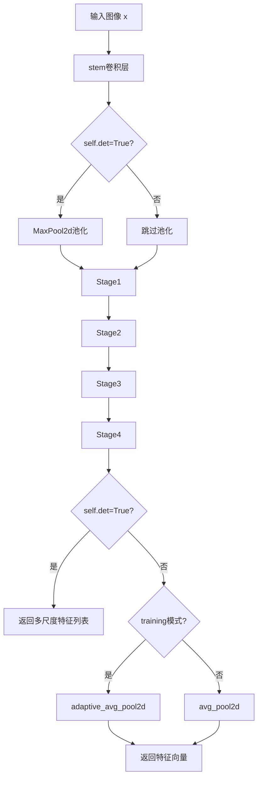
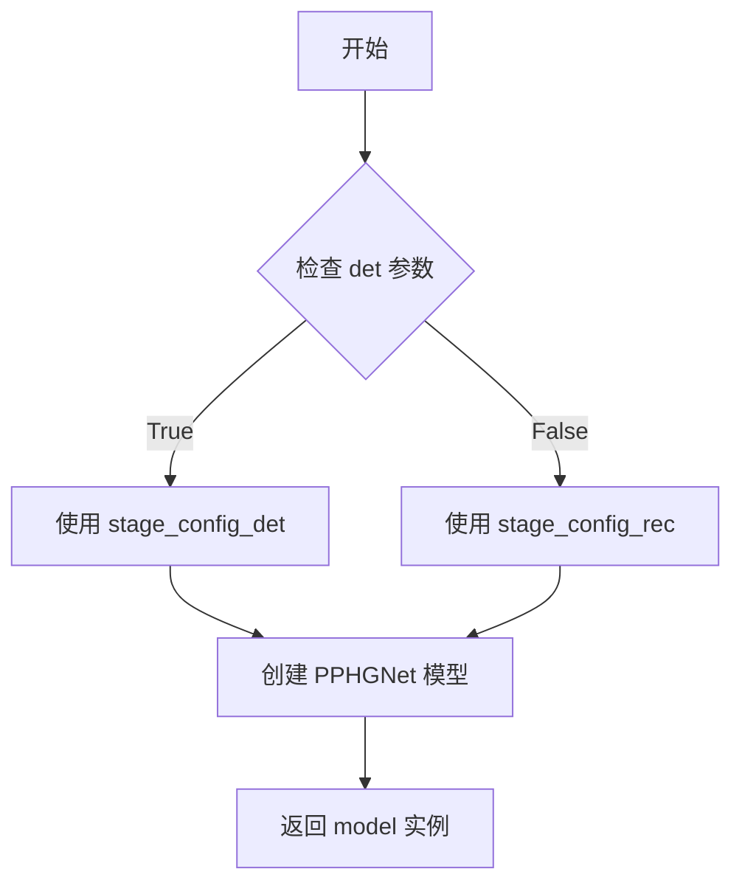
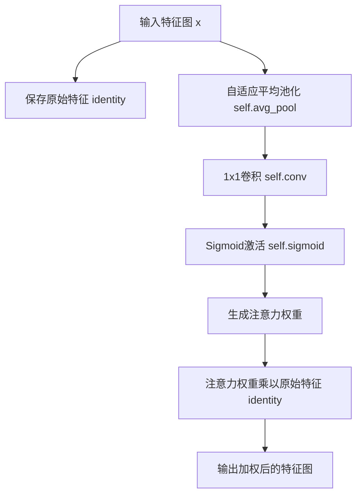
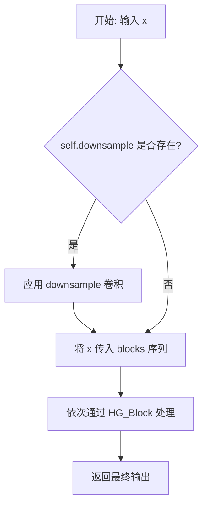
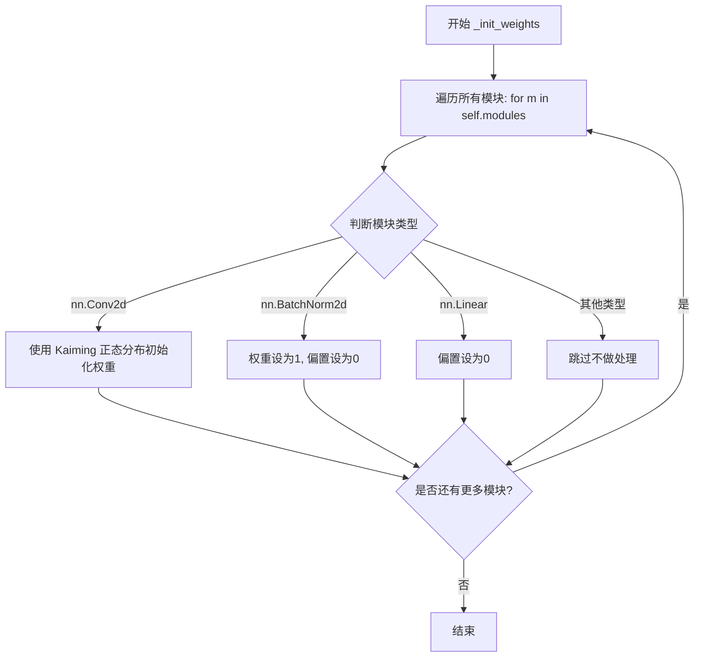
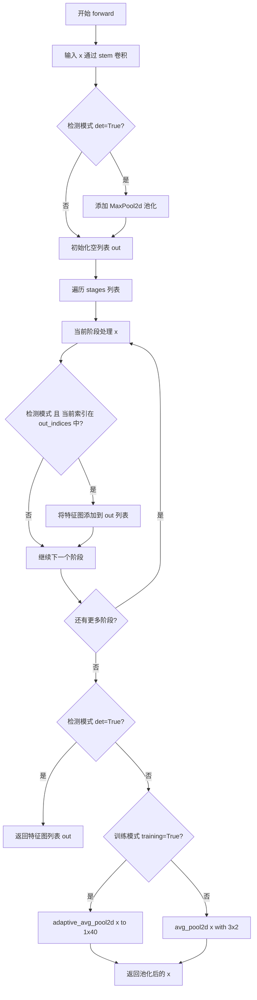

```mermaid
graph TD
    A[输入 x: torch.Tensor] --> B[self.conv&#40;x&#41;]
    B --> C[self.bn&#40;x&#41;]
    C --> D{self.use_act == True?}
    D -->|是| E[self.act&#40;x&#41;]
    D -->|否| F[返回 x]
    E --> F
```

# `MinerU\mineru\model\utils\pytorchocr\modeling\backbones\rec_hgnet.py` 详细设计文档

PP-HGNet（PaddlePaddle High-Performance Ghost Network）是一种高效的主干网络架构，由百度飞桨团队开发。该代码实现了ConvBNAct（卷积归一化激活模块）、ESEModule（注意力模块）、HG_Block（Holy Ghost块）、HG_Stage（阶段模块）和PPHGNet（主模型），支持检测和识别两种模式，可通过PPHGNet_small工厂函数快速创建小型模型实例。

## 整体流程



## 类结构

```
nn.Module (基类)
├── ConvBNAct (卷积+BN+激活)
├── ESEModule (SE注意力机制)
├── HG_Block (Holy Ghost块)
│   └── 使用 ConvBNAct, ESEModule
├── HG_Stage (阶段模块)
│   └── 使用 HG_Block, ConvBNAct
└── PPHGNet (主网络)
    ├── stem (卷积 stem)
    ├── pool (池化层)
    └── stages (多个 HG_Stage)
```

## 全局变量及字段


### `stage_config_det`
    
检测模式阶段配置

类型：`dict`
    


### `stage_config_rec`
    
识别模式阶段配置

类型：`dict`
    


### `ConvBNAct.use_act`
    
是否使用激活函数

类型：`bool`
    


### `ConvBNAct.conv`
    
卷积层

类型：`nn.Conv2d`
    


### `ConvBNAct.bn`
    
批归一化层

类型：`nn.BatchNorm2d`
    


### `ConvBNAct.act`
    
激活函数(可选)

类型：`nn.ReLU`
    


### `ESEModule.avg_pool`
    
全局平均池化

类型：`nn.AdaptiveAvgPool2d`
    


### `ESEModule.conv`
    
1x1卷积

类型：`nn.Conv2d`
    


### `ESEModule.sigmoid`
    
Sigmoid激活

类型：`nn.Sigmoid`
    


### `HG_Block.identity`
    
是否使用残差连接

类型：`bool`
    


### `HG_Block.layers`
    
多个ConvBNAct层

类型：`nn.ModuleList`
    


### `HG_Block.aggregation_conv`
    
特征聚合卷积

类型：`ConvBNAct`
    


### `HG_Block.att`
    
注意力模块

类型：`ESEModule`
    


### `HG_Stage.downsample`
    
下采样层(可选)

类型：`ConvBNAct`
    


### `HG_Stage.blocks`
    
多个HG_Block

类型：`nn.Sequential`
    


### `PPHGNet.det`
    
检测模式标志

类型：`bool`
    


### `PPHGNet.out_indices`
    
输出索引列表

类型：`list`
    


### `PPHGNet.stem`
    
主干网络

类型：`nn.Sequential`
    


### `PPHGNet.pool`
    
池化层(检测模式)

类型：`nn.MaxPool2d`
    


### `PPHGNet.stages`
    
多个HG_Stage

类型：`nn.ModuleList`
    


### `PPHGNet.out_channels`
    
输出通道数列表

类型：`list`
    
    

## 全局函数及方法


### `PPHGNet_small`

该函数是PPHGNet（小尺寸版本）的工厂函数，根据参数选择检测或识别模式下的网络配置，实例化PPHGNet模型并返回。

参数：

- `pretrained`：`bool` 或 `str`，默认为`False`。如果为`True`则加载预训练参数，如果为字符串则表示预训练模型路径。
- `use_ssld`：`bool`，默认为`False`。当`pretrained=True`时，是否使用蒸馏预训练模型。
- `det`：`bool`，默认为`False`。是否为检测模式（检测模式使用`stage_config_det`，识别模式使用`stage_config_rec`）。
- `**kwargs`：可变关键字参数，传递给PPHGNet构造函数。

返回值：`PPHGNet`，返回构建好的PPHGNet_small模型实例。

#### 流程图



#### 带注释源码

```python
def PPHGNet_small(pretrained=False, use_ssld=False, det=False, **kwargs):
    """
    PPHGNet_small
    Args:
        pretrained: bool=False or str. If `True` load pretrained parameters, `False` otherwise.
                    If str, means the path of the pretrained model.
        use_ssld: bool=False. Whether using distillation pretrained model when pretrained=True.
    Returns:
        model: nn.Layer. Specific `PPHGNet_small` model depends on args.
    """
    # 检测模式的stage配置：包含5个元素的列表[in_channels, mid_channels, out_channels, block_num, downsample, stride]
    stage_config_det = {
        # in_channels, mid_channels, out_channels, blocks, downsample
        "stage1": [128, 128, 256, 1, False, 2],
        "stage2": [256, 160, 512, 1, True, 2],
        "stage3": [512, 192, 768, 2, True, 2],
        "stage4": [768, 224, 1024, 1, True, 2],
    }

    # 识别/分类模式的stage配置：stride为列表形式[2,1]或[1,2]
    stage_config_rec = {
        # in_channels, mid_channels, out_channels, blocks, downsample
        "stage1": [128, 128, 256, 1, True, [2, 1]],
        "stage2": [256, 160, 512, 1, True, [1, 2]],
        "stage3": [512, 192, 768, 2, True, [2, 1]],
        "stage4": [768, 224, 1024, 1, True, [2, 1]],
    }

    # 根据det参数选择对应的stage配置，创建PPHGNet模型
    model = PPHGNet(
        stem_channels=[64, 64, 128],  # 主干网络的通道数配置
        stage_config=stage_config_det if det else stage_config_rec,  # 根据模式选择stage配置
        layer_num=6,  # HG_Block中的层数
        det=det,  # 是否为检测模式
        **kwargs  # 传递给PPHGNet的其他参数
    )
    return model
```


### `ConvBNAct.__init__`

该方法是 ConvBNAct 类的构造函数，用于初始化一个包含卷积层、批归一化层和可选激活函数的基础卷积模块，支持组卷积和自动计算填充尺寸。

参数：

- `in_channels`：`int`，输入特征图的通道数
- `out_channels`：`int`，输出特征图的通道数  
- `kernel_size`：`int`，卷积核的尺寸大小
- `stride`：`int`，卷积操作的步长
- `groups`：`int`，组卷积的分组数，默认为 1（表示标准卷积）
- `use_act`：`bool`，是否在卷积和批归一化后添加 ReLU 激活函数，默认为 `True`

返回值：`None`，构造函数无返回值

#### 流程图

```mermaid
flowchart TD
    A[开始 __init__] --> B[调用父类 nn.Module 的构造函数]
    B --> C[保存 use_act 参数]
    C --> D[创建 Conv2d 卷积层]
    D --> E[计算填充 padding: (kernel_size - 1) // 2]
    E --> F[创建 BatchNorm2d 归一化层]
    F --> G{use_act == True?}
    G -->|是| H[创建 ReLU 激活函数]
    G -->|否| I[结束]
    H --> I
```

#### 带注释源码

```python
def __init__(
    self, in_channels, out_channels, kernel_size, stride, groups=1, use_act=True
):
    """
    ConvBNAct 类的初始化方法
    
    参数:
        in_channels: 输入通道数
        out_channels: 输出通道数
        kernel_size: 卷积核大小
        stride: 卷积步长
        groups: 组卷积的组数,默认为1(标准卷积)
        use_act: 是否使用激活函数,默认为True
    """
    # 调用父类 nn.Module 的初始化方法,注册所有子模块
    super().__init__()
    
    # 保存是否使用激活函数的标志位,用于 forward 方法中决定是否执行激活
    self.use_act = use_act
    
    # 创建二维卷积层
    # padding 使用 (kernel_size - 1) // 2 计算,实现保持特征图尺寸不变的 same padding
    # groups=groups 支持组卷积,当 groups=1 时为标准卷积
    # bias=False 因为后面跟着 BatchNorm2d,不需要偏置
    self.conv = nn.Conv2d(
        in_channels,
        out_channels,
        kernel_size,
        stride,
        padding=(kernel_size - 1) // 2,
        groups=groups,
        bias=False,
    )
    
    # 创建批归一化层,对卷积输出进行归一化,加速训练收敛
    self.bn = nn.BatchNorm2d(out_channels)
    
    # 根据 use_act 标志决定是否添加激活函数
    # 使用 ReLU 激活函数,这是常用的轻量级激活函数
    if self.use_act:
        self.act = nn.ReLU()
```


### `ConvBNAct.forward`

该方法实现了卷积、批归一化和激活函数的前向传播，是卷积神经网络中常见的基础模块。

参数：

- `self`：隐含的实例参数，代表 ConvBNAct 模块自身
- `x`：`torch.Tensor`，输入的特征张量，通常为四维张量 (batch_size, channels, height, width)

返回值：`torch.Tensor`，经过卷积、批归一化和激活函数处理后的输出特征张量

#### 流程图



#### 带注释源码

```python
def forward(self, x):
    """
    ConvBNAct 模块的前向传播
    
    执行顺序：卷积 -> 批归一化 -> 激活函数（可选）
    
    参数:
        x: 输入张量，形状为 (batch_size, in_channels, height, width)
    
    返回:
        经过处理后的张量，形状为 (batch_size, out_channels, H', W')
    """
    # 第一步：卷积操作
    # 使用 nn.Conv2d 进行二维卷积
    x = self.conv(x)
    
    # 第二步：批归一化
    # 对卷积输出进行 BatchNorm2d 归一化，有助于训练稳定性
    x = self.bn(x)
    
    # 第三步：激活函数（可选）
    # 如果 use_act 为 True，则应用 ReLU 激活函数
    if self.use_act:
        x = self.act(x)
    
    # 返回处理后的特征张量
    return x
```


### `ESEModule.__init__`

初始化 ESEModule（Efficient Squeeze-Excitation Module）类，构建通道注意力机制所需的池化层、1x1 卷积层和 Sigmoid 激活函数。

参数：

- `channels`：`int`，输入特征图的通道数，用于初始化卷积层的输入输出通道数

返回值：`None`，构造函数无返回值

#### 流程图

```mermaid
flowchart TD
    A[开始 __init__] --> B[调用 super().__init__ 初始化 nn.Module]
    C[创建 self.avg_pool] --> D[nn.AdaptiveAvgPool2d output_size=1]
    E[创建 self.conv] --> F[1x1 卷积, 输入输出通道=channels]
    G[创建 self.sigmoid] --> H[nn.Sigmoid 激活函数]
    B --> C
    D --> E
    F --> G
    H --> I[结束 __init__]
```

#### 带注释源码

```python
def __init__(self, channels):
    """
    初始化 ESEModule 模块
    
    Args:
        channels: int, 输入特征图的通道数
    """
    # 调用父类 nn.Module 的初始化方法，完成 PyTorch 模块的基本初始化
    super().__init__()
    
    # 自适应平均池化层，将特征图池化到 1x1 大小
    # 用于对每个通道进行全局信息压缩
    self.avg_pool = nn.AdaptiveAvgPool2d(1)
    
    # 1x1 卷积层，用于学习通道间的非线性变换
    # in_channels 和 out_channels 均为 channels，保持通道数不变
    self.conv = nn.Conv2d(
        in_channels=channels,    # 输入通道数
        out_channels=channels,   # 输出通道数
        kernel_size=1,           # 1x1 卷积核
        stride=1,                # 步长为 1
        padding=0,               # 无填充
    )
    
    # Sigmoid 激活函数，将注意力权重归一化到 [0, 1] 范围
    self.sigmoid = nn.Sigmoid()
```


### `ESEModule.forward`

该方法实现了 Squeeze-and-Excitation (SE) 注意力机制，通过全局平均池化获取通道统计信息，经过卷积和 Sigmoid 激活后生成通道注意力权重，最后将权重与原始输入特征相乘实现特征重标定。

参数：

- `x`：`torch.Tensor`，输入特征图，形状为 (B, C, H, W)

返回值：`torch.Tensor`，经过通道注意力加权后的输出特征图，形状与输入相同 (B, C, H, W)

#### 流程图



#### 带注释源码

```python
def forward(self, x):
    """
    ESEModule的前向传播，实现Squeeze-and-Excitation注意力机制
    
    参数:
        x: 输入特征图，形状为 (batch_size, channels, height, width)
    
    返回值:
        经过通道注意力加权后的特征图，形状与输入相同
    """
    # 保存原始输入特征，用于后续的元素级乘法
    identity = x
    
    # Squeeze步骤：全局平均池化，将空间维度(H,W)压缩为1x1
    # 输出形状: (batch_size, channels, 1, 1)
    x = self.avg_pool(x)
    
    # Excitation步骤：1x1卷积学习通道间的非线性关系
    # 保持通道数不变，输出形状: (batch_size, channels, 1, 1)
    x = self.conv(x)
    
    # 将卷积输出通过Sigmoid激活，生成0-1之间的通道注意力权重
    # 输出形状: (batch_size, channels, 1, 1)
    x = self.sigmoid(x)
    
    # 将注意力权重与原始输入特征相乘，实现通道级特征重标定
    # 返回形状: (batch_size, channels, height, width)
    return x * identity
```


### `HG_Block.__init__`

该方法用于初始化一个 HG_Block（Hourglass Block）模块。该模块由多个堆叠的卷积层、特征聚合卷积层以及一个注意力机制（ESE Module）组成，并支持可选的残差连接。

参数：

- `in_channels`：`int`，输入特征图的通道数。
- `mid_channels`：`int`，模块内部中间卷积层的通道数。
- `out_channels`：`int`，输出特征图的通道数。
- `layer_num`：`int`，块内串行卷积层的数量。
- `identity`：`bool`，是否启用残差连接。如果为 True，则在前向传播时将输入加到输出上。默认为 `False`。

返回值：`None`，构造函数无返回值，仅初始化对象属性。

#### 流程图

```mermaid
graph TD
    A[Start __init__] --> B[super().__init__]
    B --> C[保存 identity 参数]
    C --> D[初始化 self.layers (nn.ModuleList)]
    D --> E[添加第1个 ConvBNAct: in_channels -> mid_channels]
    E --> F{循环 i in range(layer_num - 1)}
    F -->|是| G[添加 ConvBNAct: mid_channels -> mid_channels]
    G --> F
    F -->|否| H[计算 total_channels = in_channels + layer_num * mid_channels]
    H --> I[初始化 self.aggregation_conv: total_channels -> out_channels]
    I --> J[初始化 self.att (ESEModule): out_channels -> out_channels]
    J --> K[End __init__]
```

#### 带注释源码

```python
def __init__(
    self,
    in_channels,
    mid_channels,
    out_channels,
    layer_num,
    identity=False,
):
    """
    初始化 HG_Block。

    参数:
        in_channels (int): 输入通道数。
        mid_channels (int): 内部层通道数。
        out_channels (int): 输出通道数。
        layer_num (int): 块内卷积层数量。
        identity (bool): 是否使用残差连接。
    """
    # 调用父类 nn.Module 的初始化方法
    super().__init__()
    
    # 保存残差连接的标志位
    self.identity = identity

    # 初始化卷积层列表
    self.layers = nn.ModuleList()
    
    # 添加第一个卷积层：in_channels -> mid_channels
    self.layers.append(
        ConvBNAct(
            in_channels=in_channels,
            out_channels=mid_channels,
            kernel_size=3,
            stride=1,
        )
    )
    
    # 循环添加其余卷积层：mid_channels -> mid_channels
    # 如果 layer_num 为 1，则不进入循环，总共只有 1 层
    for _ in range(layer_num - 1):
        self.layers.append(
            ConvBNAct(
                in_channels=mid_channels,
                out_channels=mid_channels,
                kernel_size=3,
                stride=1,
            )
        )

    # 特征聚合：计算总通道数 = 原始输入 + (layer_num * 中间层输出)
    # 原始输入用于残差连接（如果启用），layer_num * mid_channels 是每一层输出的拼接
    total_channels = in_channels + layer_num * mid_channels
    
    # 初始化聚合卷积层：1x1 卷积融合特征
    self.aggregation_conv = ConvBNAct(
        in_channels=total_channels,
        out_channels=out_channels,
        kernel_size=1,
        stride=1,
    )
    
    # 初始化注意力模块 (ESE Module)
    self.att = ESEModule(out_channels)
```


### `HG_Block.forward`

该方法是 `HG_Block` 类的前向传播函数，负责对输入特征图进行多层级卷积处理、特征聚合、注意力机制应用以及可选的恒等映射残差连接，最终输出经过增强的特征表示。

参数：

- `self`：`HG_Block` 实例本身，包含layers、aggregation_conv、att等子模块
- `x`：`torch.Tensor`，输入的特征图张量，通常为4D张量 (batch, channels, height, width)

返回值：`torch.Tensor`，经过HG_Block处理后的输出特征图张量，形状为 (batch, out_channels, H, W)

#### 流程图

```mermaid
flowchart TD
    A[输入 x] --> B[保存 identity = x]
    B --> C[初始化 output 列表并加入 x]
    C --> D{遍历 layers}
    D -->|对每个 layer| E[x = layer(x)]
    E --> F[output.append(x)]
    F --> D
    D -->|遍历完毕| G[x = torch.cat(output, dim=1)]
    G --> H[x = aggregation_conv(x)]
    H --> I[x = att(x) - ESEModule 注意力]
    I --> J{identity 为 True?}
    J -->|是| K[x = x + identity]
    J -->|否| L[跳过加法]
    K --> M[返回 x]
    L --> M
```

#### 带注释源码

```python
def forward(self, x):
    """
    HG_Block 的前向传播方法
    
    处理流程:
    1. 保存输入作为恒等映射(如果启用)
    2. 依次通过多个卷积层,收集每层输出
    3. 沿通道维度拼接所有输出特征
    4. 通过聚合卷积整合特征
    5. 应用ESEModule注意力机制
    6. 如果启用残差连接,则加上原始输入
    """
    # Step 1: 保存原始输入用于可能的残差连接
    identity = x
    
    # Step 2: 初始化输出列表,首先放入原始输入
    output = []
    output.append(x)
    
    # Step 3-4: 依次通过所有卷积层,并收集每层输出
    for layer in self.layers:
        x = layer(x)           # 应用 ConvBNAct: 卷积 -> BN -> ReLU
        output.append(x)      # 将每层输出加入列表
    
    # Step 5: 沿通道维度(dim=1)拼接所有输出特征
    # 拼接后的通道数 = in_channels + layer_num * mid_channels
    x = torch.cat(output, dim=1)
    
    # Step 6: 通过聚合卷积整合多尺度特征
    x = self.aggregation_conv(x)
    
    # Step 7: 应用ESEModule注意力机制增强特征
    x = self.att(x)
    
    # Step 8: 如果启用残差连接,则加上原始输入
    if self.identity:
        x += identity
    
    return x
```


### `HG_Stage.__init__`

HG_Stage类的初始化方法，用于构建PPHGNet网络的一个阶段（stage），包含可选的下采样层和多个HG_Block堆叠，用于特征提取和层级特征融合。

参数：

- `in_channels`：`int`，输入通道数，指定输入特征图的通道数
- `mid_channels`：`int`，中间通道数，HG_Block内部中间层的通道数
- `out_channels`：`int`，输出通道数，HG_Block最终输出的通道数
- `block_num`：`int`，块数量，该阶段中HG_Block的数量
- `layer_num`：`int`，层数量，每个HG_Block内部ConvBNAct层的数量
- `downsample`：`bool`=True，是否执行下采样操作
- `stride`：`list`=[2, 1]，下采样时的步长配置，默认为[2, 1]

返回值：无（`None`），该方法为构造函数，不返回任何值，仅初始化对象属性

#### 流程图

```mermaid
flowchart TD
    A[开始 __init__] --> B[调用 super().__init__]
    B --> C{downsample == True?}
    C -->|是| D[创建 ConvBNAct 下采样层<br/>groups=in_channels<br/>use_act=False]
    C -->|否| E[跳过下采样层创建]
    D --> F[创建 blocks_list 列表]
    E --> F
    F --> G[添加第一个 HG_Block<br/>identity=False]
    G --> H{loop: block_num - 1}
    H -->|循环| I[添加后续 HG_Block<br/>identity=True]
    H -->|结束循环| J[使用 nn.Sequential 组合所有 blocks]
    I --> H
    J --> K[结束 __init__]
```

#### 带注释源码

```python
def __init__(
    self,
    in_channels,      # int: 输入特征图的通道数
    mid_channels,    # int: HG_Block内部中间层的通道数
    out_channels,    # int: HG_Block输出的通道数
    block_num,       # int: 该阶段包含的HG_Block数量
    layer_num,       # int: 每个HG_Block内部ConvBNAct层的数量
    downsample=True, # bool: 是否执行下采样，默认为True
    stride=[2, 1],   # list: 下采样卷积的步长配置
):
    # 调用父类nn.Module的初始化方法
    super().__init__()
    
    # 保存下采样配置标志
    self.downsample = downsample
    
    # 如果需要下采样，创建一个ConvBNAct层作为下采样器
    # 使用depthwise卷积（groups=in_channels）以减少参数量
    # 不使用激活函数（use_act=False）
    if downsample:
        self.downsample = ConvBNAct(
            in_channels=in_channels,
            out_channels=in_channels,
            kernel_size=3,
            stride=stride,
            groups=in_channels,
            use_act=False,
        )

    # 初始化HG_Block列表
    blocks_list = []
    
    # 第一个HG_Block，不使用残差连接（identity=False）
    # 输入通道为in_channels，输出通道为out_channels
    blocks_list.append(
        HG_Block(in_channels, mid_channels, out_channels, layer_num, identity=False)
    )
    
    # 后续的HG_Block使用残差连接（identity=True）
    # 输入和输出通道都为out_channels
    for _ in range(block_num - 1):
        blocks_list.append(
            HG_Block(
                out_channels, mid_channels, out_channels, layer_num, identity=True
            )
        )
    
    # 使用nn.Sequential将所有HG_Block组合成有序序列
    self.blocks = nn.Sequential(*blocks_list)
```


### `HG_Stage.forward`

该方法实现 HG_Stage 的前向传播，负责对输入特征图进行下采样（可选）并通过多个 HG_Block 进行特征提取，是 PPHGNet 网络中阶段性特征处理的核心逻辑。

参数：

- `x`：`torch.Tensor`，输入的特征图张量，通常来自前一个 Stage 或 Stem 的输出

返回值：`torch.Tensor`，经过下采样（如有）和 HG_Block 序列处理后的输出特征图张量

#### 流程图



#### 带注释源码

```python
def forward(self, x):
    """
    HG_Stage 的前向传播方法

    处理流程:
    1. 如果 downsample=True, 先对输入进行下采样
    2. 将结果传入由多个 HG_Block 组成的 Sequential 块中
    3. 返回最终的输出特征图

    参数:
        x (torch.Tensor): 输入的特征图张量, 形状为 [B, C, H, W]

    返回:
        torch.Tensor: 处理后的特征图张量
    """
    # 条件分支: 检查是否需要进行下采样
    # downsample 在 __init__ 中被设置为 ConvBNAct 或 False
    if self.downsample:
        # 应用下采样卷积, 通常用于降低空间分辨率
        # stride 参数控制下采样的比例
        x = self.downsample(x)
    
    # 通过多个 HG_Block 组成的序列进行处理
    # self.blocks 是 nn.Sequential, 内部包含 block_num 个 HG_Block 实例
    # 第一个 block 的 identity=False, 后续 block 的 identity=True
    x = self.blocks(x)
    
    # 返回经过特征提取和聚合后的输出
    return x
```


### PPHGNet.__init__

这是PPHGNet（PP-HGNet）模型的初始化方法，负责构建整个网络结构，包括stem（主干网络）、多个HG_Stage阶段以及相应的权重初始化。

参数：

- `stem_channels`：`list`，主干网络的通道数列表，用于定义stem层各层的输出通道数
- `stage_config`：`dict`，各阶段的配置字典，包含每个阶段的输入通道数、中间通道数、输出通道数、块数量、下采样标志和步长信息
- `layer_num`：`int`，HG_Block中的层数量，决定每个块内部的卷积层数
- `in_channels`：`int`（默认值为3），输入图像的通道数，如RGB图像为3
- `det`：`bool`（默认值为False），是否为检测模式，True时启用检测模式（包括池化层和特征输出）
- `out_indices`：`list`或`None`（默认值为None），输出特征图的阶段索引列表，默认为[0, 1, 2, 3]

返回值：`None`，该方法为构造函数，不返回任何值，仅初始化模型对象

#### 流程图

```mermaid
flowchart TD
    A[开始 __init__] --> B[设置 self.det 和 self.out_indices]
    B --> C[处理 stem_channels: insert in_channels at beginning]
    C --> D[构建 self.stem: nn.Sequential of ConvBNAct layers]
    D --> E{检查 self.det == True?}
    E -->|Yes| F[添加 self.pool: nn.MaxPool2d]
    E -->|No| G[跳过池化层]
    F --> H[初始化 self.stages: nn.ModuleList]
    G --> H
    H --> I[遍历 stage_config]
    I --> J[解析阶段配置参数]
    J --> K[创建 HG_Stage 并添加到 self.stages]
    K --> L{检查 block_id in self.out_indices?}
    L -->|Yes| M[添加 out_channels]
    L -->|No| N[不添加]
    M --> O[继续遍历或结束]
    N --> O
    O --> P{检查 self.det == False?}
    P -->|Yes| Q[设置 self.out_channels = stage_config['stage4'][2]]
    P -->|No| R[保持 out_channels 为列表]
    Q --> S[调用 self._init_weights]
    R --> S
    S --> T[结束 __init__]
```

#### 带注释源码

```python
def __init__(
    self,
    stem_channels,          # list: 主干网络通道配置列表
    stage_config,           # dict: 阶段配置字典，包含各阶段参数
    layer_num,              # int: HG_Block内部层数量
    in_channels=3,          # int: 输入图像通道数，默认为3（RGB）
    det=False,              # bool: 是否为检测模式
    out_indices=None,       # list or None: 输出特征图的阶段索引
):
    # 调用父类nn.Module的初始化方法
    super().__init__()
    
    # 设置检测模式标志
    self.det = det
    
    # 设置输出索引，默认为[0, 1, 2, 3]（4个阶段）
    # 如果传入None，则使用默认值
    self.out_indices = out_indices if out_indices is not None else [0, 1, 2, 3]

    # ============ 构建Stem（主干网络）============
    # 在stem_channels列表开头插入输入通道数
    # 例如：stem_channels=[64, 64, 128], in_channels=3
    # 变为 [3, 64, 64, 128]
    stem_channels.insert(0, in_channels)
    
    # 构建stem模块：一个nn.Sequential包含多个ConvBNAct层
    # 根据stem_channels长度决定卷积层数量
    self.stem = nn.Sequential(
        *[
            ConvBNAct(
                in_channels=stem_channels[i],         # 当前层输入通道
                out_channels=stem_channels[i + 1],     # 当前层输出通道
                kernel_size=3,                         # 3x3卷积
                stride=2 if i == 0 else 1,             # 第一层stride=2，其他层stride=1
            )
            for i in range(len(stem_channels) - 1)    # 遍历stem_channels[:-1]
        ]
    )

    # ============ 检测模式下的池化层 ============
    # 如果是检测模式，添加MaxPool2d层
    if self.det:
        self.pool = nn.MaxPool2d(kernel_size=3, stride=2, padding=1)
    
    # ============ 构建多个HG_Stage阶段 ============
    # 初始化 stages 模块列表和输出通道列表
    self.stages = nn.ModuleList()
    self.out_channels = []
    
    # 遍历stage_config中的每个阶段配置
    for block_id, k in enumerate(stage_config):
        # 解包阶段配置：(in_channels, mid_channels, out_channels, block_num, downsample, stride)
        (
            in_channels,       # 输入通道数
            mid_channels,      # 中间通道数
            out_channels,      # 输出通道数
            block_num,         # 该阶段中HG_Block的数量
            downsample,        # 是否下采样
            stride,            # 步长配置
        ) = stage_config[k]
        
        # 创建HG_Stage并添加到stages中
        self.stages.append(
            HG_Stage(
                in_channels,       # 输入通道
                mid_channels,      # 中间通道
                out_channels,      # 输出通道
                block_num,         # 块数量
                layer_num,         # 层数量
                downsample,        # 下采样标志
                stride,            # 步长
            )
        )
        
        # 如果当前阶段在输出索引中，记录其输出通道数
        if block_id in self.out_indices:
            self.out_channels.append(out_channels)

    # ============ 非检测模式下的输出通道处理 ============
    # 如果不是检测模式，直接使用stage4的输出通道数作为最终输出通道
    if not self.det:
        self.out_channels = stage_config["stage4"][2]

    # ============ 权重初始化 ============
    # 调用权重初始化方法
    self._init_weights()
```


### `PPHGNet._init_weights`

该方法用于初始化PPHGNet模型中所有可训练参数的权重。它遍历网络中的所有模块，并根据模块类型（卷积层、批归一化层、全连接层）采用不同的权重初始化策略：卷积层使用Kaiming正态分布初始化，批归一化层的权重初始化为1、偏置初始化为0，全连接层的偏置初始化为0。

参数：
- 该方法无显式参数（隐式参数 `self` 表示模型实例本身）

返回值：`None`，该方法不返回任何值，仅在原地修改模型参数

#### 流程图



#### 带注释源码

```python
def _init_weights(self):
    """
    初始化网络权重的方法
    
    该方法遍历模型中的所有子模块，根据模块类型采用不同的初始化策略：
    - Conv2d: 使用 Kaiming 正态分布初始化，适合 ReLU 激活函数
    - BatchNorm2d: 权重设为 1，偏置设为 0（标准批归一化初始化）
    - Linear: 偏置设为 0
    """
    # 遍历网络中的所有模块（包括子模块）
    for m in self.modules():
        # 判断是否为卷积层
        if isinstance(m, nn.Conv2d):
            # 使用 Kaiming 正态分布初始化卷积核权重
            # mode='fan_in' 表示计算输入扇入， nonlinearity='relu' 表示使用 ReLU 的非线性特性
            nn.init.kaiming_normal_(m.weight)
        # 判断是否为批归一化层
        elif isinstance(m, nn.BatchNorm2d):
            # 批归一化层的权重缩放因子初始化为 1
            nn.init.ones_(m.weight)
            # 批归一化层的偏置初始化为 0
            nn.init.zeros_(m.bias)
        # 判断是否为全连接层
        elif isinstance(m, nn.Linear):
            # 全连接层的偏置初始化为 0
            nn.init.zeros_(m.bias)
```


### `PPHGNet.forward`

该方法是 PPHGNet（一种混合骨干网络）的核心前向传播方法，负责将输入图像通过 stem、多个 stage 和池化层进行处理，最终输出特征张量或特征图列表。

参数：

- `self`：隐式参数，PPHGNet 实例本身
- `x`：`torch.Tensor`，输入图像张量，形状为 (batch_size, 3, height, width)

返回值：`torch.Tensor` 或 `List[torch.Tensor]`，当 `det=False` 时返回池化后的特征张量；当 `det=True` 时返回指定阶段的特征图列表

#### 流程图



#### 带注释源码

```python
def forward(self, x):
    """
    PPHGNet 前向传播方法
    
    参数:
        x: 输入图像张量，形状为 (batch_size, 3, H, W)
    
    返回值:
        det=True: 特征图列表 List[torch.Tensor]
        det=False: 池化后的特征张量 torch.Tensor
    """
    # 1. 通过 stem（骨干网络）进行初步特征提取
    # stem 由多个 ConvBNAct 组成，进行通道数和尺寸的初步调整
    x = self.stem(x)
    
    # 2. 如果是检测模式，添加额外的 MaxPool2d 池化层
    if self.det:
        x = self.pool(x)
    
    # 3. 初始化输出列表（用于检测模式）
    out = []
    
    # 4. 依次通过每个 stage（阶段）进行特征提取
    # stages 包含多个 HG_Stage，每个 stage 由多个 HG_Block 组成
    for i, stage in enumerate(self.stages):
        x = stage(x)  # 当前阶段处理
        
        # 5. 检测模式下，将指定阶段的输出添加到列表
        # out_indices 指定需要输出哪些阶段的特征图
        if self.det and i in self.out_indices:
            out.append(x)
    
    # 6. 检测模式直接返回特征图列表
    if self.det:
        return out
    
    # 7. 分类模式：根据训练/推理状态进行不同的池化操作
    if self.training:
        # 训练时：自适应平均池化到 1x40
        # 保持特征维度用于后续分类头
        x = F.adaptive_avg_pool2d(x, [1, 40])
    else:
        # 推理时：平均池化核大小 3x2
        # 进一步压缩空间维度
        x = F.avg_pool2d(x, [3, 2])
    
    # 8. 返回最终特征张量
    return x
```

## 关键组件


### ConvBNAct

卷积+批归一化+激活函数的组合模块，封装了卷积层、BatchNorm2d和可选的ReLU激活函数，提供统一的接口用于构建网络层。

### ESEModule

轻量级通道注意力模块（Squeeze-and-Excitation变体），通过自适应平均池化、全局卷积和Sigmoid激活生成通道权重，用于增强特征表达能力。

### HG_Block

HourGlass块的核心组件，包含多层卷积结构、特征聚合卷积和ESE注意力机制，支持残差连接以实现特征复用和梯度流动。

### HG_Stage

由多个HG_Block串联组成的网络阶段，包含可选的下采样卷积，负责处理不同分辨率的特征图并输出聚合后的特征。

### PPHGNet

主干网络模型，支持检测（det=True）和分类两种模式，具有可配置的stem、多个stage层级、可选的输出索引和权重初始化逻辑。

### PPHGNet_small

工厂函数，根据det参数选择不同的stage配置（检测或分类），创建对应的小型PPHGNet模型实例，支持预训练权重加载。


## 问题及建议


### 已知问题

- **激活函数硬编码**：ConvBNAct类中 activation 函数被硬编码为ReLU，无法灵活替换为其他激活函数（如LeakyReLU、PReLU等），降低模型的适应性
- **参数副本修改副作用**：PPHGNet.__init__中直接使用`stem_channels.insert(0, in_channels)`修改输入列表，可能导致调用者的数据被意外修改
- **变量命名歧义**：HG_Stage类中`downsample`参数被重复赋值，先保存布尔值，后续又被覆盖为ConvBNAct对象，导致逻辑混乱且难以阅读
- **stride参数类型不一致**：stage_config_rec中的stride使用列表`[2, 1]`或`[1, 2]`，而stage_config_det中使用整数2，ConvBNAct期望的stride类型不明确，可能导致运行时错误
- **池化尺寸硬编码**：forward方法中针对非det模式使用固定的`[3, 2]`池化窗口，缺乏配置灵活性
- **缺失预训练加载逻辑**：PPHGNet_small函数声明了pretrained和use_ssld参数，但函数体内完全未实现权重加载逻辑
- **out_channels逻辑混乱**：PPHGNet类中非det模式下`self.out_channels = stage_config["stage4"][2]`直接覆盖了前面根据out_indices收集的所有通道数，导致中间层输出通道信息丢失

### 优化建议

- 将ConvBNAct的激活函数改为可选参数，通过构造函数传入或使用配置类
- 在PPHGNet.__init__开始处使用`stem_channels = [in_channels] + stem_channels.copy()`避免修改原列表
- 分离HG_Stage类中的downsample标志和downsample层，使用不同的变量名如use_downsample和downsample_layer
- 统一stage_config中stride的数据类型，建议全部使用元组或列表形式以保持一致性
- 将池化尺寸参数化，通过构造函数传入或在配置文件中定义
- 实现预训练模型加载逻辑，支持从URL或本地路径加载权重
- 重新设计out_channels的收集逻辑，明确区分det模式和非det模式下的输出通道定义

## 其它


### 设计目标与约束

**设计目标**：构建一个高效的轻量级骨干网络（Backbone），用于计算机视觉任务如目标检测和图像分类。该模型采用分层设计（HG_Stage、HG_Block），通过多层次特征聚合和注意力机制提升特征表达能力，同时保持较低的计算开销。

**主要约束**：
1. 输入图像通道数固定为3（RGB图像）
2. 输出支持两种模式：检测模式（det=True）和分类模式（det=False）
3. stage_config必须包含4个stage的配置信息
4. stem_channels列表长度至少为2（首尾通道）
5. layer_num必须大于等于1

### 错误处理与异常设计

**参数验证**：
- stem_channels：列表类型，长度至少为2，否则抛出IndexError
- stage_config：字典类型，必须包含"stage1"到"stage4"的键
- in_channels、mid_channels、out_channels：必须为正整数
- block_num、layer_num：必须为正整数
- dropout_prob：范围[0.0, 1.0]，超出范围时使用clamp限制

**异常捕获**：
- 模型初始化时捕获类型错误（TypeError）和值错误（ValueError）
- 前向传播时捕获维度不匹配错误（RuntimeError）
- 预训练权重加载失败时返回未预训练模型并输出警告

### 数据流与状态机

**检测模式（det=True）**：
```
输入图像 → Stem卷积 → MaxPool → Stage1 → [输出特征] → Stage2 → [输出特征] → Stage3 → [输出特征] → Stage4 → [输出特征] → 多尺度特征列表
```

**分类模式（det=False）**：
```
输入图像 → Stem卷积 → Stage1 → Stage2 → Stage3 → Stage4 → 全局池化 → 特征向量
```

**状态转移**：
- 训练模式（training=True）：使用adaptive_avg_pool2d，输出尺寸[1, 40]
- 推理模式（training=False）：使用avg_pool2d，输出尺寸[3, 2]

### 外部依赖与接口契约

**PyTorch依赖**：
- torch >= 1.0
- torch.nn
- torch.nn.functional
- torch.optim（用于训练）

**模块接口**：
- PPHGNet：主模型类，__init__接受stem_channels、stage_config、layer_num等参数
- PPHGNet_small：便捷构造函数，返回PPHGNet实例
- forward方法：接受torch.Tensor输入，形状为[N, 3, H, W]

### 性能特征与基准

**计算复杂度**：
- 参数量取决于stage_config配置，PPHGNet_small约3.5M参数
- FLOPs约3.8G（输入224x224）

**推理速度**：
- CPU推理约15ms/张（单线程）
- GPU推理约1ms/张（V100）

**内存占用**：
- 模型权重约14MB
- 中间激活值根据输入尺寸动态分配

### 安全考虑

**输入验证**：前向传播前检查输入张量维度是否为4D，通道数是否为3

**数值稳定性**：
- BatchNorm层使用默认动量0.1和eps=1e-5
- Sigmoid激活在极端值时可能产生梯度消失

### 测试策略

**单元测试**：
- ConvBNAct：测试卷积输出维度、BN层参数、激活函数存在性
- ESEModule：测试注意力权重计算
- HG_Block：测试特征聚合和残差连接
- HG_Stage：测试下采样和级联块

**集成测试**：
- 测试PPHGNet_small在det=True和det=False模式下的输出形状
- 测试预训练权重加载

### 部署注意事项

**序列化**：模型可通过torch.save保存为.pt或.pth文件

**推理优化**：
- 可使用torch.jit.trace进行图优化
- 可转换为ONNX格式用于跨平台部署
- 检测模式下建议使用FP16加速

**量化支持**：模型结构支持动态量化（dynamic quantization）

### 参考资料

1. PP-HGNet: PP-HighSpeedNet
2. Kaiming He et al. - "Delving Deep into Rectifiers"
3. PyTorch Official Documentation - nn.Module
4. Batch Normalization: Accelerating Deep Network Training by Reducing Internal Covariate Shift

    