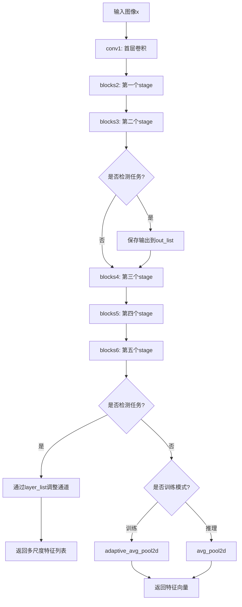
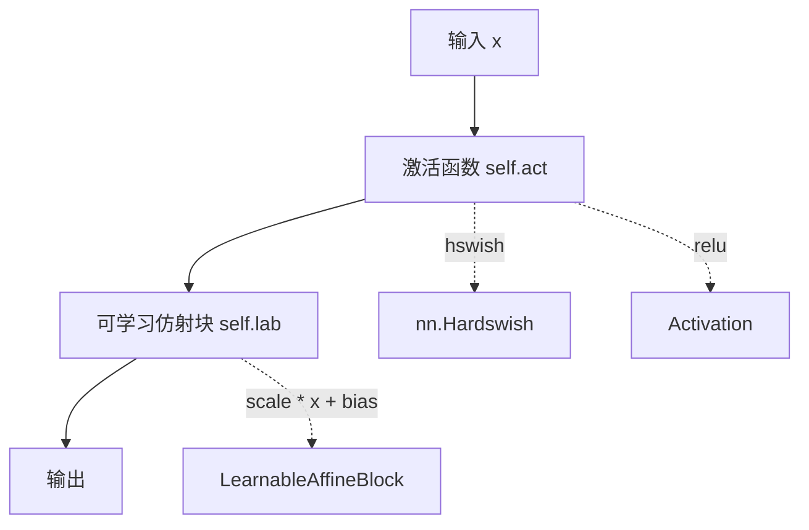
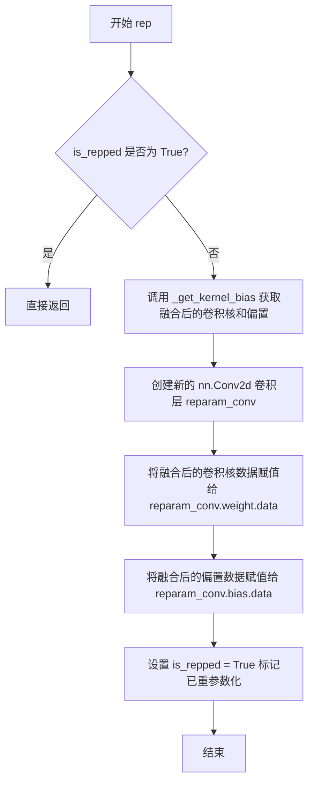
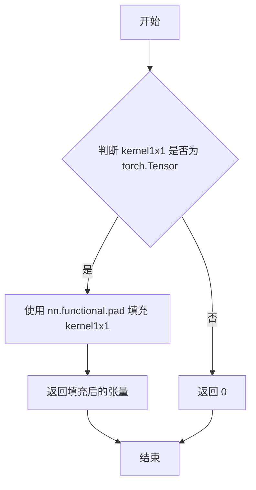
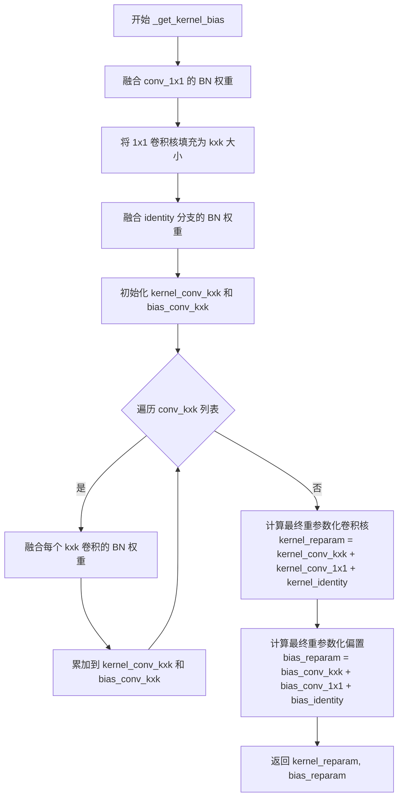
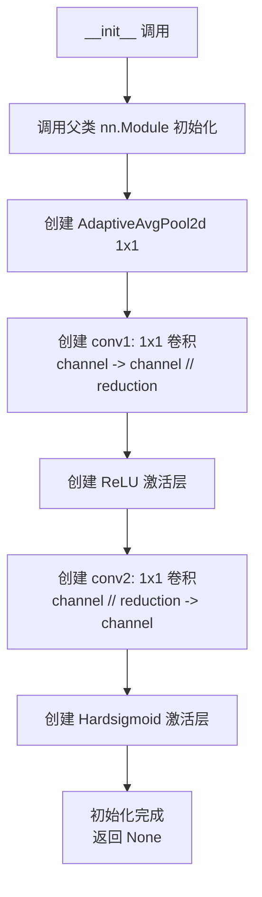
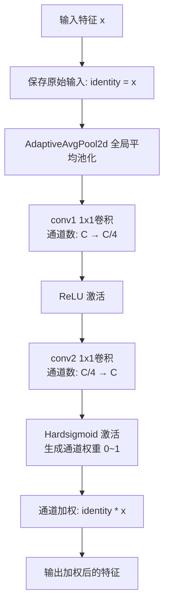
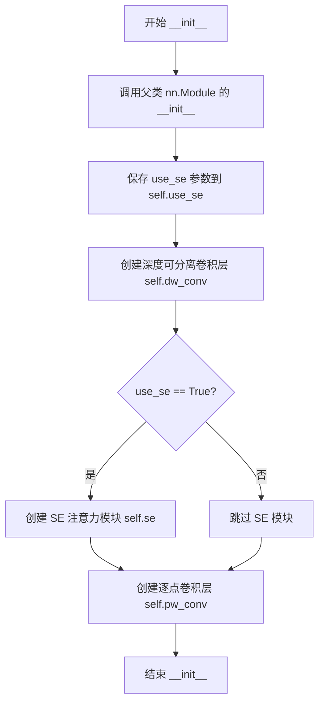
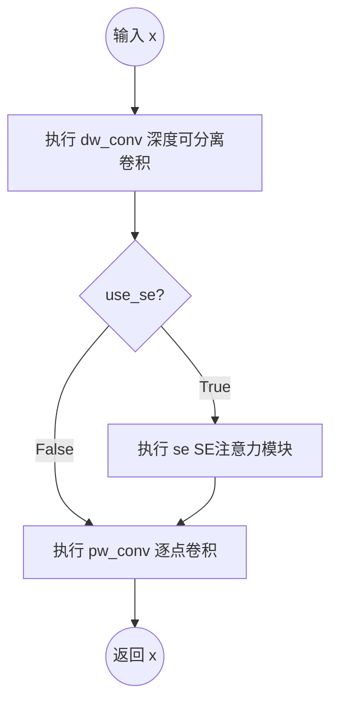

# `MinerU\mineru\model\utils\pytorchocr\modeling\backbones\rec_lcnetv3.py` 详细设计文档

这是一个PaddlePaddle开源的PP-LCNetV3深度学习模型在PyTorch框架下的实现，核心功能是构建轻量级卷积神经网络架构，支持图像分类和目标检测任务。该模型通过可学习仿射块、SE注意力机制和多分支卷积设计，实现了高效的特征提取能力。

## 整体流程



## 类结构

```
nn.Module (PyTorch基类)
├── LearnableAffineBlock (可学习仿射块)
├── ConvBNLayer (卷积+BN层)
├── Act (激活函数+仿射)
├── LearnableRepLayer (可学习重复层)
│   └── ConvBNLayer (多个实例)
│   └── BatchNorm2d (Identity分支)
├── SELayer (SE注意力层)
├── LCNetV3Block (LCNetV3基本块)
│   └── LearnableRepLayer (DW卷积)
│   └── SELayer (可选)
│   └── LearnableRepLayer (PW卷积)
└── PPLCNetV3 (主网络)
    └── nn.Sequential (blocks2-blocks6)
    └── nn.ModuleList (检测头layer_list)
```

## 全局变量及字段


### `NET_CONFIG_det`
    
检测任务网络配置，定义各阶段blocks的卷积参数(k,in_c,out_c,s,se)

类型：`dict`
    


### `NET_CONFIG_rec`
    
识别任务网络配置，定义各阶段blocks的卷积参数

类型：`dict`
    


### `make_divisible`
    
将通道数调整为可被divisor整除的数

类型：`function`
    


### `LearnableAffineBlock.scale`
    
可学习缩放参数

类型：`nn.Parameter`
    


### `LearnableAffineBlock.bias`
    
可学习偏置参数

类型：`nn.Parameter`
    


### `ConvBNLayer.conv`
    
卷积层

类型：`nn.Conv2d`
    


### `ConvBNLayer.bn`
    
批归一化层

类型：`nn.BatchNorm2d`
    


### `Act.act`
    
激活函数

类型：`nn.Hardswish/Activation`
    


### `Act.lab`
    
可学习仿射块

类型：`LearnableAffineBlock`
    


### `LearnableRepLayer.is_repped`
    
是否已重参数化

类型：`bool`
    


### `LearnableRepLayer.groups`
    
分组卷积数

类型：`int`
    


### `LearnableRepLayer.stride`
    
步长

类型：`int`
    


### `LearnableRepLayer.kernel_size`
    
卷积核大小

类型：`int`
    


### `LearnableRepLayer.in_channels`
    
输入通道数

类型：`int`
    


### `LearnableRepLayer.out_channels`
    
输出通道数

类型：`int`
    


### `LearnableRepLayer.num_conv_branches`
    
分支数量

类型：`int`
    


### `LearnableRepLayer.padding`
    
填充大小

类型：`int`
    


### `LearnableRepLayer.identity`
    
恒等映射分支

类型：`nn.BatchNorm2d`
    


### `LearnableRepLayer.conv_kxk`
    
kxk卷积列表

类型：`nn.ModuleList`
    


### `LearnableRepLayer.conv_1x1`
    
1x1卷积

类型：`ConvBNLayer`
    


### `LearnableRepLayer.lab`
    
可学习仿射

类型：`LearnableAffineBlock`
    


### `LearnableRepLayer.act`
    
激活函数

类型：`Act`
    


### `LearnableRepLayer.reparam_conv`
    
重参数化卷积(动态添加)

类型：`nn.Conv2d`
    


### `SELayer.avg_pool`
    
全局平均池化

类型：`nn.AdaptiveAvgPool2d`
    


### `SELayer.conv1`
    
通道压缩卷积

类型：`nn.Conv2d`
    


### `SELayer.relu`
    
激活函数

类型：`nn.ReLU`
    


### `SELayer.conv2`
    
通道恢复卷积

类型：`nn.Conv2d`
    


### `SELayer.hardsigmoid`
    
硬Sigmoid

类型：`nn.Hardsigmoid`
    


### `LCNetV3Block.use_se`
    
是否使用SE注意力

类型：`bool`
    


### `LCNetV3Block.dw_conv`
    
深度可分离卷积

类型：`LearnableRepLayer`
    


### `LCNetV3Block.se`
    
SE注意力层(可选)

类型：`SELayer`
    


### `LCNetV3Block.pw_conv`
    
点卷积

类型：`LearnableRepLayer`
    


### `PPLCNetV3.scale`
    
通道缩放因子

类型：`float`
    


### `PPLCNetV3.lr_mult_list`
    
各阶段学习率乘数

类型：`list`
    


### `PPLCNetV3.det`
    
是否为检测任务模式

类型：`bool`
    


### `PPLCNetV3.net_config`
    
网络配置

类型：`dict`
    


### `PPLCNetV3.conv1`
    
首层卷积

类型：`ConvBNLayer`
    


### `PPLCNetV3.blocks2-6`
    
五个stage

类型：`nn.Sequential`
    


### `PPLCNetV3.out_channels`
    
输出通道数

类型：`int/list`
    


### `PPLCNetV3.layer_list`
    
检测头(仅det模式)

类型：`nn.ModuleList`
    
    

## 全局函数及方法


### `make_divisible`

确保输入值能够被指定的除数整除的辅助函数，常用于神经网络中确保通道数能被 8、16 等值整除，以适配硬件优化。

参数：

- `v`：`int` 或 `float`，需要被调整的数值（通常为通道数）
- `divisor`：`int`，整除因子，默认为 16，用于确保返回值能被该值整除
- `min_value`：`int` 或 `None`，最小返回值，默认为 None（当为 None 时会自动设为 divisor 的值）

返回值：`int`，返回一个新的整数值，该值不小于 min_value，且能被 divisor 整除

#### 流程图

```mermaid
flowchart TD
    A[开始] --> B{min_value is None?}
    B -->|是| C[min_value = divisor]
    B -->|否| D[保持 min_value 不变]
    C --> E[new_v = max{min_value, int(v + divisor/2) // divisor * divisor}]
    D --> E
    E --> F{new_v < 0.9 * v?}
    F -->|是| G[new_v = new_v + divisor]
    F -->|否| H[返回 new_v]
    G --> H
```

#### 带注释源码

```python
def make_divisible(v, divisor=16, min_value=None):
    """
    确保通道数能够被 divisor 整除的辅助函数
    
    算法逻辑：
    1. 首先将 v 加上 divisor 的一半，然后整除 divisor，再乘以 divisor
       这样可以实现四舍五入的效果，使结果更接近原始值 v
    2. 使用 max 确保结果不低于 min_value
    3. 如果调整后的值小于原始值的 90%，则再增加一个 divisor
       这样可以避免过度缩小导致特征表示能力损失
    
    Args:
        v: 需要调整的数值（通常为通道数）
        divisor: 整除因子，默认为 16
        min_value: 最小值，默认为 None
    
    Returns:
        调整后的整数值，能够被 divisor 整除且不小于 min_value
    """
    # 如果未指定最小值，则默认为 divisor 本身
    if min_value is None:
        min_value = divisor
    
    # 计算新的值：通过 (v + divisor/2) // divisor 实现四舍五入
    # 再乘以 divisor 确保结果能被 divisor 整除
    # max(min_value, ...) 确保结果不低于最小值
    new_v = max(min_value, int(v + divisor / 2) // divisor * divisor)
    
    # 如果调整后的值小于原始值的 90%，则增加一个 divisor
    # 防止过度压缩导致特征表示能力下降
    if new_v < 0.9 * v:
        new_v += divisor
    
    return new_v
```


### `LearnableAffineBlock.__init__`

初始化一个可学习的仿射块（Affine Block），用于在神经网络中实现可学习的缩放（Scale）和平移（Bias）操作。该类继承自 `nn.Module`，通过维护 `scale` 和 `bias` 两个可学习参数来实现对输入张量的线性变换。

参数：

-  `scale_value`：`float`，缩放参数的初始值，默认为 1.0。
-  `bias_value`：`float`，偏置参数的初始值，默认为 0.0。
-  `lr_mult`：`float`，学习率乘数，用于控制该模块参数的学习率（虽然在此处未使用，但出现在方法签名中）。
-  `lab_lr`：`float`，LAB 相关的学习率（虽然在此处未使用，但出现在方法签名中）。

返回值：`None`（`__init__` 方法无返回值）。

#### 流程图

```mermaid
graph TD
    A([Start]) --> B[调用 super().__init__()]
    B --> C[创建 self.scale 参数<br>nn.Parameter(torch.Tensor[scale_value])]
    C --> D[创建 self.bias 参数<br>nn.Parameter(torch.Tensor[bias_value])]
    D --> E([End])
```

#### 带注释源码

```python
def __init__(self, scale_value=1.0, bias_value=0.0, lr_mult=1.0, lab_lr=0.1):
    """
    初始化 LearnableAffineBlock。

    参数:
        scale_value (float): 初始缩放值。
        bias_value (float): 初始偏置值。
        lr_mult (float): 学习率乘数 (当前未在方法内使用)。
        lab_lr (float): LAB学习率 (当前未在方法内使用)。
    """
    # 调用父类 nn.Module 的初始化方法
    super().__init__()
    
    # 将 scale_value 封装为 nn.Parameter，使其成为可学习的参数
    self.scale = nn.Parameter(torch.Tensor([scale_value]))
    
    # 将 bias_value 封装为 nn.Parameter，使其成为可学习的参数
    self.bias = nn.Parameter(torch.Tensor([bias_value]))
```

#### 潜在技术债务

1.  **未使用的参数**：`lr_mult` 和 `lab_lr` 被定义为 `__init__` 的参数，但在方法体内完全没有被使用。这通常意味着开发者可能计划使用这些参数来设置参数的优化器学习率（例如通过 `param_group` 或其他方式），或者是遗留的废弃参数。这导致了接口污染。
2.  **功能不完整**：如果 `lr_mult` 的设计目的是为了实现参数级别的学习率控制（通常在 paddlepaddle 等框架中较常见），那么在 PyTorch 实现中应该手动构建优化器参数组，或者至少在 `Parameter` 创建时忽略全局学习率。此处直接创建 `Parameter` 使得这两个参数形同虚设。


### `LearnableAffineBlock.forward(x)`

该方法实现了可学习的仿射变换（Affine Transformation），通过可学习的缩放系数（scale）和平移系数（bias）对输入张量进行线性变换，即 $y = scale \times x + bias$。这是 LCNetV3 中用于实现可学习激活（Learnable Activation）的一种基础模块。

参数：

-  `x`：`torch.Tensor`，输入的特征张量，通常是上一层的输出。

返回值：`torch.Tensor`，经过仿射变换后的特征张量。

#### 流程图

```mermaid
graph TD
    A[输入 x] --> B[获取 scale 参数]
    A --> C[获取 bias 参数]
    B --> D[计算 scale * x]
    C --> E[计算 (scale * x) + bias]
    D --> E
    E --> F[输出结果]
```

#### 带注释源码

```python
def forward(self, x):
    """
    前向传播函数，执行可学习的仿射变换

    参数:
        x (torch.Tensor): 输入的特征张量

    返回:
        torch.Tensor: 变换后的特征张量，计算公式为 y = scale * x + bias
    """
    # 使用可学习的缩放参数与输入相乘，然后加上可学习的偏置参数
    # self.scale 和 self.bias 是在 __init__ 中定义的 nn.Parameter
    return self.scale * x + self.bias
```


### `ConvBNLayer.__init__`

ConvBNLayer类的初始化方法，用于构建一个包含卷积层（Conv2d）和批归一化层（BatchNorm2d）的组合模块，这是PPLCNetV3网络中常用的基础卷积结构单元。

参数：

- `in_channels`：`int`，输入通道数，指定卷积层接收的输入特征图的通道数量
- `out_channels`：`int`，输出通道数，指定卷积层输出的特征图通道数量
- `kernel_size`：`int`，卷积核大小，决定卷积操作的感受野大小
- `stride`：`int` 或 `tuple`，卷积步长，控制特征图的空间降采样比例
- `groups`：`int`，分组卷积的组数，默认为1，表示标准卷积；当大于1时实现深度可分离卷积
- `lr_mult`：`float`，学习率乘数，用于学习率微调（当前版本中未直接使用，但作为接口参数保留）

返回值：`None`，__init__方法不返回任何值

#### 流程图

```mermaid
flowchart TD
    A[开始 __init__] --> B[调用 super().__init__ 初始化nn.Module]
    --> C[创建 nn.Conv2d 卷积层]
    --> D[配置卷积参数: in_channels, out_channels, kernel_size, stride, padding, groups, bias=False]
    --> E[创建 nn.BatchNorm2d 批归一化层]
    --> F[配置批归一化输出通道数: out_channels]
    --> G[结束 __init__]
```

#### 带注释源码

```python
class ConvBNLayer(nn.Module):
    def __init__(
        self, in_channels, out_channels, kernel_size, stride, groups=1, lr_mult=1.0
    ):
        """
        ConvBNLayer 初始化方法
        
        参数:
            in_channels: 输入通道数
            out_channels: 输出通道数
            kernel_size: 卷积核大小
            stride: 卷积步长
            groups: 分组卷积的组数，默认为1（标准卷积）
            lr_mult: 学习率乘数，保留参数但当前未使用
        """
        # 调用父类 nn.Module 的初始化方法
        super().__init__()
        
        # 创建卷积层 nn.Conv2d
        # padding 设置为 (kernel_size - 1) // 2 实现same padding，保持特征图尺寸
        # groups 参数实现分组卷积，当 groups=in_channels 时为深度可分离卷积
        # bias=False 因为后续有 BatchNorm2d，不需要偏置
        self.conv = nn.Conv2d(
            in_channels=in_channels,
            out_channels=out_channels,
            kernel_size=kernel_size,
            stride=stride,
            padding=(kernel_size - 1) // 2,
            groups=groups,
            bias=False,
        )

        # 创建批归一化层 nn.BatchNorm2d
        # 用于规范化卷积输出，加速训练并提供一定正则化效果
        self.bn = nn.BatchNorm2d(
            out_channels,
        )
```


### `ConvBNLayer.forward`

该方法是 ConvBNLayer 类的正向传播方法，接收输入特征图，依次经过卷积层和批归一化层处理后输出特征图。

参数：

- `x`：`torch.Tensor`，输入的张量，通常为特征图，形状为 (batch_size, in_channels, height, width)

返回值：`torch.Tensor`，经过卷积和批归一化处理后的输出张量，形状为 (batch_size, out_channels, height', width')，其中 height' 和 width' 由 stride 决定

#### 流程图

```mermaid
graph LR
    A[输入 x] --> B[self.conv(x)<br/>卷积层]
    B --> C[self.bn(x)<br/>批归一化层]
    C --> D[输出 tensor]
```

#### 带注释源码

```python
def forward(self, x):
    """
    ConvBNLayer 的前向传播方法

    参数:
        x: torch.Tensor, 输入的特征图张量

    返回:
        torch.Tensor: 经过卷积和批归一化后的输出特征图张量
    """
    # 第一步：卷积运算
    # 使用初始化时定义的卷积层对输入进行卷积操作
    # 输入: (batch_size, in_channels, H, W)
    # 输出: (batch_size, out_channels, H', W')
    x = self.conv(x)

    # 第二步：批归一化
    # 对卷积输出的特征图进行批归一化处理
    # 用于加速训练稳定性和提高模型性能
    x = self.bn(x)

    # 返回处理后的特征图
    return x
```


### `Act.__init__`

这是`Act`类的初始化方法，用于创建一个可学习的激活函数模块，支持Hardswish和ReLU两种激活函数，并结合可学习的仿射变换（LearnableAffineBlock）来增强表达能力。

参数：

- `act`：`str`，激活函数类型，默认为"hswish"，支持"hswish"和"relu"
- `lr_mult`：`float`，学习率乘数，用于控制卷积层参数的学习率，默认为1.0
- `lab_lr`：`float`，可学习仿射块（LearnableAffineBlock）的学习率，默认为0.1

返回值：`None`，`__init__`方法不返回任何值

#### 流程图

```mermaid
graph TD
    A[开始] --> B[调用父类nn.Module的__init__]
    B --> C{act == 'hswish'?}
    C -->|是| D[创建nn.Hardswish激活层<br>self.act = nn.Hardswish(inplace=True)]
    C -->|否| E[断言act == 'relu'<br>创建Activation激活层<br>self.act = Activation(act)]
    D --> F[创建LearnableAffineBlock<br>self.lab = LearnableAffineBlock<br>(lr_mult=lr_mult, lab_lr=lab_lr)]
    E --> F
    F --> G[结束]
```

#### 带注释源码

```python
def __init__(self, act="hswish", lr_mult=1.0, lab_lr=0.1):
    """
    初始化Act模块。
    
    参数:
        act (str): 激活函数类型，可选'hswish'或'relu'，默认为'hswish'
        lr_mult (float): 学习率乘数，用于调整卷积层参数的学习率，默认为1.0
        lab_lr (float): 可学习仿射块的学习率，用于调整可学习缩放和偏置参数的学习率，默认为0.1
    """
    # 调用父类nn.Module的初始化方法
    super().__init__()
    
    # 根据act参数选择激活函数
    if act == "hswish":
        # 使用PyTorch内置的Hardswish激活函数，inplace=True表示原地操作以节省内存
        self.act = nn.Hardswish(inplace=True)
    else:
        # 断言act必须是'relu'，否则抛出异常
        assert act == "relu"
        # 使用自定义的Activation类创建ReLU激活函数
        self.act = Activation(act)
    
    # 创建可学习的仿射变换块，用于对激活后的特征进行线性变换
    # LearnableAffineBlock包含可学习的缩放(scale)和偏置(bias)参数
    self.lab = LearnableAffineBlock(lr_mult=lr_mult, lab_lr=lab_lr)
```


### `Act.forward`

该方法实现了可学习的激活函数封装，首先对输入张量应用指定的激活函数（HSwish 或 ReLU），然后通过可学习的仿射变换（缩放和平移）进行输出调整，以增强模型的表达能力。

参数：

- `x`：`torch.Tensor`，输入的特征张量

返回值：`torch.Tensor`，经过激活函数处理和可学习仿射变换后的输出张量

#### 流程图



#### 带注释源码

```python
def forward(self, x):
    """
    前向传播：对输入应用激活函数，然后通过可学习的仿射变换
    
    参数:
        x: 输入张量
        
    返回:
        经过激活和仿射变换后的张量
    """
    # 步骤1: 应用激活函数 (hswish 或 relu)
    # self.act 是在 __init__ 中根据 act 参数创建的激活函数
    x = self.act(x)
    
    # 步骤2: 应用可学习的仿射变换 (缩放 + 偏置)
    # self.lab 是一个 LearnableAffineBlock，包含可学习的 scale 和 bias 参数
    # 公式: output = scale * input + bias
    return self.lab(x)
```


### `LearnableRepLayer.__init__`

该方法是 `LearnableRepLayer` 类的构造函数，用于初始化一个可学习的_rep层（Learnable Reparameterization Layer），该层支持多分支卷积结构（k×k卷积和1×1卷积），并包含可学习的仿射变换（Learnable Affine Block, LAB）和激活函数。在推理阶段可以通过`rep()`方法将多分支结构重参数化为单分支卷积，以加速推理。

参数：

- `in_channels`：`int`，输入特征图的通道数
- `out_channels`：`int`，输出特征图的通道数
- `kernel_size`：`int`，卷积核大小（k×k卷积的核尺寸）
- `stride`：`int`，卷积步长，默认为1
- `groups`：`int`，卷积分组数，默认为1
- `num_conv_branches`：`int`，k×k卷积分支的数量，默认为1（即单分支）
- `lr_mult`：`float`，卷积层和BatchNorm层学习率乘数，默认为1.0
- `lab_lr`：`float`，可学习仿射块（LAB）的学习率乘数，默认为0.1

返回值：`None`，该方法为构造函数，不返回任何值

#### 流程图

```mermaid
graph TD
    A[开始 __init__] --> B[调用父类 nn.Module 构造函数]
    B --> C[初始化实例变量<br/>is_repped, groups, stride, kernel_size<br/>in_channels, out_channels, num_conv_branches]
    C --> D[计算 padding = (kernel_size - 1) // 2]
    D --> E{out_channels == in_channels<br/>且 stride == 1?}
    E -->|是| F[创建 nn.BatchNorm2d 作为 identity 残差]
    E -->|否| G[设置 identity = None]
    F --> H
    G --> H[创建 conv_kxk ModuleList]
    H --> I[循环创建 num_conv_branches 个 ConvBNLayer]
    I --> J{kernel_size > 1?}
    J -->|是| K[创建 conv_1x1 ConvBNLayer]
    J -->|否| L[设置 conv_1x1 = None]
    K --> M
    L --> M[创建 LearnableAffineBlock (lab)]
    M --> N[创建 Act (act) 包含激活函数和 LAB]
    N --> O[结束 __init__]
```

#### 带注释源码

```python
def __init__(
    self,
    in_channels,
    out_channels,
    kernel_size,
    stride=1,
    groups=1,
    num_conv_branches=1,
    lr_mult=1.0,
    lab_lr=0.1,
):
    """
    初始化可学习重参数化层
    
    参数:
        in_channels: 输入通道数
        out_channels: 输出通道数
        kernel_size: 卷积核大小
        stride: 步长，默认为1
        groups: 分组卷积的组数，默认为1
        num_conv_branches: k×k卷积分支数量，用于多分支结构
        lr_mult: 卷积层学习率乘数
        lab_lr: 可学习仿射块的学习率乘数
    """
    # 调用父类 nn.Module 的初始化方法
    super().__init__()
    
    # 标记当前层是否已执行重参数化（rep操作）
    self.is_repped = False
    
    # 保存卷积分组数
    self.groups = groups
    
    # 保存卷积步长
    self.stride = stride
    
    # 保存卷积核大小
    self.kernel_size = kernel_size
    
    # 保存输入输出通道数
    self.in_channels = in_channels
    self.out_channels = out_channels
    
    # 保存k×k卷积分支数量
    self.num_conv_branches = num_conv_branches
    
    # 计算填充大小，保持特征图尺寸不变
    self.padding = (kernel_size - 1) // 2
    
    # 如果输出通道等于输入通道且步长为1，则创建身份映射（残差连接）
    # 否则为 None（无残差连接）
    self.identity = (
        nn.BatchNorm2d(
            num_features=in_channels,
        )
        if out_channels == in_channels and stride == 1
        else None
    )
    
    # 创建 k×k 卷积的 ModuleList，支持多分支结构
    # 每个分支都是一个 ConvBNLayer（卷积 + BatchNorm）
    self.conv_kxk = nn.ModuleList(
        [
            ConvBNLayer(
                in_channels,
                out_channels,
                kernel_size,
                stride,
                groups=groups,
                lr_mult=lr_mult,
            )
            for _ in range(self.num_conv_branches)
        ]
    )
    
    # 创建 1×1 卷积层（如果 kernel_size > 1）
    # 用于多分支结构的另一个分支
    self.conv_1x1 = (
        ConvBNLayer(
            in_channels, out_channels, 1, stride, groups=groups, lr_mult=lr_mult
        )
        if kernel_size > 1
        else None
    )
    
    # 创建可学习的仿射变换块（Learnable Affine Block）
    # 用于对输出进行通道级别的缩放和偏移
    self.lab = LearnableAffineBlock(lr_mult=lr_mult, lab_lr=lab_lr)
    
    # 创建激活函数模块，包含：
    # 1. 激活函数（hswish 或 relu）
    # 2. 另一个可学习仿射块（lab）
    self.act = Act(lr_mult=lr_mult, lab_lr=lab_lr)
```


### LearnableRepLayer.forward

该方法是 `LearnableRepLayer` 类的核心前向传播逻辑，实现了可学习重参数化（Learnable Re-parameterization）机制。在训练（或非重参数化）模式下，它将输入特征图同时通过可选的恒等映射（Identity）、1x1 卷积以及多个 kxk 卷积分支进行特征提取，并将结果累加；随后经过可学习仿射变换（LAB）和激活函数处理（若步长不为2）得到输出。如果模型被导出为重参数化版本（`is_repped=True`），则直接使用融合后的卷积核进行计算，以提高推理效率。

参数：
- `x`：`torch.Tensor`，输入的特征图张量。

返回值：`torch.Tensor`，经过卷积、归一化、可学习仿射变换和激活函数处理后的输出特征图张量。

#### 流程图

```mermaid
graph TD
    A([Start: forward x]) --> B{is_repped?}
    
    %% 重参数化分支 (Export/Inference)
    B -- Yes --> C[reparam_conv(x)]
    C --> D[lab(out)]
    D --> E{stride != 2?}
    E -- Yes --> F[act(out)]
    E -- No --> G[Skip Activation]
    F --> H([Return out])
    G --> H
    
    %% 训练/动态分支 (Training/Dynamic)
    B -- No --> I[out = 0]
    I --> J{identity exists?}
    J -- Yes --> K[out += identity(x)]
    J --> L
    K --> L{conv_1x1 exists?}
    L -- Yes --> M[out += conv_1x1(x)]
    L --> N
    M --> N{Loop conv_kxk}
    N -- Yes --> O[out += conv_kxk[i](x)]
    O --> N
    N --> P[lab(out)]
    P --> Q{stride != 2?}
    Q -- Yes --> R[act(out)]
    Q -- No --> S[Skip Activation]
    R --> H
    S --> H
```

#### 带注释源码

```python
def forward(self, x):
    # 用于模型导出（is_repped 为 True 时）
    if self.is_repped:
        # 使用重参数化后的融合卷积核进行计算
        out = self.lab(self.reparam_conv(x))
        # 步长不为 2 时应用激活函数，步长为 2 跳跃激活以保留特征
        if self.stride != 2:
            out = self.act(out)
        return out

    # 初始化输出为 0，用于累加各分支结果
    out = 0
    
    # 恒等映射分支：如果输出通道等于输入通道且步长为 1，则保留输入特征
    if self.identity is not None:
        out += self.identity(x)

    # 1x1 卷积分支：如果核大小大于 1，则存在该分支
    if self.conv_1x1 is not None:
        out += self.conv_1x1(x)

    # kxk 卷积分支：遍历多个卷积核分支并累加
    for conv in self.conv_kxk:
        out += conv(x)

    # 应用可学习仿射块 (LAB) 进行特征校准
    out = self.lab(out)
    
    # 条件激活：步长为 2 时通常不激活（避免信息丢失）
    if self.stride != 2:
        out = self.act(out)
    return out
```


### `LearnableRepLayer.rep`

该方法执行模型重参数化（Model Reparameterization），将训练阶段的多分支卷积结构（1x1卷积、kxk卷积、identity分支）融合为单一的卷积层，以便在部署时提升推理性能。

参数：

- 无

返回值：`None`，该方法直接修改对象内部状态，不返回任何值。

#### 流程图



#### 带注释源码

```python
def rep(self):
    """
    执行模型重参数化，将多分支卷积结构融合为单一卷积层
    该方法用于部署阶段，将训练时的多分支结构合并以加速推理
    """
    # 检查是否已经完成重参数化，避免重复操作
    if self.is_repped:
        return
    
    # 获取融合后的卷积核权重和偏置
    # 融合逻辑：kernel_identity + kernel_conv_1x1 + kernel_conv_kxk
    #          bias_identity + bias_conv_1x1 + bias_conv_kxk
    kernel, bias = self._get_kernel_bias()
    
    # 创建融合后的卷积层，参数与原始结构保持一致
    self.reparam_conv = nn.Conv2d(
        in_channels=self.in_channels,      # 输入通道数
        out_channels=self.out_channels,     # 输出通道数
        kernel_size=self.kernel_size,        # 卷积核大小
        stride=self.stride,                   # 步长
        padding=self.padding,                 # 填充大小 (kernel_size - 1) // 2
        groups=self.groups,                  # 分组卷积的组数
    )
    
    # 将融合后的卷积核权重数据赋值给新卷积层
    self.reparam_conv.weight.data = kernel
    
    # 将融合后的偏置数据赋值给新卷积层
    self.reparam_conv.bias.data = bias
    
    # 标记已执行重参数化，后续前向传播将使用融合后的卷积层
    self.is_repped = True
```


### `LearnableRepLayer._pad_kernel_1x1_to_kxk`

该方法用于将 1x1 的卷积核填充（pad）到 kxk 大小，以便在模型重参数化过程中与 kxk 卷积核进行融合。

参数：
- `self`：`LearnableRepLayer` 实例，隐含参数。
- `kernel1x1`：`Union[torch.Tensor, int]`，1x1 卷积核的张量，或整数 0（表示无卷积核）。
- `pad`：`int`，填充大小，等于 kernel_size // 2，用于将 1x1 核扩展到 kxk。

返回值：`Union[torch.Tensor, int]`，如果输入是张量，则返回填充后的 kxk 张量；否则返回 0。

#### 流程图



#### 带注释源码

```python
def _pad_kernel_1x1_to_kxk(self, kernel1x1, pad):
    """
    将 1x1 卷积核填充为 kxk 大小。
    
    参数:
        kernel1x1: 1x1 卷积核张量，或整数 0（表示无卷积核）。
        pad: 填充大小，用于扩展到 kxk。
    
    返回:
        填充后的 kxk 张量，或 0（如果输入不是张量）。
    """
    # 如果 kernel1x1 不是张量，直接返回 0
    if not isinstance(kernel1x1, torch.Tensor):
        return 0
    else:
        # 使用 nn.functional.pad 在四周填充 pad 个单位
        return nn.functional.pad(kernel1x1, [pad, pad, pad, pad])
```


### `LearnableRepLayer._get_kernel_bias()`

该方法用于在模型重参数化（reparameterization）过程中，将 LearnableRepLayer 中的多个卷积分支（1x1卷积、kxk卷积、身份分支）及其关联的BatchNorm层融合为一个等效的卷积核和偏置，以便在推理时使用单一卷积层替代多个分支的并行计算。

参数：

- `self`：LearnableRepLayer 实例，调用该方法的对象本身，包含所有卷积层和BatchNorm层

返回值：`Tuple[torch.Tensor, torch.Tensor]`，返回融合后的卷积核（kernel_reparam）和偏置（bias_reparam）。卷积核维度为 `(out_channels, in_channels/groups, kernel_size, kernel_size)`，偏置维度为 `(out_channels,)`

#### 流程图



#### 带注释源码

```python
def _get_kernel_bias(self):
    """
    融合 LearnableRepLayer 中所有分支的卷积核和 BatchNorm 参数，
    生成用于重参数化的单一卷积核和偏置
    
    融合顺序：
    1. conv_1x1 分支（如果存在）
    2. identity 分支（如果存在，用于残差连接）
    3. conv_kxk 分支列表（可能有多个并行分支）
    """
    
    # --- 处理 1x1 卷积分支 ---
    # 融合 1x1 卷积的卷积权重和其后的 BatchNorm 参数
    kernel_conv_1x1, bias_conv_1x1 = self._fuse_bn_tensor(self.conv_1x1)
    
    # 将 1x1 卷积核填充到 kxk 大小，以便与 kxk 卷积核相加
    # 填充位置在卷积核中心四周，填充值为 0
    kernel_conv_1x1 = self._pad_kernel_1x1_to_kxk(
        kernel_conv_1x1, self.kernel_size // 2
    )

    # --- 处理 identity 分支（残差连接）---
    # 如果 stride=1 且 in_channels==out_channels，则存在 identity 分支
    # 融合 BatchNorm 参数到卷积核形式（等效为深度可分离卷积的恒等映射）
    kernel_identity, bias_identity = self._fuse_bn_tensor(self.identity)

    # --- 处理 kxk 卷积分支列表 ---
    # 初始化累加器，可能有多个并行的 kxk 卷积分支（num_conv_branches）
    kernel_conv_kxk = 0
    bias_conv_kxk = 0
    
    # 遍历所有 kxk 卷积分支并累加其融合后的权重
    for conv in self.conv_kxk:
        # 融合每个 kxk 卷积层的卷积权重和 BatchNorm 参数
        kernel, bias = self._fuse_bn_tensor(conv)
        # 累加所有分支的卷积核和偏置
        kernel_conv_kxk += kernel
        bias_conv_kxk += bias

    # --- 合成最终重参数化权重 ---
    # 最终卷积核 = kxk卷积核 + 1x1卷积核 + identity卷积核
    kernel_reparam = kernel_conv_kxk + kernel_conv_1x1 + kernel_identity
    # 最终偏置 = kxk偏置 + 1x1偏置 + identity偏置
    bias_reparam = bias_conv_kxk + bias_conv_1x1 + bias_identity
    
    # 返回融合后的卷积核和偏置，用于构建重参数化后的卷积层
    return kernel_reparam, bias_reparam
```


### `LearnableRepLayer._fuse_bn_tensor`

该方法用于将卷积层（ConvBNLayer）或批归一化层（BatchNorm2d）的参数融合为一个等效的卷积核和偏置，以便在模型推理时消除批归一化层，提升推理效率。这是可重参数化架构中的核心操作。

参数：
- `branch`：`Optional[Union[ConvBNLayer, nn.BatchNorm2d]]`，要融合的分支层，可以是卷积+批归一化组合、纯批归一化层或None

返回值：`Tuple[torch.Tensor, torch.Tensor]`，返回融合后的卷积核（kernel）和偏置（bias）

#### 流程图

```mermaid
flowchart TD
    A[开始: _fuse_bn_tensor] --> B{branch是否为None}
    B -->|是| C[返回 0, 0]
    B -->|否| D{branch是否为ConvBNLayer}
    D -->|是| E[提取conv.weight]
    E --> F[提取bn.running_mean<br/>bn.running_var<br/>bn.weight<br/>bn.bias<br/>bn.eps]
    D -->|否| G[断言branch是BatchNorm2d]
    G --> H{self是否已有id_tensor}
    H -->|否| I[计算input_dim]
    I --> J[创建零张量kernel_value]
    J --> K[填充单位卷积核值]
    K --> L[保存到self.id_tensor]
    H -->|是| M[直接使用self.id_tensor]
    L --> N[提取running_mean<br/>running_var<br/>weight<br/>bias<br/>eps]
    M --> N
    F --> O[计算std = sqrt(running_var + eps)]
    N --> O
    O --> P[计算t = gamma/std reshape为1x1x1]
    P --> Q[返回 kernel * t, beta - running_mean * gamma / std]
    C --> R[结束]
    Q --> R
```

#### 带注释源码

```python
def _fuse_bn_tensor(self, branch):
    """
    将卷积层的BN参数融合到卷积核中，用于模型重参数化
    
    参数:
        branch: 可以是ConvBNLayer实例、BatchNorm2d实例，或None
    
    返回:
        (kernel, bias): 融合后的卷积核和偏置
    """
    # 1. 处理None分支
    if not branch:
        return 0, 0
    
    # 2. 处理ConvBNLayer（卷积+批归一化）
    elif isinstance(branch, ConvBNLayer):
        # 获取卷积核权重
        kernel = branch.conv.weight
        
        # 获取BatchNorm层的统计量和参数
        running_mean = branch.bn.running_mean  # 移动均值
        running_var = branch.bn.running_var    # 移动方差
        gamma = branch.bn.weight               # 缩放系数
        beta = branch.bn.bias                  # 偏移系数
        eps = branch.bn.eps                    # 数值稳定性常数
    
    # 3. 处理纯BatchNorm2d（用于恒等映射）
    else:
        # 断言确保是BatchNorm2d
        assert isinstance(branch, nn.BatchNorm2d)
        
        # 首次调用时创建单位卷积核（对角线为1的卷积核）
        if not hasattr(self, "id_tensor"):
            # 计算每个组的输入通道数
            input_dim = self.in_channels // self.groups
            
            # 创建零张量: [out_channels, input_dim, k, k]
            kernel_value = torch.zeros(
                (self.in_channels, input_dim, self.kernel_size, self.kernel_size),
                dtype=branch.weight.dtype, device=branch.weight.device,
            )
            
            # 填充单位卷积核（只有中心位置为1）
            for i in range(self.in_channels):
                kernel_value[
                    i, 
                    i % input_dim, 
                    self.kernel_size // 2, 
                    self.kernel_size // 2
                ] = 1
            
            # 缓存单位卷积核避免重复创建
            self.id_tensor = kernel_value
        
        # 使用单位卷积核
        kernel = self.id_tensor
        
        # 获取BatchNorm参数
        running_mean = branch.running_mean
        running_var = branch.running_var
        gamma = branch.weight
        beta = branch.bias
        eps = branch.eps
    
    # 4. 计算融合后的参数
    # 计算标准差: std = sqrt(var + eps)
    std = (running_var + eps).sqrt()
    
    # 计算缩放因子 t，并reshape为卷积核形状 [C,1,1,1]
    t = (gamma / std).reshape((-1, 1, 1, 1))
    
    # 融合卷积核: kernel' = kernel * t
    # 融合偏置: bias' = beta - mean * gamma / std
    return kernel * t, beta - running_mean * gamma / std
```


### `SELayer.__init__`

该方法是 SE（Squeeze-and-Excitation）注意力模块的初始化函数，用于构建通道注意力机制的核心组件。通过自适应池化、通道缩放和 Hardsigmoid 激活来学习通道间的依赖关系，实现特征重校准。

参数：

- `channel`：`int`，输入特征图的通道数，用于确定 SE 模块的输入输出通道维度
- `reduction`：`int`，通道缩放比例（默认 4），用于减少中间层通道数，降低计算开销
- `lr_mult`：`float`，学习率乘数（默认 1.0），控制该层参数的学习率缩放

返回值：无（`__init__` 方法返回 `None`，在 Python 中通常省略或描述为 `None`）

#### 流程图



#### 带注释源码

```python
class SELayer(nn.Module):
    def __init__(self, channel, reduction=4, lr_mult=1.0):
        """
        SE 注意力模块的初始化方法
        
        参数:
            channel: int, 输入特征图的通道数
            reduction: int, 通道缩放比例，默认值为 4，用于压缩通道维度
            lr_mult: float, 学习率乘数，用于学习率分层设置，默认值为 1.0
        """
        # 调用父类 nn.Module 的初始化方法，完成 PyTorch 模块的基础配置
        super().__init__()
        
        # 自适应平均池化层，将空间维度压缩为 1x1
        # 输出形状: [batch, channel, 1, 1]
        self.avg_pool = nn.AdaptiveAvgPool2d(1)
        
        # 第一个 1x1 卷积层，用于压缩通道维度
        # 输入通道: channel, 输出通道: channel // reduction
        # 通过减少通道数来降低计算量
        self.conv1 = nn.Conv2d(
            in_channels=channel,
            out_channels=channel // reduction,
            kernel_size=1,
            stride=1,
            padding=0,
        )
        
        # ReLU 激活函数，引入非线性变换
        self.relu = nn.ReLU()
        
        # 第二个 1x1 卷积层，用于恢复原始通道维度
        # 输入通道: channel // reduction, 输出通道: channel
        self.conv2 = nn.Conv2d(
            in_channels=channel // reduction,
            out_channels=channel,
            kernel_size=1,
            stride=1,
            padding=0,
        )
        
        # Hardsigmoid 激活函数，用于生成通道注意力权重
        # inplace=True 节省内存，直接修改输入张量
        self.hardsigmoid = nn.Hardsigmoid(inplace=True)
```


### `SELayer.forward`

该方法实现了 Squeeze-and-Excitation（SE）注意力机制，通过全局平均池化压缩空间信息以获得通道统计特征，随后通过两个卷积层学习通道间的依赖关系，最后利用 Hardsigmoid 激活函数生成通道权重并与原始输入相乘，实现自适应通道特征重校准。

参数：

- `x`：`torch.Tensor`，输入特征图，形状为 (batch_size, channels, height, width)

返回值：`torch.Tensor`，经过通道注意力加权后的特征图，形状与输入相同 (batch_size, channels, height, width)

#### 流程图



#### 带注释源码

```python
def forward(self, x):
    """
    SE模块的前向传播，实现通道注意力机制
    
    Args:
        x: 输入特征图，形状为 (batch_size, channels, height, width)
    
    Returns:
        经过通道注意力加权后的特征图
    """
    # 步骤1: 保存原始输入用于后续的元素级乘法（残差连接）
    identity = x
    
    # 步骤2: Squeeze 操作 - 全局平均池化
    # 将空间维度 HxW 压缩为 1x1，得到通道维度的全局统计信息
    # 输出形状: (batch_size, channels, 1, 1)
    x = self.avg_pool(x)
    
    # 步骤3: 第一个全连接层（用1x1卷积实现）- 降维
    # 将通道数从 C 压缩到 C//reduction，减少计算量
    x = self.conv1(x)
    
    # 步骤4: ReLU 激活函数，引入非线性变换
    x = self.relu(x)
    
    # 步骤5: 第二个全连接层（用1x1卷积实现）- 升维
    # 恢复原始通道数 C
    x = self.conv2(x)
    
    # 步骤6: Hardsigmoid 激活
    # 生成 0~1 之间的通道权重，Hardsigmoid 比 Sigmoid 计算效率更高
    x = self.hardsigmoid(x)
    
    # 步骤7: 通道加权（Excitation）
    # 将学习到的通道权重与原始输入特征相乘
    # 实现通道级别的特征重校准
    x = identity * x
    
    return x
```


### `LCNetV3Block.__init__`

这是 LCNetV3Block 类的构造函数，用于初始化一个轻量级卷积块（LCNet V3 Block）。该块包含深度可分离卷积（DW Conv）、可选的 Squeeze-and-Excitation（SE）注意力模块以及逐点卷积（PW Conv），是构成 PPLCNetV3 网络的核心组件之一。

参数：

- `in_channels`：`int`，输入通道数，指定特征图的通道维度
- `out_channels`：`int`，输出通道数，指定经过该块后特征图的通道维度
- `stride`：`int` 或 `tuple`，深度可分离卷积的步长，控制特征图的空间分辨率下采样
- `dw_size`：`int`，深度可分离卷积的卷积核大小（通常为3或5）
- `use_se`：`bool`，是否使用 SE 注意力模块，默认为 False
- `conv_kxk_num`：`int`，深度卷积的分支数量，用于可学习重参数化，默认为 4
- `lr_mult`：`float`，学习率乘数，用于控制该块参数的学习率，默认为 1.0
- `lab_lr`：`float`，可学习仿射块的学习率，用于可学习激活函数的参数，默认为 0.1

返回值：无（`__init__` 方法不返回任何值，仅初始化对象属性）

#### 流程图



#### 带注释源码

```python
def __init__(
    self,
    in_channels,      # 输入通道数
    out_channels,     # 输出通道数
    stride,           # 深度卷积步长
    dw_size,          # 深度卷积核大小
    use_se=False,     # 是否使用SE注意力模块
    conv_kxk_num=4,   # kxk卷积分支数量
    lr_mult=1.0,      # 学习率乘数
    lab_lr=0.1,       # 可学习仿射块学习率
):
    # 调用父类 nn.Module 的初始化方法
    super().__init__()
    
    # 保存 SE 模块的使能标志到实例属性
    self.use_se = use_se
    
    # 创建深度可分离卷积层（Depthwise Convolution）
    # 使用 LearnableRepLayer 实现，支持可学习重参数化
    self.dw_conv = LearnableRepLayer(
        in_channels=in_channels,       # 输入通道数
        out_channels=in_channels,      # 输出通道数（深度卷积保持通道数不变）
        kernel_size=dw_size,           # 卷积核大小
        stride=stride,                 # 步长
        groups=in_channels,             # 分组数（深度可分离卷积）
        num_conv_branches=conv_kxk_num, # 卷积分支数量
        lr_mult=lr_mult,               # 学习率乘数
        lab_lr=lab_lr,                 # 可学习仿射块学习率
    )
    
    # 如果启用 SE 注意力模块，则创建 SELayer
    if use_se:
        self.se = SELayer(in_channels, lr_mult=lr_mult)
    
    # 创建逐点卷积层（Pointwise Convolution）
    # 将通道数从 in_channels 映射到 out_channels
    self.pw_conv = LearnableRepLayer(
        in_channels=in_channels,       # 输入通道数
        out_channels=out_channels,     # 输出通道数
        kernel_size=1,                  # 1x1 卷积
        stride=1,                       # 步长为1
        num_conv_branches=conv_kxk_num, # 卷积分支数量
        lr_mult=lr_mult,               # 学习率乘数
        lab_lr=lab_lr,                 # 可学习仿射块学习率
    )
```


### `LCNetV3Block.forward`

该方法是 LCNetV3Block（轻量级卷积网络V3块）的前向传播逻辑，接收输入特征图，依次经过深度可分离卷积、可选的SE注意力机制以及逐点卷积处理，输出变换后的特征图。

参数：
- `x`：`torch.Tensor`，输入的四维张量，形状为 (Batch, Channels, Height, Width)，代表上一层的特征图。

返回值：`torch.Tensor`，处理后的输出特征图，形状取决于卷积层的步幅和通道数变换。

#### 流程图



#### 带注释源码

```python
class LCNetV3Block(nn.Module):
    """
    LCNetV3 的基本构建块，包含深度可分离卷积、SE注意力机制（可选）和逐点卷积。
    """
    def __init__(
        self,
        in_channels,  # 输入通道数
        out_channels, # 输出通道数
        stride,       # 深度卷积的步幅
        dw_size,      # 深度卷积的核大小
        use_se=False, # 是否使用SE注意力
        conv_kxk_num=4, # 卷积分支数量
        lr_mult=1.0,  # 学习率乘数
        lab_lr=0.1    # 可学习仿射块的学习率
    ):
        super().__init__()
        self.use_se = use_se
        
        # 定义深度可分离卷积层 (LearnableRepLayer)
        self.dw_conv = LearnableRepLayer(
            in_channels=in_channels,
            out_channels=in_channels,
            kernel_size=dw_size,
            stride=stride,
            groups=in_channels, # 深度卷积
            num_conv_branches=conv_kxk_num,
            lr_mult=lr_mult,
            lab_lr=lab_lr,
        )
        
        # 如果使用SE注意力，则添加SE层
        if use_se:
            self.se = SELayer(in_channels, lr_mult=lr_mult)
            
        # 定义逐点卷积层 (LearnableRepLayer)
        self.pw_conv = LearnableRepLayer(
            in_channels=in_channels,
            out_channels=out_channels,
            kernel_size=1,
            stride=1,
            num_conv_branches=conv_kxk_num,
            lr_mult=lr_mult,
            lab_lr=lab_lr,
        )

    def forward(self, x):
        """
        前向传播：
        1. 通过深度卷积层处理输入。
        2. 如果启用SE注意力，则应用SE模块。
        3. 通过逐点卷积层处理特征。
        """
        # 步骤1：深度可分离卷积（包括卷积、归一化、可学习仿射变换和激活）
        x = self.dw_conv(x)
        
        # 步骤2：可选的SE注意力机制，用于通道重校准
        if self.use_se:
            x = self.se(x)
            
        # 步骤3：逐点卷积（1x1卷积，用于调整通道数）
        x = self.pw_conv(x)
        
        return x
```


### `PPLCNetV3.__init__`

这是PPLCNetV3网络的初始化方法，用于构建一个轻量级卷积神经网络架构，支持检测(det=True)和识别(det=False)两种模式，通过可学习的仿射块和可重参数化的卷积层实现高效的特征提取。

参数：

- `scale`：`float`，默认值为1.0，用于缩放网络通道维度的缩放因子
- `conv_kxk_num`：`int`，默认值为4，LearnableRepLayer中卷积分支的数量
- `lr_mult_list`：`list`或`tuple`，默认值为[1.0, 1.0, 1.0, 1.0, 1.0, 1.0]，各block的学习率乘数列表，长度必须为6
- `lab_lr`：`float`，默认值为0.1，可学习仿射块的学习率
- `det`：`bool`，默认值为False，标志位，True表示检测模式，False表示识别模式
- `**kwargs`：`dict`，额外的关键字参数

返回值：`None`，构造函数无返回值

#### 流程图

```mermaid
flowchart TD
    A[开始 __init__] --> B[调用 super().__init__]
    B --> C[设置实例变量: scale, lr_mult_list, det]
    C --> D{self.det?}
    D -->|True| E[使用 NET_CONFIG_det]
    D -->|False| F[使用 NET_CONFIG_rec]
    E --> G[验证 lr_mult_list 类型和长度]
    F --> G
    G --> H[创建 conv1 卷积层]
    H --> I[创建 blocks2-blocks6 六个特征提取块]
    I --> J{self.det?}
    J -->|True| K[创建检测用的 layer_list 和 out_channels]
    J -->|False| L[设置识别用的 out_channels]
    K --> M[初始化完成]
    L --> M
```

#### 带注释源码

```python
def __init__(
    self,
    scale=1.0,
    conv_kxk_num=4,
    lr_mult_list=[1.0, 1.0, 1.0, 1.0, 1.0, 1.0],
    lab_lr=0.1,
    det=False,
    **kwargs
):
    """
    初始化PPLCNetV3网络
    
    参数:
        scale: 通道缩放因子，用于调整网络宽度
        conv_kxk_num: 可重参数化层中kxk卷积的分支数量
        lr_mult_list: 各个block的学习率乘数列表
        lab_lr: 可学习仿射块的初始学习率
        det: 是否为检测模式，True使用检测配置，False使用识别配置
        **kwargs: 额外的关键字参数
    """
    # 调用父类nn.Module的初始化方法
    super().__init__()
    
    # 保存网络配置参数
    self.scale = scale
    self.lr_mult_list = lr_mult_list
    self.det = det

    # 根据det标志选择网络配置：检测模式或识别模式
    self.net_config = NET_CONFIG_det if self.det else NET_CONFIG_rec

    # 验证lr_mult_list的类型和长度
    assert isinstance(
        self.lr_mult_list, (list, tuple)
    ), "lr_mult_list should be in (list, tuple) but got {}".format(
        type(self.lr_mult_list)
    )
    assert (
        len(self.lr_mult_list) == 6
    ), "lr_mult_list length should be 6 but got {}".format(len(self.lr_mult_list))

    # 创建第一个卷积层：输入3通道，输出缩放后的16通道，3x3卷积，步长2
    self.conv1 = ConvBNLayer(
        in_channels=3,
        out_channels=make_divisible(16 * scale),
        kernel_size=3,
        stride=2,
        lr_mult=self.lr_mult_list[0],
    )

    # 创建blocks2：第一个特征提取块，使用lr_mult_list[1]
    self.blocks2 = nn.Sequential(
        *[
            LCNetV3Block(
                in_channels=make_divisible(in_c * scale),
                out_channels=make_divisible(out_c * scale),
                dw_size=k,
                stride=s,
                use_se=se,
                conv_kxk_num=conv_kxk_num,
                lr_mult=self.lr_mult_list[1],
                lab_lr=lab_lr,
            )
            for i, (k, in_c, out_c, s, se) in enumerate(self.net_config["blocks2"])
        ]
    )

    # 创建blocks3：第二个特征提取块，使用lr_mult_list[2]
    self.blocks3 = nn.Sequential(
        *[
            LCNetV3Block(
                in_channels=make_divisible(in_c * scale),
                out_channels=make_divisible(out_c * scale),
                dw_size=k,
                stride=s,
                use_se=se,
                conv_kxk_num=conv_kxk_num,
                lr_mult=self.lr_mult_list[2],
                lab_lr=lab_lr,
            )
            for i, (k, in_c, out_c, s, se) in enumerate(self.net_config["blocks3"])
        ]
    )

    # 创建blocks4：第三个特征提取块，使用lr_mult_list[3]
    self.blocks4 = nn.Sequential(
        *[
            LCNetV3Block(
                in_channels=make_divisible(in_c * scale),
                out_channels=make_divisible(out_c * scale),
                dw_size=k,
                stride=s,
                use_se=se,
                conv_kxk_num=conv_kxk_num,
                lr_mult=self.lr_mult_list[4],
                lab_lr=lab_lr,
            )
            for i, (k, in_c, out_c, s, se) in enumerate(self.net_config["blocks4"])
        ]
    )

    # 创建blocks5：第四个特征提取块，使用lr_mult_list[4]
    self.blocks5 = nn.Sequential(
        *[
            LCNetV3Block(
                in_channels=make_divisible(in_c * scale),
                out_channels=make_divisible(out_c * scale),
                dw_size=k,
                stride=s,
                use_se=se,
                conv_kxk_num=conv_kxk_num,
                lr_mult=self.lr_mult_list[5],
                lab_lr=lab_lr,
            )
            for i, (k, in_c, out_c, s, se) in enumerate(self.net_config["blocks5"])
        ]
    )

    # 创建blocks6：第五个特征提取块，使用lr_mult_list[5]
    self.blocks6 = nn.Sequential(
        *[
            LCNetV3Block(
                in_channels=make_divisible(in_c * scale),
                out_channels=make_divisible(out_c * scale),
                dw_size=k,
                stride=s,
                use_se=se,
                conv_kxk_num=conv_kxk_num,
                lr_mult=self.lr_mult_list[5],
                lab_lr=lab_lr,
            )
            for i, (k, in_c, out_c, s, se) in enumerate(self.net_config["blocks6"])
        ]
    )
    
    # 设置默认输出通道数
    self.out_channels = make_divisible(512 * scale)

    # 如果是检测模式，添加额外的卷积层用于特征融合
    if self.det:
        # 检测通道配置
        mv_c = [16, 24, 56, 480]
        # 计算各block的输出通道数
        self.out_channels = [
            make_divisible(self.net_config["blocks3"][-1][2] * scale),
            make_divisible(self.net_config["blocks4"][-1][2] * scale),
            make_divisible(self.net_config["blocks5"][-1][2] * scale),
            make_divisible(self.net_config["blocks6"][-1][2] * scale),
        ]

        # 创建特征投影层列表
        self.layer_list = nn.ModuleList(
            [
                nn.Conv2d(self.out_channels[0], int(mv_c[0] * scale), 1, 1, 0),
                nn.Conv2d(self.out_channels[1], int(mv_c[1] * scale), 1, 1, 0),
                nn.Conv2d(self.out_channels[2], int(mv_c[2] * scale), 1, 1, 0),
                nn.Conv2d(self.out_channels[3], int(mv_c[3] * scale), 1, 1, 0),
            ]
        )
        # 更新检测模式下的输出通道数
        self.out_channels = [
            int(mv_c[0] * scale),
            int(mv_c[1] * scale),
            int(mv_c[2] * scale),
            int(mv_c[3] * scale),
        ]
```


### `PPLCNetV3.forward`

该方法是PPLCNetV3网络的前向传播核心实现，负责将输入图像依次通过卷积层和多个残差块（blocks），并在检测模式下输出多尺度特征图或在分类模式下返回全局池化后的特征向量。

参数：

- `x`：`torch.Tensor`，输入的RGB图像张量，形状通常为`(batch_size, 3, height, width)`

返回值：`torch.Tensor` 或 `List[torch.Tensor]`，当`det=False`时返回池化后的特征张量，当`det=True`时返回包含4个多尺度特征图的列表

#### 流程图

```mermaid
flowchart TD
    A[输入 x] --> B[conv1: 初始卷积]
    B --> C[blocks2: 第2组残差块]
    C --> D[blocks3: 第3组残差块]
    D --> E[将输出添加到 out_list]
    E --> F[blocks4: 第4组残差块]
    F --> G[将输出添加到 out_list]
    G --> H[blocks5: 第5组残差块]
    H --> I[将输出添加到 out_list]
    I --> J[blocks6: 第6组残差块]
    J --> K[将输出添加到 out_list]
    K --> L{self.det?}
    L -->|True| M[应用 layer_list 变换]
    M --> N[返回 out_list]
    L -->|False| O{self.training?}
    O -->|True| P[adaptive_avg_pool2d x, [1, 40]]
    O -->|False| Q[avg_pool2d x, [3, 2]]
    P --> R[返回 x]
    Q --> R
```

#### 带注释源码

```python
def forward(self, x):
    """
    PPLCNetV3前向传播方法
    
    参数:
        x (torch.Tensor): 输入图像张量，形状为 (batch_size, 3, H, W)
    
    返回:
        torch.Tensor 或 List[torch.Tensor]: 
            - 当det=False时: 经过全局池化后的特征张量
            - 当det=True时: 包含4个多尺度特征图的列表
    """
    out_list = []  # 用于存储多尺度特征图的列表
    
    # 初始卷积层: 将输入从3通道转换为16*scale通道
    x = self.conv1(x)
    
    # 第2组残差块: 通道数16->32
    x = self.blocks2(x)
    
    # 第3组残差块: 通道数32->64
    x = self.blocks3(x)
    out_list.append(x)  # 保存第3块输出作为第一个特征层
    
    # 第4组残差块: 通道数64->128
    x = self.blocks4(x)
    out_list.append(x)  # 保存第4块输出作为第二个特征层
    
    # 第5组残差块: 通道数128->256
    x = self.blocks5(x)
    out_list.append(x)  # 保存第5块输出作为第三个特征层
    
    # 第6组残差块: 通道数256->512
    x = self.blocks6(x)
    out_list.append(x)  # 保存第6块输出作为第四个特征层
    
    # 检测模式(det=True): 返回多尺度特征图用于目标检测等任务
    if self.det:
        # 对每个特征层应用1x1卷积进行通道维度变换
        out_list[0] = self.layer_list[0](out_list[0])
        out_list[1] = self.layer_list[1](out_list[1])
        out_list[2] = self.layer_list[2](out_list[2])
        out_list[3] = self.layer_list[3](out_list[3])
        return out_list
    
    # 分类模式: 根据训练/推理状态选择不同的池化方式
    if self.training:
        # 训练时使用自适应平均池化，输出尺寸为[1, 40]
        x = F.adaptive_avg_pool2d(x, [1, 40])
    else:
        # 推理时使用核大小为3、步长为2的普通平均池化
        x = F.avg_pool2d(x, [3, 2])
    
    return x
```

## 关键组件


### 张量索引与结构重参数化

代码中的`_fuse_bn_tensor`方法和`rep`方法实现了张量索引和结构重参数化技术，用于在推理时将多个卷积核和BatchNorm层合并为单个卷积层，提高推理效率。

### 可学习仿射块（LearnableAffineBlock）

实现了一个可学习的仿射变换模块，包含可训练的scale和bias参数，支持自定义学习率，用于在激活函数后进行可学习的线性变换。

### 卷积批量归一化层（ConvBNLayer）

封装了卷积层和BatchNorm2d的组合，提供基础的卷积操作和归一化处理，是网络的基本构建块。

### 激活函数模块（Act）

支持hswish和relu两种激活函数，并结合LearnableAffineBlock实现可学习的激活函数增强。

### 可学习重复层（LearnableRepLayer）

实现了LCNet的核心模块，支持多个卷积分支（conv_kxk和conv_1x1），通过结构重参数化（rep方法）将多分支结构合并为单分支推理模型。

### SE注意力模块（SELayer）

实现Squeeze-and-Excitation模块，包含通道注意力机制，通过自适应池化和两层卷积实现通道权重的学习。

### LCNetV3Block

LCNetV3的基本构建块，包含深度可分离卷积、可选SE模块和逐点卷积，支持可学习的参数和多分支结构。

### PPLCNetV3主网络

完整的PP-LCNetV3模型实现，支持分类（rec）和检测（det）两种模式，通过可配置的网络配置（NET_CONFIG_det/NET_CONFIG_rec）构建多尺度特征输出。

### 网络配置字典（NET_CONFIG_det/NET_CONFIG_rec）

定义了det和rec两种网络结构配置，包含各阶段的卷积核大小、输入输出通道数、步长和SE模块使用情况。

### make_divisible工具函数

确保通道数能够被16整除的工具函数，用于适配硬件加速和量化需求。


## 问题及建议


### 已知问题

- 代码中NET_CONFIG_rec的stride参数支持元组和整数，但PPLCNetV3类的构建逻辑未区分处理，可能导致在不同stride配置下出现异常。
- PPLCNetV3类的__init__方法中，blocks2到blocks6的构建代码高度重复，未使用循环或辅助函数简化，可维护性差。
- 变量命名缺乏描述性，如mv_c、lab_lr等，且缺少注释，影响代码可读性和可维护性。
- 代码依赖外部Activation类，但未在该文件中定义，可能引发导入错误或运行时异常。
- forward方法中det模式的处理使用硬编码索引和层操作，缺乏灵活性，扩展性受限。
- 缺少对输入参数的充分验证，如scale、conv_kxk_num、lr_mult_list等参数的合法性检查。
- LearnableRepLayer类的rep方法在推理模式下可能未被调用，但is_repped标志的逻辑未在外部显式管理，可能导致部署问题。

### 优化建议

- 将blocks2到blocks6的构建过程抽象为循环或辅助方法，减少重复代码，提高可维护性。
- 在PPLCNetV3类的__init__方法中添加stride参数类型检查，根据其为整数或元组采取不同处理逻辑。
- 改进变量命名，并为关键类、方法和复杂逻辑添加文档字符串或注释，提升代码可读性。
- 明确Activation类的来源，或将其实现包含在当前文件中，确保代码自包含。
- 使用循环或动态方式处理det模式的out_list转换，避免硬编码索引，提高扩展性。
- 添加参数验证逻辑，如检查scale为正数、conv_kxk_num大于0、lr_mult_list长度为6且元素为正数等。
- 在LearnableRepLayer中增加推理优化方法的显式调用或管理，确保rep方法在部署前被正确调用。


## 其它


### 设计目标与约束

本代码实现PPLCNetV3（PP-LCNet v3）轻量级骨干网络，旨在提供高效的图像特征提取能力，支持目标检测（det=True）和图像分类（det=False）两种模式。设计目标包括：（1）通过可学习仿射块（LearnableAffineBlock）实现可训练的激活函数；（2）采用可重参数化卷积层（LearnableRepLayer）提升推理效率；（3）支持SE注意力机制以增强特征表达能力；（4）提供灵活的学习率乘数（lr_mult）配置以支持不同层的差异化训练。约束条件包括：输入图像需为3通道RGB图像，模型输出特征图通道数需根据scale参数动态调整，det模式下输出4个多尺度特征图用于目标检测，分类模式下输出全局池化后的特征向量。

### 错误处理与异常设计

代码中的错误处理主要包括参数校验和异常断言。在PPLCNetV3类的__init__方法中，有两个关键的assert断言：（1）检查lr_mult_list是否为list或tuple类型，确保传入的学习率乘数列表格式正确；（2）检查lr_mult_list长度是否为6，对应6个stage的卷积层配置。此外，代码中使用assert语句验证激活函数类型（仅支持"hswish"和"relu"）。潜在的异常场景包括：传入的scale参数为非正数时可能导致make_divisible函数返回异常值；当conv_kxk_num为0时可能导致空ModuleList；det模式下若net_config配置不完整可能导致索引越界。建议增加参数有效性检查和更详细的错误提示信息。

### 数据流与状态机

模型的数据流主要分为两条路径：分类模式和检测模式。分类模式流程：输入图像(3,H,W) → ConvBNLayer(block1) → LCNetV3Block(blocks2) → LCNetV3Block(blocks3) → LCNetV3Block(blocks4) → LCNetV3Block(blocks5) → LCNetV3Block(blocks6) → 自适应池化/平均池化 → 输出特征向量。检测模式流程：输入图像 → ConvBNLayer → 各stage特征提取 → 生成4个多尺度特征图(out_list[0-3]) → 通过layer_list进行通道维度调整 → 输出4个不同尺度的特征图用于目标检测。状态机方面，LearnableRepLayer具有is_repped状态标志，初始为False表示训练模式，调用rep()方法后变为True表示推理模式，此时使用重参数化后的单卷积层进行前向传播以提升推理效率。

### 外部依赖与接口契约

本代码依赖以下外部库和模块：（1）PyTorch框架（torch, torch.nn, torch.nn.functional）；（2）同项目下的common模块中的Activation类，用于实现ReLU等激活函数。接口契约包括：PPLCNetV3类的构造函数接收scale（模型缩放比例，默认1.0）、conv_kxk_num（卷积分支数量，默认4）、lr_mult_list（各stage学习率乘数列表，长度必须为6）、lab_lr（可学习仿射块的学习率，默认0.1）、det（是否为检测模式，默认False）参数。forward方法接收4维张量输入( Batch, 3, Height, Width )，返回类型根据det参数而定：分类模式返回池化后的特征张量，检测模式返回4个特征图组成的列表。模型输出通道数可通过out_channels属性获取。

### 配置说明

代码中定义了两套网络配置NET_CONFIG_det和NET_CONFIG_rec，分别对应检测模式和分类模式。NET_CONFIG_det的blocks2配置为[[3, 16, 32, 1, False]]，blocks3为[[3, 32, 64, 2, False], [3, 64, 64, 1, False]]，blocks4为[[3, 64, 128, 2, False], [3, 128, 128, 1, False]]，blocks5包含5个block（3个5x5卷积），blocks6包含4个block含SE模块。NET_CONFIG_rec的stride配置略有不同，使用元组形式(如(2,1))实现不对称卷积。make_divisible函数用于确保通道数可被16整除，便于硬件加速。lr_mult_list默认值为[1.0, 1.0, 1.0, 1.0, 1.0, 1.0]，表示6个stage使用相同的学习率乘数，可根据训练策略调整以实现差异化学习率。

### 使用示例

```python
# 分类模式实例化
model = PPLCNetV3(scale=1.0, conv_kxk_num=4, lr_mult_list=[1.0]*6, lab_lr=0.1, det=False)
# 输入: batch_size x 3 x 224 x 224
input_tensor = torch.randn(1, 3, 224, 224)
output = model(input_tensor)  # 输出: (1, 512, 1, 40) 或 (1, 512, 1, 1)

# 检测模式实例化
det_model = PPLCNetV3(scale=1.0, det=True)
det_output = det_model(input_tensor)  # 输出: 4个特征图列表

# 模型重参数化（推理加速）
model.eval()
model.blocks2[0].rep()  # 将LearnableRepLayer转换为单卷积
```

### 性能考虑

模型性能优化主要体现在以下方面：（1）可重参数化设计：LearnableRepLayer在推理时通过rep()方法将多分支结构（1x1卷积、kxk卷积、identity）融合为单卷积，显著减少推理计算量；（2）SE模块使用Hardsigmoid替代Sigmoid以减少指数运算；（3）使用nn.Hardswish替代nn.ReLU6以提升激活函数效率；（4）make_divisible函数确保通道数对齐16，便于SIMD指令优化。性能瓶颈可能出现在：blocks5和blocks6中大量的5x5深度可分离卷积；SE模块中的全连接层计算；训练模式下多分支并行计算带来的显存占用。建议在部署时对所有LearnableRepLayer调用rep()方法进行重参数化。

### 安全性考虑

代码本身为纯前向推理代码，不涉及数据加载、网络通信等可能存在安全风险的模块。潜在安全考虑包括：（1）模型文件加载时的反序列化安全，建议使用torch.load时仅加载可信来源的模型文件；（2）输入数据的合法性检查，建议在推理前验证输入张量形状和数值范围防止异常输入导致内存溢出或计算错误；（3）模型参数保护，训练得到的权重文件应妥善保管防止泄露。代码中未包含用户输入处理或命令执行等高风险操作。

### 测试策略

建议的测试策略包括：（1）单元测试：对每个类（LearnableAffineBlock、ConvBNLayer、Act、LearnableRepLayer、SELayer、LCNetV3Block、PPLCNetV3）进行独立测试，验证前向传播输出维度正确性；（2）重参数化测试：验证rep()方法前后输出结果一致性（允许浮点误差1e-5）；（3）配置测试：验证det=True和det=False两种模式输出维度符合预期；（4）梯度测试：验证训练模式下梯度可正常反向传播；（5）边界测试：测试scale=0.5、scale=2.0等极端参数下的模型行为；（6）性能基准测试：对比重参数化前后的推理速度和显存占用。

### 部署注意事项

模型部署时需注意：（1）必须调用rep()方法对所有LearnableRepLayer进行重参数化，否则模型将保留训练时的多分支结构导致推理效率降低；（2）检测模式下需正确处理4个输出特征图的通道数，out_channels属性会返回调整后的通道列表；（3）输入图像建议归一化至[0,1]范围并按ImageNet标准进行均值方差标准化；（4）推理模式下建议使用model.eval()切换到评估模式以禁用BatchNorm的training状态和dropout；（5）如需导出至ONNX格式，需确保所有操作均为ONNX支持的算子，Hardswish和Hardsigmoid通常有良好支持；（6）部署环境需安装PyTorch或对应的ONNX Runtime等推理引擎。


    