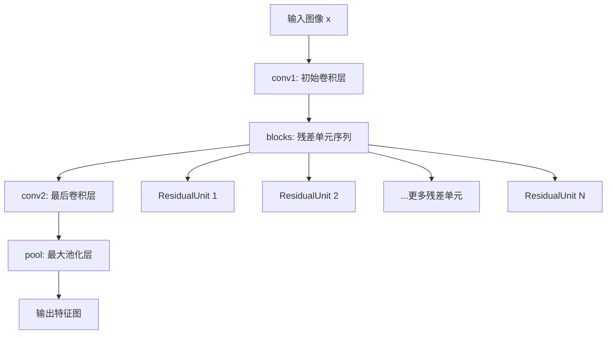
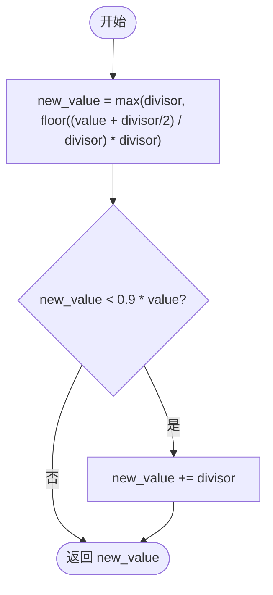
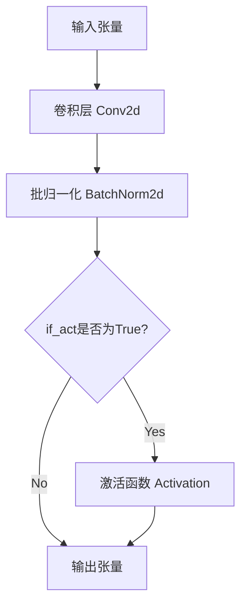
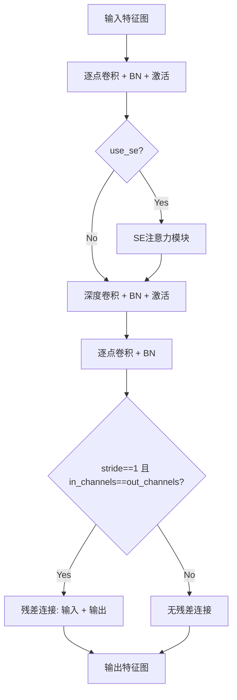
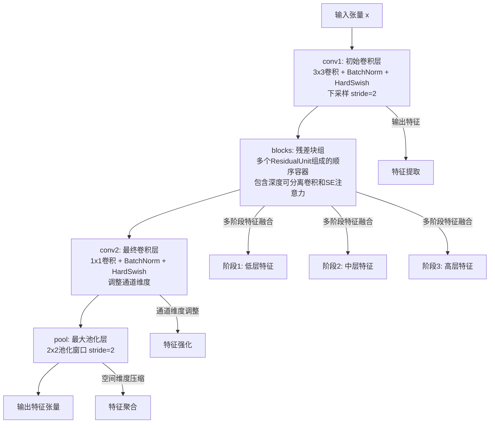

# `MinerU\mineru\model\utils\pytorchocr\modeling\backbones\rec_mobilenet_v3.py` 详细设计文档

这是一个MobileNetV3卷积神经网络模型的PyTorch实现，支持large和small两种模型配置，通过可伸缩因子(scale)调整模型复杂度，包含多个深度可分离卷积残差单元和SE注意力机制，用于图像分类或作为视觉任务的骨干网络。

## 整体流程



## 类结构

```
nn.Module (PyTorch基类)
└── MobileNetV3 (主模型类)
    ├── ConvBNLayer (来自det_mobilenet_v3)
    ├── ResidualUnit (来自det_mobilenet_v3)
    └── make_divisible (工具函数)
```

## 全局变量及字段


### `ConvBNLayer`
    
从det_mobilenet_v3模块导入的卷积批归一化层类

类型：`class`
    


### `ResidualUnit`
    
从det_mobilenet_v3模块导入的残差单元类

类型：`class`
    


### `make_divisible`
    
从det_mobilenet_v3模块导入的通道数可整除性调整函数

类型：`function`
    


### `nn`
    
PyTorch神经网络模块

类型：`module`
    


### `MobileNetV3.conv1`
    
初始卷积层，进行特征提取

类型：`ConvBNLayer`
    


### `MobileNetV3.blocks`
    
多个残差单元组成的特征提取器

类型：`nn.Sequential`
    


### `MobileNetV3.conv2`
    
最终卷积层，调整通道数

类型：`ConvBNLayer`
    


### `MobileNetV3.pool`
    
全局池化层

类型：`nn.MaxPool2d`
    


### `MobileNetV3.out_channels`
    
输出通道数

类型：`int`
    
    

## 全局函数及方法


### `make_divisible`

该函数用于将给定的通道数或数值调整为最接近的可被8整除的数，以确保在硬件计算时的效率，通常用于深度学习模型的通道数对齐。

参数：

-  `value`：`float` 或 `int`，需要调整的数值（通常为通道数）
-  `divisor`：`int`，可选，除数，默认为8，目标整除数

返回值：`int`，调整后的数值，使其可被divisor整除。

#### 流程图



#### 带注释源码

```python
def make_divisible(value, divisor=8):
    """
    将通道数调整为可被divisor整除的数。
    
    此函数用于确保通道数是8的倍数，以提高硬件计算效率。这是MobileNetV3等模型中的常见做法。
    
    参数：
        value: float 或 int，要调整的数值（通常为通道数）
        divisor: int，可选，除数，默认为8
    
    返回值：
        int，调整后的数值，可被divisor整除
    """
    # 确保最小值为divisor
    min_val = divisor
    # 将value加上divisor的一半，然后整除divisor，再乘以divisor，得到最接近的向上取整的倍数
    new_value = max(min_val, int(value + divisor / 2) // divisor * divisor)
    
    # 如果调整后的值小于原始值的90%，则增加一个divisor，以确保不会过度减小
    if new_value < 0.9 * value:
        new_value += divisor
    
    return new_value
```


### ConvBNLayer

卷积+归一化+激活层（ConvBNLayer）是MobileNetV3网络中的基础构建模块，封装了卷积、批归一化（BatchNorm）和激活函数的组合操作，提供统一的接口来创建带有可选激活功能的卷积层。

参数：

- `in_channels`：`int`，输入张量的通道数
- `out_channels`：`int`，输出张量的通道数
- `kernel_size`：`int` 或 `tuple`，卷积核的大小
- `stride`：`int` 或 `tuple`，卷积的步长，默认为1
- `padding`：`int` 或 `tuple`，卷积的填充，默认为0
- `groups`：`int`，分组卷积的组数，默认为1
- `if_act`：`bool`，是否启用激活函数，默认为True
- `act`：`str`，激活函数类型（如"relu"、"hard_swish"），默认为"relu"
- `name`：`str`，层的名称，用于标识

返回值：`nn.Module`，返回一个PyTorch模块，包含卷积、批归一化和可选的激活函数

#### 流程图



#### 带注释源码

```python
# ConvBNLayer 是从 det_mobilenet_v3 模块导入的组合层
# 基于代码使用方式，推断其内部结构如下：

class ConvBNLayer(nn.Module):
    """
    卷积 + 批归一化 + 激活函数 组合层
    
    该层封装了常见的卷积神经网络基础操作：
    - Conv2d: 卷积操作
    - BatchNorm2d: 批归一化，用于加速训练和稳定模型
    - 激活函数: 根据配置添加非线性变换
    """
    
    def __init__(
        self,
        in_channels: int,          # 输入通道数
        out_channels: int,         # 输出通道数
        kernel_size: int = 1,      # 卷积核大小
        stride: int = 1,           # 步长
        padding: int = 0,          # 填充
        groups: int = 1,           # 分组数，用于深度可分离卷积
        if_act: bool = True,       # 是否启用激活函数
        act: str = "relu",         # 激活函数类型
        name: str = ""             # 层名称
    ):
        super(ConvBNLayer, self).__init__()
        
        # 创建卷积层
        self.conv = nn.Conv2d(
            in_channels=in_channels,
            out_channels=out_channels,
            kernel_size=kernel_size,
            stride=stride,
            padding=padding,
            groups=groups,
            bias=False  # 使用BatchNorm时不需要偏置
        )
        
        # 创建批归一化层
        self.bn = nn.BatchNorm2d(num_features=out_channels)
        
        # 根据配置决定是否添加激活函数
        self.if_act = if_act
        if if_act:
            if act == "relu":
                self.act = nn.ReLU()
            elif act == "hard_swish":
                self.act = nn.Hardswish()
            # 可扩展其他激活函数
    
    def forward(self, x):
        """
        前向传播
        
        参数:
            x: 输入张量，形状为 (N, C, H, W)
            
        返回:
            经过卷积、归一化、激活后的张量
        """
        x = self.conv(x)  # 卷积操作
        x = self.bn(x)    # 批归一化
        if self.if_act:  # 可选激活函数
            x = self.act(x)
        return x
```


### `ResidualUnit`

深度可分离卷积残差单元（ResidualUnit）是 MobileNetV3 的核心构建块，采用深度可分离卷积（Depthwise Separable Convolution）结构，通过逐点卷积扩展通道、深度卷积进行空间特征提取、可选的 SE 注意力机制增强特征表示，最后通过残差连接实现特征复用，有效平衡了模型参数量与特征提取能力。

参数：

- `in_channels`：`int`，输入特征图的通道数
- `mid_channels`：`int`，深度可分离卷积中间层（逐点卷积扩展后）的通道数
- `out_channels`：`int`，输出特征图的通道数
- `kernel_size`：`int` 或 `tuple`，深度卷积的卷积核大小
- `stride`：`int` 或 `tuple`，深度卷积的步长，控制是否下采样
- `use_se`：`bool`，是否启用 Squeeze-and-Excitation 注意力模块
- `act`：`str`，激活函数类型（如 "relu"、"hard_swish"）
- `name`：`str`，该模块的名称标识

返回值：`torch.Tensor`，经过深度可分离卷积残差单元处理后的特征张量

#### 流程图



#### 带注释源码

```python
# 注意：以下为基于 MobileNetV3 架构推断的 ResidualUnit 实现
# 实际代码位于 det_mobilenet_v3.py 模块中

class ResidualUnit(nn.Module):
    """
    深度可分离卷积残差单元
    
    结构组成：
    1. 逐点卷积 (Pointwise Conv): 扩展通道维度
    2. 深度卷积 (Depthwise Conv): 提取空间特征
    3. SE 注意力模块 (可选): 通道注意力机制
    4. 逐点卷积: 投影到输出通道
    5. 残差连接: 短路连接（仅当维度匹配时）
    """
    
    def __init__(self, in_channels, mid_channels, out_channels, 
                 kernel_size, stride, use_se, act, name):
        super(ResidualUnit, self).__init__()
        
        self.stride = stride
        self.use_se = use_se
        self.in_channels = in_channels
        self.out_channels = out_channels
        
        # 第一个逐点卷积：扩展通道数 (in_channels -> mid_channels)
        self.conv1 = nn.Conv2d(
            in_channels, 
            mid_channels, 
            kernel_size=1, 
            stride=1, 
            padding=0, 
            bias=False
        )
        self.bn1 = nn.BatchNorm2d(mid_channels)
        self.act1 = self._get_activation(act)  # 激活函数
        
        # 深度卷积：空间特征提取 (mid_channels -> mid_channels)
        # groups=mid_channels 表示深度卷积
        self.dwconv = nn.Conv2d(
            mid_channels, 
            mid_channels, 
            kernel_size=kernel_size, 
            stride=stride, 
            padding=kernel_size // 2, 
            groups=mid_channels, 
            bias=False
        )
        self.bn2 = nn.BatchNorm2d(mid_channels)
        self.act2 = self._get_activation(act)
        
        # SE 注意力模块 (可选)
        if use_se:
            self.se = SEBlock(mid_channels)
        
        # 第二个逐点卷积：投影到输出通道 (mid_channels -> out_channels)
        self.conv2 = nn.Conv2d(
            mid_channels, 
            out_channels, 
            kernel_size=1, 
            stride=1, 
            padding=0, 
            bias=False
        )
        self.bn3 = nn.BatchNorm2d(out_channels)
        # 注意：最后一个 BN 后通常不接激活函数
        
    def _get_activation(self, act):
        """根据名称返回对应的激活函数"""
        if act == "relu":
            return nn.ReLU(inplace=True)
        elif act == "hard_swish":
            return nn.Hardswish(inplace=True)
        else:
            return nn.ReLU(inplace=True)
    
    def forward(self, x):
        """
        前向传播
        
        Args:
            x: 输入张量，shape [B, C, H, W]
            
        Returns:
            输出张量，shape [B, out_channels, H//stride, W//stride]
        """
        # 逐点卷积 + BN + 激活
        out = self.conv1(x)
        out = self.bn1(out)
        out = self.act1(out)
        
        # 深度卷积 + BN + 激活
        out = self.dwconv(out)
        out = self.bn2(out)
        out = self.act2(out)
        
        # SE 注意力模块 (可选)
        if self.use_se:
            out = self.se(out)
        
        # 逐点卷积 + BN (无激活)
        out = self.conv2(out)
        out = self.bn3(out)
        
        # 残差连接：仅当 stride=1 且通道数匹配时启用
        if self.stride == 1 and self.in_channels == self.out_channels:
            out = out + x  # 残差连接
        
        return out


class SEBlock(nn.Module):
    """
    Squeeze-and-Excitation 注意力模块
    
    结构：
    1. 全局平均池化 (Squeeze)
    2. 第一个全连接层：通道压缩 (C -> C//4)
    3. 激活函数 (ReLU)
    4. 第二个全连接层：通道恢复 (C//4 -> C)
    5. Sigmoid 激活
    6. 通道加权
    """
    
    def __init__(self, channels, reduction=4):
        super(SEBlock, self).__init__()
        self.avg_pool = nn.AdaptiveAvgPool2d(1)
        self.fc1 = nn.Linear(channels, channels // reduction, bias=False)
        self.fc2 = nn.Linear(channels // reduction, channels, bias=False)
        self.act = nn.ReLU(inplace=True)
        self.sigmoid = nn.Sigmoid()
    
    def forward(self, x):
        b, c, _, _ = x.size()
        # Squeeze: 全局平均池化
        y = self.avg_pool(x).view(b, c)
        # Excitation: 通道注意力
        y = self.fc1(y)
        y = self.act(y)
        y = self.fc2(y)
        y = self.sigmoid(y).view(b, c, 1, 1)
        # 通道加权
        return x * y.expand_as(x)
```


### `MobileNetV3.__init__`

初始化MobileNetV3模型结构，根据model_name参数配置large或small模式，并设置相应的通道数、步长和缩放比例，构建卷积层和残差块序列。

参数：

- `in_channels`：`int`，输入图像的通道数，默认为3（RGB图像）
- `model_name`：`str`，模型模式，可选"large"或"small"，默认为"small"
- `scale`：`float`，通道缩放比例，用于调整模型容量，默认为0.5
- `large_stride`：`list`，大模型各阶段的步长列表，默认为[1, 2, 2, 2]
- `small_stride`：`list`，小模型各阶段的步长列表，默认为[2, 2, 2, 2]
- `**kwargs`：`dict`，额外的关键字参数，用于扩展

返回值：`None`，该方法为构造函数，不返回任何值

#### 流程图

```mermaid
flowchart TD
    A[开始初始化] --> B{检查small_stride是否为None}
    B -->|是| C[设置small_stride为默认[2,2,2,2]]
    B -->|否| D{检查large_stride是否为None}
    C --> D
    D -->|是| E[设置large_stride为默认[1,2,2,2]]
    D -->|否| F[验证stride参数类型和长度]
    F --> G{判断model_name}
    G -->|large| H[加载large模型配置cfg和cls_ch_squeeze=960]
    G -->|small| I[加载small模型配置cfg和cls_ch_squeeze=576]
    G -->|其他| J[抛出NotImplementedError]
    H --> K[验证scale在支持列表中]
    I --> K
    K --> L[创建第一个卷积层conv1]
    L --> M[遍历cfg配置创建残差块列表]
    M --> N[使用nn.Sequential创建blocks]
    N --> O[创建最后一个卷积层conv2]
    O --> P[创建池化层pool]
    P --> Q[设置输出通道数out_channels]
    Q --> R[结束初始化]
```

#### 带注释源码

```python
def __init__(
    self,
    in_channels=3,
    model_name="small",
    scale=0.5,
    large_stride=None,
    small_stride=None,
    **kwargs
):
    """
    初始化MobileNetV3模型结构
    
    参数:
        in_channels: 输入图像通道数，默认为3（RGB）
        model_name: 模型类型，'large'或'small'，默认为'small'
        scale: 通道缩放因子，用于调整模型大小
        large_stride: 大模型的步长配置
        small_stride: 小模型的步长配置
        **kwargs: 额外参数
    """
    # 调用父类nn.Module的初始化方法
    super(MobileNetV3, self).__init__()
    
    # 设置默认步长值（如果未提供）
    if small_stride is None:
        small_stride = [2, 2, 2, 2]
    if large_stride is None:
        large_stride = [1, 2, 2, 2]

    # 参数类型和长度校验
    assert isinstance(
        large_stride, list
    ), "large_stride type must " "be list but got {}".format(type(large_stride))
    assert isinstance(
        small_stride, list
    ), "small_stride type must " "be list but got {}".format(type(small_stride))
    assert (
        len(large_stride) == 4
    ), "large_stride length must be " "4 but got {}".format(len(large_stride))
    assert (
        len(small_stride) == 4
    ), "small_stride length must be " "4 but got {}".format(len(small_stride))

    # 根据model_name选择模型配置
    if model_name == "large":
        # MobileNetV3-Large配置：15个残差块
        # 格式: [kernel_size, expand_channels, output_channels, use_se, activation, stride]
        cfg = [
            # k, exp, c,  se,     nl,  s,
            [3, 16, 16, False, "relu", large_stride[0]],
            [3, 64, 24, False, "relu", (large_stride[1], 1)],
            [3, 72, 24, False, "relu", 1],
            [5, 72, 40, True, "relu", (large_stride[2], 1)],
            [5, 120, 40, True, "relu", 1],
            [5, 120, 40, True, "relu", 1],
            [3, 240, 80, False, "hard_swish", 1],
            [3, 200, 80, False, "hard_swish", 1],
            [3, 184, 80, False, "hard_swish", 1],
            [3, 184, 80, False, "hard_swish", 1],
            [3, 480, 112, True, "hard_swish", 1],
            [3, 672, 112, True, "hard_swish", 1],
            [5, 672, 160, True, "hard_swish", (large_stride[3], 1)],
            [5, 960, 160, True, "hard_swish", 1],
            [5, 960, 160, True, "hard_swish", 1],
        ]
        # large模型的输出通道数
        cls_ch_squeeze = 960
    elif model_name == "small":
        # MobileNetV3-Small配置：11个残差块
        cfg = [
            # k, exp, c,  se,     nl,  s,
            [3, 16, 16, True, "relu", (small_stride[0], 1)],
            [3, 72, 24, False, "relu", (small_stride[1], 1)],
            [3, 88, 24, False, "relu", 1],
            [5, 96, 40, True, "hard_swish", (small_stride[2], 1)],
            [5, 240, 40, True, "hard_swish", 1],
            [5, 240, 40, True, "hard_swish", 1],
            [5, 120, 48, True, "hard_swish", 1],
            [5, 144, 48, True, "hard_swish", 1],
            [5, 288, 96, True, "hard_swish", (small_stride[3], 1)],
            [5, 576, 96, True, "hard_swish", 1],
            [5, 576, 96, True, "hard_swish", 1],
        ]
        # small模型的输出通道数
        cls_ch_squeeze = 576
    else:
        # 不支持的模型类型
        raise NotImplementedError(
            "mode[" + model_name + "_model] is not implemented!"
        )

    # 支持的缩放比例列表
    supported_scale = [0.35, 0.5, 0.75, 1.0, 1.25]
    assert (
        scale in supported_scale
    ), "supported scales are {} but input scale is {}".format(
        supported_scale, scale
    )

    # 初始卷积层配置
    inplanes = 16
    # 第一个卷积层：3x3卷积 + BatchNorm + HardSwish激活
    self.conv1 = ConvBNLayer(
        in_channels=in_channels,
        out_channels=make_divisible(inplanes * scale),
        kernel_size=3,
        stride=2,
        padding=1,
        groups=1,
        if_act=True,
        act="hard_swish",
        name="conv1",
    )
    
    # 构建残差块列表
    i = 0
    block_list = []
    inplanes = make_divisible(inplanes * scale)
    for k, exp, c, se, nl, s in cfg:
        # 创建每个残差单元块
        block_list.append(
            ResidualUnit(
                in_channels=inplanes,
                mid_channels=make_divisible(scale * exp),
                out_channels=make_divisible(scale * c),
                kernel_size=k,
                stride=s,
                use_se=se,
                act=nl,
                name="conv" + str(i + 2),
            )
        )
        # 更新输入通道数为当前输出通道数
        inplanes = make_divisible(scale * c)
        i += 1
    
    # 使用nn.Sequential将所有残差块串联
    self.blocks = nn.Sequential(*block_list)

    # 最后一个1x1卷积层，用于特征融合
    self.conv2 = ConvBNLayer(
        in_channels=inplanes,
        out_channels=make_divisible(scale * cls_ch_squeeze),
        kernel_size=1,
        stride=1,
        padding=0,
        groups=1,
        if_act=True,
        act="hard_swish",
        name="conv_last",
    )

    # 最大池化层
    self.pool = nn.MaxPool2d(kernel_size=2, stride=2, padding=0)
    # 保存输出通道数供后续使用
    self.out_channels = make_divisible(scale * cls_ch_squeeze)
```


### `MobileNetV3.forward`

该方法是MobileNetV3模型的前向传播核心逻辑，依次通过初始卷积层(conv1)提取特征、残差块组(blocks)进行多阶段特征提取与融合、最终卷积层(conv2)调整通道维度、以及池化层(pool)输出固定尺寸的特征张量，完成从输入图像到高维特征表示的转换。

参数：

- `x`：`torch.Tensor`，输入的图像数据，通常为4D张量，形状为 [batch_size, channels, height, width]，其中channels通常为3（RGB三通道）

返回值：`torch.Tensor`，经过完整前向传播后的特征张量，形状为 [batch_size, output_channels, feature_height, feature_width]，其中output_channels由scale和模型配置决定（如small模型为576 * scale），feature_height和feature_width为池化后的尺寸

#### 流程图



#### 带注释源码

```python
def forward(self, x):
    """
    MobileNetV3模型的前向传播方法
    
    该方法实现了经典的多阶段特征提取流程：
    1. 初始卷积层：使用3x3卷积核进行初步特征提取，同时进行空间下采样
    2. 残差块组：由多个ResidualUnit组成的深度特征提取网络，包含倒残差结构和SE注意力机制
    3. 最终卷积层：使用1x1卷积核调整特征通道维度，增强特征表示
    4. 池化层：使用2x2最大池化进一步压缩空间维度，输出固定尺寸的特征图
    
    参数:
        x (torch.Tensor): 输入张量，典型形状为 [batch_size, 3, H, W] 的RGB图像
        
    返回:
        torch.Tensor: 输出的特征张量，形状为 [batch_size, out_channels, H', W']
                    其中 out_channels = make_divisible(scale * cls_ch_squeeze)
                    H' 和 W' 为经过多次下采样后的尺寸
    """
    # 第一阶段：初始卷积层
    # 使用硬激活函数(HardSwish)和批归一化，进行通道数扩展和空间下采样
    # 输入: [B, 3, H, W] -> 输出: [B, 16*scale, H/2, W/2]
    x = self.conv1(x)
    
    # 第二阶段：残差块组（核心特征提取）
    # 由多个倒残差块(ResidualUnit)组成，每个块包含:
    #   - 1x1卷积进行通道扩展
    #   - 深度可分离卷积(DWConv)进行空间特征提取
    #   - SE注意力模块(可选)进行通道注意力
    #   - 1x1卷积进行通道压缩
    # 输出: [B, 16*scale, H/2, W/2] -> [B, 160*scale, H/16, W/16]
    x = self.blocks(x)
    
    # 第三阶段：最终卷积层
    # 1x1卷积进行最终的特征通道调整，使用HardSwish激活
    # 输出: [B, 160*scale, H/16, W/16] -> [B, 960*scale, H/16, W/16]
    x = self.conv2(x)
    
    # 第四阶段：池化层
    # 使用2x2最大池化进行最终的空间维度压缩
    # 输出: [B, 960*scale, H/16, W/16] -> [B, 960*scale, H/32, W/32]
    x = self.pool(x)
    
    # 返回最终提取的特征表示，可用于下游任务（如目标检测、图像分类等）
    return x
```

## 关键组件


### MobileNetV3 类

这是MobileNetV3神经网络的核心实现类，继承自nn.Module，支持small和large两种模型架构，通过可伸缩的scale参数（0.35-1.25）实现不同规模的模型变体，采用深度可分离卷积、SE注意力机制和hard_swish激活函数构建高效的移动端卷积神经网络。

### 文件整体运行流程

1. 初始化MobileNetV3实例，传入模型参数（in_channels, model_name, scale, large_stride, small_stride）
2. 在__init__中完成：
   - 参数校验（stride列表长度、scale支持范围）
   - 根据model_name选择对应的网络配置cfg
   - 创建第一个卷积层conv1
   - 循环构建多个ResidualUnit组成blocks
   - 创建最后的卷积层conv2和池化层pool
3. 调用forward方法时：输入x依次经过conv1 -> blocks -> conv2 -> pool，返回最终特征图

### 类详细信息

#### MobileNetV3类

- **类字段**：
  - `conv1`: ConvBNLayer类型，第一层卷积块
  - `blocks`: nn.Sequential类型，多个残差单元组成的特征提取骨干
  - `conv2`: ConvBNLayer类型，最后一层卷积
  - `pool`: nn.MaxPool2d类型，池化层
  - `out_channels`: int类型，输出通道数

- **类方法**：
  - `__init__`: 构造函数，初始化模型结构
    - 参数：in_channels(int, 输入通道数，默认3), model_name(str, 模型名称，默认"small"), scale(float, 缩放比例，默认0.5), large_stride(list, 大模型步长), small_stride(list, 小模型步长), **kwargs
    - 返回值：None
    - 源码：
    ```python
    def __init__(
        self,
        in_channels=3,
        model_name="small",
        scale=0.5,
        large_stride=None,
        small_stride=None,
        **kwargs
    ):
        super(MobileNetV3, self).__init__()
        if small_stride is None:
            small_stride = [2, 2, 2, 2]
        if large_stride is None:
            large_stride = [1, 2, 2, 2]

        assert isinstance(
            large_stride, list
        ), "large_stride type must " "be list but got {}".format(type(large_stride))
        assert isinstance(
            small_stride, list
        ), "small_stride type must " "be list but got {}".format(type(small_stride))
        assert (
            len(large_stride) == 4
        ), "large_stride length must be " "4 but got {}".format(len(large_stride))
        assert (
            len(small_stride) == 4
        ), "small_stride length must be " "4 but got {}".format(len(small_stride))

        if model_name == "large":
            cfg = [
                # k, exp, c,  se,     nl,  s,
                [3, 16, 16, False, "relu", large_stride[0]],
                [3, 64, 24, False, "relu", (large_stride[1], 1)],
                [3, 72, 24, False, "relu", 1],
                [5, 72, 40, True, "relu", (large_stride[2], 1)],
                [5, 120, 40, True, "relu", 1],
                [5, 120, 40, True, "relu", 1],
                [3, 240, 80, False, "hard_swish", 1],
                [3, 200, 80, False, "hard_swish", 1],
                [3, 184, 80, False, "hard_swish", 1],
                [3, 184, 80, False, "hard_swish", 1],
                [3, 480, 112, True, "hard_swish", 1],
                [3, 672, 112, True, "hard_swish", 1],
                [5, 672, 160, True, "hard_swish", (large_stride[3], 1)],
                [5, 960, 160, True, "hard_swish", 1],
                [5, 960, 160, True, "hard_swish", 1],
            ]
            cls_ch_squeeze = 960
        elif model_name == "small":
            cfg = [
                # k, exp, c,  se,     nl,  s,
                [3, 16, 16, True, "relu", (small_stride[0], 1)],
                [3, 72, 24, False, "relu", (small_stride[1], 1)],
                [3, 88, 24, False, "relu", 1],
                [5, 96, 40, True, "hard_swish", (small_stride[2], 1)],
                [5, 240, 40, True, "hard_swish", 1],
                [5, 240, 40, True, "hard_swish", 1],
                [5, 120, 48, True, "hard_swish", 1],
                [5, 144, 48, True, "hard_swish", 1],
                [5, 288, 96, True, "hard_swish", (small_stride[3], 1)],
                [5, 576, 96, True, "hard_swish", 1],
                [5, 576, 96, True, "hard_swish", 1],
            ]
            cls_ch_squeeze = 576
        else:
            raise NotImplementedError(
                "mode[" + model_name + "_model] is not implemented!"
            )

        supported_scale = [0.35, 0.5, 0.75, 1.0, 1.25]
        assert (
            scale in supported_scale
        ), "supported scales are {} but input scale is {}".format(
            supported_scale, scale
        )

        inplanes = 16
        # conv1
        self.conv1 = ConvBNLayer(
            in_channels=in_channels,
            out_channels=make_divisible(inplanes * scale),
            kernel_size=3,
            stride=2,
            padding=1,
            groups=1,
            if_act=True,
            act="hard_swish",
            name="conv1",
        )
        i = 0
        block_list = []
        inplanes = make_divisible(inplanes * scale)
        for k, exp, c, se, nl, s in cfg:
            block_list.append(
                ResidualUnit(
                    in_channels=inplanes,
                    mid_channels=make_divisible(scale * exp),
                    out_channels=make_divisible(scale * c),
                    kernel_size=k,
                    stride=s,
                    use_se=se,
                    act=nl,
                    name="conv" + str(i + 2),
                )
            )
            inplanes = make_divisible(scale * c)
            i += 1
        self.blocks = nn.Sequential(*block_list)

        self.conv2 = ConvBNLayer(
            in_channels=inplanes,
            out_channels=make_divisible(scale * cls_ch_squeeze),
            kernel_size=1,
            stride=1,
            padding=0,
            groups=1,
            if_act=True,
            act="hard_swish",
            name="conv_last",
        )

        self.pool = nn.MaxPool2d(kernel_size=2, stride=2, padding=0)
        self.out_channels = make_divisible(scale * cls_ch_squeeze)
    ```

  - `forward`: 前向传播方法
    - 参数：x(Tensor, 输入张量)
    - 返回值：Tensor，经过网络处理后的输出张量
    - 返回值描述：经过特征提取和池化后的特征图
    - mermaid流程图：
    ```mermaid
    graph TD
        A[输入x] --> B[conv1卷积]
        B --> C[blocks残差单元]
        C --> D[conv2卷积]
        D --> E[pool池化]
        E --> F[输出特征图]
    ```
    - 源码：
    ```python
    def forward(self, x):
        x = self.conv1(x)
        x = self.blocks(x)
        x = self.conv2(x)
        x = self.pool(x)
        return x
    ```

### 关键组件信息

- **ConvBNLayer**: 卷积+BatchNorm+激活函数的组合模块，从det_mobilenet_v3导入，用于构建基础卷积层
- **ResidualUnit**: 残差单元模块，包含深度可分离卷积和可选的SE注意力机制，从det_mobilenet_v3导入
- **make_divisible**: 通道数调整函数，确保输出通道数可被8整除以优化推理效率，从det_mobilenet_v3导入
- **SE注意力机制**: 在ResidualUnit中通过use_se参数控制，用于增强特征表示
- **hard_swish激活函数**: 移动端友好的激活函数，在大部分卷积层中使用
- **模型配置cfg**: 列表定义每层的卷积核大小、膨胀通道数、输出通道数、SE使用、激活函数和步长

### 潜在的技术债务或优化空间

1. **缺少导出接口**：没有定义torch.jit.script兼容的方法，限制了在生产环境中的部署选项
2. **配置硬编码**：网络cfg配置直接写在代码中，建议抽取为配置文件或使用注册机制
3. **断言用于参数校验**：生产环境中建议改为更友好的参数验证和异常抛出方式
4. **池化层固定**：使用固定的2x2池化，可考虑改为自适应池化以支持可变输入尺寸
5. **文档缺失**：缺少详细的类和方法文档注释

### 其它项目

- **设计目标**：为移动端和嵌入式设备提供高效的图像特征提取网络
- **约束条件**：输入通道默认为3（RGB图像），仅支持small和large两种模型结构
- **错误处理**：通过assert进行参数校验，不支持的模型名称抛出NotImplementedError
- **数据流**：输入图像 → conv1特征提取 → blocks多级残差块 → conv2通道调整 → pool空间池化 → 输出特征向量
- **外部依赖**：PyTorch nn.Module，依赖det_mobilenet_v3中的ConvBNLayer、ResidualUnit和make_divisible


## 问题及建议


### 已知问题

- **冗余的参数默认值处理**：代码在函数开头检查`small_stride`和`large_stride`是否为None并赋默认值，但这两个参数在函数签名中已经有默认值，导致重复处理
- **使用assert进行参数验证**：在生产代码中使用assert进行参数验证不合适，因为Python在运行时会忽略assert（使用-O选项），应使用ValueError或TypeError异常
- **Magic Numbers缺乏解释**：代码中存在大量硬编码数值（如16、960、576、2等），缺乏常量定义或注释说明其含义
- **model_name参数未做标准化处理**：传入"Large"或"SMALL"等不同大小写的模型名称会导致意外行为，应该在内部进行标准化处理
- **未使用的kwargs参数**：函数签名接受`**kwargs`但从未使用，造成接口污染
- **循环变量i的使用**：使用单字母变量`i`作为循环计数器不如使用更具描述性的名称
- **缺少输入验证**：forward方法没有对输入张量的shape、类型进行验证，可能导致难以追踪的运行时错误
- **pooling层位置固定**：self.pool使用固定的kernel_size=2和stride=2，对于不同输入尺寸可能不适用

### 优化建议

- 将参数默认值直接放在函数签名中，移除开头的None检查和赋值逻辑
- 将assert验证替换为显式的if raise结构，提高代码健壮性
- 定义类级别的常量或配置文件来存储magic numbers，提高可维护性
- 在函数入口处对model_name调用.lower()进行标准化处理
- 移除未使用的kwargs参数，或明确文档说明其用途
- 将循环变量i重命名为block_index等更具描述性的名称
- 在forward方法中添加输入验证逻辑，检查输入维度、类型等
- 考虑将pooling层参数化，或提供配置接口以适应不同任务需求
- 添加完整的docstring文档，说明类的作用、参数含义、返回值等
- 考虑添加类方法或工厂方法来支持预训练权重加载

## 其它


### 设计目标与约束

本模块的设计目标是实现MobileNetV3骨干网络，为目标检测任务提供高效的特征提取能力。设计约束包括：支持large和small两种模型变体，支持0.35、0.5、0.75、1.0、1.25五种缩放尺度，必须使用PyTorch框架，必须从det_mobilenet_v3模块导入基础组件。

### 错误处理与异常设计

本模块的错误处理主要包括参数校验和异常抛出。参数校验包括：large_stride和small_stride必须为list类型且长度必须为4；model_name必须为"large"或"small"，否则抛出NotImplementedError；scale必须在supported_scale列表中，否则抛出AssertionError。所有断言错误都包含详细的错误信息，包括期望值和实际值。

### 数据流与状态机

数据流主要分为三个阶段：第一阶段输入图像经过conv1卷积层进行初步特征提取；第二阶段通过blocks（由多个ResidualUnit组成的Sequential）进行深度特征提取；第三阶段通过conv2和pool进行特征整合和下采样。状态机转换：输入数据依次经过conv1 -> blocks -> conv2 -> pool，最终输出特征图。输入维度应为[B, 3, H, W]，输出维度为[B, out_channels, H/32, W/32]。

### 外部依赖与接口契约

本模块依赖外部模块det_mobilenet_v3中的三个组件：ConvBNLayer（卷积+批归一化+激活层）、ResidualUnit（残差单元）、make_divisible（通道数可整除化函数）。接口契约包括：ConvBNLayer接受in_channels、out_channels、kernel_size、stride、padding、groups、if_act、act、name参数；ResidualUnit接受in_channels、mid_channels、out_channels、kernel_size、stride、use_se、act、name参数；make_divisible接受数值和除数参数。

### 配置参数说明

cfg列表配置格式为[k, exp, c, se, nl, s]，其中k表示卷积核大小，exp表示中间通道扩展数，c表示输出通道数，se表示是否使用SE注意力模块，nl表示激活函数类型，s表示步长。对于large模型，cls_ch_squeeze=960；对于small模型，cls_ch_squeeze=576。large_stride默认[1,2,2,2]，small_stride默认[2,2,2,2]。

### 模型变体对比

large模型包含15个残差块，通道数逐级增加，从16到960，主要用于需要高精度特征的检测任务。small模型包含11个残差块，通道数从16到576，计算量更小，适用于实时检测场景。两种模型的主要区别在于残差块数量、通道数配置和SE模块的使用策略。

### 性能优化空间

当前实现存在以下优化空间：1）pool操作可以使用AdaptiveAvgPool2d替代固定kernel_size的MaxPool2d，以支持任意输入尺寸；2）可以在forward中添加推理模式判断，在训练和推理时使用不同的特征输出策略；3）可以添加torch.jit.script支持以提升推理性能；4）blocks可以使用nn.ModuleList替代nn.Sequential以支持更灵活的特征访问。

### 内存与计算考量

模型参数量主要由conv1、blocks中的各残差块、conv2构成。以scale=1.0的small模型为例，输出通道576，特征图经过5次stride=2的下采样后尺寸变为H/32×W/32。内存占用主要来自卷积核权重和中间激活值，计算量主要集中在blocks中的深度可分离卷积操作。

    