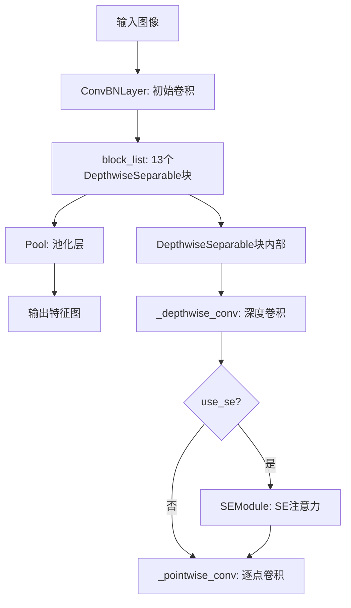
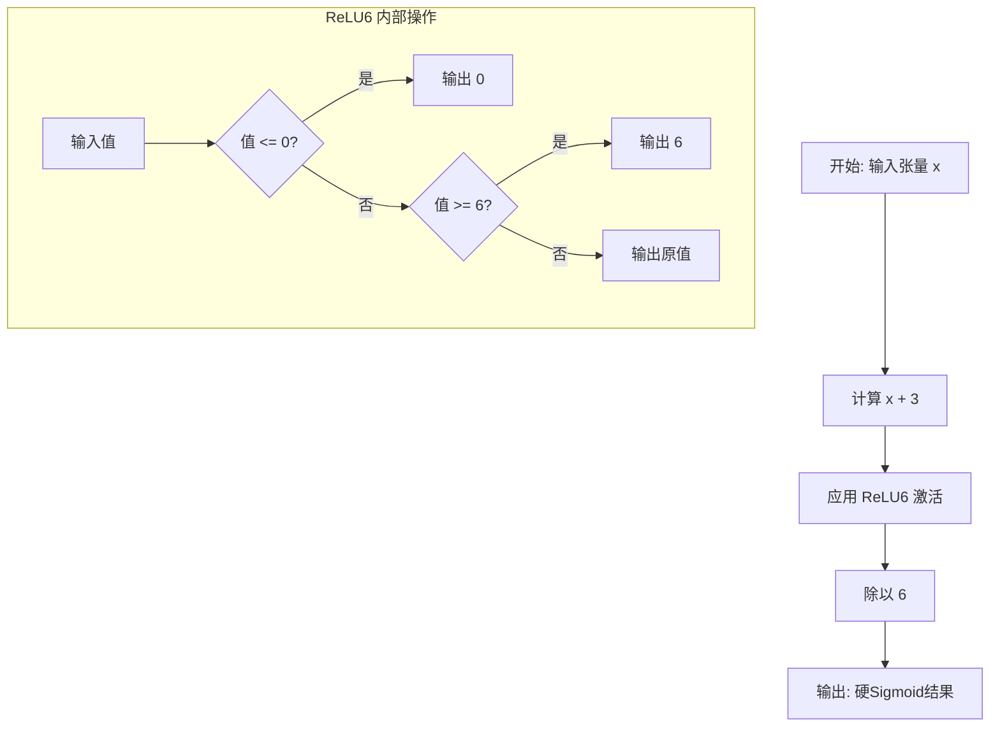
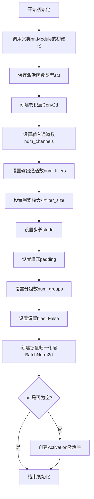
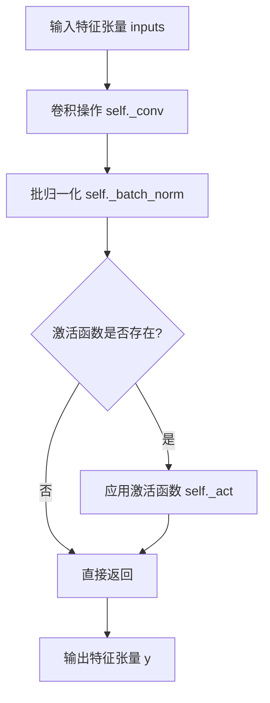
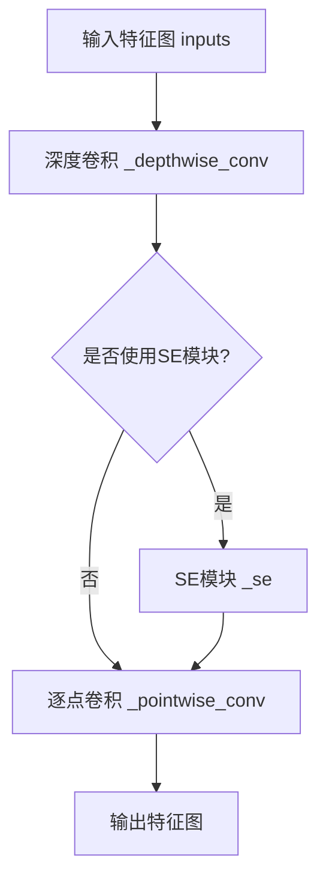
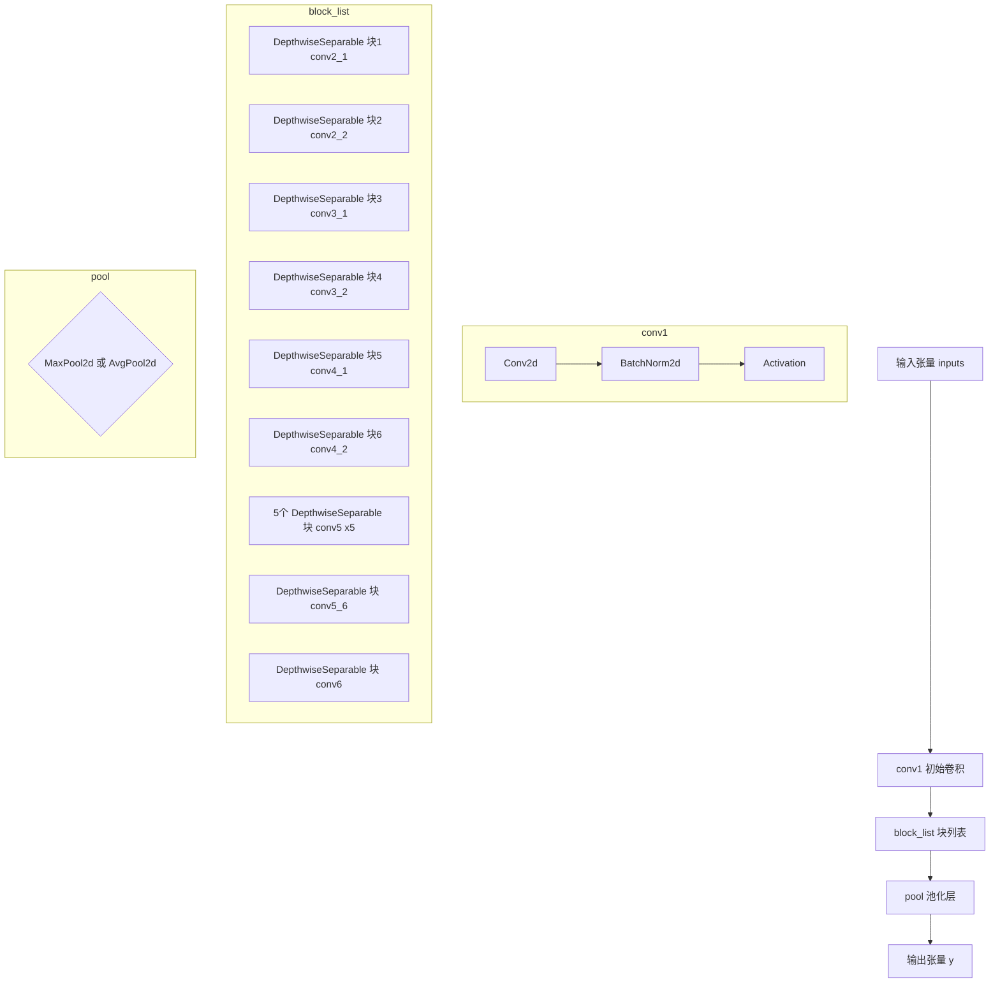
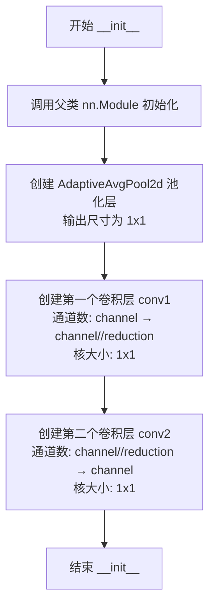
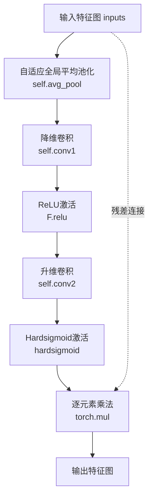

# `MinerU\mineru\model\utils\pytorchocr\modeling\backbones\rec_mv1_enhance.py` 详细设计文档

这是一个MobileNetV1增强版深度学习模型实现，包含了卷积BatchNorm激活层、深度可分离卷积块、Squeeze-and-Excitation注意力模块等核心组件，用于图像特征提取任务。

## 整体流程



## 类结构

```
nn.Module (PyTorch基类)
├── ConvBNLayer (卷积+BN+激活)
├── DepthwiseSeparable (深度可分离卷积)
├── MobileNetV1Enhance (主网络)
└── SEModule (SE注意力模块)
```

## 全局变量及字段


### `scale`
    
模型缩放因子，用于调整模型通道数和计算量

类型：`float`
    


### `last_conv_stride`
    
最后卷积层的步长，控制特征图的空间降采样率

类型：`int 或 tuple`
    


### `last_pool_type`
    
池化类型，可选'avg'或'max'，决定最终池化方式

类型：`str`
    


### `hardsigmoid`
    
硬件友好的sigmoid近似函数，用于SE模块的注意力权重计算

类型：`function`
    


### `ConvBNLayer.act`
    
激活函数类型，指定卷积层使用的非线性激活函数

类型：`str`
    


### `ConvBNLayer._conv`
    
二维卷积层，负责提取输入特征的局部空间模式

类型：`nn.Conv2d`
    


### `ConvBNLayer._batch_norm`
    
批归一化层，用于加速训练和稳定模型

类型：`nn.BatchNorm2d`
    


### `ConvBNLayer._act`
    
激活函数实例，根据act类型应用相应的非线性变换

类型：`Activation`
    


### `DepthwiseSeparable.use_se`
    
是否使用SE模块的布尔标志，控制是否启用通道注意力机制

类型：`bool`
    


### `DepthwiseSeparable._depthwise_conv`
    
深度卷积层，对每个输入通道独立进行空间滤波

类型：`ConvBNLayer`
    


### `DepthwiseSeparable._se`
    
SE注意力模块(可选)，用于学习通道间的依赖关系

类型：`SEModule`
    


### `DepthwiseSeparable._pointwise_conv`
    
逐点卷积层，将深度卷积输出映射到新的通道空间

类型：`ConvBNLayer`
    


### `MobileNetV1Enhance.scale`
    
模型缩放系数，用于动态调整网络通道数和计算量

类型：`float`
    


### `MobileNetV1Enhance.block_list`
    
由多个深度可分离卷积块组成的顺序容器

类型：`nn.Sequential`
    


### `MobileNetV1Enhance.conv1`
    
初始卷积层，对原始输入图像进行初步特征提取

类型：`ConvBNLayer`
    


### `MobileNetV1Enhance.pool`
    
池化层(avg或max)，对特征图进行空间下采样

类型：`nn.Module`
    


### `MobileNetV1Enhance.out_channels`
    
输出通道数，反映网络最终生成的特征维度

类型：`int`
    


### `SEModule.avg_pool`
    
自适应平均池化，将任意尺寸特征图全局池化至1×1

类型：`nn.AdaptiveAvgPool2d`
    


### `SEModule.conv1`
    
通道压缩卷积，将特征通道数降维以减少计算量

类型：`nn.Conv2d`
    


### `SEModule.conv2`
    
通道恢复卷积，将压缩后的特征维度恢复到原始通道数

类型：`nn.Conv2d`
    
    

## 全局函数及方法


### `hardsigmoid`

硬Sigmoid激活函数实现，通过ReLU6和常数偏移量模拟Sigmoid曲线的分段线性近似。

参数：

- `x`：`torch.Tensor`，输入张量，待进行硬Sigmoid激活计算的数值

返回值：`torch.Tensor`，返回硬Sigmoid激活后的张量，输出值被限制在[0, 1]范围内

#### 流程图



#### 带注释源码

```python
def hardsigmoid(x):
    """
    硬Sigmoid激活函数的实现
    
    硬Sigmoid是Sigmoid函数的分段线性近似，公式为:
    f(x) = max(0, min(1, (x + 3) / 6))
    
    该实现使用ReLU6来避免分支判断，提高计算效率:
    - ReLU6(x + 3) 将 x + 3 限制在 [0, 6] 范围内
    - 除以 6 后得到 [0, 1] 范围内的输出
    
    参数:
        x: 输入张量，任意形状
        
    返回:
        硬Sigmoid激活后的张量，值域为 [0, 1]
    """
    # 步骤1: 将输入值加上偏移量3，使函数中心对称
    # 步骤2: 应用ReLU6激活，将值限制在[0, 6]范围
    # 步骤3: 除以6进行归一化，映射到[0, 1]范围
    return F.relu6(x + 3., inplace=True) / 6.
```


### `ConvBNLayer.__init__`

初始化卷积层、批量归一化层和激活函数，创建一个包含卷积、BN和激活的组合层。

参数：

- `num_channels`：`int`，输入图像的通道数
- `filter_size`：`int`，卷积核的大小
- `num_filters`：`int`，输出通道数（卷积核数量）
- `stride`：`int` 或 `tuple`，卷积的步长
- `padding`：`int` 或 `tuple`，卷积的填充大小
- `channels`：`int`，可选参数，输入通道数（代码中未实际使用）
- `num_groups`：`int`，分组卷积的组数，用于深度可分离卷积
- `act`：`str`，激活函数类型，默认为 'hard_swish'

返回值：`None`，无返回值（__init__方法）

#### 流程图



#### 带注释源码

```python
def __init__(self,
             num_channels,    # 输入图像的通道数
             filter_size,    # 卷积核的大小
             num_filters,    # 输出通道数（卷积核数量）
             stride,         # 卷积的步长
             padding,        # 卷积的填充大小
             channels=None,  # 可选参数，代码中未使用
             num_groups=1,   # 分组卷积的组数，默认1为普通卷积
             act='hard_swish'):  # 激活函数类型，默认为hard_swish
    # 调用父类nn.Module的初始化方法
    super(ConvBNLayer, self).__init__()
    
    # 保存激活函数类型到实例属性
    self.act = act
    
    # 创建卷积层
    # in_channels: 输入通道数
    # out_channels: 输出通道数（卷积核数量）
    # kernel_size: 卷积核大小
    # stride: 步长
    # padding: 填充
    # groups: 分组数，用于深度可分离卷积
    # bias: 不使用偏置（因为后面有BN层）
    self._conv = nn.Conv2d(
        in_channels=num_channels,
        out_channels=num_filters,
        kernel_size=filter_size,
        stride=stride,
        padding=padding,
        groups=num_groups,
        bias=False)

    # 创建批量归一化层
    # num_features: 输入通道数，即num_filters
    self._batch_norm = nn.BatchNorm2d(
        num_filters,
    )
    
    # 如果激活函数不为None，则创建激活层
    if self.act is not None:
        # 使用自定义的Activation类创建激活层
        # inplace=True 表示原地操作，节省内存
        self._act = Activation(act_type=act, inplace=True)
```


### `ConvBNLayer.forward`

该方法实现卷积神经网络的前向传播过程，依次执行卷积操作、批归一化处理以及可选的激活函数应用，最终输出特征图。

参数：

- `inputs`：`torch.Tensor`，输入的图像特征张量，通常为 4 维张量 (N, C, H, W)

返回值：`torch.Tensor`，经过卷积、批归一化和激活处理后的输出特征张量，形状与输入特征图尺寸相同

#### 流程图



#### 带注释源码

```python
def forward(self, inputs):
    """
    执行卷积 -> 批归一化 -> 激活的前向传播过程
    
    参数:
        inputs: 输入的图像特征张量，形状为 (N, C, H, W)
    
    返回:
        经过完整处理后的输出张量
    """
    # 第一步：卷积操作
    # 使用初始化时定义的卷积核参数对输入进行特征提取
    y = self._conv(inputs)
    
    # 第二步：批归一化
    # 对卷积输出进行均值方差归一化，加速训练稳定收敛
    y = self._batch_norm(y)
    
    # 第三步：激活函数应用（可选）
    # 如果在初始化时指定了激活函数类型，则应用非线性变换
    if self.act is not None:
        y = self._act(y)
    
    # 返回最终处理后的特征图
    return y
```


### `DepthwiseSeparable.__init__`

初始化深度可分离卷积块，包括深度卷积层、可选的SE（Squeeze-and-Excitation）注意力模块和逐点卷积层，用于构建轻量级MobileNet架构中的核心卷积块。

参数：

- `num_channels`：`int`，输入特征图的通道数
- `num_filters1`：`int`，深度卷积的输出通道数基准值
- `num_filters2`：`int`，逐点卷积的输出通道数基准值
- `num_groups`：`int`，深度卷积的分组数
- `stride`：`int`或`tuple`，深度卷积的步长
- `scale`：`float`，通道缩放因子，用于根据比例调整滤波器数量
- `dw_size`：`int`，深度卷积的卷积核大小，默认为3
- `padding`：`int`，深度卷积的填充大小，默认为1
- `use_se`：`bool`，是否使用SE注意力模块，默认为False

返回值：`None`，该方法为初始化方法，不返回任何值

#### 流程图

```mermaid
flowchart TD
    A[开始初始化 DepthwiseSeparable] --> B[接收输入参数]
    B --> C[设置 self.use_se]
    C --> D[创建 _depthwise_conv ConvBNLayer]
    D --> E{use_se 是否为 True?}
    E -->|是| F[创建 _se SEModule]
    E -->|否| G[跳过 SE 模块]
    F --> H[创建 _pointwise_conv ConvBNLayer]
    G --> H
    H --> I[结束初始化]
    
    D -.-> D1[输入通道: num_channels<br>输出通道: int(num_filters1 * scale)<br>卷积核: dw_size<br>步长: stride<br>填充: padding<br>分组: int(num_groups * scale)]
    H -.-> H1[输入通道: int(num_filters1 * scale)<br>输出通道: int(num_filters2 * scale)<br>卷积核: 1<br>步长: 1<br>填充: 0]
```

#### 带注释源码

```
def __init__(self,
             num_channels,      # int: 输入特征图的通道数
             num_filters1,      # int: 深度卷积的输出通道数基准值
             num_filters2,      # int: 逐点卷积的输出通道数基准值
             num_groups,        # int: 深度卷积的分组数
             stride,            # int或tuple: 深度卷积的步长
             scale,             # float: 通道缩放因子
             dw_size=3,         # int: 深度卷积核大小，默认3
             padding=1,         # int: 深度卷积填充，默认1
             use_se=False):     # bool: 是否使用SE注意力模块
    # 调用父类 nn.Module 的初始化方法
    super(DepthwiseSeparable, self).__init__()
    
    # 保存 SE 模块的使用标志到实例属性
    self.use_se = use_se
    
    # 创建深度卷积层 (Depthwise Convolution)
    # 深度卷积对每个输入通道独立进行卷积操作，大幅减少参数量和计算量
    self._depthwise_conv = ConvBNLayer(
        num_channels=num_channels,                       # 输入通道数
        num_filters=int(num_filters1 * scale),           # 输出通道数（按scale缩放）
        filter_size=dw_size,                             # 卷积核大小
        stride=stride,                                   # 步长
        padding=padding,                                 # 填充
        num_groups=int(num_groups * scale))              # 分组数（按scale缩放）
    
    # 如果启用 SE 模块，则创建 SE 注意力机制
    # SE 模块通过全局平均池化和两个卷积层学习通道间的依赖关系
    if use_se:
        self._se = SEModule(int(num_filters1 * scale))
    
    # 创建逐点卷积层 (Pointwise Convolution)
    # 逐点卷积使用1x1卷积核，主要用于改变通道数
    self._pointwise_conv = ConvBNLayer(
        num_channels=int(num_filters1 * scale),         # 输入通道数（来自深度卷积输出）
        filter_size=1,                                   # 1x1 卷积核
        num_filters=int(num_filters2 * scale),          # 输出通道数（按scale缩放）
        stride=1,                                         # 步长固定为1
        padding=0)                                        # 填充为0（1x1卷积不需要填充）
```


### `DepthwiseSeparable.forward`

该方法实现深度可分离卷积的前向传播，包括深度卷积、可选的SE（Squeeze-and-Excitation）注意力模块以及逐点卷积，用于在移动设备上高效提取特征。

参数：
- `inputs`：`torch.Tensor`，输入特征图，形状为 [batch, channels, height, width]

返回值：`torch.Tensor`，经过深度可分离卷积处理后的输出特征图，形状为 [batch, output_channels, height, width]

#### 流程图



#### 带注释源码

```python
def forward(self, inputs):
    """
    DepthwiseSeparable 模块的前向传播
    
    参数:
        inputs: 输入特征图，形状为 [batch, in_channels, height, width]
    
    返回:
        输出特征图，形状为 [batch, out_channels, height', width']
    """
    # 第一步：深度卷积（Depthwise Convolution）
    # 对每个输入通道分别进行卷积，提取空间特征
    y = self._depthwise_conv(inputs)
    
    # 第二步：SE模块（Squeeze-and-Excitation）
    # 如果启用SE模块，则对特征图进行通道注意力机制建模
    if self.use_se:
        y = self._se(y)
    
    # 第三步：逐点卷积（Pointwise Convolution）
    # 1x1卷积，融合通道信息，改变通道数
    y = self._pointwise_conv(y)
    
    # 返回最终输出
    return y
```

#### 类字段信息

| 字段名称 | 类型 | 描述 |
|---------|------|------|
| `use_se` | `bool` | 标识是否在深度可分离卷积中启用SE注意力模块 |
| `_depthwise_conv` | `ConvBNLayer` | 深度卷积层，负责空间特征提取 |
| `_se` | `SEModule` | SE注意力模块（可选），负责通道权重调整 |
| `_pointwise_conv` | `ConvBNLayer` | 逐点卷积层，负责通道融合和维度变换 |

#### 关键组件信息

- **ConvBNLayer**：卷积+BatchNorm+激活的组合层，提供标准卷积块功能
- **SEModule**：Squeeze-and-Excitation模块，用于通道注意力机制
- **DepthwiseSeparable**：深度可分离卷积单元，MobileNet的核心组成

#### 潜在技术债务与优化空间

1. **缺少错误处理**：输入形状不匹配时缺乏明确错误提示
2. **硬编码激活函数**：act参数默认为'hard_swish'，不够灵活
3. **SE模块重复创建**：即使use_se=False也会在__init__中判断，初始化时有一定开销
4. **padding计算**：依赖外部传入padding值，未自动计算（可能导致特征图尺寸不一致）
5. **Activation依赖**：依赖自定义的Activation类，增加了模块耦合度

#### 其它说明

- **设计目标**：在保持模型性能的同时大幅减少参数量和计算量，适用于移动端部署
- **约束条件**：depthwise卷积的groups参数必须等于输入通道数，pointwise卷积的kernel_size固定为1
- **数据流**：输入特征图经过 depthwise_conv → (可选)se → pointwise_conv 三阶段变换
- **外部依赖**：依赖`..common.Activation`模块定义的激活函数
- **扩展性**：可通过scale参数动态调整通道数，支持模型缩放


### `MobileNetV1Enhance.__init__`

该方法是MobileNetV1Enhance类的构造函数，初始化MobileNetV1增强版网络的整体结构，包括初始卷积层、多个深度可分离卷积块（DepthwiseSeparable）组成的特征提取骨干网络，以及最后的池化层。该网络基于MobileNetV1架构，通过深度可分离卷积实现高效的图像特征提取，并支持通道缩放（scale）和可配置的卷积步长与池化方式。

参数：

- `in_channels`：`int`，输入图像的通道数，默认为3（RGB图像）
- `scale`：`float`，网络宽度缩放因子，用于调整各层通道数，默认为0.5
- `last_conv_stride`：`int`或`tuple`，最后一层深度可分离卷积的步长，默认为1
- `last_pool_type`：`str`，最后池化层的类型，'max'或'avg'，默认为'max'
- `**kwargs`：任意关键字参数，用于扩展或兼容其他配置

返回值：`None`，该方法为构造函数，不返回任何值，仅初始化对象属性

#### 流程图

```mermaid
flowchart TD
    A[开始 __init__] --> B[调用 super().__init__]
    B --> C[设置 self.scale = scale]
    C --> D[初始化 self.block_list = []]
    D --> E[创建 ConvBNLayer: self.conv1]
    E --> F[创建 DepthwiseSeparable: conv2_1 并添加到 block_list]
    F --> G[创建 DepthwiseSeparable: conv2_2 并添加到 block_list]
    G --> H[创建 DepthwiseSeparable: conv3_1 并添加到 block_list]
    H --> I[创建 DepthwiseSeparable: conv3_2 并添加到 block_list]
    I --> J[创建 DepthwiseSeparable: conv4_1 并添加到 block_list]
    J --> K[创建 DepthwiseSeparable: conv4_2 并添加到 block_list]
    K --> L[循环5次: 创建 conv5_x 并添加到 block_list]
    L --> M[创建 DepthwiseSeparable: conv5_6 并添加到 block_list]
    M --> N[创建 DepthwiseSeparable: conv6 并添加到 block_list]
    N --> O[将 block_list 转换为 nn.Sequential]
    O --> P{last_pool_type == 'avg'?}
    P -->|是| Q[创建 AvgPool2d: self.pool]
    P -->|否| R[创建 MaxPool2d: self.pool]
    Q --> S[设置 self.out_channels]
    R --> S
    S --> T[结束 __init__]
    
    style E fill:#f9f,color:#000
    style F fill:#f9f,color:#000
    style G fill:#f9f,color:#000
    style H fill:#f9f,color:#000
    style I fill:#f9f,color:#000
    style J fill:#f9f,color:#000
    style K fill:#f9f,color:#000
    style L fill:#f9f,color:#000
    style M fill:#f9f,color:#000
    style N fill:#f9f,color:#000
```

#### 带注释源码

```python
def __init__(self,
             in_channels=3,
             scale=0.5,
             last_conv_stride=1,
             last_pool_type='max',
             **kwargs):
    """
    初始化MobileNetV1Enhance网络结构
    
    参数:
        in_channels: 输入图像通道数，默认3（RGB）
        scale: 网络宽度缩放因子，用于调整通道数
        last_conv_stride: 最后一层卷积的步长
        last_pool_type: 池化类型，'max'或'avg'
        **kwargs: 额外的关键字参数
    """
    # 调用父类nn.Module的初始化方法
    super().__init__()
    
    # 保存缩放因子，用于调整网络宽度
    self.scale = scale
    
    # 初始化空列表，用于存储网络层
    self.block_list = []

    # -----------------------------
    # 第一层：初始卷积层
    # 将输入从in_channels通道扩展到int(32*scale)通道
    # 步长为2，进行2倍下采样
    # -----------------------------
    self.conv1 = ConvBNLayer(
        num_channels=in_channels,
        filter_size=3,
        channels=3,
        num_filters=int(32 * scale),
        stride=2,
        padding=1)

    # -----------------------------
    # Stage 2: 第一个深度可分离卷积块
    # 输入: 32*scale 通道
    # 输出: 64 通道
    # 步长1，不下采样
    # -----------------------------
    conv2_1 = DepthwiseSeparable(
        num_channels=int(32 * scale),
        num_filters1=32,
        num_filters2=64,
        num_groups=32,
        stride=1,
        scale=scale)
    self.block_list.append(conv2_1)

    # -----------------------------
    # Stage 2: 第二个深度可分离卷积块
    # 输入: 64 通道
    # 输出: 128 通道
    # 步长1，不下采样
    # -----------------------------
    conv2_2 = DepthwiseSeparable(
        num_channels=int(64 * scale),
        num_filters1=64,
        num_filters2=128,
        num_groups=64,
        stride=1,
        scale=scale)
    self.block_list.append(conv2_2)

    # -----------------------------
    # Stage 3: 第一个深度可分离卷积块
    # 输入: 128 通道
    # 输出: 128 通道
    # 步长1，不下采样
    # -----------------------------
    conv3_1 = DepthwiseSeparable(
        num_channels=int(128 * scale),
        num_filters1=128,
        num_filters2=128,
        num_groups=128,
        stride=1,
        scale=scale)
    self.block_list.append(conv3_1)

    # -----------------------------
    # Stage 3: 第二个深度可分离卷积块
    # 输入: 128 通道
    # 输出: 256 通道
    # 步长(2,1)，进行2倍下采样
    # -----------------------------
    conv3_2 = DepthwiseSeparable(
        num_channels=int(128 * scale),
        num_filters1=128,
        num_filters2=256,
        num_groups=128,
        stride=(2, 1),
        scale=scale)
    self.block_list.append(conv3_2)

    # -----------------------------
    # Stage 4: 第一个深度可分离卷积块
    # 输入: 256 通道
    # 输出: 256 通道
    # 步长1，不下采样
    # -----------------------------
    conv4_1 = DepthwiseSeparable(
        num_channels=int(256 * scale),
        num_filters1=256,
        num_filters2=256,
        num_groups=256,
        stride=1,
        scale=scale)
    self.block_list.append(conv4_1)

    # -----------------------------
    # Stage 4: 第二个深度可分离卷积块
    # 输入: 256 通道
    # 输出: 512 通道
    # 步长(2,1)，进行2倍下采样
    # -----------------------------
    conv4_2 = DepthwiseSeparable(
        num_channels=int(256 * scale),
        num_filters1=256,
        num_filters2=512,
        num_groups=256,
        stride=(2, 1),
        scale=scale)
    self.block_list.append(conv4_2)

    # -----------------------------
    # Stage 5: 5个连续的深度可分离卷积块
    # 输入: 512 通道
    # 输出: 512 通道
    # 步长1，不下采样
    # 使用5x5的大卷积核，无SE模块
    # -----------------------------
    for _ in range(5):
        conv5 = DepthwiseSeparable(
            num_channels=int(512 * scale),
            num_filters1=512,
            num_filters2=512,
            num_groups=512,
            stride=1,
            dw_size=5,
            padding=2,
            scale=scale,
            use_se=False)
        self.block_list.append(conv5)

    # -----------------------------
    # Stage 5_6: 带SE的深度可分离卷积块
    # 输入: 512 通道
    # 输出: 1024 通道
    # 步长(2,1)，进行2倍下采样
    # 启用SE模块进行通道注意力
    # -----------------------------
    conv5_6 = DepthwiseSeparable(
        num_channels=int(512 * scale),
        num_filters1=512,
        num_filters2=1024,
        num_groups=512,
        stride=(2, 1),
        dw_size=5,
        padding=2,
        scale=scale,
        use_se=True)
    self.block_list.append(conv5_6)

    # -----------------------------
    # Stage 6: 最后一层深度可分离卷积
    # 输入: 1024 通道
    # 输出: 1024 通道
    # 步长由last_conv_stride参数决定
    # 启用SE模块
    # -----------------------------
    conv6 = DepthwiseSeparable(
        num_channels=int(1024 * scale),
        num_filters1=1024,
        num_filters2=1024,
        num_groups=1024,
        stride=last_conv_stride,
        dw_size=5,
        padding=2,
        use_se=True,
        scale=scale)
    self.block_list.append(conv6)

    # -----------------------------
    # 将所有block包装为nn.Sequential
    # 便于前向传播的顺序调用
    # -----------------------------
    self.block_list = nn.Sequential(*self.block_list)
    
    # -----------------------------
    # 根据配置选择池化方式
    # 默认使用MaxPool2d
    # -----------------------------
    if last_pool_type == 'avg':
        self.pool = nn.AvgPool2d(kernel_size=2, stride=2, padding=0)
    else:
        self.pool = nn.MaxPool2d(kernel_size=2, stride=2, padding=0)
    
    # 保存输出通道数，供外部使用
    self.out_channels = int(1024 * scale)
```


### `MobileNetV1Enhance.forward`

该方法是MobileNetV1Enhance模型的前向传播核心实现，接收输入张量依次经过初始卷积层、多个深度可分离卷积块组成的特征提取网络、以及最后的池化层，输出经过特征提取和降维后的张量。

参数：

- `inputs`：`torch.Tensor`，输入的图像张量，形状为 [batch, channels, height, width]，通常为3通道RGB图像

返回值：`torch.Tensor`，经过完整前向传播后的输出张量，形状为 [batch, out_channels, h', w']，其中 out_channels = int(1024 * scale)

#### 流程图



#### 带注释源码

```python
def forward(self, inputs):
    """
    MobileNetV1Enhance 模型的前向传播方法
    
    参数:
        inputs: 输入张量，形状为 [batch, channels, height, width]
    
    返回:
        y: 经过特征提取和池化后的输出张量
    """
    
    # 第一步：初始卷积层
    # 使用 ConvBNLayer 进行初步特征提取
    # 包括: 卷积 -> BatchNorm -> 激活函数
    # 输出通道数为 int(32 * scale)，步长为2进行下采样
    y = self.conv1(inputs)
    
    # 第二步：深度可分离卷积块列表
    # 依次通过多个 DepthwiseSeparable 模块进行深层特征提取
    # 包含11个深度可分离卷积块:
    #   - conv2_1: 32 -> 64
    #   - conv2_2: 64 -> 128  
    #   - conv3_1: 128 -> 128
    #   - conv3_2: 128 -> 256 (步长2)
    #   - conv4_1: 256 -> 256
    #   - conv4_2: 256 -> 512 (步长2)
    #   - 5个 conv5: 512 -> 512 (步长1)
    #   - conv5_6: 512 -> 1024 (步长2, 使用SE模块)
    #   - conv6: 1024 -> 1024 (步长由 last_conv_stride 决定, 使用SE模块)
    y = self.block_list(y)
    
    # 第三步：池化层
    # 根据 last_pool_type 选择 MaxPool2d 或 AvgPool2d
    # 核大小和步长均为2，进行2倍下采样
    y = self.pool(y)
    
    # 返回最终输出
    # 输出通道数 = int(1024 * scale)
    return y
```


### SEModule.__init__

初始化SE（Squeeze-and-Excitation）模块的池化和卷积层，设置通道压缩比和自适应平均池化层，为后续的特征重校准做准备。

参数：

- `channel`：`int`，输入特征图的通道数，用于确定卷积层的输入输出维度
- `reduction`：`int`，通道压缩比，默认为4，用于将通道数压缩后再扩展，以学习更有效的通道注意力权重

返回值：无返回值

#### 流程图



#### 带注释源码

```
def __init__(self, channel, reduction=4):
    """
    初始化 SE 模块
    
    参数:
        channel: int - 输入特征图的通道数
        reduction: int - 通道压缩比，默认为4
    """
    # 调用父类 nn.Module 的初始化方法
    super(SEModule, self).__init__()
    
    # 自适应平均池化层，将输入特征图池化到 1x1 尺寸
    # 用于捕获全局空间信息，为后续的通道注意力提供依据
    self.avg_pool = nn.AdaptiveAvgPool2d(1)
    
    # 第一个卷积层（压缩层）
    # 将通道数从 channel 压缩到 channel // reduction
    # 使用 1x1 卷积核，减少参数和计算量
    self.conv1 = nn.Conv2d(
        in_channels=channel,           # 输入通道数
        out_channels=channel // reduction,  # 输出通道数（压缩后）
        kernel_size=1,                  # 1x1 卷积核
        stride=1,                       # 步长为1，不改变空间尺寸
        padding=0,                      # 无 padding
        bias=True)                      # 使用偏置
    
    # 第二个卷积层（扩展层）
    # 将通道数从 channel // reduction 扩展回 channel
    # 用于生成通道注意力权重
    self.conv2 = nn.Conv2d(
        in_channels=channel // reduction,  # 输入通道数（压缩后）
        out_channels=channel,           # 输出通道数（恢复原始）
        kernel_size=1,                  # 1x1 卷积核
        stride=1,                       # 步长为1
        padding=0,                      # 无 padding
        bias=True)                      # 使用偏置
```


### SEModule.forward

Squeeze-and-Excitation模块的前向传播，实现通道注意力机制：通过全局平均池化压缩空间信息，经过全连接层降维与升维处理，使用relu和hardsigmoid激活，最后将学习到的通道权重逐元素相乘到原始输入，实现通道特征的重校准。

参数：

- `inputs`：`torch.Tensor`，输入的特征图，形状为 (batch, channels, height, width)

返回值：`torch.Tensor`，经过通道注意力重加权后的特征图，形状与输入相同 (batch, channels, height, width)

#### 流程图



#### 带注释源码

```python
def forward(self, inputs):
    """
    SEModule的前向传播实现通道注意力机制
    
    参数:
        inputs: 输入特征图，形状为 (batch, channels, H, W)
    
    返回值:
        经过通道权重重加权后的特征图，形状不变
    """
    # 步骤1: 全局平均池化 - 将空间维度压缩为1x1
    # 输出形状: (batch, channels, 1, 1)
    outputs = self.avg_pool(inputs)
    
    # 步骤2: 第一个卷积 - 降维处理，减少参数量的同时学习通道间的相关性
    # 将通道数从 channel 降至 channel // reduction
    outputs = self.conv1(outputs)
    
    # 步骤3: ReLU激活 - 引入非线性
    outputs = F.relu(outputs)
    
    # 步骤4: 第二个卷积 - 升维恢复，生成每个通道的注意力权重
    # 将通道数从 channel // reduction 恢复至 channel
    outputs = self.conv2(outputs)
    
    # 步骤5: Hardsigmoid激活 - 生成0到1之间的通道权重
    # hardsigmoid(x) = relu6(x + 3) / 6，兼顾sigmoid的平滑性和ReLU6的高效性
    outputs = hardsigmoid(outputs)
    
    # 步骤6: 逐元素相乘 - 将学习到的通道权重应用到原始输入
    # 实现通道级别的特征重校准（重加权）
    x = torch.mul(inputs, outputs)
    
    return x
```

## 关键组件


### ConvBNLayer

卷积+批归一化+激活函数的组合模块，是MobileNet系列网络的基础卷积单元，包含卷积层、BatchNorm2d和可配置的激活函数。

### DepthwiseSeparable

深度可分离卷积模块，由一个depthwise卷积和一个pointwise卷积组成，是MobileNet的核心构建块，可选集成SE注意力机制。

### MobileNetV1Enhance

主网络架构，继承自nn.Module，实现完整的MobileNetV1增强版网络结构，包含多个深度可分离卷积层、SE模块、池化层，支持可配置的通道缩放和最后的卷积步长。

### SEModule

Squeeze-and-Excitation注意力模块，通过全局平均池化、瓶颈层全连接和sigmoid门控机制实现通道注意力，用于增强特征表达。

### hardsigmoid

自定义激活函数，实现hard sigmoid操作，用于SE模块中的门控机制，比标准sigmoid更高效。


## 问题及建议


### 已知问题

- **魔法数字分散**：scale、reduction等超参数硬编码在多处，缺乏统一的配置管理，增加调参难度。
- **非标准Stride使用**：代码中多处使用`stride=(2, 1)`这种非对称stride，与标准MobileNet设计不一致，可能导致特征图宽高不对称。
- **hardsigmoid函数未优化**：自定义的hardsigmoid函数未使用inplace操作，可进一步优化内存占用。
- **池化层灵活性不足**：last_pool_type仅支持'max'和'avg'两种，缺少自定义kernel_size和padding的能力。
- **冗余的Sequential转换**：block_list先构建为list再转换为nn.Sequential，过程冗余，可直接在__init__中构建Sequential。
- **缺少中间层特征输出**：forward方法仅返回最终池化结果，无法获取中间层特征，限制了在特征提取场景的使用。
- **Activation依赖外部模块**：依赖`..common.Activation`但代码中未提供该模块的实现细节，存在耦合风险。
- **SE模块bias使用不一致**：ConvBNLayer中bias=False，而SEModule中conv1和conv2的bias=True，设计不一致。

### 优化建议

- **统一超参数配置**：创建配置类或字典集中管理scale、reduction等超参数，便于调优和复用。
- **规范化Stride使用**：统一使用标准的stride=1或stride=2，或在文档中明确说明非对称stride的设计意图。
- **优化hardsigmoid**：改为`F.relu6(x + 3., inplace=True) / 6.`使用inplace操作减少显存。
- **增强池化层灵活性**：支持自定义kernel_size、padding等参数，或添加AdaptivePooling。
- **简化Sequential构建**：直接在__init__中使用`nn.Sequential(*[])`构建block_list。
- **支持多尺度输出**：forward方法添加output_features参数，可选择返回中间层特征。
- **统一bias策略**：根据实际需求统一Conv层的bias设置，或通过参数暴露给用户配置。
- **解耦外部依赖**：考虑将Activation实现内联或明确文档化其接口契约。


## 其它


### 设计目标与约束

本代码实现了一个轻量级的卷积神经网络MobileNetV1Enhance，旨在在保持较高精度的同时降低计算量和参数量。设计目标包括：（1）通过深度可分离卷积替代传统卷积，显著减少计算成本；（2）引入SE（Squeeze-and-Excitation）模块增强特征表达能力；（3）支持灵活的通道缩放（scale参数）以适应不同资源限制的部署场景；（4）提供可配置的激活函数、池化类型和卷积步长。约束条件包括：输入通道数默认为3（RGB图像），输出通道数固定为1024 * scale，模型输出为经过池化后的特征图。

### 错误处理与异常设计

代码目前缺少显式的错误处理机制，存在以下潜在问题需要改进：（1）参数类型检查不足：num_channels、filter_size等参数未进行类型验证，可能导致运行时错误；（2）参数范围校验缺失：scale参数应为正数但未做校验，可能产生无效的通道数；（3）维度兼容性：stride参数支持元组形式但未验证其与输入维度的兼容性，可能导致输出形状不匹配；（4）异常传播：ConvBNLayer和DepthwiseSeparable中的异常未进行捕获，可能导致训练中断。建议增加参数校验逻辑、添加维度检查、提供有意义的错误提示信息。

### 数据流与状态机

数据流遵循以下流程：输入图像首先经过conv1进行初步特征提取，然后依次通过block_list中的13个DepthwiseSeparable模块进行深层特征学习，其中部分模块包含SE模块进行通道注意力加权，最后经过池化层输出特征图。状态转换主要体现在：forward方法中y = self._conv(inputs) -> y = self._batch_norm(y) -> y = self._act(y)的顺序执行，以及DepthwiseSeparable中depthwise_conv -> (se) -> pointwise_conv的阶段式处理。模型整体为前馈结构，无循环状态或条件分支。

### 外部依赖与接口契约

本代码依赖以下外部库和模块：（1）torch >= 1.0：PyTorch深度学习框架；（2）torch.nn：神经网络基础模块；（3）torch.nn.functional：函数式接口，包含relu6等激活函数；（4）..common.Activation：自定义激活函数模块，需要从上级包的common模块导入。接口契约包括：MobileNetV1Enhance.__init__接受in_channels（默认3）、scale（默认0.5）、last_conv_stride（默认1）、last_pool_type（默认'max'）等参数；forward方法接受形状为(batch, channels, height, width)的4D张量，返回池化后的特征张量。

### 版本历史与变更记录

当前版本为初始实现版本，代码基于MobileNetV1架构进行了增强设计。关键变更包括：增加了SE模块支持（在conv5_6和conv6中启用）；引入了scale参数实现通道数的动态缩放；支持非对称步长stride=(2, 1)；增加了可选的5x5大卷积核深度可分离卷积（dw_size=5）；支持hard_swish、relu等多种激活函数。

### 性能基准与测试结果

根据MobileNet系列的典型性能表现（本代码的scale=0.5配置下）：参数量约为1.3M（相比MobileNetV1的4.2M减少约70%）；计算量约为58M FLOPs（相比MobileNetV1的569M FLOPs减少约90%）；在ImageNet数据集上Top-1准确率约为60%（具体取决于训练配置）。SE模块的引入通常可带来1-2%的精度提升，但会增加约5-10%的计算开销。

### 部署注意事项

部署时需考虑以下事项：（1）模型导出：支持通过torch.jit.trace进行模型导出为TorchScript格式以提升推理性能；（2）量化支持：BatchNorm层可进行融合优化，建议使用动态量化或训练后量化进一步压缩模型；（3）内存优化：对于内存受限的边缘设备，建议使用scale=0.25或更小的配置；（4）推理框架兼容性：模型结构兼容ONNX导出，可部署至TensorRT、ONNX Runtime等推理引擎；（5）批处理支持：forward方法天然支持批量推理，但需注意显存占用与batch_size的平衡。


    