# `MinerU\mineru\model\utils\pytorchocr\modeling\backbones\rec_pphgnetv2.py` 详细设计文档

这是一个PP-HGNetV2（PP-Highway-Guide Network V2）深度学习模型的PyTorch实现，包含多样分支块（DiverseBranchBlock）、可学习仿射块（LearnableAffineBlock）等创新模块，支持B0-B6等多种模型变体，可用于图像分类、目标检测和文本识别等视觉任务。

## 整体流程

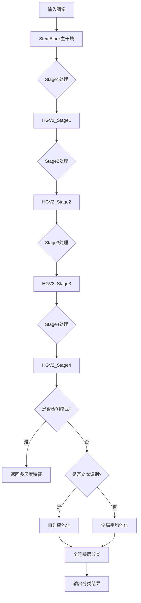

## 类结构

```
nn.Module (PyTorch基类)
├── IdentityBasedConv1x1
├── BNAndPad
├── DiverseBranchBlock
├── Identity
├── TheseusLayer (自定义基类)
│   ├── LearnableAffineBlock
│   ├── ConvBNAct
│   ├── LightConvBNAct
│   ├── StemBlock
│   ├── HGV2_Block
│   ├── HGV2_Stage
│   └── PPHGNetV2
├── PaddingSameAsPaddleMaxPool2d
├── PPHGNetV2_B4_Formula
└── PPHGNetV2_B6_Formula
```

## 全局变量及字段


### `DonutSwinModelOutput`
    
A dataclass-like structure for storing Swin model outputs, used as return type for PPHGNetV2_Formula models

类型：`class (imported from .rec_donut_swin)`
    


### `IdentityBasedConv1x1.id_tensor`
    
Identity matrix tensor used to preserve identity mapping in the convolution operation

类型：`torch.Tensor`
    


### `IdentityBasedConv1x1.weight`
    
Learnable convolution weights for the 1x1 identity-based convolution

类型：`torch.nn.Parameter (inherited from nn.Conv2d)`
    


### `BNAndPad.bn`
    
Batch normalization layer for normalizing feature maps

类型：`nn.BatchNorm2d`
    


### `BNAndPad.pad_pixels`
    
Number of pixels to pad around the feature map for border effect handling

类型：`int`
    


### `BNAndPad.last_conv_bias`
    
Optional bias from the last convolution layer to be added during padding calculation

类型：`torch.Tensor or None`
    


### `DiverseBranchBlock.is_repped`
    
Flag indicating whether the block has been re-parameterized into a single convolution

类型：`bool`
    


### `DiverseBranchBlock.nonlinear`
    
Nonlinear activation function applied after the diverse branch block outputs

类型：`nn.Module`
    


### `DiverseBranchBlock.kernel_size`
    
Size of the convolution kernel used in the block

类型：`int`
    


### `DiverseBranchBlock.out_channels`
    
Number of output channels produced by the block

类型：`int`
    


### `DiverseBranchBlock.groups`
    
Number of groups for grouped convolution in the block

类型：`int`
    


### `DiverseBranchBlock.dbb_reparam`
    
Re-parameterized single convolution that replaces multiple branches after re_parameterize() is called

类型：`nn.Conv2d or None`
    


### `DiverseBranchBlock.dbb_origin`
    
Original convolution-branch consisting of conv+bn for the main path

类型：`nn.Sequential`
    


### `DiverseBranchBlock.dbb_avg`
    
Average pooling branch with 1x1 conv and BNAndPad for multi-scale feature extraction

类型：`nn.Sequential`
    


### `DiverseBranchBlock.dbb_1x1`
    
Additional 1x1 convolution branch for residual-like connection when groups < out_channels

类型：`nn.Sequential or None`
    


### `DiverseBranchBlock.dbb_1x1_kxk`
    
Sequential block with 1x1 conv -> BNAndPad -> kxk conv for efficient feature transformation

类型：`nn.Sequential`
    


### `TheseusLayer.res_dict`
    
Dictionary storing intermediate results for layer output retrieval during forward pass

类型：`dict`
    


### `TheseusLayer.res_name`
    
Name identifier for the current layer's result in the res_dict

类型：`str`
    


### `TheseusLayer.pruner`
    
Placeholder for network pruning functionality (currently unused)

类型：`object or None`
    


### `TheseusLayer.quanter`
    
Placeholder for network quantization functionality (currently unused)

类型：`object or None`
    


### `TheseusLayer.hook_remove_helper`
    
Hook handle for removing registered forward hooks in TheseusLayer

类型：`torch.utils.hooks.RemovableHandle or None`
    


### `LearnableAffineBlock.scale`
    
Learnable scale parameter for affine transformation (y = scale * x + bias)

类型：`torch.nn.Parameter`
    


### `LearnableAffineBlock.bias`
    
Learnable bias parameter for affine transformation (y = scale * x + bias)

类型：`torch.nn.Parameter`
    


### `ConvBNAct.use_act`
    
Flag to determine whether to apply activation function after convolution and batch norm

类型：`bool`
    


### `ConvBNAct.use_lab`
    
Flag to determine whether to use LearnableAffineBlock (LAB) after activation

类型：`bool`
    


### `ConvBNAct.conv`
    
2D convolution layer for feature extraction from input tensor

类型：`nn.Conv2d`
    


### `ConvBNAct.bn`
    
Batch normalization layer for normalizing convolution outputs

类型：`nn.BatchNorm2d`
    


### `ConvBNAct.act`
    
ReLU activation function applied after batch normalization

类型：`nn.ReLU or None`
    


### `ConvBNAct.lab`
    
Learnable affine block for adaptive channel-wise scaling when use_lab is True

类型：`LearnableAffineBlock or None`
    


### `LightConvBNAct.conv1`
    
Point-wise (1x1) convolution for channel transformation in light conv block

类型：`ConvBNAct`
    


### `LightConvBNAct.conv2`
    
Depth-wise (kxk) convolution for spatial feature extraction in light conv block

类型：`ConvBNAct`
    


### `PaddingSameAsPaddleMaxPool2d.kernel_size`
    
Size of the kernel for max pooling operation

类型：`int`
    


### `PaddingSameAsPaddleMaxPool2d.stride`
    
Stride value for max pooling operation

类型：`int`
    


### `PaddingSameAsPaddleMaxPool2d.pool`
    
PyTorch MaxPool2d layer with ceil_mode=True for same output size as PaddlePaddle

类型：`nn.MaxPool2d`
    


### `StemBlock.stem1`
    
First stem convolution layer with 3x3 kernel and stride 2 for initial feature extraction

类型：`ConvBNAct`
    


### `StemBlock.stem2a`
    
Second stem layer (branch a) with 2x2 kernel for downsampling path

类型：`ConvBNAct`
    


### `StemBlock.stem2b`
    
Third stem layer (branch b) with 2x2 kernel to process stem2a output

类型：`ConvBNAct`
    


### `StemBlock.stem3`
    
Fourth stem layer that concatenates pool and stem2b outputs, applies 3x3 conv

类型：`ConvBNAct`
    


### `StemBlock.stem4`
    
Final stem layer with 1x1 conv to project to target output channels

类型：`ConvBNAct`
    


### `StemBlock.pool`
    
Pooling layer for creating the second branch in stem structure

类型：`PaddingSameAsPaddleMaxPool2d`
    


### `HGV2_Block.identity`
    
Flag to determine whether to add input as residual connection to output

类型：`bool`
    


### `HGV2_Block.layers`
    
List of ConvBNAct or LightConvBNAct layers for multi-layer feature extraction

类型：`nn.ModuleList`
    


### `HGV2_Block.aggregation_squeeze_conv`
    
1x1 convolution to squeeze concatenated features to half channels for bottleneck

类型：`ConvBNAct`
    


### `HGV2_Block.aggregation_excitation_conv`
    
1x1 convolution to excite/expand features back to output channels after squeeze

类型：`ConvBNAct`
    


### `HGV2_Stage.is_downsample`
    
Flag to determine whether to apply downsampling at the beginning of the stage

类型：`bool`
    


### `HGV2_Stage.downsample`
    
Depth-wise conv for spatial downsampling when is_downsample is True

类型：`ConvBNAct or None`
    


### `HGV2_Stage.blocks`
    
Sequential container of HGV2_Block layers forming the stage

类型：`nn.Sequential`
    


### `PPHGNetV2.det`
    
Flag for detection mode; when True, returns multi-scale feature maps instead of classification

类型：`bool`
    


### `PPHGNetV2.text_rec`
    
Flag for text recognition mode; applies specific pooling strategy for sequence output

类型：`bool`
    


### `PPHGNetV2.use_lab`
    
Flag to enable LearnableAffineBlock (LAB) in stem and stage layers

类型：`bool`
    


### `PPHGNetV2.use_last_conv`
    
Flag to determine whether to use final 1x1 conv for channel expansion before classifier

类型：`bool`
    


### `PPHGNetV2.class_expand`
    
Number of channels for the last 1x1 convolution expansion layer

类型：`int`
    


### `PPHGNetV2.class_num`
    
Number of output classes for the classification head

类型：`int`
    


### `PPHGNetV2.out_indices`
    
List of stage indices from which to extract feature maps for detection head

类型：`list[int]`
    


### `PPHGNetV2.out_channels`
    
Output channels of each stage (for detection) or final stage (for classification)

类型：`list[int] or int`
    


### `PPHGNetV2.stem`
    
Stem block for initial feature extraction from input image

类型：`StemBlock`
    


### `PPHGNetV2.stages`
    
List of HGV2_Stage modules forming the main backbone feature extraction

类型：`nn.ModuleList`
    


### `PPHGNetV2.avg_pool`
    
Adaptive average pooling to flatten spatial dimensions to 1x1

类型：`nn.AdaptiveAvgPool2d`
    


### `PPHGNetV2.last_conv`
    
Final 1x1 conv for channel expansion before classifier when use_last_conv is True

类型：`nn.Conv2d or None`
    


### `PPHGNetV2.act`
    
Activation function applied after last_conv

类型：`nn.ReLU or None`
    


### `PPHGNetV2.lab`
    
Learnable affine block after activation when use_lab and use_last_conv are both True

类型：`LearnableAffineBlock or None`
    


### `PPHGNetV2.dropout`
    
Dropout layer for regularization before the final classifier

类型：`nn.Dropout`
    


### `PPHGNetV2.flatten`
    
Flatten layer to reshape tensor for linear classifier

类型：`nn.Flatten`
    


### `PPHGNetV2.fc`
    
Final fully connected layer for classification into class_num categories

类型：`nn.Linear or None`
    


### `PPHGNetV2_B4_Formula.in_channels`
    
Number of input channels (default 3 for RGB images, can be 1 for grayscale)

类型：`int`
    


### `PPHGNetV2_B4_Formula.out_channels`
    
Number of output channels from the backbone (2048 for B4 model)

类型：`int`
    


### `PPHGNetV2_B4_Formula.pphgnet_b4`
    
PPHGNetV2 B4 backbone for feature extraction in formula recognition model

类型：`PPHGNetV2`
    


### `PPHGNetV2_B6_Formula.in_channels`
    
Number of input channels (default 3 for RGB images, can be 1 for grayscale)

类型：`int`
    


### `PPHGNetV2_B6_Formula.out_channels`
    
Number of output channels from the backbone (2048 for B6 model)

类型：`int`
    


### `PPHGNetV2_B6_Formula.pphgnet_b6`
    
PPHGNetV2 B6 backbone for feature extraction in formula recognition model

类型：`PPHGNetV2`
    
    

## 全局函数及方法


### `conv_bn`

该函数是一个全局工具函数，用于创建一个由卷积层（Conv2d）和批归一化层（BatchNorm2d）串联组成的 `nn.Sequential` 模块，常用于卷积神经网络中常见的 Conv+BN 组合结构。

参数：

- `in_channels`：`int`，输入特征图的通道数
- `out_channels`：`int`，输出特征图的通道数
- `kernel_size`：`int`，卷积核的尺寸大小
- `stride`：`int`，卷积步长，默认为 1
- `padding`：`int`，输入特征图的填充像素数，默认为 0
- `dilation`：`int`，卷积核的膨胀系数，默认为 1
- `groups`：`int`，卷积核的分组数，默认为 1（表示标准卷积）
- `padding_mode`：`str`，填充模式，默认为 "zeros"（支持 'zeros', 'reflect', 'replicate' 或 'circular'）

返回值：`nn.Sequential`，返回一个包含卷积层和批归一化层的顺序容器，其中第一个子层为卷积层（名为 "conv"），第二个子层为批归一化层（名为 "bn"）

#### 流程图

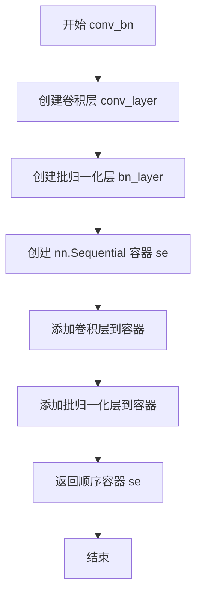

#### 带注释源码

```python
def conv_bn(
    in_channels,      # 输入通道数
    out_channels,     # 输出通道数
    kernel_size,      # 卷积核大小
    stride=1,         # 卷积步长，默认为1
    padding=0,        # 填充像素数，默认为0
    dilation=1,       # 膨胀系数，默认为1
    groups=1,         # 分组卷积的组数，默认为1
    padding_mode="zeros",  # 填充模式，默认为'zeros'
):
    """
    创建一个卷积层后接批归一化层的组合模块。
    
    参数:
        in_channels (int): 输入通道数
        out_channels (int): 输出通道数
        kernel_size (int): 卷积核尺寸
        stride (int): 卷积步长，默认1
        padding (int): 填充像素，默认0
        dilation (int): 膨胀系数，默认1
        groups (int): 分组数，默认1
        padding_mode (str): 填充模式，默认'zeros'
    
    返回:
        nn.Sequential: 包含Conv2d和BatchNorm2d的顺序容器
    """
    # 创建卷积层，设置偏置为False（因为后续有BatchNorm）
    conv_layer = nn.Conv2d(
        in_channels=in_channels,
        out_channels=out_channels,
        kernel_size=kernel_size,
        stride=stride,
        padding=padding,
        dilation=dilation,
        groups=groups,
        bias_attr=False,      # 不使用偏置，配合BatchNorm使用
        padding_mode=padding_mode,
    )
    
    # 创建批归一化层，用于稳定训练和加速收敛
    bn_layer = nn.BatchNorm2D(num_features=out_channels)
    
    # 创建顺序容器，用于组合卷积和批归一化
    se = nn.Sequential()
    
    # 将卷积层添加到容器中，命名为"conv"
    se.add_sublayer("conv", conv_layer)
    
    # 将批归一化层添加到容器中，命名为"bn"
    se.add_sublayer("bn", bn_layer)
    
    # 返回组合后的模块
    return se
```


### `transI_fusebn`

该函数用于将卷积层的权重与紧随其后的批归一化（BatchNorm）层进行融合，通过将BN层的参数融入卷积核和偏置中，从而在推理时消除BN层，实现模型加速。这是卷积神经网络中常见的模型简化和部署优化技术。

参数：

- `kernel`：`torch.Tensor`，卷积层的权重张量，形状为 [out_channels, in_channels, kH, kW]
- `bn`：`nn.BatchNorm2d`，紧随卷积层之后的批归一化层，包含 weight（gamma）、bias（beta）、_mean、_variance、_epsilon 等属性

返回值：`Tuple[torch.Tensor, torch.Tensor]`，融合后的卷积核和偏置组成的元组

#### 流程图

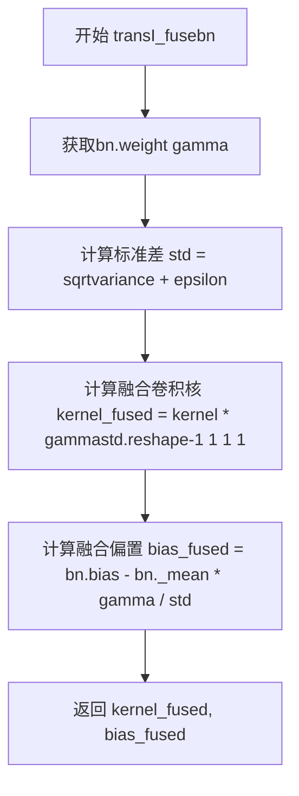

#### 带注释源码

```
def transI_fusebn(kernel, bn):
    """
    将卷积核与批归一化层融合，消除推理时的BN层以加速模型
    
    参数:
        kernel: 卷积层的权重张量
        bn: 批归一化层
    返回:
        融合后的卷积核和偏置
    """
    # 获取BatchNorm的gamma参数（缩放因子）
    gamma = bn.weight
    
    # 计算标准差：sqrt(variance + epsilon)，防止除零
    std = (bn._variance + bn._epsilon).sqrt()
    
    # 融合卷积核：将卷积核乘以gamma/std的缩放因子
    # reshape([-1, 1, 1, 1])将gamma/std从[out_channels]扩展到[out_channels, 1, 1, 1]
    # 以便与[out_channels, in_channels, kH, kW]的卷积核进行元素级乘法
    kernel_fused = kernel * ((gamma / std).reshape([-1, 1, 1, 1]))
    
    # 融合偏置：beta - mu * gamma / std
    # 其中mu是BatchNorm的均值，beta是BN的偏置
    bias_fused = bn.bias - bn._mean * gamma / std
    
    # 返回融合后的卷积核和偏置
    return (
        kernel_fused,
        bias_fused,
    )
```


### `transII_addbranch`

该函数用于在DiverseBranchBlock重参数化过程中，对多个卷积核和偏置进行元素级求和。它接收两组参数（核和偏置），并将它们分别累加，生成合并后的卷积核和偏置，实现多分支结构的单分支等价转换。

参数：

- `kernels`：`Tuple[Tensor, ...]`，包含多个要进行求和的卷积核张量（通常为4D张量）
- `biases`：`Tuple[Tensor, ...]`，包含多个要进行求和的偏置张量（通常为1D张量）

返回值：`Tuple[Tensor, Tensor]`，返回两个张量——第一个是所有卷积核求和后的结果，第二个是所有偏置求和后的结果

#### 流程图

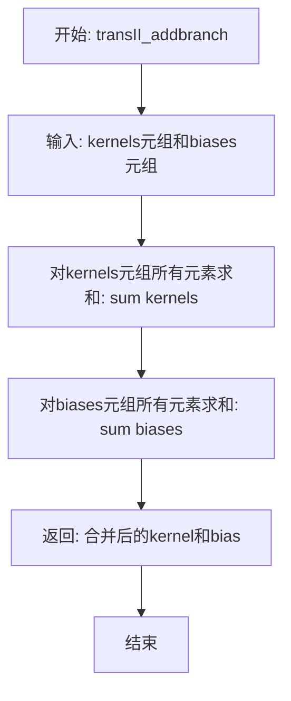

#### 带注释源码

```python
def transII_addbranch(kernels, biases):
    """
    执行第二阶段的分支合并操作：对多个卷积核和偏置进行求和。
    
    这是DiverseBranchBlock重参数化（re-parameterization）的关键步骤之一，
    目的是将原始的多分支结构（origin、1x1、1x1_kxk、avg等分支）合并为
    单一的等效卷积核和偏置。
    
    参数:
        kernels: 多个卷积核组成的元组/序列，通常为4D张量 (out_channels, in_channels, kH, kW)
        biases: 多个偏置组成的元组/序列，通常为1D张量 (out_channels,)
    
    返回:
        (合并后的卷积核, 合并后的偏置) 组成的元组
    """
    return sum(kernels), sum(biases)
```


### `transIII_1x1_kxk`

该函数实现了一个卷积核融合变换（Transformation III），用于在 DiverseBranchBlock 的等效卷积核重参数化过程中，将两个 1x1 卷积核（及其偏置）合并为一个等效的卷积核。这是 DBB（ Diverse Branch Block）重参数化技术的核心组成部分，通过数学等价变换将多分支结构融合为单分支卷积。

参数：

- `k1`：`torch.Tensor`，第一个卷积核，形状为 `[out_channels, in_channels, 1, 1]`（1x1 卷积核）
- `b1`：`torch.Tensor`，第一个卷积核的偏置，形状为 `[out_channels]`
- `k2`：`torch.Tensor`，第二个卷积核，形状为 `[out_channels, in_channels, 1, 1]`（1x1 卷积核）
- `b2`：`torch.Tensor`，第二个卷积核的偏置，形状为 `[out_channels]`
- `groups`：`int`，分组卷积的组数，用于控制卷积核的分组融合方式

返回值：`Tuple[torch.Tensor, torch.Tensor]`，返回融合后的卷积核 `k` 和偏置 `b_hat + b2`

#### 流程图

```mermaid
flowchart TD
    A[开始: transIII_1x1_kxk] --> B{groups == 1?}
    B -->|Yes| C[单组卷积融合]
    B -->|No| D[分组卷积融合]
    
    C --> C1[k = F.conv2d k2, k1.transpose[1,0,2,3]]
    C1 --> C2[b_hat = k2 * b1.reshape[1,-1,1,1]].sum[1,2,3]
    C2 --> G[返回 k, b_hat + b2]
    
    D --> D1[初始化空列表: k_slices, b_slices]
    D1 --> D2[计算k1和k2每组宽度]
    D2 --> D3[遍历每个group]
    D3 --> D4[提取k1_T_slice和k2_slice]
    D4 --> D5[k_slices.append F.conv2d k2_slice, k1_T_slice]
    D5 --> D6[计算b_slices]
    D6 --> D7{group < groups?}
    D7 -->|Yes| D3
    D7 -->|No| D8[调用transIV_depthconcat合并结果]
    D8 --> G
```

#### 带注释源码

```python
def transIII_1x1_kxk(k1, b1, k2, b2, groups):
    """
    执行 1x1 x 1x1 卷积核融合变换（Transformation III）。
    将两个并联的 1x1 卷积分支合并为单个卷积核。
    这在 DiverseBranchBlock 的重参数化过程中用于合并 dbb_1x1_kxk 子分支。

    参数:
        k1: 第一个1x1卷积的卷积核, shape: [out_channels, in_channels, 1, 1]
        b1: 第一个1x1卷积的偏置, shape: [out_channels]
        k2: 第二个1x1卷积的卷积核, shape: [out_channels, in_channels, 1, 1]
        b2: 第二个1x1卷积的偏置, shape: [out_channels]
        groups: 分组卷积的组数

    返回:
        k: 融合后的等效卷积核
        b_hat + b2: 融合后的等效偏置
    """
    if groups == 1:
        # 单组情况：直接进行卷积运算
        # 公式: k = conv2d(k2, k1^T)
        # 这相当于将两个1x1卷积核进行卷积运算得到融合核
        k = F.conv2d(k2, k1.transpose([1, 0, 2, 3]))
        
        # 公式: b_hat = sum(k2 * b1)
        # 将偏置 b1 通过加权求和融入到融合后的偏置中
        # reshape将b1从[out_channels]扩展为[1, out_channels, 1, 1]以便广播
        b_hat = (k2 * b1.reshape([1, -1, 1, 1])).sum((1, 2, 3))
    else:
        # 分组卷积情况：需要按组分别处理然后拼接
        k_slices = []    # 存储每组融合后的卷积核
        b_slices = []    # 存储每组融合后的偏置
        
        # 对第一个核进行转置以进行卷积运算
        k1_T = k1.transpose([1, 0, 2, 3])
        
        # 计算每组的通道宽度
        k1_group_width = k1.shape[0] // groups
        k2_group_width = k2.shape[0] // groups
        
        # 遍历每个分组进行处理
        for g in range(groups):
            # 提取当前组的 k1 转置后的切片
            k1_T_slice = k1_T[:, g * k1_group_width : (g + 1) * k1_group_width, :, :]
            # 提取当前组的 k2 切片
            k2_slice = k2[g * k2_group_width : (g + 1) * k2_group_width, :, :, :]
            
            # 对当前组执行卷积核融合
            k_slices.append(F.conv2d(k2_slice, k1_T_slice))
            
            # 计算当前组的偏置融合
            # 从 b1 中提取当前组的偏置并reshape后与k2切片相乘求和
            b_slices.append(
                (
                    k2_slice
                    * b1[g * k1_group_width : (g + 1) * k1_group_width].reshape(
                        [1, -1, 1, 1]
                    )
                ).sum((1, 2, 3))
            )
        
        # 调用 transIV_depthconcat 将分组结果在通道维度拼接
        k, b_hat = transIV_depthconcat(k_slices, b_slices)
    
    # 返回融合后的卷积核和融合后的偏置加上第二个分支的偏置
    return k, b_hat + b2
```


### `transIV_depthconcat`

该函数是用于在深度方向上拼接多个卷积核和偏置的辅助函数，主要在 DiverseBranchBlock 的重参数化过程中，将分组卷积的多个卷积核和偏置分别沿通道维度拼接成一个完整的卷积核和偏置。

参数：

- `kernels`：`List[torch.Tensor]`，待拼接的卷积核列表，每个元素为 4D 张量 (out_channels, in_channels/groups, kH, kW)
- `biases`：`List[torch.Tensor]`，待拼接的偏置列表，每个元素为 1D 张量 (out_channels,)

返回值：`Tuple[torch.Tensor, torch.Tensor]`，返回拼接后的卷积核和偏置，其中卷积核按通道维度(dim=0)拼接，偏置按元素拼接

#### 流程图

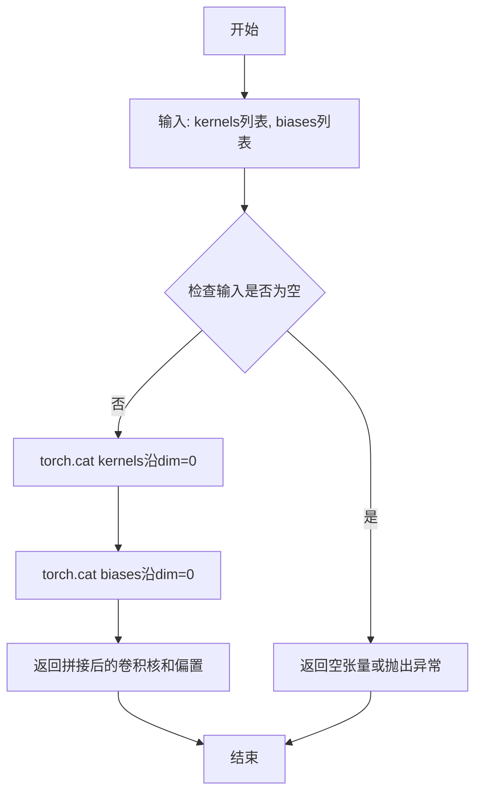

#### 带注释源码

```python
def transIV_depthconcat(kernels, biases):
    """
    深度方向拼接多个卷积核和偏置。
    
    该变换函数用于在分组卷积场景下，将多个分组对应的卷积核和偏置
    拼接成完整的卷积核和偏置。在 DiverseBranchBlock 的重参数化过程中，
    当存在多个分支（如 1x1 卷积分支和 kxk 卷积分支）时，需要将它们
    的参数进行拼接以得到最终的等效卷积核。
    
    参数:
        kernels (List[torch.Tensor]): 卷积核列表，每个元素为4D张量
                                     (out_channels, in_channels/groups, kH, kW)
        biases (List[torch.Tensor]): 偏置列表，每个元素为1D张量 (out_channels,)
    
    返回:
        Tuple[torch.Tensor, torch.Tensor]: 拼接后的卷积核和偏置
    """
    # 使用 torch.cat 将多个卷积核沿输出通道维度(dim=0)拼接
    # 拼接后的卷积核形状: (sum(out_channels), in_channels/groups, kH, kW)
    concatenated_kernels = torch.cat(kernels, dim=0)
    
    # 使用 torch.cat 将多个偏置沿元素方向拼接
    # 拼接后的偏置形状: (sum(out_channels),)
    concatenated_biases = torch.cat(biases)
    
    return concatenated_kernels, concatenated_biases
```


### `transV_avg`

该函数用于创建一个平均池化（Average Pooling）等效的卷积核，根据通道数、卷积核大小和分组数生成特定的卷积核权重，用于在 `DiverseBranchBlock` 中实现平均池化操作。

参数：

- `channels`：`int`，输出通道数
- `kernel_size`：`int`，卷积核的空间尺寸
- `groups`：`int`，分组卷积的组数

返回值：`torch.Tensor`，形状为 `(channels, input_dim, kernel_size, kernel_size)` 的四维张量，表示生成的平均池化核

#### 流程图

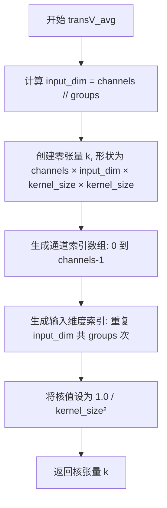

#### 带注释源码

```python
def transV_avg(channels, kernel_size, groups):
    """
    创建一个平均池化等效的卷积核
    
    参数:
        channels: int, 输出通道数
        kernel_size: int, 卷积核的空间尺寸
        groups: int, 分组卷积的组数
    
    返回:
        torch.Tensor, 形状为 (channels, input_dim, kernel_size, kernel_size) 的平均池化核
    """
    # 计算每个分组的输入维度
    input_dim = channels // groups
    
    # 创建一个形状为 (channels, input_dim, kernel_size, kernel_size) 的零张量
    k = torch.zeros((channels, input_dim, kernel_size, kernel_size))
    
    # 生成通道索引: [0, 1, 2, ..., channels-1]
    channel_indices = np.arange(channels)
    
    # 生成输入维度索引: 重复 input_dim 共 groups 次
    # 例如: input_dim=3, groups=2 -> [0, 1, 2, 0, 1, 2]
    input_indices = np.tile(np.arange(input_dim), groups)
    
    # 将对应位置的权重设置为 1.0 / kernel_size^2
    # 这实现了平均池化的功能: 每个位置取平均值
    k[channel_indices, input_indices, :, :] = (1.0 / kernel_size**2)
    
    return k
```


### `transVI_multiscale`

该函数用于将卷积核填充到目标尺寸，通过在高度和宽度维度上均匀地添加 padding 来实现多尺度卷积核的归一化，是 DiverseBranchBlock 中权重重参数化的关键转换函数之一。

参数：

- `kernel`：`torch.Tensor`，输入的卷积核张量
- `target_kernel_size`：`int`，目标卷积核的尺寸大小

返回值：`torch.Tensor`，填充后的卷积核张量

#### 流程图

```mermaid
flowchart TD
    A[开始: 输入 kernel 和 target_kernel_size] --> B[计算高度方向填充像素数: H_pixels_to_pad = (target_kernel_size - kernel.shape[2]) // 2]
    B --> C[计算宽度方向填充像素数: W_pixels_to_pad = (target_kernel_size - kernel.shape[3]) // 2]
    C --> D[使用 F.pad 对 kernel 进行填充: [H_pixels_to_pad, H_pixels_to_pad, W_pixels_to_pad, W_pixels_to_pad]]
    D --> E[返回填充后的 kernel]
```

#### 带注释源码

```
def transVI_multiscale(kernel, target_kernel_size):
    """
    将卷积核填充到目标尺寸，实现多尺度卷积核归一化。
    
    该函数是DiverseBranchBlock重参数化过程中的转换函数之一，
    用于将1x1卷积核扩展到与目标卷积核相同的尺寸，以便进行后续的权重融合。
    
    参数:
        kernel: 输入的卷积核张量，形状为 [out_channels, in_channels/groups, H, W]
        target_kernel_size: 目标卷积核的尺寸（正方形）
    
    返回:
        填充后的卷积核张量，形状为 [out_channels, in_channels/groups, target_kernel_size, target_kernel_size]
    """
    
    # 计算高度方向需要填充的像素数
    # 公式: (目标尺寸 - 当前尺寸) // 2，保证中心对称填充
    H_pixels_to_pad = (target_kernel_size - kernel.shape[2]) // 2
    
    # 计算宽度方向需要填充的像素数
    W_pixels_to_pad = (target_kernel_size - kernel.shape[3]) // 2
    
    # 使用F.pad进行填充
    # padding格式为[左, 右, 上, 下]
    # 对于H和W维度都采用相同的填充像素数，实现中心对称填充
    return F.pad(
        kernel, 
        [H_pixels_to_pad, H_pixels_to_pad, W_pixels_to_pad, W_pixels_to_pad]
    )
```


### `save_sub_res_hook`

该函数是一个全局钩子函数，用于在模型前向传播过程中捕获指定层的输出并将其保存到该层的 `res_dict` 字典中，以便后续从模型中提取指定的中间结果。

参数：

- `layer`：`nn.Module`，触发钩子的层对象，用于访问该层的 `res_dict` 属性和 `res_name` 属性
- `input`：`tuple` 或 `torch.Tensor`，层前向传播的输入，通常是张量或张量元组
- `output`：`torch.Tensor`，层前向传播的输出，即需要保存的张量结果

返回值：`None`，该函数无返回值，仅执行字典赋值操作

#### 流程图

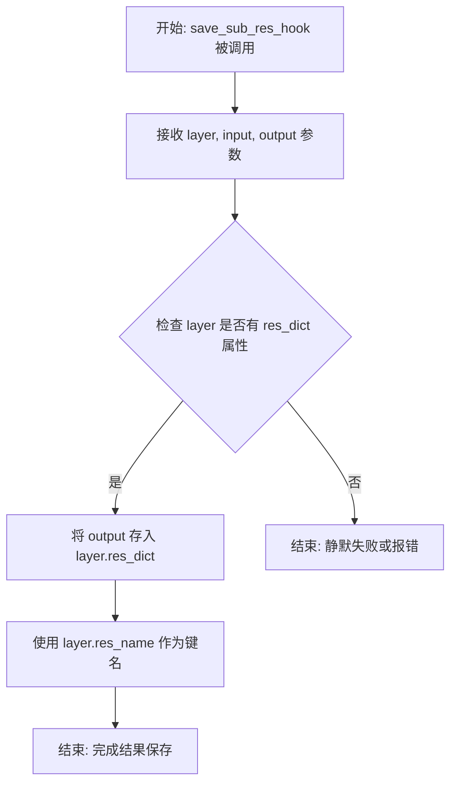

#### 带注释源码

```python
def save_sub_res_hook(layer, input, output):
    """
    保存子层结果的钩子函数。
    
    这是一个 PyTorch forward post-hook，用于在模型前向传播时
    捕获指定层的输出并存储到该层的 res_dict 字典中。
    
    参数:
        layer: 触发钩子的层对象，包含 res_dict 和 res_name 属性
        input: 层的前向输入，通常为张量或张量元组
        output: 层的前向输出，需要保存的张量
    
    返回:
        无返回值，修改 layer.res_dict 字典
    """
    # 将该层的输出保存到层的 res_dict 字典中
    # 键名为 layer.res_name，值为该层的输出 output
    layer.res_dict[layer.res_name] = output
```


### `set_identity`

该函数用于将指定的层及其后续层设置为 `Identity` 层，以实现模型的部分冻结或截断功能。

参数：
- `parent_layer`：`nn.Module`，父层，即目标层的上一层。
- `layer_name`：`str`，目标层的名称。
- `layer_index_list`：`str`，可选，目标层在父层中的索引列表，默认为 `None`。

返回值：`bool`，表示是否成功将目标层及其后续层设置为 `Identity`。

#### 流程图

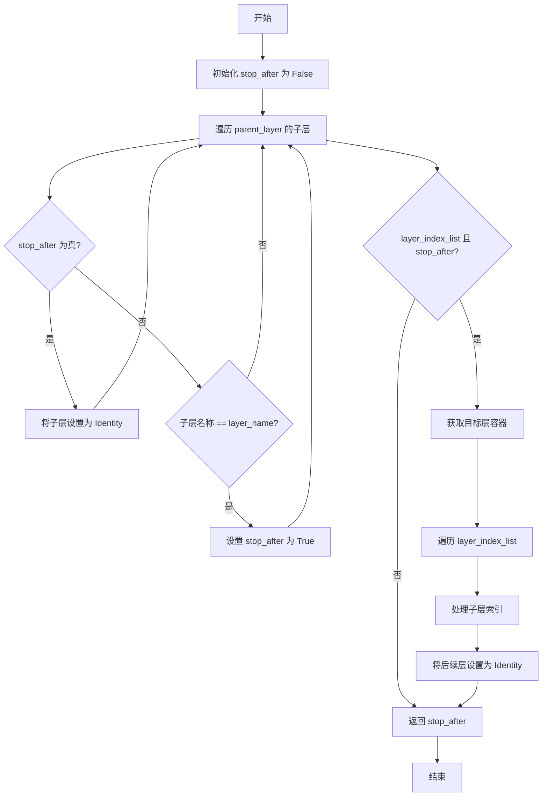

#### 带注释源码

```python
def set_identity(
    parent_layer: nn.Module, layer_name: str, layer_index_list: str = None
) -> bool:
    """set the layer specified by layer_name and layer_index_list to Identity.

    Args:
        parent_layer (nn.Module): The parent layer of target layer specified by layer_name and layer_index_list.
        layer_name (str): The name of target layer to be set to Identity.
        layer_index_list (str, optional): The index of target layer to be set to Identity in parent_layer. Defaults to None.

    Returns:
        bool: True if successfully, False otherwise.
    """

    stop_after = False  # 标记是否停止处理后续层
    # 遍历父层的所有子层
    for sub_layer_name in parent_layer._sub_layers:
        if stop_after:  # 如果已找到目标层，则将后续层设置为 Identity
            parent_layer._sub_layers[sub_layer_name] = Identity()
            continue
        if sub_layer_name == layer_name:  # 找到目标层
            stop_after = True

    # 如果存在索引列表且已找到目标层，则进一步处理索引
    if layer_index_list and stop_after:
        layer_container = parent_layer._sub_layers[layer_name]
        for num, layer_index in enumerate(layer_index_list):
            stop_after = False
            # 逐层进入索引指定的子层
            for i in range(num):
                layer_container = layer_container[layer_index_list[i]]
            # 处理子层中的后续层
            for sub_layer_index in layer_container._sub_layers:
                if stop_after:
                    parent_layer._sub_layers[layer_name][sub_layer_index] = Identity()
                    continue
                if layer_index == sub_layer_index:
                    stop_after = True

    return stop_after
```


### `parse_pattern_str`

该函数用于解析字符串类型的层级模式（pattern），将其转换为层级对象的列表，以便在神经网络模型中定位和访问特定的子层。

参数：

- `pattern`：`str`，描述层级的模式字符串，格式如 `"layer1.sub_layer[0].conv"`
- `parent_layer`：`nn.Module`，模式相对应的根层级

返回值：`Union[None, List[Dict[str, Union[nn.Module, str, None]]]]`，解析失败返回 `None`，成功时返回包含每层信息的字典列表，每个字典包含 `layer`（层级对象）、`name`（层级名称）和 `index_list`（索引列表）

#### 流程图

```mermaid
flowchart TD
    A[开始解析 pattern] --> B{pattern 是否为空}
    B -->|是| C[返回 None]
    B -->|否| D[按 '.' 分割 pattern]
    D --> E{pattern_list 是否为空}
    E -->|是| F[返回 layer_list]
    E -->|否| G{当前元素包含 '[' 吗}
    G -->|是| H[提取层级名称和索引列表]
    G -->|否| I[设置层级名称为当前元素, 索引列表为 None]
    H --> J[获取目标层级]
    I --> J
    J --> K{目标层级是否存在}
    K -->|否| L[返回 None]
    K -->|是| M{索引列表是否为空}
    M -->|否| N[遍历索引列表]
    M -->|是| O[将层级信息添加到 layer_list]
    N --> P{索引是否越界}
    P -->|是| Q[返回 None]
    P -->|否| R[更新目标层级]
    R --> O
    O --> S[更新 parent_layer 为目标层级]
    S --> E
```

#### 带注释源码

```python
def parse_pattern_str(
    pattern: str, parent_layer: nn.Module
) -> Union[None, List[Dict[str, Union[nn.Module, str, None]]]]:
    """parse the string type pattern.

    Args:
        pattern (str): The pattern to describe layer.
        parent_layer (nn.Module): The root layer relative to the pattern.

    Returns:
        Union[None, List[Dict[str, Union[nn.Module, str, None]]]]: None if failed. If successfully, the members are layers parsed in order:
                                                                [
                                                                    {"layer": first layer, "name": first layer's name parsed, "index": first layer's index parsed if exist},
                                                                    {"layer": second layer, "name": second layer's name parsed, "index": second layer's index parsed if exist},
                                                                    ...
                                                                ]
    """

    # 步骤1: 按 '.' 分割模式字符串
    pattern_list = pattern.split(".")
    
    # 步骤2: 检查分割后的列表是否为空
    if not pattern_list:
        msg = f"The pattern('{pattern}') is illegal. Please check and retry."
        return None

    # 步骤3: 初始化结果列表
    layer_list = []
    
    # 步骤4: 循环遍历模式列表的每个元素
    while len(pattern_list) > 0:
        # 步骤4.1: 检查是否包含索引标记 '['
        if "[" in pattern_list[0]:
            # 提取层级名称（'[' 之前的部分）
            target_layer_name = pattern_list[0].split("[")[0]
            # 提取所有索引（'[' 和 ']' 之间的部分）
            target_layer_index_list = list(
                index.split("]")[0] for index in pattern_list[0].split("[")[1:]
            )
        else:
            # 没有索引，直接使用整个字符串作为层级名称
            target_layer_name = pattern_list[0]
            target_layer_index_list = None

        # 步骤4.2: 使用 getattr 获取目标层级对象
        target_layer = getattr(parent_layer, target_layer_name, None)

        # 步骤4.3: 检查目标层级是否存在
        if target_layer is None:
            msg = f"Not found layer named('{target_layer_name}') specified in pattern('{pattern}')."
            return None

        # 步骤4.4: 如果存在索引列表，遍历并获取实际的层级对象
        if target_layer_index_list:
            for target_layer_index in target_layer_index_list:
                # 检查索引是否越界
                if int(target_layer_index) < 0 or int(target_layer_index) >= len(
                    target_layer
                ):
                    msg = f"Not found layer by index('{target_layer_index}') specified in pattern('{pattern}'). The index should < {len(target_layer)} and > 0."
                    return None
                # 通过索引获取子层级
                target_layer = target_layer[target_layer_index]

        # 步骤4.5: 将当前层级的信息添加到结果列表
        layer_list.append(
            {
                "layer": target_layer,
                "name": target_layer_name,
                "index_list": target_layer_index_list,
            }
        )

        # 步骤4.6: 更新 parent_layer 为当前目标层级，继续解析下一个模式元素
        pattern_list = pattern_list[1:]
        parent_layer = target_layer

    # 步骤5: 返回解析后的层级列表
    return layer_list
```


### `PPHGNetV2_B0`

该函数是 PPHGNetV2 系列的 B0 变体构建函数，通过预定义的 stage_config 配置创建特定通道数和层数的 PPHGNetV2 神经网络模型，并支持预训练权重加载。

参数：

- `pretrained`：`bool` 或 `str`，如果为 `True` 则加载预训练参数，`False` 则不加载；如果为字符串，则表示预训练模型的路径。
- `use_ssld`：`bool`，当 pretrained 为 True 时，是否使用 ssld 预训练模型。
- `**kwargs`：可变关键字参数，用于传递其他配置参数到 PPHGNetV2 构造函数。

返回值：`nn.Module`，返回具体配置的 PPHGNetV2_B0 模型实例。

#### 流程图

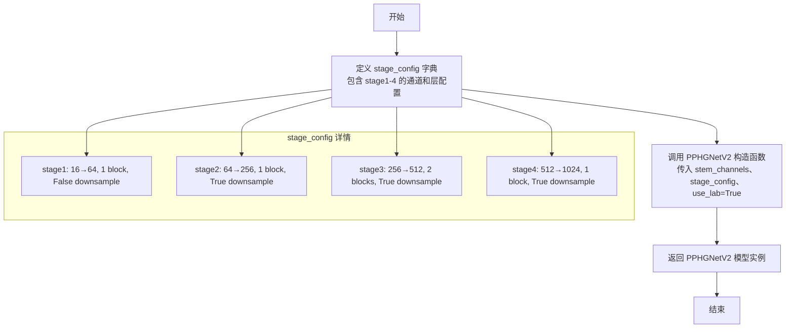

#### 带注释源码

```python
def PPHGNetV2_B0(pretrained=False, use_ssld=False, **kwargs):
    """
    PPHGNetV2_B0 模型构建函数
    
    Args:
        pretrained (bool/str): 如果为 True 则加载预训练参数，False 则不加载。
                              如果为字符串，则表示预训练模型的路径。
        use_ssld (bool): 当 pretrained 为 True 时，是否使用 ssld 预训练模型。
    
    Returns:
        model: nn.Module. 返回具体配置的 PPHGNetV2_B0 模型实例。
    """
    # 定义各阶段的配置参数
    # 格式: [in_channels, mid_channels, out_channels, num_blocks, is_downsample, light_block, kernel_size, layer_num]
    stage_config = {
        # stage1: 初始阶段，16通道输入，16中间通道，64输出通道，1个block，不下采样
        "stage1": [16, 16, 64, 1, False, False, 3, 3],
        # stage2: 下采样阶段，64→256，1个block，使用下采样
        "stage2": [64, 32, 256, 1, True, False, 3, 3],
        # stage3: 256→512，2个blocks，使用下采样和轻量级块
        "stage3": [256, 64, 512, 2, True, True, 5, 3],
        # stage4: 512→1024，1个block，使用下采样和轻量级块
        "stage4": [512, 128, 1024, 1, True, True, 5, 3],
    }

    # 创建 PPHGNetV2 模型
    # stem_channels: [输入通道, 中间通道, 输出通道] = [3, 16, 16]
    # use_lab: 启用 LearnableAffineBlock
    model = PPHGNetV2(
        stem_channels=[3, 16, 16],  # 初始stem层的通道配置
        stage_config=stage_config,   # 各阶段的详细配置
        use_lab=True,                 # 启用LAB(Learnable Affine Block)机制
        **kwargs                      # 传递其他可选参数
    )
    
    return model  # 返回构建好的模型实例
```


### `PPHGNetV2_B1`

这是 PPHGNetV2 系列的 B1 变体构建函数，用于创建特定配置的 PP-HGNetV2 神经网络模型。该函数通过预定义的 stage_config 配置来构建包含 stem、多个 stage（阶段）以及分类头的完整网络结构，支持图像分类任务。

参数：

- `pretrained`：`bool/str`，如果为 `True` 则加载预训练参数，`False` 则不加载；如果为字符串，则表示预训练模型的路径。
- `use_ssld`：`bool`，当 `pretrained` 为 `True` 时，是否使用 SSLD 预训练模型。
- `**kwargs`：可选关键字参数，用于传递给 `PPHGNetV2` 构造函数。

返回值：`nn.Module`，具体的 PPHGNetV2_B1 模型实例。

#### 流程图

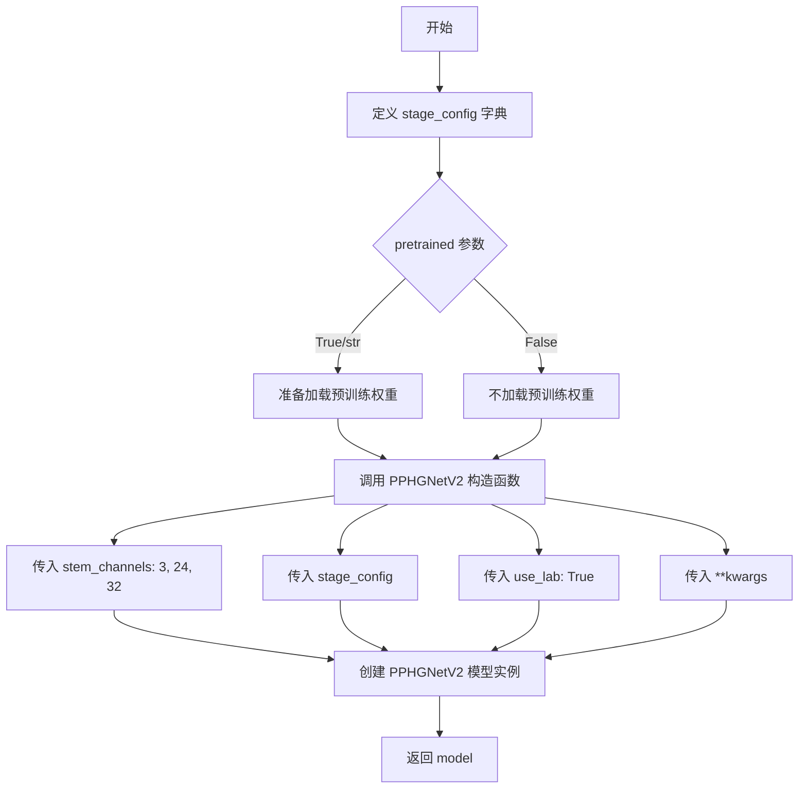

#### 带注释源码

```
def PPHGNetV2_B1(pretrained=False, use_ssld=False, **kwargs):
    """
    PPHGNetV2_B1
    
    PPHGNetV2 系列的 B1 变体，是一种高效的骨干网络模型。
    通过预定义的 stage_config 配置网络结构，包含 4 个阶段（stage），
    每个阶段有不同数量的通道数和块数。
    
    Args:
        pretrained (bool/str): 如果为 True 则加载预训练参数，False 则不加载。
                              如果为字符串，则表示预训练模型的路径。
        use_ssld (bool):      当 pretrained 为 True 时，是否使用 SSLD 预训练模型。
        **kwargs:             其他可选参数，会传递给 PPHGNetV2 构造函数。
    
    Returns:
        model: nn.Module.    返回具体的 PPHGNetV2_B1 模型实例。
    """
    
    # 定义网络的阶段配置
    # 每个阶段的配置格式: [in_channels, mid_channels, out_channels, 
    #                     num_blocks, is_downsample, light_block, 
    #                     kernel_size, layer_num]
    stage_config = {
        # stage1: 初始阶段，输入通道32，输出通道64，无下采样，使用标准卷积块
        "stage1": [32, 32, 64, 1, False, False, 3, 3],
        # stage2: 第一次下采样，输入64，输出256，使用标准卷积块
        "stage2": [64, 48, 256, 1, True, False, 3, 3],
        # stage3: 第二次下采样，输入256，输出512，使用轻量级卷积块，核大小为5
        "stage3": [256, 96, 512, 2, True, True, 5, 3],
        # stage4: 第三次下采样，输入512，输出1024，使用轻量级卷积块，核大小为5
        "stage4": [512, 192, 1024, 1, True, True, 5, 3],
    }

    # 创建 PPHGNetV2 模型实例
    # stem_channels: [输入通道数, 中间通道数, 输出通道数] = [3, 24, 32]
    # use_lab: 启用 LearnableAffineBlock (LAB) 增强
    model = PPHGNetV2(
        stem_channels=[3, 24, 32],  # 初始 stem 层的通道配置
        stage_config=stage_config,  # 网络主体各阶段的配置
        use_lab=True,               # 启用 LAB 增强机制
        **kwargs                    # 传递其他可选参数
    )
    
    return model  # 返回构建好的模型实例
```


### `PPHGNetV2_B2`

PPHGNetV2_B2是一个用于构建PP-HGNetV2 B2变体模型的工厂函数，根据预定义的stage配置（包括各阶段的输入/输出通道数、块数量、下采样设置等）实例化一个完整的PPHGNetV2神经网络模型。

参数：

- `pretrained`：`bool/str`，如果为`True`则加载预训练参数，如果为`False`则不加载；如果为字符串，则表示预训练模型的路径
- `use_ssld`：`bool`，当pretrained为True时，是否使用SSLD预训练模型
- `**kwargs`：可变关键字参数，用于传递给PPHGNetV2类的额外参数

返回值：`nn.Module`，具体的PPHGNetV2_B2模型实例

#### 流程图

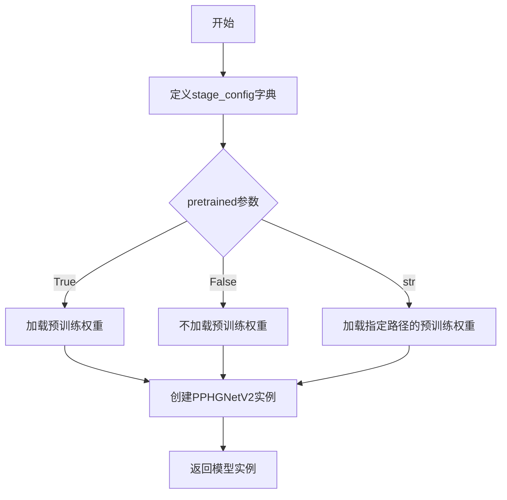

#### 带注释源码

```
def PPHGNetV2_B2(pretrained=False, use_ssld=False, **kwargs):
    """
    PPHGNetV2_B2
    Args:
        pretrained (bool/str): If `True` load pretrained parameters, `False` otherwise.
                    If str, means the path of the pretrained model.
        use_ssld (bool) Whether using ssld pretrained model when pretrained is True.
    Returns:
        model: nn.Module. Specific `PPHGNetV2_B2` model depends on args.
    """
    # 定义B2模型的stage配置，包含4个stage
    # 每个stage配置: [in_channels, mid_channels, out_channels, num_blocks, is_downsample, light_block, kernel_size, layer_num]
    stage_config = {
        # Stage1: 32->96通道，1个block，不下采样，普通块，3x3卷积，4层
        "stage1": [32, 32, 96, 1, False, False, 3, 4],
        # Stage2: 96->384通道，1个block，下采样，普通块，3x3卷积，4层
        "stage2": [96, 64, 384, 1, True, False, 3, 4],
        # Stage3: 384->768通道，3个block，下采样，轻量块，5x5卷积，4层
        "stage3": [384, 128, 768, 3, True, True, 5, 4],
        # Stage4: 768->1536通道，1个block，下采样，轻量块，5x5卷积，4层
        "stage4": [768, 256, 1536, 1, True, True, 5, 4],
    }

    # 使用B2特定的stem通道和配置创建PPHGNetV2模型
    # stem_channels: [3, 24, 32] 表示输入3通道，mid=24，输出32通道
    # use_lab=True 启用可学习仿射块
    model = PPHGNetV2(
        stem_channels=[3, 24, 32],  # 初始stem的通道配置
        stage_config=stage_config,  # B2特定的stage配置
        use_lab=True,               # 启用LAB（可学习仿射块）机制
        **kwargs                    # 额外的可选参数
    )
    return model  # 返回构建好的模型实例
```


### PPHGNetV2_B3

PPHGNetV2_B3 是一个用于构建 PP-HGNetV2 系列中 B3 版本模型的工厂函数，通过预定义的 stage_config 配置参数来创建具有特定通道数、层数和块数的神经网络模型，适用于图像分类任务。

参数：

- `pretrained`：`bool/str`，如果为 `True` 则加载预训练参数，`False` 则不加载；如果为字符串，则表示预训练模型的路径。默认为 `False`。
- `use_ssld`：`bool`，当 pretrained 为 True 时，是否使用 SSLD 预训练模型。默认为 `False`。
- `**kwargs`：可变关键字参数，用于传递给 PPHGNetV2 构造函数的其他参数。

返回值：`nn.Module`，返回具体的 PPHGNetV2_B3 模型实例。

#### 流程图

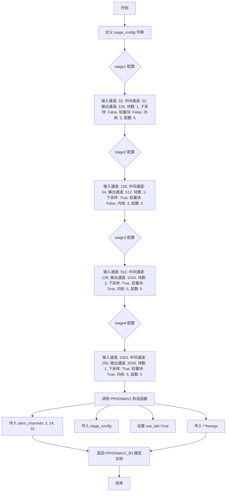

#### 带注释源码

```python
def PPHGNetV2_B3(pretrained=False, use_ssld=False, **kwargs):
    """
    PPHGNetV2_B3 模型构建函数
    
    该函数创建一个特定配置的 PP-HGNetV2_B3 神经网络模型，用于图像分类任务。
    模型包含4个阶段（stage），每个阶段有不同数量的卷积块和通道配置。
    
    Args:
        pretrained (bool/str): 如果为 True 则加载预训练参数，False 则不加载。
                              如果为字符串，则表示预训练模型的路径。
        use_ssld (bool): 当 pretrained 为 True 时，是否使用 SSLD 预训练模型。
        **kwargs: 其他传递给 PPHGNetV2 的参数，如 class_num, dropout_prob 等。
    
    Returns:
        model: nn.Module. 返回具体的 PPHGNetV2_B3 模型实例。
    """
    # 定义阶段配置字典，包含每个 stage 的详细参数
    # 参数顺序: in_channels, mid_channels, out_channels, num_blocks, 
    #          is_downsample, light_block, kernel_size, layer_num
    stage_config = {
        # stage1: 第一个阶段，不进行下采样，使用标准卷积块
        "stage1": [32, 32, 128, 1, False, False, 3, 5],
        
        # stage2: 第二个阶段，进行下采样，使用标准卷积块
        "stage2": [128, 64, 512, 1, True, False, 3, 5],
        
        # stage3: 第三个阶段，进行下采样，使用轻量卷积块，包含3个块
        "stage3": [512, 128, 1024, 3, True, True, 5, 5],
        
        # stage4: 第四个阶段，进行下采样，使用轻量卷积块
        "stage4": [1024, 256, 2048, 1, True, True, 5, 5],
    }

    # 使用 PPHGNetV2 基类构建模型
    # stem_channels: [输入通道, 中间通道, 输出通道]
    # use_lab: 是否使用 LearnableAffineBlock (LAB) 增强模型性能
    model = PPHGNetV2(
        stem_channels=[3, 24, 32],  # RGB图像输入(3通道)，stem中间24通道，输出32通道
        stage_config=stage_config,  # 上面定义的4个stage配置
        use_lab=True,                # 启用 LAB 训练策略提升精度
        **kwargs                     # 传递其他可选参数
    )
    return model  # 返回构建好的模型实例
```


### `PPHGNetV2_B4`

该函数是PP-HGNetV2系列模型中的B4版本构建函数，根据传入的参数（是否为检测任务、是否为文本识别任务）选择不同的stage配置来构建相应的PPHGNetV2模型实例。

参数：

- `pretrained`：`bool/str`，如果为`True`则加载预训练参数，`False`表示不加载；如果为str，则表示预训练模型的路径。
- `use_ssld`：`bool`，当pretrained为True时是否使用ssld预训练模型。
- `det`：`bool`，是否用于检测任务，默认为False。
- `text_rec`：`bool`，是否用于文本识别任务，默认为False。
- `**kwargs`：其他关键字参数，用于传递给PPHGNetV2类。

返回值：`nn.Module`，返回构建好的PPHGNetV2_B4模型实例。

#### 流程图

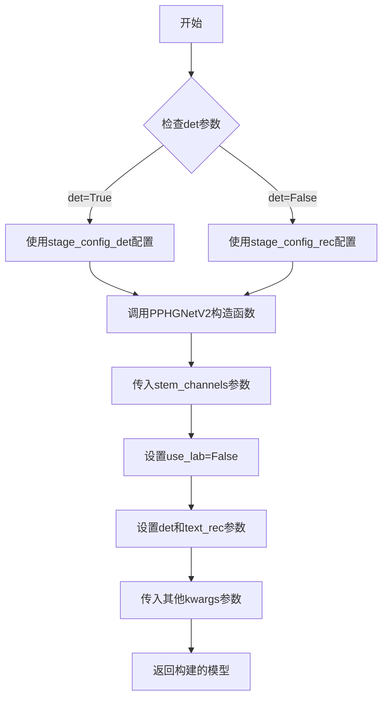

#### 带注释源码

```python
def PPHGNetV2_B4(pretrained=False, use_ssld=False, det=False, text_rec=False, **kwargs):
    """
    PPHGNetV2_B4
    Args:
        pretrained (bool/str): If `True` load pretrained parameters, `False` otherwise.
                    If str, means the path of the pretrained model.
        use_ssld (bool) Whether using ssld pretrained model when pretrained is True.
    Returns:
        model: nn.Module. Specific `PPHGNetV2_B4` model depends on args.
    """
    # 定义用于文本识别任务的stage配置
    # 包含4个stage: stage1, stage2, stage3, stage4
    # 配置格式: [in_channels, mid_channels, out_channels, num_blocks, is_downsample, light_block, kernel_size, layer_num, stride]
    stage_config_rec = {
        # in_channels, mid_channels, out_channels, num_blocks, is_downsample, light_block, kernel_size, layer_num, stride
        "stage1": [48, 48, 128, 1, True, False, 3, 6, [2, 1]],
        "stage2": [128, 96, 512, 1, True, False, 3, 6, [1, 2]],
        "stage3": [512, 192, 1024, 3, True, True, 5, 6, [2, 1]],
        "stage4": [1024, 384, 2048, 1, True, True, 5, 6, [2, 1]],
    }

    # 定义用于目标检测任务的stage配置
    stage_config_det = {
        # in_channels, mid_channels, out_channels, num_blocks, is_downsample, light_block, kernel_size, layer_num
        "stage1": [48, 48, 128, 1, False, False, 3, 6, 2],
        "stage2": [128, 96, 512, 1, True, False, 3, 6, 2],
        "stage3": [512, 192, 1024, 3, True, True, 5, 6, 2],
        "stage4": [1024, 384, 2048, 1, True, True, 5, 6, 2],
    }
    
    # 根据det参数选择不同的stage配置
    # 创建PPHGNetV2模型实例
    model = PPHGNetV2(
        stem_channels=[3, 32, 48],  # stem通道配置: [输入通道, 中间通道, 输出通道]
        stage_config=stage_config_det if det else stage_config_rec,  # 根据任务选择stage配置
        use_lab=False,  # 不使用LAB操作
        det=det,  # 传递检测标志
        text_rec=text_rec,  # 传递文本识别标志
        **kwargs,  # 传递其他参数
    )
    return model
```


### `PPHGNetV2_B5`

PPHGNetV2_B5是一个用于构建PP-HGNetV2系列模型B5版本的工厂函数，通过预定义的stage_config配置构建包含4个_stage的神经网络模型，可用于图像分类、目标检测或文本识别等视觉任务。

参数：

- `pretrained`：`bool`或`str`，如果为`True`则加载预训练参数，`False`则不加载；如果为字符串，则表示预训练模型的路径
- `use_ssld`：`bool`，当pretrained为True时，是否使用SSLD预训练模型
- `**kwargs`：可变关键字参数，用于传递给PPHGNetV2主类的其他配置参数（如`det`、`text_rec`、`out_indices`等）

返回值：`nn.Module`，返回一个配置好的PPHGNetV2模型实例

#### 流程图

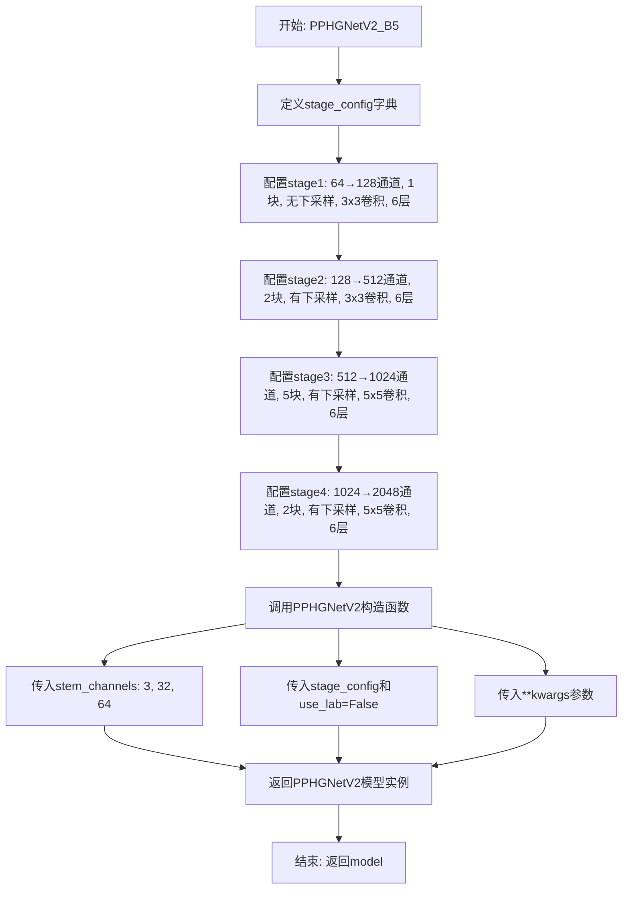

#### 带注释源码

```python
def PPHGNetV2_B5(pretrained=False, use_ssld=False, **kwargs):
    """
    PPHGNetV2_B5
    
    构建PP-HGNetV2 B5版本模型的工厂函数。
    
    Args:
        pretrained (bool/str): 如果为True则加载预训练参数，False则不加载。
                              如果为字符串，则表示预训练模型的路径。
        use_ssld (bool): 当pretrained为True时，是否使用SSLD预训练模型。
    
    Returns:
        model: nn.Module. Specific PPHGNetV2_B5 model depends on args.
    """
    # 定义各stage的配置参数
    # 格式: [in_channels, mid_channels, out_channels, num_blocks, 
    #        is_downsample, light_block, kernel_size, layer_num]
    stage_config = {
        # Stage1: 初始阶段，64通道，1个block，无下采样
        "stage1": [64, 64, 128, 1, False, False, 3, 6],
        # Stage2: 128通道，2个block，有下采样
        "stage2": [128, 128, 512, 2, True, False, 3, 6],
        # Stage3: 512通道，5个block，有下采样，使用light_block
        "stage3": [512, 256, 1024, 5, True, True, 5, 6],
        # Stage4: 1024通道，2个block，有下采样，使用light_block
        "stage4": [1024, 512, 2048, 2, True, True, 5, 6],
    }

    # 创建PPHGNetV2模型实例
    # stem_channels: [输入通道, 中间通道, 输出通道]
    # use_lab: 不使用LAB(LearnableAffineBlock)操作
    # **kwargs: 传递额外参数如det, text_rec, out_indices等
    model = PPHGNetV2(
        stem_channels=[3, 32, 64],  # RGB图像输入(3通道)
        stage_config=stage_config,  # 阶段配置
        use_lab=False,               # B5版本默认不使用LAB
        **kwargs                     # 额外的可选参数
    )
    return model
```


### `PPHGNetV2_B6`

PPHGNetV2_B6是一个模型工厂函数，用于构建和返回PP-HGNetV2 B6版本的卷积神经网络模型。该函数通过配置特定的阶段参数（stage_config）来定义网络结构，包括各阶段的通道数、块数量、是否下采样、是否使用轻量块等信息。

参数：

- `pretrained`：`bool/str`，如果为`True`则加载预训练参数，`False`则不加载；如果为字符串，则表示预训练模型的路径。
- `use_ssld`：`bool`，当`pretrained`为`True`时，是否使用SSLD预训练模型。
- `**kwargs`：可变关键字参数，用于传递其他可选参数给PPHGNetV2模型。

返回值：`nn.Module`，返回具体的PPHGNetV2_B6模型实例。

#### 流程图

```mermaid
graph TD
    A[开始] --> B[定义stage_config字典]
    B --> C[配置stage1: in_channels=96, mid_channels=96, out_channels=192, block_num=2, is_downsample=False, light_block=False, kernel_size=3, layer_num=6]
    C --> D[配置stage2: in_channels=192, mid_channels=192, out_channels=512, block_num=3, is_downsample=True, light_block=False, kernel_size=3, layer_num=6]
    D --> E[配置stage3: in_channels=512, mid_channels=384, out_channels=1024, block_num=6, is_downsample=True, light_block=True, kernel_size=5, layer_num=6]
    E --> F[配置stage4: in_channels=1024, mid_channels=768, out_channels=2048, block_num=3, is_downsample=True, light_block=True, kernel_size=5, layer_num=6]
    F --> G[调用PPHGNetV2构造函数]
    G --> H[传入stem_channels=[3, 48, 96]]
    H --> I[传入stage_config和use_lab=False]
    I --> J[传入其他kwargs参数]
    J --> K[返回PPHGNetV2模型实例]
    K --> L[结束]
```

#### 带注释源码

```python
def PPHGNetV2_B6(pretrained=False, use_ssld=False, **kwargs):
    """
    PPHGNetV2_B6
    Args:
        pretrained (bool/str): If `True` load pretrained parameters, `False` otherwise.
                    If str, means the path of the pretrained model.
        use_ssld (bool) Whether using ssld pretrained model when pretrained is True.
    Returns:
        model: nn.Module. Specific `PPHGNetV2_B6` model depends on args.
    """
    # 定义PPHGNetV2_B6的阶段配置字典
    # 配置包含: in_channels, mid_channels, out_channels, num_blocks, is_downsample, light_block, kernel_size, layer_num
    stage_config = {
        # stage1配置：输入通道96，中间通道96，输出通道192，2个块，不下采样，非轻量块，核大小3，6层
        "stage1": [96, 96, 192, 2, False, False, 3, 6],
        # stage2配置：输入通道192，中间通道192，输出通道512，3个块，下采样，非轻量块，核大小3，6层
        "stage2": [192, 192, 512, 3, True, False, 3, 6],
        # stage3配置：输入通道512，中间通道384，输出通道1024，6个块，下采样，轻量块，核大小5，6层
        "stage3": [512, 384, 1024, 6, True, True, 5, 6],
        # stage4配置：输入通道1024，中间通道768，输出通道2048，3个块，下采样，轻量块，核大小5，6层
        "stage4": [1024, 768, 2048, 3, True, True, 5, 6],
    }

    # 创建PPHGNetV2模型实例，传入以下参数：
    # stem_channels=[3, 48, 96]：Stem块的通道配置（输入通道3，中间通道48，输出通道96）
    # stage_config=stage_config：上面定义的阶段配置字典
    # use_lab=False：不使用LAB（Learnable Affine Block）操作
    # **kwargs：传递其他可选参数
    model = PPHGNetV2(
        stem_channels=[3, 48, 96], stage_config=stage_config, use_lab=False, **kwargs
    )
    # 返回构建好的PPHGNetV2_B6模型
    return model
```


### `IdentityBasedConv1x1.__init__`

这是 `IdentityBasedConv1x1` 类的构造函数，用于初始化一个基于身份映射的 1x1 卷积层。该卷积层继承自 `nn.Conv2d`，并在权重中集成了一个可学习的身份张量，用于在分组卷积中保持恒等映射特性。

参数：

- `channels`：`int`，输入和输出通道数
- `groups`：`int`（默认值：1），分组卷积的组数

返回值：无（`__init__` 方法返回 `None`）

#### 流程图

```mermaid
flowchart TD
    A[开始 __init__] --> B[调用父类 nn.Conv2d 构造函数]
    B --> C{验证 channels % groups == 0}
    C -->|失败| D[抛出 AssertionError]
    C -->|成功| E[计算 input_dim = channels // groups]
    E --> F[创建零张量 id_value 形状为 channels × input_dim × 1 × 1]
    F --> G[循环设置身份矩阵: id_value[i, i % input_dim, 0, 0] = 1]
    G --> H[创建 self.id_tensor 并赋值]
    H --> I[将卷积权重初始化为零]
    I --> J[结束 __init__]
```

#### 带注释源码

```python
def __init__(self, channels, groups=1):
    # 调用父类 nn.Conv2d 的构造函数
    # 创建一个 1x1 的卷积层，输入输出通道数相同
    super(IdentityBasedConv1x1, self).__init__(
        in_channels=channels,
        out_channels=channels,
        kernel_size=1,      # 1x1 卷积核
        stride=1,           # 步长为1
        padding=0,          # 无填充
        groups=groups,      # 分组卷积的组数
        bias_attr=False,    # 不使用偏置
    )

    # 断言：确保通道数能被组数整除
    assert channels % groups == 0
    
    # 计算每个分组中的输入维度
    input_dim = channels // groups
    
    # 创建一个形状为 (channels, input_dim, 1, 1) 的零张量
    # 用于存储身份矩阵
    id_value = np.zeros((channels, input_dim, 1, 1))
    
    # 填充身份矩阵
    # 对于每个通道 i，将第 (i % input_dim) 个位置设为1
    # 这样每个分组都有一个单位矩阵，实现恒等映射
    for i in range(channels):
        id_value[i, i % input_dim, 0, 0] = 1
    
    # 将 NumPy 数组转换为 PyTorch 张量
    self.id_tensor = torch.Tensor(id_value)
    
    # 将卷积权重初始化为零
    # 这样在第一次前向传播时，输出主要由身份矩阵决定
    self.weight.set_value(torch.zeros_like(self.weight))
```


### `IdentityBasedConv1x1.forward`

该方法是`IdentityBasedConv1x1`类的前向传播函数，实现了一种基于身份映射的1x1卷积操作。它将可学习的卷积权重与预先定义的身份张量（identity tensor）相加，生成实际卷积核，然后执行卷积运算。这种设计允许网络在学习参数的同时保持恒等映射的能力，常用于DiverseBranchBlock等复杂卷积架构中以提升特征提取效果。

参数：

- `input`：`torch.Tensor`，输入的四维张量，形状为 (N, C, H, W)，其中N为批量大小，C为通道数，H和W为高度和宽度

返回值：`torch.Tensor`，卷积后的输出张量，形状为 (N, C_out, H_out, W_out)

#### 流程图

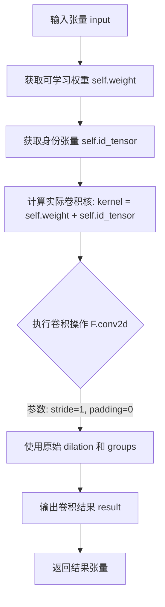

#### 带注释源码

```python
def forward(self, input):
    """
    IdentityBasedConv1x1 的前向传播方法
    
    该方法实现了一种特殊的 1x1 卷积：
    1. 将可学习的卷积权重 (self.weight) 与预定义的身份张量 (self.id_tensor) 相加
    2. 使用组合后的卷积核进行卷积运算
    
    Args:
        input: 输入张量，形状为 (N, C, H, W)
        
    Returns:
        torch.Tensor: 卷积输出，形状为 (N, C_out, H_out, W_out)
    """
    # 步骤1: 计算实际卷积核
    # 将可学习权重与身份张量相加，身份张量确保了至少存在恒等映射
    # self.weight 初始化为零，self.id_tensor 是对角线为1的张量
    kernel = self.weight + self.id_tensor
    
    # 步骤2: 执行卷积运算
    # 使用 F.conv2d 进行二维卷积
    # 参数说明:
    #   - input: 输入张量
    #   - kernel: 组合后的卷积核 (weight + identity)
    #   - None: 偏置项，此处不使用偏置
    #   - stride=1: 步长为1
    #   - padding=0: 不进行填充
    #   - dilation=self._dilation: 膨胀率，继承自 nn.Conv2d
    #   - groups=self._groups: 分组卷积的组数，继承自 nn.Conv2d
    result = F.conv2d(
        input,
        kernel,
        None,
        stride=1,
        padding=0,
        dilation=self._dilation,
        groups=self._groups,
    )
    
    # 步骤3: 返回卷积结果
    return result
```


### `IdentityBasedConv1x1.get_actual_kernel`

该方法用于获取 IdentityBasedConv1x1 卷积层的实际卷积核，通过将可学习的权重参数与预定义的身份矩阵（identity tensor）相加得到最终用于卷积运算的卷积核。

参数：此方法无显式参数（仅包含隐式参数 `self`）。

返回值：`torch.Tensor`，返回实际参与卷积运算的卷积核，即权重与身份矩阵的和。

#### 流程图

```mermaid
graph TD
    A[开始 get_actual_kernel] --> B[获取 self.weight]
    B --> C[获取 self.id_tensor]
    C --> D[执行加法: self.weight + self.id_tensor]
    D --> E[返回结果 kernel]
    E --> F[结束]
```

#### 带注释源码

```python
def get_actual_kernel(self):
    """
    获取实际的卷积核。
    
    该方法将卷积层的可学习权重 (self.weight) 与预定义的身份矩阵 (self.id_tensor) 相加，
    生成最终用于卷积运算的卷积核。这是 Identity-Based Convolution 的核心机制，
    通过结合身份矩阵确保卷积层至少具有身份映射的能力。
    
    Returns:
        torch.Tensor: 实际用于卷积运算的卷积核，形状为 (channels, channels//groups, 1, 1)。
    """
    return self.weight + self.id_tensor
```


### `BNAndPad.__init__`

这是 `BNAndPad` 类的构造函数，用于初始化一个结合了批归一化（Batch Normalization）和边界填充（Padding）的模块。该模块在批归一化后对特征图进行可学习的边界填充，常用于 DiverseBranchBlock 等神经网络结构中以提升特征提取能力。

参数：

- `pad_pixels`：`int`，要填充的像素数量，指定在批归一化输出周围填充的像素宽度
- `num_features`：`int`，特征通道数，对应批归一化的特征数量
- `epsilon`：`float`，默认值为 `1e-5`，批归一化中的数值稳定性常数，防止除零
- `momentum`：`float`，默认值为 `0.1`，批归一化的动量参数，用于更新运行均值和方差
- `last_conv_bias`：`Optional[Tensor]`，可选，指定最后一个卷积层的偏置，用于计算填充值
- `bn`：`type`，默认值为 `nn.BatchNorm2d`，批归一化层的类型，可替换为其他类似的归一化层

返回值：`None`，构造函数无返回值（隐式返回 `None`）

#### 流程图

```mermaid
flowchart TD
    A[开始 __init__] --> B[调用 super().__init__ 初始化 nn.Module]
    B --> C[创建批归一化层 self.bn]
    C --> D[设置 self.pad_pixels = pad_pixels]
    D --> E[设置 self.last_conv_bias = last_conv_bias]
    E --> F[结束 __init__]
```

#### 带注释源码

```python
def __init__(
    self,
    pad_pixels,
    num_features,
    epsilon=1e-5,
    momentum=0.1,
    last_conv_bias=None,
    bn=nn.BatchNorm2d,
):
    """
    初始化 BNAndPad 模块。
    
    参数:
        pad_pixels (int): 填充的像素数量
        num_features (int): 批归一化的特征数量
        epsilon (float): 数值稳定性常数
        momentum (float): 批归一化动量
        last_conv_bias (optional): 最后一个卷积的偏置
        bn (type): 批归一化层类型
    """
    # 调用父类 nn.Module 的初始化方法
    super().__init__()
    
    # 创建批归一化层，传入特征数、动量和epsilon参数
    self.bn = bn(num_features, momentum=momentum, epsilon=epsilon)
    
    # 保存填充像素数，用于前向传播中的边界填充
    self.pad_pixels = pad_pixels
    
    # 保存最后一个卷积层的偏置（如果有），用于计算填充值
    self.last_conv_bias = last_conv_bias
```


### `BNAndPad.forward`

该方法是 `BNAndPad` 类的核心前向传播函数，首先对输入应用批标准化（Batch Normalization），然后根据配置的 `pad_pixels` 参数在特征图周围添加可学习的填充值，以增强模型对边缘特征的捕获能力。

参数：

- `input`：`torch.Tensor`，输入的四维张量，形状为 (N, C, H, W)，表示批量样本数、通道数、高度和宽度

返回值：`torch.Tensor`，经过批标准化和可选填充后的输出张量，形状为 (N, C, H + 2*pad_pixels, W + 2*pad_pixels)（当 pad_pixels > 0 时）

#### 流程图

```mermaid
flowchart TD
    A[开始 forward] --> B[调用 self.bn 进行批标准化]
    B --> C{self.pad_pixels > 0?}
    C -->|否| F[返回 output]
    C -->|是| D[计算 bias 和 pad_values]
    D --> E[在宽度维度两侧填充]
    E --> G[在高度维度两侧填充]
    G --> F
```

#### 带注释源码

```python
def forward(self, input):
    # 第一步：对输入进行批标准化处理
    # 使用初始化时创建的 BatchNorm2d 层对输入进行归一化
    output = self.bn(input)
    
    # 判断是否需要填充像素
    if self.pad_pixels > 0:
        # 计算偏置：取批标准化的负均值
        bias = -self.bn._mean
        
        # 如果存在最后一个卷积层的偏置，则叠加到 bias 上
        if self.last_conv_bias is not None:
            bias += self.last_conv_bias
        
        # 计算填充值：偏置 + 权重 * (偏置 / sqrt(方差 + epsilon))
        # 这是一种可学习的填充方式，结合了 BN 的统计信息
        pad_values = self.bn.bias + self.bn.weight * (
            bias / torch.sqrt(self.bn._variance + self.bn._epsilon)
        )
        
        """ pad """
        # TODO: n,h,w,c 格式尚未支持
        # 获取输出张量的形状信息
        n, c, h, w = output.shape
        
        # 将填充值重塑为 [1, C, 1, 1] 的形式，以便广播
        values = pad_values.reshape([1, -1, 1, 1])
        
        # 在宽度维度（w）两侧填充
        # 扩展填充值到 [N, C, pad_pixels, W]
        w_values = values.expand([n, -1, self.pad_pixels, w])
        # 在宽度方向拼接：[pad_values, output, pad_values]
        x = torch.cat([w_values, output, w_values], dim=2)
        
        # 更新高度信息
        h = h + self.pad_pixels * 2
        
        # 在高度维度（h）两侧填充
        # 扩展填充值到 [N, C, H+2*pad_pixels, pad_pixels]
        h_values = values.expand([n, -1, h, self.pad_pixels])
        # 在高度方向拼接：[pad_values, x, pad_values]
        x = torch.cat([h_values, x, h_values], dim=3)
        
        # 更新最终输出
        output = x
    
    # 返回处理后的结果
    return output
```


### `BNAndPad.weight`

该属性方法作为代理属性，返回内部 BatchNorm2d 层的权重参数，使外部能够访问 BN 层的可学习权重。

参数：无需参数

返回值：`torch.Tensor`（或 `nn.Parameter`），返回内部 BatchNorm2d 层的权重张量

#### 流程图

```mermaid
flowchart TD
    A[调用 BNAndPad.weight 属性] --> B{获取 self.bn 对象}
    B --> C[访问 self.bn.weight]
    C --> D[返回 BatchNorm2d 的权重参数]
```

#### 带注释源码

```python
@property
def weight(self):
    """返回内部 BatchNorm2d 层的权重（缩放参数 gamma）。
    
    该属性是一个代理属性（Proxy Property），它将调用委托给内部封装的
    BatchNorm2d 层的 weight 属性。在 DiverseBranchBlock 等模块中，
    需要访问 BN 层的权重来进行等效卷积核融合等操作。
    
    Returns:
        nn.Parameter: BatchNorm2d 层的可学习权重参数，形状为 (num_features,)。
                      其中 num_features 是 BN 层的通道数。
    """
    return self.bn.weight
```


### `BNAndPad.bias`

该属性是 `BNAndPad` 类的偏置访问器，通过 Python property 机制返回内部封装的 BatchNorm2d 层的偏置参数，使得外部可以直接以属性的方式访问批归一化层的偏置，而无需直接操作内部的 `bn` 子模块。

参数：无（属性访问器不接受外部参数）

返回值：`Tensor`（具体为 `nn.Parameter` 或 `torch.Tensor`），返回内部 BatchNorm 层的偏置参数，用于在卷积特征图中进行后续的像素填充计算或特征调整。

#### 流程图

```mermaid
graph TD
    A[访问 BNAndPad.bias 属性] --> B{调用 getter 方法}
    B --> C[返回 self.bn.bias]
    D[BatchNorm2d 层] -->|持有| C
```

#### 带注释源码

```python
@property
def bias(self):
    """
    属性访问器：返回内部 BatchNorm 层的偏置参数
    
    该属性提供了对 BNAndPad 内部封装的 BatchNorm2d 层 (self.bn) 的 bias 参数的直接访问。
    在 forward 方法中，bias 被用于计算填充值 (pad_values)，公式为:
    pad_values = self.bn.bias + self.bn.weight * (bias / sqrt(self.bn._variance + self.bn._epsilon))
    其中 bias = -self.bn._mean (若 last_conv_bias 不为 None，还需加上 last_conv_bias)
    
    Returns:
        Tensor: 内部 BatchNorm 层的偏置参数，形状为 [num_features]
    """
    return self.bn.bias
```


### `BNAndPad._mean`

获取 BatchNorm2d 层的均值统计量，用于在前向传播中计算 padding 值。

参数： 无

返回值：`Tensor`，BatchNorm2d 层的运行均值（running mean）

#### 流程图

```mermaid
graph TD
    A[调用 _mean 属性] --> B{访问 self.bn._mean}
    B --> C[返回 BatchNorm2d 的均值张量]
```

#### 带注释源码

```python
@property
def _mean(self):
    """获取 BatchNorm2d 层的均值统计量
    
    该属性用于在前向传播中计算 padding 值。
    通过获取 BatchNorm2d 层的内部均值 _mean，
    用于后续的 bias 计算：bias = -self.bn._mean
    
    Returns:
        Tensor: BatchNorm2d 层的运行均值（running mean）
    """
    return self.bn._mean
```


### `BNAndPad._variance`

该属性是一个只读属性，用于获取内部 BatchNorm2d 层的方差值（`_variance`），主要用于在前向传播中计算归一化后的填充值。

参数：
- 无（仅 `self` 隐式参数）

返回值：`torch.Tensor`，返回 BatchNorm2d 层的方差统计量，用于后续的归一化计算。

#### 流程图

```mermaid
flowchart TD
    A[访问 BNAndPad._variance 属性] --> B{内部bn对象是否存在}
    B -->|是| C[返回 self.bn._variance]
    B -->|否| D[抛出AttributeError]
    C --> E[获取BatchNorm2d的方差张量]
```

#### 带注释源码

```python
@property
def _variance(self):
    """获取内部BatchNorm2d层的方差值
    
    这是一个只读属性，用于暴露内部bn层的_variance属性。
    该方差值在forward方法中用于计算填充(pad)值，公式为:
    pad_values = self.bn.bias + self.bn.weight * (bias / sqrt(variance + epsilon))
    
    Returns:
        torch.Tensor: BatchNorm2d层运行时的方差统计量
    """
    return self.bn._variance
```


### `BNAndPad._epsilon`

该属性方法用于获取内部BatchNorm层的epsilon参数，该参数用于数值稳定性计算，防止除零错误。

参数： 无

返回值：`float`，返回BatchNorm层的epsilon值，用于归一化计算中的数值稳定性。

#### 流程图

```mermaid
graph TD
    A[开始] --> B[获取 self.bn._epsilon]
    B --> C[返回 epsilon 值]
    C --> D[结束]
```

#### 带注释源码

```python
@property
def _epsilon(self):
    """
    获取BatchNorm层的epsilon参数。
    
    epsilon是BatchNorm在计算标准差时加上的一个小常数，
    用于保证数值稳定性，防止除零错误。
    
    Returns:
        float: BatchNorm层的epsilon参数值
    """
    return self.bn._epsilon
```


### DiverseBranchBlock.__init__

该方法是`DiverseBranchBlock`类的构造函数，负责初始化一个多样化分支块（Diverse Branch Block）。这是一种用于卷积神经网络的可重参数化模块，通过组合多个并行分支（原始卷积、平均池化分支、1x1与kxk组合分支）来增强模型的特征提取能力。在推理阶段可以通过重参数化将这些分支合并为一个等效的卷积层，从而消除推理时的额外计算开销。

参数：

- `num_channels`：`int`，输入通道数
- `num_filters`：`int`，输出通道数
- `filter_size`：`int`，卷积核大小
- `stride`：`int`，卷积步长，默认为1
- `groups`：`int`，分组卷积的组数，默认为1
- `act`：激活函数类型，默认为None
- `is_repped`：`bool`，是否已经完成重参数化，默认为False
- `single_init`：`bool`，是否使用单一初始化策略（仅初始化主分支），默认为False
- `**kwargs`：`dict`，额外参数

返回值：无（`__init__`方法返回`None`）

#### 流程图

```mermaid
flowchart TD
    A[开始 __init__] --> B[计算 padding 和 dilation]
    B --> C[设置 in_channels, out_channels, kernel_size]
    C --> D[初始化 self.nonlinear: 根据 act 参数选择 ReLU 或 Identity]
    D --> E{is_repped?}
    E -->|True| F[创建 dbb_reparam 单一卷积层]
    E -->|False| G[构建多分支结构]
    G --> H[创建 dbb_origin: conv_bn 原始卷积分支]
    H --> I{groups < out_channels?}
    I -->|True| J[构建带卷积的 dbb_avg 分支]
    I -->|False| K[构建不带卷积的 dbb_avg 分支]
    J --> L[创建 dbb_1x1: 1x1 卷积分支]
    K --> L
    L --> M[计算 internal_channels_1x1_3x3]
    M --> N{internal_channels_1x1_3x3 == in_channels?}
    N -->|True| O[创建 IdentityBasedConv1x1]
    N -->|False| P[创建普通 Conv2d 1x1]
    O --> Q[构建 dbb_1x1_kxk 序列]
    P --> Q
    Q --> R{single_init?}
    F --> R
    R -->|True| S[调用 single_init 方法]
    R -->|False| T[结束]
    S --> T
```

#### 带注释源码

```python
def __init__(
    self,
    num_channels,      # 输入通道数
    num_filters,      # 输出通道数
    filter_size,      # 卷积核大小
    stride=1,         # 卷积步长，默认为1
    groups=1,         # 分组卷积的组数，默认为1
    act=None,         # 激活函数，默认为None
    is_repped=False,  # 是否已经完成重参数化，默认为False
    single_init=False,# 是否使用单一初始化策略，默认为False
    **kwargs,         # 额外参数
):
    # 调用父类 nn.Module 的初始化方法
    super().__init__()

    # 计算填充大小：使得输出尺寸与输入尺寸相同（当stride=1时）
    padding = (filter_size - 1) // 2
    # 膨胀系数设为1
    dilation = 1

    # 将参数赋值给局部变量
    in_channels = num_channels      # 输入通道数
    out_channels = num_filters      # 输出通道数
    kernel_size = filter_size       # 卷积核大小
    internal_channels_1x1_3x3 = None# 内部通道数（用于1x1和kxk组合）
    nonlinear = act                 # 激活函数

    # 保存是否已重参数化的标志
    self.is_repped = is_repped

    # 根据是否有激活函数来设置非线性层
    if nonlinear is None:
        # 如果没有激活函数，使用恒等映射
        self.nonlinear = nn.Identity()
    else:
        # 否则使用 ReLU 激活函数
        self.nonlinear = nn.ReLU()

    # 保存卷积核大小、输出通道数和分组数到实例属性
    self.kernel_size = kernel_size
    self.out_channels = out_channels
    self.groups = groups
    
    # 断言：确保填充大小等于卷积核大小的一半（保证空间尺寸不变）
    assert padding == kernel_size // 2

    # 根据 is_repped 标志选择不同的初始化路径
    if is_repped:
        # 如果已经完成重参数化，创建一个单一的卷积层作为等效卷积
        self.dbb_reparam = nn.Conv2d(
            in_channels=in_channels,
            out_channels=out_channels,
            kernel_size=kernel_size,
            stride=stride,
            padding=padding,
            dilation=dilation,
            groups=groups,
            bias=True,
        )
    else:
        # 如果未重参数化，构建多分支结构（原始分支、平均池化分支、1x1+kxk分支）
        
        # 1. 原始卷积分支：conv + bn 的组合
        self.dbb_origin = conv_bn(
            in_channels=in_channels,
            out_channels=out_channels,
            kernel_size=kernel_size,
            stride=stride,
            padding=padding,
            dilation=dilation,
            groups=groups,
        )

        # 2. 平均池化分支：用于捕获全局特征
        self.dbb_avg = nn.Sequential()
        if groups < out_channels:
            # 当分组数小于输出通道数时，需要卷积层进行维度变换
            self.dbb_avg.add_sublayer(
                "conv",
                nn.Conv2d(
                    in_channels=in_channels,
                    out_channels=out_channels,
                    kernel_size=1,
                    stride=1,
                    padding=0,
                    groups=groups,
                    bias=False,
                ),
            )
            self.dbb_avg.add_sublayer(
                "bn", BNAndPad(pad_pixels=padding, num_features=out_channels)
            )
            self.dbb_avg.add_sublayer(
                "avg",
                nn.AvgPool2D(kernel_size=kernel_size, stride=stride, padding=0),
            )
            # 1x1 卷积分支，用于特征融合
            self.dbb_1x1 = conv_bn(
                in_channels=in_channels,
                out_channels=out_channels,
                kernel_size=1,
                stride=stride,
                padding=0,
                groups=groups,
            )
        else:
            # 当分组数>=输出通道数时，直接使用平均池化
            self.dbb_avg.add_sublayer(
                "avg",
                nn.AvgPool2D(
                    kernel_size=kernel_size, stride=stride, padding=padding
                ),
            )
        
        # 添加批归一化层到平均池化分支
        self.dbb_avg.add_sublayer("avgbn", nn.BatchNorm2D(out_channels))

        # 3. 计算内部通道数：用于1x1+kxk组合分支
        if internal_channels_1x1_3x3 is None:
            # 根据分组数和输出通道数决定内部通道数
            # 对于 mobilenet，建议使用2倍的内部通道数以获得更好的性能
            internal_channels_1x1_3x3 = (
                in_channels if groups < out_channels else 2 * in_channels
            )

        # 4. 1x1 + kxk 组合分支：先1x1卷积增加维度，再kxk卷积提取特征
        self.dbb_1x1_kxk = nn.Sequential()
        if internal_channels_1x1_3x3 == in_channels:
            # 如果内部通道数等于输入通道数，使用基于身份的1x1卷积
            self.dbb_1x1_kxk.add_sublayer(
                "idconv1", IdentityBasedConv1x1(channels=in_channels, groups=groups)
            )
        else:
            # 否则使用普通的1x1卷积
            self.dbb_1x1_kxk.add_sublayer(
                "conv1",
                nn.Conv2d(
                    in_channels=in_channels,
                    out_channels=internal_channels_1x1_3x3,
                    kernel_size=1,
                    stride=1,
                    padding=0,
                    groups=groups,
                    bias=False,
                ),
            )
        
        # 添加 BN+Pad 层
        self.dbb_1x1_kxk.add_sublayer(
            "bn1",
            BNAndPad(pad_pixels=padding, num_features=internal_channels_1x1_3x3),
        )
        
        # 添加 kxk 卷积层（步长为1，padding为0，因为前面已经pad过）
        self.dbb_1x1_kxk.add_sublayer(
            "conv2",
            nn.Conv2d(
                in_channels=internal_channels_1x1_3x3,
                out_channels=out_channels,
                kernel_size=kernel_size,
                stride=stride,
                padding=0,
                groups=groups,
                bias=False,
            ),
        )
        
        # 添加第二个批归一化层
        self.dbb_1x1_kxk.add_sublayer("bn2", nn.BatchNorm2D(out_channels))

    # 根据 single_init 标志决定是否执行特殊的初始化策略
    # 论文中默认使用 bn.weight=1 的初始化，但某些情况下修改初始化可能更有益
    if single_init:
        # 初始化 dbb_origin 的 bn.weight 为 1，其他分支的 bn.weight 为 0
        # 这不是默认设置，但在某些场景下可能效果更好
        self.single_init()
```


### `DiverseBranchBlock.forward`

该方法实现了 DiverseBranchBlock 的前向传播逻辑。根据模型是否经过重参数化（`is_repped`）决定计算路径：若已重参数化，则直接使用融合后的卷积层；否则，执行原始的多分支结构（主卷积、1x1卷积、平均池化分支、1x1-kxk卷积分支）并将结果相加后通过非线性激活函数。

参数：

- `self`：类实例本身。
- `inputs`：`torch.Tensor`，输入的特征图张量，通常为 (N, C, H, W) 形状。

返回值：`torch.Tensor`，经过特征融合与非线性变换后的输出特征图。

#### 流程图

```mermaid
flowchart TD
    A([Start]) --> B{is_repped?}
    B -- True --> C[执行 dbb_reparam 卷积]
    C --> D[应用非线性激活]
    D --> E([Return])
    
    B -- False --> F[执行 dbb_origin 主分支]
    F --> G{hasattr dbb_1x1?}
    G -- True --> H[执行 dbb_1x1 分支并相加]
    G -- False --> I[执行 dbb_avg 分支]
    H --> I
    I --> J[执行 dbb_avg 并相加]
    J --> K[执行 dbb_1x1_kxk 并相加]
    K --> L[应用非线性激活]
    L --> E
```

#### 带注释源码

```python
def forward(self, inputs):
    """
    前向传播函数。
    
    参数:
        inputs (torch.Tensor): 输入张量，形状为 (batch_size, channels, height, width)。
        
    返回:
        torch.Tensor: 输出张量。
    """
    # 检查模块是否已经被重参数化
    if self.is_repped:
        # 如果已经重参数化，直接使用融合后的卷积层 dbb_reparam 进行计算
        # 并应用非线性激活函数后返回
        return self.nonlinear(self.dbb_reparam(inputs))

    # --- 以下为未重参数化的多分支计算路径 ---
    
    # 1. 主分支：标准卷积 + 批归一化
    out = self.dbb_origin(inputs)
    
    # 2. 条件分支：1x1 卷积 (仅当 groups < out_channels 时存在)
    if hasattr(self, "dbb_1x1"):
        out += self.dbb_1x1(inputs)
        
    # 3. 平均池化分支：用于捕获全局统计信息
    out += self.dbb_avg(inputs)
    
    # 4. 复合分支：1x1 卷积 -> kxk 卷积，用于融合多尺度特征
    out += self.dbb_1x1_kxk(inputs)
    
    # 应用最终的非线性激活函数 (如 ReLU)
    return self.nonlinear(out)
```


### `DiverseBranchBlock.init_gamma`

该方法用于初始化 DiverseBranchBlock 中多个 BatchNorm 层的 gamma（权重）参数值，通过传入的 gamma_value 对指定子模块的 BN 层权重进行常数初始化。

参数：

- `gamma_value`：`float`，要设置的 gamma 常数值，用于初始化各 BatchNorm 层的权重

返回值：`None`，无返回值，此方法直接修改各子模块的 BatchNorm 层权重

#### 流程图

```mermaid
flowchart TD
    A[开始 init_gamma] --> B{检查 self 是否拥有 dbb_origin 属性}
    B -->|是| C[使用 gamma_value 初始化 self.dbb_origin.bn.weight]
    B -->|否| D{检查 self 是否拥有 dbb_1x1 属性}
    C --> D
    D -->|是| E[使用 gamma_value 初始化 self.dbb_1x1.bn.weight]
    D -->|否| F{检查 self 是否拥有 dbb_avg 属性}
    E --> F
    F -->|是| G[使用 gamma_value 初始化 self.dbb_avg.avgbn.weight]
    F -->|否| H{检查 self 是否拥有 dbb_1x1_kxk 属性}
    G --> H
    H -->|是| I[使用 gamma_value 初始化 self.dbb_1x1_kxk.bn2.weight]
    H -->|否| J[结束]
    I --> J
```

#### 带注释源码

```python
def init_gamma(self, gamma_value):
    """初始化 DiverseBranchBlock 中多个 BatchNorm 层的 gamma (weight) 参数
    
    该方法遍历 DiverseBranchBlock 中的各个子模块分支（dbb_origin、dbb_1x1、dbb_avg、dbb_1x1_kxk），
    如果这些子模块存在，则将对应的 BatchNorm 层的 weight 参数初始化为指定的 gamma_value。
    这一步通常在模型训练开始前用于控制不同分支的初始权重。
    
    Args:
        gamma_value (float): 要设置的 gamma 常数值，用于 BatchNorm 层的权重初始化
    """
    # 检查是否存在 dbb_origin 分支（原始卷积+BN分支），如果有则初始化其 BN 权重
    if hasattr(self, "dbb_origin"):
        torch.nn.init.constant_(self.dbb_origin.bn.weight, gamma_value)
    
    # 检查是否存在 dbb_1x1 分支（1x1卷积+BN分支），如果有则初始化其 BN 权重
    if hasattr(self, "dbb_1x1"):
        torch.nn.init.constant_(self.dbb_1x1.bn.weight, gamma_value)
    
    # 检查是否存在 dbb_avg 分支（平均池化+BN分支），如果有则初始化其 avgbn 权重
    if hasattr(self, "dbb_avg"):
        torch.nn.init.constant_(self.dbb_avg.avgbn.weight, gamma_value)
    
    # 检查是否存在 dbb_1x1_kxk 分支（1x1卷积+kxk卷积+BN分支），如果有则初始化其 bn2 权重
    if hasattr(self, "dbb_1x1_kxk"):
        torch.nn.init.constant_(self.dbb_1x1_kxk.bn2.weight, gamma_value)
```


### `DiverseBranchBlock.single_init`

该方法实现了 DiverseBranchBlock 的"单次初始化"（single initialization）策略，通过先将所有分支的 BatchNorm gamma 参数置零，再仅保留主分支（dbb_origin）的 gamma 为 1，从而在训练初期只激活主分支，后续可逐步解锁其他分支以实现渐进式训练。

参数：None（该方法无显式参数，仅使用 `self`）

返回值：`None`，无返回值（该方法直接修改对象内部状态）

#### 流程图

```mermaid
flowchart TD
    A[开始 single_init] --> B{检查 self 是否存在}
    B -->|是| C[调用 init_gamma(0.0)]
    C --> D[将所有分支的 BatchNorm gamma 初始化为 0]
    D --> E{检查 self 是否存在 dbb_origin 属性}
    E -->|是| F[将 dbb_origin.bn.weight 设置为 1.0]
    E -->|否| G[结束]
    F --> G
```

#### 带注释源码

```python
def single_init(self):
    """
    执行单次初始化操作。

    该方法实现了一种特殊的权重初始化策略：
    1. 首先调用 init_gamma(0.0) 将所有分支的 BatchNorm gamma 权重初始化为 0
    2. 然后仅保留 dbb_origin 主分支的 gamma 为 1.0，其他分支保持为 0

    这种初始化方式的意义：
    - 在训练初期，只有主分支（dbb_origin）生效，其他分支的贡献被屏蔽
    - 随着训练进行，可以逐步调整其他分支的权重，实现渐进式学习
    - 这有助于模型在训练初期获得稳定的基线性能，随后逐渐利用多分支的增强能力
    """
    # 第一步：将所有相关 BatchNorm 层的 gamma 参数初始化为 0
    # 这会使得 dbb_1x1, dbb_avg, dbb_1x1_kxk 等分支的输出在初期接近零
    self.init_gamma(0.0)
    
    # 第二步：仅将主分支 dbb_origin 的 BatchNorm gamma 设置为 1.0
    # 这样在训练开始时，只有主分支对最终输出有贡献
    # dbb_origin 包含标准的 Conv + BN 结构，是 DiverseBranchBlock 的核心路径
    if hasattr(self, "dbb_origin"):
        torch.nn.init.constant_(self.dbb_origin.bn.weight, 1.0)
```


### `DiverseBranchBlock.get_equivalent_kernel_bias`

该方法用于将DiverseBranchBlock（多样分支块）的多分支结构融合为单分支卷积核与偏置，是模型重参数化（Re-parameterization）技术的核心实现，通过将原始卷积、1x1卷积、1x1-kxk组合卷积和平均池化分支的权重与BatchNorm参数进行融合，生成等效的卷积核和偏置，供推理阶段使用。

参数：此方法无显式参数（隐含参数为self）

返回值：`Tuple[torch.Tensor, torch.Tensor]`，返回包含融合后的等效卷积核（kernel）和偏置（bias）的元组

#### 流程图

```mermaid
flowchart TD
    A["开始: get_equivalent_kernel_bias"] --> B["融合dbb_origin分支<br/>transI_fusebn"]
    B --> C{"是否存在dbb_1x1?"}
    C -->|是| D["融合1x1卷积<br/>transI_fusebn + transVI_multiscale"]
    C -->|否| E["k_1x1=0, b_1x1=0"]
    D --> F{"dbb_1x1_kxk是否有idconv1?"}
    E --> F
    F -->|是| G["获取IdentityBasedConv1x1实际核<br/>get_actual_kernel"]
    F -->|否| H["获取conv1权重"]
    G --> I["融合第一层卷积+BN: transI_fusebn"]
    H --> I
    I --> J["融合第二层卷积+BN: transI_fusebn"]
    J --> K["合并1x1与kxk: transIII_1x1_kxk"]
    K --> L["生成平均池化核: transV_avg"]
    L --> M["融合avgbn: transI_fusebn"]
    M --> N{"dbb_avg是否有conv?"}
    N -->|是| O["融合conv+avgbn: transI_fusebn + transIII_1x1_kxk"]
    N -->|否| P["使用k_1x1_avg_second"]
    O --> Q
    P --> Q["返回融合结果<br/>transII_addbranch"]
    Q --> R["结束: 返回(k_merged, b_merged)"]
```

#### 带注释源码

```python
def get_equivalent_kernel_bias(self):
    """
    获取DiverseBranchBlock的等效卷积核和偏置
    该方法将多分支结构（原始卷积+1x1卷积+1x1_kxk卷积+平均池化）融合为单分支卷积
    用于模型重参数化，将训练时的多分支结构转换为推理时的单分支结构
    
    Returns:
        Tuple[torch.Tensor, torch.Tensor]: (等效卷积核, 等效偏置)
    """
    
    # 步骤1: 融合dbb_origin分支（原始卷积+BN）
    # transI_fusebn函数将卷积权重与BatchNorm参数进行融合
    # 将卷积核乘以gamma/std，并调整偏置
    k_origin, b_origin = transI_fusebn(
        self.dbb_origin.conv.weight, self.dbb_origin.bn
    )

    # 步骤2: 融合dbb_1x1分支（1x1卷积+BN），如果存在的话
    # 检查是否存在dbb_1x1属性
    if hasattr(self, "dbb_1x1"):
        # 融合1x1卷积和其后的BatchNorm
        k_1x1, b_1x1 = transI_fusebn(self.dbb_1x1.conv.weight, self.dbb_1x1.bn)
        # 将1x1卷积核通过transVI_multiscale扩展到目标卷积核大小
        # 例如将1x1扩展为3x3或5x5
        k_1x1 = transVI_multiscale(k_1x1, self.kernel_size)
    else:
        # 如果不存在1x1分支，则设为零
        k_1x1, b_1x1 = 0, 0

    # 步骤3: 融合dbb_1x1_kxk分支（1x1卷积 + kxk卷积）
    # 首先判断第一层是IdentityBasedConv1x1还是普通Conv2d
    if hasattr(self.dbb_1x1_kxk, "idconv1"):
        # IdentityBasedConv1x1需要通过get_actual_kernel()获取实际卷积核
        # 该方法将可学习权重与恒等映射张量相加
        k_1x1_kxk_first = self.dbb_1x1_kxk.idconv1.get_actual_kernel()
    else:
        # 普通1x1卷积直接获取权重
        k_1x1_kxk_first = self.dbb_1x1_kxk.conv1.weight
    
    # 融合第一层卷积（1x1或idconv1）及其BatchNorm
    k_1x1_kxk_first, b_1x1_kxk_first = transI_fusebn(
        k_1x1_kxk_first, self.dbb_1x1_kxk.bn1
    )
    
    # 融合第二层卷积（kxk）及其BatchNorm
    k_1x1_kxk_second, b_1x1_kxk_second = transI_fusebn(
        self.dbb_1x1_kxk.conv2.weight, self.dbb_1x1_kxk.bn2
    )
    
    # 使用transIII_1x1_kxk合并两层卷积
    # 这是一个分组的1x1卷积与kxk卷积的融合
    k_1x1_kxk_merged, b_1x1_kxk_merged = transIII_1x1_kxk(
        k_1x1_kxk_first,
        b_1x1_kxk_first,
        k_1x1_kxk_second,
        b_1x1_kxk_second,
        groups=self.groups,
    )

    # 步骤4: 融合dbb_avg分支（平均池化+卷积+BN）
    # 生成平均池化对应的卷积核
    # 创建一个形状为(channels, input_dim, kernel_size, kernel_size)的零张量
    # 在特定位置填充1/kernel_size^2的值
    k_avg = transV_avg(self.out_channels, self.kernel_size, self.groups)
    
    # 融合avgbn（平均池化后的BatchNorm）
    k_1x1_avg_second, b_1x1_avg_second = transI_fusebn(k_avg, self.dbb_avg.avgbn)
    
    # 检查是否存在前置卷积层（conv+bn）
    if hasattr(self.dbb_avg, "conv"):
        # 如果存在，则融合conv+bn与avgbn
        k_1x1_avg_first, b_1x1_avg_first = transI_fusebn(
            self.dbb_avg.conv.weight, self.dbb_avg.bn
        )
        # 合并两层卷积
        k_1x1_avg_merged, b_1x1_avg_merged = transIII_1x1_kxk(
            k_1x1_avg_first,
            b_1x1_avg_first,
            k_1x1_avg_second,
            b_1x1_avg_second,
            groups=self.groups,
        )
    else:
        # 如果不存在前置卷积，则直接使用avgbn的融合结果
        k_1x1_avg_merged, b_1x1_avg_merged = k_1x1_avg_second, b_1x1_avg_second

    # 步骤5: 将所有分支的卷积核和偏置相加，得到最终的等效卷积核和偏置
    # transII_addbranch函数将多个卷积核和偏置相加
    return transII_addbranch(
        (k_origin, k_1x1, k_1x1_kxk_merged, k_1x1_avg_merged),
        (b_origin, b_1x1, b_1x1_kxk_merged, b_1x1_avg_merged),
    )
```


### `DiverseBranchBlock.re_parameterize`

该方法实现了重参数化（Re-parameterization）技术，将 DiverseBranchBlock 中的多个分支（原始卷积、1x1 卷积、平均池分支和 1x1-kxk 串联分支）合并为单个等效的卷积层，以便在推理阶段提高推理效率并减少内存占用。

参数：

- 该方法无显式参数，仅使用 `self`

返回值：无返回值（`None`），该方法直接修改对象内部状态

#### 流程图

```mermaid
flowchart TD
    A[re_parameterize 开始] --> B{is_repped 是否为 True?}
    B -->|是| C[直接返回，不做任何操作]
    B -->|否| D[调用 get_equivalent_kernel_bias 获取等效卷积核和偏置]
    D --> E[创建新的 Conv2d 层 dbb_reparam]
    E --> F[将等效卷积核权重 set_value 到新层]
    F --> G[将等效偏置 set_value 到新层]
    G --> H[删除原始分支: dbb_origin, dbb_avg, dbb_1x1_kxk]
    H --> I{是否存在 dbb_1x1?}
    I -->|是| J[删除 dbb_1x1]
    I -->|否| K[跳过删除]
    J --> L[设置 is_repped = True]
    K --> L
    L --> M[re_parameterize 结束]
```

#### 带注释源码

```python
def re_parameterize(self):
    """
    执行重参数化操作，将多分支结构合并为单个卷积层
    
    该方法的核心思想是将DiverseBranchBlock中复杂的并行分支结构
    （包含原始卷积、1x1卷积、平均池分支、1x1-kxk串联分支）转换为
    一个等效的单卷积层，以便在推理阶段提高效率。
    """
    
    # 如果已经完成重参数化，则直接返回，避免重复操作
    if self.is_repped:
        return

    # 步骤1: 获取等效的卷积核和偏置
    # 调用 get_equivalent_kernel_bias 方法，该方法会:
    # - 对每个分支进行 BatchNorm 融合 (transI_fusebn)
    # - 对 1x1 和 kxk 分支进行合并 (transIII_1x1_kxk)
    # - 对平均池分支进行处理 (transV_avg, transIII_1x1_kxk)
    # - 最后将所有分支的卷积核和偏置相加 (transII_addbranch)
    kernel, bias = self.get_equivalent_kernel_bias()
    
    # 步骤2: 创建新的卷积层，使用原始分支的配置参数
    # 新层的结构与原始卷积层保持一致，但权重已被替换为等效权重
    self.dbb_reparam = nn.Conv2d(
        in_channels=self.dbb_origin.conv._in_channels,    # 输入通道数
        out_channels=self.dbb_origin.conv._out_channels,   # 输出通道数
        kernel_size=self.dbb_origin.conv._kernel_size,     # 卷积核大小
        stride=self.dbb_origin.conv._stride,               # 步长
        padding=self.dbb_origin.conv._padding,             # 填充
        dilation=self.dbb_origin.conv._dilation,           # 膨胀系数
        groups=self.dbb_origin.conv._groups,               # 分组卷积的组数
        bias=True,                                          # 启用偏置
    )

    # 步骤3: 将计算得到的等效卷积核权重设置到新卷积层
    # kernel 包含了所有分支的等效权重信息
    self.dbb_reparam.weight.set_value(kernel)
    
    # 步骤4: 将计算得到的等效偏置设置到新卷积层
    self.dbb_reparam.bias.set_value(bias)

    # 步骤5: 清理原始分支结构，释放内存
    # 删除这些分支后，对象将只保留 dbb_reparam 和非线性激活层
    self.__delattr__("dbb_origin")      # 删除原始卷积+BN分支
    self.__delattr__("dbb_avg")          # 删除平均池分支
    
    # 步骤6: 如果存在 1x1 卷积分支，也将其删除
    if hasattr(self, "dbb_1x1"):
        self.__delattr__("dbb_1x1")
    
    # 步骤7: 删除 1x1-kxk 串联分支
    self.__delattr__("dbb_1x1_kxk")
    
    # 步骤8: 更新标志位，表示已完成重参数化
    # 后续前向传播将直接使用 dbb_reparam 进行计算
    self.is_repped = True
```


### `Identity.__init__`

该方法是 `Identity` 类的构造函数，用于初始化一个恒等映射模块，该模块在 forward 过程中直接返回输入而不做任何变换。

参数：

- `self`：`nn.Module`，当前 `Identity` 类的实例本身，无需显式传递

返回值：`None`，构造函数不返回任何值，仅完成对象的初始化

#### 流程图

```mermaid
flowchart TD
    A[开始 __init__] --> B[调用父类 nn.Module 的初始化方法]
    B --> C[结束 __init__]
```

#### 带注释源码

```python
class Identity(nn.Module):
    def __init__(self):
        # 调用父类 nn.Module 的构造函数
        # 初始化 PyTorch 模块的基本属性和参数
        super(Identity, self).__init__()

    def forward(self, inputs):
        # 前向传播函数，直接返回输入，不做任何处理
        # 输入: inputs - 任意类型的张量或数据
        # 输出: inputs - 与输入相同的对象
        return inputs
```


### `Identity.forward`

该方法是恒等映射层的前向传播函数，直接返回输入而不进行任何计算，是最简形式的神经网络层。

参数：

- `inputs`：`torch.Tensor`，输入的张量，可以是任意形状的张量

返回值：`torch.Tensor`，直接返回输入的张量，实现恒等映射

#### 流程图

```mermaid
graph LR
    A[输入张量 inputs] --> B[直接返回]
    B --> C[输出张量 outputs]
```

#### 带注释源码

```python
class Identity(nn.Module):
    """恒等映射层，不对输入进行任何变换直接返回"""
    
    def __init__(self):
        """
        初始化函数，调用父类 nn.Module 的构造函数
        """
        super(Identity, self).__init__()

    def forward(self, inputs):
        """
        前向传播函数，直接返回输入

        参数:
            inputs (torch.Tensor): 输入的张量

        返回值:
            torch.Tensor: 直接返回输入的张量，实现恒等映射
        """
        return inputs
```


### `TheseusLayer.__init__`

这是 `TheseusLayer` 类的初始化方法，用于初始化 PyTorch 模块的基本属性，包括结果字典、层名称、剪枝器和量化器，并调用 `init_net` 方法进行网络结构的初始化配置。

参数：

- `*args`：可变位置参数，用于传递给 `init_net` 方法进行网络初始化
- `**kwargs`：可变关键字参数，用于传递给 `init_net` 方法进行网络初始化

返回值：`None`，构造函数不返回任何值

#### 流程图

```mermaid
flowchart TD
    A[开始 __init__] --> B[调用 super().__init__ 初始化 nn.Module]
    B --> C[初始化 self.res_dict = {} 空字典]
    C --> D[设置 self.res_name = 类名的小写形式]
    D --> E[设置 self.pruner = None]
    E --> F[设置 self.quanter = None]
    F --> G[调用 self.init_net(*args, **kwargs)]
    G --> H[结束 __init__]
```

#### 带注释源码

```python
class TheseusLayer(nn.Module):
    def __init__(self, *args, **kwargs):
        """
        TheseusLayer 的初始化方法
        
        Args:
            *args: 可变位置参数，传递给 init_net 方法
            **kwargs: 可变关键字参数，传递给 init_net 方法
        """
        # 调用父类 nn.Module 的初始化方法
        super().__init__()
        
        # 初始化结果字典，用于存储中间层输出
        self.res_dict = {}
        
        # 获取当前类名并转换为小写，作为层的名称
        # 原代码: self.res_name = self.full_name()
        self.res_name = self.__class__.__name__.lower()
        
        # 初始化剪枝器为 None
        self.pruner = None
        
        # 初始化量化器为 None
        self.quanter = None

        # 调用网络初始化方法，传递所有参数
        self.init_net(*args, **kwargs)
```


### `TheseusLayer._return_dict_hook`

该方法是一个 PyTorch 前向传播后向钩子（forward post-hook），用于在模型前向传播结束后捕获并整理输出结果。它将当前层的输出存储在字典中，并以 "logits" 为键，同时收集并返回在 `self.res_dict` 中保存的其他中间结果。

参数：

- `layer`：`nn.Module`，PyTorch 钩子机制自动传入的被钩住的层对象
- `input`：Tuple[Tensor, ...]，PyTorch 钩子机制自动传入的层输入
- `output`：Tensor，PyTorch 钩子机制自动传入的层输出

返回值：`Dict[str, Tensor]`，包含 "logits" 键（存储当前层输出）及其他中间结果键值对

#### 流程图

```mermaid
flowchart TD
    A[开始: _return_dict_hook 被调用] --> B[创建结果字典: res_dict = {'logits': output}]
    B --> C{检查 self.res_dict 是否有内容}
    C -->|是| D[将 self.res_dict 转换为列表避免迭代时修改]
    D --> E[遍历 res_key in list(self.res_dict)]
    E --> F[从 self.res_dict 中弹出 res_key 对应的值]
    F --> G[将弹出值存入 res_dict[res_key]]
    E --> H{遍历结束?}
    H -->|否| E
    C -->|否| I
    H -->|是| I[返回 res_dict 字典]
    I --> J[结束]
```

#### 带注释源码

```python
def _return_dict_hook(self, layer, input, output):
    """
    PyTorch forward post-hook 用于整理和返回模型输出结果。
    
    该钩子函数会在每一层前向传播完成后被调用，用于收集该层的输出
    以及通过 update_res 方法预先设置的中间层输出结果。
    
    Args:
        layer: 被钩住的 PyTorch 层对象（由 register_forward_post_hook 自动传入）
        input: 层的输入张量元组（由 PyTorch 钩子机制自动传入）
        output: 层的前向传播输出张量（由 PyTorch 钩子机制自动传入）
    
    Returns:
        Dict[str, Tensor]: 包含 'logits' 键（存储当前层输出）及其他中间结果键值对的字典
    """
    # 1. 首先将当前层的输出以 'logits' 为键存入结果字典
    res_dict = {"logits": output}
    
    # 2. 遍历预先存储在 self.res_dict 中的中间层输出结果
    # 使用 list() 复制一份键列表，避免在迭代过程中修改字典导致迭代器失效
    # 这是因为 self.res_dict 可能会在前向传播过程中被动态修改
    for res_key in list(self.res_dict):
        # 弹出并获取对应的输出结果，同时从 self.res_dict 中移除
        # 这样可以避免在后续前向传播中重复收集相同的结果
        res_dict[res_key] = self.res_dict.pop(res_key)
    
    # 3. 返回包含所有结果的字典
    return res_dict
```


### TheseusLayer.init_net

该方法用于初始化神经网络层/模型的输出配置，包括设置返回模式、冻结子网和截断子网等核心功能。

参数：

- `stages_pattern`：任意类型，阶段模式列表，定义网络各阶段的名称模式，用于 `return_stages` 为 True 时生成 `return_patterns`
- `return_patterns`：任意类型，要返回的网络层名称模式列表，用于指定哪些层的输出需要被返回
- `return_stages`：任意类型，要返回的网络阶段索引或布尔值，用于指定返回网络的哪些阶段
- `freeze_befor`：任意类型，要冻结的网络层名称，冻结该层及其之前的所有层
- `stop_after`：任意类型，截断点网络层名称，该层之后的层将被替换为恒等映射
- `*args`：任意类型，可变位置参数，传递给其他初始化逻辑
- `**kwargs`：任意类型，可变关键字参数，传递给其他初始化逻辑

返回值：`None`，该方法无返回值，仅执行网络配置操作

#### 流程图

```mermaid
flowchart TD
    A[开始 init_net] --> B{return_patterns 或 return_stages 是否存在}
    B -->|是| C{return_patterns 和 return_stages 同时存在?}
    B -->|否| G{freeze_befor 是否存在?}
    C -->|是| D[设置警告信息, 将 return_stages 设为 None]
    C -->|否| E{return_stages == True?}
    D --> E
    E -->|是| F[设置 return_patterns = stages_pattern]
    E -->|否| H{return_stages 是 int?}
    F --> I[注册 update_res_hook 预钩子]
    H -->|是| J[将 return_stages 转换为列表]
    H -->|否| K{return_stages 是 list?}
    J --> L[验证索引范围并过滤非法值]
    K -->|是| L
    K -->|否| I
    L --> M[根据索引生成 return_patterns]
    M --> I
    I --> G
    G -->|是| N[调用 freeze_befor 方法冻结子网]
    G -->|否| O{stop_after 是否存在?}
    N --> O
    O -->|是| P[调用 stop_after 方法截断子网]
    O -->|否| Q[结束]
    P --> Q
```

#### 带注释源码

```python
def init_net(
    self,
    stages_pattern=None,
    return_patterns=None,
    return_stages=None,
    freeze_befor=None,
    stop_after=None,
    *args,
    **kwargs,
):
    """
    初始化网络层/模型的输出配置，包括设置返回模式、冻结子网和截断子网
    
    参数:
        stages_pattern: 阶段模式列表，用于生成 return_patterns
        return_patterns: 要返回的网络层名称模式列表
        return_stages: 要返回的网络阶段索引或布尔值
        freeze_befor: 要冻结的网络层名称
        stop_after: 截断点网络层名称
        *args: 可变位置参数
        **kwargs: 可变关键字参数
    """
    
    # 初始化网络的输出配置
    # 只有当指定了 return_patterns 或 return_stages 时才进行处理
    if return_patterns or return_stages:
        # 如果同时指定了 return_patterns 和 return_stages，则忽略 return_patterns
        if return_patterns and return_stages:
            msg = f"The 'return_patterns' would be ignored when 'return_stages' is set."
            # 忽略 return_patterns，仅使用 return_stages
            return_stages = None

        # 如果 return_stages 为 True，则使用 stages_pattern 作为 return_patterns
        if return_stages is True:
            return_patterns = stages_pattern

        # return_stages 可以是整数或布尔值
        # 如果是整数，转换为列表以便后续处理
        if type(return_stages) is int:
            return_stages = [return_stages]
        
        # 如果 return_stages 是列表，验证索引的有效性
        if isinstance(return_stages, list):
            # 检查索引是否超出 stages_pattern 的范围
            if max(return_stages) > len(stages_pattern) or min(return_stages) < 0:
                msg = f"The 'return_stages' set error. Illegal value(s) have been ignored. The stages' pattern list is {stages_pattern}."
                # 过滤掉非法索引，保留有效索引
                return_stages = [
                    val
                    for val in return_stages
                    if val >= 0 and val < len(stages_pattern)
                ]
            # 根据有效的索引从 stages_pattern 中提取对应的模式
            return_patterns = [stages_pattern[i] for i in return_stages]

        # 如果存在 return_patterns，注册一个前向预钩子来更新结果
        if return_patterns:
            # 在对象的 __init__ 执行完成后调用 update_res 函数
            # 即层或模型的构建完成后再进行结果的更新
            def update_res_hook(layer, input):
                self.update_res(return_patterns)

            # 注册前向预钩子，在前向传播之前更新结果
            self.register_forward_pre_hook(update_res_hook)

    # 冻结子网：如果指定了 freeze_befor，则冻结该层及其之前的所有层
    if freeze_befor is not None:
        self.freeze_befor(freeze_befor)

    # 截断子网：如果指定了 stop_after，则将该层之后的层设置为恒等映射
    if stop_after is not None:
        self.stop_after(stop_after)
```


### `TheseusLayer.init_res`

该方法用于初始化网络层的返回结果模式，通过处理`stages_pattern`、`return_patterns`和`return_stages`参数来确定网络层的前向传播输出。

参数：

- `stages_pattern`：`List[Any]`，阶段模式列表，定义了网络的各个阶段，用于根据索引获取对应的阶段模式
- `return_patterns`：`Union[str, List[str], None]`，返回模式，指定需要返回的层或模式，默认为None
- `return_stages`：`Union[int, bool, List[int], None]`，返回阶段，指定要返回的阶段索引或布尔值，默认为None

返回值：`None`，该方法无返回值，通过调用`update_res`方法间接设置网络层的返回结果

#### 流程图

```mermaid
flowchart TD
    A[开始 init_res] --> B{return_patterns 和 return_stages 都存在?}
    B -->|是| C[将 return_stages 设为 None]
    B -->|否| D{return_stages is True?}
    C --> D
    D -->|是| E[return_patterns = stages_pattern]
    D -->|否| F{return_stages 是 int?}
    E --> I
    F -->|是| G[return_stages = [return_stages]]
    F -->|否| H{return_stages 是 list?}
    G --> H
    H -->|是| J{max > len 或 min < 0?}
    H -->|否| I
    J -->|是| K[过滤 return_stages 只保留有效索引]
    J -->|否| L[return_patterns = stages_pattern[i] for i in return_stages]
    K --> L
    L --> M{return_patterns 存在?}
    M -->|是| N[调用 update_res(return_patterns)]
    M -->|否| O[结束]
    N --> O
```

#### 带注释源码

```python
def init_res(self, stages_pattern, return_patterns=None, return_stages=None):
    """
    初始化网络层的返回结果模式
    
    参数:
        stages_pattern: 阶段模式列表，定义网络各阶段
        return_patterns: 指定返回的层或模式
        return_stages: 指定返回的阶段索引或布尔值
    """
    
    # 如果同时指定了return_patterns和return_stages，优先使用return_stages
    if return_patterns and return_stages:
        return_stages = None

    # 如果return_stages为True，则使用stages_pattern作为return_patterns
    if return_stages is True:
        return_patterns = stages_pattern
    
    # return_stages 是 int 或 bool 类型时的处理
    if type(return_stages) is int:
        return_stages = [return_stages]
    
    # return_stages 是 list 类型时的处理
    if isinstance(return_stages, list):
        # 验证索引有效性：最大值不超过stages_pattern长度，最小值不小于0
        if max(return_stages) > len(stages_pattern) or min(return_stages) < 0:
            # 过滤掉无效的索引值
            return_stages = [
                val
                for val in return_stages
                if val >= 0 and val < len(stages_pattern)
            ]
        # 根据有效索引从stages_pattern中获取对应的返回模式
        return_patterns = [stages_pattern[i] for i in return_stages]

    # 如果存在return_patterns，则调用update_res方法更新返回结果
    if return_patterns:
        self.update_res(return_patterns)
```


### `TheseusLayer.replace_sub`

该函数是 `TheseusLayer` 类中的一个已弃用方法，用于替换子层，但目前已废弃并抛出弃用警告，建议使用 `upgrade_sublayer()` 方法代替。

参数：

- `*args`：可变位置参数，用于保持兼容性（但实际不处理任何参数）
- `**kwargs`：可变关键字参数，用于保持兼容性（但实际不处理任何参数）

返回值：`None`，该方法不返回任何值，仅抛出异常。

#### 流程图

```mermaid
flowchart TD
    A[开始] --> B[构建弃用消息]
    B --> C[抛出DeprecationWarning异常]
    C --> D[结束]
```

#### 带注释源码

```python
def replace_sub(self, *args, **kwargs) -> None:
    """已弃用的子层替换方法。
    
    该方法已经被弃用，不再推荐使用。调用此方法会抛出
    DeprecationWarning异常，提示用户改用upgrade_sublayer()方法。
    
    Args:
        *args: 可变位置参数，保持接口兼容性（不处理任何参数）
        **kwargs: 可变关键字参数，保持接口兼容性（不处理任何参数）
    
    Raises:
        DeprecationWarning: 始终抛出此异常，提示用户使用upgrade_sublayer()
    """
    # 构建弃用警告消息
    msg = "The function 'replace_sub()' is deprecated, please use 'upgrade_sublayer()' instead."
    # 抛出弃用警告异常，告知用户应该使用upgrade_sublayer方法
    raise DeprecationWarning(msg)
```


### `TheseusLayer.upgrade_sublayer`

该方法允许用户通过指定层名称模式（pattern）和自定义处理函数来动态修改神经网络中的子层，实现模型结构的灵活升级或替换。

参数：

- `self`：`TheseusLayer` 实例本身
- `layer_name_pattern`：`Union[str, List[str]]`，要修改的层名称或层名称列表，支持通过点号(.)和方括号([])表示嵌套层或列表索引
- `handle_func`：`Callable[[nn.Module, str], nn.Module]`，处理函数，接收原层(nn.Module)和对应的模式字符串(str)作为参数，返回修改后的新层(nn.Module)

返回值：`Dict[str, nn.Module]`，返回成功处理的模式列表（key为pattern，value为handle_func返回的新层）

#### 流程图

```mermaid
flowchart TD
    A[开始 upgrade_sublayer] --> B{layer_name_pattern 是否为列表?}
    B -->|否| C[将 layer_name_pattern 转为列表]
    B -->|是| D[初始化 hit_layer_pattern_list 空列表]
    C --> D
    D --> E[遍历 layer_name_pattern 中的每个 pattern]
    E --> F[调用 parse_pattern_str 解析 pattern]
    F --> G{layer_list 是否为空?}
    G -->|是| H[继续下一个 pattern]
    G -->|否| I[获取子层父对象和子层本身]
    I --> J[调用 handle_func 处理子层]
    J --> K{子层是否有索引列表?}
    K -->|是| L[通过索引赋值替换子层]
    K -->|否| M[通过 setattr 替换子层]
    L --> N[将 pattern 加入 hit_layer_pattern_list]
    M --> N
    N --> O{是否还有更多 pattern?}
    O -->|是| E
    O -->|否| P[返回 hit_layer_pattern_list]
    H --> O
```

#### 带注释源码

```python
def upgrade_sublayer(
    self,
    layer_name_pattern: Union[str, List[str]],
    handle_func: Callable[[nn.Module, str], nn.Module],
) -> Dict[str, nn.Module]:
    """use 'handle_func' to modify the sub-layer(s) specified by 'layer_name_pattern'.

    Args:
        layer_name_pattern (Union[str, List[str]]): The name of layer to be modified by 'handle_func'.
        handle_func (Callable[[nn.Module, str], nn.Module]): The function to modify target layer specified by 'layer_name_pattern'. The formal params are the layer(nn.Module) and pattern(str) that is (a member of) layer_name_pattern (when layer_name_pattern is List type). And the return is the layer processed.

    Returns:
        Dict[str, nn.Module]: The key is the pattern and corresponding value is the result returned by 'handle_func()'.

    Examples:

        from paddle import nn
        import paddleclas

        def rep_func(layer: nn.Module, pattern: str):
            new_layer = nn.Conv2d(
                in_channels=layer._in_channels,
                out_channels=layer._out_channels,
                kernel_size=5,
                padding=2
            )
            return new_layer

        net = paddleclas.MobileNetV1()
        res = net.upgrade_sublayer(layer_name_pattern=["blocks[11].depthwise_conv.conv", "blocks[12].depthwise_conv.conv"], handle_func=rep_func)
        print(res)
        # {'blocks[11].depthwise_conv.conv': the corresponding new_layer, 'blocks[12].depthwise_conv.conv': the corresponding new_layer}
    """

    # 如果 layer_name_pattern 不是列表，则转换为列表，以便统一处理
    if not isinstance(layer_name_pattern, list):
        layer_name_pattern = [layer_name_pattern]

    # 用于存储成功匹配的层模式列表
    hit_layer_pattern_list = []
    
    # 遍历每一个层名称模式
    for pattern in layer_name_pattern:
        # 使用 parse_pattern_str 解析模式字符串，找到目标层及其父层
        # parse_pattern_str 返回一个列表，包含从根层到目标层的每一层信息
        layer_list = parse_pattern_str(pattern=pattern, parent_layer=self)
        
        # 如果解析失败（返回空列表），则跳过当前模式，继续处理下一个
        if not layer_list:
            continue

        # 获取子层的父层：
        # 如果 layer_list 长度大于1，说明子层有父层，取倒数第二个元素
        # 否则，子层直接是 self 的子层，父层即为 self
        sub_layer_parent = layer_list[-2]["layer"] if len(layer_list) > 1 else self
        
        # 获取子层本身及其名称和索引列表
        sub_layer = layer_list[-1]["layer"]
        sub_layer_name = layer_list[-1]["name"]
        sub_layer_index_list = layer_list[-1]["index_list"]

        # 调用用户提供的处理函数，传入原子层和模式字符串，得到新层
        new_sub_layer = handle_func(sub_layer, pattern)

        # 根据子层索引列表的情况，选择不同的替换方式
        if sub_layer_index_list:
            # 如果有索引列表（说明子层是 Sequential 或 ModuleList 中的元素）
            if len(sub_layer_index_list) > 1:
                # 多级索引：先逐层获取到目标父容器
                sub_layer_parent = getattr(sub_layer_parent, sub_layer_name)[
                    sub_layer_index_list[0]
                ]
                for sub_layer_index in sub_layer_index_list[1:-1]:
                    sub_layer_parent = sub_layer_parent[sub_layer_index]
                # 最后一级索引进行赋值
                sub_layer_parent[sub_layer_index_list[-1]] = new_sub_layer
            else:
                # 单级索引：直接通过 getattr + 索引赋值
                getattr(sub_layer_parent, sub_layer_name)[
                    sub_layer_index_list[0]
                ] = new_sub_layer
        else:
            # 没有索引列表（说明子层是普通属性），通过 setattr 替换
            setattr(sub_layer_parent, sub_layer_name, new_sub_layer)

        # 将成功处理的模式添加到结果列表中
        hit_layer_pattern_list.append(pattern)
    
    # 返回成功处理的模式列表
    return hit_layer_pattern_list
```


### TheseusLayer.stop_after

该方法用于在指定的层之后停止前向和反向传播，将该层之后的所有子层替换为 Identity 层，从而实现模型的部分前向计算。

参数：

- `stop_layer_name`：`str`，要停止的层名称，在该层之后的所有层将被替换为 Identity 层

返回值：`bool`，如果成功返回 `True`，否则返回 `False`

#### 流程图

```mermaid
flowchart TD
    A[开始 stop_after] --> B{parse_pattern_str 解析成功?}
    B -->|否| C[返回 False]
    B -->|是| D[初始化 parent_layer = self]
    E[遍历 layer_list 中的每个 layer_dict]
    E --> F{set_identity 成功设置?}
    F -->|否| G[记录错误信息并返回 False]
    F -->|是| H[更新 parent_layer = layer_dict['layer']]
    H --> E
    E --> I{遍历完成?}
    I -->|否| E
    I -->|是| J[返回 True]
```

#### 带注释源码

```python
def stop_after(self, stop_layer_name: str) -> bool:
    """stop forward and backward after 'stop_layer_name'.

    Args:
        stop_layer_name (str): The name of layer that stop forward and backward after this layer.

    Returns:
        bool: 'True' if successful, 'False' otherwise.
    """
    
    # 使用 parse_pattern_str 解析传入的层名称字符串
    # 返回一个包含从根层到目标层的所有层信息的列表
    layer_list = parse_pattern_str(stop_layer_name, self)
    
    # 如果解析失败（例如层名称不存在），则返回 False
    if not layer_list:
        return False

    # 从当前层开始，逐层遍历到目标层
    parent_layer = self
    for layer_dict in layer_list:
        # 获取当前层的名称和索引列表
        name, index_list = layer_dict["name"], layer_dict["index_list"]
        
        # 调用 set_identity 将该层之后的所有后续层设置为 Identity
        # 如果设置失败，返回 False 并携带错误信息
        if not set_identity(parent_layer, name, index_list):
            msg = f"Failed to set the layers that after stop_layer_name('{stop_layer_name}') to IdentityLayer. The error layer's name is '{name}'."
            return False
        
        # 更新 parent_layer 为当前层，以便继续处理下一层
        parent_layer = layer_dict["layer"]

    # 所有层都成功设置为 Identity，返回 True
    return True
```


### `TheseusLayer.freeze_befor`

该方法用于冻结（stop gradient）指定层及其之前的层，通过创建一个包装层来阻止梯度流动。

参数：

- `layer_name`：`str`，要冻结的层的名称

返回值：`bool`，成功返回`True`，失败返回`False`

#### 流程图

```mermaid
flowchart TD
    A[开始 freeze_befor] --> B{检查 layer_name}
    B -->|layer_name 有效| C[定义内部函数 stop_grad]
    B -->|layer_name 无效| D[返回 False]
    
    C --> E[创建 StopGradLayer 内部类]
    E --> F[调用 upgrade_sublayer 方法]
    F --> G{upgrade_sublayer 返回结果非空?}
    G -->|是| H[返回 True]
    G -->|否| I[返回错误信息 False]
    
    style A fill:#f9f,color:#333
    style H fill:#9f9,color:#333
    style D fill:#f99,color:#333
    style I fill:#f99,color:#333
```

#### 带注释源码

```python
def freeze_befor(self, layer_name: str) -> bool:
    """freeze the layer named layer_name and its previous layer.

    Args:
        layer_name (str): The name of layer that would be freezed.

    Returns:
        bool: 'True' if successful, 'False' otherwise.
    """

    # 定义内部函数 stop_grad，用于创建一个包装层来阻止梯度
    def stop_grad(layer, pattern):
        # 内部类 StopGradLayer，用于包装原始层并停止梯度
        class StopGradLayer(nn.Module):
            def __init__(self):
                super().__init__()
                self.layer = layer

            def forward(self, x):
                # 先执行原始层的前向传播
                x = self.layer(x)
                # 设置 stop_gradient 为 True，阻止梯度回传
                x.stop_gradient = True
                return x

        # 创建包装后的新层并返回
        new_layer = StopGradLayer()
        return new_layer

    # 调用 upgrade_sublayer 方法，将指定层替换为 StopGradLayer
    # upgrade_sublayer 会遍历所有匹配 layer_name 的子层，并应用 stop_grad 函数
    res = self.upgrade_sublayer(layer_name, stop_grad)
    
    # 检查是否成功找到并替换了目标层
    if len(res) == 0:
        msg = "Failed to stop the gradient before the layer named '{layer_name}'"
        return False
    return True
```


### `TheseusLayer.update_res`

该方法用于更新模型层的结果返回配置，通过注册前向钩子来捕获指定层（由 return_patterns 指定）的输出，并将这些输出存储在 res_dict 字典中供后续使用。

参数：

- `return_patterns`：`Union[str, List[str]]`，要返回输出的层名称或层名称列表

返回值：`Dict[str, nn.Module]` ，成功设置的模式（str）及其对应的层（nn.Module）的字典列表

#### 流程图

```mermaid
flowchart TD
    A[开始 update_res] --> B[清空 self.res_dict]
    B --> C[创建 Handler 内部类实例]
    C --> D[使用 upgrade_sublayer 注册 handle_func]
    D --> E{检查是否有已存在的 hook_remove_helper}
    E -->|是| F[移除旧的 hook]
    E -->|否| G[跳过]
    F --> H[注册新的 forward_post_hook: save_sub_res_hook]
    G --> H
    H --> I[检查 TheseusLayer 自身的 hook_remove_helper]
    I --> J{是否存在}
    J -->|是| K[移除旧 hook]
    J -->|否| L[跳过]
    K --> M[注册新的 forward_post_hook: _return_dict_hook]
    L --> M
    M --> N[返回 hit_layer_pattern_list]
```

#### 带注释源码

```python
def update_res(self, return_patterns: Union[str, List[str]]) -> Dict[str, nn.Module]:
    """update the result(s) to be returned.

    Args:
        return_patterns (Union[str, List[str]]): The name of layer to return output.

    Returns:
        Dict[str, nn.Module]: The pattern(str) and corresponding layer(nn.Module) that have been set successfully.
    """

    # 清空可能已设置的 res_dict
    self.res_dict = {}

    class Handler(object):
        """内部处理类，用于在 upgrade_sublayer 中处理匹配的层"""
        
        def __init__(self, res_dict):
            # res_dict 是一个引用，指向父方法的 self.res_dict
            self.res_dict = res_dict

        def __call__(self, layer, pattern):
            """对每个匹配到的层进行处理：设置 res_dict、res_name，并注册后向钩子"""
            layer.res_dict = self.res_dict
            layer.res_name = pattern
            # 如果层已有 hook_remove_helper，先移除旧的钩子
            if hasattr(layer, "hook_remove_helper"):
                layer.hook_remove_helper.remove()
            # 注册新的前向后钩子，用于保存子层输出
            layer.hook_remove_helper = layer.register_forward_post_hook(
                save_sub_res_hook
            )
            return layer

    # 创建 Handler 实例
    handle_func = Handler(self.res_dict)

    # 调用 upgrade_sublayer，对匹配 return_patterns 的层应用 handle_func
    hit_layer_pattern_list = self.upgrade_sublayer(
        return_patterns, handle_func=handle_func
    )

    # 清理 TheseusLayer 自身的旧钩子（如果有）
    if hasattr(self, "hook_remove_helper"):
        self.hook_remove_helper.remove()
    # 注册全局返回字典钩子，用于最终收集所有子层结果
    self.hook_remove_helper = self.register_forward_post_hook(
        self._return_dict_hook
    )

    # 返回成功设置的层模式列表
    return hit_layer_pattern_list
```


### `LearnableAffineBlock.__init__`

用于初始化一个可学习的仿射块模块，该模块通过可学习的缩放（scale）和偏置（bias）参数对输入进行线性变换，可显著提升小型模型的准确率。

参数：

- `scale_value`：`float`，缩放参数的初始值，默认为 1.0
- `bias_value`：`float`，偏置参数的初始值，默认为 0.0
- `lr_mult`：`float`，学习率乘数，默认为 1.0（当前代码中未使用）
- `lab_lr`：`float`，学习率，默认为 0.01（当前代码中未使用）

返回值：`None`，无返回值，仅初始化对象属性

#### 流程图

```mermaid
flowchart TD
    A[开始 __init__] --> B[调用 super().__init__ 初始化父类 TheseusLayer]
    B --> C[创建 scale 参数]
    C --> D[使用 torch.ones 创建形状为 1 的张量并用 scale_value 初始化]
    D --> E[使用 torch.Parameter 包装为可学习参数]
    E --> F[使用 register_parameter 注册到模块]
    F --> G[创建 bias 参数]
    G --> H[使用 torch.ones 创建形状为 1 的张量并用 bias_value 初始化]
    H --> I[使用 torch.Parameter 包装为可学习参数]
    I --> J[使用 register_parameter 注册到模块]
    J --> K[结束 __init__]
```

#### 带注释源码

```python
def __init__(self, scale_value=1.0, bias_value=0.0, lr_mult=1.0, lab_lr=0.01):
    """
    初始化可学习的仿射块模块
    
    参数:
        scale_value: 缩放参数的初始值，默认为 1.0
        bias_value: 偏置参数的初始值，默认为 0.0
        lr_mult: 学习率乘数，默认为 1.0（当前版本未使用）
        lab_lr: 学习率，默认为 0.01（当前版本未使用）
    """
    
    # 调用父类 TheseusLayer 的初始化方法
    super().__init__()
    
    # -------------------- scale 参数的创建与注册 --------------------
    # 创建一个形状为 [1] 的张量，填充值为 scale_value
    # 注意：这里先创建 ones 再用 constant_ 初始化，与直接用 full 效果相同
    self.scale = torch.Parameter(
        nn.init.constant_(
            torch.ones(1).to(torch.float32), val=scale_value
        )
    )
    # 将 scale 注册为模型的可学习参数
    self.register_parameter("scale", self.scale)
    
    # -------------------- bias 参数的创建与注册 --------------------
    # 创建一个形状为 [1] 的张量，填充值为 bias_value
    self.bias = torch.Parameter(
        nn.init.constant_(
            torch.ones(1).to(torch.float32), val=bias_value
        )
    )
    # 将 bias 注册为模型的可学习参数
    self.register_parameter("bias", self.bias)
```


### `LearnableAffineBlock.forward`

该方法是 `LearnableAffineBlock` 类的前向传播函数，实现了一个可学习的仿射变换（`scale * x + bias`），通过对输入 tensor 进行缩放和平移来调整特征表示，可用于提升小型模型的精度。

参数：

- `x`：`torch.Tensor`，输入的 tensor，通常是卷积层的输出特征图

返回值：`torch.Tensor`，返回经过仿射变换后的 tensor，形状与输入相同

#### 流程图

```mermaid
graph TD
    A[接收输入 tensor x] --> B[读取可学习参数 self.scale]
    C[读取可学习参数 self.bias]
    B --> D[执行乘法运算: self.scale * x]
    C --> E[执行加法运算: result + self.bias]
    D --> E
    E --> F[返回变换后的 tensor]
```

#### 带注释源码

```python
def forward(self, x):
    """
    执行可学习的仿射变换

    参数:
        x (torch.Tensor): 输入 tensor，通常是卷积层的输出特征图

    返回:
        torch.Tensor: 经过仿射变换后的 tensor
    """
    # 实现原理: output = scale * x + bias
    # - self.scale: 可学习的缩放系数 (1D tensor，形状为 [1])
    # - self.bias: 可学习的偏置系数 (1D tensor，形状为 [1])
    # - x: 输入特征，可以是任意形状的 tensor，通常为 4D (N, C, H, W)
    return self.scale * x + self.bias
```


### `ConvBNAct.__init__`

该方法是 ConvBNAct 类的构造函数，负责初始化卷积层、批归一化层以及可选的激活函数和 LearnableAffineBlock (LAB) 模块，形成一个完整的卷积-批归一化-激活结构。

参数：

- `in_channels`：`int`，输入特征图的通道数
- `out_channels`：`int`，输出特征图的通道数
- `kernel_size`：`int`，卷积核大小，默认为 3
- `stride`：`int`，卷积步长，默认为 1
- `padding`：`int` 或 `str`，卷积填充，默认为 1（当为整数时自动计算为 (kernel_size-1)//2）
- `groups`：`int`，卷积分组数，默认为 1
- `use_act`：`bool`，是否使用激活函数，默认为 True
- `use_lab`：`bool`，是否使用 LAB (LearnableAffineBlock) 操作，默认为 False
- `lr_mult`：`float`，学习率乘数，用于 LAB 模块，默认为 1.0

返回值：`None`，该方法为构造函数，不返回任何值

#### 流程图

```mermaid
flowchart TD
    A[开始 __init__] --> B[调用父类 TheseusLayer.__init__]
    B --> C[保存 use_act 和 use_lab 参数]
    C --> D[创建 nn.Conv2d 卷积层]
    D --> E[创建 nn.BatchNorm2d 批归一化层]
    E --> F{use_act 为 True?}
    F -->|是| G[创建 nn.ReLU 激活层]
    G --> H{use_lab 为 True?}
    H -->|是| I[创建 LearnableAffineBlock 实例]
    H -->|否| J[结束]
    F -->|否| J[结束]
    I --> J
```

#### 带注释源码

```python
def __init__(
    self,
    in_channels,      # int: 输入通道数
    out_channels,     # int: 输出通道数
    kernel_size=3,    # int: 卷积核大小，默认为3
    stride=1,         # int: 卷积步长，默认为1
    padding=1,        # int/str: 填充值，默认为1
    groups=1,         # int: 分组卷积的组数，默认为1
    use_act=True,     # bool: 是否使用激活函数，默认为True
    use_lab=False,    # bool: 是否使用LAB操作，默认为False
    lr_mult=1.0,      # float: 学习率乘数，用于LAB模块
):
    # 调用父类 TheseusLayer 的初始化方法
    super().__init__()
    
    # 保存配置参数到实例属性
    self.use_act = use_act    # 是否使用激活函数
    self.use_lab = use_lab    # 是否使用 LAB (Learnable Affine Block)
    
    # 创建卷积层
    # 根据 padding 类型决定填充方式：
    # - 如果是字符串（如 'same'），直接使用原值
    # - 如果是整数，计算 (kernel_size - 1) // 2 作为填充
    self.conv = nn.Conv2d(
        in_channels,
        out_channels,
        kernel_size,
        stride,
        padding=padding if isinstance(padding, str) else (kernel_size - 1) // 2,
        groups=groups,
        bias=False,  # 卷积层不使用偏置，因为后面有 BatchNorm
    )
    
    # 创建批归一化层
    self.bn = nn.BatchNorm2d(
        out_channels,  # 批归一化的特征数等于输出通道数
    )
    
    # 根据配置添加激活函数和 LAB 模块
    if self.use_act:
        # 添加 ReLU 激活函数
        self.act = nn.ReLU()
        
        # 如果还启用了 LAB 模块，则添加 LearnableAffineBlock
        # LAB 是一个可学习的仿射变换块，可提升模型精度
        if self.use_lab:
            self.lab = LearnableAffineBlock(lr_mult=lr_mult)
```


### `ConvBNAct.forward`

该方法是 ConvBNAct 类的前向传播逻辑，按顺序执行卷积、批归一化、可选激活函数和可选的 LearnableAffineBlock（LAB）操作，将输入特征图转换为输出特征图。

参数：
- `x`：`torch.Tensor`，输入的 4D 张量，形状为 (batch_size, in_channels, height, width)

返回值：`torch.Tensor`，经过卷积、批归一化、激活和可选 LAB 操作后的输出张量，形状为 (batch_size, out_channels, height', width')

#### 流程图

```mermaid
graph LR
    A[输入 x] --> B[卷积层 self.conv]
    B --> C[批归一化层 self.bn]
    C --> D{use_act 是否为真}
    D -->|是| E[激活函数 self.act]
    E --> F{use_lab 是否为真}
    F -->|是| G[LearnableAffineBlock self.lab]
    F -->|否| H[输出 x]
    G --> H
    D -->|否| H
```

#### 带注释源码

```python
def forward(self, x):
    """
    ConvBNAct 层的前向传播方法，按顺序执行卷积、批归一化、激活函数和可选的 LAB 操作。
    
    参数:
        x (torch.Tensor): 输入的 4D 张量，形状为 (batch_size, in_channels, height, width)
    
    返回:
        torch.Tensor: 经过卷积、批归一化、激活函数和可选 LAB 操作后的输出张量，
                      形状为 (batch_size, out_channels, height', width')
    """
    # Step 1: 执行卷积操作
    # 使用初始化时定义的卷积层对输入进行卷积处理
    x = self.conv(x)
    
    # Step 2: 执行批归一化操作
    # 对卷积输出进行批归一化，稳定训练过程
    x = self.bn(x)
    
    # Step 3: 根据 use_act 标志位决定是否应用激活函数
    if self.use_act:
        # 应用 ReLU 激活函数
        x = self.act(x)
        
        # Step 4: 根据 use_lab 标志位决定是否应用 LAB (Learnable Affine Block)
        if self.use_lab:
            # 应用可学习的仿射变换，进一步提升模型表达能力
            x = self.lab(x)
    
    # 返回最终处理后的特征图
    return x
```


### `LightConvBNAct.__init__`

初始化 LightConvBNAct 层，该层是由点卷积（1x1 卷积）和深度可分离卷积（DW 卷积）组合而成的轻量级卷积块。先通过一个点卷积层进行通道变换，再通过一个深度可分离卷积层进行空间特征提取。

参数：

- `in_channels`：`int`，输入特征图的通道数
- `out_channels`：`int`，输出特征图的通道数
- `kernel_size`：`int`，深度可分离卷积的核大小（通常为 3、5 等奇数）
- `use_lab`：`bool`，是否使用可学习仿射块（LAB）操作，默认为 False
- `lr_mult`：`float`，学习率乘数，用于控制该层参数的学习率，默认为 1.0

返回值：`None`（构造函数无返回值）

#### 流程图

```mermaid
flowchart TD
    A[开始 __init__] --> B[调用父类 TheseusLayer.__init__]
    B --> C[创建 conv1: ConvBNAct]
    C --> D[点卷积: in_channels → out_channels, kernel_size=1]
    D --> E[创建 conv2: ConvBNAct]
    E --> F[深度可分离卷积: out_channels → out_channels, groups=out_channels]
    F --> G[结束 __init__]
```

#### 带注释源码

```python
class LightConvBNAct(TheseusLayer):
    """
    LightConvBNAct is a combination of pw and dw layers.

    Args:
        in_channels (int): Number of input channels.
        out_channels (int): Number of output channels.
        kernel_size (int): Size of the depth-wise convolution kernel.
        use_lab (bool): Whether to use the LAB operation. Defaults to False.
        lr_mult (float): Learning rate multiplier for the layer. Defaults to 1.0.
    """

    def __init__(
        self,
        in_channels,
        out_channels,
        kernel_size,
        use_lab=False,
        lr_mult=1.0,
        **kwargs,
    ):
        # 调用父类 TheseusLayer 的初始化方法
        super().__init__()
        
        # 第一个卷积块：点卷积（1x1 卷积），用于通道数变换
        # 不使用激活函数（use_act=False），因为后续还有深度卷积
        self.conv1 = ConvBNAct(
            in_channels=in_channels,
            out_channels=out_channels,
            kernel_size=1,          # 1x1 卷积，即点卷积
            use_act=False,          # 该卷积后不立即激活
            use_lab=use_lab,        # 是否使用 LAB
            lr_mult=lr_mult,        # 学习率乘数
        )
        
        # 第二个卷积块：深度可分离卷积（Depth-wise Convolution）
        # groups=out_channels 表示深度卷积，每个输入通道独立卷积
        # 使用激活函数（use_act=True）
        self.conv2 = ConvBNAct(
            in_channels=out_channels,
            out_channels=out_channels,
            kernel_size=kernel_size,  # 深度卷积的核大小（如 3x3、5x5）
            groups=out_channels,      # 深度卷积：每通道独立卷积
            use_act=True,              # 该卷积后使用激活函数
            use_lab=use_lab,
            lr_mult=lr_mult,
        )

    def forward(self, x):
        # 前向传播：先经过点卷积，再经过深度卷积
        x = self.conv1(x)
        x = self.conv2(x)
        return x
```


### LightConvBNAct.forward

该方法是 `LightConvBNAct` 类的前向传播方法，实现了轻量级卷积块（包含逐点卷积和深度可分离卷积）的数据流向处理。

参数：

- `x`：`torch.Tensor`，输入张量，形状为 (batch_size, in_channels, height, width)

返回值：`torch.Tensor`，经过两次卷积块处理后的输出张量，形状为 (batch_size, out_channels, height', width')

#### 流程图

```mermaid
graph TD
    A[输入张量 x] --> B[conv1: 逐点卷积 ConvBNAct]
    B --> C[conv2: 深度可分离卷积 ConvBNAct]
    C --> D[输出张量]
```

#### 带注释源码

```python
def forward(self, x):
    """
    LightConvBNAct 的前向传播方法
    
    该方法实现了轻量级卷积块的前向传播，包含两个阶段：
    1. 逐点卷积 (1x1卷积)：在通道维度上进行线性变换
    2. 深度可分离卷积：在空间维度上进行特征提取，同时利用分组卷积减少计算量
    
    Args:
        x (torch.Tensor): 输入张量，形状为 (batch_size, in_channels, height, width)
    
    Returns:
        torch.Tensor: 输出张量，形状为 (batch_size, out_channels, height', width')
                     高度和宽度取决于 stride 和 padding
    """
    # 第一阶段：逐点卷积 (Point-wise Convolution)
    # 将输入从 in_channels 通道转换为 out_channels 通道
    # kernel_size=1, use_act=False (不激活，为下一阶段做准备)
    x = self.conv1(x)
    
    # 第二阶段：深度可分离卷积 (Depth-wise Separable Convolution)
    # groups=out_channels 实现深度卷积，每个输入通道独立进行卷积
    # use_act=True，在卷积后应用 ReLU 激活函数
    x = self.conv2(x)
    
    # 返回最终特征图
    return x
```


### `PaddingSameAsPaddleMaxPool2d.__init__`

该方法是 `PaddingSameAsPaddleMaxPool2d` 类的构造函数，用于初始化一个带有自适应填充的 MaxPool2d 层，使得输出尺寸与 PaddlePaddle 的 `padding='same'` 行为一致。

参数：

- `kernel_size`：`int`，池化核的大小，决定了池化窗口的维度
- `stride`：`int`，池化的步长，默认为 1

返回值：`None`，该方法为构造函数，不返回任何值

#### 流程图

```mermaid
flowchart TD
    A[开始 __init__] --> B[调用父类构造函数 super().__init__()]
    B --> C[保存 kernel_size 参数到实例属性 self.kernel_size]
    C --> D[保存 stride 参数到实例属性 self.stride]
    D --> E[创建 MaxPool2d 层: torch.nn.MaxPool2d]
    E --> F[设置 padding=0, ceil_mode=True]
    F --> G[保存到 self.pool]
    G --> H[结束 __init__]
```

#### 带注释源码

```python
def __init__(self, kernel_size, stride=1):
    """
    初始化 PaddingSameAsPaddleMaxPool2d 层
    
    Args:
        kernel_size: 池化核大小
        stride: 池化步长，默认为1
    """
    # 调用父类 nn.Module 的初始化方法
    super().__init__()
    
    # 保存池化核大小到实例属性
    self.kernel_size = kernel_size
    
    # 保存步长到实例属性
    self.stride = stride
    
    # 创建 MaxPool2d 层
    # padding=0: 初始不填充，实际填充在 forward 中计算
    # ceil_mode=True: 使用 ceil 模式计算输出尺寸，匹配 padding='same' 行为
    self.pool = torch.nn.MaxPool2d(
        kernel_size, 
        stride, 
        padding=0, 
        ceil_mode=True
    )
```


### PaddingSameAsPaddleMaxPool2d.forward

该方法实现了与PaddlePaddle框架中padding='same'行为一致的MaxPool2d操作，通过动态计算并应用padding，使得输出特征图的空间尺寸与输入保持一致（当stride小于等于kernel_size时）。

参数：

- `self`：`PaddingSameAsPaddleMaxPool2d`类的实例，隐式传递
- `x`：`torch.Tensor`，输入的四维张量，形状为(N, C, H, W)，表示批量样本数、通道数、高度和宽度

返回值：`torch.Tensor`，经过padding和MaxPool2d操作后的输出张量

#### 流程图

```mermaid
flowchart TD
    A[输入张量 x] --> B[获取形状: _, _, h, w]
    B --> C[计算水平方向pad值: pad_w_total]
    C --> D[计算垂直方向pad值: pad_h_total]
    D --> E[计算实际pad: pad_w = pad_w_total // 2, pad_h = pad_h_total // 2]
    E --> F[应用padding: torch.nn.functional.pad]
    F --> G[执行MaxPool2d: self.pool]
    G --> H[返回输出张量]
```

#### 带注释源码

```
def forward(self, x):
    # 获取输入张量的维度信息
    # x shape: (batch_size, channels, height, width)
    _, _, h, w = x.shape
    
    # 计算垂直方向（高度）需要填充的总像素数
    # 公式确保输出高度与输入高度一致（ceil_mode=True时）
    # ceil(h / stride) 表示输出高度（向上取整）
    # (ceil(h / stride) - 1) * stride + kernel_size 得到需要覆盖的像素数
    # 减去输入高度h得到需要填充的总像素数
    pad_h_total = max(0, (math.ceil(h / self.stride) - 1) * self.stride + self.kernel_size - h)
    
    # 计算水平方向（宽度）需要填充的总像素数
    pad_w_total = max(0, (math.ceil(w / self.stride) - 1) * self.stride + self.kernel_size - w)
    
    # 将总填充数分为两部分，实现对称填充
    pad_h = pad_h_total // 2  # 垂直方向上下各填充的数量
    pad_w = pad_w_total // 2  # 水平方向左右各填充的数量
    
    # 使用torch.nn.functional.pad进行填充
    # padding格式: [left, right, top, bottom]
    # 如果pad_w_total是奇数，右侧会多填充 (pad_w_total - pad_w) - pad_w = 1
    x = torch.nn.functional.pad(x, [pad_w, pad_w_total - pad_w, pad_h, pad_h_total - pad_h])
    
    # 将填充后的张量传入MaxPool2d层
    # ceil_mode=True 启用向上取整的输出尺寸计算
    return self.pool(x)
```


### `StemBlock.__init__`

该方法是 StemBlock 类的初始化方法，用于构建 PP-HGNetV2 模型的干（Stem）部分，通过多层卷积和池化操作对输入图像进行初步特征提取和尺寸缩减。

参数：

- `in_channels`：`int`，输入通道数，表示输入图像的通道数（例如 RGB 图像为 3）
- `mid_channels`：`int`，中间通道数，控制第一层卷积输出的通道数
- `out_channels`：`int`，输出通道数，控制最终干模块输出的通道数
- `use_lab`：`bool`，是否使用 LAB（Learnable Affine Block）操作，默认为 False
- `lr_mult`：`float`，学习率乘数，用于控制该层学习率，默认为 1.0
- `text_rec`：`bool`，是否为文本识别任务配置，默认为 False（影响 stem3 的步长）

返回值：`None`，该方法为初始化方法，不返回任何值

#### 流程图

```mermaid
flowchart TD
    A[开始 __init__] --> B[调用父类 TheseusLayer.__init__]
    B --> C[创建 stem1: ConvBNAct<br/>输入: in_channels<br/>输出: mid_channels<br/>kernel: 3x3, stride: 2]
    C --> D[创建 stem2a: ConvBNAct<br/>输入: mid_channels<br/>输出: mid_channels//2<br/>kernel: 2x2, padding: same]
    D --> E[创建 stem2b: ConvBNAct<br/>输入: mid_channels//2<br/>输出: mid_channels<br/>kernel: 2x2, padding: same]
    E --> F[创建 stem3: ConvBNAct<br/>输入: mid_channels*2<br/>输出: mid_channels<br/>kernel: 3x3, stride: 1或2]
    F --> G[创建 stem4: ConvBNAct<br/>输入: mid_channels<br/>输出: out_channels<br/>kernel: 1x1]
    G --> H[创建 pool: PaddingSameAsPaddleMaxPool2d<br/>kernel: 2x2, stride: 1]
    H --> I[结束 __init__]
```

#### 带注释源码

```python
def __init__(
    self,
    in_channels,
    mid_channels,
    out_channels,
    use_lab=False,
    lr_mult=1.0,
    text_rec=False,
):
    """
    StemBlock 初始化方法
    
    参数:
        in_channels: 输入通道数
        mid_channels: 中间通道数
        out_channels: 输出通道数
        use_lab: 是否使用 LAB 操作
        lr_mult: 学习率乘数
        text_rec: 是否为文本识别任务
    """
    # 调用父类 TheseusLayer 的初始化方法
    super().__init__()
    
    # Stem1: 第一个卷积块，执行下采样和通道变换
    # 输入: in_channels -> 输出: mid_channels
    # kernel=3, stride=2 将图像尺寸缩小一半
    self.stem1 = ConvBNAct(
        in_channels=in_channels,
        out_channels=mid_channels,
        kernel_size=3,
        stride=2,
        use_lab=use_lab,
        lr_mult=lr_mult,
    )
    
    # Stem2a: 第二个卷积块的第一个分支
    # 输入: mid_channels -> 输出: mid_channels//2
    # kernel=2, padding='same' 保持特征图尺寸不变
    self.stem2a = ConvBNAct(
        in_channels=mid_channels,
        out_channels=mid_channels // 2,
        kernel_size=2,
        stride=1,
        padding="same",
        use_lab=use_lab,
        lr_mult=lr_mult,
    )
    
    # Stem2b: 第二个卷积块的第二个分支
    # 输入: mid_channels//2 -> 输出: mid_channels
    # 将通道数恢复，与 stem1 输出拼接
    self.stem2b = ConvBNAct(
        in_channels=mid_channels // 2,
        out_channels=mid_channels,
        kernel_size=2,
        stride=1,
        padding="same",
        use_lab=use_lab,
        lr_mult=lr_mult,
    )
    
    # Stem3: 第三个卷积块，融合分支特征
    # 输入: mid_channels*2 (拼接后) -> 输出: mid_channels
    # text_rec=True 时 stride=1，否则 stride=2
    self.stem3 = ConvBNAct(
        in_channels=mid_channels * 2,
        out_channels=mid_channels,
        kernel_size=3,
        stride=1 if text_rec else 2,
        use_lab=use_lab,
        lr_mult=lr_mult,
    )
    
    # Stem4: 第四个卷积块，输出最终干模块特征
    # 输入: mid_channels -> 输出: out_channels
    # 1x1 卷积调整通道数
    self.stem4 = ConvBNAct(
        in_channels=mid_channels,
        out_channels=out_channels,
        kernel_size=1,
        stride=1,
        use_lab=use_lab,
        lr_mult=lr_mult,
    )
    
    # Pool: 池化层，用于特征融合
    # kernel=2, stride=1，与 stem2b 输出拼接
    self.pool = PaddingSameAsPaddleMaxPool2d(
        kernel_size=2, stride=1,
    )
```


### `StemBlock.forward`

该方法是 PP-HGNetV2 模型中 StemBlock 的前向传播函数，负责对输入图像进行初始特征提取和空间尺寸缩减，通过多个卷积层和池化层的组合实现多尺度特征融合。

参数：

- `x`：`torch.Tensor`，输入图像张量，形状为 (N, C, H, W)，其中 N 为批量大小，C 为通道数，H 和 W 分别为高度和宽度

返回值：`torch.Tensor`，经过 StemBlock 处理后的输出张量，形状为 (N, out_channels, H', W')，其中 H' 和 W' 为输出高度和宽度（通常比输入小）

#### 流程图

```mermaid
flowchart TD
    A[输入 x] --> B[stem1: ConvBNAct<br/>stride=2, kernel=3x3]
    B --> C[分支1: pool: PaddingSameAsPaddleMaxPool2d]
    B --> D[分支2: stem2a: ConvBNAct<br/>kernel=2x2, padding=same]
    D --> E[stem2b: ConvBNAct<br/>kernel=2x2, padding=same]
    C --> F[torch.cat [x1, x2] 沿通道维度]
    E --> F
    F --> G[stem3: ConvBNAct<br/>stride=1或2, kernel=3x3]
    G --> H[stem4: ConvBNAct<br/>kernel=1x1]
    H --> I[输出]
```

#### 带注释源码

```python
def forward(self, x):
    """
    StemBlock 的前向传播方法，执行以下操作：
    1. 通过 stem1 进行第一次卷积和下采样
    2. 分为两条路径：池化路径和 2x2 卷积路径
    3. 合并两条路径的特征
    4. 继续进行卷积处理
    5. 输出最终特征

    Args:
        x: 输入张量，形状为 (N, C, H, W)

    Returns:
        处理后的张量，形状为 (N, out_channels, H', W')
    """
    # 第一次卷积：通道变换并下采样
    # 输入: (N, in_channels, H, W) -> 输出: (N, mid_channels, H/2, W/2)
    x = self.stem1(x)

    # 分支1：通过 2x2 卷积进行特征提取
    # stem2a: 1x1 卷积降维 (mid_channels -> mid_channels//2)
    # stem2b: 再通过 2x2 卷积恢复到 mid_channels
    x2 = self.stem2a(x)
    x2 = self.stem2b(x2)

    # 分支2：通过最大池化保留原始分辨率特征
    x1 = self.pool(x)

    # 沿通道维度拼接两条分支的特征
    # x1 形状: (N, mid_channels, H/2, W/2)
    # x2 形状: (N, mid_channels, H/2, W/2)
    # 拼接后: (N, mid_channels*2, H/2, W/2)
    x = torch.cat([x1, x2], 1)

    # 第三次卷积：融合特征并可能下采样
    # text_rec=True 时 stride=1，否则 stride=2
    x = self.stem3(x)

    # 第四次卷积：1x1 卷积调整通道数到目标输出通道
    x = self.stem4(x)

    # 返回最终特征张量
    return x
```


### HGV2_Block.__init__

`HGV2_Block` 是 HGV2_Stage 的基本组成单元，采用了多层次特征聚合和挤压激励（Squeeze-and-Excitation）结构。该方法初始化了一个包含多个卷积层（LightConvBNAct 或 ConvBNAct）的模块列表，并通过特征聚合和激励操作实现通道间的信息交互。

参数：

- `in_channels`：`int`，输入通道数
- `mid_channels`：`int`，中间通道数
- `out_channels`：`int`，输出通道数
- `kernel_size`：`int`，卷积核大小，默认为 3
- `layer_num`：`int`，HGV2 块中的层数，默认为 6
- `identity`：`bool`，是否使用恒等映射（残差连接），默认为 False
- `light_block`：`bool`，是否使用轻量级块（LightConvBNAct），默认为 True
- `use_lab`：`bool`，是否使用 LAB 操作，默认为 False
- `lr_mult`：`float`，学习率乘数，默认为 1.0

返回值：无（构造函数）

#### 流程图

```mermaid
flowchart TD
    A[开始 HGV2_Block.__init__] --> B[调用父类 TheseusLayer.__init__]
    B --> C[设置 self.identity = identity]
    C --> D[创建 nn.ModuleList 存储 layers]
    D --> E{light_block?}
    E -->|Yes| F[block_type = 'LightConvBNAct']
    E -->|No| G[block_type = 'ConvBNAct']
    F --> H[循环 layer_num 次创建卷积层]
    G --> H
    H --> I[计算总通道数: in_channels + layer_num * mid_channels]
    I --> J[创建聚合压缩卷积 aggregation_squeeze_conv]
    J --> K[创建聚合激励卷积 aggregation_excitation_conv]
    K --> L[结束]
```

#### 带注释源码

```python
def __init__(
    self,
    in_channels,
    mid_channels,
    out_channels,
    kernel_size=3,
    layer_num=6,
    identity=False,
    light_block=True,
    use_lab=False,
    lr_mult=1.0,
):
    """
    初始化 HGV2_Block 基本单元。

    参数:
        in_channels (int): 输入通道数
        mid_channels (int): 中间通道数
        out_channels (int): 输出通道数
        kernel_size (int): 卷积核大小，默认为 3
        layer_num (int): HGV2 块中的层数，默认为 6
        identity (bool): 是否使用恒等映射，默认为 False
        light_block (bool): 是否使用轻量级块，默认为 True
        use_lab (bool): 是否使用 LAB 操作，默认为 False
        lr_mult (float): 学习率乘数，默认为 1.0
    """
    # 调用父类 TheseusLayer 的初始化方法
    super().__init__()
    
    # 保存恒等映射标志，用于前向传播中的残差连接
    self.identity = identity

    # 创建模块列表以存储多个卷积层
    self.layers = nn.ModuleList()
    
    # 根据 light_block 参数选择块类型：LightConvBNAct 或 ConvBNAct
    block_type = "LightConvBNAct" if light_block else "ConvBNAct"
    
    # 循环创建 layer_num 个卷积层
    for i in range(layer_num):
        # 第一个卷积层使用 in_channels，后续层使用 mid_channels
        self.layers.append(
            eval(block_type)(
                in_channels=in_channels if i == 0 else mid_channels,
                out_channels=mid_channels,
                stride=1,
                kernel_size=kernel_size,
                use_lab=use_lab,
                lr_mult=lr_mult,
            )
        )
    
    # 计算特征聚合的总通道数：输入通道 + (层数 × 中间通道)
    total_channels = in_channels + layer_num * mid_channels
    
    # 创建聚合压缩卷积层：将总通道数压缩到输出通道数的一半
    self.aggregation_squeeze_conv = ConvBNAct(
        in_channels=total_channels,
        out_channels=out_channels // 2,
        kernel_size=1,
        stride=1,
        use_lab=use_lab,
        lr_mult=lr_mult,
    )
    
    # 创建聚合激励卷积层：将压缩后的特征扩展到输出通道数
    self.aggregation_excitation_conv = ConvBNAct(
        in_channels=out_channels // 2,
        out_channels=out_channels,
        kernel_size=1,
        stride=1,
        use_lab=use_lab,
        lr_mult=lr_mult,
    )
```


### `HGV2_Block.forward`

该方法是HGV2_Block类的前向传播逻辑，实现了一种特征聚合的卷积块结构，通过多个卷积层提取特征并将所有中间输出拼接后经过压缩-激励模块进行通道权重调整，最后可选地添加残差连接。

参数：

- `x`：`torch.Tensor`，输入特征张量，形状为 (batch_size, in_channels, height, width)

返回值：`torch.Tensor`，经过特征聚合和通道调整后的输出特征张量，形状为 (batch_size, out_channels, height', width')，其中 height' 和 width' 取决于步幅和池化操作

#### 流程图

```mermaid
flowchart TD
    A[输入 x] --> B[保存原始输入 identity]
    B --> C[创建空列表 output]
    C --> D[将输入添加到 output]
    D --> E{遍历 layers}
    E -->|第i层| F[layer_i 执行前向]
    F --> G[将输出添加到 output]
    G --> E
    E -->|遍历结束| H[torch.cat output 在 dim=1]
    H --> I[聚合压缩卷积]
    I --> J[聚合激励卷积]
    J --> K{检查 identity 标志}
    K -->|True| L[x = x + identity 残差连接]
    K -->|False| M[直接返回]
    L --> M
```

#### 带注释源码

```python
def forward(self, x):
    """
    HGV2_Block 的前向传播方法
    
    处理流程：
    1. 保存原始输入用于可能的残差连接
    2. 通过多个卷积层（LightConvBNAct 或 ConvBNAct）逐步提取特征
    3. 将所有中间特征（包括原始输入）沿通道维度拼接
    4. 通过压缩-激励模块调整通道权重
    5. 可选地添加残差连接
    
    参数:
        x: 输入特征张量，形状为 (batch_size, in_channels, H, W)
    
    返回:
        输出特征张量，形状为 (batch_size, out_channels, H', W')
    """
    # 保存原始输入，用于后续残差连接
    identity = x
    
    # 存储所有层的输出，包括原始输入
    output = []
    output.append(x)
    
    # 依次通过每个卷积层
    for layer in self.layers:
        x = layer(x)
        output.append(x)
    
    # 沿通道维度拼接所有输出：input + layer1 + layer2 + ... + layer_n
    x = torch.cat(output, dim=1)
    
    # 特征聚合：压缩阶段，将通道数降至 out_channels // 2
    x = self.aggregation_squeeze_conv(x)
    
    # 特征聚合：激励阶段，将通道数扩展回 out_channels
    x = self.aggregation_excitation_conv(x)
    
    # 如果启用残差连接，则将原始输入加到输出
    if self.identity:
        x += identity
    
    return x
```


### `HGV2_Stage.__init__`

该方法是 HGV2_Stage 类的构造函数，用于初始化 PPHGNetV2 模型中的一个阶段（Stage），包括可选的下采样层和多个 HGV2_Block 的堆叠。

参数：

- `in_channels`：`int`，输入通道数
- `mid_channels`：`int`，中间通道数
- `out_channels`：`int`，输出通道数
- `block_num`：`int`，HGV2 阶段中的块数量
- `layer_num`：`int`，每个 HGV2 块中的层数，默认为 6
- `is_downsample`：`bool`，是否使用下采样操作，默认为 True
- `light_block`：`bool`，是否使用轻量级块，默认为 True
- `kernel_size`：`int`，卷积核大小，默认为 3
- `use_lab`：`bool`，是否使用 LAB 操作，默认为 False
- `stride`：`int`，下采样步长，默认为 2
- `lr_mult`：`float`，学习率乘数，默认为 1.0

返回值：`None`，该方法为构造函数，不返回任何值

#### 流程图

```mermaid
flowchart TD
    A[开始 __init__] --> B[调用父类 TheseusLayer.__init__]
    B --> C{is_downsample?}
    C -->|True| D[创建 ConvBNAct 下采样层]
    C -->|False| E[跳过下采样层创建]
    D --> F[初始化 blocks_list]
    E --> F
    F --> G{循环 i in range(block_num)}
    G -->|i==0| H[创建 HGV2_Block<br/>in_channels=in_channels<br/>identity=False]
    G -->|i>0| I[创建 HGV2_Block<br/>in_channels=out_channels<br/>identity=True]
    H --> J[将 HGV2_Block 添加到列表]
    I --> J
    J --> K{循环结束?}
    K -->|否| G
    K -->|是| L[使用 nn.Sequential 组合所有块]
    L --> M[结束 __init__]
```

#### 带注释源码

```python
def __init__(
    self,
    in_channels,
    mid_channels,
    out_channels,
    block_num,
    layer_num=6,
    is_downsample=True,
    light_block=True,
    kernel_size=3,
    use_lab=False,
    stride=2,
    lr_mult=1.0,
):
    """
    HGV2_Stage 构造函数，初始化一个 HGV2 阶段

    参数:
        in_channels: 输入通道数
        mid_channels: 中间通道数
        out_channels: 输出通道数
        block_num: 块数量
        layer_num: 每块的层数，默认为6
        is_downsample: 是否下采样，默认为True
        light_block: 是否使用轻量块，默认为True
        kernel_size: 卷积核大小，默认为3
        use_lab: 是否使用LAB操作，默认为False
        stride: 下采样步长，默认为2
        lr_mult: 学习率乘数，默认为1.0
    """
    # 调用父类 TheseusLayer 的初始化方法
    super().__init__()
    # 保存是否下采样的标志
    self.is_downsample = is_downsample
    
    # 如果需要下采样，创建一个 ConvBNAct 下采样层
    # 使用深度可分离卷积（groups=in_channels）
    if self.is_downsample:
        self.downsample = ConvBNAct(
            in_channels=in_channels,
            out_channels=in_channels,
            kernel_size=3,
            stride=stride,
            groups=in_channels,
            use_act=False,
            use_lab=use_lab,
            lr_mult=lr_mult,
        )

    # 初始化块列表
    blocks_list = []
    # 循环创建指定数量的 HGV2_Block
    for i in range(block_num):
        blocks_list.append(
            HGV2_Block(
                # 第一个块的输入通道为 in_channels，后续块的输入通道为 out_channels
                in_channels=in_channels if i == 0 else out_channels,
                mid_channels=mid_channels,
                out_channels=out_channels,
                kernel_size=kernel_size,
                layer_num=layer_num,
                # 第一个块不使用 identity 连接，后续块使用
                identity=False if i == 0 else True,
                light_block=light_block,
                use_lab=use_lab,
                lr_mult=lr_mult,
            )
        )
    # 使用 nn.Sequential 将所有块组合成顺序容器
    self.blocks = nn.Sequential(*blocks_list)
```


### HGV2_Stage.forward

该方法是HGV2_Stage类的前向传播方法，用于处理输入特征图。首先判断是否需要进行下采样操作，如果需要则通过下采样层处理输入，然后通过多个HGV2_Block组成的序列进行特征提取和处理，最后返回处理后的特征图。

参数：
- `self`：类的实例本身，无需显式传递
- `x`：`torch.Tensor`，输入的特征图数据

返回值：`torch.Tensor`，经过下采样（如需要）和多个HGV2_Block处理后的输出特征图

#### 流程图

```mermaid
graph TD
    A[开始 forward] --> B{is_downsample 是否为 True}
    B -->|是| C[调用 self.downsample 对输入 x 进行下采样]
    B -->|否| D[直接进入下一步]
    C --> E[调用 self.blocks 对特征图进行块处理]
    D --> E
    E --> F[返回处理后的特征图]
```

#### 带注释源码

```python
def forward(self, x):
    """
    HGV2_Stage 的前向传播方法。
    
    参数:
        x (torch.Tensor): 输入的特征图，形状为 [batch_size, channels, height, width]
    
    返回:
        torch.Tensor: 经过处理后的特征图，形状取决于各层的步幅和通道数配置
    """
    # 判断是否需要进行下采样操作
    if self.is_downsample:
        # 使用下采样层对输入进行降维处理，通常用于降低特征图的空间尺寸
        x = self.downsample(x)
    
    # 通过由多个 HGV2_Block 组成的序列块进行处理
    # 每个 block 会进行特征提取和聚合
    x = self.blocks(x)
    
    # 返回处理后的特征图
    return x
```


### `PPHGNetV2.__init__`

PPHGNetV2类的初始化方法，负责构建PP-HGNetV2网络结构，包括stem（主干网络）、多个stages（阶段）以及可选的最后卷积层和分类器。

参数：

- `stage_config`：`dict`，阶段配置字典，包含每个stage的输入通道、中间通道、输出通道、块数量、是否下采样、块类型、内核大小、层数和步幅等参数
- `stem_channels`：`list`，stem层的通道配置，默认为[3, 32, 64]，依次表示输入通道、中间通道、输出通道
- `use_lab`：`bool`，是否使用LAB（Learnable Affine Block）操作，默认为False
- `use_last_conv`：`bool`，是否使用最后的1x1卷积层作为输出通道，默认为True
- `class_expand`：`int`，最后1x1卷积层的输出通道数，默认为2048
- `dropout_prob`：`float`，Dropout概率，默认为0.0
- `class_num`：`int`，分类层的类别数，默认为1000
- `lr_mult_list`：`list`，各阶段的学习率乘数列表，默认为[1.0, 1.0, 1.0, 1.0, 1.0]
- `det`：`bool`，是否为检测任务模式，默认为False
- `text_rec`：`bool`，是否为文本识别任务模式，默认为False
- `out_indices`：`list`或`None`，输出层的索引列表，默认为None，检测模式下默认为[0, 1, 2, 3]
- `**kwargs`：可变关键字参数，用于接收其他额外参数

返回值：无（构造函数）

#### 流程图

```mermaid
flowchart TD
    A[开始 __init__] --> B[调用父类 TheseusLayer.__init__]
    B --> C[设置实例属性: det, text_rec, use_lab, use_last_conv, class_expand, class_num, out_indices]
    C --> D[初始化 self.out_channels = []]
    D --> E[创建 StemBlock 主干网络]
    E --> F[遍历 stage_config 创建 HGV2_Stage]
    F --> G{检测模式?}
    G -->|是| H[设置 out_channels = stage4的输出通道]
    G -->|否| I[继续]
    I --> J[添加 AdaptiveAvgPool2d 全局平均池化]
    J --> K{use_last_conv?}
    K -->|是| L[创建 last_conv, act, dropout]
    K -->|否| M[跳过]
    L --> N{use_lab?}
    N -->|是| O[创建 LearnableAffineBlock]
    N -->|否| P[跳过]
    O --> Q[创建 Flatten 和 Linear 分类器]
    M --> Q
    P --> Q
    Q --> R[调用 _init_weights 初始化权重]
    R --> S[结束 __init__]
```

#### 带注释源码

```python
def __init__(
    self,
    stage_config,
    stem_channels=[3, 32, 64],
    use_lab=False,
    use_last_conv=True,
    class_expand=2048,
    dropout_prob=0.0,
    class_num=1000,
    lr_mult_list=[1.0, 1.0, 1.0, 1.0, 1.0],
    det=False,
    text_rec=False,
    out_indices=None,
    **kwargs,
):
    """
    PPHGNetV2 构造函数
    
    参数:
        stage_config: 阶段配置字典
        stem_channels: stem层通道配置 [输入, 中间, 输出]
        use_lab: 是否使用LAB操作
        use_last_conv: 是否使用最后卷积层
        class_expand: 最后卷积层输出通道
        dropout_prob: Dropout概率
        class_num: 分类类别数
        lr_mult_list: 各阶段学习率乘数
        det: 检测模式标志
        text_rec: 文本识别模式标志
        out_indices: 输出层索引
    """
    # 调用父类 TheseusLayer 的初始化方法
    super().__init__()
    
    # 保存检测模式和文本识别模式标志
    self.det = det
    self.text_rec = text_rec
    
    # 保存是否使用LAB和最后卷积的配置
    self.use_lab = use_lab
    self.use_last_conv = use_last_conv
    self.class_expand = class_expand
    self.class_num = class_num
    
    # 设置输出层索引，默认为[0,1,2,3]
    self.out_indices = out_indices if out_indices is not None else [0, 1, 2, 3]
    self.out_channels = []  # 用于保存各阶段输出通道

    # ===== 创建 StemBlock 主干网络 =====
    # stem是网络的开始部分，负责初步的特征提取
    self.stem = StemBlock(
        in_channels=stem_channels[0],    # 输入通道（通常为3，RGB图像）
        mid_channels=stem_channels[1],   # 中间通道
        out_channels=stem_channels[2],   # 输出通道
        use_lab=use_lab,                  # 是否使用LAB
        lr_mult=lr_mult_list[0],          # 学习率乘数
        text_rec=text_rec,                # 文本识别模式
    )

    # ===== 创建多个 Stage 阶段 =====
    self.stages = nn.ModuleList()
    for i, k in enumerate(stage_config):
        # 从配置中解包各阶段参数
        (
            in_channels,      # 输入通道
            mid_channels,     # 中间通道（ bottleneck 中间通道）
            out_channels,     # 输出通道
            block_num,        # 块数量
            is_downsample,    # 是否下采样
            light_block,      # 是否使用轻量块
            kernel_size,      # 卷积核大小
            layer_num,        # 层数
            stride,           # 步幅
        ) = stage_config[k]
        
        # 创建 HGV2_Stage
        self.stages.append(
            HGV2_Stage(
                in_channels,        # 输入通道
                mid_channels,       # 中间通道
                out_channels,       # 输出通道
                block_num,          # 块数量
                layer_num,          # 层数
                is_downsample,      # 是否下采样
                light_block,        # 是否轻量块
                kernel_size,        # 卷积核大小
                use_lab,            # 使用LAB
                stride,             # 步幅
                lr_mult=lr_mult_list[i + 1],  # 学习率乘数（索引+1因为stem占用了第一个）
            )
        )
        
        # 如果当前阶段索引在输出索引中，记录输出通道
        if i in self.out_indices:
            self.out_channels.append(out_channels)
    
    # 如果不是检测模式，输出通道设为stage4的输出通道
    if not self.det:
        self.out_channels = stage_config["stage4"][2]

    # ===== 全局平均池化层 =====
    self.avg_pool = nn.AdaptiveAvgPool2d(1)

    # ===== 最后的卷积层和分类器 =====
    if self.use_last_conv:
        # 1x1卷积层用于调整通道数
        self.last_conv = nn.Conv2d(
            in_channels=out_channels,      # 输入为最后阶段的输出通道
            out_channels=self.class_expand, # 输出为class_expand通道
            kernel_size=1,                  # 1x1卷积
            stride=1,
            padding=0,
            bias=False,
        )
        self.act = nn.ReLU()  # 激活函数
        
        # 如果使用LAB，创建对应的模块
        if self.use_lab:
            self.lab = LearnableAffineBlock()
        
        # Dropout层
        self.dropout = nn.Dropout(p=dropout_prob)

    # Flatten层用于将特征展平
    self.flatten = nn.Flatten(start_dim=1, end_dim=-1)
    
    # 如果不是检测模式，创建全连接分类层
    if not self.det:
        self.fc = nn.Linear(
            self.class_expand if self.use_last_conv else out_channels,  # 输入维度
            self.class_num,  # 输出维度（类别数）
        )

    # ===== 初始化权重 =====
    self._init_weights()
```


### `PPHGNetV2._init_weights`

该方法是 `PPHGNetV2` 类的成员方法，用于对模型中的卷积层、批归一化层和线性层进行权重初始化，采用 Kaiming 正态分布初始化卷积层权重，批量归一化层权重初始化为 1、偏置初始化为 0，线性层偏置初始化为 0。

参数：

- `self`：隐含参数，PPHGNetV2 实例本身

返回值：`None`，无返回值

#### 流程图

```mermaid
flowchart TD
    A[开始] --> B[获取模型所有模块: for m in self.modules]
    B --> C{判断模块类型}
    C -->|nn.Conv2d| D[使用 kaiming_normal_ 初始化权重]
    D --> G[继续遍历下一模块]
    C -->|nn.BatchNorm2d| E[权重设为1, 偏置设为0]
    E --> G
    C -->|nn.Linear| F[偏置设为0]
    F --> G
    G --> H{是否还有更多模块}
    H -->|是| B
    H -->|否| I[结束]
```

#### 带注释源码

```
def _init_weights(self):
    """初始化模型权重
    
    该方法遍历模型中的所有模块，并根据模块类型采用不同的权重初始化策略：
    - Conv2d: 使用 Kaiming 正态分布初始化权重
    - BatchNorm2d: 权重初始化为 1，偏置初始化为 0
    - Linear: 偏置初始化为 0
    """
    # 遍历模型中的所有模块（包括子模块）
    for m in self.modules():
        # 判断是否为卷积层
        if isinstance(m, nn.Conv2d):
            # 使用 Kaiming 正态分布初始化卷积层权重
            # 这种初始化方式适合 ReLU 激活函数
            nn.init.kaiming_normal_(m.weight)
        # 判断是否为批量归一化层
        elif isinstance(m, (nn.BatchNorm2d)):
            # 权重初始化为 1
            nn.init.ones_(m.weight)
            # 偏置初始化为 0
            nn.init.zeros_(m.bias)
        # 判断是否为全连接层
        elif isinstance(m, nn.Linear):
            # 偏置初始化为 0
            nn.init.zeros_(m.bias)
```


### `PPHGNetV2.forward`

该方法是PP-HGNetV2（PP-HGNet V2）模型的前向传播核心实现，负责将输入图像通过Stem块和多个Stage进行特征提取，并根据模型配置（检测模式、文本识别模式）返回不同形式的特征输出。

参数：

- `x`：`torch.Tensor`，输入的图像张量，形状为 `(batch_size, channels, height, width)`

返回值：

- `torch.Tensor` 或 `List[torch.Tensor]`，当 `det=False` 时返回处理后的特征张量；当 `det=True` 时返回包含指定阶段输出的列表

#### 流程图

```mermaid
flowchart TD
    A[输入 x] --> B[通过 StemBlock]
    B --> C[遍历 Stages]
    C --> D{self.det?}
    D -->|True| E[将当前阶段输出添加到 out 列表]
    D -->|False| F{self.text_rec?}
    E --> G[继续遍历或结束]
    G --> C
    F -->|True| H{self.training?}
    F -->|False| I[返回 x]
    H -->|True| J[adaptive_avg_pool2d x, [1, 40]]
    H -->|False| K[avg_pool2d x, [3, 2]]
    J --> I
    K --> I
    D -->|True| L{遍历结束?}
    L -->|Yes| M[返回 out 列表]
```

#### 带注释源码

```python
def forward(self, x):
    """
    PPHGNetV2 模型的前向传播方法
    
    参数:
        x: 输入图像张量，形状为 (batch_size, channels, height, width)
    
    返回:
        根据模型配置返回不同的输出:
        - det=True: 返回指定阶段的特征列表
        - text_rec=True: 返回池化后的特征
        - 其他: 返回最终特征张量
    """
    # 第一步：输入通过 StemBlock 进行初步特征提取
    # StemBlock 包含多个卷积层，进行图像的初步处理和下采样
    x = self.stem(x)
    
    # 初始化输出列表，用于存储检测模式下的中间特征
    out = []
    
    # 第二步：依次通过所有 Stage 进行深度特征提取
    for i, stage in enumerate(self.stages):
        x = stage(x)
        
        # 如果处于检测模式且当前阶段在输出索引中，保存该阶段输出
        if self.det and i in self.out_indices:
            out.append(x)
    
    # 第三步：根据模式返回不同结果
    # 检测模式：返回多个中间阶段的特征图列表
    if self.det:
        return out

    # 文本识别模式：根据训练/推理状态进行不同的池化操作
    if self.text_rec:
        if self.training:
            # 训练时使用自适应平均池化，输出固定为 [1, 40]
            x = F.adaptive_avg_pool2d(x, [1, 40])
        else:
            # 推理时使用普通平均池化，池化窗口为 [3, 2]
            x = F.avg_pool2d(x, [3, 2])
    
    # 返回最终特征张量
    return x
```


### PPHGNetV2_B4_Formula.__init__

初始化 PPHGNetV2_B4_Formula 模型，配置 PP-HGNetV2 骨干网络用于文档理解任务，构建包含 stem 和 4 个 stage 的网络结构。

参数：

- `in_channels`：`int`，输入图像的通道数，默认为 3（RGB 图像）
- `class_num`：`int`，分类任务的类别数，默认为 1000

返回值：`None`，该方法为构造函数，不返回任何值，仅初始化模型结构

#### 流程图

```mermaid
flowchart TD
    A[开始 __init__] --> B[调用 super().__init__ 初始化 nn.Module]
    B --> C[设置 self.in_channels = 3]
    C --> D[设置 self.out_channels = 2048]
    D --> E[定义 stage_config 字典<br/>stage1: [48, 48, 128, 1, False, False, 3, 6, 2]<br/>stage2: [128, 96, 512, 1, True, False, 3, 6, 2]<br/>stage3: [512, 192, 1024, 3, True, True, 5, 6, 2]<br/>stage4: [1024, 384, 2048, 1, True, True, 5, 6, 2]]
    E --> F[创建 PPHGNetV2 实例<br/>stem_channels=[3, 32, 48]<br/>stage_config=stage_config<br/>class_num=class_num<br/>use_lab=False]
    F --> G[赋值给 self.pphgnet_b4]
    G --> H[结束 __init__]
```

#### 带注释源码

```
def __init__(self, in_channels=3, class_num=1000):
    # 调用父类 nn.Module 的初始化方法
    super().__init__()
    
    # 保存输入通道数到实例属性
    self.in_channels = in_channels
    
    # 设置输出通道数为 2048，对应 PP-HGNetV2_B4 的最终输出通道
    self.out_channels = 2048
    
    # 定义 stage_config 字典，包含 4 个 stage 的详细配置
    # 格式: [in_channels, mid_channels, out_channels, num_blocks, is_downsample, light_block, kernel_size, layer_num, stride]
    stage_config = {
        # stage1: 第一个阶段，输入48通道，输出128通道，1个block，不降采样，标准卷积
        "stage1": [48, 48, 128, 1, False, False, 3, 6, 2],
        # stage2: 第二个阶段，输入128通道，输出512通道，1个block，需要降采样，标准卷积
        "stage2": [128, 96, 512, 1, True, False, 3, 6, 2],
        # stage3: 第三个阶段，输入512通道，输出1024通道，3个block，需要降采样，轻量级卷积
        "stage3": [512, 192, 1024, 3, True, True, 5, 6, 2],
        # stage4: 第四个阶段，输入1024通道，输出2048通道，1个block，需要降采样，轻量级卷积
        "stage4": [1024, 384, 2048, 1, True, True, 5, 6, 2],
    }

    # 创建 PPHGNetV2 骨干网络实例
    # stem_channels: [输入通道, 中间通道, 输出通道] = [3, 32, 48]
    # class_num: 分类类别数
    # use_lab: 不使用 LearnableAffineBlock
    self.pphgnet_b4 = PPHGNetV2(
        stem_channels=[3, 32, 48],
        stage_config=stage_config,
        class_num=class_num,
        use_lab=False,
    )
```


### `PPHGNetV2_B4_Formula.forward`

该方法是 PPHGNetV2_B4_Formula 类的正向传播函数，用于处理 PP-HGNetV2_B4 模型的输入数据。它支持训练和推理两种模式：在训练模式下接收像素值、标签和注意力掩码，在推理模式下只接收像素值；方法内部会将单通道输入转换为三通道，通过主干网络提取特征，然后将输出 reshape 为序列格式并封装为 DonutSwinModelOutput 对象返回。

参数：

- `input_data`：训练时为包含 (pixel_values, label, attention_mask) 的元组，推理时为包含 pixel_values 的列表或单独的 pixel_values 张量

返回值：在训练模式下返回封装了 last_hidden_state 的 DonutSwinModelOutput 对象、标签和注意力掩码；在推理模式下仅返回 DonutSwinModelOutput 对象

#### 流程图

```mermaid
flowchart TD
    A[开始 forward] --> B{self.training?}
    B -->|True| C[解包 input_data: pixel_values, label, attention_mask]
    B -->|False| D{input_data 是列表?}
    D -->|True| E[pixel_values = input_data[0]]
    D -->|False| F[pixel_values = input_data]
    E --> G{num_channels == 1?}
    F --> G
    G -->|True| H[torch.repeat_interleave 扩展为3通道]
    G -->|False| I[跳过扩展]
    H --> J[调用 self.pphgnet_b4.forward]
    I --> J
    J --> K[获取输出形状 b, c, h, w]
    K --> L[reshape: [b, c, h*w] 并 transpose: [b, h*w, c]]
    L --> M[封装为 DonutSwinModelOutput]
    M --> N{self.training?}
    N -->|True| O[返回 output, label, attention_mask]
    N -->|False| P[返回 output]
    O --> Q[结束]
    P --> Q
```

#### 带注释源码

```python
def forward(self, input_data):
    """PPHGNetV2_B4_Formula 模型的前向传播方法
    
    Args:
        input_data: 训练时为 (pixel_values, label, attention_mask) 元组，
                   推理时为 list[pixel_values] 或单独的 tensor
    
    Returns:
        训练时: (DonutSwinModelOutput, label, attention_mask)
        推理时: DonutSwinModelOutput
    """
    # 判断是否处于训练模式
    if self.training:
        # 训练模式：解包输入数据
        pixel_values, label, attention_mask = input_data
    else:
        # 推理模式：处理输入数据格式
        if isinstance(input_data, list):
            # 如果是列表，取第一个元素作为像素值
            pixel_values = input_data[0]
        else:
            # 直接使用输入作为像素值
            pixel_values = input_data
    
    # 获取输入的通道数
    num_channels = pixel_values.shape[1]
    
    # 如果输入是单通道（灰度图），则复制扩展为三通道 RGB
    if num_channels == 1:
        pixel_values = torch.repeat_interleave(pixel_values, repeats=3, dim=1)
    
    # 通过 PPHGNetV2_B4 主干网络进行特征提取
    pphgnet_b4_output = self.pphgnet_b4(pixel_values)
    
    # 获取输出的形状信息：batch, channels, height, width
    b, c, h, w = pphgnet_b4_output.shape
    
    # 将特征图 reshape 为序列格式：[batch, channels, h*w] -> [batch, h*w, channels]
    pphgnet_b4_output = pphgnet_b4_output.reshape([b, c, h * w]).transpose(
        [0, 2, 1]
    )
    
    # 封装为 DonutSwinModelOutput 输出格式
    pphgnet_b4_output = DonutSwinModelOutput(
        last_hidden_state=pphgnet_b4_output,
        pooler_output=None,
        hidden_states=None,
        attentions=False,
        reshaped_hidden_states=None,
    )
    
    # 根据训练/推理模式返回不同结果
    if self.training:
        return pphgnet_b4_output, label, attention_mask
    else:
        return pphgnet_b4_output
```


### `PPHGNetV2_B6_Formula.__init__`

这是 PPHGNetV2_B6_Formula 模型的初始化方法，负责构建一个用于文档图像理解（公式识别任务）的 PP-HGNetV2_B6 骨干网络实例，配置特定的阶段通道数和层级结构。

参数：

- `in_channels`：`int`，输入图像的通道数，默认为 3（RGB 图像）
- `class_num`：`int`，分类任务的类别数，默认为 1000

返回值：`无`（构造函数）

#### 流程图

```mermaid
flowchart TD
    A[__init__ 开始] --> B[调用 super().__init__ 初始化父类]
    B --> C[设置 self.in_channels = in_channels]
    C --> D[设置 self.out_channels = 2048]
    D --> E[定义 stage_config 字典<br/>包含 stage1-stage4 的配置参数]
    E --> F[创建 PPHGNetV2 实例<br/>传入 stem_channels, class_num,<br/>stage_config, use_lab=False]
    F --> G[将实例赋值给 self.pphgnet_b6]
    G --> H[__init__ 结束]
```

#### 带注释源码

```
def __init__(self, in_channels=3, class_num=1000):
    # 调用 nn.Module 父类的初始化方法，建立模型的基本结构
    super().__init__()
    
    # 保存输入通道数到实例属性
    self.in_channels = in_channels
    
    # 设置输出通道数为 2048，这是 PPHGNetV2_B6 模型的最终输出通道
    self.out_channels = 2048
    
    # 定义阶段配置字典，包含每个阶段（stage）的详细参数：
    # 格式: [in_channels, mid_channels, out_channels, num_blocks, is_downsample, light_block, kernel_size, layer_num, stride]
    stage_config = {
        # stage1: 初始阶段，2个块，无下采样
        "stage1": [96, 96, 192, 2, False, False, 3, 6, 2],
        # stage2: 第2阶段，3个块，有下采样
        "stage2": [192, 192, 512, 3, True, False, 3, 6, 2],
        # stage3: 第3阶段，6个块，有下采样，使用轻量块
        "stage3": [512, 384, 1024, 6, True, True, 5, 6, 2],
        # stage4: 第4阶段，3个块，有下采样，使用轻量块
        "stage4": [1024, 768, 2048, 3, True, True, 5, 6, 2],
    }

    # 创建 PPHGNetV2 骨干网络实例
    # stem_channels: [输入通道, 中间通道, 输出通道] = [3, 48, 96]
    # class_num: 分类类别数
    # stage_config: 上面定义的阶段配置
    # use_lab: 不使用 LAB (Learnable Affine Block) 操作
    self.pphgnet_b6 = PPHGNetV2(
        stem_channels=[3, 48, 96],
        class_num=class_num,
        stage_config=stage_config,
        use_lab=False,
    )
```


### `PPHGNetV2_B6_Formula.forward`

该方法是 PP-HGNetV2_B6_Formula 模型的前向传播函数，负责处理输入数据（支持训练和推理两种模式），将像素值通过 PPHGNetV2 主干网络进行特征提取，并对输出进行维度变换后封装为 DonutSwinModelOutput 对象返回。

参数：

- `input_data`：`Union[Tuple[Tensor, Tensor, Tensor], List[Tensor], Tensor]`，输入数据。训练时为 `(pixel_values, label, attention_mask)` 的元组；推理时为单张量或包含像素值的列表

返回值：`Union[DonutSwinModelOutput, Tuple[DonutSwinModelOutput, Tensor, Tensor]]`，推理时返回 DonutSwinModelOutput 对象；训练时返回包含输出、标签和注意力掩码的元组

#### 流程图

```mermaid
flowchart TD
    A[开始 forward] --> B{self.training?}
    B -->|True| C[解包 input_data 为 pixel_values, label, attention_mask]
    B -->|False| D{input_data 是列表?}
    D -->|True| E[pixel_values = input_data[0]]
    D -->|False| F[pixel_values = input_data]
    C --> G{num_channels == 1?}
    E --> G
    F --> G
    G -->|True| H[torch.repeat_interleave 扩展为3通道]
    G -->|False| I[直接使用 pixel_values]
    H --> J[调用 self.pphgnet_b6 提取特征]
    I --> J
    J --> K[reshape: [b,c,h,w] -> [b,c,h*w]]
    K --> L[transpose/permute: [b,c,h*w] -> [b,h*w,c]]
    L --> M[封装为 DonutSwinModelOutput]
    M --> N{self.training?}
    N -->|True| O[返回 output, label, attention_mask]
    N -->|False| P[返回 DonutSwinModelOutput]
```

#### 带注释源码

```python
def forward(self, input_data):
    """
    PP-HGNetV2 B6 模型的前向传播方法

    Args:
        input_data: 输入数据，支持三种格式：
                   - 训练模式: (pixel_values, label, attention_mask) 元组
                   - 推理模式: 单个张量或包含像素值的列表

    Returns:
        训练模式: (DonutSwinModelOutput, label, attention_mask) 元组
        推理模式: DonutSwinModelOutput 对象
    """
    # --------------------------------------
    # Step 1: 解析输入数据
    # --------------------------------------
    if self.training:
        # 训练模式：从元组中解包各分量
        pixel_values, label, attention_mask = input_data
    else:
        # 推理模式：提取像素值
        if isinstance(input_data, list):
            # 如果是列表，取第一个元素作为像素值
            pixel_values = input_data[0]
        else:
            # 直接使用输入张量
            pixel_values = input_data

    # --------------------------------------
    # Step 2: 处理单通道输入
    # --------------------------------------
    # 获取通道数
    num_channels = pixel_values.shape[1]
    # 如果输入是单通道灰度图，扩展为三通道RGB
    if num_channels == 1:
        pixel_values = torch.repeat_interleave(pixel_values, repeats=3, dim=1)

    # --------------------------------------
    # Step 3: 特征提取
    # --------------------------------------
    # 通过 PPHGNetV2_B6 主干网络提取特征
    pphgnet_b6_output = self.pphgnet_b6(pixel_values)

    # --------------------------------------
    # Step 4: 输出变换
    # --------------------------------------
    # 获取输出形状: [batch, channels, height, width]
    b, c, h, w = pphgnet_b6_output.shape
    # Reshape: [b, c, h, w] -> [b, c, h*w]
    pphgnet_b6_output = pphgnet_b6_output.reshape([b, c, h * w]).permute(
        0, 2, 1
    )
    # 此时形状变为: [batch, h*w, channels]

    # --------------------------------------
    # Step 5: 封装为模型输出
    # --------------------------------------
    pphgnet_b6_output = DonutSwinModelOutput(
        last_hidden_state=pphgnet_b6_output,  # [b, h*w, c] 形状的特征
        pooler_output=None,                  # 未使用
        hidden_states=None,                  # 未使用
        attentions=False,                    # 未使用
        reshaped_hidden_states=None,         # 未使用
    )

    # --------------------------------------
    # Step 6: 根据模式返回结果
    # --------------------------------------
    if self.training:
        # 训练模式：返回完整输出（含标签和掩码）
        return pphgnet_b6_output, label, attention_mask
    else:
        # 推理模式：仅返回模型输出对象
        return pphgnet_b6_output
```

## 关键组件


### IdentityBasedConv1x1

带有身份映射的 1x1 卷积层，通过在学习权重基础上添加固定的身份张量来实现特征提取与身份信息的融合，适用于 DiverseBranchBlock 的构建。

### BNAndPad

结合批归一化与像素级填充的模块，在 BatchNorm2d 基础上支持可选的边缘填充，用于调整特征图尺寸并融合统计信息。

### DiverseBranchBlock

多样分支块核心组件，支持推理时的重参数化（re-parameterization），将多个并行分支（原始卷积、1x1 卷积、平均池化分支、1x1+kxk 融合分支）合并为单卷积核，实现推理加速与模型部署优化。

### LearnableAffineBlock（LAB）

可学习仿射块，通过可学习的缩放（scale）和偏置（bias）参数对特征进行线性变换，显著提升小型模型的精度，支持独立的学习率设置。

### ConvBNAct

卷积-批归一化-激活函数的组合模块，是网络的基础构建单元，支持可选的 LAB 仿射变换。

### LightConvBNAct

轻量级卷积块，由逐点卷积（1x1）和逐深度卷积（kxk）组成，有效减少参数量和计算量。

### StemBlock

PP-HGNetV2 的 Stem 模块，包含多层卷积和池化操作，用于对输入图像进行初步特征提取和空间降采样。

### HGV2_Block

HGNetV2 的基本单元，包含多个堆叠的 ConvBNAct/LightConvBNAct 层，通过特征聚合（Aggregation Squeeze/Excitation）实现信息融合，支持残差连接。

### HGV2_Stage

由多个 HGV2_Block 组成的阶段模块，可选的下采样操作控制特征图尺寸变化，是 PPHGNetV2 网络的主要组成结构。

### PPHGNetV2

主网络架构，基于 HGNetV2 backbone 构建，支持分类、检测、文字识别等多种任务，可配置多个 Stage、Stem 参数及 LAB 策略。

## 问题及建议


### 已知问题

-   **PaddlePaddle 与 PyTorch API 混用**：代码中大量使用 PaddlePaddle 风格的 API（如 `nn.BatchNorm2D`、`nn.AvgPool2D`、`add_sublayer`、`register_parameter` 等），但实际运行在 PyTorch 环境下。这些 API 在 PyTorch 中不存在或名称不同（如 `nn.BatchNorm2d`、`nn.AvgPool2d`），导致代码无法直接运行。
-   **使用私有 API 访问内部属性**：在 `BNAndPad` 类和 `transI_fusebn` 等函数中，直接访问了 PyTorch 批归一化层的私有属性（如 `bn._mean`、`bn._variance`、`bn._epsilon`），这些内部实现可能在不同 PyTorch 版本中发生变化，缺乏稳定性。
-   **`DiverseBranchBlock` 重新参数化逻辑错误**：在 `re_parameterize` 方法中，使用了私有属性访问（如 `self.dbb_origin.conv._in_channels`），这些属性在 PyTorch 的 `nn.Conv2d` 中不存在，应使用公共属性 `in_channels`。
-   **使用 eval 动态执行代码**：`HGV2_Block` 类中使用 `eval(block_type)` 来实例化层，这是一种不安全且难以维护的做法，容易导致运行时错误且难以调试。
-   **硬编码的配置和魔法数字**：多处使用硬编码的数值（如 `stride=2`、`kernel_size=3`），缺乏灵活的配置选项，且在 `PPHGNetV2_B4` 的 stage_config 中元组长度不一致（部分为9元素，部分为其他长度）。
-   **不完整的类型注解**：整个代码库中类型注解（Type Hints）几乎完全缺失，参数和返回值类型不明确，影响代码可读性和静态分析工具的使用。
-   **注释代码未清理**：多处保留了大段注释掉的代码（如 `LearnableAffineBlock` 中的 PaddlePaddle 参数创建代码），增加了代码维护负担。
-   **条件分支处理不一致**：在 `PPHGNetV2_B4_Formula` 和 `PPHGNetV2_B6_Formula` 的 forward 方法中，训练和推理模式的输入处理逻辑存在差异，可能导致推理时的类型错误。
-   **资源清理机制不完善**：`TheseusLayer` 中使用 hook 机制（`register_forward_post_hook`、`register_forward_pre_hook`），但在某些情况下（如异常或提前退出）可能无法正确清理，导致内存泄漏或意外行为。
-   **配置参数传递冗余**：`lr_mult` 参数在多个层级间层层传递，但实际使用场景有限，增加了接口复杂度。

### 优化建议

-   **统一框架 API**：将所有 PaddlePaddle 特定的 API 调用替换为等效的 PyTorch API，或创建一个抽象层来兼容两种框架。
-   **移除私有 API 依赖**：使用公开的 `bn.running_mean`、`bn.running_var`、`bn.eps` 属性替代私有属性访问，确保版本兼容性。
-   **消除 eval 使用**：使用字典映射或策略模式（Strategy Pattern）替代 `eval` 动态执行，例如创建 `{"LightConvBNAct": LightConvBNAct, "ConvBNAct": ConvBNAct}` 映射。
-   **完善类型注解**：为所有函数参数、返回值和类属性添加明确的类型注解，提高代码可维护性。
-   **清理注释代码**：删除所有注释掉的死代码，保持代码库整洁。
-   **统一配置格式**：确保 stage_config 中所有元组具有相同的元素数量和含义，或使用 dataclass/字典替代元组以提高可读性。
-   **加强错误处理**：在关键路径（如 hook 注册、层替换、参数初始化）添加异常捕获和详细的错误信息。
-   **优化资源管理**：实现上下文管理器或显式的资源清理方法，确保 hook 和其他资源能够被正确释放。
-   **简化参数传递**：考虑使用配置对象或配置文件统一管理学习率乘数等参数，避免在多层调用中重复传递。


## 其它


### 设计目标与约束

本代码实现PP-HGNetV2（PP-Highway Graph Network V2）深度学习模型，旨在为计算机视觉任务（图像分类、目标检测、文本识别）提供高效的特征提取 backbone。设计目标包括：(1) 通过多样分支块（DiverseBranchBlock）实现训练时的多分支结构与推理时的单分支结构，以提升模型容量同时保持推理效率；(2) 采用可学习的仿射块（LearnableAffineBlock）增强特征表达；(3) 提供B0-B6多种规模的模型变体以适应不同应用场景。约束条件包括：输入图像通道数通常为3（RGB），模型输出通道数根据配置而定，训练时支持 LAB（LearnableAffineBlock）操作，推理时可选择重参数化。

### 错误处理与异常设计

代码中的错误处理主要体现在以下几个方面：(1) `parse_pattern_str` 函数在解析层名称模式时，如果找不到指定的层或索引越界，会返回 `None` 并记录错误信息；(2) `upgrade_sublayer` 方法在处理子层时，如果层不存在会跳过并继续处理其他模式；(3) `stop_after` 和 `freeze_befor` 方法在操作失败时返回 `False` 并记录错误原因；(4) `set_identity` 函数在设置 Identity 层时如果层不存在会返回 `False`；(5) 重参数化相关方法在 `is_repped=True` 时会提前返回避免重复操作。

### 数据流与状态机

数据流主要分为训练模式和推理模式两种路径。**训练模式**：输入数据首先经过 `StemBlock` 进行初步特征提取，然后依次通过 `HGV2_Stage` 的多个阶段，每个阶段内部包含 `HGV2_Block` 进行特征聚合与增强。如果启用了 `use_lab` 和 `use_last_conv`，在最后会经过最后的卷积、激活、Dropout 和全连接层进行分类输出。**推理/检测模式**：当 `det=True` 时，模型会在指定的 `out_indices` 阶段输出多尺度特征图用于目标检测。当 `text_rec=True` 时，会对特征图进行自适应池化以适应文本识别任务。重参数化状态通过 `is_repped` 标志控制，初始为 `False`，调用 `re_parameterize()` 后变为 `True`。

### 外部依赖与接口契约

本代码依赖以下外部库和模块：(1) `torch` / `torch.nn` / `torch.nn.functional`：PyTorch深度学习框架核心组件；(2) `numpy`：数值计算库，用于初始化身份矩阵；(3) `math`：数学函数库；(4) `.rec_donut_swin` 中的 `DonutSwinModelOutput`：用于公式识别模型输出的数据结构。接口契约方面：`PPHGNetV2` 类接受 `stage_config`、`stem_channels`、`use_lab`、`use_last_conv`、`class_expand`、`dropout_prob`、`class_num`、`lr_mult_list`、`det`、`text_rec`、`out_indices` 等参数。各模型工厂函数（如 `PPHGNetV2_B0`）接受 `pretrained`、`use_ssld` 和可变参数 `**kwargs`。

### 性能特征

代码性能特征包括：(1) **计算效率**：通过 `DiverseBranchBlock` 的重参数化技术，在推理时将多分支结构融合为单分支卷积，显著减少计算量和参数量；(2) **内存占用**：模型不同规模（B0-B6）参数量从数百万到数千万不等，可根据硬件资源选择合适版本；(3) **推理速度**：轻量级版本（如B0）适合边缘设备部署，完整版本（B6）适合服务器端推理；(4) **多尺度特征输出**：支持输出多阶段特征图用于目标检测等任务。

### 内存管理

内存管理方面主要体现在：(1) 重参数化过程中，通过 `__delattr__` 删除不再需要的原始分支结构（`dbb_origin`、`dbb_avg`、`dbb_1x1`、`dbb_1x1_kxk`），释放显存；(2) 使用 `nn.ModuleList` 和 `nn.Sequential` 管理多个卷积块，避免重复创建；(3) 在 `get_equivalent_kernel_bias` 方法中，通过融合批归一化参数到卷积权重，减少中间激活值的内存占用。

### 并发考虑

本代码为单线程深度学习模型实现，未涉及多线程或异步操作。并发相关考虑包括：(1) 模型的前向传播（forward）在单个输入批次上串行执行；(2) 多批次推理时由上层训练框架（如PyTorch DataLoader）负责批处理和并行加载；(3) 重参数化操作（`re_parameterize`）应在模型权重稳定后调用，避免并发修改导致状态不一致。

### 安全考虑

安全方面代码主要关注点包括：(1) 参数初始化使用 `kaiming_normal_`、`ones_`、`zeros_` 等标准初始化方法，避免使用未初始化参数导致数值不稳定；(2) Dropout 层在训练和推理时行为自动由 PyTorch 框架控制（`model.train()` / `model.eval()`）；(3) 特征图尺寸计算使用 `torch.no_grad()` 避免不必要的梯度计算；(4) 外部输入（层名称模式、配置参数）应进行合法性校验，避免注入恶意层定义。

### 测试策略

测试策略应包括：(1) **单元测试**：对各个组件（`IdentityBasedConv1x1`、`BNAndPad`、`DiverseBranchBlock` 等）进行独立测试，验证前向传播输出维度正确性；(2) **重参数化测试**：验证 `re_parameterize()` 前后模型输出应保持一致（允许数值误差）；(3) **模型变体测试**：验证各规模模型（B0-B6）能够正常初始化并产生正确维度的输出；(4) **梯度测试**：验证反向传播能够正常计算，梯度流动正确；(5) **集成测试**：在标准数据集（如ImageNet）上验证模型精度是否符合预期。

### 部署注意事项

部署时需注意以下事项：(1) **重参数化**：生产环境部署前应调用 `re_parameterize()` 方法，将多分支结构融合为单分支以提升推理速度；(2) **推理模式**：必须调用 `model.eval()` 切换到推理模式，以禁用 Dropout 和使用推理统计的 BatchNorm；(3) **输入预处理**：输入图像需进行归一化处理（ImageNet 预训练模型通常使用 mean=[0.485, 0.456, 0.406], std=[0.229, 0.224, 0.225]）；(4) **动态输入尺寸**：模型支持动态输入尺寸，但部分操作（如 `PaddingSameAsPaddleMaxPool2d`）对尺寸敏感；(5) **设备迁移**：模型可使用 `.to(device)` 迁移到 CPU/GPU/CUDA 设备；(6) **量化支持**：代码结构支持后续进行 INT8 量化部署以进一步提升推理速度。

### 版本兼容性

版本兼容性方面：(1) 代码基于 PyTorch 框架，需确保 PyTorch 版本 >= 1.6 以支持 `register_parameter` 等 API；(2) 部分 API（如 `nn.BatchNorm2D`）可能为 PaddlePaddle 特有写法，PyTorch 版本应使用 `nn.BatchNorm2d`；(3) `nn.init.kaiming_normal_` 等初始化方法需 PyTorch 1.0+；(4) 代码中使用的类型注解（`typing.List`、`typing.Dict` 等）需要 Python 3.5+；(5) 建议使用 Python 3.6+ 和 PyTorch 1.8+ 以获得最佳兼容性。

### 配置管理

配置管理通过以下方式实现：(1) `stage_config` 字典统一管理各阶段（stage1-stage4）的通道数、块数量、下采样、卷积核大小等参数；(2) `stem_channels` 列表配置 Stem 层的通道数；(3) `lr_mult_list` 列表为不同阶段设置差异化的学习率乘数；(4) `out_indices` 配置多尺度输出的阶段索引；(5) 模型工厂函数（`PPHGNetV2_B0` 至 `PPHGNetV2_B6`）封装了不同规模的预定义配置，便于直接使用；(6) 通过 `kwargs` 支持用户自定义配置覆盖默认参数。


    