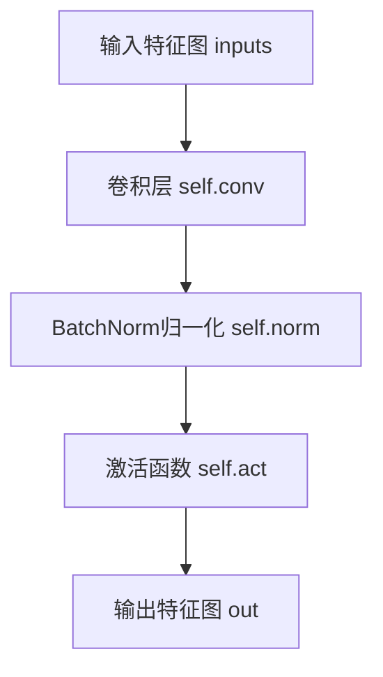
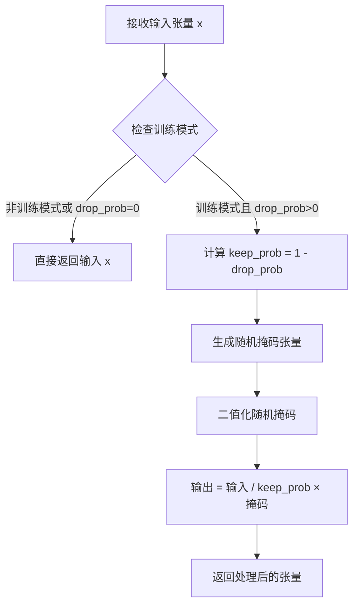
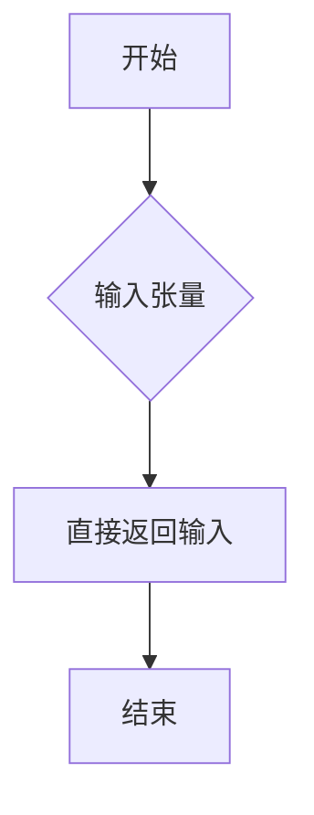
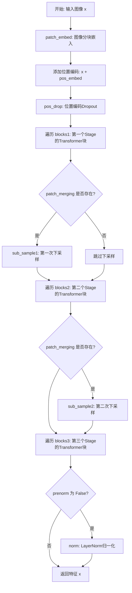
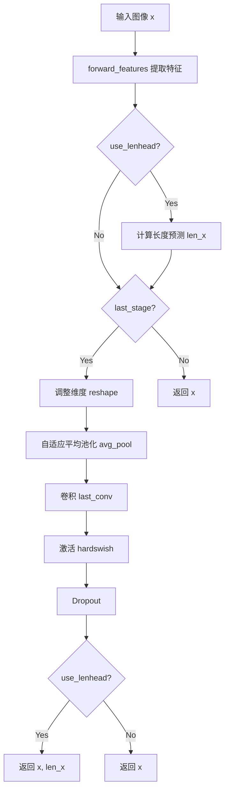

# `MinerU\mineru\model\utils\pytorchocr\modeling\backbones\rec_svtrnet.py` 详细设计文档

这是一个基于PyTorch实现的SVTR（Scene Text Recognition）模型，它结合了卷积神经网络（ConvBNLayer, ConvMixer）和Transformer结构（Attention, Block），通过分阶段（Stage 1/2/3）的局部和全局注意力机制对输入图像进行特征提取，最终用于场景文字识别。

## 整体流程

```mermaid
graph TD
    Input[输入图像 (B, C, H, W)] --> PatchEmb[PatchEmbed模块]
    PatchEmb --> PosEmb[加上位置编码 (Pos Embedding)]
    PosEmb --> Drop[Pos Dropout]
    Drop --> Block1[Stage 1 Blocks (Local Mixer)]
    Block1 -- 需要下采样 --> Sub1[SubSample / Patch Merging]
    Block1 -- 不需要下采样 --> Block2
    Sub1 --> Block2[Stage 2 Blocks]
    Block2 -- 需要下采样 --> Sub2[SubSample / Patch Merging]
    Block2 -- 不需要下采样 --> Block3
    Sub2 --> Block3[Stage 3 Blocks (Global Mixer)]
    Block3 --> PreNormCheck{是否PreNorm?}
    PreNormCheck -- 否 --> NormLayer[应用 LayerNorm]
    PreNormCheck -- 是 --> FeatureOut
    NormLayer --> FeatureOut[特征输出]
    FeatureOut -- use_lenhead=True --> LenHead[长度预测头 (Len Conv + Act + Dropout)]
    FeatureOut --> LastStage[最后阶段 (AvgPool + Conv + HardSwish + Dropout)]
    LenHead --> Output1[输出特征 & 长度预测]
    LastStage --> Output2[输出特征]
```

## 类结构

```
nn.Module (PyTorch基类)
├── ConvBNLayer (卷积+归一化+激活单元)
├── DropPath (随机深度Dropout包装器)
├── Identity (恒等映射)
├── Mlp (多层感知机/前馈网络)
├── ConvMixer (卷积混合器)
├── Attention (注意力机制模块)
│   └── 支持 Global / Local 模式
├── Block (TransformerBlock: Norm->Mixer->DropPath->Norm->MLP->DropPath)
├── PatchEmbed (图像切分与嵌入)
├── SubSample (下采样模块)
└── SVTRNet (主模型骨架)
```

## 全局变量及字段


### `drop_path`
    
Stochastic Depth Drop paths (Stochastic Depth) per sample, randomly drops connections during training to improve generalization.

类型：`function`
    


### `ConvBNLayer.conv`
    
2D convolution layer for spatial feature extraction.

类型：`nn.Conv2d`
    


### `ConvBNLayer.norm`
    
Batch normalization layer for stabilizing activations.

类型：`nn.BatchNorm2d`
    


### `ConvBNLayer.act`
    
Activation function layer (typically GELU).

类型：`Activation`
    


### `DropPath.drop_prob`
    
Probability of dropping a path during stochastic depth.

类型：`float`
    


### `Mlp.fc1`
    
First fully connected layer for feature transformation.

类型：`nn.Linear`
    


### `Mlp.act`
    
Activation function for hidden layer.

类型：`Activation`
    


### `Mlp.fc2`
    
Second fully connected layer for output projection.

类型：`nn.Linear`
    


### `Mlp.drop`
    
Dropout layer for regularization.

类型：`nn.Dropout`
    


### `ConvMixer.HW`
    
Height and width dimensions of input feature map.

类型：`List`
    


### `ConvMixer.dim`
    
Channel dimension of the feature map.

类型：`int`
    


### `ConvMixer.local_mixer`
    
Depthwise convolution for local mixing of spatial features.

类型：`nn.Conv2d`
    


### `Attention.num_heads`
    
Number of attention heads for multi-head self-attention.

类型：`int`
    


### `Attention.scale`
    
Scaling factor for attention scores (head_dim^-0.5).

类型：`float`
    


### `Attention.qkv`
    
Linear layer for generating query, key, and value projections.

类型：`nn.Linear`
    


### `Attention.attn_drop`
    
Dropout layer for attention weights.

类型：`nn.Dropout`
    


### `Attention.proj`
    
Linear projection layer for output of attention block.

类型：`nn.Linear`
    


### `Attention.proj_drop`
    
Dropout layer for projected output.

类型：`nn.Dropout`
    


### `Attention.HW`
    
Height and width of spatial dimensions for attention.

类型：`List`
    


### `Attention.mask`
    
Attention mask for local attention mechanism.

类型：`torch.Tensor (optional)`
    


### `Block.norm1`
    
First normalization layer before mixer.

类型：`nn.LayerNorm`
    


### `Block.mixer`
    
Mixer module for feature transformation (Attention or ConvMixer).

类型：`Attention/ConvMixer`
    


### `Block.drop_path`
    
Stochastic depth drop path layer.

类型：`DropPath`
    


### `Block.norm2`
    
Second normalization layer before MLP.

类型：`nn.LayerNorm`
    


### `Block.mlp`
    
Multi-layer perceptron for feature transformation.

类型：`Mlp`
    


### `Block.prenorm`
    
Flag indicating whether to apply normalization before or after residual connection.

类型：`bool`
    


### `PatchEmbed.img_size`
    
Input image size [height, width].

类型：`List`
    


### `PatchEmbed.num_patches`
    
Total number of patches in the image.

类型：`int`
    


### `PatchEmbed.embed_dim`
    
Embedding dimension per patch.

类型：`int`
    


### `PatchEmbed.norm`
    
Normalization layer for patch embeddings (currently unused).

类型：`None/nn.LayerNorm`
    


### `PatchEmbed.proj`
    
Projection layer to convert image to patch embeddings.

类型：`nn.Sequential/Conv2d`
    


### `SubSample.types`
    
Type of subsampling operation ('Pool' or 'Conv').

类型：`str`
    


### `SubSample.avgpool`
    
Average pooling layer for spatial downsampling.

类型：`nn.AvgPool2d`
    


### `SubSample.maxpool`
    
Max pooling layer for spatial downsampling.

类型：`nn.MaxPool2d`
    


### `SubSample.proj`
    
Linear projection for channel dimension change (Pool type).

类型：`nn.Linear`
    


### `SubSample.conv`
    
Convolutional layer for spatial downsampling (Conv type).

类型：`nn.Conv2d`
    


### `SubSample.norm`
    
Normalization layer for subsampled features.

类型：`nn.LayerNorm`
    


### `SubSample.act`
    
Activation function for subsampled output.

类型：`Activation (optional)`
    


### `SVTRNet.img_size`
    
Input image dimensions [height, width].

类型：`List`
    


### `SVTRNet.embed_dim`
    
Embedding dimensions for each stage [64, 128, 256].

类型：`List`
    


### `SVTRNet.out_channels`
    
Number of output channels for final prediction.

类型：`int`
    


### `SVTRNet.prenorm`
    
Whether to apply layer normalization before residual connections.

类型：`bool`
    


### `SVTRNet.patch_embed`
    
Module for converting image to patch embeddings.

类型：`PatchEmbed`
    


### `SVTRNet.pos_embed`
    
Learnable positional embeddings for patches.

类型：`nn.Parameter`
    


### `SVTRNet.pos_drop`
    
Dropout layer for positional embeddings.

类型：`nn.Dropout`
    


### `SVTRNet.blocks1`
    
List of transformer blocks for first stage.

类型：`nn.ModuleList`
    


### `SVTRNet.blocks2`
    
List of transformer blocks for second stage.

类型：`nn.ModuleList`
    


### `SVTRNet.blocks3`
    
List of transformer blocks for third stage.

类型：`nn.ModuleList`
    


### `SVTRNet.sub_sample1`
    
Subsampling module between stage 1 and 2.

类型：`SubSample`
    


### `SVTRNet.sub_sample2`
    
Subsampling module between stage 2 and 3.

类型：`SubSample`
    


### `SVTRNet.last_stage components`
    
Components for final stage processing (avg_pool, last_conv, hardswish, dropout).

类型：`nn.Module`
    


### `SVTRNet.norm`
    
Final normalization layer when prenorm is False.

类型：`nn.LayerNorm (optional)`
    


### `SVTRNet.len_conv`
    
Optional length prediction head for sequence length estimation.

类型：`nn.Linear (optional)`
    
    

## 全局函数及方法


### `drop_path`

这是一个Stochastic Depth（随机深度）实现，用于在残差块的主路径上按样本随机丢弃路径。该技术通过在训练时随机跳过某些残差连接来改善深度网络的训练效果和泛化能力，类似于Dropout但应用于残差连接。

参数：

- `x`：`torch.Tensor`，输入张量，待应用drop path的原始数据
- `drop_prob`：`float`，丢弃概率，默认为0.0，表示路径被丢弃的概率
- `training`：`bool`，训练模式标志，默认为False，指示是否在训练状态

返回值：`torch.Tensor`，应用drop path后的输出张量

#### 流程图

```mermaid
flowchart TD
    A[开始 drop_path] --> B{drop_prob == 0.0 或 not training?}
    B -->|是| C[直接返回输入x]
    B -->|否| D[计算 keep_prob = 1 - drop_prob]
    D --> E[生成随机形状 shape = (batch_size, 1, ..., 1)]
    E --> F[生成随机张量 random_tensor = keep_prob + torch.rand(shape)]
    F --> G[二值化 random_tensor = floor(random_tensor)]
    G --> H[输出 = x / keep_prob * random_tensor]
    C --> I[结束]
    H --> I
```

#### 带注释源码

```python
def drop_path(x, drop_prob=0.0, training=False):
    """Drop paths (Stochastic Depth) per sample (when applied in main path of residual blocks).
    the original name is misleading as 'Drop Connect' is a different form of dropout in a separate paper...
    See discussion: https://github.com/tensorflow/tpu/issues/494#issuecomment-532968956 ...
    
    参数:
        x: 输入张量，待处理的数据
        drop_prob: 丢弃概率，默认为0.0（不丢弃）
        training: 是否处于训练模式，默认为False
    
    返回:
        处理后的张量，如果drop_prob为0或非训练模式则返回原输入
    """
    # 如果丢弃概率为0，或者不处于训练模式，则直接返回输入，不做任何处理
    if drop_prob == 0.0 or not training:
        return x
    
    # 计算保留概率（keep probability），即不被丢弃的概率
    keep_prob = torch.as_tensor(1 - drop_prob)
    
    # 构建随机张量的形状：(batch_size, 1, 1, ..., 1)
    # 保持与输入x的batch维度一致，其余维度设为1以便后续广播
    shape = (x.shape[0],) + (1,) * (x.ndim - 1)
    
    # 生成[keep_prob, keep_prob+1)范围内的随机数
    # 由于rand生成[0,1)均匀分布，加上keep_prob后范围变为[keep_prob, 1+keep_prob)
    random_tensor = keep_prob + torch.rand(shape, dtype=x.dtype)
    
    # 二值化处理：将随机张量向下取整，得到0或1
    # 这样可以按照drop_prob的概率将部分样本的路径置为0（丢弃）
    random_tensor = torch.floor(random_tensor)  # binarize
    
    # 计算输出：
    # x.divide(keep_prob): 将保留的值乘以1/keep_prob，以补偿因丢弃而减少的期望值
    # * random_tensor: 乘以二值化后的随机张量，确定哪些样本被保留
    output = x.divide(keep_prob) * random_tensor
    
    return output
```


### `ConvBNLayer.forward`

该方法是ConvBNLayer类的前向传播逻辑，接收输入特征图，依次经过卷积层、BatchNorm归一化和激活函数处理，输出变换后的特征图。

参数：

- `self`：隐含的类实例参数，代表ConvBNLayer类的当前实例
- `inputs`：`torch.Tensor`，输入的特征图数据，通常为4维张量（批次大小、通道数、高度、宽度）

返回值：`torch.Tensor`，经过卷积、归一化和激活函数处理后的特征图，维度与输入相同（除通道数可能改变外）

#### 流程图



#### 带注释源码

```python
def forward(self, inputs):
    """
    ConvBNLayer的前向传播方法
    
    参数:
        inputs: 输入的特征图张量，形状为 [batch_size, in_channels, height, width]
    
    返回:
        经过卷积、归一化和激活处理后的特征图张量
    """
    # 第一步：卷积操作
    # 使用卷积核对输入进行线性变换，提取特征
    # 输入: [B, C_in, H, W] -> 输出: [B, C_out, H', W']
    out = self.conv(inputs)
    
    # 第二步：BatchNorm归一化
    # 对卷积输出的特征图进行归一化，稳定训练过程
    # 保持形状不变: [B, C_out, H', W']
    out = self.norm(out)
    
    # 第三步：激活函数处理
    # 应用非线性激活函数（如GELU），增强特征表达能力
    # 保持形状不变: [B, C_out, H', W']
    out = self.act(out)
    
    # 返回最终处理后的特征图
    return out
```


### `DropPath.forward`

该方法是 DropPath 类的成员方法，用于实现 Stochastic Depth（随机深度）技术，在残差块的主路径中对每个样本随机丢弃路径，以改善网络训练效果并减少过拟合。

参数：

- `x`：`torch.Tensor`，输入的张量，通常是残差块的输出

返回值：`torch.Tensor`，经过随机丢弃路径处理后的张量

#### 流程图



#### 带注释源码

```python
def forward(self, x):
    """
    DropPath 的前向传播方法
    
    参数:
        x: torch.Tensor - 输入张量，通常是残差块的输出
        
    返回:
        torch.Tensor - 经过随机路径丢弃处理后的张量
    """
    # 调用 drop_path 辅助函数，传入:
    # - x: 输入张量
    # - self.drop_prob: 丢弃概率
    # - self.training: 当前是否处于训练模式
    return drop_path(x, self.drop_prob, self.training)
```


### `Identity.forward`

该方法实现了恒等映射功能，直接返回输入张量，不做任何变换，通常用于网络结构中作为占位符或跳过某些操作。

参数：

- `input`：`torch.Tensor`，输入的张量，可以是任意形状的张量

返回值：`torch.Tensor`，直接返回输入的张量，未经过任何处理

#### 流程图



#### 带注释源码

```python
class Identity(nn.Module):
    """恒等映射模块，不对输入做任何变换"""
    
    def __init__(self):
        # 调用父类 nn.Module 的初始化方法
        super(Identity, self).__init__()

    def forward(self, input):
        """
        前向传播，直接返回输入
        
        参数:
            input: 输入的张量
        
        返回:
            未经任何处理的输入张量
        """
        return input
```


### `Mlp.forward`

该方法是多层感知机（MLP）模块的前向传播函数，通过两个全连接层、激活函数和Dropout层实现特征的非线性变换，是Vision Transformer架构中FFN（Feed-Forward Network）模块的核心实现。

参数：

- `x`：`torch.Tensor`，输入张量，形状为 `(batch_size, seq_len, in_features)`，即经过嵌入后的序列特征

返回值：`torch.Tensor`，输出张量，形状为 `(batch_size, seq_len, out_features)`，经过MLP变换后的特征

#### 流程图

```mermaid
flowchart TD
    A[输入 x: (B, N, C_in)] --> B[fc1: 线性变换]
    B --> C[act: 激活函数]
    C --> D[drop: Dropout]
    D --> E[fc2: 线性变换]
    E --> F[drop: Dropout]
    F --> G[输出: (B, N, C_out)]
    
    B -.->|扩展维度| C
    E -.->|映射回输出维度| G
```

#### 带注释源码

```python
def forward(self, x):
    """
    MLP模块的前向传播
    
    流程：
    1. 通过第一个全连接层 (fc1) 将输入特征从 in_features 扩展到 hidden_features
    2. 应用激活函数 (act) 引入非线性变换
    3. 应用 Dropout (drop) 防止过拟合
    4. 通过第二个全连接层 (fc2) 将特征从 hidden_features 映射到 out_features
    5. 再次应用 Dropout (drop) 进行正则化
    """
    # 第一层：线性变换 + 激活 + Dropout
    x = self.fc1(x)           # (B, N, C_in) -> (B, N, C_hidden)
    x = self.act(x)           # 应用激活函数 (如 GELU)
    x = self.drop(x)          # Dropout 正则化
    
    # 第二层：线性变换 + Dropout
    x = self.fc2(x)           # (B, N, C_hidden) -> (B, N, C_out)
    x = self.drop(x)          # Dropout 正则化
    
    return x                  # 返回变换后的特征
```


### `ConvMixer.forward`

该方法实现 ConvMixer 架构的前向传播，通过深度可分离卷积（group convolution）在特征维度上进行局部混合，将输入的序列特征转换为空间二维形式进行处理后再展平恢复为序列形式。

参数：

- `x`：`torch.Tensor`，输入张量，形状为 `[batch_size, seq_len, dim]`，表示批量大小的序列特征

返回值：`torch.Tensor`，经过局部卷积混合后的特征，形状为 `[batch_size, seq_len, dim]`

#### 流程图

```mermaid
flowchart TD
    A[输入 x: (batch_size, seq_len, dim)] --> B[转置和reshape]
    B --> C[transpose [0,2,1]后reshape为: (batch_size, dim, H, W)]
    C --> D[local_mixer卷积: nn.Conv2d]
    D --> E[输出: (batch_size, dim, H, W)]
    E --> F[flatten和permute]
    F --> G[输出 x: (batch_size, seq_len, dim)]
```

#### 带注释源码

```python
def forward(self, x):
    """ConvMixer forward pass
    
    Args:
        x: Input tensor of shape [batch_size, seq_len, dim]
        
    Returns:
        Output tensor after local mixing, shape [batch_size, seq_len, dim]
    """
    # 获取高度和宽度
    h = self.HW[0]  # 8
    w = self.HW[1]  # 25
    
    # 第一步：转置和reshape
    # 将 (batch_size, seq_len, dim) -> (batch_size, dim, h, w)
    # transpose([0, 2, 1]) 将 seq_len 和 dim 维度交换
    # reshape 将其重组为 (batch_size, dim, h, w) 的4D张量
    x = x.transpose([0, 2, 1]).reshape([0, self.dim, h, w])
    
    # 第二步：应用局部混合器（深度可分离卷积）
    # 使用 groups=num_heads 的分组卷积实现局部特征交互
    x = self.local_mixer(x)
    
    # 第三步：flatten和permute
    # flatten(2) 将 (batch_size, dim, h, w) -> (batch_size, dim, h*w)
    # permute(0, 2, 1) 将 (batch_size, dim, h*w) -> (batch_size, h*w, dim)
    # 最终输出形状恢复为 (batch_size, seq_len, dim)
    x = x.flatten(2).permute(0, 2, 1)
    
    return x
```


### `Attention.forward`

该方法实现了多头自注意力机制（Multi-Head Attention），支持全局注意力和局部注意力两种模式，通过计算Query、Key、Value的相似度来捕捉输入特征之间的关联性，并利用mask矩阵实现局部注意力的约束。

参数：

- `x`：`torch.Tensor`，输入张量，形状为 `(batch_size, sequence_length, dim)` 或在已知HW尺寸时为 `(batch_size, N, C)`

返回值：`torch.Tensor`，经过注意力机制处理后的输出张量，形状为 `(batch_size, N, C)`

#### 流程图

```mermaid
flowchart TD
    A[输入x] --> B{self.HW是否为空}
    B -->|是| C[使用预定义的N和C]
    B -->|否| D[从x.shape获取N和C]
    C --> E[qkv = self.qkv(x)]
    D --> E
    E --> F[reshape和permute操作<br/>qkv形状变换]
    F --> G[分离q, k, v<br/>q *= self.scale]
    G --> H[计算注意力分数<br/>attn = q @ k.permute]
    H --> I{mixer类型}
    I -->|Local| J[attn += self.mask]
    I -->|Global| K[跳过mask]
    J --> L[softmax归一化]
    K --> L
    L --> M[attn_dropout]
    M --> N[加权聚合<br/>x = attn @ v]
    N --> O[reshape和permute<br/>恢复原始形状]
    O --> P[线性投影<br/>self.proj]
    Q[proj_dropout] --> R[返回x]
    P --> R
```

#### 带注释源码

```python
def forward(self, x):
    """多头自注意力前向传播
    
    参数:
        x: 输入张量，形状为 (batch_size, N, C) 或 (batch_size, sequence_length, dim)
    
    返回:
        经过注意力机制处理后的张量，形状为 (batch_size, N, C)
    """
    # 1. 确定序列长度N和特征维度C
    if self.HW is not None:
        N = self.N      # 序列长度 H * W
        C = self.C      # 特征维度 dim
    else:
        # 如果未指定HW，则从输入张量形状推断
        _, N, C = x.shape
    
    # 2. 线性投影生成QKV
    # qkv形状: (batch_size, N, dim * 3)
    qkv = self.qkv(x)
    
    # 3. reshape和permute操作
    # 将qkv reshape为 (batch_size, N, 3, num_heads, head_dim)
    # 然后permute为 (3, batch_size, num_heads, N, head_dim)
    # 其中 head_dim = C // num_heads
    qkv = qkv.reshape((-1, N, 3, self.num_heads, C // self.num_heads)).permute(
        2, 0, 3, 1, 4
    )
    
    # 4. 分离Query, Key, Value
    # q形状: (batch_size, num_heads, N, head_dim)
    # k形状: (batch_size, num_heads, N, head_dim)
    # v形状: (batch_size, num_heads, N, head_dim)
    # 对q进行缩放
    q, k, v = qkv[0] * self.scale, qkv[1], qkv[2]
    
    # 5. 计算注意力分数
    # q @ k.permute(0, 1, 3, 2) 形状: (batch_size, num_heads, N, N)
    attn = q.matmul(k.permute(0, 1, 3, 2))
    
    # 6. 如果是局部注意力，加上mask
    if self.mixer == "Local":
        # mask形状: (1, 1, N, N)，用于限制注意力的感受野
        attn += self.mask
    
    # 7. softmax归一化
    attn = nn.functional.softmax(attn, dim=-1)
    
    # 8. 注意力dropout
    attn = self.attn_drop(attn)
    
    # 9. 加权聚合得到新的特征
    # x形状: (batch_size, num_heads, N, head_dim)
    x = (attn.matmul(v)).permute(0, 2, 1, 3).reshape((-1, N, C))
    
    # 10. 线性投影
    x = self.proj(x)
    
    # 11. 输出dropout
    x = self.proj_drop(x)
    
    return x
```


### `Block.forward`

该方法是 Vision Transformer 中 Block 类的核心前向传播逻辑，实现了带残差连接的混合器（Attention/ConvMixer）和 MLP 网络，支持 Pre-Norm 和 Post-Norm 两种归一化方式，以适应不同的训练稳定性和性能需求。

参数：

- `x`：`torch.Tensor`，输入张量，形状为 `(B, N, C)`，其中 B 为批量大小，N 为序列长度，C 为特征维度

返回值：`torch.Tensor`，输出张量，形状与输入相同 `(B, N, C)`

#### 流程图

```mermaid
flowchart TD
    A[输入 x] --> B{self.prenorm?}
    B -->|True| C[Pre-Norm 路径]
    B -->|False| D[Post-Norm 路径]
    
    C --> C1[norm1(x)]
    C1 --> C2[self.mixer(x)]
    C2 --> C3[self.drop_path]
    C3 --> C4[x + drop_path_output]
    C4 --> C5[norm2]
    C5 --> C6[self.mlp]
    C6 --> C7[self.drop_path]
    C7 --> C8[x + drop_path_output]
    C8 --> Z[返回 x]
    
    D --> D1[self.norm1(x)]
    D1 --> D2[self.mixer]
    D2 --> D3[self.drop_path]
    D3 --> D4[x + drop_path]
    D4 --> D5[self.norm2]
    D5 --> D6[self.mlp]
    D6 --> D7[self.drop_path]
    D7 --> D8[x + drop_path]
    D8 --> Z
```

#### 带注释源码

```python
def forward(self, x):
    """
    Block 的前向传播
    
    实现两种残差连接模式：
    1. Pre-Norm: norm -> mixernorm -> dropout -> add
    2. Post-Norm: mixernorm -> dropout -> add -> norm
    
    参数:
        x: 输入张量，形状为 (B, N, C)
           B: batch size
           N: 序列长度 (number of patches)
           C: 特征维度 (embedding dimension)
    
    返回:
        x: 输出张量，形状为 (B, N, C)
    """
    # 判断使用 Pre-Norm 还是 Post-Norm 模式
    if self.prenorm:
        # ===== Pre-Norm 模式 =====
        # 1. 对输入进行归一化
        # 2. 通过混合器（Attention/ConvMixer）
        # 3. 应用随机深度（DropPath）
        # 4. 残差连接
        # 5. 重复 MLP 过程
        x = self.norm1(x + self.drop_path(self.mixer(x)))
        x = self.norm2(x + self.drop_path(self.mlp(x)))
    else:
        # ===== Post-Norm 模式 =====
        # 1. 先通过混合器（带归一化）
        # 2. 应用随机深度
        # 3. 残差连接后再归一化
        # 4. 重复 MLP 过程
        x = x + self.drop_path(self.mixer(self.norm1(x)))
        x = x + self.drop_path(self.mlp(self.norm2(x)))
    
    return x
```


### `PatchEmbed.forward`

描述：PatchEmbed类的前向传播方法，将输入图像转换为补丁嵌入向量。该方法首先验证输入图像尺寸是否匹配模型期望的尺寸，然后通过卷积投影层处理图像，最后将特征图展平并重新排列为序列格式。

参数：

- `self`：PatchEmbed，PatchEmbed类的实例，包含模型配置和投影层
- `x`：`torch.Tensor`，输入图像张量，形状为(B, C, H, W)，其中B是批量大小，C是通道数，H和W分别是图像的高度和宽度

返回值：`torch.Tensor`，形状为(B, num_patches, embed_dim)，其中num_patches是补丁数量，embed_dim是嵌入维度。返回的张量将作为后续Transformer块的输入。

#### 流程图

```mermaid
graph LR
    A[输入图像 x<br/>形状: (B, C, H, W)] --> B{验证图像尺寸}
    B -->|匹配| C[通过 proj 卷积层]
    B -->|不匹配| D[抛出断言错误]
    C --> E[flatten(2)<br/>展平空间维度]
    E --> F[permute(0, 2, 1)<br/>重新排列维度]
    F --> G[输出嵌入向量<br/>形状: (B, num_patches, embed_dim)]
    
    style C fill:#e1f5fe
    style E fill:#e1f5fe
    style F fill:#e1f5fe
    style G fill:#c8e6c9
```

#### 带注释源码

```python
def forward(self, x):
    """
    前向传播：将输入图像转换为补丁嵌入向量
    
    参数:
        x: 输入图像张量，形状为 (B, C, H, W)
        
    返回:
        补丁嵌入向量，形状为 (B, num_patches, embed_dim)
    """
    # 解包输入张量的形状信息
    # B: 批量大小, C: 通道数, H: 高度, W: 宽度
    B, C, H, W = x.shape
    
    # 验证输入图像尺寸是否与模型配置的img_size匹配
    # 如果不匹配，抛出包含实际尺寸和期望尺寸的断言错误
    assert (
        H == self.img_size[0] and W == self.img_size[1]
    ), "Input image size ({}*{}) doesn't match model ({}*{}).".format(
        H, W, self.img_size[0], self.img_size[1]
    )
    
    # 通过卷积投影层处理图像
    # proj 可以是 ConvBNLayer 的 Sequential（mode="pope"）
    # 或 nn.Conv2d（mode="linear"）
    # 输出形状: (B, embed_dim, H', W')，其中H'和W'经过stride=2的卷积后减小
    x = self.proj(x)
    
    # 展平空间维度
    # 从 (B, embed_dim, H', W') 展平为 (B, embed_dim, H'*W')
    x = x.flatten(2)
    
    # 重新排列维度，从 (B, embed_dim, H'*W') 变为 (B, H'*W', embed_dim)
    # 这样每个补丁位置对应一个 embed_dim 维的向量
    x = x.permute(0, 2, 1)
    
    # 返回形状: (B, num_patches, embed_dim)
    # num_patches = H' * W' = (img_size[0] // (2**sub_num)) * (img_size[1] // (2**sub_num))
    return x
```


### `SubSample.forward`

该方法是 SubSample 类的前向传播逻辑，根据类型（Pool 或 Conv）对输入进行下采样（降维）或卷积操作，并经过归一化和激活函数处理，最后将特征图展平为序列形式输出。

参数：

- `x`：`torch.Tensor`，输入张量，形状为 `(batch_size, in_channels, height, width)`，代表批次图像的特征图

返回值：`torch.Tensor`，输出张量，形状为 `(batch_size, seq_len, out_channels)`，其中 `seq_len` 为展平后的序列长度（取决于 stride 和输入尺寸）

#### 流程图

```mermaid
flowchart TD
    A[输入 x: (B, C, H, W)] --> B{types == 'Pool'?}
    B -- 是 --> C[avgpool 操作]
    C --> D[maxpool 操作]
    D --> E[平均池化结果: (x1 + x2) * 0.5]
    E --> F[flatten + permute 维度变换]
    F --> G[Linear 投影: proj]
    B -- 否 --> H[Conv2d 卷积操作]
    H --> I[flatten + permute 维度变换]
    G --> J[LayerNorm 归一化]
    I --> J
    J --> K{act is not None?}
    K -- 是 --> L[激活函数: act]
    K -- 否 --> M[输出 out]
    L --> M
```

#### 带注释源码

```python
def forward(self, x):
    """
    SubSample 模块的前向传播方法，根据 types 类型执行下采样或卷积操作
    
    参数:
        x: torch.Tensor, 输入张量 (batch_size, in_channels, height, width)
    
    返回:
        torch.Tensor: 输出张量 (batch_size, seq_len, out_channels)
    """
    # 判断是否使用 Pool 类型的下采样
    if self.types == "Pool":
        # 执行平均池化，kernel_size=[3,5], stride=[2,1], padding=[1,2]
        x1 = self.avgpool(x)
        # 执行最大池化，kernel_size=[3,5], stride=[2,1], padding=[1,2]
        x2 = self.maxpool(x)
        # 对两个池化结果取平均，融合不同池化策略的特征
        x = (x1 + x2) * 0.5
        # 将特征图展平为 (batch, seq_len, channels) 格式
        # flatten(2): 保留 batch 和 channel 维度，将 H*W 展平
        # permute(0, 2, 1): 将维度重新排列为 (batch, seq_len, channels)
        out = self.proj(x.flatten(2).permute(0, 2, 1))
    else:
        # 使用卷积进行下采样
        x = self.conv(x)
        # 同样进行维度变换：(B, C, H, W) -> (B, H*W, C)
        out = x.flatten(2).permute(0, 2, 1)
    
    # LayerNorm 归一化，对每个样本的特征维度进行归一化处理
    out = self.norm(out)
    
    # 如果定义了激活函数，则应用激活
    if self.act is not None:
        out = self.act(out)

    return out
```


### `SVTRNet._init_weights`

该方法是`SVTRNet`类的私有方法，用于对模型中的权重参数进行初始化。它通过遍历模型的所有子模块，根据不同层类型（卷积层、批归一化层、线性层、转置卷积层、层归一化）采用相应的权重初始化策略，确保模型参数在训练前具有合理的初始值。

参数：

- `m`：`torch.nn.Module`，表示模型中的任意层或模块，用于判断类型并执行对应的权重初始化

返回值：`None`，无返回值，该方法直接修改传入模块的参数

#### 流程图

```mermaid
flowchart TD
    A[开始初始化权重] --> B{判断模块类型 m}
    B -->|nn.Conv2d| C[使用 Kaiming Normal 初始化 weight]
    C --> D{判断 bias 是否存在}
    D -->|是| E[将 bias 初始化为零]
    D -->|否| F[跳过 bias 初始化]
    B -->|nn.BatchNorm2d| G[weight 初始化为 1]
    G --> H[bias 初始化为 0]
    B -->|nn.Linear| I[weight 服从 N(0, 0.01) 正态分布]
    I --> J{判断 bias 是否存在}
    J -->|是| K[将 bias 初始化为零]
    J -->|否| L[跳过 bias 初始化]
    B -->|nn.ConvTranspose2d| M[使用 Kaiming Normal 初始化 weight]
    M --> N{判断 bias 是否存在}
    N -->|是| O[将 bias 初始化为零]
    N -->|否| P[跳过 bias 初始化]
    B -->|nn.LayerNorm| Q[weight 初始化为 1]
    Q --> R[bias 初始化为 0]
    F --> S[结束权重初始化]
    E --> S
    L --> S
    O --> S
    R --> S
```

#### 带注释源码

```python
def _init_weights(self, m):
    """Initialize weights for different types of neural network layers.
    
    Args:
        m: A neural network module (nn.Conv2d, nn.BatchNorm2d, nn.Linear, 
           nn.ConvTranspose2d, or nn.LayerNorm) to be initialized.
    """
    # weight initialization
    if isinstance(m, nn.Conv2d):
        # Kaiming initialization for Conv2d layers, suitable for ReLU activations
        nn.init.kaiming_normal_(m.weight, mode="fan_out")
        if m.bias is not None:
            nn.init.zeros_(m.bias)
    elif isinstance(m, nn.BatchNorm2d):
        # BatchNorm weight initialized to 1, bias to 0 (standard practice)
        nn.init.ones_(m.weight)
        nn.init.zeros_(m.bias)
    elif isinstance(m, nn.Linear):
        # Linear layers: weight from N(0, 0.01), small std for stability
        nn.init.normal_(m.weight, 0, 0.01)
        if m.bias is not None:
            nn.init.zeros_(m.bias)
    elif isinstance(m, nn.ConvTranspose2d):
        # Transposed convolutions: similar to Conv2d initialization
        nn.init.kaiming_normal_(m.weight, mode="fan_out")
        if m.bias is not None:
            nn.init.zeros_(m.bias)
    elif isinstance(m, nn.LayerNorm):
        # LayerNorm: weight initialized to 1, bias to 0
        nn.init.ones_(m.weight)
        nn.init.zeros_(m.bias)
```


### `SVTRNet.forward_features`

该方法是SVTRNet的核心特征提取模块，负责将输入图像通过分块嵌入、多层Transformer块处理、PatchMerging下采样以及可选的LayerNorm归一化，最终输出序列化的视觉特征表示。

参数：

- `self`：`SVTRNet`，SVTRNet实例本身，隐含参数
- `x`：`torch.Tensor`，输入图像张量，形状为 `[B, C, H, W]`，其中 B 为批量大小，C 为通道数，H 和 W 分别为图像高度和宽度

返回值：`torch.Tensor`，提取的特征张量，形状为 `[B, N, C]`，其中 N 为序列长度（Patch数量），C 为特征维度

#### 流程图



#### 带注释源码

```python
def forward_features(self, x):
    """
    SVTRNet 特征提取前向传播方法
    
    处理流程：
    1. Patch Embedding: 将输入图像转换为Patch序列
    2. 添加位置编码并应用Dropout
    3. 依次通过三个Stage的Transformer块
    4. 在Stage之间可选地进行Patch Merging下采样
    5. 可选地应用最终的LayerNorm归一化
    
    Args:
        x: 输入图像张量，形状为 [B, C, H, W]
    
    Returns:
        提取的特征张量，形状为 [B, N, C]
    """
    
    # Step 1: Patch Embedding - 将图像切分为非重叠的Patch并嵌入到向量空间
    # 输入: [B, C, H, W] -> 输出: [B, N, embed_dim[0]]
    x = self.patch_embed(x)
    
    # Step 2: 添加可学习的位置编码，弥补Patch之间的位置信息
    # 位置编码在初始化时使用Xavier正态分布
    x = x + self.pos_embed
    
    # Step 3: 对位置编码后的序列应用Dropout，防止过拟合
    x = self.pos_drop(x)
    
    # Step 4: 通过第一个Stage的Transformer块（局部注意力为主）
    # depth[0] 个 Block，每个Block包含: Attention/ConvMixer + MLP + DropPath
    for blk in self.blocks1:
        x = blk(x)
    
    # Step 5: 可选的Patch Mergging下采样（只在patch_merging不为None时执行）
    # 将序列长度减半，通道数翻倍: [B, N, dim[0]] -> [B, N/2, dim[1]]
    # 需要先将序列维度permute并reshape回2D图像形式进行下采样
    if self.patch_merging is not None:
        x = self.sub_sample1(
            x.permute(0, 2, 1).reshape(  # [B, N, C] -> [B, C, H, W]
                [-1, self.embed_dim[0], self.HW[0], self.HW[1]]
            )
        )
    
    # Step 6: 通过第二个Stage的Transformer块（混合局部和全局注意力）
    for blk in self.blocks2:
        x = blk(x)
    
    # Step 7: 第二次Patch Merging下采样
    # 通道数再次翻倍: [B, N/2, dim[1]] -> [B, N/4, dim[2]]
    if self.patch_merging is not None:
        x = self.sub_sample2(
            x.permute(0, 2, 1).reshape(
                [-1, self.embed_dim[1], self.HW[0] // 2, self.HW[1]]
            )
        )
    
    # Step 8: 通过第三个Stage的Transformer块（全局注意力为主）
    for blk in self.blocks3:
        x = blk(x)
    
    # Step 9: 如果使用Post-norm模式，则在输出前应用LayerNorm
    # prenorm=True 使用Pre-norm（在残差连接之前归一化）
    # prenorm=False 使用Post-norm（在残差连接之后归一化），需要在最后额外加一层Norm
    if not self.prenorm:
        x = self.norm(x)
    
    # 返回最终提取的特征序列，形状为 [B, N, embed_dim[-1]]
    return x
```


### `SVTRNet.forward`

该方法是SVTRNet网络的前向传播核心逻辑，负责将输入图像通过特征提取模块和可选的长度预测头，输出识别特征或（特征，长度预测）的元组。

参数：
- `self`：类实例本身，包含网络各层参数和配置信息
- `x`：`torch.Tensor`，输入图像张量，形状为 `[B, C, H, W]`，其中B为批量大小，C为通道数，H和W分别为图像高宽

返回值：`torch.Tensor` 或 `tuple(torch.Tensor, torch.Tensor)`，当`use_lenhead=True`时返回元组(特征张量, 长度预测张量)，否则仅返回特征张量。特征张量形状为 `[B, out_channels, 1, out_char_num]`，长度预测张量形状为 `[B, out_channels]`。

#### 流程图



#### 带注释源码

```python
def forward(self, x):
    """
    SVTRNet前向传播
    
    Args:
        x: 输入图像张量，形状 [B, C, H, W]
    
    Returns:
        当use_lenhead=True时返回(x, len_x)，否则返回x
        x: 特征张量 [B, out_channels, 1, out_char_num]
        len_x: 长度预测张量 [B, out_channels]
    """
    # 第一阶段：特征提取
    # 调用特征提取子模块，将图像编码为序列特征
    x = self.forward_features(x)
    
    # 第二阶段：可选的长度预测头
    # 用于预测输出序列的长度，辅助训练
    if self.use_lenhead:
        # 对序列维度求平均，得到全局特征表示
        len_x = self.len_conv(x.mean(1))
        # 依次经过Hardswish激活和Dropout
        len_x = self.dropout_len(self.hardswish_len(len_x))
    
    # 第三阶段：最终卷积处理
    if self.last_stage:
        # 计算特征图的高度维度
        # 若使用patch_merging则高度被下采样4倍，否则为原高度
        if self.patch_merging is not None:
            h = self.HW[0] // 4
        else:
            h = self.HW[0]
        
        # 维度变换：[B, N, C] -> [B, C, H, W] -> 进行池化
        # 将序列特征还原为2D特征图以便使用2D卷积
        x = self.avg_pool(
            x.permute(0, 2, 1).reshape([-1, self.embed_dim[2], h, self.HW[1]])
        )
        # 1x1卷积调整通道数到目标输出通道
        x = self.last_conv(x)
        # Hardswish激活函数
        x = self.hardswish(x)
        # Dropout正则化
        x = self.dropout(x)
    
    # 返回最终结果
    if self.use_lenhead:
        return x, len_x
    return x
```

## 关键组件


### PatchEmbed

图像到Patch嵌入的模块，支持多种模式（"pope"和"linear"），通过卷积层将输入图像转换为token序列，包含多层卷积和BatchNorm。

### Attention

支持全局注意力和局部注意力的Transformer注意力模块，包含QKV计算、注意力矩阵计算和可选的局部注意力掩码处理。

### Block

Transformer编码器块，包含注意力层（支持Global/Local/Conv混合器）、MLP层、DropPath和LayerNorm，支持pre-norm和post-norm两种归一化方式。

### ConvMixer

卷积混合器模块，使用深度可分离卷积实现局部token混合，作为注意力机制的替代方案。

### Mlp

多层感知机模块，包含两个线性层和激活函数，用于Transformer块中的前馈网络。

### SubSample

下采样模块，支持池化（AvgPool+MaxPool）和卷积两种下采样方式，用于特征图的空间降采样。

### DropPath

随机深度模块，在残差路径中随机丢弃路径以提高训练稳定性和泛化能力。

### SVTRNet

主网络架构，一个用于场景文字识别的Vision Transformer网络，采用多阶段设计（3个stage），支持patch merging、长度预测头和多种注意力机制组合。

### ConvBNLayer

卷积+批归一化+激活的组合模块，提供标准化的卷积特征提取单元。


## 问题及建议


### 已知问题

-   **eval() 安全风险与性能问题**：在 `Block`、`PatchEmbed`、`SubSample` 和 `SVTRNet` 类中多处使用 `eval(norm_layer)(dim, eps=epsilon)` 动态执行字符串来创建层对象，这不仅存在潜在的安全风险，且每次调用都会重新解析字符串，应在 `__init__` 中预先解析并缓存。
-   **SubSample 冗余计算**：在 `SubSample` 的 `forward` 方法中，当 `types == "Pool"` 时计算了 `x1 + x2` 但随后又乘以 0.5，这种先加后乘的逻辑可简化为直接操作，且 `self.avgpool` 和 `self.maxpool` 同时计算浪费计算资源。
-   **重复代码模式**：在 `PatchEmbed` 中 `sub_num==2` 和 `sub_num==3` 的分支包含大量重复的 `ConvBNLayer` 堆叠逻辑，可通过循环或工厂函数简化。
- **硬编码的混合器类型**：在 `SVTRNet.__init__` 中 `mixer=["Local"] * 6 + ["Global"] * 6` 是硬编码的默认值，且在创建 `Block_unit` 时通过字符串索引切片 `mixer[0 : depth[0]][i]` 传递，这种基于字符串列表的配置方式不够类型安全且难以维护。
- **Attention mask 的设备兼容性**：在 `Attention.__init__` 中创建的 `self.mask` 直接使用 `torch.ones` 和 `torch.full`，未考虑模型可能部署在 GPU/CPU 等不同设备上，应使用 `torch.ones(..., device=...)` 确保与输入 tensor 设备一致。
- **不完整的 DropPath 优化**：`drop_path` 函数中使用 `torch.floor(random_tensor)` 进行二值化，在 GPU 上可考虑使用 `torch.bernoulli` 或其他更高效的随机生成方式。

### 优化建议

-   移除所有 `eval()` 调用，改用字典映射或 `nn.Module` 注册机制在模块初始化时完成层对象的创建。
-   统一设备管理，在创建 mask、pos_embed 等参数时显式指定 `device` 和 `dtype`，或使用 `nn.Parameter` 并在 `to()` 调用时自动迁移。
-   将 `PatchEmbed` 中的重复卷积层构建逻辑提取为循环生成的辅助方法，减少代码冗余。
-   为混合器类型实现工厂模式或枚举类，替代字符串驱动的条件分支，提升类型安全和可读性。
-   优化 `SubSample` 的池化逻辑，根据实际精度需求评估是否需要同时保留 avgpool 和 maxpool，或合并为单一操作。
-   在 `Attention` 中将 mask 计算移至 `forward` 方法内，或确保其设备与输入张量同步，避免运行时设备不匹配错误。

## 其它


### 设计目标与约束

本模块的设计目标是实现一个高效的视觉Transformer架构（SVTRNet），用于场景文本识别任务。核心约束包括：(1) 支持多种注意力机制混合（Local/Global/Conv），适应不同尺度文本特征提取；(2) 采用分层设计（3个stage）实现多尺度特征融合；(3) 支持可变输入分辨率（默认32x100）；(4) 通过drop_path机制实现随机深度正则化，提高模型泛化能力；(5) 兼容PyTorch框架生态。

### 错误处理与异常设计

代码中的错误处理主要包含以下几个方面：
1. **输入尺寸校验**：PatchEmbed.forward()中检查输入图像尺寸是否与img_size匹配，不匹配时抛出AssertionError并显示详细错误信息。
2. **参数合法性检查**：Block类中mixer参数仅支持"Global"、"Local"、"Conv"三种模式，不合法时抛出TypeError。
3. **隐式假设处理**：Attention类中假设输入维度可被num_heads整除（head_dim = dim // num_heads），若不满足可能导致非整数维度。
4. **异常传播机制**：所有nn.Module的forward方法未显式捕获异常，错误将直接向上传播。

### 数据流与状态机

SVTRNet的数据流分为以下几个阶段：
1. **Patch Embedding阶段**：输入图像(B, C, H, W) → PatchEmbed → 展平并转置为序列(B, N, D)
2. **位置编码添加**：添加可学习位置编码pos_embed，并进行dropout
3. **Stage 1处理**：经过depth[0]个Block，每个Block内部： prenorm模式下为 x = norm1(x + drop_path(mixer(x)))；postnorm模式下为 x = x + drop_path(mixer(norm1(x)))
4. **Patch Merging**：根据patch_merging类型进行下采样（Conv或Pool），维度从embed_dim[0]升至embed_dim[1]
5. **Stage 2和Stage 3处理**：类似Stage 1的Transformer Block堆叠
6. **输出层**：可选len_head（长度预测头）和last_stage（特征输出），最终输出形状为(B, out_channels, 1, out_char_num)

### 外部依赖与接口契约

**主要依赖**：
1. numpy - 用于生成drop_path的线性插值数组
2. torch (PyTorch) - 深度学习框架
3. ..common.Activation - 自定义激活函数模块

**接口契约**：
1. SVTRNet.__init__接受大量配置参数，采用字典式参数设计
2. 唯一公开接口：forward(x)，输入为(B, 3, 32, 100)的图像张量，输出根据use_lenhead和last_stage配置变化
3. forward_features(x)为半公开接口，可用于特征提取

### 性能考虑与优化点

1. **计算优化**：ConvMixer使用分组卷积（groups=num_heads）减少计算量
2. **内存优化**：Local Attention中预计算mask避免推理时重复计算；drop_path使用in-place操作减少内存分配
3. **初始化优化**：使用Kaiming Normal初始化卷积层，Xavier Normal初始化位置编码
4. **潜在优化点**：
   - Attention中的mask为全量预计算，当HW很大时显存占用高
   - patch_merging仅支持固定stride=[2,1]，不够灵活
   - SubSample中avgpool和maxpool计算冗余，可合并

### 安全性设计

1. **数值安全**：drop_path中使用torch.as_tensor确保keep_prob为Tensor类型，避免Python标量运算问题
2. **除零保护**：drop_path中当drop_prob=0时直接返回，避免后续除零操作
3. **数值稳定**：softmax前加入mask时使用-inf而非极负值，确保数值稳定性
4. **输入校验**：PatchEmbed中对输入尺寸的assert检查可防止无效维度传播

### 测试策略建议

1. **单元测试**：各模块（ConvBNLayer, Mlp, Attention, Block等）独立测试输入输出维度一致性
2. **集成测试**：完整前向传播测试，验证输出尺寸符合预期
3. **边界测试**：测试极端输入（如最小分辨率、单通道、drop_path=1.0等）
4. **梯度测试**：验证各模块梯度反向传播正确性
5. **可复现性测试**：固定随机种子验证模型输出确定性

### 配置与可扩展性设计

**可配置项**：
1. 模型深度：depth=[3,6,3]控制各stage block数量
2. 嵌入维度：embed_dim=[64,128,256]支持不同容量模型
3. 注意力类型：mixer列表支持任意组合Local/Global/Conv
4. 归一化层：norm_layer和sub_norm支持替换为LayerNorm/BatchNorm
5. 激活函数：act_layer和act参数控制激活类型
6. 输出配置：use_lenhead和last_stage控制输出头

**扩展点**：
1. 通过block_unit参数支持自定义Block类型
2. PatchEmbed支持mode="pope"或"linear"两种嵌入方式
3. SubSample支持types="Pool"或"Conv"两种下采样方式
4. 可通过继承现有模块添加新的注意力机制

### 版本兼容性与平台考虑

1. **PyTorch版本**：代码使用torch.rand、torch.floor、torch.where等API，需PyTorch 1.0+
2. **设备兼容性**：代码未显式指定device，需外部确保输入张量与模型参数在同一设备
3. **动态图特性**：完全基于PyTorch动态图实现，支持自动求导
4. **ONNX导出**：eval()动态代码可能影响模型序列化，建议使用字符串注册或直接传入类对象

### 关键设计决策记录

1. **为什么选择 Prenorm**：代码默认prenorm=True，因为Pre-LN在深层Transformer中训练更稳定，梯度分布更均匀
2. **为什么使用Local+Global混合**：文本图像通常宽度远大于高度，Local Attention捕获局部字符特征，Global Attention建模字符间依赖
3. **为什么Patch Merging用Conv/Pool**：相比直接reshape，下采样能有效减少序列长度，降低后续计算复杂度
4. **为什么Length Prediction作为可选头**：文本长度是重要特征，可用于后接CTC或Attention解码器

    