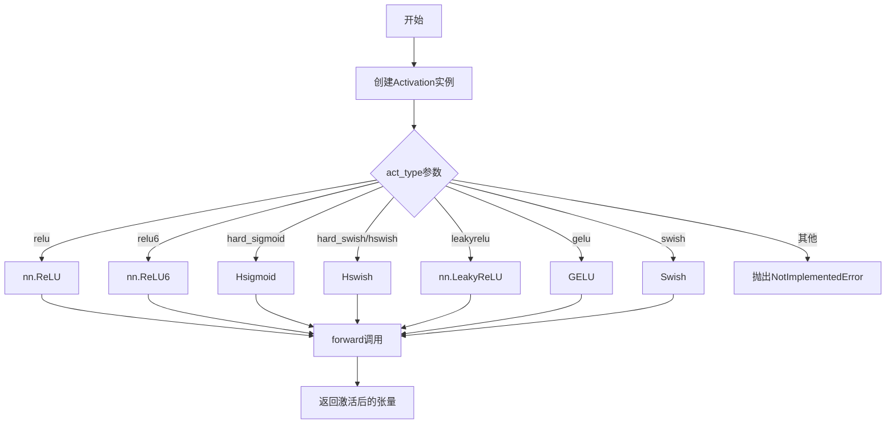
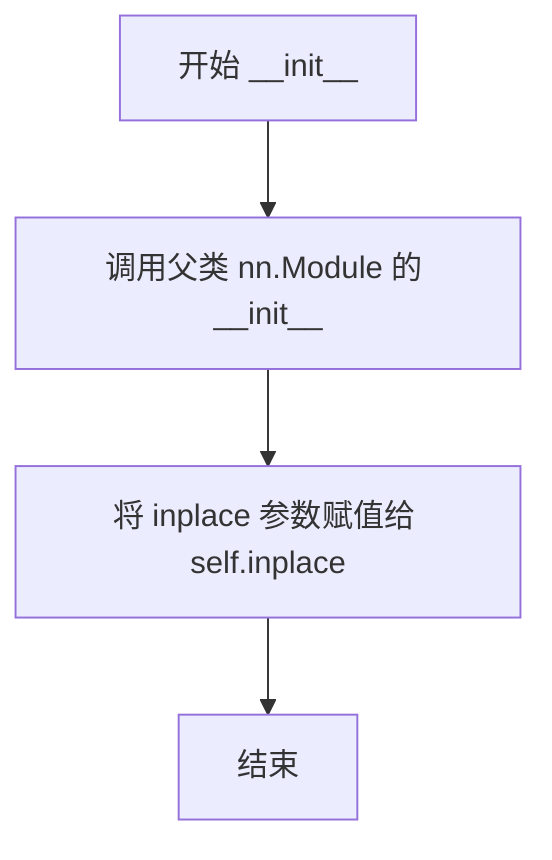
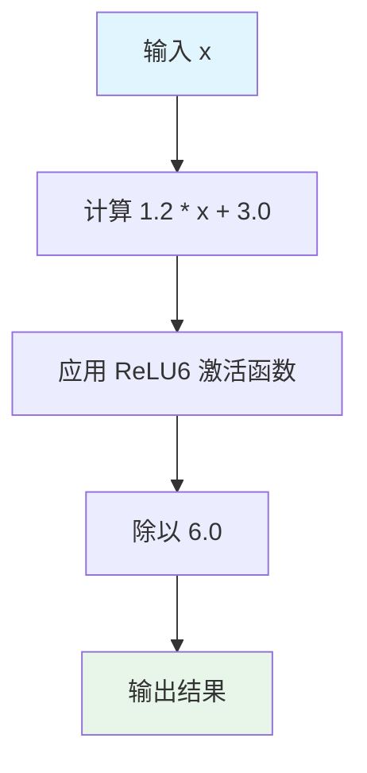
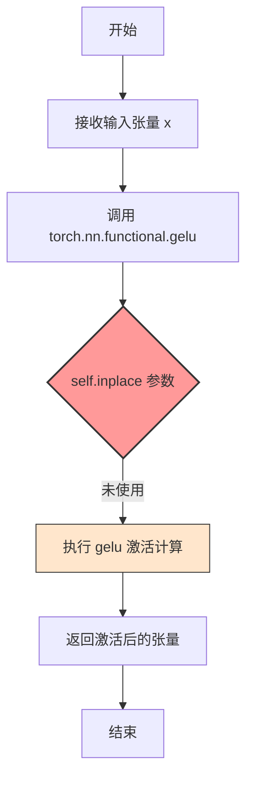
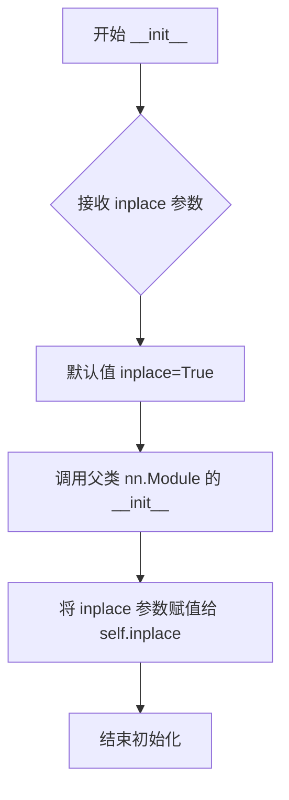

# `MinerU\mineru\model\utils\pytorchocr\modeling\common.py` 详细设计文档

该文件实现了多种神经网络激活函数，包括Hswish、Hsigmoid、GELU、Swish等，并通过一个通用的Activation类根据字符串类型动态选择相应的激活函数，用于PyTorch模型的构建。

## 整体流程



## 类结构

```
nn.Module (PyTorch基类)
├── Hswish
├── Hsigmoid
├── GELU
├── Swish
└── Activation (通用激活函数选择器)
```

## 全局变量及字段


### `Hswish.inplace`
    
Flag indicating whether to perform the Hswish activation in-place to save memory.

类型：`bool`
    


### `Hsigmoid.inplace`
    
Flag indicating whether to perform the Hsigmoid activation in-place to save memory.

类型：`bool`
    


### `GELU.inplace`
    
Flag indicating whether to perform the GELU activation in-place to save memory.

类型：`bool`
    


### `Swish.inplace`
    
Flag indicating whether to perform the Swish activation in-place to save memory.

类型：`bool`
    


### `Activation.act`
    
The actual activation module (e.g., nn.ReLU, Hswish, GELU, etc.) instantiated based on the provided act_type.

类型：`torch.nn.Module`
    
    

## 全局函数及方法


### `Hswish.__init__`

该方法用于初始化 Hswish（Hard Swish）激活函数模块。它接受一个布尔型参数 `inplace`，用于配置前向传播中的计算方式是否采用原位操作以节省显存，并调用父类 `nn.Module` 的初始化方法。

参数：

-  `inplace`：`bool`，控制是否在输入张量上进行原位（in-place）操作。默认为 `True`，可以减少内存消耗。

返回值：`None`，构造函数不返回任何值。

#### 流程图

```mermaid
graph TD
    A((开始 __init__)) --> B[调用 super().__init__]
    B --> C[赋值 self.inplace = inplace]
    C --> D((结束))
```

#### 带注释源码

```python
def __init__(self, inplace=True):
    """
    初始化 Hswish 激活模块。

    参数:
        inplace (bool): 如果设置为 True，计算过程将直接在输入张量上进行，
                        这可以减少显存的使用。默认为 True。
    """
    # 调用 nn.Module 的基类初始化方法，注册网络层参数
    super(Hswish, self).__init__()
    
    # 保存 inplace 配置，以便在 forward 方法中使用
    self.inplace = inplace
```


### `Hswish.forward`

该方法实现了Hswish（Hard Swish）激活函数的前向传播，将输入张量通过公式 x * ReLU6(x + 3) / 6 进行非线性变换，这是一种在移动设备上性能友好的激活函数近似。

参数：

- `x`：`torch.Tensor`，输入的张量，通常是上一层的输出

返回值：`torch.Tensor`，经过Hswish激活函数处理后的张量

#### 流程图

```mermaid
graph TD
    A[开始 forward] --> B[接收输入张量 x]
    B --> C[计算 x + 3.0]
    C --> D[应用 ReLU6 激活函数<br/>relu6(x + 3.0)]
    D --> E[乘法运算: x * relu6(x + 3.0)]
    E --> F[除法运算: (x * relu6) / 6.0]
    F --> G[返回结果张量]
```

#### 带注释源码

```python
def forward(self, x):
    """
    Hswish 激活函数的前向传播
    
    Hswish 公式: output = x * ReLU6(x + 3) / 6
    这是一种计算效率高的 Swish 激活函数近似
    """
    # 步骤1: 计算 x + 3.0（偏移操作）
    # 步骤2: 应用 ReLU6 激活函数（输出范围 [0, 6]）
    # 步骤3: 乘以输入 x
    # 步骤4: 除以 6.0（归一化）
    # inplace 参数控制是否就地修改中间张量，节省内存
    return x * F.relu6(x + 3.0, inplace=self.inplace) / 6.0
```


### Hsigmoid.__init__

这是Hsigmoid（hard sigmoid）激活函数类的构造函数，用于初始化实例属性。

参数：

- `inplace`：`bool`，可选参数，默认为`True`。表示是否在原地执行操作（如果为`True`，则直接在输入张量上进行操作以节省内存）。

返回值：`None`，无返回值（构造函数）。

#### 流程图



#### 带注释源码

```python
def __init__(self, inplace=True):
    """
    Hsigmoid 激活函数的初始化方法
    
    参数:
        inplace: bool, 默认True. 控制是否在原地执行运算以节省内存
    """
    # 调用父类 nn.Module 的构造函数，完成模块的初始化
    super(Hsigmoid, self).__init__()
    
    # 将 inplace 参数保存为实例变量，供 forward 方法中使用
    self.inplace = inplace
```


### `Hsigmoid.forward`

该方法实现了Hard Sigmoid激活函数的前向传播，通过ReLU6函数对输入进行线性变换并除以6，输出值被压缩到[0,1]区间。

参数：

- `x`：`torch.Tensor`，输入的张量，通常是上一层的输出

返回值：`torch.Tensor`，返回经过Hard Sigmoid激活函数处理后的张量，值域在[0,1]范围内

#### 流程图



#### 带注释源码

```python
def forward(self, x):
    """
    Hard Sigmoid 激活函数的前向传播
    
    参数:
        x: 输入张量
        
    返回:
        经过 Hard Sigmoid 激活函数处理后的张量
    """
    # 线性变换: 1.2 * x + 3.0
    # 使用系数1.2是为了与PaddlePaddle的实现保持一致
    # 原始Hard Sigmoid公式: max(0, min(1, 0.2*x + 0.5))
    # 这里的实现: F.relu6(1.2 * x + 3.0) / 6.0 相当于对x进行了缩放
    
    # Step 1: 计算线性组合 1.2 * x + 3.0
    # Step 2: 通过 ReLU6 激活函数，将结果限制在 [0, 6] 范围内
    #         ReLU6 = min(max(x, 0), 6)
    # Step 3: 除以 6.0，将最终结果映射到 [0, 1] 区间
    
    return F.relu6(1.2 * x + 3.0, inplace=self.inplace) / 6.0
```


### `GELU.__init__`

该方法是GELU激活函数类的构造函数，用于初始化GELU模块，并设置是否采用原地操作（inplace）模式。

参数：

- `self`：实例对象本身（隐式参数），GELU类的实例
- `inplace`：`bool`，一个布尔值，指定是否在原始张量上进行原地操作以节省内存。默认为`True`

返回值：`None`，构造函数不返回任何值

#### 流程图

```mermaid
graph TD
    A[开始 __init__] --> B[调用 super(GELU, self).__init__()<br/>初始化nn.Module基类]
    B --> C[设置 self.inplace = inplace<br/>保存原地操作标志]
    C --> D[结束 __init__]
```

#### 带注释源码

```python
def __init__(self, inplace=True):
    """
    GELU激活函数的构造函数
    
    参数:
        inplace: bool, 是否使用原地操作，默认为True
    """
    # 调用父类nn.Module的构造函数，完成模块的初始化
    # 这一步会初始化nn.Module的一些内部状态，如_parameters、_modules等
    super(GELU, self).__init__()
    
    # 将inplace参数保存为实例属性，供forward方法中使用
    # inplace=True时可以在原始张量上直接修改，节省内存
    self.inplace = inplace
```


### `GELU.forward`

该方法是 GELU (Gaussian Error Linear Unit) 激活函数的前向传播实现，继承自 `nn.Module`，接收一个输入 tensor 并通过 `torch.nn.functional.gelu` 计算高斯误差线性单元激活值，支持 inplace 操作以减少内存开销。

参数：

- `self`：`GELU` 实例本身，隐式参数，表示当前激活函数模块
- `x`：`torch.Tensor`，输入的张量，通常是多维数组（如 [batch_size, features]），需要经过 GELU 激活函数处理

返回值：`torch.Tensor`，返回经过 GELU 激活函数处理后的张量，与输入张量 shape 相同

#### 流程图



#### 带注释源码

```python
class GELU(nn.Module):
    """
    GELU (Gaussian Error Linear Unit) 激活函数模块
    
    GELU 是一种基于高斯分布的激活函数，其公式近似为:
    GELU(x) = x * Φ(x)
    其中 Φ(x) 是标准正态分布的累积分布函数 (CDF)
    
    参考论文: "Gaussian Error Linear Units (GELU)" - Hendrycks and Gimpel
    """
    
    def __init__(self, inplace=True):
        """
        初始化 GELU 激活函数模块
        
        参数:
            inplace: bool, 默认为 True
                    是否使用 inplace 方式进行计算以节省内存
                    注意: 当前版本的 torch.nn.functional.gelu 
                    可能不完全支持 inplace 操作
        """
        super(GELU, self).__init__()  # 调用父类 nn.Module 的初始化方法
        self.inplace = inplace  # 存储 inplace 参数，虽然当前 forward 中未使用

    def forward(self, x):
        """
        GELU 激活函数的前向传播
        
        参数:
            x: torch.Tensor
               输入张量，任意 shape
               
        返回:
            torch.Tensor
            经过 GELU 激活后的张量，shape 与输入相同
        """
        # 调用 PyTorch 的 functional API 执行 GELU 激活
        # torch.nn.functional.gelu(x) 等价于 x * Φ(x)
        # 其中 Φ(x) ≈ 0.5 * (1 + tanh(√(2/π) * (x + 0.044715 * x³)))
        return torch.nn.functional.gelu(x)
        
        # 注意: 当前实现未使用 self.inplace 参数
        # 理想情况下应使用: torch.nn.functional.gelu(x, inplace=self.inplace)
        # 但 PyTorch 1.10 之前版本的 gelu 不支持 inplace 参数
```

#### 补充说明

**技术债务 / 优化空间：**

1. **未使用的 inplace 参数**：`self.inplace` 参数在 `__init__` 中被保存，但在 `forward` 方法中未被使用，导致参数形同虚设。如果 PyTorch 后续版本支持 gelu 的 inplace 操作，应在 `forward` 中使用 `torch.nn.functional.gelu(x, inplace=self.inplace)`

2. **缺少对输入的合法性检查**：未对输入 `x` 进行 `None` 检查或类型检查，可能导致隐藏的错误

3. **文档注释不完整**：缺少对 GELU 激活函数数学原理的详细说明（近似公式）

**设计目标与约束：**

- 目标：提供与 PyTorch 生态兼容的 GELU 激活函数实现
- 约束：必须继承 `nn.Module` 以便集成到神经网络模型中
- 输入必须是 `torch.Tensor` 类型

**外部依赖：**

- `torch`：PyTorch 核心库
- `torch.nn.functional`：提供 gelu 激活函数的底层实现
- `nn.Module`：PyTorch 模块基类


### Swish.__init__

该方法是 Swish 激活函数类的构造函数，用于初始化 Swish 激活函数实例，并配置是否使用原地操作（inplace）来优化内存使用。

参数：

- `self`：隐含的 Swish 类实例参数，无需显式传递
- `inplace`：`bool`，可选参数，默认为 `True`。当设置为 `True` 时，forward 方法中的乘法操作将使用原地操作（`mul_`）以节省内存；当设置为 `False` 时，则创建新的张量进行返回

返回值：`None`，构造函数无返回值，仅完成对象属性的初始化

#### 流程图



#### 带注释源码

```python
class Swish(nn.Module):
    """
    Swish 激活函数类
    Swish = x * sigmoid(x)
    是一种自门控激活函数，由 Google 提出
    """
    
    def __init__(self, inplace=True):
        """
        Swish 类的构造函数
        
        参数:
            inplace: bool, 是否使用原地操作以节省内存
        """
        # 调用父类 nn.Module 的构造函数
        # 完成 PyTorch 模块的初始化
        super(Swish, self).__init__()
        
        # 保存 inplace 参数到实例属性
        # 决定 forward 方法中的计算方式
        self.inplace = inplace
```


### `Swish.forward`

Swish 是一种自门控激活函数，由 Google 在 2017 年提出，其公式为 f(x) = x · σ(x)，其中 σ 是 sigmoid 函数。该实现支持原地操作（in-place）以节省内存。

参数：

- `x`：`torch.Tensor`，输入张量，可以是任意形状的 Tensor

返回值：`torch.Tensor`，返回与输入形状相同的激活后张量

#### 流程图

```mermaid
flowchart TD
    A[输入 x] --> B{self.inplace?}
    B -->|True| C[执行 x.mul_(torch.sigmoid(x))]
    B -->|False| D[计算 x * torch.sigmoid(x)]
    C --> E[返回 x]
    D --> E
```

#### 带注释源码

```python
def forward(self, x):
    """
    Swish 激活函数的前向传播
    
    Swish(x) = x * sigmoid(x) = x / (1 + exp(-x))
    
    参数:
        x: 输入张量，任意形状
    
    返回:
        激活后的张量，形状与输入相同
    """
    # 判断是否使用原地操作以节省内存
    if self.inplace:
        # 原地操作：直接修改输入张量 x，不分配新内存
        # mul_ 是 PyTorch 的原地乘法操作
        # torch.sigmoid(x) 计算 sigmoid(x) = 1 / (1 + e^(-x))
        x.mul_(torch.sigmoid(x))
        # 返回已被修改的张量 x
        return x
    else:
        # 非原地操作：创建新的张量存储结果
        # 计算 Swish 公式: x * sigmoid(x)
        return x * torch.sigmoid(x)
```


### `Activation.__init__`

这是 Activation 类的构造函数，用于根据传入的激活函数类型（act_type）动态创建相应的激活函数实例，并将其存储为类的成员属性。该方法支持多种常见的激活函数（如 ReLU、ReLU6、GELU、Swish 等），并通过 inplace 参数控制是否使用内存高效的原地操作。

参数：

- `act_type`：`str`，激活函数的类型标识符，支持的值包括 "relu"、"relu6"、"hard_sigmoid"、"hard_swish"（或 "hswish"）、"leakyrelu"、"gelu"、"swish" 等
- `inplace`：`bool`，可选参数，控制是否使用原地（inplace）操作以节省内存，默认为 `True`

返回值：`None`，该方法为构造函数，不返回任何值

#### 流程图

```mermaid
graph TD
    A[开始 __init__] --> B[接收 act_type 和 inplace 参数]
    B --> C[将 act_type 转换为小写]
    C --> D{act_type == 'relu'?}
    D -->|Yes| E[创建 nn.ReLU 并赋值给 self.act]
    D -->|No| F{act_type == 'relu6'?}
    F -->|Yes| G[创建 nn.ReLU6 并赋值给 self.act]
    F -->|No| H{act_type == 'sigmoid'?}
    H -->|Yes| I[抛出 NotImplementedError]
    H -->|No| J{act_type == 'hard_sigmoid'?}
    J -->|Yes| K[创建 Hsigmoid 并赋值给 self.act]
    J -->|No| L{act_type in ['hard_swish', 'hswish']?}
    L -->|Yes| M[创建 Hswish 并赋值给 self.act]
    L -->|No| N{act_type == 'leakyrelu'?}
    N -->|Yes| O[创建 nn.LeakyReLU 并赋值给 self.act]
    N -->|No| P{act_type == 'gelu'?}
    P -->|Yes| Q[创建 GELU 并赋值给 self.act]
    P -->|No| R{act_type == 'swish'?}
    R -->|Yes| S[创建 Swish 并赋值给 self.act]
    R -->|No| T[抛出 NotImplementedError]
    E --> U[结束]
    G --> U
    I --> U
    K --> U
    M --> U
    O --> U
    Q --> U
    S --> U
    T --> U
```

#### 带注释源码

```python
def __init__(self, act_type, inplace=True):
    """
    初始化 Activation 实例，根据 act_type 创建对应的激活函数
    
    参数:
        act_type: str, 激活函数类型名称
        inplace: bool, 是否使用 inplace 操作，默认 True
    """
    # 调用父类 nn.Module 的初始化方法
    super(Activation, self).__init__()
    
    # 将激活函数类型转换为小写，确保大小写不敏感
    act_type = act_type.lower()
    
    # 根据 act_type 创建对应的激活函数实例
    if act_type == "relu":
        # 标准 ReLU 激活函数: max(0, x)
        self.act = nn.ReLU(inplace=inplace)
    elif act_type == "relu6":
        # ReLU6 激活函数: min(max(0, x), 6)
        self.act = nn.ReLU6(inplace=inplace)
    elif act_type == "sigmoid":
        # Sigmoid 激活函数尚未实现
        raise NotImplementedError
    elif act_type == "hard_sigmoid":
        # 硬 Sigmoid: max(0, min(1, 0.2x + 0.5))
        # 使用自定义的 Hsigmoid 类实现
        self.act = Hsigmoid(inplace)
    elif act_type == "hard_swish" or act_type == "hswish":
        # 硬 Swish: x * hard_sigmoid(x)
        self.act = Hswish(inplace=inplace)
    elif act_type == "leakyrelu":
        # Leaky ReLU: x > 0 ? x : 0.01x
        self.act = nn.LeakyReLU(inplace=inplace)
    elif act_type == "gelu":
        # Gaussian Error Linear Unit
        self.act = GELU(inplace=inplace)
    elif act_type == "swish":
        # Swish: x * sigmoid(x)
        self.act = Swish(inplace=inplace)
    else:
        # 不支持的激活函数类型
        raise NotImplementedError
```


### `Activation.forward`

该方法是 `Activation` 类的前向传播逻辑，用于对输入张量应用特定的激活函数。它通过调用在初始化时根据 `act_type` 创建的激活函数对象 `self.act` 来完成张量的非线性变换。

参数：

-  `inputs`：`torch.Tensor`，需要进行激活函数处理的输入张量

返回值：`torch.Tensor`，经过激活函数处理后的输出张量

#### 流程图

```mermaid
flowchart TD
    A[接收 inputs 张量] --> B[调用 self.act(inputs)]
    B --> C{self.act 类型}
    C --> D[nn.ReLU / nn.ReLU6]
    C --> E[Hsigmoid / Hswish]
    C --> F[nn.LeakyReLU]
    C --> G[GELU]
    C --> H[Swish]
    D --> I[返回激活后的张量]
    E --> I
    F --> I
    G --> I
    H --> I
```

#### 带注释源码

```python
def forward(self, inputs):
    """
    Activation 模块的前向传播方法。
    
    该方法将输入张量传递给在 __init__ 中根据 act_type 创建的激活函数对象，
    并返回激活后的张量结果。
    
    参数:
        inputs (torch.Tensor): 需要进行激活处理的输入张量
        
    返回:
        torch.Tensor: 经过激活函数处理后的输出张量
    """
    # 调用成员变量 self.act（具体激活函数实例）的 forward 方法
    # self.act 在 __init__ 中根据 act_type 参数创建
    # 支持的激活函数包括: relu, relu6, hard_sigmoid, hard_swish, 
    # leakyrelu, gelu, swish 等
    return self.act(inputs)
```

## 关键组件


### Hswish 激活函数
实现 Hardswish 激活函数，使用 ReLU6 近似计算，提供高效的移动端激活函数支持

### Hsigmoid 激活函数
实现 Hardsigmoid 激活函数，模拟分段线性 sigmoid，包含可调的斜率参数用于与 PaddlePaddle 兼容

### GELU 激活函数
实现高斯误差线性单元（GELU）激活函数，使用 PyTorch 内置实现，支持 inplace 操作

### Swish 激活函数
实现 Swish 激活函数，支持 inplace 模式以优化内存使用，条件性地使用原地操作

### Activation 通用激活函数封装
提供统一的激活函数接口，支持多种激活函数类型的动态创建，包括 ReLU、ReLU6、Hardsigmoid、Hardswish、LeakyReLU、GELU 和 Swish


## 问题及建议


### 已知问题

- **Hsigmoid 实现与注释不一致**：代码注释说明 torch 应该是 `F.relu6(x + 3., inplace=self.inplace) / 6.`，但实际实现使用了 `1.2 * x`（paddle 的实现方式），这可能导致与原生 torch 的 hard_sigmoid 行为不一致
- **GELU 的 inplace 参数未使用**：GELU 类接收 inplace 参数但未使用，torch.nn.functional.gelu 不支持 inplace 操作，参数形同虚设
- **Hsigmoid 初始化参数传递错误**：第 48 行 `Hsigmoid(inplace)` 直接传入布尔值而非关键字参数 `inplace=inplace`，虽然 Python 会正确处理，但不符合代码规范
- **sigmoid 激活未实现但有预留**：Activation 类中对 "sigmoid" 抛出 NotImplementedError，但没有提供实现，注释掉的代码也不够清晰
- **Activation 类错误信息不明确**：对于不支持的 act_type，仅抛出通用的 NotImplementedError，缺少具体的错误信息（如当前传入的 act_type 是什么）
- **Activation 类 act_type 标准化不完整**：虽然有 `.lower()` 标准化，但代码中仍存在硬编码的 "hswish" 和 "hard_swish" 两种写法，可合并处理
- **Hswish 实现与 nn.Hardswish 不一致**：代码手动实现 Hswish，而 torch 已内置 nn.Hardswich，可直接使用或明确注释差异
- **缺少类型注解**：整个代码库没有任何类型注解（Type Hints），不利于静态分析和代码维护

### 优化建议

- 修正 Hsigmoid 实现以匹配 torch 官方行为，或在文档中明确说明使用 paddle 版本的 hard_sigmoid
- 移除 GELU 类中未使用的 inplace 参数，或在文档中说明该参数为兼容其他激活函数接口而保留
- 修正 Hsigmoid 初始化方式为 `Hsigmoid(inplace=inplace)`
- 实现 sigmoid 激活函数或移除相关代码分支，避免代码冗余
- 改进错误信息，例如：`raise NotImplementedError(f"Activation type '{act_type}' is not implemented")`
- 统一 act_type 命名规范，可将 "hard_swish" 映射到 "hswish"
- 考虑使用 torch 内置的 `nn.Hardswish` 和 `nn.Hardsigmoid` 替代自定义实现
- 为所有类方法添加类型注解，提升代码可读性和可维护性
- 考虑使用字典映射替代 if-elif 链，提高可扩展性


## 其它


### 设计目标与约束

本模块旨在提供一组统一的激活函数实现，支持多种常见的激活类型（如ReLU、Swish、GELU等），并通过Activation类实现动态选择。设计约束包括：必须继承自nn.Module以兼容PyTorch模型；支持inplace操作以优化内存和计算效率；仅支持指定的激活类型，不支持自定义。

### 错误处理与异常设计

对于不支持的激活类型（如"sigmoid"或未定义的act_type），代码直接抛出NotImplementedError异常，明确提示功能未实现。异常设计简洁，不进行复杂的错误恢复，调用者需确保传入合法的act_type参数。

### 外部依赖与接口契约

模块依赖PyTorch框架，具体包括torch.nn（nn.Module）、torch.nn.functional（F.relu6、F.gelu等）以及torch（用于torch.sigmoid）。接口契约方面，Activation类的构造函数接受act_type（字符串）和inplace（布尔值）参数；forward方法接受inputs（张量）并返回激活后的张量。其他激活函数类（Hswish、Hsigmoid、GELU、Swish）均接受inplace参数，forward方法均接受x（张量）并返回张量。

### 性能考虑

代码支持inplace操作，通过修改输入张量而不创建新张量来减少内存占用和计算开销。例如，Swish类中当inplace为True时使用x.mul_()进行原地乘法。GELU使用PyTorch内置实现，通常经过高度优化。Hsigmoid中使用了缩放因子1.2以匹配PaddlePaddle的行为，但可能引入额外的计算。

### 可扩展性与维护性

Activation类通过字典映射（if-elif结构）支持新激活函数的扩展，添加新激活仅需在__init__方法中增加分支。模块化设计使得每个激活函数独立，便于单独测试和复用。但当前使用if-elif结构，未来可考虑使用字典映射以提高可读性和降低维护成本。

### 兼容性

代码主要针对PyTorch设计，注释中提及了与PaddlePaddle的对应关系（如Hsigmoid与Paddle的hard_sigmoid），但未提供直接的模型转换工具。不同框架间激活函数的数学定义可能存在细微差异（如Hsigmoid中的斜率偏移），需注意跨框架部署时的行为一致性。

### 测试策略

建议针对每个激活函数类进行单元测试，验证输出形状和数值正确性；测试inplace模式是否正确修改输入；测试Activation类对非法act_type的异常处理；集成测试可结合简单神经网络层进行前向传播验证。
    