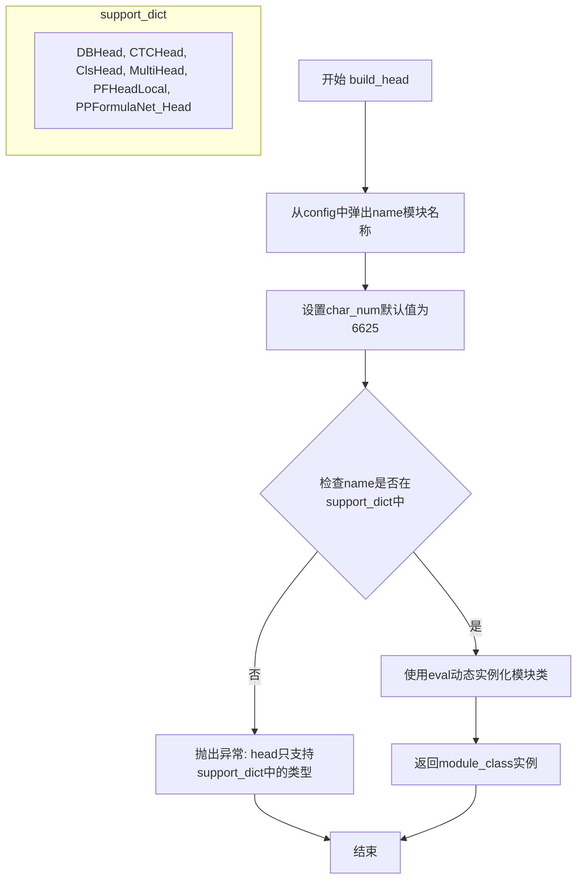

# `MinerU\mineru\model\utils\pytorchocr\modeling\heads\__init__.py` 详细设计文档

这是PaddlePaddle OCR工具箱中的模型头部(Head)构建器，根据配置动态创建检测(DBHead/PFHeadLocal)、识别(CTCHead/MultiHead/PPFormulaNet_Head)和分类(ClsHead)模型的头部模块，支持六种主流OCR头部架构的灵活切换。

## 整体流程

```mermaid
graph TD
    A[开始: build_head(config, **kwargs)] --> B[导入各模块的Head类]
B --> C[定义support_dict列表]
C --> D[从config中pop出name字段]
D --> E[从config中pop出char_num字段, 默认6625]
E --> F{检查name是否在support_dict中?}
F -- 否 --> G[抛出AssertionError]
F -- 是 --> H[使用eval动态创建模块实例]
H --> I[返回module_class实例]
I --> J[结束]
```

## 类结构

```
build_head (函数)
├── 导入模块
│   ├── det_db_head: DBHead, PFHeadLocal
│   ├── rec_ctc_head: CTCHead
│   ├── rec_multi_head: MultiHead
│   ├── rec_ppformulanet_head: PPFormulaNet_Head
│   └── cls_head: ClsHead
```

## 全局变量及字段


### `__all__`
    
模块导出列表，定义当使用 'from module import *' 时导出的符号

类型：`list`
    


### `support_dict`
    
支持的头部模块名称列表，包含 DBHead、CTCHead、ClsHead、MultiHead、PFHeadLocal、PPFormulaNet_Head

类型：`list`
    


### `module_name`
    
从配置中提取的模块名称，用于指定要实例化的头部类

类型：`str`
    


### `char_num`
    
字符数量，默认为 6625，用于配置字符集大小

类型：`int`
    


### `module_class`
    
通过 eval 动态实例化的头部类对象

类型：`object`
    


    

## 全局函数及方法


### `build_head`

根据配置字典动态创建并返回相应的头部（Head）模块实例，支持检测（DBHead、PFHeadLocal）、识别（CTCHead、MultiHead、PPFormulaNet_Head）和分类（ClsHead）等多种头部类型。

参数：

- `config`：`dict`，配置字典，必须包含`name`键指定要创建的头部类型，可选包含`char_num`等其它参数
- `**kwargs`：`dict`，可变关键字参数，用于传递额外的参数给头部模块构造函数

返回值：`object`，返回对应头部类的实例对象

#### 流程图



#### 带注释源码

```python
def build_head(config, **kwargs):
    """
    根据配置动态构建头部模块
    
    参数:
        config: 包含head配置的字典，必须包含name键
        **kwargs: 额外的关键字参数
    
    返回:
        对应类型的头部模块实例
    """
    # 检测头相关导入
    from .det_db_head import DBHead, PFHeadLocal

    # 识别头相关导入
    from .rec_ctc_head import CTCHead
    from .rec_multi_head import MultiHead
    from .rec_ppformulanet_head import PPFormulaNet_Head

    # 分类头相关导入
    from .cls_head import ClsHead

    # 定义支持的头部类型列表
    support_dict = [
        "DBHead",
        "CTCHead",
        "ClsHead",
        "MultiHead",
        "PFHeadLocal",
        "PPFormulaNet_Head",
    ]

    # 从配置中弹出头部名称，char_num设置默认值为6625
    module_name = config.pop("name")
    char_num = config.pop("char_num", 6625)
    
    # 断言检查头部名称是否在支持列表中，不支持则抛出异常
    assert module_name in support_dict, Exception(
        "head only support {}".format(support_dict)
    )
    
    # 使用eval动态创建对应的头部类实例，传入config和kwargs参数
    module_class = eval(module_name)(**config, **kwargs)
    return module_class
```

## 关键组件


### build_head 函数

动态工厂函数，根据配置中的 name 字段动态实例化不同的头部模型类，支持检测（DBHead、PFHeadLocal）、识别（CTCHead、MultiHead、PPFormulaNet_Head）和分类（ClsHead）任务的头部模型构建。

### support_dict 列表

定义了所有支持的头部模型类型列表，包含 6 种头部类：DBHead、CTCHead、ClsHead、MultiHead、PFHeadLocal、PPFormulaNet_Head，用于配置验证和动态类加载。

### 模块导入与惰性加载

通过函数内部的局部导入实现运行时按需加载不同的头部模块，避免顶层导入带来的循环依赖问题，同时支持检测、识别和分类三类任务的模块化管理。

### config 参数解析

从配置字典中提取 name 和 char_num 参数，name 用于指定要构建的头部类型，char_num 默认值为 6625，用于字符识别任务的类别数配置。

### 动态类实例化

使用 eval() 函数根据字符串名称动态创建类实例，传入剩余配置参数和额外关键字参数，实现灵活的头部模型构建机制。


## 问题及建议


### 已知问题

-   **使用 eval 动态实例化类存在安全风险**：通过 `eval(module_name)` 动态创建类对象，恶意输入可能执行任意代码，存在代码注入风险
-   **直接修改传入的 config 字典**：使用 `config.pop()` 直接修改调用者传入的字典，会产生意外的副作用，影响调用者的状态
-   **import 语句放在函数内部**：所有子模块的导入都放在函数内部，每次调用都会执行导入逻辑，虽然 Python 有模块缓存，但影响代码可读性和执行效率
-   **使用 assert 进行关键参数验证**：在生产环境中，Python 运行时可以使用 -O 参数跳过 assert，导致关键的参数校验失效
-   **char_num 是硬编码的魔数**：默认值 6625 没有注释说明来源和含义，后续维护困难
-   **缺乏类型注解**：函数参数和返回值都没有类型提示，影响代码可维护性和 IDE 支持
-   **support_dict 与实际导入的模块不同步**：support_dict 硬编码维护，容易出现遗漏或不一致

### 优化建议

-   **使用安全的类工厂模式替代 eval**：通过字典映射 `{"DBHead": DBHead, ...}` 的方式替代 eval，消除代码注入风险
-   **避免修改原始 config**：在函数内部复制 config 或使用 config.get() 获取参数，避免修改原始字典
-   **将 import 语句移至文件顶部**：遵循 Python 最佳实践，在模块级别进行导入，提高可读性
-   **使用自定义异常或条件判断替代 assert**：使用 `if module_name not in support_dict: raise ValueError(...)` 进行参数验证
-   **为 char_num 等魔数添加常量或配置**：定义有意义的常量或在文档中说明默认值含义
-   **添加类型注解**：为函数参数和返回值添加类型提示，提高代码可维护性
-   **使用装饰器或配置驱动的方式**：设计更灵活的插件机制，避免手动维护 support_dict

## 其它


### 设计目标与约束

**设计目标**：提供统一的模型头部构建接口，支持检测（Detection）、识别（Recognition）和分类（Classification）任务的头部模块动态加载与实例化。

**约束条件**：
- 仅支持预定义的6种头部类型（DBHead、CTCHead、ClsHead、MultiHead、PFHeadLocal、PPFormulaNet_Head）
- 模块名称必须通过配置文件的"name"字段指定
- 必须从paddlepaddle内部模块导入，不支持外部插件式扩展
- char_num默认值为6625，仅对特定头部类型有效

### 错误处理与异常设计

**异常类型**：
- `AssertionError`：当module_name不在support_dict列表中时抛出
- `KeyError`：当config字典中缺少"name"键时抛出
- `NameError`：当eval()调用无效的模块名称时抛出
- `ImportError`：当指定的子模块不存在或导入失败时抛出

**错误处理策略**：
- 使用assert进行参数校验，失败时抛出带明确错误信息的异常
- 异常消息包含支持的模块列表，便于调试
- 不捕获导入异常，保留完整的堆栈信息

### 数据流与状态机

**数据流**：
```
输入: config(dict) + kwargs(dict)
    ↓
步骤1: 导入det_db_head模块 (DBHead, PFHeadLocal)
    ↓
步骤2: 导入rec_ctc_head模块 (CTCHead)
    ↓
步骤3: 导入rec_multi_head模块 (MultiHead)
    ↓
步骤4: 导入rec_ppformulanet_head模块 (PPFormulaNet_Head)
    ↓
步骤5: 导入cls_head模块 (ClsHead)
    ↓
步骤6: 从config中pop出"name"获取模块名
    ↓
步骤7: 从config中pop出"char_num"(默认6625)
    ↓
步骤8: 校验模块名在支持列表中
    ↓
步骤9: 使用eval()动态实例化类
    ↓
输出: 头部类实例
```

**状态机**：无状态设计，每次调用独立创建新实例

### 外部依赖与接口契约

**外部依赖**：
- `.det_db_head`：DBHead, PFHeadLocal类
- `.rec_ctc_head`：CTCHead类
- `.rec_multi_head`：MultiHead类
- `.rec_ppformulanet_head`：PPFormulaNet_Head类
- `.cls_head`：ClsHead类

**接口契约**：
- 输入config必须为dict类型且包含"name"键
- 输入kwargs为可变参数，将透传给头部类的构造函数
- 返回值为对应的头部类实例
- 所有头部类必须支持相同的构造函数签名或兼容**kwargs

### 性能考虑

**性能特征**：
- 每次调用都会重新导入所有子模块，存在重复导入开销
- 使用eval()动态类实例化，存在轻微性能损耗
- 模块导入在函数内部，每次调用都会执行import语句

**优化建议**：
- 考虑将模块导入移至函数外部，使用延迟加载或单例模式
- 使用globals()或importlib替代eval()提高安全性
- 缓存已实例化的头部类实例

### 安全性考虑

**安全风险**：
- eval()函数存在代码注入风险，module_name来自用户配置
- 动态导入机制可能被恶意利用

**安全建议**：
- 使用预定义的映射字典替代eval()，例如：`{"DBHead": DBHead, ...}`
- 添加白名单验证机制
- 避免使用eval()，改用更安全的反射机制

### 可测试性

**测试策略**：
- 单元测试：测试每种头部类型的实例化
- 集成测试：测试完整的配置流程
- 边界测试：测试无效配置、缺失参数等异常情况

**测试用例覆盖**：
- 有效配置：正确的name和config
- 无效name：name不在support_dict中
- 缺失name：config中未提供name键
- 默认char_num：未提供char_num时的默认值
- kwargs透传：额外的参数是否正确传递

### 版本兼容性

**PaddlePaddle版本要求**：
- 代码注释显示适用于PaddlePaddle项目
- 依赖的子模块与PaddlePaddle版本绑定
- 建议在PaddlePaddle 2.x版本中使用

**API稳定性**：
- __all__仅导出build_head函数
- 内部模块路径相对固定
- 头部类接口需保持向后兼容

### 配置管理

**配置示例**：
```python
# 检测任务配置
config = {"name": "DBHead", "char_num": 6625, "in_channels": [256, 512, 1024]}

# 识别任务配置
config = {"name": "CTCHead", "char_num": 6625, "hidden_size": 256}

# 分类任务配置
config = {"name": "ClsHead", "num_classes": 10}
```

**配置约束**：
- name字段为必需，其他字段依赖具体头部类
- char_num为全局配置，某些头部可能忽略此参数

### 初始化流程

**初始化步骤**：
1. 接收config和kwargs参数
2. 从config中提取name和char_num
3. 验证name的合法性
4. 动态导入所需模块
5. 实例化头部类并返回

### 资源管理

**资源类型**：
- 内存：每次实例化创建新的头部对象
- 计算：无额外计算资源消耗
- IO：无文件读写操作

**资源释放**：
- 由调用方负责管理返回实例的生命周期
- 无需显式释放资源

### 线程安全性

**线程安全评估**：
- 函数本身为无状态函数
- 多次调用间无共享状态
- 线程安全（前提是底层模块线程安全）

### 文档和注释

**现有注释**：
- 文件头部包含Apache 2.0许可证声明
- __all__明确导出接口
- 函数内包含任务类型注释（det/rec/cls）

**改进建议**：
- 添加详细的函数文档字符串
- 说明每种头部类型的适用场景
- 提供配置示例

### 使用示例

```python
# 示例1：创建检测头部
det_config = {"name": "DBHead", "in_channels": [256, 512, 1024]}
det_head = build_head(det_config)

# 示例2：创建识别头部（CTC）
rec_config = {"name": "CTCHead", "char_num": 6625}
rec_head = build_head(rec_config)

# 示例3：创建分类头部
cls_config = {"name": "ClsHead", "num_classes": 10}
cls_head = build_head(cls_config)

# 示例4：传递额外参数
config = {"name": "DBHead", "in_channels": [256, 512]}
head = build_head(config, dropout=0.1, training=True)
```

### 部署注意事项

**部署环境**：
- 需要安装PaddlePaddle及相关依赖
- 需要确保所有子模块路径正确
- 建议与PaddlePaddle项目一起部署

**兼容性注意事项**：
- Windows/Linux/MacOS跨平台支持
- Python 3.6+版本兼容
- 需要确保子模块版本匹配


    