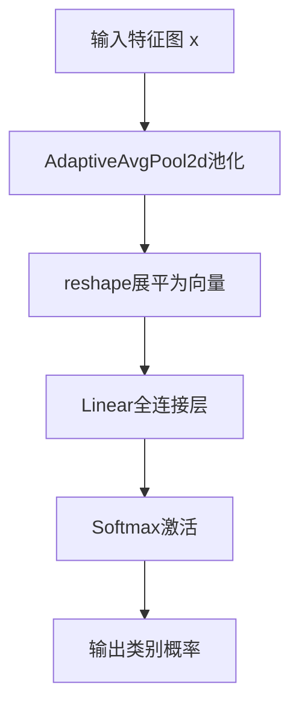
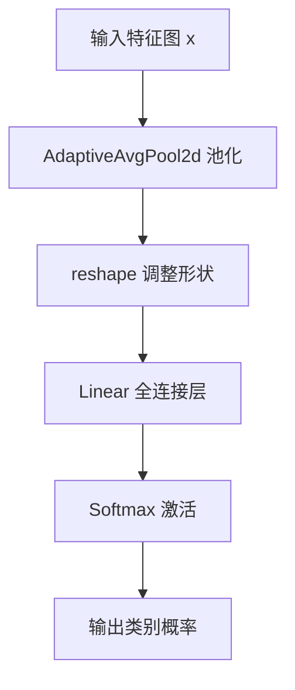

# `MinerU\mineru\model\utils\pytorchocr\modeling\heads\cls_head.py` 详细设计文档

这是一个PyTorch神经网络分类头模块，通过自适应平均池化将特征图压缩为向量，再经全连接层映射到类别维度，最后使用softmax函数输出类别概率分布，用于图像分类任务的最终预测。

## 整体流程



## 类结构

```
nn.Module (PyTorch基类)
└── ClsHead (分类头)
```

## 全局变量及字段


### `torch`
    
PyTorch核心库，提供张量运算和自动微分功能

类型：`module`
    


### `F`
    
torch.nn.functional模块，提供函数式神经网络操作

类型：`module`
    


### `nn`
    
torch.nn模块，提供神经网络层和容器

类型：`module`
    


### `ClsHead.pool`
    
自适应平均池化层，将输入特征图压缩为1x1

类型：`nn.AdaptiveAvgPool2d`
    


### `ClsHead.fc`
    
全连接层，将池化后的特征映射到类别维度

类型：`nn.Linear`
    
    

## 全局函数及方法


### `ClsHead.__init__`

初始化分类头的池化层和全连接层，用于构建分类任务的特征提取和分类器。

参数：

- `in_channels`：`int`，输入特征图的通道数
- `class_dim`：`int`，分类的类别数量
- `**kwargs`：`dict`，额外的关键字参数，用于传递额外的配置参数

返回值：`None`，该方法仅进行对象属性的初始化，不返回任何值

#### 流程图

```mermaid
flowchart TD
    A[开始 __init__] --> B[调用 super().__init__ 初始化 nn.Module]
    B --> C[创建 AdaptiveAvgPool2d 池化层: self.pool = nn.AdaptiveAvgPool2d1]
    C --> D[创建全连接层: self.fc = nn.Linearin_channels, class_dim, bias=True]
    D --> E[结束 __init__]
    
    style A fill:#e1f5fe
    style E fill:#e1f5fe
    style B fill:#b3e5fc
    style C fill:#b3e5fc
    style D fill:#b3e5fc
```

#### 带注释源码

```
def __init__(self, in_channels, class_dim, **kwargs):
    """
    初始化分类头
    
    参数:
        in_channels: 输入特征图的通道数
        class_dim: 分类的类别数量
        **kwargs: 额外的关键字参数
    """
    # 调用父类 nn.Module 的初始化方法
    # 使当前类成为 PyTorch 的神经网络模块
    super(ClsHead, self).__init__()
    
    # 创建自适应平均池化层 (Adaptive Average Pooling)
    # 输出尺寸固定为 1x1，将任意尺寸的特征图压缩为单一通道向量
    # 参数 1 表示输出高度和宽度都为 1
    self.pool = nn.AdaptiveAvgPool2d(1)
    
    # 创建全连接层 (Fully Connected Layer)
    # 将池化后的特征向量映射到类别概率空间
    # 参数: in_channels=输入通道数, class_dim=输出类别数
    # bias=True: 启用偏置项
    self.fc = nn.Linear(in_channels, class_dim, bias=True)
```


### ClsHead.forward

执行前向传播，将输入的特征图张量通过自适应平均池化、全连接层和softmax激活，输出类别概率分布。

参数：

- `x`：`torch.Tensor`，输入的特征图张量

返回值：`torch.Tensor`，类别概率分布

#### 流程图



#### 带注释源码

```python
def forward(self, x):
    """
    执行前向传播，返回类别概率分布
    
    参数:
        x: 输入的特征图张量，形状为 [batch_size, channels, height, width]
    
    返回:
        类别概率分布，形状为 [batch_size, class_dim]
    """
    # Step 1: 自适应平均池化，将特征图池化到 1x1
    # 输入: [N, C, H, W] -> 输出: [N, C, 1, 1]
    x = self.pool(x)
    
    # Step 2: 调整张量形状，移除最后两个维度
    # 输入: [N, C, 1, 1] -> 输出: [N, C]
    x = torch.reshape(x, shape=[x.shape[0], x.shape[1]])
    
    # Step 3: 全连接层变换，将通道维度映射到类别维度
    # 输入: [N, C] -> 输出: [N, class_dim]
    x = self.fc(x)
    
    # Step 4: softmax 激活，得到类别概率分布
    # 输入: [N, class_dim] -> 输出: [N, class_dim]，每行和为1
    x = F.softmax(x, dim=1)
    
    return x
```


## 关键组件


### 自适应平均池化 (AdaptiveAvgPool2d)

将输入特征图的空间维度全局池化为1×1，实现对不同尺寸输入的特征聚合。

### 全连接分类层 (Linear)

将池化后的特征向量线性映射到目标类别维度，输出原始分类logits。

### Softmax概率输出

将分类logits转换为概率分布，使得所有类别概率之和为1，便于分类决策。

### 张量形状重塑 (Reshape)

将池化后的4D张量 reshape 为2D张量（batch_size, features），以适配全连接层输入要求。


## 问题及建议


### 已知问题

-   **Softmax位置错误**: 在`forward`方法中直接返回softmax后的结果，这在训练时会导致问题，因为大多数损失函数（如`CrossEntropyLoss`）内部已包含softmax计算，重复计算可能引起数值不稳定和训练错误。建议输出logits而非概率，或提供开关控制是否应用softmax。
-   **`**kwargs`参数未使用**: 构造函数中接收了`**kwargs`但从未使用，属于无效代码，增加了理解负担。
-   **缺少Dropout层**: 分类头中无Dropout机制，在复杂模型中可能导致过拟合风险。
-   **激活函数硬编码**: Softmax激活函数被写死，无法灵活切换到其他激活函数或根据任务需求调整。
-   **缺少类型注解**: 方法参数和返回值均无类型注解，不利于代码可读性和静态分析工具的使用。
-   **reshape vs view**: 使用`torch.reshape`而非语义更明确的`torch.view`，虽然功能相似，但在连续内存场景下view更直观。
-   **无输入验证**: 未对输入张量的维度、类型进行校验，可能导致运行时错误且难以定位。
-   **文档不完整**: 类的docstring只有参数说明，缺少返回值描述和使用示例。

### 优化建议

-   将`forward`方法改为返回未经过softmax的logits，添加一个`activate`参数或单独的方法用于获取概率分布。
-   移除无用的`**kwargs`参数，或在文档中说明其预期用途。
-   在`__init__`中添加可选的`dropout`层以提升泛化能力。
-   将激活函数参数化，允许用户通过配置选择激活方式。
-   为关键方法和参数添加类型注解（typing），提升代码可维护性。
-   使用`x.view(x.size(0), -1)`替代`torch.reshape`，语义更清晰。
-   在`forward`开头添加输入校验，如`assert x.dim() == 4`检查输入维度。
-   完善docstring，补充返回值说明和简单的使用示例。
-   考虑添加权重初始化逻辑，如Xavier初始化，提高训练稳定性。
-   可添加`register_buffer`用于保存训练状态或额外信息。


## 其它


### 设计目标与约束

本模块的设计目标是提供一个轻量级的分类头，将卷积特征图转换为类别概率分布。约束条件包括：输入必须为4D张量(B,C,H,W)，输出为2D概率张量(B,class_dim)，使用softmax确保概率和为1，且仅支持PyTorch框架。

### 错误处理与异常设计

输入维度检查：forward方法未对输入维度进行校验，当输入不是4D张量时会导致运行时错误。改进建议：添加输入维度验证逻辑，抛出明确的DimensionError。参数合法性检查：in_channels和class_dim必须为正整数，kwargs中不应包含冲突参数。数值稳定性：softmax在输入值过大时可能产生数值溢出风险。

### 数据流与状态机

数据流：输入特征图(B,C,H,W) → 自适应平均池化(B,C,1,1) → reshape展平(B,C) → 线性变换(B,class_dim) → softmax概率分布(B,class_dim)。状态机设计：本模块为无状态模块，每次forward调用独立处理，无内部状态保持。

### 外部依赖与接口契约

主要依赖：torch>=1.0.0, torch.nn, torch.nn.functional。输入契约：必须为torch.Tensor，维度为4D (N,C,H,W)，C应与构造时的in_channels一致。输出契约：返回torch.Tensor，维度为2D (N,class_dim)，值域为(0,1)，每行和为1。in_channels参数类型为int，class_dim参数类型为int。

### 性能考虑与优化空间

性能瓶颈：reshape操作可替代为x.view(x.size(0), -1)获得更高效率。内存优化：AdaptiveAvgPool2d(1)可预先创建为类成员避免重复实例化。计算优化：当需要logits而非概率时，可省略softmax以降低计算开销。GPU兼容性：当前实现支持GPU，但未考虑混合精度训练场景。

### 安全性考虑

无用户输入处理，无SQL注入风险。bias参数默认启用，需注意类别不平衡场景下的偏置影响。模型序列化：fc层的bias参数会随模型保存，需确保训练时正确记录。

### 可测试性设计

测试用例应覆盖：正常4D输入返回正确shape和概率分布；单样本batch处理；class_dim=1时的边界情况；梯度反向传播验证；GPU/CPU设备迁移测试。建议使用pytest框架编写单元测试。

### 版本兼容性

代码使用PyTorch基础API，兼容性良好。注意事项：torch.reshape在旧版本行为可能有差异，建议使用x.view()替代；F.softmax的dim参数在PyTorch 1.0+版本稳定支持。

### 配置参数说明

in_channels：输入特征通道数，int类型，必填参数，来源于上游特征提取器的输出通道。class_dim：分类类别数，int类型，必填参数，决定全连接层输出维度。**kwargs：预留扩展参数，当前版本未使用，建议显式定义常用参数如dropout、activation等。

### 潜在技术债务

缺少文档字符串中关于异常情况的说明。forward方法缺少类型注解(type hints)。未实现__repr__方法提供调试信息。未考虑onnx导出兼容性(AdaptiveAvgPool2d在某些onnx版本可能存在问题)。缺少预训练权重加载和微调相关的接口设计。


    