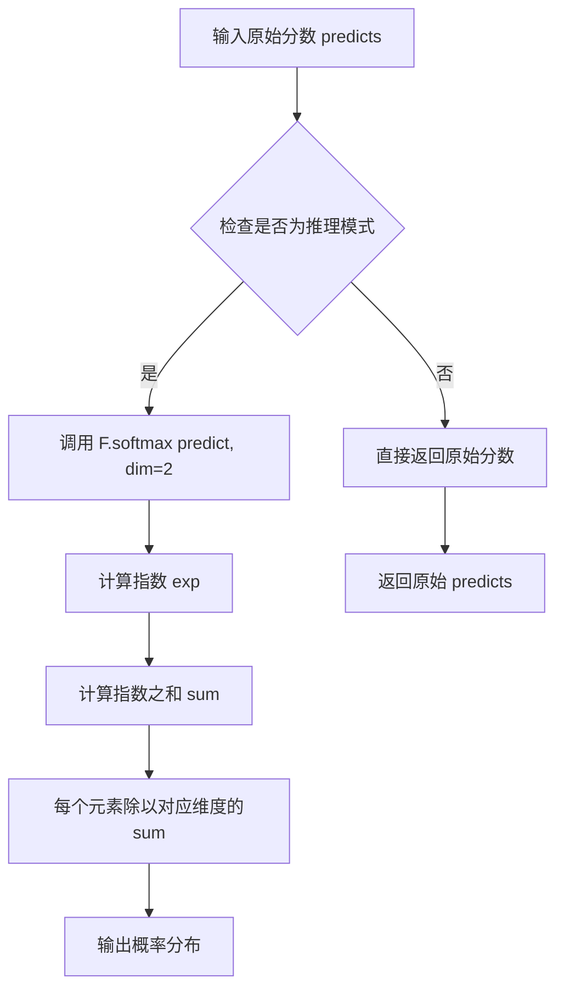
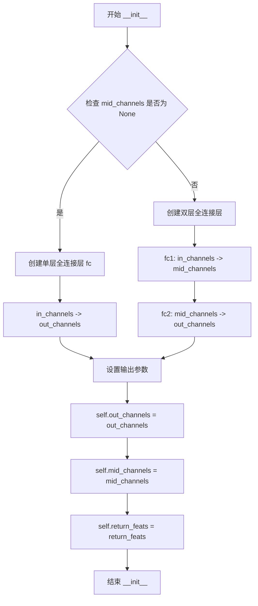

# `MinerU\mineru\model\utils\pytorchocr\modeling\heads\rec_ctc_head.py` 详细设计文档

这是一个PyTorch实现的CTC（Connectionist Temporal Classification）头部网络模块，用于将输入特征映射到输出类别，支持单层或双层全连接结构，可选择在推理时返回softmax概率或中间特征。

## 整体流程

```mermaid
graph TD
    A[输入特征 x] --> B{mid_channels是否为None?}
    B -- 是 --> C[使用单层fc进行映射]
    B -- 否 --> D[先使用fc1映射到中间维度]
    D --> E[再使用fc2映射到输出维度]
    C --> F{return_feats=True?}
    E --> F
F -- 是 --> G[返回(中间特征, 预测)]
F -- 否 --> H{是否在推理模式?}
H -- 是 --> I[对预测进行softmax]
H -- 否 --> J[直接返回预测]
I --> K[返回softmax概率]
G --> K
J --> K
```

## 类结构

```
nn.Module (PyTorch基类)
└── CTCHead
```

## 全局变量及字段


### `CTCHead.fc`
    
单层全连接层（当mid_channels为None时使用）

类型：`nn.Linear`
    


### `CTCHead.fc1`
    
第一层全连接层（当mid_channels不为None时使用）

类型：`nn.Linear`
    


### `CTCHead.fc2`
    
第二层全连接层（当mid_channels不为None时使用）

类型：`nn.Linear`
    


### `CTCHead.out_channels`
    
输出类别数

类型：`int`
    


### `CTCHead.mid_channels`
    
中间层维度，若为None则使用单层结构

类型：`int or None`
    


### `CTCHead.return_feats`
    
是否返回中间特征

类型：`bool`
    
    

## 全局函数及方法


### F.softmax

F.softmax 是 PyTorch `torch.nn.functional` 模块中的 softmax 函数，用于推理时将模型输出的原始分数（logits）转换为概率分布，实现概率归一化，使得指定维度上的所有值相加为 1。

参数：

- `predicts`：`torch.Tensor`，模型的原始输出张量（logits），通常形状为 `[batch_size, seq_len, num_classes]`
- `dim`：`int`，指定进行 softmax 操作的维度，这里传入 `2`，表示在通道维度（num_classes 维度）进行归一化

返回值：`torch.Tensor`，返回归一化后的概率分布张量，形状与输入张量相同，每个通道维度的值在 (0, 1) 区间内且和为 1

#### 流程图



#### 带注释源码

```python
# 在 CTCHead 类的 forward 方法中调用
if not self.training:
    # 推理模式：进行概率归一化
    # 输入: predicts - 原始模型输出，形状 [batch_size, seq_len, num_classes]
    # dim=2 表示在通道维度（num_classes）进行 softmax
    predicts = F.softmax(predicts, dim=2)
    result = predicts
```

**技术细节说明**：

- **数值稳定性**：F.softmax 内部实现了数值稳定的 softmax 计算，避免直接使用 exp(x) 可能导致的溢出问题
- **推理用途**：仅在 `not self.training` 时执行，即推理模式；训练时通常使用 CTC Loss 自动处理
- **维度选择**：dim=2 是因为输入张量形状通常为 `[batch, timesteps, classes]`，需要在类别维度归一化


### `CTCHead.__init__`

初始化CTC头部网络，根据是否指定中间通道数构建单层或双层全连接层，并配置输出相关参数。

参数：

- `in_channels`：`int`，输入特征通道数
- `out_channels`：`int`，输出类别数（默认6625，对应音频识别任务）
- `fc_decay`：`float`，全连接层权重衰减系数（默认0.0004）
- `mid_channels`：`int | None`，中间层通道数，若为None则使用单层全连接，否则使用双层（默认None）
- `return_feats`：`bool`，是否返回中间特征（默认False）
- `**kwargs`：`dict`，接收其他可选参数

返回值：`None`，无返回值（构造函数）

#### 流程图



#### 带注释源码

```python
def __init__(
    self,
    in_channels,          # 输入特征维度
    out_channels=6625,    # 输出类别数，默认6625（中文语音识别常用）
    fc_decay=0.0004,      # 权重衰减，用于正则化
    mid_channels=None,    # 中间层维度，None时为单层网络
    return_feats=False,   # 是否返回中间特征用于其他任务
    **kwargs              # 兼容其他参数
):
    # 调用父类nn.Module的初始化方法
    super(CTCHead, self).__init__()
    
    # 根据是否有中间层决定网络结构
    if mid_channels is None:
        # 单层全连接：直接在in_channels和out_channels之间建立映射
        self.fc = nn.Linear(
            in_channels,
            out_channels,
            bias=True,  # 使用偏置项
        )
    else:
        # 双层全连接：增加非线性变换能力
        self.fc1 = nn.Linear(
            in_channels,
            mid_channels,
            bias=True,
        )
        self.fc2 = nn.Linear(
            mid_channels,
            out_channels,
            bias=True,
        )

    # 保存输出相关配置
    self.out_channels = out_channels    # 记录输出类别数
    self.mid_channels = mid_channels    # 记录中间层维度
    self.return_feats = return_feats    # 记录是否返回特征
```


### `CTCHead.forward`

该方法是 CTC（Connectionist Temporal Classification）头部网络的前向传播函数，负责将输入特征通过全连接层映射为字符级别的预测概率分布，支持直接返回预测结果或同时返回中间特征，并在推理模式下自动应用 softmax 归一化。

参数：

- `x`：`torch.Tensor`，输入特征张量，形状为 (batch, seq_len, in_channels)
- `labels`：`torch.Tensor` 或 `None`，训练时的标签序列（可选参数，当前实现中未使用）

返回值：`torch.Tensor` 或 `tuple`，训练时返回预测 logits 或 (特征, 预测logits) 元组；推理时返回 softmax 后的概率分布

#### 流程图

```mermaid
flowchart TD
    A[输入 x] --> B{mid_channels 是否为 None?}
    B -- 是 --> C[直接通过 fc 全连接层]
    B -- 否 --> D[先通过 fc1 获取中间表示]
    D --> E[再通过 fc2 获取最终预测]
    C --> F{return_feats 是否为 True?}
    E --> F
    F -- 是 --> G[返回 (中间特征 x, 预测结果 predicts)]
    F -- 否 --> H{是否在推理模式?}
    G --> I[训练模式返回]
    H -- 是 --> J[应用 softmax]
    H -- 否 --> K[直接返回预测 logits]
    J --> L[推理模式返回]
```

#### 带注释源码

```python
def forward(self, x, labels=None):
    """
    CTC 头部的前向传播方法
    
    参数:
        x: 输入特征张量，形状为 (batch, seq_len, in_channels)
        labels: 可选的标签张量，当前未使用，保留接口兼容性
    
    返回:
        训练模式: 返回预测 logits 或 (特征, 预测logits) 元组
        推理模式: 返回 softmax 后的概率分布
    """
    # 判断是否使用单层全连接还是两层全连接
    if self.mid_channels is None:
        # 单层全连接: 直接将输入映射到输出类别空间
        predicts = self.fc(x)
    else:
        # 两层全连接: 先映射到中间维度，再映射到输出类别
        x = self.fc1(x)          # (batch, seq_len, mid_channels)
        predicts = self.fc2(x)   # (batch, seq_len, out_channels)

    # 根据配置决定是否返回中间特征
    if self.return_feats:
        # 返回元组: (中间特征, 预测结果) - 用于蒸馏或特征提取
        result = (x, predicts)
    else:
        # 仅返回预测结果
        result = predicts

    # 推理模式: 应用 softmax 将 logits 转换为概率分布
    if not self.training:
        predicts = F.softmax(predicts, dim=2)  # 在通道维度进行 softmax
        result = predicts

    return result
```

## 关键组件


### CTCHead 类

CTCHead 是一个用于语音识别或时间序列标注的 Connectionist Temporal Classification (CTC) 神经网络头部模块，负责将输入特征映射到字符类别概率分布，支持单层或双层全连接结构以及推理时自动 softmax 归一化。

### 全连接层 (fc / fc1 + fc2)

用于将输入特征维度映射到输出类别数的线性变换层，支持单层直接映射或通过中间层先降维再升维的两阶段映射，以适应不同的特征表达能力需求。

### forward 方法

执行模型前向传播的核心方法，根据配置执行全连接变换、特征返回以及推理时的概率归一化处理。

### softmax 归一化

在非训练模式下对输出进行 softmax 概率归一化，将 logits 转换为概率分布以便于解码。

### return_feats 特性

支持返回中间层特征而非最终预测结果的选项，便于提取用于其他任务的高维表示。

### 推理/训练模式区分

根据模型训练状态（self.training）决定是否应用 softmax 变换，训练时保留原始 logits 用于 CTC loss 计算。


## 问题及建议


### 已知问题

-   **super() 调用方式过时**：使用 `super(CTCHead, self).__init__()` 而非 Python 3 推荐的新式写法 `super().__init__()`
-   **训练推理逻辑耦合且不一致**：当 `self.return_feats=True` 时，训练模式返回 `(x, predicts)`，但推理模式被后续逻辑覆盖只返回 `predicts`，导致该参数在推理时无效，逻辑混乱
- **未使用的参数**：`__init__` 中的 `**kwargs` 参数被接收但从未使用
- **缺少激活函数**：全连接层之间没有非线性激活函数，模型表达能力受限
- **softmax 计算冗余**：在非训练模式下总是执行 softmax，但返回值未被使用（直接返回），造成不必要的计算开销
- **代码无文档**：类和方法缺少 docstring，影响可维护性和团队协作
- **命名不一致**：单层时使用 `fc`，多层时使用 `fc1/fc2`，缺乏统一的命名规范

### 优化建议

-   改用 `super().__init__()` 语法
-   移除未使用的 `**kwargs` 或明确其用途
-   重新设计 `return_feats` 逻辑，确保训练和推理行为一致，或在文档中明确说明当前行为
-   在 `fc1` 后添加 ReLU 或其他激活函数以增强非线性表达能力
-   移除推理时无用的 softmax 计算，或将其包装为可选操作
-   添加类型注解（type hints）和 docstring 文档
-   考虑将训练和推理逻辑解耦，使用 `nn.Module` 的 `forward` 方法只做前向传播，推理相关逻辑在上层处理


## 其它


### 设计目标与约束

**设计目标**：为CTC（Connectionist Temporal Classification）序列解码任务提供一个灵活的全连接层头部网络，支持单层直接映射和多层中间特征提取两种模式，并可选返回中间特征用于多任务学习。

**核心约束**：
- 输入张量维度必须与in_channels匹配
- 输出通道数默认6625，对应常用字符表大小（如中文语音识别字表）
- return_feats仅在训练模式有效，推理时自动忽略并返回概率分布
- mid_channels必须小于in_channels和out_channels以体现降维/升维意义

---

### 错误处理与异常设计

**输入验证**：
- in_channels必须为正整数，若为None或非正数应抛出ValueError
- out_channels必须为正整数，默认值6625为经验值
- mid_channels若提供，必须为正整数且介于in_channels和out_channels之间
- fc_decay必须为非负浮点数

**运行时异常**：
- forward方法中x的维度不匹配时，PyTorch会自动抛出RuntimeError，建议在调用前进行形状验证
- 当labels参数被传入但未实际使用时，代码无处理逻辑，属于设计疏忽

---

### 数据流与状态机

**数据流**：
1. 输入：shape为(batch, seq_len, in_channels)的张量x
2. 特征变换：若mid_channels存在，经过两层线性变换；否则单层线性变换
3. 条件输出：训练时根据return_feats返回特征+预测或仅预测；推理时自动计算softmax概率
4. 输出：predicts或(result, predicts)或softmax后的概率分布

**状态机**：
- 两种状态：training模式 / inference模式
- 训练模式：根据return_feats决定返回值，可能包含中间特征
- 推理模式：强制返回softmax概率，忽略return_feats参数

---

### 外部依赖与接口契约

**依赖库**：
- torch.nn.functional：提供softmax激活函数
- torch.nn：提供nn.Module基类、nn.Linear线性层

**接口契约**：
- 输入：x为三维张量(batch, seq_len, in_channels)；labels为可选参数（当前版本未使用）
- 输出：训练时返回原始logits或(特征, logits)元组；推理时返回softmax概率
- 兼容性：需配合CTC Loss使用，确保输出维度与字符集大小一致

---

### 性能优化建议

**计算优化**：
- 推理时softmax计算可预先离线计算或使用F.log_softmax配合ctc_greedy_decoder减少数值溢出风险
- 若mid_channels存在，可考虑加入ReLU/GELU激活函数提升非线性表达能力

**内存优化**：
- 中间变量x在return_feats=False且training=True时可考虑不保存，以减少显存占用
- 可使用torch.jit.script包装以获得编译优化

---

### 配置管理与扩展性

**配置项**：
- in_channels：必填，由上游特征提取器决定
- out_channels：默认6625，需与实际字符集大小匹配
- fc_decay：默认0.0004，用于L2正则化（需在线性层手动应用）
- mid_channels：可选，用于增加网络深度
- return_feats：默认False，设为True时支持特征复用

**扩展方向**：
- 可继承该类重写forward方法实现注意力机制
- 可添加dropout层提升泛化能力
- 可接入CNN或RNN层实现更复杂的特征提取

---

### 测试策略建议

**单元测试**：
- 验证不同参数组合下的输出形状正确性
- 验证training/inference模式的输出差异
- 验证return_feats=True时的返回值元组结构

**集成测试**：
- 与上游CNN/RNN特征提取器联调
- 与CTC Loss配合验证梯度反向传播
- 端到端推理流程验证

---

### 安全性与健壮性

**输入安全**：
- 建议在forward入口添加x的shape校验，防止维度不匹配导致的隐晦错误
- labels参数应明确文档说明当前版本未使用，避免误解

**数值稳定**：
- softmax在inference时使用，需注意大批量推理时的数值精度
- 建议记录日志warn用户当out_channels过大时的内存消耗


    