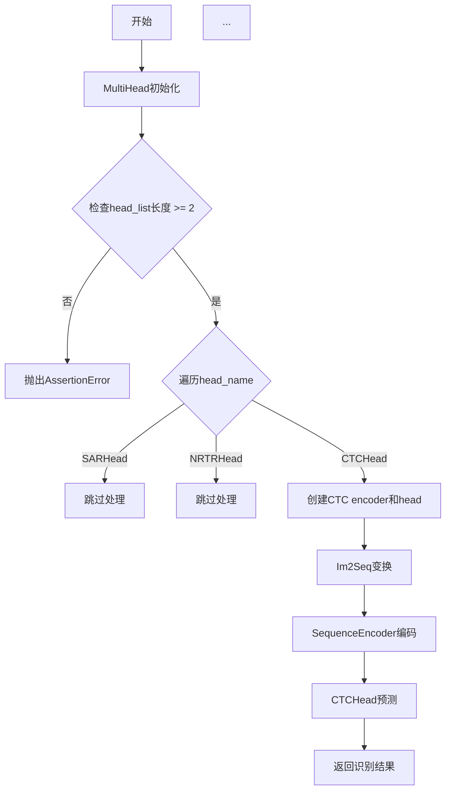
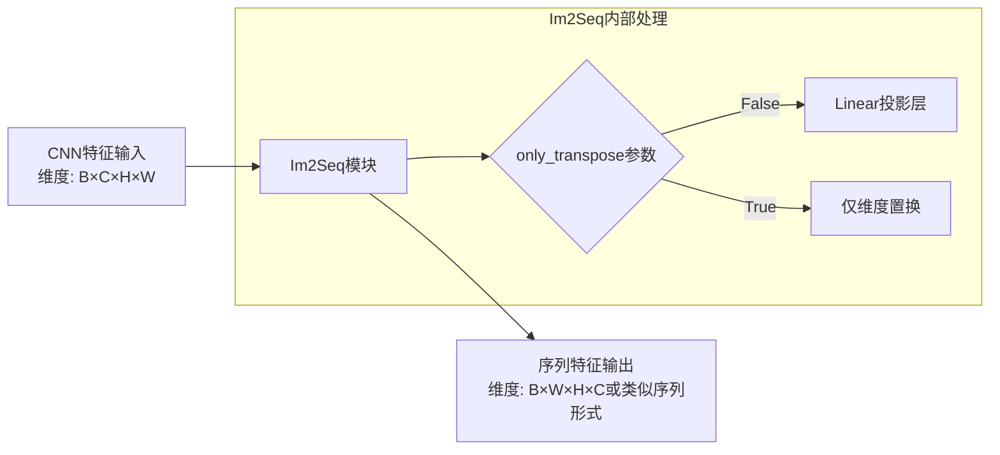
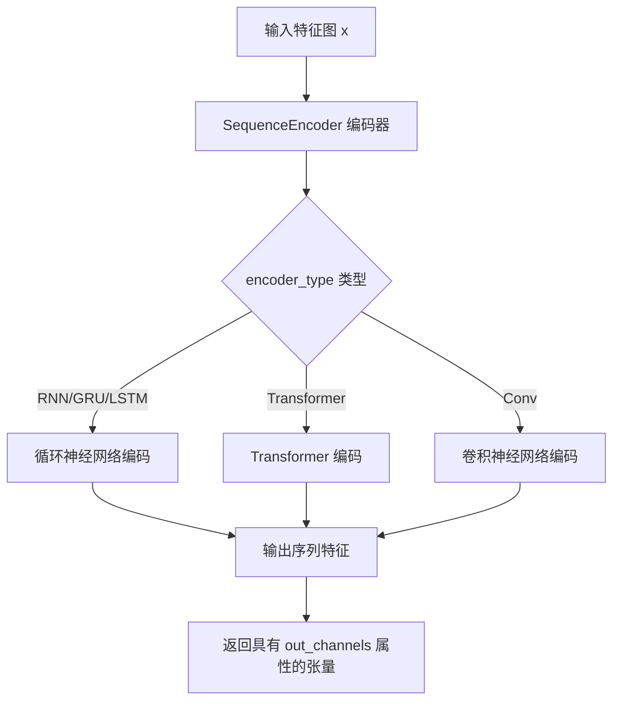
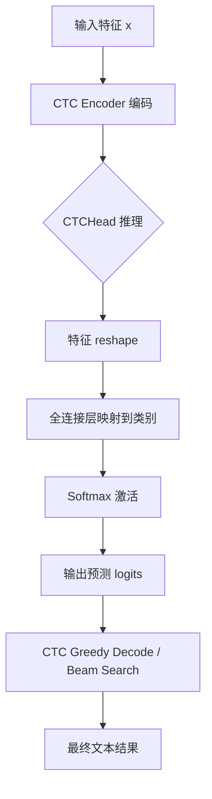
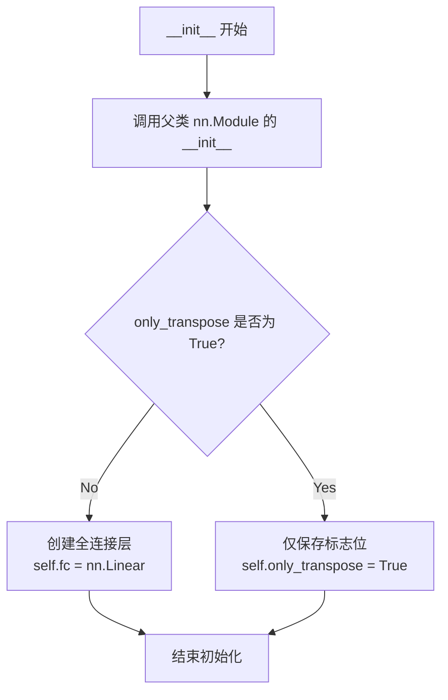
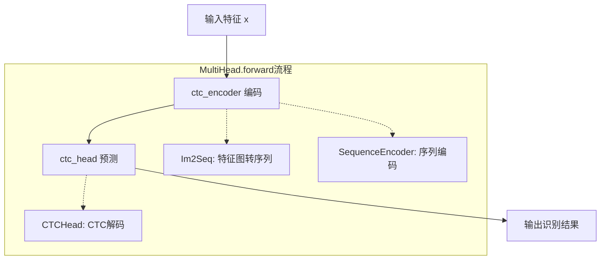

# `MinerU\mineru\model\utils\pytorchocr\modeling\heads\rec_multi_head.py` 详细设计文档

这是一个OCR任务的多头解码器模块，集成了CTC（Connectionist Temporal Classification）头部，支持多种头部类型（SARHead、NRTRHead、CTCHead），用于文本识别任务的后处理和预测。

## 整体流程



## 类结构

```
nn.Module (PyTorch基类)
└── FCTranspose (全连接转置层)
    └── MultiHead (多头解码器)
        ├── Im2Seq (CTC颈部)
        ├── SequenceEncoder (序列编码器)
        └── CTCHead (CTC头部)
```

## 全局变量及字段


### `in_channels`
    
Number of input channels for the feature maps

类型：`int`
    


### `out_channels`
    
Number of output channels after transformation

类型：`int`
    


### `out_channels_list`
    
Dictionary containing output channel counts for different decode heads

类型：`dict`
    


### `data`
    
Input data dictionary containing images and labels for training

类型：`dict or None`
    


### `FCTranspose.only_transpose`
    
Flag indicating whether to only perform transpose without linear transformation

类型：`bool`
    


### `FCTranspose.fc`
    
Linear layer for channel dimension transformation when not only transposing

类型：`nn.Linear`
    


### `MultiHead.head_list`
    
List of head configurations specifying neck and head parameters for different recognition heads

类型：`list`
    


### `MultiHead.gtc_head`
    
Ground truth head type indicator, currently set to 'sar'

类型：`str`
    


### `MultiHead.encoder_reshape`
    
Reshape module to convert 2D feature maps to sequential format for encoder

类型：`Im2Seq`
    


### `MultiHead.ctc_encoder`
    
Sequence encoder for encoding features in CTC head

类型：`SequenceEncoder`
    


### `MultiHead.ctc_head`
    
CTC prediction head for character sequence recognition

类型：`CTCHead`
    
    

## 全局函数及方法


### `Im2Seq`

Im2Seq是PP-OCR系统中用于将CNN提取的二维图像特征转换为一维序列特征的模块，常见于OCR识别任务的编码器部分。该模块通过reshape操作将空间特征转换为序列形式，以便后续RNN/LSTM等序列模型进行处理。

参数：

- `in_channels`：`int`，输入特征图的通道数，来自于CNN骨干网络的输出通道

返回值：`nn.Module`，返回一个PyTorch模块对象，用于对输入特征进行序列变换

#### 流程图



#### 带注释源码

由于Im2Seq类的源码定义位于`..necks.rnn`模块中（通过`from ..necks.rnn import Im2Seq, SequenceEncoder`导入），在当前提供的代码文件中仅展示了其使用方式。基于代码上下文和OCR领域的常见设计模式，其典型实现如下：

```python
# Im2Seq 模块定义（源码位于 ..necks.rnn 模块中）
class Im2Seq(nn.Module):
    """
    将CNN输出的2D特征图转换为1D序列特征
    主要用于OCR识别任务中，将空间特征转换为序列形式
    """
    
    def __init__(self, in_channels, **kwargs):
        """
        初始化Im2Seq模块
        
        参数:
            in_channels: int，输入特征的通道数
            **kwargs: 其他可选参数
        """
        super().__init__()
        self.in_channels = in_channels
        # 可选的隐藏层维度参数
        self.hidden_dim = kwargs.get('hidden_dim', self.in_channels)
        
    def forward(self, x):
        """
        前向传播：将2D特征图转换为序列
        
        参数:
            x: Tensor，输入特征图，维度通常为 [B, C, H, W]
            
        返回:
            Tensor，序列特征，维度通常为 [B, W, H*C] 或类似形式
        """
        # 获取输入维度
        batch_size, channels, height, width = x.size()
        
        # 将特征图从 [B, C, H, W] 转换为 [B, W, H*C]
        # 这里的变换是为了让序列的每个时间步对应输入图像的一列像素
        x = x.permute(0, 3, 1, 2)  # [B, W, C, H]
        x = x.contiguous()  # 确保内存连续
        x = x.view(batch_size, width, -1)  # [B, W, H*C]
        
        return x
```

**在MultiHead类中的使用方式：**

```python
# 在MultiHead.__init__方法中实例化
self.encoder_reshape = Im2Seq(in_channels)

# 之后通过SequenceEncoder进一步处理
# SequenceEncoder内部可能会调用encoder_reshape进行序列转换
```

#### 补充说明

根据提供的代码，Im2Seq在MultiHead类中作为`self.encoder_reshape`被实例化，但并未在forward方法中直接调用。这表明：

1. Im2Seq可能作为SequenceEncoder的一部分被集成
2. 或者存在代码简化，实际使用时SequenceEncoder内部会处理序列转换
3. 该模块主要用于将CNN输出的特征图（通常是4D张量）转换为适合RNN/LSTM处理的序列格式（3D张量）

在实际PP-OCR项目中，Im2Seq的具体实现可能包含更复杂的处理逻辑，如可选的线性投影层、归一化处理等，具体取决于配置参数。


### `SequenceEncoder`

`SequenceEncoder` 是一个用于序列编码的模块，在代码中通过 `..necks.rnn` 模块导入并实例化。它接收特征图和编码器类型，将输入特征转换为序列表示，输出具有 `out_channels` 属性的编码结果，供后续 CTC 头（CTCHead）进行序列标注。

参数：

- `in_channels`：`int`，输入特征图的通道数
- `encoder_type`：`str`，编码器的类型（如 'RNN', 'GRU', 'LSTM' 等）
- `**neck_args`：`dict`，可选的其他编码器参数（如隐藏层大小、层数、dropout 等）

返回值：编码后的序列特征，具有 `out_channels` 属性（int 类型，表示输出通道数）

#### 流程图



#### 带注释源码

```python
# 注：以下代码为基于使用方式推断的 SequenceEncoder 接口说明
# 实际定义在 ..necks.rnn 模块中，此处未展示完整源码

# 在 MultiHead 类中的使用方式：
# 1. 创建 SequenceEncoder 实例
self.ctc_encoder = SequenceEncoder(
    in_channels=in_channels,          # 输入通道数
    encoder_type=encoder_type,        # 编码器类型
    **neck_args                       # 其他编码器配置参数
)

# 2. 在 forward 中调用
ctc_encoder = self.ctc_encoder(x)     # x 为特征图张量
# 返回的 ctc_encoder 具有 .out_channels 属性

# 3. 将编码结果传递给 CTCHead
return self.ctc_head(ctc_encoder)
```

---

### 补充说明

#### 关键组件信息

| 组件名称 | 一句话描述 |
|---------|-----------|
| `SequenceEncoder` | 将卷积特征转换为序列表示的编码器，支持多种编码器类型（RNN/GRU/LSTM/Transformer 等） |
| `Im2Seq` | 将二维特征图转换为一维序列的模块 |
| `CTCHead` | CTC（Connectionist Temporal Classification）解码头，用于序列标注任务 |
| `MultiHead` | 多任务头部容器，根据配置选择不同的解码头（SARHead/NRTRHead/CTCHead） |

#### 潜在的技术债务或优化空间

1. **缺少源码**：当前代码文件中未包含 `SequenceEncoder` 类的实际定义，仅有导入和使用代码，这可能导致维护困难
2. **类型推断不完整**：由于无法看到 `SequenceEncoder` 的具体实现，无法确定其完整参数列表和返回值结构
3. **硬编码依赖**：代码中通过字符串匹配 `"sar"`, `"nrtr"`, `"ctc"` 来区分不同的头部类型，这种方式不易于扩展新类型
4. **错误处理缺失**：当 `encoder_type` 不被支持时，没有友好的错误提示

#### 其他项目说明

**设计目标与约束**：
- 支持多种序列编码器类型以适应不同的 OCR 任务
- 与 CTC 解码器配合使用，实现端到端的文本识别
- 输出需兼容 CTCHead 的输入要求

**错误处理与异常设计**：
- 当 `name` 不在支持列表中时，抛出 `NotImplementedError` 异常
- 当 `head_list` 长度小于 2 时，断言失败

**数据流与状态机**：
- 输入：特征提取器输出的特征图（形状：[batch, channels, height, width]）
- 流程：特征图 → Im2Seq（维度变换）→ SequenceEncoder（序列编码）→ CTCHead（解码）
- 输出：字符分类 logits（形状：[sequence_length, batch, num_classes]）

**外部依赖与接口契约**：
- 依赖 `torch.nn.Module`：所有模块继承自 PyTorch 的 nn.Module
- 接口约定：编码器需具有 `out_channels` 属性供后续模块使用
- 配置驱动：通过 `head_list` 配置字典灵活选择和配置不同的解码头

---

### 建议

如需获取 `SequenceEncoder` 的完整实现源码，请检查项目中的 `ppocr/necks/rnn.py` 文件。在该文件中应该包含 `SequenceEncoder` 类的完整定义，包括所有支持的编码器类型（GRU、LSTM、BiLSTM、RFCU 等）的具体实现。


### CTCHead

CTCHead 是用于连接时序分类（Connectionist Temporal Classification）的解码头部，负责将序列特征转换为最终的文本预测结果。在 MultiHead 架构中，CTCHead 接收来自 CTC 编码器的特征表示，并输出字符类别的预测概率分布。

参数：

- `in_channels`：`int`，输入特征通道数，来自 CTC 编码器的输出通道数（`self.ctc_encoder.out_channels`）
- `out_channels`：`int`，输出类别数，对应 CTC 标签解码的类别数（`out_channels_list["CTCLabelDecode"]`）
- `**head_args`：`dict`，可选的头部配置参数，如激活函数、dropout 等

返回值：`Tensor`，形状为 `(batch_size, seq_len, num_classes)` 的预测 logits，可用于计算 CTC loss 或进行贪婪/束搜索解码

#### 流程图



#### 带注释源码

```python
# CTCHead 在 MultiHead 类中的使用方式
# 位于 ..necks.rnn 模块的 rec_ctc_head 中定义

class MultiHead(nn.Module):
    def __init__(self, in_channels, out_channels_list, **kwargs):
        super().__init__()
        self.head_list = kwargs.pop("head_list")
        
        # ... 其他初始化代码 ...
        
        # 当遇到 CTCHead 时
        elif name == "CTCHead":
            # 1. 创建 CTC neck 的特征序列重塑层
            #    将 CNN 输出的 2D 特征转换为序列形式
            self.encoder_reshape = Im2Sequence(in_channels)
            
            # 2. 获取 neck 配置参数
            neck_args = self.head_list[idx][name]["Neck"]
            encoder_type = neck_args.pop("name")
            
            # 3. 创建序列编码器（GRU/LSTM/Transformer等）
            self.ctc_encoder = SequenceEncoder(
                in_channels=in_channels,
                encoder_type=encoder_type,
                **neck_args
            )
            
            # 4. 获取 head 配置参数
            head_args = self.head_list[idx][name].get("Head", {})
            if head_args is None:
                head_args = {}
            
            # 5. 创建 CTC Head 解码器
            #    - in_channels: 来自 ctc_encoder 的输出通道数
            #    - out_channels: 字符类别数（包含 blank 符）
            #    - **head_args: 其他配置如 dropout、activation 等
            self.ctc_head = CTCHead(
                in_channels=self.ctc_encoder.out_channels,
                out_channels=out_channels_list["CTCLabelDecode"],
                **head_args,
            )
    
    def forward(self, x, data=None):
        """
        前向传播流程：
        1. 输入特征 x 经过 CTC encoder 编码
        2. 编码后的序列特征传入 CTC head
        3. 返回 CTC 解码后的预测结果
        """
        # Step 1: 通过 CTC 编码器得到序列特征
        ctc_encoder = self.ctc_encoder(x)
        
        # Step 2: 通过 CTC Head 解码得到预测结果
        return self.ctc_head(ctc_encoder)
```

---

### 补充说明

#### 关键组件信息

| 组件名称 | 描述 |
|---------|------|
| `CTCHead` | CTC 解码头，将序列特征转换为字符类别预测 |
| `Im2Seq` | 将 CNN 输出的 2D 特征图转换为 1D 序列 |
| `SequenceEncoder` | 序列编码器，支持 RNN/LSTM/GRU 等结构 |
| `MultiHead` | 多任务解码头，支持 SAR、NRTR、CTC 等多种解码方式 |

#### 潜在技术债务与优化空间

1. **缺少 CTCHead 源码**：CTCHead 是外部导入的类，其具体实现细节未知，建议查看 `rec_ctc_head.py` 获取完整实现
2. **硬编码的 head 名称**：`gtc_head = "sar"` 这样的硬编码可能限制了扩展性
3. **异常处理不足**：当 `encoder_type` 不被支持时缺少明确错误提示
4. **data 参数未使用**：forward 方法的 `data` 参数未被使用，可能是为未来扩展预留

#### 外部依赖

- `torch.nn.Module`：PyTorch 神经网络基类
- `..necks.rnn`：包含 Im2Seq 和 SequenceEncoder 的 neck 模块
- `.rec_ctc_head`：CTCHead 的定义模块


### `FCTranspose.__init__`

初始化 FCTranspose 层，用于在全连接层和转置操作之间选择。如果 `only_transpose` 为 True，则仅执行维度置换；否则先转置再通过全连接层处理。

参数：

- `self`：`FCTranspose`，隐式参数，类的实例本身
- `in_channels`：`int`，输入特征的通道数
- `out_channels`：`int`，输出特征的通道数
- `only_transpose`：`bool`，是否仅执行转置操作而不进行全连接变换，默认为 False

返回值：`None`，构造函数无返回值

#### 流程图



#### 带注释源码

```python
def __init__(self, in_channels, out_channels, only_transpose=False):
    """
    初始化 FCTranspose 层
    
    参数:
        in_channels: 输入特征的通道数
        out_channels: 输出特征的通道数
        only_transpose: 是否仅执行转置操作,若为True则不创建全连接层
    """
    # 调用父类 nn.Module 的初始化方法
    super().__init__()
    
    # 保存 only_transpose 标志到实例属性
    # 该标志决定 forward 方法是仅转置还是转置后接全连接
    self.only_transpose = only_transpose
    
    # 仅当 not only_transpose 时才创建全连接层
    # 使用 bias=False 通常是因为后续会接 CTC 等需要无偏置的层
    if not self.only_transpose:
        self.fc = nn.Linear(in_channels, out_channels, bias=False)
```


### `FCTranspose.forward`

该方法是 FCTranspose 类的正向传播函数，负责对输入张量进行维度置换（permute），并根据 `only_transpose` 标志决定是否额外通过线性层进行维度映射变换。

参数：

- `self`：隐含的实例参数，FCTranspose 类的实例本身
- `x`：`torch.Tensor`，输入张量，形状为 [batch_size, channels, height] 或 [batch_size, height, channels]

返回值：`torch.Tensor`，变换后的张量。若 `only_transpose=True`，形状为 [batch_size, height, channels]；否则形状为 [batch_size, height, out_channels]

#### 流程图

```mermaid
flowchart TD
    A[开始 forward] --> B{only_transpose?}
    B -->|True| C[仅转置: x.permute([0, 2, 1])]
    B -->|False| D[先转置: x.permute([0, 2, 1])]
    D --> E[再通过线性层: self.fc(...)]
    C --> F[返回张量]
    E --> F
```

#### 带注释源码

```python
def forward(self, x):
    """
    FCTranspose 模块的前向传播方法
    
    参数:
        x: torch.Tensor，输入张量，形状为 [batch_size, channels, height]
           或根据上游网络输出的其他形状
    
    返回:
        torch.Tensor: 变换后的张量
            - only_transpose=True: 形状为 [batch_size, height, channels]
            - only_transpose=False: 形状为 [batch_size, height, out_channels]
    """
    # 判断是否仅进行维度置换，不做线性变换
    if self.only_transpose:
        # 仅执行维度置换：将通道维度和高度维度交换
        # 例如: [B, C, H] -> [B, H, C]
        return x.permute([0, 2, 1])
    else:
        # 先执行维度置换，再通过全连接层进行维度映射
        # 置换后形状: [B, C, H] -> [B, H, C]
        # 全连接层: [B, H, C] -> [B, H, out_channels]
        return self.fc(x.permute([0, 2, 1]))
```


### `MultiHead.__init__`

该方法为多头部模块的初始化方法，负责根据配置动态创建不同的识别头部（支持SARHead、NRTRHead、CTCHead），其中对CTCHead类型会创建对应的encoder_reshape、ctc_encoder和ctc_head子模块。

参数：

- `in_channels`：`int`，输入特征图的通道数
- `out_channels_list`：`dict`，输出通道数字典，键为解码类型（如"CTCLabelDecode"），值为对应的输出类别数
- `**kwargs`：`dict`，可变关键字参数，其中必须包含`head_list`配置

返回值：`None`，`__init__`方法无返回值

#### 流程图

```mermaid
flowchart TD
    A[开始 __init__] --> B[调用 super().__init__]
    B --> C[从 kwargs 中弹出 head_list]
    C --> D[设置 self.gtc_head = 'sar']
    D --> E{检查 head_list 长度 >= 2}
    E -->|否| F[抛出 AssertionError]
    E -->|是| G[遍历 head_list]
    G --> H[获取当前 head 的名称 name]
    H --> I{判断 name 类型}
    I -->|SARHead| J[pass 跳过]
    I -->|NRTRHead| K[pass 跳过]
    I -->|CTCHead| L[创建 CTC 相关模块]
    I -->|其他| M[抛出 NotImplementedError]
    J --> N[继续下一个 head]
    K --> N
    L --> L1[创建 self.encoder_reshape = Im2Seq]
    L1 --> L2[从 neck_args 获取 encoder_type]
    L2 --> L3[创建 self.ctc_encoder = SequenceEncoder]
    L3 --> L4[获取 head_args]
    L4 --> L5[创建 self.ctc_head = CTCHead]
    L5 --> N
    M --> O[结束]
    N --> P{是否还有更多 head}
    P -->|是| G
    P -->|否| O
```

#### 带注释源码

```python
def __init__(self, in_channels, out_channels_list, **kwargs):
    """
    初始化 MultiHead 多头部模块
    
    参数:
        in_channels: 输入特征图的通道数
        out_channels_list: 输出通道数字典，包含各解码类型的输出通道数
        **kwargs: 关键字参数，必须包含 head_list 配置
    """
    # 调用父类 nn.Module 的初始化方法
    super().__init__()
    
    # 从 kwargs 中提取 head_list 配置，pop 表示取出后从 kwargs 中删除
    self.head_list = kwargs.pop("head_list")
    
    # 设置默认的 gtc_head 类型为 SAR
    self.gtc_head = "sar"
    
    # 断言：head_list 必须至少包含 2 个头部配置
    assert len(self.head_list) >= 2
    
    # 遍历每个头部配置
    for idx, head_name in enumerate(self.head_list):
        # 获取头部名称（字典的第一个键）
        name = list(head_name)[0]
        
        # 根据头部类型进行不同的初始化处理
        if name == "SARHead":
            # SAR 头部暂时 pass，不做额外处理
            pass
        
        elif name == "NRTRHead":
            # NRTR 头部暂时 pass，不做额外处理
            pass
        
        elif name == "CTCHead":
            # ----------- CTC 头部初始化 -----------
            
            # 1. 创建 Im2Seq 层：将特征图转换为序列格式
            #    参数 in_channels: 输入通道数
            self.encoder_reshape = Im2Seq(in_channels)
            
            # 2. 获取 Neck 配置参数
            neck_args = self.head_list[idx][name]["Neck"]
            
            # 3. 提取编码器类型并创建 SequenceEncoder
            encoder_type = neck_args.pop("name")
            self.ctc_encoder = SequenceEncoder(
                in_channels=in_channels, 
                encoder_type=encoder_type, 
                **neck_args  # 解码剩余的 neck 参数
            )
            
            # 4. 获取 Head 配置参数
            head_args = self.head_list[idx][name].get("Head", {})
            
            # 5. 处理 head_args 可能为 None 的情况
            if head_args is None:
                head_args = {}
            
            # 6. 创建 CTCHead
            #    in_channels: 使用 ctc_encoder 的输出通道数
            #    out_channels: 从 out_channels_list 获取 CTC 解码的输出通道数
            self.ctc_head = CTCHead(
                in_channels=self.ctc_encoder.out_channels,
                out_channels=out_channels_list["CTCLabelDecode"],
                **head_args,
            )
        
        else:
            # 不支持的头部类型，抛出未实现错误
            raise NotImplementedError(f"{name} is not supported in MultiHead yet")
```


### `MultiHead.forward`

MultiHead类的forward方法是多头识别模型的前向传播入口，接收特征图和可选的辅助数据，经过CTC编码器和CTC头处理后输出识别结果。

参数：

- `x`：`torch.Tensor`，输入特征张量，来自骨干网络的特征图
- `data`：`Any`，可选的辅助数据字典，默认为None，用于传递额外的识别信息（如文本方向、长度等）

返回值：`torch.Tensor`，CTC头的输出，包含识别结果的logits或概率分布

#### 流程图



#### 带注释源码

```python
def forward(self, x, data=None):
    """
    多头模型的前向传播方法
    
    参数:
        x: 输入特征张量，来自骨干网络或neck的特征输出
        data: 可选的辅助数据，目前代码中未使用，保留接口
    
    返回:
        CTC头的输出，包含识别logits
    """
    # 使用CTC编码器对输入特征进行编码
    # 编码过程: 特征图 -> 序列特征 -> 编码特征
    ctc_encoder = self.ctc_encoder(x)
    
    # 将编码后的特征传入CTC头进行解码
    # 返回识别结果logits或概率分布
    return self.ctc_head(ctc_encoder)
```


## 关键组件


### FCTranspose

全连接转置模块，用于在序列模型中对张量进行维度变换（将[batch, seq, feature]转换为[batch, feature, seq]），支持仅转置或转置后接线性变换。

### MultiHead

多头部控制器，根据配置动态实例化不同的识别头部（CTC、SAR、NRTR等），支持灵活的模型结构组合，当前主要支持CTC头的完整流水线（编码器+CTC解码头）。

### Im2Seq

图像到序列的reshape模块，将二维图像特征展平为序列形式，用于连接CNN特征提取器和RNN序列编码器。

### SequenceEncoder

序列编码器基类，支持多种RNN编码方式（如BiLSTM、BiGRU等），将图像特征序列编码为更高级的语义表示。

### CTCHead

CTC（Connectionist Temporal Classification）解码头部，负责将编码后的序列特征映射到字符概率分布，支持CTC解码策略（如贪婪解码或束搜索）。

### 潜在技术债务

1. **未实现的SARHead和NRTRHead** - 代码中预留了分支但未实现具体逻辑
2. **硬编码的gtc_head标志** - `self.gtc_head = "sar"`未实际使用，可能是遗留代码
3. **缺乏错误处理** - SequenceEncoder实例化失败时缺乏明确异常信息
4. **head_list解析逻辑** - 使用list(head_name)[0]的方式较脆弱，依赖字典键的顺序
5. **模块耦合度** - MultiHead直接创建CTC子模块，缺乏工厂模式的解耦

### 设计约束

- 依赖PyTorch nn.Module作为基类
- 遵循PPOCR架构规范，头部配置通过head_list参数传入
- CTC分支需要out_channels_list提供CTCLabelDecode的输出维度


## 问题及建议


### 已知问题

-   **未实现的功能模块**：SARHead和NRTRHead在代码中只有`pass`语句，是空实现，但代码结构显示它们应该是被支持的头部类型，这会导致调用这些头时程序出错
-   **未使用的类属性**：`self.gtc_head = "sar"` 被赋值但在整个类中从未被使用，属于冗余代码
-   **未使用的forward参数**：forward方法接收`data`参数但完全未使用，造成接口设计冗余
-   **断言与实际逻辑不匹配**：断言`len(self.head_list) >= 2`要求至少两个头部，但代码实际只处理了CTCHead，其余头部未实现
-   **潜在的None引用异常**：如果`head_list`中不包含"CTCHead"，则`self.ctc_encoder`和`self.ctc_head`不会被初始化，在forward方法中调用时会抛出`AttributeError`
-   **未使用的kwargs参数**：`**kwargs`被传入但除了`pop("head_list")`外，其余参数未被使用
-   **编码器初始化风险**：`encoder_type`从字典中pop后直接使用，若原始配置缺少必要参数会导致SequenceEncoder初始化失败

### 优化建议

-   实现SARHead和NRTRHead的完整逻辑，或移除相关代码分支并抛出明确的"不支持"异常
-   删除未使用的`self.gtc_head`属性，或在适当场景下使用它
-   移除forward方法中未使用的`data`参数，保持接口简洁
-   调整断言逻辑以匹配实际需求，或为不同头部类型实现完整的分发机制
-   在__init__方法中添加对"CTCHead"存在性的检查，若不存在则初始化为None并在forward中做相应处理
-   清理未使用的kwargs参数传递
-   在SequenceEncoder初始化前添加参数校验，确保必要的配置项存在

## 其它


### 一段话描述

该代码是PPOCR系统中用于OCR（光学字符识别）的多任务头部模块，包含了FCTranspose（特征转置全连接层）和MultiHead（多任务解码头）两个核心类，用于支持CTC等多种OCR解码方式，实现对输入特征序列的维度转换和序列标签解码。

### 文件的整体运行流程

1. **初始化阶段**：创建FCTranspose和MultiHead实例，配置输入输出通道、任务列表等参数
2. **MultiHead初始化**：根据head_list配置，创建CTC encoder和CTC head，或准备SAR/NRTR head
3. **前向传播阶段**：
   - 输入特征x进入MultiHead.forward()
   - 调用ctc_encoder对特征进行序列编码
   - 将编码后的特征传入ctc_head进行CTC解码
   - 返回解码结果

### 类详细信息

#### FCTranspose类

| 名称 | 类型 | 描述 |
|------|------|------|
| only_transpose | bool | 控制是否只进行维度转置而不做线性变换 |
| fc | nn.Linear | 仅在only_transpose=False时创建的全连接层 |

| 方法名称 | 参数 | 参数类型 | 参数描述 | 返回值类型 | 返回值描述 |
|----------|------|----------|----------|------------|------------|
| __init__ | in_channels | int | 输入特征通道数 | None | 初始化方法 |
| __init__ | out_channels | int | 输出特征通道数 | None | 初始化方法 |
| __init__ | only_transpose | bool | 是否仅转置 | None | 初始化方法 |
| forward | x | torch.Tensor | 输入张量，形状为[B, C, H, W]或[B, C, L] | torch.Tensor | 经过转置和线性变换后的张量 |

#### MultiHead类

| 名称 | 类型 | 描述 |
|------|------|------|
| head_list | list | 任务头部配置列表 |
| gtc_head | str | 主任务头部类型标识 |
| encoder_reshape | Im2Seq | 特征到序列的reshape模块 |
| ctc_encoder | SequenceEncoder | CTC编码器 |
| ctc_head | CTCHead | CTC解码头 |

| 方法名称 | 参数 | 参数类型 | 参数描述 | 返回值类型 | 返回值描述 |
|----------|------|----------|----------|------------|------------|
| __init__ | in_channels | int | 输入特征通道数 | None | 初始化方法 |
| __init__ | out_channels_list | dict | 输出通道数字典 | None | 初始化方法 |
| __init__ | kwargs | dict | 额外配置参数 | None | 初始化方法 |
| forward | x | torch.Tensor | 输入特征张量 | dict | CTC解码结果字典 |
| forward | data | dict | 输入数据字典（可选） | dict | CTC解码结果字典 |

### 关键组件信息

| 组件名称 | 描述 |
|----------|------|
| FCTranspose | 特征维度转置模块，支持仅转置或转置+线性变换 |
| MultiHead | 多任务OCR解码头，支持CTC/SAR/NRTR等多种解码方式 |
| Im2Seq | 将CNN输出的2D特征转换为1D序列的模块 |
| SequenceEncoder | 序列编码器，支持多种编码类型 |
| CTCHead | CTC（Connectionist Temporal Classification）解码头 |
| SARHead | SAR（Show, Attend and Read）解码头 |
| NRTRHead | NRTR（NRTR: Non-autoregressive Transformer OCR）解码头 |

### 潜在的技术债务或优化空间

1. **未完成的SARHead和NRTRHead实现**：代码中只做了pass占位，未实现具体的推理逻辑
2. **硬编码的主任务标识**：self.gtc_head = "sar"被硬编码，未实际使用
3. **缺乏参数校验**：in_channels、out_channels_list等参数缺乏充分的合法性校验
4. **重复的head_name遍历逻辑**：在初始化时遍历head_name但对SAR和NRTR没有实际处理
5. **forward方法data参数未使用**：data参数在forward中被定义但从未使用
6. **缺少文档注释**：类和方法的docstring缺失，不利于维护

### 设计目标与约束

**设计目标**：
- 支持多种OCR解码方式（CTC、SAR、NRTR）的灵活配置
- 实现特征维度变换，支持从CNN特征到序列特征的转换
- 提供统一的MultiHead接口，简化不同解码器的集成

**设计约束**：
- 必须继承nn.Module以兼容PyTorch模型框架
- 输入特征通道数必须与encoder/head配置的通道数匹配
- head_list配置必须至少包含2个任务头部
- 依赖PPOCR框架的necks模块（Im2Seq、SequenceEncoder）和rec_ctc_head模块（CTCHead）

### 错误处理与异常设计

| 异常类型 | 触发条件 | 处理方式 |
|----------|----------|----------|
| NotImplementedError | 使用不支持的Head类型 | 抛出异常并提示具体的不支持类型 |
| AssertionError | head_list长度小于2 | 断言失败，提示配置错误 |
| KeyError | head_list配置中缺少必要的键 | 可能触发KeyError，缺乏防御性编程 |

### 数据流与状态机

**数据流**：
```
输入特征 x (B, C, H, W)
    ↓
MultiHead.forward(x)
    ↓
ctc_encoder(x) → 序列编码
    ↓
ctc_head(encoded_features) → CTC解码
    ↓
输出结果 dict
```

**状态机**：无复杂状态机，仅为单次前向传播的确定性流程

### 外部依赖与接口契约

| 依赖模块 | 导入路径 | 用途 |
|----------|----------|------|
| nn | torch.nn | PyTorch神经网络基类 |
| Im2Seq | ..necks.rnn | 特征到序列转换 |
| SequenceEncoder | ..necks.rnn | 序列编码 |
| CTCHead | .rec_ctc_head | CTC解码头 |

**接口契约**：
- MultiHead.forward(x, data=None) 接受任意形状的PyTorch张量，返回解码结果字典
- out_channels_list必须包含"CTCLabelDecode"键
- head_list中的每个元素应为字典，格式为{"HeadName": {"Neck": {...}, "Head": {...}}}

    