# `MinerU\mineru\model\utils\pytorchocr\modeling\heads\rec_ppformulanet_head.py` 详细设计文档

该代码实现了一个基于MBart的公式识别模型（PPFormulaNet），主要用于从图像中识别数学公式。代码包含定制的attention mask转换器、支持滑动窗口和并行处理的因果语言建模解码器，以及完整的推理和训练流程。

## 整体流程

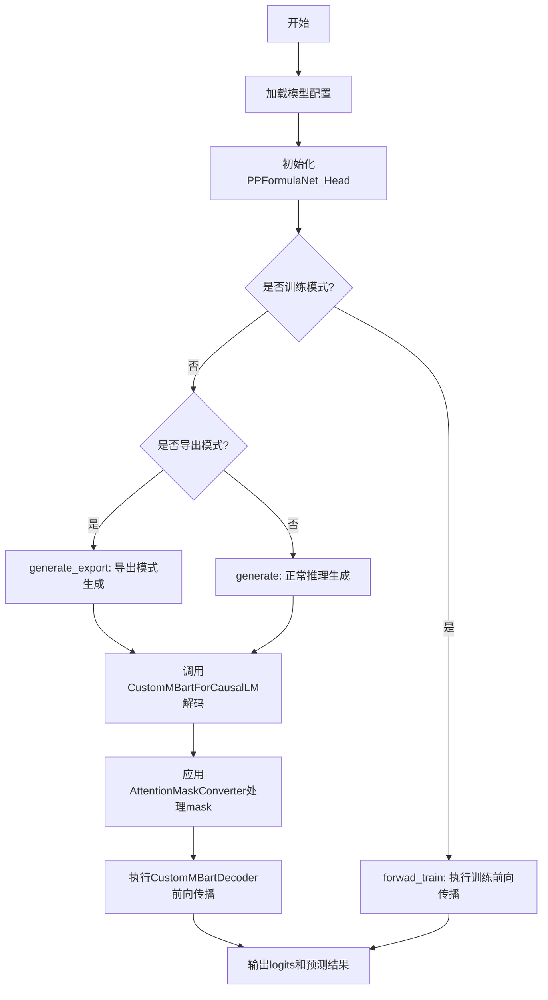

## 类结构

```
AttentionMaskConverter (dataclass)
CustomMBartDecoder (继承自MBartDecoder)
CustomMBartForCausalLM (继承自MBartForCausalLM)
PPFormulaNet_Head (继承自UniMERNetHead)
    └── 包含 CustomMBartForCausalLM 组件
    └── 包含 MBartConfig 配置
```

## 全局变量及字段


### `mbart_config_dict`
    
MBart模型配置字典，包含模型结构、训练和推理的各种超参数

类型：`Dict[str, Any]`
    


### `AttentionMaskConverter.is_causal`
    
标志位，表示是否使用因果注意力掩码，确保每个位置只能关注之前的位置

类型：`bool`
    


### `AttentionMaskConverter.sliding_window`
    
滑动窗口大小，用于限制局部注意力范围，当设置为None时表示不使用滑动窗口

类型：`int`
    


### `CustomMBartDecoder.is_export`
    
标志位，表示模型是否处于导出模式，用于区分推理和导出场景

类型：`bool`
    


### `CustomMBartDecoder.config_decoder`
    
MBart解码器配置对象，存储解码器的各种参数和选项

类型：`MBartConfig`
    


### `PPFormulaNet_Head.decoder_start_token_id`
    
解码器起始token的ID，用于生成序列的起始标识

类型：`int`
    


### `PPFormulaNet_Head.temperature`
    
生成时的温度参数，控制采样的随机性，值越小生成越确定性

类型：`float`
    


### `PPFormulaNet_Head.do_sample`
    
标志位，表示是否使用采样策略进行生成，若为False则使用贪婪解码

类型：`bool`
    


### `PPFormulaNet_Head.top_p`
    
nucleus采样阈值参数，用于控制候选token的累积概率范围

类型：`float`
    


### `PPFormulaNet_Head.is_export`
    
标志位，表示模型是否导出用于部署，导出模式下会使用特定的生成逻辑

类型：`bool`
    


### `PPFormulaNet_Head.max_seq_len`
    
生成序列的最大长度限制，控制生成token的数量上限

类型：`int`
    


### `PPFormulaNet_Head.config_decoder`
    
MBart解码器配置对象，包含解码器的模型结构和训练参数

类型：`MBartConfig`
    


### `PPFormulaNet_Head.encoder_hidden_size`
    
编码器隐藏层的维度大小，用于匹配编码器输出的维度

类型：`int`
    


### `PPFormulaNet_Head.decoder`
    
自定义的因果语言模型解码器，负责基于编码器输出生成token序列

类型：`CustomMBartForCausalLM`
    


### `PPFormulaNet_Head.enc_to_dec_proj`
    
编码器到解码器的投影层，用于将编码器隐藏状态映射到解码器空间

类型：`nn.Linear`
    


### `PPFormulaNet_Head.eos_token_id`
    
结束token的ID，用于标识生成序列的结束位置

类型：`int`
    


### `PPFormulaNet_Head.pad_token_id`
    
填充token的ID，用于将不同长度的序列 padding 到相同长度

类型：`int`
    


### `PPFormulaNet_Head.logits_processor`
    
logits处理器列表，用于对模型输出的logits进行后处理

类型：`LogitsProcessorList`
    


### `PPFormulaNet_Head.device`
    
计算设备对象，指定模型运行在CPU还是GPU上

类型：`torch.device`
    
    

## 全局函数及方法


### `_prepare_4d_attention_mask`

该函数是一个模块级的全局辅助函数，负责将标准的 2D 注意力遮罩（通常用于标识 padding 位置）转换为 Transformer 模型中所需的 4D 注意力遮罩格式。它通过调用 `AttentionMaskConverter` 类的内部方法实现维度扩展、类型转换以及遮罩值的反转（有效位置为0，需忽略的位置为负无穷大）。

参数：

-  `mask`：`torch.Tensor`，输入的 2D 注意力遮罩，通常形状为 `(batch_size, seq_length)`，其中值为 1 表示有效 token，0 表示 padding。
-  `dtype`：`torch.dtype`，指定输出张量的数据类型，用于后续计算。
-  `tgt_len`：`Optional[int]`，目标序列的长度。若为 `None`，则默认使用输入 mask 的序列长度。用于生成非方形注意力矩阵（如源序列与目标序列长度不同的情况）。

返回值：`torch.Tensor`，返回转换后的 4D 注意力遮罩，形状为 `(batch_size, 1, tgt_seq_len, src_seq_len)`。该遮罩已进行反转处理，未被关注的位置（padding）会被填充为极小的负数（负无穷），以在 softmax 计算时消除其影响。

#### 流程图

```mermaid
graph LR
    A[输入: mask, dtype, tgt_len] --> B{_prepare_4d_attention_mask 函数}
    B --> C[调用 AttentionMaskConverter._expand_mask]
    C --> D[1. 扩展维度: [bsz, src_len] -> [bsz, 1, tgt_len, src_len]]
    C --> E[2. 反转遮罩: 1.0 - expanded_mask]
    C --> F[3. 填充负无穷: masked_fill inverted_mask]
    D --> G[输出: 4D 注意力遮罩]
    E --> G
    F --> G
```

#### 带注释源码

```python
def _prepare_4d_attention_mask(mask, dtype, tgt_len=None):
    """
    准备用于 4D 注意力计算的掩码。

    该函数是一个简单的包装器，它调用了 AttentionMaskConverter 类的静态方法 _expand_mask，
    以将 2D 掩码转换为 Transformer 常用的 4D 格式。

    参数:
        mask (torch.Tensor): 2D 注意力掩码 (batch_size, seq_len)。
        dtype (torch.dtype): 目标张量数据类型。
        tgt_len (int, optional): 目标序列长度。如果为 None，则默认为 src_len。

    返回:
        torch.Tensor: 扩展并反转后的 4D 注意力掩码 (batch_size, 1, tgt_len, src_len)。
    """
    # 调用 AttentionMaskConverter 类中的静态方法进行掩码转换
    return AttentionMaskConverter._expand_mask(mask=mask, dtype=dtype, tgt_len=tgt_len)
```


### `_prepare_4d_causal_attention_mask`

该函数是Transformer模型中用于准备因果4D注意力掩码的核心工具函数，能够将2D注意力掩码转换为4D因果掩码，确保解码器中每个位置只能关注当前及之前的位置，同时支持滑动窗口注意力和并行处理优化，适用于基于MBART架构的因果语言模型推理过程。

参数：

- `attention_mask`：`Optional[torch.Tensor]`，2D注意力掩码，形状为`(batch_size, key_value_length)`，用于标识需要忽略的填充token
- `input_shape`：`Union[Tuple[int, ...], List[int], torch.Size]`，输入张量的形状定义，通常为`(batch_size, query_length)`
- `inputs_embeds`：`torch.Tensor`，输入的嵌入向量，用于获取目标数据类型和形状信息
- `past_key_values_length`：`int`，过去键值缓存的长度，用于处理自回归生成时的缓存状态
- `sliding_window`：`Optional[int]`，可选参数，滑动窗口大小，若设置则启用窗口化局部注意力机制
- `use_parallel`：`bool`，可选参数，是否使用并行注意力计算模式，默认False
- `parallel_step`：`int`，可选参数，并行处理的步数，默认3
- `is_export`：`bool`，可选参数，是否处于模型导出模式，默认False

返回值：`torch.Tensor`，4D因果注意力掩码，形状为`(batch_size, 1, query_length, key_value_length)`，其中未 attending的位置被填充为负无穷大

#### 流程图

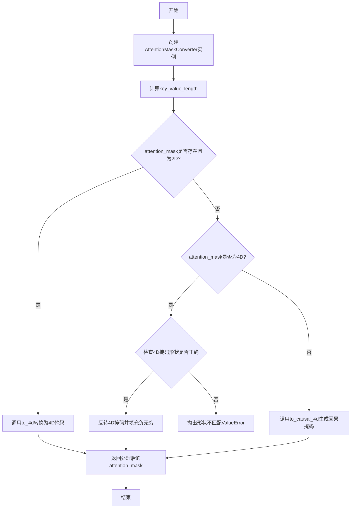

#### 带注释源码

```python
def _prepare_4d_causal_attention_mask(
        attention_mask,           # 输入的2D注意力掩码
        input_shape,              # 输入张量形状(batch_size, query_length)
        inputs_embeds,            # 输入嵌入向量
        past_key_values_length,   # 过去键值缓存长度
        sliding_window=None,      # 滑动窗口大小(可选)
        use_parallel=False,       # 是否使用并行模式
        parallel_step=3,          # 并行步数
        is_export=False,          # 是否为导出模式
):
    """
    Creates a causal 4D mask of shape `(batch_size, 1, query_length, key_value_length)` from a 2D mask of shape
    `(batch_size, key_value_length)`

    Args:
        attention_mask (`paddle.Tensor` or `None`):
            A 2D attention mask of shape `(batch_size, key_value_length)`
        input_shape (`tuple(int)` or `list(int)` or `paddle.Size`):
            The input shape should be a tuple that defines `(batch_size, query_length)`.
        inputs_embeds (`paddle.Tensor`):
            The embedded inputs as a paddle Tensor.
        past_key_values_length (`int`):
            The length of the key value cache.
        sliding_window (`int`, *optional*):
            If the model uses windowed attention, a sliding window should be passed.
    """
    # 实例化注意力掩码转换器，设置因果模式为True
    attn_mask_converter = AttentionMaskConverter(
        is_causal=True, sliding_window=sliding_window
    )

    # 计算键值对的总长度 = 当前输入长度 + 过去缓存长度
    key_value_length = input_shape[-1] + past_key_values_length

    # 4d mask is passed through the layers
    # 根据输入掩码的不同形式进行相应处理
    if attention_mask is not None and len(attention_mask.shape) == 2:
        # 情况1：输入为2D掩码，使用to_4d方法转换为4D因果掩码
        attention_mask = attn_mask_converter.to_4d(
            attention_mask,                           # 原始2D掩码
            input_shape[-1],                          # 查询长度
            key_value_length=key_value_length,        # 键值长度
            dtype=inputs_embeds.dtype,                # 使用嵌入向量的数据类型
            use_parallel=use_parallel,                # 是否使用并行
            parallel_step=parallel_step,              # 并行步数
            is_export=is_export,                      # 是否导出
        )
    elif attention_mask is not None and len(attention_mask.shape) == 4:
        # 情况2：输入已经是4D掩码，验证形状并反转
        expected_shape = (input_shape[0], 1, input_shape[1], key_value_length)
        if tuple(attention_mask.shape) != expected_shape:
            raise ValueError(
                f"Incorrect 4D attention_mask shape: {tuple(attention_mask.shape)}; expected: {expected_shape}."
            )
        else:
            # if the 4D mask has correct shape - invert it and fill with negative infinity
            # 4D掩码形状正确时，反转掩码并将未 attending位置填充为负无穷
            inverted_mask = 1.0 - attention_mask
            attention_mask = inverted_mask.masked_fill_(
                inverted_mask.to(torch.bool), torch.finfo(inputs_embeds.dtype).min
            )
    else:
        # 情况3：无掩码输入，生成默认的全1因果4D掩码
        attention_mask = attn_mask_converter.to_causal_4d(
            input_shape[0],                    # batch_size
            input_shape[-1],                   # query_length
            key_value_length,                  # key_value_length
            dtype=inputs_embeds.dtype,         # 数据类型
        )

    return attention_mask
```


### `_prepare_4d_causal_attention_mask_export`

该函数用于为模型导出准备4D因果注意力掩码，确保序列中每个位置只能关注其前面的位置，支持滑动窗口和并行处理选项。

参数：

- `attention_mask`：`torch.Tensor` 或 `None`，初始的2D注意力掩码，用于避免关注填充token
- `input_shape`：`tuple(int)` 或 `list(int)`，输入张量的形状，格式为`(batch_size, sequence_length)`
- `inputs_embeds`：`torch.Tensor`，输入序列的嵌入向量，用于推导数据类型和维度
- `past_key_values_length`：`int`，过去键值缓存的长度，用于Transformer解码器缓存场景
- `sliding_window`：`int` 或 `None`，可选参数，指定局部注意力滑动窗口的大小
- `use_parallel`：`bool`，是否使用并行处理计算注意力，默认为False
- `parallel_step`：`int`，并行处理的步数，当`use_parallel`为True时使用，默认为3
- `is_export`：`bool`，是否在为模型导出准备注意力掩码，默认为False

返回值：`torch.Tensor`，返回4D因果注意力掩码，形状为`(batch_size, 1, query_length, key_value_length)`，用于Transformer模型中确保正确的因果掩码。

#### 流程图

```mermaid
flowchart TD
    A[开始] --> B[创建AttentionMaskConverter<br/>is_causal=True, sliding_window=sliding_window]
    B --> C[计算key_value_length<br/>= input_shape[-1] + past_key_values_length]
    C --> D[获取attention_mask的形状信息]
    D --> E[调用attn_mask_converter.to_4d_export方法]
    E --> F[传入参数: attention_mask, query_length, key_value_length, dtype, use_parallel, parallel_step, is_export]
    F --> G[在to_4d_export中调用_expand_mask_export扩展掩码]
    G --> H[返回4D注意力掩码]
    H --> I[结束]
```

#### 带注释源码

```python
def _prepare_4d_causal_attention_mask_export(
        attention_mask,
        input_shape,
        inputs_embeds,
        past_key_values_length,
        sliding_window=None,
        use_parallel=False,
        parallel_step=3,
        is_export=False,
):
    """
    Prepare a 4D causal attention mask for export.

    This function prepares a 4-dimensional causal attention mask, which is used to ensure that each position in the
    sequence can only attend to previous positions. It is specifically designed to handle scenarios where the model
    is being exported, potentially with additional options like sliding window or parallel processing.

    Args:
        attention_mask: The initial attention mask, typically used to avoid attending to padding tokens.
        input_shape: Shape of the input tensor, usually in the form (batch_size, sequence_length).
        inputs_embeds: Embeddings of the input sequence, used to derive certain dimensions if needed.
        past_key_values_length: Length of past key values, used in contexts like transformer decoders with caching.
        sliding_window: Optional parameter. If provided, specifies the size of a sliding window for local attention.
        use_parallel: Flag indicating whether to use parallel processing for attention computation.
        parallel_step: Number of steps to use in parallel processing, relevant if `use_parallel` is True.
        is_export: Flag indicating whether the attention mask is being prepared for model export.

    Returns:
        A 4D causal attention mask suitable for use in transformer models, ensuring correct causal masking.
    """
    # 创建一个AttentionMaskConverter实例，用于掩码转换
    # is_causal=True表示使用因果掩码（每个位置只能关注之前的位置）
    # sliding_window用于局部注意力机制
    attn_mask_converter = AttentionMaskConverter(
        is_causal=True, sliding_window=sliding_window
    )
    
    # 计算key_value_length：当前输入长度 + 过去键值长度
    # 这是因为在解码器中使用缓存时，需要考虑过去已计算的键值
    key_value_length = input_shape[-1] + past_key_values_length

    # 获取attention_mask的形状信息
    shape = attention_mask.shape
    len_shape = len(shape)

    # 调用转换器的to_4d_export方法将2D掩码转换为4D掩码
    # 这个方法内部会调用_expand_mask_export来扩展掩码维度
    attention_mask = attn_mask_converter.to_4d_export(
        attention_mask,
        input_shape[-1],
        key_value_length=key_value_length,
        dtype=inputs_embeds.dtype,
        use_parallel=use_parallel,
        parallel_step=parallel_step,
        is_export=is_export,
    )
    
    # 返回转换后的4D因果注意力掩码
    return attention_mask
```


### `AttentionMaskConverter.__init__`

这是 `AttentionMaskConverter` 类的构造函数，用于初始化注意力掩码转换器的基本配置。该方法接收因果掩码标志和滑动窗口大小两个参数，并将它们存储为实例属性，同时对滑动窗口参数进行有效性验证。

参数：

- `is_causal`：`bool`，表示是否启用因果掩码（causal masking），确保每个位置只能关注其之前的位置
- `sliding_window`：`Optional[int]`，可选参数，表示滑动窗口的大小，用于限制局部注意力范围，默认为 `None`

返回值：`None`，构造函数不返回任何值

#### 流程图

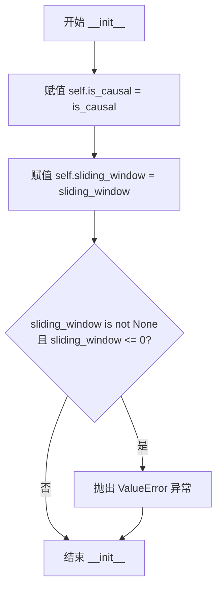

#### 带注释源码

```python
def __init__(self, is_causal: bool, sliding_window=None):
    """
    初始化 AttentionMaskConverter 实例。

    Args:
        is_causal (bool): 是否使用因果掩码的标志。
        sliding_window (int, optional): 滑动窗口大小，用于局部注意力机制。
    """
    # 将因果掩码标志存储为实例属性
    self.is_causal = is_causal
    
    # 将滑动窗口大小存储为实例属性
    self.sliding_window = sliding_window

    # 验证滑动窗口参数的有效性
    # 如果提供了滑动窗口参数但值不为正整数，则抛出异常
    if self.sliding_window is not None and self.sliding_window <= 0:
        raise ValueError(
            f"Make sure that when passing `sliding_window` that its value is a strictly positive integer, not `{self.sliding_window}`"
        )
```


### `AttentionMaskConverter._make_causal_mask`

生成用于双向自注意力的因果掩码（causal mask），确保每个位置只能关注其前面的位置，支持滑动窗口注意力机制和过去的键值对长度。

参数：

- `input_ids_shape`：Tuple[int, int]，输入序列的形状，格式为 (batch_size, target_length)
- `dtype`：torch.dtype，掩码张量的数据类型
- `past_key_values_length`：int，过去键值对的长度，默认为 0，用于增量解码场景
- `sliding_window`：int or None，滑动窗口大小，如果设置则限制注意力在局部窗口内
- `is_export`：bool，是否为导出模式，导出模式下使用 float64 类型

返回值：`torch.Tensor`，形状为 (batch_size, 1, target_length, target_length + past_key_values_length) 的 4D 因果掩码

#### 流程图

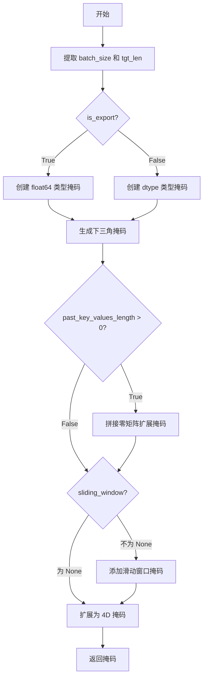

#### 带注释源码

```python
@staticmethod
def _make_causal_mask(
        input_ids_shape,
        dtype,
        past_key_values_length=0,
        sliding_window=None,
        is_export=False,
):
    """
    Make causal mask used for bi-directional self-attention.
    
    创建一个因果掩码，用于确保注意力机制中每个位置只能看到其前面的位置。
    这对于自回归生成模型（如GPT、MBART等）至关重要。
    
    参数:
        input_ids_shape: 输入ID的形状 (batch_size, target_length)
        dtype: 输出掩码的数据类型
        past_key_values_length: 过去键值对的长度，用于缓存解码场景
        sliding_window: 滑动窗口大小，用于局部注意力机制
        is_export: 是否为导出模式
    
    返回:
        形状为 (batch_size, 1, tgt_len, tgt_len + past_key_values_length) 的4D掩码
    """
    # 从输入形状中提取批量大小和目标长度
    bsz, tgt_len = input_ids_shape
    
    # 根据is_export标志选择不同的数据类型创建掩码
    # 导出模式使用float64，普通模式使用指定dtype
    if is_export:
        mask = torch.full(
            (tgt_len, tgt_len), torch.finfo(dtype).min, dtype=torch.float64
        )
        mask_cond = torch.arange(mask.shape[-1])
        mask.masked_fill_(
            mask_cond < (mask_cond + 1).reshape([mask.shape[-1], 1]), 0
        )
    else:
        # 创建初始掩码，所有位置填充负无穷大（将被掩盖）
        mask = torch.full((tgt_len, tgt_len), torch.finfo(dtype).min)
        mask_cond = torch.arange(mask.shape[-1])
        # 创建下三角掩码（包含对角线），使每个位置只能关注自身及之前的位置
        mask.masked_fill_(
            mask_cond < (mask_cond + 1).reshape([mask.shape[-1], 1]), 0
        )
        # 转换掩码到目标dtype
        mask = mask.to(dtype)

    # 如果存在过去的键值对长度，在掩码左侧添加零列以处理历史上下文
    if past_key_values_length > 0:
        mask = torch.concat(
            [torch.zeros(tgt_len, past_key_values_length, dtype=dtype), mask],
            dim=-1,
        )

    # 如果指定了滑动窗口，添加额外的下三角窗口掩码
    # 这将限制每个位置只能在其滑动窗口范围内关注
    if sliding_window is not None:
        # 计算对角线偏移量，考虑过去的键值对长度
        diagonal = past_key_values_length - sliding_window - 1

        # 创建一个布尔类型的下三角窗口掩码
        context_mask = torch.tril(
            torch.ones_like(mask, dtype=torch.bool), diagonal=diagonal
        )
        # 将窗口外的位置设置为负无穷大
        mask.masked_fill_(context_mask, torch.finfo(dtype).min)

    # 扩展掩码维度：从 [tgt_len, tgt_len + past] 扩展到 [bsz, 1, tgt_len, tgt_len + past]
    # 这使得掩码可以广播到批量大小和注意力头维度
    return mask[None, None, :, :].expand(
        [bsz, 1, tgt_len, tgt_len + past_key_values_length]
    )
```


### `AttentionMaskConverter._make_causal_mask_parallel`

该方法用于生成支持并行解码的因果掩码（causal mask），通过控制 `parallel_step` 参数实现多步并行生成，是标准因果掩码的并行化版本，支持滑动窗口注意力机制，常用于 Transformer 模型的并行解码场景。

参数：

- `input_ids_shape`：Tuple[int, int]，表示输入的形状，通常为 (batch_size, target_length)
- `dtype`：torch.dtype，掩码的数据类型，用于指定掩码值的精度
- `past_key_values_length`：int，默认为 0，过去键值的长度，用于处理缓存的历史信息
- `sliding_window`：int or None，可选参数，滑动窗口大小，若设置则限制注意力范围
- `parallel_step`：int，默认为 1，并行步数，控制每次并行生成的 token 数量
- `is_export`：bool，默认为 False，是否用于导出场景

返回值：`torch.Tensor`，返回形状为 (batch_size, 1, target_length, target_length + past_key_values_length) 的 4D 掩码张量

#### 流程图

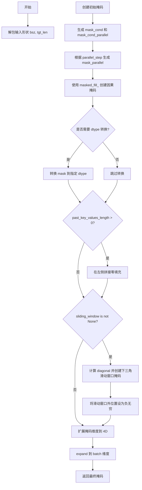

#### 带注释源码

```python
@staticmethod
def _make_causal_mask_parallel(
        input_ids_shape,
        dtype,
        past_key_values_length=0,
        sliding_window=None,
        parallel_step=1,
        is_export=False,
):
    """
    Make causal mask used for bi-directional self-attention.
    """
    # 解包输入形状，获取 batch size 和 target length
    bsz, tgt_len = input_ids_shape
    
    # 创建初始掩码，填充负无穷（表示需要被 mask 掉的位置）
    mask = torch.full((tgt_len, tgt_len), torch.finfo(dtype).min)
    
    # 生成用于创建因果掩码的条件索引
    mask_cond = torch.arange(mask.shape[-1])
    mask_cond_parallel = torch.arange(mask.shape[-1])

    # 根据 parallel_step 生成并行掩码索引，用于支持并行解码
    # step=parallel_step 意味着每隔 parallel_step 个位置允许关注
    mask_parallel = torch.arange(0, tgt_len, step=parallel_step).reshape([1, -1])
    # repeat_interleave 扩展以覆盖所有位置
    mask_parallel = torch.repeat_interleave(mask_parallel, parallel_step, 1)[
        :, :tgt_len
    ]
    
    # 创建因果掩码：每个位置只能关注其前面的 parallel_step 个位置
    mask.masked_fill_(
        mask_cond < (mask_parallel + parallel_step).reshape([mask.shape[-1], 1]), 0
    )
    
    # 转换为指定的数据类型
    mask = mask.to(dtype)

    # 如果存在过去的 key/value，添加零填充到掩码左侧
    if past_key_values_length > 0:
        mask = torch.concat(
            [torch.zeros([tgt_len, past_key_values_length], dtype=dtype), mask],
            dim=-1,
        )

    # 添加滑动窗口掩码（如果需要）
    if sliding_window is not None:
        # 计算对角线位置
        diagonal = past_key_values_length - sliding_window - 1

        # 创建下三角滑动窗口掩码
        context_mask = torch.tril(
            torch.ones_like(mask, dtype=torch.bool), diagonal=diagonal
        )
        # 将滑动窗口外的位置设为负无穷
        mask.masked_fill_(context_mask, torch.finfo(dtype).min)

    # 扩展掩码维度：(tgt_len, tgt_len) -> (1, 1, tgt_len, tgt_len)
    # 然后 expand 到 batch 维度：(1, 1, tgt_len, tgt_len) -> (bsz, 1, tgt_len, tgt_len + past_key_values_length)
    return mask[None, None, :, :].expand(
        [bsz, 1, tgt_len, tgt_len + past_key_values_length]
    )
```


### `AttentionMaskConverter.to_4d`

将2D注意力掩码转换为4D注意力掩码，通过将掩码扩展到(bsz, head_dim=1, query_length, key_value_length)形状，并为不被关注的位置添加大的负偏置值。如果启用了因果掩码，则会添加因果掩码。

参数：

- `self`：`AttentionMaskConverter`实例本身
- `attention_mask_2d`：`torch.Tensor`，二维注意力掩码，形状为(batch_size, seq_length)，用于标识需要忽略的位置
- `query_length`：`int`，查询序列的长度
- `dtype`：`torch.dtype`，输出张量的数据类型
- `key_value_length`：`int`，键值对的长度，通常等于query_length加上过去键值的长度
- `use_parallel`：`bool`，是否使用并行处理，默认为False
- `parallel_step`：`int`，并行处理的步长，默认为3
- `is_export`：`bool`，是否为导出模式，默认为False

返回值：`torch.Tensor`，扩展后的4D注意力掩码，形状为(batch_size, 1, query_length, key_value_length)

#### 流程图

```mermaid
flowchart TD
    A[开始 to_4d] --> B[构建input_shape]
    B --> C{use_parallel?}
    C -->|True| D[step = parallel_step]
    C -->|False| E[step = 1]
    D --> F{input_shape[-1] > step 或<br/>sliding_window 不为 None}
    E --> F
    F -->|Yes 且 is_causal| G{key_value_length<br/>是否为 None?}
    F -->|No| J[跳过因果掩码生成]
    G -->|Yes| H[抛出ValueError]
    G -->|No| I[past_key_values_length =<br/>key_value_length - query_length]
    H --> K[结束]
    I --> L{use_parallel?}
    L -->|Yes| M[调用_make_causal_mask_parallel]
    L -->|No| N[调用_make_causal_mask]
    M --> O[生成causal_4d_mask]
    N --> O
    J --> P[调用_expand_mask]
    O --> P
    P --> Q{causal_4d_mask<br/>不为 None?}
    Q -->|Yes| R[使用causal_4d_mask进行masked_fill]
    Q -->|No| S[直接返回expanded_attn_mask]
    R --> T[返回expanded_4d_mask]
    S --> T
    K --> T
```

#### 带注释源码

```python
def to_4d(
        self,
        attention_mask_2d,  # 输入的2D注意力掩码，形状为(batch_size, seq_length)
        query_length,       # 查询序列的长度
        dtype,              # 输出张量的数据类型
        key_value_length,   # 键值对长度，等于query_length + past_key_values_length
        use_parallel=False, # 是否使用并行处理
        parallel_step=3,    # 并行处理的步长
        is_export=False,    # 是否为导出模式
):
    """
    Converts 2D attention mask to 4D attention mask by expanding mask to (bsz, head_dim=1, query_length,
    key_value_length) shape and by adding a large negative bias to not-attended positions. If attention_mask is
    causal, a causal mask will be added.
    """
    # 构建输入形状元组：(batch_size, query_length)
    input_shape = (attention_mask_2d.shape[0], query_length)

    # 初始化因果掩码为None
    causal_4d_mask = None
    
    # 根据是否使用并行设置步长
    if use_parallel:
        step = parallel_step
    else:
        step = 1
    
    # 判断是否需要生成因果掩码：
    # 条件1：序列长度大于步长，或者设置了滑动窗口
    # 条件2：当前是因果模式(is_causal=True)
    if (
            input_shape[-1] > step or self.sliding_window is not None
    ) and self.is_causal:
        # 如果是因果模式但未提供key_value_length，抛出错误
        if key_value_length is None:
            raise ValueError(
                "This attention mask converter is causal. Make sure to pass `key_value_length` to correctly create a causal mask."
            )

        # 计算过去的键值对长度
        past_key_values_length = key_value_length - query_length

        # 根据是否并行选择生成因果掩码的方法
        if use_parallel:
            # 使用并行方法生成因果掩码（支持滑动窗口）
            causal_4d_mask = self._make_causal_mask_parallel(
                input_shape,
                dtype,
                past_key_values_length=past_key_values_length,
                sliding_window=self.sliding_window,
                parallel_step=parallel_step,
                is_export=is_export,
            )
        else:
            # 使用标准方法生成因果掩码
            causal_4d_mask = self._make_causal_mask(
                input_shape,
                dtype,
                past_key_values_length=past_key_values_length,
                sliding_window=self.sliding_window,
                is_export=is_export,
            )

    # 如果设置了滑动窗口但不是因果模式，抛出未实现错误
    elif self.sliding_window is not None:
        raise NotImplementedError(
            "Sliding window is currently only implemented for causal masking"
        )

    # 调用内部方法将2D掩码扩展为4D
    # 扩展后形状：(batch_size, 1, query_length, seq_length)
    expanded_attn_mask = self._expand_mask(
        attention_mask_2d, dtype, tgt_len=input_shape[-1]
    )

    # 如果存在因果掩码，将其与扩展后的掩码合并
    # 使用masked_fill将扩展掩码中为0的位置（需要关注的位置）保持不变
    # 为1的位置（不需要关注的位置）设置为极小值
    if causal_4d_mask is not None:
        expanded_attn_mask = causal_4d_mask.masked_fill_(
            expanded_attn_mask.to(torch.bool), torch.finfo(dtype).min
        )

    # 返回最终的4D注意力掩码
    expanded_4d_mask = expanded_attn_mask
    return expanded_4d_mask
```


### `AttentionMaskConverter.to_4d_export`

该方法用于将2D注意力掩码转换为4D注意力掩码，专为模型导出（export）场景设计。它通过扩展掩码维度并对未_attended位置填充大的负值来实现，适用于Transformer模型的自注意力计算。

参数：

- `self`：`AttentionMaskConverter`实例本身
- `attention_mask_2d`：`torch.Tensor`，形状为`[bsz, seq_len]`的2D注意力掩码，表示哪些位置是有效的
- `query_length`：`int`，查询序列的长度
- `dtype`：`torch.dtype`，目标数据类型，用于掩码的类型转换
- `key_value_length`：`int`，键值对序列的长度（未在此方法中直接使用）
- `use_parallel`：`bool`，是否使用并行处理（未在此方法中直接使用）
- `parallel_step`：`int`，并行处理的步数（未在此方法中直接使用）
- `is_export`：`bool`，是否处于导出模式（未在此方法中直接使用）

返回值：`torch.Tensor`，转换后的4D注意力掩码，形状为`[bsz, 1, tgt_seq_len, src_seq_len]`

#### 流程图

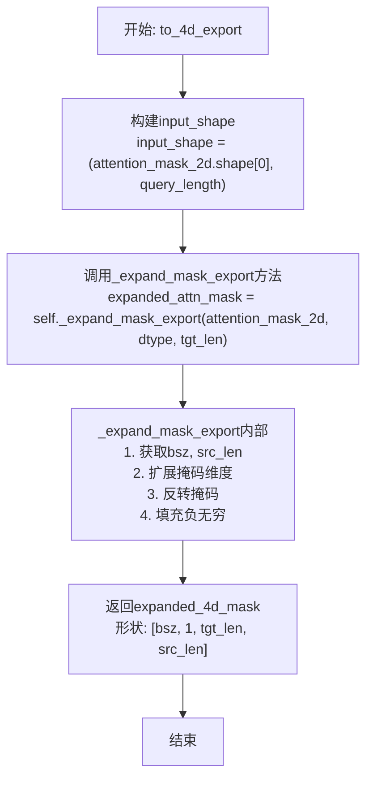

#### 带注释源码

```python
def to_4d_export(
        self,
        attention_mask_2d,
        query_length,
        dtype,
        key_value_length,
        use_parallel=False,
        parallel_step=3,
        is_export=False,
):
    """
    将2D注意力掩码转换为4D注意力掩码（导出版本）
    
    该方法主要用于模型导出场景，将2D掩码扩展为4D格式，
    并对未_attended位置填充负无穷大值，使其在注意力计算中被忽略。
    
    参数:
        attention_mask_2d: 2D注意力掩码 [bsz, seq_len]
        query_length: 查询长度
        dtype: 目标数据类型
        key_value_length: 键值对长度（未使用）
        use_parallel: 是否并行（未使用）
        parallel_step: 并行步数（未使用）
        is_export: 是否导出模式（未使用）
    
    返回:
        4D注意力掩码 [bsz, 1, tgt_seq_len, src_seq_len]
    """
    # 构建输入形状，使用batch size和query length
    input_shape = (attention_mask_2d.shape[0], query_length)

    # 调用内部方法_expand_mask_export进行掩码扩展
    # 该方法将2D掩码扩展为4D，并反转填充负无穷
    expanded_attn_mask = self._expand_mask_export(
        attention_mask_2d, dtype, tgt_len=input_shape[-1]
    )
    
    # 直接返回扩展后的4D掩码
    # 注意：此方法不添加causal mask，区别于to_4d方法
    expanded_4d_mask = expanded_attn_mask

    return expanded_4d_mask


def _expand_mask_export(self, mask, dtype, tgt_len=None):
    """
    将注意力掩码从[bsz, seq_len]扩展到[bsz, 1, tgt_seq_len, src_seq_len]
    
    扩展过程:
    1. 使用expand将掩码扩展到4D
    2. 用1.0减去扩展后的掩码进行反转
    3. 将True位置填充为负无穷大
    
    参数:
        mask: 输入的2D掩码 [bsz, src_len]
        dtype: 目标数据类型
        tgt_len: 目标序列长度，默认等于src_len
    
    返回:
        扩展并反转后的4D掩码 [bsz, 1, tgt_len, src_len]
    """
    # 获取batch size和源序列长度
    bsz, src_len = mask.shape
    
    # 如果未指定tgt_len，则使用src_len
    tgt_len = tgt_len if tgt_len is not None else src_len
    
    # 扩展掩码维度: [bsz, src_len] -> [bsz, 1, tgt_len, src_len]
    # expand操作不会复制数据，只会改变视图
    expanded_mask = (
        mask[:, None, None, :].expand([bsz, 1, tgt_len, src_len]).to(dtype)
    )
    
    # 反转掩码：将0变为1，1变为0
    inverted_mask = 1.0 - expanded_mask
    
    # 将True位置（即值为0/无效的位置）填充为负无穷
    # 这样在softmax attention中这些位置的注意力权重趋近于0
    return inverted_mask.masked_fill_(
        inverted_mask.to(torch.bool), torch.finfo(dtype).min
    )
```


### `AttentionMaskConverter._expand_mask`

将2D注意力掩码 `[bsz, seq_len]` 扩展为4D `[bsz, 1, tgt_seq_len, src_seq_len]`，并对无效位置填充负无穷大，以便在注意力计算中正确屏蔽这些位置。

参数：

- `self`：`AttentionMaskConverter` 类实例，当前注意力掩码转换器对象
- `mask`：`torch.Tensor`，输入的2D注意力掩码，形状为 `[batch_size, src_seq_len]`，值为0或1（1表示有效位置）
- `dtype`：`torch.dtype`，目标数据类型，用于转换展开后的掩码张量
- `tgt_len`：`Optional[int]`，目标序列长度，如果为 `None` 则使用 `src_len`，默认为 `None`

返回值：`torch.Tensor`，扩展并反演后的4D注意力掩码，形状为 `[batch_size, 1, tgt_seq_len, src_seq_len]`，其中有效位置为0，无效位置为负无穷大

#### 流程图

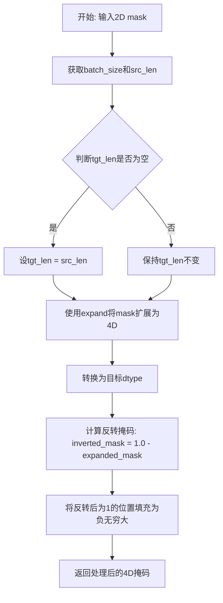

#### 带注释源码

```python
def _expand_mask(self, mask, dtype, tgt_len=None):
    """
    将注意力掩码从 `[bsz, seq_len]` 扩展到 `[bsz, 1, tgt_seq_len, src_seq_len]`。
    
    参数:
        mask: 输入的2D注意力掩码张量，形状为 [batch_size, src_seq_len]
        dtype: 目标数据类型，用于类型转换
        tgt_len: 目标序列长度，如果为None则使用src_len
    
    返回:
        扩展并反演后的4D注意力掩码，形状为 [batch_size, 1, tgt_seq_len, src_seq_len]
    """
    # 获取输入mask的batch size和源序列长度
    bsz, src_len = mask.shape
    
    # 如果未指定目标长度，则使用源序列长度
    # 这确保了tgt_len至少等于src_len
    tgt_len = tgt_len if tgt_len is not None else src_len
    
    # 步骤1: 扩展维度
    # 从 [bsz, src_len] -> [bsz, 1, 1, src_len] -> [bsz, 1, tgt_len, src_len]
    # expand方法不会复制数据，只改变视图大小
    expanded_mask = (
        mask[:, None, None, :].expand([bsz, 1, tgt_len, src_len]).to(dtype)
    )

    # 步骤2: 反转掩码
    # 将0变为1，1变为0
    # 原始mask中: 1=有效位置, 0=无效位置( padding )
    # 反转后: 0=有效位置, 1=无效位置
    inverted_mask = 1.0 - expanded_mask

    # 步骤3: 填充负无穷大
    # 将反转后为1的位置（即无效位置）填充为负无穷大
    # 这样在softmax注意力计算时，这些位置的注意力权重会趋近于0
    # masked_fill_ 是一个in-place操作，会直接修改inverted_mask
    return inverted_mask.masked_fill_(
        inverted_mask.to(torch.bool), torch.finfo(dtype).min
    )
```


### `AttentionMaskConverter._expand_mask_export`

该方法是 `AttentionMaskConverter` 类的实例方法，用于将2D注意力掩码（形状为 `[batch_size, seq_len]`）扩展为4D注意力掩码（形状为 `[batch_size, 1, tgt_seq_len, src_seq_len]`），并在需要屏蔽的位置填充极小的负值（负无穷）。该方法主要在模型导出（export）场景下使用，用于生成适配Transformer架构的4D注意力掩码。

参数：

- `mask`：`torch.Tensor`，输入的2D注意力掩码，形状为 `[bsz, seq_len]`，其中1表示可attend，0表示需要屏蔽
- `dtype`：`torch.dtype`，目标数据类型，用于将掩码转换为指定的数值类型
- `tgt_len`：`Optional[int]`，目标序列长度，默认为 None（等同于 src_len），指定扩展后的时间步数

返回值：`torch.Tensor`，扩展并处理后的4D注意力掩码，形状为 `[bsz, 1, tgt_len, src_len]`，其中被屏蔽位置（原值为0）的值为对应 dtype 的最小值（负无穷），未被屏蔽位置的值为1.0

#### 流程图

```mermaid
flowchart TD
    A[开始: _expand_mask_export] --> B[获取输入mask的形状<br/>bsz, src_len = mask.shape]
    C{检查 tgt_len<br/>是否为 None} -->|是| D[tgt_len = src_len]
    C -->|否| E[使用传入的 tgt_len]
    D --> F[扩展mask维度<br/>mask[:, None, None, :].expand]
    E --> F
    F --> G[转换为目标dtype<br/>.to(dtype)]
    G --> H[计算反转掩码<br/>inverted_mask = 1.0 - expanded_mask]
    H --> I[填充负无穷<br/>masked_fill_反向mask为True的位置]
    I --> J[返回处理后的4D掩码]
```

#### 带注释源码

```python
def _expand_mask_export(self, mask, dtype, tgt_len=None):
    """
    Expands attention_mask from `[bsz, seq_len]` to `[bsz, 1, tgt_seq_len, src_seq_len]`.
    """
    # 从输入的2D mask中获取batch大小和源序列长度
    bsz, src_len = mask.shape
    
    # 扩展mask维度：从 [bsz, seq_len] -> [bsz, 1, 1, seq_len] -> [bsz, 1, tgt_len, src_len]
    # expand 操作不会复制数据，只会改变视图的形状
    expanded_mask = (
        mask[:, None, None, :].expand([bsz, 1, tgt_len, src_len]).to(dtype)
    )
    
    # 反转掩码：将1.0转换为0.0，将0.0转换为1.0
    # 1.0 - expanded_mask: 原mask中1(可attend)变为0，原mask中0(屏蔽)变为1
    inverted_mask = 1.0 - expanded_mask
    
    # 使用 masked_fill 将值为1的位置（即原mask中为0的被屏蔽位置）填充为负无穷
    # 这样在后续的注意力计算中，这些位置的影响可以忽略不计
    return inverted_mask.masked_fill_(
        inverted_mask.to(torch.bool), torch.finfo(dtype).min
    )
```


### `CustomMBartDecoder.__init__`

该方法是 `CustomMBartDecoder` 类的构造函数，用于初始化自定义的 MBart 解码器。它继承自 `MBartDecoder`，并在此基础上添加了导出模式配置和 decoder 配置的定制功能。

参数：

-  `config`：对象，MBart 模型配置对象，包含模型的各种参数配置，如 `d_model`、`is_export` 等

返回值：`None`，无返回值，用于对象初始化

#### 流程图

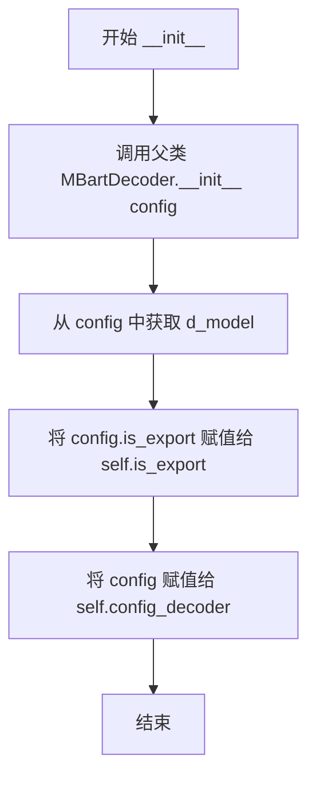

#### 带注释源码

```python
def __init__(self, config):
    """
    CustomMBartDecoder 的初始化方法。
    
    该方法继承自 MBartDecoder，并添加了用于导出和配置的属性。
    
    参数:
        config: MBartConfig 对象，包含模型的配置信息
               - d_model: 隐藏层维度
               - is_export: 是否处于导出模式
               - 其他标准 MBart 配置参数
    """
    # 调用父类 MBartDecoder 的初始化方法，完成基础层的构建
    # 包括 embedding 层、位置编码、解码器层、LayerNorm 等
    super().__init__(config)
    
    # 获取配置中的隐藏层大小（d_model）
    # 这是模型的核心维度，决定了特征向量的宽度
    hidden_size = config.d_model
    
    # 从配置中提取导出标志
    # 用于控制模型在推理/导出时的特殊行为
    # 当 training 为 False 时，is_export 被设为 True
    self.is_export = config.is_export
    
    # 保存完整的解码器配置对象
    # 供后续 forward 方法中使用，以获取并行配置等参数
    self.config_decoder = config
```


### CustomMBartDecoder.forward

这是CustomMBartDecoder类的核心前向传播方法，继承自MBartDecoder，负责执行自定义MBART解码器的推理过程。该方法处理输入的token ID或embedding，通过多层Transformer解码器层进行自回归解码，支持因果注意力掩码、交叉注意力、KV缓存等功能，并返回解码后的隐藏状态、注意力权重和缓存的键值对。

参数：

- `input_ids`：`Optional[torch.Tensor]`，输入的token ID序列，形状为(batch_size, seq_len)
- `attention_mask`：`Optional[torch.Tensor]`，注意力掩码，用于控制哪些位置参与注意力计算
- `encoder_hidden_states`：`Optional[torch.Tensor]`，编码器的输出隐藏状态，用于交叉注意力
- `encoder_attention_mask`：`Optional[torch.Tensor]`，编码器注意力掩码
- `head_mask`：`Optional[torch.Tensor]`，多头注意力中各头的掩码
- `cross_attn_head_mask`：`Optional[torch.Tensor]`，交叉注意力各头的掩码
- `past_key_values`：`Optional[Tuple[Tuple[torch.Tensor]]]`，用于缓存的过去键值对，支持增量推理
- `inputs_embeds`：`Optional[torch.Tensor]`，输入的embedding表示，可以直接传入而不使用input_ids
- `use_cache`：`Optional[bool]`，是否返回缓存的键值对用于加速推理
- `output_attentions`：`Optional[bool]`，是否输出所有层的注意力权重
- `output_hidden_states`：`Optional[bool]`，是否输出所有层的隐藏状态
- `return_dict`：`Optional[bool]`，是否返回字典格式的输出

返回值：`BaseModelOutputWithPastAndCrossAttentions`，包含last_hidden_state（最后隐藏状态）、past_key_values（缓存的键值对）、hidden_states（所有层的隐藏状态）、attentions（自注意力权重）、cross_attentions（交叉注意力权重）

#### 流程图

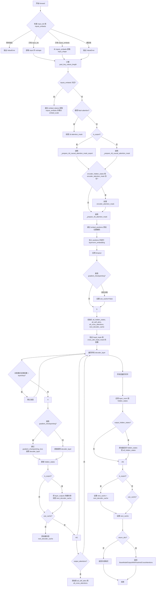

#### 带注释源码

```python
def forward(
        self,
        input_ids=None,
        attention_mask=None,
        encoder_hidden_states=None,
        encoder_attention_mask=None,
        head_mask=None,
        cross_attn_head_mask=None,
        past_key_values=None,
        inputs_embeds=None,
        use_cache=None,
        output_attentions=None,
        output_hidden_states=None,
        return_dict=None,
):
    """
    CustomMBartDecoder 的前向传播方法
    
    参数:
        input_ids: 输入的token ID，形状为 (batch_size, seq_len)
        attention_mask: 注意力掩码
        encoder_hidden_states: 编码器输出的隐藏状态
        encoder_attention_mask: 编码器注意力掩码
        head_mask: 多头注意力掩码
        cross_attn_head_mask: 交叉注意力掩码
        past_key_values: 缓存的键值对
        inputs_embeds: 输入的embedding
        use_cache: 是否使用缓存
        output_attentions: 是否输出注意力权重
        output_hidden_states: 是否输出隐藏状态
        return_dict: 是否返回字典格式
    
    返回:
        BaseModelOutputWithPastAndCrossAttentions 对象
    """
    
    # 根据训练状态设置导出标志，推理时为 True
    self.is_export = False if self.training else True

    # 获取输出配置参数，如果未指定则使用配置文件中的默认值
    output_attentions = (
        output_attentions
        if output_attentions is not None
        else self.config.output_attentions
    )
    output_hidden_states = (
        output_hidden_states
        if output_hidden_states is not None
        else self.config.output_hidden_states
    )
    use_cache = use_cache if use_cache is not None else self.config.use_cache
    return_dict = (
        return_dict if return_dict is not None else self.config.use_return_dict
    )

    # 检索 input_ids 和 inputs_embeds
    # 验证输入：不能同时指定两者
    if input_ids is not None and inputs_embeds is not None:
        raise ValueError(
            "You cannot specify both decoder_input_ids and decoder_inputs_embeds at the same time"
        )
    # 处理只有 input_ids 的情况
    elif input_ids is not None:
        input = input_ids
        input_shape = input.shape
        # 将 input_ids reshape 为 2D: (batch_size * seq_len, seq_len)
        input_ids = input_ids.reshape([-1, input_shape[-1]])
    # 处理只有 inputs_embeds 的情况
    elif inputs_embeds is not None:
        input_shape = inputs_embeds.shape[:-1]
        # 获取最后一个位置的输入用于位置编码
        input = inputs_embeds[:, :, -1]
    else:
        raise ValueError(
            "You have to specify either decoder_input_ids or decoder_inputs_embeds"
        )

    # 计算过去键值对的长度，用于位置编码
    past_key_values_length = (
        past_key_values[0][0].shape[2] if past_key_values is not None else 0
    )

    # 如果没有提供 inputs_embeds，则通过 embedding 层获取
    if inputs_embeds is None:
        # 将 token ID 转换为 embedding 并乘以缩放因子
        inputs_embeds = self.embed_tokens(input_ids) * self.embed_scale

    # 根据是否使用 flash attention 2 来处理 attention_mask
    if self._use_flash_attention_2:
        # 2d mask is passed through the layers
        # 如果 attention_mask 包含 0（有效token），则保留；否则设为 None
        attention_mask = (
            attention_mask
            if (attention_mask is not None and 0 in attention_mask)
            else None
        )
    else:
        # 4d mask is passed through the layers
        # 根据导出模式选择不同的掩码准备函数
        if self.is_export:
            # 导出模式：使用导出专用的掩码准备函数
            attention_mask = _prepare_4d_causal_attention_mask_export(
                attention_mask,
                input_shape,
                inputs_embeds,
                past_key_values_length,
                use_parallel=self.config_decoder.use_parallel,
                parallel_step=self.config_decoder.parallel_step,
                is_export=self.is_export,
            )
        else:
            # 正常模式：使用标准因果掩码准备函数
            attention_mask = _prepare_4d_causal_attention_mask(
                attention_mask,
                input_shape,
                inputs_embeds,
                past_key_values_length,
                use_parallel=self.config_decoder.use_parallel,
                parallel_step=self.config_decoder.parallel_step,
                is_export=self.is_export,
            )

    # 展开编码器注意力掩码
    if encoder_hidden_states is not None and encoder_attention_mask is not None:
        if self._use_flash_attention_2:
            encoder_attention_mask = (
                encoder_attention_mask if 0 in encoder_attention_mask else None
            )
        else:
            # [bsz, seq_len] -> [bsz, 1, tgt_seq_len, src_seq_len]
            encoder_attention_mask = _prepare_4d_attention_mask(
                encoder_attention_mask, inputs_embeds.dtype, tgt_len=input_shape[-1]
            )

    # 嵌入位置信息
    positions = self.embed_positions(input, past_key_values_length)

    # 将输入 embedding 与位置 embedding 相加
    hidden_states = inputs_embeds + positions

    # 应用 LayerNorm
    hidden_states = self.layernorm_embedding(hidden_states)
    # 应用 dropout（仅在训练时）
    hidden_states = nn.functional.dropout(
        hidden_states, p=self.dropout, training=self.training
    )
    
    # 梯度检查点与 use_cache 不兼容
    if self.gradient_checkpointing and self.training:
        if use_cache:
            print(
                "`use_cache=True` is incompatible with gradient checkpointing`. Setting `use_cache=False`..."
            )
            use_cache = False

    # 初始化输出变量
    all_hidden_states = () if output_hidden_states else None
    all_self_attns = () if output_attentions else None
    all_cross_attentions = (
        () if (output_attentions and encoder_hidden_states is not None) else None
    )
    next_decoder_cache = () if use_cache else None

    # 验证 head_mask/cross_attn_head_mask 的层数是否正确
    for attn_mask, mask_name in zip(
            [head_mask, cross_attn_head_mask], ["head_mask", "cross_attn_head_mask"]
    ):
        if attn_mask is not None:
            if attn_mask.size()[0] != len(self.layers):
                raise ValueError(
                    f"The `{mask_name}` should be specified for {len(self.layers)} layers, but it is for"
                    f" {attn_mask.size()[0]}."
                )
    
    # 遍历所有解码器层
    for idx, decoder_layer in enumerate(self.layers):
        # 如果需要输出隐藏状态，保存当前层的隐藏状态
        if output_hidden_states:
            all_hidden_states += (hidden_states,)
        
        # 训练时的 LayerDrop 机制
        if self.training:
            dropout_probability = torch.rand([])
            if dropout_probability < self.layerdrop:
                continue

        # 获取当前层的 past_key_value
        past_key_value = (
            past_key_values[idx] if past_key_values is not None else None
        )
        
        # 根据是否使用梯度检查点选择调用方式
        if self.gradient_checkpointing and self.training:
            # 使用梯度检查点节省显存
            layer_outputs = self._gradient_checkpointing_func(
                decoder_layer.__call__,
                hidden_states,
                attention_mask,
                encoder_hidden_states,
                encoder_attention_mask,
                head_mask[idx] if head_mask is not None else None,
                (
                    cross_attn_head_mask[idx]
                    if cross_attn_head_mask is not None
                    else None
                ),
                None,
                output_attentions,
                use_cache,
            )
        else:
            # 直接调用解码器层
            layer_outputs = decoder_layer(
                hidden_states,
                attention_mask=attention_mask,
                encoder_hidden_states=encoder_hidden_states,
                encoder_attention_mask=encoder_attention_mask,
                layer_head_mask=(head_mask[idx] if head_mask is not None else None),
                cross_attn_layer_head_mask=(
                    cross_attn_head_mask[idx]
                    if cross_attn_head_mask is not None
                    else None
                ),
                past_key_value=past_key_value,
                output_attentions=output_attentions,
                use_cache=use_cache,
            )
        
        # 更新隐藏状态
        hidden_states = layer_outputs[0]

        # 根据模式（导出/推理）处理缓存
        if self.is_export:
            # 导出模式：总是保存缓存
            next_decoder_cache += (layer_outputs[3 if output_attentions else 1],)
        else:
            # 推理模式：根据 use_cache 决定是否保存
            if use_cache:
                next_decoder_cache += (
                    layer_outputs[3 if output_attentions else 1],
                )

        # 收集注意力权重
        if output_attentions:
            all_self_attns += (layer_outputs[1],)

            if encoder_hidden_states is not None:
                all_cross_attentions += (layer_outputs[2],)

    # 最终的 LayerNorm
    hidden_states = self.layer_norm(hidden_states)

    # 添加最后一层的隐藏状态到输出
    if output_hidden_states:
        all_hidden_states += (hidden_states,)

    # 处理缓存输出
    if self.is_export:
        next_cache = next_decoder_cache
    else:
        next_cache = next_decoder_cache if use_cache else None
    
    # 根据 return_dict 返回格式
    if not return_dict:
        return tuple(
            v
            for v in [
                hidden_states,
                next_cache,
                all_hidden_states,
                all_self_attns,
                all_cross_attentions,
            ]
            if v is not None
        )

    # 返回结构化输出对象
    return BaseModelOutputWithPastAndCrossAttentions(
        last_hidden_state=hidden_states,
        past_key_values=next_cache,
        hidden_states=all_hidden_states,
        attentions=all_self_attns,
        cross_attentions=all_cross_attentions,
    )
```


### `CustomMBartForCausalLM.__init__`

这是一个初始化方法，用于初始化 CustomMBartForCausalLM 类实例。它首先调用父类 MBartForCausalLM 的初始化方法，然后使用自定义的 CustomMBartDecoder 替换模型中的默认解码器，以实现特定的解码器行为。

参数：

- `config`：任意类型（`Any`），模型配置对象，包含模型的各种超参数和设置

返回值：`None`，无返回值（构造函数）

#### 流程图

```mermaid
flowchart TD
    A[开始 __init__] --> B[接收 config 参数]
    B --> C[调用 super().__init__(config)]
    C --> D[将 self.model.decoder 替换为 CustomMBartDecoder(config)]
    D --> E[结束 __init__]
```

#### 带注释源码

```python
def __init__(self, config):
    """
    初始化 CustomMBartForCausalLM 实例。
    
    Args:
        config: 模型配置对象，包含模型的各种超参数和设置
    """
    # 调用父类 MBartForCausalLM 的初始化方法
    # 继承父类的所有属性和功能
    super().__init__(config)
    
    # 修改解码器：使用 CustomMBartDecoder 替换默认的解码器
    # CustomMBartDecoder 提供了自定义的解码器行为（例如支持导出模式、并行处理等）
    self.model.decoder = CustomMBartDecoder(config)
```


### CustomMBartForCausalLM.forward

该方法是 CustomMBartForCausalLM 类的前向传播函数，负责执行自定义 MBART 因果语言模型的推理过程。它接收输入序列，通过内部的 CustomMBartDecoder 解码器处理输入，然后使用 lm_head 将解码器的输出转换为最终的 logits，完成从输入到语言模型预测的完整前向计算流程。

参数：

- `input_ids`：`torch.Tensor`，decoder 输入的 token ID 序列
- `attention_mask`：`torch.Tensor`，用于指示哪些位置是 padding 的注意力掩码
- `encoder_hidden_states`：`torch.Tensor`，来自编码器的隐藏状态序列（用于 cross-attention）
- `encoder_attention_mask`：`torch.Tensor`，编码器输出的注意力掩码
- `head_mask`：`List[torch.Tensor]`，多头自注意力中各层的掩码列表
- `cross_attn_head_mask`：`List[torch.Tensor]`，cross-attention 各层的掩码列表
- `past_key_values`：`tuple`，用于缓存的过去键值对，支持增量解码
- `inputs_embeds`：`torch.Tensor`，直接提供的输入嵌入表示
- `labels`：`torch.Tensor`，用于计算语言模型损失的标签
- `use_cache`：`bool`，是否使用键值缓存加速推理
- `output_attentions`：`bool`，是否返回所有层的注意力权重
- `output_hidden_states`：`bool`，是否返回所有层的隐藏状态
- `return_dict`：`bool`，是否以字典形式返回结果

返回值：`CausalLMOutputWithCrossAttentions`，包含模型预测的 logits、缓存的 past_key_values、隐藏状态、注意力权重和交叉注意力权重

#### 流程图

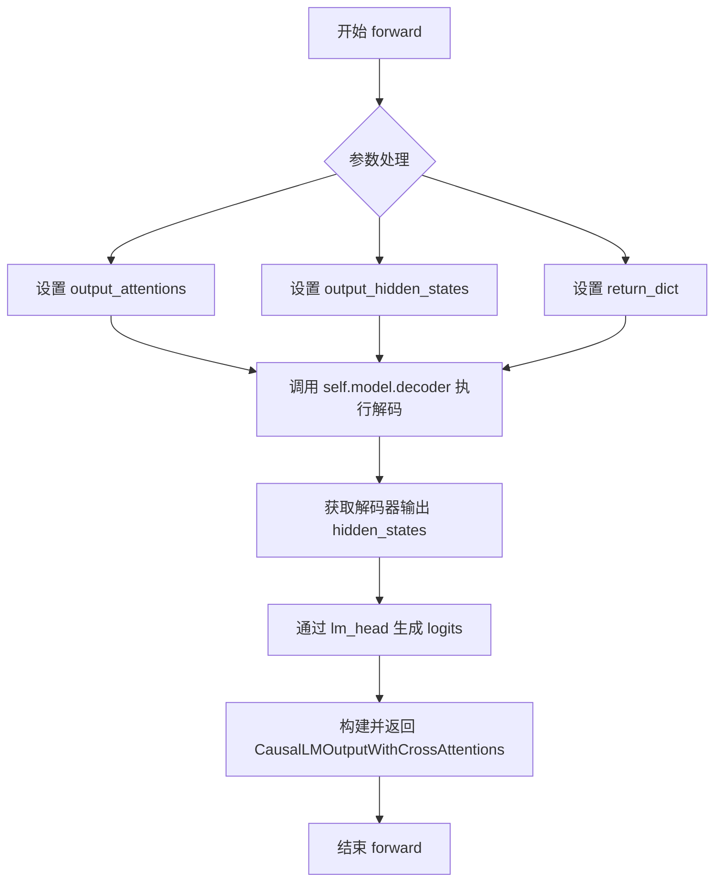

#### 带注释源码

```python
def forward(
        self,
        input_ids=None,
        attention_mask=None,
        encoder_hidden_states=None,
        encoder_attention_mask=None,
        head_mask=None,
        cross_attn_head_mask=None,
        past_key_values=None,
        inputs_embeds=None,
        labels=None,
        use_cache=None,
        output_attentions=None,
        output_hidden_states=None,
        return_dict=None,
):
    # 处理 output_attentions 参数，如果未提供则使用配置中的默认值
    output_attentions = (
        output_attentions
        if output_attentions is not None
        else self.config.output_attentions
    )
    # 处理 output_hidden_states 参数，如果未提供则使用配置中的默认值
    output_hidden_states = (
        output_hidden_states
        if output_hidden_states is not None
        else self.config.output_hidden_states
    )
    # 处理 return_dict 参数，如果未提供则使用配置中的默认值
    return_dict = (
        return_dict if return_dict is not None else self.config.use_return_dict
    )

    # 调用内部解码器执行前向传播，获取解码器输出
    # decoder 输出包含: (dec_features, layer_state, dec_hidden, dec_attn)
    outputs = self.model.decoder(
        input_ids=input_ids,
        attention_mask=attention_mask,
        encoder_hidden_states=encoder_hidden_states,
        encoder_attention_mask=encoder_attention_mask,
        head_mask=head_mask,
        cross_attn_head_mask=cross_attn_head_mask,
        past_key_values=past_key_values,
        inputs_embeds=inputs_embeds,
        use_cache=use_cache,
        output_attentions=output_attentions,
        output_hidden_states=output_hidden_states,
        return_dict=return_dict,
    )
    
    # 使用语言模型头部将解码器输出的隐藏状态转换为 logits
    # outputs[0] 是解码器最后一层的 hidden_state
    logits = self.lm_head(outputs[0])

    # 返回因果语言模型输出，包含 logits 和各种注意力相关状态
    return CausalLMOutputWithCrossAttentions(
        logits=logits,
        past_key_values=outputs.past_key_values,
        hidden_states=outputs.hidden_states,
        attentions=outputs.attentions,
        cross_attentions=outputs.cross_attentions,
    )
```


### `PPFormulaNet_Head.__init__`

这是 `PPFormulaNet_Head` 类的构造函数，用于初始化一个基于 MBart 的公式网络解码头。该方法配置了完整的 MBart 解码器、生成参数、投影层以及 logits 处理器，为后续的序列生成任务做好准备。

参数：

- `max_new_tokens`：`int`，最大新 token 数量，默认 1536
- `decoder_start_token_id`：`int`，解码器起始 token ID，默认 0
- `temperature`：`float`，温度参数，用于控制采样随机性，默认 0.2
- `do_sample`：`bool`，是否使用采样进行生成，默认 False
- `top_p`：`float`，核采样参数，默认 0.95
- `in_channels`：`int`，输入通道数，默认 1024
- `decoder_layers`：`int`，解码器层数，默认 8
- `encoder_hidden_size`：`int`，编码器隐藏层大小，默认 1024
- `decoder_ffn_dim`：`int`，解码器前馈网络维度，默认 4096
- `decoder_hidden_size`：`int`，解码器隐藏层大小，默认 1024
- `is_export`：`bool`，是否处于导出模式，默认 False
- `length_aware`：`bool`，是否感知输入序列长度，默认 True
- `use_parallel`：`bool`，是否启用并行处理，默认 False
- `parallel_step`：`int`，并行处理的步数，默认 3

返回值：`None`，该方法为构造函数，不返回任何值

#### 流程图

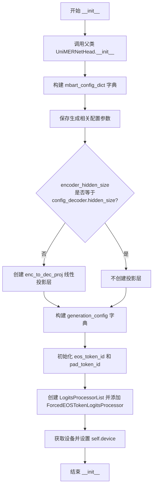

#### 带注释源码

```
def __init__(
        self,
        max_new_tokens=1536,           # 最大新token数量
        decoder_start_token_id=0,      # 解码器起始token ID
        temperature=0.2,               # 温度参数，控制生成随机性
        do_sample=False,               # 是否使用采样
        top_p=0.95,                    # 核采样参数
        in_channels=1024,              # 输入通道数
        decoder_layers=8,              # 解码器层数
        encoder_hidden_size=1024,      # 编码器隐藏层大小
        decoder_ffn_dim=4096,          # 解码器前馈网络维度
        decoder_hidden_size=1024,      # 解码器隐藏层大小
        is_export=False,               # 是否导出模式
        length_aware=True,              # 是否感知长度
        use_parallel=False,             # 是否使用并行
        parallel_step=3,               # 并行步数
):
    # 调用父类构造函数进行初始化
    super().__init__()

    # 构建 MBart 配置字典，包含模型架构和训练参数
    mbart_config_dict = {
        "activation_dropout": 0.0,
        "activation_function": "gelu",
        "add_cross_attention": True,
        "add_final_layer_norm": True,
        "attention_dropout": 0.0,
        "bos_token_id": 0,
        "classifier_dropout": 0.0,
        "d_model": decoder_hidden_size,          # 模型维度
        "decoder_attention_heads": 16,           # 解码器注意力头数
        "decoder_ffn_dim": decoder_ffn_dim,     # 解码器FFN维度
        "decoder_layerdrop": 0.0,
        "decoder_layers": decoder_layers,        # 解码器层数
        "dropout": 0.1,
        "encoder_attention_heads": 16,
        "encoder_ffn_dim": 4096,
        "encoder_layerdrop": 0.0,
        "encoder_layers": 12,
        "eos_token_id": 2,
        "forced_eos_token_id": 2,
        "init_std": 0.02,
        "is_decoder": True,
        "is_encoder_decoder": False,
        "output_hidden_states": False,
        # 根据是否使用并行设置最大位置嵌入
        "max_position_embeddings": (
            max_new_tokens + parallel_step if use_parallel else max_new_tokens
        ),
        "model_type": "mbart",
        "num_hidden_layers": 12,
        "pad_token_id": 1,
        "scale_embedding": True,
        "tie_word_embeddings": False,
        "transformers_version": "4.40.0",
        "use_cache": True,
        "use_return_dict": True,
        "vocab_size": 50000,
        "_attn_implementation": "eager",
        "hidden_size": decoder_hidden_size,
        "use_parallel": use_parallel,
        "parallel_step": int(parallel_step),
        "is_export": is_export,
    }
    
    # 保存生成相关配置
    self.decoder_start_token_id = decoder_start_token_id
    self.temperature = temperature
    self.do_sample = do_sample
    self.top_p = top_p
    self.is_export = is_export
    self.max_seq_len = max_new_tokens
    
    # 创建 MBartConfig 配置对象
    self.config_decoder = MBartConfig(**mbart_config_dict)
    self.encoder_hidden_size = encoder_hidden_size
    
    # 创建自定义的 MBart 因果语言模型解码器
    self.decoder = CustomMBartForCausalLM(self.config_decoder)
    
    # 如果编码器隐藏层大小与解码器不匹配，创建投影层
    if self.config_decoder.hidden_size != self.encoder_hidden_size:
        self.enc_to_dec_proj = nn.Linear(
            self.encoder_hidden_size, self.config_decoder.hidden_size
        )
    
    # 生成配置
    generation_config = {
        "max_length": 1537,
        "forced_eos_token_id": 2,
    }
    
    # 保存 EOS 和 PAD token ID
    self.eos_token_id = generation_config["forced_eos_token_id"]
    self.pad_token_id = self.config_decoder.pad_token_id
    
    # 创建 logits 处理器列表
    self.logits_processor = LogitsProcessorList()
    # 添加强制 EOS token 处理器
    self.logits_processor.append(
        ForcedEOSTokenLogitsProcessor(
            generation_config["max_length"],
            generation_config["forced_eos_token_id"],
        )
    )
    
    # 获取设备信息
    self.device = torch.device(get_device())
```


### `PPFormulaNet_Head.prepare_inputs_for_generation`

该方法用于在序列生成过程中准备解码器的输入数据，将原始输入转换为适合 MBART 解码器的格式，包括处理注意力掩码、过去键值状态和缓存机制。

参数：

- `self`：类的实例本身，包含模型配置和状态。
- `input_ids`：`torch.Tensor` 或 `int`，当前生成步骤的输入 token ID 序列。
- `past_key_values`：`Optional[Tuple[Tuple[torch.Tensor]]]`，可选参数，用于缓存的过去键值对，用于加速自回归生成。
- `attention_mask`：`Optional[torch.Tensor]`，可选参数，编码器的注意力掩码，用于指示哪些位置是有效 token。
- `use_cache`：`Optional[bool]`，可选参数，是否使用缓存加速生成。
- `encoder_outputs`：`Optional[Any]`，可选参数，编码器的输出结果。
- `**kwargs`：可变关键字参数，用于传递额外的参数。

返回值：`Dict[str, Any]`，返回一个包含以下键的字典：
- `attention_mask`：编码器的注意力掩码
- `decoder_attention_mask`：解码器的注意力掩码
- `decoder_input_ids`：解码器的输入 ID
- `past_key_values`：过去键值对
- `use_cache`：是否使用缓存

#### 流程图

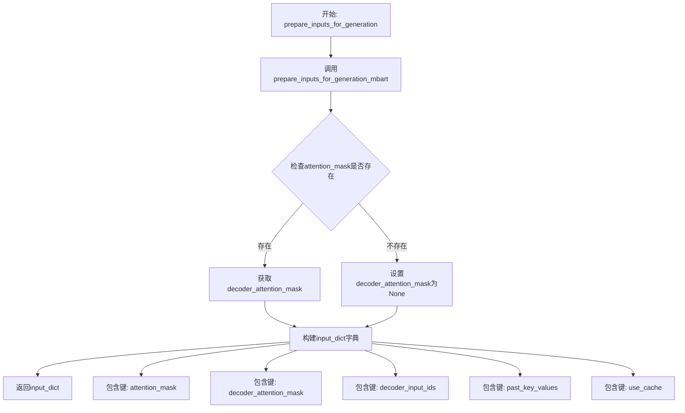

#### 带注释源码

```python
def prepare_inputs_for_generation(
        self,
        input_ids,
        past_key_values=None,
        attention_mask=None,
        use_cache=None,
        encoder_outputs=None,
        **kwargs,
):
    """
    准备解码器输入用于生成过程。
    
    该方法将原始输入转换为适合 MBART 解码器的格式，处理注意力掩码和缓存状态。
    
    参数:
        input_ids: 当前生成步骤的输入 token ID
        past_key_values: 过去键值对缓存
        attention_mask: 编码器注意力掩码
        use_cache: 是否使用缓存
        encoder_outputs: 编码器输出
        **kwargs: 额外参数
        
    返回:
        包含解码器所需输入的字典
    """
    # 调用 MBART 特定的输入准备方法，处理 input_ids 和 past_key_values
    decoder_inputs = self.prepare_inputs_for_generation_mbart(
        input_ids, past_key_values=past_key_values
    )
    
    # 从解码器输入中提取注意力掩码，如果不存在则设为 None
    decoder_attention_mask = (
        decoder_inputs["attention_mask"]
        if "attention_mask" in decoder_inputs
        else None
    )
    
    # 构建最终输入字典，包含编码器和解码器所需的全部输入
    input_dict = {
        "attention_mask": attention_mask,  # 编码器注意力掩码
        "decoder_attention_mask": decoder_attention_mask,  # 解码器注意力掩码
        "decoder_input_ids": decoder_inputs["input_ids"],  # 解码器输入 ID
        "past_key_values": decoder_inputs["past_key_values"],  # 过去键值对
        "use_cache": use_cache,  # 缓存使用标志
    }
    
    # 返回准备好的输入字典，供后续生成步骤使用
    return input_dict
```


### `PPFormulaNet_Head._extract_past_from_model_output`

该方法负责从模型输出中提取过去键值（past_key_values）缓存，支持多种缓存格式（past_key_values、mems、past_buckets_states），用于自回归生成过程中的缓存更新。

参数：

- `self`：类的实例本身，PPFormulaNet_Head 的实例方法隐式接收的参数。
- `outputs`：`ModelOutput`，模型输出对象，可能包含 past_key_values、mems 或 past_buckets_states 等缓存字段。
- `standardize_cache_format`：`bool`，是否标准化缓存格式（当前实现中未使用该参数，保留用于接口兼容性）。

返回值：`Optional[Tuple]`，返回提取到的过去键值缓存，如果不存在任何缓存格式则返回 None。

#### 流程图

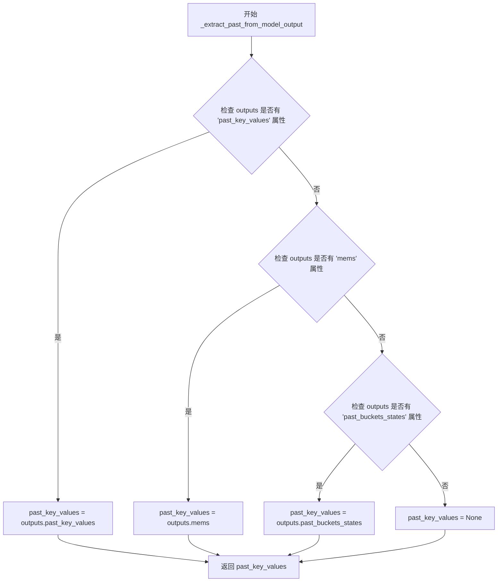

#### 带注释源码

```python
def _extract_past_from_model_output(
        self, outputs: ModelOutput, standardize_cache_format: bool = False
):
    """
    从模型输出中提取过去键值缓存。

    该方法支持多种缓存格式，以兼容不同的模型实现：
    1. past_key_values: 标准的 Transformer 缓存格式
    2. mems: 某些模型使用的内存缓存格式
    3. past_buckets_states: 使用 Bucket 注意力机制的缓存格式

    Args:
        outputs: 模型输出对象，通常包含各类缓存信息
        standardize_cache_format: 布尔标志，用于未来可能的缓存标准化功能，当前未实现

    Returns:
        提取的缓存数据，如果不存在则返回 None
    """
    # 初始化缓存变量为 None
    past_key_values = None
    
    # 尝试从 outputs 中提取 past_key_values（标准格式）
    if "past_key_values" in outputs:
        past_key_values = outputs.past_key_values
    # 备选方案：检查是否使用 mems 格式（如某些 RNN 模型）
    elif "mems" in outputs:
        past_key_values = outputs.mems
    # 备选方案：检查是否使用 past_buckets_states 格式（如 Hash 注意力机制）
    elif "past_buckets_states" in outputs:
        past_key_values = outputs.past_buckets_states
    
    # 返回提取到的缓存，如果都未找到则返回 None
    return past_key_values
```


### `PPFormulaNet_Head._update_model_kwargs_for_generation`

该方法用于在自回归生成过程中更新模型的关键状态信息，包括past_key_values、attention mask、token_type_ids和cache_position等，以确保模型能够正确处理新生成的token并维护生成循环的连续性。

参数：

-  `self`：类的实例本身，包含模型配置和状态信息。
-  `outputs`：`ModelOutput` 类型，模型的前向传播输出，包含past_key_values、logits等关键信息。
-  `model_kwargs`：`Dict[str, Any]` 类型，模型参数字典，包含attention_mask、decoder_attention_mask、token_type_ids、cache_position等需要更新的状态。
-  `is_encoder_decoder`：`bool` 类型，标志位，指示是否为encoder-decoder架构，用于决定更新attention mask还是decoder_attention_mask。
-  `standardize_cache_format`：`bool` 类型，标志位，指示是否标准化缓存格式，传递给`_extract_past_from_model_output`方法。

返回值：`Dict[str, Any]`，更新后的模型参数字典。

#### 流程图

```mermaid
flowchart TD
    A[开始: _update_model_kwargs_for_generation] --> B[从outputs中提取past_key_values]
    B --> C{past_key_values是否提取成功?}
    C -->|是| D[更新model_kwargs['past_key_values']]
    C -->|否| E{outputs.state是否存在?}
    D --> E
    E -->|是| F[更新model_kwargs['state']]
    E -->|否| G{token_type_ids在model_kwargs中?}
    F --> G
    G -->|是| H[更新token_type_ids: 在末尾追加最后一个token的类型]
    G -->|否| I{is_encoder_decoder?}
    H --> I
    I -->|否| J{attention_mask在model_kwargs中?}
    I -->|是| K{decoder_attention_mask在model_kwargs中?}
    J -->|是| L[更新attention_mask: 在末尾追加一个全1向量]
    J -->|否| M{cache_position在model_kwargs且非空?}
    K -->|是| N[更新decoder_attention_mask: 在末尾追加一个全1向量]
    K -->|否| M
    L --> M
    N --> M
    M -->|是| O[更新cache_position: 当前位置+1]
    M -->|否| P[返回更新后的model_kwargs]
    O --> P
```

#### 带注释源码

```python
def _update_model_kwargs_for_generation(
        self,
        outputs: ModelOutput,
        model_kwargs: Dict[str, Any],
        is_encoder_decoder: bool = False,
        standardize_cache_format: bool = False,
) -> Dict[str, Any]:
    """
    更新模型参数字典，用于自回归生成过程中的下一轮迭代。
    
    Args:
        outputs: 模型的前向传播输出，包含past_key_values等缓存信息
        model_kwargs: 模型参数字典，包含需要更新的状态信息
        is_encoder_decoder: 是否为encoder-decoder架构
        standardize_cache_format: 是否标准化缓存格式
    
    Returns:
        更新后的模型参数字典
    """
    # ===== 1. 更新past_key_values =====
    # 从模型输出中提取过去键值对，这是自回归生成的关键缓存
    model_kwargs["past_key_values"] = self._extract_past_from_model_output(
        outputs, standardize_cache_format=standardize_cache_format
    )
    
    # ===== 2. 更新state（如果存在）=====
    #某些模型（如状态空间模型）可能包含额外的状态信息
    if getattr(outputs, "state", None) is not None:
        model_kwargs["state"] = outputs.state

    # ===== 3. 更新token_type_ids =====
    # 在序列生成时，需要为新生成的token指定token类型
    # 这里通过复制最后一个token的type来扩展token_type_ids
    if "token_type_ids" in model_kwargs:
        token_type_ids = model_kwargs["token_type_ids"]
        model_kwargs["token_type_ids"] = torch.concat(
            [token_type_ids, token_type_ids[:, -1].unsqueeze(-1)], dim=-1
        )

    # ===== 4. 更新attention mask =====
    # 根据架构类型选择更新encoder还是decoder的attention mask
    if not is_encoder_decoder:
        # 对于纯decoder模型（如GPT类），更新encoder的attention mask
        # 新生成的token需要被关注，所以添加一个全1的mask值
        if "attention_mask" in model_kwargs:
            attention_mask = model_kwargs["attention_mask"]
            model_kwargs["attention_mask"] = torch.concat(
                [
                    attention_mask,
                    attention_mask.new_ones((attention_mask.shape[0], 1)),
                ],
                dim=-1,
            )
    else:
        # 对于encoder-decoder模型（如BART、T5），更新decoder的attention mask
        if "decoder_attention_mask" in model_kwargs:
            decoder_attention_mask = model_kwargs["decoder_attention_mask"]
            model_kwargs["decoder_attention_mask"] = torch.concat(
                [
                    decoder_attention_mask,
                    decoder_attention_mask.new_ones(
                        (decoder_attention_mask.shape[0], 1)
                    ),
                ],
                dim=-1,
            )

    # ===== 5. 更新cache_position =====
    # 记录当前缓存位置，用于指示当前生成到了序列的哪个位置
    if (
            "cache_position" in model_kwargs
            and model_kwargs["cache_position"] is not None
    ):
        model_kwargs["cache_position"] = model_kwargs["cache_position"][-1:] + 1
    
    # ===== 6. 返回更新后的参数字典 =====
    return model_kwargs
```


### `PPFormulaNet_Head.stopping_criteria`

该方法用于判断文本生成是否已经完成，通过检查当前生成的最后一个token是否为EOS（End of Sequence）结束符。在导出模式和非导出模式下使用不同的判断逻辑。

参数：

- `input_ids`：`torch.Tensor`，输入的token ID序列，形状为(batch_size, seq_len)

返回值：`torch.Tensor`，布尔类型张量，表示每个样本的最后一个token是否为EOS token（即生成是否完成）

#### 流程图

```mermaid
flowchart TD
    A[开始 stopping_criteria] --> B{self.is_export?}
    B -->|True| C[导出模式]
    B -->|False| D[非导出模式]
    C --> E[提取最后一个token: input_ids[:, -1]]
    E --> F[转移到CPU并与EOS token比较]
    F --> G[返回布尔比较结果]
    D --> H[提取最后一个token: input_ids[:, -1]]
    H --> I[转移到CPU]
    I --> J[使用torch.isin检查是否在EOS token列表中]
    J --> K[返回布尔张量]
    G --> L[返回结果]
    K --> L
```

#### 带注释源码

```
def stopping_criteria(self, input_ids):
    """
    判断文本生成是否完成的标准方法。
    
    Args:
        input_ids: 输入的token ID序列，形状为 (batch_size, seq_len)
        
    Returns:
        torch.Tensor: 布尔类型张量，表示每个样本是否已生成完成
    """
    # 判断是否处于导出模式
    if self.is_export:
        # 导出模式：直接比较最后一个token是否为EOS token
        # 将最后一个token转移到CPU并与EOS token ID进行比较
        return input_ids[:, -1].cpu() == torch.Tensor([self.eos_token_id])
    
    # 非导出模式：使用torch.isin检查最后一个token是否在EOS token列表中
    # 这种方式支持多个EOS token的情况
    is_done = torch.isin(input_ids[:, -1].cpu(), torch.Tensor([self.eos_token_id]))
    return is_done
```


### `PPFormulaNet_Head.stopping_criteria_parallel`

该方法用于在并行生成过程中检查是否满足停止条件，根据是否处于导出模式（is_export）采用不同的检测策略：在导出模式下逐个检查最后 parallel_step 个 token 是否为 EOS token；在非导出模式下使用 `torch.isin` 批量检查。

参数：

- `input_ids`：`torch.Tensor`，输入的 token ID 序列，用于判断是否达到序列结束标志（EOS）

返回值：`torch.Tensor`，布尔类型张量，表示每个位置是否达到终止条件

#### 流程图

```mermaid
flowchart TD
    A[开始 stopping_criteria_parallel] --> B[获取 parallel_step = self.config_decoder.parallel_step]
    B --> C{is_export?}
    C -->|True| D[导出模式处理]
    C -->|False| E[非导出模式处理]
    
    D --> F[遍历 i 从 parallel_step 到 1]
    F --> G[检查 input_ids[:, -i] == EOS]
    G --> H[将结果添加到 is_done_list]
    H --> I{是否遍历完所有 i?}
    I -->|否| F
    I -->|是| J[permute 并返回 is_done_list]
    
    E --> K[使用 torch.isin 检查最后 parallel_step 个 token]
    K --> L[返回 is_done 张量]
    
    J --> M[结束]
    L --> M
```

#### 带注释源码

```
def stopping_criteria_parallel(self, input_ids):
    """
    并行生成停止条件检查方法
    
    Args:
        input_ids: 输入的token ID序列，用于判断是否达到序列结束标志
        
    Returns:
        torch.Tensor: 布尔类型张量，表示每个位置是否达到终止条件
    """
    # 获取并行步长，用于确定需要检查的token数量
    parallel_step = self.config_decoder.parallel_step

    if self.is_export:
        # 导出模式：逐个检查最后parallel_step个token是否为EOS
        is_done_list = []
        # 逆序遍历从parallel_step到1
        for i in range(parallel_step, 0, -1):
            # 检查倒数第i个位置是否为EOS token
            cur_is_done = input_ids[:, -i] == torch.Tensor([self.eos_token_id])
            is_done_list.append(cur_is_done)
        # 将列表转换为张量并转置，形状变为 [batch_size, parallel_step]
        is_done_list = torch.Tensor(is_done_list).permute([1, 0])
        return is_done_list
    else:
        # 非导出模式：使用torch.isin批量检查
        is_done = torch.isin(
            input_ids[:, -parallel_step:],  # 取最后parallel_step个token
            torch.Tensor([self.eos_token_id]).reshape([1, 1]),  # EOS token
        )
        return torch.Tensor(is_done)
```


### PPFormulaNet_Head.generate_single_iter

该函数是PPFormulaNet_Head类中的单次解码迭代方法，负责根据编码器输出执行一次完整的解码前向传播，包括投影变换（必要时）、解码器forward以及结果封装为Seq2SeqLMOutput对象返回。

参数：

- `decoder_input_ids`：`torch.Tensor` 或 `None`，解码器的输入token IDs，用于标识当前生成位置
- `decoder_attention_mask`：`torch.Tensor` 或 `None`，解码器的注意力掩码，用于控制注意力计算
- `encoder_outputs`：`dict` 或 `ModelOutput` 类型，编码器的输出，通常包含hidden_states等
- `past_key_values`：`tuple` 或 `None`，缓存的过去键值对，用于自回归生成加速
- `decoder_inputs_embeds`：`torch.Tensor` 或 `None`，解码器的嵌入向量输入
- `labels`：`torch.Tensor` 或 `None`，用于计算loss的标签（当前实现中未使用）
- `use_cache`：`bool` 或 `None`，是否使用缓存加速生成
- `output_attentions`：`bool` 或 `None`，是否输出注意力权重
- `output_hidden_states`：`bool` 或 `None`，是否输出所有隐藏状态
- `return_dict`：`bool` 或 `None`，是否以字典形式返回结果
- `**kwargs`：其他关键字参数，用于扩展兼容性

返回值：`Seq2SeqLMOutput`，包含loss、logits、past_key_values、decoder_hidden_states、decoder_attentions、cross_attentions、encoder_last_hidden_state、encoder_hidden_states、encoder_attentions等解码结果的封装对象

#### 流程图

```mermaid
flowchart TD
    A[开始 generate_single_iter] --> B[从encoder_outputs提取encoder_hidden_states]
    B --> C{config_decoder.hidden_size<br/>是否等于encoder_hidden_size?}
    C -->|是| D[无需投影变换]
    C -->|否| E[使用enc_to_dec_proj进行线性投影]
    E --> D
    D --> F[构建kwargs_decoder空字典]
    F --> G[调用self.decoder执行解码器forward]
    G --> H[封装结果为Seq2SeqLMOutput]
    H --> I[返回Seq2SeqLMOutput对象]
    
    style A fill:#e1f5fe
    style I fill:#e8f5e8
```

#### 带注释源码

```python
def generate_single_iter(
        self,
        decoder_input_ids=None,
        decoder_attention_mask=None,
        encoder_outputs=None,
        past_key_values=None,
        decoder_inputs_embeds=None,
        labels=None,
        use_cache=None,
        output_attentions=None,
        output_hidden_states=None,
        return_dict=None,
        **kwargs,
):
    """
    执行单次解码器迭代生成。
    
    该方法接收编码器输出，执行以下步骤：
    1. 从encoder_outputs中提取encoder_hidden_states
    2. 如需要，进行维度投影变换
    3. 调用CustomMBartForCausalLM解码器进行前向计算
    4. 将结果封装为Seq2SeqLMOutput格式返回
    
    Args:
        decoder_input_ids: 解码器输入的token id序列
        decoder_attention_mask: 解码器注意力掩码
        encoder_outputs: 编码器输出，包含隐藏状态等
        past_key_values: 缓存的过去键值，用于自回归生成
        decoder_inputs_embeds: 解码器输入的embedding向量
        labels: 训练用标签（当前未使用）
        use_cache: 是否使用kv cache加速
        output_attentions: 是否输出注意力权重
        output_hidden_states: 是否输出所有隐藏状态
        return_dict: 是否以字典形式返回
        **kwargs: 额外关键字参数
    
    Returns:
        Seq2SeqLMOutput: 包含logits、past_key_values、隐藏状态和注意力信息的输出对象
    """
    
    # Step 1: 从encoder_outputs中提取encoder_hidden_states
    # encoder_outputs通常是一个字典或ModelOutput对象，[0]索引获取last_hidden_state
    encoder_hidden_states = encoder_outputs[0]
    
    # Step 2: 检查解码器隐藏层维度与编码器输出维度是否匹配
    # 如果不匹配，需要通过线性投影层将编码器输出变换到解码器空间
    if self.config_decoder.hidden_size != self.encoder_hidden_size:
        encoder_hidden_states = self.enc_to_dec_proj(encoder_hidden_states)
    
    # Step 3: 构建传递给解码器的关键字参数字典
    # 当前为空字典，预留给解码器的特殊配置
    kwargs_decoder = {}
    
    # Step 4: 调用CustomMBartForCausalLM解码器执行前向传播
    # 解码器接受encoder_hidden_states作为cross-attention的输入
    decoder_outputs = self.decoder(
        input_ids=decoder_input_ids,
        attention_mask=decoder_attention_mask,
        encoder_hidden_states=encoder_hidden_states,
        encoder_attention_mask=None,  # 编码器注意力掩码设为None
        inputs_embeds=None,  # 不使用embed输入
        output_attentions=False,  # 不输出注意力权重以节省内存
        output_hidden_states=output_hidden_states,
        use_cache=use_cache,  # 是否使用kv cache
        past_key_values=past_key_values,  # 传递缓存的kv
        return_dict=return_dict,
        **kwargs_decoder,
    )

    # Step 5: 将解码器输出封装为Seq2SeqLMOutput对象返回
    # 包含解码器的logits、缓存的kv、隐藏状态、注意力信息
    # 以及编码器的相关输出信息（last_hidden_state、hidden_states、attentions）
    return Seq2SeqLMOutput(
        loss=None,  # 当前未计算loss
        logits=decoder_outputs.logits,  # 解码器预测的logits
        past_key_values=decoder_outputs.past_key_values,  # 更新后的kv cache
        decoder_hidden_states=decoder_outputs.hidden_states,  # 解码器隐藏状态
        decoder_attentions=decoder_outputs.attentions,  # 解码器自注意力
        cross_attentions=decoder_outputs.cross_attentions,  # 编码器-解码器交叉注意力
        encoder_last_hidden_state=encoder_outputs.last_hidden_state,  # 编码器最终隐藏状态
        encoder_hidden_states=encoder_outputs.hidden_states,  # 编码器所有层隐藏状态
        encoder_attentions=encoder_outputs.attentions,  # 编码器注意力
    )
```


### `PPFormulaNet_Head._prepare_decoder_input_ids_for_generation`

该函数负责为解码器准备输入ID，处理多种输入场景（如用户是否提供decoder_input_ids、是否使用并行生成等），并确保decoder_input_ids以特殊的decoder_start_token_id开头。

参数：

- `batch_size`：`int`，表示批量大小，用于创建初始的decoder_input_ids张量
- `model_kwargs`：`Dict[str, Any]`，包含模型参数的字典，可能包含decoder_input_ids或input_ids
- `decoder_start_token_id`：`Optional[int, List[int]]`，解码器的起始token ID，用于生成序列的开头
- `bos_token_id`：`Optional[int]`，句子起始token ID，如果decoder_start_token_id未指定，则作为备选

返回值：`Tuple[torch.Tensor, Dict[str, Any]]`，返回处理后的decoder_input_ids和更新后的model_kwargs

#### 流程图

```mermaid
flowchart TD
    A[开始] --> B{检查model_kwargs中是否有decoder_input_ids}
    B -->|有| C[从model_kwargs中取出decoder_input_ids]
    B -->|没有| D{检查model_kwargs中是否有input_ids}
    D -->|有| E[从model_kwargs中取出input_ids作为decoder_input_ids]
    D -->|没有| F[decoder_input_ids设为None]
    C --> G
    E --> G
    F --> G
    G[获取decoder_start_token_id] --> H{decoder_start_token_id是列表?}
    H -->|是| I[检查列表长度是否等于batch_size]
    I --> J[创建[batch_size, 1]的起始tensor]
    H -->|否| K{检查是否使用parallel}
    K -->|是| L[创建[batch_size, parallel_step]的起始tensor]
    K -->|否| M[创建[batch_size, 1]的起始tensor]
    J --> N
    L --> N
    M --> N
    N{decoder_input_ids是否为None?}
    N -->|是| O[使用起始tensor作为decoder_input_ids]
    N -->|否| P{检查是否需要添加起始token}
    P -->|需要| Q[在前面拼接起始tensor]
    P -->|不需要| R[保持原decoder_input_ids不变]
    O --> S[返回decoder_input_ids和model_kwargs]
    Q --> S
    R --> S
```

#### 带注释源码

```python
def _prepare_decoder_input_ids_for_generation(
        self,
        batch_size,
        model_kwargs,
        decoder_start_token_id=None,
        bos_token_id=None,
):
    """
    准备解码器的输入ID，处理多种输入场景并确保以decoder_start_token_id开头。
    
    该方法实现了以下功能：
    1. 从model_kwargs中获取decoder_input_ids（支持通过input_ids传递）
    2. 获取或生成decoder_start_token_id
    3. 根据是否使用并行生成创建相应形状的起始tensor
    4. 如果用户没有提供decoder_input_ids，使用起始token作为输入
    5. 如果用户提供了decoder_input_ids但不以起始token开头，则 prepend 起始token
    
    Args:
        batch_size (int): 批量大小
        model_kwargs (Dict[str, Any]): 包含模型参数的字典
        decoder_start_token_id (Optional[int, List[int]]): 解码器起始token ID
        bos_token_id (Optional[int]): 句子起始token ID，作为decoder_start_token_id的备选
    
    Returns:
        Tuple[torch.Tensor, Dict[str, Any]]: 处理后的decoder_input_ids和更新后的model_kwargs
    """

    # 步骤1: 检查用户是否手动定义了decoder_input_ids。
    # 为了便于输入命名，也允许用户在encoder不使用input_ids作为主输入时将其传递给input_ids。
    if model_kwargs is not None and "decoder_input_ids" in model_kwargs:
        # 如果model_kwargs中包含decoder_input_ids，则取出并从kwargs中移除
        decoder_input_ids = model_kwargs.pop("decoder_input_ids")
    elif "input_ids" in model_kwargs:
        # 备选方案：尝试从model_kwargs中获取input_ids作为decoder_input_ids
        decoder_input_ids = model_kwargs.pop("input_ids")
    else:
        # 如果都没有提供，则设为None，后续会使用decoder_start_token_id生成
        decoder_input_ids = None

    # 步骤2: Encoder-decoder模型期望decoder_input_ids以特殊token开头。确保这一点。
    # 获取decoder_start_token_id，如果未指定则使用bos_token_id
    decoder_start_token_id = self._get_decoder_start_token_id(
        decoder_start_token_id, bos_token_id
    )

    # 如果decoder_start_token_id是列表（每个样本可能有不同的起始token）
    if isinstance(decoder_start_token_id, list):
        # 验证列表长度是否与batch_size匹配
        if len(decoder_start_token_id) != batch_size:
            raise ValueError(
                f"`decoder_start_token_id` expected to have length {batch_size} but got {len(decoder_start_token_id)}"
            )
        # 将列表转换为tensor并调整形状为[batch_size, 1]
        decoder_input_ids_start = torch.Tensor(
            decoder_start_token_id
        ).to(torch.int64)
        decoder_input_ids_start = decoder_input_ids_start.view(-1, 1)
    else:
        # 获取并行生成配置
        use_parallel = self.config_decoder.use_parallel
        parallel_step = self.config_decoder.parallel_step

        if use_parallel:
            # 并行生成模式：创建[batch_size, parallel_step]形状的起始tensor
            decoder_input_ids_start = (
                    torch.ones(
                        (batch_size, parallel_step),
                        dtype=torch.int64,
                        device=self.device,
                    )
                    * decoder_start_token_id
            )
        else:
            # 普通模式：创建[batch_size, 1]形状的起始tensor
            decoder_input_ids_start = (
                    torch.ones(
                        (batch_size, 1),
                        dtype=torch.int64,
                        device=self.device,
                    )
                    * decoder_start_token_id
            )
    
    # 步骤3: 如果没有用户输入，则使用decoder_start_token_id作为decoder_input_ids
    if decoder_input_ids is None:
        decoder_input_ids = decoder_input_ids_start
    # 例外情况：Donut检查点有特定于任务的解码器起始，不期望BOS token
    elif (
            self.config.model_type == "vision-encoder-decoder"
            and "donut" in self.name_or_path.lower()
    ):
        pass
    # 例外情况：Whisper模型
    elif self.config.model_type in ["whisper"]:
        pass
    # 步骤4: 用户输入但不以decoder_start_token_id开头 -> 在前面添加decoder_start_token_id
    # （如果提供了decoder_attention_mask，也需要相应调整）
    elif (
            isinstance(decoder_start_token_id, int)
            and (decoder_input_ids[:, 0] != decoder_start_token_id).all().item()
    ) or (
            isinstance(decoder_start_token_id, torch.Tensor)
            and (decoder_input_ids[:, 0] != decoder_start_token_id[:, 0]).all().item()
    ):
        # 在现有decoder_input_ids前面拼接起始token
        decoder_input_ids = torch.concat(
            [decoder_input_ids_start, decoder_input_ids], dim=-1
        )
        # 如果提供了decoder_attention_mask，也需要在前面添加1（表示可attend）
        if "decoder_attention_mask" in model_kwargs:
            decoder_attention_mask = model_kwargs["decoder_attention_mask"]
            decoder_attention_mask = torch.cat(
                (
                    torch.ones_like(decoder_attention_mask)[:, :1],
                    decoder_attention_mask,
                ),
                dim=-1,
            )
            model_kwargs["decoder_attention_mask"] = decoder_attention_mask

    return decoder_input_ids, model_kwargs
```


### `PPFormulaNet_Head.generate_export`

该方法是 `PPFormulaNet_Head` 类的核心生成函数，专门用于模型导出（inference）场景下的自回归序列生成。通过接收编码器输出和模型参数，使用基于 MBart 的自定义解码器逐 token 生成预测序列，支持并行生成优化（当 `use_parallel=True` 时），并通过 `logits_processor` 处理强制结束 token 和 token 过滤，最终返回完整生成序列的 input_ids。

参数：

- `encoder_outputs`：`Dict` 或 `ModelOutput`，编码器的输出，通常包含 `last_hidden_state` 等隐藏状态，用于提供给解码器作为上下文输入
- `model_kwargs`：`Dict[str, Any]`，额外的关键字参数字典，可能包含 `inputs_embeds`、`output_attentions` 等生成相关配置

返回值：`torch.Tensor`，生成的序列 tensor，形状为 `[batch_size, seq_len]`，包含完整的预测 token 序列

#### 流程图

```mermaid
flowchart TD
    A[开始 generate_export] --> B[获取配置参数 use_parallel, parallel_step]
    B --> C[从 encoder_outputs 获取 batch_size]
    C --> D[构建生成配置字典 decoder_start_token_id=0, bos_token_id=0]
    D --> E[调用 _prepare_decoder_input_ids_for_generation 准备初始 decoder_input_ids]
    E --> F{use_parallel?}
    F -->|Yes| G[设置 unfinished_sequences 形状为 [batch_size, parallel_step]]
    F -->|No| H[设置 unfinished_sequences 形状为 [batch_size]]
    G --> I[计算 parallel_length = ceil(max_seq_len / parallel_step)]
    H --> I
    I --> J[初始化 past_key_values 缓存列表]
    J --> K[循环生成 token: while i_idx < parallel_length]
    K --> L[调用 prepare_inputs_for_generation_export 准备模型输入]
    L --> M[创建 decoder_attention_mask 全1矩阵]
    M --> N[调用 generate_single_iter 获取模型输出]
    N --> O{use_parallel?}
    O -->|Yes| P[取最后 parallel_step 个 token 的 logits]
    O -->|No| Q[取最后一个 token 的 logits]
    P --> R[调用 logits_processor 处理 logits]
    Q --> R
    R --> S[argmax 获取 next_tokens]
    S --> T{处理 eos_token?}
    T -->|Yes| U[将非结束位置的 token 替换为 pad_token_id]
    T -->|No| V[跳过]
    U --> W{use_parallel?}
    V --> W
    W -->|Yes| X[拼接 input_ids 和 next_tokens]
    W -->|No| Y[unsqueeze 后拼接]
    X --> Z[更新 decoder_input_ids = next_tokens]
    Y --> AA[更新 decoder_input_ids = next_tokens.unsqueeze(1)]
    Z --> AB[从 outputs 获取新的 past_key_values]
    AA --> AB
    AB --> AC{检查是否所有序列都结束?}
    AC -->|Yes| AD[break 退出循环]
    AC -->|No| AE[i_idx += 1]
    AE --> K
    AD --> AF[返回生成的 input_ids]
```

#### 带注释源码

```python
@torch.no_grad()  # 禁用梯度计算，节省显存和计算资源
def generate_export(
        self,
        encoder_outputs,  # 编码器输出，包含 last_hidden_state 等
        model_kwargs,     # 额外的模型参数字典
):
    """
    Export-oriented generation method for inference.
    This method generates sequences autoregressively without gradient computation.
    
    Args:
        encoder_outputs: Dictionary containing encoder hidden states
        model_kwargs: Additional generation parameters
    
    Returns:
        Generated token sequences
    """
    # 获取并行生成配置参数
    use_parallel = self.config_decoder.use_parallel      # 是否使用并行生成
    parallel_step = self.config_decoder.parallel_step    # 并行步长
    
    # 从编码器输出获取批次大小
    batch_size = encoder_outputs["last_hidden_state"].shape[0]
    
    # 构建生成配置字典
    generation_config = {
        "decoder_start_token_id": 0,  # 解码器起始 token ID
        "bos_token_id": 0,            # 句子起始 token ID
    }
    
    # 准备解码器输入 IDs（添加起始 token）
    input_ids, model_kwargs = self._prepare_decoder_input_ids_for_generation(
        batch_size=batch_size,
        model_kwargs=model_kwargs,
        decoder_start_token_id=generation_config["decoder_start_token_id"],
        bos_token_id=generation_config["bos_token_id"],
    )
    
    # 如果不使用并行，将 input_ids reshape 为 [batch_size, 1]
    if not use_parallel:
        input_ids = input_ids.reshape([-1, 1])
    
    # 设置 decoder_input_ids 初始值
    decoder_input_ids = input_ids
    
    # 在 model_kwargs 中标记使用缓存
    model_kwargs["key use_cache"] = True
    
    # 获取当前序列长度
    batch_size, cur_len = input_ids.shape
    
    # 如果提供了 inputs_embeds，更新当前长度
    if "inputs_embeds" in model_kwargs:
        cur_len = model_kwargs["inputs_embeds"].shape[1]
    
    # 初始化缓存位置 tensor
    cache_position = torch.arange(cur_len)
    
    # 获取 pad_token_id 和 eos_token_id
    pad_token_id = self.pad_token_id
    eos_token_id = [self.eos_token_id]
    eos_token = self.eos_token_id
    
    # 根据是否并行生成，初始化未完成序列标记
    if use_parallel:
        unfinished_sequences = torch.ones(
            [batch_size, parallel_step], dtype=torch.int64, device=self.device
        )
        # 并行模式下，每个 step 生成 parallel_step 个 token
        parallel_length = math.ceil(self.max_seq_len // parallel_step)
    else:
        unfinished_sequences = torch.ones(batch_size, dtype=torch.int64, device=self.device)
        # 非并行模式，逐步生成
        parallel_length = self.max_seq_len
    
    # 初始化循环索引
    i_idx = 0
    
    # 初始化 past_key_values 缓存结构
    past_key_values = []
    decoder_attention_heads = self.config_decoder.decoder_attention_heads
    decoder_attention_heads_dim = int(
        self.config_decoder.d_model / decoder_attention_heads
    )
    
    # 为每个解码器层初始化空的 KV 缓存
    for i in range(self.config_decoder.decoder_layers):
        init_arr = torch.zeros(
            [batch_size, decoder_attention_heads, 0, decoder_attention_heads_dim]
        )
        cache = (init_arr, init_arr, init_arr, init_arr)  # (k, v, cross_k, cross_v)
        past_key_values.append(cache)
    
    # 自回归生成主循环
    while i_idx < parallel_length:
        # 准备当前 step 的模型输入（export 版本）
        model_inputs = self.prepare_inputs_for_generation_export(
            past_key_values=past_key_values, **model_kwargs
        )
        
        # 创建全1的 decoder attention mask
        decoder_attention_mask = torch.ones(input_ids.shape, device=self.device)
        
        # 单步生成：调用解码器前向
        outputs = self.generate_single_iter(
            decoder_input_ids=decoder_input_ids,
            decoder_attention_mask=decoder_attention_mask,
            encoder_outputs=encoder_outputs,
            past_key_values=past_key_values,
            return_dict=True,
            output_attentions=False,
            output_hidden_states=False,
        )
        
        # 根据是否并行模式获取 next token logits
        if use_parallel:
            # 并行模式：取最后 parallel_step 个位置的 logits
            next_token_logits = outputs.logits[:, -parallel_step:, :]
        else:
            # 普通模式：取最后一个位置的 logits
            next_token_logits = outputs.logits[:, -1, :]
        
        # 使用 logits processor 处理（处理 forced eos 等）
        next_tokens_scores = self.logits_processor(input_ids, next_token_logits)
        
        # 取概率最高的 token
        next_tokens = torch.argmax(next_tokens_scores, dim=-1)
        
        # 处理结束 token
        if eos_token_id is not None:
            if pad_token_id is None:
                raise ValueError(
                    "If `eos_token_id` is defined, make sure that `pad_token_id` is defined."
                )
            # 将已完成的序列位置替换为 pad_token_id
            next_tokens = next_tokens * unfinished_sequences + pad_token_id * (
                    1 - unfinished_sequences
            )
        
        # 更新 input_ids 和 decoder_input_ids
        if use_parallel:
            # 并行模式：直接拼接
            input_ids = torch.concat([input_ids, next_tokens], dim=-1)
            decoder_input_ids = next_tokens
        else:
            # 非并行模式：unsqueeze 后拼接
            input_ids = torch.concat(
                [input_ids, next_tokens.unsqueeze(1)], dim=-1
            )
            decoder_input_ids = next_tokens.unsqueeze(1)
        
        # 从输出中获取更新后的 past_key_values
        past_length = past_key_values[0][0].shape[2]
        past_key_values = outputs.past_key_values
        
        # 更新缓存位置
        cache_position = cache_position[-1:] + 1
        
        # 检查并更新未完成序列状态
        if use_parallel:
            unfinished_sequences = (
                    unfinished_sequences
                    & ~self.stopping_criteria_parallel(input_ids).to(torch.int64).to(self.device)
            )
        else:
            unfinished_sequences = unfinished_sequences & ~self.stopping_criteria(
                input_ids
            ).to(torch.int64).to(self.device)
        
        # 检查是否所有序列都已完成（遇到 eos_token）
        if (
                eos_token is not None
                and (
                torch.cumsum((input_ids == eos_token).to(torch.int64), 1)[:, -1]
                >= 1
        ).all()
        ):
            break
        
        # 递增循环索引
        i_idx += 1
    
    # 返回生成的完整序列
    return input_ids
```


### `PPFormulaNet_Head.generate`

该方法是 PPFormulaNet_Head 类的核心推理方法，基于编码器输出（encoder_outputs）使用自回归方式生成序列，支持并行生成模式，通过 @torch.no_grad() 装饰器禁用梯度计算以提高推理效率。

参数：

-  `self`：`PPFormulaNet_Head`，PPFormulaNet_Head 类实例本身
-  `encoder_outputs`：`Dict[str, Any]`，编码器的输出，通常包含 "last_hidden_state" 键，对应编码器的最后隐藏状态，用于初始化解码器的输入
-  `model_kwargs`：`Dict[str, Any]`，额外的关键字参数，可包含 output_attentions、output_hidden_states、use_cache 等生成相关的配置参数

返回值：`torch.Tensor`，生成序列的张量，形状为 (batch_size, sequence_length)，包含基于编码器输出和指定生成参数生成的 token 序列

#### 流程图

```mermaid
flowchart TD
    A[开始 generate 方法] --> B[获取配置参数]
    B --> C[检查 use_parallel 和 parallel_step]
    C --> D[计算 batch_size]
    D --> E[准备生成配置 decoder_start_token_id 和 bos_token_id]
    E --> F[调用 _prepare_decoder_input_ids_for_generation 准备初始 decoder_input_ids]
    F --> G[设置 model_kwargs 的 key use_cache 为 True]
    G --> H[获取 batch_size 和 cur_len]
    H --> I{检查 inputs_embeds 是否在 model_kwargs 中}
    I -->|是| J[更新 cur_len]
    I -->|否| K[继续]
    J --> K
    K --> L[初始化 cache_position]
    L --> M[获取 pad_token_id 和 eos_token_id]
    M --> N{use_parallel 是否为 True}
    N -->|是| O[初始化 unfinished_sequences 形状为 [batch_size, parallel_step]]
    N -->|否| P[初始化 unfinished_sequences 形状为 [batch_size]]
    O --> Q[计算 parallel_length = ceil(max_seq_len / parallel_step)]
    P --> Q
    Q --> R[初始化空的 past_key_values 列表]
    R --> S[进入生成循环 for idx in range parallel_length]
    S --> T[调用 prepare_inputs_for_generation 准备模型输入]
    T --> U[调用 generate_single_iter 生成单次迭代输出]
    U --> V{use_parallel 是否为 True}
    V -->|是| W[获取最后 parallel_step 个 token 的 logits]
    V -->|否| X[获取最后一个 token 的 logits]
    W --> Y
    X --> Y
    Y --> Z[调用 logits_processor 处理 logits]
    Z --> AA[使用 argmax 获取 next_tokens]
    AA --> BB{检查 eos_token_id 是否存在}
    BB -->|是| CC[根据 unfinished_sequences 更新 next_tokens]
    BB -->|否| DD[跳过]
    CC --> EE
    DD --> EE
    EE --> FF{use_parallel 是否为 True}
    FF -->|是| GG[将 next_tokens 拼接到 input_ids]
    FF -->|否| HH[将 next_tokens unsqueeze 后拼接到 input_ids]
    GG --> II
    HH --> II
    II --> JJ[调用 _update_model_kwargs_for_generation 更新 model_kwargs]
    JJ --> KK{use_parallel 是否为 True}
    KK -->|是| LL[使用 stopping_criteria_parallel 检查是否停止]
    KK -->|否| MM[使用 stopping_criteria 检查是否停止]
    LL --> NN
    MM --> NN
    NN --> OO[更新 unfinished_sequences]
    OO --> PP{检查是否所有序列已完成}
    PP -->|是| QQ[break 退出循环]
    PP -->|否| RR[继续循环 i_idx += 1]
    QQ --> SS
    RR --> S
    SS[返回 input_ids] --> TT[结束]
```

#### 带注释源码

```python
@torch.no_grad()
def generate(
        self,
        encoder_outputs,
        model_kwargs,
):
    """
    Generate sequences from the model without computing gradients.

    This method is used to generate sequences from the model based on the given encoder outputs.
    It does not compute gradients, making it suitable for inference.

    Args:
        encoder_outputs: The outputs from the encoder, typically including hidden states necessary for generation.
        model_kwargs: Additional keyword arguments that may include parameters such as maximum length,
                    temperature, top-k/top-p sampling parameters, and other generation-specific settings.

    Returns:
        Generated sequences based on the encoder outputs and specified generation parameters.
    """
    # 获取并行生成配置参数
    use_parallel = self.config_decoder.use_parallel  # 是否使用并行生成
    parallel_step = self.config_decoder.parallel_step  # 并行步数
    
    # 从编码器输出中获取 batch size
    batch_size = encoder_outputs["last_hidden_state"].shape[0]
    
    # 设置生成配置：解码器起始 token ID 和起始 token ID
    generation_config = {
        "decoder_start_token_id": 0,
        "bos_token_id": 0,
    }

    # 准备解码器的输入 ID，根据配置初始化起始 token
    input_ids, model_kwargs = self._prepare_decoder_input_ids_for_generation(
        batch_size=batch_size,
        model_kwargs=model_kwargs,
        decoder_start_token_id=generation_config["decoder_start_token_id"],
        bos_token_id=generation_config["bos_token_id"],
    )

    # 将解码器输入 ID 赋值给 decoder_input_ids
    decoder_input_ids = input_ids
    
    # 在 model_kwargs 中设置使用缓存的标志
    model_kwargs["key use_cache"] = True
    
    # 获取当前序列长度
    batch_size, cur_len = input_ids.shape

    # 如果存在输入嵌入，则更新当前长度
    if "inputs_embeds" in model_kwargs:
        cur_len = model_kwargs["inputs_embeds"].shape[1]
    
    # 设置缓存位置
    model_kwargs["cache_position"] = torch.arange(cur_len)
    
    # 获取 padding token ID 和结束 token ID
    pad_token_id = self.pad_token_id
    eos_token_id = [self.eos_token_id]
    eos_token = self.eos_token_id
    
    # 根据是否并行生成来初始化未完成序列
    if use_parallel:
        unfinished_sequences = torch.ones(
            [batch_size, parallel_step], dtype=torch.int64
        )
        # 计算并行长度：向上取整
        parallel_length = math.ceil(self.max_seq_len // parallel_step)
    else:
        unfinished_sequences = torch.ones(batch_size, dtype=torch.int64)
        parallel_length = self.max_seq_len
    
    # 初始化空的过去键值对列表
    past_key_values = []

    # 开始生成循环
    for idx in range(parallel_length):
        # 准备模型输入
        model_inputs = self.prepare_inputs_for_generation(input_ids, **model_kwargs)
        
        # 生成单次迭代的输出
        outputs = self.generate_single_iter(
            **model_inputs,
            encoder_outputs=encoder_outputs,
            return_dict=True,
            output_attentions=False,
            output_hidden_states=False,
        )

        # 根据是否并行获取下一个 token 的 logits
        if use_parallel:
            next_token_logits = outputs.logits[:, :, :]
        else:
            next_token_logits = outputs.logits[:, -1, :]

        # 使用 logits 处理器处理 logits
        next_tokens_scores = self.logits_processor(input_ids, next_token_logits)
        
        # 通过 argmax 获取下一个 token
        next_tokens = torch.argmax(next_tokens_scores, dim=-1)
        
        # 如果存在结束 token ID，则更新 next_tokens
        if eos_token_id is not None:
            if pad_token_id is None:
                raise ValueError(
                    "If `eos_token_id` is defined, make sure that `pad_token_id` is defined."
                )
            # 根据未完成序列更新 token：如果未完成则保留预测的 token，否则替换为 padding token
            next_tokens = next_tokens * unfinished_sequences + pad_token_id * (
                    1 - unfinished_sequences
            )
        
        # 将预测的 token 拼接到 input_ids
        if use_parallel:
            input_ids = torch.concat([input_ids, next_tokens], dim=-1)
        else:
            input_ids = torch.concat([input_ids, next_tokens[:, None]], dim=-1)

        # 更新模型的关键字参数
        model_kwargs = self._update_model_kwargs_for_generation(
            outputs,
            model_kwargs,
            is_encoder_decoder=self.config_decoder.is_encoder_decoder,
        )
        
        # 更新未完成序列
        if use_parallel:
            unfinished_sequences = (
                    unfinished_sequences
                    & ~self.stopping_criteria_parallel(input_ids).to(torch.int64)
            )
        else:
            unfinished_sequences = unfinished_sequences & ~self.stopping_criteria(
                input_ids
            ).to(torch.int64)

        # 检查是否所有序列都已完成
        if (
                eos_token is not None
                and (
                torch.cumsum((input_ids == eos_token).to(torch.int64), 1)[:, -1]
                >= 1
        ).all()
        ):
            break
    
    # 返回生成的序列
    return input_ids
```


### `PPFormulaNet_Head.forwad_train`

这是 `PPFormulaNet_Head` 类中的训练前向传播方法，用于在训练阶段执行模型的完整前向计算，包括编码器输出处理、解码器前向传播和损失计算准备工作。

参数：

- `self`：`PPFormulaNet_Head` 实例本身
- `encoder_outputs`：编码器输出，通常包含隐藏状态（hidden states）
- `decoder_input_ids`：`torch.Tensor`，解码器的输入ID序列
- `decoder_attention_mask`：`torch.Tensor`，解码器输入的注意力掩码，用于避免关注填充标记
- `past_key_values`：`Optional`，之前计算的key和value状态，用于快速生成（可选）
- `decoder_inputs_embeds`：`Optional`，解码器输入的embeddings，如果提供则优先使用（可选）
- `labels`：`Optional`，用于计算训练损失的标签（可选）
- `use_cache`：`Optional[bool]`，是否使用过去key值的缓存以加快生成速度（可选）
- `output_attentions`：`Optional[bool]`，是否输出注意力权重（可选）
- `output_hidden_states`：`Optional[bool]`，是否输出所有层的隐藏状态（可选）
- `return_dict`：`Optional[bool]`，是否将输出作为字典返回（可选）
- `**kwargs`：`Any`，其他关键字参数

返回值：`(logits, labels)` 元组，其中 `logits` 是 `torch.Tensor`（解码器的预测logits），`labels` 是 `torch.Tensor`（掩码处理后的标签，用于计算损失）

#### 流程图

```mermaid
flowchart TD
    A[开始 forwad_train] --> B{检查 use_parallel 配置}
    B -->|True| C[添加起始零token和mask]
    B -->|False| D[跳过添加步骤]
    C --> E[创建labels并掩码pad_token]
    D --> E
    E --> F{检查 use_parallel}
    F -->|True| G[截取除最后parallel_step外的输入]
    F -->|False| H[截取除最后一个token外的输入]
    G --> I[提取encoder_hidden_states]
    H --> I
    I --> J{hidden_size是否匹配}
    J -->|否| K[使用enc_to_dec_proj投影]
    J -->|是| L[直接使用encoder_hidden_states]
    K --> M[调用decoder forward]
    L --> M
    M --> N[获取logits]
    N --> O[返回 logits 和 labels]
```

#### 带注释源码

```python
def forwad_train(
        self,
        encoder_outputs,
        decoder_input_ids,
        decoder_attention_mask,
        past_key_values=None,
        decoder_inputs_embeds=None,
        labels=None,
        use_cache=None,
        output_attentions=None,
        output_hidden_states=None,
        return_dict=None,
        **kwargs,
):
    """
    Forward pass for training the model.

    Args:
        encoder_outputs: The outputs from the encoder, typically including hidden states.
        decoder_input_ids: Input IDs for the decoder.
        decoder_attention_mask: Attention mask for the decoder inputs to avoid attending to padding tokens.
        past_key_values: Previously computed key and value states for the decoder, used for fast generation.
        decoder_inputs_embeds: Optional embeddings for decoder inputs, used instead of decoder_input_ids if provided.
        labels: Labels for computing the training loss.
        use_cache: Whether to use a cache of past key values for faster generation.
        output_attentions: Whether to output attention weights.
        output_hidden_states: Whether to output hidden states of all layers.
        return_dict: Whether to return the output as a dictionary.
        **kwargs: Additional keyword arguments.

    Returns:
        Depending on the `return_dict` flag, returns either a dictionary of model outputs or a tuple.
    """
    # 检查是否使用并行模式
    if self.config_decoder.use_parallel:
        # 获取batch大小
        batch = decoder_input_ids.shape[0]
        # 计算需要添加的起始零token数量
        add_sos_token = self.config_decoder.parallel_step - 1
        # 创建起始零token
        start_token = torch.zeros([batch, add_sos_token]).to(torch.int64)
        # 创建对应的mask
        start_mask = torch.ones([batch, add_sos_token]).to(torch.int64)
        # 在decoder_input_ids前面添加起始token
        decoder_input_ids = torch.concat([start_token, decoder_input_ids], dim=1)
        # 在decoder_attention_mask前面添加mask
        decoder_attention_mask = torch.concat(
            [start_mask, decoder_attention_mask], dim=1
        )

    # 创建labels，使用decoder_input_ids初始化
    labels = decoder_input_ids * 1
    # 将pad_token的位置标记为-100，在计算损失时忽略这些位置
    labels = labels.masked_fill_(labels == self.pad_token_id, -100)
    
    # 根据是否使用并行模式，调整输入
    if self.config_decoder.use_parallel:
        # 去掉最后parallel_step个token作为输入
        input_decoder_input_ids = decoder_input_ids[
            :, : -self.config_decoder.parallel_step
        ]
        input_decoder_attention_mask = decoder_attention_mask[
            :, : -self.config_decoder.parallel_step
        ]
    else:
        # 去掉最后一个token作为输入（标准shift-right操作）
        input_decoder_input_ids = decoder_input_ids[:, :-1]
        input_decoder_attention_mask = decoder_attention_mask[:, :-1]

    # 从encoder_outputs中提取encoder_hidden_states
    encoder_hidden_states = encoder_outputs[0]
    
    # 初始化解码器关键字参数
    kwargs_decoder = {}
    
    # 如果encoder和decoder的hidden_size不同，使用投影层进行转换
    if self.config_decoder.hidden_size != self.encoder_hidden_size:
        encoder_hidden_states = self.enc_to_dec_proj(encoder_hidden_states)

    # 调用decoder进行前向传播
    decoder_outputs = self.decoder(
        input_ids=input_decoder_input_ids,
        attention_mask=input_decoder_attention_mask,
        encoder_hidden_states=encoder_hidden_states,
        encoder_attention_mask=None,
        inputs_embeds=None,
        output_attentions=False,
        output_hidden_states=output_hidden_states,
        use_cache=use_cache,
        past_key_values=past_key_values,
        return_dict=return_dict,
        **kwargs_decoder,
    )

    # 获取预测logits
    logits = decoder_outputs.logits
    
    # 返回logits和masked_labels
    return logits, labels
```


### `PPFormulaNet_Head.forward`

该方法是 PPFormulaNet_Head 类的核心前向传播方法，根据模型是否处于训练模式执行不同的逻辑：训练模式下调用 `forwad_train` 方法计算 logits 和 masked labels；推理模式下根据 `is_export` 标志选择调用 `generate_export` 或 `generate` 方法进行自回归生成。

参数：

- `inputs`：`Union[Tuple, Dict]`（训练时为 Tuple[encoder_outputs, tgt_seq, mask]，推理时为 encoder_outputs 或 Dict），输入数据，训练时包含编码器输出、目标序列和掩码，推理时仅包含编码器输出
- `targets`：`Optional[Any]`，目标标签，训练时使用，默认为 None

返回值：`Union[Tuple[torch.Tensor, torch.Tensor], torch.Tensor]`（训练时返回 logits 和 masked_labels 元组，推理时返回生成的词预测序列）

#### 流程图

```mermaid
flowchart TD
    A[开始 forward] --> B{self.training?}
    B -- True --> C[训练模式]
    B -- False --> D[推理模式]
    C --> E[解包 inputs: encoder_outputs, tgt_seq, mask]
    F[调用 forwad_train] --> G[准备 decoder_input_ids]
    G --> H[处理 parallel 模式下的 start token]
    I[labels = decoder_input_ids * 1<br/>labels.masked_fill_] --> J[处理 labels 中的 padding]
    J --> K[input_decoder_input_ids = decoder_input_ids[:, :-1]]
    K --> L[encoder_hidden_states = encoder_outputs[0]]
    L --> M{hidden_size != encoder_hidden_size?}
    M -- True --> N[enc_to_dec_proj 投影]
    M -- False --> O[直接使用 encoder_hidden_states]
    N --> P
    O --> P[调用 self.decoder]
    P --> Q[返回 logits, masked_labels]
    D --> R[self.is_export?]
    R -- True --> S[调用 generate_export]
    R -- False --> T[调用 generate]
    S --> U[返回 word_pred]
    T --> U
    Q --> V[结束 forward]
    U --> V
```

#### 带注释源码

```python
# forward for export
def forward(self, inputs, targets=None):
    """
    PPFormulaNet_Head 的前向传播方法，根据训练/推理模式执行不同逻辑
    
    参数:
        inputs: 训练时为 Tuple[encoder_outputs, tgt_seq, mask]，
                推理时为 encoder_outputs (dict with last_hidden_state)
        targets: 可选的标签数据，训练时使用
    
    返回:
        训练时: Tuple[logits, masked_labels]
        推理时: torch.Tensor (生成的 token 序列)
    """
    # 根据训练状态设置导出标志
    # 如果不是训练模式，则根据是否导出设置 is_export
    self.is_export = False if self.training else True
    
    # 推理模式
    if not self.training:
        # 将输入作为编码器输出
        encoder_outputs = inputs
        # 构建模型参数字典
        model_kwargs = {
            "output_attentions": False,
            "output_hidden_states": False,
            "use_cache": True,  # 启用 kv cache 加速生成
        }
        
        # 根据 is_export 标志选择生成方法
        if self.is_export:
            # 导出模式：使用导出专用的生成方法
            word_pred = self.generate_export(encoder_outputs, model_kwargs)
        else:
            # 正常推理模式：使用标准生成方法
            word_pred = self.generate(encoder_outputs, model_kwargs)
        
        # 返回生成的词预测结果
        return word_pred
    
    # 训练模式
    # 解包输入：编码器输出、目标序列、掩码
    encoder_outputs, tgt_seq, mask = inputs
    
    # 调用训练前向方法，计算 logits 和 masked labels
    logits, masked_labels = self.forwad_train(
        encoder_outputs, 
        tgt_seq, 
        mask
    )
    
    # 返回 logits 和 masked labels 用于计算损失
    return logits, masked_labels
```

## 关键组件


### AttentionMaskConverter

用于转换注意力掩码的类，支持因果掩码和滑动窗口注意力机制，提供2D到4D掩码的扩展功能

### CustomMBartDecoder

自定义的MBart解码器，继承自MBartDecoder，支持导出模式下的特殊处理和梯度检查点

### CustomMBartForCausalLM

自定义的因果语言模型，封装了CustomMBartDecoder用于解码

### PPFormulaNet_Head

主要的模型头类，继承自UniMERNetHead，负责公式识别/生成的完整流程，包含编码器到解码器的投影、生成配置和多种生成模式

### 张量索引与惰性加载

代码中通过past_key_values实现kv cache的惰性加载，通过cache_position管理缓存位置，实现增量推理时的内存优化

### 反量化支持

代码通过dtype转换和torch.finfo获取最小值来实现注意力掩码的反量化处理，使用masked_fill_操作将掩码转换为负无穷

### 量化策略

代码中is_export模式支持模型导出时的不同处理策略，use_parallel和parallel_step参数支持并行生成策略

### 注意力掩码准备函数

包含_prepare_4d_attention_mask和_prepare_4d_causal_attention_mask，用于将2D掩码转换为4D因果掩码

### 生成模式支持

支持普通生成模式和并行生成模式(parallel_step参数)，通过stopping_criteria和stopping_criteria_parallel判断生成停止条件


## 问题及建议


### 已知问题

-   **方法名拼写错误**：`forwad_train` 方法名拼写错误，应该是 `forward_train`，这会导致代码可读性和可维护性问题。
-   **硬编码的字典键**：`generate_export` 方法中使用 `model_kwargs["key use cache"] = True`，这个键名不符合 Python 命名规范且语义不清。
-   **重复代码**：`generate` 和 `generate_export` 方法有大量重复的代码逻辑，包括循环结构、张量操作、停用词处理等，应该提取公共方法。
-   **重复的 Mask 生成逻辑**：`_make_causal_mask` 和 `_make_causal_mask_parallel` 方法有大量重复代码，可以合并为一个方法。
-   **未实现的分支**：`to_4d_export` 方法中未实现 causal mask 的处理逻辑，只处理了普通 attention mask，且没有使用 `self.is_causal` 属性。
-   **类型注解不完整**：很多方法缺少参数类型注解和返回类型注解，如 `_extract_past_from_model_output`、`_update_model_kwargs_for_generation` 等。
-   **张量创建效率低**：在循环中频繁使用 `torch.Tensor([...])` 创建张量（如 `torch.Tensor([self.eos_token_id])`），应该在循环外预先创建常量。
-   **配置冗余**：`mbart_config_dict` 中有很多冗余或未使用的配置项，如 `encoder_attention_heads`、`encoder_ffn_dim`、`encoder_layers` 等，但该模型是 decoder-only。
-   **混合框架 API**：代码导入和使用了 `torch`，但文件头和注释提到 PaddlePaddle，可能存在跨框架兼容性问题或遗留代码。
-   **未使用的导入**：`math`、`re`、`numpy`、`inspect`、`sympy.totient` 等模块被导入但未使用。
-   **不清晰的错误信息**：某些地方 `raise ValueError` 的错误信息不够明确，如 "Make sure that when passing `sliding_window`..."。
-   **缓存初始化冗余**：在 `generate_export` 中使用循环初始化 `past_key_values`，而 `generate` 方法中并未进行此初始化，行为不一致。

### 优化建议

-   **修复拼写错误**：将 `forwad_train` 重命名为 `forward_train`。
-   **提取公共方法**：将 `generate` 和 `generate_export` 中的公共逻辑提取到私有方法中，减少代码重复。
-   **优化 Mask 生成**：合并 `_make_causal_mask` 和 `_make_causal_mask_parallel`，通过参数控制行为。
-   **完善类型注解**：为所有公共方法添加完整的类型注解，提高代码可读性和 IDE 支持。
-   **预创建常量张量**：将循环中重复创建的 `torch.Tensor([self.eos_token_id])` 等张量作为类属性或方法外预先创建。
-   **清理未使用的导入**：删除未使用的模块导入，减少代码负担。
-   **完善 `to_4d_export`**：实现 causal mask 的完整处理逻辑，或明确文档说明该方法仅用于非 causal 场景。
-   **统一缓存初始化**：在 `generate` 方法中也进行 `past_key_values` 的预初始化，保持与 `generate_export` 行为一致。
-   **简化配置**：移除 `mbart_config_dict` 中未使用的 encoder 相关配置项，使配置更清晰。
-   **改进错误处理**：为所有异常添加更具体、更友好的错误信息，帮助开发者快速定位问题。


## 其它


### 设计目标与约束

本模块设计目标是为UniMERNet公式识别模型提供一个高效的解码器头部，支持自回归生成和并行生成两种模式。核心约束包括：1）必须与PaddlePaddle生态兼容但实际使用PyTorch；2）支持模型导出用于部署；3）内存占用需控制在合理范围内；4）生成速度需满足实时推理需求。

### 错误处理与异常设计

代码中包含多处异常处理设计：1）AttentionMaskConverter在sliding_window为非正数时抛出ValueError；2）_prepare_4d_causal_attention_mask在缺少key_value_length时抛出ValueError；3）4D注意力掩码形状不匹配时抛出ValueError；4）pad_token_id未定义但eos_token_id存在时抛出ValueError；5）decoder_start_token_id长度与batch_size不匹配时抛出ValueError。建议增加更多输入验证，如encoder_outputs格式校验、dtype一致性检查等。

### 数据流与状态机

数据流主要分为训练模式和推理模式：训练模式通过forwad_train方法处理encoder_outputs和decoder_input_ids；推理模式通过generate或generate_export方法自回归或并行生成token序列。状态转换包括：1）初始状态（decoder_start_token_id）；2）生成循环状态（计算logits、采样next_token、更新past_key_values）；3）结束状态（检测到EOS token）。并行模式下使用unfinished_sequences跟踪每个batch的完成状态。

### 外部依赖与接口契约

主要依赖包括：1）torch和torch.nn用于张量操作和神经网络模块；2）sympy.totient（代码中导入但未使用）；3）mineru.utils.config_reader.get_device获取设备信息；4）rec_unimernet_head中的MBartForCausalLM、MBartDecoder、MBartConfig等组件。接口契约：forward方法接收inputs和targets参数，训练时inputs为元组(encoder_outputs, tgt_seq, mask)，推理时inputs为encoder_outputs；generate/generate_export方法接收encoder_outputs和model_kwargs参数。

### 性能考虑与优化空间

性能优化点：1）使用@torch.no_grad()装饰器禁止梯度计算；2）支持use_parallel并行生成模式减少迭代次数；3）使用past_key_values缓存机制避免重复计算；4）梯度检查点技术（gradient_checkpointing）节省显存。优化空间：1）可加入FP16/BF16混合精度支持；2）可引入KV cache量化；3）可添加批处理优化；4）当前代码在循环中频繁创建tensor，可优化为预分配内存。

### 安全性考虑

代码未包含用户输入验证和敏感数据处理，主要关注模型推理安全性。建议：1）对input_ids长度进行限制防止内存溢出；2）对model_kwargs进行校验防止恶意输入；3）模型导出时确保权重安全存储。

### 测试策略建议

建议增加单元测试覆盖：1）AttentionMaskConverter的掩码生成逻辑测试；2）并行生成与自回归生成结果一致性测试；3）模型导出前后推理结果一致性测试；4）边界条件测试（空输入、单token输入、超长序列）；5）性能基准测试。

### 版本兼容性

代码依赖torch.transformers 4.40.0版本，需注意：1）不同版本的LogitsProcessorList接口可能有变化；2）ModelOutput类结构在不同版本间可能有差异；3）_attn_implementation参数在不同版本间支持程度不同。建议在requirements.txt中明确版本约束。

### 配置管理

配置通过mbart_config_dict字典集中管理，关键配置项包括：1）d_model、decoder_attention_heads、decoder_ffn_dim等模型架构参数；2）max_position_embeddings受use_parallel和parallel_step影响；3）is_export、use_parallel、parallel_step控制推理行为。建议将配置外部化到配置文件，支持运行时加载。

    