# `MinerU\mineru\model\utils\pytorchocr\modeling\heads\rec_unimernet_head.py` 详细设计文档

This file implements a custom sequence-to-sequence model architecture based on MBART, named UniMERNetHead, primarily for tasks like mathematical expression recognition. It includes a standard MBART decoder, a custom decoder (CustomMBartDecoder) that integrates a counting module (SeqCountingDecoder) to predict sequence length context, attention mask utilities, and generation logic for inference and training.

## 整体流程

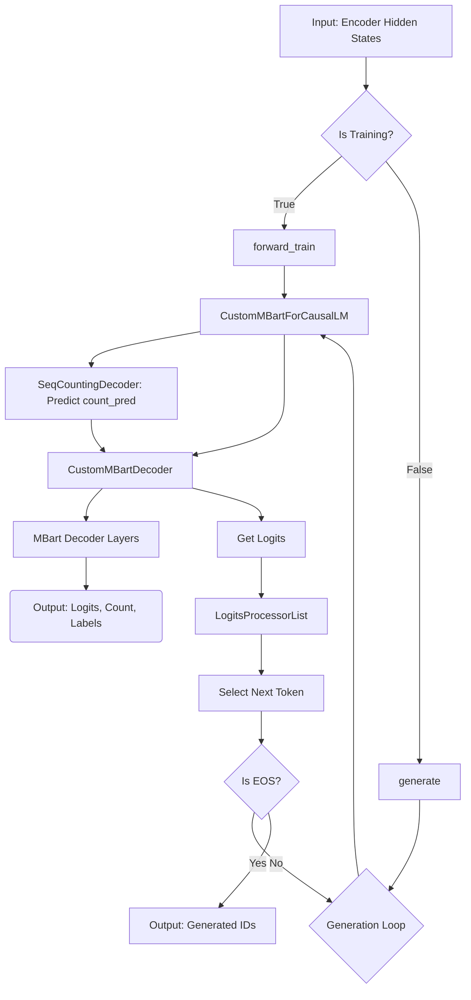

## 类结构

```
ModelOutput (Data Class Base)
├── BaseModelOutputWithPastAndCrossAttentions
├── Seq2SeqLMOutput
├── CausalLMOutputWithCrossAttentions
└── CausalLMOutputWithCrossAttentionsAndCounting

MBartConfig (Configuration)

nn.Module (Torch Base)
├── MBartPreTrainedModel (Base Class)
│   ├── MBartDecoder (Standard Decoder)
│   ├── CustomMBartDecoder (Modified Decoder with Counting)
│   ├── MBartDecoderWrapper
│   ├── MBartForCausalLM
│   └── CustomMBartForCausalLM
├── MBartAttention
├── MBartDecoderLayer
├── myLayerNorm (Custom LayerNorm)
├── MyMultiheadAttention
├── SelfAttentionBlock
├── SeqCountingDecoder (Counting Module)
└── UniMERNetHead (Main Interface)

Utils / Helper Classes
├── AttentionMaskConverter
├── LogitsProcessorList
└── ForcedEOSTokenLogitsProcessor
```

## 全局变量及字段


### `MBART_ATTENTION_CLASSES`
    
A dictionary mapping attention implementation names to their corresponding MBartAttention classes

类型：`Dict[str, Type[nn.Module]]`
    


### `MBartConfig.vocab_size`
    
The size of the vocabulary, determining the number of unique tokens the model can represent

类型：`int`
    


### `MBartConfig.d_model`
    
The dimension of the model's hidden states, also referred to as hidden_size

类型：`int`
    


### `MBartConfig.encoder_layers`
    
The number of layers in the encoder part of the transformer model

类型：`int`
    


### `MBartConfig.decoder_layers`
    
The number of layers in the decoder part of the transformer model

类型：`int`
    


### `MBartConfig.attention_dropout`
    
The dropout probability applied to attention weights during training

类型：`float`
    


### `MBartConfig.use_cache`
    
Flag indicating whether past key/values should be cached for faster decoding

类型：`bool`
    


### `MBartConfig.is_encoder_decoder`
    
Flag indicating whether the model uses an encoder-decoder architecture

类型：`bool`
    


### `MBartConfig.is_export`
    
Flag indicating whether the model is being prepared for export (e.g., to ONNX)

类型：`bool`
    


### `MBartPreTrainedModel.config`
    
The configuration object containing model hyperparameters and settings

类型：`MBartConfig`
    


### `MBartDecoder.embed_tokens`
    
Token embedding layer that converts input token IDs to dense vectors

类型：`nn.Embedding`
    


### `MBartDecoder.embed_positions`
    
Positional embedding layer that encodes sequence position information

类型：`MBartLearnedPositionalEmbedding`
    


### `MBartDecoder.layers`
    
List of decoder layers that process the input sequence

类型：`nn.ModuleList[MBartDecoderLayer]`
    


### `MBartDecoder.layernorm_embedding`
    
Layer normalization applied to the sum of embeddings and positions

类型：`myLayerNorm`
    


### `MBartDecoder.layer_norm`
    
Final layer normalization applied to the decoder output

类型：`nn.LayerNorm`
    


### `CustomMBartDecoder.counting_context_weight`
    
A sequential neural network that processes counting predictions to modify decoder behavior

类型：`nn.Sequential`
    


### `CustomMBartDecoder.is_export`
    
Flag indicating whether the decoder is in export mode for model serialization

类型：`bool`
    


### `SeqCountingDecoder.attention_blocks`
    
List of self-attention blocks used for sequence counting

类型：`nn.ModuleList[SelfAttentionBlock]`
    


### `SeqCountingDecoder.fc1`
    
First fully connected layer that reduces the feature dimension

类型：`nn.Linear`
    


### `SeqCountingDecoder.fc2`
    
Second fully connected layer that produces the final output predictions

类型：`nn.Linear`
    


### `SeqCountingDecoder.global_avg_pool`
    
Global average pooling layer for aggregating sequence information

类型：`nn.AdaptiveAvgPool1d`
    


### `CustomMBartForCausalLM.model (decoder)`
    
The underlying decoder model that processes input sequences

类型：`MBartDecoderWrapper`
    


### `CustomMBartForCausalLM.lm_head`
    
Linear layer that maps decoder hidden states to vocabulary logits for language modeling

类型：`nn.Linear`
    


### `CustomMBartForCausalLM.counting_decoder`
    
A decoder component that predicts sequence counts for length-aware generation

类型：`SeqCountingDecoder`
    


### `UniMERNetHead.config_decoder`
    
Configuration object for the decoder-specific settings

类型：`MBartConfig`
    


### `UniMERNetHead.decoder`
    
The main decoder model used for generating output sequences

类型：`CustomMBartForCausalLM`
    


### `UniMERNetHead.counting_decoder`
    
Decoder component for predicting sequence characteristics

类型：`SeqCountingDecoder`
    


### `UniMERNetHead.logits_processor`
    
List of processors that modify logits during generation for various constraints

类型：`LogitsProcessorList`
    


### `UniMERNetHead.enc_to_dec_proj`
    
Linear projection layer to align encoder hidden size with decoder hidden size

类型：`nn.Linear`
    


### `MBartAttention.embed_dim`
    
The total dimension of the embedding vector for query, key, and value

类型：`int`
    


### `MBartAttention.num_heads`
    
The number of parallel attention heads in multi-head attention

类型：`int`
    


### `MBartAttention.k_proj`
    
Linear projection layer for computing key vectors

类型：`nn.Linear`
    


### `MBartAttention.v_proj`
    
Linear projection layer for computing value vectors

类型：`nn.Linear`
    


### `MBartAttention.q_proj`
    
Linear projection layer for computing query vectors

类型：`nn.Linear`
    


### `MBartAttention.out_proj`
    
Linear projection layer that maps attention output back to embedding dimension

类型：`nn.Linear`
    


### `AttentionMaskConverter.is_causal`
    
Flag indicating whether attention should be causal (preventing future token attention)

类型：`bool`
    


### `AttentionMaskConverter.sliding_window`
    
The window size for local attention, limiting attention to a fixed number of surrounding tokens

类型：`Optional[int]`
    
    

## 全局函数及方法


### `_prepare_4d_attention_mask`

该函数是一个全局工具函数，用于将2D注意力掩码转换为4D格式，以便在Transformer模型的多头注意力机制中使用。它通过调用`AttentionMaskConverter`类的`_expand_mask`静态方法来实现掩码的维度扩展和类型转换。

参数：

- `mask`：`torch.Tensor`，输入的2D注意力掩码，通常为[batch_size, seq_len]形状
- `dtype`：`torch.dtype`，目标数据类型，用于将掩码转换为指定的数值类型
- `tgt_len`：`Optional[int]`，目标序列长度，如果为None则使用源序列长度（src_len）

返回值：`torch.Tensor`，转换后的4D注意力掩码，形状为[batch_size, 1, tgt_len, src_len]

#### 流程图

```mermaid
flowchart TD
    A[开始: _prepare_4d_attention_mask] --> B[调用AttentionMaskConverter._expand_mask]
    B --> C[获取mask的形状 bsz, src_len]
    C --> D{判断 tgt_len 是否为 None}
    D -->|是| E[设置 tgt_len = src_len]
    D -->|否| F[保持 tgt_len 不变]
    E --> G[扩展mask维度: mask[:, None, None, :].expand]
    F --> G
    G --> H[转换为目标dtype类型]
    H --> I[计算反转掩码: inverted_mask = 1.0 - expanded_mask]
    I --> J[用-finf填充0值: masked_fill_]
    J --> K[返回4D注意力掩码]
```

#### 带注释源码

```python
def _prepare_4d_attention_mask(mask, dtype, tgt_len=None):
    """
    将2D注意力掩码转换为4D格式，用于Transformer的多头注意力机制。
    
    参数:
        mask: 输入的2D注意力掩码，形状为[batch_size, seq_len]
        dtype: 目标数据类型，用于掩码的类型转换
        tgt_len: 目标序列长度，如果为None则使用源序列长度
    
    返回:
        4D注意力掩码，形状为[batch_size, 1, tgt_len, src_len]
    """
    # 调用AttentionMaskConverter类的_expand_mask静态方法
    # 该方法负责执行实际的掩码扩展和转换操作
    return AttentionMaskConverter._expand_mask(mask=mask, dtype=dtype, tgt_len=tgt_len)
```


### `_prepare_4d_causal_attention_mask`

该函数是 MBART 因果语言模型解码器的核心辅助函数，负责生成、转换和验证用于多头注意力机制的 4D 因果注意力掩码（Causal Mask）。它根据输入的 2D 掩码或配置信息，构建能够防止信息泄露到未来时间步的掩码矩阵。

参数：

- `attention_mask`：`Union[torch.Tensor, None]`，原始的注意力掩码，可以是 2D、4D 或 None。
- `input_shape`：`torch.Size` 或 `tuple`，输入张量的形状，通常为 (batch_size, target_sequence_length)。
- `inputs_embeds`：`torch.Tensor`，输入的嵌入向量，用于确定目标数据类型（dtype）和设备。
- `past_key_values_length`：`int`，过去键值对的长度，用于计算缓存状态下的总序列长度。
- `sliding_window`：`int`，可选，滑动窗口大小，用于局部注意力机制。
- `is_export`：`bool`，标志位，指示是否为模型导出（如 ONNX）场景，某些掩码处理逻辑会有所不同。

返回值：`torch.Tensor`，处理并扩展后的 4D 注意力掩码，形状通常为 (batch_size, 1, seq_len, key_value_len)。

#### 流程图

```mermaid
graph TD
    A[Start: _prepare_4d_causal_attention_mask] --> B[创建 AttentionMaskConverter<br>is_causal=True]
    B --> C[计算 key_value_length<br>= input_shape[-1] + past_key_values_length]
    C --> D{检查 attention_mask 维度}
    
    D -- len_shape == 2 (2D) --> E[调用 to_4d 转换为 4D]
    E --> E1{is_export?}
    E1 -- True --> E2[返回因果掩码]
    E1 -- False --> E3[合并因果掩码与输入掩码]
    E2 --> F[Return Tensor]
    E3 --> F
    
    D -- len_shape == 4 (4D) --> G[验证形状是否匹配]
    G --> G1{匹配?}
    G1 -- No --> G2[抛出 ValueError]
    G1 -- Yes --> G3[反转掩码并填充]
    G3 --> F
    
    D -- Other (e.g., None) --> H[调用 to_causal_4d]
    H --> I[BUG: 方法不存在!]
    I --> J[AttributeError]
    
    style J fill:#f9f,stroke:#333,stroke-width:2px
```

#### 带注释源码

```python
def _prepare_4d_causal_attention_mask(
        attention_mask,
        input_shape,
        inputs_embeds,
        past_key_values_length,
        sliding_window=None,
        is_export=False,
):
    """
    准备用于解码器的 4D 因果注意力掩码。

    参数:
        attention_mask: 2D or 4D 注意力掩码。
        input_shape: 输入形状 (batch, seq_len)。
        inputs_embeds: 嵌入张量，用于获取 dtype。
        past_key_values_length: 过去 Key-Value 的长度。
        sliding_window: 滑动窗口大小。
        is_export: 是否为导出模式。

    返回:
        4D 注意力掩码。
    """
    # 1. 初始化因果掩码转换器，强制开启因果模式 (is_causal=True)
    attn_mask_converter = AttentionMaskConverter(
        is_causal=True, sliding_window=sliding_window
    )
    
    # 2. 计算 Key-Value 的总长度（包含过去上下文）
    key_value_length = input_shape[-1] + past_key_values_length

    shape = attention_mask.shape
    len_shape = len(shape)
    
    # 3. 分支处理不同维度的输入掩码
    if (attention_mask is not None) and (len_shape == 2):
        # --- 场景 A: 输入是标准的 2D 掩码 (batch, seq_len) ---
        # 调用转换器将其扩展为 4D 因果掩码
        attention_mask = attn_mask_converter.to_4d(
            attention_mask,
            input_shape[-1],
            key_value_length=key_value_length,
            dtype=inputs_embeds.dtype,
            is_export=is_export,
        )
        # 注意：如果 is_export 为 True，这里可能只返回了因果掩码本身，
        # 原始的 padding 信息可能丢失，这在导出时可能导致问题。
        return attention_mask
    
    elif attention_mask is not None and len(attention_mask.shape) == 4:
        # --- 场景 B: 输入已经是 4D 掩码 ---
        # 验证形状是否正确
        expected_shape = (input_shape[0], 1, input_shape[1], key_value_length)
        if tuple(attention_mask.shape) != expected_shape:
            raise ValueError(
                f"Incorrect 4D attention_mask shape: {tuple(attention_mask.shape)}; expected: {expected_shape}."
            )
        else:
            # 反转掩码（0->1, 1->0）并用极小值填充无效位置
            inverted_mask = 1.0 - attention_mask
            attention_mask = inverted_mask.masked_fill_(
                inverted_mask.to(torch.bool), torch.finfo(inputs_embeds.dtype).min
            )
    else:
        # --- 场景 C: 无掩码或其他情况 ---
        # 注意：此处代码存在潜在错误，调用了不存在的方法 to_causal_4d
        # 正确逻辑可能应该调用 to_4d 或在此处生成默认全零掩码
        attention_mask = attn_mask_converter.to_causal_4d(
            input_shape[0],
            input_shape[-1],
            key_value_length,
            dtype=inputs_embeds.dtype,
        )

    return attention_mask
```

#### 潜在技术债务与优化空间

1.  **致命 Bug (Runtime Error)**: 代码第 `else` 分支中调用了 `attn_mask_converter.to_causal_4d(...)`。然而，在 `AttentionMaskConverter` 类中仅定义了 `to_4d` 和 `to_4d_export` 方法，并不存在 `to_causal_4d` 方法。这会导致程序在运行时报 `AttributeError`。这可能是由于重构代码时方法名变更（如改为 `to_4d` 并传入 `is_causal=True` 参数）但未同步更新所有调用点导致的。
2.  **导出模式 (`is_export`) 逻辑不清晰**: 在处理 2D 掩码转换为 4D 时，如果 `is_export=True`，代码直接返回了 causal mask，完全忽略了原始 2D 掩码中的 padding 信息（虽然 causal mask 权重为负无穷，但原始掩码可能包含其他语义）。这在模型导出（例如导出为 ONNX 或 TorchScript）进行推理时，可能会导致注意力机制计算错误。
3.  **形状验证缺失**: 对于 `sliding_window` 非空的情况，虽然在 `AttentionMaskConverter` 初始化时校验了正整数，但在 `_make_causal_mask` 内部的具体生成逻辑中，文档和实现细节较为隐晦，可能导致在特定配置下掩码形状不匹配。


### `_prepare_4d_causal_attention_mask_export`

该函数用于将二维因果注意力掩码（causal attention mask）转换为四维形式，专为模型导出（export）场景设计，确保在推理时正确应用因果掩码以防止信息泄露。

参数：

- `attention_mask`：`torch.Tensor`，二维输入的注意力掩码，通常为 [batch_size, seq_len]，其中 1 表示有效位置，0 表示填充位置
- `input_shape`：`Tuple[int, ...]`或`torch.Size`，输入的形状，通常为 [batch_size, seq_len]
- `inputs_embeds`：`torch.Tensor`，输入的嵌入向量，用于获取数据类型（dtype）信息
- `past_key_values_length`：`int`，过去键值对的长度，用于计算完整的 key_value 长度
- `sliding_window`：`Optional[int]`，滑动窗口大小，用于局部注意力机制，默认为 None
- `is_export`：`bool`，是否处于导出模式，导出模式下可能使用不同的数据类型（如 float64），默认为 False

返回值：`torch.Tensor`，转换后的四维注意力掩码，形状为 [batch_size, 1, seq_len, key_value_length]

#### 流程图

```mermaid
flowchart TD
    A[开始] --> B[创建 AttentionMaskConverter 对象<br/>is_causal=True, sliding_window=sliding_window]
    B --> C[计算 key_value_length<br/>key_value_length = input_shape[-1] + past_key_values_length]
    C --> D[获取 attention_mask 的形状信息<br/>shape = attention_mask.shape<br/>len_shape = len(shape)]
    D --> E[调用 to_4d_export 方法转换掩码]
    E --> F[返回转换后的四维注意力掩码]
    
    subgraph AttentionMaskConverter
        B
    end
```

#### 带注释源码

```python
def _prepare_4d_causal_attention_mask_export(
        attention_mask,          # 输入的2D注意力掩码 [batch_size, seq_len]
        input_shape,             # 输入形状 [batch_size, seq_len]
        inputs_embeds,           # 输入嵌入，用于获取dtype
        past_key_values_length,  # 过去键值对长度
        sliding_window=None,     # 滑动窗口大小，可选
        is_export=False,         # 是否为导出模式
):
    # 1. 创建因果掩码转换器，设置因果注意力为True
    #    is_causal=True 确保掩码为下三角形式，防止看到未来token
    attn_mask_converter = AttentionMaskConverter(
        is_causal=True, 
        sliding_window=sliding_window
    )
    
    # 2. 计算键值对的总长度
    #    包含当前序列长度 + 历史序列长度（用于处理past_key_values场景）
    key_value_length = input_shape[-1] + past_key_values_length

    # 3. 获取输入掩码的形状信息（主要用于调试或验证）
    shape = attention_mask.shape
    len_shape = len(shape)

    # 4. 调用转换器的to_4d_export方法将2D掩码扩展为4D
    #    目标形状: [batch_size, 1, seq_len, key_value_length]
    #    dtype使用inputs_embeds的数据类型以保持一致
    attention_mask = attn_mask_converter.to_4d_export(
        attention_mask,                  # 输入的2D掩码
        input_shape[-1],                 # 查询长度（当前序列长度）
        key_value_length=key_value_length,  # 键值对总长度
        dtype=inputs_embeds.dtype,        # 输出数据类型
        is_export=is_export,             # 导出模式标志
    )
    
    # 5. 返回转换后的4D注意力掩码
    return attention_mask
```


### `_in_projection`

该函数是MBART/Multi-head Attention模型中的核心投影函数，用于将输入的查询(Query)、键(Key)、值(Value)张量分别通过对应的权重矩阵和偏置向量进行线性变换，生成投影后的Q、K、V表示。这是Multi-head Attention机制中输入映射的关键步骤。

参数：

- `q`：`torch.Tensor`，查询张量，最后一维维度为Eq
- `k`：`torch.Tensor`，键张量，最后一维维度为Ek
- `v`：`torch.Tensor`，值张量，最后一维维度为Ev
- `w_q`：`torch.Tensor`，查询的权重矩阵，形状为(Eq, Eq)
- `w_k`：`torch.Tensor`，键的权重矩阵，形状为(Eq, Ek)
- `w_v`：`torch.Tensor`，值的权重矩阵，形状为(Eq, Ev)
- `b_q`：`Optional[torch.Tensor]`，查询的偏置向量，形状为(Eq,)，默认为None
- `b_k`：`Optional[torch.Tensor]`，键的偏置向量，形状为(Eq,)，默认为None
- `b_v`：`Optional[torch.Tensor]`，值的偏置向量，形状为(Eq,)，默认为None

返回值：`Tuple[torch.Tensor, torch.Tensor, torch.Tensor]`，分别返回投影后的查询、键、值张量

#### 流程图

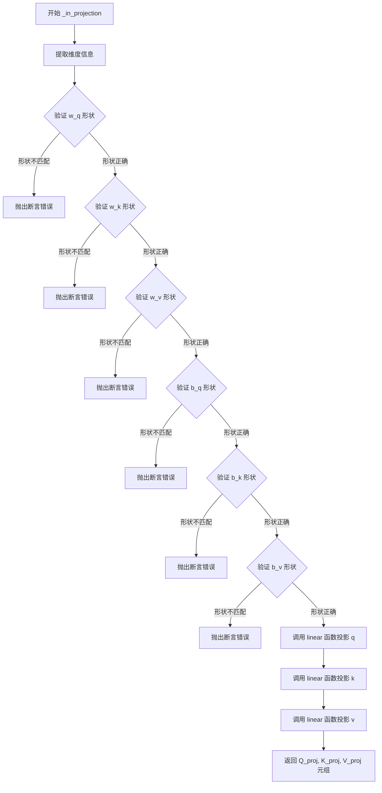

#### 带注释源码

```python
def _in_projection(
        q: torch.Tensor,
        k: torch.Tensor,
        v: torch.Tensor,
        w_q: torch.Tensor,
        w_k: torch.Tensor,
        w_v: torch.Tensor,
        b_q: Optional[torch.Tensor] = None,
        b_k: Optional[torch.Tensor] = None,
        b_v: Optional[torch.Tensor] = None,
) -> Tuple[torch.Tensor, torch.Tensor, torch.Tensor]:
    """
    执行 Q、K、V 的线性投影变换。
    
    参数:
        q: 查询张量，形状为 (..., Eq)
        k: 键张量，形状为 (..., Ek)
        v: 值张量，形状为 (..., Ev)
        w_q: 查询权重矩阵，形状为 (Eq, Eq)
        w_k: 键权重矩阵，形状为 (Eq, Ek)
        w_v: 值权重矩阵，形状为 (Eq, Ev)
        b_q: 查询偏置，可选
        b_k: 键偏置，可选
        b_v: 值偏置，可选
    
    返回:
        投影后的 Q、K、V 张量元组
    """
    # 获取输入张量的最后一维维度
    Eq, Ek, Ev = q.shape[-1], k.shape[-1], v.shape[-1]
    
    # 验证查询权重矩阵形状，必须为 (Eq, Eq)
    assert w_q.shape == (
        Eq,
        Eq,
    ), f"expecting query weights shape of {(Eq, Eq)}, but got {w_q.shape}"
    
    # 验证键权重矩阵形状，必须为 (Eq, Ek)
    assert w_k.shape == (
        Eq,
        Ek,
    ), f"expecting key weights shape of {(Eq, Ek)}, but got {w_k.shape}"
    
    # 验证值权重矩阵形状，必须为 (Eq, Ev)
    assert w_v.shape == (
        Eq,
        Ev,
    ), f"expecting value weights shape of {(Eq, Ev)}, but got {w_v.shape}"
    
    # 验证查询偏置形状（如果存在），必须为 (Eq,)
    assert b_q is None or b_q.shape == (
        Eq,
    ), f"expecting query bias shape of {(Eq,)}, but got {b_q.shape}"
    
    # 验证键偏置形状（如果存在），必须为 (Eq,)
    assert b_k is None or b_k.shape == (
        Eq,
    ), f"expecting key bias shape of {(Eq,)}, but got {b_k.shape}"
    
    # 验证值偏置形状（如果存在），必须为 (Eq,)
    assert b_v is None or b_v.shape == (
        Eq,
    ), f"expecting value bias shape of {(Eq,)}, but got {b_v.shape}"
    
    # 使用线性变换函数对 Q、K、V 分别进行投影
    # 注意：权重矩阵需要转置 (w.T) 以进行正确的矩阵乘法
    return linear(q, w_q.T, b_q), linear(k, w_k.T, b_k), linear(v, w_v.T, b_v)
```


### `_scaled_dot_product_attention`

该函数实现了缩放点积注意力（Scaled Dot-Product Attention）机制，这是Transformer架构中的核心计算组件。通过对Query、Key、Value进行矩阵乘法运算，结合softmax归一化和可选的dropout正则化，生成上下文感知的注意力输出和注意力权重矩阵。

参数：

- `q`：`torch.Tensor`，Query（查询）向量，形状为 [B, Nt, E]，其中B为批量大小，Nt为目标序列长度，E为嵌入维度
- `k`：`torch.Tensor`，Key（键）向量，形状为 [B, Nt, E]，与Query形状一致
- `v`：`torch.Tensor`，Value（值）向量，形状为 [B, Nt, E]，与Query形状一致
- `attn_mask`：`Optional[torch.Tensor]`，注意力掩码，用于控制注意力权重，可选参数，默认为None
- `dropout_p`：`float`，Dropout概率，用于正则化注意力权重，默认为0.0

返回值：`Tuple[torch.Tensor, torch.Tensor]`，返回一个元组，包含：
- 第一个元素：注意力输出，形状为 [B, Nt, E]
- 第二个元素：注意力权重矩阵，形状为 [B, Nt, Nt]

#### 流程图

```mermaid
flowchart TD
    A[输入 q, k, v] --> B[获取形状 B, Nt, E]
    B --> C[Q 除以 sqrt(E) 进行缩放]
    C --> D[计算注意力分数: attn = Q × K^T]
    D --> E{attn_mask 是否存在?}
    E -->|是| F[将掩码加到注意力分数]
    E -->|否| G[直接进行softmax]
    F --> G
    G --> H[对注意力分数进行softmax归一化]
    H --> I{dropout_p > 0?}
    I -->|是| J[应用Dropout]
    I -->|否| K[跳过Dropout]
    J --> K
    K --> L[计算输出: output = attn × V]
    L --> M[返回 output 和 attn]
```

#### 带注释源码

```python
def _scaled_dot_product_attention(
        q: torch.Tensor,
        k: torch.Tensor,
        v: torch.Tensor,
        attn_mask: Optional[torch.Tensor] = None,
        dropout_p: float = 0.0,
) -> Tuple[torch.Tensor, torch.Tensor]:
    """
    实现缩放点积注意力机制
    
    Args:
        q: Query张量，形状 [B, Nt, E]
        k: Key张量，形状 [B, Nt, E]
        v: Value张量，形状 [B, Nt, E]
        attn_mask: 可选的注意力掩码，用于屏蔽特定位置
        dropout_p: Dropout概率，用于防止过拟合
    
    Returns:
        output: 注意力输出，形状 [B, Nt, E]
        attn: 注意力权重矩阵，形状 [B, Nt, Nt]
    """
    # 获取查询张量的形状参数
    # B: 批量大小, Nt: 目标序列长度, E: 嵌入维度
    B, Nt, E = q.shape
    
    # 缩放操作：除以嵌入维度的平方根，防止点积结果过大导致softmax梯度消失
    # 这是Transformer论文中的关键技巧
    q = q / math.sqrt(E)
    
    # 计算注意力分数矩阵：Q × K^T
    # 结果形状: [B, Nt, Nt]，每一行表示当前位置对所有位置的注意力权重
    attn = torch.bmm(q, k.permute([0, 2, 1]))
    
    # 如果提供了注意力掩码，将其加到注意力分数上
    # 掩码中为0的位置保持不变，为负无穷的位置会被softmax忽略
    if attn_mask is not None:
        attn += attn_mask
    
    # 对最后一个维度进行softmax归一化，将分数转换为概率分布
    # 每一行的和为1，表示对各个位置的注意力权重
    attn = F.softmax(attn, dim=-1)
    
    # 如果dropout概率大于0，则应用dropout进行正则化
    # 这有助于防止模型过拟合
    if dropout_p > 0.0:
        attn = F.dropout(attn, p=dropout_p)
    
    # 计算最终输出：注意力权重 × Value矩阵
    # 输出形状: [B, Nt, E]，融合了上下文信息的表示
    output = torch.bmm(attn, v)
    
    # 返回注意力输出和注意力权重矩阵
    return output, attn
```


### `linear`

该函数是一个线性变换核心实现，执行矩阵乘法运算以实现神经网络中的线性层功能。根据 `is_transpose` 参数决定是否对权重矩阵进行转置，并可选地添加偏置项。这是实现多头注意力机制中 Q、K、V 投影的基础运算单元。

参数：

- `x`：`torch.Tensor`，输入张量，通常是来自上一层的隐藏状态
- `w`：`torch.Tensor`，权重矩阵，执行线性变换的参数
- `b`：`Optional[torch.Tensor]`，可选的偏置向量，如果为 None 则不添加偏置
- `is_transpose`：`bool`，布尔标志，决定是否在运算前对权重矩阵进行转置

返回值：`torch.Tensor`，返回线性变换后的输出张量

#### 流程图

```mermaid
flowchart TD
    A[开始 linear] --> B{is_transpose?}
    B -->|True| C[w = w.T]
    B -->|False| D[跳过转置]
    C --> E{b is not None?}
    D --> E
    E -->|True| F[return torch.matmul(x, w) + b]
    E -->|False| G[return torch.matmul(x, w)]
    F --> H[结束]
    G --> H
```

#### 带注释源码

```python
def linear(x, w, b, is_transpose):
    """
    执行线性变换操作
    
    参数:
        x: 输入张量，形状为 (..., in_features)
        w: 权重矩阵，形状为 (out_features, in_features) 或 (in_features, out_features)
        b: 可选偏置向量，形状为 (out_features,)
        is_transpose: 是否对权重矩阵进行转置
    
    返回:
        线性变换后的张量
    """
    # 如果需要转置，则对权重矩阵进行转置
    # 这在某些注意力机制实现中用于兼容不同的权重排列方式
    if is_transpose:
        w = w.T
    
    # 执行矩阵乘法运算
    # 如果提供了偏置，则将偏置加到结果上
    if b is not None:
        return torch.matmul(x, w) + b
    else:
        return torch.matmul(x, w)
```


### `_in_projection_packed`

该函数是MBART/Multi-head Attention模型中的核心投影函数，负责将输入的查询(Q)、键(K)、值(V)张量通过权重矩阵进行线性变换。当Q、K、V相同时（自注意力场景），该函数通过一次矩阵乘法后重塑得到三个投影；当Q、K、V不完全相同时（交叉注意力场景），则分别对每个张量进行独立的线性投影。

参数：

- `q`：`Tensor`，查询张量，最后一维维度为E
- `k`：`Tensor`，键张量
- `v`：`Tensor`，值张量
- `w`：`Tensor`，投影权重矩阵，当Q=K=V时shape为(E, 3E)，否则会被chunk成三份
- `b`：`Optional[Tensor]`，偏置向量，可选
- `is_export`：`bool`，是否处于导出模式，用于控制张量形状变换方式

返回值：`List[Tensor]` 返回三个投影后的张量元组 (q_proj, k_proj, v_proj)

#### 流程图

```mermaid
flowchart TD
    A[开始: _in_projection_packed] --> B{判断: k is v?}
    B -->|True| C{判断: q is k?}
    B -->|False| H[分离权重和偏置]
    C -->|True| D[执行单个投影: linear(q, w, b, is_transpose=True)]
    C -->|False| H
    D --> E{判断: is_export?}
    E -->|True| F[Export模式: reshape和permute变换]
    E -->|False| G[普通模式: unflatten和permute变换]
    F --> I[返回元组 (proj[0], proj[1], proj[2])]
    G --> I
    H --> I2[分别执行: linear(q,w_q,b_q), linear(k,w_k,b_k), linear(v,w_v,b_v)]
    I --> J[结束]
    I2 --> J
```

#### 带注释源码

```python
def _in_projection_packed(
        q: Tensor,
        k: Tensor,
        v: Tensor,
        w: Tensor,
        b: Optional[Tensor] = None,
        is_export=False,
) -> List[Tensor]:
    """
    对Q、K、V进行投影变换的优化实现。
    
    当Q、K、V相同时（自注意力），通过一次矩阵乘法计算后再拆分为三个投影；
    当Q、K、V不完全相同时（交叉注意力），分别对每个输入进行独立投影。
    
    Args:
        q: 查询张量，shape [..., E]
        k: 键张量
        v: 值张量
        w: 投影权重，当Q=K=V时shape为[E, 3E]
        b: 可选偏置
        is_export: 是否为导出模式（影响张量重塑方式）
    
    Returns:
        List[Tensor]: (q_proj, k_proj, v_proj) 三个投影后的张量
    """
    # 获取查询张量的最后一个维度大小
    E = q.shape[-1]
    
    # 场景1：自注意力 (q is k and k is v)
    # 此时只需要一次矩阵乘法，然后拆分成三份
    if k is v:
        if q is k:
            # 执行单个投影，权重矩阵shape为[E, 3E]，转置后为[3E, E]
            proj = linear(q, w, b, is_transpose=True)
            
            if is_export:
                # 导出模式下的张量变换
                # B=batch, D=中间维度, L=序列长度, E=embedding维度
                B, D, L = proj.shape
                # 重塑为 [B, D, 3, E] 并调整维度顺序
                proj = proj.reshape([B, D, 3, E])
                proj = (
                    proj.unsqueeze(0)           # [1, B, D, 3, E]
                    .permute([3, 1, 2, 0, 4])   # [3, B, D, 1, E]
                    .squeeze(-2)                # [3, B, D, E]
                    .contiguous()
                )
            else:
                # 普通模式下的张量变换
                # 将最后一个维度拆分为 [3, E]
                proj = (
                    proj.unflatten(-1, (3, E))   # [B, D, 3, E]
                    .unsqueeze(0)               # [1, B, D, 3, E]
                    .permute([3, 1, 2, 0, 4])   # [3, B, D, 1, E]
                    .squeeze(-2)                # [3, B, D, E]
                    .contiguous()
                )
            # 返回拆分后的三个投影结果
            return proj[0], proj[1], proj[2]
    
    # 场景2：交叉注意力 (k != v 或 q != k)
    # 将权重矩阵分成三份，分别对Q、K、V进行投影
    else:
        # 按维度chunk拆分权重矩阵为 [E, E] x 3
        w_q, w_k, w_v = w.chunk(3)
        
        # 拆分偏置向量（如果有）
        if b is None:
            b_q = b_k = b_v = None
        else:
            b_q, b_k, b_v = b.chunk(3)
        
        # 分别执行三次独立的线性投影
        return linear(q, w_q, b_q), linear(k, w_k, b_k), linear(v, w_v, b_v)
```


### `multi_head_attention_forward`

该函数实现了标准的多头注意力机制（Multi-Head Attention），用于 Transformer 模型中计算 Query、Key、Value 之间的注意力权重并生成上下文相关的输出。这是 MBart 模型中 `MyMultiheadAttention` 类的核心计算逻辑，支持自注意力和交叉注意力两种模式。

参数：

- `query`：`torch.Tensor`，查询张量，形状为 `[tgt_len, bsz, embed_dim]`
- `key`：`torch.Tensor`，键张量，形状为 `[src_len, bsz, embed_dim]`
- `value`：`torch.Tensor`，值张量，形状为 `[src_len, bsz, embed_dim]`
- `embed_dim_to_check`：`int`，要检查的嵌入维度
- `num_heads`：`int`，注意力头的数量
- `in_proj_weight`：`torch.Tensor`，输入投影的权重矩阵，用于 Q、K、V 的线性变换
- `in_proj_bias`：`Optional[torch.Tensor]`，输入投影的偏置向量
- `bias_k`：`Optional[torch.Tensor]`，键的可选偏置，用于扩展维度
- `bias_v`：`Optional[torch.Tensor]`，值的可选偏置，用于扩展维度
- `add_zero_attn`：`bool`，是否添加零注意力
- `dropout_p`：`float`，注意力权重的 dropout 概率
- `out_proj_weight`：`torch.Tensor`，输出投影的权重矩阵
- `out_proj_bias`：`Optional[torch.Tensor]`，输出投影的偏置向量
- `training`：`bool = True`，是否处于训练模式
- `key_padding_mask`：`Optional[torch.Tensor] = None`，键的填充掩码，用于掩盖 padding 位置
- `need_weights`：`bool = True`，是否返回注意力权重
- `attn_mask`：`Optional[torch.Tensor] = None`，注意力掩码，用于控制注意力计算
- `use_separate_proj_weight`：`bool = False`，是否使用分离的投影权重
- `q_proj_weight`：`Optional[torch.Tensor] = None`，查询的独立投影权重
- `k_proj_weight`：`Optional[torch.Tensor] = None`，键的独立投影权重
- `v_proj_weight`：`Optional[torch.Tensor] = None`，值的独立投影权重
- `static_k`：`Optional[torch.Tensor] = None`，静态键张量
- `static_v`：`Optional[torch.Tensor] = None`，静态值张量
- `is_export`：`bool = False`，是否为导出模式

返回值：`Tuple[torch.Tensor, Optional[torch.Tensor]]`，返回注意力输出和注意力权重。当 `need_weights=True` 时，返回加权的注意力权重；否则第二个元素为 `None`。

#### 流程图

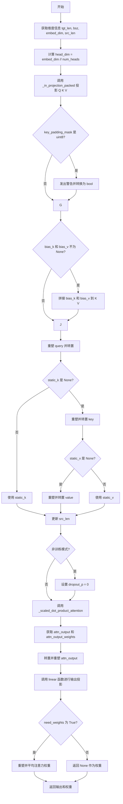

#### 带注释源码

```python
def multi_head_attention_forward(
        query: torch.Tensor,           # 查询张量 [tgt_len, bsz, embed_dim]
        key: torch.Tensor,             # 键张量 [src_len, bsz, embed_dim]
        value: torch.Tensor,           # 值张量 [src_len, bsz, embed_dim]
        embed_dim_to_check: int,      # 要检查的嵌入维度
        num_heads: int,                # 注意力头数量
        in_proj_weight: torch.Tensor, # 输入投影权重
        in_proj_bias: Optional[torch.Tensor],  # 输入投影偏置
        bias_k: Optional[torch.Tensor],        # 键的偏置（可选）
        bias_v: Optional[torch.Tensor],        # 值的偏置（可选）
        add_zero_attn: bool,           # 是否添加零注意力
        dropout_p: float,              # Dropout 概率
        out_proj_weight: torch.Tensor, # 输出投影权重
        out_proj_bias: Optional[torch.Tensor],# 输出投影偏置
        training: bool = True,         # 训练模式标志
        key_padding_mask: Optional[torch.Tensor] = None,  # 填充掩码
        need_weights: bool = True,    # 是否需要返回注意力权重
        attn_mask: Optional[torch.Tensor] = None,  # 注意力掩码
        use_separate_proj_weight: bool = False,    # 是否使用分离投影权重
        q_proj_weight: Optional[torch.Tensor] = None, # 查询投影权重
        k_proj_weight: Optional[torch.Tensor] = None, # 键投影权重
        v_proj_weight: Optional[torch.Tensor] = None, # 值投影权重
        static_k: Optional[torch.Tensor] = None,   # 静态键
        static_v: Optional[torch.Tensor] = None,   # 静态值
        is_export=False,               # 导出模式标志
):
    # ==================== 步骤1: 获取输入维度信息 ====================
    tgt_len, bsz, embed_dim = query.shape  # 目标序列长度、批量大小、嵌入维度
    src_len, _, _ = key.shape               # 源序列长度

    # ==================== 步骤2: 计算每个头的维度 ====================
    if isinstance(embed_dim, torch.Tensor):
        head_dim = embed_dim.div(num_heads, rounding_mode="trunc")
    else:
        head_dim = embed_dim // num_heads

    # ==================== 步骤3: 输入投影 - 计算 Q K V ====================
    # 使用 _in_projection_packed 将 query, key, value 投影到 Q, K, V
    # 这是通过一个大的线性层 (3*embed_dim, embed_dim) 一次性完成三个投影
    q, k, v = _in_projection_packed(
        query, key, value, in_proj_weight, in_proj_bias, is_export
    )

    # ==================== 步骤4: 处理 key_padding_mask ====================
    if key_padding_mask is not None and key_padding_mask.dtype == torch.uint8:
        warnings.warn(
            "Byte tensor for key_padding_mask in nn.MultiheadAttention is deprecated. "
            "Use bool tensor instead."
        )
        key_padding_mask = key_padding_mask.to(torch.bool)

    # ==================== 步骤5: 处理 bias_k 和 bias_v ====================
    # 如果提供了 bias_k 和 bias_v，将它们拼接到 key 和 value
    if bias_k is not None and bias_v is not None:  # 条件为 False
        assert static_k is None, "bias cannot be added to static key."
        assert static_v is None, "bias cannot be added to static value."
        # 拼接偏置到 key 和 value (扩展序列长度)
        k = torch.concat([k, bias_k.repeat(1, bsz, 1)])
        v = torch.concat([v, bias_v.repeat(1, bsz, 1)])
    else:
        assert bias_k is None
        assert bias_v is None

    # ==================== 步骤6: 重新shape和转置 Q K V ====================
    # 将 Q K V 从 [seq_len, bsz, embed_dim] 转换为 [bsz*num_heads, seq_len, head_dim]
    # 以便进行并行注意力计算
    q = q.reshape([tgt_len, bsz * num_heads, head_dim]).permute([1, 0, 2])

    # 处理 key
    if static_k is None:  # 通常为 True
        # 重塑: [src_len, bsz, embed_dim] -> [bsz*num_heads, src_len, head_dim]
        k = k.reshape([k.shape[0], bsz * num_heads, head_dim]).permute([1, 0, 2])
    else:
        # 使用静态 key (用于推理时的缓存)
        assert static_k.shape[0] == bsz * num_heads, \
            f"expecting static_k.size(0) of {bsz * num_heads}, but got {static_k.shape[0]}"
        assert static_k.shape[2] == head_dim, \
            f"expecting static_k.size(2) of {head_dim}, but got {static_k.shape[2]}"
        k = static_k

    # 处理 value
    if static_v is None:  # 通常为 True
        # 重塑并转置: [src_len, bsz, embed_dim] -> [bsz*num_heads, src_len, head_dim]
        v = v.reshape([v.shape[0], bsz * num_heads, head_dim]).transpose([1, 0, 2])
    else:
        # 使用静态 value
        assert static_v.shape[0] == bsz * num_heads, \
            f"expecting static_v.size(0) of {bsz * num_heads}, but got {static_v.shape[0]}"
        assert static_v.shape[2] == head_dim, \
            f"expecting static_v.size(2) of {head_dim}, but got {static_v.shape[2]}"
        v = static_v

    # 更新源序列长度
    src_len = k.shape[1]

    # ==================== 步骤7: 设置 dropout ====================
    # 非训练模式下关闭 dropout
    if not training:
        dropout_p = 0.0

    # ==================== 步骤8: 计算缩放点积注意力 ====================
    # 调用核心注意力计算函数，返回注意力输出和注意力权重
    attn_output, attn_output_weights = _scaled_dot_product_attention(
        q, k, v, attn_mask, dropout_p
    )

    # ==================== 步骤9: 输出投影 ====================
    # 将注意力输出从 [tgt_len, bsz*num_heads, head_dim] 转置并重塑为 [tgt_len, bsz, embed_dim]
    attn_output = attn_output.permute([1, 0, 2]).reshape([tgt_len, bsz, embed_dim])
    # 应用输出投影层
    attn_output = linear(
        attn_output, out_proj_weight, out_proj_bias, is_transpose=False
    )

    # ==================== 步骤10: 处理注意力权重输出 ====================
    if need_weights:
        # 将注意力权重从 [bsz*num_heads, tgt_len, src_len] 
        # 重塑为 [bsz, num_heads, tgt_len, src_len]
        # 然后对所有头取平均
        attn_output_weights = attn_output_weights.reshape(
            [bsz, num_heads, tgt_len, src_len]
        )
        # 返回输出和平均后的注意力权重
        return attn_output, attn_output_weights.sum(dim=1) / num_heads
    else:
        # 只返回输出，注意力权重设为 None
        return attn_output, None
```


### `MBartConfig.__init__`

该方法是 `MBartConfig` 类的构造函数，用于初始化 mBART 模型的所有配置参数。它接收大量可选参数，涵盖模型架构、训练策略、词表设置等各个方面，并将这些参数存储为实例属性供模型创建时使用。

参数：

- `vocab_size`：`int`，词表大小，默认为 50265
- `max_position_embeddings`：`int`，最大位置嵌入长度，默认为 1024
- `encoder_layers`：`int`，编码器层数，默认为 12
- `encoder_ffn_dim`：`int`，编码器前馈网络维度，默认为 4096
- `encoder_attention_heads`：`int`，编码器注意力头数，默认为 16
- `decoder_layers`：`int`，解码器层数，默认为 12
- `decoder_ffn_dim`：`int`，解码器前馈网络维度，默认为 4096
- `decoder_attention_heads`：`int`，解码器注意力头数，默认为 16
- `encoder_layerdrop`：`float`，编码器层dropout概率，默认为 0.0
- `decoder_layerdrop`：`float`，解码器层dropout概率，默认为 0.0
- `use_cache`：`bool`，是否使用缓存加速推理，默认为 True
- `is_encoder_decoder`：`bool`，是否为编码器-解码器架构，默认为 True
- `activation_function`：`str`，激活函数类型，默认为 "gelu"
- `d_model`：`int`，模型隐藏层维度，默认为 1024
- `dropout`：`float`，全局dropout概率，默认为 0.1
- `output_hidden_states`：`bool`，是否输出隐藏状态，默认为 False
- `use_return_dict`：`bool`，是否返回字典格式输出，默认为 True
- `attention_dropout`：`float`，注意力层dropout概率，默认为 0.0
- `activation_dropout`：`float`，激活函数dropout概率，默认为 0.0
- `init_std`：`int`，权重初始化标准差，默认为 0.02
- `classifier_dropout`：`float`，分类器dropout概率，默认为 0.0
- `scale_embedding`：`bool`，是否缩放嵌入向量，默认为 False
- `pad_token_id`：`int`，padding token的ID，默认为 1
- `bos_token_id`：`int`，句子开始token的ID，默认为 0
- `eos_token_id`：`int`，句子结束token的ID，默认为 2
- `forced_eos_token_id`：`int`，强制EOS token的ID，默认为 2
- `_attn_implementation`：`str`，注意力机制实现方式，默认为 "eager"
- `hidden_size`：`int`，隐藏层大小，默认为 1024
- `use_parallel`：`bool`，是否使用并行计算，默认为 False
- `parallel_step`：`int`，并行计算步数，默认为 2
- `is_export`：`bool`，是否为导出模式，默认为 False
- `**kwargs`：`Dict`，额外参数，用于兼容其他配置

返回值：`None`，该方法无返回值，仅初始化实例属性

#### 流程图

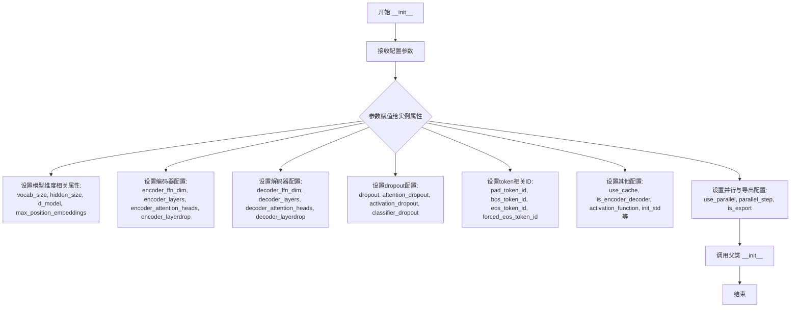

#### 带注释源码

```python
def __init__(
        self,
        vocab_size=50265,                    # 词表大小，默认50265
        max_position_embeddings=1024,       # 最大位置嵌入长度
        encoder_layers=12,                   # 编码器Transformer层数
        encoder_ffn_dim=4096,                 # 编码器前馈网络隐藏层维度
        encoder_attention_heads=16,          # 编码器注意力头数
        decoder_layers=12,                   # 解码器Transformer层数
        decoder_ffn_dim=4096,                # 解码器前馈网络隐藏层维度
        decoder_attention_heads=16,          # 解码器注意力头数
        encoder_layerdrop=0.0,               # 编码器层dropout概率
        decoder_layerdrop=0.0,               # 解码器层dropout概率
        use_cache=True,                      # 是否缓存past_key_values以加速推理
        is_encoder_decoder=True,            # 是否为Encoder-Decoder架构
        activation_function="gelu",          # 激活函数类型
        d_model=1024,                        # 模型隐藏层维度
        dropout=0.1,                         # 全局dropout概率
        output_hidden_states=False,         # 是否返回所有隐藏状态
        use_return_dict=True,                # 是否返回字典格式而非元组
        attention_dropout=0.0,               # 注意力模块dropout概率
        activation_dropout=0.0,              # 激活函数后dropout概率
        init_std=0.02,                       # 权重初始化标准差
        classifier_dropout=0.0,              # 分类器dropout概率
        scale_embedding=False,              # 是否对embedding进行缩放
        pad_token_id=1,                      # Padding token ID
        bos_token_id=0,                      # Begin of sentence token ID
        eos_token_id=2,                      # End of sentence token ID
        forced_eos_token_id=2,              # 强制EOS token ID
        _attn_implementation="eager",        # 注意力实现方式(eager/flash_attention_2)
        hidden_size=1024,                   # 隐藏层大小(与d_model相关)
        use_parallel=False,                  # 是否使用并行计算
        parallel_step=2,                     # 并行计算步数
        is_export=False,                     # 是否为导出模式(用于ONNX等)
        **kwargs,                            # 额外参数，用于兼容其他配置
):
    # ==================== 维度与模型结构配置 ====================
    self.vocab_size = vocab_size                      # 词表大小
    self.hidden_size = hidden_size                    # 隐藏层大小
    self.max_position_embeddings = max_position_embeddings  # 最大位置编码长度
    self.d_model = d_model                            # 模型主要维度
    
    # ==================== 编码器配置 ====================
    self.encoder_ffn_dim = encoder_ffn_dim            # 编码器FFN维度
    self.encoder_layers = encoder_layers              # 编码器层数
    self.encoder_attention_heads = encoder_attention_heads  # 编码器注意力头数
    
    # ==================== 解码器配置 ====================
    self.decoder_ffn_dim = decoder_ffn_dim            # 解码器FFN维度
    self.decoder_layers = decoder_layers              # 解码器层数
    self.decoder_attention_heads = decoder_attention_heads  # 解码器注意力头数
    
    # ==================== Dropout配置 ====================
    self.dropout = dropout                            # 全局dropout
    self.attention_dropout = attention_dropout        # 注意力dropout
    self.activation_dropout = activation_dropout       # 激活函数dropout
    
    # ==================== 输出与训练配置 ====================
    self.output_hidden_states = output_hidden_states  # 是否输出隐藏状态
    self.use_return_dict = use_return_dict            # 是否使用字典返回
    self.activation_function = activation_function   # 激活函数
    self.init_std = init_std                          # 初始化标准差
    self.encoder_layerdrop = encoder_layerdrop       # 编码器层dropout
    self.decoder_layerdrop = decoder_layerdrop       # 解码器层dropout
    self.classifier_dropout = classifier_dropout     # 分类器dropout
    
    # ==================== 缓存与推理配置 ====================
    self.use_cache = use_cache                        # 是否使用kv缓存
    self.num_hidden_layers = encoder_layers          # 隐藏层数量(兼容属性)
    
    # ==================== Embedding配置 ====================
    self.scale_embedding = scale_embedding           # 是否缩放embedding(乘以sqrt(d_model))
    
    # ==================== Token ID配置 ====================
    self.pad_token_id = pad_token_id                  # Padding token ID
    self.bos_token_id = bos_token_id                  # BOS token ID
    self.eos_token_id = eos_token_id                  # EOS token ID
    self.is_encoder_decoder = is_encoder_decoder     # 是否为encoder-decoder
    self.forced_eos_token_id = forced_eos_token_id   # 强制EOS token ID
    
    # ==================== 实现与并行配置 ====================
    self._attn_implementation = _attn_implementation  # 注意力实现方式
    self.use_parallel = use_parallel                  # 是否并行
    self.parallel_step = parallel_step               # 并行步数
    self.is_export = is_export                        # 导出模式标志
    
    # 调用父类构造函数
    super().__init__()
```


### MBartPreTrainedModel._initialize_weights

该方法是 MBartPreTrainedModel 类的权重初始化入口函数，用于在模型实例化后对所有子模块的权重进行初始化。它作为一个回调函数被传递给 `apply()` 方法，遍历模型中的每个模块，并检查模块是否已经初始化过，避免重复初始化。

参数：

- `self`：`MBartPreTrainedModel` 实例，隐式参数，代表当前模型对象
- `module`：`torch.nn.Module`，需要检查并初始化的 PyTorch 模块对象

返回值：`None`，该方法无返回值，仅执行模块权重的初始化操作

#### 流程图

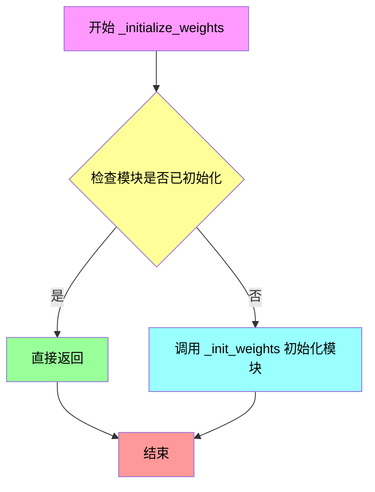

#### 带注释源码

```python
def _initialize_weights(self, module):
    """
    Initialize the weights if they are not already initialized.
    
    这个方法作为回调函数被 apply() 方法调用，用于遍历模型中的所有模块。
    它会检查每个模块是否已经通过 HuggingFace 的方式初始化过，如果是则跳过，
    否则调用 _init_weights() 方法进行标准初始化。
    
    Args:
        module (torch.nn.Module): 需要检查和初始化的 PyTorch 模块
        
    Returns:
        None: 该方法不返回值，直接修改传入的 module 对象
    """
    # 检查模块是否已经初始化过，避免重复初始化
    # _is_hf_initialized 是 HuggingFace 框架使用的标志位
    if getattr(module, "_is_hf_initialized", False):
        return
    
    # 调用实际的初始化方法，对模块的权重进行标准初始化
    # 包括线性层、Embedding 层等
    self._init_weights(module)
```


### `MBartPreTrainedModel.post_init`

该方法是 MBartPreTrainedModel 类的初始化后处理方法，负责在模型实例化完成后对所有子模块的权重进行初始化。它通过调用 `apply` 方法遍历模型的所有子模块，并对线性层和嵌入层按照配置中指定的 init_std 进行高斯分布初始化，确保模型权重在训练前具有合理的初始值。

参数： 该方法没有显式参数（隐式参数为 self，表示模型实例本身）

返回值：`None`，该方法无返回值，仅执行副作用（权重初始化）

#### 流程图

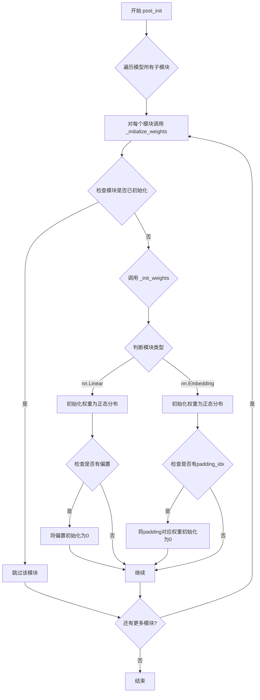

#### 带注释源码

```python
def post_init(self):
    """
    模型初始化后的后处理方法。
    通过 apply 方法遍历模型的所有子模块，对权重进行初始化。
    """
    # self.apply 会递归地调用 self._initialize_weights 函数
    # 对模型中的每一个模块执行初始化操作
    self.apply(self._initialize_weights)
```


### `MBartPreTrainedModel._init_weights`

该方法负责根据配置中的初始化标准差（init_std）对模型模块的权重进行初始化，针对线性层和嵌入层采用不同的初始化策略。

参数：

- `module`：`torch.nn.Module`，要初始化的神经网络模块，可以是线性层（nn.Linear）或嵌入层（nn.Embedding）

返回值：`None`，该方法直接修改传入模块的权重，不返回任何值

#### 流程图

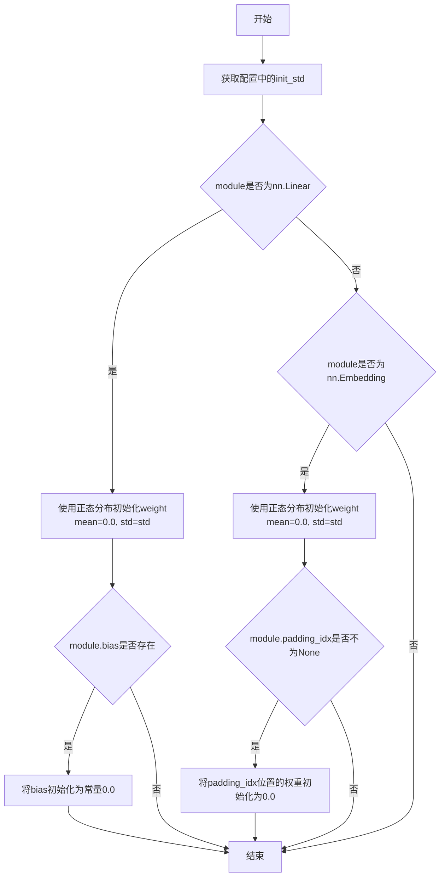

#### 带注释源码

```python
def _init_weights(self, module):
    """
    根据配置初始化模型权重。
    
    对于 nn.Linear 层：使用正态分布初始化权重，bias 初始化为 0
    对于 nn.Embedding 层：使用正态分布初始化权重，padding_idx 位置初始化为 0
    """
    # 从配置中获取初始化标准差
    std = self.config.init_std
    
    # 判断模块类型
    if isinstance(module, nn.Linear):
        # 线性层初始化：使用正态分布初始化权重
        torch.nn.init.normal_(module.weight, mean=0.0, std=std)
        
        # 如果存在偏置项，初始化为 0
        if module.bias is not None:
            torch.nn.init.constant_(module.bias, val=0.0)
    
    # 嵌入层初始化
    elif isinstance(module, nn.Embedding):
        # 使用正态分布初始化嵌入权重
        torch.nn.init.normal_(module.weight, mean=0.0, std=std)
        
        # 如果指定了 padding_idx，将对应位置的权重初始化为 0
        if module.padding_idx is not None:
            torch.nn.init.constant_(module.weight[module.padding_idx], val=0.0)
```


### `MBartPreTrainedModel.dummy_inputs`

这是一个属性方法，用于生成模型的虚拟输入（dummy inputs），通常用于模型导出、初始化检查或生成推理所需的示例输入。它基于配置中的 `pad_token_id` 创建一个包含 `input_ids` 和对应 `attention_mask` 的字典，以便模型可以执行前向传播或处理输入结构。

参数：
- `self`：`MBartPreTrainedModel` 实例，模型本身，无需外部传入。

返回值：`Dict[str, torch.Tensor]`，返回一个字典，包含：
- `input_ids`：形状为 `[2, 5]` 的整型张量，表示批大小为2、序列长度为5的输入ID。
- `attention_mask`：形状为 `[2, 5]` 的布尔型张量，指示有效token位置（与pad_token对比）。

#### 流程图

```mermaid
flowchart TD
    A[开始] --> B[获取 pad_token_id]
    B --> C[创建 input_ids 张量]
    C --> D[计算 attention_mask: input_ids.ne(pad_token)]
    D --> E[组装字典: {input_ids, attention_mask}]
    E --> F[返回字典]
```

#### 带注释源码

```python
@property
def dummy_inputs(self):
    """
    生成虚拟输入，用于模型导出或测试。
    
    Returns:
        dict: 包含 'input_ids' 和 'attention_mask' 的字典。
    """
    # 从配置中获取填充 token 的 ID
    pad_token = self.config.pad_token_id
    
    # 定义一个形状为 [2, 5] 的输入 ID 张量
    # 第一行: [0, 6, 10, 4, 2]
    # 第二行: [0, 8, 12, 2, pad_token]
    input_ids = torch.tensor([[0, 6, 10, 4, 2], [0, 8, 12, 2, pad_token]])
    
    # 构建虚拟输入字典
    dummy_inputs = {
        # 使用 input_ids 中不等于 pad_token 的位置生成 attention_mask
        "attention_mask": input_ids.ne(pad_token),
        "input_ids": input_ids,
    }
    return dummy_inputs
```


### `MBartDecoder.get_input_embeddings`

该方法是 MBartDecoder 类的一个简单访问器方法，用于获取解码器的输入嵌入层（embedding tokens）。在 Transformer 架构中，输入嵌入层负责将输入 token ID 转换为密集的向量表示。

参数：

- （无参数）

返回值：`nn.Embedding`，返回解码器的输入嵌入层（`self.embed_tokens`），该嵌入层负责将 token ID 映射为 d_model 维度的向量表示。

#### 流程图

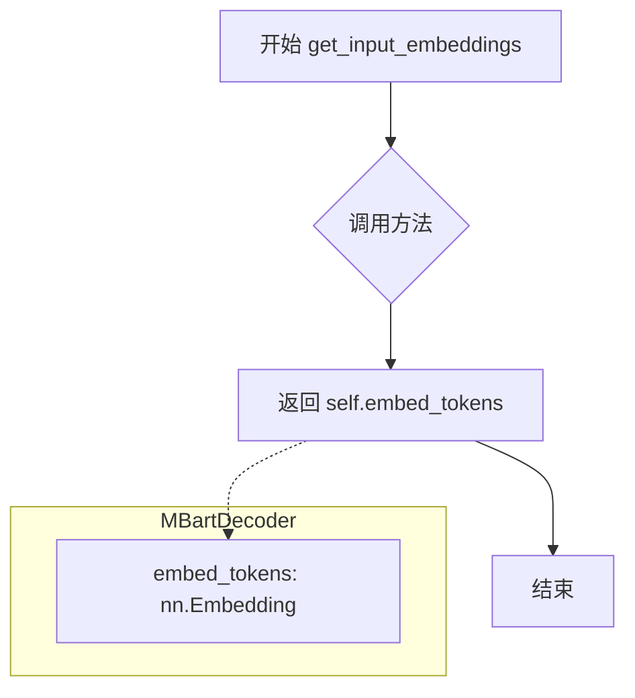

#### 带注释源码

```python
def get_input_embeddings(self):
    """
    获取解码器的输入嵌入层。
    
    该方法返回解码器中用于将输入token ID转换为嵌入向量的嵌入层。
    在MBartDecoder中，embed_tokens是一个nn.Embedding实例，
    负责将词汇表中的token索引映射为d_model维度的密集向量表示。
    
    Returns:
        nn.Embedding: 解码器的输入嵌入层（embed_tokens）
    """
    return self.embed_tokens
```


### `MBartDecoder.set_input_embeddings`

该方法用于设置 MBartDecoder 的输入嵌入层（embed_tokens），允许在模型初始化后替换或更新词嵌入矩阵。

参数：

- `value`：`nn.Embedding`，新的嵌入层对象，用于替换解码器的 `embed_tokens`

返回值：`None`，无返回值，仅执行属性赋值操作

#### 流程图

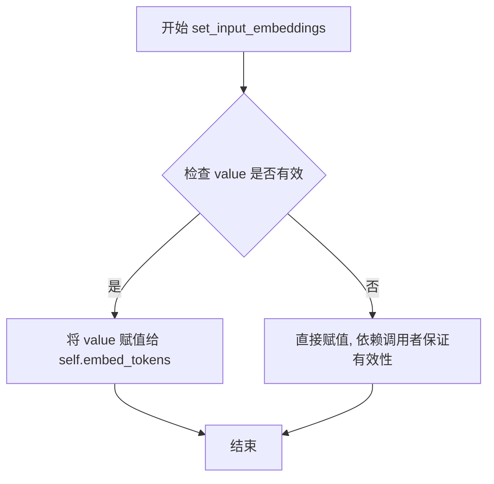

#### 带注释源码

```python
def set_input_embeddings(self, value):
    """
    设置解码器的输入嵌入层。
    
    该方法允许在模型构建完成后动态替换输入嵌入矩阵。
    主要用于:
    1. 加载预训练的嵌入权重
    2. 替换为不同大小的嵌入矩阵
    3. 共享编码器和解码器的嵌入权重
    
    Args:
        value (nn.Embedding): 新的嵌入层实例，必须与原始嵌入层具有相同的嵌入维度，
                              但可以有不同的词汇表大小（需要确保与模型其他部分兼容）
                              
    Returns:
        None
        
    Example:
        >>> # 获取当前嵌入
        >>> old_embeddings = decoder.get_input_embeddings()
        >>> # 设置新的嵌入层
        >>> decoder.set_input_embeddings(new_embedding_layer)
    """
    # 直接将传入的嵌入层赋值给 embed_tokens
    # PyTorch 会自动处理参数共享和梯度传递
    self.embed_tokens = value
```


### `MBartDecoder.forward`

该方法是 MBartDecoder 的核心前向传播方法，负责执行 Transformer 解码器的自回归解码过程。它接收输入 token ID 或嵌入，通过多层解码器层处理 hidden states，并返回解码后的隐藏状态、注意力权重以及用于加速解码的 past key values。

**参数：**

- `input_ids`：`Optional[torch.Tensor]`，输入的 token 序列 ID，形状为 `[batch_size, seq_len]`
- `attention_mask`：`Optional[torch.Tensor]`，注意力掩码，用于标识 padding 位置
- `encoder_hidden_states`：`Optional[torch.Tensor]`，编码器输出的隐藏状态，用于 cross-attention
- `encoder_attention_mask`：`Optional[torch.Tensor]`，编码器注意力掩码
- `head_mask`：`Optional[torch.Tensor]`，解码器自注意力头的掩码
- `cross_attn_head_mask`：`Optional[torch.Tensor]`，cross-attention 头的掩码
- `past_key_values`：`Optional[Tuple[Tuple[torch.Tensor]]]`，缓存的 key-value 对，用于加速自回归解码
- `inputs_embeds`：`Optional[torch.Tensor]`，直接输入的嵌入表示，替代 input_ids
- `use_cache`：`Optional[bool]`，是否缓存 key-value 对以加速解码
- `output_attentions`：`Optional[bool]`，是否输出所有层的注意力权重
- `output_hidden_states`：`Optional[bool]`，是否输出所有层的隐藏状态
- `return_dict`：`Optional[bool]`，是否返回字典格式的输出

**返回值：** `BaseModelOutputWithPastAndCrossAttentions` 或 `Tuple`，包含 last_hidden_state（最终隐藏状态）、past_key_values（缓存的 key-value）、hidden_states（所有层输出）、attentions（自注意力权重）、cross_attentions（cross 注意力权重）

#### 流程图

```mermaid
flowchart TD
    A[开始 forward] --> B{验证输入参数}
    B --> C{input_ids 和 inputs_embeds 互斥}
    C -->|提供 input_ids| D[获取 input_shape 并 reshape]
    C -->|提供 inputs_embeds| E[获取 input_shape]
    C -->|都未提供| F[抛出 ValueError]
    
    D --> G[计算 past_key_values_length]
    E --> G
    
    G --> H{inputs_embeds 为空?}
    H -->|是| I[通过 embed_tokens 获取 embeddings 并乘以 embed_scale]
    H -->|否| J[直接使用 inputs_embeds]
    
    I --> K{使用 flash_attention_2?}
    J --> K
    
    K -->|是| L[处理 attention_mask]
    K -->|否| M[调用 _prepare_4d_causal_attention_mask]
    
    L --> N{encoder_hidden_states 存在?}
    M --> N
    
    N -->|是| O[处理 encoder_attention_mask]
    N -->|否| P[获取位置嵌入 positions]
    
    O --> P
    
    P --> Q[hidden_states = inputs_embeds + positions]
    Q --> R[应用 layernorm_embedding 和 dropout]
    
    R --> S[初始化 all_hidden_states, all_self_attns, all_cross_attentions, next_decoder_cache]
    
    S --> T{验证 head_mask 维度}
    T --> U[遍历每一层 decoder_layer]
    
    U --> V{处于训练状态且启用梯度检查点?}
    V -->|是| W[使用 _gradient_checkpointing_func 调用层]
    V -->|否| X[直接调用 decoder_layer]
    
    W --> Y[更新 hidden_states]
    X --> Y
    
    Y --> Z{use_cache 为 true?}
    Z -->|是| AA[更新 next_decoder_cache]
    Z -->|否| AB[更新注意力权重]
    
    AA --> AB
    
    AB --> AC{还有更多层?}
    AC -->|是| U
    AC -->|否| AD[应用最终的 layer_norm]
    
    AD --> AE{output_hidden_states?}
    AE -->|是| AF[添加最后的 hidden_states]
    AE -->|否| AG{return_dict?}
    
    AF --> AG
    
    AG -->|是| AH[返回 BaseModelOutputWithPastAndCrossAttentions]
    AG -->|否| AI[返回 tuple]
    
    AH --> AK[结束]
    AI --> AK
```

#### 带注释源码

```python
def forward(
        self,
        input_ids=None,
        attention_mask=None,
        encoder_hidden_states=None,
        encoder_attention_mask=None,
        head_mask=None,
        cross_attn_head_mask=None,
        past_key_values=None,
        inputs_embeds=None,
        use_cache=None,
        output_attentions=None,
        output_hidden_states=None,
        return_dict=None,
):
    # 参数处理：如果未指定则使用配置中的默认值
    output_attentions = (
        output_attentions
        if output_attentions is not None
        else self.config.output_attentions
    )
    output_hidden_states = (
        output_hidden_states
        if output_hidden_states is not None
        else self.config.output_hidden_states
    )
    use_cache = use_cache if use_cache is not None else self.config.use_cache
    return_dict = (
        return_dict if return_dict is not None else self.config.use_return_dict
    )

    # 输入验证：input_ids 和 inputs_embeds 不能同时提供
    if input_ids is not None and inputs_embeds is not None:
        raise ValueError(
            "You cannot specify both decoder_input_ids and decoder_inputs_embeds at the same time"
        )
    elif input_ids is not None:
        # 获取输入并 reshape 为 2D
        input = input_ids
        input_shape = input.shape
        input_ids = input_ids.reshape([-1, input_shape[-1]])
    elif inputs_embeds is not None:
        # 使用 inputs_embeds 的形状
        input_shape = inputs_embeds.shape[:-1]
        input = inputs_embeds[:, :, -1]
    else:
        raise ValueError(
            "You have to specify either decoder_input_ids or decoder_inputs_embeds"
        )

    # 计算 past_key_values 的长度用于位置编码
    past_key_values_length = (
        past_key_values[0][0].shape[2] if past_key_values is not None else 0
    )

    # 如果没有提供 inputs_embeds，通过 embedding 层获取
    if inputs_embeds is None:
        inputs_embeds = self.embed_tokens(input_ids) * self.embed_scale

    # 根据是否使用 flash_attention_2 处理 attention_mask
    if self._use_flash_attention_2:
        attention_mask = (
            attention_mask
            if (attention_mask is not None and 0 in attention_mask)
            else None
        )
    else:
        # 准备 4D 因果注意力掩码
        attention_mask = _prepare_4d_causal_attention_mask(
            attention_mask,
            input_shape,
            inputs_embeds,
            past_key_values_length,
            is_export=self.is_export,
        )

    # 处理编码器隐藏状态和注意力掩码
    if encoder_hidden_states is not None and encoder_attention_mask is not None:
        if self._use_flash_attention_2:
            encoder_attention_mask = (
                encoder_attention_mask if 0 in encoder_attention_mask else None
            )
        else:
            encoder_attention_mask = _prepare_4d_attention_mask(
                encoder_attention_mask, inputs_embeds.dtype, tgt_len=input_shape[-1]
            )

    # 位置嵌入：将位置信息添加到输入嵌入中
    positions = self.embed_positions(input, past_key_values_length)

    # 合并位置嵌入和输入嵌入
    hidden_states = inputs_embeds + positions
    hidden_states = self.layernorm_embedding(hidden_states)

    # 应用 dropout
    hidden_states = nn.functional.dropout(
        hidden_states, p=self.dropout, training=self.training
    )

    # 梯度检查点与 use_cache 冲突检测
    if self.gradient_checkpointing and self.training:
        if use_cache:
            print(
                "`use_cache=True` is incompatible with gradient checkpointing`. Setting `use_cache=False`..."
            )
            use_cache = False

    # 初始化输出容器
    all_hidden_states = () if output_hidden_states else None
    all_self_attns = () if output_attentions else None
    all_cross_attentions = (
        () if (output_attentions and encoder_hidden_states is not None) else None
    )
    next_decoder_cache = () if use_cache else None

    # 验证 head_mask 的层数是否正确
    for attn_mask, mask_name in zip(
            [head_mask, cross_attn_head_mask], ["head_mask", "cross_attn_head_mask"]
    ):
        if attn_mask is not None:
            if attn_mask.shape[0] != len(self.layers):
                raise ValueError(
                    f"The `{mask_name}` should be specified for {len(self.layers)} layers, but it is for"
                    f" {attn_mask.shape[0]}."
                )

    # 遍历每个解码器层
    for idx, decoder_layer in enumerate(self.layers):
        # 如果输出隐藏状态则记录
        if output_hidden_states:
            all_hidden_states += (hidden_states,)
        
        # 训练时随机丢弃层（LayerDrop）
        if self.training:
            dropout_probability = torch.rand([])
            if dropout_probability < self.layerdrop:
                continue

        # 获取当前层的 past_key_value
        past_key_value = (
            past_key_values[idx] if past_key_values is not None else None
        )

        # 根据是否启用梯度检查点选择调用方式
        if self.gradient_checkpointing and self.training:
            layer_outputs = self._gradient_checkpointing_func(
                decoder_layer.__call__,
                hidden_states,
                attention_mask,
                encoder_hidden_states,
                encoder_attention_mask,
                head_mask[idx] if head_mask is not None else None,
                (
                    cross_attn_head_mask[idx]
                    if cross_attn_head_mask is not None
                    else None
                ),
                None,
                output_attentions,
                use_cache,
            )
        else:
            # 正常前向传播
            layer_outputs = decoder_layer(
                hidden_states,
                attention_mask=attention_mask,
                encoder_hidden_states=encoder_hidden_states,
                encoder_attention_mask=encoder_attention_mask,
                layer_head_mask=(head_mask[idx] if head_mask is not None else None),
                cross_attn_layer_head_mask=(
                    cross_attn_head_mask[idx]
                    if cross_attn_head_mask is not None
                    else None
                ),
                past_key_value=past_key_value,
                output_attentions=output_attentions,
                use_cache=use_cache,
            )
        
        # 更新 hidden_states
        hidden_states = layer_outputs[0]

        # 缓存 key-value 对用于后续解码
        if use_cache:
            next_decoder_cache += (layer_outputs[3 if output_attentions else 1],)

        # 记录注意力权重
        if output_attentions:
            all_self_attns += (layer_outputs[1],)

            if encoder_hidden_states is not None:
                all_cross_attentions += (layer_outputs[2],)

    # 最终的层归一化
    hidden_states = self.layer_norm(hidden_states)

    # 输出隐藏状态
    if output_hidden_states:
        all_hidden_states += (hidden_states,)

    # 处理缓存
    next_cache = next_decoder_cache if use_cache else None
    
    # 根据 return_dict 选择返回格式
    if not return_dict:
        return tuple(
            v
            for v in [
                hidden_states,
                next_cache,
                all_hidden_states,
                all_self_attns,
                all_cross_attentions,
            ]
            if v is not None
        )
    
    # 返回包含所有信息的对象
    return BaseModelOutputWithPastAndCrossAttentions(
        last_hidden_state=hidden_states,
        past_key_values=next_cache,
        hidden_states=all_hidden_states,
        attentions=all_self_attns,
        cross_attentions=all_cross_attentions,
    )
```


### `CustomMBartDecoder.forward`

覆盖 MBartDecoder，添加 count_pred 参数以支持计数上下文加权。该方法通过自定义的 `counting_context_weight` 层将计数预测融入隐藏状态，实现对解码器行为的增强。

参数：

- `input_ids`：`Optional[torch.Tensor]`，输入的 token ID 序列
- `attention_mask`：`Optional[torch.Tensor]`，注意力掩码，用于指示哪些位置是 padding
- `count_pred`：`Optional[torch.Tensor]`，来自计数解码器的预测结果，用于调整隐藏状态
- `encoder_hidden_states`：`Optional[torch.Tensor]`，编码器的输出隐藏状态
- `encoder_attention_mask`：`Optional[torch.Tensor]`，编码器注意力掩码
- `head_mask`：`Optional[torch.Tensor]`，解码器自注意力头掩码
- `cross_attn_head_mask`：`Optional[torch.Tensor]`，交叉注意力头掩码
- `past_key_values`：`Optional[Tuple[Tuple[torch.Tensor]]]`，用于缓存的过去键值对
- `inputs_embeds`：`Optional[torch.Tensor]`，输入的嵌入表示
- `use_cache`：`Optional[bool]`，是否使用缓存加速推理
- `output_attentions`：`Optional[bool]`，是否输出注意力权重
- `output_hidden_states`：`Optional[bool]`，是否输出所有隐藏状态
- `return_dict`：`Optional[bool]`，是否返回字典格式的输出

返回值：`BaseModelOutputWithPastAndCrossAttentions`，包含最后隐藏状态、过去键值、隐藏状态、注意力权重和交叉注意力权重的输出对象

#### 流程图

```mermaid
flowchart TD
    A[开始 forward] --> B{self.is_export 设置}
    B -->|训练模式| C[self.is_export = False]
    B -->|推理模式| D[self.is_export = True]
    C --> E[获取配置参数]
    D --> E
    E --> F{检查 input_ids 和 inputs_embeds}
    F -->|仅有 input_ids| G[计算 input_shape 并 reshape]
    F -->|仅有 inputs_embeds| H[获取 input_shape 和最后一个 token]
    F -->|两者都有| I[抛出 ValueError]
    G --> J[计算 past_key_values_length]
    H --> J
    J --> K{inputs_embeds 是否为空}
    K -->|是| L[embed_tokens(input_ids) * embed_scale]
    K -->|否| M[使用现有的 inputs_embeds]
    L --> N
    M --> N
    N --> O{使用 Flash Attention}
    O -->|是| P[处理 attention_mask]
    O -->|否| Q[调用 _prepare_4d_causal_attention_mask 或 _prepare_4d_causal_attention_mask_export]
    P --> R
    Q --> R
    R --> S[计算位置嵌入 positions]
    T --> U[添加位置嵌入到 hidden_states]
    U --> V{count_pred 是否存在}
    V -->|是| W[计算 count_context_weight]
    W --> X[hidden_states = hidden_states + 0.5 * count_context_weight]
    V -->|否| Y[跳过计数上下文加权]
    X --> Z
    Y --> Z
    Z --> AA[应用 layernorm_embedding 和 dropout]
    AA --> BB{启用梯度检查点}
    BB -->|是| CC[检查 use_cache 并可能禁用]
    BB -->|否| DD[继续]
    CC --> EE[遍历解码器层]
    DD --> EE
    EE --> FF[执行 decoder_layer]
    FF --> GG[更新 hidden_states 和缓存]
    GG --> HH{output_attentions}
    HH -->|是| II[收集注意力权重]
    HH -->|否| JJ
    II --> JJ
    JJ --> KK[应用最终的 layer_norm]
    KK --> LL[构建输出]
    LL --> MM{return_dict}
    MM -->|是| NN[返回 BaseModelOutputWithPastAndCrossAttentions]
    MM -->|否| OO[返回元组]
    NN --> PP[结束]
    OO --> PP
```

#### 带注释源码

```python
def forward(
        self,
        input_ids=None,
        attention_mask=None,
        count_pred=None,
        encoder_hidden_states=None,
        encoder_attention_mask=None,
        head_mask=None,
        cross_attn_head_mask=None,
        past_key_values=None,
        inputs_embeds=None,
        use_cache=None,
        output_attentions=None,
        output_hidden_states=None,
        return_dict=None,
):
    # 根据训练/推理模式设置导出标志
    self.is_export = False if self.training else True
    
    # 获取输出配置参数，优先使用传入值，否则使用配置默认值
    output_attentions = (
        output_attentions
        if output_attentions is not None
        else self.config.output_attentions
    )
    output_hidden_states = (
        output_hidden_states
        if output_hidden_states is not None
        else self.config.output_hidden_states
    )
    use_cache = use_cache if use_cache is not None else self.config.use_cache
    return_dict = (
        return_dict if return_dict is not None else self.config.use_return_dict
    )

    # 验证输入参数：input_ids 和 inputs_embeds 不能同时指定
    if input_ids is not None and inputs_embeds is not None:
        raise ValueError(
            "You cannot specify both decoder_input_ids and decoder_inputs_embeds at the same time"
        )
    elif input_ids is not None:
        # 处理 input_ids：保存原始输入并 reshape
        input = input_ids
        input_shape = input.shape
        input_ids = input_ids.reshape([-1, input_shape[-1]])
    elif inputs_embeds is not None:
        # 处理 inputs_embeds：获取除最后一个维度外的形状
        input_shape = inputs_embeds.shape[:-1]
        input = inputs_embeds[:, :, -1]
    else:
        raise ValueError(
            "You have to specify either decoder_input_ids or decoder_inputs_embeds"
        )

    # 计算过去的 key-value 长度，用于处理缓存
    past_key_values_length = (
        past_key_values[0][0].shape[2] if past_key_values is not None else 0
    )

    # 如果没有提供嵌入，则使用 embedding 层将 input_ids 转换为嵌入并缩放
    if inputs_embeds is None:
        inputs_embeds = self.embed_tokens(input_ids) * self.embed_scale

    # 根据是否使用 Flash Attention 2 处理注意力掩码
    if self._use_flash_attention_2:
        attention_mask = (
            attention_mask
            if (attention_mask is not None and 0 in attention_mask)
            else None
        )
    else:
        # 根据导出模式选择不同的注意力掩码准备函数
        if self.is_export:
            attention_mask = _prepare_4d_causal_attention_mask_export(
                attention_mask,
                input_shape,
                inputs_embeds,
                past_key_values_length,
                is_export=self.is_export,
            ).to(torch.float32)
        else:
            attention_mask = _prepare_4d_causal_attention_mask(
                attention_mask,
                input_shape,
                inputs_embeds,
                past_key_values_length,
                is_export=self.is_export,
            )

    # 处理编码器隐藏状态和编码器注意力掩码
    if encoder_hidden_states is not None and encoder_attention_mask is not None:
        if self._use_flash_attention_2:
            encoder_attention_mask = (
                encoder_attention_mask if 0 in encoder_attention_mask else None
            )
        else:
            encoder_attention_mask = _prepare_4d_attention_mask(
                encoder_attention_mask, inputs_embeds.dtype, tgt_len=input_shape[-1]
            )

    # 嵌入位置信息并添加到 hidden_states
    positions = self.embed_positions(input, past_key_values_length)

    hidden_states = inputs_embeds + positions

    # TODO: 添加计数上下文权重到 hidden_states
    # 如果提供了 count_pred，则通过计数上下文权重层处理并添加到 hidden_states
    if count_pred is not None:
        count_context_weight = self.counting_context_weight(count_pred)
        hidden_states = hidden_states + 0.5 * count_context_weight.unsqueeze(1)

    # 应用层归一化和 dropout
    hidden_states = self.layernorm_embedding(hidden_states)
    hidden_states = nn.functional.dropout(
        hidden_states, p=self.dropout, training=self.training
    )

    # 梯度检查点：如果启用且在训练模式下，禁用 use_cache
    if self.gradient_checkpointing and self.training:
        if use_cache:
            print(
                "`use_cache=True` is incompatible with gradient checkpointing`. Setting `use_cache=False`..."
            )
            use_cache = False

    # 初始化输出变量
    all_hidden_states = () if output_hidden_states else None
    all_self_attns = () if output_attentions else None
    all_cross_attentions = (
        () if (output_attentions and encoder_hidden_states is not None) else None
    )
    next_decoder_cache = () if use_cache else None

    # 验证 head_mask 和 cross_attn_head_mask 的层数是否正确
    for attn_mask, mask_name in zip(
            [head_mask, cross_attn_head_mask], ["head_mask", "cross_attn_head_mask"]
    ):
        if attn_mask is not None:
            if attn_mask.size()[0] != len(self.layers):
                raise ValueError(
                    f"The `{mask_name}` should be specified for {len(self.layers)} layers, but it is for"
                    f" {attn_mask.size()[0]}."
                )

    # 遍历每个解码器层
    for idx, decoder_layer in enumerate(self.layers):
        if output_hidden_states:
            all_hidden_states += (hidden_states,)
        
        # 训练时根据 layerdrop 概率决定是否跳过该层
        if self.training:
            dropout_probability = torch.rand()
            if dropout_probability < self.layerdrop:
                continue

        # 获取当前层的 past_key_value
        past_key_value = (
            past_key_values[idx] if past_key_values is not None else None
        )

        # 根据是否使用梯度检查点选择不同的前向传播方式
        if self.gradient_checkpointing and self.training:
            layer_outputs = self._gradient_checkpointing_func(
                decoder_layer.__call__,
                hidden_states,
                attention_mask,
                encoder_hidden_states,
                encoder_attention_mask,
                head_mask[idx] if head_mask is not None else None,
                (
                    cross_attn_head_mask[idx]
                    if cross_attn_head_mask is not None
                    else None
                ),
                None,
                output_attentions,
                use_cache,
            )
        else:
            layer_outputs = decoder_layer(
                hidden_states,
                attention_mask=attention_mask,
                encoder_hidden_states=encoder_hidden_states,
                encoder_attention_mask=encoder_attention_mask,
                layer_head_mask=(head_mask[idx] if head_mask is not None else None),
                cross_attn_layer_head_mask=(
                    cross_attn_head_mask[idx]
                    if cross_attn_head_mask is not None
                    else None
                ),
                past_key_value=past_key_value,
                output_attentions=output_attentions,
                use_cache=use_cache,
            )
        
        # 更新 hidden_states
        hidden_states = layer_outputs[0]
        
        # 更新缓存
        if self.is_export:
            next_decoder_cache += (layer_outputs[3 if output_attentions else 1],)
        else:
            if use_cache:
                next_decoder_cache += (
                    layer_outputs[3 if output_attentions else 1],
                )

        # 收集注意力权重
        if output_attentions:
            all_self_attns += (layer_outputs[1],)

            if encoder_hidden_states is not None:
                all_cross_attentions += (layer_outputs[2],)

    # 应用最终的层归一化
    hidden_states = self.layer_norm(hidden_states)

    # 收集最后的隐藏状态
    if output_hidden_states:
        all_hidden_states += (hidden_states,)
    
    # 根据导出模式设置 next_cache
    if self.is_export:
        next_cache = next_decoder_cache
    else:
        next_cache = next_decoder_cache if use_cache else None
    
    # 根据 return_dict 决定返回格式
    if not self.is_export:
        if not return_dict:
            return tuple(
                v
                for v in [
                    hidden_states,
                    next_cache,
                    all_hidden_states,
                    all_self_attns,
                    all_cross_attentions,
                ]
                if v is not None
            )
    
    # 返回 BaseModelOutputWithPastAndCrossAttentions 对象
    return BaseModelOutputWithPastAndCrossAttentions(
        last_hidden_state=hidden_states,
        past_key_values=next_cache,
        hidden_states=all_hidden_states,
        attentions=all_self_attns,
        cross_attentions=all_cross_attentions,
    )
```


### `SeqCountingDecoder.forward`

该方法是序列计数解码器的前向传播函数，通过多头自注意力块处理输入序列，然后经过全连接层和全局平均池化，最终输出序列的计数预测结果。

参数：

- `x`：`torch.Tensor`，输入张量，形状为 `(batch_size, seq_len, in_features)`，表示输入序列的特征表示

返回值：`torch.Tensor`，返回预测的计数值，形状为 `(batch_size, out_features)`

#### 流程图

```mermaid
flowchart TD
    A[输入 x: batch_size × seq_len × in_features] --> B[遍历注意力块]
    B --> C[block(x) 自注意力处理]
    C --> B
    B --> D[fc1: Linear in_features → in_features//2]
    D --> E[ReLU 激活]
    E --> F[transpose: 调整维度顺序]
    F --> G[AdaptiveAvgPool1d 全局平均池化]
    G --> H[squeeze 压缩维度]
    H --> I[fc2: Linear in_features//2 → out_features]
    I --> J[输出: batch_size × out_features]
```

#### 带注释源码

```python
def forward(self, x):
    """
    SeqCountingDecoder的前向传播方法
    
    处理流程：
    1. 通过多个自注意力块处理输入序列
    2. 通过全连接层进行特征变换
    3. 通过全局平均池化将序列维度压缩
    4. 输出最终的计数预测
    
    参数:
        x: 输入张量，形状为 (batch_size, seq_len, in_features)
        
    返回:
        输出张量，形状为 (batch_size, out_features)
    """
    # 1. 遍历所有自注意力块，依次处理输入
    for block in self.attention_blocks:
        x = block(x)
    
    # 2. 第一个全连接层：将特征维度从 in_features 降到 in_features//2
    x = self.fc1(x)
    
    # 3. ReLU 激活函数，增加非线性
    x = self.relu(x)
    
    # 4. 调整维度顺序：将 (batch, seq, features) 转为 (batch, features, seq)
    # 为全局平均池化做准备
    x = x.transpose([0, 2, 1])
    
    # 5. 全局平均池化：将序列维度池化为1
    x = self.global_avg_pool(x)
    
    # 6. 压缩最后一维，去除冗余维度
    x = x.squeeze(-1)
    
    # 7. 第二个全连接层：将特征维度从 in_features//2 映射到 out_features
    x = self.fc2(x)
    
    return x
```


### `CustomMBartForCausalLM.forward`

该方法是自定义MBART因果语言模型的前向传播函数，扩展了标准的MBartForCausalLM，通过集成自定义解码器（CustomMBartDecoder）和序列计数解码器（SeqCountingDecoder）实现了长度感知的因果语言建模功能。

参数：

- `input_ids`：`torch.Tensor`，输入序列的token ID
- `attention_mask`：`torch.Tensor`，注意力掩码，用于指示哪些位置是padding
- `encoder_hidden_states`：`torch.Tensor`，编码器的输出隐藏状态
- `encoder_attention_mask`：`torch.Tensor`，编码器注意力掩码
- `head_mask`：`torch.Tensor`，多头注意力中各头的掩码
- `cross_attn_head_mask`：`torch.Tensor`，跨注意力头的掩码
- `past_key_values`：`Optional[Tuple[Tuple[torch.Tensor]]]`，用于加速解码的缓存键值对
- `inputs_embeds`：`Optional[torch.Tensor]`，输入的嵌入表示
- `labels`：`Optional[torch.Tensor]`，用于计算语言模型损失的标签
- `use_cache`：`Optional[bool]`，是否使用缓存加速解码
- `output_attentions`：`Optional[bool]`，是否输出注意力权重
- `output_hidden_states`：`Optional[bool]`，是否输出所有隐藏状态
- `return_dict`：`Optional[bool]`，是否返回字典格式的输出
- `count_gt`：`Optional[torch.Tensor]`，计数的ground truth（可选）

返回值：`CausalLMOutputWithCrossAttentionsAndCounting`，包含logits、计数预测、过去键值、隐藏状态、注意力权重和跨注意力权重的对象

#### 流程图

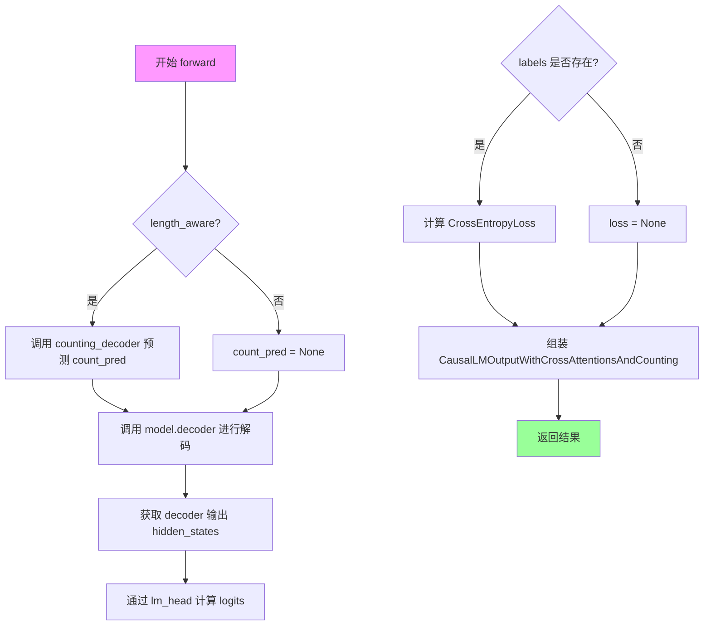

#### 带注释源码

```python
def forward(
        self,
        input_ids=None,
        attention_mask=None,
        encoder_hidden_states=None,
        encoder_attention_mask=None,
        head_mask=None,
        cross_attn_head_mask=None,
        past_key_values=None,
        inputs_embeds=None,
        labels=None,
        use_cache=None,
        output_attentions=None,
        output_hidden_states=None,
        return_dict=None,
        count_gt=None,
):
    """
    Custom MBartForCausalLM 的前向传播方法
    
    参数:
        input_ids: 输入token IDs
        attention_mask: 注意力掩码
        encoder_hidden_states: 编码器隐藏状态
        encoder_attention_mask: 编码器注意力掩码
        head_mask: 注意力头掩码
        cross_attn_head_mask: 跨注意力头掩码
        past_key_values: 缓存的key-value对
        inputs_embeds: 输入嵌入
        labels: 标签用于计算损失
        use_cache: 是否使用缓存
        output_attentions: 是否输出注意力
        output_hidden_states: 是否输出隐藏状态
        return_dict: 是否返回字典格式
        count_gt: 计数的ground truth
    """
    # 获取输出配置参数，如果未指定则使用模型配置中的默认值
    output_attentions = (
        output_attentions
        if output_attentions is not None
        else self.config.output_attentions
    )
    output_hidden_states = (
        output_hidden_states
        if output_hidden_states is not None
        else self.config.output_hidden_states
    )
    return_dict = (
        return_dict if return_dict is not None else self.config.use_return_dict
    )

    # 根据 length_aware 标志决定是否使用计数解码器预测序列长度相关特征
    if self.length_aware:
        # 使用 counting_decoder 对 encoder_hidden_states 进行处理得到计数预测
        count_pred = self.counting_decoder(encoder_hidden_states)
    else:
        count_pred = None

    # 将输入传递给自定义解码器进行处理
    # 解码器会接收 count_pred 用于调节隐藏状态
    outputs = self.model.decoder(
        input_ids=input_ids,
        attention_mask=attention_mask,
        count_pred=count_pred,  # 传入计数预测用于上下文调节
        encoder_hidden_states=encoder_hidden_states,
        encoder_attention_mask=encoder_attention_mask,
        head_mask=head_mask,
        cross_attn_head_mask=cross_attn_head_mask,
        past_key_values=past_key_values,
        inputs_embeds=inputs_embeds,
        use_cache=use_cache,
        output_attentions=output_attentions,
        output_hidden_states=output_hidden_states,
        return_dict=return_dict,
    )
    
    # 使用线性层将解码器输出转换为词汇表大小的logits
    logits = self.lm_head(outputs[0])

    # 如果提供了标签，则计算交叉熵损失
    # 注意：这里 labels 被直接使用，未做进一步的mask处理
    if labels is not None:
        labels = labels
        loss_fct = CrossEntropyLoss()
        loss = loss_fct(
            logits.reshape([-1, self.config.vocab_size]), labels.reshape([-1])
        )

    # 根据 return_dict 决定返回格式
    if not return_dict:
        output = (logits,) + outputs[1:]
        return (loss,) + output if loss is not None else output

    # 返回包含损失、logits、计数预测、past_key_values、隐藏状态、注意力权重和跨注意力的对象
    return CausalLMOutputWithCrossAttentionsAndCounting(
        logits=logits,
        counting=count_pred,
        past_key_values=outputs.past_key_values,
        hidden_states=outputs.hidden_states,
        attentions=outputs.attentions,
        cross_attentions=outputs.cross_attentions,
    )
```


### `CustomMBartForCausalLM.get_decoder`

该方法继承自父类 `MBartForCausalLM`，用于获取自定义 MBart 因果语言模型的解码器组件。它允许外部访问内部包装的 `MBartDecoder` 或 `CustomMBartDecoder` 实例，以便进行进一步的检查、修改或与其他组件集成。

参数：无需参数

返回值：`nn.Module`，返回模型中的解码器模块（`self.model.decoder`），类型为 `MBartDecoder` 或其子类 `CustomMBartDecoder`。

#### 流程图

```mermaid
flowchart TD
    A[调用 get_decoder 方法] --> B{返回 self.model.decoder}
    B --> C[获取 MBartDecoder 实例]
```

#### 带注释源码

```python
def get_decoder(self):
    """
    获取模型的解码器组件。
    
    该方法返回内部模型包装对象中的解码器模块，使外部能够
    访问或修改解码器的配置、权重等。
    
    Returns:
        nn.Module: 解码器模块实例
    """
    return self.model.decoder
```


### `CustomMBartForCausalLM.prepare_inputs_for_generation`

该方法是 `MBartForCausalLM` 类中用于在自回归生成过程中准备输入数据的函数。它处理注意力掩码的生成，并根据已缓存的过去键值（past_key_values）来裁剪输入序列，以实现高效的增量推理。

参数：

- `self`：实例本身（`CustomMBartForCausalLM`），隐式参数无需显式传递。
- `input_ids`：`torch.Tensor`，当前生成步骤的输入 token ID 序列。
- `past_key_values`：`Optional[Tuple[Tuple[torch.Tensor]]]`，可选参数，表示用于增量解码的过去键值缓存（元组形式，每层包含 k/v 状态）。
- `attention_mask`：`Optional[torch.Tensor]`，可选参数，表示输入的注意力掩码。
- `use_cache`：`Optional[bool]`，可选参数，指示是否使用 past_key_values 缓存进行快速解码。
- `**kwargs`：任意关键字参数，用于接收其他可能的配置参数（如 encoder_outputs 等）。

返回值：`Dict[str, Any]`，返回一个字典，包含准备好的以下键值：
- `input_ids`：裁剪后的输入 ID。
- `attention_mask`：注意力掩码（与 input_ids 形状匹配）。
- `past_key_values`：未经修改的过去键值（若有）。
- `use_cache`：是否使用缓存的标志。

#### 流程图

```mermaid
flowchart TD
    A[开始 prepare_inputs_for_generation] --> B{attention_mask 是否为 None?}
    B -->|是| C[创建全1注意力掩码<br/>input_ids.new_ones(input_ids.shape)]
    B -->|否| D[保持原 attention_mask]
    C --> E{past_key_values 是否存在?}
    D --> E
    E -->|是| F[计算 past_length<br/>past_key_values[0][0].shape[2]]
    E -->|否| H[跳过裁剪步骤]
    F --> G{input_ids 序列长度 > past_length?}
    G -->|是| I[remove_prefix_length = past_length]
    G -->|否| J[remove_prefix_length = input_ids.shape[1] - 1]
    I --> K[裁剪 input_ids<br/>input_ids[:, remove_prefix_length:]
    J --> K
    H --> L[构建返回字典]
    K --> L
    L --> M[返回包含 input_ids/attention_mask<br/>past_key_values/use_cache 的字典]
    M --> N[结束]
```

#### 带注释源码

```python
def prepare_inputs_for_generation(
        self,
        input_ids,
        past_key_values=None,
        attention_mask=None,
        use_cache=None,
        **kwargs,
):
    """
    为自回归生成准备输入数据。

    该方法在每个生成步骤被调用，用于：
    1. 如果未提供注意力掩码，则创建一个全1掩码（表示所有位置都应被关注）
    2. 如果存在过去的键值缓存（past_key_values），则根据缓存长度裁剪输入序列，
       去除已处理的前缀 tokens，避免重复计算

    参数:
        input_ids: 当前输入的 token ID 序列，形状为 (batch_size, seq_len)
        past_key_values: 可选的过去键值缓存，用于增量解码
        attention_mask: 可选的注意力掩码
        use_cache: 是否使用缓存进行快速解码
        **kwargs: 其他可选参数（如 encoder_outputs 等）

    返回:
        包含处理后的输入的字典，用于下一个生成步骤
    """
    # Step 1: 处理 attention_mask
    # 如果未提供注意力掩码，则创建一个与 input_ids 形状相同的全1掩码
    # 表示所有 token 位置都是有效的（无padding）
    if attention_mask is None:
        attention_mask = input_ids.new_ones(input_ids.shape)

    # Step 2: 处理 past_key_values（用于增量解码/KV Cache）
    # 当使用 KV Cache 时，过去已经计算过的 key/value 会被缓存，
    # 此时只需要处理新生成的 token，无需重新计算整个序列的注意力
    if past_key_values:
        # 获取过去缓存的序列长度
        past_length = past_key_values[0][0].shape[2]

        # 计算需要保留的输入长度
        # 如果当前输入序列长度大于过去缓存长度，则去除已缓存的前缀部分
        # 否则（理论上很少见），只保留最后一个 token
        if input_ids.shape[1] > past_length:
            remove_prefix_length = past_length
        else:
            remove_prefix_length = input_ids.shape[1] - 1

        # 裁剪 input_ids，去除已经包含在 past_key_values 中的前缀
        # 这一步确保输入只包含"新"生成的 token
        input_ids = input_ids[:, remove_prefix_length:]

    # Step 3: 构建返回字典
    # 将处理后的参数返回，供模型 forward 使用
    return {
        "input_ids": input_ids,
        "attention_mask": attention_mask,
        "past_key_values": past_key_values,
        "use_cache": use_cache,
    }
```


### `UniMERNetHead.forward`

UniMERNetHead的前向传播方法，负责在训练和推理两种模式下处理输入数据。训练模式下返回logits、计数预测和掩码标签；推理模式下调用generate或generate_export方法生成预测的LaTeX代码序列。

参数：

- `inputs`：输入数据，在推理时为encoder_outputs（编码器输出），在训练时为包含encoder_outputs、目标序列和掩码的元组
- `targets`：目标标签，仅在训练时使用，默认为None

返回值：`torch.Tensor` 或 Tuple，在推理时返回预测的LaTeX代码序列（word_pred），在训练时返回(logits, count_pred, masked_labels)元组

#### 流程图

```mermaid
flowchart TD
    A[forward方法入口] --> B{self.training?}
    B -->|True 训练模式| C[从inputs解包: encoder_outputs, tgt_seq, mask]
    B -->|False 推理模式| D{self.is_export?}
    
    C --> E[调用forwad_train方法]
    E --> F[返回logits, count_pred, masked_labels]
    
    D -->|True 导出模式| G[构建model_kwargs]
    G --> H[调用generate_export方法]
    H --> I[返回word_pred]
    
    D -->|False 推理模式| J[构建model_kwargs包含encoder_outputs]
    J --> K[调用generate方法]
    K --> I
    
    F --> L[返回结果]
    I --> L
    
    style A fill:#f9f,color:#333
    style L fill:#9f9,color:#333
```

#### 带注释源码

```python
def forward(self, inputs, targets=None):
    """
    Forward pass for the UniMERNetHead, handling both training and inference.

    Args:
        inputs: The input data, which can vary based on training or inference.
        targets: The target labels, used only during training.

    Returns:
        During inference: Returns predicted latex code.
        During training: Returns logits, predicted counts, and masked labels.
    """
    # 根据训练状态设置导出标志：训练时为False，推理时为True
    self.is_export = False if self.training else True
    
    # 判断当前是训练模式还是推理模式
    if not self.training:
        # ==================== 推理模式 ====================
        encoder_outputs = inputs  # 推理时inputs直接就是encoder_outputs
        
        if self.is_export:
            # 导出模式：构建导出用的model_kwargs（不包含encoder_outputs）
            model_kwargs = {
                "output_attentions": False,
                "output_hidden_states": False,
                "use_cache": True,
            }
            # 调用导出版本的生成方法
            word_pred = self.generate_export(encoder_outputs, model_kwargs)
        else:
            # 正常推理模式：构建包含encoder_outputs的model_kwargs
            model_kwargs = {
                "output_attentions": False,
                "output_hidden_states": False,
                "use_cache": True,
                "encoder_outputs": encoder_outputs,  # 传入编码器输出
            }
            # 调用标准生成方法
            word_pred = self.generate(model_kwargs)

        return word_pred  # 返回预测的LaTeX代码序列

    # ==================== 训练模式 ====================
    # 解包训练输入：encoder_outputs, 目标序列, 掩码
    encoder_outputs, tgt_seq, mask = inputs
    
    # 调用训练方法（注意：方法名有拼写错误 forwad_train 而非 forward_train）
    logits, count_pred, masked_labels = self.forwad_train(
        encoder_outputs, tgt_seq, mask
    )
    
    # 返回logits, 计数预测, 掩码后的标签
    return logits, count_pred, masked_labels
```


### `UniMERNetHead.generate`

该方法是 UniMERNetHead 类的核心推理方法，负责根据编码器输出生成完整的序列（主要用于推理任务）。该方法实现了自回归生成逻辑，通过逐步预测下一个 token 来生成序列，支持多种生成策略（如贪婪搜索），并在每一步使用 logits 处理器来处理特殊 token（如强制 EOS）。

参数：

- `self`：`UniMERNetHead`，UniMERNetHead 类的实例，隐式参数
- `model_kwargs`：`Dict[str, Any]`，模型配置和输入的字典，通常包含：
  - `encoder_outputs`：编码器的输出
  - `use_cache`：是否使用缓存的布尔标志
  - `output_attentions`：是否输出注意力分数的布尔标志
  - `output_hidden_states`：是否输出隐藏状态的布尔标志
  - `inputs_embeds`：可选的输入嵌入
  - `key use_cache`：缓存键的标志

返回值：`Tensor`，包含生成的序列

#### 流程图

```mermaid
flowchart TD
    A[开始 generate] --> B[从 model_kwargs 获取 batch_size]
    B --> C[准备 decoder_input_ids 和 model_kwargs]
    C --> D[设置 max_seq_len 和其他生成参数]
    D --> E[初始化未完成序列标记]
    E --> F{idx < max_seq_len?}
    F -->|是| G[准备模型输入 prepare_inputs_for_generation]
    G --> H[调用 generate_single_iter 生成当前步的输出]
    H --> I[获取下一个 token 的 logits]
    I --> J[通过 logits_processor 处理 logits]
    J --> K[argmax 获取 next_tokens]
    K --> L[处理 EOS 和 padding token]
    L --> M[将 next_tokens 拼接到 input_ids]
    M --> N[更新 model_kwargs]
    N --> O{检查 stopping_criteria}
    O -->|未完成| P[检查是否所有序列都完成]
    P -->|否| F
    P -->|是| Q[break]
    O -->|已完成| P
    Q --> R[返回生成的 input_ids]
    F -->|否| R
```

#### 带注释源码

```python
@torch.no_grad()
def generate(
        self,
        model_kwargs,
):
    """
    Generate sequences using the UniMERNetHead for inference tasks.

    Args:
        model_kwargs (dict): A dictionary of model configurations and inputs, which typically include:
            - encoder_outputs: Outputs from the encoder.
            - use_cache: Boolean flag to indicate if caching should be used.
            - output_attentions: Boolean flag for outputting attention scores.
            - output_hidden_states: Boolean flag for outputting hidden states.

    Returns:
        A tensor containing the generated sequences.
    """
    # 从 model_kwargs 中提取编码器输出的最后一个隐藏状态，获取批次大小
    batch_size = model_kwargs["encoder_outputs"]["last_hidden_state"].shape[0]
    
    # 定义生成配置，包括解码器起始 token ID 和起始 token ID
    generation_config = {
        "decoder_start_token_id": 0,
        "bos_token_id": 0,
    }
    
    # 准备解码器的输入 ID，初始化为起始 token
    input_ids, model_kwargs = self._prepare_decoder_input_ids_for_generation(
        batch_size=batch_size,
        model_kwargs=model_kwargs,
        decoder_start_token_id=generation_config["decoder_start_token_id"],
        bos_token_id=generation_config["bos_token_id"],
    )
    
    # 设置使用缓存标志为 True
    model_kwargs["key use_cache"] = True
    
    # 获取当前序列的批次大小和长度
    batch_size, cur_len = input_ids.shape

    # 如果模型输入是嵌入形式，更新当前长度
    if "inputs_embeds" in model_kwargs:
        cur_len = model_kwargs["inputs_embeds"].shape[1]
    
    # 设置缓存位置
    model_kwargs["cache_position"] = torch.arange(cur_len)
    
    # 获取 padding token ID 和 EOS token ID
    pad_token_id = self.pad_token_id
    eos_token_id = [self.eos_token_id]
    eos_token = self.eos_token_id
    
    # 初始化未完成序列标记，所有序列初始为未完成状态（1 表示未完成）
    unfinished_sequences = torch.ones(batch_size, dtype=torch.int64)
    
    # 迭代生成序列，最大长度为 max_seq_len
    for idx in range(self.max_seq_len):
        # 准备当前步的模型输入
        model_inputs = self.prepare_inputs_for_generation(input_ids, **model_kwargs)
        
        # 调用单步生成方法获取输出
        outputs = self.generate_single_iter(
            **model_inputs,
            return_dict=True,
            output_attentions=False,
            output_hidden_states=False,
        )
        
        # 获取最后一个位置的 logits（预测下一个 token）
        next_token_logits = outputs.logits[:, -1, :]

        # 通过 logits 处理器处理 logits（如强制 EOS）
        next_tokens_scores = self.logits_processor(input_ids, next_token_logits)
        
        # 贪婪搜索：选择概率最高的 token
        next_tokens = torch.argmax(next_tokens_scores, dim=-1)
        
        # 如果定义了 EOS token ID，处理未完成的序列
        if eos_token_id is not None:
            if pad_token_id is None:
                raise ValueError(
                    "If `eos_token_id` is defined, make sure that `pad_token_id` is defined."
                )
            # 将已完成的序列位置替换为 padding token
            next_tokens = next_tokens * unfinished_sequences + pad_token_id * (
                    1 - unfinished_sequences
            )
        
        # 将预测的 token 拼接到输入序列
        input_ids = torch.concat([input_ids, next_tokens[:, None]], dim=-1)
        
        # 更新 model_kwargs 中的 past_key_values
        model_kwargs = self._update_model_kwargs_for_generation(
            outputs,
            model_kwargs,
            is_encoder_decoder=self.config_decoder.is_encoder_decoder,
        )
        
        # 更新未完成序列标记，检查是否遇到 EOS token
        unfinished_sequences = unfinished_sequences & ~self.stopping_criteria(
            input_ids
        ).to(torch.int64)

        # 检查是否所有序列都已完成（遇到 EOS token）
        if (
                eos_token is not None
                and (
                torch.cumsum((input_ids == eos_token).to(torch.int64), 1)[:, -1]
                >= 1
        ).all()
        ):
            break

    # 返回生成的序列
    return input_ids
```


### `UniMERNetHead.generate_export`

该方法是 UniMERNetHead 类的推理导出方法，专门用于在模型导出场景下执行自回归文本生成。它接收编码器输出和模型配置参数，通过初始化解码器输入、预分配缓存空间，然后进入自回归循环逐步生成token，直至达到最大序列长度或遇到EOS终止符，最后返回生成的完整序列。

参数：

- `self`：类实例本身，包含模型配置和解码器。
- `encoder_outputs`：字典类型，包含编码器的输出，通常包含 `last_hidden_state`，表示编码后的序列表示。
- `model_kwargs`：字典类型，模型的其他配置参数，如 `output_attentions`、`output_hidden_states`、`use_cache` 等。

返回值：`Tensor` 类型，返回生成的 token 序列，形状为 `[batch_size, seq_len]`。

#### 流程图

```mermaid
flowchart TD
    A[开始 generate_export] --> B[获取 batch_size]
    B --> C[准备解码器输入 IDs]
    C --> D[重塑 input_ids 和初始化]
    D --> E[初始化 past_key_values 缓存]
    E --> F{检查 i_idx < max_seq_len}
    F -->|Yes| G[准备解码器输入]
    G --> H[执行单步生成]
    H --> I[获取下一个 token 的 logits]
    I --> J[使用 logits_processor 处理]
    J --> K[argmax 获取下一个 token]
    K --> L[更新序列和缓存]
    L --> M{检查是否完成生成}
    M -->|No| F
    M -->|Yes| N[返回生成的序列]
    F -->|No| N
```

#### 带注释源码

```python
@torch.no_grad()
def generate_export(
        self,
        encoder_outputs,
        model_kwargs,
):
    """
    在导出模式下生成序列的自回归推理方法。
    该方法专门为模型导出场景优化，使用预分配的缓存空间。
    
    Args:
        encoder_outputs: 编码器输出，包含 last_hidden_state
        model_kwargs: 包含生成配置的字典
    
    Returns:
        生成的 token 序列张量
    """
    # 从编码器输出获取批次大小
    batch_size = encoder_outputs["last_hidden_state"].shape[0]
    
    # 定义生成配置：解码器起始token ID和起始token ID
    generation_config = {
        "decoder_start_token_id": 0,
        "bos_token_id": 0,
    }
    
    # 准备解码器输入的初始 IDs
    input_ids, model_kwargs = self._prepare_decoder_input_ids_for_generation(
        batch_size=batch_size,
        model_kwargs=model_kwargs,
        decoder_start_token_id=generation_config["decoder_start_token_id"],
        bos_token_id=generation_config["bos_token_id"],
    )
    
    # 将 input_ids 重塑为 [-1, 1] 形状
    input_ids = input_ids.reshape([-1, 1])
    decoder_input_ids = input_ids
    
    # 设置使用缓存标志
    model_kwargs["key use_cache"] = True
    
    # 获取当前序列长度
    batch_size, cur_len = input_ids.shape

    # 如果有 inputs_embeds，则更新 cur_len
    if "inputs_embeds" in model_kwargs:
        cur_len = model_kwargs["inputs_embeds"].shape[1]
    
    # 初始化缓存位置
    cache_position = torch.arange(cur_len)
    
    # 获取 pad_token_id 和 eos_token_id
    pad_token_id = self.pad_token_id
    eos_token_id = [self.eos_token_id]
    eos_token = self.eos_token_id
    
    # 初始化未完成序列标记（全1表示都未完成）
    unfinished_sequences = torch.ones([batch_size], dtype=torch.int64)
    
    # 初始化循环索引
    i_idx = torch.full([], 0)
    
    # 预分配 past_key_values 缓存空间
    # 为8层解码器各预分配4个空tensor组成的元组
    past_key_values = []
    for i in range(8):
        # shape: [batch_size, num_heads, seq_len, head_dim]
        init_arr = torch.zeros([batch_size, 16, 0, 64])
        cache = (init_arr, init_arr, init_arr, init_arr)
        past_key_values.append(cache)
    
    idx = 0
    
    # 自回归生成循环
    while i_idx < torch.Tensor(self.max_seq_len):
        # 准备解码器输入
        model_inputs = self.prepare_inputs_for_generation_export(
            past_key_values=past_key_values, **model_kwargs
        )
        
        # 获取并更新 decoder_attention_mask
        decoder_attention_mask = model_inputs["decoder_attention_mask"]
        decoder_attention_mask = torch.ones(input_ids.shape)

        # 执行单步生成迭代
        outputs = self.generate_single_iter(
            decoder_input_ids=decoder_input_ids,
            decoder_attention_mask=decoder_attention_mask,
            encoder_outputs=encoder_outputs,
            past_key_values=past_key_values,
            return_dict=True,
            output_attentions=False,
            output_hidden_states=False,
        )

        # 获取最后一个位置的 logits
        next_token_logits = outputs.logits[:, -1, :]

        # 使用 logits 处理器处理（处理强制 EOS 等）
        next_tokens_scores = self.logits_processor(input_ids, next_token_logits)
        
        # 贪心解码：取最大概率的 token
        next_tokens = torch.argmax(next_tokens_scores, dim=-1)
        
        # 处理 pad_token 和未完成序列
        if eos_token_id is not None:
            next_tokens = next_tokens * unfinished_sequences + pad_token_id * (
                    1 - unfinished_sequences
            )
        
        # 将新 token 拼接到序列
        input_ids = torch.concat([input_ids, next_tokens.unsqueeze(1)], dim=-1)
        
        # 更新 past_key_values 缓存
        past_length = past_key_values[0][0].shape[2]
        decoder_input_ids = next_tokens.unsqueeze(1)
        past_key_values = outputs.past_key_values
        
        # 更新缓存位置
        cache_position = cache_position[-1:] + 1
        
        # 更新未完成序列状态
        unfinished_sequences = unfinished_sequences & ~self.stopping_criteria(
            input_ids
        ).to(torch.int64)
        
        # 检查是否所有序列都已完成
        if (
                eos_token is not None
                and (
                torch.cumsum((input_ids == eos_token).to(torch.int64), 1)[:, -1]
                >= 1
        ).all()
        ):
            break

        i_idx += 1
    
    # 返回最终生成的序列
    return input_ids
```


### `UniMERNetHead.prepare_inputs_for_generation`

该方法是`UniMERNetHead`类的核心方法之一，负责为自回归生成任务准备和解码器相关的输入数据。它首先调用内部方法`prepare_inputs_for_generation_mbart`处理输入ID和past_key_values，然后整合注意力掩码、编码器输出等额外参数，构建一个完整的输入字典供后续生成迭代使用。

参数：

- `self`：`UniMERNetHead`实例本身
- `input_ids`：`torch.Tensor`，当前生成步骤的输入token ID序列
- `past_key_values`：`Optional[Tuple[torch.Tensor]]`，可选参数，用于缓存的过去键值对，以加速自回归解码
- `attention_mask`：`Optional[torch.Tensor]`，可选参数，编码器端的注意力掩码，用于标识有效token位置
- `use_cache`：`Optional[bool]`，可选参数，是否在生成过程中使用缓存（past_key_values）
- `encoder_outputs`：`Optional[Any]`，可选参数，编码器的输出结果，通常包含hidden states
- `**kwargs`：可变关键字参数，用于接收其他额外参数

返回值：`Dict[str, Any]`，返回一个包含多个键的字典，键包括`attention_mask`（编码器注意力掩码）、`decoder_attention_mask`（解码器注意力掩码）、`decoder_input_ids`（解码器输入ID）、`encoder_outputs`（编码器输出）、`past_key_values`（缓存的键值对）、`use_cache`（是否使用缓存），该字典将直接用于生成迭代中的模型调用

#### 流程图

```mermaid
flowchart TD
    A[开始 prepare_inputs_for_generation] --> B{检查 attention_mask 是否为 None}
    B -->|是| C[创建全1注意力掩码: torch.ones]
    B -->|否| D[使用传入的 attention_mask]
    C --> E{检查 past_key_values 是否存在}
    D --> E
    
    E -->|是| F[获取过去长度: past_key_values[0][0].shape[2]]
    E -->|否| G[设置 remove_prefix_length = 0]
    
    F --> H{判断 input_ids 长度与过去长度}
    H -->|input_ids长度 > past_length| I[remove_prefix_length = past_length]
    H -->|其他| J[remove_prefix_length = input_ids.shape[1] - 1]
    
    I --> K[裁剪 input_ids: input_ids[:, remove_prefix_length:]
    J --> K
    
    G --> L[构建 decoder_inputs 字典
    K --> L
    
    L --> M{检查 decoder_inputs 中是否有 attention_mask}
    M -->|是| N[decoder_attention_mask = decoder_inputs['attention_mask']]
    M -->|否| O[decoder_attention_mask = None]
    
    N --> P[构建最终 input_dict]
    O --> P
    
    P --> Q[返回 input_dict 包含:
    - attention_mask
    - decoder_attention_mask
    - decoder_input_ids
    - encoder_outputs
    - past_key_values
    - use_cache]
    
    Q --> R[结束]
```

#### 带注释源码

```python
def prepare_inputs_for_generation(
        self,
        input_ids,                    # 当前生成步骤的输入token ID序列，形状为 [batch_size, seq_len]
        past_key_values=None,         # 可选的缓存键值对，用于加速自回归解码
        attention_mask=None,          # 编码器端的注意力掩码，标识有效token位置
        use_cache=None,               # 是否使用缓存机制
        encoder_outputs=None,         # 编码器的输出，包含编码后的hidden states
        **kwargs,                     # 接收其他额外关键字参数
):
    """
    为自回归生成任务准备输入数据。
    
    该方法整合了多种输入源（input_ids、past_key_values、attention_mask、encoder_outputs），
    并将它们格式化为解码器所需的标准输入字典。
    """
    
    # 调用内部方法处理input_ids和past_key_values
    # 主要逻辑包括：1) 如果没有提供attention_mask，创建全1掩码
    #              2) 如果有past_key_values，处理输入序列的截断
    decoder_inputs = self.prepare_inputs_for_generation_mbart(
        input_ids, past_key_values=past_key_values
    )
    
    # 从decoder_inputs中提取decoder_attention_mask
    # 如果decoder_inputs中存在attention_mask键，则使用它；否则设为None
    decoder_attention_mask = (
        decoder_inputs["attention_mask"]
        if "attention_mask" in decoder_inputs
        else None
    )
    
    # 构建最终的输入字典，整合所有必要的参数
    # 这些参数将在generate_single_iter等生成方法中使用
    input_dict = {
        "attention_mask": attention_mask,                    # 编码器注意力掩码
        "decoder_attention_mask": decoder_attention_mask,    # 解码器注意力掩码
        "decoder_input_ids": decoder_inputs["input_ids"],    # 解码器输入ID（可能已截断）
        "encoder_outputs": encoder_outputs,                   # 编码器输出
        "past_key_values": decoder_inputs["past_key_values"],# 缓存的键值对
        "use_cache": use_cache,                               # 缓存使用标志
    }
    
    # 返回包含所有生成所需信息的字典
    return input_dict
```


### `UniMERNetHead.forwad_train`

这是 UniMERNetHead 模型的训练前向传播方法，负责处理编码器输出并生成解码器的预测结果，包括 logits、计数预测和掩码标签。

参数：

- `self`：UniMERNetHead 实例本身。
- `encoder_outputs`：编码器输出，通常包含 `last_hidden_state`，用于作为解码器的输入。
- `decoder_input_ids`：`torch.Tensor`，解码器的输入 token IDs。
- `decoder_attention_mask`：`torch.Tensor`，解码器的注意力掩码，用于指示哪些位置是 padding。
- `past_key_values`：`Optional[Tuple[torch.Tensor]]`，可选，缓存的过去键值对，用于加速解码。
- `decoder_inputs_embeds`：`Optional[torch.Tensor]`：可选，解码器的输入嵌入。
- `labels`：`Optional[torch.Tensor]`，可选，目标标签，用于计算损失。
- `use_cache`：`Optional[bool]`，可选，是否在解码时使用缓存。
- `output_attentions`：`Optional[bool]`，可选，是否返回注意力权重。
- `output_hidden_states`：`Optional[bool]`，可选，是否返回所有隐藏状态。
- `return_dict`：`Optional[bool]`，可选，是否以字典形式返回结果。
- `**kwargs`：其他关键字参数。

返回值：`Tuple[torch.Tensor, Optional[torch.Tensor], torch.Tensor]`，返回包含以下三个元素的元组：
- `logits`：`torch.Tensor`，模型的原始未归一化预测分数。
- `count_pred`：`Optional[torch.Tensor]`，可选的计数预测结果。
- `masked_labels`：`torch.Tensor`，处理后的掩码标签（padding 位置被设置为 -100）。

#### 流程图

```mermaid
flowchart TD
    A[开始 forwad_train] --> B[准备标签]
    B --> C[labels = decoder_input_ids * 1]
    C --> D[labels = labels.masked_fill labels == pad_token_id, -100]
    D --> E[准备解码器输入]
    E --> F[input_decoder_input_ids = decoder_input_ids[:, :-1]]
    F --> G[input_decoder_attention_mask = decoder_attention_mask[:, :-1]]
    G --> H[获取编码器隐藏状态]
    H --> I[encoder_hidden_states = encoder_outputs[0]]
    I --> J{检查隐藏层大小是否匹配}
    J -->|是| K[直接使用 encoder_hidden_states]
    J -->|否| L[通过投影层转换]
    L --> K
    K --> M[调用解码器]
    M --> N[self.decoder forward pass]
    N --> O[获取输出]
    O --> P[logits = decoder_outputs.logits]
    P --> Q[count_pred = decoder_outputs.counting]
    Q --> R[返回 logits, count_pred, masked_labels]
    R --> S[结束]
```

#### 带注释源码

```python
def forwad_train(
        self,
        encoder_outputs,
        decoder_input_ids,
        decoder_attention_mask,
        past_key_values=None,
        decoder_inputs_embeds=None,
        labels=None,
        use_cache=None,
        output_attentions=None,
        output_hidden_states=None,
        return_dict=None,
        **kwargs,
):
    """
    Training for the UniMERNetHead.

    Args:
        encoder_outputs: Outputs from the encoder, used as input to the decoder.
        decoder_input_ids: Input IDs for the decoder.
        decoder_attention_mask: Attention mask for the decoder inputs.
        past_key_values: Cached key/values for faster decoding.
        decoder_inputs_embeds: Optional embeddings for the decoder inputs.
        labels: Target labels for calculating loss.
        use_cache: Whether to use cache during decoding.
        output_attentions: Whether to return attention scores.
        output_hidden_states: Whether to return hidden states.
        return_dict: Whether to return a dictionary of outputs.
        **kwargs: Additional keyword arguments.

    Returns:
        logits: The raw, unnormalized predictions from the model.
        count_pred: Optional prediction related to sequence length or other counts.
        masked_labels: The labels used during training, possibly masked.
    """
    # 步骤1: 准备标签
    # 复制 decoder_input_ids 作为标签
    labels = decoder_input_ids * 1
    # 将 padding 位置的标签设置为 -100，在计算损失时忽略这些位置
    labels = labels.masked_fill_(labels == self.pad_token_id, -100)
    
    # 步骤2: 准备解码器输入
    # 移除最后一个 token，因为预测目标是下一个 token
    input_decoder_input_ids = decoder_input_ids[:, :-1]
    # 同样移除最后一个位置的 attention mask
    input_decoder_attention_mask = decoder_attention_mask[:, :-1]
    
    # 步骤3: 获取编码器隐藏状态
    encoder_hidden_states = encoder_outputs[0]
    
    # 步骤4: 检查并处理编码器和解码器隐藏大小不匹配的情况
    if self.config_decoder.hidden_size != self.encoder_hidden_size:
        # 如果隐藏大小不同，通过线性投影层转换编码器隐藏状态
        encoder_hidden_states = self.enc_to_dec_proj(encoder_hidden_states)
    
    # 步骤5: 准备解码器参数并调用解码器
    kwargs_decoder = {}
    decoder_outputs = self.decoder(
        input_ids=input_decoder_input_ids,
        attention_mask=input_decoder_attention_mask,
        encoder_hidden_states=encoder_hidden_states,
        encoder_attention_mask=None,
        inputs_embeds=None,
        output_attentions=False,
        output_hidden_states=output_hidden_states,
        use_cache=use_cache,
        past_key_values=past_key_values,
        return_dict=return_dict,
        **kwargs_decoder,
    )
    
    # 步骤6: 提取输出结果
    logits = decoder_outputs.logits
    count_pred = decoder_outputs.counting
    
    # 步骤7: 返回结果
    # 返回 logits, 计数预测和掩码标签（移除最后一个位置以对齐 logits）
    return logits, count_pred, labels
```


### `MBartAttention._shape`

该方法用于将输入的张量重新整形为多头注意力所需的四维张量格式（批量大小、注意力头数、序列长度、头维度），并通过维度置换将序列维度和头维度进行调整，以便后续的注意力计算。

参数：

- `tensor`：`torch.Tensor`，输入的三维张量，形状为 [bsz, seq_len, embed_dim]
- `seq_len`：`int`，序列长度，表示输入张量的时间步数
- `bsz`：`int`，批量大小，表示一次处理的样本数量

返回值：`torch.Tensor`，重塑并置换后的四维张量，形状为 [bsz, num_heads, seq_len, head_dim]

#### 流程图

```mermaid
graph TD
    A[输入 tensor] --> B[reshape 操作]
    B --> C[permute 操作]
    C --> D[输出 tensor]
    
    B1[输入形状: bsz × seq_len × embed_dim]:::input
    B2[reshape: bsz × seq_len × num_heads × head_dim]:::middle
    C1[permute: bsz × num_heads × seq_len × head_dim]:::output
    
    style A fill:#f9f,stroke:#333
    style D fill:#9f9,stroke:#333
    classDef input fill:#eef,stroke:#333
    classDef middle fill:#efe,stroke:#333
    classDef output fill:#eef,stroke:#333
```

#### 带注释源码

```python
def _shape(self, tensor, seq_len, bsz):
    """
    将输入张量重新整形为多头注意力所需的格式
    
    参数:
        tensor: 输入张量，形状为 [bsz, seq_len, embed_dim]
        seq_len: 序列长度
        bsz: 批量大小
    
    返回:
        重塑后的张量，形状为 [bsz, num_heads, seq_len, head_dim]
    """
    # 第一步：reshape
    # 将 [bsz, seq_len, embed_dim] 转换为 [bsz, seq_len, num_heads, head_dim]
    # 其中 embed_dim = num_heads * head_dim
    reshaped_tensor = tensor.reshape([bsz, seq_len, self.num_heads, self.head_dim])
    
    # 第二步：permute (维度置换)
    # 将 [bsz, seq_len, num_heads, head_dim] 转换为 [bsz, num_heads, seq_len, head_dim]
    # 这样可以将不同注意力头的计算并行化
    return reshaped_tensor.permute(0, 2, 1, 3)
```


### `MBartAttention.forward`

该方法实现了 MBART 模型中的多头注意力机制（Multi-Head Attention），支持自注意力（Self-Attention）和交叉注意力（Cross-Attention）。它负责将输入的 `hidden_states` 投影为 Query、Key、Value，计算注意力权重，并结合缓存机制（用于自回归解码）生成上下文相关的表示向量。

参数：

- `self`：隐式参数，代表类实例本身。
- `hidden_states`：`torch.Tensor`，形状为 `(batch_size, sequence_length, embed_dim)`，代表输入的隐藏状态。
- `key_value_states`：`Optional[torch.Tensor]`，默认为 `None`。如果提供，则执行交叉注意力（Cross-Attention）；否则执行自注意力（Self-Attention）。形状为 `(batch_size, kv_seq_len, embed_dim)`。
- `past_key_value`：`Optional[Tuple[torch.Tensor]]`，默认为 `None`。用于解码器自回归生成时缓存历史的 Key 和 Value 状态，以加速推理。包含两个张量 `(past_key, past_value)`。
- `attention_mask`：`Optional[torch.Tensor]`，默认为 `None`。用于掩盖未来位置（因果掩码）或填充位置的注意力分数。
- `layer_head_mask`：`Optional[torch.Tensor]`，默认为 `None`。用于对特定的注意力头进行掩码或加权。
- `output_attentions`：`bool`，默认为 `False`。是否返回注意力权重矩阵。

返回值：`(Tuple[torch.Tensor, Optional[torch.Tensor], Optional[Tuple[torch.Tensor]]])`
- `attn_output`：`torch.Tensor`，形状为 `(batch_size, tgt_len, embed_dim)`，注意力机制的输出结果。
- `attn_weights_reshaped`：`Optional[torch.Tensor]`，如果 `output_attentions` 为 `True`，返回形状为 `(batch_size, num_heads, tgt_len, src_len)` 的注意力权重；否则返回 `None`。
- `past_key_value`：`Optional[Tuple[torch.Tensor]]`，更新后的 Key-Value 缓存，供下一轮解码使用。

#### 流程图

```mermaid
flowchart LR
    A[输入 hidden_states] --> B{判断注意力类型}
    B -- key_value_states is not None --> C[Cross Attention]
    B -- key_value_states is None --> D[Self Attention]
    
    C --> E[投影 K, V]
    D --> F{是否有 past_key_value}
    
    F -- 是 --> G[拼接 Past K/V 与 当前 K/V]
    F -- 否 --> H[仅计算当前 K/V]
    
    E --> I[投影 Q]
    F --> I
    G --> I
    H --> I
    
    I --> J[Reshape: (bsz, heads, len, head_dim)]
    J --> K[计算注意力分数 attn_weights = Q x K^T]
    K --> L{是否有 attention_mask}
    L -- 是 --> M[加上 mask]
    L -- 否 --> N[Softmax]
    M --> N
    
    N --> O[应用 layer_head_mask]
    O --> P[Dropout]
    P --> Q[计算输出 attn_output = Attn x V]
    Q --> R[Reshape 合并多头并通过 out_proj]
    R --> S((返回输出, 权重, 缓存))
```

#### 带注释源码

```python
    def forward(
            self,
            hidden_states,
            key_value_states=None,
            past_key_value=None,
            attention_mask=None,
            layer_head_mask=None,
            output_attentions=False,
    ):
        """
        前向传播函数，实现多头注意力逻辑。

        Args:
            hidden_states: 输入的查询向量 [batch_size, tgt_len, embed_dim]
            key_value_states: 键值对状态，用于交叉注意力 [batch_size, src_len, embed_dim]
            past_key_value: 过去的键值对缓存，用于自回归解码
            attention_mask: 注意力掩码
            layer_head_mask: 头掩码
            output_attentions: 是否输出注意力权重
        """
        
        # 1. 判断是自注意力还是交叉注意力
        is_cross_attention = key_value_states is not None

        # 2. 获取输入维度信息
        bsz, tgt_len, _ = hidden_states.shape
        
        # 3. 对 hidden_states 进行线性投影并缩放得到 Query
        #    注意：Key 和 Value 的投影取决于是自注意还是交叉注意
        query_states = self.q_proj(hidden_states) * self.scaling

        # 4. 处理 Key 和 Value 的投影及缓存逻辑
        if (
                is_cross_attention
                and past_key_value is not None
                and past_key_value[0].shape[2] == key_value_states.shape[1]
        ):
            # 如果是交叉注意力，且缓存长度匹配，则重用缓存的 Key/Value
            key_states = past_key_value[0]
            value_states = past_key_value[1]
        elif is_cross_attention:
            # 交叉注意力：对 key_value_states 进行投影
            key_states = self._shape(self.k_proj(key_value_states), -1, bsz)
            value_states = self._shape(self.v_proj(key_value_states), -1, bsz)
        elif past_key_value is not None:
            # 自注意力有缓存：拼接过去的 K/V 和 当前的 K/V
            key_states = self._shape(self.k_proj(hidden_states), -1, bsz)
            value_states = self._shape(self.v_proj(hidden_states), -1, bsz)
            key_states = torch.concat([past_key_value[0], key_states], dim=2)
            value_states = torch.concat([past_key_value[1], value_states], dim=2)
        else:
            # 自注意力无缓存：直接投影
            key_states = self._shape(self.k_proj(hidden_states), -1, bsz)
            value_states = self._shape(self.v_proj(hidden_states), -1, bsz)

        # 5. 如果是解码器，更新缓存以便返回
        if self.is_decoder:
            past_key_value = (key_states, value_states)

        # 6. 准备矩阵乘法形状：(batch * heads, tgt_len, head_dim)
        proj_shape = (bsz * self.num_heads, -1, self.head_dim)
        query_states = self._shape(query_states, tgt_len, bsz).reshape(proj_shape)
        key_states = key_states.reshape(proj_shape)
        value_states = value_states.reshape(proj_shape)

        # 7. 计算注意力分数 (QK^T)
        src_len = key_states.shape[1]
        attn_weights = torch.bmm(query_states, key_states.permute([0, 2, 1]))

        # 8. 应用注意力掩码
        if attention_mask is not None:
            # 调整掩码形状并相加
            attn_weights = (
                    attn_weights.reshape([bsz, self.num_heads, tgt_len, src_len])
                    + attention_mask
            )
            attn_weights = attn_weights.reshape(
                [bsz * self.num_heads, tgt_len, src_len]
            )

        # 9. Softmax 归一化
        attn_weights = nn.functional.softmax(attn_weights, dim=-1)
        
        # 10. 应用特定的注意力头掩码 (如 Dropout head)
        if layer_head_mask is not None:
            if tuple(layer_head_mask.shape) != (self.num_heads,):
                raise ValueError(...)
            # 广播掩码并应用
            attn_weights = layer_head_mask.reshape(
                [1, -1, 1, 1]
            ) * attn_weights.reshape([bsz, self.num_heads, tgt_len, src_len])
            attn_weights = attn_weights.reshape(
                [bsz * self.num_heads, tgt_len, src_len]
            )

        # 11. 处理输出注意力权重
        if output_attentions:
            attn_weights_reshaped = attn_weights.reshape(
                [bsz, self.num_heads, tgt_len, src_len]
            )
            attn_weights = attn_weights_reshaped.reshape(
                [bsz * self.num_heads, tgt_len, src_len]
            )
        else:
            attn_weights_reshaped = None

        # 12. 应用 Dropout
        attn_probs = nn.functional.dropout(
            attn_weights, p=self.dropout, training=self.training
        )
        
        # 13. 计算最终输出 (Attn x V)
        attn_output = torch.bmm(attn_probs, value_states)

        # 14. 恢复形状：(bsz, num_heads, tgt_len, head_dim) -> (bsz, tgt_len, embed_dim)
        attn_output = attn_output.reshape([bsz, self.num_heads, tgt_len, self.head_dim])
        attn_output = attn_output.permute([0, 2, 1, 3])
        attn_output = attn_output.reshape([bsz, tgt_len, self.embed_dim])
        
        # 15. 最终线性投影
        attn_output = self.out_proj(attn_output)
        
        return attn_output, attn_weights_reshaped, past_key_value
```


### `AttentionMaskConverter._make_causal_mask`

该函数是一个静态方法，用于生成因果注意力掩码（causal attention mask）。它创建一个下三角矩阵，确保每个位置只能关注当前位置及其之前的 token，从而实现自回归解码。

参数：

- `input_ids_shape`：`Tuple[int, int]`，输入序列的形状，通常为 (batch_size, target_length)
- `dtype`：`torch.dtype`，掩码张量的数据类型
- `past_key_values_length`：`int`，可选，默认为 0，过去键值对的长度，用于处理缓存的过去 token
- `sliding_window`：`int`，可选，默认为 None，滑动窗口大小（当前未使用）
- `is_export`：`bool`，可选，默认为 False，是否为导出模式（影响数据类型）

返回值：`torch.Tensor`，形状为 (batch_size, 1, tgt_len, tgt_len + past_key_values_length) 的四维因果掩码张量

#### 流程图

```mermaid
flowchart TD
    A[开始] --> B[解包input_ids_shape获取bsz和tgt_len]
    B --> C{is_export是否为True}
    C -->|是| D[创建float64类型的掩码张量]
    C -->|否| E[创建dtype类型的掩码张量]
    D --> F[创建掩码条件索引]
    E --> F
    F --> G[使用masked_fill_创建下三角掩码]
    G --> H[扩展维度并广播到目标形状]
    H --> I[返回最终掩码张量]
```

#### 带注释源码

```python
@staticmethod
def _make_causal_mask(
        input_ids_shape,  # 输入ID的形状 (batch_size, seq_len)
        dtype,            # 输出掩码的数据类型
        past_key_values_length=0,  # 过去键值对的长度，用于增量解码
        sliding_window=None,      # 滑动窗口大小（当前未实现）
        is_export=False,           # 是否为导出模式
):
    # 从输入形状中解包批量大小和目标序列长度
    bsz, tgt_len = input_ids_shape
    
    # 根据是否导出模式创建不同数据类型的掩码
    # 这里的掩码初始化为 dtype 的最小值，表示需要被掩盖的位置
    if is_export:
        mask = torch.full(
            [tgt_len, tgt_len], fill_value=torch.finfo(dtype).min, dtype=torch.float64
        )
    else:
        mask = torch.full((tgt_len, tgt_len), torch.finfo(dtype).min)
    
    # 创建行索引 [0, 1, 2, ..., tgt_len-1]
    mask_cond = torch.arange(mask.shape[-1])
    
    # 生成下三角掩码
    # mask_cond < (mask_cond + 1).reshape([mask_cond.shape[0], 1])
    # 会产生如下形式的布尔矩阵：
    # [[True, False, False, ...],
    #  [True, True, False, ...],
    #  [True, True, True, ...],
    #  ...]
    # 使用 masked_fill_ 将 True 位置设为 0（允许注意力），False 位置保持为最小值（掩盖）
    mask = mask.masked_fill_(
        mask_cond < (mask_cond + 1).reshape([mask.shape[-1], 1]), 0
    )
    
    # 扩展掩码维度并广播到批量大小
    # 最终形状: [batch_size, 1, tgt_len, tgt_len + past_key_values_length]
    # 第四维包含 past_key_values_length 以支持缓存过去的键值对
    return mask[None, None, :, :].expand(
        [bsz, 1, tgt_len, tgt_len + past_key_values_length]
    )
```


### `AttentionMaskConverter.to_4d`

将二维注意力掩码（2D attention mask）转换为四维注意力掩码（4D attention mask），用于transformer模型的自注意力机制。该方法支持因果掩码（causal mask）和滑动窗口（sliding window）机制，并根据是否导出（is_export）采用不同的合并策略。

参数：

- `attention_mask_2d`：`torch.Tensor`，二维注意力掩码，形状为 (batch_size, seq_len)，通常为0/1掩码
- `query_length`：`int`，查询序列的长度，用于确定目标维度
- `dtype`：`torch.dtype`，输出掩码的数据类型，通常为模型计算使用的数据类型（如 float16, float32）
- `key_value_length`：`int`，键值对序列的总长度，包括过去键值和当前查询，用于构建因果掩码
- `is_export`：`bool`，是否用于导出模式，默认为 False。在导出模式下，因果掩码处理逻辑有所不同

返回值：`torch.Tensor`，四维注意力掩码，形状为 (batch_size, 1, query_length, key_value_length)，可直接用于多头注意力计算

#### 流程图

```mermaid
flowchart TD
    A[开始 to_4d] --> B[计算 input_shape]
    B --> C{是否是因果掩码且<br>序列长度>1或启用滑动窗口}
    C -->|是| D{key_value_length<br>是否为空}
    C -->|否| G[跳过因果掩码创建]
    D -->|是| E[抛出 ValueError]
    D -->|否| F[计算 past_key_values_length<br>并创建因果掩码]
    E --> H[结束]
    F --> I[调用 _expand_mask 扩展二维掩码]
    G --> I
    I --> J{因果掩码存在?}
    J -->|是| K{is_export?}
    J -->|否| L[返回扩展后的掩码]
    K -->|是| M[直接返回因果掩码]
    K -->|否| N[用因果掩码填充扩展掩码]
    N --> O[返回合并后的四维掩码]
    M --> O
    L --> O
```

#### 带注释源码

```python
def to_4d(
        self,
        attention_mask_2d,
        query_length,
        dtype,
        key_value_length,
        is_export=False,
):
    """
    将二维注意力掩码转换为四维注意力掩码。
    
    参数:
        attention_mask_2d: 二维掩码，形状 (batch_size, seq_len)
        query_length: 查询长度
        dtype: 目标数据类型
        key_value_length: 键值对长度
        is_export: 是否为导出模式
    
    返回:
        四维注意力掩码，形状 (batch_size, 1, query_length, key_value_length)
    """
    # 根据 batch size 和 query_length 构建输入形状
    input_shape = (attention_mask_2d.shape[0], query_length)
    
    # 初始化因果掩码为 None
    causal_4d_mask = None
    
    # 判断是否需要创建因果掩码：
    # 1. 序列长度大于1（需要mask未来位置）
    # 2. 或启用了滑动窗口
    # 3. 且当前配置为因果注意力
    if (input_shape[-1] > 1 or self.sliding_window is not None) and self.is_causal:
        # 如果是因果掩码，必须提供 key_value_length
        if key_value_length is None:
            raise ValueError(
                "This attention mask converter is causal. Make sure to pass `key_value_length` to correctly create a causal mask."
            )

        # 计算过去的键值对长度
        past_key_values_length = key_value_length - query_length

        # 调用内部方法创建因果掩码
        causal_4d_mask = self._make_causal_mask(
            input_shape,
            dtype,
            past_key_values_length=past_key_values_length,
            sliding_window=self.sliding_window,
            is_export=is_export,
        )
    # 如果仅启用了滑动窗口但不是因果模式，抛出未实现错误
    elif self.sliding_window is not None:
        raise NotImplementedError(
            "Sliding window is currently only implemented for causal masking"
        )

    # 调用内部方法扩展二维掩码为四维掩码
    expanded_attn_mask = self._expand_mask(
        attention_mask_2d, dtype, tgt_len=input_shape[-1]
    )

    # 如果存在因果掩码，进行掩码合并
    if causal_4d_mask is not None:
        if is_export:
            # 导出模式：直接使用因果掩码
            expanded_attn_mask = causal_4d_mask
            return expanded_attn_mask
        else:
            # 正常模式：用因果掩码填充扩展掩码中的有效位置
            # 将 expanded_attn_mask 转为布尔值后作为填充条件
            expanded_attn_mask = causal_4d_mask.masked_fill_(
                expanded_attn_mask.to(torch.bool), torch.finfo(dtype).min
            )

    # 最终的四维掩码
    expanded_4d_mask = expanded_attn_mask

    return expanded_4d_mask
```


### `AttentionMaskConverter._expand_mask`

该方法用于将 2D 注意力掩码（形状为 batch_size x source_length）扩展为 4D 掩码（形状为 batch_size x 1 x target_length x source_length），以便在 Transformer 的多头注意力机制中使用。方法首先对掩码进行维度扩展和类型转换，然后通过反转掩码值并用极负值填充无效位置，实现注意力掩码的求反逻辑。

参数：

- `self`：`AttentionMaskConverter` 实例本身
- `mask`：`torch.Tensor`，输入的 2D 注意力掩码，形状为 (bsz, src_len)，通常包含 0（有效位置）和 1（无效位置/填充）
- `dtype`：`torch.dtype`，输出张量的目标数据类型，用于将掩码转换为指定的数值类型
- `tgt_len`：`Optional[int]`，目标序列长度，默认为 None，此时使用 src_len 的值

返回值：`torch.Tensor`，扩展并处理后的 4D 注意力掩码，形状为 (bsz, 1, tgt_len, src_len)，其中有效位置为 0.0，无效位置为极负值（torch.finfo(dtype).min）

#### 流程图

```mermaid
flowchart TD
    A[开始 _expand_mask] --> B[获取 mask 形状 bsz, src_len]
    B --> C{判断 tgt_len 是否为 None}
    C -->|是| D[使用 src_len 作为 tgt_len]
    C -->|否| E[使用传入的 tgt_len]
    D --> F[扩展掩码维度]
    E --> F
    F --> G[使用 expand 将 mask 扩展为 4D: bsz x 1 x tgt_len x src_len]
    G --> H[转换为指定 dtype]
    H --> I[计算反转掩码: 1.0 - expanded_mask]
    I --> J[将反转后为 True 的位置替换为 dtype 的最小值]
    J --> K[返回处理后的 4D 掩码]
```

#### 带注释源码

```python
def _expand_mask(self, mask, dtype, tgt_len=None):
    """
    将 2D 注意力掩码扩展为 4D 掩码，用于 Transformer 的多头注意力机制。
    
    参数:
        mask: 输入的 2D 掩码张量，形状为 (batch_size, source_length)
        dtype: 目标数据类型
        tgt_len: 目标序列长度，默认为 None（使用 source_length）
    
    返回:
        扩展后的 4D 掩码，形状为 (batch_size, 1, target_length, source_length)
    """
    # 获取输入掩码的批次大小和源序列长度
    bsz, src_len = mask.shape
    
    # 如果未指定目标长度，则使用源序列长度
    tgt_len = tgt_len if tgt_len is not None else src_len
    
    # 步骤1: 扩展维度
    # mask[:, None, None, :] 将形状从 (bsz, src_len) 变为 (bsz, 1, 1, src_len)
    # .expand([bsz, 1, tgt_len, src_len]) 将其广播到目标形状
    # .to(dtype) 将掩码转换为指定的数据类型（如 float16, float32）
    expanded_mask = (
        mask[:, None, None, :].expand([bsz, 1, tgt_len, src_len]).to(dtype)
    )
    
    # 步骤2: 反转掩码
    # 原始掩码中: 0 表示有效位置，1 表示无效位置
    # 反转后: 1.0 - mask 使得有效位置为 1.0，无效位置为 0.0
    inverted_mask = 1.0 - expanded_mask
    
    # 步骤3: 将无效位置（值为 0.0）替换为极负值
    # 使用 torch.finfo(dtype).min 作为极负值，使 softmax 后的注意力权重趋近于 0
    # inverted_mask.to(torch.bool) 将 0.0 转为 False，非 0 值转为 True
    # masked_fill_ 将 True 的位置替换为极负值
    return inverted_mask.masked_fill_(
        inverted_mask.to(torch.bool), torch.finfo(dtype).min
    )
```

## 关键组件


### ModelOutput

基于OrderedDict的基类输出容器，支持字典式键值访问和迭代，同时禁止直接修改、删除和pop操作，确保数据完整性。

### MBartConfig

MBART模型配置类，定义了模型的关键超参数，包括词汇表大小、隐藏层维度、编码器/解码器层数、注意力头数、dropout比例等，并支持导出模式和并行推理配置。

### AttentionMaskConverter

注意力掩码转换工具类，负责将二维注意力掩码转换为四维掩码，支持因果掩码（causal mask）和滑动窗口机制，用于Transformer模型的注意力计算。

### MBartLearnedPositionalEmbedding

可学习的位置嵌入层，继承自nn.Embedding，通过偏移量为2来容纳特殊的开始和结束token，支持基于过去键值长度的动态位置编码。

### MBartPreTrainedModel

MBART预训练模型基类，提供权重初始化、梯度检查点支持、虚拟输入等通用功能，是所有MBART模型组件的基类。

### MBartAttention

标准的多头注意力实现，支持交叉注意力（cross-attention）和自回归（decoder）模式，包含QKV投影、缩放点积注意力计算、输出投影等完整注意力计算流程。

### MBartDecoderLayer

单个Transformer解码器层，包含自注意力、交叉注意力（前馈网络）和两个LayerNorm层，支持键值缓存和注意力头掩码，用于构建完整的解码器。

### myLayerNorm

自定义层归一化实现，继承nn.LayerNorm但支持额外的drop_block正则化选项，用于模型中的特征归一化。

### MBartDecoder

完整的MBART Transformer解码器，由多个MBartDecoderLayer堆叠而成，包含嵌入层、位置编码、注意力掩码处理和梯度检查点功能。

### CustomMBartDecoder

扩展的MBartDecoder，增加了counting_context_weight网络用于序列计数预测，将计数上下文权重融入隐藏状态，支持长度感知的解码增强。

### SelfAttentionBlock

简化的自注意力块，由MyMultiheadAttention和LayerNorm组成，实现标准的多头自注意力后接残差连接和归一化。

### SeqCountingDecoder

序列计数解码器，由多个自注意力块和全连接层组成，用于预测序列长度或计数信息，采用全局平均池化和ReLU激活。

### CustomMBartForCausalLM

自定义的因果语言模型，在标准MBartForCausalLM基础上集成了SeqCountingDecoder，支持长度感知的生成和计数预测输出。

### MyMultiheadAttention

自定义多头注意力实现，支持批量优先（batch_first）模式、可选的键值偏置、导出模式（is_export）等特殊配置。

### LogitsProcessorList

日志处理器列表，继承自list，用于按顺序应用多个日志处理器（如温度采样、top-k、top-p等）来调整生成 logits。

### ForcedEOSTokenLogitsProcessor

强制结束符处理器，当序列达到指定最大长度时，强制将EOS token的logits设为0，其他token设为负无穷，确保生成在正确位置终止。

### UniMERNetHead

统一的MER（数学表达式识别）网络头，是整个模型的顶层封装，整合了编码器-解码器架构、生成配置、自定义解码器，支持训练和推理两种模式，以及导出模式（is_export）的优化生成流程。

### 潜在的技术债务或优化空间

1. **硬编码的循环次数**：generate_export中硬编码了8次循环来初始化past_key_values，缺乏灵活性
2. **重复代码**：AttentionMaskConverter和全局函数_prepare_4d_causal_attention_mask存在功能重复
3. **未使用的参数**：_in_projection和multi_head_attention_forward中存在未被使用的参数（如add_zero_attn）
4. **类型标注不完整**：部分函数缺少完整的类型注解
5. **设备管理不一致**：部分模块直接使用get_device()获取设备，而非依赖模型整体设备分配

## 问题及建议


### 已知问题

-   **硬编码的循环次数**: `generate_export` 方法中 `for i in range(8)` 硬编码了8层，导致扩展性差
-   **重复代码**: `MBartDecoder` 和 `CustomMBartDecoder` 之间存在大量重复的代码逻辑，应该通过继承或组合优化
-   **拼写错误**: 方法名 `forwad_train` 应为 `forward_train`，属于命名错误
-   **未实现的方法引用**: `AttentionMaskConverter` 类中调用了 `to_causal_4d` 方法但未在类中定义
-   **TODO未完成**: `CustomMBartDecoder.forward` 方法中存在 `# TODO: add counting context weight to hidden_states` 注释，但实现已包含该功能，注释未更新
-   **设备管理不一致**: 多个模块中独立调用 `get_device()` 获取设备，而非通过统一的方式传递
-   **变量命名不规范**: 大量使用 `bsz`、`tgt_len`、`attn` 等缩写，降低代码可读性
-   **缺少类型注解**: 许多关键方法缺少完整的类型注解，特别是返回值类型
-   **配置冗余**: `MBartConfig` 中的 `hidden_size` 和 `d_model` 存在冗余，且 `d_model` 未被实际使用
-   **潜在bug**: `generate_export` 中 `model_kwargs["key use_cache"]` 应为 `"use_cache"`，键名错误

### 优化建议

-   将 `generate_export` 中的硬编码层数改为从配置中读取 `config.decoder_layers`
-   提取 `MBartDecoder` 和 `CustomMBartDecoder` 的公共逻辑到基类或混入类中
-   修正方法名拼写错误 `forwad_train` -> `forward_train`
-   补充 `AttentionMaskConverter.to_causal_4d` 方法或移除对其的调用
-   统一设备管理，可通过配置或工厂模式统一管理设备
-   增加类型注解以提升代码可维护性和IDE支持
-   修复 `model_kwargs["key use_cache"]` 应为 `"use_cache"` 的键名错误
-   移除 `hidden_size` 和 `d_model` 的冗余定义，保持配置一致性

## 其它


### 设计目标与约束

本模块实现了基于MBART架构的自回归解码器模型，主要用于序列到序列的语言生成任务。设计目标包括：(1) 支持因果语言建模(causal language modeling)；(2) 支持带计数功能的自定义解码器(CustomMBartDecoder)；(3) 支持模型导出模式(is_export)用于生产部署；(4) 支持length_aware机制来感知序列长度信息。约束条件包括：embed_dim必须能被num_heads整除、sliding_window仅支持causal masking、is_export模式下use_cache行为有特定限制。

### 错误处理与异常设计

代码中错误处理主要包括以下几类：(1) 参数验证ValueError：当embed_dim不能被num_heads整除时抛出"embed_dim must be divisible by num_heads"；当指定了decoder_input_ids和decoder_inputs_embeds时抛出"cannot specify both"；(2) 断言检查assert：用于验证权重形状、偏置形状、静态key/value维度等；(3) 禁用方法异常：ModelOutput类禁用了__delitem__、setdefault、pop、update等方法，抛出"cannot use"异常；(4) 运行时警告：使用warnings.warn提示key_padding_mask类型已弃用。异常设计遵循快速失败原则，在参数校验阶段尽早发现问题。

### 数据流与状态机

模型存在三种运行状态：(1) training状态：self.training=True，用于模型训练；(2) inference状态：self.training=False且is_export=False，用于推理；(3) export状态：is_export=True，用于模型导出。状态转换通过self.is_export属性控制，在forward方法中动态判断。生成流程(generate)包含以下状态机：初始化->迭代生成(解码)->终止判断->结束。关键数据流：encoder_outputs -> count_pred(通过SeqCountingDecoder) -> decoder hidden_states -> logits -> 生成的token ids。

### 外部依赖与接口契约

主要外部依赖包括：(1) torch>=1.0：核心张量计算；(2) numpy：数值计算；(3) dataclasses：数据类定义；(4) typing：类型注解。提供的接口包括：(1) ModelOutput：通用输出基类，支持字典式访问和迭代；(2) MBartConfig：模型配置类；(3) AttentionMaskConverter：注意力掩码转换工具；(4) UniMERNetHead：主推理入口类，暴露forward/generate方法。输入契约：encoder_outputs必须包含"last_hidden_state"键；attention_mask为二维或四维张量。输出契约：generate返回生成的token ids张量；forward_train返回(logits, count_pred, masked_labels)三元组。

### 性能考量与优化空间

代码中存在以下性能优化机制：(1) gradient_checkpointing：减少训练时显存占用；(2) use_cache：推理时缓存key/value对加速解码；(3) flash_attention_2支持：使用更高效的注意力实现。优化空间包括：(1) 硬编码的设备获取get_device()可能成为瓶颈；(2) 多次张量拷贝(如to_tuple)可优化；(3) generate_export中预分配固定8层cache可能浪费内存；(4) 缺少对torch.compile的利用。

### 配置管理与参数说明

核心配置通过MBartConfig类管理，关键参数包括：(1) d_model=1024：模型隐藏层维度；(2) decoder_layers=12：解码器层数；(3) vocab_size=50265：词汇表大小；(4) is_encoder_decoder=True：是否为encoder-decoder架构；(5) _attn_implementation="eager"：注意力实现方式；(6) is_export=False：是否处于导出模式；(7) use_cache=True：是否使用KV缓存。生成配置通过generation_config字典管理，包括max_length=1537和forced_eos_token_id=2。

### 兼容性考虑

代码考虑了以下兼容性：(1) torch版本兼容性：通过条件判断处理不同版本的API；(2) 数据类型兼容性：使用dtype参数进行张量类型转换；(3) 导出模式兼容性：通过is_export标志区分不同执行路径；(4) 注意力掩码格式：支持2D和4D两种attention_mask格式。需要注意的是，某些硬编码的值(如max_seq_len=1536、vocab_size=50000)可能在不同版本间存在不一致风险。

### 版本历史与变更记录

本模块从标准MBartDecoder继承并进行了以下扩展：(1) 添加CustomMBartDecoder类，增加counting_context_weight层；(2) 添加SeqCountingDecoder用于预测序列长度；(3) 添加CustomMBartForCausalLM整合计数解码器；(4) 添加UniMERNetHead作为主推理入口；(5) 增加export相关的方法generate_export和prepare_inputs_for_generation_export。版本迭代主要围绕支持模型导出和length_aware机制展开。


    