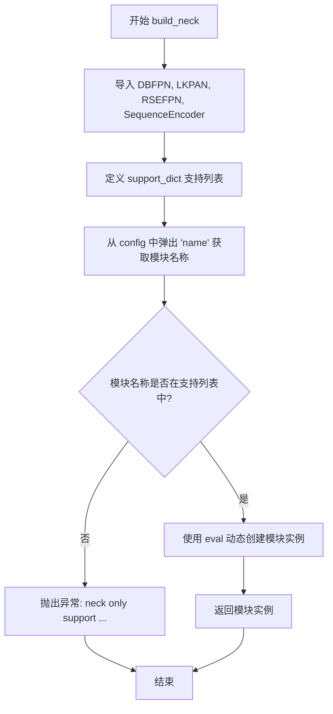

# `MinerU\mineru\model\utils\pytorchocr\modeling\necks\__init__.py` 详细设计文档

这是PaddlePaddle OCR项目中用于构建Neck（颈部网络）模块的工厂函数，通过配置文件动态加载并实例化不同的颈部网络结构，支持DBFPN、SequenceEncoder、RSEFPN和LKPAN等模型。

## 整体流程

```mermaid
graph TD
    A[开始 build_neck] --> B[从配置中弹出name字段]
B --> C{检查name是否在support_dict中}
C -- 否 --> D[抛出异常: neck only support {DBFPN, SequenceEncoder, RSEFPN, LKPAN}]
C -- 是 --> E[使用eval动态获取类]
E --> F[传入剩余config作为参数实例化类]
F --> G[返回实例化的neck对象]
```

## 类结构

```
无自定义类（纯工厂函数模块）
导入的外部类:
├── DBFPN (来自 .db_fpn)
├── LKPAN (来自 .db_fpn)
├── RSEFPN (来自 .db_fpn)
└── SequenceEncoder (来自 .rnn)
```

## 全局变量及字段


### `__all__`
    
定义模块公开接口的符号列表，仅导出build_neck函数

类型：`list`
    


### `build_neck.support_dict`
    
支持的neck网络模块名称列表，包含DBFPN、SequenceEncoder、RSEFPN和LKPAN

类型：`list`
    


### `build_neck.module_name`
    
从配置中提取的neck模块名称，用于动态创建对应的网络实例

类型：`str`
    
    

## 全局函数及方法


### `build_neck`

该函数是 Neck（颈部网络）模块的构建工厂函数，通过动态导入和反射机制根据配置文件中的名称实例化相应的特征金字塔网络或序列编码器，支持 DBFPN、SequenceEncoder、RSEFPN 和 LKPAN 四种网络结构。

参数：

- `config`：`dict`，包含网络配置的字典，必须包含"name"键指定要构建的模块名称，其余键作为模块构造参数

返回值：`object`，返回对应模块类的实例对象

#### 流程图



#### 带注释源码

```python
def build_neck(config):
    """
    构建 Neck（颈部网络）模块的工厂函数
    
    根据配置字典中的 'name' 字段动态实例化相应的网络模块，
    支持 DBFPN、SequenceEncoder、RSEFPN、LKPAN 四种网络结构。
    
    参数:
        config (dict): 包含网络配置的字典，必须包含 'name' 键
                      其余键值对将作为模块的构造参数
    
    返回:
        object: 对应模块类的实例对象
    """
    # 从当前包的 db_fpn 模块导入特征金字塔网络相关类
    from .db_fpn import DBFPN, LKPAN, RSEFPN
    # 从当前包的 rnn 模块导入序列编码器类
    from .rnn import SequenceEncoder

    # 定义支持的 Neck 模块名称列表
    support_dict = ["DBFPN", "SequenceEncoder", "RSEFPN", "LKPAN"]

    # 从配置字典中弹出 'name' 键，获取要构建的模块名称
    module_name = config.pop("name")
    
    # 断言验证模块名称是否在支持列表中
    assert module_name in support_dict, Exception(
        "neck only support {}".format(support_dict)
    )
    
    # 使用 eval 将字符串转换为类名，动态创建模块实例
    # config 字典中剩余的键值对作为关键字参数传入
    module_class = eval(module_name)(**config)
    
    # 返回创建的模块实例
    return module_class
```

## 关键组件


### build_neck 函数

build_neck 是neck模块的工厂函数，根据配置字典动态创建不同的颈部网络结构，支持DBFPN、LKPAN、RSEFPN等FPN结构以及SequenceEncoder序列编码器。

### 配置解析与验证模块

从配置字典中提取name字段，验证模块名称是否在支持列表中，若不支持则抛出异常，确保只有预定义的neck模块才能被实例化。

### 动态类实例化模块

使用eval函数根据字符串名称动态创建类实例，接收剩余的配置参数**config传递给对应类的构造函数，实现灵活的模块组装。

### 导入与模块管理

从子模块db_fpn和rnn导入DBFPN、LKPAN、RSEFPN和SequenceEncoder类，通过__all__控制导出接口，隐藏内部实现细节。


## 问题及建议


### 已知问题

-   **使用`eval()`动态执行代码**：通过`eval(module_name)(**config)`动态实例化类，存在严重的安全风险，可能导致任意代码执行漏洞
-   **直接修改输入参数**：使用`config.pop("name")`会直接修改调用者传入的字典，造成意外的副作用
-   **断言用于错误处理**：使用`assert`语句处理业务逻辑错误，在Python以优化模式运行（python -O）时会被跳过，导致错误处理失效
-   **缺乏输入验证**：未验证`config`是否为字典、是否包含`"name"`键，可能导致隐晦的`KeyError`或`AttributeError`
-   **运行时导入**：在函数内部进行导入操作，虽然Python有缓存机制，但不如模块顶部导入高效，且每次调用都会执行导入检查
-   **重复维护支持列表**：`support_dict`列表需要与实际导入的类名手动同步，容易出现不一致
-   **缺少类型注解**：无函数参数和返回值的类型提示，降低了代码的可读性和IDE支持
-   **错误信息不够友好**：仅显示支持的模块列表，未提供如何配置的具体指导

### 优化建议

-   **替换`eval()`为安全的类映射**：使用字典映射替代`eval()`，如`{"DBFPN": DBFPN, ...}`
-   **避免修改输入参数**：使用`config.get("name")`或复制配置字典`config_copy = dict(config)`后再pop
-   **使用显式异常抛出**：将`assert`改为`raise ValueError(...)`或`raise KeyError(...)`
-   **添加输入验证**：在函数开头添加参数类型和必要键的检查
-   **添加类型注解**：为函数添加`-> Type[BaseNeck]`等类型提示
-   **添加文档字符串**：描述函数用途、参数和返回值
-   **支持列表与导入联动**：可使用`__all__`或反射机制自动获取支持的类名
-   **提供更详细的错误信息**：包括当前传入的模块名和配置建议


## 其它


### 设计目标与约束

本模块的设计目标是提供一种统一的接口来构建不同的neck（颈部网络）模块，用于目标检测或文字识别等任务。通过动态类实例化机制，实现模块的可扩展性和配置化管理。约束条件包括：仅支持预定义的neck类型（DBFPN、SequenceEncoder、RSEFPN、LKPAN），配置必须包含"name"字段指定模块类型，其余参数作为构造函数参数传递。

### 错误处理与异常设计

当传入的模块名称不在支持列表中时，代码会抛出AssertionError异常，提示用户可用的支持模块列表。异常信息格式为"neck only support {supported_list}"。此外，模块类实例化过程中可能产生的异常（如参数错误）会直接向上传播，调用方需要捕获处理。

### 外部依赖与接口契约

本模块依赖以下外部组件：db_fpn模块（包含DBFPN、LKPAN、RSEFPN类）、rnn模块（包含SequenceEncoder类）。接口契约方面：build_neck函数接收一个字典类型的config参数，必须包含"name"键指定模块名称，其他键值对作为模块构造函数的参数。返回值是相应neck模块的实例对象。

### 性能考虑

由于使用eval()动态类实例化，存在一定的性能开销，但仅在模型初始化阶段执行一次，对运行时性能影响较小。建议在生产环境中考虑使用字典映射替代eval()以提升代码安全性和可维护性。

### 安全性考虑

使用eval()动态执行存在潜在的安全风险，如果config["name"]被恶意注入可能导致代码执行。建议使用{"DBFPN": DBFPN, ...}字典映射方式替代eval()，在代码层面限制只能实例化预定义的类。

### 版本兼容性

本模块适用于PaddlePaddle 2.0及以上版本。__all__导出列表仅包含build_neck函数，符合模块化设计规范。

### 配置管理

配置通过字典传递，采用声明式设计。标准配置格式为{"name": "模块名", "param1": value1, "param2": value2, ...}。配置验证在运行时进行，缺少name字段或name不支持时会触发异常。

### 测试策略

建议编写单元测试验证：1) 正确传入有效配置时能成功创建对应模块实例；2) 传入不支持的name时能正确抛出AssertionError；3) 传入空配置时能正确报告name字段缺失；4) 各支持模块的实例化参数传递正确性。

    