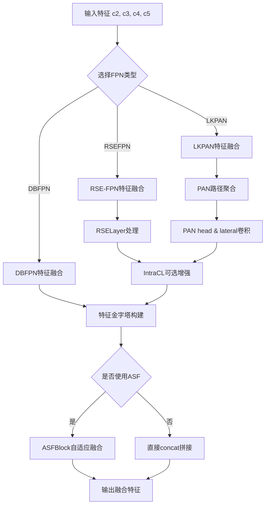
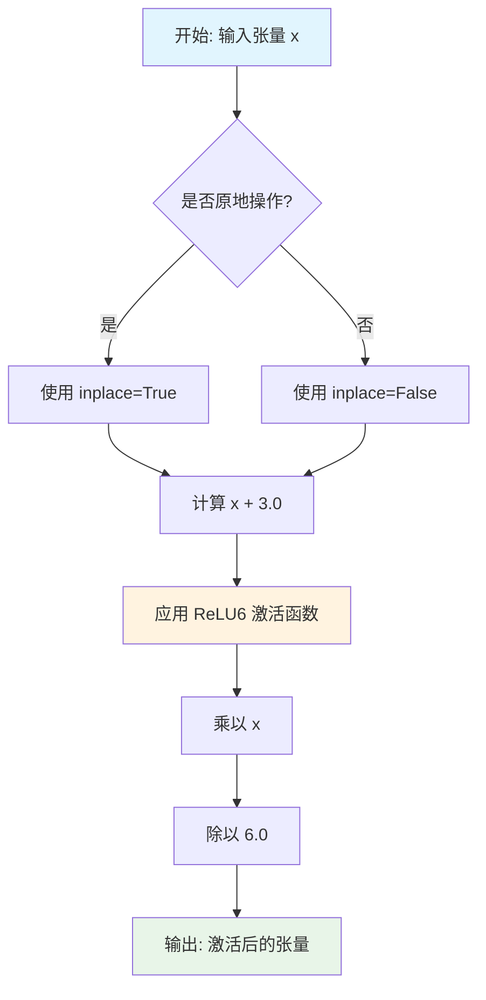
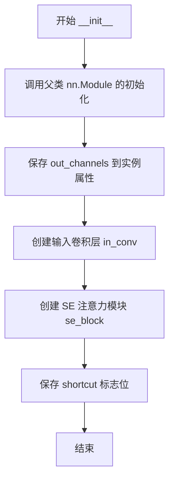
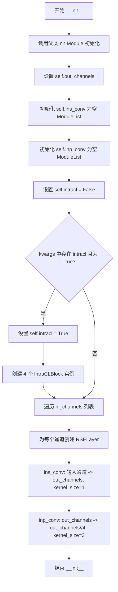
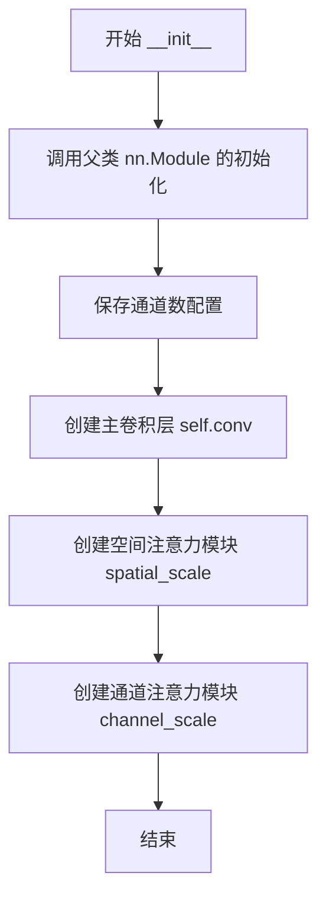

```mermaid
graph TD
    A[输入: fuse_features和features_list] --> B[conv卷积变换]
    B --> C[计算空间注意力]
    C --> D[融合空间注意力和特征]
    D --> E[计算通道注意力权重]
    E --> F[遍历每个特征通道]
    F --> G{是否还有未处理的特征}
    G -->|是| H[加权融合当前特征]
    H --> I[累加到输出列表]
    I --> G
    G -->|否| J[沿通道维度拼接所有加权特征]
    J --> K[返回融合后的特征]
    
    C1[torch.mean保持维度] --> C
    D1[fuse_features + spatial_attention] --> D
    E1[channel_scale生成每个特征的权重] --> E
```

# `MinerU\mineru\model\utils\pytorchocr\modeling\necks\db_fpn.py` 详细设计文档

该模块实现了一套用于计算机视觉任务的特征金字塔网络(FPN)和路径聚合网络(PAN)架构，包含深度可分离卷积(DSConv)、可微分二值化FPN(DBFPN)、带Squeeze-and-Excitation的RSE-FPN、自适应尺度融合块(ASFBlock)以及大核PAN(LKPAN)等核心组件，用于多尺度特征提取、融合和增强，提升目标检测与分割模型的性能。

## 整体流程



## 类结构

```
nn.Module (PyTorch基类)
├── DSConv (深度可分离卷积)
├── DBFPN (可微分二值化FPN)
├── RSELayer (RSE卷积层)
├── RSEFPN (RSE特征金字塔网络)
├── LKPAN (大核路径聚合网络)
└── ASFBlock (自适应尺度融合块)

外部依赖:
├── SEModule (来自backbones.det_mobilenet_v3)
└── IntraCLBlock (来自necks.intracl)
```

## 全局变量及字段


### `DSConv.if_act`
    
是否激活

类型：`bool`
    


### `DSConv.act`
    
激活函数类型

类型：`str`
    


### `DSConv.conv1`
    
深度卷积

类型：`nn.Conv2d`
    


### `DSConv.bn1`
    
批归一化1

类型：`nn.BatchNorm2d`
    


### `DSConv.conv2`
    
逐点卷积扩展通道

类型：`nn.Conv2d`
    


### `DSConv.bn2`
    
批归一化2

类型：`nn.BatchNorm2d`
    


### `DSConv.conv3`
    
逐点卷积输出

类型：`nn.Conv2d`
    


### `DSConv._c`
    
输入输出通道数记录

类型：`list`
    


### `DSConv.conv_end`
    
通道匹配卷积(可选)

类型：`nn.Conv2d`
    


### `DBFPN.out_channels`
    
输出通道数

类型：`int`
    


### `DBFPN.use_asf`
    
是否使用ASF模块

类型：`bool`
    


### `DBFPN.in2_conv`
    
输入特征卷积

类型：`nn.Conv2d`
    


### `DBFPN.in3_conv`
    
输入特征卷积

类型：`nn.Conv2d`
    


### `DBFPN.in4_conv`
    
输入特征卷积

类型：`nn.Conv2d`
    


### `DBFPN.in5_conv`
    
输入特征卷积

类型：`nn.Conv2d`
    


### `DBFPN.p2_conv`
    
特征金字塔卷积

类型：`nn.Conv2d`
    


### `DBFPN.p3_conv`
    
特征金字塔卷积

类型：`nn.Conv2d`
    


### `DBFPN.p4_conv`
    
特征金字塔卷积

类型：`nn.Conv2d`
    


### `DBFPN.p5_conv`
    
特征金字塔卷积

类型：`nn.Conv2d`
    


### `DBFPN.asf`
    
自适应尺度融合块(可选)

类型：`ASFBlock`
    


### `RSELayer.out_channels`
    
输出通道数

类型：`int`
    


### `RSELayer.in_conv`
    
输入卷积

类型：`nn.Conv2d`
    


### `RSELayer.se_block`
    
SE注意力模块

类型：`SEModule`
    


### `RSELayer.shortcut`
    
残差连接开关

类型：`bool`
    


### `RSEFPN.out_channels`
    
输出通道数

类型：`int`
    


### `RSEFPN.ins_conv`
    
输入特征RSELayer列表

类型：`nn.ModuleList`
    


### `RSEFPN.inp_conv`
    
特征金字塔RSELayer列表

类型：`nn.ModuleList`
    


### `RSEFPN.intracl`
    
是否使用IntraCL

类型：`bool`
    


### `RSEFPN.incl1`
    
IntraCL块(可选)

类型：`IntraCLBlock`
    


### `RSEFPN.incl2`
    
IntraCL块(可选)

类型：`IntraCLBlock`
    


### `RSEFPN.incl3`
    
IntraCL块(可选)

类型：`IntraCLBlock`
    


### `RSEFPN.incl4`
    
IntraCL块(可选)

类型：`IntraCLBlock`
    


### `LKPAN.out_channels`
    
输出通道数

类型：`int`
    


### `LKPAN.ins_conv`
    
输入卷积列表

类型：`nn.ModuleList`
    


### `LKPAN.inp_conv`
    
特征处理卷积列表

类型：`nn.ModuleList`
    


### `LKPAN.pan_head_conv`
    
PAN头部卷积

类型：`nn.ModuleList`
    


### `LKPAN.pan_lat_conv`
    
PAN横向连接卷积

类型：`nn.ModuleList`
    


### `LKPAN.intracl`
    
是否使用IntraCL

类型：`bool`
    


### `LKPAN.incl1`
    
IntraCL块(可选)

类型：`IntraCLBlock`
    


### `LKPAN.incl2`
    
IntraCL块(可选)

类型：`IntraCLBlock`
    


### `LKPAN.incl3`
    
IntraCL块(可选)

类型：`IntraCLBlock`
    


### `LKPAN.incl4`
    
IntraCL块(可选)

类型：`IntraCLBlock`
    


### `ASFBlock.in_channels`
    
输入通道数

类型：`int`
    


### `ASFBlock.inter_channels`
    
中间通道数

类型：`int`
    


### `ASFBlock.out_features_num`
    
输出特征数量

类型：`int`
    


### `ASFBlock.conv`
    
初始卷积

类型：`nn.Conv2d`
    


### `ASFBlock.spatial_scale`
    
空间注意力分支

类型：`nn.Sequential`
    


### `ASFBlock.channel_scale`
    
通道注意力分支

类型：`nn.Sequential`
    
    

## 全局函数及方法


### `hard_swish`

硬件友好的H-Swish激活函数实现，该函数是MobileNetV3中引入的Swish激活函数的硬版本，通过使用ReLU6和简单的数学运算替代Sigmoid，显著降低了计算复杂度，更适合在移动端或硬件受限的环境中部署。

参数：

- `x`：`torch.Tensor`，输入张量，可以是任意形状的浮点型张量
- `inplace`：`bool`，是否使用原地操作（默认为True），如果为True则直接在输入张量上修改，减少内存开销

返回值：`torch.Tensor`，返回经过H-Swish激活函数处理后的张量，形状与输入张量相同

#### 流程图



#### 带注释源码

```python
def hard_swish(x, inplace=True):
    """
    硬件友好的H-Swish激活函数
    
    H-Swish是Swish激活函数的硬件友好版本，其数学表达式为:
    H-Swish(x) = x * ReLU6(x + 3) / 6
    
    相比于原始的Swish函数:
    - 使用ReLU6替代Sigmoid，减少了计算量
    - 消除了指数运算，更适合在移动端或硬件受限的环境中使用
    - 在深层网络中表现与Swish相当，但具有更低的延迟
    
    Args:
        x (torch.Tensor): 输入张量，任意形状
        inplace (bool): 是否使用原地操作，默认为True
    
    Returns:
        torch.Tensor: 经过H-Swish激活后的张量
    
    Example:
        >>> import torch
        >>> x = torch.randn(2, 3, 4, 4)
        >>> output = hard_swish(x)
        >>> print(output.shape)
        torch.Size([2, 3, 4, 4])
    """
    # 步骤1: 将输入张量加上3.0，这是H-Swish公式中的位移操作
    # x + 3.0 将输入范围平移到正值区间，便于后续ReLU6处理
    added = x + 3.0
    
    # 步骤2: 应用ReLU6激活函数
    # ReLU6是ReLU的变体，输出被限制在0到6之间
    # ReLU6(x) = min(max(x, 0), 6)
    # inplace参数控制是否原地修改数据，节省内存
    relu6_out = F.relu6(added, inplace=inplace)
    
    # 步骤3: 乘以输入张量x
    # 这一步实现了x * ReLU6(x+3)的计算
    multiplied = x * relu6_out
    
    # 步骤4: 除以6.0，完成归一化
    # 最终得到 x * ReLU6(x + 3) / 6
    output = multiplied / 6.0
    
    return output
```


### `DSConv.__init__`

该方法是深度可分离卷积（Depthwise Separable Convolution）模块的初始化函数，负责创建具有深度可分离卷积结构的神经网络层，包括三个卷积层、两个批归一化层以及可选的残差连接，并配置激活函数。

参数：

- `in_channels`：`int`，输入特征图的通道数
- `out_channels`：`int`，输出特征图的通道数
- `kernel_size`：`int`，卷积核的大小
- `padding`：`int`，卷积操作的填充大小
- `stride`：`int`，卷积操作的步长，默认为1
- `groups`：`int`，分组卷积的组数，默认为None（当为None时自动设为in_channels）
- `if_act`：`bool`，是否应用激活函数，默认为True
- `act`：`str`，激活函数类型，可选"relu"或"hardswish"，默认为"relu"
- `**kwargs`：`dict`，额外的关键字参数，用于扩展

返回值：`None`，该方法为初始化方法，不返回任何值

#### 流程图

```mermaid
flowchart TD
    A[开始 __init__] --> B[调用 super().__init__]
    B --> C{groups == None?}
    C -->|是| D[groups = in_channels]
    C -->|否| E[使用传入的groups值]
    D --> F[保存 self.if_act = if_act]
    E --> F
    F --> G[保存 self.act = act]
    G --> H[创建 conv1: 深度卷积]
    H --> I[创建 bn1: 批归一化]
    I --> J[创建 conv2: 逐点卷积-通道扩展]
    J --> K[创建 bn2: 批归一化]
    K --> L[创建 conv3: 逐点卷积-输出]
    L --> M[保存 self._c = [in_channels, out_channels]]
    M --> N{in_channels != out_channels?}
    N -->|是| O[创建 conv_end: 残差连接卷积]
    N -->|否| P[结束]
    O --> P
```

#### 带注释源码

```python
def __init__(
    self,
    in_channels,          # 输入特征图的通道数
    out_channels,         # 输出特征图的通道数
    kernel_size,          # 卷积核大小
    padding,              # 填充大小
    stride=1,             # 步长，默认为1
    groups=None,          # 分组数，None时默认为in_channels（深度可分离卷积）
    if_act=True,          # 是否使用激活函数
    act="relu",           # 激活函数类型："relu"或"hardswish"
    **kwargs              # 额外关键字参数
):
    # 调用父类nn.Module的初始化方法
    super(DSConv, self).__init__()
    
    # 如果groups为None，则设置为in_channels（实现深度可分离卷积）
    if groups == None:
        groups = in_channels
    
    # 保存激活函数配置
    self.if_act = if_act    # 是否激活的标志位
    self.act = act          # 激活函数类型
    
    # 第一个卷积层：深度卷积（Depthwise Convolution）
    # 使用groups=in_channels实现深度卷积，每个输入通道独立进行卷积
    self.conv1 = nn.Conv2d(
        in_channels=in_channels,     # 输入通道数
        out_channels=in_channels,     # 输出通道数（与输入相同，深度卷积特性）
        kernel_size=kernel_size,       # 卷积核大小
        stride=stride,                 # 步长
        padding=padding,               # 填充
        groups=groups,                 # 分组数（实现深度卷积的关键）
        bias=False,                    # 不使用偏置
    )

    # 第一个批归一化层，用于深度卷积输出
    self.bn1 = nn.BatchNorm2d(in_channels)

    # 第二个卷积层：逐点卷积（Pointwise Convolution）- 通道扩展
    # 将通道数扩展4倍，增加特征表示能力
    self.conv2 = nn.Conv2d(
        in_channels=in_channels,           # 输入通道数
        out_channels=int(in_channels * 4), # 输出通道数（扩展4倍）
        kernel_size=1,                     # 1x1卷积
        stride=1,                          # 步长为1
        bias=False,                        # 不使用偏置
    )

    # 第二个批归一化层，用于通道扩展后的输出
    self.bn2 = nn.BatchNorm2d(int(in_channels * 4))

    # 第三个卷积层：逐点卷积（Pointwise Convolution）- 输出映射
    # 将扩展的通道数映射到目标输出通道数
    self.conv3 = nn.Conv2d(
        in_channels=int(in_channels * 4), # 输入通道数（扩展后的通道数）
        out_channels=out_channels,        # 输出通道数（目标通道数）
        kernel_size=1,                    # 1x1卷积
        stride=1,                         # 步长为1
        bias=False,                       # 不使用偏置
    )
    
    # 保存输入输出通道数，用于后续判断是否需要残差连接
    self._c = [in_channels, out_channels]
    
    # 如果输入通道数不等于输出通道数，创建残差连接卷积层
    # 用于在通道数不匹配时通过1x1卷积调整输入的通道数
    if in_channels != out_channels:
        self.conv_end = nn.Conv2d(
            in_channels=in_channels,   # 输入通道数
            out_channels=out_channels, # 输出通道数
            kernel_size=1,             # 1x1卷积
            stride=1,                  # 步长为1
            bias=False,                # 不使用偏置
        )
```


### DSConv.forward

描述：该方法是深度可分离卷积（DSConv）模块的前向传播实现，通过深度卷积、通道扩展卷积和激活函数的组合实现高效的特征提取，并在输入输出通道数不一致时添加残差连接以增强梯度流动。

参数：

- `inputs`：`torch.Tensor`，输入特征张量，形状为 (N, C_in, H, W)

返回值：`torch.Tensor`，输出特征张量，形状为 (N, C_out, H', W')，其中 H' 和 W' 取决于步长和填充

#### 流程图

```mermaid
flowchart TD
    A[输入 inputs] --> B[conv1 深度卷积]
    B --> C[bn1 批归一化]
    C --> D[conv2 逐点卷积-通道扩展]
    D --> E[bn2 批归一化]
    E --> F{if_act 是否激活?}
    F -- True --> G{act 类型?}
    G -- relu --> H[F.relu 激活]
    G -- hardswish --> I[hard_swish 激活]
    G -- 其他 --> J[打印错误并退出]
    F -- False --> K
    H --> K
    I --> K
    K[conv3 逐点卷积-通道压缩] --> L{输入输出通道是否相同?}
    L -- 否 --> M[残差连接: x + conv_end(inputs)]
    L -- 是 --> N[返回 x]
    M --> N
```

#### 带注释源码

```python
def forward(self, inputs):
    """
    DSConv模块的前向传播
    
    处理流程：
    1. 深度卷积：使用groups=in_channels实现逐通道卷积
    2. 批归一化：标准化特征
    3. 逐点卷积扩展：通道数扩展4倍
    4. 激活函数：可选relu或hardswish
    5. 逐点卷积压缩：恢复到目标输出通道数
    6. 残差连接：输入输出通道不同时添加跳跃连接
    """
    # 第一步：深度卷积（逐通道卷积）
    # groups=in_channels 实现深度可分离卷积的深度部分
    x = self.conv1(inputs)
    x = self.bn1(x)

    # 第二步：逐点卷积扩展通道数（扩展到4倍）
    x = self.conv2(x)
    x = self.bn2(x)

    # 第三步：激活函数（根据配置选择）
    if self.if_act:
        if self.act == "relu":
            x = F.relu(x)
        elif self.act == "hardswish":
            x = hard_swish(x)
        else:
            print(
                "The activation function({}) is selected incorrectly.".format(
                    self.act
                )
            )
            exit()

    # 第四步：逐点卷积压缩到目标输出通道数
    x = self.conv3(x)

    # 第五步：残差连接（当输入输出通道不一致时）
    # 通过1x1卷积调整输入通道数后相加
    if self._c[0] != self._c[1]:
        x = x + self.conv_end(inputs)
    
    return x
```


### DBFPN.__init__

该方法是DBFPN（Dense Bidirectional Feature Pyramid Network）类的初始化方法，用于构建一个双向特征金字塔网络结构，支持可选的ASF（Adaptive Scale Fusion）模块进行多尺度特征融合。

参数：

- `in_channels`：`List[int]`，输入特征金字塔的各层通道数列表，通常包含4个元素（如[c2, c3, c4, c5]）
- `out_channels`：`int`，输出特征的通道数，用于控制所有卷积层的输出维度
- `use_asf`：`bool`，是否启用自适应尺度融合模块（ASFBlock），默认为False
- `**kwargs`：可变关键字参数，用于传递额外的配置参数（当前未被使用）

返回值：`None`，该方法为构造函数，不返回任何值

#### 流程图

```mermaid
flowchart TD
    A[开始 __init__] --> B[调用 super().__init__ 初始化 nn.Module]
    B --> C[保存 out_channels 和 use_asf 参数]
    C --> D[创建输入特征卷积层: in2_conv, in3_conv, in4_conv, in5_conv]
    D --> E[创建金字塔特征卷积层: p5_conv, p4_conv, p3_conv, p2_conv]
    E --> F{use_asf == True?}
    F -->|是| G[创建 ASFBlock 实例: self.asf]
    F -->|否| H[结束 __init__]
    G --> H
```

#### 带注释源码

```python
def __init__(self, in_channels, out_channels, use_asf=False, **kwargs):
    """
    DBFPN 初始化方法
    
    参数:
        in_channels: 输入特征金字塔的通道数列表 [c2, c3, c4, c5]
        out_channels: 输出特征的通道数
        use_asf: 是否使用自适应尺度融合模块
        **kwargs: 额外的关键字参数
    """
    # 调用父类 nn.Module 的初始化方法
    super(DBFPN, self).__init__()
    
    # 保存输出通道数配置
    self.out_channels = out_channels
    
    # 保存是否使用 ASF 模块的标志
    self.use_asf = use_asf
    
    # ============================================
    # 创建输入特征处理卷积层 (1x1 卷积用于通道压缩)
    # ============================================
    
    # 处理 C2 (1/4 分辨率) 特征的卷积层
    self.in2_conv = nn.Conv2d(
        in_channels=in_channels[0],    # C2 的输入通道数
        out_channels=self.out_channels, # 压缩到指定输出通道数
        kernel_size=1,                   # 1x1 卷积进行通道维度变换
        bias=False,                     # 不使用偏置
    )
    
    # 处理 C3 (1/8 分辨率) 特征的卷积层
    self.in3_conv = nn.Conv2d(
        in_channels=in_channels[1],
        out_channels=self.out_channels,
        kernel_size=1,
        bias=False,
    )
    
    # 处理 C4 (1/16 分辨率) 特征的卷积层
    self.in4_conv = nn.Conv2d(
        in_channels=in_channels[2],
        out_channels=self.out_channels,
        kernel_size=1,
        bias=False,
    )
    
    # 处理 C5 (1/32 分辨率) 特征的卷积层
    self.in5_conv = nn.Conv2d(
        in_channels=in_channels[3],
        out_channels=self.out_channels,
        kernel_size=1,
        bias=False,
    )
    
    # ============================================
    # 创建金字塔特征 (Pyramid Features) 卷积层
    # 使用 3x3 卷积提取特征并保持空间分辨率
    # ============================================
    
    # P5 卷积层: 处理最高层特征
    self.p5_conv = nn.Conv2d(
        in_channels=self.out_channels,           # 输入通道数
        out_channels=self.out_channels // 4,      # 输出通道数为总通道数的 1/4
        kernel_size=3,                            # 3x3 卷积核
        padding=1,                                # 保持空间尺寸不变
        bias=False,
    )
    
    # P4 卷积层
    self.p4_conv = nn.Conv2d(
        in_channels=self.out_channels,
        out_channels=self.out_channels // 4,
        kernel_size=3,
        padding=1,
        bias=False,
    )
    
    # P3 卷积层
    self.p3_conv = nn.Conv2d(
        in_channels=self.out_channels,
        out_channels=self.out_channels // 4,
        kernel_size=3,
        padding=1,
        bias=False,
    )
    
    # P2 卷积层
    self.p2_conv = nn.Conv2d(
        in_channels=self.out_channels,
        out_channels=self.out_channels // 4,
        kernel_size=3,
        padding=1,
        bias=False,
    )
    
    # ============================================
    # 条件创建 ASF (Adaptive Scale Fusion) 模块
    # ASF 用于多尺度特征的动态融合
    # ============================================
    
    # 如果启用 ASF 模块，则创建 ASFBlock 实例
    if self.use_asf is True:
        # ASFBlock 接收输出通道数和 1/4 输出通道数作为参数
        self.asf = ASFBlock(self.out_channels, self.out_channels // 4)
```


### `DBFPN.forward`

该方法是DBFPN（Difference Binary Feature Pyramid Network）模块的前向传播函数，接收来自backbone的四个尺度特征图（C2-C5），通过自上而下的路径进行特征融合，并可选地使用ASF（Adaptive Scale Fusion）块进行注意力加权融合，最终返回融合后的特征张量。

参数：

- `x`：`Tuple[torch.Tensor, torch.Tensor, torch.Tensor, torch.Tensor]`，来自backbone的四个不同尺度特征图，依次为(c2, c3, c4, c5)，分别对应1/4、1/8、1/16、1/32下采样率的特征

返回值：`torch.Tensor`，融合后的特征张量，维度为[B, out_channels, H, W]，其中H和W对应于c2特征的尺寸

#### 流程图

```mermaid
flowchart TD
    A[输入特征x] --> B[解包: c2, c3, c4, c5]
    
    B --> C1[in5 = in5_conv(c5)]
    B --> C2[in4 = in4_conv(c4)]
    B --> C3[in3 = in3_conv(c3)]
    B --> C4[in2 = in2_conv(c2)]
    
    C1 --> D1[上采样 in5 2倍]
    D1 --> E1[out4 = in4 + 上采样结果]
    
    E1 --> D2[上采样 out4 2倍]
    D2 --> E2[out3 = in3 + 上采样结果]
    
    E2 --> D3[上采样 out3 2倍]
    D3 --> E3[out2 = in2 + 上采样结果]
    
    C1 --> F1[p5 = p5_conv(in5)]
    E1 --> F2[p4 = p4_conv(out4)]
    E2 --> F3[p3 = p3_conv(out3)]
    E3 --> F4[p2 = p2_conv(out2)]
    
    F1 --> G1[上采样 p5 8倍]
    F2 --> G2[上采样 p4 4倍]
    F3 --> G3[上采样 p3 2倍]
    F4 --> G4[p2 保持不变]
    
    G1 --> H[torch.cat([p5, p4, p3, p2], dim=1)]
    G2 --> H
    G3 --> H
    G4 --> H
    
    H --> I{use_asf?}
    I -->|True| J[ASF块注意力融合]
    I -->|False| K[直接返回fuse]
    
    J --> K
    
    K --> L[返回fuse融合特征]
```

#### 带注释源码

```python
def forward(self, x):
    """
    DBFPN前向传播函数
    
    参数:
        x: 来自backbone的四个特征图元组 (c2, c3, c4, c5)
           - c2: 1/4下采样率的特征图
           - c3: 1/8下采样率的特征图
           - c4: 1/16下采样率的特征图
           - c5: 1/32下采样率的特征图
    
    返回:
        fuse: 融合后的特征张量，维度为 [B, out_channels, H, W]
    """
    # 1. 从输入元组中解包出四个尺度的特征图
    c2, c3, c4, c5 = x

    # 2. 通过1x1卷积将各尺度特征图的通道数统一调整到out_channels
    #    这一步是为了后续特征融合时通道数一致
    in5 = self.in5_conv(c5)  # 处理最深层特征(1/32)
    in4 = self.in4_conv(c4)  # 处理1/16特征
    in3 = self.in3_conv(c3)  # 处理1/8特征
    in2 = self.in2_conv(c2)  # 处理最浅层特征(1/4)

    # 3. 自上而下的特征融合路径(Top-down pathway)
    #    通过上采样和逐元素相加实现特征融合
    #    out4 = in4 + upsample(in5), 融合1/16和1/32特征
    out4 = in4 + F.interpolate(
        in5,
        scale_factor=2,
        mode="nearest",
    )  # align_mode=1)  # 1/16
    
    #    out3 = in3 + upsample(out4), 融合1/8和1/16特征
    out3 = in3 + F.interpolate(
        out4,
        scale_factor=2,
        mode="nearest",
    )  # align_mode=1)  # 1/8
    
    #    out2 = in2 + upsample(out3), 融合1/4和1/8特征
    out2 = in2 + F.interpolate(
        out3,
        scale_factor=2,
        mode="nearest",
    )  # align_mode=1)  # 1/4

    # 4. 通过3x3卷积生成金字塔各层的输出特征
    #    使用out_channels//4通道数，减少计算量
    p5 = self.p5_conv(in5)   # 处理原始in5特征
    p4 = self.p4_conv(out4)  # 处理融合后的out4特征
    p3 = self.p3_conv(out3)  # 处理融合后的out3特征
    p2 = self.p2_conv(out2)  # 处理融合后的out2特征

    # 5. 上采样操作，将不同尺度的特征图恢复到相同尺寸
    #    恢复到c2特征的尺寸(1/4下采样率)
    p5 = F.interpolate(
        p5,
        scale_factor=8,
        mode="nearest",
    ) # align_mode=1)  # 上采样8倍
    
    p4 = F.interpolate(
        p4,
        scale_factor=4,
        mode="nearest",
    ) # align_mode=1)  # 上采样4倍
    
    p3 = F.interpolate(
        p3,
        scale_factor=2,
        mode="nearest",
    ) # align_mode=1)  # 上采样2倍

    # 6. 沿着通道维度(dim=1)拼接所有金字塔层的特征
    fuse = torch.cat([p5, p4, p3, p2], dim=1)

    # 7. 可选: 使用ASF(Adaptive Scale Fusion)块进行注意力融合
    #    ASF块会对不同尺度的特征进行注意力加权
    if self.use_asf is True:
        fuse = self.asf(fuse, [p5, p4, p3, p2])

    # 8. 返回最终融合的特征图
    return fuse
```


### `RSELayer.__init__`

该方法是RSELayer类的构造函数，用于初始化一个包含卷积层和SE注意力模块的特征提取层，支持可选的残差连接（shortcut）。

参数：

- `in_channels`：`int`，输入特征图的通道数
- `out_channels`：`int`，输出特征图的通道数
- `kernel_size`：`int`，卷积核大小
- `shortcut`：`bool`，是否使用残差连接，默认为`True`

返回值：`None`，`__init__`方法不返回任何值

#### 流程图



#### 带注释源码

```python
def __init__(self, in_channels, out_channels, kernel_size, shortcut=True):
    """
    初始化 RSELayer 模块
    
    Args:
        in_channels: 输入特征图的通道数
        out_channels: 输出特征图的通道数
        kernel_size: 卷积核大小
        shortcut: 是否使用残差连接，默认为 True
    """
    # 调用父类 nn.Module 的初始化方法，完成 PyTorch 模块的基础初始化
    super(RSELayer, self).__init__()
    
    # 保存输出通道数到实例属性，供后续使用
    self.out_channels = out_channels
    
    # 创建输入卷积层：将输入特征图从 in_channels 通道转换为 out_channels 通道
    # 使用 padding=int(kernel_size // 2) 保持特征图尺寸不变
    # bias=False 使用 BatchNorm2d 时通常不需要偏置
    self.in_conv = nn.Conv2d(
        in_channels=in_channels,
        out_channels=self.out_channels,
        kernel_size=kernel_size,
        padding=int(kernel_size // 2),
        bias=False,
    )
    
    # 创建 SE (Squeeze-and-Excitation) 注意力模块
    # 用于通道级别的特征重标定，增强重要特征的表达能力
    self.se_block = SEModule(self.out_channels)
    
    # 保存残差连接标志位
    # True: 使用残差连接 (out = x + SE(x))
    # False: 不使用残差连接 (out = SE(x))
    self.shortcut = shortcut
```


### `RSELayer.forward`

该方法实现了RSELayer的前向传播，首先对输入特征图进行卷积操作，然后根据shortcut参数决定是否将卷积结果与SE注意力模块的输出相加后返回。

参数：

- `self`：RSELayer实例本身，隐含参数
- `ins`：`torch.Tensor`，输入特征图张量，形状为 (B, C, H, W)，其中B为batch size，C为通道数，H和W为高度和宽度

返回值：`torch.Tensor`，经过卷积和SE注意力机制处理后的输出特征图，形状为 (B, out_channels, H, W)

#### 流程图

```mermaid
graph TD
    A[开始 forward] --> B[输入特征图 ins]
    B --> C[self.in_conv: 卷积处理]
    C --> D{x = 卷积结果}
    D --> E{self.shortcut == True?}
    E -->|Yes| F[se_block_output = self.se_block(x)]
    F --> G[out = x + se_block_output]
    E -->|No| H[out = self.se_block(x)]
    G --> I[返回 out]
    H --> I
```

#### 带注释源码

```python
def forward(self, ins):
    """
    RSELayer的前向传播方法
    
    Args:
        ins: 输入特征图，形状为 (B, C, H, W)
        
    Returns:
        处理后的特征图，形状为 (B, out_channels, H, W)
    """
    # 第一步：对输入进行卷积变换
    # in_conv是一个标准的2D卷积，将输入通道映射到输出通道
    x = self.in_conv(ins)
    
    # 第二步：根据shortcut参数决定处理路径
    if self.shortcut:
        # 残差路径：卷积输出 + SE注意力模块输出
        # SE模块学习通道注意力权重，类似于Squeeze-and-Excitation网络
        out = x + self.se_block(x)
    else:
        # 非残差路径：仅使用SE注意力模块的输出
        out = self.se_block(x)
    
    return out
```


### `RSEFPN.__init__`

RSEFPN 类的初始化方法，构造 RSEFPN（Residual Squeeze-and-Excitation Feature Pyramid Network）网络结构，包含输入特征卷积层（ins_conv）、输出特征卷积层（inp_conv）以及可选的 IntraCL 通道注意力模块。

参数：

- `in_channels`：`List[int]`，输入特征图的通道数列表，通常为 [C2, C3, C4, C5] 四个阶段的通道数
- `out_channels`：`int`，输出特征图的通道数，用于所有 RSELayer 的输出通道
- `shortcut`：`bool`，是否在 RSELayer 中使用残差快捷连接，默认为 True
- `**kwargs`：可变关键字参数，支持 `intracl`（bool 类型）用于启用通道内注意力模块

返回值：`None`，该方法为构造函数，不返回任何值

#### 流程图



#### 带注释源码

```python
def __init__(self, in_channels, out_channels, shortcut=True, **kwargs):
    """
    RSEFPN 初始化方法
    
    参数:
        in_channels: 输入特征图通道数列表，如 [256, 512, 1024, 2048]
        out_channels: 输出特征图通道数，如 256
        shortcut: 是否在 RSELayer 中使用残差连接
        **kwargs: 关键字参数，支持 intracl=True 启用通道内注意力
    """
    # 调用父类 nn.Module 的初始化方法
    super(RSEFPN, self).__init__()
    
    # 设置输出通道数属性
    self.out_channels = out_channels
    
    # 初始化输入特征卷积层列表（用于处理 backbone 输出的特征）
    self.ins_conv = nn.ModuleList()
    
    # 初始化输出特征卷积层列表（用于生成金字塔特征）
    self.inp_conv = nn.ModuleList()
    
    # 默认不启用通道内注意力模块
    self.intracl = False
    
    # 检查是否启用 IntraCL 通道注意力机制
    if "intracl" in kwargs.keys() and kwargs["intracl"] is True:
        # 启用通道内注意力
        self.intracl = kwargs["intracl"]
        
        # 创建 4 个 IntraCLBlock 实例，分别用于处理 P2-P5 特征
        # 每个块的输入通道为 out_channels // 4
        self.incl1 = IntraCLBlock(self.out_channels // 4, reduce_factor=2)
        self.incl2 = IntraCLBlock(self.out_channels // 4, reduce_factor=2)
        self.incl3 = IntraCLBlock(self.out_channels // 4, reduce_factor=2)
        self.incl4 = IntraCLBlock(self.out_channels // 4, reduce_factor=2)

    # 遍历输入通道列表，为每个尺度创建 RSELayer
    for i in range(len(in_channels)):
        # ins_conv: 将不同通道数的输入特征图统一映射到 out_channels
        # kernel_size=1 用于通道维度变换
        self.ins_conv.append(
            RSELayer(in_channels[i], out_channels, kernel_size=1, shortcut=shortcut)
        )
        
        # inp_conv: 将统一通道数的特征图降维到 out_channels // 4
        # kernel_size=3 用于空间特征提取
        self.inp_conv.append(
            RSELayer(
                out_channels, out_channels // 4, kernel_size=3, shortcut=shortcut
            )
        )
```


### RSEFPN.forward

该方法是RSEFPN（Region SElution Feature Pyramid Network）模块的前向传播函数，负责将骨干网络提取的多尺度特征图（c2-c5）进行自上而下的特征融合，并通过RSELayer和SE注意力机制增强特征表达能力，最终输出融合后的特征张量。

参数：

- `self`：RSEFPN类实例本身
- `x`：`List[Tensor]`，包含4个多尺度特征图的列表，依次为[c2, c3, c4, c5]，通常来自骨干网络的1/4、1/8、1/16、1/32分辨率输出

返回值：`Tensor`，融合后的特征张量，形状为[B, out_channels, H, W]，其中H和W对应于c2特征图的尺寸

#### 流程图

```mermaid
flowchart TD
    A[输入特征图列表 x] --> B[解包: c2, c3, c4, c5]
    B --> C1[ins_conv[3] 处理 c5]
    B --> C2[ins_conv[2] 处理 c4]
    B --> C3[ins_conv[1] 处理 c3]
    B --> C4[ins_conv[0] 处理 c2]
    C1 --> D1[in5]
    C2 --> D2[in4]
    C3 --> D3[in3]
    C4 --> D4[in2]
    D1 --> E1[F.interpolate in5 scale=2]
    E1 --> F1[out4 = in4 + interpolate]
    F1 --> E2[F.interpolate out4 scale=2]
    E2 --> F2[out3 = in3 + interpolate]
    F2 --> E3[F.interpolate out3 scale=2]
    E3 --> F3[out2 = in2 + interpolate]
    F3 --> G1[inp_conv[3] 处理 in5]
    F3 --> G2[inp_conv[2] 处理 out4]
    F3 --> G3[inp_conv[1] 处理 out3]
    F3 --> G4[inp_conv[0] 处理 out2]
    G1 --> H1[p5]
    G2 --> H2[p4]
    G3 --> H3[p3]
    G4 --> H4[p2]
    H1 --> I{self.intracl?}
    H2 --> I
    H3 --> I
    H4 --> I
    I -- True --> J1[incl4 处理 p5]
    I -- True --> J2[incl3 处理 p4]
    I -- True --> J3[incl2 处理 p3]
    I -- True --> J4[incl1 处理 p2]
    I -- False --> K1[直接使用 p5]
    I -- False --> K2[直接使用 p4]
    I -- False --> K3[直接使用 p3]
    I -- False --> K4[直接使用 p2]
    J1 --> L1
    J2 --> L2
    J3 --> L3
    J4 --> L4
    K1 --> L1[p5]
    K2 --> L2[p4]
    K3 --> L3[p3]
    K4 --> L4[p2]
    L1 --> M1[F.interpolate p5 scale=8]
    L2 --> M2[F.interpolate p4 scale=4]
    L3 --> M3[F.interpolate p3 scale=2]
    L4 --> M4[保留 p2]
    M1 --> N[torch.cat 沿通道维度]
    M2 --> N
    M3 --> N
    M4 --> N
    N --> O[返回融合特征 fuse]
```

#### 带注释源码

```python
def forward(self, x):
    """
    RSEFPN模块的前向传播
    
    Args:
        x: 包含4个多尺度特征图的列表 [c2, c3, c4, c5]
           - c2: 1/4分辨率，通道数为in_channels[0]
           - c3: 1/8分辨率，通道数为in_channels[1]
           - c4: 1/16分辨率，通道数为in_channels[2]
           - c5: 1/32分辨率，通道数为in_channels[3]
    
    Returns:
        fuse: 融合后的特征张量，形状为 [B, out_channels, H, W]
    """
    # 第一步：解包输入的多尺度特征图
    # c2, c3, c4, c5 分别对应从细到粗的特征金字塔层级
    c2, c3, c4, c5 = x
    
    # 第二步：通过RSELayer进行输入通道转换（包含SE注意力机制）
    # ins_conv是RSELayer列表，用于将不同输入通道统一转换为out_channels
    # 采用逆序处理（从c5到c2），因为后续需要自上而下的特征融合
    in5 = self.ins_conv[3](c5)  # 处理最粗特征（1/32）
    in4 = self.ins_conv[2](c4)  # 处理1/16特征
    in3 = self.ins_conv[1](c3)  # 处理1/8特征
    in2 = self.ins_conv[0](c2)  # 处理最细特征（1/4）
    
    # 第三步：自上而下的特征融合路径（Top-down pathway）
    # 通过上采样低分辨率特征并与相邻高分辨率特征相加，实现特征融合
    # interpolate使用nearest插值，保持特征图尺寸翻倍
    
    # out4 = in4 + 上采样后的in5（1/16 + 1/32上采样）
    out4 = in4 + F.interpolate(in5, scale_factor=2, mode="nearest")  # 1/16
    
    # out3 = in3 + 上采样后的out4（1/8 + 1/16上采样）
    out3 = in3 + F.interpolate(out4, scale_factor=2, mode="nearest")  # 1/8
    
    # out2 = in2 + 上采样后的out3（1/4 + 1/8上采样）
    out2 = in2 + F.interpolate(out3, scale_factor=2, mode="nearest")  # 1/4
    
    # 第四步：通过RSELayer进行特征细化（包含SE注意力机制）
    # inp_conv将out_channels转换为out_channels//4，减少计算量
    p5 = self.inp_conv[3](in5)      # 处理原始in5
    p4 = self.inp_conv[2](out4)     # 处理融合后的out4
    p3 = self.inp_conv[1](out3)     # 处理融合后的out3
    p2 = self.inp_conv[0](out2)     # 处理融合后的out2
    
    # 第五步：可选的Intra-Channel Learning（intracl）增强
    # 如果启用了intracl，则对每个尺度的特征进行进一步增强
    if self.intracl is True:
        p5 = self.incl4(p5)  # 通道注意力增强
        p4 = self.incl3(p4)
        p3 = self.incl2(p3)
        p2 = self.incl1(p2)
    
    # 第六步：上采样到统一分辨率（1/4分辨率，与c2对齐）
    # 将不同尺度的特征图上采样到相同尺寸以便拼接
    p5 = F.interpolate(p5, scale_factor=8, mode="nearest")   # 1/32 -> 1/4
    p4 = F.interpolate(p4, scale_factor=4, mode="nearest")   # 1/16 -> 1/4
    p3 = F.interpolate(p3, scale_factor=2, mode="nearest")    # 1/8 -> 1/4
    # p2 已经是1/4分辨率，无需上采样
    
    # 第七步：沿通道维度拼接所有特征图
    # 最终输出通道数 = out_channels // 4 * 4 = out_channels
    fuse = torch.cat([p5, p4, p3, p2], dim=1)
    
    return fuse
```


### `LKPAN.__init__`

LKPAN类的初始化方法，负责构建一个轻量级或大型的PAN（Path Aggregation Network）特征金字塔网络结构，支持Lite和Large两种模式，并可选地集成IntraCL块进行通道级特征增强。

参数：

- `in_channels`：list（列表），输入特征图的通道数列表，通常为多个尺度特征图的通道数
- `out_channels`：int（整数），输出特征图的通道数
- `mode`：str（字符串），模式选择，可选"lite"或"large"，决定了网络中使用的卷积层类型（DSConv或nn.Conv2d）
- `**kwargs`：dict（字典），可选的关键字参数，支持intracl等配置

返回值：`None`，无返回值，该方法为初始化方法，只是初始化类的属性

#### 流程图

```mermaid
graph TD
    A[开始__init__] --> B[设置self.out_channels = out_channels]
    B --> C[初始化ModuleList: ins_conv, inp_conv, pan_head_conv, pan_lat_conv]
    C --> D{mode == 'lite'?}
    D -->|是| E[设置p_layer = DSConv]
    D -->|否| F{mode == 'large'?}
    F -->|是| G[设置p_layer = nn.Conv2d]
    F -->|否| H[抛出ValueError异常]
    E --> I[for i in range(len(in_channels))]
    G --> I
    I --> J[添加ins_conv层: Conv2d in_channels[i] → out_channels]
    J --> K[添加inp_conv层: p_layer out_channels → out_channels//4]
    K --> L{i > 0?}
    L -->|是| M[添加pan_head_conv层: Conv2d out_channels//4 → out_channels//4, stride=2]
    L -->|否| N[添加pan_lat_conv层: p_layer out_channels//4 → out_channels//4]
    M --> N
    N --> O{intracl in kwargs?}
    O -->|是| P[设置self.intracl = True]
    O -->|否| Q[设置self.intracl = False]
    P --> R[创建incl1-incl4四个IntraCLBlock]
    R --> S[结束]
    Q --> S
```

#### 带注释源码

```python
def __init__(self, in_channels, out_channels, mode="large", **kwargs):
    """
    初始化LKPAN模块
    
    参数:
        in_channels: 输入特征图的通道数列表
        out_channels: 输出特征图的通道数
        mode: 模式选择，"lite"使用DSConv，"large"使用nn.Conv2d
        **kwargs: 可选参数，支持intracl等
    """
    # 调用父类nn.Module的初始化方法
    super(LKPAN, self).__init__()
    
    # 设置输出通道数
    self.out_channels = out_channels

    # 初始化用于特征处理的ModuleList
    # ins_conv: 用于调整输入特征图的通道数
    self.ins_conv = nn.ModuleList()
    # inp_conv: 用于处理融合后的特征图
    self.inp_conv = nn.ModuleList()
    
    # pan_head_conv: PAN网络的头部卷积，用于下采样
    self.pan_head_conv = nn.ModuleList()
    # pan_lat_conv: PAN网络的横向连接卷积
    self.pan_lat_conv = nn.ModuleList()

    # 根据mode选择卷积层类型
    if mode.lower() == "lite":
        # Lite模式使用深度可分离卷积DSConv，减少计算量
        p_layer = DSConv
    elif mode.lower() == "large":
        # Large模式使用标准卷积nn.Conv2d
        p_layer = nn.Conv2d
    else:
        # mode参数无效，抛出异常
        raise ValueError(
            "mode can only be one of ['lite', 'large'], but received {}".format(
                mode
            )
        )

    # 遍历每个尺度的输入特征图，构建相应的卷积层
    for i in range(len(in_channels)):
        # 添加输入通道调整卷积层：将in_channels[i]通道的输入转换为out_channels通道
        self.ins_conv.append(
            nn.Conv2d(
                in_channels=in_channels[i],
                out_channels=self.out_channels,
                kernel_size=1,
                bias=False,
            )
        )

        # 添加特征处理卷积层：根据mode选择DSConv或nn.Conv2d
        self.inp_conv.append(
            p_layer(
                in_channels=self.out_channels,
                out_channels=self.out_channels // 4,
                kernel_size=9,
                padding=4,
                bias=False,
            )
        )

        # 对于非第一个尺度，添加PAN头部卷积层（用于下采样）
        if i > 0:
            self.pan_head_conv.append(
                nn.Conv2d(
                    in_channels=self.out_channels // 4,
                    out_channels=self.out_channels // 4,
                    kernel_size=3,
                    padding=1,
                    stride=2,
                    bias=False,
                )
            )
        
        # 添加PAN横向连接卷积层
        self.pan_lat_conv.append(
            p_layer(
                in_channels=self.out_channels // 4,
                out_channels=self.out_channels // 4,
                kernel_size=9,
                padding=4,
                bias=False,
            )
        )
        
        # 初始化intracl标志为False
        self.intracl = False
        
        # 检查是否启用IntraCL（通道内对比学习）模块
        if "intracl" in kwargs.keys() and kwargs["intracl"] is True:
            self.intracl = kwargs["intracl"]
            # 创建4个IntraCLBlock用于处理不同尺度的特征
            self.incl1 = IntraCLBlock(self.out_channels // 4, reduce_factor=2)
            self.incl2 = IntraCLBlock(self.out_channels // 4, reduce_factor=2)
            self.incl3 = IntraCLBlock(self.out_channels // 4, reduce_factor=2)
            self.incl4 = IntraCLBlock(self.out_channels // 4, reduce_factor=2)
```


### LKPAN.forward

该方法是LKPAN（Lite Kernel PAN）模块的前向传播函数，实现特征金字塔网络（PAN）的自底向上路径，包括输入特征处理、特征融合、PAN head构建和特征图插值拼接，最终输出融合后的多尺度特征。

参数：

- `self`：LKPAN类实例，隐含参数，无需显式传递
- `x`：`List[torch.Tensor]`，包含四个特征图[c2, c3, c4, c5]，分别代表不同尺度的特征，通常来自骨干网络（Backbone）的输出

返回值：`torch.Tensor`，经过PAN融合和插值后的特征张量，形状为[B, C, H, W]，其中C为out_channels

#### 流程图

```mermaid
flowchart TD
    A[输入特征列表 x] --> B[解包: c2, c3, c4, c5]
    B --> C[ins_conv 处理: in2, in3, in4, in5]
    C --> D[自底向上特征融合<br/>out4 = in4 + upsample(in5)<br/>out3 = in3 + upsample(out4)<br/>out2 = in2 + upsample(out3)]
    D --> E[inp_conv 处理: f2, f3, f4, f5]
    E --> F[PAN Head 构建<br/>pan3 = f3 + pan_head_conv[0](f2)<br/>pan4 = f4 + pan_head_conv[1](pan3)<br/>pan5 = f5 + pan_head_conv[2](pan4)]
    F --> G[PAN Lateral 处理<br/>p2 = pan_lat_conv[0](f2)<br/>p3 = pan_lat_conv[1](pan3)<br/>p4 = pan_lat_conv[2](pan4)<br/>p5 = pan_lat_conv[3](pan5)]
    G --> H{intracl 是否启用?}
    H -->|是| I[intracl 处理: p5, p4, p3, p2]
    H -->|否| J[跳过 intracl 处理]
    I --> K[特征图插值放大<br/>p5 x8, p4 x4, p3 x2]
    J --> K
    K --> L[torch.cat 拼接: [p5, p4, p3, p2]]
    L --> M[返回融合特征]
```

#### 带注释源码

```python
def forward(self, x):
    """
    LKPAN 前向传播
    
    参数:
        x: List[Tensor] - 来自骨干网络的特征图列表 [c2, c3, c4, c5]
           c2: 1/4 分辨率, c3: 1/8 分辨率, c4: 1/16 分辨率, c5: 1/32 分辨率
    
    返回:
        Tensor: 融合后的多尺度特征, 形状为 [B, C, H, W]
    """
    # 从输入列表中解包四个不同尺度的特征图
    # c2: 最高分辨率特征 (1/4), c5: 最低分辨率特征 (1/32)
    c2, c3, c4, c5 = x

    # ===== 步骤1: 输入投影 (Input Projection) =====
    # 通过 1x1 卷积将不同通道数的特征图统一到 out_channels
    # ins_conv[3] 处理最低分辨率特征 c5, ins_conv[0] 处理最高分辨率特征 c2
    in5 = self.ins_conv[3](c5)  # 1/32 -> out_channels
    in4 = self.ins_conv[2](c4)  # 1/16 -> out_channels
    in3 = self.ins_conv[1](c3)  # 1/8 -> out_channels
    in2 = self.ins_conv[0](c2)  # 1/4 -> out_channels

    # ===== 步骤2: 自底向上特征融合 (Bottom-up Path) =====
    # 通过上采样和加法操作，将高层语义信息传递给低层特征
    # 这里使用的是 FPN 风格的特征融合
    out4 = in4 + F.interpolate(in5, scale_factor=2, mode="nearest")  # 1/16
    # 将 in5 上采样 2 倍后与 in4 相加，得到 out4
    out3 = in3 + F.interpolate(out4, scale_factor=2, mode="nearest")  # 1/8
    # 将 out4 上采样 2 倍后与 in3 相加，得到 out3
    out2 = in2 + F.interpolate(out3, scale_factor=2, mode="nearest")  # 1/4
    # 将 out3 上采样 2 倍后与 in2 相加，得到 out2

    # ===== 步骤3: 特征处理 (Feature Processing) =====
    # 使用 p_layer (DSConv 或 Conv2d) 处理融合后的特征
    # p_layer 的选择由 mode 参数决定: 'lite' 使用 DSConv, 'large' 使用 nn.Conv2d
    f5 = self.inp_conv[3](in5)    # 处理原始 in5
    f4 = self.inp_conv[2](out4)   # 处理融合后的 out4
    f3 = self.inp_conv[1](out3)   # 处理融合后的 out3
    f2 = self.inp_conv[0](out2)   # 处理融合后的 out2
    # 输出通道数: out_channels // 4

    # ===== 步骤4: PAN Head 构建 (PAN Head) =====
    # PAN (Path Aggregation Network) 的自顶向下路径
    # 通过卷积和上采样/下采样操作进一步融合多尺度特征
    # pan_head_conv[0] 将 f2 下采样后与 f3 相加得到 pan3
    pan3 = f3 + self.pan_head_conv[0](f2)
    # pan_head_conv[1] 将 pan3 下采样后与 f4 相加得到 pan4
    pan4 = f4 + self.pan_head_conv[1](pan3)
    # pan_head_conv[2] 将 pan4 下采样后与 f5 相加得到 pan5
    pan5 = f5 + self.pan_head_conv[2](pan4)

    # ===== 步骤5: Lateral 特征处理 (Lateral Path) =====
    # 对每个尺度的特征进行进一步处理
    p2 = self.pan_lat_conv[0](f2)      # 处理 f2
    p3 = self.pan_lat_conv[1](pan3)    # 处理 pan3
    p4 = self.pan_lat_conv[2](pan4)    # 处理 pan4
    p5 = self.pan_lat_conv[3](pan5)    # 处理 pan5

    # ===== 步骤6: 可选的 IntraCL 通道注意力 =====
    # 如果启用了 intracl (Intra-Channel Learning)，应用通道注意力模块
    if self.intracl is True:
        # IntraCLBlock 用于增强通道间的特征交互
        p5 = self.incl4(p5)  # 处理最低分辨率特征
        p4 = self.incl3(p4)
        p3 = self.incl2(p3)
        p2 = self.incl1(p2)  # 处理最高分辨率特征

    # ===== 步骤7: 特征图尺寸归一化 =====
    # 将不同尺度的特征图插值到相同的分辨率 (与 c2 相同的分辨率)
    # 最低分辨率特征需要更大的上采样倍数
    p5 = F.interpolate(p5, scale_factor=8, mode="nearest")   # 1/32 -> 1/4 (放大8倍)
    p4 = F.interpolate(p4, scale_factor=4, mode="nearest")   # 1/16 -> 1/4 (放大4倍)
    p3 = F.interpolate(p3, scale_factor=2, mode="nearest")   # 1/8 -> 1/4 (放大2倍)
    # p2 已经是 1/4 分辨率，无需插值

    # ===== 步骤8: 特征拼接与输出 =====
    # 在通道维度 (dim=1) 拼接所有特征图
    # 输出形状: [B, out_channels, H, W] = [B, out_channels, H, W]
    fuse = torch.cat([p5, p4, p3, p2], dim=1)
    
    return fuse
```


### `ASFBlock.__init__`

ASFBlock（Adaptive Scale Fusion Block）是 DBNet++ 中的自适应尺度融合模块，通过空间注意力和通道注意力机制对多尺度特征进行加权融合。

参数：

- `in_channels`：`int`，输入特征的通道数
- `inter_channels`：`int`，中间层通道数，用于控制特征的维度
- `out_features_num`：`int`，输出融合阶段的数量，默认为 4

返回值：`None`，该方法为构造函数，不返回任何值

#### 流程图



#### 带注释源码

```python
def __init__(self, in_channels, inter_channels, out_features_num=4):
    """
    Adaptive Scale Fusion (ASF) block of DBNet++
    Args:
        in_channels: the number of channels in the input data
        inter_channels: the number of middle channels
        out_features_num: the number of fused stages
    """
    # 调用父类 nn.Module 的初始化方法，完成 PyTorch 模块的基本初始化
    super(ASFBlock, self).__init__()
    
    # 保存输入通道数到实例属性
    self.in_channels = in_channels
    # 保存中间通道数到实例属性
    self.inter_channels = inter_channels
    # 保存输出特征数量到实例属性
    self.out_features_num = out_features_num
    
    # 创建主卷积层：用于对融合后的特征进行初步处理
    # 输入通道为 in_channels，输出通道为 inter_channels，卷积核大小为 3x3，使用 same padding
    self.conv = nn.Conv2d(in_channels, inter_channels, 3, padding=1)

    # 定义空间尺度注意力模块（Spatial Scale Attention）
    # 该模块首先将特征在通道维度上求平均，得到 Nx1xHxW 的单通道特征图
    # 然后通过卷积层学习空间注意力权重
    self.spatial_scale = nn.Sequential(
        # Nx1xHxW
        # 第一个卷积层：3x3 卷积，用于提取空间特征
        nn.Conv2d(
            in_channels=1,
            out_channels=1,
            kernel_size=3,
            bias=False,
            padding=1,
        ),
        nn.ReLU(),  # ReLU 激活函数，增加非线性
        # 第二个卷积层：1x1 卷积，用于调整特征
        nn.Conv2d(
            in_channels=1,
            out_channels=1,
            kernel_size=1,
            bias=False,
        ),
        nn.Sigmoid(),  # Sigmoid 激活函数，将输出归一化到 [0,1]，得到空间注意力权重
    )

    # 定义通道尺度注意力模块（Channel Scale Attention）
    # 该模块用于学习不同特征通道的权重，实现通道维度的特征选择
    self.channel_scale = nn.Sequential(
        # 1x1 卷积，将中间通道数映射到输出特征数量
        nn.Conv2d(
            in_channels=inter_channels,
            out_channels=out_features_num,
            kernel_size=1,
            bias=False,
        ),
        nn.Sigmoid(),  # Sigmoid 激活函数，将输出归一化到 [0,1]，得到通道注意力权重
    )
```


### ASFBlock.forward

该方法是ASFBlock（自适应尺度融合块）的核心前向传播逻辑，接收融合后的特征图和多个原始特征图，通过空间注意力和通道注意力机制学习不同特征通道的权重，实现多尺度特征的自适应融合。

参数：

- `fuse_features`：`torch.Tensor`，经过初步卷积处理的融合特征图，维度为(N, inter_channels, H, W)
- `features_list`：`List[torch.Tensor]`或`tuple[torch.Tensor]`，来自FPN/PAN等骨干网络的多个特征图列表，长度为out_features_num（如4个：p5, p4, p3, p2），每个维度为(N, C, H, W)

返回值：`torch.Tensor`，融合后的多通道特征图，维度为(N, out_channels * out_features_num, H, W)，其中out_channels = inter_channels

#### 流程图



#### 带注释源码

```python
def forward(self, fuse_features, features_list):
    """
    ASFBlock的前向传播方法，实现自适应尺度融合
    
    参数:
        fuse_features: 经过初步卷积的融合特征图 (N, inter_channels, H, W)
        features_list: 原始多尺度特征列表，如[p5, p4, p3, p2]，每个 (N, C, H, W)
    
    返回:
        torch.Tensor: 融合后的多通道特征 (N, inter_channels*4, H, W)
    """
    
    # 第一步：对融合特征进行3x3卷积降维
    # 输入: (N, in_channels, H, W) -> 输出: (N, inter_channels, H, W)
    fuse_features = self.conv(fuse_features)
    
    # 第二步：计算空间注意力
    # 对通道维度求平均，得到空间注意力基础: (N, 1, H, W)
    spatial_x = torch.mean(fuse_features, dim=1, keepdim=True)
    
    # 通过空间注意力模块处理: (N, 1, H, W) -> (N, 1, H, W)
    # 包含3x3卷积、ReLU激活、1x1卷积和Sigmoid
    attention_scores = self.spatial_scale(spatial_x) + fuse_features
    
    # 第三步：计算通道注意力权重
    # 将空间注意力与特征融合后，通过通道注意力模块
    # 输入: (N, inter_channels, H, W) -> 输出: (N, out_features_num, H, W)
    # 每个通道对应一个特征的权重
    attention_scores = self.channel_scale(attention_scores)
    
    # 验证输入的特征列表数量是否与配置一致
    assert len(features_list) == self.out_features_num
    
    # 第四步：按通道加权融合多尺度特征
    out_list = []
    for i in range(self.out_features_num):
        # 提取第i个注意力权重: (N, 1, H, W)
        # 切片操作选取第i个通道
        attention_weight = attention_scores[:, i : i + 1]
        
        # 将注意力权重与对应特征相乘: (N, C, H, W) * (N, 1, H, W) -> (N, C, H, W)
        # 广播机制自动扩展权重维度
        out_list.append(attention_weight * features_list[i])
    
    # 第五步：沿通道维度拼接所有加权后的特征
    # 输入: 4个 (N, C, H, W) 的列表 -> 输出: (N, C*4, H, W)
    return torch.cat(out_list, dim=1)
```

## 关键组件


### DSConv

深度可分离卷积模块，继承自nn.Module，包含三个卷积层（depthwise、pointwise、projection）和两个BN层，支持ReLU和HardSwish激活，用于轻量级特征提取。

### DBFPN

双向特征金字塔网络（Bidirectional FPN），接收多尺度特征[c2,c3,c4,c5]，通过1x1卷积降维、上采样融合和3x3卷积处理，支持可选的ASF自适应尺度融合模块。

### RSELayer

残差SE层，包含输入卷积和SE注意力模块，支持短路连接，用于增强通道注意力特征提取。

### RSEFPN

带SE注意力机制的FPN，使用RSELayer处理多尺度特征，支持可选的IntraCL通道注意力模块，通过上采样和特征融合生成多尺度输出。

### LKPAN

轻量级路径聚合网络（Lite PAN），支持lite和large两种模式，lite模式使用DSConv，large模式使用普通卷积，包含PAN（路径聚合网络）结构，支持IntraCL通道注意力。

### ASFBlock

自适应尺度融合模块（Adaptive Scale Fusion），参考DBNet++实现，包含空间注意力分支和通道注意力分支，对多尺度特征进行注意力加权融合。

### hard_swish

硬件友好的激活函数实现，使用ReLU6近似Swish，公式为 x * relu6(x + 3) / 6，用于移动端高效推理。

### 张量索引访问

代码中多处使用列表索引访问特征，如c2,c3,c4,c5 = x和features_list[i]，这些是多尺度特征金字塔的标准索引方式。

### 特征上采样与融合

使用F.interpolate进行2倍上采样（scale_factor=2），通过逐元素加法融合多尺度特征，然后通过torch.cat在通道维度拼接。


## 问题及建议


### 已知问题

-   **硬编码的缩放因子**：在 `DBFPN`、`RSEFPN`、`LKPAN` 的 `forward` 方法中，`scale_factor`（2、4、8）被硬编码，缺乏灵活性，难以适应不同尺度的输入。
-   **重复的特征融合逻辑**：`DBFPN`、`RSEFPN`、`LKPAN` 三个类的 `forward` 方法包含大量相似的特征金字塔构建和融合逻辑，代码重复度高。
-   **intracl 实现重复**：`RSEFPN` 和 `LKPAN` 中都有完全相同的 `intracl` 相关代码块（IntraCLBlock 的创建和调用），重复实现。
- **错误处理方式不当**：`DSConv.forward` 中当激活函数选择错误时直接调用 `exit()` 终止程序，这是非常糟糕的错误处理方式，应该抛出异常。
- **类型注解完全缺失**：整个代码没有任何类型注解（type hints），降低了代码的可读性和可维护性。
- **魔法数字和硬编码值**：`out_channels // 4` 在多处重复出现，`kernel_size=9`、`padding=4` 等值缺乏解释。
- **不一致的 API 设计**：`DBFPN` 使用 `self.use_asf` 布尔值控制，而 `RSEFPN` 和 `LKPAN` 使用 `kwargs["intracl"]` 控制，API 不一致。
- **未使用的参数**：`DSConv.__init__` 中的 `**kwargs` 参数未被使用，是无效的接口设计。
- **类字段命名不规范**：`DSConv` 中使用 `self._c = [in_channels, out_channels]` 列表存储两个值，命名不清晰且使用下划线前缀表示私有但实际用于比较逻辑。

### 优化建议

-   **提取特征融合基类**：将金字塔特征融合的公共逻辑抽象为一个基类或工具函数，减少重复代码。
-   **添加类型注解**：为所有类方法、函数参数和返回值添加类型注解，提升代码可读性和 IDE 支持。
-   **改进错误处理**：将 `exit()` 改为抛出 `ValueError` 或 `RuntimeError` 异常，让调用者能够优雅地处理错误。
-   **统一 API 设计**：统一使用布尔参数或配置字典来控制可选功能（如 `use_asf`、`intracl`），避免散弹式修改。
-   **配置化缩放因子**：将 `scale_factor` 等超参数提取为类的初始化参数或配置文件，提高模块的可复用性。
-   **移除无效参数**：删除 `DSConv.__init__` 中未使用的 `**kwargs` 参数，保持接口简洁清晰。
-   **添加详细的文档字符串**：为所有类和关键方法添加 docstring，说明参数含义、返回值和功能描述。
-   **提取公共 IntraCL 逻辑**：将 `intracl` 相关的初始化和调用逻辑提取为父类方法或混入类，避免在多个类中重复。

## 其它


### 设计目标与约束

本文档描述的代码是一套用于目标检测和分割任务的特征金字塔网络（FPN）组件，包括DBFPN、RSEFPN、LKPAN等多种FPN变体实现。设计目标包括：1）支持多尺度特征融合，提升检测性能；2）提供轻量级（lite）和大型（large）两种模式以适应不同场景；3）支持可选的ASF（自适应尺度融合）和IntraCL（通道内对比学习）模块以增强特征表示；4）模块化设计便于集成到不同的检测框架中。约束条件包括：输入特征图通道数需为4级（C2-C5），输出通道数需能被4整除。

### 错误处理与异常设计

代码中的错误处理主要包括：1）DSConv类在forward方法中检查激活函数类型，若不支持则打印错误信息并退出程序；2）LKPAN类在初始化时验证mode参数是否为"lite"或"large"，若不合法则抛出ValueError异常；3）ASFBlock在forward方法中使用assert断言验证features_list长度与out_features_num是否匹配；4）对于通道数不匹配的情况（如DSConv中in_channels≠out_channels），使用额外的卷积层进行通道调整。

### 数据流与状态机

整体数据流遵循标准FPN架构：backbone输出的4级特征图（C2、C3、C4、C5）作为输入，经过以下处理流程：首先通过输入卷积层（ins_conv）统一通道数；然后进行自上而下的特征融合（通过上采样+加法操作）；接着通过输出卷积层（inp_conv/pan_lat_conv）处理各层级特征；最后进行特征插值和通道拼接得到融合特征。对于RSEFPN和LKPAN，额外包含SE注意力模块和可选的IntraCLBlock处理。状态转换主要体现在：特征图分辨率从高到低（C2→C5对应1/4→1/16）和通道数的统一转换过程。

### 外部依赖与接口契约

本模块依赖以下外部组件：1）PyTorch框架（torch, torch.nn, torch.nn.functional）；2）SEModule来自..backbones.det_mobilenet_v3；3）IntraCLBlock来自..necks.intracl模块。接口契约方面：所有FPN类（DBFPN、RSEFPN、LKPAN）的forward方法接受长度为4的元组或列表作为输入（c2, c3, c4, c5），返回拼接后的张量（torch.Tensor），维度为[N, out_channels, H, W]，其中out_channels=out_channels（对于DBFPN）或out_channels（对于RSEFPN/LKPAN为out_channels）。DSConv的输入输出维度需满足H×W空间尺寸一致（当stride=1时）。

### 性能考虑与优化建议

当前实现的主要性能瓶颈包括：1）多次使用F.interpolate进行上采样，可考虑使用转置卷积替代；2）大量的卷积层和BN层会占用较多显存和计算资源；3）IntraCLBlock在每次前向传播时都会执行，可能成为瓶颈。优化建议：1）对于推理场景，可将BN层与卷积层合并（fusion）；2）可使用torch.jit.script加速推理；3）对于通道数较大的场景，可考虑使用分组卷积减少计算量；4）ASFBlock中的channel_scale使用1×1卷积，可考虑使用更轻量的门控机制。

### 兼容性说明

本代码兼容PyTorch 1.6.0及以上版本（使用F.relu6需要1.6.0+）。所有模块均继承自nn.Module，支持nn.DataParallel和nn.DistributedDataParallel并行训练。模块输入输出维度需严格遵守接口契约，否则会引发维度不匹配错误。建议使用torch.no_grad()进行推理以减少显存占用。

### 使用示例

DBFPN使用示例：创建DBFPN(in_channels=[256,512,1024,2048], out_channels=256)，输入backbone的4级特征图元组，输出融合后的特征张量。RSEFPN使用示例：创建RSEFPN(in_channels=[256,512,1024,2048], out_channels=256, shortcut=True, intracl=True)可启用SE注意力和通道内对比学习模块。LKPAN使用示例：创建LKPAN(in_channels=[256,512,1024,2048], out_channels=256, mode="lite")可使用轻量级DSConv模式。


    