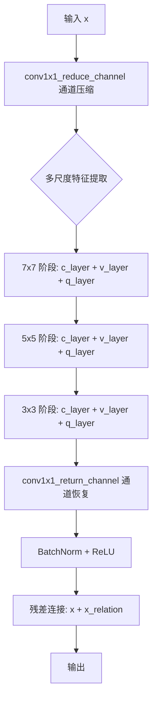
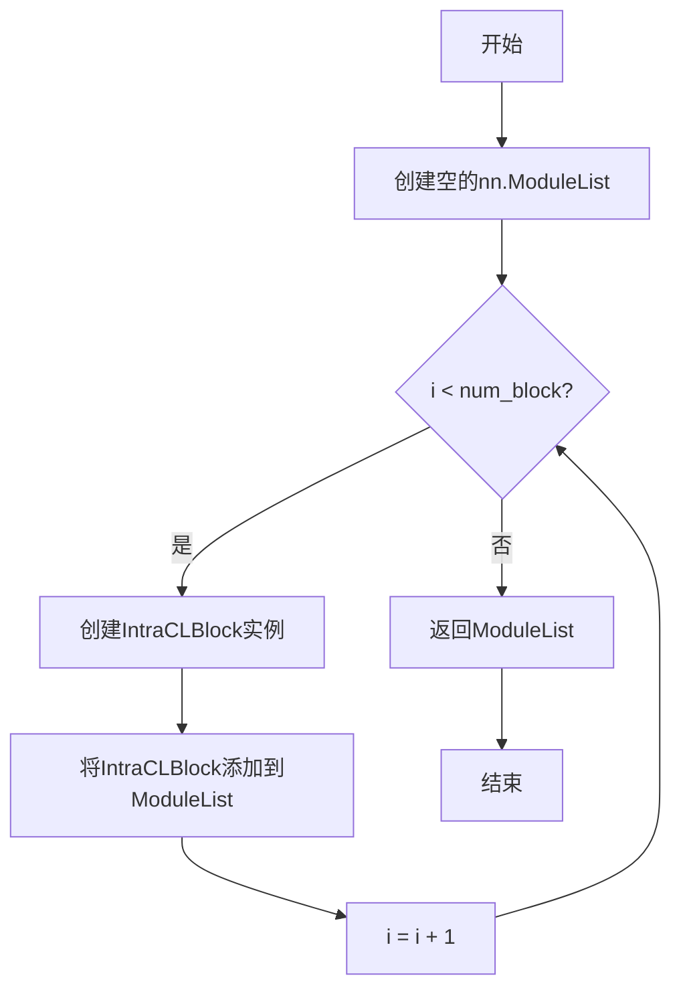
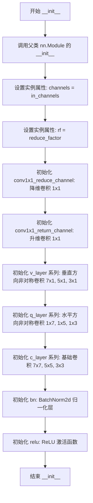
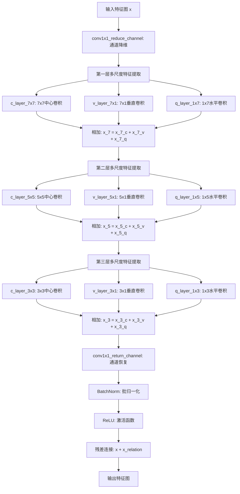

# `MinerU\mineru\model\utils\pytorchocr\modeling\necks\intracl.py` 详细设计文档

这是一个Intra-Channel Lattice Block（通道内晶格块）模块，用于深度学习中的通道间信息交互，通过多尺度卷积（垂直、水平、基础三个方向）提取特征并通过残差连接增强特征表达。

## 整体流程



## 类结构

```
nn.Module (PyTorch基类)
└── IntraCLBlock (通道内晶格块)
    ├── __init__ (初始化方法)
    └── forward (前向传播方法)

全局函数: build_intraclblock_list (构建模块列表)
```

## 全局变量及字段


### `build_intraclblock_list`
    
构建IntraCLBlock模块列表的函数，返回nn.ModuleList包含指定数量的IntraCLBlock实例

类型：`function`
    


### `IntraCLBlock.channels`
    
输入通道数

类型：`int`
    


### `IntraCLBlock.rf`
    
通道压缩因子，用于降低通道维度以减少计算量

类型：`int`
    


### `IntraCLBlock.conv1x1_reduce_channel`
    
1x1卷积层，用于将输入通道数压缩到reduced_channels

类型：`nn.Conv2d`
    


### `IntraCLBlock.conv1x1_return_channel`
    
1x1卷积层，用于将压缩后的通道数恢复到原始通道数

类型：`nn.Conv2d`
    


### `IntraCLBlock.v_layer_7x1`
    
7x1垂直卷积层，用于提取垂直方向的特征

类型：`nn.Conv2d`
    


### `IntraCLBlock.v_layer_5x1`
    
5x1垂直卷积层，用于提取垂直方向的特征

类型：`nn.Conv2d`
    


### `IntraCLBlock.v_layer_3x1`
    
3x1垂直卷积层，用于提取垂直方向的特征

类型：`nn.Conv2d`
    


### `IntraCLBlock.q_layer_1x7`
    
1x7水平卷积层，用于提取水平方向的特征

类型：`nn.Conv2d`
    


### `IntraCLBlock.q_layer_1x5`
    
1x5水平卷积层，用于提取水平方向的特征

类型：`nn.Conv2d`
    


### `IntraCLBlock.q_layer_1x3`
    
1x3水平卷积层，用于提取水平方向的特征

类型：`nn.Conv2d`
    


### `IntraCLBlock.c_layer_7x7`
    
7x7基础卷积层，用于提取局部空间特征

类型：`nn.Conv2d`
    


### `IntraCLBlock.c_layer_5x5`
    
5x5基础卷积层，用于提取局部空间特征

类型：`nn.Conv2d`
    


### `IntraCLBlock.c_layer_3x3`
    
3x3基础卷积层，用于提取局部空间特征

类型：`nn.Conv2d`
    


### `IntraCLBlock.bn`
    
批归一化层，用于加速训练和提升模型稳定性

类型：`nn.BatchNorm2d`
    


### `IntraCLBlock.relu`
    
ReLU激活函数，用于引入非线性

类型：`nn.ReLU`
    
    

## 全局函数及方法


### `build_intraclblock_list`

该函数用于构建IntraCLBlock模块列表，根据指定的块数量num_block创建对应数量的IntraCLBlock实例，并将它们存储在nn.ModuleList中以便统一管理参数。

参数：

- `num_block`：`int`，需要创建的IntraCLBlock模块数量

返回值：`nn.ModuleList`，包含num_block个IntraCLBlock模块的ModuleList对象

#### 流程图



#### 带注释源码

```
def build_intraclblock_list(num_block):
    """
    构建IntraCLBlock模块列表
    
    参数:
        num_block: int, 需要创建的IntraCLBlock模块数量
    
    返回:
        nn.ModuleList, 包含多个IntraCLBlock的模块列表
    """
    # 创建一个PyTorch的ModuleList容器，用于存储多个IntraCLBlock模块
    # ModuleList会自动管理其中所有模块的参数，便于GPU并行计算和参数优化
    IntraCLBlock_list = nn.ModuleList()
    
    # 循环创建指定数量的IntraCLBlock模块
    for i in range(num_block):
        # 每次循环创建一个新的IntraCLBlock实例（使用默认参数：in_channels=96, reduce_factor=4）
        # 并将其添加到ModuleList中
        IntraCLBlock_list.append(IntraCLBlock())
    
    # 返回包含所有IntraCLBlock模块的ModuleList对象
    return IntraCLBlock_list
```


### `IntraCLBlock.__init__`

这是 IntraCLBlock 类的构造函数，用于初始化 Intra-Channel Lightweight Block（通道内轻量级块）的所有卷积层和归一化层。该模块采用多尺度卷积核（3x3、5x5、7x7）与非对称卷积核（7x1、1x7等）组合，通过通道降维减少计算量，最后通过残差连接实现特征增强。

**参数：**

- `self`：隐含的实例本身，无需显式传递
- `in_channels`：`int`，输入特征图的通道数，默认为 96
- `reduce_factor`：`int`，通道减少因子，用于降维，默认为 4

**返回值：** `None`，构造函数无返回值

#### 流程图



#### 带注释源码

```python
def __init__(self, in_channels=96, reduce_factor=4):
    """
    构造函数，初始化 IntraCLBlock 的所有卷积层和归一化层
    
    参数:
        in_channels (int): 输入特征图的通道数，默认为 96
        reduce_factor (int): 通道减少因子，用于控制中间层通道数，默认为 4
    """
    # 调用 PyTorch nn.Module 的父类构造函数，完成模块初始化
    super(IntraCLBlock, self).__init__()
    
    # 保存输入通道数到实例属性
    self.channels = in_channels
    # 保存通道减少因子到实例属性
    self.rf = reduce_factor
    
    # ---------------------------------------------------
    # 通道维度变换卷积层
    # ---------------------------------------------------
    # 1x1 卷积：将通道数从 in_channels 减少到 in_channels // reduce_factor
    # 作用：降维以减少后续卷积的计算量
    self.conv1x1_reduce_channel = nn.Conv2d(
        self.channels, self.channels // self.rf, kernel_size=1, stride=1, padding=0
    )
    
    # 1x1 卷积：将通道数从 in_channels // reduce_factor 恢复到 in_channels
    # 作用：升维以匹配输入的通道维度
    self.conv1x1_return_channel = nn.Conv2d(
        self.channels // self.rf, self.channels, kernel_size=1, stride=1, padding=0
    )
    
    # ---------------------------------------------------
    # 垂直方向非对称卷积层 (V-Block)
    # 核大小为 (height, 1)，提取垂直方向特征
    # ---------------------------------------------------
    # 7x1 垂直卷积：核高度为7，提取大尺度垂直特征
    self.v_layer_7x1 = nn.Conv2d(
        self.channels // self.rf,
        self.channels // self.rf,
        kernel_size=(7, 1),
        stride=(1, 1),
        padding=(3, 0),
    )
    
    # 5x1 垂直卷积：核高度为5，提取中尺度垂直特征
    self.v_layer_5x1 = nn.Conv2d(
        self.channels // self.rf,
        self.channels // self.rf,
        kernel_size=(5, 1),
        stride=(1, 1),
        padding=(2, 0),
    )
    
    # 3x1 垂直卷积：核高度为3，提取小尺度垂直特征
    self.v_layer_3x1 = nn.Conv2d(
        self.channels // self.rf,
        self.channels // self.rf,
        kernel_size=(3, 1),
        stride=(1, 1),
        padding=(1, 0),
    )
    
    # ---------------------------------------------------
    # 水平方向非对称卷积层 (Q-Block)
    # 核大小为 (1, width)，提取水平方向特征
    # ---------------------------------------------------
    # 1x7 水平卷积：核宽度为7，提取大尺度水平特征
    self.q_layer_1x7 = nn.Conv2d(
        self.channels // self.rf,
        self.channels // self.rf,
        kernel_size=(1, 7),
        stride=(1, 1),
        padding=(0, 3),
    )
    
    # 1x5 水平卷积：核宽度为5，提取中尺度水平特征
    self.q_layer_1x5 = nn.Conv2d(
        self.channels // self.rf,
        self.channels // self.rf,
        kernel_size=(1, 5),
        stride=(1, 1),
        padding=(0, 2),
    )
    
    # 1x3 水平卷积：核宽度为3，提取小尺度水平特征
    self.q_layer_1x3 = nn.Conv2d(
        self.channels // self.rf,
        self.channels // self.rf,
        kernel_size=(1, 3),
        stride=(1, 1),
        padding=(0, 1),
    )
    
    # ---------------------------------------------------
    # 基础卷积层 (C-Block)
    # 使用方形卷积核，提取二维局部特征
    # ---------------------------------------------------
    # 7x7 卷积：提取大尺度局部特征
    self.c_layer_7x7 = nn.Conv2d(
        self.channels // self.rf,
        self.channels // self.rf,
        kernel_size=(7, 7),
        stride=(1, 1),
        padding=(3, 3),
    )
    
    # 5x5 卷积：提取中尺度局部特征
    self.c_layer_5x5 = nn.Conv2d(
        self.channels // self.rf,
        self.channels // self.rf,
        kernel_size=(5, 5),
        stride=(1, 1),
        padding=(2, 2),
    )
    
    # 3x3 卷积：提取小尺度局部特征
    self.c_layer_3x3 = nn.Conv2d(
        self.channels // self.rf,
        self.channels // self.rf,
        kernel_size=(3, 3),
        stride=(1, 1),
        padding=(1, 1),
    )
    
    # ---------------------------------------------------
    # 归一化和激活层
    # ---------------------------------------------------
    # BatchNorm2d：对通道维度进行归一化，加速训练收敛
    self.bn = nn.BatchNorm2d(self.channels)
    # ReLU：非线性激活函数，引入非线性变换
    self.relu = nn.ReLU()
```


### `IntraCLBlock.forward`

该方法实现了多尺度特征提取和残差连接的前向传播，通过通道降维、多层不同尺度卷积核（垂直、水平、中心）进行特征提取，最后通过残差连接将原始输入与提取的特征相加，以增强特征表达能力。

参数：

- `x`：`torch.Tensor`，输入特征图，形状为 (B, C, H, W)，其中 B 为批量大小，C 为通道数，H 和 W 分别为高度和宽度

返回值：`torch.Tensor`，经过多尺度特征提取和残差连接后的输出特征图，形状与输入相同 (B, C, H, W)

#### 流程图



#### 带注释源码

```python
def forward(self, x):
    """
    前向传播方法，实现多尺度特征提取和残差连接
    
    参数:
        x: 输入特征图，形状为 (B, C, H, W)
    
    返回:
        经过多尺度特征提取和残差连接后的输出特征图
    """
    # 步骤1: 通过1x1卷积将通道数从 C 降维到 C // reduce_factor
    # 目的: 减少计算量，降低参数量
    x_new = self.conv1x1_reduce_channel(x)

    # 步骤2: 第一层多尺度特征提取 (感受野: 7x7)
    # 使用三种不同方向的卷积核提取特征: 中心(7x7)、垂直(7x1)、水平(1x7)
    x_7_c = self.c_layer_7x7(x_new)   # 中心卷积: 提取局部中心特征
    x_7_v = self.v_layer_7x1(x_new)   # 垂直卷积: 提取垂直方向特征
    x_7_q = self.q_layer_1x7(x_new)   # 水平卷积: 提取水平方向特征
    x_7 = x_7_c + x_7_v + x_7_q        # 融合三种方向的特征

    # 步骤3: 第二层多尺度特征提取 (感受野: 5x5)
    # 在第一层输出的基础上进一步提取特征
    x_5_c = self.c_layer_5x5(x_7)      # 中心卷积: 5x5
    x_5_v = self.v_layer_5x1(x_7)      # 垂直卷积: 5x1
    x_5_q = self.q_layer_1x5(x_7)      # 水平卷积: 1x5
    x_5 = x_5_c + x_5_v + x_5_q        # 融合特征

    # 步骤4: 第三层多尺度特征提取 (感受野: 3x3)
    # 最后一层特征提取，进一步细化特征
    x_3_c = self.c_layer_3x3(x_5)      # 中心卷积: 3x3
    x_3_v = self.v_layer_3x1(x_5)      # 垂直卷积: 3x1
    x_3_q = self.q_layer_1x3(x_5)      # 水平卷积: 1x3
    x_3 = x_3_c + x_3_v + x_3_q        # 融合特征

    # 步骤5: 通过1x1卷积将通道数从 C // reduce_factor 恢复到 C
    x_relation = self.conv1x1_return_channel(x_3)

    # 步骤6: 批归一化 + ReLU激活函数
    x_relation = self.bn(x_relation)   # 批归一化: 加速训练，稳定梯度
    x_relation = self.relu(x_relation) # ReLU: 引入非线性

    # 步骤7: 残差连接 (Residual Connection)
    # 将原始输入与处理后的特征相加，缓解梯度消失问题
    return x + x_relation
```

## 关键组件


### IntraCLBlock（内部类内块模块）

核心卷积神经网络模块，实现多尺度特征提取与融合，通过通道降维、多尺度卷积核（7x7, 5x5, 3x3）和方向性卷积（垂直7x1/5x1/3x1，水平1x7/1x5/1x3）捕获空间关系，最后通过残差连接输出。

### 通道降维与恢复机制

使用1x1卷积实现通道数的 reduction 和 expansion，通过 reduce_factor 参数控制通道压缩比例，降低计算复杂度并提取紧凑特征表示。

### 多尺度卷积支路

三路并行卷积支路，分别使用 7x7、5x5、3x3 的卷积核进行多尺度空间特征提取，各支路输出通过加法融合，实现不同感受野的特征聚合。

### 垂直方向卷积层

使用 (7,1)、(5,1)、(3,1) 尺寸的卷积核沿高度方向提取特征，捕获垂直方向的上下文信息，用于建模行间依赖关系。

### 水平方向卷积层

使用 (1,7)、(1,5)、(1,3) 尺寸的卷积核沿宽度方向提取特征，捕获水平方向的上下文信息，用于建模列间依赖关系。

### 批归一化与激活层

采用 BatchNorm2d 进行特征归一化，配合 ReLU 激活函数引入非线性变换，稳定训练过程并加速收敛。

### 残差连接

将原始输入与处理后的特征进行元素级相加，实现梯度流动并缓解深层网络训练困难问题。

### build_intraclblock_list（全局函数）

工厂函数，用于创建多个 IntraCLBlock 实例的 ModuleList，支持堆叠多个块以构建更深层网络结构。


## 问题及建议


### 已知问题

-   **超参数硬编码**：卷积核大小（7x7, 5x5, 3x3）、填充大小、步长等参数均为硬编码，缺乏灵活性，无法通过参数配置调整多尺度策略
-   **代码重复**：forward方法中存在大量重复的卷积计算模式（c_layer + v_layer + q_layer），增加了维护成本；三个v_layer和三个q_layer的定义也高度相似
-   **参数数量过多**：每个IntraCLBlock包含15个卷积层（1个降维+1个升维+6个v/q层+3个c层+2个bn/relu+2个额外卷积），参数量较大
-   **通道匹配限制**：残差连接 `x + x_relation` 要求输入输出通道完全一致，无法处理需要调整通道数的场景
-   **缺少权重初始化**：未显式设置卷积层和BatchNorm的权重初始化，可能导致训练收敛不稳定
-   **中间变量显存占用**：x_7、x_5等中间结果会占用额外显存，优化空间未被挖掘

### 优化建议

-   **配置化设计**：将卷积核大小列表、reduce_factor等参数提取为可配置项，支持动态传入
-   **减少代码重复**：使用循环或工厂函数创建v_layer、q_layer系列卷积；封装多尺度卷积计算逻辑为私有方法
-   **可选择的残差连接**：增加可选的通道变换模块（如1x1卷积），使输入输出通道不同时也能使用残差连接
-   **添加权重初始化**：在__init__中或build函数中调用nn.init模块进行权重初始化（如kaiming_normal）
-   **显存优化**：考虑使用inplace=True的ReLU（nn.ReLU(inplace=True)），或在必要时使用torch.no_grad()避免中间变量存储梯度
-   **模块化v/q/c层创建**：提取多尺度卷积的创建逻辑为工具函数，接收核大小列表作为参数，提高代码复用性

## 其它


### 设计目标与约束

该代码实现了一个IntraCLBlock（内部对比学习块）模块，旨在通过多尺度卷积操作提取特征的空间关系信息。设计目标包括：1）通过通道缩减降低计算复杂度（reduce_factor=4）；2）采用多尺度卷积核（3x3、5x5、7x7）捕获不同范围的特征依赖；3）实现残差连接以保留原始特征信息；4）约束输入输出通道数保持一致，便于网络层叠使用。

### 错误处理与异常设计

代码主要依赖PyTorch框架的自动异常处理。当reduce_factor大于in_channels时，通道整除操作会抛出异常；当前向传播中输入张量维度不匹配时，卷积层会自动检测并报错。建议在调用前验证：1）in_channels能被reduce_factor整除；2）输入x为4D张量（batch, channel, height, width）；3）height和width大于等于对应的padding值以确保输出尺寸合法。

### 数据流与状态机

数据流遵循以下路径：输入x → 1x1卷积通道缩减 → 三个并行的7x7基卷积 + 7x1纵向卷积 + 1x7横向卷积 → 求和 → 5x5/5x1/1x5分支 → 求和 → 3x3/3x1/1x3分支 → 求和 → 1x1卷积恢复通道数 → BatchNorm → ReLU → 残差连接输出。状态转换主要体现在特征图尺寸保持不变（stride=1, padding适当），通道数先缩减后恢复。

### 外部依赖与接口契约

外部依赖包括：1）torch.nn.Module（基类）；2）torch.nn.Conv2d（二维卷积）；3）torch.nn.BatchNorm2d（批归一化）；4）torch.nn.ReLU（激活函数）。接口契约：build_intraclblock_list函数接受num_block整数参数，返回nn.ModuleList对象；IntraCLBlock的forward方法接受shape为(batch, in_channels, H, W)的4D张量，返回shape为(batch, in_channels, H, W)的张量。

### 性能考虑与优化空间

当前实现存在以下性能优化空间：1）可使用nn.Sequential合并连续的卷积操作以减少函数调用开销；2）可考虑使用torch.jit.script加速推理；3）可添加inplace=True的ReLU减少内存分配；4）当前实现未使用混合精度训练支持（torch.cuda.amp）；5）可考虑使用可分离卷积替代部分标准卷积以降低参数量。

### 配置参数说明

IntraCLBlock包含两个可配置参数：in_channels（默认96）定义输入输出通道数；reduce_factor（默认4）定义通道缩减比例，决定中间层通道数为in_channels//reduce_factor。build_intraclblock_list的num_block参数决定串联的模块数量。

### 使用示例

```python
# 创建单个模块
block = IntraCLBlock(in_channels=96, reduce_factor=4)
# 创建多个模块的列表
block_list = build_intraclblock_list(num_block=3)
# 前向传播
import torch
x = torch.randn(1, 96, 32, 32)
output = block(x)
# output shape: (1, 96, 32, 32)
```

### 单元测试建议

建议测试以下场景：1）默认参数下的前向传播输出形状正确性；2）自定义in_channels和reduce_factor的参数兼容性；3）多模块串联时的梯度传播；4）残差连接的有效性（输出与输入形状一致）；5）空输入或异常维度输入的错误处理；6）模型eval模式下的BatchNorm行为。

    