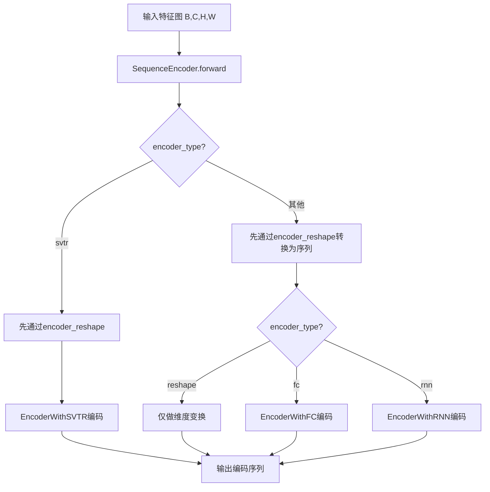
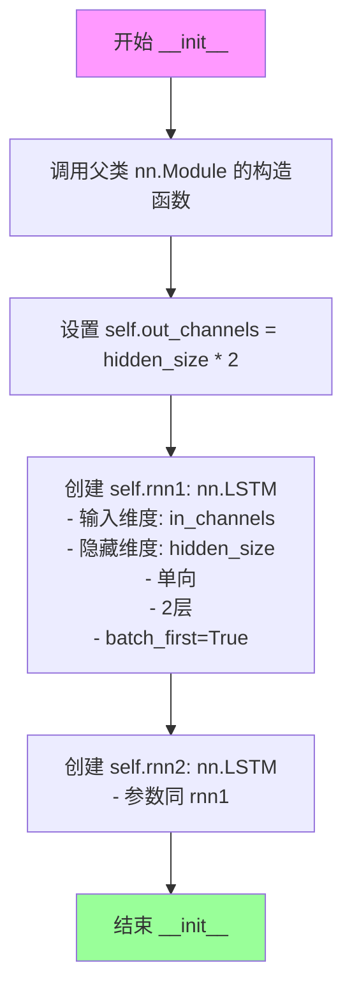
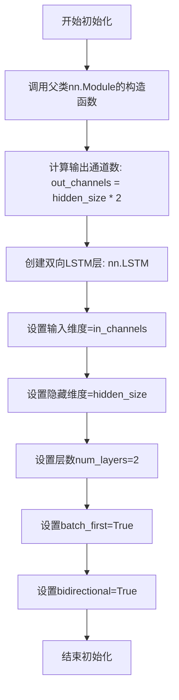
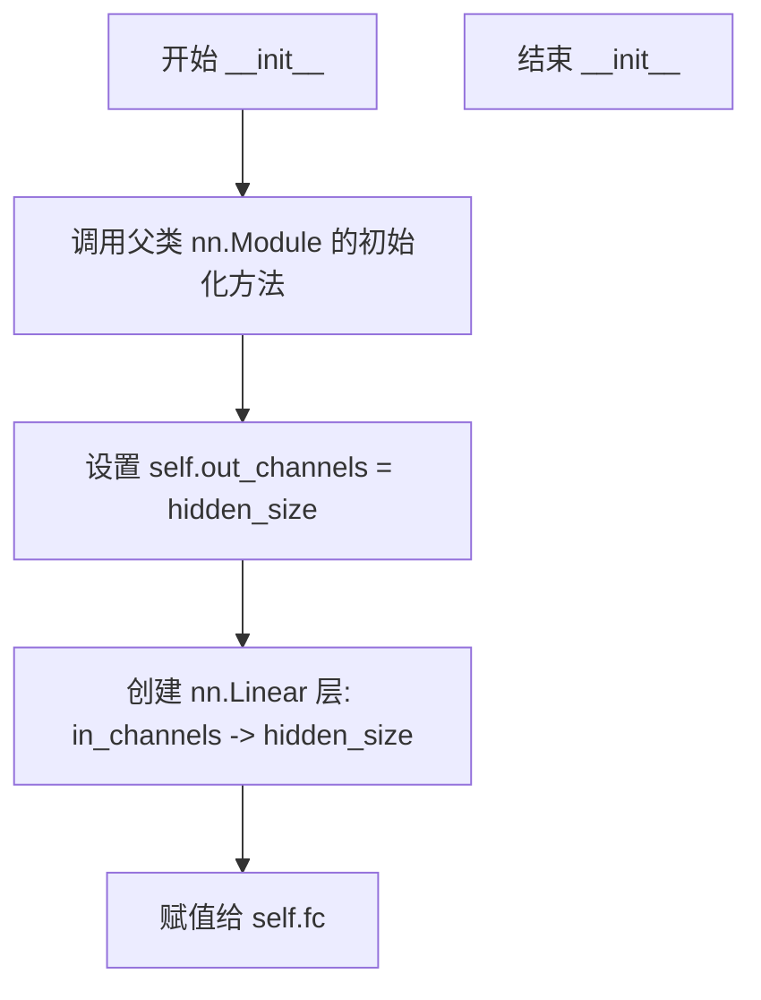
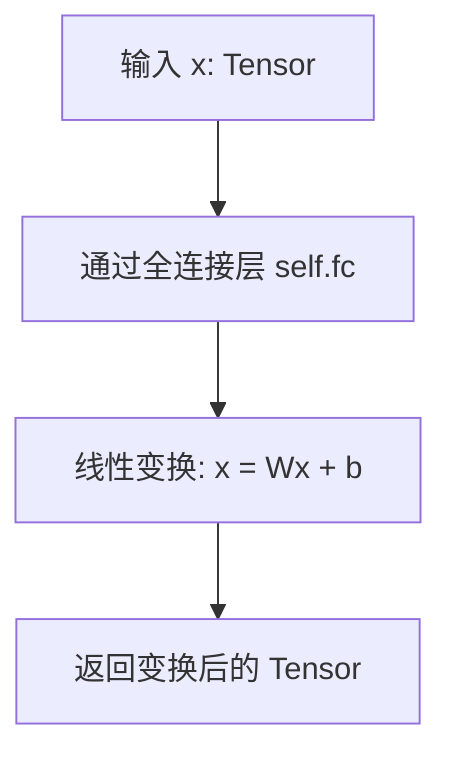
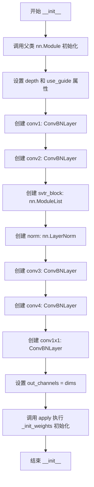
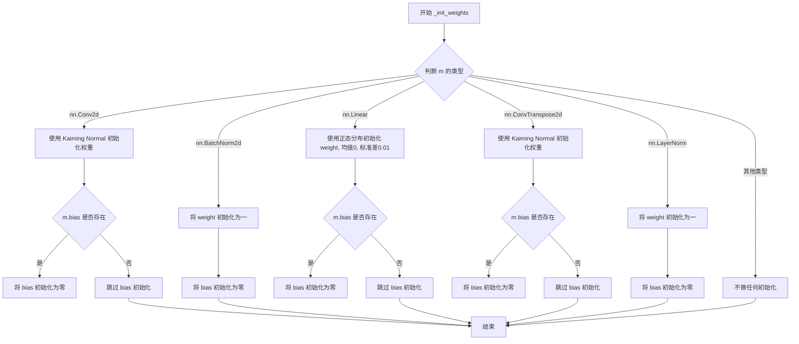
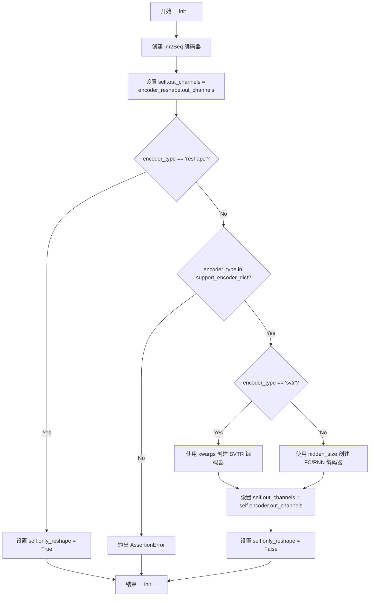

# `MinerU\mineru\model\utils\pytorchocr\modeling\necks\rnn.py` 详细设计文档

该模块实现了多种序列编码器，用于将图像特征图转换为序列表示，支持reshape、FC、RNN和SVTR等多种编码方式，适用于OCR等序列识别任务。

## 整体流程



## 类结构

```
nn.Module (PyTorch基类)
├── Im2Seq
├── EncoderWithRNN_ (双单向LSTM)
├── EncoderWithRNN (双向LSTM)
├── EncoderWithFC (全连接层)
├── EncoderWithSVTR (Transformer编码器)
│   └── 使用 backbones.rec_svtrnet.Block, ConvBNLayer
└── SequenceEncoder (主编码器，根据类型选择具体编码器)
```

## 全局变量及字段


### `Im2Seq.out_channels`
    
输出通道数

类型：`int`
    


### `EncoderWithRNN_.out_channels`
    
输出通道数

类型：`int`
    


### `EncoderWithRNN_.rnn1`
    
第一个LSTM层

类型：`nn.LSTM`
    


### `EncoderWithRNN_.rnn2`
    
第二个LSTM层

类型：`nn.LSTM`
    


### `EncoderWithRNN.out_channels`
    
输出通道数

类型：`int`
    


### `EncoderWithRNN.lstm`
    
双向LSTM层

类型：`nn.LSTM`
    


### `EncoderWithFC.out_channels`
    
输出通道数

类型：`int`
    


### `EncoderWithFC.fc`
    
全连接层

类型：`nn.Linear`
    


### `EncoderWithSVTR.depth`
    
SVTR块深度

类型：`int`
    


### `EncoderWithSVTR.use_guide`
    
是否使用guide

类型：`bool`
    


### `EncoderWithSVTR.conv1`
    
卷积层1

类型：`ConvBNLayer`
    


### `EncoderWithSVTR.conv2`
    
卷积层2

类型：`ConvBNLayer`
    


### `EncoderWithSVTR.conv3`
    
卷积层3

类型：`ConvBNLayer`
    


### `EncoderWithSVTR.conv4`
    
卷积层4

类型：`ConvBNLayer`
    


### `EncoderWithSVTR.svtr_block`
    
Transformer块列表

类型：`nn.ModuleList`
    


### `EncoderWithSVTR.norm`
    
层归一化

类型：`nn.LayerNorm`
    


### `EncoderWithSVTR.conv1x1`
    
1x1卷积

类型：`ConvBNLayer`
    


### `EncoderWithSVTR.out_channels`
    
输出通道数

类型：`int`
    


### `SequenceEncoder.encoder_reshape`
    
形状变换编码器

类型：`Im2Seq`
    


### `SequenceEncoder.out_channels`
    
输出通道数

类型：`int`
    


### `SequenceEncoder.encoder_type`
    
编码器类型

类型：`str`
    


### `SequenceEncoder.encoder`
    
实际编码器

类型：`nn.Module`
    


### `SequenceEncoder.only_reshape`
    
是否仅做形状变换

类型：`bool`
    
    

## 全局函数及方法


### `Im2Seq.__init__`

初始化Im2Seq模块，将图像特征转换为序列表示，并设置输出通道数等于输入通道数。

参数：

- `in_channels`：`int`，输入图像的通道数，用于设置输出通道数
- `**kwargs`：`dict`，可选关键字参数，当前未使用但保留用于接口兼容性

返回值：`None`，该方法为初始化方法，不返回任何值

#### 流程图

```mermaid
flowchart TD
    A[开始 __init__] --> B[调用父类初始化 super().__init__]
    B --> C[设置 self.out_channels = in_channels]
    C --> D[结束]
```

#### 带注释源码

```python
def __init__(self, in_channels, **kwargs):
    """
    初始化Im2Seq模块
    
    参数:
        in_channels: 输入图像的通道数
        **kwargs: 额外的关键字参数（可选，当前未使用）
    """
    # 调用父类nn.Module的初始化方法
    super().__init__()
    
    # 设置输出通道数等于输入通道数
    # 这个值会在forward方法中被使用来处理输入张量
    self.out_channels = in_channels
```

#### 备注

- 该方法是`Im2Seq`类的构造函数，继承自`nn.Module`
- `self.out_channels`作为类的属性被初始化，用于在后续的`SequenceEncoder`类中获取输出通道信息
- `**kwargs`参数的存在是为了保持接口灵活性，允许其他模块传递额外参数而不影响当前模块的初始化
- 该类的核心功能在`forward`方法中实现：将4D张量(B, C, H, W)转换为3D序列张量(B, W, C)


### `Im2Seq.forward`

该方法将四维图像张量转换为三维序列张量，通过压缩高度维度并将通道维度移至最后，实现从 (B, C, H, W) 到 (B, W, C) 的形状变换，以适配序列编码器的输入格式。

参数：

-  `x`：`torch.Tensor`，形状为 (B, C, H, W) 的四维张量，其中 B 为 batch size，C 为通道数，H 为高度，W 为宽度

返回值：`torch.Tensor`，形状为 (B, W, C) 的三维张量，其中 W 变为序列长度，C 成为特征维度

#### 流程图

```mermaid
flowchart TD
    A[输入 x: (B, C, H, W)] --> B[解包形状: B, C, H, W = x.shape]
    B --> C[squeeze(dim=2): 移除H维度<br/>从 (B, C, H, W) 变为 (B, C, W)]
    C --> D[permute(0, 2, 1): 维度重排<br/>从 (B, C, W) 变为 (B, W, C)]
    D --> E[输出: (B, W, C)]
```

#### 带注释源码

```python
def forward(self, x):
    """
    将四维图像张量转换为三维序列张量

    参数:
        x: 输入张量，形状为 (B, C, H, W)
           - B: batch size
           - C: 通道数 (即 in_channels)
           - H: 高度 (通常为1)
           - W: 宽度 (序列长度)

    返回:
        输出张量，形状为 (B, W, C)
           - B: batch size (保持不变)
           - W: 宽度 (变为序列长度)
           - C: 通道数 (变为特征维度)
    """
    # 解包输入张量的维度
    # B: batch size, C: 通道数, H: 高度, W: 宽度
    B, C, H, W = x.shape
    
    # 移除高度维度 (H维度)
    # 如果 H=1，则从 (B, C, 1, W) 变为 (B, C, W)
    # 使用 squeeze 而非 squeeze_，避免原地操作
    x = x.squeeze(dim=2)
    
    # 维度重排：从 (B, C, W) 变为 (B, W, C)
    # 目的：将宽度维度移至序列位置，通道维度移至特征位置
    # 注释: paddle 采用 (NTC) 格式 (batch, width, channels)
    # permute 等价于 transpose(0, 1, 2) 的更通用形式
    x = x.permute(0, 2, 1)
    
    # 返回转换后的序列张量
    return x
```


### EncoderWithRNN_.__init__

该方法是 `EncoderWithRNN_` 类的构造函数，用于初始化一个基于双层LSTM的双向序列编码器。它创建两个独立的单向LSTM层，一个在原始序列上运行，另一个在翻转的序列上运行，最终通过拼接和翻转操作实现双向编码效果。

参数：

- `in_channels`：`int`，输入特征的通道数，即每个时间步的输入向量维度
- `hidden_size`：`int`，LSTM隐藏层的维度大小

返回值：`None`，构造函数无返回值

#### 流程图



#### 带注释源码

```
def __init__(self, in_channels, hidden_size):
    """
    初始化双向RNN编码器
    
    参数:
        in_channels: int, 输入特征的维度（通道数）
        hidden_size: int, LSTM隐藏层单元数
    """
    # 调用父类nn.Module的构造函数，完成模块的初始化
    super(EncoderWithRNN_, self).__init__()
    
    # 设置输出通道数为hidden_size的两倍
    # 因为最终会将两个单向LSTM的输出拼接起来
    self.out_channels = hidden_size * 2
    
    # 创建第一个LSTM层（前向LSTM）
    # 参数说明:
    # - input_size: in_channels（输入特征维度）
    # - hidden_size: hidden_size（隐藏层维度）
    # - bidirectional: False（单向）
    # - batch_first: True（输入输出格式为(batch, seq, feature)）
    # - num_layers: 2（双层LSTM）
    self.rnn1 = nn.LSTM(
        in_channels,
        hidden_size,
        bidirectional=False,
        batch_first=True,
        num_layers=2,
    )
    
    # 创建第二个LSTM层（后向LSTM，用于模拟双向效果）
    # 第二个LSTM会在forward方法中处理翻转后的输入
    # 然后再将输出翻转回来，与第一个LSTM的输出拼接
    self.rnn2 = nn.LSTM(
        in_channels,
        hidden_size,
        bidirectional=False,
        batch_first=True,
        num_layers=2,
    )
```


### EncoderWithRNN_.forward

该方法使用两个单向LSTM分别处理原始序列和翻转后的序列，通过双向特征融合实现序列的上下文编码，输出拼接后的特征表示。

参数：
- `x`：`torch.Tensor`，形状为 (batch_size, sequence_length, in_channels)，通常为经过Im2Seq变换后的序列数据，sequence_length对应宽度维度，in_channels对应通道数。

返回值：`torch.Tensor`，形状为 (batch_size, sequence_length, hidden_size * 2)，两个LSTM输出在特征维度拼接后的编码结果。

#### 流程图

```mermaid
graph TD
    A[输入 x: (B, seq_len, in_channels)] --> B[调用 flatten_parameters 优化 RNN 参数]
    B --> C[第一个 LSTM 处理原始序列]
    B --> D[第二个 LSTM 处理翻转序列]
    C --> E[out1, h1 = self.rnn1(x)]
    D --> F[out2, h2 = self.rnn2(torch.flip(x, 1))]
    E --> G[在维度2拼接 out1 和 翻转后的 out2]
    F --> G
    G --> H[torch.cat([out1, torch.flip(out2, 1)], 2)]
    H --> I[输出: (B, seq_len, hidden_size*2)]
```

#### 带注释源码

```
def forward(self, x):
    """
    前向传播：使用双LSTM进行双向序列编码

    参数:
        x: 输入张量，形状为 (batch_size, seq_len, in_channels)

    返回:
        拼接后的编码张量，形状为 (batch_size, seq_len, hidden_size*2)
    """
    # 优化 LSTM 参数以提升计算效率（尤其在 GPU 上）
    self.rnn1.flatten_parameters()
    self.rnn2.flatten_parameters()

    # 第一个 LSTM 处理原始序列方向
    # 输入: (B, seq_len, in_channels)
    # 输出: (B, seq_len, hidden_size)
    out1, h1 = self.rnn1(x)

    # 第二个 LSTM 处理翻转的序列（反向）
    # torch.flip(x, [1]) 将序列维度翻转，实现从后向前的处理
    # 输入: (B, seq_len, in_channels)
    # 输出: (B, seq_len, hidden_size)
    out2, h2 = self.rnn2(torch.flip(x, [1]))

    # 将第二个 LSTM 的输出翻转回原始顺序
    # 使得 forward 和 backward 的特征对齐
    # 然后在特征维度（dim=2）拼接两个方向的结果
    # 最终输出: (B, seq_len, hidden_size * 2)
    output = torch.cat([out1, torch.flip(out2, [1])], dim=2)

    return output
```


### `EncoderWithRNN.__init__`

该方法是`EncoderWithRNN`类的构造函数，用于初始化一个基于双向LSTM的序列编码器，将输入特征通过双向LSTM层进行编码，输出通道数为隐藏层大小的两倍（因双向）。

参数：

- `in_channels`：`int`，输入特征的通道数，即LSTM输入的维度
- `hidden_size`：`int`，LSTM隐藏层的维度，决定了编码后每个时间步的输出维度

返回值：`None`，该方法为构造函数，不返回任何值，仅初始化对象属性

#### 流程图



#### 带注释源码

```python
class EncoderWithRNN(nn.Module):
    def __init__(self, in_channels, hidden_size):
        """
        初始化EncoderWithRNN编码器
        
        参数:
            in_channels: 输入特征的通道数（维度）
            hidden_size: LSTM隐藏层的维度
        """
        # 调用父类nn.Module的构造函数，完成PyTorch模块的初始化
        super(EncoderWithRNN, self).__init__()
        
        # 计算输出通道数：双向LSTM输出为hidden_size的2倍（正向+反向）
        self.out_channels = hidden_size * 2
        
        # 创建双向LSTM层
        # 参数说明：
        # - input_size: in_channels，输入特征的维度
        # - hidden_size: hidden_size，隐藏层维度
        # - num_layers=2，使用2层LSTM堆叠
        # - batch_first=True，输入输出张量形状为(batch, seq, feature)
        # - bidirectional=True，使用双向LSTM
        self.lstm = nn.LSTM(
            in_channels, hidden_size, num_layers=2, batch_first=True, bidirectional=True
        )  # batch_first:=True
```


### `EncoderWithRNN.forward`

该方法接收一个形状为 (Batch, Sequence, InputFeatures) 的三维张量（即经过 Im2Seq 处理后的序列数据），利用双向 LSTM 对序列进行前后向特征提取与编码，最终返回形状为 (Batch, Sequence, HiddenSize*2) 的编码序列张量。

参数：

- `x`：`torch.Tensor`，输入的三维张量。通常为 (B, W, C) 形状，其中 B 为批次大小，W 为序列长度（对应特征图宽度），C 为输入通道数（即特征维度）。

返回值：`torch.Tensor`，编码后的序列张量。形状为 (B, W, hidden_size * 2)，其中 hidden_size 是 LSTM 的隐藏层大小，*2 代表双向（bidirectional）输出拼接。

#### 流程图

```mermaid
graph LR
    A[输入 x<br>(B, W, C)] --> B[双向 LSTM<br>self.lstm]
    B --> C[输出张量<br>(B, W, hidden_size * 2)]
```

#### 带注释源码

```python
class EncoderWithRNN(nn.Module):
    def __init__(self, in_channels, hidden_size):
        super(EncoderWithRNN, self).__init__()
        self.out_channels = hidden_size * 2
        # 定义双向两层 LSTM
        self.lstm = nn.LSTM(
            in_channels, hidden_size, num_layers=2, batch_first=True, bidirectional=True
        )  # batch_first:=True

    def forward(self, x):
        # x: 输入序列，形状为 (batch_size, sequence_length, in_channels)
        # 执行 LSTM 计算
        # 返回的 x 为所有时间步的隐藏状态，形状 (batch, seq_len, hidden_size * 2)
        x, _ = self.lstm(x)
        return x
```


### `EncoderWithFC.__init__`

这是 EncoderWithFC 类的初始化方法，负责构建一个基于全连接层的序列编码器，创建一个线性变换层将输入特征映射到指定的隐藏维度，并设置输出通道数。

参数：

- `in_channels`：`int`，输入特征的通道数，即输入张量的最后一个维度的大小
- `hidden_size`：`int`，隐藏层维度，即线性变换后输出特征的维度

返回值：`None`，构造函数没有返回值，仅进行对象属性的初始化

#### 流程图



#### 带注释源码

```python
class EncoderWithFC(nn.Module):
    def __init__(self, in_channels, hidden_size):
        """
        初始化基于全连接层的编码器
        
        参数:
            in_channels: 输入特征的通道数
            hidden_size: 隐藏层维度，用于设置输出通道数和全连接层输出维度
        """
        # 调用父类 nn.Module 的 __init__，注册内部组件
        super(EncoderWithFC, self).__init__()
        
        # 设置输出通道数，等于隐藏层大小
        # 该属性供外部（如 SequenceEncoder）获取编码器的输出维度
        self.out_channels = hidden_size
        
        # 创建全连接层（线性变换）
        # 输入: (batch, seq_len, in_channels)
        # 输出: (batch, seq_len, hidden_size)
        self.fc = nn.Linear(
            in_channels,    # 输入特征维度
            hidden_size,   # 输出特征维度
            bias=True,     # 启用偏置项
        )
```


### `EncoderWithFC.forward`

这是一个基于全连接层的序列编码器，通过线性变换将输入特征映射到隐藏空间。

参数：

- `self`：隐式参数，PyTorch 模块实例本身
- `x`：`Tensor`，输入张量，形状为 (batch_size, in_channels) 或 (batch_size, seq_len, in_channels)

返回值：`Tensor`，经过全连接层线性变换后的输出张量，形状为 (batch_size, hidden_size) 或 (batch_size, seq_len, hidden_size)

#### 流程图



#### 带注释源码

```python
class EncoderWithFC(nn.Module):
    """
    基于全连接层的序列编码器
    通过单个线性变换层将输入特征映射到指定的隐藏维度空间
    """
    
    def __init__(self, in_channels, hidden_size):
        """
        初始化编码器
        
        参数:
            in_channels: int, 输入特征的通道数/维度
            hidden_size: int, 输出隐藏层的维度
        """
        super(EncoderWithFC, self).__init__()
        self.out_channels = hidden_size  # 输出通道数等于隐藏层大小
        # 定义全连接线性层: in_channels -> hidden_size
        self.fc = nn.Linear(
            in_channels,
            hidden_size,
            bias=True,  # 启用偏置
        )

    def forward(self, x):
        """
        前向传播
        
        参数:
            x: Tensor, 输入张量，形状为 (B, C) 或 (B, seq_len, C)
               B: batch size, C: in_channels
        
        返回:
            Tensor, 变换后的张量，形状为 (B, hidden_size) 或 (B, seq_len, hidden_size)
        """
        x = self.fc(x)  # 应用线性变换: output = input * W^T + b
        return x        # 返回变换后的特征向量
```


### `EncoderWithSVTR.__init__`

EncoderWithSVTR类的初始化方法，负责构建基于SVTR（Scene Text Recognition with Vision Transformer）架构的编码器，包含多个卷积层、SVTR块模块列表、层归一化以及权重初始化逻辑。

参数：

- `in_channels`：`int`，输入特征图的通道数
- `dims`：`int`，输出通道数，默认为64
- `depth`：`int`，SVTR块的堆叠深度，默认为2
- `hidden_dims`：`int`，隐藏层维度，默认为120
- `use_guide`：`bool`，是否使用guide机制，默认为False
- `num_heads`：`int`，注意力机制的头数，默认为8
- `qkv_bias`：`bool`，是否在QKV线性层中使用偏置，默认为True
- `mlp_ratio`：`float`，MLP隐藏层扩展比例，默认为2.0
- `drop_rate`：`float`，Dropout比例，默认为0.1
- `kernel_size`：`list`，卷积核大小，默认为[3, 3]
- `attn_drop_rate`：`float`，注意力层的Dropout比例，默认为0.1
- `drop_path`：`float`，Drop path比例，默认为0.0
- `qk_scale`：`float`，QK缩放因子，默认为None

返回值：`None`，该方法为初始化方法，不返回任何值

#### 流程图



#### 带注释源码

```python
def __init__(
    self,
    in_channels,
    dims=64,  # XS
    depth=2,
    hidden_dims=120,
    use_guide=False,
    num_heads=8,
    qkv_bias=True,
    mlp_ratio=2.0,
    drop_rate=0.1,
    kernel_size=[3, 3],
    attn_drop_rate=0.1,
    drop_path=0.0,
    qk_scale=None,
):
    """
    初始化SVTR编码器

    参数:
        in_channels: 输入特征图的通道数
        dims: 输出维度，默认64（XS模型规模）
        depth: SVTR块的堆叠层数，默认2
        hidden_dims: 隐藏层维度，默认120
        use_guide: 是否使用guide机制，默认False
        num_heads: 注意力头数，默认8
        qkv_bias: 是否使用QKV偏置，默认True
        mlp_ratio: MLP扩展比例，默认2.0
        drop_rate: Dropout比例，默认0.1
        kernel_size: 卷积核大小，默认[3, 3]
        attn_drop_rate: 注意力Dropout比例，默认0.1
        drop_path: Drop path比例，默认0.0
        qk_scale: QK缩放因子，默认为None（使用默认计算方式）
    """
    # 调用父类nn.Module的初始化方法
    super(EncoderWithSVTR, self).__init__()

    # 保存SVTR块的深度
    self.depth = depth
    # 保存是否使用guide的标志
    self.use_guide = use_guide

    # 第一个卷积块：降维卷积，将通道数减少到in_channels//8
    # 使用swish激活函数
    self.conv1 = ConvBNLayer(
        in_channels,
        in_channels // 8,
        kernel_size=kernel_size,
        padding=[kernel_size[0] // 2, kernel_size[1] // 2],
        act="swish",
    )

    # 第二个卷积块：进一步处理，将通道数转换为hidden_dims
    # 使用1x1卷积和swish激活
    self.conv2 = ConvBNLayer(
        in_channels // 8, hidden_dims, kernel_size=1, act="swish"
    )

    # 创建SVTR块的ModuleList，包含depth个Block
    # 每个Block是一个基于Transformer的全局混合器
    self.svtr_block = nn.ModuleList(
        [
            Block(
                dim=hidden_dims,
                num_heads=num_heads,
                mixer="Global",
                HW=None,
                mlp_ratio=mlp_ratio,
                qkv_bias=qkv_bias,
                qk_scale=qk_scale,
                drop=drop_rate,
                act_layer="swish",
                attn_drop=attn_drop_rate,
                drop_path=drop_path,
                norm_layer="nn.LayerNorm",
                epsilon=1e-05,
                prenorm=False,
            )
            for i in range(depth)
        ]
    )

    # 层归一化，用于SVTR块输出
    self.norm = nn.LayerNorm(hidden_dims, eps=1e-6)

    # 第三个卷积块：将hidden_dims通道数恢复回in_channels
    self.conv3 = ConvBNLayer(hidden_dims, in_channels, kernel_size=1, act="swish")

    # 第四个卷积块：输入是原始输入tensor和conv3输出tensor的concat
    # 因此输入通道数为2*in_channels，输出通道数为in_channels//8
    # 使用3x3卷积（padding=1）和swish激活
    self.conv4 = ConvBNLayer(
        2 * in_channels, in_channels // 8, padding=1, act="swish"
    )

    # 最后的1x1卷积：将通道数转换为目标输出dims
    self.conv1x1 = ConvBNLayer(in_channels // 8, dims, kernel_size=1, act="swish")

    # 设置输出通道数
    self.out_channels = dims

    # 应用权重初始化函数到所有子模块
    self.apply(self._init_weights)
```


### `EncoderWithSVTR._init_weights`

该方法是 `EncoderWithSVTR` 类的权重初始化方法，针对不同类型的神经网络层（卷积层、批归一化层、线性层、转置卷积层、层归一化层）采用相应的权重初始化策略，以确保模型训练的稳定性和收敛性。

参数：

- `m`：`torch.nn.Module`，待初始化的神经网络模块

返回值：`None`，无返回值，仅对传入的模块进行原地修改

#### 流程图



#### 带注释源码

```python
def _init_weights(self, m):
    """
    初始化模型权重
    
    根据传入模块的类型，采用不同的权重初始化策略：
    - 卷积层: Kaiming 正态初始化，适合 ReLU 激活函数
    - 批归一化层: 权重设为 1，偏差设为 0
    - 线性层: 正态分布初始化，标准差为 0.01
    - 转置卷积层: Kaiming 正态初始化
    - 层归一化: 权重设为 1，偏差设为 0
    
    参数:
        m: torch.nn.Module，待初始化的神经网络模块
    
    返回:
        None (原地修改，不返回值)
    """
    # 权重初始化
    if isinstance(m, nn.Conv2d):
        # 卷积层使用 Kaiming 正态初始化
        # mode='fan_out' 表示输出方向的扇出，用于保持梯度流
        nn.init.kaiming_normal_(m.weight, mode="fan_out")
        if m.bias is not None:
            # 如果存在偏置，初始化为零
            nn.init.zeros_(m.bias)
    elif isinstance(m, nn.BatchNorm2d):
        # 批归一化层: 权重设为 1（方差为 1）
        nn.init.ones_(m.weight)
        # 偏差设为 0（均值为 0）
        nn.init.zeros_(m.bias)
    elif isinstance(m, nn.Linear):
        # 线性层使用正态分布初始化
        # 均值为 0，标准差为 0.01
        nn.init.normal_(m.weight, 0, 0.01)
        if m.bias is not None:
            # 如果存在偏置，初始化为零
            nn.init.zeros_(m.bias)
    elif isinstance(m, nn.ConvTranspose2d):
        # 转置卷积层使用 Kaiming 正态初始化
        # 常用于上采样操作
        nn.init.kaiming_normal_(m.weight, mode="fan_out")
        if m.bias is not None:
            # 如果存在偏置，初始化为零
            nn.init.zeros_(m.bias)
    elif isinstance(m, nn.LayerNorm):
        # 层归一化: 权重设为 1（缩放因子）
        nn.init.ones_(m.weight)
        # 偏差设为 0（偏移量）
        nn.init.zeros_(m.bias)
```


### `EncoderWithSVTR.forward`

该方法是 SVTR (Scene Text Recognition with Vision Transformer based method) 编码器的核心前向传播逻辑，负责对输入特征图进行维度压缩、序列变换、Transformer块处理、特征融合与维度恢复，输出增强后的特征表示。

参数：

- `x`：`torch.Tensor`，输入特征张量，形状为 (B, C, H, W)，其中 B 为批量大小，C 为通道数，H 为高度，W 为宽度。

返回值：`torch.Tensor`，输出特征张量，形状为 (B, dims, H, W)，dims 为输出通道数（由初始化参数 dims 指定，默认为 64）。

#### 流程图

```mermaid
flowchart TD
    A[输入 x: (B, C, H, W)] --> B{use_guide?}
    B -->|True| C[z = x.clone<br/>z.stop_gradient = True]
    B -->|False| D[z = x]
    C --> E[h = z 保存 shortcut]
    D --> E
    E --> F[z = conv1(z)<br/>通道压缩]
    F --> G[z = conv2(z)<br/>维度变换]
    G --> H[B, C', H, W = z.shape]
    H --> I[z = z.flatten(2).permute(0, 2, 1)<br/>转换为序列: (B, H*W, C')]
    I --> J[for blk in svtr_block]
    J -->|each block| K[z = blk(z)<br/>Transformer处理]
    K --> J
    J --> L[z = norm(z)<br/>LayerNorm]
    L --> M[z = reshape(-1, H, W, C').permute(0, 3, 1, 2)<br/>恢复空间结构]
    M --> N[z = conv3(z)<br/>通道变换]
    N --> O[z = concat[h, z]<br/>特征融合]
    O --> P[z = conv4(z) → conv1x1(z)<br/>维度恢复]
    P --> Q[输出 z: (B, dims, H, W)]
```

#### 带注释源码

```python
def forward(self, x):
    """
    SVTR 编码器的前向传播
    
    处理流程：
    1. 条件分支处理 guide 模式（用于指导训练）
    2. 保存 shortcut 连接
    3. 通道维度压缩（conv1 + conv2）
    4. 空间到序列变换
    5. Transformer 块序列处理
    6. 序列到空间恢复
    7. 残差融合与维度恢复
    """
    # 用于 guide 模式：克隆输入并停止梯度，用于辅助训练
    if self.use_guide:
        z = x.clone()
        z.stop_gradient = True
    else:
        z = x
    
    # 保存原始特征用于后续残差连接（shortcut）
    h = z
    
    # 通道压缩第一步：通过 3x3 卷积将通道从 in_channels 降至 in_channels//8
    z = self.conv1(z)
    
    # 通道压缩第二步：通过 1x1 卷积将通道从 in_channels//8 升至 hidden_dims
    z = self.conv2(z)
    
    # 获取当前特征图尺寸
    B, C, H, W = z.shape  # B=批量, C=hidden_dims, H=高, W=宽
    
    # 将空间维度展平为序列长度： (B, C, H, W) -> (B, H*W, C)
    # flatten(2) 将 H 和 W 维度展平 -> (B, C, H*W)
    # permute(0, 2, 1) 调整为 (B, H*W, C) 序列格式
    z = z.flatten(2).permute(0, 2, 1)
    
    # 遍历 SVTR Transformer 块进行全局上下文建模
    for blk in self.svtr_block:
        z = blk(z)  # 每个 block 包含多头注意力 + FFN
    
    # 层归一化
    z = self.norm(z)
    
    # 恢复空间结构：序列 -> (B, H, W, C) -> (B, C, H, W)
    z = z.reshape([-1, H, W, C]).permute(0, 3, 1, 2)
    
    # 通过卷积将通道从 hidden_dims 恢复到 in_channels
    z = self.conv3(z)
    
    # 残差连接：将原始特征 h 与处理后的特征 z 在通道维度拼接
    # 拼接后通道数为 2 * in_channels
    z = torch.cat((h, z), dim=1)
    
    # 再次通过 3x3 卷积和 1x1 卷积进行特征整合与维度压缩到 dims
    z = self.conv1x1(self.conv4(z))
    
    # 返回最终特征： (B, dims, H, W)
    return z
```


### SequenceEncoder.__init__

该方法是 `SequenceEncoder` 类的构造函数，用于初始化序列编码器。它根据传入的 `encoder_type` 参数创建不同类型的编码器（支持 "reshape"、"fc"、"rnn"、"svtr" 四种模式），并将输入张量从四维转换为序列形式，同时根据编码器类型设置相应的隐藏层大小和输出通道数。

参数：

-  `in_channels`：`int`，输入特征通道数，决定了输入数据的维度
-  `encoder_type`：`str`，编码器类型，支持 "reshape"（仅重塑）、"fc"（全连接层）、"rnn"（循环神经网络）、"svtr"（SVTR视觉变换器）四种模式
-  `hidden_size`：`int`，隐藏层大小，默认为 48，用于控制 RNN 和 FC 编码器的隐藏层维度
-  `**kwargs`：`dict`，可变关键字参数，用于传递给 SVTR 编码器的额外配置（如 dims、depth、num_heads 等）

返回值：`None`，构造函数不返回值，仅初始化对象状态

#### 流程图



#### 带注释源码

```python
def __init__(self, in_channels, encoder_type, hidden_size=48, **kwargs):
    """
    序列编码器初始化方法
    
    参数:
        in_channels: 输入通道数，用于初始化 Im2Seq 和各编码器
        encoder_type: 编码器类型字符串，决定使用哪种编码器
        hidden_size: 隐藏层维度，默认48，用于 RNN/FC 编码器
        **kwargs: 额外参数，主要用于 SVTR 编码器的配置
    """
    # 调用父类 nn.Module 的初始化方法
    super(SequenceEncoder, self).__init__()
    
    # 步骤1: 创建 Im2Seq 模块，用于将四维张量 (B,C,H,W) 转换为序列 (B,W,C)
    # Im2Seq 是基础的张量reshape模块，始终被创建
    self.encoder_reshape = Im2Seq(in_channels)
    
    # 步骤2: 初始化输出通道数，先从 encoder_reshape 获取
    self.out_channels = self.encoder_reshape.out_channels
    
    # 步骤3: 保存编码器类型供 forward 方法使用
    self.encoder_type = encoder_type
    
    # 步骤4: 根据编码器类型进行分支处理
    if encoder_type == "reshape":
        # 如果只需要重塑（reshape）模式，设置标志位，不创建额外编码器
        self.only_reshape = True
    else:
        # 定义支持的编码器字典，映射类型字符串到对应的类
        support_encoder_dict = {
            "reshape": Im2Seq,       # 用于类型验证（实际不进入此分支）
            "fc": EncoderWithFC,    # 全连接层编码器
            "rnn": EncoderWithRNN,  # 双向LSTM编码器
            "svtr": EncoderWithSVTR # SVTR视觉变换器编码器
        }
        
        # 步骤5: 断言检查编码器类型是否在支持列表中
        assert encoder_type in support_encoder_dict, "{} must in {}".format(
            encoder_type, support_encoder_dict.keys()
        )
        
        # 步骤6: 根据编码器类型创建对应的编码器实例
        if encoder_type == "svtr":
            # SVTR 编码器接收更多参数（dims, depth, num_heads等），通过 kwargs 传入
            self.encoder = support_encoder_dict[encoder_type](
                self.encoder_reshape.out_channels, **kwargs
            )
        else:
            # FC/RNN 编码器只需 hidden_size 参数
            self.encoder = support_encoder_dict[encoder_type](
                self.encoder_reshape.out_channels, hidden_size
            )
        
        # 步骤7: 更新输出通道数为实际编码器的输出维度
        self.out_channels = self.encoder.out_channels
        
        # 步骤8: 设置标志位，表示不仅做 reshape 还做了编码
        self.only_reshape = False
```


### `SequenceEncoder.forward`

该方法是序列编码器的前向传播方法，根据不同的 `encoder_type`（`reshape`、`fc`、`rnn`、`svtr`）对输入的四维张量进行不同方式的序列编码，最终输出编码后的序列张量。

参数：

-  `x`：`torch.Tensor`，输入的四维张量，形状为 (B, C, H, W)，其中 B 为批量大小，C 为通道数，H 为高度，W 为宽度

返回值：`torch.Tensor`，编码后的序列张量，形状为 (B, sequence_length, hidden_size)，其中 sequence_length 和 hidden_size 取决于具体的 encoder_type

#### 流程图

```mermaid
flowchart TD
    A[输入 x: Tensor (B, C, H, W)] --> B{encoder_type == 'svtr'}
    B -->|Yes| C[先通过 self.encoder 进行 SVTR 编码]
    C --> D[再通过 self.encoder_reshape 转换为序列]
    D --> O[输出 Tensor]
    B -->|No| E[先通过 self.encoder_reshape 转换为序列]
    E --> F{only_reshape?}
    F -->|Yes| O
    F -->|No| G[通过 self.encoder 进一步编码]
    G --> O
```

#### 带注释源码

```python
def forward(self, x):
    """
    SequenceEncoder 的前向传播方法

    参数:
        x (torch.Tensor): 输入的四维张量，形状为 (B, C, H, W)

    返回:
        torch.Tensor: 编码后的序列张量
    """
    # 判断是否为 SVTR 编码器类型
    if self.encoder_type != "svtr":
        # 非 SVTR 类型：先 reshape 转换序列，再可选的进一步编码
        # 步骤1: 使用 Im2Seq 将 (B, C, H, W) 转换为 (B, W, C)
        x = self.encoder_reshape(x)
        
        # 步骤2: 如果不是仅 reshape，则进行进一步编码
        if not self.only_reshape:
            x = self.encoder(x)
        
        return x
    else:
        # SVTR 类型: 先通过 SVTR 编码，再 reshape
        # 步骤1: 先通过 encoder (EncoderWithSVTR) 进行视觉 Transformer 编码
        x = self.encoder(x)
        
        # 步骤2: 再通过 encoder_reshape (Im2Seq) 转换为序列
        x = self.encoder_reshape(x)
        
        return x
```

## 关键组件


### Im2Seq

将4D张量(B,C,H,W)转换为3D序列张量(B,W,C)的模块，通过squeeze和permute操作将空间维度H展平，适用于序列建模场景。

### EncoderWithRNN_

使用两个单向双层LSTM分别处理原始序列和翻转序列，然后将输出拼接，实现双向特征提取的RNN编码器。

### EncoderWithRNN

使用双向双层LSTM的序列编码器，将输入序列映射到双向隐藏状态的输出通道。

### EncoderWithFC

基于全连接线性层的简单序列编码器，将输入特征维度映射到指定的隐藏维度。

### EncoderWithSVTR

基于SVTR架构的视觉Transformer编码器，包含卷积降维、SVTR块堆叠、残差连接和特征融合模块，支持引导学习模式。

### SequenceEncoder

序列编码器的统一封装类，根据encoder_type动态选择Im2Seq、EncoderWithFC、EncoderWithRNN或EncoderWithSVTR进行序列特征编码。

### ConvBNLayer (外部依赖)

卷积+BatchNorm+激活的组合层，来自backbones.rec_svtr_net模块，提供标准卷积块封装。

### Block (外部依赖)

SVTR的Transformer块，来自backbones.rec_svtr_net模块，实现全局注意力机制。


## 问题及建议


### 已知问题

-   **EncoderWithRNN_实现缺陷**：rnn1和rnn2都接收相同的输入x，而不是分别处理正向和反向序列，违反了双向编码的设计意图，且该类未被使用。
-   **Im2Seq维度假设未校验**：forward方法中squeeze(dim=2)隐式假设H=1，但缺少assert验证，可能导致运行时错误。
-   **SequenceEncoder输出通道不一致**：对于"svtr"类型，out_channels直接从encoder获取，而其他类型从encoder_reshape获取后再被encoder覆盖，逻辑不一致。
-   **未使用的drop_path参数**：EncoderWithSVTR接收drop_path参数但未实际使用，无法实现随机深度正则化。
-   **Im2Seq对H>1情况支持缺失**：代码中包含处理H≠1的注释逻辑，但实际未启用，对于非1高度输入会出错。
-   **EncoderWithFC功能过于简单**：仅包含单层Linear变换，缺少激活函数和非线性表达能力，不适合作为强特征编码器。
-   **EncoderWithRNN_未使用的导入**：导入了ConvBNLayer但该类未在EncoderWithRNN_中使用。
-   **权重初始化不完整**：_init_weights未处理nn.Parameter类型，可能导致某些自定义参数初始化失败。

### 优化建议

-   移除未使用的EncoderWithRNN_类，或修复其双向编码逻辑（将反向序列正确传入rnn2）。
-   在Im2Seq.forward中添加`assert H == 1`或实现完整的H>1处理逻辑，支持任意高度输入。
-   统一SequenceEncoder中out_channels的获取逻辑，建议统一从encoder获取（"svtr"类型也遵循此规则）。
-   在EncoderWithSVTR的svtr_block中正确传入并使用drop_path参数，实现随机深度。
-   为EncoderWithFC增加多层非线性变换，或至少添加激活函数以增强表达能力。
-   添加完整的类型注解（PEP 484）和详细的docstring文档。
-   修复stop_gradient的使用方式，在PyTorch中应为`z = z.detach().clone()`。
-   考虑添加参数校验和异常处理，提升API的健壮性。


## 其它


### 设计目标与约束

本模块作为PP-OCR/PaddleOCR文字识别系统的序列编码器组件，核心目标是将CNNbackbone输出的视觉特征图转换为适合序列建模的序列特征表示。设计约束包括：(1)支持多种编码器架构以适配不同场景的精度速度权衡；(2)输入必须为4D张量(B,C,H,W)，输出为3D张量(B,seq_len,features)；(3)编码器类型通过encoder_type字符串参数动态选择；(4)需与上游backbone（如SVTRNet）和下游解码器（如CTC/Attention）保持接口兼容。

### 错误处理与异常设计

主要异常场景包括：(1)encoder_type不在支持列表中时抛出AssertionError；(2)输入张量维度不为4时会导致shape解析错误；(3)SVTR编码器中use_guide=True时需确保克隆张量正确停止梯度。模块未实现显式异常处理，建议在调用处进行输入验证：检查x.dim()==4且x.shape[2]>0（高度维度）。对于LSTM的hidden state未使用的情况，采用空变量接收（_）的方式避免警告。

### 数据流与状态机

数据流路径如下：输入图像特征x(B,C,H,W) → SequenceEncoder.forward() → 根据encoder_type分流：
- reshape类型：直接经Im2Seq转换为(B,W,C)
- fc类型：Im2Seq → EncoderWithFC
- rnn类型：Im2Seq → EncoderWithRNN
- svtr类型：直接输入EncoderWithSVTR → Im2Seq（注意svtr类型不走常规顺序）

关键状态转换：4D张量→3D张量（序列维度为宽度W或H*W）→编码后的特征张量。SVTR编码器内部包含独立的状态机：reduce_dim → SVTR_block处理 → restore_dim → 输出融合。

### 外部依赖与接口契约

上游依赖：输入来自backbone（如rec_svtrnet）的特征图，通道数需与in_channels参数匹配。下游输出：序列特征张量供CTC decoder或Attention decoder使用。核心依赖库包括torch>=1.7.0、torch.nn模块、Custom ConvBNLayer和Block（来自..backbones.rec_svtrnet）。接口契约：所有编码器必须实现forward(x)方法且返回(B,seq_len,features)形状的张量；out_channels属性标识输出通道数。

### 性能考虑与优化点

EncoderWithRNN中的flatten_parameters()用于优化CPU-GPU数据传输；双向LSTM比两个单向LSTM组合更高效。潜在优化点：(1)Im2Seq中squeeze+permute可合并为reshape操作减少中间张量；(2)EncoderWithSVTR的svtr_block循环可考虑torch.jit.script加速；(3)flip操作在长序列时开销较大，可探讨替代方案；(4)clone()用于guide机制时增加内存开销。

### 兼容性考虑

代码注释显示与PaddlePaddle版本的对应关系（permute和transpose的差异），需注意PyTorch与Paddle张量排列顺序差异。当前版本仅支持PyTorch。encoder_type="reshape"与"fc"实际效果等价，可能存在冗余。hidden_size在非RNN编码器中作为中间层维度而非RNN隐藏层大小，命名存在语义混淆。

### 测试策略建议

应覆盖场景：(1)各encoder_type的forward pass输出形状验证；(2)输入H=1和H>1的边界情况；(3)svtr类型与其它类型的数据流差异验证；(4)梯度传播验证（尤其use_guide=True场景）；(5)batch_size=1的边界情况；(6)与下游CTC loss的集成测试。

### 部署注意事项

模型导出时需确保Custom Layer（ConvBNLayer、Block）同步导出。SVTR编码器depth参数影响推理延迟，需根据部署环境调优。RNN类编码器首次推理存在编译开销，建议进行warm-up。内存占用主要来自LSTM的hidden states和SVTR的attention maps，需根据设备显存进行batch_size限制。

    