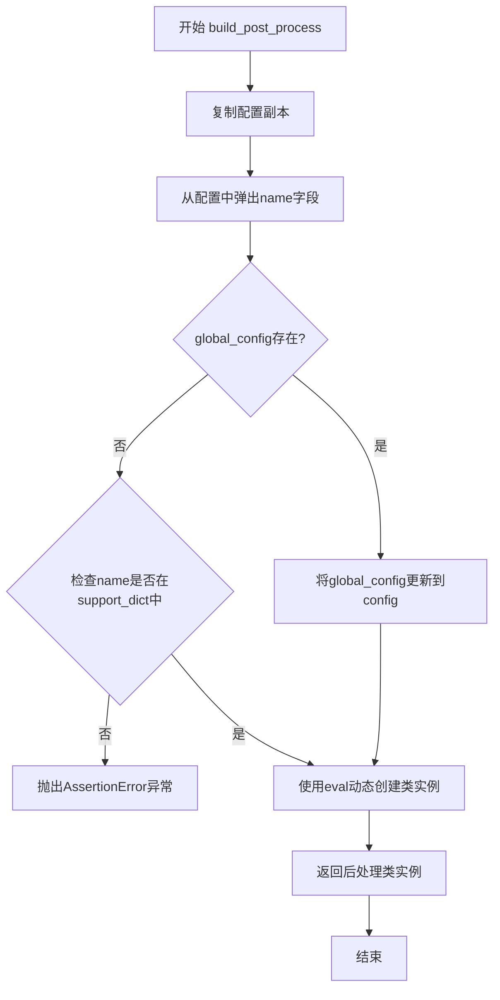
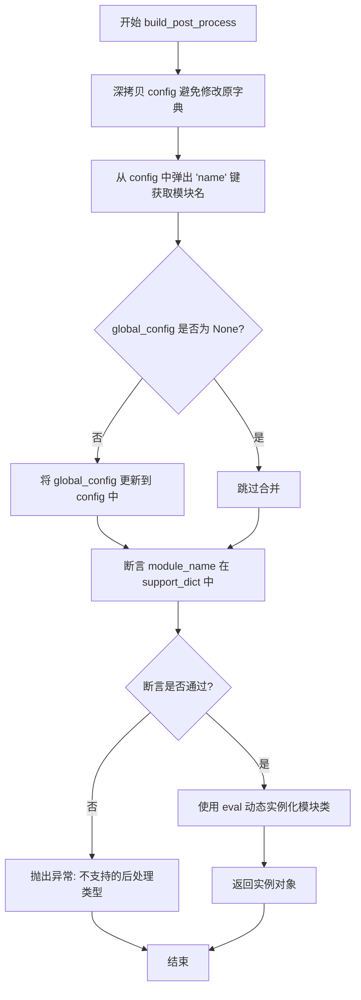

# `MinerU\mineru\model\utils\pytorchocr\postprocess\__init__.py` 详细设计文档

这是一个OCR后处理模块的动态构建器，根据配置信息动态导入并实例化不同的后处理类（如DBPostProcess、CTCLabelDecode、AttnLabelDecode等），支持多种OCR算法的结果后处理。

## 整体流程



## 类结构

```
build_post_process (全局函数)
```

## 全局变量及字段


### `__all__`
    
模块公开导出的符号列表，当前仅包含 build_post_process 函数。

类型：`list`
    


    

## 全局函数及方法


### `build_post_process`

该函数是一个后处理模块的工厂函数，根据传入的配置字典动态创建相应的后处理类实例，支持多种OCR后处理算法（如DB、CTC、Attention、SRN等）的统一初始化入口。

参数：

- `config`：`dict`，后处理配置字典，必须包含 `name` 键指定要创建的后处理类名，其余键作为初始化参数
- `global_config`：`dict | None`，可选的全局配置字典，会与 `config` 合并（`config` 中的同名键值会覆盖 `global_config`）

返回值：`object`，返回后处理类的实例对象，具体类型取决于 `config['name']` 的值

#### 流程图



#### 带注释源码

```python
def build_post_process(config, global_config=None):
    """
    工厂函数：根据配置构建后处理模块实例
    
    参数:
        config: 包含 'name' 键的字典，指定后处理类名，其余键为类初始化参数
        global_config: 可选的全局配置，会与 config 合并
    
    返回:
        后处理类的实例对象
    """
    # 导入所有可能的后处理类（延迟导入，避免循环依赖）
    from .db_postprocess import DBPostProcess
    from .rec_postprocess import CTCLabelDecode, AttnLabelDecode, SRNLabelDecode, TableLabelDecode, \
        NRTRLabelDecode, SARLabelDecode, ViTSTRLabelDecode, RFLLabelDecode
    from .cls_postprocess import ClsPostProcess
    from .rec_postprocess import CANLabelDecode

    # 定义支持的后处理模块名称列表
    support_dict = [
        'DBPostProcess', 'CTCLabelDecode',
        'AttnLabelDecode', 'ClsPostProcess', 'SRNLabelDecode',
        'TableLabelDecode', 'NRTRLabelDecode', 'SARLabelDecode',
        'ViTSTRLabelDecode','CANLabelDecode', 'RFLLabelDecode'
    ]

    # 深拷贝 config，避免修改原始配置字典
    config = copy.deepcopy(config)
    # 弹出 'name' 键，获取要实例化的类名
    module_name = config.pop('name')
    # 如果提供了全局配置，则合并到 config 中（config 中的值优先级更高）
    if global_config is not None:
        config.update(global_config)
    
    # 断言检查：确保请求的后处理类在支持列表中
    assert module_name in support_dict, Exception(
        'post process only support {}, but got {}'.format(support_dict, module_name))
    
    # 使用 eval 动态获取类并实例化（**config 展开为关键字参数）
    module_class = eval(module_name)(**config)
    # 返回实例化的后处理对象
    return module_class
```

## 关键组件


### 动态类加载器

使用 `eval(module_name)` 动态创建后处理类实例，实现运行时类实例化，配合 `from .xxx import` 惰性导入减少启动时依赖。

### 配置管理模块

通过 `copy.deepcopy(config)` 保护原始配置不被修改，支持通过 `global_config` 参数合并全局配置，实现配置的安全隔离与覆盖。

### 支持的后处理策略集合

定义了 `support_dict` 列表，列出所有支持的后处理类名，包括 DBPostProcess、CTCLabelDecode、AttnLabelDecode、ClsPostProcess、SRNLabelDecode、TableLabelDecode、NRTRLabelDecode、SARLabelDecode、ViTSTRLabelDecode、CANLabelDecode、RFLLabelDecode 等 11 种策略。

### 构建入口函数

`build_post_process(config, global_config=None)` 是整体运行入口，负责解析配置、验证模块名称、动态加载类并返回实例，是连接配置层与实现层的桥梁。

### OCR后处理分类

代码导入了三类后处理：文本检测（DBPostProcess）、文本识别（CTCLabelDecode、AttnLabelDecode、SRNLabelDecode 等）、方向分类（ClsPostProcess），覆盖 OCR 完整流程。


## 问题及建议


### 已知问题

-   **安全风险**：使用 `eval()` 动态实例化类，存在代码注入风险，恶意输入可能执行任意代码
-   **不必要导入**：在函数开头一次性导入所有后处理类，但实际使用时通常只需要其中一个，造成模块加载时的性能开销
-   **配置覆盖逻辑不清晰**：`global_config` 直接调用 `update()` 可能导致配置优先级不明确，后面的配置会覆盖前面的
-   **硬编码支持列表**：支持的后处理类名硬编码在列表中，新增后处理类需要手动添加到列表，容易遗漏
-   **缺少错误处理**：没有 try-except 包裹，类实例化失败时只会抛出原始异常，缺乏友好的错误提示
-   **过度使用 deepcopy**：`copy.deepcopy(config)` 对配置进行深拷贝，对于大型配置可能带来不必要的性能开销
-   **缺乏类型注解**：没有参数和返回值的类型提示，影响代码可读性和 IDE 支持

### 优化建议

-   **替换 eval 为安全方式**：使用 `globals()` 或 `locals()` 字典配合 `getattr()` 获取类，或建立显式的类映射字典，例如 `{'DBPostProcess': DBPostProcess, ...}`
-   **延迟导入**：将部分导入移到函数内部或使用动态导入方式，只在需要时加载对应类
-   **优化配置合并逻辑**：使用明确的配置优先级策略，可考虑使用 `dict.pop()` + 合并的方式，或引入专门的配置合并工具
-   **配置校验**：添加对输入 config 的必要字段校验，在进入业务逻辑前尽早发现配置错误
-   **添加类型注解**：为函数参数和返回值添加类型提示，提升代码可维护性
-   **考虑浅拷贝**：如果配置结构简单，可使用 `copy.copy()` 或直接操作，避免深拷贝的性能开销
-   **改进异常信息**：捕获可能的导入错误或类实例化错误，提供更具体的错误描述，帮助快速定位问题


## 其它


### 设计目标与约束

**设计目标**：
提供一个统一的工厂函数，根据配置动态创建不同的OCR后处理类实例，实现后处理模块的可配置化和解耦。

**设计约束**：
1. 必须使用`copy.deepcopy`避免修改原始配置
2. 支持的模块名必须在`support_dict`中明确定义
3. 依赖的模块必须从相对导入路径正确引入

### 错误处理与异常设计

**异常类型**：
- **AssertionError**：当`module_name`不在`support_dict`列表中时抛出
- **ImportError**：当导入的后处理模块不存在或路径错误时抛出
- **TypeError**：当传递给类构造器的参数不匹配时抛出

**错误处理策略**：
- 使用`assert`验证模块名称合法性
- 异常信息包含支持的模块列表，便于调试

### 外部依赖与接口契约

**依赖模块**：
- `copy`：用于深拷贝配置字典
- `.db_postprocess.DBPostProcess`：文本检测后处理
- `.rec_postprocess`：文本识别后处理（CTCLabelDecode、AttnLabelDecode等）
- `.cls_postprocess.ClsPostProcess`：方向分类后处理

**接口契约**：
- `config`参数：字典类型，必须包含`name`字段
- `global_config`参数：可选字典，用于合并全局配置
- 返回值：后处理类实例对象

### 配置说明

**config参数结构**：
```python
{
    'name': str,  # 后处理类名称，如'DBPostProcess'
    # 其他参数传递给对应类的构造函数
}
```

**global_config参数**：
用于传入全局共享配置，会与config合并，config中的同名键会覆盖global_config中的值

### 使用示例

```python
# 示例1：基本用法
config = {'name': 'DBPostProcess', 'thresh': 0.3, 'box_thresh': 0.5}
processor = build_post_process(config)

# 示例2：带全局配置
global_config = {'use_gpu': True}
config = {'name': 'CTCLabelDecode', 'character_dict_path': '/path/dict.txt'}
processor = build_post_process(config, global_config)
```

### 版本历史

- v1.0：初始版本，支持11种后处理类型
- 当前版本增加了ViTSTRLabelDecode和RFLLabelDecode支持
</content>
    