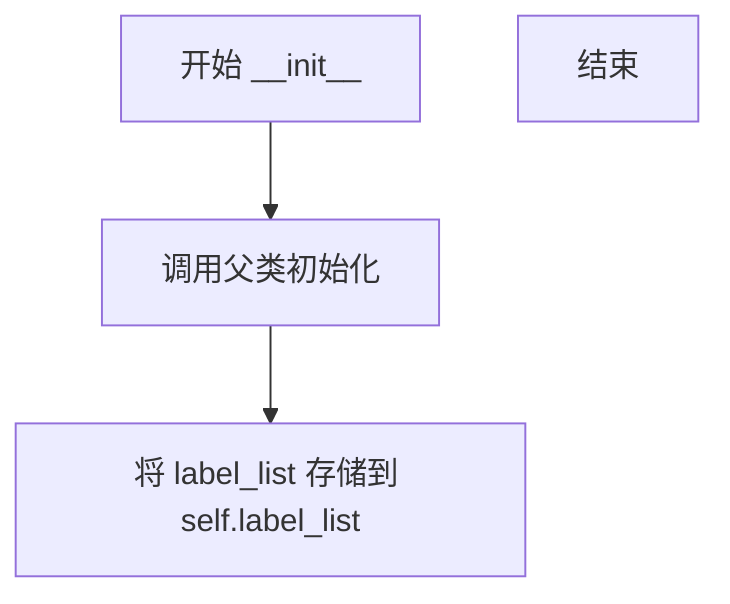

# `MinerU\mineru\model\utils\pytorchocr\postprocess\cls_postprocess.py` 详细设计文档

一个用于文本分类后处理的工具类，负责将模型输出的预测索引转换为对应的文本标签，支持带标签和不带标签两种模式的预测结果解码。

## 整体流程

```mermaid
graph TD
    A[开始] --> B{preds是torch.Tensor?}
    B -- 是 --> C[调用.cpu().numpy()转换]
    B -- 否 --> D[保持preds不变]
    C --> E[获取argmax结果]
    D --> E
    E --> F[遍历pred_idxs生成decode_out]
    F --> G{label是否为None?}
    G -- 是 --> H[仅返回decode_out]
    G -- 否 --> I[生成label列表]
    I --> J[返回decode_out和label元组]
```

## 类结构

```
ClsPostProcess (文本分类后处理类)
```

## 全局变量及字段


### `ClsPostProcess.label_list`
    
文本标签列表，用于将索引映射为实际文本

类型：`list`
    
    

## 全局函数及方法


### `ClsPostProcess.__init__`

该方法是 `ClsPostProcess` 类的初始化构造函数，用于接收文本标签列表并将其存储为实例变量，以便后续的预测结果解码使用。

参数：

- `label_list`：`list`，文本标签列表，用于将预测索引映射回对应的文本标签
- `**kwargs`：`dict`，额外可选参数，用于接收未明确声明的关键字参数（当前实现中未使用）

返回值：`None`，初始化方法无返回值，仅进行实例属性赋值操作

#### 流程图



#### 带注释源码

```python
def __init__(self, label_list, **kwargs):
    """
    初始化方法，将标签列表保存为实例属性
    
    参数:
        label_list: 文本标签列表，用于将模型输出的索引映射为可读文本
        **kwargs: 额外的可选参数，预留给未来扩展使用
    
    返回:
        None
    """
    # 调用父类 object 的初始化方法，确保正确的继承链
    super(ClsPostProcess, self).__init__()
    
    # 将传入的标签列表保存为实例变量，供后续 __call__ 方法使用
    self.label_list = label_list
```


### `ClsPostProcess.__call__`

该方法是分类后处理类的核心调用接口，负责将模型输出的预测张量转换为可读的标签和置信度对，支持仅返回预测结果或同时返回预测结果与真实标签的元组形式。

参数：

- `preds`：`torch.Tensor/numpy.ndarray`，模型预测结果，通常为二维张量，行为样本，列为各类别的预测分数
- `label`：`list`，真实标签（可选），为一维列表，包含每个样本的真实类别索引
- `*args`：`tuple`，额外位置参数，用于扩展兼容
- `**kwargs`：`dict`，额外关键字参数，用于扩展兼容

返回值：`list/tuple`，返回解码后的预测结果列表，每个元素为(标签名, 置信度)的元组；若label不为None，则返回元组(decode_out, label)

#### 流程图

```mermaid
flowchart TD
    A[开始 __call__] --> B{判断 preds 类型}
    B -->|torch.Tensor| C[调用 .cpu().numpy() 转为numpy数组]
    B -->|numpy.ndarray| D[直接使用]
    C --> E[沿 axis=1 取 argmax 获取预测类别索引]
    E --> F[构建 decode_out 列表]
    F --> G{判断 label 是否为 None}
    G -->|是| H[仅返回 decode_out]
    G -->|否| I[构建 label 列表]
    I --> J[返回元组 decode_out, label]
    H --> K[结束]
    J --> K
    
    subgraph decode_out 构建
        F1[遍历每个样本索引 i 和预测类别 idx]
        F2[从 label_list 获取标签名]
        F3[获取对应预测分数 preds[i, idx]]
        F4[组合为元组加入列表]
    end
    
    subgraph label 构建
        I1[遍历 label 中的每个真实类别索引]
        I2[从 label_list 获取标签名]
        I3[组合为元组 label_list[idx], 1.0]
    end
    
    F --> F1
    I --> I1
```

#### 带注释源码

```python
def __call__(self, preds, label=None, *args, **kwargs):
    """分类后处理主方法，将预测张量解码为标签和置信度
    
    参数:
        preds: 模型预测结果，形状为 [batch_size, num_classes] 的张量或数组
        label: 真实标签列表，可选，形状为 [batch_size]
        *args: 额外位置参数，保留用于接口兼容
        **kwargs: 额外关键字参数，保留用于接口兼容
    
    返回:
        若 label 为 None: 返回预测结果列表，每个元素为 (标签名, 置信度)
        若 label 不为 None: 返回 (预测结果列表, 真实标签列表) 的元组
    """
    
    # 判断预测结果是否为 PyTorch 张量，若是则转换为 NumPy 数组
    if isinstance(preds, torch.Tensor):
        preds = preds.cpu().numpy()
    
    # 沿类别维度(axis=1)取最大值的索引，得到每个样本的预测类别
    pred_idxs = preds.argmax(axis=1)
    
    # 构建解码后的预测结果列表
    # 每个元素为 (标签名称, 对应类别的预测分数) 的元组
    decode_out = [(self.label_list[idx], preds[i, idx])
                  for i, idx in enumerate(pred_idxs)]
    
    # 根据 label 是否存在决定返回值格式
    if label is None:
        # 仅返回预测解码结果
        return decode_out
    
    # 若提供了真实标签，则构建真实标签列表
    # 注意：真实标签的置信度固定为 1.0
    label = [(self.label_list[idx], 1.0) for idx in label]
    
    # 返回预测结果和真实标签的元组
    return decode_out, label
```

## 关键组件


### ClsPostProcess类

分类后处理核心类，负责将模型输出的预测tensor转换为可读的标签和概率值，同时支持与真实标签的对比处理。

### label_list字段

标签列表，存储所有可能的类别标签，用于将预测索引映射为实际标签名称。

### __init__方法

构造函数，接收标签列表并初始化实例，支持额外的关键字参数以保持接口灵活性。

### __call__方法

核心处理方法，将预测结果转换为标签-概率对，支持可选的真实标签对比，返回解码后的预测结果和可选的真实标签结果。


## 问题及建议


### 已知问题

-   **输入验证缺失**：未验证 `label_list` 是否为空或 `preds` 的维度是否合法，可能导致 `IndexError` 或意外行为
-   **label 参数未验证**：当 `label` 不为 `None` 时，直接将其作为索引使用，没有验证 `label` 中的索引是否超出 `label_list` 范围
-   **类型注解缺失**：整个类缺少 Python 类型提示（Type Hints），降低代码可读性和 IDE 支持
-   **未使用的参数**：`kwargs` 和 `args` 被接收但从未使用，造成代码冗余
-   **硬编码置信度**：将 label 的置信度硬编码为 `1.0`，缺乏灵活性
-   **框架依赖单一**：代码针对 `torch.Tensor` 进行特殊处理，但未提供对 NumPy 数组等其他输入的原生支持
-   **文档不完整**：类缺少详细的文档说明，`__call__` 方法的参数和返回值缺乏描述

### 优化建议

-   在 `__init__` 和 `__call__` 方法中添加输入验证，检查 `label_list` 非空、`preds` 维度合法、`label` 索引不越界
-   为所有方法添加类型注解，明确参数和返回值的类型（如 `List[str]`, `np.ndarray`, `torch.Tensor` 等）
-   移除未使用的 `**kwargs` 和 `*args`，或文档化其预留用途
-   提供配置选项允许自定义 label 的置信度，而非硬编码
-   扩展对多种输入类型的支持，使用 `isinstance` 统一处理不同框架的张量或数组
-   添加详细的 docstring，说明参数含义、返回值结构和可能的异常
-   考虑使用向量化操作替代 list comprehension 提升性能


## 其它


### 设计目标与约束

本模块的设计目标是提供一个轻量级、高效的分类后处理工具，将模型输出的预测索引转换为对应的标签名称及置信度。约束条件包括：输入必须是numpy数组或PyTorch张量，标签列表必须与模型输出维度匹配，标签列表不应包含重复项。

### 错误处理与异常设计

当preds为torch.Tensor时自动转换为numpy数组；当preds维度小于2时，argmax操作可能产生意外结果；当label参数提供的索引超出label_list范围时可能引发索引越界异常。当前实现缺乏显式的参数校验和异常处理机制，建议增加参数类型检查、维度验证和越界保护。

### 数据流与状态机

数据流：外部输入(preds, label) → 类型检查与转换 → 维度验证 → argmax运算获取预测索引 → 索引映射为(标签, 置信度)元组 → 输出decode_out和label元组对。状态机流转：初始化状态(创建label_list) → 处理状态(preds预测) → 可选的标签比对状态(提供label参数) → 返回结果。

### 外部依赖与接口契约

主要外部依赖：PyTorch（torch模块）和NumPy（隐式依赖，torch.cpu().numpy()需要）。接口契约：__init__方法接收label_list参数，类型为list；__call__方法接收preds（numpy数组或torch.Tensor）、label（可选，int列表）、*args、**kwargs，返回类型根据label参数有无变化。

### 性能考虑

argmax操作的时间复杂度为O(n)，其中n为preds的元素总数。当处理大规模批次数据时，建议预先分配内存。当前实现每次调用都会创建新列表，频繁调用时会产生内存碎片化开销。可考虑使用列表推导式替代enumerate循环以提升性能。

### 安全性考虑

当前实现未对label_list进行深拷贝，外部修改可能影响内部状态。当label参数包含重复索引时，label列表会包含重复的标签元组。preds值域未做假设，负值或NaN值可能导致argmax行为不符合预期。

### 使用示例

```python
# 初始化后处理器
label_list = ['positive', 'negative', 'neutral']
postprocess = ClsPostProcess(label_list)

# 预测结果（假设3个类别）
preds = torch.tensor([[0.2, 0.7, 0.1], [0.8, 0.1, 0.1]])
result = postprocess(preds)
# 输出: [('negative', 0.7), ('positive', 0.8)]

# 带标签对比
labels = [0, 0]
result_with_label = postprocess(preds, labels)
# 返回: (decode_out, label)
```

### 版本兼容性

当前代码兼容PyTorch 1.x和NumPy 1.x版本。在PyTorch 2.0+中，torch.Tensor.cpu()方法行为保持一致，但可考虑使用torch.Tensor.numpy()以获得更好的性能。建议明确声明最低依赖版本：torch>=1.0.0、numpy>=1.0.0。

### 测试策略建议

建议增加单元测试覆盖以下场景：张量输入转换、数组直接输入、label为None的情况、label提供时返回tuple、边界情况测试（空数组、单元素数组）、索引越界情况、返回值格式验证。

    