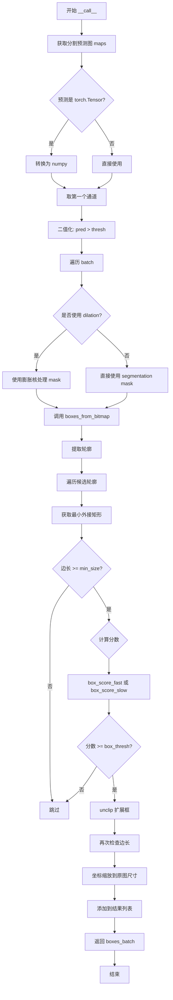
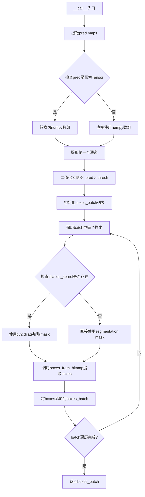
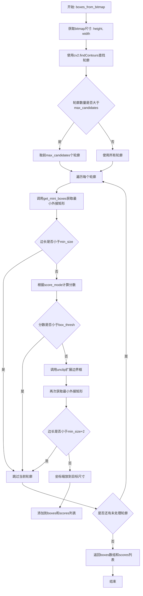
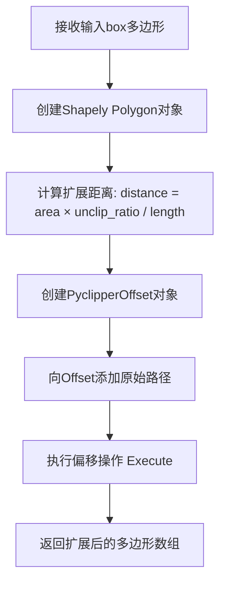
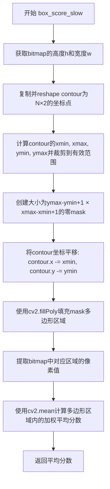

# `MinerU\mineru\model\utils\pytorchocr\postprocess\db_postprocess.py` 详细设计文档

这是DBNet文本检测模型的后处理模块，实现了Differentiable Binarization (DB)算法的后处理功能，通过对分割预测图进行二值化、轮廓提取、框扩展和分数计算，最终输出文本检测框的坐标列表。

## 整体流程



## 类结构

```
DBPostProcess (后处理主类)
└── __init__ (初始化方法)
└── __call__ (调用入口)
└── boxes_from_bitmap (核心处理方法)
└── unclip (框扩展方法)
└── get_mini_boxes (获取最小矩形)
└── box_score_fast (快速计分)
└── box_score_slow (精确计分)
```

## 全局变量及字段


### `np`
    
NumPy库，用于数值计算

类型：`module`
    


### `cv2`
    
OpenCV库，用于图像处理和轮廓提取

类型：`module`
    


### `torch`
    
PyTorch库，用于张量处理

类型：`module`
    


### `Polygon`
    
Shapely几何对象，用于多边形操作

类型：`class`
    


### `pyclipper`
    
库，用于多边形偏移扩展

类型：`module`
    


### `DBPostProcess.self.thresh`
    
二值化阈值，用于分割图二值化

类型：`float`
    


### `DBPostProcess.self.box_thresh`
    
框得分阈值，用于过滤低分框

类型：`float`
    


### `DBPostProcess.self.max_candidates`
    
最大候选框数量

类型：`int`
    


### `DBPostProcess.self.unclip_ratio`
    
框扩展比例，用于扩大检测框

类型：`float`
    


### `DBPostProcess.self.min_size`
    
最小框边长阈值，默认3

类型：`int`
    


### `DBPostProcess.self.score_mode`
    
计分模式，'fast'或'slow'

类型：`str`
    


### `DBPostProcess.self.dilation_kernel`
    
膨胀核，用于图像形态学操作

类型：`np.ndarray or None`
    
    

## 全局函数及方法


### `DBPostProcess.__init__`

这是 `DBPostProcess` 类的构造函数，用于初始化 Differentiable Binarization (DB) 后处理的各种参数，包括二值化阈值、框过滤阈值、最大候选数、文本框扩展比例、膨胀核以及分数计算模式等。

参数：

- `thresh`：`float`，二值化阈值，用于将预测概率图转换为二值图，默认为 0.3
- `box_thresh`：`float`，框的置信度阈值，用于过滤低置信度的检测框，默认为 0.7
- `max_candidates`：`int`，最大候选框数量，默认为 1000
- `unclip_ratio`：`float`，文本框扩展比例，用于扩大文本框边界，默认为 2.0
- `use_dilation`：`bool`，是否使用膨胀操作来增强文本区域，默认为 False
- `score_mode`：`str`，分数计算模式，可选 "slow" 或 "fast"，"fast" 模式使用边界框均值作为分数，"slow" 模式使用多边形均值作为分数，默认为 "fast"
- `**kwargs`：`dict`，其他关键字参数，用于兼容和扩展

返回值：`None`，该方法为构造函数，不返回任何值

#### 流程图

```mermaid
flowchart TD
    A[开始 __init__] --> B[接收参数: thresh, box_thresh, max_candidates, unclip_ratio, use_dilation, score_mode, kwargs]
    B --> C[赋值 self.thresh = thresh]
    C --> D[赋值 self.box_thresh = box_thresh]
    D --> E[赋值 self.max_candidates = max_candidates]
    E --> F[赋值 self.unclip_ratio = unclip_ratio]
    F --> G[设置 self.min_size = 3]
    G --> H[赋值 self.score_mode = score_mode]
    H --> I{检查 score_mode 是否合法}
    I -->|是| J[继续执行]
    I -->|否| K[抛出 AssertionError 异常]
    J --> L{use_dilation 是否为 True}
    L -->|是| M[创建膨胀核: np.array([[1,1],[1,1]])]
    L -->|否| N[设置 dilation_kernel 为 None]
    M --> O[结束 __init__]
    N --> O
    K --> O
```

#### 带注释源码

```python
def __init__(self,
             thresh=0.3,
             box_thresh=0.7,
             max_candidates=1000,
             unclip_ratio=2.0,
             use_dilation=False,
             score_mode="fast",
             **kwargs):
    """
    初始化 DB 后处理器的参数
    
    参数:
        thresh (float): 二值化阈值，用于将预测概率图转换为二值图
        box_thresh (float): 框的置信度阈值，用于过滤低置信度的检测框
        max_candidates (int): 最大候选框数量限制
        unclip_ratio (float): 文本框扩展比例，用于扩大文本区域
        use_dilation (bool): 是否使用膨胀操作增强文本区域
        score_mode (str): 分数计算模式，"slow" 或 "fast"
        **kwargs: 其他可选参数
    """
    # 存储二值化阈值参数
    self.thresh = thresh
    # 存储框的置信度阈值
    self.box_thresh = box_thresh
    # 存储最大候选框数量
    self.max_candidates = max_candidates
    # 存储文本框扩展比例
    self.unclip_ratio = unclip_ratio
    # 设置最小尺寸阈值为 3 像素
    self.min_size = 3
    # 存储分数计算模式
    self.score_mode = score_mode
    
    # 断言检查 score_mode 是否为合法值 ("slow" 或 "fast")
    assert score_mode in [
        "slow", "fast"
    ], "Score mode must be in [slow, fast] but got: {}".format(score_mode)

    # 根据 use_dilation 参数决定是否创建膨胀核
    # 如果不使用膨胀，则为 None
    # 如果使用膨胀，创建 2x2 的全 1 矩阵作为膨胀核
    self.dilation_kernel = None if not use_dilation else np.array(
        [[1, 1], [1, 1]])
```


### `DBPostProcess.__call__`

该方法是DBNet后处理的核心入口，接收网络输出的预测maps和图像尺寸信息，通过二值化分割图、膨胀处理（可选）、轮廓提取和框生成等步骤，最终输出批次中每个图像的文本检测框坐标。

参数：

- `outs_dict`：`dict`，包含网络输出的预测maps，键为'maps'，值为网络预测的特征图（可能是torch.Tensor或numpy数组）
- `shape_list`：`list`，包含批次中每个样本的原始尺寸信息，每个元素为(src_h, src_w, ratio_h, ratio_w)元组

返回值：`list`，返回批次级别的文本检测框结果列表，列表中每个元素为包含'points'键的字典，值为检测到的文本框坐标数组（numpy int16类型）

#### 流程图



#### 带注释源码

```
def __call__(self, outs_dict, shape_list):
    """
    后处理主入口函数
    
    参数:
        outs_dict: 包含网络输出的字典，'maps'键对应预测的特征图
        shape_list: 批次中每个样本的尺寸信息列表，每个元素为(src_h, src_w, ratio_h, ratio_w)
    
    返回:
        boxes_batch: 检测到的文本框列表
    """
    # 从输出字典中获取预测maps
    pred = outs_dict['maps']
    
    # 如果是PyTorch张量，转换为numpy数组以便于处理
    if isinstance(pred, torch.Tensor):
        pred = pred.cpu().numpy()
    
    # 只取第一个通道（DBNet输出为单通道概率图）
    pred = pred[:, 0, :, :]
    
    # 基于阈值进行二值化分割，得到分割掩码
    segmentation = pred > self.thresh
    
    # 初始化批次级别的结果列表
    boxes_batch = []
    
    # 遍历批次中的每个样本
    for batch_index in range(pred.shape[0]):
        # 获取当前样本的原始尺寸信息
        src_h, src_w, ratio_h, ratio_w = shape_list[batch_index]
        
        # 如果使用了dilation，对分割掩码进行膨胀处理以增强连通性
        if self.dilation_kernel is not None:
            mask = cv2.dilate(
                np.array(segmentation[batch_index]).astype(np.uint8),
                self.dilation_kernel)
        else:
            # 直接使用二值化后的分割掩码
            mask = segmentation[batch_index]
        
        # 从二值掩码中提取文本框
        boxes, scores = self.boxes_from_bitmap(pred[batch_index], mask,
                                               src_w, src_h)
        
        # 将检测到的框添加到结果列表中
        boxes_batch.append({'points': boxes})
    
    # 返回批次级别的检测结果
    return boxes_batch
```


### `DBPostProcess.boxes_from_bitmap`

该方法是将二值化的分割图转换为文本检测框的核心方法，通过 contours 查找、最小外接矩形计算、分数评估、边界框扩展和坐标映射等步骤，从分割掩码中提取符合条件的文本检测框及对应的置信度分数。

参数：

- `self`：`DBPostProcess` 类实例，方法所属对象
- `pred`：`numpy.ndarray`，预测的概率图，形状为 (H, W)，包含每个像素的分割概率值
- `_bitmap`：`numpy.ndarray`，二值化的分割掩码，形状为 (1, H, W)，值为 {0, 1}，1 表示文本区域
- `dest_width`：`int`，目标图像宽度，用于将检测框坐标从原图尺寸映射到目标尺寸
- `dest_height`：`int`，目标图像高度，用于将检测框坐标从原图尺寸映射到目标尺寸

返回值：`tuple`，包含两个元素：

- 第一个元素为 `numpy.ndarray`，检测到的文本框集合，形状为 (num_boxes, 4, 2)，类型为 `np.int16`，每个框由 4 个顶点坐标组成
- 第二个元素为 `list`，每个文本框对应的置信度分数列表，元素类型为 `float`

#### 流程图



#### 带注释源码

```python
def boxes_from_bitmap(self, pred, _bitmap, dest_width, dest_height):
    '''
    从二值化掩码中提取文本检测框
    
    参数:
        pred: 预测的概率图，形状为 (H, W)
        _bitmap: 二值化掩码，形状为 (1, H, W)，值为 {0, 1}
        dest_width: 目标宽度，用于坐标映射
        dest_height: 目标高度，用于坐标映射
    
    返回:
        boxes: 检测框数组，形状为 (N, 4, 2)，类型为 int16
        scores: 每个框的置信度分数列表
    '''
    
    # 获取掩码的尺寸信息
    bitmap = _bitmap
    height, width = bitmap.shape

    # 使用OpenCV查找轮廓
    # cv2.findContours 返回轮廓列表
    outs = cv2.findContours((bitmap * 255).astype(np.uint8), cv2.RETR_LIST,
                            cv2.CHAIN_APPROX_SIMPLE)
    
    # 根据OpenCV版本处理返回结果
    # OpenCV 2.x/3.x 返回 (image, contours, hierarchy)
    # OpenCV 4.x 返回 (contours, hierarchy)
    if len(outs) == 3:
        img, contours, _ = outs[0], outs[1], outs[2]
    elif len(outs) == 2:
        contours, _ = outs[0], outs[1]

    # 限制处理的最大轮廓数量，避免过多候选框
    num_contours = min(len(contours), self.max_candidates)

    # 初始化结果列表
    boxes = []
    scores = []
    
    # 遍历每个候选轮廓
    for index in range(num_contours):
        contour = contours[index]
        
        # 获取轮廓的最小外接矩形
        points, sside = self.get_mini_boxes(contour)
        
        # 过滤太小的轮廓
        if sside < self.min_size:
            continue
        
        # 转换为numpy数组
        points = np.array(points)
        
        # 根据score_mode选择评分方式
        if self.score_mode == "fast":
            # fast模式：使用矩形边界框的平均分数
            score = self.box_score_fast(pred, points.reshape(-1, 2))
        else:
            # slow模式：使用轮廓多边形的平均分数
            score = self.box_score_slow(pred, contour)
        
        # 根据分数阈值过滤
        if self.box_thresh > score:
            continue

        # 使用unclip扩展边界框（基于多边形面积和周长）
        box = self.unclip(points).reshape(-1, 1, 2)
        
        # 再次获取最小外接矩形
        box, sside = self.get_mini_boxes(box)
        
        # 过滤太小的框
        if sside < self.min_size + 2:
            continue
        
        box = np.array(box)

        # 将坐标从原始尺寸映射到目标尺寸
        # X坐标映射
        box[:, 0] = np.clip(
            np.round(box[:, 0] / width * dest_width), 0, dest_width)
        # Y坐标映射
        box[:, 1] = np.clip(
            np.round(box[:, 1] / height * dest_height), 0, dest_height)
        
        # 添加到结果列表
        boxes.append(box.astype(np.int16))
        scores.append(score)
    
    # 转换为numpy数组返回
    return np.array(boxes, dtype=np.int16), scores
```


### `DBPostProcess.unclip`

该方法用于对检测到的文本框进行边界扩展（unclip），通过计算多边形的面积与周长比例来确定扩展距离，利用 pyclipper 库实现多边形的向外偏移，从而获得更大的文本区域以提升检测召回率。

参数：

- `box`：`numpy.ndarray`，输入的文本框坐标点，通常为4个顶点的坐标数组，形状为 (4, 2)

返回值：`numpy.ndarray`，扩展后的多边形坐标点数组

#### 流程图



#### 带注释源码

```python
def unclip(self, box):
    """
    对输入的多边形框进行扩展（unclip）操作。
    
    通过计算多边形面积与周长的比值，乘以扩展系数 unclip_ratio，
    得到向外扩展的距离，然后使用 pyclipper 库进行多边形偏移。
    
    参数:
        box: 输入的多边形顶点坐标，numpy.ndarray，形状为 (4, 2)
    
    返回:
        扩展后的多边形顶点坐标，numpy.ndarray
    """
    # 获取实例变量中的扩展比例系数
    unclip_ratio = self.unclip_ratio
    
    # 使用 shapely 库创建 Polygon 对象，以便计算面积和周长
    poly = Polygon(box)
    
    # 计算扩展距离：使用面积乘以扩展比例除以周长
    # 这种计算方式可以保证不同大小的多边形获得合适的扩展距离
    # 面积/周长 近似等于多边形的"平均宽度"
    distance = poly.area * unclip_ratio / poly.length
    
    # 创建 pyclipper 偏移对象，用于执行多边形扩展
    offset = pyclipper.PyclipperOffset()
    
    # 添加原始路径到偏移器
    # JT_ROUND 表示使用圆角进行扩展
    # ET_CLOSEDPOLYGON 表示处理的是封闭多边形
    offset.AddPath(box, pyclipper.JT_ROUND, pyclipper.ET_CLOSEDPOLYGON)
    
    # 执行偏移操作，distance 为向外扩展的距离
    expanded = np.array(offset.Execute(distance))
    
    # 返回扩展后的多边形坐标数组
    return expanded
```


### `DBPostProcess.get_mini_boxes`

该方法用于从输入的轮廓中提取最小外接矩形（Minimum Area Rectangle），并将矩形的四个角点按从左到右、从上到下的顺序排序返回，同时返回矩形较短边的长度。

参数：

- `contour`：`numpy.ndarray`，OpenCV 检测到的轮廓点集，用于计算最小外接矩形

返回值：`tuple`，返回包含两个元素的元组：
  - `box`：`list`，四个角点按顺序组成的列表，每个角点为 `[x, y]` 坐标
  - `sside`：`float`，最小外接矩形较短边的长度

#### 流程图

```mermaid
flowchart TD
    A[开始] --> B[调用cv2.minAreaRect计算轮廓的最小外接矩形]
    B --> C[使用cv2.boxPoints获取矩形的四个角点]
    C --> D[按x坐标升序排列四个角点]
    D --> E{判断points[1][1] > points[0][1]?}
    E -->|是| F[index_1=0, index_4=1]
    E -->|否| G[index_1=1, index_4=0]
    F --> H{判断points[3][1] > points[2][1]?}
    G --> H
    H -->|是| I[index_2=2, index_3=3]
    H -->|否| J[index_2=3, index_3=2]
    I --> K[根据索引重组box列表]
    J --> K
    K --> L[计算sside = min bounding_box的短边长度]
    L --> M[返回box和sside]
```

#### 带注释源码

```python
def get_mini_boxes(self, contour):
    """
    从轮廓中提取最小外接矩形的四个角点，并按顺序排列
    
    参数:
        contour: OpenCV检测到的轮廓点集
    
    返回:
        box: 四个角点按顺时针/特定顺序排列的列表
        sside: 最小外接矩形较短边的长度
    """
    # 使用OpenCV的minAreaRect获取轮廓的最小外接矩形
    # 返回值包含中心点(x,y)、尺寸(width, height)、旋转角度(angle)
    bounding_box = cv2.minAreaRect(contour)
    
    # 将矩形转换为四个角点坐标
    points = sorted(list(cv2.boxPoints(bounding_box)), key=lambda x: x[0])
    
    # 初始化四个索引，分别对应矩形的左上、右上、左下、右下角
    index_1, index_2, index_3, index_4 = 0, 1, 2, 3
    
    # 根据y坐标判断左右两对点的上下位置
    # points已按x坐标排序，points[0]和points[1]为左侧两个点，points[2]和points[3]为右侧两个点
    if points[1][1] > points[0][1]:
        # points[1]在points[0]下方，左侧点上、下分别为index_1=0, index_4=1
        index_1 = 0
        index_4 = 1
    else:
        # 反之，左侧点上、下分别为index_1=1, index_4=0
        index_1 = 1
        index_4 = 0
    
    # 同样逻辑处理右侧两个点
    if points[3][1] > points[2][1]:
        index_2 = 2
        index_3 = 3
    else:
        index_2 = 3
        index_3 = 2
    
    # 根据计算得到的索引，重新组织四个角点的顺序
    # 顺序为：左上 -> 右上 -> 右下 -> 左下（顺时针）
    box = [
        points[index_1], points[index_2], points[index_3], points[index_4]
    ]
    
    # bounding_box[1]返回(width, height)，取其中较小的值作为sside
    return box, min(bounding_box[1])
```


### `DBPostProcess.box_score_fast`

该方法用于快速计算文本检测框的置信度分数，通过获取框的边界框区域并计算该区域内像素值的平均分数作为框的得分。

参数：

- `bitmap`：`numpy.ndarray`，输入的二值分割图，shape为 (H, W)，值为0或1
- `_box`：`numpy.ndarray`，文本框的顶点坐标数组，shape为 (n, 2)，包含n个点的(x, y)坐标

返回值：`float`，返回文本框内部的平均分数，范围在 [0, 1] 之间

#### 流程图

```mermaid
flowchart TD
    A[开始: box_score_fast] --> B[获取bitmap的尺寸h, w]
    B --> C[复制输入box到本地变量]
    C --> D[计算box的xmin, xmax, ymin, ymax]
    D --> E{边界裁剪}
    E -->|clip到有效范围| F[创建掩码mask, 大小为ymax-ymin+1 x xmax-xmin+1]
    F --> G[将box坐标平移: box[:, 0] -= xmin, box[:, 1] -= ymin]
    G --> H[使用cv2.fillPoly填充mask]
    H --> I[使用cv2.mean计算掩码区域的平均分数]
    I --> J[返回平均分数]
```

#### 带注释源码

```python
def box_score_fast(self, bitmap, _box):
    '''
    box_score_fast: 使用边界框(bbox)的平均分数作为文本框的得分
    '''
    # 获取输入分割图的高度和宽度
    h, w = bitmap.shape[:2]
    
    # 复制输入框坐标，避免修改原始数据
    box = _box.copy()
    
    # 计算包围框的边界坐标，并进行类型转换和边界裁剪
    # xmin: 框内所有点x坐标的最小值，向下取整
    xmin = np.clip(np.floor(box[:, 0].min()).astype(np.int if 'int' in np.__dict__ else np.int32), 0, w - 1)
    # xmax: 框内所有点x坐标的最大值，向上取整
    xmax = np.clip(np.ceil(box[:, 0].max()).astype(np.int if 'int' in np.__dict__ else np.int32), 0, w - 1)
    # ymin: 框内所有点y坐标的最小值，向下取整
    ymin = np.clip(np.floor(box[:, 1].min()).astype(np.int if 'int' in np.__dict__ else np.int32), 0, h - 1)
    # ymax: 框内所有点y坐标的最大值，向上取整
    ymax = np.clip(np.ceil(box[:, 1].max()).astype(np.int if 'int' in np.__dict__ else np.int32), 0, h - 1)

    # 创建一个空白掩码，尺寸为包围框的大小
    # dtype=np.uint8 确保掩码数据类型正确用于后续填充操作
    mask = np.zeros((ymax - ymin + 1, xmax - xmin + 1), dtype=np.uint8)
    
    # 将框的坐标平移，使左上角与掩码原点对齐
    box[:, 0] = box[:, 0] - xmin
    box[:, 1] = box[:, 1] - ymin
    
    # 使用OpenCV填充多边形到掩码中
    # 将box reshape为 (1, -1, 2) 格式以符合fillPoly的要求
    cv2.fillPoly(mask, box.reshape(1, -1, 2).astype(np.int32), 1)
    
    # 使用cv2.mean计算掩码区域的平均值
    # 只计算掩码为1的区域的平均分数，返回值为(b, g, r, alpha)格式
    # [0]表示只取第一个通道（即灰度图）的平均分数
    return cv2.mean(bitmap[ymin:ymax + 1, xmin:xmax + 1], mask)[0]
```


### DBPostProcess.box_score_slow

该方法用于计算文本框的置信度分数，通过计算多边形轮廓区域内的像素平均值作为分数。相比于 `box_score_fast` 使用边界框（Bounding Box）计算分数，`box_score_slow` 使用实际的多边形轮廓进行计算，精度更高但速度较慢。

参数：

- `bitmap`：`numpy.ndarray`，输入的概率图（prediction map），形状为 (H, W)，值为 0-1 之间的概率值
- `contour`：`numpy.ndarray`，从二值图中提取的轮廓点，形状为 (N, 1, 2) 或类似结构，包含多边形的顶点坐标

返回值：`float`，返回计算得到的多边形区域内像素的平均分数，范围在 [0, 1] 之间

#### 流程图



#### 带注释源码

```python
def box_score_slow(self, bitmap, contour):
    '''
    box_score_slow: 使用多边形平均分数作为得分
    与box_score_fast的区别在于：
    - box_score_fast使用边界框(Bounding Box)的平均分数
    - box_score_slow使用实际多边形轮廓的平均分数，精度更高但速度较慢
    '''
    # 获取输入概率图的高度和宽度
    h, w = bitmap.shape[:2]
    
    # 复制轮廓数据并reshape为(N, 2)的坐标点形式
    # contour原始形状可能是(N, 1, 2)或(N, 2)
    contour = contour.copy()
    contour = np.reshape(contour, (-1, 2))

    # 计算轮廓的边界框坐标，并裁剪到有效图像范围内
    # xmin/xmax: 轮廓在x方向的最小/最大坐标
    # ymin/ymax: 轮廓在y方向的最小/最大坐标
    xmin = np.clip(np.min(contour[:, 0]), 0, w - 1)
    xmax = np.clip(np.max(contour[:, 0]), 0, w - 1)
    ymin = np.clip(np.min(contour[:, 1]), 0, h - 1)
    ymax = np.clip(np.max(contour[:, 1]), 0, h - 1)

    # 创建与边界框大小相同的mask画布
    # 后续将用多边形轮廓填充该mask，用于计算加权平均
    mask = np.zeros((ymax - ymin + 1, xmax - xmin + 1), dtype=np.uint8)

    # 将轮廓坐标平移，使其左上角与mask的左上角对齐
    # 这样填充后的mask才能正确对应bitmap的区域
    contour[:, 0] = contour[:, 0] - xmin
    contour[:, 1] = contour[:, 1] - ymin

    # 使用OpenCV填充多边形区域
    # 将轮廓reshape为(1, -1, 2)格式，并填充值为1
    cv2.fillPoly(mask, contour.reshape(1, -1, 2).astype(np.int32), 1)
    
    # 使用cv2.mean计算加权平均
    # 第一个参数是待计算的图像区域，第二个参数是权重mask
    # 返回值[0]即为加权平均分数
    return cv2.mean(bitmap[ymin:ymax + 1, xmin:xmax + 1], mask)[0]
```

## 关键组件


### DBPostProcess 类

Differentiable Binarization (DB) 算法的后处理模块，负责将模型输出的概率图转换为文本检测框

### boxes_from_bitmap 方法

从二值化掩码中提取文本框的核心方法，包含轮廓查找、最小外接矩形计算、分数评估和坐标转换

### unclip 方法

基于面积和周长比计算膨胀距离，使用pyclipper进行多边形膨胀以适应文本边缘

### get_mini_boxes 方法

从任意方向的轮廓计算最小外接矩形，并将四个角点按从左到右、从上到下排序

### box_score_fast 方法

快速分数计算模式，使用外接矩形的均值作为文本框分数，适用于大规模检测场景

### box_score_slow 方法

精确分数计算模式，使用多边形内部的像素均值作为文本框分数，精度更高但计算较慢

### __call__ 方法

后处理入口方法，负责批量处理模型输出，进行阈值分割、掩码膨胀和坐标反变换

### 阈值分割模块

将预测概率图按thresh阈值二值化，生成用于轮廓检测的分割掩码

### 轮廓后处理流程

包括轮廓筛选、分数评估、框扩展和坐标归一化的完整处理流水线


## 问题及建议


### 已知问题

-   **OpenCV版本兼容性问题**：cv2.findContours在不同OpenCV版本中返回2个或3个值，代码使用len判断处理两种情况，这种兼容方式脆弱且容易出错
-   **NumPy类型废弃警告**：使用`np.int`、`np.float`等已废弃的类型（NumPy 1.20+），应使用`np.int_`、`np.int64`或Python原生int/float
-   **缺少类型注解(Type Hints)**：整个类没有任何类型提示，参数和返回值类型不明确，降低代码可读性和可维护性
-   **潜在的除零错误**：unclip方法中`poly.length`可能为0或非常小，导致除以接近0的数产生数值不稳定
-   **硬编码的膨胀核**：dilation_kernel硬编码为2x2矩阵，膨胀核大小和形状不可配置
-   **cv2.boxPoints返回值类型**：在较新OpenCV版本中返回float32，代码未做类型处理可能导致精度问题
-   **代码重复**：box_score_fast和box_score_slow有大量重复逻辑，可合并重构
-   **magic numbers**：min_size=3、sside < self.min_size + 2等数值硬编码，缺乏配置化
-   **mask创建效率低**：每次都创建新mask数组，可优化内存使用
-   **断言位置不当**：score_mode的assert在__init__中，但实际使用在boxes_from_bitmap中，逻辑位置分散

### 优化建议

-   **添加类型注解**：为所有方法参数和返回值添加Type Hints，如`def boxes_from_bitmap(self, pred: np.ndarray, _bitmap: np.ndarray, dest_width: int, dest_height: int) -> Tuple[np.ndarray, List[float]]`
-   **重构类型使用**：将`np.int`替换为`np.int_`或`int`，`np.float`替换为`float`
-   **添加配置化参数**：将min_size、膨胀核大小等硬编码值作为__init__参数暴露给调用者
-   **添加边界检查**：在unclip方法中检查poly.length是否为0或过小，增加数值稳定性保护
-   **统一分数计算逻辑**：提取box_score_fast和box_score_slow的公共部分为私有方法，减少重复代码
-   **优化findContours处理**：使用try-except或版本检测明确处理OpenCV版本差异，提高代码清晰度
-   **增加异常处理**：对cv2.dilate、cv2.findContours等可能失败的调用添加异常处理
-   **添加详细文档**：为每个方法添加docstring，说明参数含义、返回值和可能的异常
-   **使用__slots__**：如果不需要动态属性，添加__slots__减少内存开销
-   **考虑Cython/Numba加速**：对于大规模图像处理，可考虑将热点计算使用Numba加速


## 其它


### 设计目标与约束

本模块旨在实现DBNet文本检测算法的后处理部分，将神经网络输出的分割图转换为文本框检测结果。设计目标包括：1）支持多种分数计算模式（fast/slow）；2）支持边框扩展（unclip）以适应不同尺度的文本；3）支持膨胀操作以改善检测连通性。约束条件包括：输入分割图值为0-1之间，输出框坐标为整数坐标。

### 错误处理与异常设计

1. 当findContours返回2个或3个元素时进行兼容处理
2. 对边界框坐标进行clip操作，确保不超出图像范围
3. 分数模式参数进行assert验证，仅支持"slow"和"fast"两种模式
4. 对小于最小尺寸的轮廓进行过滤，避免无效检测

### 数据流与状态机

数据流：
1. 输入：outs_dict包含'maps'键，shape_list包含原始图像尺寸信息
2. 第一步：将tensor转为numpy，并提取第一个通道
3. 第二步：二值化处理，生成mask
4. 第三步：可选的膨胀操作
5. 第四步：对每个batch提取文本框
6. 第五步：返回框坐标和分数

状态机：
- 初始化状态：设置thresh、box_thresh等参数
- 处理状态：对分割图进行二值化
- 提取状态：从二值图提取轮廓并计算框
- 后处理状态：unclip扩展、坐标缩放、边界裁剪

### 外部依赖与接口契约

外部依赖：
1. numpy：数值计算
2. cv2 (OpenCV)：轮廓检测、图像处理
3. torch：tensor处理
4. shapely.geometry.Polygon：多边形面积和周长计算
5. pyclipper：多边形扩展

接口契约：
- __init__参数：thresh(float, 默认0.3)、box_thresh(float, 默认0.7)、max_candidates(int, 默认1000)、unclip_ratio(float, 默认2.0)、use_dilation(bool, 默认False)、score_mode(str, 默认"fast")
- __call__方法输入：outs_dict包含'maps'键的字典，shape_list为[[src_h, src_w, ratio_h, ratio_w], ...]格式
- __call__方法输出：[{'points': boxes}, ...]格式的列表，boxes为[N,4,2]的int16数组

### 关键组件信息

1. DBPostProcess类：核心后处理类
2. boxes_from_bitmap方法：从二值图提取文本框
3. unclip方法：使用pyclipper进行多边形扩展
4. get_mini_boxes方法：从轮廓获取最小外接矩形
5. box_score_fast方法：使用边界框快速计算分数
6. box_score_slow方法：使用多边形轮廓精确计算分数

### 潜在的技术债务或优化空间

1. 代码中使用了np.int和np.int32的条件判断，这种写法不够直观
2. findContours的返回值处理存在兼容性问题，可统一处理逻辑
3. box_score_fast和box_score_slow存在重复代码，可抽象公共部分
4. 缺乏详细的文档注释和类型提示
5. 硬编码的dilation_kernel，可考虑作为参数传入
6. 没有对空检测结果的情况进行特别处理
7. 循环处理每个contour可以向量化优化

### 其它项目

**性能考量**：
- 大量轮廓遍历时效率较低，max_candidates限制了最大处理数量
- box_score_slow模式比fast模式更慢但更精确
- 使用numpy向量化操作可进一步优化

**版本兼容性**：
- 使用__future__导入确保Python2/3兼容
- numpy类型处理考虑了不同版本差异

**使用注意事项**：
- 输入的pred需要在GPU上时需先转到CPU
- shape_list的顺序需要与batch顺序对应
- 返回的boxes坐标已经缩放到原始图像尺寸

    