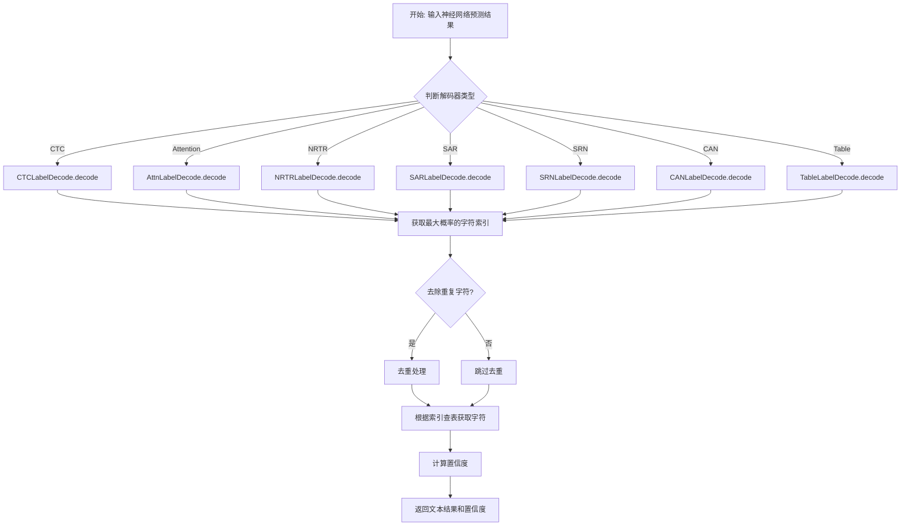
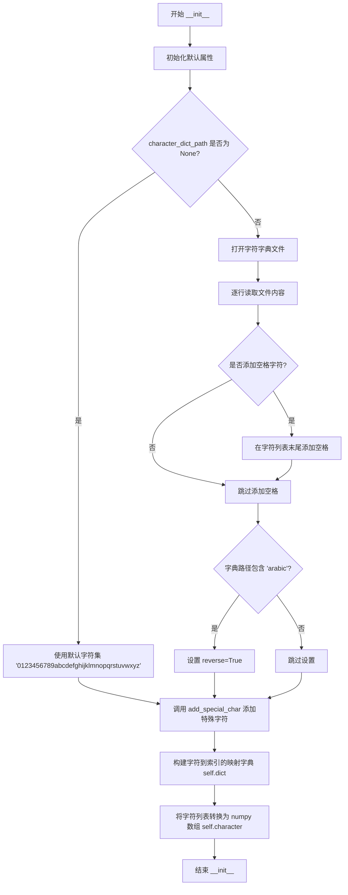
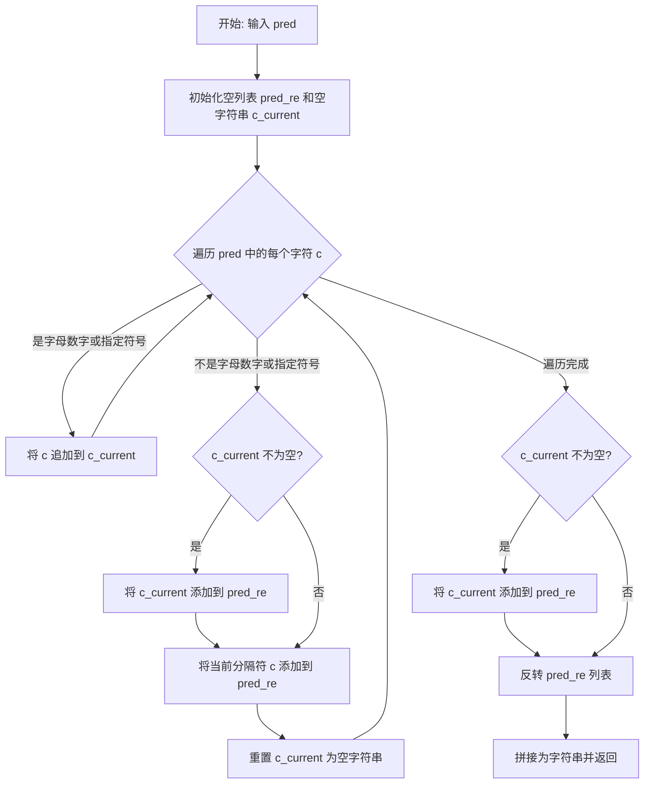
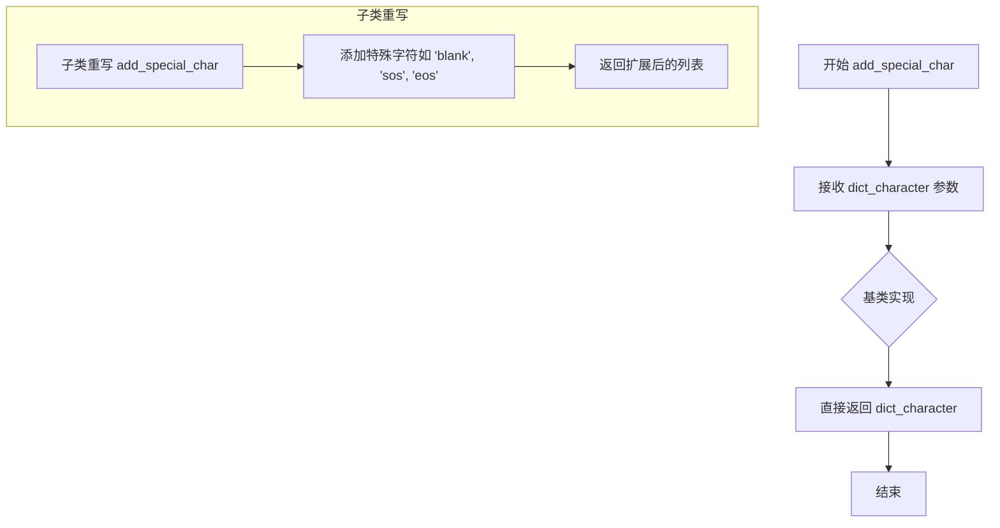
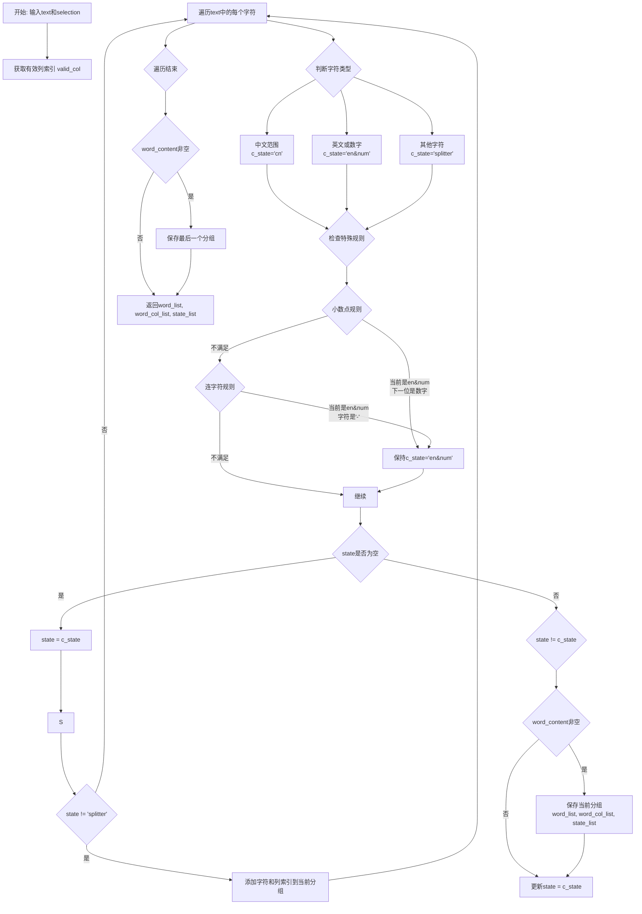
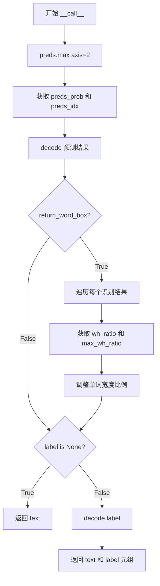
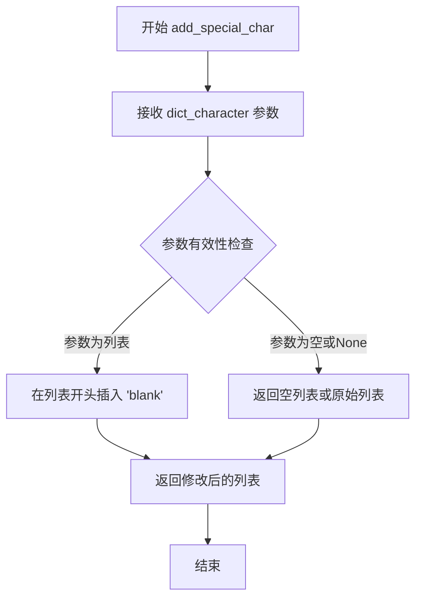
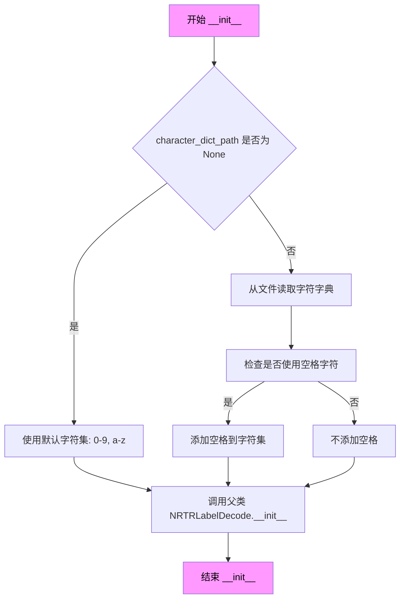
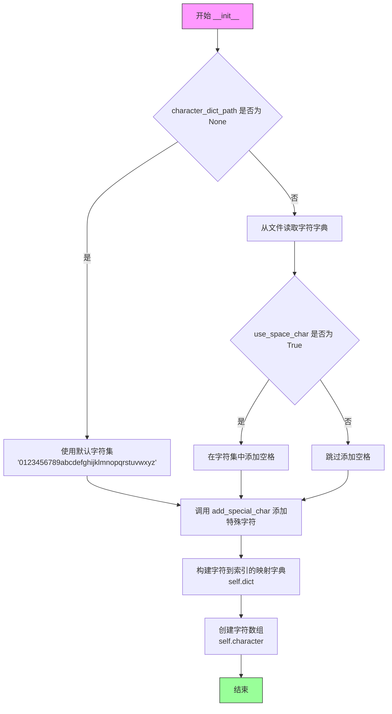

# `MinerU\mineru\model\utils\pytorchocr\postprocess\rec_postprocess.py` 详细设计文档

这是PaddlePaddle的光学字符识别（OCR）标签解码模块，核心功能是将神经网络输出的字符索引转换为可读的文本标签，支持CTC、Attention、NRTR、SRN、SAR、CAN等多种解码算法，并提供置信度计算和特殊字符处理。

## 整体流程



## 类结构

```
BaseRecLabelDecode (抽象基类)
├── CTCLabelDecode (CTC解码器)
├── NRTRLabelDecode (NRTR解码器)
│   └── ViTSTRLabelDecode (ViT-STR解码器)
├── AttnLabelDecode (Attention解码器)
├── RFLLabelDecode (RFL解码器)
├── SRNLabelDecode (SRN解码器)
├── SARLabelDecode (SAR解码器)
├── CANLabelDecode (CAN公式解码器)
└── TableLabelDecode (表格解码器-独立类)
```

## 全局变量及字段


### `re`
    
Python正则表达式模块，用于文本模式匹配和操作

类型：`module`
    


### `np`
    
NumPy库，用于数值计算和数组操作

类型：`module`
    


### `torch`
    
PyTorch深度学习框架模块

类型：`module`
    


### `BaseRecLabelDecode.beg_str`
    
起始标记字符串，用于标识序列开始

类型：`str`
    


### `BaseRecLabelDecode.end_str`
    
结束标记字符串，用于标识序列结束

类型：`str`
    


### `BaseRecLabelDecode.reverse`
    
是否反向处理标志，用于阿拉伯语等从右到左的文字处理

类型：`bool`
    


### `BaseRecLabelDecode.character_str`
    
字符列表，存储可识别的字符集

类型：`list`
    


### `BaseRecLabelDecode.dict`
    
字符到索引的映射字典，用于编码和解码

类型：`dict`
    


### `BaseRecLabelDecode.character`
    
字符数组，以NumPy数组形式存储字符集

类型：`np.array`
    


### `SRNLabelDecode.max_text_length`
    
最大文本长度，限制识别文本的最大字符数

类型：`int`
    


### `TableLabelDecode.beg_str`
    
起始标记，用于表格结构解析

类型：`str`
    


### `TableLabelDecode.end_str`
    
结束标记，用于表格结构解析

类型：`str`
    


### `TableLabelDecode.dict_character`
    
字符映射，将字符映射到索引

类型：`dict`
    


### `TableLabelDecode.dict_idx_character`
    
索引映射，将索引映射到字符

类型：`dict`
    


### `TableLabelDecode.dict_elem`
    
元素映射，将表格元素映射到索引

类型：`dict`
    


### `TableLabelDecode.dict_idx_elem`
    
元素索引映射，将索引映射到表格元素

类型：`dict`
    


### `SARLabelDecode.rm_symbol`
    
是否移除符号，控制是否过滤非字母数字字符

类型：`bool`
    


### `SARLabelDecode.unknown_idx`
    
未知字符索引，用于处理未在字典中的字符

类型：`int`
    


### `SARLabelDecode.start_idx`
    
起始索引，标识序列开始的特殊标记位置

类型：`int`
    


### `SARLabelDecode.end_idx`
    
结束索引，标识序列结束的特殊标记位置

类型：`int`
    


### `SARLabelDecode.padding_idx`
    
填充索引，用于填充序列到固定长度

类型：`int`
    
    

## 全局函数及方法


### `BaseRecLabelDecode.__init__`

这是 `BaseRecLabelDecode` 类的构造函数，用于初始化文本标签解码器的基本配置。它负责加载字符字典、构建字符到索引的映射表，并设置特殊字符标记。

参数：

- `character_dict_path`：`str` 或 `None`，字符字典文件的路径。如果为 `None`，则使用默认的小写字母和数字字符集
- `use_space_char`：`bool`，是否在字符集中包含空格字符，默认为 `False`

返回值：`None`，该方法为构造函数，不返回任何值

#### 流程图



#### 带注释源码

```python
def __init__(self,
             character_dict_path=None,
             use_space_char=False):
    """
    初始化 BaseRecLabelDecode 解码器
    
    Args:
        character_dict_path: 字符字典文件路径，默认为 None
        use_space_char: 是否包含空格字符，默认为 False
    """
    
    # 初始化特殊字符标记（用于序列到序列模型）
    self.beg_str = "sos"      # 序列开始标记
    self.end_str = "eos"      # 序列结束标记
    self.reverse = False     # 是否需要反转预测结果（用于阿拉伯语等从右到左的文字）
    self.character_str = []   # 字符列表，存储所有可用字符
    
    # 根据是否提供字符字典路径来决定字符集
    if character_dict_path is None:
        # 未提供路径时，使用默认的小写字母和数字字符集
        self.character_str = "0123456789abcdefghijklmnopqrstuvwxyz"
        dict_character = list(self.character_str)
    else:
        # 从文件加载字符字典
        with open(character_dict_path, "rb") as fin:
            lines = fin.readlines()
            for line in lines:
                # 去除换行符并解码为 UTF-8 字符串
                line = line.decode('utf-8').strip("\n").strip("\r\n")
                self.character_str.append(line)
        
        # 如果需要，添加空格字符到字符集
        if use_space_char:
            self.character_str.append(" ")
        
        dict_character = list(self.character_str)
        
        # 检测是否加载的是阿拉伯语字典，如果是则设置反向标志
        if "arabic" in character_dict_path:
            self.reverse = True
    
    # 调用子类的 add_special_char 方法添加特殊字符（如 blank、<unk> 等）
    dict_character = self.add_special_char(dict_character)
    
    # 构建字符到索引的映射字典，用于快速查找
    self.dict = {}
    for i, char in enumerate(dict_character):
        self.dict[char] = i
    
    # 将字符列表转换为 numpy 数组，便于后续处理
    self.character = np.array(dict_character)
```


### `BaseRecLabelDecode.pred_reverse`

该方法用于对OCR识别结果进行反向处理，通过正则表达式识别并分离非字母数字字符（如标点符号），将连续的数字/字母组合作为一个整体进行反转，适用于从右向左书写语言（如阿拉伯语）的文本处理场景。

参数：

- `self`：实例本身，包含字符字典和配置信息
- `pred`：`list` 或字符序列，需要进行反向处理的预测结果字符串

返回值：`str`，反转并处理后的文本字符串

#### 流程图



#### 带注释源码

```python
def pred_reverse(self, pred):
    """
    对预测结果进行反向处理，分离非字母数字字符并反转文本顺序
    
    该方法主要用于处理从右向左书写语言（如阿拉伯语）的OCR识别结果。
    它会将连续的字母数字组合作为一个整体，与标点符号等分隔符分离后反转。
    
    Args:
        pred: 预测结果字符串列表，每个元素可能是一个字符
        
    Returns:
        str: 反转处理后的文本字符串
    """
    # 存储处理后的字符片段（包含连续字母数字串和单个分隔符）
    pred_re = []
    # 当前累积的连续字母数字字符
    c_current = ""
    
    # 遍历预测结果中的每个字符
    for c in pred:
        # 使用正则表达式检查当前字符是否为字母、数字、空格、冒号、星号、点、斜杠、百分号、加号或减号
        # bool(re.search(...)) 返回匹配结果是否为None
        if not bool(re.search("[a-zA-Z0-9 :*./%+-]", c)):
            # 如果当前字符不是字母数字或指定符号（是分隔符）
            if c_current != "":
                # 先将累积的连续字母数字串添加到结果列表
                pred_re.append(c_current)
            # 将分隔符单独添加到结果列表
            pred_re.append(c)
            # 重置当前累积字符串
            c_current = ""
        else:
            # 当前字符是字母数字或指定符号，累积到 c_current
            c_current += c
    
    # 处理最后可能剩余的连续字母数字串
    if c_current != "":
        pred_re.append(c_current)
    
    # 反转列表顺序（实现从右向左文本的正确顺序）并拼接成字符串返回
    return "".join(pred_re[::-1])
```


### `BaseRecLabelDecode.add_special_char`

该方法是文本标签解码器基类中的一个扩展点，用于向字符字典添加特殊字符（如blank、起始符、结束符等）。在基类实现中，该方法直接返回原始字符列表不做任何修改，供子类重写以实现不同的特殊字符集。

参数：

- `dict_character`：`list`，输入的字符字典列表，包含所有需要支持的字符

返回值：`list`，返回处理后的字符字典列表，在基类实现中原样返回输入参数

#### 流程图



#### 带注释源码

```python
def add_special_char(self, dict_character):
    """
    向字符字典添加特殊字符的扩展点方法。
    
    该方法为文本标签解码过程中的特殊字符（如序列开始/结束标记、
    CTC blank标记等）提供统一的添加接口。基类实现作为默认行为，
    不添加任何特殊字符，直接返回原始字符列表。
    
    子类（如CTLCabelDecode、AttnLabelDecode等）会重写此方法，
    根据不同的解码算法需求添加相应的特殊字符标记。
    
    Args:
        dict_character: list，当前已加载的字符字典列表
        
    Returns:
        list：处理后的字符字典列表，基类实现直接返回输入参数
    """
    return dict_character
```


### `BaseRecLabelDecode.get_word_info`

该方法负责将解码后的文本按照字符类型进行分组，根据中文字符、英文数字及特殊分隔符将连续的同类字符归类为单词或词组，同时记录每个字符在原始特征列中的位置信息，适用于OCR文本后处理中的词级对齐与标注。

参数：

- `text`：`str`，待分组的解码文本字符串
- `selection`：`numpy.ndarray`，布尔类型的数组，标识哪些特征列被解码为非分隔字符（即有效字符位置）

返回值：`tuple`，包含三个元素的元组：
- `word_list`：`list`，分组后的单词列表，每个元素是字符列表
- `word_col_list`：`list`，每个分组单词对应的解码位置列表
- `state_list`：`list`，分组类型标记列表，包含`'cn'`（连续中文）和`'en&num'`（连续英文/数字/含小数点的数字/连字符连接的词）

#### 流程图



#### 带注释源码

```python
def get_word_info(self, text, selection):
    """
    Group the decoded characters and record the corresponding decoded positions.

    Args:
        text: the decoded text
        selection: the bool array that identifies which columns of features are decoded as non-separated characters
    Returns:
        word_list: list of the grouped words
        word_col_list: list of decoding positions corresponding to each character in the grouped word
        state_list: list of marker to identify the type of grouping words, including two types of grouping words:
                    - 'cn': continuous chinese characters (e.g., 你好啊)
                    - 'en&num': continuous english characters (e.g., hello), number (e.g., 123, 1.123), or mixed of them connected by '-' (e.g., VGG-16)
                    The remaining characters in text are treated as separators between groups (e.g., space, '(', ')', etc.).
    """
    # 初始化状态和分组列表
    state = None
    word_content = []      # 当前分组包含的字符
    word_col_content = []  # 当前分组字符对应的列索引
    word_list = []         # 最终的分组单词列表
    word_col_list = []     # 最终的列索引列表
    state_list = []        # 最终的分组类型列表
    
    # 获取selection中为True的列索引（即有效字符位置）
    valid_col = np.where(selection == True)[0]

    # 遍历文本中的每个字符
    for c_i, char in enumerate(text):
        # 判断当前字符的类型
        if "\u4e00" <= char <= "\u9fff":
            # 中文 Unicode 范围: 从"\u4e00"到"\u9fff"
            c_state = "cn"
        elif bool(re.search("[a-zA-Z0-9]", char)):
            # 匹配英文字母或数字
            c_state = "en&num"
        else:
            # 其他字符视为分隔符
            c_state = "splitter"

        # 特殊规则1: 处理浮点数，如 "1.123" 作为整体
        # 当当前字符是'.', 前一个状态是'en&num', 且下一个字符是数字时
        if (
            char == "."
            and state == "en&num"
            and c_i + 1 < len(text)
            and bool(re.search("[0-9]", text[c_i + 1]))
        ):  # grouping floating number
            c_state = "en&num"
        
        # 特殊规则2: 处理连字符连接的词，如 "state-of-the-art"
        # 当字符是'-'且前一个状态是'en&num'时，保持'en&num'状态
        if (
            char == "-" and state == "en&num"
        ):  # grouping word with '-', such as 'state-of-the-art'
            c_state = "en&num"

        # 初始化状态
        if state == None:
            state = c_state

        # 当状态发生变化时，保存当前分组并开始新分组
        if state != c_state:
            if len(word_content) != 0:
                # 将当前分组添加到结果列表
                word_list.append(word_content)
                word_col_list.append(word_col_content)
                state_list.append(state)
                # 重置当前分组
                word_content = []
                word_col_content = []
            # 更新状态为新的字符类型
            state = c_state

        # 如果不是分隔符，将字符添加到当前分组
        if state != "splitter":
            word_content.append(char)
            # 记录该字符对应的有效列索引
            # 使用c_i作为索引获取valid_col中的对应位置
            word_col_content.append(valid_col[c_i])

    # 处理最后一批未保存的分组
    if len(word_content) != 0:
        word_list.append(word_content)
        word_col_list.append(word_col_content)
        state_list.append(state)

    return word_list, word_col_list, state_list
```

#### 类的完整信息

**类名**: `BaseRecLabelDecode`

**类描述**: 文本标签与文本索引之间的转换基类，支持多种OCR解码方式

**类字段**:

| 字段名 | 类型 | 描述 |
|--------|------|------|
| `beg_str` | `str` | 序列开始标记，默认为"sos" |
| `end_str` | `str` | 序列结束标记，默认为"eos" |
| `reverse` | `bool` | 是否反转文本标志，用于阿拉伯语等从右到左的文字 |
| `character_str` | `list` | 字符字典列表 |
| `dict` | `dict` | 字符到索引的映射字典 |
| `character` | `numpy.ndarray` | 字符数组，用于快速索引 |

**类方法**:

| 方法名 | 功能描述 |
|--------|----------|
| `__init__` | 初始化字符字典，加载配置文件 |
| `pred_reverse` | 预测结果反转处理 |
| `add_special_char` | 添加特殊字符（可被子类重写） |
| `get_word_info` | 文本分组与位置记录（本任务目标） |
| `decode` | 将文本索引转换为文本标签 |
| `get_ignored_tokens` | 获取需要忽略的令牌（CTC空白符） |

#### 关键组件信息

| 组件名称 | 描述 |
|----------|------|
| `BaseRecLabelDecode` | OCR文本解码基类，提供通用解码逻辑 |
| `CTCLabelDecode` | CTC解码器，继承BaseRecLabelDecode |
| `NRTRLabelDecode` | NRTR模型解码器 |
| `AttnLabelDecode` | 注意力机制解码器 |
| `get_word_info` | 词级分组组件，用于后处理标点与词对齐 |

#### 潜在的技术债务与优化空间

1. **状态机逻辑复杂**：`get_word_info`方法中包含多个特殊规则（如浮点数、连字符），导致条件判断嵌套较深，可考虑将分组规则配置化或使用策略模式重构
2. **正则表达式重复调用**：在循环中每次都调用`re.search`，可考虑预编译正则表达式以提升性能
3. **缺少错误处理**：未对`selection`数组长度与`text`长度不匹配的情况进行校验，可能导致索引越界
4. **硬编码中文字符范围**：使用`"\u4e00" <= char <= "\u9fff"`判断中文，不如使用Unicode块属性可靠

#### 其它项目

**设计目标**:
- 实现OCR解码后的文本词级分组
- 支持中英文混合文本的正确切分
- 保留每个字符在原始特征图中的位置信息

**约束条件**:
- `selection`数组长度必须与`text`长度一致
- 字符类型判断依赖Unicode编码范围

**错误处理**:
- 未对异常输入进行显式处理，可能在无效输入时产生不可预期结果
- 建议增加参数校验：检查`selection`是否为布尔类型、`text`是否为非空字符串

**外部依赖**:
- `numpy`: 数组操作
- `re`: 正则表达式匹配

**数据流**:
- 输入：解码后的文本字符串 + 有效字符位置布尔数组
- 处理：遍历字符，根据Unicode范围和正则匹配判断类型，应用分组规则
- 输出：分组后的单词列表、对应位置列表、类型标记列表


### `BaseRecLabelDecode.decode`

将文本索引（text-index）转换为文本标签（text-label），用于OCR识别结果的解码，支持CTC解码方式。

参数：

- `self`：`BaseRecLabelDecode` 类实例本身
- `text_index`：`numpy.ndarray`，形状为 (batch_size, seq_len)，表示待解码的文本索引序列
- `text_prob`：`numpy.ndarray` 或 `None`，形状为 (batch_size, seq_len)，表示对应索引的概率值，用于计算置信度，可选
- `is_remove_duplicate`：`bool`，是否移除重复字符，CTC解码时通常设为 True 以处理空白符分隔的重复识别问题
- `return_word_box`：`bool`，是否返回单词级别的边界框信息，当前方法中未使用该参数

返回值：`List[Tuple[str, float]]`，解码结果列表，每个元素为元组 (text, mean_conf)，其中 text 为解码后的文本字符串，mean_conf 为平均置信度分数

#### 流程图

```mermaid
flowchart TD
    A[开始 decode 方法] --> B[获取 batch_size]
    B --> C[获取空白符索引 blank_word]
    C --> D[遍历 batch 中的每个样本]
    D --> E[提取当前样本的 sequence 和 probs]
    E --> F[创建 final_mask 排除空白符]
    F --> G{is_remove_duplicate?}
    G -->|是| H[创建 duplicate_mask 标记非重复位置]
    G -->|否| I[跳过去重]
    H --> J[final_mask 与 duplicate_mask 按位与]
    I --> J
    J --> K[应用 final_mask 过滤 sequence 和 probs]
    K --> L[将过滤后的索引转换为字符]
    L --> M{text_prob 和 probs 有效?}
    M -->|是| N[计算平均置信度 mean_conf]
    M -->|否| O[默认 mean_conf = 1.0]
    N --> P
    O --> P
    P[将 (text, mean_conf) 添加到结果列表]
    P --> Q{是否还有未处理的 batch?}
    Q -->|是| D
    Q -->|否| R[返回 result_list]
```

#### 带注释源码

```python
def decode(
        self,
        text_index,
        text_prob=None,
        is_remove_duplicate=False,
        return_word_box=False,
):
    """ convert text-index into text-label. """
    # 初始化结果列表，用于存储每个batch的解码结果
    result_list = []
    # 获取batch大小
    batch_size = text_index.shape[0]
    # 获取CTC解码中需要忽略的token（空白符），索引为0
    blank_word = self.get_ignored_tokens()[0]
    
    # 遍历batch中的每个样本
    for batch_idx in range(batch_size):
        # 提取当前batch的probability信息，如果未提供则为None
        probs = None if text_prob is None else np.array(text_prob[batch_idx])
        # 获取当前样本的序列索引
        sequence = text_index[batch_idx]

        # 创建最终mask，排除空白符位置
        final_mask = sequence != blank_word
        
        # 如果需要移除重复字符（CTC解码场景）
        if is_remove_duplicate:
            # 构造重复mask：比较相邻元素，将第一个元素设为True（保留），
            # 后续与前一个不同的元素设为True，相邻相同元素设为False
            duplicate_mask = np.insert(sequence[1:] != sequence[:-1], 0, True)
            # 综合mask：既要排除空白符，也要排除连续重复字符
            final_mask &= duplicate_mask

        # 应用mask过滤序列和概率值
        sequence = sequence[final_mask]
        probs = None if probs is None else probs[final_mask]
        
        # 将过滤后的索引转换为字符并拼接成字符串
        text = "".join(self.character[sequence])

        # 计算平均置信度：如果提供了概率值则计算均值，否则默认1.0
        if text_prob is not None and probs is not None and len(probs) > 0:
            mean_conf = np.mean(probs)
        else:
            # 如果没有提供概率或最终结果为空，则默认置信度为1.0
            mean_conf = 1.0
        
        # 将解码结果和置信度添加到结果列表
        result_list.append((text, mean_conf))
    
    return result_list
```


### `BaseRecLabelDecode.get_ignored_tokens`

该方法是 `BaseRecLabelDecode` 类的核心方法之一，用于获取在 CTC（连接时序分类）解码过程中需要被忽略的标记（通常是空白标记）。在 CTC 解码中，空白标记用于表示字符之间的间隔，该方法返回包含空白标记索引的列表，供解码器过滤掉这些标记。

参数：

- `self`：`BaseRecLabelDecode` 类实例，隐式参数，无需显式传递

返回值：`List[int]`，返回一个包含被忽略标记索引的列表。在 `BaseRecLabelDecode` 基类中，默认返回 `[0]`，对应 CTC 解码中的空白标记（blank token）。

#### 流程图

```mermaid
flowchart TD
    A[开始 get_ignored_tokens] --> B[返回 [0]]
    B --> C[结束]
    
    style A fill:#f9f,stroke:#333
    style B fill:#ff9,stroke:#333
    style C fill:#9f9,stroke:#333
```

#### 带注释源码

```python
def get_ignored_tokens(self):
    """
    获取在解码过程中需要被忽略的标记索引。
    
    在 CTC（Connectionist Temporal Classification）解码算法中，
    空白标记（blank token）用于表示字符之间的间隔，不对应任何实际字符。
    该方法返回需要过滤掉的标记索引列表。
    
    Returns:
        list: 包含被忽略标记索引的列表。对于 CTC 解码，
              通常返回 [0] 表示索引为 0 的空白标记。
    """
    return [0]  # for ctc blank
```


### `CTCLabelDecode.__init__`

这是CTCLabelDecode类的构造函数，用于初始化CTC标签解码器。该类继承自BaseRecLabelDecode，主要用于将CTC模型的输出（文本索引）转换为可读文本标签，支持自定义字符字典和空格字符处理。

参数：

- `self`：隐式参数，CTCLabelDecode类的实例对象
- `character_dict_path`：str | None，字符字典文件路径，用于映射索引到字符。若为None，则使用默认的小写字母和数字字符集
- `use_space_char`：bool，是否在字符集中包含空格字符，默认为False
- `**kwargs`：dict，关键字参数，用于传递额外的配置选项（如未来可能的参数），会被传递给父类

返回值：无（构造函数不返回任何值，仅初始化对象状态）

#### 流程图

```mermaid
graph TD
    A[开始 CTCLabelDecode.__init__] --> B[接收参数: character_dict_path, use_space_char, **kwargs]
    B --> C[调用父类 BaseRecLabelDecode.__init__]
    C --> D[父类初始化: 加载字符字典/创建默认字符集]
    C --> E[设置 reverse=False]
    C --> F[初始化 character_str=[]]
    C --> G[添加特殊字符: 'blank' 到字典]
    H[结束 __init__]
    
    style A fill:#f9f,color:#000
    style H fill:#9f9,color:#000
```

#### 带注释源码

```python
def __init__(self,
             character_dict_path=None,
             use_space_char=False,
             **kwargs):
    """
    初始化CTCLabelDecode解码器
    
    参数:
        character_dict_path: 字符字典文件路径，如果为None则使用默认字符集
        use_space_char: 是否在字符集中包含空格字符
        **kwargs: 传递给父类的其他关键字参数
    """
    # 调用父类BaseRecLabelDecode的构造函数进行初始化
    # 父类会完成以下工作：
    # 1. 加载字符字典文件或创建默认字符集（0-9, a-z）
    # 2. 调用add_special_char添加特殊字符（在此类中会添加'blank'）
    # 3. 创建字符到索引的映射字典self.dict
    # 4. 创建字符数组self.character
    super(CTCLabelDecode, self).__init__(character_dict_path,
                                         use_space_char)
    # 继承父类的所有属性和方法
    # 特别地，父类的add_special_char方法会被重写以添加'blank'标记
```


### `CTCLabelDecode.__call__`

该方法是CTCLabelDecode类的核心调用接口，负责将CTC模型输出的预测结果（概率和索引）解码为可读的文本标签。支持带标签和不带标签两种调用模式，并提供单词级别边界框返回的选项。

参数：

- `preds`：`torch.Tensor`，模型预测输出，形状为`[batch_size, seq_len, num_classes]`，包含每个时间步的类别概率
- `label`：`torch.Tensor`（可选），真实标签，形状为`[batch_size, label_len]`，用于与预测结果一起返回进行评估
- `return_word_box`：`bool`，默认为`False`，是否返回单词级别的边界框信息
- `*args`：可变位置参数，用于兼容其他调用场景
- `**kwargs`：可变关键字参数，包含`wh_ratio_list`和`max_wh_ratio`等用于计算单词边界框的辅助信息

返回值：根据`label`参数分为两种情况：
- 若`label`为`None`：返回`list`，解码后的文本列表，每个元素为`(text, confidence)`元组
- 若`label`不为`None`：返回`tuple`，包含两个元素`(text, label)`，分别为解码后的预测文本和真实标签文本

#### 流程图



#### 带注释源码

```python
def __call__(self, preds, label=None, return_word_box=False, *args, **kwargs):
    """
    解码CTC模型预测结果为核心方法
    
    参数:
        preds: 模型预测输出，形状为[batch_size, seq_len, num_classes]的torch.Tensor
        label: 真实标签tensor，可选，用于同时返回标注数据
        return_word_box: 布尔值，是否返回单词级别的边界框信息
        *args: 预留的位置参数扩展
        **kwargs: 包含wh_ratio_list和max_wh_ratio等可选参数
    
    返回:
        若label为None: 返回解码后的文本列表 [(text, confidence), ...]
        若label不为None: 返回(text_list, label_list)元组
    """
    # 使用max操作在类别维度上获取最大概率值和对应的类别索引
    # preds shape: [batch_size, seq_len, num_classes] -> 
    # preds_prob: [batch_size, seq_len] 每个时间步的最大概率
    # preds_idx: [batch_size, seq_len] 每个时间步的预测类别索引
    preds_prob, preds_idx = preds.max(axis=2)
    
    # 调用基类decode方法将索引转换为文本
    # is_remove_duplicate=True 移除CTC中的重复字符
    # return_word_box 控制是否返回单词边界信息
    text = self.decode(
        preds_idx.cpu().numpy(),           # 转换索引为numpy数组
        preds_prob.float().cpu().numpy(),  # 转换概率为numpy数组
        is_remove_duplicate=True,          # 移除重复字符是CTC解码的标准做法
        return_word_box=return_word_box,   # 传递是否返回单词框的标志
    )
    
    # 如果需要返回单词边界框信息
    if return_word_box:
        # 遍历每个识别结果进行调整
        for rec_idx, rec in enumerate(text):
            # 从kwargs获取当前样本的宽高比
            wh_ratio = kwargs["wh_ratio_list"][rec_idx]
            # 获取整体最大宽高比
            max_wh_ratio = kwargs["max_wh_ratio"]
            # 调整单词的宽度比例以匹配原始图像尺寸
            rec[2][0] = rec[2][0] * (wh_ratio / max_wh_ratio)

    # 如果没有提供标签，仅返回解码后的预测文本
    if label is None:
        return text
    
    # 如果提供了标签，也对标签进行解码并一起返回
    label = self.decode(label.cpu().numpy())
    return text, label
```


### `CTCLabelDecode.add_special_char`

该方法用于向字符字典列表中添加 CTC 解码所需的首位特殊字符 `'blank'`，该字符用于 CTC 算法的空白符占位，确保解码过程中能够正确处理连续相同字符的情况。

参数：

- `dict_character`：`list`，字符字典列表，包含所有需要识别的字符

返回值：`list`，在首位添加 `'blank'` 特殊字符后的字符字典列表

#### 流程图



#### 带注释源码

```python
def add_special_char(self, dict_character):
    """
    向字符字典列表添加 CTC 解码所需的空白符特殊字符
    
    Args:
        dict_character: 字符字典列表，包含所有需要识别的字符
        
    Returns:
        list: 在首位添加 'blank' 空白符后的字符字典列表
    """
    # 在字符列表的开头插入 'blank' 空白符
    # CTC 算法使用 blank 符来分隔重复字符，如 "aa" -> "a blank a"
    dict_character = ['blank'] + dict_character
    
    # 返回添加空白符后的完整字符字典
    return dict_character
```


### NRTRLabelDecode.__init__

该方法是 `NRTRLabelDecode` 类的构造函数，用于初始化 NRTR（Non-autoregressive Transformer）文本识别解码器。它继承自 `BaseRecLabelDecode` 类，通过调用父类的初始化方法来设置字符字典，支持自定义字符集和空格字符处理。

参数：

- `character_dict_path`：`str` 或 `None`，字符字典文件的路径，默认为 `None`
- `use_space_char`：`bool`，是否使用空格字符，默认为 `True`
- `**kwargs`：可变关键字参数，用于传递额外的配置参数

返回值：`None`，该方法为构造函数，不返回任何值

#### 流程图

```mermaid
flowchart TD
    A[开始初始化 NRTRLabelDecode] --> B[接收参数: character_dict_path, use_space_char, **kwargs]
    B --> C[调用父类 BaseRecLabelDecode.__init__]
    C --> D[设置字符字典路径]
    C --> D1[根据路径加载字符字典文件<br/>或使用默认字母数字字符集]
    D1 --> D2[根据 use_space_char 决定是否添加空格]
    D2 --> D3[调用 add_special_char 添加特殊字符<br/>['blank', '<unk>', '<s>', '</s>']]
    D3 --> E[构建字符到索引的映射字典 self.dict]
    E --> F[将字符列表转换为 numpy 数组 self.character]
    F --> G[结束初始化]
```

#### 带注释源码

```python
def __init__(self, character_dict_path=None, use_space_char=True, **kwargs):
    """
    初始化 NRTRLabelDecode 解码器
    
    参数:
        character_dict_path: 字符字典文件路径，默认为 None
        use_space_char: 是否使用空格字符，默认为 True
        **kwargs: 额外的关键字参数
    """
    # 调用父类 BaseRecLabelDecode 的构造函数进行初始化
    # 父类会完成以下工作:
    # 1. 加载字符字典（如果提供路径）
    # 2. 构建字符到索引的映射字典 self.dict
    # 3. 创建字符数组 self.character
    # 4. 设置特殊字符（blank, <unk>, <s>, </s>）
    super(NRTRLabelDecode, self).__init__(character_dict_path,
                                          use_space_char)
```


### `NRTRLabelDecode.__call__`

该方法是 NRTRLabelDecode 类的核心调用接口，用于将 NRTR（Non-Transformer Recurrent Network）模型的预测输出解码为文本标签。支持两种输入格式：当输入为包含预测ID和概率的元组时，处理带概率的输出；当输入为单一预测张量时，处理argmax后的索引。方法会根据是否提供标签返回解码文本或文本与标签的元组。

参数：

- `preds`：`Union[Tuple[torch.Tensor, torch.Tensor], torch.Tensor, np.ndarray]`，模型的预测输出，可以是包含(preds_id, preds_prob)的元组，也可以是单独的预测张量
- `label`：`Optional[torch.Tensor]`，可选的标签数据，用于在训练时返回解码后的标签与预测结果进行比较，默认为None
- `*args`：`tuple`，可变位置参数，保留参数
- `**kwargs`：`dict`，可变关键字参数，保留参数

返回值：

- 当`label`为`None`时：返回`List[Tuple[str, float]]`，解码后的文本列表，每个元素为(文本, 平均置信度)的元组
- 当`label`不为`None`时：返回`Tuple[List[Tuple[str, float]], List[Tuple[str, float]]]`，包含预测文本和标签文本的两个列表

#### 流程图

```mermaid
flowchart TD
    A[__call__入口] --> B{len(preds) == 2?}
    B -->|Yes| C[提取preds_id和preds_prob]
    C --> D{isinstance pred_id, torch.Tensor?}
    D -->|Yes| E[转换为numpy数组]
    D -->|No| F{isinstance pred_prob, torch.Tensor?}
    F -->|Yes| G[转换为numpy数组]
    F -->|No| H{preds_id[0][0] == 2?}
    H -->|Yes| I[切片去除起始符: preds_idx = preds_id[:, 1:]]
    H -->|No| J[直接使用preds_idx = preds_id]
    I --> K[调用decode解码]
    J --> K
    G --> H
    B -->|No| L[isinstance preds, torch.Tensor?]
    L -->|Yes| M[preds = preds.numpy]
    L -->|No| N[preds_idx = preds.argmax axis=2]
    M --> N
    N --> O[preds_prob = preds.max axis=2]
    O --> K
    K --> P{label is None?}
    P -->|Yes| Q[返回text]
    P -->|No| R[decode label[:, 1:]]
    R --> S[返回text, label]
```

#### 带注释源码

```python
def __call__(self, preds, label=None, *args, **kwargs):
    """
    NRTR模型的后处理解码方法，将模型输出转换为可读文本
    
    处理两种输入格式：
    1. (preds_id, preds_prob) - 包含预测ID和概率的元组
    2. preds - 单独的预测张量，需要argmax处理
    """
    
    # 判断输入是否为元组格式（包含ID和概率）
    if len(preds) == 2:
        # 解压元组获取预测ID和概率
        preds_id = preds[0]
        preds_prob = preds[1]
        
        # 将PyTorch张量转换为NumPy数组（若需要）
        if isinstance(preds_id, torch.Tensor):
            preds_id = preds_id.numpy()
        if isinstance(preds_prob, torch.Tensor):
            preds_prob = preds_prob.numpy()
        
        # 检查是否包含起始符标记（索引为2）
        # 若包含则去除第一个字符（起始符）
        if preds_id[0][0] == 2:
            preds_idx = preds_id[:, 1:]          # 去除起始符列
            preds_prob = preds_prob[:, 1:]       # 对应概率也去除
        else:
            preds_idx = preds_id                  # 直接使用预测ID
        
        # 调用decode方法将索引转换为文本
        # is_remove_duplicate=False表示NRTR不需要去重
        text = self.decode(preds_idx, preds_prob, is_remove_duplicate=False)
        
        # 若无标签则直接返回解码结果
        if label is None:
            return text
        
        # 同样解码标签（去除起始符）
        label = self.decode(label[:, 1:])
    else:
        # 处理单一预测张量格式
        # 将PyTorch张量转换为NumPy数组
        if isinstance(preds, torch.Tensor):
            preds = preds.numpy()
        
        # 获取预测索引（取最大概率的类别）
        preds_idx = preds.argmax(axis=2)
        
        # 获取每个位置的预测概率
        preds_prob = preds.max(axis=2)
        
        # 解码预测结果
        text = self.decode(preds_idx, preds_prob, is_remove_duplicate=False)
        
        # 若无标签则直接返回解码结果
        if label is None:
            return text
        
        # 解码标签（去除起始符）
        label = self.decode(label[:, 1:])
    
    # 返回预测文本和标签文本的元组
    return text, label
```


### `NRTRLabelDecode.add_special_char`

该方法用于向字符字典列表中添加NRTR（None-Regressive Transformer）模型所需的特殊标记字符，包括空白符、未知符、起始符和结束符，以支持Transformer架构的序列到序列文本识别任务。

参数：

- `dict_character`：`list`，输入的字符字典列表，包含基础字符集

返回值：`list`，返回添加了特殊字符后的完整字符字典列表，特殊字符按顺序为：空白符('blank')、未知符('<unk>')、起始符('<s>')、结束符('</s>')，随后是原始字典字符

#### 流程图

```mermaid
flowchart TD
    A[开始 add_special_char] --> B[接收 dict_character 参数]
    B --> C{检查参数类型}
    C -->|有效列表| D[创建新列表: ['blank', '<unk>', '<s>', '</s>']]
    D --> E[将原始 dict_character 追加到新列表末尾]
    E --> F[返回合并后的列表]
    C -->|无效| G[抛出异常/返回原列表]
    F --> H[结束]
```

#### 带注释源码

```python
def add_special_char(self, dict_character):
    """
    向字符字典中添加NRTR模型所需的特殊字符
    
    NRTR (None-Regressive Transformer) 是一种基于Transformer的文本识别模型，
    需要特殊的标记符来支持序列生成任务：
    - 'blank': 用于CTC解码的空白符
    - '<unk>': 未知字符标记，用于处理未见过的字符
    - '<s>': 序列起始标记
    - '</s>': 序列结束标记
    
    Args:
        dict_character: 基础字符字典列表
        
    Returns:
        list: 添加特殊字符后的完整字符字典
    """
    # 定义NRTR模型所需的特殊字符列表
    # 顺序固定：blank -> unk -> start -> end
    special_chars = ['blank', '<unk>', '<s>', '</s>']
    
    # 将特殊字符列表与原始字典字符合并
    # 特殊字符放在字典开头，原始字符依次追加
    dict_character = special_chars + dict_character
    
    # 返回添加了特殊字符的完整字典
    return dict_character
```


### `NRTRLabelDecode.decode`

该方法将文本索引转换为文本标签，是 NRTR（Non-autoregressive Transformer OCR）模型的标签解码器核心方法。它遍历批处理中的每个样本，将索引映射回字符，并计算每个解码文本的置信度分数。

参数：

- `text_index`：`list` 或 `numpy.ndarray`，待解码的文本索引序列，形状为 `[batch_size, seq_len]`
- `text_prob`：`list` 或 `numpy.ndarray`，可选，对应的预测概率值，用于计算置信度，形状与 `text_index` 相同
- `is_remove_duplicate`：`bool`，可选参数，在当前实现中未使用（保留接口兼容性）

返回值：`list`，解码结果列表，每个元素为 `(text, confidence)` 元组，其中 `text` 为小写字符串，`confidence` 为浮点数置信度

#### 流程图

```mermaid
flowchart TD
    A[开始 decode] --> B[初始化 result_list]
    B --> C[获取 batch_size]
    C --> D{遍历 batch_idx < batch_size}
    D -->|是| E[初始化 char_list 和 conf_list]
    E --> F{遍历 idx < len(text_index[batch_idx])}
    F -->|是| G[获取 character 索引]
    G --> H{尝试转换索引}
    H -->|成功| I{char_idx == '</s>'}
    H -->|失败| F
    I -->|是| L[break 跳出内循环]
    I -->|否| J[追加字符到 char_list]
    J --> K{text_prob is not None}
    K -->|是| M[追加对应概率到 conf_list]
    K -->|否| N[追加默认置信度1.0]
    M --> F
    N --> F
    F -->|否| O[拼接 char_list 为字符串]
    O --> P[计算平均置信度]
    P --> Q[将结果追加到 result_list]
    Q --> D
    D -->|否| R[返回 result_list]
```

#### 带注释源码

```python
def decode(self, text_index, text_prob=None, is_remove_duplicate=False):
    """ convert text-index into text-label. """
    # 初始化结果列表，用于存储所有批次的解码结果
    result_list = []
    # 获取批次大小
    batch_size = len(text_index)
    
    # 遍历批次中的每个样本
    for batch_idx in range(batch_size):
        # 初始化当前样本的字符列表和置信度列表
        char_list = []
        conf_list = []
        
        # 遍历当前样本的所有索引
        for idx in range(len(text_index[batch_idx])):
            try:
                # 将索引转换为对应的字符
                # self.character 是字符字典数组，通过索引访问
                char_idx = self.character[int(text_index[batch_idx][idx])]
            except:
                # 如果索引转换失败（越界等），跳过当前索引
                continue
            
            # 如果遇到结束标记 '</s>'，则停止解码
            if char_idx == '</s>':  # end
                break
            
            # 将有效字符添加到列表中
            char_list.append(char_idx)
            
            # 处理置信度信息
            if text_prob is not None:
                # 如果提供了概率数据，添加对应的概率值
                conf_list.append(text_prob[batch_idx][idx])
            else:
                # 未提供概率时，使用默认置信度1.0
                conf_list.append(1)
        
        # 将字符列表拼接为完整字符串
        text = ''.join(char_list)
        
        # 计算平均置信度，并转换为Python float类型
        # 使用 .tolist() 确保与numpy float64兼容
        result_list.append((text.lower(), np.mean(conf_list).tolist()))
    
    # 返回解码结果列表
    return result_list
```


### `ViTSTRLabelDecode.__init__`

该方法是`ViTSTRLabelDecode`类的构造函数，用于初始化基于ViT（Vision Transformer）的文本识别解码器。它继承自`NRTRLabelDecode`类，并通过调用父类的构造函数来完成字符字典的加载和初始化。

参数：

- `character_dict_path`：`str` 或 `None`，字符字典文件的路径，用于将文本索引转换为文本标签
- `use_space_char`：`bool`，是否在字符集中包含空格字符，默认为False
- `**kwargs`：可变关键字参数，用于传递其他可选参数给父类

返回值：无（构造函数，返回`None`）

#### 流程图



#### 带注释源码

```python
def __init__(self, character_dict_path=None, use_space_char=False,
             **kwargs):
    """
    初始化 ViTSTRLabelDecode 解码器
    
    参数:
        character_dict_path (str 或 None): 字符字典文件路径
        use_space_char (bool): 是否使用空格字符
        **kwargs: 其他关键字参数
    """
    # 调用父类 NRTRLabelDecode 的构造函数进行初始化
    # 父类会完成以下工作:
    # 1. 加载字符字典文件(如果提供)
    # 2. 构建字符到索引的映射字典 self.dict
    # 3. 创建字符数组 self.character
    # 4. 添加特殊字符(如 blank, <unk>, <s>, </s> 等)
    super(ViTSTRLabelDecode, self).__init__(character_dict_path,
                                            use_space_char)
```


### `ViTSTRLabelDecode.__call__`

该方法是 ViTSTR（Vision Transformer for Scene Text Recognition）模型的标签解码器核心实现，继承自 `NRTRLabelDecode`，负责将模型输出的预测 logits 转换为可读文本，并可选地解码标签文本。

参数：

- `preds`：`torch.Tensor` 或其他类型，模型输出的预测 logits，形状为 `[batch_size, seq_len, num_classes]`
- `label`：`torch.Tensor` 或 `None`，真实标签张量，默认为 `None`
- `*args`：可变位置参数，用于兼容其他解码器接口
- `**kwargs`：可变关键字参数，用于兼容其他解码器接口

返回值：`list` 或 `tuple`，当 `label` 为 `None` 时返回解码后的文本列表 `text`；当 `label` 不为 `None` 时返回元组 `(text, label)`，其中 `text` 和 `label` 均为解码后的文本列表

#### 流程图

```mermaid
flowchart TD
    A[输入 preds 预测 logits] --> B{判断 preds 类型}
    B -->|torch.Tensor| C[切片: preds[:, 1:].numpy]
    B -->|非 Tensor| D[切片: preds[:, 1:]]
    C --> E[argmax axis=2 获取预测索引]
    D --> E
    E --> F[max axis=2 获取预测概率]
    F --> G[调用 decode 方法解码]
    G --> H{判断 label 是否为 None}
    H -->|是| I[返回 text 列表]
    H -->|否| J[解码 label[:, 1:] 为 label]
    J --> K[返回 tuple: text, label]
    
    G -.->|调用| L[BaseRecLabelDecode.decode]
    L -->|过滤 blank 字符| M[拼接字符为文本]
    M --> G
```

#### 带注释源码

```python
def __call__(self, preds, label=None, *args, **kwargs):
    """
    ViTSTR 标签解码器调用接口，将模型输出转换为文本

    参数:
        preds: 模型预测输出，形状为 [batch_size, seq_len, num_classes]
               第一维通常包含起始符 <s>，需要跳过
        label: 真实标签张量，默认为 None
        *args: 位置参数扩展
        **kwargs: 关键字参数扩展

    返回:
        当 label=None 时: list of (text, confidence) 元组列表
        当 label!=None 时: (text_list, label_list) 元组
    """
    # 判断预测结果是否为 PyTorch 张量
    if isinstance(preds, torch.Tensor):
        # 跳过第一个起始符 <s>，并将张量转换为 numpy 数组
        # preds[:, 1:] 移除序列第一个位置（通常是起始标记）
        preds = preds[:, 1:].numpy()
    else:
        # 对于非张量输入（如 numpy 数组），同样跳过第一个位置
        preds = preds[:, 1:]
    
    # 在类别维度（axis=2）上取最大索引，得到每个时间步的预测类别
    preds_idx = preds.argmax(axis=2)
    
    # 在类别维度上取最大值，得到每个时间步的预测置信度
    preds_prob = preds.max(axis=2)
    
    # 调用父类的 decode 方法将索引转换为文本
    # is_remove_duplicate=False: ViTSTR 不需要去除重复字符
    text = self.decode(preds_idx, preds_prob, is_remove_duplicate=False)
    
    # 如果没有提供标签，直接返回解码后的文本
    if label is None:
        return text
    
    # 如果提供了标签，解码标签并返回 (预测文本, 标签文本)
    # 同样跳过标签的第一个位置（起始符）
    label = self.decode(label[:, 1:])
    return text, label
```


### `ViTSTRLabelDecode.add_special_char`

为 ViTSTR 模型添加特殊的起始和结束标记字符到字符字典中，用于序列到序列的编解码处理。

参数：

- `dict_character`：`list`，输入的字符字典列表，包含模型需要识别的所有字符

返回值：`list`，添加特殊字符后的字符字典列表

#### 流程图

```mermaid
flowchart TD
    A[开始 add_special_char] --> B[定义特殊字符列表: ['<s>', '</s>'']]
    B --> C[将特殊字符列表前置到原始字典: ['<s>', '</s>'] + dict_character]
    C --> D[返回更新后的字典]
    D --> E[结束]
```

#### 带注释源码

```python
def add_special_char(self, dict_character):
    """
    为 ViTSTR 模型添加特殊的起始和结束标记
    
    ViTSTR 采用 Encoder-Decoder 架构，需要在字符字典中添加
    开始标记 <s> 和结束标记 </s>，用于标识序列的起始和结束位置
    
    Args:
        dict_character: 原始字符字典列表
        
    Returns:
        添加特殊字符后的字符字典列表
    """
    # 定义 ViTSTR 模型需要的特殊标记
    # <s>: 序列开始标记 (start of sequence)
    # </s>: 序列结束标记 (end of sequence)
    dict_character = ['<s>', '</s>'] + dict_character
    
    # 将特殊字符置于字典开头，确保它们占据字典的前两个索引位置
    # 这样在解码时，模型可以预测这些特殊标记来控制序列生成
    return dict_character
```


### `AttnLabelDecode.__init__`

AttnLabelDecode 类的初始化方法，继承自 BaseRecLabelDecode，用于将文本标签与文本索引进行转换（用于注意力机制解码的标签解码）。该方法调用父类构造函数，初始化字符字典和特殊字符。

参数：

- `character_dict_path`：`str` 或 `None`，字符字典文件的路径，用于加载字符集。若为 None，则使用默认的小写字母和数字字符集。
- `use_space_char`：`bool`，是否在字符集中包含空格字符。默认为 False。
- `**kwargs`：`dict`，可选关键字参数，用于传递额外的配置参数。

返回值：`None`，该方法为构造函数，不返回任何值。

#### 流程图



#### 带注释源码

```python
def __init__(self,
             character_dict_path=None,
             use_space_char=False,
             **kwargs):
    """
    AttnLabelDecode 类的初始化方法。
    
    该方法继承自 BaseRecLabelDecode，用于初始化标签解码器。
    主要功能是加载字符字典并构建字符到索引的映射关系。
    
    Args:
        character_dict_path (str, optional): 字符字典文件的路径。默认为 None。
        use_space_char (bool, optional): 是否在字符集中包含空格字符。默认为 False。
        **kwargs: 其他可选关键字参数。
    """
    # 调用父类 BaseRecLabelDecode 的初始化方法
    # 父类会完成以下工作：
    # 1. 初始化 beg_str='sos', end_str='eos', reverse=False 等属性
    # 2. 如果 character_dict_path 为 None，使用默认字符集
    #    否则从文件读取字符字典
    # 3. 根据 use_space_char 决定是否添加空格字符
    # 4. 调用 add_special_char 方法添加特殊字符
    # 5. 构建 self.dict 字符到索引的映射字典
    # 6. 创建 self.character 字符数组
    super(AttnLabelDecode, self).__init__(character_dict_path,
                                          use_space_char)
```


### `AttnLabelDecode.__call__`

该方法是 `AttnLabelDecode` 类的调用接口，负责将模型输出的预测结果（概率分布）解码为可读文本，并可选地同时解码标签。核心逻辑是将模型输出的 argmax 索引转换为对应字符，同时计算置信度。

参数：

- `preds`：`torch.Tensor`，模型预测输出，形状为 `[batch_size, seq_len, num_classes]`，表示每个位置对应各类别的概率分布
- `label`：`torch.Tensor`（可选），真实标签，用于训练时返回解码后的文本和标签。若为 `None`，则仅返回预测文本
- `*args`：可变位置参数，用于接受额外的位置参数
- `**kwargs`：可变关键字参数，用于接受额外的关键字参数（如 `return_word_box` 等）

返回值：
- 当 `label` 为 `None` 时：返回 `List[Tuple[str, float]]`，解码后的文本列表，每个元素为 (文本字符串, 平均置信度) 的元组
- 当 `label` 不为 `None` 时：返回 `Tuple[List[Tuple[str, float]], List[Tuple[str, float]]]`，预测文本和标签文本组成的元组

#### 流程图

```mermaid
flowchart TD
    A[接收 preds 预测输出] --> B{判断 preds 是否为 Tensor}
    B -->|是| C[调用 .cpu().numpy() 转为 numpy 数组]
    B -->|否| D[保持 numpy 数组不变]
    C --> E[沿 axis=2 取 argmax 获取预测索引]
    E --> F[沿 axis=2 取 max 获取预测概率]
    F --> G[调用 decode 方法解码预测结果]
    G --> H{判断 label 是否为 None}
    H -->|是| I[返回解码后的预测文本]
    H -->|否| J[调用 decode 方法解码 label]
    J --> K[返回 (预测文本, 标签文本) 元组]
```

#### 带注释源码

```python
def __call__(self, preds, label=None, *args, **kwargs):
    """
    AttnLabelDecode 类的调用接口，将模型预测结果解码为文本
    
    参数:
        preds: 模型预测输出，形状为 [batch_size, seq_len, num_classes] 的 tensor
        label: 真实标签（可选），用于训练时同时返回预测和标签的解码结果
        *args: 可变位置参数
        **kwargs: 可变关键字参数
    
    返回:
        若 label 为 None: 返回解码后的预测文本列表
        若 label 不为 None: 返回 (预测文本列表, 标签文本列表) 元组
    """
    # 将 torch.Tensor 转换为 numpy 数组，以便后续处理
    if isinstance(preds, torch.Tensor):
        preds = preds.cpu().numpy()

    # 沿最后一个维度（类别维度）取 argmax，获取每个位置的预测字符索引
    preds_idx = preds.argmax(axis=2)
    
    # 沿最后一个维度取 max，获取每个位置的预测概率（用于计算置信度）
    preds_prob = preds.max(axis=2)
    
    # 调用 decode 方法将索引转换为文本，同时传入概率用于计算置信度
    # is_remove_duplicate=False 表示不对重复字符进行去重（Attention 解码特性）
    text = self.decode(preds_idx, preds_prob, is_remove_duplicate=False)
    
    # 如果没有提供 label，直接返回解码后的预测文本
    if label is None:
        return text
    
    # 如果提供了 label，则同时解码 label 并返回预测和标签的元组
    label = self.decode(label, is_remove_duplicate=False)
    return text, label
```


### `AttnLabelDecode.add_special_char`

该方法用于在字符字典中添加特殊的起始（sos）和结束（eos）标记，以便在序列解码时标识序列的开始和结束。

参数：

- `dict_character`：`list`，字符字典列表，包含所有支持的字符。

返回值：`list`，添加了起始和结束标记的字符字典列表。

#### 流程图

```mermaid
graph TD
    A[开始] --> B[设置 self.beg_str = 'sos']
    B --> C[设置 self.end_str = 'eos']
    C --> D[拼接列表: [self.beg_str] + dict_character + [self.end_str]]
    D --> E[返回新列表]
```

#### 带注释源码

```python
def add_special_char(self, dict_character):
    """
    在字符字典中添加起始和结束标记。

    Args:
        dict_character: 字符字典列表，包含所有支持的字符。

    Returns:
        添加了起始和结束标记的字符字典列表。
    """
    # 定义序列起始标记
    self.beg_str = "sos"
    # 定义序列结束标记
    self.end_str = "eos"
    # 保留原字符字典（此处无实际作用，可省略）
    dict_character = dict_character
    # 将起始标记、原始字符字典、结束标记拼接成新列表
    dict_character = [self.beg_str] + dict_character + [self.end_str]
    return dict_character
```


### `AttnLabelDecode.decode`

该方法是AttnLabelDecode类的核心解码方法，负责将文本索引（text-index）转换为可读的文本标签（text-label），同时计算每个解码结果的置信度。支持去重操作，并能够处理批量数据。

参数：

- `text_index`：list 或 numpy.ndarray，文本索引序列，表示需要解码的字符索引
- `text_prob`：list 或 numpy.ndarray，可选，文本概率序列，用于计算置信度，如果为None则默认置信度为1.0
- `is_remove_duplicate`：bool，可选，是否在解码时去除重复字符，默认为False

返回值：`list`，解码结果列表，每个元素为(text, confidence)的元组，其中text为解码后的字符串，confidence为平均置信度

#### 流程图

```mermaid
flowchart TD
    A[开始解码] --> B[获取忽略的标记tokens]
    B --> C[遍历batch中每个样本]
    C --> D{当前batch是否有更多索引}
    D -->|是| E[检查当前索引是否在ignored_tokens中]
    D -->|否| H[返回结果列表]
    E -->|是| F[跳过当前索引继续下一个]
    E -->|否| G{检查是否为结束标记end_idx}
    F --> D
    G -->|是| I[break停止当前样本处理]
    G -->|否| J{检查是否去重is_remove_duplicate}
    J -->|是| K{检查是否与前一字符重复}
    J -->|否| L[将字符添加到char_list]
    K -->|是| F
    K -->|否| L
    L --> M[如果有text_prob则添加对应概率否则添加1]
    M --> D
    I --> N[将char_list合并为字符串]
    N --> O[计算conf_list的平均值]
    O --> P[(text, mean_conf)添加到result_list]
    P --> C
```

#### 带注释源码

```python
def decode(self, text_index, text_prob=None, is_remove_duplicate=False):
    """ 
    将text_index（文本索引）转换为text-label（文本标签）
    
    参数:
        text_index: 文本索引序列，通常是模型输出的字符索引
        text_prob: 文本概率序列，用于计算置信度，可选
        is_remove_duplicate: 是否去除重复字符，仅在预测时使用
    
    返回:
        result_list: 解码结果列表，每个元素为(text, confidence)元组
    """
    result_list = []  # 存储最终的解码结果
    ignored_tokens = self.get_ignored_tokens()  # 获取需要忽略的标记（起始和结束标记）
    [beg_idx, end_idx] = self.get_ignored_tokens()  # 解析起始和结束标记的索引
    batch_size = len(text_index)  # 获取批次大小
    
    # 遍历批次中的每个样本
    for batch_idx in range(batch_size):
        char_list = []  # 存储当前样本的字符列表
        conf_list = []  # 存储当前样本的置信度列表
        
        # 遍历当前样本的所有索引
        for idx in range(len(text_index[batch_idx])):
            # 如果当前索引是忽略的标记（起始/结束标记），则跳过
            if text_index[batch_idx][idx] in ignored_tokens:
                continue
            
            # 如果遇到结束标记，停止处理当前样本
            if int(text_index[batch_idx][idx]) == int(end_idx):
                break
            
            # 如果需要去重且当前字符与前一个字符相同，则跳过
            if is_remove_duplicate:
                # only for predict
                if idx > 0 and text_index[batch_idx][idx - 1] == text_index[
                        batch_idx][idx]:
                    continue
            
            # 将索引转换为对应字符并添加到列表
            char_list.append(self.character[int(text_index[batch_idx][
                idx])])
            
            # 处理置信度：如果提供了text_prob则使用，否则默认1.0
            if text_prob is not None:
                conf_list.append(text_prob[batch_idx][idx])
            else:
                conf_list.append(1)
        
        # 将字符列表合并为字符串
        text = ''.join(char_list)
        
        # 计算平均置信度并添加到结果列表
        result_list.append((text, np.mean(conf_list)))
    
    return result_list
```


### `AttnLabelDecode.get_ignored_tokens`

该方法用于获取在序列解码过程中需要忽略的token索引，主要用于标识序列的开始和结束标志（sos和eos），在解码时跳过这些特殊标记。

参数： （无参数）

返回值：`List[int]`，返回包含起始标志索引和结束标志索引的列表，用于在解码时过滤掉这些特殊token。

#### 流程图

```mermaid
flowchart TD
    A[开始 get_ignored_tokens] --> B[调用 get_beg_end_flag_idx 获取起始标志索引]
    B --> C[调用 get_beg_end_flag_idx 获取结束标志索引]
    C --> D[返回包含起始和结束索引的列表]
    
    B --> E{ beg_or_end == 'beg'?}
    E -->|是| F[从 self.dict 获取 self.beg_str 对应的索引]
    E -->|否| G{ beg_or_end == 'end'?}
    G -->|是| H[从 self.dict 获取 self.end_str 对应的索引]
    G -->|否| I[抛出断言错误]
    
    F --> J[将索引转换为numpy数组]
    H --> J
    J --> D
```

#### 带注释源码

```python
def get_ignored_tokens(self):
    """
    获取需要忽略的token索引列表。
    在Attention机制的序列到序列解码中，需要忽略起始标志(sos)和结束标志(eos)。
    
    Returns:
        List[int]: 包含起始标志索引和结束标志索引的列表 [beg_idx, end_idx]
    """
    # 获取起始标志"beg"的索引
    beg_idx = self.get_beg_end_flag_idx("beg")
    # 获取结束标志"end"的索引
    end_idx = self.get_beg_end_flag_idx("end")
    # 返回包含起始和结束索引的列表，用于在decode方法中过滤特殊token
    return [beg_idx, end_idx]

def get_beg_end_flag_idx(self, beg_or_end):
    """
    获取起始或结束标志在字典中的索引。
    
    Args:
        beg_or_end (str): 标志类型，'beg'表示起始标志，'end'表示结束标志
    
    Returns:
        np.ndarray: 标志在字典中对应的索引（numpy数组形式）
    """
    # 根据传入的类型获取对应的标志字符串
    if beg_or_end == "beg":
        # 从字典中获取起始标志"sos"对应的索引
        idx = np.array(self.dict[self.beg_str])
    elif beg_or_end == "end":
        # 从字典中获取结束标志"eos"对应的索引
        idx = np.array(self.dict[self.end_str])
    else:
        # 如果传入不支持的类型，抛出断言错误
        assert False, "unsupport type %s in get_beg_end_flag_idx" \
                      % beg_or_end
    return idx
```


### `AttnLabelDecode.get_beg_end_flag_idx`

该方法是 `AttnLabelDecode` 类中的核心辅助函数，主要用于在基于注意力机制（Attention）的文本识别模型后处理阶段，根据传入的标识符（"beg" 或 "end"）查找对应的特殊标记（Start of Sequence 或 End of Sequence）在字符字典中的索引位置。它通常被 `get_ignored_tokens` 方法调用，以获取需要被忽略或作为截断信号的标记索引。

参数：

- `beg_or_end`：`str`，指定需要获取的标记类型。取值为 `"beg"` 表示获取序列开始标记（如 "sos"）的索引；取值为 `"end"` 表示获取序列结束标记（如 "eos"）的索引。

返回值：`numpy.ndarray`，返回包含对应标记索引值的 NumPy 数组（通常为 0 维或 1 维数组）。在 `decode` 方法中，该返回值被用于过滤模型输出中的特殊字符或判断序列结束。

#### 流程图

```mermaid
flowchart TD
    A([Start get_beg_end_flag_idx]) --> B{Is 'beg_or_end' == 'beg'?}
    B -- Yes --> C[Lookup index of self.beg_str in self.dict]
    C --> D[Convert to np.array]
    D --> F([Return idx])
    B -- No --> E{Is 'beg_or_end' == 'end'?}
    E -- Yes --> G[Lookup index of self.end_str in self.dict]
    G --> D
    E -- No --> H[Assert Error: unsupported type]
    F --> I([End])
    H --> I
```

#### 带注释源码

```python
def get_beg_end_flag_idx(self, beg_or_end):
    """
    获取序列起始或结束标记在字典中的索引。

    Args:
        beg_or_end (str): 标记类型标识，"beg" 代表起始标记，"end" 代表结束标记。

    Returns:
        numpy.ndarray: 包含对应标记索引的 NumPy 数组。
    """
    # 判断是获取开始标记还是结束标记的索引
    if beg_or_end == "beg":
        # 从字典中查找起始字符串（如 "sos"）对应的索引值
        # self.dict 是一个字典，键为字符，值为索引
        idx = np.array(self.dict[self.beg_str])
    elif beg_or_end == "end":
        # 从字典中查找结束字符串（如 "eos"）对应的索引值
        idx = np.array(self.dict[self.end_str])
    else:
        # 如果传入的参数既不是 "beg" 也不是 "end"，则抛出断言错误
        assert False, "unsupport type %s in get_beg_end_flag_idx" \
                      % beg_or_end
    return idx
```

### 补充分析

#### 关键组件信息
*   **字符映射表 (`self.dict`)**：继承自 `BaseRecLabelDecode`，存储了所有字符（包括特殊字符）到整数索引的映射。
*   **特殊字符标识 (`self.beg_str`, `self.end_str`)**：在 `add_special_char` 方法中定义，分别默认为 "sos" 和 "eos"。

#### 潜在的技术债务或优化空间

1.  **代码重复 (Duplication)**：该方法的实现逻辑（包括参数校验和字典查询）在 `RFLLabelDecode` 和 `SRNLabelDecode` 类中完全一致。违反了 DRY（Don't Repeat Yourself）原则，建议将其提升至基类 `BaseRecLabelDecode` 中，或提取为通用的工具方法。
2.  **返回类型开销**：该方法仅为获取一个整数索引，却将其包装为 `np.array`。这在数值计算时可能带来不必要的对象创建开销（尽管通常可以忽略）。如果后续逻辑允许，直接返回 `int` 类型并在比较时进行转换可能更符合 Python 风格。
3.  **错误处理机制**：使用了 `assert` 语句来处理非法输入。在 Python 中，`assert` 指令在开启优化（`python -O`）时会被跳过，导致非法输入无法被捕获。应当改为显式的 `raise ValueError(...)` 异常抛出，以提高代码的健壮性。

#### 其它项目

*   **设计目标**：支持基于注意力机制的 OCR 模型中的变长序列解码，通过识别 "eos" 标记来精准截断文本，避免将填充标记误识别为有效字符。
*   **数据流**：模型输出 `preds` (Batch, SeqLen, VocabSize) -> `argmax` 获取索引 -> `decode` 方法 -> 调用 `get_ignored_tokens` -> 调用 `get_beg_end_flag_idx` 获取有效字符范围 -> 过滤并拼接字符。
*   **外部依赖**：依赖于 `self.dict` 字典的正确初始化。如果字符字典文件加载失败或格式错误，会导致 `KeyError`。


### `RFLLabelDecode.__init__`

该方法是 RFLLabelDecode 类的构造函数，负责初始化基于RFL（Robust Fused Label）方法的文本标签解码器。它继承自 BaseRecLabelDecode，调用父类构造函数并通过 add_special_char 方法添加特殊的开始/结束标记。

参数：

- `character_dict_path`：`str | None`，字符字典文件路径，用于映射文本标签与索引
- `use_space_char`：`bool`，是否在字符集中包含空格字符
- `**kwargs`：`dict`，可选的关键字参数，用于传递额外配置

返回值：`None`，该方法为构造函数，不返回任何值

#### 流程图

```mermaid
flowchart TD
    A[开始 __init__] --> B[接收参数: character_dict_path, use_space_char, **kwargs]
    B --> C[调用父类 BaseRecLabelDecode.__init__]
    C --> D[父类初始化: 加载字符字典、构建字符到索引的映射、添加特殊字符]
    E[返回 None]
    D --> E
```

#### 带注释源码

```python
def __init__(self, character_dict_path=None, use_space_char=False,
             **kwargs):
    """
    初始化 RFLLabelDecode 解码器。

    Args:
        character_dict_path (str | None): 字符字典文件路径，默认为 None
        use_space_char (bool): 是否在字符集中包含空格字符，默认为 False
        **kwargs: 其他关键字参数，用于传递额外配置
    """
    # 调用父类 BaseRecLabelDecode 的构造函数进行初始化
    # 父类会完成以下工作：
    # 1. 加载字符字典文件（如果提供）
    # 2. 构建字符到索引的映射字典 self.dict
    # 3. 创建字符数组 self.character
    # 4. 添加特殊字符（通过 add_special_char 方法）
    super(RFLLabelDecode, self).__init__(character_dict_path,
                                         use_space_char)
```


### `RFLLabelDecode.__call__`

该方法是 RFLLabelDecode 类的可调用接口，主要用于将模型输出（可能是序列输出或计数输出）解码为文本标签或文本长度。当输入为元组/列表时，解码序列输出得到文本；当输入为单一张量时，计算计数输出的长度。

参数：

- `preds`：`tuple/list` 或 `torch.Tensor`，模型输出。当为 tuple/list 时为 (cnt_outputs, seq_outputs)，否则为 cnt_outputs
- `label`：`torch.Tensor`，可选，真实标签，用于与预测结果对比
- `return_word_box`：`bool`，可选，是否返回单词框信息（本方法未使用）
- `*args`：可变位置参数
- `**kwargs`：可变关键字参数

返回值：
- 当 `preds` 为 tuple/list 且 `label` 为 `None` 时：`list`，解码后的文本列表
- 当 `preds` 为 tuple/list 且 `label` 不为 `None` 时：`tuple`，(解码文本列表, 解码标签列表)
- 当 `preds` 为单一张量且 `label` 为 `None` 时：`list`，预测的文本长度列表
- 当 `preds` 为单一张量且 `label` 不为 `None` 时：`tuple`，(预测长度列表, 真实长度列表)

#### 流程图

```mermaid
flowchart TD
    A[开始 __call__] --> B{preds 是否为 tuple 或 list}
    B -->|是| C[解包: cnt_outputs, seq_outputs]
    B -->|否| D[preds 即为 cnt_outputs]
    
    C --> E{seq_outputs 是否为 torch.Tensor}
    E -->|是| F[转换为 numpy]
    E -->|否| G[继续]
    F --> G
    
    G --> H[argmax 获取 preds_idx]
    H --> I[max 获取 preds_prob]
    I --> J[decode 解码文本]
    
    J --> K{label 是否为 None}
    K -->|是| L[返回 text]
    K -->|否| M[decode 解码 label]
    M --> N[返回 text, label]
    
    D --> O{cnt_outputs 是否为 torch.Tensor}
    O -->|是| P[转换为 numpy]
    O -->|否| Q[继续]
    P --> Q
    
    Q --> R[遍历 cnt_outputs 计算长度]
    R --> S{label 是否为 None}
    S -->|是| T[返回 cnt_length]
    S -->|否| U[decode 解码 label]
    U --> V[计算 label 长度列表]
    V --> W[返回 cnt_length, length]
```

#### 带注释源码

```python
def __call__(self, preds, label=None, *args, **kwargs):
    """
    RFLLabelDecode 的可调用接口，解码模型输出为文本或长度
    
    参数:
        preds: 模型输出,可以是元组(计数输出,序列输出)或单一张量(计数输出)
        label: 真实标签,可选
        *args: 可变位置参数
        **kwargs: 可变关键字参数
    
    返回:
        解码后的文本列表,或(文本列表,标签列表),或长度列表,或(预测长度,真实长度)
    """
    # 判断输入类型:元组/列表表示包含序列输出,否则仅为计数输出
    if isinstance(preds, tuple) or isinstance(preds, list):
        # 解包得到计数输出和序列输出
        cnt_outputs, seq_outputs = preds
        
        # 如果是PyTorch张量则转换为numpy数组
        if isinstance(seq_outputs, torch.Tensor):
            seq_outputs = seq_outputs.numpy()
        
        # 在序列维度上取最大概率的索引作为预测字符
        preds_idx = seq_outputs.argmax(axis=2)
        # 取最大概率值作为置信度
        preds_prob = seq_outputs.max(axis=2)
        
        # 解码预测结果为文本
        # is_remove_duplicate=False表示不删除重复字符
        text = self.decode(preds_idx, preds_prob, is_remove_duplicate=False)

        # 如果没有标签,只返回预测文本
        if label is None:
            return text
        
        # 解码真实标签
        label = self.decode(label, is_remove_duplicate=False)
        # 返回预测文本和真实标签
        return text, label

    else:
        # 单一输入:仅为计数输出
        cnt_outputs = preds
        
        # 如果是PyTorch张量则转换为numpy数组
        if isinstance(cnt_outputs, torch.Tensor):
            cnt_outputs = cnt_outputs.numpy()
        
        # 计算每个样本的预测文本长度
        cnt_length = []
        for lens in cnt_outputs:
            # 对计数求和并四舍五入得到长度
            length = round(np.sum(lens))
            cnt_length.append(length)
        
        # 如果没有标签,只返回预测长度
        if label is None:
            return cnt_length
        
        # 解码真实标签并计算其长度
        label = self.decode(label, is_remove_duplicate=False)
        length = [len(res[0]) for res in label]
        
        # 返回预测长度和真实长度
        return cnt_length, length
```


### `RFLLabelDecode.add_special_char`

该方法用于在字符字典列表中添加序列起始标记（"sos"）和序列结束标记（"eos"），以支持序列到序列的文本识别任务。

参数：

- `dict_character`：`list`，输入的字符字典列表，用于文本识别任务中的字符集。

返回值：`list`，在原始字符字典列表的首尾分别添加起始标记"+"sos""和结束标记"+"eos""后的完整字符列表。

#### 流程图

```mermaid
graph TD
    A[开始 add_special_char] --> B[设置 self.beg_str = "sos"]
    B --> C[设置 self.end_str = "eos"]
    C --> D[创建新列表: [beg_str] + dict_character + [end_str]]
    D --> E[返回添加特殊字符后的字典列表]
```

#### 带注释源码

```python
def add_special_char(self, dict_character):
    """
    在字符字典列表中添加序列起始和结束标记
    
    Args:
        dict_character: 原始字符字典列表，包含所有可识别的字符
        
    Returns:
        添加了起始标记"+"sos""和结束标记"+"eos""的完整字符列表
    """
    # 设置序列起始标记字符串
    self.beg_str = "sos"
    
    # 设置序列结束标记字符串
    self.end_str = "eos"
    
    # 保留原始字典字符列表（此行看似冗余，实际可能为代码风格保留）
    dict_character = dict_character
    
    # 构建新的字符列表：在开头添加起始标记，末尾添加结束标记
    # 格式：[起始标记, 原始字符1, 原始字符2, ..., 原始字符N, 结束标记]
    dict_character = [self.beg_str] + dict_character + [self.end_str]
    
    # 返回添加特殊字符后的完整字符字典列表
    return dict_character
```


### `RFLLabelDecode.decode`

该方法继承自 `BaseRecLabelDecode`，实现了将文本索引（text-index）转换为文本标签（text-label）的核心功能。遍历批处理数据，跳过特殊标记（如开始/结束标记），根据配置决定是否去除重复字符，并计算每个解码结果的平均置信度，最终返回文本字符串与对应置信度的元组列表。

参数：

- `text_index`：`list` 或 `np.ndarray`，待解码的文本索引序列，通常是模型预测的字符索引数组
- `text_prob`：`list` 或 `np.ndarray`，可选，对应每个索引的概率值，用于计算置信度
- `is_remove_duplicate`：`bool`，可选，是否在解码时去除相邻的重复字符，默认为 `False`

返回值：`list`，包含多个元组的列表，每个元组为 `(解码文本字符串, 平均置信度)` 的形式

#### 流程图

```mermaid
flowchart TD
    A[开始 decode] --> B[获取忽略的标记列表 ignored_tokens]
    B --> C[获取 beg_idx 和 end_idx]
    C --> D[初始化结果列表 result_list]
    D --> E{遍历 batch_size}
    E -->|每次循环| F[初始化 char_list 和 conf_list]
    F --> G{遍历当前 batch 的每个字符索引}
    G --> H{当前索引是否在 ignored_tokens 中}
    H -->|是| I[跳过当前字符，继续下一个]
    H -->|否| J{当前索引是否等于 end_idx}
    J -->|是| K[跳出字符循环]
    J -->|否| L{is_remove_duplicate 为真且当前字符与前一个相同}
    L -->|是| M[跳过当前字符，继续下一个]
    L -->|否| N[将字符添加到 char_list]
    N --> O{text_prob 不为空}
    O -->|是| P[添加对应概率到 conf_list]
    O -->|否| Q[添加默认置信度 1.0 到 conf_list]
    P --> G
    Q --> G
    I --> G
    M --> G
    K --> R[拼接 char_list 为字符串 text]
    R --> S[计算 conf_list 的平均置信度]
    S --> T[将 (text, mean_conf) 添加到 result_list]
    T --> E
    E -->|遍历完成| U[返回 result_list]
```

#### 带注释源码

```python
def decode(self, text_index, text_prob=None, is_remove_duplicate=False):
    """ convert text-index into text-label. """
    # 初始化结果列表，用于存储每个batch的解码结果
    result_list = []
    # 获取需要忽略的特殊标记（如空白符、开始/结束符等）
    ignored_tokens = self.get_ignored_tokens()
    # 解包获取起始标记和结束标记的索引
    [beg_idx, end_idx] = self.get_ignored_tokens()
    # 获取批处理大小
    batch_size = len(text_index)
    # 遍历批处理中的每个样本
    for batch_idx in range(batch_size):
        # 初始化当前样本的字符列表和置信度列表
        char_list = []
        conf_list = []
        # 遍历当前样本中的每个字符索引
        for idx in range(len(text_index[batch_idx])):
            # 如果当前索引是特殊标记（如blank），则跳过
            if text_index[batch_idx][idx] in ignored_tokens:
                continue
            # 如果遇到结束标记，则停止继续解码
            if int(text_index[batch_idx][idx]) == int(end_idx):
                break
            # 如果配置了去除重复字符且当前字符与前一个相同，则跳过
            if is_remove_duplicate:
                # only for predict
                if idx > 0 and text_index[batch_idx][idx - 1] == text_index[
                        batch_idx][idx]:
                    continue
            # 将索引转换为对应字符并添加到列表
            char_list.append(self.character[int(text_index[batch_idx][
                idx])])
            # 如果提供了概率信息，则记录对应概率；否则使用默认值1.0
            if text_prob is not None:
                conf_list.append(text_prob[batch_idx][idx])
            else:
                conf_list.append(1)
        # 将字符列表拼接为完整字符串
        text = ''.join(char_list)
        # 计算当前解码结果的平均置信度，并转换为Python标量
        result_list.append((text, np.mean(conf_list).tolist()))
    return result_list
```


### `RFLLabelDecode.get_ignored_tokens`

该方法用于获取在文本解码过程中需要忽略的标记索引（起始标记"sos"和结束标记"eos"的索引），这些标记在解码时会被跳过或作为终止信号。

参数： 无

返回值：`List[int]`，返回包含起始标记（beg）和结束标记（end）索引的列表，用于在解码过程中过滤特殊标记。

#### 流程图

```mermaid
flowchart TD
    A[开始 get_ignored_tokens] --> B[调用 get_beg_end_flag_idx 获取起始标记索引]
    B --> C[调用 get_beg_end_flag_idx 获取结束标记索引]
    C --> D[返回包含起始和结束索引的列表]
```

#### 带注释源码

```python
def get_ignored_tokens(self):
    """
    获取需要忽略的标记索引。
    
    该方法返回文本序列中起始标记(sos)和结束标记(eos)的索引，
    在解码过程中这些标记会被过滤掉或作为解码终止信号。
    
    Returns:
        List[int]: 包含起始标记索引和结束标记索引的列表 [beg_idx, end_idx]
    """
    # 获取起始标记 'sos' 在字典中的索引位置
    beg_idx = self.get_beg_end_flag_idx("beg")
    # 获取结束标记 'eos' 在字典中的索引位置
    end_idx = self.get_beg_end_flag_idx("end")
    # 返回包含起始和结束索引的列表
    return [beg_idx, end_idx]
```


### `RFLLabelDecode.get_beg_end_flag_idx`

该方法用于获取文本序列中开始标记（sos）或结束标记（eos）在字符字典中的索引值，用于后续解码过程中的标记过滤。

参数：

- `self`：RFLLabelDecode类实例本身
- `beg_or_end`：`str`，指定要获取的标记类型，"beg"表示开始标记，"end"表示结束标记

返回值：`numpy.ndarray`，返回指定标记在字符字典中的索引值，类型为numpy数组

#### 流程图

```mermaid
flowchart TD
    A[开始] --> B{判断 beg_or_end == "beg"}
    B -->|是| C[从self.dict获取self.beg_str的索引]
    B -->|否| D{判断 beg_or_end == "end"}
    D -->|是| E[从self.dict获取self.end_str的索引]
    D -->|否| F[抛出断言错误: unsupport type]
    C --> G[将索引转换为numpy数组]
    E --> G
    G --> H[返回索引数组]
    F --> I[结束]
    H --> I
```

#### 带注释源码

```python
def get_beg_end_flag_idx(self, beg_or_end):
    """
    获取开始或结束标记在字典中的索引
    
    Args:
        beg_or_end: str, "beg"表示开始标记, "end"表示结束标记
    
    Returns:
        numpy.ndarray: 标记在字典中的索引，包装为numpy数组
    """
    # 判断是否获取开始标记的索引
    if beg_or_end == "beg":
        # 从字典中获取开始标记"sos"对应的索引值，并转换为numpy数组
        idx = np.array(self.dict[self.beg_str])
    # 判断是否获取结束标记的索引
    elif beg_or_end == "end":
        # 从字典中获取结束标记"eos"对应的索引值，并转换为numpy数组
        idx = np.array(self.dict[self.end_str])
    else:
        # 参数不合法，抛出断言错误
        assert False, "unsupport type %s in get_beg_end_flag_idx" \
                      % beg_or_end
    # 返回索引值
    return idx
```


### SRNLabelDecode.__init__

该方法是SRNLabelDecode类的构造函数，负责初始化SRN标签解码器。它从kwargs中获取最大文本长度参数（默认为25），并调用父类BaseRecLabelDecode的构造函数完成字符字典的加载和初始化。

参数：

- `character_dict_path`：`str` 或 `None`，字符字典文件的路径，用于将文本索引转换为文本标签
- `use_space_char`：`bool`，是否在字符字典中包含空格字符，默认为False
- `**kwargs`：`dict`，可选的关键字参数，可包含`max_text_length`（最大文本长度，默认25）等配置

返回值：`None`，构造函数无返回值

#### 流程图

```mermaid
flowchart TD
    A[开始 __init__] --> B[从kwargs获取max_text_length]
    B --> C{max_text_length存在?}
    C -->|是| D[使用kwargs中的值]
    C -->|否| E[使用默认值25]
    D --> F[设置self.max_text_length]
    E --> F
    F --> G[调用父类构造函数]
    G --> H[super.__init__character_dict_path, use_space_char]
    H --> I[结束 __init__]
    
    G -.-> J[加载字符字典]
    J -.-> K[构建字符到索引的映射]
    K -.-> L[创建numpy字符数组]
```

#### 带注释源码

```python
def __init__(self,
             character_dict_path=None,
             use_space_char=False,
             **kwargs):
    """
    SRN标签解码器的构造函数
    
    参数:
        character_dict_path: 字符字典文件路径，None时使用默认字符集
        use_space_char: 是否在字符集中包含空格字符
        **kwargs: 关键字参数，支持max_text_length配置
    """
    # 从kwargs中获取最大文本长度，默认值为25
    # 这个参数用于控制SRN模型输出的最大文本长度
    self.max_text_length = kwargs.get('max_text_length', 25)
    
    # 调用父类BaseRecLabelDecode的构造函数
    # 父类会负责:
    # 1. 加载字符字典文件（如果提供）
    # 2. 构建字符到索引的映射字典self.dict
    # 3. 创建numpy数组self.character存储所有字符
    # 4. 设置特殊字符（sos/eos）的起始/结束标记
    super(SRNLabelDecode, self).__init__(character_dict_path,
                                         use_space_char)
```


### `SRNLabelDecode.__call__`

该方法是SRNLabelDecode类的核心调用接口，用于将SRN（Semantic Representation Network）模型的预测输出解码为可读的文字标签。支持有无标签两种模式，返回解码后的文本或文本与标签的元组。

参数：

- `preds`：`dict`，包含键'predict'的字典，值为模型的原始预测输出（tensor或numpy数组）
- `label`：`tensor`或`list`，可选参数，真实标签数据，用于训练时对比预测结果
- `*args`：可变位置参数，用于适配其他解码器接口
- `**kwargs`：可变关键字参数，用于适配其他解码器接口

返回值：
- 当`label`为`None`时，返回`list`，解码后的文本列表，每个元素为(text, confidence)的元组
- 当`label`不为`None`时，返回`tuple`，包含(解码文本列表, 标签解码结果)的元组

#### 流程图

```mermaid
flowchart TD
    A[开始 __call__] --> B[从preds提取predict]
    B --> C{判断pred是否为torch.Tensor}
    C -->|是| D[转换为numpy数组]
    C -->|否| E[继续]
    D --> E
    E --> F[计算字符数量 char_num]
    F --> G[重塑pred为[-1, char_num]]
    G --> H[argmax获取preds_idx]
    H --> I[max获取preds_prob]
    I --> J[重塑preds_idx为[-1, max_text_length]]
    J --> K[重塑preds_prob为[-1, max_text_length]]
    K --> L[调用decode解码]
    L --> M{label是否为None}
    M -->|是| N[再次调用decode去重]
    N --> O[返回text]
    M -->|否| P[decode label]
    P --> Q[返回text和label元组]
```

#### 带注释源码

```python
def __call__(self, preds, label=None, *args, **kwargs):
    """
    SRN模型的预测解码接口
    
    参数:
        preds: 包含预测结果的字典,必须有'predict'键
        label: 可选的标签数据,用于训练时返回(预测,标签)对
        *args, **kwargs: 适配其他解码器的可选参数
    
    返回:
        无label: 返回解码后的文本列表
        有label: 返回(解码文本, 标签解码)的元组
    """
    # 从preds字典中提取预测结果
    pred = preds['predict']
    
    # 计算字符表长度,加上blank和eos两个特殊字符
    char_num = len(self.character_str) + 2
    
    # 如果是PyTorch张量则转换为numpy数组
    if isinstance(pred, torch.Tensor):
        pred = pred.numpy()
    
    # 将预测结果重塑为二维数组 [batch_size * seq_len, char_num]
    pred = np.reshape(pred, [-1, char_num])

    # 获取每个位置的最高概率字符索引
    preds_idx = np.argmax(pred, axis=1)
    # 获取每个位置的最高概率值
    preds_prob = np.max(pred, axis=1)

    # 重塑为 [batch_size, max_text_length] 形式
    preds_idx = np.reshape(preds_idx, [-1, self.max_text_length])
    preds_prob = np.reshape(preds_prob, [-1, self.max_text_length])

    # 第一次解码,用于后续判断
    text = self.decode(preds_idx, preds_prob)

    # 如果没有提供标签,直接返回预测结果
    if label is None:
        # 使用不移除重复字符的方式解码(预测时需要保留完整序列)
        text = self.decode(preds_idx, preds_prob, is_remove_duplicate=False)
        return text
    
    # 如果提供了标签,同时解码标签并返回
    label = self.decode(label)
    return text, label
```


### `SRNLabelDecode.add_special_char`

该方法是SRNLabelDecode类中的字符处理方法，用于向字符字典中添加序列开始和结束的特殊标记符号（"sos"和"eos"），以支持基于Attention机制的文本识别模型的解码过程。

参数：

- `self`：隐式参数，SRNLabelDecode实例本身
- `dict_character`：`list`，字符字典列表，包含模型需要识别的所有字符

返回值：`list`，添加特殊字符后的字符字典列表

#### 流程图

```mermaid
flowchart TD
    A[开始 add_special_char] --> B[将 self.beg_str 添加到 dict_character 末尾]
    B --> C[将 self.end_str 添加到 dict_character 末尾]
    C --> D[返回更新后的 dict_character]
```

#### 带注释源码

```python
def add_special_char(self, dict_character):
    """
    向字符字典中添加序列开始和结束的特殊标记
    
    参数:
        dict_character: 字符字典列表，包含模型需要识别的所有字符
    返回:
        添加特殊字符后的字符字典列表
    """
    # 从父类继承的self.beg_str为"sos"，self.end_str为"eos"
    # 将开始和结束标记添加到字符字典末尾
    dict_character = dict_character + [self.beg_str, self.end_str]
    return dict_character
```


### SRNLabelDecode.decode

该方法是 SRNLabelDecode 类的解码方法，负责将 SRN 模型输出的文本索引（text_index）转换为可读文本标签（text_label），同时根据概率信息计算置信度。

参数：
- `text_index`：numpy.ndarray，形状为 [batch_size, max_text_length]，表示批量文本索引
- `text_prob`：numpy.ndarray 或 None，每个字符的概率值，用于计算置信度
- `is_remove_duplicate`：bool，是否移除重复字符（仅用于预测）

返回值：`list`，包含元组 (text, mean_conf) 的列表，其中 text 为解码后的文本字符串，mean_conf 为平均置信度

#### 流程图

```mermaid
flowchart TD
    A[开始 decode] --> B[获取忽略的token列表]
    B --> C[遍历 batch_size]
    C --> D{当前 batch}
    D --> E[初始化 char_list 和 conf_list]
    E --> F[遍历当前样本的每个字符索引]
    F --> G{字符是否在忽略列表中}
    G -->|是| H[跳过继续]
    G -->|否| I{is_remove_duplicate 且重复}
    I -->|是| J[跳过继续]
    I -->|否| K[获取对应字符]
    K --> L{text_prob 存在}
    L -->|是| M[添加对应概率]
    L -->|否| N[添加默认值1]
    M --> O[字符列表组装完成]
    N --> O
    H --> F
    J --> F
    O --> P[拼接为字符串]
    P --> Q[计算平均置信度]
    Q --> R[添加结果到列表]
    R --> S{是否还有batch}
    S -->|是| D
    S -->|否| T[返回结果列表]
```

#### 带注释源码

```python
def decode(self, text_index, text_prob=None, is_remove_duplicate=False):
    """ 
    将 text_index 转换为文本标签 
    
    Args:
        text_index: 批量文本索引，形状为 [batch_size, max_text_length]
        text_prob: 每个位置的预测概率，可选
        is_remove_duplicate: 是否移除重复字符（仅用于预测）
    Returns:
        result_list: 解码结果列表，每个元素为 (text, mean_conf) 元组
    """
    result_list = []
    # 获取需要忽略的token（如起始符、结束符）
    ignored_tokens = self.get_ignored_tokens()
    batch_size = len(text_index)

    # 遍历每个样本
    for batch_idx in range(batch_size):
        char_list = []
        conf_list = []
        
        # 遍历当前样本的每个字符位置
        for idx in range(len(text_index[batch_idx])):
            # 跳过忽略的token（如起始符<sos>和结束符<eos>）
            if text_index[batch_idx][idx] in ignored_tokens:
                continue
            
            # 如果需要去除重复且当前字符与前一个字符相同，则跳过
            # 这主要用于CTC等需要去重的模型
            if is_remove_duplicate:
                if idx > 0 and text_index[batch_idx][idx - 1] == text_index[
                        batch_idx][idx]:
                    continue
            
            # 将索引转换为对应字符并添加到列表
            char_list.append(self.character[int(text_index[batch_idx][
                idx])])
            
            # 添加置信度信息
            if text_prob is not None:
                conf_list.append(text_prob[batch_idx][idx])
            else:
                conf_list.append(1)

        # 将字符列表拼接为完整字符串
        text = ''.join(char_list)
        
        # 计算该样本的平均置信度
        result_list.append((text, np.mean(conf_list)))
    
    return result_list
```


### `SRNLabelDecode.get_ignored_tokens`

该方法用于获取在文本解码过程中需要忽略的token索引，通常用于跳过序列中的起始符和结束符。

参数：无参数

返回值：`List[int]`，返回需要忽略的token索引列表，包含起始符和结束符的索引

#### 流程图

```mermaid
flowchart TD
    A[开始 get_ignored_tokens] --> B[调用 get_beg_end_flag_idx 获取起始符索引]
    B --> C[调用 get_beg_end_flag_idx 获取结束符索引]
    C --> D[返回包含起止索引的列表]
```

#### 带注释源码

```python
def get_ignored_tokens(self):
    """
    获取需要忽略的token索引，用于解码时跳过起始符和结束符
    
    Returns:
        List[int]: 包含起始符索引和结束符索引的列表
    """
    # 调用辅助方法获取起始符('sos')在字典中的索引
    beg_idx = self.get_beg_end_flag_idx("beg")
    # 调用辅助方法获取结束符('eos')在字典中的索引
    end_idx = self.get_beg_end_flag_idx("end")
    # 返回包含起始和结束索引的列表
    return [beg_idx, end_idx]
```


### `SRNLabelDecode.get_beg_end_flag_idx`

该方法是`SRNLabelDecode`类中的一个成员方法，用于获取序列开始标记（beg）或结束标记（end）在字符字典中对应的索引值，以便在解码过程中识别和跳过这些特殊标记。

参数：

- `beg_or_end`：`str`，指定需要获取的标记类型，值为`"beg"`表示获取序列开始标记的索引，值为`"end"`表示获取序列结束标记的索引

返回值：`numpy.ndarray`，返回给定标记类型在字符字典中对应的索引，包装在NumPy数组中

#### 流程图

```mermaid
flowchart TD
    A[开始] --> B{判断 beg_or_end 参数}
    B -->|等于 "beg"| C[从 self.dict 中获取 self.beg_str 对应的索引]
    B -->|等于 "end"| D[从 self.dict 中获取 self.end_str 对应的索引]
    B -->|其他值| E[抛出断言错误: unsupport type]
    C --> F[将索引转换为 NumPy 数组]
    D --> F
    E --> G[结束]
    F --> H[返回索引数组]
```

#### 带注释源码

```python
def get_beg_end_flag_idx(self, beg_or_end):
    """
    获取序列开始或结束标记在字符字典中的索引。

    Args:
        beg_or_end (str): 标记类型，"beg" 表示开始标记，"end" 表示结束标记

    Returns:
        numpy.ndarray: 标记在字典中的索引，包装为 NumPy 数组
    """
    # 判断参数是开始标记还是结束标记
    if beg_or_end == "beg":
        # 使用 self.dict 字典查找 self.beg_str（"sos"）对应的索引
        # self.dict 是字符到索引的映射字典
        idx = np.array(self.dict[self.beg_str])
    elif beg_or_end == "end":
        # 使用 self.dict 字典查找 self.end_str（"eos"）对应的索引
        idx = np.array(self.dict[self.end_str])
    else:
        # 如果传入的参数既不是 "beg" 也不是 "end"，抛出断言错误
        assert False, "unsupport type %s in get_beg_end_flag_idx" \
                      % beg_or_end
    # 返回包装为 NumPy 数组的索引
    return idx
```


### `TableLabelDecode.__init__`

该方法是 `TableLabelDecode` 类的构造函数，负责初始化表格识别解码器。它从字符字典文件中加载字符和元素列表，添加特殊标记（起始和结束符），并构建字符到索引、索引到字符的双向映射字典。

参数：

- `character_dict_path`：`str`，字符字典文件的路径，包含字符和元素列表
- `**kwargs`：`dict`，可选关键字参数，用于传递其他配置选项

返回值：`None`，构造函数不返回值，仅初始化实例属性

#### 流程图

```mermaid
flowchart TD
    A[开始 __init__] --> B[调用 load_char_elem_dict 加载字典]
    B --> C[获取 list_character 和 list_elem]
    C --> D[调用 add_special_char 添加特殊字符]
    D --> E[遍历 list_character 构建 dict_character 和 dict_idx_character]
    E --> F[遍历 list_elem 构建 dict_elem 和 dict_idx_elem]
    F --> G[结束 __init__]
```

#### 带注释源码

```python
def __init__(self,
             character_dict_path,
             **kwargs):
    """
    初始化 TableLabelDecode 解码器。

    Args:
        character_dict_path: 字符字典文件路径
        **kwargs: 其他可选配置参数
    """
    # 从文件加载字符和元素列表
    list_character, list_elem = self.load_char_elem_dict(character_dict_path)
    
    # 添加特殊字符（起始符和结束符）到列表
    list_character = self.add_special_char(list_character)
    list_elem = self.add_special_char(list_elem)
    
    # 初始化字符到索引的映射字典
    self.dict_character = {}
    self.dict_idx_character = {}
    for i, char in enumerate(list_character):
        self.dict_idx_character[i] = char  # 索引 -> 字符
        self.dict_character[char] = i     # 字符 -> 索引
    
    # 初始化元素到索引的映射字典
    self.dict_elem = {}
    self.dict_idx_elem = {}
    for i, elem in enumerate(list_elem):
        self.dict_idx_elem[i] = elem      # 索引 -> 元素
        self.dict_elem[elem] = i          # 元素 -> 索引
```


### `TableLabelDecode.__call__`

该方法是表格识别任务中的核心推理入口，接收包含结构概率分布和位置预测的字典，通过.argmax()提取最优结构标签序列，结合位置信息生成HTML表格结构代码，并返回包含HTML代码、位置坐标、置信度分数及元素索引的完整结果字典。

参数：

-  `preds`：`Dict[str, torch.Tensor]` 或 `Dict[str, np.ndarray]`，包含以下键的字典：
  - `structure_probs`：结构预测的概率分布，shape为`[batch_size, seq_len, num_classes]`
  - `loc_preds`：位置预测的坐标信息，shape为`[batch_size, num_boxes, 4]`（x1, y1, x2, y2）

返回值：`Dict[str, List]`，返回包含以下键的字典：
  - `res_html_code_list`：List[str]，每个batch样本的HTML表格代码列表
  - `res_loc_list`：List[np.ndarray]，每个`<td>`标签对应的位置坐标列表
  - `result_score_list`：List[List[float]]，每个结构元素的置信度分数列表
  - `result_elem_idx_list`：List[List[int]]，每个结构元素的索引列表
  - `structure_str_list`：List[List[str]]，解码后的结构字符串列表

#### 流程图

```mermaid
flowchart TD
    A[输入preds字典] --> B[提取structure_probs和loc_preds]
    B --> C{structure_probs是否为torch.Tensor?}
    C -->|是| D[转换为numpy数组]
    C -->|否| E[保持numpy数组]
    D --> F[argmax获取结构索引]
    F --> G[max获取结构概率]
    G --> H[调用decode方法解码结构]
    H --> I[遍历每个batch样本]
    I --> J{当前元素是否为td标签?}
    J -->|是| K[提取对应位置坐标]
    J -->|否| L[跳过]
    K --> M[构建HTML代码和位置列表]
    L --> M
    M --> N[返回结果字典]
```

#### 带注释源码

```python
def __call__(self, preds):
    """
    表格识别解码的入口方法，将模型输出转换为HTML表格结构
    
    Args:
        preds: 包含structure_probs和loc_preds的字典
        
    Returns:
        包含HTML代码、位置、分数等信息的字典
    """
    # 从preds字典中提取结构概率和位置预测
    structure_probs = preds['structure_probs']
    loc_preds = preds['loc_preds']
    
    # 如果是PyTorch张量则转换为numpy数组以进行后续处理
    if isinstance(structure_probs, torch.Tensor):
        structure_probs = structure_probs.numpy()
    if isinstance(loc_preds, torch.Tensor):
        loc_preds = loc_preds.numpy()
    
    # 获取结构预测的索引（取概率最大的类别）和对应的概率值
    structure_idx = structure_probs.argmax(axis=2)  # axis=2对类别维度取argmax
    structure_probs = structure_probs.max(axis=2)   # 获取最大概率值
    
    # 调用decode方法解码结构序列，返回结构字符串、位置、分数和元素索引
    structure_str, structure_pos, result_score_list, result_elem_idx_list = self.decode(
        structure_idx, 
        structure_probs, 
        'elem'  # 解码元素而非字符
    )
    
    # 初始化结果列表
    res_html_code_list = []
    res_loc_list = []
    batch_num = len(structure_str)  # 获取batch大小
    
    # 遍历每个batch样本
    for bno in range(batch_num):
        res_loc = []
        # 遍历该样本中的所有结构元素
        for sno in range(len(structure_str[bno])):
            text = structure_str[bno][sno]
            # 检测是否为td标签（表格单元格）
            if text in ['<td>', '<td']:
                # 获取对应位置索引
                pos = structure_pos[bno][sno]
                # 从loc_preds中提取该单元格的坐标
                res_loc.append(loc_preds[bno, pos])
        
        # 将结构字符串拼接成完整的HTML代码
        res_html_code = ''.join(structure_str[bno])
        # 转换为numpy数组
        res_loc = np.array(res_loc)
        
        # 添加到结果列表
        res_html_code_list.append(res_html_code)
        res_loc_list.append(res_loc)
    
    # 返回包含所有结果的字典
    return {
        'res_html_code': res_html_code_list, 
        'res_loc': res_loc_list, 
        'res_score_list': result_score_list,
        'res_elem_idx_list': result_elem_idx_list,
        'structure_str_list': structure_str
    }
```


### `TableLabelDecode.load_char_elem_dict`

该方法用于从字符字典文件中加载字符表和元素表。它读取指定路径的字典文件，解析第一行获取字符和元素的数量，然后分别读取字符列表和元素列表，最后返回两个列表。

参数：

- `character_dict_path`：`str`，字符字典文件的路径

返回值：`tuple`，包含两个列表元素的元组 `(list_character, list_elem)`，其中 `list_character` 是字符列表，`list_elem` 是元素列表

#### 流程图

```mermaid
graph TD
    A[开始] --> B[初始化空列表 list_character, list_elem]
    B --> C[以二进制模式打开character_dict_path文件]
    C --> D[读取所有行 lines = fin.readlines]
    D --> E[解析第一行: substr = lines[0].decode. split]
    E --> F[提取字符数量: character_num = int(substr[0])]
    F --> G[提取元素数量: elem_num = int(substr[1])]
    G --> H[循环读取字符: for cno in range(1, 1 + character_num)]
    H --> I[解码字符并去除换行符]
    I --> J[添加字符到 list_character]
    J --> K{字符读取完成?}
    K -->|是| L[循环读取元素: for eno in range(1 + character_num, 1 + character_num + elem_num)]
    K -->|否| H
    L --> M[解码元素并去除换行符]
    M --> N[添加元素到 list_elem]
    N --> O{元素读取完成?}
    O -->|是| P[返回 list_character, list_elem]
    O -->|否| L
    P --> Q[结束]
```

#### 带注释源码

```python
def load_char_elem_dict(self, character_dict_path):
    """
    从字典文件加载字符表和元素表
    
    参数:
        character_dict_path: 字符字典文件的路径
    
    返回:
        tuple: (list_character, list_elem) 字符列表和元素列表
    """
    # 初始化用于存储字符和元素的空列表
    list_character = []
    list_elem = []
    
    # 以二进制模式打开字典文件
    with open(character_dict_path, "rb") as fin:
        # 读取所有行
        lines = fin.readlines()
        
        # 解析第一行，获取字符数量和元素数量
        # 格式: "character_num\telem_num"
        substr = lines[0].decode('utf-8').strip("\n").strip("\r\n").split("\t")
        character_num = int(substr[0])  # 字符数量
        elem_num = int(substr[1])       # 元素数量
        
        # 从第二行开始读取字符（第一行是数量信息）
        for cno in range(1, 1 + character_num):
            character = lines[cno].decode('utf-8').strip("\n").strip("\r\n")
            list_character.append(character)
        
        # 继续读取元素（字符之后是元素）
        for eno in range(1 + character_num, 1 + character_num + elem_num):
            elem = lines[eno].decode('utf-8').strip("\n").strip("\r\n")
            list_elem.append(elem)
    
    # 返回字符列表和元素列表
    return list_character, list_elem
```


### `TableLabelDecode.add_special_char`

该方法是 TableLabelDecode 类的成员方法，用于在字符列表或元素列表的开头添加起始符（"sos"），在结尾添加结束符（"eos"），以支持序列标注任务中的开始和结束标记。

参数：

- `list_character`：`list`，输入的字符列表或元素列表，用于添加特殊字符

返回值：`list`，添加了起始符和结束符后的字符列表

#### 流程图

```mermaid
flowchart TD
    A[开始 add_special_char] --> B[设置 self.beg_str = 'sos']
    B --> C[设置 self.end_str = 'eos']
    C --> D[在 list_character 开头插入 self.beg_str]
    D --> E[在 list_character 末尾追加 self.end_str]
    E --> F[返回处理后的 list_character]
```

#### 带注释源码

```python
def add_special_char(self, list_character):
    """
    在字符列表或元素列表中添加特殊字符（起始符和结束符）

    Args:
        list_character: 输入的字符列表或元素列表

    Returns:
        添加了起始符和结束符的字符列表
    """
    # 定义起始符标记
    self.beg_str = "sos"
    # 定义结束符标记
    self.end_str = "eos"
    # 将起始符添加到列表开头，结束符添加到列表末尾
    list_character = [self.beg_str] + list_character + [self.end_str]
    return list_character
```


### `TableLabelDecode.decode`

该方法是表格结构识别中的核心解码方法，用于将文本索引（text-index）和结构概率（structure_probs）转换为字符/元素序列、位置、分数及元素索引。方法根据 `char_or_elem` 参数选择字符字典或元素字典进行解码，并过滤掉被忽略的特殊标记（如起始符和结束符），最终返回四个列表分别包含解码后的字符列表、位置列表、分数列表和元素索引列表。

参数：

- `text_index`：`List[List[int]]`，待解码的文本索引或元素索引的批次数据，每个元素为整数类型的索引值
- `structure_probs`：`numpy.ndarray`，与 text_index 对应的概率值，用于计算解码字符的置信度分数
- `char_or_elem`：`str`，解码类型标识，"char" 表示解码字符，"elem" 表示解码表格元素（如 `<td>`、`<tr>` 等）

返回值：`Tuple[List[List[str]], List[List[int]], List[List[float]], List[List[int]]]`，返回一个包含四个列表的元组：
- 第一个元素为解码后的字符串列表（字符或元素标签）
- 第二个元素为每个字符/元素在原始序列中的位置索引列表
- 第三个元素为每个字符/元素对应的概率分数列表
- 第四个元素为每个字符/元素对应的原始索引列表

#### 流程图

```mermaid
flowchart TD
    A[开始 decode 方法] --> B{char_or_elem == 'char'?}
    B -->|是| C[使用 dict_idx_character 字典]
    B -->|否| D[使用 dict_idx_elem 字典并获取忽略标记]
    C --> E[初始化结果列表]
    D --> E
    E --> F[遍历批次中的每个样本 batch_idx]
    F --> G[初始化当前样本的临时列表]
    G --> H[遍历当前样本的每个索引 idx]
    H --> I{tmp_elem_idx == end_idx 且 idx > 0?}
    I -->|是| J[跳出内层循环]
    I -->|否| K{tmp_elem_idx 在 ignored_tokens 中?}
    K -->|是| H
    K -->|否| L[根据 tmp_elem_idx 从 current_dict 获取字符/元素]
    L --> M[将字符添加到 char_list]
    M --> N[将索引 idx 添加到 elem_pos_list]
    N --> O[将概率添加到 score_list]
    O --> P[将元素索引添加到 elem_idx_list]
    P --> H
    J --> Q[将当前样本的结果添加到总结果列表]
    Q --> R{批次遍历完成?}
    R -->|否| F
    R -->是| S[返回 result_list, result_pos_list, result_score_list, result_elem_idx_list]
```

#### 带注释源码

```python
def decode(self, text_index, structure_probs, char_or_elem):
    """convert text-label into text-index.
    
    将文本标签（结构化概率的 argmax 结果）转换为实际的字符或元素序列。
    该方法是表格结构识别（SlaTable）的核心解码逻辑。
    
    Args:
        text_index: 模型输出的结构化预测索引，形状为 [batch_size, seq_len]
        structure_probs: 模型输出的结构化概率，形状为 [batch_size, seq_len, num_classes]
        char_or_elem: 解码类型，'char' 表示解码字符，'elem' 表示解码表格元素
        
    Returns:
        result_list: 解码后的字符/元素列表
        result_pos_list: 每个字符/元素在原始序列中的位置
        result_score_list: 每个字符/元素对应的概率分数
        result_elem_idx_list: 每个字符/元素对应的原始索引
    """
    # 根据 char_or_elem 参数选择使用字符字典还是元素字典
    if char_or_elem == "char":
        current_dict = self.dict_idx_character  # 字符索引到字符的映射
    else:
        current_dict = self.dict_idx_elem  # 元素索引到元素标签的映射
        # 获取需要忽略的特殊标记（起始符和结束符）
        ignored_tokens = self.get_ignored_tokens('elem')
        beg_idx, end_idx = ignored_tokens

    # 初始化结果容器
    result_list = []         # 存储解码后的字符/元素序列
    result_pos_list = []     # 存储每个字符/元素的位置信息
    result_score_list = []   # 存储每个字符/元素的概率分数
    result_elem_idx_list = [] # 存储每个字符/元素的原始索引
    
    # 获取批次大小
    batch_size = len(text_index)
    
    # 遍历批次中的每个样本
    for batch_idx in range(batch_size):
        char_list = []        # 当前样本的字符/元素列表
        elem_pos_list = []   # 当前样本的位置列表
        elem_idx_list = []    # 当前样本的元素索引列表
        score_list = []       # 当前样本的分数列表
        
        # 遍历当前样本的每个时间步
        for idx in range(len(text_index[batch_idx])):
            # 将索引转换为整数类型
            tmp_elem_idx = int(text_index[batch_idx][idx])
            
            # 如果遇到结束符且不是第一个位置，则停止解码
            if idx > 0 and tmp_elem_idx == end_idx:
                break
                
            # 跳过需要忽略的特殊标记（如起始符）
            if tmp_elem_idx in ignored_tokens:
                continue

            # 从字典中获取对应的字符或元素标签
            char_list.append(current_dict[tmp_elem_idx])
            # 记录当前位置索引
            elem_pos_list.append(idx)
            # 记录当前概率分数
            score_list.append(structure_probs[batch_idx, idx])
            # 记录原始元素索引
            elem_idx_list.append(tmp_elem_idx)
        
        # 将当前样本的解码结果添加到总结果中
        result_list.append(char_list)
        result_pos_list.append(elem_pos_list)
        result_score_list.append(score_list)
        result_elem_idx_list.append(elem_idx_list)
        
    # 返回四个结果列表
    return result_list, result_pos_list, result_score_list, result_elem_idx_list
```


### `TableLabelDecode.get_ignored_tokens`

获取用于在解码过程中需要忽略的标记索引（起始和结束标记）。

参数：

- `char_or_elem`：`str`，指定要获取的标记类型，"char" 表示字符，"elem" 表示表格元素

返回值：`list`，包含两个整数的列表 `[beg_idx, end_idx]`，分别表示起始标记和结束标记的索引

#### 流程图

```mermaid
flowchart TD
    A[开始 get_ignored_tokens] --> B[调用 get_beg_end_flag_idx 获取起始标记索引]
    B --> C[调用 get_beg_end_flag_idx 获取结束标记索引]
    C --> D[返回包含起始和结束索引的列表]
```

#### 带注释源码

```python
def get_ignored_tokens(self, char_or_elem):
    """
    获取需要忽略的标记索引（起始和结束标记）
    
    Args:
        char_or_elem: str, 指定获取字符('char')还是元素('elem')的忽略标记
        
    Returns:
        list: [beg_idx, end_idx] 起始和结束标记的索引
    """
    # 获取起始标记的索引
    beg_idx = self.get_beg_end_flag_idx("beg", char_or_elem)
    # 获取结束标记的索引
    end_idx = self.get_beg_end_flag_idx("end", char_or_elem)
    # 返回包含起始和结束索引的列表
    return [beg_idx, end_idx]
```


### `TableLabelDecode.get_beg_end_flag_idx`

获取文本序列中开始或结束标志符在字典中的索引值。

参数：

- `beg_or_end`：`str`，指定获取开始标志（"beg"）还是结束标志（"end"）的索引
- `char_or_elem`：`str`，指定在字符字典（"char"）还是元素字典（"elem"）中查找

返回值：`int`，返回标志符在对应字典中的索引值

#### 流程图

```mermaid
flowchart TD
    A[开始] --> B{char_or_elem == 'char'?}
    B -->|Yes| C{beg_or_end == 'beg'?}
    B -->|No| D{char_or_end == 'elem'?}
    C -->|Yes| E[从dict_character获取beg_str的索引]
    C -->|No| F{ beg_or_end == 'end'?}
    F -->|Yes| G[从dict_character获取end_str的索引]
    F -->|No| H[断言失败: 不支持的beg_or_end类型]
    D -->|Yes| I{beg_or_end == 'beg'?}
    I -->|Yes| J[从dict_elem获取beg_str的索引]
    I -->|No| K{beg_or_end == 'end'?}
    K -->|Yes| L[从dict_elem获取end_str的索引]
    K -->|No| M[断言失败: 不支持的beg_or_end类型]
    D -->|No| N[断言失败: 不支持的char_or_elem类型]
    E --> O[返回索引]
    G --> O
    J --> O
    L --> O
```

#### 带注释源码

```python
def get_beg_end_flag_idx(self, beg_or_end, char_or_elem):
    """
    获取文本序列中开始或结束标志符在字典中的索引值。

    Args:
        beg_or_end: 字符串，'beg'表示开始标志，'end'表示结束标志
        char_or_elem: 字符串，'char'表示字符字典，'elem'表示元素字典

    Returns:
        int: 标志符在对应字典中的索引值
    """
    # 根据char_or_elem参数决定使用哪个字典
    if char_or_elem == "char":
        # 处理字符字典的情况
        if beg_or_end == "beg":
            # 获取开始标志'sos'在字符字典中的索引
            idx = self.dict_character[self.beg_str]
        elif beg_or_end == "end":
            # 获取结束标志'eos'在字符字典中的索引
            idx = self.dict_character[self.end_str]
        else:
            # 参数不合法，抛出断言错误
            assert False, "Unsupport type %s in get_beg_end_flag_idx of char" \
                          % beg_or_end
    elif char_or_elem == "elem":
        # 处理元素字典的情况
        if beg_or_end == "beg":
            # 获取开始标志'sos'在元素字典中的索引
            idx = self.dict_elem[self.beg_str]
        elif beg_or_end == "end":
            # 获取结束标志'eos'在元素字典中的索引
            idx = self.dict_elem[self.end_str]
        else:
            # 参数不合法，抛出断言错误
            assert False, "Unsupport type %s in get_beg_end_flag_idx of elem" \
                          % beg_or_end
    else:
        # char_or_elem参数不合法，抛出断言错误
        assert False, "Unsupport type %s in char_or_elem" \
                      % char_or_elem
    return idx
```


### `SARLabelDecode.__init__`

该方法是 SARLabelDecode 类的构造函数，负责初始化 SAR（Soft Attention Reader）标签解码器。它继承自 BaseRecLabelDecode，调用父类构造函数进行字符字典的加载和初始化，同时从关键字参数中获取 `rm_symbol` 配置，用于控制解码时是否移除符号。

参数：

- `character_dict_path`：`str` 或 `None`，字符字典文件的路径，用于将文本标签转换为索引
- `use_space_char`：`bool`，是否在字符字典中包含空格字符，默认为 False
- `**kwargs`：可变关键字参数，支持传递额外配置，目前支持 `rm_symbol`（解码时是否移除符号）

返回值：`None`，构造函数不返回值，仅完成对象属性的初始化

#### 流程图

```mermaid
flowchart TD
    A[开始 __init__] --> B[调用父类 BaseRecLabelDecode.__init__]
    B --> C[传递 character_dict_path 和 use_space_char]
    C --> D[父类完成字符字典加载和初始化]
    D --> E[从 kwargs 获取 rm_symbol 参数]
    E --> F[设置 self.rm_symbol = kwargs.getrm_symbol<br/>默认为 False]
    F --> G[结束 __init__]
```

#### 带注释源码

```python
def __init__(self, character_dict_path=None, use_space_char=False,
             **kwargs):
    """
    SARLabelDecode 类的构造函数
    
    参数:
        character_dict_path: 字符字典文件路径，None 时使用默认字符集
        use_space_char: 是否在字符集中包含空格字符
        **kwargs: 关键字参数，支持 rm_symbol 配置
    """
    # 调用父类 BaseRecLabelDecode 的构造函数
    # 父类会完成以下初始化:
    # 1. 加载字符字典文件（如果提供）
    # 2. 构建字符到索引的映射字典 self.dict
    # 3. 创建字符数组 self.character
    # 4. 设置特殊字符（如果需要）
    super(SARLabelDecode, self).__init__(character_dict_path,
                                         use_space_char)

    # 从关键字参数中获取 rm_symbol 配置
    # rm_symbol 控制解码时是否移除特殊符号
    # 默认为 False，保留所有符号
    self.rm_symbol = kwargs.get('rm_symbol', False)
```


### `SARLabelDecode.__call__`

将SAR模型输出的预测结果解码为文本标签，支持有标签和无标签两种模式。

参数：

- `preds`：`torch.Tensor` 或 `numpy.ndarray`，SAR模型的输出，形状为 `[batch_size, seq_len, num_classes]`
- `label`：`torch.Tensor` 或 `numpy.ndarray` 或 `None`，真实的标签序列，用于训练时返回预测结果与标签的配对，默认为 `None`
- `*args`：可变位置参数，用于兼容其他解码器的接口
- `**kwargs`：可变关键字参数，用于兼容其他解码器的接口

返回值：

- 如果 `label` 为 `None`：返回 `list`，包含解码后的文本列表，每个元素为 `(text, confidence)` 的元组
- 如果 `label` 不为 `None`：返回 `tuple`，包含两个元素，第一个为预测文本列表，第二个为标签文本列表

#### 流程图

```mermaid
flowchart TD
    A[开始 __call__] --> B{判断 preds 类型}
    B -->|torch.Tensor| C[调用 .cpu().numpy 转换为 numpy]
    B -->|numpy.ndarray| D[直接使用]
    C --> E[使用 argmax 获取预测索引]
    D --> E
    E --> F[使用 max 获取预测概率]
    F --> G[调用 decode 方法解码]
    G --> H{判断 label 是否为 None}
    H -->|是| I[返回预测文本]
    H -->|否| J[解码 label]
    J --> K[返回预测文本和标签文本的元组]
    I --> L[结束]
    K --> L
```

#### 带注释源码

```
def __call__(self, preds, label=None, *args, **kwargs):
    """
    SAR模型的解码调用入口，将模型输出转换为文本标签。
    
    参数:
        preds: 模型预测输出，形状为 [batch_size, seq_len, num_classes]
        label: 真实标签序列，如果为 None 则只返回预测结果
        *args: 可变位置参数
        **kwargs: 可变关键字参数
    
    返回:
        如果 label 为 None: 返回预测文本列表
        否则: 返回 (预测文本列表, 标签文本列表) 的元组
    """
    # 判断 preds 是否为 PyTorch Tensor，如果是则转换为 NumPy 数组
    if isinstance(preds, torch.Tensor):
        preds = preds.cpu().numpy()
    
    # 在类别维度上取最大概率的索引，得到预测的字符索引序列
    preds_idx = preds.argmax(axis=2)
    
    # 取最大概率值，用于计算置信度
    preds_prob = preds.max(axis=2)
    
    # 调用 decode 方法将索引序列转换为文本标签
    # is_remove_duplicate=False 因为 SAR 模型不会出现重复字符
    text = self.decode(preds_idx, preds_prob, is_remove_duplicate=False)
    
    # 如果没有提供标签，则直接返回预测结果
    if label is None:
        return text
    
    # 如果提供了标签，则同时解码标签并返回预测和标签
    label = self.decode(label, is_remove_duplicate=False)
    return text, label
```


### `SARLabelDecode.add_special_char`

该方法用于向字符字典中添加特殊标记符号（包括未知符、起止符和填充符），并记录这些特殊字符在字典中的索引位置，以便后续解码过程中使用。

参数：

- `dict_character`：`list`，字符字典列表，包含基础字符集

返回值：`list`，添加特殊字符后的完整字符字典列表

#### 流程图

```mermaid
flowchart TD
    A[开始] --> B[定义特殊字符字符串: <BOS/EOS>, <UKN>, <PAD>]
    B --> C[将 unknown_str 添加到 dict_character 末尾]
    C --> D[记录 unknown_idx = len(dict_character) - 1]
    D --> E[将 beg_end_str 添加到 dict_character 末尾]
    E --> F[记录 start_idx = len(dict_character) - 1]
    F --> G[记录 end_idx = len(dict_character) - 1]
    G --> H[将 padding_str 添加到 dict_character 末尾]
    H --> I[记录 padding_idx = len(dict_character) - 1]
    I --> J[返回更新后的 dict_character]
    J --> K[结束]
```

#### 带注释源码

```python
def add_special_char(self, dict_character):
    """
    向字符字典中添加特殊字符标记
    
    Args:
        dict_character: 基础字符字典列表
        
    Returns:
        添加特殊字符后的完整字符字典列表
    """
    # 定义三种特殊字符标记
    beg_end_str = "<BOS/EOS>"   # 起始/结束标记
    unknown_str = "<UKN>"       # 未知字符标记
    padding_str = "<PAD>"        # 填充标记
    
    # 添加未知字符标记到字典末尾
    dict_character = dict_character + [unknown_str]
    # 记录未知字符的索引位置
    self.unknown_idx = len(dict_character) - 1
    
    # 添加起始/结束标记到字典末尾
    dict_character = dict_character + [beg_end_str]
    # 记录起始字符索引（与结束索引相同）
    self.start_idx = len(dict_character) - 1
    # 记录结束字符索引
    self.end_idx = len(dict_character) - 1
    
    # 添加填充标记到字典末尾
    dict_character = dict_character + [padding_str]
    # 记录填充字符索引
    self.padding_idx = len(dict_character) - 1
    
    # 返回更新后的完整字符字典
    return dict_character
```


### SARLabelDecode.decode

将文本索引（text-index）转换为文本标签（text-label），支持去除重复字符、过滤特殊标记以及可选的符号移除功能。

参数：

- `self`：`SARLabelDecode` 类实例，指向当前解码器对象
- `text_index`：`list` 或 `numpy.ndarray`，待解码的文本索引序列，通常是模型的预测结果.argmax()后的索引
- `text_prob`：`list` 或 `numpy.ndarray`，可选，对应每个索引的概率值，用于计算置信度，默认为None
- `is_remove_duplicate`：`bool`，是否去除重复的连续字符，仅在预测时使用，默认为False

返回值：`list`，解码结果列表，每个元素为元组(text, confidence)，其中text是解码后的字符串，confidence是平均置信度（浮点数）

#### 流程图

```mermaid
flowchart TD
    A[开始 decode] --> B[获取忽略的标记 ignored_tokens]
    B --> C[遍历 batch_size 批次]
    C --> D[初始化 char_list 和 conf_list]
    D --> E{遍历当前 batch 的索引序列}
    E --> F{当前索引是否在 ignored_tokens 中?}
    F -->|是| G[跳过当前索引，继续下一个]
    F -->|否| H{当前索引是否等于结束索引 end_idx?}
    H -->|是 且 text_prob为None且idx为0| G
    H -->|是 且 其他情况| I[break 跳出循环]
    H -->|否| J{is_remove_duplicate 为真且当前索引与前一个相同?}
    J -->|是| G
    J -->|否| K[将索引转换为对应字符加入 char_list]
    K --> L{text_prob 不为 None?}
    L -->|是| M[添加对应概率到 conf_list]
    L -->|否| N[添加默认置信度1.0到 conf_list]
    M --> E
    N --> E
    G --> E
    I --> O[合并 char_list 为字符串 text]
    O --> P{rm_symbol 为 True?}
    P -->|是| Q[使用正则移除非字母数字和中文的字符]
    P -->|否| R[计算平均置信度 mean_conf]
    Q --> R
    R --> S[添加 (text, mean_conf) 到 result_list]
    S --> C
    T[返回 result_list] --> U[结束]
```

#### 带注释源码

```python
def decode(self, text_index, text_prob=None, is_remove_duplicate=False):
    """ 
    将文本索引（text-index）转换为文本标签（text-label）。
    
    参数:
        text_index: 待解码的文本索引序列，通常是模型预测结果的argmax索引
        text_prob: 对应每个索引的概率值，用于计算置信度，默认为None
        is_remove_duplicate: 是否去除重复的连续字符，仅在预测时使用
    
    返回:
        result_list: 解码结果列表，每个元素为(text, confidence)元组
    """
    # 初始化结果列表
    result_list = []
    # 获取需要忽略的标记（如padding索引）
    ignored_tokens = self.get_ignored_tokens()

    # 获取批次大小
    batch_size = len(text_index)
    
    # 遍历批次中的每个样本
    for batch_idx in range(batch_size):
        char_list = []      # 存储解码后的字符
        conf_list = []      # 存储每个字符的置信度
        
        # 遍历当前样本的索引序列
        for idx in range(len(text_index[batch_idx])):
            # 如果当前索引是忽略的标记（如blank），则跳过
            if text_index[batch_idx][idx] in ignored_tokens:
                continue
            
            # 如果遇到结束标记（end_idx），则停止解码
            if int(text_index[batch_idx][idx]) == int(self.end_idx):
                # 如果没有概率信息且是第一个字符（空预测），则跳过
                if text_prob is None and idx == 0:
                    continue
                else:
                    break
            
            # 如果需要去除重复字符
            if is_remove_duplicate:
                # 仅在预测时使用：如果当前字符与前一个字符相同，则跳过
                if idx > 0 and text_index[batch_idx][idx - 1] == text_index[
                        batch_idx][idx]:
                    continue
            
            # 将索引转换为对应字符并添加到列表
            char_list.append(self.character[int(text_index[batch_idx][idx])])
            
            # 添加置信度信息
            if text_prob is not None:
                conf_list.append(text_prob[batch_idx][idx])
            else:
                conf_list.append(1)
        
        # 将字符列表合并为字符串
        text = ''.join(char_list)
        
        # 如果启用了符号移除选项
        if self.rm_symbol:
            # 编译正则表达式：只保留字母、数字和中文
            comp = re.compile('[^A-Z^a-z^0-9^\u4e00-\u9fa5]')
            text = text.lower()  # 转换为小写
            text = comp.sub('', text)  # 移除所有非目标字符
        
        # 计算平均置信度
        if conf_list:
            mean_conf = np.mean(conf_list).tolist()
        else:
            mean_conf = 1.0
        
        # 将结果添加到结果列表
        result_list.append((text, mean_conf))
    
    return result_list
```


### `SARLabelDecode.get_ignored_tokens`

该方法用于获取在文本序列解码过程中需要被忽略的 token 索引（主要是填充 padding 索引），以防止解码出无意义的填充字符。

参数：
- （无）

返回值：`List[int]`，返回一个包含被忽略 token 索引的列表，通常只包含 `self.padding_idx`。

#### 流程图

```mermaid
graph TD
    A([开始]) --> B{获取实例属性 padding_idx}
    B --> C[封装为列表返回]
    C --> D([结束])
    style B fill:#f9f,stroke:#333,stroke-width:2px
    style C fill:#bbf,stroke:#333,stroke-width:2px
```

#### 带注释源码

```python
def get_ignored_tokens(self):
    """
    获取在解码过程中需要被忽略的token索引。
    在SAR模型中，通常使用padding来对齐可变长度的序列，
    因此需要返回padding索引以在decode阶段将其过滤。

    Returns:
        list: 包含被忽略token索引的列表，这里为 [self.padding_idx]。
    """
    return [self.padding_idx]
```


### `CANLabelDecode.__init__`

CANLabelDecode 类的构造函数，继承自 BaseRecLabelDecode，用于初始化 CAN（Content Attention Network）标签解码器，将 LaTeX 符号转换为符号索引。

参数：

- `character_dict_path`：`str` 或 `None`，字符字典文件路径，用于加载字符集映射表
- `use_space_char`：`bool`，是否使用空格字符，默认为 False
- `**kwargs`：关键字参数，传递给父类的额外参数

返回值：`None`，构造函数无返回值

#### 流程图

```mermaid
flowchart TD
    A[开始 __init__] --> B{character_dict_path 是否为 None?}
    B -->|是| C[使用默认字符集: 0-9, a-z]
    B -->|否| D[从文件加载字符集]
    D --> E{use_space_char 为 True?}
    E -->|是| F[添加空格字符到字符集]
    E -->|否| G[跳过添加空格]
    C --> H[调用父类 __init__]
    F --> H
    G --> H
    H --> I[结束]
```

#### 带注释源码

```python
def __init__(self, character_dict_path=None, use_space_char=False,
             **kwargs):
    """
    初始化 CANLabelDecode 解码器
    
    参数:
        character_dict_path: 字符字典文件路径，None 时使用默认字符集
        use_space_char: 是否在字符集中包含空格字符
        **kwargs: 传递给父类的其他关键字参数
    """
    # 调用父类 BaseRecLabelDecode 的构造函数
    # 继承父类的字符映射、字典构建等初始化逻辑
    super(CANLabelDecode, self).__init__(character_dict_path,
                                         use_space_char)
```


### `CANLabelDecode.__call__`

将CAN模型的预测输出（预测概率）解码为文本标签，支持有标签和无标签两种模式。

参数：

- `preds`：`tuple`或`list`，CAN模型的预测输出，包含预测概率矩阵（pred_prob）及其他输出
- `label`：`torch.Tensor`或`numpy.ndarray`，可选，真实标签，默认为`None`
- `*args`：`tuple`，可变位置参数，用于兼容其他解码器接口
- `**kwargs`：`dict`，可变关键字参数，用于兼容其他解码器接口

返回值：`list`或`tuple`，若`label`为`None`，返回解码后的文本列表；否则返回`(text, label)`元组，其中`text`为解码文本列表，`label`为解码后的标签列表

#### 流程图

```mermaid
flowchart TD
    A[开始 __call__] --> B[从preds中提取pred_prob]
    B --> C[对pred_prob沿axis=2取argmax得到preds_idx]
    C --> D[调用decode方法解码preds_idx得到text]
    D --> E{label是否为None?}
    E -->|是| F[返回text]
    E -->|否| G[调用decode方法解码label]
    G --> H[返回text和label元组]
```

#### 带注释源码

```python
def __call__(self, preds, label=None, *args, **kwargs):
    """
    CAN标签解码器的调用接口，将模型预测输出解码为文本标签。
    
    Args:
        preds: CAN模型的预测输出元组，第一个元素为预测概率矩阵
        label: 可选的真实标签，若为None则仅返回预测结果
        *args: 可变位置参数，兼容其他解码器接口
        **kwargs: 可变关键字参数，兼容其他解码器接口
    
    Returns:
        若label为None返回解码后的文本列表，否则返回(文本列表, 标签列表)元组
    """
    # 从preds元组中提取预测概率矩阵，preds包含4个元素
    pred_prob, _, _, _ = preds
    
    # 对预测概率矩阵沿最后一个维度(axis=2)取argmax，得到每个位置的预测索引
    preds_idx = pred_prob.argmax(axis=2)
    
    # 调用decode方法将预测索引解码为文本标签
    text = self.decode(preds_idx)
    
    # 如果没有提供标签，直接返回解码后的文本
    if label is None:
        return text
    
    # 如果提供了标签，也对标签进行解码
    label = self.decode(label)
    
    # 返回解码后的文本和标签
    return text, label
```


### `CANLabelDecode.decode`

该方法用于将CAN（Context-Aware Network）模型的输出索引解码为符号字符串（LaTeX符号），并可选地返回对应的概率信息。

参数：

- `text_index`：`list` 或 `numpy.ndarray`，形状为 `[batch_size, seq_length]`，表示模型的预测索引序列
- `preds_prob`：`list` 或 `numpy.ndarray`，可选参数，形状为 `[batch_size, seq_length]`，表示预测的概率值，默认为 `None`

返回值：`list`，包含解码结果的列表。每个元素是一个包含两个元素的列表：`['符号字符串', 概率列表]`。如果 `preds_prob` 为 `None`，则概率列表为空。

#### 流程图

```mermaid
flowchart TD
    A[开始 decode] --> B[初始化 result_list]
    B --> C[获取批次大小 batch_size]
    C --> D{遍历 batch_idx < batch_size?}
    D -->|是| E[获取当前样本的 seq_end = text_index[batch_idx].argmin(0)]
    E --> F[提取有效索引: idx_list = text_index[batch_idx][:seq_end].tolist()]
    F --> G[将索引转换为符号: symbol_list = [character[idx] for idx in idx_list]]
    G --> H{检查 preds_prob 是否为 None?}
    H -->|否| I[提取概率: probs = preds_prob[batch_idx][:len(symbol_list)].tolist()]
    H -->|是| J[probs = 空列表]
    I --> K[组合结果: result_list.append([' '.join(symbol_list), probs])]
    J --> K
    K --> D
    D -->|否| L[返回 result_list]
```

#### 带注释源码

```python
def decode(self, text_index, preds_prob=None):
    """
    将CAN模型的输出索引解码为符号字符串（LaTeX符号）
    
    参数:
        text_index: 模型预测的索引序列，形状为 [batch_size, seq_length]
        preds_prob: 预测的概率值，可选，形状为 [batch_size, seq_length]
    
    返回:
        result_list: 解码结果列表，每个元素为 ['符号字符串', 概率列表]
    """
    result_list = []
    batch_size = len(text_index)  # 获取批次大小
    
    # 遍历批次中的每个样本
    for batch_idx in range(batch_size):
        # 找到序列结束位置：argmin(0) 找到最小值的位置
        # 在CAN模型中，0通常是blank/填充符，序列结束后的位置都是0
        seq_end = text_index[batch_idx].argmin(0)
        
        # 提取从开始到seq_end的索引列表
        idx_list = text_index[batch_idx][:seq_end].tolist()
        
        # 将索引转换为对应的符号字符
        symbol_list = [self.character[idx] for idx in idx_list]
        
        # 初始化概率列表
        probs = []
        # 如果提供了概率数据，则提取对应位置的概率
        if preds_prob is not None:
            probs = preds_prob[batch_idx][:len(symbol_list)].tolist()
        
        # 将符号用空格连接，并与概率一起添加到结果列表
        # 格式: ['符号1 符号2 符号3', [prob1, prob2, prob3]]
        result_list.append([' '.join(symbol_list), probs])
    
    return result_list
```

## 关键组件


### 字符字典管理

负责加载和管理字符映射表，将神经网络输出的索引转换为实际字符，支持中英文、数字及特殊字符，并处理阿拉伯语等从右向左的文字。

### 张量索引与惰性加载

将PyTorch张量（preds）通过.cpu().numpy()转换为NumPy数组进行后续处理，采用惰性加载方式仅在需要时进行张量转换，避免不必要的计算开销。

### 反量化支持

在CTCLabelDecode等类中，通过.max(axis=2)获取最大概率值和对应索引，实现从概率分布到确定性预测的转换，支持概率值输出用于置信度评估。

### 量化策略

BaseRecLabelDecode.decode()方法中使用is_remove_duplicate参数控制是否移除重复字符，CTC解码时通过比较相邻索引去除重复输出，提高识别准确性。

### 特殊字符处理

通过add_special_char()方法为不同解码器添加特殊标记（如blank、<s>、</s>、<unk>、<BOS/EOS>等），用于表示序列开始、结束及未知字符，并在解码时通过get_ignored_tokens()过滤这些标记。

### 批处理解码

decode()方法支持批量处理，通过遍历batch_size维度对多个样本同时解码，返回包含识别文本和平均置信度的元组列表。

### 表格结构解析

TableLabelDecode组件专门处理表格OCR，解析structure_probs和loc_preds预测结果，生成HTML格式的表格结构代码及单元格位置信息。

### 置信度计算

当提供text_prob概率信息时，使用np.mean(probs)计算平均置信度；若未提供概率或结果为空，则默认置信度为1.0，确保返回值的完整性。

### 状态机词组分组

get_word_info()方法实现状态机逻辑，将连续的中文（cn）、英文数字（en&num）字符分组，识别浮点数（如1.123）和带连字符的复合词（如VGG-16），其他字符作为分隔符处理。


## 问题及建议


### 已知问题

- **重复代码严重**: 多个类（AttnLabelDecode、RFLLabelDecode、SRNLabelDecode、NRTRLabelDecode）的decode()方法实现几乎相同，但未被提取到基类中复用，违反DRY原则。
- **张量转换不一致**: 代码中部分位置使用`preds.cpu().numpy()`，部分直接使用`.numpy()`，且部分方法在调用前检查`isinstance(preds, torch.Tensor)`，部分未检查，导致在不同环境（GPU/CPU）下可能出错。
- **缺乏输入验证**: 文件读取操作（character_dict_path）未进行存在性或格式验证，可能导致FileNotFoundError或解码错误；preds输入的形状和类型也缺乏校验。
- **返回值类型不一致**: 部分方法返回`np.mean(conf_list).tolist()`，部分返回`np.mean(conf_list)`，下游代码需进行类型判断处理。
- **魔法数字和字符串**: 多处硬编码值如`[0]`作为blank token、`beg_str="sos"`、`end_str="eos"`等散落在各方法中，缺乏统一常量定义。
- **TableLabelDecode未继承**: 该类功能与其他解码器类似但独立实现，未继承BaseRecLabelDecode，导致代码结构不一致。
- **SRNLabelDecode.decode调用矛盾**: `__call__`方法中根据label是否为None调用decode时，is_remove_duplicate参数使用不一致（一个为False，一个未传）。
- **get_ignored_tokens实现不统一**: 不同类的该方法返回值形式不同（CTCLabelDecode返回[0]，AttnLabelDecode返回[beg_idx, end_idx]，SARLabelDecode返回[padding_idx]），增加理解成本。
- **静默错误处理**: NRTRLabelDecode的decode方法中使用try-except捕获异常后直接continue，可能隐藏真正的程序错误。
- **未使用的参数**: 多个方法的参数如return_word_box在某些调用场景下未被使用，造成接口冗余。

### 优化建议

- **提取公共解码逻辑**: 将通用的decode逻辑抽取到BaseRecLabelDecode基类或独立工具函数中，减少代码冗余。
- **统一张量处理**: 创建`tensor_to_numpy()`等工具函数，统一处理Tensor到numpy的转换，确保GPU/CPU环境兼容。
- **增加输入校验**: 在`__init__`中验证character_dict_path存在性及格式；在`__call__`中校验preds维度、类型是否符合预期。
- **定义常量类**: 创建专门的常量类或枚举来管理特殊字符、token索引等魔法值，提升可维护性。
- **统一返回值规范**: 明确规定所有decode方法统一返回Python标量或numpy标量，避免类型混乱。
- **重构TableLabelDecode**: 使其继承BaseRecLabelDecode或实现统一接口，保持类层次结构一致性。
- **添加日志记录**: 替换静默的异常处理，使用logging记录警告或错误信息，便于问题排查。
- **消除参数冗余**: 清理未使用的参数，或在文档中明确其用途和生效条件。
- **添加类型注解**: 为方法参数和返回值添加Python类型提示（Type Hints），提升代码可读性和IDE支持。
- **优化内存使用**: 避免不必要的张量拷贝，考虑使用inplace操作或在必要时再进行CPU-GPU数据传输。

## 其它


### 设计目标与约束

本模块的设计目标是实现通用的文本识别后处理解码框架，支持多种解码策略（CTC、Attention、NRTR等），将神经网络输出的字符索引转换为可读文本。约束条件包括：必须支持自定义字符字典、必须兼容PyTorch张量、必须处理空序列和无效输入、必须支持批量处理。

### 错误处理与异常设计

当字符字典文件不存在或格式错误时，抛出FileNotFoundError或UnicodeDecodeError。当输入preds为None或空张量时，返回空结果列表。当字符索引超出字典范围时，使用try-except捕获并跳过该字符。当文本概率为空时，默认置信度设为1.0。对于反向文本（如阿拉伯文），自动检测并反转。

### 数据流与状态机

数据流分为三个阶段：第一阶段是输入预处理，将PyTorch张量转换为NumPy数组，提取最大概率索引和概率值；第二阶段是索引解码，遍历每个batch的字符索引，根据不同解码器类型过滤空白符和重复符，转换为字符序列；第三阶段是后处理，根据配置决定是否去除重复、计算置信度、返回word-box信息。状态机主要用于get_word_info方法中的字符分组状态转换，状态包括'cn'（连续中文）、'en&num'（连续英文数字）和'splitter'（分隔符）。

### 外部依赖与接口契约

主要依赖包括：re（正则表达式处理）、numpy（数值计算）、torch（张量操作）。所有解码器类的__call__方法必须接受preds（预测输出）、label（可选，真实标签）参数，返回文本结果或(文本结果, 标签)元组。CTCNRTR类decode方法返回(text, confidence)元组列表。character_dict_path指定字符字典文件路径，每行一个字符。use_space_char参数控制是否包含空格字符。

### 性能考虑

批量处理时使用NumPy向量化操作避免Python循环。使用argmax和max一次计算所有索引和概率。CTCDecode中预先计算blank_word掩码减少重复计算。避免在循环中频繁创建新对象，复用列表和数组。对于长序列，考虑使用Numba加速。

### 兼容性设计

代码同时支持PyTorch张量和NumPy数组输入，在__call__方法中自动检测并转换。兼容Python 3.x版本。字符字典支持UTF-8编码和多种语言（阿拉伯文、中文、英文等）。支持不同长度序列的批量处理，自动处理变长输出。

### 测试策略

应测试以下场景：空输入、单个字符、重复字符、长序列、特殊字符（空格、标点）、中英文混合、阿拉伯文反向、置信度计算、字典加载失败、索引越界。测试数据应覆盖各种解码器类型。

### 部署注意事项

部署时需要确保字符字典文件路径正确。PyTorch和NumPy版本应满足要求。注意内存使用，批量大小过大会导致内存溢出。对于生产环境，建议添加日志记录和性能监控。应考虑模型的线程安全性。

### 版本历史和变更记录

初始版本（2020）支持BaseRecLabelDecode、CTCLabelDecode、NRTRLabelDecode、AttnLabelDecode等基础解码器。后续版本添加了ViTSTRLabelDecode、RFLLabelDecode、SRNLabelDecode、TableLabelDecode、SARLabelDecode、CANLabelDecode等专用解码器。增加了get_word_info方法支持词语级别分组。增加了return_word_box参数支持返回字符位置信息。

    