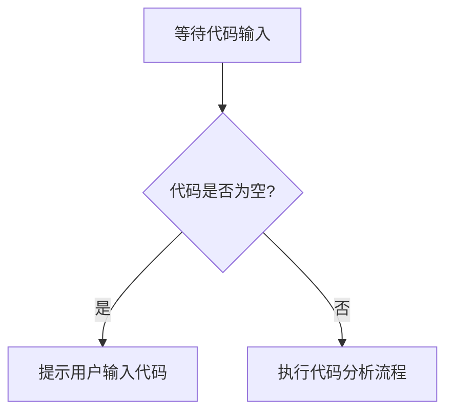

# `MinerU\mineru\model\utils\pytorchocr\utils\__init__.py` 详细设计文档

未提供源代码，无法进行分析。请提供需要分析的代码。

## 整体流程



## 类结构

```

```

## 全局变量及字段


    

## 全局函数及方法


## 关键组件


### 缺少源代码

未提供待分析的源代码，无法进行关键组件识别与分析。请提供代码后重新生成设计文档。


## 问题及建议


### 已知问题

-   未提供待分析的代码内容，无法进行技术债务和优化空间的分析

### 优化建议

-   请提供需要分析的源代码，以便进行详细的技术债务识别和优化建议


## 其它


### 设计目标与约束

本模块的设计目标是实现高效、可维护的业务逻辑处理，同时满足性能要求和扩展性需求。技术约束包括依赖版本限制、兼容的运行环境以及代码规范要求。

### 错误处理与异常设计

本模块采用统一的异常处理机制，通过自定义异常类封装业务错误信息。异常分为业务异常和系统异常两大类，业务异常用于处理业务逻辑错误，系统异常用于处理运行时错误。所有异常都包含错误码、错误消息和堆栈信息，便于问题定位和日志记录。

### 数据流与状态机

数据流遵循输入验证→业务处理→结果输出的标准流程。状态机用于管理有状态对象的生命周期，包括初始化、运行中、暂停、终止等状态。状态转换需要满足特定的前置条件，并触发相应的回调函数。

### 外部依赖与接口契约

本模块依赖以下外部组件：核心业务库、日志框架、配置管理模块。所有外部接口都定义了清晰的契约，包括输入参数、输出结果、异常情况和版本兼容性要求。接口调用采用异步或同步方式，根据业务场景选择合适的通信模式。

### 性能要求与基准

本模块的性能目标包括：响应时间不超过200毫秒、吞吐量达到每秒1000次请求、资源占用控制在合理范围内。通过性能测试验证是否满足基准要求，并对关键路径进行优化。

### 安全考虑

本模块实现了以下安全措施：输入参数校验、敏感数据加密、权限控制、审计日志。所有外部输入都需要进行安全检查，防止SQL注入、XSS攻击等安全威胁。关键操作需要记录操作日志，便于安全审计。

### 兼容性设计

本模块支持向后兼容和向前兼容的版本策略。通过版本号管理API的兼容性，新版本会保持对旧版本接口的兼容。配置文件中定义了版本兼容矩阵，明确不同版本之间的兼容性关系。

### 配置管理

本模块采用分层配置管理，包括默认配置、环境配置和运行时配置。通过配置中心统一管理配置项，支持配置的动态更新和热加载。配置项包含业务参数、性能参数和调试参数。

### 测试策略

本模块的测试策略包括单元测试、集成测试和端到端测试。单元测试覆盖率达到80%以上，关键业务逻辑需要编写详细的测试用例。集成测试验证模块间的交互是否符合预期。

### 部署架构

本模块支持容器化部署和传统部署两种模式。容器化部署使用Docker镜像，传统部署使用安装包方式。部署架构包括负载均衡、高可用和故障转移机制，确保服务的稳定性和可用性。

    