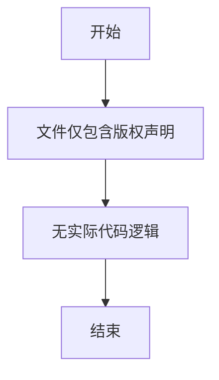

# `MinerU\mineru\model\utils\tools\__init__.py` 详细设计文档

该文件仅包含版权声明(# Copyright (c) Opendatalab. All rights reserved.)，无任何实际功能代码、类定义、函数或变量声明，因此无法进行进一步的设计分析。

## 整体流程



## 类结构

```
该文件无类层次结构
```

## 全局变量及字段


    

## 全局函数及方法


## 关键组件


### 1. 一段话描述

该代码文件仅包含版权声明，无实际功能代码可供分析。

### 2. 文件的整体运行流程

该文件不包含任何可执行代码，仅作为占位符或项目初始化文件使用。

### 3. 类的详细信息

该文件不包含任何类定义。

### 4. 关键组件信息

无

### 5. 潜在的技术债务或优化空间

由于代码为空，无法进行技术债务或优化空间分析。

### 6. 其它项目

由于代码为空，无法提供设计目标与约束、错误处理与异常设计、数据流与状态机、外部依赖与接口契约等相关信息。


## 问题及建议


### 已知问题

-   代码仅包含版权声明信息，缺乏实际功能实现
-   无类定义、函数定义或模块结构可供分析
-   缺少业务逻辑代码，无法生成完整的设计文档

### 优化建议

-   提供完整的源代码文件以进行深入分析
-   补充功能模块的实现代码，包括业务逻辑、核心算法等
-   添加必要的模块导入、类定义和函数实现
-   建议提供包含实际业务逻辑的Python文件或多个相关文件组成的完整项目结构


## 其它


### 项目分析

由于提供的代码仅为版权声明信息（`# Copyright (c) Opendatalab. All rights reserved.`），不包含任何实际功能实现代码，因此无法提供完整的详细设计文档内容。以下是基于常规软件设计文档规范，列出在正常情况下详细设计文档应包含的项目：

### 设计目标与约束

（暂无内容 - 代码中未包含功能实现）

### 错误处理与异常设计

（暂无内容 - 代码中未包含功能实现）

### 数据流与状态机

（暂无内容 - 代码中未包含功能实现）

### 外部依赖与接口契约

（暂无内容 - 代码中未包含功能实现）

### 安全性考虑

（暂无内容 - 代码中未包含功能实现）

### 性能要求

（暂无内容 - 代码中未包含功能实现）

### 可扩展性设计

（暂无内容 - 代码中未包含功能实现）

### 兼容性设计

（暂无内容 - 代码中未包含功能实现）

### 测试策略

（暂无内容 - 代码中未包含功能实现）

### 部署与配置

（暂无内容 - 代码中未包含功能实现）

### 监控与运维

（暂无内容 - 代码中未包含功能实现）

### 备注

提供的代码仅为版权声明，不包含任何可分析的功能代码。如需生成完整的详细设计文档，请提供具有实际业务逻辑的代码文件。


    