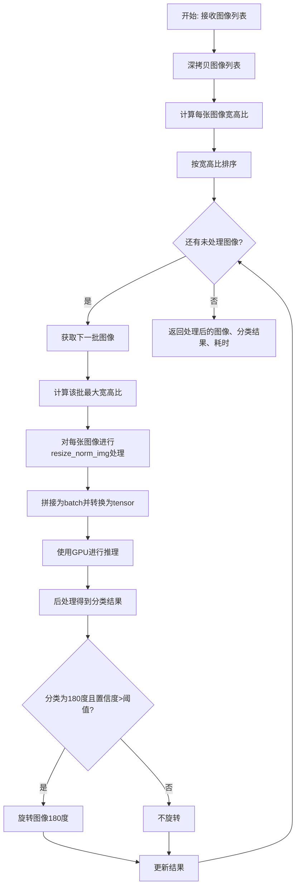
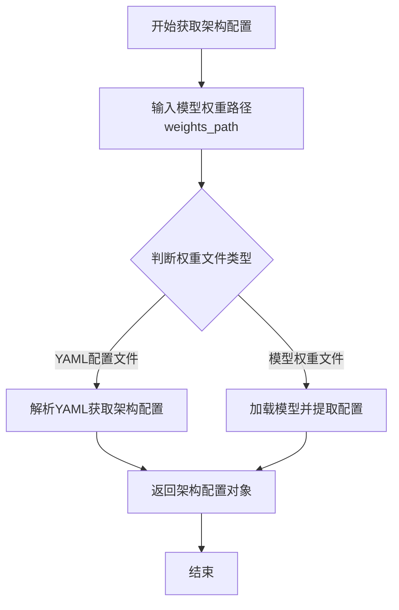
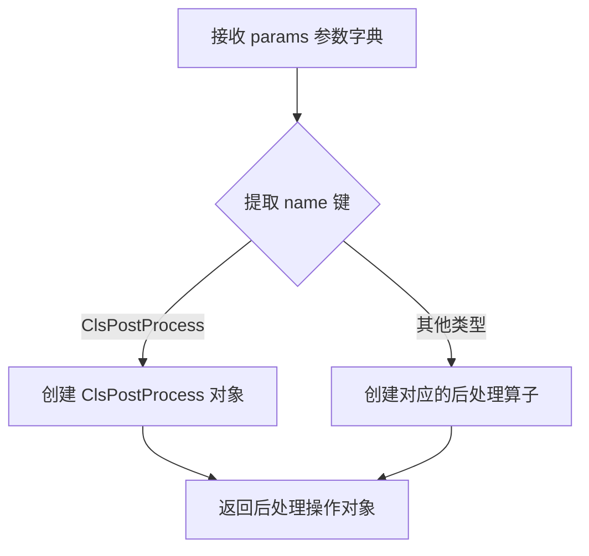
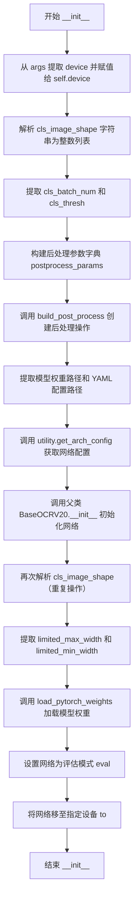

# `MinerU\mineru\model\utils\tools\infer\predict_cls.py` 详细设计文档

这是一个基于PyTorch的文本方向分类器（TextClassifier），用于对图像中的文本进行方向分类（0度或180度），并根据分类结果对图像进行旋转校正。该分类器继承自BaseOCRV20，使用深度学习模型进行推理，通过批处理方式提高处理效率。

## 整体流程



## 类结构

```
BaseOCRV20 (抽象基类/基类)
└── TextClassifier (文本方向分类器)
```

## 全局变量及字段


### `cv2`
    
OpenCV库，用于图像处理和操作

类型：`module`
    


### `copy`
    
深拷贝模块，用于对象深拷贝

类型：`module`
    


### `numpy as np`
    
NumPy库，用于数值计算和数组操作

类型：`module`
    


### `math`
    
数学模块，提供数学函数

类型：`module`
    


### `time`
    
时间模块，用于时间测量

类型：`module`
    


### `torch`
    
PyTorch库，用于深度学习模型

类型：`module`
    


### `BaseOCRV20`
    
基础OCR v2.0模型类

类型：`class`
    


### `utility`
    
pytorchocr工具模块

类型：`module`
    


### `build_post_process`
    
后处理构建函数

类型：`function`
    


### `TextClassifier.device`
    
设备类型(CPU/GPU)

类型：`str`
    


### `TextClassifier.cls_image_shape`
    
分类图像shape列表

类型：`list[int]`
    


### `TextClassifier.cls_batch_num`
    
批处理大小

类型：`int`
    


### `TextClassifier.cls_thresh`
    
分类置信度阈值

类型：`float`
    


### `TextClassifier.postprocess_op`
    
后处理操作对象

类型：`object`
    


### `TextClassifier.weights_path`
    
模型权重路径

类型：`str`
    


### `TextClassifier.yaml_path`
    
配置文件路径

类型：`str`
    


### `TextClassifier.limited_max_width`
    
最大宽度限制

类型：`int`
    


### `TextClassifier.limited_min_width`
    
最小宽度限制

类型：`int`
    


### `TextClassifier.net`
    
神经网络模型(继承自BaseOCRV20)

类型：`torch.nn.Module`
    
    

## 全局函数及方法


### `utility.get_arch_config(weights_path)`

获取网络架构配置，用于从给定的模型权重路径中提取网络架构相关的配置信息。

参数：

- `weights_path`：`str`，模型权重文件的路径，用于定位要加载的模型文件。

返回值：`dict` 或 `object`，网络架构配置对象，包含模型的结构信息（如层数、通道数、注意力头数等），用于初始化网络模型。

#### 流程图



#### 带注释源码

```
# 源码不可见
# 该函数定义在 pytorchocr_utility 模块中
# 根据 TextClassifier 类中的调用方式推断其功能
# 实际源码未包含在提供的代码片段中
```

---

**注意**：根据提供的代码片段，`utility.get_arch_config` 函数的实现代码并未包含在内。从代码中的调用 `network_config = utility.get_arch_config(self.weights_path)` 以及后续将 `network_config` 传递给父类 `BaseOCRV20` 的初始化方法可以推断，该函数主要负责解析模型权重文件或相关的配置文件，以获取网络结构的配置信息。实际的函数实现需要查看 `pytorchocr_utility` 模块的源代码。


### `build_post_process`

构建后处理操作，根据配置参数动态创建相应的后处理算子，用于文本分类结果的后处理。

参数：

- `params`：`dict`，包含后处理配置信息的字典，必须包含 'name' 键指定后处理类型，可选包含其他配置如 'label_list' 等

返回值：`object`，返回构建后的后处理操作对象（此处为 `ClsPostProcess` 实例）

#### 流程图



#### 带注释源码

```
# 从 pytorchocr.postprocess 模块导入 build_post_process 函数
from ...pytorchocr.postprocess import build_post_process

# 在 TextClassifier 类中的使用示例：
postprocess_params = {
    'name': 'ClsPostProcess',           # 指定后处理类型为分类后处理
    "label_list": args.label_list,      # 传入标签列表用于结果映射
}
# 构建后处理算子并赋值给实例变量
self.postprocess_op = build_post_process(postprocess_params)

# 后续在推理过程中调用后处理算子：
# cls_result = self.postprocess_op(prob_out)
```


### `TextClassifier.__init__`

该方法是 `TextClassifier` 类的构造函数，负责初始化文本方向分类器。它从传入的参数对象中提取设备信息、模型路径、图像_shape等配置，创建后处理操作，构建网络架构，并加载预训练的 PyTorch 模型权重，将模型设置为评估模式并移至指定设备。

参数：

- `self`：实例本身，隐式参数，类型为 `TextClassifier`，表示当前正在初始化的分类器实例
- `args`：命名空间对象（或类似对象），类型为 `argparse.Namespace` 或自定义配置对象，包含以下关键属性：
  - `device`：字符串，指定模型运行的设备（如 'cpu' 或 'cuda'）
  - `cls_image_shape`：字符串，图像形状参数，格式如 "3,48,192"，用逗号分隔
  - `cls_batch_num`：整数，分类批处理大小
  - `cls_thresh`：浮点数，分类置信度阈值
  - `label_list`：列表，分类标签列表（如 ['0', '180']）
  - `cls_model_path`：字符串，分类器模型权重文件路径
  - `cls_yaml_path`：字符串，分类器 YAML 配置文件路径
  - `limited_max_width`：整数，图像最大宽度限制
  - `limited_min_width`：整数，图像最小宽度限制
- `**kwargs`：关键字参数，类型为字典，传递给父类的额外参数

返回值：无（返回 `None`），该方法仅初始化实例属性，不返回任何值

#### 流程图



#### 带注释源码

```python
def __init__(self, args, **kwargs):
    """
    初始化 TextClassifier 文本方向分类器
    
    参数:
        args: 包含所有配置参数的对象
        **kwargs: 传递给父类的额外关键字参数
    """
    # 从 args 中提取设备信息（'cpu' 或 'cuda'）
    self.device = args.device
    
    # 解析图像形状字符串 "3,48,192" -> [3, 48, 192]
    # cls_image_shape[0]=通道数, cls_image_shape[1]=高度, cls_image_shape[2]=宽度
    self.cls_image_shape = [int(v) for v in args.cls_image_shape.split(",")]
    
    # 提取批处理大小，用于控制每次推理的图片数量
    self.cls_batch_num = args.cls_batch_num
    
    # 提取分类阈值，用于判断方向是否需要旋转
    self.cls_thresh = args.cls_thresh
    
    # 构建后处理参数字典，用于创建 ClsPostProcess 对象
    # label_list 通常为 ['0', '180']，表示正常方向和旋转180度
    postprocess_params = {
        'name': 'ClsPostProcess',
        "label_list": args.label_list,
    }
    
    # 使用工厂函数创建后处理操作对象
    self.postprocess_op = build_post_process(postprocess_params)

    # 提取分类模型的权重路径和 YAML 配置路径
    self.weights_path = args.cls_model_path
    self.yaml_path = args.cls_yaml_path
    
    # 从权重文件中提取网络架构配置（层数、通道数等）
    network_config = utility.get_arch_config(self.weights_path)
    
    # 调用父类 BaseOCRV20 的构造函数，完成网络框架的初始化
    # 传递 network_config 和额外的关键字参数
    super(TextClassifier, self).__init__(network_config, **kwargs)

    # 重复解析 cls_image_shape（代码冗余，可以移除）
    self.cls_image_shape = [int(v) for v in args.cls_image_shape.split(",")]

    # 提取图像宽度限制参数，用于图像预处理时的宽度限制
    self.limited_max_width = args.limited_max_width
    self.limited_min_width = args.limited_min_width

    # 调用父类方法加载预训练的 PyTorch 模型权重
    self.load_pytorch_weights(self.weights_path)
    
    # 将网络设置为评估模式，关闭 dropout 等训练特有的层
    self.net.eval()
    
    # 将模型参数和缓冲区移动到指定的计算设备（CPU 或 GPU）
    self.net.to(self.device)
```


### TextClassifier.resize_norm_img

该方法负责将输入的文本图像调整到指定的尺寸并进行归一化处理，以适配文本方向分类模型的输入要求。通过计算宽高比来确定目标宽度，使用cv2.resize进行缩放，然后对像素值进行归一化（除以255后映射到[-1, 1]区间），最后对调整后的图像进行右侧填充至统一宽度。

参数：

- `self`：`TextClassifier`实例本身，包含分类器配置参数
- `img`：`numpy.ndarray`，输入的原始图像数据，通常为彩色图像（3通道）或灰度图像（1通道），shape为(H, W, C)或(H, W)

返回值：`numpy.ndarray`，处理后的图像数据，shape为(imgC, imgH, imgW)的float32类型数组，数值范围为[-1, 1]

#### 流程图

```mermaid
flowchart TD
    A[开始resize_norm_img] --> B[获取目标尺寸<br/>imgC, imgH, imgW]
    B --> C[获取输入图像尺寸<br/>h, w]
    C --> D[计算宽高比<br/>ratio = w / h]
    D --> E[限制imgW范围<br/>min-max between limited_min_width and limited_max_width]
    E --> F[计算比例高度<br/>ratio_imgH = imgH * ratio]
    F --> G{ratio_imgH > imgW?}
    G -->|Yes| H[resized_w = imgW]
    G -->|No| I[resized_w = ceil(imgH * ratio)]
    H --> J[使用cv2.resize缩放图像<br/>resized_image]
    I --> J
    J --> K[转换为float32类型]
    K --> L{cls_image_shape[0] == 1?}
    L -->|Yes| M[归一化: /255<br/>添加newaxis: [H, W] -> [1, H, W]]
    L -->|No| N[通道转换: transpose(2,0,1)<br/>归一化: /255]
    M --> O[像素值映射到[-1, 1]<br/>- 0.5后除以0.5]
    N --> O
    O --> P[创建填充模板<br/>zeros(imgC, imgH, imgW)]
    P --> Q[填充resize后的图像<br/>padding_im[:, :, 0:resized_w]]
    Q --> R[返回填充后的图像]
```

#### 带注释源码

```python
def resize_norm_img(self, img):
    """
    对图像进行resize和归一化处理
    
    Args:
        img: 输入的原始图像，numpy数组格式
        
    Returns:
        处理后的图像数组，shape为(imgC, imgH, imgW)
    """
    # 从配置中获取目标图像尺寸：通道数、高度、宽度
    imgC, imgH, imgW = self.cls_image_shape
    
    # 获取输入图像的实际尺寸（高度和宽度）
    h = img.shape[0]
    w = img.shape[1]
    
    # 计算输入图像的宽高比
    ratio = w / float(h)
    
    # 限制目标宽度在配置的最小和最大宽度范围内
    imgW = max(min(imgW, self.limited_max_width), self.limited_min_width)
    
    # 根据宽高比计算等比例的高度
    ratio_imgH = math.ceil(imgH * ratio)
    # 确保计算出的高度不低于最小宽度限制
    ratio_imgH = max(ratio_imgH, self.limited_min_width)
    
    # 确定最终resize的宽度：取imgW和基于比例计算宽度的较小值
    if ratio_imgH > imgW:
        resized_w = imgW
    else:
        resized_w = int(math.ceil(imgH * ratio))
    
    # 使用OpenCV进行图像缩放，保持高度不变，调整宽度
    resized_image = cv2.resize(img, (resized_w, imgH))
    
    # 转换为float32类型以进行后续数值计算
    resized_image = resized_image.astype('float32')
    
    # 根据目标图像的通道数进行不同的归一化处理
    if self.cls_image_shape[0] == 1:
        # 灰度图像：归一化到[0, 1]，然后添加通道维度
        resized_image = resized_image / 255
        resized_image = resized_image[np.newaxis, :]
    else:
        # 彩色图像：通道维度转换HWC->CHW，然后归一化到[0, 1]
        resized_image = resized_image.transpose((2, 0, 1)) / 255
    
    # 将像素值从[0, 1]映射到[-1, 1]区间
    resized_image -= 0.5
    resized_image /= 0.5
    
    # 创建统一尺寸的填充模板（使用零填充）
    padding_im = np.zeros((imgC, imgH, imgW), dtype=np.float32)
    
    # 将resize后的图像填充到模板左侧，右侧自动填充为0
    padding_im[:, :, 0:resized_w] = resized_image
    
    return padding_im
```


### `TextClassifier.__call__`

该方法是TextClassifier类的主调用方法，负责执行文本方向分类和旋转逻辑。它接收图像列表，按照宽高比排序后批量处理，对需要旋转180度的图像进行旋转，并返回处理后的图像、分类结果和耗时。

参数：

- `img_list`：`List[np.ndarray]`，待分类的图像列表，每个元素为OpenCV读取的图像（numpy数组）

返回值：`Tuple[List[np.ndarray], List[Tuple[str, float]], float]`，返回一个三元组，包含处理后的图像列表、分类结果列表（每个元素为[标签, 置信度]）和推理耗时（秒）

#### 流程图

```mermaid
flowchart TD
    A[开始 __call__] --> B[深拷贝 img_list]
    B --> C[计算图像数量 img_num]
    C --> D[遍历img_list计算宽高比 width_list]
    D --> E[按宽高比排序获取索引 indices]
    E --> F[初始化cls_res结果列表]
    F --> G[初始化batch_num和elapse]
    G --> H[外层循环: 按batch_num分批处理]
    H --> I[计算当前批次最大宽高比 max_wh_ratio]
    I --> J[对当前批次每张图像resize_norm_img归一化]
    J --> K[拼接成batch并转为PyTorch张量]
    K --> L[推理: self.net(inp)]
    L --> M[CPU运算并后处理postprocess_op]
    M --> N[遍历当前批次结果]
    N --> O{标签含'180'且分数>cls_thresh?}
    O -->|是| P[旋转图像180度]
    O -->|否| Q[不旋转]
    P --> Q
    Q --> R[保存结果到cls_res]
    R --> S{批次处理完成?}
    S --> H
    S --> T[返回img_list, cls_res, elapse]
```

#### 带注释源码

```python
def __call__(self, img_list):
    """
    主调用方法：执行文本方向分类和旋转
    
    Args:
        img_list: 输入的图像列表，每个元素为HWC格式的numpy数组
    
    Returns:
        img_list: 处理后的图像列表（部分图像可能被旋转180度）
        cls_res: 分类结果列表，每个元素为[标签, 置信度]如['0', 0.98]
        elapse: 推理总耗时（秒）
    """
    # 1. 深拷贝输入，避免修改原始数据
    img_list = copy.deepcopy(img_list)
    # 2. 获取图像数量
    img_num = len(img_list)
    
    # 3. 计算所有图像的宽高比，用于排序优化batch处理效率
    width_list = []
    for img in img_list:
        # width / height = 宽高比
        width_list.append(img.shape[1] / float(img.shape[0]))
    
    # 4. 按宽高比排序，返回排序后的索引数组
    # 相似尺寸的图像在同一batch中可共享padding空间，提升效率
    indices = np.argsort(np.array(width_list))
    
    # 5. 初始化分类结果列表，预设空标签和零置信度
    cls_res = [['', 0.0]] * img_num
    
    # 6. 获取批次大小和初始化计时器
    batch_num = self.cls_batch_num
    elapse = 0
    
    # 7. 外层循环：按batch_num分批次处理图像
    for beg_img_no in range(0, img_num, batch_num):
        # 计算当前批次的结束索引
        end_img_no = min(img_num, beg_img_no + batch_num)
        
        # 8. 第一遍遍历：计算当前batch中最大宽高比
        # 用于统一归一化时的宽度基准
        norm_img_batch = []
        max_wh_ratio = 0
        for ino in range(beg_img_no, end_img_no):
            h, w = img_list[indices[ino]].shape[0:2]
            wh_ratio = w * 1.0 / h
            max_wh_ratio = max(max_wh_ratio, wh_ratio)
        
        # 9. 第二遍遍历：归一化图像并构建batch
        for ino in range(beg_img_no, end_img_no):
            # 调用resize_norm_img进行尺寸归一化和标准化
            norm_img = self.resize_norm_img(img_list[indices[ino]])
            # 添加batch维度 [C,H,W] -> [1,C,H,W]
            norm_img = norm_img[np.newaxis, :]
            norm_img_batch.append(norm_img)
        
        # 10. 拼接所有归一化图像为单一numpy数组
        # shape: [batch_size, C, H, W]
        norm_img_batch = np.concatenate(norm_img_batch)
        # 拷贝数据确保连续内存布局
        norm_img_batch = norm_img_batch.copy()
        
        # 11. 记录推理开始时间
        starttime = time.time()
        
        # 12. PyTorch推理：关闭梯度计算以提升性能
        with torch.no_grad():
            # numpy转PyTorch张量
            inp = torch.from_numpy(norm_img_batch)
            # 移至指定设备（CPU/GPU）
            inp = inp.to(self.device)
            # 前向传播推理
            prob_out = self.net(inp)
        
        # 13. 结果移回CPU并转为numpy数组
        prob_out = prob_out.cpu().numpy()
        
        # 14. 后处理：将概率映射为标签（如'0','180'）和置信度
        cls_result = self.postprocess_op(prob_out)
        
        # 15. 累加单批次耗时
        elapse += time.time() - starttime
        
        # 16. 遍历当前批次结果，更新cls_res和旋转图像
        for rno in range(len(cls_result)):
            label, score = cls_result[rno]
            # 根据排序索引还原原始位置
            cls_res[indices[beg_img_no + rno]] = [label, score]
            
            # 17. 判断是否需要旋转180度
            # 条件：标签含'180'且置信度超过阈值
            if '180' in label and score > self.cls_thresh:
                # cv2.ROTATE_180 = 1 表示旋转180度
                img_list[indices[beg_img_no + rno]] = cv2.rotate(
                    img_list[indices[beg_img_no + rno]], 1)
    
    # 18. 返回处理后的图像、分类结果和总耗时
    return img_list, cls_res, elapse
```

## 关键组件


### TextClassifier 类

TextClassifier 是一个文本方向分类器，继承自 BaseOCRV20，用于检测文本图像的方向（0度或180度），对倒置文本图像进行旋转纠正，并返回分类结果和置信度分数。

### 图像预处理与归一化

该组件负责将输入图像调整到指定尺寸并进行归一化处理，包括计算宽高比、图像缩放、像素值归一化到[-1, 1]范围、以及图像填充到统一尺寸。

### 批处理与排序调度

该组件实现批量处理机制，按图像宽高比排序后进行分组推理，以提高处理效率，同时记录各环节耗时。

### 方向分类与旋转纠正

该组件调用后处理操作对模型输出进行分类，并根据分类结果和置信度阈值对图像进行180度旋转。

### PyTorch 推理引擎

该组件封装了 PyTorch 模型推理的完整流程，包括张量转换、设备迁移、模型前向传播和结果回传至 CPU。


## 问题及建议


```json
{
  "已知问题": [
    "重复代码：self.cls_image_shape 在 __init__ 方法中被解析了两次（第20行和第27行），造成冗余",
    "旋转逻辑错误：代码中使用 cv2.rotate(img, 1) 进行旋转，但实际旋转的是90度顺时针（cv2.ROTATE_90_CLOCKWISE），而判断条件是 label 包含 '180'，应该使用 cv2.ROTATE_180（值为2）",
    "变量 max_wh_ratio 计算但未使用：在 __call__ 方法中计算了批次内最大的宽高比，但该值并未传递给 resize_norm_img 方法使用，导致图像归一化逻辑不完整",
    "不必要的内存复制：norm_img_batch.copy() 调用是多余的，因为 np.concatenate 已经返回新数组",
    "过度使用 deepcopy：copy.deepcopy(img_list) 对于大型图像列表会造成显著的性能开销",
    "缺少错误处理：模型加载、权重读取、图像推理等关键操作均无异常捕获机制",
    "硬编码值：标签 '180' 被硬编码，缺乏灵活性",
    "import 冗余：copy 模块被导入但仅用于 deepcopy，可考虑移除或替换",
    "类型提示缺失：方法参数和返回值缺乏类型注解，影响代码可维护性和可读性",
    "变量遮蔽：imgW 变量在 resize_norm_img 中被重复赋值使用，可能导致逻辑混淆"
  ],
  "优化建议": [
    "移除重复的 cls_image_shape 解析代码，保留一处即可",
    "修正旋转逻辑：将 cv2.rotate(img, 1) 改为 cv2.rotate(img, 2) 以正确旋转180度，或根据实际需求调整判断逻辑",
    "完善宽高比处理逻辑：将计算得到的 max_wh_ratio 传递给 resize_norm_img 或用于批次图像的统一步幅控制",
    "移除多余的 .copy() 调用以减少内存开销",
    "考虑使用列表推导式或直接操作原始列表替代 deepcopy，或在必要时使用浅拷贝",
    "为关键操作添加 try-except 异常处理，特别是模型加载和推理阶段",
    "将硬编码的标签值提取为配置参数或类常量",
    "添加方法参数和返回值的类型注解（Type Hints）",
    "优化 import 语句，移除未使用的模块",
    "考虑使用 torch.inference_mode() 替代 torch.no_grad() 以获得更好的推理性能",
    "重构 resize_norm_img 方法以提高可读性和参数传递的清晰度"
  ]
}
```

## 其它


### 设计目标与约束

本模块旨在对OCR输入的文本图像进行方向分类（0度或180度），以纠正文本方向，提高后续识别准确率。设计约束包括：依赖PyTorch框架，需在指定设备（CPU/GPU）上运行，输入图像需符合预定义的尺寸比例，支持批量处理以提升效率。

### 错误处理与异常设计

代码中未显式处理异常，主要风险点包括：模型加载失败、设备不存在、输入图像格式异常、图像尺寸为0等。建议增加异常捕获机制，对无效输入返回默认值或抛出明确异常，确保程序稳定性。

### 数据流与状态机

数据流：输入图像列表→深拷贝→宽高比计算→排序→批量归一化处理→模型推理→后处理→结果合并→输出（图像列表、分类结果、耗时）。状态机主要涉及模型加载态、推理态、结果返回态三个状态。

### 外部依赖与接口契约

依赖项：cv2（图像处理）、numpy（数值计算）、torch（深度学习框架）、pytorchocr内部模块（BaseOCRV20、build_post_process、utility）。接口契约：__call__方法接受img_list（numpy数组列表），返回（处理后图像列表、分类结果列表、推理耗时）。

### 性能考虑与优化建议

当前通过宽高比排序提升批处理效率。优化方向：支持动态批大小调整、FP16推理加速、ONNX导出、多线程预处理。

### 安全性考虑

模型路径和配置文件路径需进行合法性校验，防止路径遍历攻击；设备选择需验证可用性。

### 配置参数说明

关键参数：cls_image_shape（输入图像尺寸）、cls_batch_num（批大小）、cls_thresh（分类阈值）、limited_max_width/min_width（宽度限制）、label_list（标签列表）。

### 使用示例与集成指南

```python
args = parse_args()
classifier = TextClassifier(args)
imgs, cls_res, elapse = classifier(img_list)
# cls_res格式：[[label, score], ...]
```


    