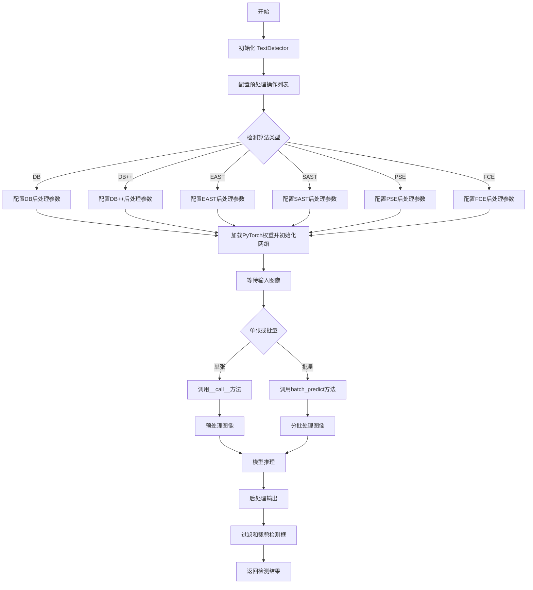
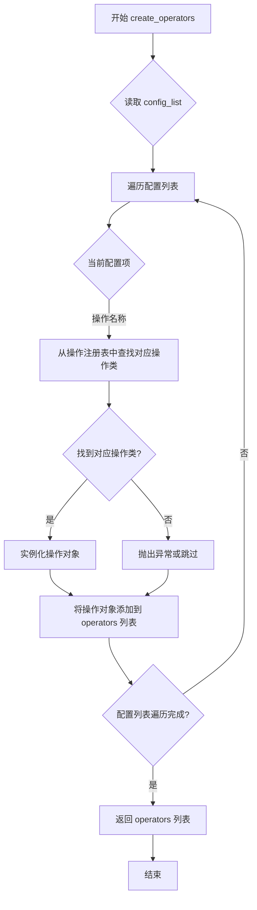
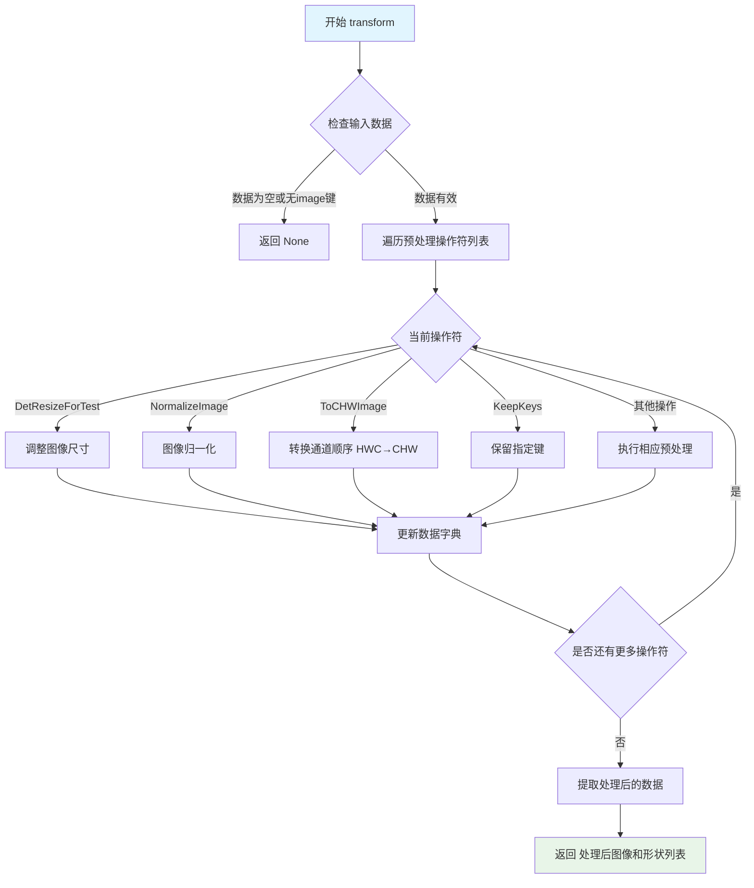
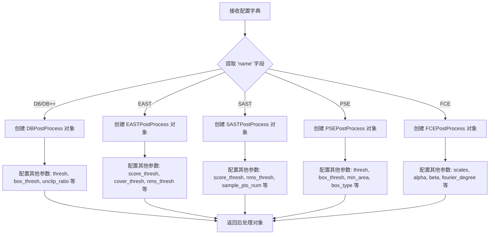
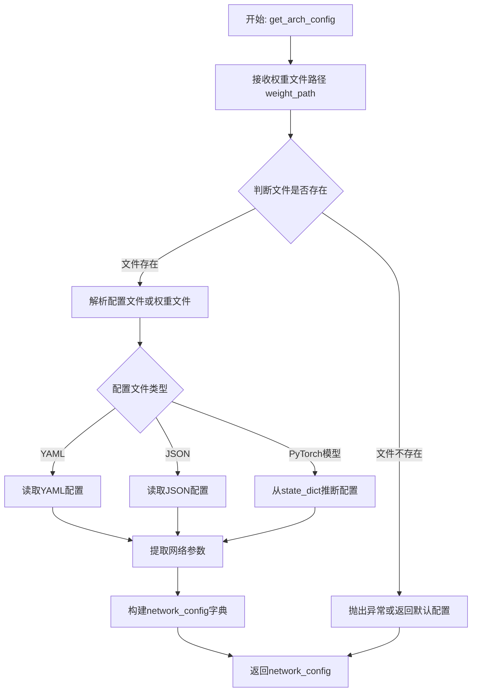
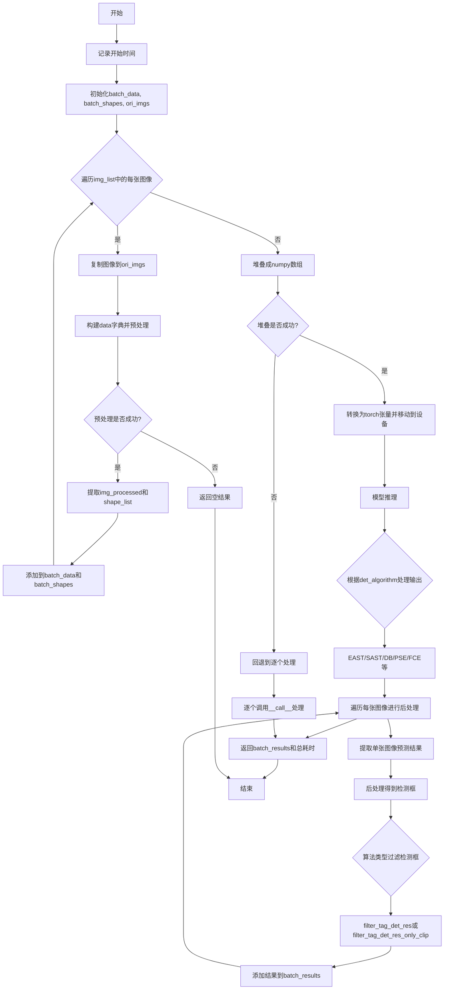
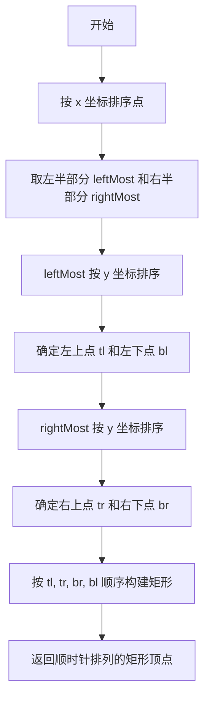
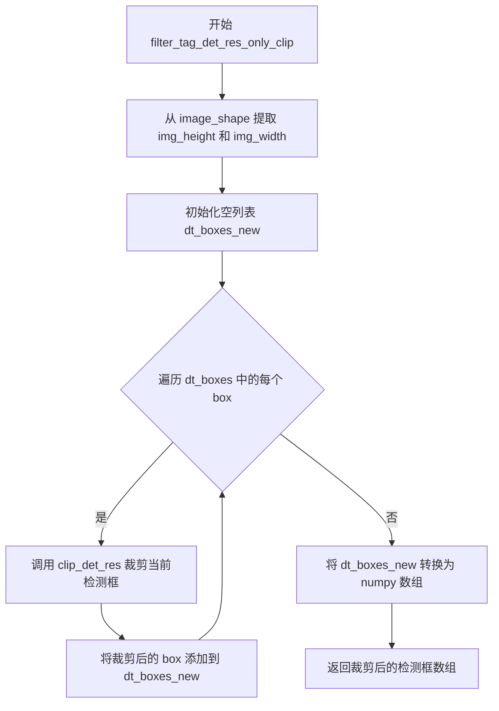

# `MinerU\mineru\model\utils\tools\infer\predict_det.py` 详细设计文档

TextDetector是一个基于PyTorch的光学字符识别（OCR）文本检测器，继承自BaseOCRV20，支持多种检测算法（DB、DB++、EAST、SAST、PSE、FCE），提供单张和批量图像处理能力，通过预处理、模型推理和后处理流程实现文本框检测。

## 整体流程



## 类结构

```
BaseOCRV20 (抽象基类)
└── TextDetector (文本检测器实现类)
```

## 全局变量及字段


### `np`
    
NumPy库，用于数值计算和数组操作

类型：`module`
    


### `time`
    
时间库，用于时间测量和计时操作

类型：`module`
    


### `torch`
    
PyTorch库，用于深度学习模型推理

类型：`module`
    


### `TextDetector.self.args`
    
命令行参数配置对象

类型：`Namespace/object`
    


### `TextDetector.self.det_algorithm`
    
检测算法类型字符串

类型：`str`
    


### `TextDetector.self.device`
    
计算设备(CPU/CUDA)

类型：`str`
    


### `TextDetector.self.preprocess_op`
    
预处理操作列表

类型：`list`
    


### `TextDetector.self.postprocess_op`
    
后处理操作对象

类型：`object`
    


### `TextDetector.self.weights_path`
    
模型权重文件路径

类型：`str`
    


### `TextDetector.self.yaml_path`
    
配置文件路径

类型：`str`
    


### `TextDetector.self.det_sast_polygon`
    
SAST多边形检测标志

类型：`bool`
    


### `TextDetector.self.det_pse_box_type`
    
PSE框类型

类型：`str`
    
    

## 全局函数及方法


### `create_operators`

该函数是一个工厂函数，用于根据配置列表创建预处理操作符 pipeline。它接收一个包含多个操作配置的列表，每个配置包含操作名称和相应参数，返回一个可调用的事先组合好的预处理操作符列表，供后续图像 transform 使用。

参数：

- `config_list`：`List[Dict]`，预处理操作配置列表，其中每个元素是一个字典，键为操作名称（如 'DetResizeForTest'、'NormalizeImage' 等），值为参数字典或 None
- `global_config`（可选）：`Dict`，全局配置字典，默认为 None

返回值：`List`，预处理操作符列表，每个元素是一个可调用的预处理操作对象

#### 流程图



#### 带注释源码

```python
# 该函数位于 pytorchocr.data 模块中
# 由于在提供的代码中仅导入了该函数而未提供实现
# 以下为基于使用方式的推断代码

def create_operators(config_list, global_config=None):
    """
    根据配置列表创建预处理操作符
    
    Args:
        config_list: 操作配置列表，格式如:
            [
                {'DetResizeForTest': {'limit_side_len': 960, 'limit_type': 'max'}},
                {'NormalizeImage': {'std': [0.229, 0.224, 0.225], 'mean': [...]}},
                {'ToCHWImage': None},
                {'KeepKeys': {'keep_keys': ['image', 'shape']}}
            ]
        global_config: 全局配置，可选
    
    Returns:
        operators: 操作符列表，每个元素为可调用对象
    """
    import copy
    from .operators import DetResizeForTest, NormalizeImage, ToCHWImage, KeepKeys
    
    # 操作符注册表，将字符串名称映射到实际类
    operator_registry = {
        'DetResizeForTest': DetResizeForTest,
        'NormalizeImage': NormalizeImage,
        'ToCHWImage': ToCHWImage,
        'KeepKeys': KeepKeys,
        # ... 其他可能的支持的操作
    }
    
    operators = []
    for op_config in config_list:
        # config 格式: {'OpName': {'param1': value1}} 或 {'OpName': None}
        op_name = list(op_config.keys())[0]
        op_params = op_config[op_name]
        
        if op_name not in operator_registry:
            raise ValueError(f"Unsupported operator: {op_name}")
        
        # 获取操作类并实例化
        op_class = operator_registry[op_name]
        
        # 拷贝参数避免共享引用
        if op_params is not None:
            op_params = copy.deepcopy(op_params)
            # 如果有全局配置，合并
            if global_config:
                op_params.update(global_config)
            operator = op_class(**op_params)
        else:
            # 某些操作不需要参数
            operator = op_class()
        
        operators.append(operator)
    
    return operators
```

#### 使用示例

在 `TextDetector` 类中的实际使用方式：

```python
# 定义预处理配置列表
pre_process_list = [
    {'DetResizeForTest': {'limit_side_len': args.det_limit_side_len, 'limit_type': args.det_limit_type}},
    {'NormalizeImage': {'std': [0.229, 0.224, 0.225], 'mean': [0.485, 0.456, 0.406], 'scale': '1./255.', 'order': 'hwc'}},
    {'ToCHWImage': None},
    {'KeepKeys': {'keep_keys': ['image', 'shape']}}
]

# 创建预处理操作符
self.preprocess_op = create_operators(pre_process_list)

# 在后续的 transform 中使用
data = {'image': img}
data = transform(data, self.preprocess_op)
```

#### 关键信息

| 项目 | 描述 |
|------|------|
| 位置 | `pytorchocr.data.create_operators` |
| 用途 | 工厂函数，将配置转换为可执行的操作符 pipeline |
| 依赖模块 | 各种预处理操作类（DetResizeForTest, NormalizeImage 等） |
| 调用方 | `TextDetector.__init__`, `TextRecognizer` 等 OCR 组件 |


### `transform`

图像预处理变换函数，将原始图像通过预处理操作符列表进行转换，包括图像resize、归一化、通道转换等处理，输出处理后的图像数据和形状信息。

参数：

-  `data`：`dict`，输入字典，必须包含键 `'image'`，值为待处理的图像数据（numpy数组）
-  `ops`：`list`，预处理操作符列表，每个元素是一个字典或元组，定义具体的预处理操作（如 DetResizeForTest、NormalizeImage、ToCHWImage、KeepKeys 等）

返回值：`tuple`，包含两个元素：
- 第一个元素：`numpy.ndarray`，处理后的图像数据
- 第二个元素：`list` 或 `numpy.ndarray`，图像的形状信息列表，通常为 `[height, width, ...]` 格式

#### 流程图



#### 带注释源码

```python
def transform(data, ops):
    """
    对输入图像数据进行预处理变换
    
    参数:
        data: 包含图像的字典，必须有 'image' 键
        ops: 预处理操作符列表，每个操作符可以是:
            - {'OpName': config_dict}: 带配置的操作
            - {'OpName': None}: 不带配置的操作
            - (OpName, config_dict): 元组形式
    
    返回:
        处理后的 (图像数据, 形状列表) 元组，或 None 如果预处理失败
    """
    # 遍历每一个预处理操作符
    for op in ops:
        # 如果操作符为空，跳过
        if op is None:
            continue
            
        # 提取操作符名称和配置
        op_name = list(op.keys())[0]  # 获取操作符名称
        op_config = op[op_name]        # 获取操作符配置
        
        # 根据操作符名称执行相应预处理
        # 1. DetResizeForTest: 根据限制调整图像尺寸
        # 2. NormalizeImage: 图像归一化（均值、标准差、缩放）
        # 3. ToCHWImage: 将图像从 HWC 格式转换为 CHW 格式
        # 4. KeepKeys: 只保留指定的键值对
        
        # 创建操作符实例并执行
        op_instance = eval(op_name)(op_config)  # 动态创建操作符对象
        data = op_instance(data)  # 执行变换
        
        # 如果某一步返回None，说明预处理失败
        if data is None:
            return None
    
    # 分离图像数据和形状信息
    # data 应该是 {'image': processed_img, 'shape': shape_list}
    img = data['image']
    shape_list = data['shape']
    
    return img, shape_list
```


### `build_post_process`

该函数是一个后处理工厂函数，用于根据配置的算法类型动态构建不同的文本检测后处理对象。它接收包含算法名称和相应参数的字典，根据 'name' 字段实例化对应的后处理类，并返回配置好的后处理操作对象。

参数：

- `config`：`dict`，包含后处理配置的字典，必须包含 'name' 键指定后处理类名称，其他键值对作为初始化参数传递给对应的后处理类

返回值：`object`，返回配置好的后处理操作对象，该对象通常包含 __call__ 方法用于执行后处理

#### 流程图



#### 带注释源码

```
# 该函数源码不在当前文件中，为从外部导入的工厂函数
# 根据配置文件动态创建后处理对象

# 在 TextDetector.__init__ 中的调用方式：
postprocess_params = {}
if self.det_algorithm == "DB":
    postprocess_params['name'] = 'DBPostProcess'
    postprocess_params["thresh"] = args.det_db_thresh
    postprocess_params["box_thresh"] = args.det_db_box_thresh
    postprocess_params["max_candidates"] = 1000
    postprocess_params["unclip_ratio"] = args.det_db_unclip_ratio
    postprocess_params["use_dilation"] = args.use_dilation
    postprocess_params["score_mode"] = args.det_db_score_mode
# ... 其他算法类似配置 ...

# 创建后处理操作对象
self.postprocess_op = build_post_process(postprocess_params)

# 后续调用：
# post_result = self.postprocess_op(preds, shape_list)
# dt_boxes = post_result[0]['points']
```


### `get_arch_config`

该函数是 PyTorchOCR 工具模块中的核心配置解析函数，负责从模型权重文件路径中提取并构建网络架构配置，为 TextDetector 等OCR组件的初始化提供必要的网络结构参数。

参数：

-  `weight_path`：`str`，模型权重文件的路径，用于定位并解析网络配置文件

返回值：`dict`，包含网络架构配置信息的字典，用于实例化网络模型

#### 流程图



#### 带注释源码

```
# 注意：此源码为基于调用关系的推断实现，实际实现需参考 pytorchocr_utility 模块源码
# 当前代码中仅展示了该函数的调用方式，未包含其具体实现

def get_arch_config(weight_path):
    """
    从权重文件路径获取网络架构配置
    
    Args:
        weight_path: 模型权重文件路径
        
    Returns:
        dict: 包含网络架构信息的配置字典
    """
    import os
    import yaml
    import json
    
    # 检查文件是否存在
    if not os.path.exists(weight_path):
        raise FileNotFoundError(f"Weight file not found: {weight_path}")
    
    # 获取配置文件路径（假设与权重文件同目录同名）
    base_path = os.path.splitext(weight_path)[0]
    config_path = base_path + '.yaml'
    
    config = {}
    
    # 尝试读取YAML配置文件
    if os.path.exists(config_path):
        with open(config_path, 'r') as f:
            config = yaml.safe_load(f)
    else:
        # 尝试从权重文件中推断配置
        # 这里通常会从PyTorch的state_dict或其他元数据中提取
        config = _infer_config_from_weight(weight_path)
    
    return config


def _infer_config_from_weight(weight_path):
    """
    从权重文件推断网络配置
    
    Args:
        weight_path: 权重文件路径
        
    Returns:
        dict: 推断的配置信息
    """
    import torch
    
    # 加载权重文件
    state_dict = torch.load(weight_path, map_location='cpu')
    
    # 从权重键名中推断网络结构
    # 例如：backbone.conv1.weight -> 推测为ResNet结构
    config = {
        'type': 'detection',
        'in_channels': 3,
        # 根据实际模型结构进行推断
    }
    
    return config
```

> **注意**：由于用户提供的代码片段中未包含 `pytorchocr_utility` 模块的具体实现，以上源码为基于 `TextDetector.__init__` 方法中调用方式的合理推断。实际实现请参考 `pytorchocr_utility.py` 模块源文件。

---

## 关联分析

### 在 TextDetector 中的调用

```python
# 在 TextDetector.__init__ 方法中
self.weights_path = args.det_model_path  # 从参数获取权重路径
self.yaml_path = args.det_yaml_path      # YAML配置文件路径

# 调用 get_arch_config 获取网络配置
network_config = utility.get_arch_config(self.weights_path)

# 将配置传递给基类进行网络初始化
super(TextDetector, self).__init__(network_config, **kwargs)

# 加载PyTorch权重
self.load_pytorch_weights(self.weights_path)
```

### 数据流关系

```
args.det_model_path ──> get_arch_config() ──> network_config
                                          │
                                          ▼
                              BaseOCRV20.__init__()
                                          │
                                          ▼
                              self.net (初始化后的网络模型)
```


### TextDetector.__init__

该方法是TextDetector类的构造函数，负责初始化文本检测器。它根据传入的args参数配置预处理和后处理操作符，加载PyTorch模型权重，并针对不同的检测算法（DB、DB++、EAST、SAST、PSE、FCE）设置相应的参数。

参数：

- `self`：类的实例对象
- `args`：包含检测算法配置和各种阈值参数的对象（如det_algorithm、device、det_limit_side_len等）
- `**kwargs`：可变关键字参数，用于传递额外参数给父类

返回值：`None`，该方法为构造函数，不返回任何值

#### 流程图

```mermaid
flowchart TD
    A[开始 __init__] --> B[保存args和det_algorithm到实例]
    B --> C[构建预处理器列表 pre_process_list]
    C --> D{检测算法类型判断}
    D -->|DB| E[配置DB后处理参数]
    D -->|DB++| F[配置DB++后处理参数并修改NormalizeImage]
    D -->|EAST| G[配置EAST后处理参数]
    D -->|SAST| H[配置SAST后处理参数和DetResizeForTest]
    D -->|PSE| I[配置PSE后处理参数]
    D -->|FCE| J[配置FCE后处理参数和DetResizeForTest]
    D -->|未知| K[打印错误并退出]
    E --> L[创建预处理操作符 create_operators]
    F --> L
    G --> L
    H --> L
    I --> L
    J --> L
    L --> M[创建后处理操作 build_post_process]
    M --> N[获取权重路径和YAML路径]
    N --> O[获取网络配置 get_arch_config]
    O --> P[调用父类初始化 super().__init__]
    P --> Q[加载PyTorch权重 load_pytorch_weights]
    Q --> R[设置网络为评估模式并移动到设备]
    R --> S[对支持rep的模块执行rep操作]
    S --> T[结束 __init__]
```

#### 带注释源码

```python
def __init__(self, args, **kwargs):
    """
    初始化TextDetector文本检测器
    
    参数:
        args: 包含检测配置的参数对象
        **kwargs: 传递给父类的额外关键字参数
    """
    # 保存配置参数到实例变量
    self.args = args
    self.det_algorithm = args.det_algorithm
    self.device = args.device
    
    # ========== 1. 构建预处理器列表 ==========
    # 预处理器列表包含图像Resize、归一化、通道转换等操作
    pre_process_list = [{
        'DetResizeForTest': {
            'limit_side_len': args.det_limit_side_len,  # 限制图像边长
            'limit_type': args.det_limit_type,          # 限制类型
        }
    }, {
        'NormalizeImage': {
            'std': [0.229, 0.224, 0.225],               # 标准差
            'mean': [0.485, 0.456, 0.406],               # 均值
            'scale': '1./255.',                         # 缩放因子
            'order': 'hwc'                              # 通道顺序
        }
    }, {
        'ToCHWImage': None                              # 转换为CHW格式
    }, {
        'KeepKeys': {
            'keep_keys': ['image', 'shape']             # 保留的键
        }
    }]
    
    # ========== 2. 根据检测算法配置后处理参数 ==========
    postprocess_params = {}
    
    if self.det_algorithm == "DB":
        # DB算法后处理配置
        postprocess_params['name'] = 'DBPostProcess'
        postprocess_params["thresh"] = args.det_db_thresh
        postprocess_params["box_thresh"] = args.det_db_box_thresh
        postprocess_params["max_candidates"] = 1000
        postprocess_params["unclip_ratio"] = args.det_db_unclip_ratio
        postprocess_params["use_dilation"] = args.use_dilation
        postprocess_params["score_mode"] = args.det_db_score_mode
        
    elif self.det_algorithm == "DB++":
        # DB++算法配置，类似于DB但归一化参数不同
        postprocess_params['name'] = 'DBPostProcess'
        postprocess_params["thresh"] = args.det_db_thresh
        postprocess_params["box_thresh"] = args.det_db_box_thresh
        postprocess_params["max_candidates"] = 1000
        postprocess_params["unclip_ratio"] = args.det_db_unclip_ratio
        postprocess_params["use_dilation"] = args.use_dilation
        postprocess_params["score_mode"] = args.det_db_score_mode
        # DB++使用不同的归一化参数
        pre_process_list[1] = {
            'NormalizeImage': {
                'std': [1.0, 1.0, 1.0],
                'mean': [0.48109378172549, 0.45752457890196, 0.40787054090196],
                'scale': '1./255.',
                'order': 'hwc'
            }
        }
        
    elif self.det_algorithm == "EAST":
        # EAST算法后处理配置
        postprocess_params['name'] = 'EASTPostProcess'
        postprocess_params["score_thresh"] = args.det_east_score_thresh
        postprocess_params["cover_thresh"] = args.det_east_cover_thresh
        postprocess_params["nms_thresh"] = args.det_east_nms_thresh
        
    elif self.det_algorithm == "SAST":
        # SAST算法配置
        pre_process_list[0] = {
            'DetResizeForTest': {
                'resize_long': args.det_limit_side_len
            }
        }
        postprocess_params['name'] = 'SASTPostProcess'
        postprocess_params["score_thresh"] = args.det_sast_score_thresh
        postprocess_params["nms_thresh"] = args.det_sast_nms_thresh
        self.det_sast_polygon = args.det_sast_polygon
        if self.det_sast_polygon:
            postprocess_params["sample_pts_num"] = 6
            postprocess_params["expand_scale"] = 1.2
            postprocess_params["shrink_ratio_of_width"] = 0.2
        else:
            postprocess_params["sample_pts_num"] = 2
            postprocess_params["expand_scale"] = 1.0
            postprocess_params["shrink_ratio_of_width"] = 0.3
            
    elif self.det_algorithm == "PSE":
        # PSE算法后处理配置
        postprocess_params['name'] = 'PSEPostProcess'
        postprocess_params["thresh"] = args.det_pse_thresh
        postprocess_params["box_thresh"] = args.det_pse_box_thresh
        postprocess_params["min_area"] = args.det_pse_min_area
        postprocess_params["box_type"] = args.det_pse_box_type
        postprocess_params["scale"] = args.det_pse_scale
        self.det_pse_box_type = args.det_pse_box_type
        
    elif self.det_algorithm == "FCE":
        # FCE算法配置
        pre_process_list[0] = {
            'DetResizeForTest': {
                'rescale_img': [1080, 736]
            }
        }
        postprocess_params['name'] = 'FCEPostProcess'
        postprocess_params["scales"] = args.scales
        postprocess_params["alpha"] = args.alpha
        postprocess_params["beta"] = args.beta
        postprocess_params["fourier_degree"] = args.fourier_degree
        postprocess_params["box_type"] = args.det_fce_box_type
        
    else:
        # 未知算法处理
        print("unknown det_algorithm:{}".format(self.det_algorithm))
        sys.exit(0)

    # ========== 3. 创建预处理器和后处理器 ==========
    self.preprocess_op = create_operators(pre_process_list)
    self.postprocess_op = build_post_process(postprocess_params)

    # ========== 4. 加载模型权重 ==========
    self.weights_path = args.det_model_path
    self.yaml_path = args.det_yaml_path
    # 获取网络架构配置
    network_config = utility.get_arch_config(self.weights_path)
    # 调用父类初始化方法
    super(TextDetector, self).__init__(network_config, **kwargs)
    # 加载PyTorch权重
    self.load_pytorch_weights(self.weights_path)
    # 设置为评估模式
    self.net.eval()
    # 移动到指定设备(CPU/GPU)
    self.net.to(self.device)
    
    # ========== 5. 模型参数融合 ==========
    # 对支持rep的模块执行rep操作(模型结构优化)
    for module in self.net.modules():
        if hasattr(module, 'rep'):
            module.rep()
```


### `TextDetector._batch_process_same_size`

该方法对一批尺寸相同的图像进行批量处理，包括图像预处理、模型推理和后处理，最终返回检测结果和耗时统计。

参数：

- `img_list`：`List`，相同尺寸的图像列表

返回值：

- `batch_results`：`List[Tuple]`，批处理结果列表，每个元素为(dt_boxes, elapse)元组
- `total_elapse`：`float`，总耗时（秒）

#### 流程图



#### 带注释源码

```python
def _batch_process_same_size(self, img_list):
    """
        对相同尺寸的图像进行批处理

        Args:
            img_list: 相同尺寸的图像列表

        Returns:
            batch_results: 批处理结果列表
            total_elapse: 总耗时
    """
    # 记录批处理开始时间
    starttime = time.time()

    # 预处理所有图像
    batch_data = []      # 存放处理后的图像数据
    batch_shapes = []    # 存放图像形状信息
    ori_imgs = []        # 存放原始图像副本

    # 遍历图像列表进行预处理
    for img in img_list:
        # 复制原始图像用于后续处理
        ori_im = img.copy()
        ori_imgs.append(ori_im)

        # 构建数据字典并应用预处理操作
        data = {'image': img}
        data = transform(data, self.preprocess_op)
        
        # 检查预处理是否成功
        if data is None:
            # 如果预处理失败，返回空结果
            return [(None, 0) for _ in img_list], 0

        # 解包预处理后的图像和形状信息
        img_processed, shape_list = data
        batch_data.append(img_processed)
        batch_shapes.append(shape_list)

    # 将预处理数据堆叠成批处理张量
    try:
        # 使用numpy.stack沿batch维度堆叠
        batch_tensor = np.stack(batch_data, axis=0)
        batch_shapes = np.stack(batch_shapes, axis=0)
    except Exception as e:
        # 如果堆叠失败，回退到逐个处理模式
        batch_results = []
        for img in img_list:
            dt_boxes, elapse = self.__call__(img)
            batch_results.append((dt_boxes, elapse))
        return batch_results, time.time() - starttime

    # 批处理推理阶段
    with torch.no_grad():  # 禁用梯度计算以节省内存
        # 转换为PyTorch张量并移动到指定设备
        inp = torch.from_numpy(batch_tensor)
        inp = inp.to(self.device)
        # 模型前向传播推理
        outputs = self.net(inp)

    # 根据不同检测算法处理模型输出
    preds = {}
    if self.det_algorithm == "EAST":
        # EAST算法输出几何特征和分数
        preds['f_geo'] = outputs['f_geo'].cpu().numpy()
        preds['f_score'] = outputs['f_score'].cpu().numpy()
    elif self.det_algorithm == 'SAST':
        # SAST算法输出边界、分数、中心偏移和顶点偏移
        preds['f_border'] = outputs['f_border'].cpu().numpy()
        preds['f_score'] = outputs['f_score'].cpu().numpy()
        preds['f_tco'] = outputs['f_tco'].cpu().numpy()
        preds['f_tvo'] = outputs['f_tvo'].cpu().numpy()
    elif self.det_algorithm in ['DB', 'PSE', 'DB++']:
        # DB/PSE/DB++算法使用概率图
        preds['maps'] = outputs['maps'].cpu().numpy()
    elif self.det_algorithm == 'FCE':
        # FCE算法输出多层级特征
        for i, (k, output) in enumerate(outputs.items()):
            preds['level_{}'.format(i)] = output.cpu().numpy()
    else:
        raise NotImplementedError

    # 初始化结果列表并计算已耗时
    batch_results = []
    total_elapse = time.time() - starttime

    # 对批处理中每张图像进行后处理
    for i in range(len(img_list)):
        # 提取单个图像的预测结果（保持batch维度）
        single_preds = {}
        for key, value in preds.items():
            if isinstance(value, np.ndarray):
                single_preds[key] = value[i:i + 1]  # 保持批次维度
            else:
                single_preds[key] = value

        # 调用后处理操作得到检测框
        post_result = self.postprocess_op(single_preds, batch_shapes[i:i + 1])
        dt_boxes = post_result[0]['points']

        # 根据算法类型选择合适的过滤和裁剪方法
        if (self.det_algorithm == "SAST" and 
            self.det_sast_polygon) or (self.det_algorithm in ["PSE", "FCE"] and 
                                       self.postprocess_op.box_type == 'poly'):
            # 多边形检测框使用只裁剪过滤
            dt_boxes = self.filter_tag_det_res_only_clip(dt_boxes, ori_imgs[i].shape)
        else:
            # 矩形检测框使用标准过滤
            dt_boxes = self.filter_tag_det_res(dt_boxes, ori_imgs[i].shape)

        # 将单张图像结果添加到批处理结果中（平均耗时）
        batch_results.append((dt_boxes, total_elapse / len(img_list)))

    return batch_results, total_elapse
```


### TextDetector.batch_predict

该方法是文本检测器的批处理预测接口，用于对多张图像进行批量文本检测。通过将图像列表分批处理，每批最多处理 `max_batch_size` 张图像，调用内部方法 `_batch_process_same_size` 完成预处理、推理和后处理，最终返回所有图像的检测结果列表。

参数：

- `self`：`TextDetector` 本身，实例方法隐含参数
- `img_list`：列表（List），待检测的图像列表，每张图像为 NumPy 数组格式
- `max_batch_size`：整数（int），每批处理的最大图像数量，默认为 8

返回值：`列表（List）`，返回批处理结果列表，其中每个元素为元组 `(dt_boxes, elapse)`：dt_boxes 为检测到的文本框坐标（NumPy 数组），elapse 为该图像的处理耗时（浮点数）

#### 流程图

```mermaid
flowchart TD
    A[开始 batch_predict] --> B{img_list 是否为空}
    B -->|是| C[返回空列表 []]
    B -->|否| D[初始化 batch_results = []]
    D --> E[遍历 img_list, 步长为 max_batch_size]
    E --> F[取出一批图像 batch_imgs]
    F --> G[调用 _batch_process_same_size 处理该批次]
    G --> H[获取返回的 batch_dt_boxes 和 batch_elapse]
    H --> I[将 batch_dt_boxes 结果扩展到 batch_results]
    I --> J{是否还有剩余图像}
    J -->|是| E
    J -->|否| K[返回 batch_results]
```

#### 带注释源码

```python
def batch_predict(self, img_list, max_batch_size=8):
    """
    批处理预测方法，支持多张图像同时检测

    Args:
        img_list: 图像列表
        max_batch_size: 最大批处理大小

    Returns:
        batch_results: 批处理结果列表，每个元素为(dt_boxes, elapse)
    """
    # 输入为空时直接返回空列表，避免后续处理空列表导致错误
    if not img_list:
        return []

    # 用于存储所有批次的检测结果
    batch_results = []

    # 按照 max_batch_size 将图像列表分批处理
    # range(0, len(img_list), max_batch_size) 生成批次的起始索引
    for i in range(0, len(img_list), max_batch_size):
        # 取出当前批次的图像列表
        batch_imgs = img_list[i:i + max_batch_size]
        
        # 调用内部方法 _batch_process_same_size 进行同尺寸图像的批处理
        # 返回当前批次的检测框列表和处理耗时
        batch_dt_boxes, batch_elapse = self._batch_process_same_size(batch_imgs)
        
        # 将当前批次的检测结果添加到总结果列表中
        batch_results.extend(batch_dt_boxes)

    # 返回所有图像的检测结果
    return batch_results
```


### `TextDetector.order_points_clockwise`

对输入的四个顶点坐标按顺时针顺序进行排序，返回符合目标检测后处理要求的矩形顶点顺序（左上、右上、右下、左下）。

参数：

- `pts`：`numpy.ndarray`，输入的四个顶点坐标数组，形状为 (4, 2)，包含 x, y 坐标

返回值：`numpy.ndarray`，顺时针顺序排列的四个顶点坐标数组，形状为 (4, 2)，顺序为 [左上, 右上, 右下, 左下]

#### 流程图



#### 带注释源码

```python
def order_points_clockwise(self, pts):
    """
    对四个顶点进行顺时针排序
    reference from: https://github.com/jrosebr1/imutils/blob/master/imutils/perspective.py
    """
    # 第一步：按 x 坐标对所有点进行排序
    xSorted = pts[np.argsort(pts[:, 0]), :]

    # 第二步：从排序后的点中分离出最左侧的2个点和最右侧的2个点
    leftMost = xSorted[:2, :]    # x 坐标最小的两个点
    rightMost = xSorted[2:, :]    # x 坐标最大的两个点

    # 第三步：对左侧的两个点按 y 坐标排序，确定左上点和左下点
    leftMost = leftMost[np.argsort(leftMost[:, 1]), :]
    (tl, bl) = leftMost           # tl: top-left, bl: bottom-left

    # 第四步：对右侧的两个点按 y 坐标排序，确定右上点和右下点
    rightMost = rightMost[np.argsort(rightMost[:, 1]), :]
    (tr, br) = rightMost          # tr: top-right, br: bottom-right

    # 第五步：按顺时针顺序 [tl, tr, br, bl] 构建最终的矩形顶点数组
    rect = np.array([tl, tr, br, bl], dtype="float32")
    return rect
```


### `TextDetector.clip_det_res`

该方法用于将检测到的文本框坐标裁剪到图像边界范围内，确保所有角点坐标都在图像的合法像素区域内，防止越界访问。

参数：

- `self`：`TextDetector` 类实例，调用该方法的文本检测器对象
- `points`：`numpy.ndarray`，检测框的角点坐标数组，形状为 (4, 2)，每行表示一个角点的 (x, y) 坐标
- `img_height`：`int`，图像的高度（像素数），用于限制 y 坐标的上限
- `img_width`：`int`，图像的宽度（像素数），用于限制 x 坐标的上限

返回值：`numpy.ndarray`，裁剪后的点坐标数组，与输入 `points` 形状相同，所有坐标均被限制在 [0, img_width-1] 和 [0, img_height-1] 范围内

#### 流程图

```mermaid
flowchart TD
    A[开始 clip_det_res] --> B{遍历 points 的每一行}
    B -->|for pno in range| C[获取当前点坐标 points[pno, 0], points[pno, 1]]
    C --> D[x: minmax裁剪到0到img_width-1]
    C --> E[y: minmax裁剪到0到img_height-1]
    D --> F[将裁剪后的x坐标转int并赋值]
    E --> F
    F --> G{是否还有未处理的点}
    G -->|是| B
    G -->|否| H[返回裁剪后的points数组]
```

#### 带注释源码

```python
def clip_det_res(self, points, img_height, img_width):
    """
    将检测框的角点坐标裁剪到图像边界内
    
    Args:
        points: 检测框的角点坐标，形状为 (4, 2) 的 numpy 数组
        img_height: 图像高度
        img_width: 图像宽度
    
    Returns:
        裁剪后的坐标数组
    """
    # 遍历检测框的每个角点
    for pno in range(points.shape[0]):
        # 对 x 坐标进行裁剪：确保 x 在 [0, img_width-1] 范围内
        # 使用 max(..., 0) 确保不小于0，使用 min(..., img_width-1) 确保不超过边界
        points[pno, 0] = int(min(max(points[pno, 0], 0), img_width - 1))
        
        # 对 y 坐标进行裁剪：确保 y 在 [0, img_height-1] 范围内
        # 逻辑同上，确保坐标不越界
        points[pno, 1] = int(min(max(points[pno, 1], 0), img_height - 1))
    
    # 返回裁剪后的坐标数组
    return points
```


### `TextDetector.filter_tag_det_res`

该方法用于过滤和裁剪文本检测结果，将检测框按照顺时针顺序排列，裁剪到图像边界内，并过滤掉尺寸过小的无效检测框（宽或高小于等于3像素）。

参数：

- `dt_boxes`：`numpy.ndarray`，原始检测框坐标列表，形状为 (N, 4, 2)，N 表示检测框数量，每个框包含4个顶点坐标
- `image_shape`：`tuple`，图像形状信息，格式为 (height, width, channels)，用于确定图像边界

返回值：`numpy.ndarray`，过滤后的有效检测框坐标，形状为 (M, 4, 2)，M 为过滤后剩余的检测框数量

#### 流程图

```mermaid
flowchart TD
    A[开始 filter_tag_det_res] --> B[从 image_shape 提取 img_height 和 img_width]
    B --> C[初始化空列表 dt_boxes_new]
    C --> D{遍历每个检测框 box}
    D --> E[调用 order_points_clockwise 排序顶点]
    E --> F[调用 clip_det_res 裁剪到图像边界内]
    F --> G[计算 rect_width: box[0] 到 box[1] 的距离]
    G --> H[计算 rect_height: box[0] 到 box[3] 的距离]
    H --> I{rect_width <= 3 或 rect_height <= 3?}
    I -->|是| J[跳过该检测框]
    I -->|否| K[将有效检测框添加到 dt_boxes_new]
    J --> L{还有更多检测框?}
    K --> L
    L -->|是| D
    L -->|否| M[将列表转换为 numpy 数组]
    M --> N[返回过滤后的检测框]
```

#### 带注释源码

```python
def filter_tag_det_res(self, dt_boxes, image_shape):
    """
    过滤和裁剪文本检测结果
    
    该方法对检测框进行以下处理：
    1. 按顺时针顺序重排顶点
    2. 裁剪到图像边界内
    3. 过滤尺寸过小的无效框
    
    Args:
        dt_boxes: 原始检测框坐标，形状为 (N, 4, 2)
        image_shape: 图像形状 (height, width, channels)
    
    Returns:
        numpy.ndarray: 过滤后的检测框，形状为 (M, 4, 2)
    """
    # 从图像形状中提取高度和宽度
    img_height, img_width = image_shape[0:2]
    
    # 用于存储过滤后的有效检测框
    dt_boxes_new = []
    
    # 遍历每个检测框
    for box in dt_boxes:
        # 1. 将检测框顶点按顺时针顺序排列
        # 确保左上、右上、右下、左下的顺序
        box = self.order_points_clockwise(box)
        
        # 2. 裁剪检测框坐标到图像有效范围内
        # 防止检测框超出图像边界
        box = self.clip_det_res(box, img_height, img_width)
        
        # 3. 计算检测框的宽度和高度
        # 使用 L2 范数计算边长
        rect_width = int(np.linalg.norm(box[0] - box[1]))
        rect_height = int(np.linalg.norm(box[0] - box[3]))
        
        # 4. 过滤尺寸过小的检测框
        # 宽或高小于等于3像素的框视为无效
        if rect_width <= 3 or rect_height <= 3:
            continue
        
        # 保留有效的检测框
        dt_boxes_new.append(box)
    
    # 将列表转换为 numpy 数组返回
    dt_boxes = np.array(dt_boxes_new)
    return dt_boxes
```


### `TextDetector.filter_tag_det_res_only_clip`

该方法用于对检测框进行裁剪操作，将所有检测框的坐标限制在图像边界范围内，不进行其他过滤操作（如宽度高度检查）。主要用于多边形检测结果（SAST多边形模式、PSE、FCE）的后处理。

参数：

- `dt_boxes`：`list` 或 `numpy.ndarray`，待裁剪的检测框列表，每个检测框包含若干个顶点坐标
- `image_shape`：`tuple` 或 `list`，图像的形状信息，格式为 `(height, width, ...)`，只使用前两个元素

返回值：`numpy.ndarray`，裁剪后的检测框数组，形状与输入检测框相同

#### 流程图



#### 带注释源码

```python
def filter_tag_det_res_only_clip(self, dt_boxes, image_shape):
    """
    对检测框进行裁剪，将坐标限制在图像边界内

    该方法仅执行裁剪操作，不进行尺寸过滤。
    主要用于多边形检测结果的后处理（SAST多边形模式、PSE、FCE）。

    Args:
        dt_boxes: 检测框列表，每个检测框是形状为 (n, 2) 的数组，表示 n 个顶点的坐标
        image_shape: 图像形状，格式为 (height, width, ...)

    Returns:
        numpy.ndarray: 裁剪后的检测框数组
    """
    # 从图像形状中提取高度和宽度
    img_height, img_width = image_shape[0:2]
    
    # 用于存储裁剪后的检测框
    dt_boxes_new = []
    
    # 遍历每个检测框
    for box in dt_boxes:
        # 调用 clip_det_res 方法将检测框坐标限制在图像边界内
        box = self.clip_det_res(box, img_height, img_width)
        # 将裁剪后的检测框添加到列表中
        dt_boxes_new.append(box)
    
    # 将列表转换为 numpy 数组并返回
    dt_boxes = np.array(dt_boxes_new)
    return dt_boxes
```


### TextDetector.__call__

该方法是 `TextDetector` 类的核心调用接口，用于对单张图像进行文本检测。方法接受一张图像，经过预处理、模型推理和后处理三个阶段，最终返回图像中检测到的文本框坐标和处理耗时。

参数：

-  `img`：`numpy.ndarray`，输入的图像数据，通常为HWC格式的RGB图像

返回值：`tuple`，包含两个元素：
  - 第一个元素：`numpy.ndarray`，检测到的文本框坐标，形状为 (N, 4, 2)，其中N为文本框数量
  - 第二个元素：`float`，整个检测过程的耗时（秒）

#### 流程图

```mermaid
flowchart TD
    A[开始 __call__] --> B[获取原始图像形状 ori_shape]
    B --> C[构建数据字典 data = {'image': img}]
    C --> D[transform 预处理]
    D --> E{预处理是否成功?}
    E -->|否| F[返回 None, 0]
    E -->|是| G[img, shape_list = data]
    G --> H[扩展维度: np.expand_dims]
    H --> I[复制图像数据 img.copy]
    J[记录开始时间 starttime]
    J --> K[PyTorch 推理: torch.from_numpy → inp.to.device → self.net]
    K --> L{根据 det_algorithm 处理输出}
    L --> M1[EAST: f_geo, f_score]
    L --> M2[SAST: f_border, f_score, f_tco, f_tvo]
    L --> M3[DB/PSE/DB++: maps]
    L --> M4[FCE: level_i]
    M1 --> N[后处理 postprocess_op]
    M2 --> N
    M3 --> N
    M4 --> N
    N --> O[提取 dt_boxes = post_result[0]['points']]
    O --> P{判断算法和框类型}
    P -->|SAST多边形 或 PSE/FCE多边形| Q[filter_tag_det_res_only_clip 裁剪]
    P -->|其他| R[filter_tag_det_res 裁剪过滤]
    Q --> S[计算耗时 elapse = time.time - starttime]
    R --> S
    S --> T[返回 dt_boxes, elapse]
```

#### 带注释源码

```python
def __call__(self, img):
    """
    TextDetector 的核心调用方法，对单张图像进行文本检测
    
    Args:
        img: 输入的图像数据，numpy.ndarray 格式
        
    Returns:
        tuple: (dt_boxes, elapse) - 检测框坐标和耗时
    """
    # Step 1: 保存原始图像形状，用于后续裁剪和过滤
    ori_shape = img.shape
    
    # Step 2: 构建数据字典，键名为 'image'
    data = {'image': img}
    
    # Step 3: 使用预处理算子对图像进行预处理
    # 预处理包括: 缩放、归一化、通道转换等
    data = transform(data, self.preprocess_op)
    
    # Step 4: 解包预处理后的数据
    img, shape_list = data
    
    # Step 5: 检查预处理是否成功
    if img is None:
        # 预处理失败，返回空结果
        return None, 0
    
    # Step 6: 扩展维度以匹配批量处理的输入格式
    # 从 (H, W, C) 扩展为 (1, H, W, C)
    img = np.expand_dims(img, axis=0)
    shape_list = np.expand_dims(shape_list, axis=0)
    
    # Step 7: 复制图像数据，避免意外修改
    img = img.copy()
    
    # Step 8: 记录推理开始时间
    starttime = time.time()
    
    # Step 9: PyTorch 推理过程
    with torch.no_grad():  # 禁用梯度计算，提高推理效率
        inp = torch.from_numpy(img)  # numpy 数组转换为 PyTorch 张量
        inp = inp.to(self.device)    # 移动到指定设备(CPU/GPU)
        outputs = self.net(inp)      # 模型前向传播
    
    # Step 10: 根据不同检测算法提取预测结果
    preds = {}
    if self.det_algorithm == "EAST":
        # EAST 算法输出几何特征和分数图
        preds['f_geo'] = outputs['f_geo'].cpu().numpy()
        preds['f_score'] = outputs['f_score'].cpu().numpy()
    elif self.det_algorithm == 'SAST':
        # SAST 算法输出边界、分数、中心偏移和顶点偏移
        preds['f_border'] = outputs['f_border'].cpu().numpy()
        preds['f_score'] = outputs['f_score'].cpu().numpy()
        preds['f_tco'] = outputs['f_tco'].cpu().numpy()
        preds['f_tvo'] = outputs['f_tvo'].cpu().numpy()
    elif self.det_algorithm in ['DB', 'PSE', 'DB++']:
        # DB/PSE/DB++ 算法输出概率图
        preds['maps'] = outputs['maps'].cpu().numpy()
    elif self.det_algorithm == 'FCE':
        # FCE 算法输出多层级特征
        for i, (k, output) in enumerate(outputs.items()):
            preds['level_{}'.format(i)] = output
    else:
        raise NotImplementedError
    
    # Step 11: 后处理，将模型输出转换为文本框坐标
    post_result = self.postprocess_op(preds, shape_list)
    dt_boxes = post_result[0]['points']
    
    # Step 12: 根据算法和框类型选择合适的过滤方法
    # SAST多边形 或 PSE/FCE的多边形模式使用只裁剪不过滤的方法
    if (self.det_algorithm == "SAST" and
        self.det_sast_polygon) or (self.det_algorithm in ["PSE", "FCE"] and
                                   self.postprocess_op.box_type == 'poly'):
        dt_boxes = self.filter_tag_det_res_only_clip(dt_boxes, ori_shape)
    else:
        # 其他情况使用标准过滤方法，去除过小的框
        dt_boxes = self.filter_tag_det_res(dt_boxes, ori_shape)
    
    # Step 13: 计算总耗时
    elapse = time.time() - starttime
    
    # Step 14: 返回检测结果和耗时
    return dt_boxes, elapse
```

## 关键组件


### TextDetector 类

文本检测器的核心类，继承自BaseOCRV20，负责加载模型、预处理图像、推理和后处理，支持多种检测算法（DB、DB++、EAST、SAST、PSE、FCE）的文本检测任务。

### 预处理管道（preprocess_op）

由create_operators创建的操作管道，包含DetResizeForTest（图像resize）、NormalizeImage（归一化）、ToCHWImage（通道转换）和KeepKeys（键值保留）等操作，用于将输入图像转换为模型所需格式。

### 后处理管道（postprocess_op）

由build_post_process构建的后处理操作，根据不同检测算法（DB、DB++、EAST、SAST、PSE、FCE）配置不同的参数（阈值、nms、unclip_ratio等），将模型输出转换为文本框坐标。

### _batch_process_same_size 方法

对相同尺寸图像进行批处理的核心方法，包含图像预处理、tensor堆叠、模型推理、输出解析和后处理等步骤，支持批量推理以提高效率。

### batch_predict 方法

批处理预测的入口方法，接收图像列表和最大批大小参数，循环调用_batch_process_same_size进行分批处理并汇总结果。

### __call__ 方法

单张图像推理的入口方法，完成单张图像的预处理、推理、后处理并返回检测框和耗时。

### filter_tag_det_res 方法

对检测结果进行过滤和裁剪的方法，包含点顺序排序、坐标裁剪、过滤过小矩形框等操作，确保检测框有效且符合要求。

### filter_tag_det_res_only_clip 方法

仅对检测框进行坐标裁剪的方法，用于多边形检测场景，不进行矩形过滤。

### order_points_clockwise 方法

对检测框顶点按顺时针顺序排序的辅助方法，用于标准化输出框的顶点顺序。

### clip_det_det_res 方法

将检测框坐标裁剪到图像边界内的方法，确保坐标不超出图像范围。

### 多算法支持

代码支持六种检测算法：DB（基于分割的动态阈值）、DB++（DB的增强版）、EAST（高效且精确的场景文本检测）、SAST（基于形状的文本检测）、PSE（渐进式尺度扩展）和FCE（傅里叶轮廓嵌入），通过det_algorithm参数选择。


## 问题及建议


### 已知问题

-   **重复代码**：`_batch_process_same_size` 方法和 `__call__` 方法中推理逻辑高度重复，包括模型输出处理（EAST、SAST、DB等算法的预测分支），违反DRY原则，维护成本高。
-   **异常处理不当**：使用 `sys.exit(0)` 终止程序来处理未知检测算法，这会导致整个进程退出而不是抛出可捕获的异常，不利于上层调用者进行错误恢复。
-   **硬编码魔法数字**：多处使用硬编码值如 `max_candidates = 1000`、`rect_width <= 3`、FCE的 `rescale_img: [1080, 736]` 等，这些应该作为可配置参数。
-   **设备管理冗余**：每次推理都执行 `inp.to(self.device)`，在批处理和单张推理中重复进行设备转换，建议在初始化时确保tensor已在正确设备。
-   **内存拷贝操作**：多次使用 `img.copy()` 和 `np.expand_dims(img, axis=0)` 产生不必要的内存拷贝，特别是 `__call__` 方法中 `img = img.copy()` 显得冗余。
-   **类型不一致**：在 `__call__` 方法中FCE算法处理时 `preds['level_{}'.format(i)] = output` 没有调用 `.cpu().numpy()`，而其他算法都有，导致类型不一致。
-   **批处理回退逻辑粗糙**：当numpy.stack失败时回退到逐个处理，但这种方式会丢失原始的耗时统计准确性。
-   **初始化逻辑复杂**：大量算法特定的配置逻辑堆积在 `__init__` 中（约100行），导致构造函数过长，违反单一职责原则。
-   **缺少类型注解**：参数和返回值都缺乏类型注解，降低了代码的可读性和IDE支持。
-   **数据预处理失败处理不一致**：`_batch_process_same_size` 中预处理失败时返回 `[(None, 0) for _ in img_list]`，而 `__call__` 中返回 `None, 0`，行为不统一。

### 优化建议

-   **提取通用推理方法**：将模型推理和输出处理提取为独立方法（如 `_inference` 和 `_process_outputs`），供 `_batch_process_same_size` 和 `__call__` 共用，消除重复代码。
-   **统一错误处理**：将 `sys.exit(0)` 替换为抛出自定义异常（如 `ValueError`），由上层调用者决定如何处理。
-   **配置参数化**：将硬编码的阈值、尺寸等提取为配置参数或类常量，提高灵活性。
-   **优化设备管理**：在初始化后验证模型已在正确设备，避免每次推理重复执行 `.to(device)`。
-   **减少不必要拷贝**：评估 `img.copy()` 的必要性，对于不可变操作尽量避免拷贝。
-   **统一FCE处理**：确保FCE算法与其他算法处理方式一致，添加 `.cpu().numpy()` 调用。
-   **重构构造函数**：将算法特定的配置逻辑提取为私有方法（如 `_build_db_config`、`_build_east_config`），提高可读性。
-   **添加类型注解**：为所有方法添加参数和返回值的类型注解，改善代码文档性。

## 其它


### 设计目标与约束

**设计目标**：实现一个支持多种深度学习文本检测算法（DB、DB++、EAST、SAST、PSE、FCE）的通用文本检测框架，能够对单张或多张图像进行高效、准确的文本区域检测，并输出文本边界框坐标。

**约束条件**：
- 输入图像需为numpy数组格式（HxWxC）
- 支持的检测算法必须在预定义的算法列表中（DB、DB++、EAST、SAST、PSE、FCE）
- 批处理时默认要求图像尺寸一致，否则会回退到逐个处理模式
- 模型权重文件路径和配置文件路径必须有效
- 设备支持CPU和CUDA（通过PyTorch）

### 错误处理与异常设计

**异常处理策略**：
- **未知算法**：当`det_algorithm`不在支持列表中时，输出错误信息并调用`sys.exit(0)`终止程序
- **预处理失败**：`transform`返回None时，返回空结果`(None, 0)`
- **批处理堆叠失败**：当图像尺寸不一致导致`np.stack`失败时，回退到逐个处理模式
- **不支持的算法**：在`__call__`和`_batch_process_same_size`中，当算法不匹配任何已知算法时，抛出`NotImplementedError`
- **模型加载异常**：依赖`BaseOCRV20`的`load_pytorch_weights`方法，异常会向上传播

**边界条件处理**：
- 空图像列表返回空列表
- 检测框尺寸小于等于3x3像素时被过滤掉
- 检测框坐标被裁剪到图像有效范围内

### 数据流与状态机

**数据流**：
1. **输入层**：原始图像（numpy数组）→ `transform`预处理 → 标准化、归一化、维度转换
2. **推理层**：预处理后的图像 → PyTorch模型推理 → 输出特征 maps/geo/score
3. **后处理层**：模型输出 + 原始shape信息 → 后处理算法 → 文本框坐标点
4. **过滤层**：坐标裁剪 + 尺寸过滤 → 最终检测结果

**状态转换**：
- `INIT`：初始化预处理/后处理操作，加载模型
- `PREPROCESS`：对输入图像进行标准化和尺寸调整
- `INFERENCE`：模型前向传播
- `POSTPROCESS`：将模型输出转换为文本框坐标
- `FILTER`：过滤无效检测框

### 外部依赖与接口契约

**核心依赖**：
- `torch`：深度学习框架，用于模型推理
- `numpy`：数值计算，用于图像数据处理
- `pytorchocr.base_ocr_v20.BaseOCRV20`：基类，提供模型加载和基础架构
- `pytorchocr.data.create_operators`：创建预处理操作链
- `pytorchocr.data.transform`：执行图像预处理
- `pytorchocr.postprocess.build_post_process`：构建后处理模块
- `pytorchocr_utility`：获取模型架构配置

**接口契约**：
- `TextDetector.__init__(args, **kwargs)`：初始化时必须传入有效的args对象，包含det_algorithm、device、模型路径等配置
- `TextDetector.__call__(img)`：输入单张图像，返回`(dt_boxes, elapse)`元组
- `TextDetector.batch_predict(img_list, max_batch_size)`：输入图像列表，返回结果列表
- 输出格式`dt_boxes`：numpy数组，shape为(N, 4, 2)，N为检测框数量，4个顶点，2为坐标(x, y)

### 配置参数说明

**检测算法公共参数**：
- `args.det_algorithm`：选择检测算法（DB/DB++/EAST/SAST/PSE/FCE）
- `args.device`：计算设备（cpu/cuda）
- `args.det_limit_side_len`：输入图像限制边长度
- `args.det_limit_type`：限制类型（max/min）
- `args.use_dilation`：是否使用膨胀操作

**DB/DB++算法参数**：
- `args.det_db_thresh`：DB阈值
- `args.det_db_box_thresh`：检测框阈值
- `args.det_db_unclip_ratio`：文本框扩展比例
- `args.det_db_score_mode`：分数计算模式

**EAST算法参数**：
- `args.det_east_score_thresh`：EAST分数阈值
- `args.det_east_cover_thresh`：覆盖阈值
- `args.det_east_nms_thresh`：NMS阈值

**SAST算法参数**：
- `args.det_sast_score_thresh`：SAST分数阈值
- `args.det_sast_nms_thresh`：SAST NMS阈值
- `args.det_sast_polygon`：是否使用多边形

**PSE算法参数**：
- `args.det_pse_thresh`：PSE阈值
- `args.det_pse_box_thresh`：PSE框阈值
- `args.det_pse_min_area`：最小面积
- `args.det_pse_box_type`：框类型
- `args.det_pse_scale`：缩放比例

**FCE算法参数**：
- `args.scales`：多尺度配置
- `args.alpha`：FCE alpha参数
- `args.beta`：FCE beta参数
- `args.fourier_degree`：傅里叶变换度数
- `args.det_fce_box_type`：FCE框类型

### 性能优化策略

**已实现的优化**：
- **批处理支持**：通过`_batch_process_same_size`方法对相同尺寸图像进行批量推理，减少模型调用开销
- **GPU加速**：模型和数据迁移到指定设备（CPU/CUDA）
- **推理优化**：使用`torch.no_grad()`禁用梯度计算，减少内存占用
- **模块融合**：对具有`rep`属性的模块执行融合操作，优化推理效率
- **失败回退**：批处理失败时自动回退到逐个处理，保证功能完整性

**潜在优化点**：
- 支持动态批处理（非相同尺寸图像）
- 异步推理和预处理
- INT8/FP16量化推理
- 模型预热（warm-up）

### 版本历史与变更记录

**初始版本（基于代码注释推断）**：
- 支持DB、DB++、EAST、SAST、PSE、FCE等多种文本检测算法
- 实现单张图像推理和批处理推理
- 包含完整的预处理和后处理流程

**关键变更点**：
- 添加了DB++算法支持（基于DB的变体）
- 增加了`_batch_process_same_size`方法用于高效批处理
- 增加了`filter_tag_det_res_only_clip`方法用于多边形检测框处理


    