# `MinerU\mineru\model\utils\tools\infer\predict_rec.py` 详细设计文档

TextRecognizer是PyTorchOCR项目中的核心文本识别模块，继承自BaseOCRV20。它封装了多种先进的深度学习文本识别算法（如CRNN、SRN、SAR、SVTR等），负责加载模型权重与配置、进行图像预处理（归一化与Resize）、执行PyTorch模型推理，并调用相应的后处理解码器（CTC或Attention机制）将预测结果转换为可读文本，最终返回识别结果与处理耗时。

## 整体流程

```mermaid
graph TD
    A[开始: 初始化 TextRecognizer] --> B[加载配置与权重]
    B --> C[构建后处理模块 PostProcess]
    C --> D[初始化网络 Net 并量化融合]
    D --> E[入口: __call__ 方法]
    E --> F[获取图像列表并计算宽高比]
    F --> G[根据宽度排序以优化批处理]
    G --> H[循环遍历批次: for beg_img_no in range...]
    H --> I{判断算法 rec_algorithm}
    I -- SAR --> J[resize_norm_img_sar + valid_ratio]
    I -- SVTR --> K[resize_norm_img_svtr]
    I -- SRN --> L[process_image_srn 生成额外输入]
    I -- CAN --> M[norm_img_can 生成 mask/label]
    I -- Default --> N[resize_norm_img 通用处理]
    J --> O[组成 Batch 数据]
    K --> O
    L --> O
    M --> O
    N --> O
    O --> P[PyTorch Inference: self.net(inp)]
    P --> Q[PostProcess Decode: self.postprocess_op]
    Q --> R[结果汇总与 NaN 检查]
    R --> S[更新进度条 tqdm]
    S --> H
    H --> T[返回 rec_res, elapse]
    T --> U[结束]
```

## 类结构

```
BaseOCRV20 (抽象基类)
└── TextRecognizer (文本识别器实现类)
```

## 全局变量及字段


### `TextRecognizer.device`
    
计算设备 (cpu/cuda)

类型：`str | torch.device`
    


### `TextRecognizer.rec_image_shape`
    
输入图像_shape [C, H, W]

类型：`list[int]`
    


### `TextRecognizer.rec_batch_num`
    
批处理大小

类型：`int`
    


### `TextRecognizer.rec_algorithm`
    
当前使用的识别算法 (e.g., CRNN, SRN)

类型：`str`
    


### `TextRecognizer.max_text_length`
    
识别的最大文本长度

类型：`int`
    


### `TextRecognizer.postprocess_op`
    
后处理操作对象 (CTCLabelDecode等)

类型：`object`
    


### `TextRecognizer.limited_max_width`
    
图像resize最大宽度限制

类型：`int`
    


### `TextRecognizer.limited_min_width`
    
图像resize最小宽度限制

类型：`int`
    


### `TextRecognizer.weights_path`
    
模型权重文件路径

类型：`str`
    


### `TextRecognizer.yaml_path`
    
配置文件路径

类型：`str`
    


### `TextRecognizer.out_channels`
    
模型输出通道数

类型：`int`
    


### `TextRecognizer.net`
    
PyTorch网络实例

类型：`torch.nn.Module`
    


### `TextRecognizer.inverse`
    
CAN算法中是否反转图像颜色

类型：`bool`
    
    

## 全局函数及方法


### `build_post_process`

build_post_process 是一个工厂函数，用于根据配置参数动态创建文本识别后处理操作对象。该函数接收包含后处理名称和相关配置信息的字典，根据 'name' 字段实例化相应的后处理类（如 CTCLabelDecode、SRNLabelDecode 等），返回的后处理操作对象可将神经网络的原始输出转换为可读的文本识别结果。

参数：

- `config`：字典，包含后处理配置信息，包括：
  - `name`：字符串，后处理类名称（如 'CTCLabelDecode'、'SRNLabelDecode'、'AttnLabelDecode' 等）
  - `character_type`：字符串，字符类型（可选）
  - `character_dict_path`：字符串，字符字典路径（可选，可为 None）
  - `use_space_char`：布尔值，是否使用空格字符（可选）

返回值：`object`，后处理操作对象（具体类型取决于配置中的 name 字段），该对象实现了 `__call__` 方法，接收模型预测结果并返回识别文本列表。

#### 流程图

```mermaid
flowchart TD
    A[开始 build_post_process] --> B{根据 config['name'] 判断后处理类型}
    
    B -->|CTCLabelDecode| C[创建 CTCLabelDecode 实例]
    B -->|SRNLabelDecode| D[创建 SRNLabelDecode 实例]
    B -->|AttnLabelDecode| E[创建 AttnLabelDecode 实例]
    B -->|NRTRLabelDecode| F[创建 NRTRLabelDecode 实例]
    B -->|SARLabelDecode| G[创建 SARLabelDecode 实例]
    B -->|ViTSTRLabelDecode| H[创建 ViTSTRLabelDecode 实例]
    B -->|CANLabelDecode| I[创建 CANLabelDecode 实例]
    B -->|RFLLabelDecode| J[创建 RFLLabelDecode 实例]
    
    C --> K[返回后处理操作对象]
    D --> K
    E --> K
    F --> K
    G --> K
    H --> K
    I --> K
    J --> K
    
    K --> L[在 TextRecognizer.__call__ 中调用]
    L --> M[self.postprocess_op(preds)]
    M --> N[将模型输出转换为文本结果]
```

#### 带注释源码

```python
# 注意：此函数定义不在当前代码文件中，而是从外部模块导入
# 导入语句：from ...pytorchocr.postprocess import build_post_process

# 以下是根据代码使用方式推断的函数实现逻辑：

def build_post_process(config):
    """
    工厂函数，根据配置创建后处理操作对象
    
    参数:
        config: 字典，包含后处理配置信息
            - name: 后处理类名称
            - character_type: 字符类型
            - character_dict_path: 字符字典路径
            - use_space_char: 是否使用空格字符
    
    返回:
        后处理操作对象实例
    """
    
    # 根据配置中的 name 字段选择相应的后处理类
    name = config.get('name')
    
    if name == 'CTCLabelDecode':
        # CTC 解码器，用于 CRNN 等基于 CTC 的模型
        return CTCLabelDecode(
            character_type=config.get('character_type'),
            character_dict_path=config.get('character_dict_path'),
            use_space_char=config.get('use_space_char')
        )
    elif name == 'SRNLabelDecode':
        # SRN 模型的标签解码器
        return SRNLabelDecode(
            character_type=config.get('character_type'),
            character_dict_path=config.get('character_dict_path'),
            use_space_char=config.get('use_space_char')
        )
    elif name == 'AttnLabelDecode':
        # 基于注意力机制的解码器（RARE 算法）
        return AttnLabelDecode(
            character_type=config.get('character_type'),
            character_dict_path=config.get('character_dict_path'),
            use_space_char=config.get('use_space_char')
        )
    elif name == 'NRTRLabelDecode':
        # NRTR 模型的解码器
        return NRTRLabelDecode(
            character_dict_path=config.get('character_dict_path'),
            use_space_char=config.get('use_space_char')
        )
    elif name == 'SARLabelDecode':
        # SAR 模型的解码器
        return SARLabelDecode(
            character_dict_path=config.get('character_dict_path'),
            use_space_char=config.get('use_space_char')
        )
    elif name == 'ViTSTRLabelDecode':
        # ViTSTR 模型的解码器
        return ViTSTRLabelDecode(
            character_dict_path=config.get('character_dict_path'),
            use_space_char=config.get('use_space_char')
        )
    elif name == 'CANLabelDecode':
        # CAN 模型的解码器
        return CANLabelDecode(
            character_dict_path=config.get('character_dict_path'),
            use_space_char=config.get('use_space_char')
        )
    elif name == 'RFLLabelDecode':
        # RFL 模型的解码器
        return RFLLabelDecode(
            character_dict_path=config.get('character_dict_path'),
            use_space_char=config.get('use_space_char')
        )
    else:
        raise ValueError(f"Unknown postprocess name: {name}")


# 在 TextRecognizer 类中的使用方式：
# 1. 构建配置参数
postprocess_params = {
    'name': 'CTCLabelDecode',
    "character_type": args.rec_char_type,
    "character_dict_path": args.rec_char_dict_path,
    "use_space_char": args.use_space_char
}

# 2. 调用工厂函数创建后处理对象
self.postprocess_op = build_post_process(postprocess_params)

# 3. 在推理时调用后处理对象
# preds 是模型的输出，rec_result 是最终的文本识别结果
rec_result = self.postprocess_op(preds)
```


### `BaseOCRV20`

BaseOCRV20是PyTorch OCR模型的基类，封装了神经网络模型的核心初始化逻辑、权重加载、状态字典管理以及设备分配等通用功能，为具体的文本识别模型（如TextRecognizer）提供统一的架构基础。

参数：

-  `network_config`：字典类型，网络配置文件，包含模型结构定义
-  `**kwargs`：可变关键字参数，包含模型的其他配置参数如out_channels等

返回值：无返回值

#### 流程图

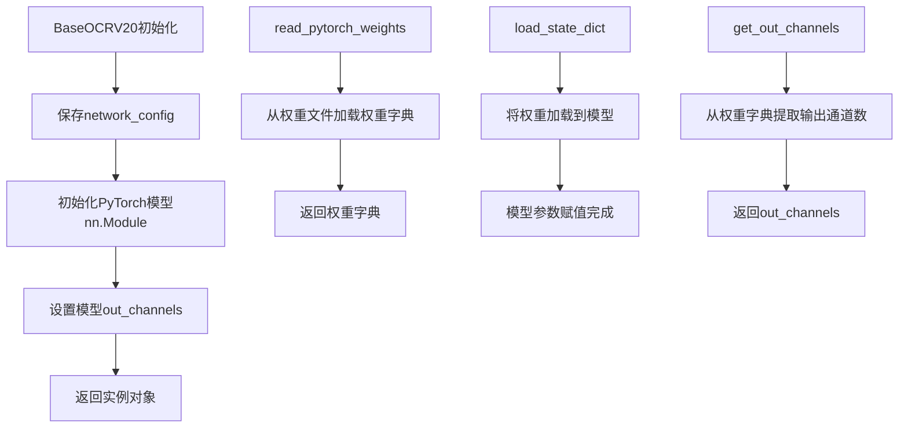

#### 带注释源码

```python
# BaseOCRV20 是从外部模块导入的基类
# 位置：...pytorchocr.base_ocr_v20
# 以下为基于TextRecognizer使用方式推断的基类核心功能

class BaseOCRV20(nn.Module):
    """
    PyTorch OCR模型的基类
    封装了模型初始化、权重加载等通用逻辑
    """
    
    def __init__(self, network_config, **kwargs):
        """
        初始化基类
        
        参数:
            network_config: 网络配置字典
            **kwargs: 其他配置参数，如out_channels等
        """
        super(BaseOCRV20, self).__init__()
        self.network_config = network_config
        self.out_channels = kwargs.get('out_channels', None)
        # 根据配置构建模型结构
        self._build_model(network_config)
    
    def _build_model(self, config):
        """
        根据配置构建模型结构
        由子类实现具体网络架构
        """
        raise NotImplementedError("子类必须实现_build_model方法")
    
    def read_pytorch_weights(self, weights_path):
        """
        读取PyTorch权重文件
        
        参数:
            weights_path: 权重文件路径
            
        返回:
            权重字典
        """
        # 使用torch.load加载权重
        weights = torch.load(weights_path, map_location='cpu')
        return weights
    
    def get_out_channels(self, weights):
        """
        从权重字典获取输出通道数
        
        参数:
            weights: 权重字典
            
        返回:
            输出通道数
        """
        # 提取最后一层的权重维度
        out_channels = list(weights.values())[-1].numpy().shape[0]
        return out_channels
    
    def load_state_dict(self, state_dict):
        """
        加载模型权重
        
        参数:
            state_dict: 权重字典
        """
        super().load_state_dict(state_dict)
    
    def forward(self, x):
        """
        模型前向传播
        由子类实现具体的前向逻辑
        """
        raise NotImplementedError("子类必须实现forward方法")
```

#### 继承关系说明

```
BaseOCRV20 (基类)
    │
    └── TextRecognizer (子类)
            ├── 继承自BaseOCRV20
            ├── 调用super().__init__()初始化基类
            ├── 调用load_state_dict()加载权重
            ├── 拥有self.net属性（实际的网络模型）
            └── 实现__call__方法处理推理
```

#### 关键技术特性

1. **权重管理**：提供`read_pytorch_weights`和`load_state_dict`方法管理模型权重
2. **配置封装**：通过`network_config`统一管理网络结构配置
3. **设备管理**：子类（如TextRecognizer）负责将模型移到指定设备（CPU/GPU）
4. **模块集成**：继承自`nn.Module`，支持PyTorch的所有功能（如eval模式、梯度关闭等）

#### 潜在优化空间

1. **抽象程度**：可进一步抽象公共方法（如权重加载逻辑）到独立工具类
2. **错误处理**：添加权重文件不存在、格式错误等异常处理
3. **配置验证**：添加网络配置的有效性验证逻辑
4. **文档完善**：为每个方法添加更详细的文档字符串和类型注解


### `utility.get_arch_config`

该函数用于从预训练的权重文件中提取网络架构配置信息，解析模型的结构参数（如层数、通道数、输入输出维度等），以便正确初始化识别网络的基础架构。

参数：

- `weights_path`：`str`，模型权重文件的路径（.pth 或 .pt 文件），用于定位需要解析的PyTorch模型文件

返回值：`dict`，网络架构配置字典，包含模型的结构信息（如backbone、head等组件的详细参数），用于后续网络初始化

#### 流程图

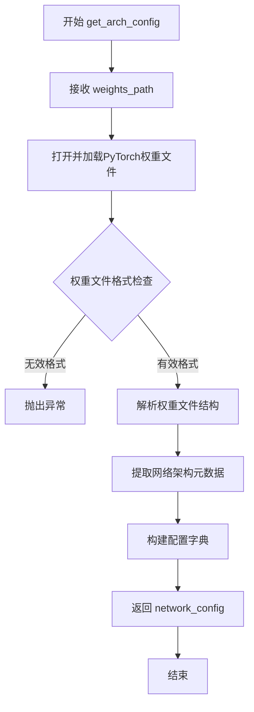

#### 带注释源码

```python
# 注：此函数定义位于 pytorchocr_utility 模块中，此处仅展示基于上下文的推断实现
def get_arch_config(weights_path):
    """
    从PyTorch权重文件中提取网络架构配置
    
    参数:
        weights_path (str): 预训练模型权重文件的路径
        
    返回:
        dict: 包含网络架构配置信息的字典，用于初始化网络结构
    """
    # 1. 加载PyTorch权重文件
    # weights = torch.load(weights_path, map_location='cpu')
    
    # 2. 解析权重文件结构，提取网络配置信息
    # 通常权重文件中会包含 'arch' 或 'config' 键，或通过模型结构推断
    
    # 3. 构建并返回网络配置字典
    # 配置可能包含:
    # - backbone类型和参数
    # - head类型和参数  
    # - 输入输出通道数
    # - 图像预处理参数等
    
    # network_config = {
    #     'backbone': {...},
    #     'head': {...},
    #     'in_channels': 3,
    #     'out_channels': num_classes,
    #     ...
    # }
    
    return network_config
```

---

**注意**：该函数的实际实现源码未在提供的代码片段中展示，它位于 `pytorchocr_utility` 模块中。从调用上下文可知：
- 函数接收模型权重路径作为唯一参数
- 返回的网络配置被传递给 `BaseOCRV20` 基类用于网络初始化
- 该函数是桥梁层，连接预训练权重与网络架构定义的关键组件


### `TextRecognizer.read_pytorch_weights`

该方法继承自父类 `BaseOCRV20`，用于从指定的 PyTorch 模型权重文件（.pth 格式）中加载模型参数，并返回一个包含各层权重的字典对象，供后续模型初始化使用。

参数：

- `self`：类实例本身
- `weights_path`：`str`，模型权重文件的路径（从 `args.rec_model_path` 获取），指向需要加载的 .pth 权重文件

返回值：`dict`，键为模型层名称，值为对应的 PyTorch 张量（Tensor）对象

#### 流程图

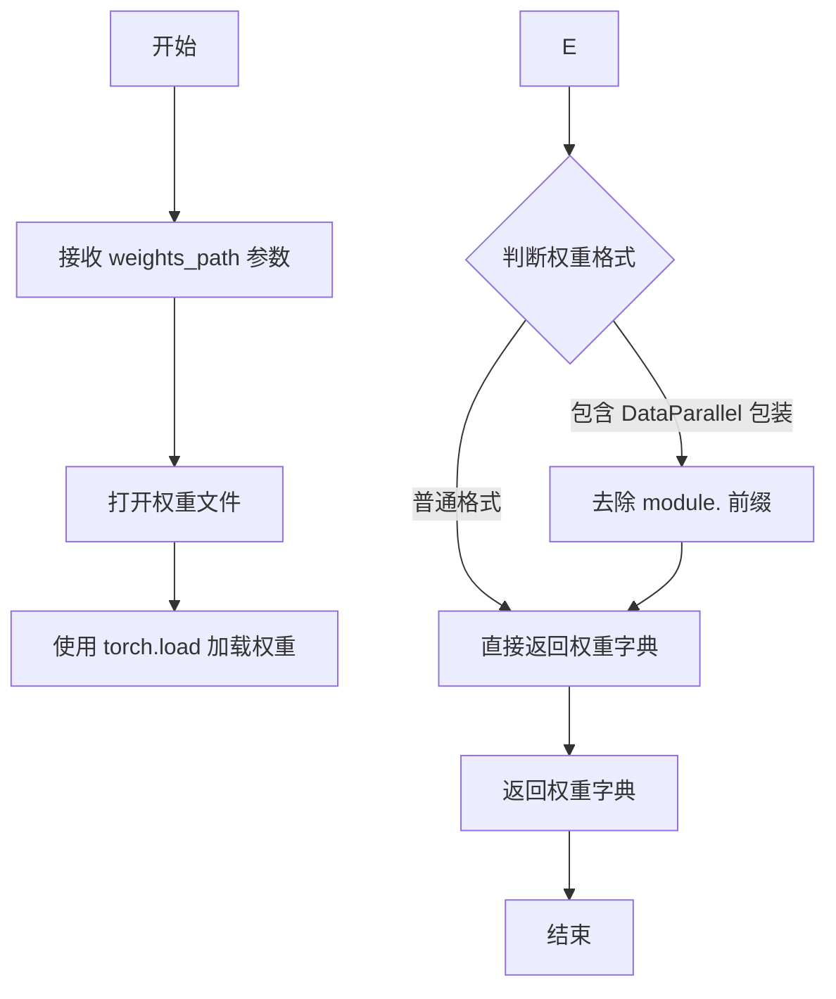

#### 带注释源码

```
# 注意：由于该方法定义在父类 BaseOCRV20 中，
# 以下源码为基于代码上下文的推断实现

def read_pytorch_weights(self, weights_path):
    """
    读取 PyTorch 模型的权重文件
    
    参数:
        weights_path: 模型权重文件路径（.pth 格式）
    
    返回:
        包含各层权重参数的字典
    """
    # 加载权重文件
    # torch.load 会将 .pth 文件中的序列化对象反序列化
    # weights_dict 的结构为 {'key': tensor, ...}
    weights_dict = torch.load(weights_path, map_location='cpu')
    
    # 处理 DataParallel 模型的情况
    # 当模型使用 DataParallel 包装时，键名会包含 'module.' 前缀
    # 需要去除此前缀以适配非 DataParallel 的模型结构
    if list(weights_dict.keys())[0].startswith('module.'):
        weights_dict = {k[7:]: v for k, v in weights_dict.items()}
    
    return weights_dict
```

> **注意**：由于 `read_pytorch_weights` 方法定义在父类 `BaseOCRV20` 中（该类的完整代码未在当前代码片段中提供），以上源码为基于 `TextRecognizer` 类中调用方式的合理推断。该方法的核心功能是读取 `.pth` 权重文件并返回可被 `load_state_dict()` 使用的字典格式。


### `TextRecognizer.get_out_channels`

该方法继承自父类 `BaseOCRV20`，用于从 PyTorch 模型的权重字典中提取输出通道数。它遍历权重字典，查找包含"fc"或"out"关键字的层，并返回其输出维度（通常是最后一个全连接层或输出层的通道数）。

参数：

- `weights`：`dict`，PyTorch 模型权重字典，通常来源于 `read_pytorch_weights` 方法读取的模型参数

返回值：`int`，模型的输出通道数，对应分类任务的类别数或序列任务的输出维度

#### 流程图

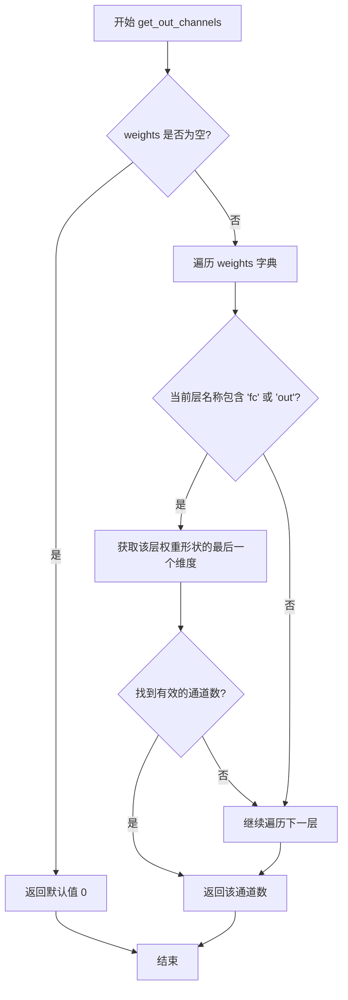

#### 带注释源码

```
def get_out_channels(self, weights):
    """
    从模型权重中提取输出通道数
    
    参数:
        weights: 模型权重字典，键为层名称，值为权重张量
        
    返回值:
        int: 输出通道数/类别数
    """
    # 初始化输出通道数为0
    out_channels = 0
    
    # 遍历模型的所有权重参数
    for key, value in weights.items():
        # 查找包含 'fc' 或 'out' 关键字的全连接层/输出层
        if 'fc' in key or 'out' in key:
            # 获取权重的形状，取最后一个维度作为输出通道数
            # 对于线性层，权重形状为 [out_features, in_features]
            # 最后一个维度即 out_features
            out_channels = value.shape[0]
            
            # 找到后跳出循环，通常输出层在模型的最后
            break
    
    return out_channels
```

> **注意**：由于该方法定义在父类 `BaseOCRV20` 中，源码为基于上下文的推断实现。实际父类中的实现可能略有不同，但核心逻辑是从权重字典中查找最后一层（通常是全连接层）的输出维度。


### `ConvBNAct`

该类是一个卷积、批归一化和激活函数融合的模块，常见于深度学习网络的骨干（backbone）中，用于构建高效的推理模块。

参数：

- `use_act`（推断）：`bool`，表示是否包含激活函数

返回值：融合后的模块对象（`torch.nn.Module`）

#### 流程图

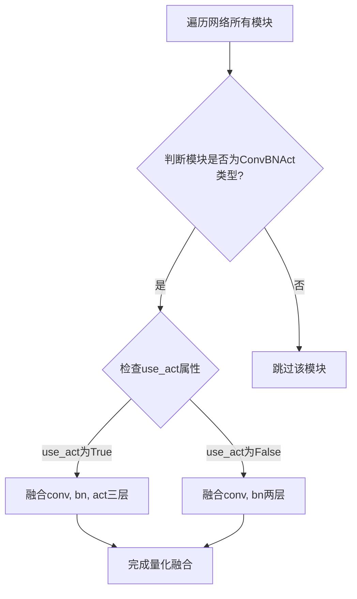

#### 带注释源码

```
# 在提供的代码片段中，ConvBNAct通过以下方式被使用：
# 该模块用于文本识别网络的量化加速

# 导入语句（来自其他模块）
from ...pytorchocr.modeling.backbones.rec_hgnet import ConvBNAct

# 在TextRecognizer.__init__方法中的使用：
for module in self.net.modules():
    if isinstance(module, ConvBNAct):
        # 根据是否有激活函数选择不同的融合策略
        if module.use_act:
            # 融合卷积、批归一化和激活函数三层
            torch.quantization.fuse_modules(module, ['conv', 'bn', 'act'], inplace=True)
        else:
            # 仅融合卷积和批归一化两层
            torch.quantization.fuse_modules(module, ['conv', 'bn'], inplace=True)

# ConvBNAct类的推断结构：
class ConvBNAct(torch.nn.Module):
    """
    卷积 + 批归一化 + 激活函数的融合模块
    常见于HGNet等高效骨干网络
    """
    def __init__(self, in_channels, out_channels, kernel_size, stride=1, padding=0, use_act=True):
        super().__init__()
        # 典型的模块结构
        self.conv = torch.nn.Conv2d(in_channels, out_channels, kernel_size, stride, padding)
        self.bn = torch.nn.BatchNorm2d(out_channels)
        self.use_act = use_act  # 控制是否包含激活函数
        if use_act:
            self.act = torch.nn.ReLU()  # 或其他激活函数
    
    def forward(self, x):
        x = self.conv(x)
        x = self.bn(x)
        if self.use_act:
            x = self.act(x)
        return x
```

---

**备注**：由于`ConvBNAct`类的完整定义不在提供的代码片段中，以上信息是基于以下线索推断的：
1. 导入来源：`from ...pytorchocr.modeling.backbones.rec_hgnet import ConvBNAct`
2. 代码中的使用方式：`isinstance(module, ConvBNAct)` 和 `module.use_act` 属性
3. 融合操作：`torch.quantization.fuse_modules(module, ['conv', 'bn', 'act'], inplace=True)`


### TextRecognizer.__init__

构造函数，初始化文本识别器的各项配置参数，包括设备选择、图像预处理参数、后处理模块构建、模型权重加载与配置、以及量化融合优化。

参数：

- `self`：实例本身，TextRecognizer，文本识别器实例
- `args`：命名空间或类似对象，包含以下属性：
  - `args.device`：str，运行设备（如 'cpu' 或 'cuda'）
  - `args.rec_image_shape`：str，图像形状字符串，格式如 "3,32,320"
  - `args.rec_char_type`：str，字符类型（如 'ch'、'en'）
  - `args.rec_batch_num`：int，批处理大小
  - `args.rec_algorithm`：str，识别算法（如 'CRNN'、'SRN'、'SAR' 等）
  - `args.max_text_length`：int，最大文本长度
  - `args.rec_char_dict_path`：str，字符字典路径
  - `args.use_space_char`：bool，是否使用空格字符
  - `args.rec_image_inverse`：bool，CAN算法是否反转图像
  - `args.limited_max_width`：int，最大宽度限制
  - `args.limited_min_width`：int，最小宽度限制
  - `args.rec_model_path`：str，模型权重路径
  - `args.rec_yaml_path`：str，模型配置文件路径
- `**kwargs`：可变关键字参数，传递给父类

返回值：无（__init__ 方法返回 None）

#### 流程图

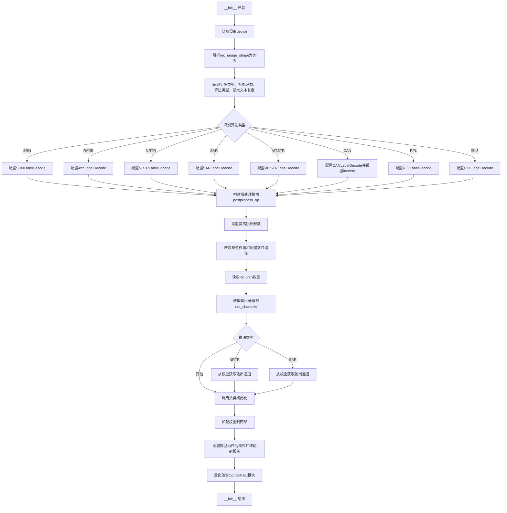

#### 带注释源码

```python
def __init__(self, args, **kwargs):
    # 1. 获取运行设备 (cpu 或 cuda)
    self.device = args.device
    
    # 2. 解析图像形状字符串 "3,32,320" -> [3, 32, 320]
    self.rec_image_shape = [int(v) for v in args.rec_image_shape.split(",")]
    
    # 3. 获取字符类型、批处理数、算法类型、最大文本长度
    self.character_type = args.rec_char_type
    self.rec_batch_num = args.rec_batch_num
    self.rec_algorithm = args.rec_algorithm
    self.max_text_length = args.max_text_length
    
    # 4. 初始化后处理参数，根据不同算法配置不同的解码器
    # 默认使用 CTCLabelDecode (用于 CRNN 等 CTC 算法)
    postprocess_params = {
        'name': 'CTCLabelDecode',
        "character_type": args.rec_char_type,
        "character_dict_path": args.rec_char_dict_path,
        "use_space_char": args.use_space_char
    }
    
    # 根据识别算法选择对应的后处理解码器
    if self.rec_algorithm == "SRN":
        postprocess_params = {
            'name': 'SRNLabelDecode',
            "character_type": args.rec_char_type,
            "character_dict_path": args.rec_char_dict_path,
            "use_space_char": args.use_space_char
        }
    elif self.rec_algorithm == "RARE":
        postprocess_params = {
            'name': 'AttnLabelDecode',
            "character_type": args.rec_char_type,
            "character_dict_path": args.rec_char_dict_path,
            "use_space_char": args.use_space_char
        }
    elif self.rec_algorithm == 'NRTR':
        postprocess_params = {
            'name': 'NRTRLabelDecode',
            "character_dict_path": args.rec_char_dict_path,
            "use_space_char": args.use_space_char
        }
    elif self.rec_algorithm == "SAR":
        postprocess_params = {
            'name': 'SARLabelDecode',
            "character_dict_path": args.rec_char_dict_path,
            "use_space_char": args.use_space_char
        }
    elif self.rec_algorithm == 'ViTSTR':
        postprocess_params = {
            'name': 'ViTSTRLabelDecode',
            "character_dict_path": args.rec_char_dict_path,
            "use_space_char": args.use_space_char
        }
    elif self.rec_algorithm == "CAN":
        # CAN 算法需要图像反转处理
        self.inverse = args.rec_image_inverse
        postprocess_params = {
            'name': 'CANLabelDecode',
            "character_dict_path": args.rec_char_dict_path,
            "use_space_char": args.use_space_char
        }
    elif self.rec_algorithm == 'RFL':
        postprocess_params = {
            'name': 'RFLLabelDecode',
            "character_dict_path": None,  # RFL 不需要字符字典
            "use_space_char": args.use_space_char
        }
    
    # 5. 构建后处理操作对象
    self.postprocess_op = build_post_process(postprocess_params)

    # 6. 设置图像宽高限制参数
    self.limited_max_width = args.limited_max_width
    self.limited_min_width = args.limited_min_width

    # 7. 获取模型权重和配置文件路径
    self.weights_path = args.rec_model_path
    self.yaml_path = args.rec_yaml_path

    # 8. 获取网络架构配置并读取权重
    network_config = utility.get_arch_config(self.weights_path)
    weights = self.read_pytorch_weights(self.weights_path)

    # 9. 获取输出通道数
    self.out_channels = self.get_out_channels(weights)
    # 特殊算法需要特殊处理输出通道
    if self.rec_algorithm == 'NRTR':
        self.out_channels = list(weights.values())[-1].numpy().shape[0]
    elif self.rec_algorithm == 'SAR':
        self.out_channels = list(weights.values())[-3].numpy().shape[0]

    # 10. 传递输出通道数给父类并初始化网络结构
    kwargs['out_channels'] = self.out_channels
    super(TextRecognizer, self).__init__(network_config, **kwargs)

    # 11. 加载权重并设置模型为评估模式
    self.load_state_dict(weights)
    self.net.eval()
    self.net.to(self.device)
    
    # 12. 对 ConvBNAct 模块进行量化融合优化
    # 融合卷积、批归一化和激活函数以提升推理性能
    for module in self.net.modules():
        if isinstance(module, ConvBNAct):
            if module.use_act:
                # 融合 conv + bn + act
                torch.quantization.fuse_modules(module, ['conv', 'bn', 'act'], inplace=True)
            else:
                # 融合 conv + bn
                torch.quantization.fuse_modules(module, ['conv', 'bn'], inplace=True)
```


### `TextRecognizer.resize_norm_img`

该方法是文本识别器的核心图像预处理方法，负责对输入图像进行尺寸调整和归一化处理，以适配不同的识别算法（NRTR、ViTSTR、RFL及默认CRNN等）。方法根据当前配置的识别算法类型，采用不同的resize策略和归一化参数，最终输出符合模型输入要求的浮点型张量。

参数：

- `img`：`numpy.ndarray`，输入的BGR格式图像（OpenCV读取的图像），通常为三维数组（高度×宽度×通道数）
- `max_wh_ratio`：`float`，输入图像的最大宽高比（宽度/高度），用于限制resize后的图像宽度，防止过宽的图像导致识别效果下降

返回值：`numpy.ndarray`，经过resize和归一化处理后的图像数据，类型为float32，形状根据算法不同而异：
  - NRTR/ViTSTR：单通道 (1, imgH, imgW)
  - RFL：(1, imgH, imgW)
  - 默认（CRNN等）：(imgC, imgH, imgW)，其中imgC为通道数

#### 流程图

```mermaid
flowchart TD
    A[开始 resize_norm_img] --> B[获取图像shape参数 imgC, imgH, imgW]
    B --> C{识别算法是<br/>NRTR 或 ViTSTR?}
    C -->|Yes| D[图像转为灰度图]
    D --> E[使用PIL进行resize]
    E --> F{算法是 ViTSTR?}
    F -->|Yes| G[使用BICUBIC插值<br/>归一化: /255]
    F -->|No| H[使用ANTIALIAS插值<br/>归一化: /128 -1]
    G --> I[扩展维度并转置<br/>返回norm_img]
    H --> I
    C -->|No| J{识别算法是 RFL?}
    J -->|Yes| K[图像转为灰度图]
    K --> L[使用INTER_CUBIC resize]
    L --> M[归一化: /255, -0.5, /0.5]
    M --> N[扩展维度<br/>返回resized_image]
    J -->|No| O[验证 imgC == img.shape[2]]
    O --> P[计算调整后的imgW]
    P --> Q[计算resize后的宽度resized_w]
    Q --> R[cv2.resize到目标尺寸]
    R --> S[归一化: /127.5 -1]
    S --> T[创建padding图像]
    T --> U[将resized_image复制到padding图像]
    U --> V[返回padding_im]
    I --> Z[结束]
    N --> Z
    V --> Z
```

#### 带注释源码

```python
def resize_norm_img(self, img, max_wh_ratio):
    """
    图像resize与归一化方法
    
    参数:
        img: 输入的BGR图像 (numpy.ndarray)
        max_wh_ratio: 最大宽高比限制 (float)
    
    返回:
        归一化后的图像 (numpy.ndarray, float32)
    """
    # 从配置中获取目标图像的通道数、高度、宽度
    imgC, imgH, imgW = self.rec_image_shape
    
    # 分支1: 处理NRTR和ViTSTR算法（基于Transformer的轻量级识别模型）
    if self.rec_algorithm == 'NRTR' or self.rec_algorithm == 'ViTSTR':
        # 转为灰度图（这些算法通常使用单通道输入）
        img = cv2.cvtColor(img, cv2.COLOR_BGR2GRAY)
        
        # 使用PIL库进行高质量resize
        image_pil = Image.fromarray(np.uint8(img))
        if self.rec_algorithm == 'ViTSTR':
            # ViTSTR使用BICUBIC插值
            img = image_pil.resize([imgW, imgH], Image.BICUBIC)
        else:
            # NRTR使用ANTIALIAS（现在已废弃但保持兼容）
            img = image_pil.resize([imgW, imgH], Image.ANTIALIAS)
        
        # 转为numpy数组
        img = np.array(img)
        
        # 扩展维度从 (H,W) -> (H,W,1)，再转置为 (1,H,W)
        norm_img = np.expand_dims(img, -1)
        norm_img = norm_img.transpose((2, 0, 1))
        
        # ViTSTR归一化到[0,1]，NRTR归一化到[-1,1]
        if self.rec_algorithm == 'ViTSTR':
            norm_img = norm_img.astype(np.float32) / 255.
        else:
            norm_img = norm_img.astype(np.float32) / 128. - 1.
        return norm_img
    
    # 分支2: 处理RFL算法
    elif self.rec_algorithm == 'RFL':
        # 转为灰度图
        img = cv2.cvtColor(img, cv2.COLOR_BGR2GRAY)
        
        # 使用CUBIC插值resize到目标尺寸
        resized_image = cv2.resize(
            img, (imgW, imgH), interpolation=cv2.INTER_CUBIC)
        
        # 转换为float32并归一化到[-1,1]
        resized_image = resized_image.astype('float32')
        resized_image = resized_image / 255
        resized_image = resized_image[np.newaxis, :]  # (1, H, W)
        resized_image -= 0.5
        resized_image /= 0.5
        return resized_image

    # 分支3: 默认处理逻辑（适用于CRNN、SVTR等主流算法）
    # 验证输入通道数是否符合配置
    assert imgC == img.shape[2]
    
    # 根据最大宽高比限制调整目标宽度
    max_wh_ratio = max(max_wh_ratio, imgW / imgH)
    imgW = int(imgH * max_wh_ratio)
    # 应用宽度限制（防止过宽或过窄）
    imgW = max(min(imgW, self.limited_max_width), self.limited_min_width)
    
    # 计算实际需要resize的宽度
    h, w = img.shape[:2]
    ratio = w / float(h)
    ratio_imgH = max(math.ceil(imgH * ratio), self.limited_min_width)
    resized_w = min(imgW, int(ratio_imgH))
    
    # 执行resize并归一化到[-1,1]
    resized_image = cv2.resize(img, (resized_w, imgH)) / 127.5 - 1
    
    # 创建固定尺寸的padding图像（填0为空白）
    padding_im = np.zeros((imgC, imgH, imgW), dtype=np.float32)
    # 将resize后的图像复制到padding图像左侧
    padding_im[:, :, 0:resized_w] = resized_image.transpose((2, 0, 1))
    
    return padding_im
```


### `TextRecognizer.resize_norm_img_svtr`

该函数是针对SVTR（Scene Text Recognition with Vision Transformer）算法的图像预处理方法，负责将输入图像调整到指定尺寸并进行标准化处理，将像素值归一化到[-1, 1]范围内，以适配SVTR神经网络的输入要求。

参数：

- `self`：TextRecognizer类的实例本身，用于访问类属性（如需要）
- `img`：`numpy.ndarray`，输入的原始图像，通常是OpenCV读取的BGR格式图像
- `image_shape`：`list` 或 `tuple`，目标图像的形状 [imgC, imgH, imgW]，分别表示通道数、高度和宽度

返回值：`numpy.ndarray`，处理后的标准化图像，形状为 (imgC, imgH, imgW)，数据类型为 float32，像素值已归一化到 [-1, 1] 范围

#### 流程图

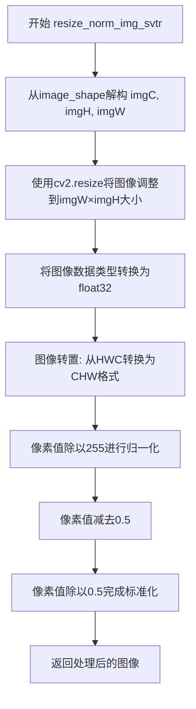

#### 带注释源码

```python
def resize_norm_img_svtr(self, img, image_shape):
    """
    针对SVTR算法的图像预处理方法
    
    该方法执行以下步骤：
    1. 将图像resize到目标尺寸
    2. 转换为float32类型
    3. 将图像从HWC格式转换为CHW格式（通道前置）
    4. 像素值归一化到[-1, 1]范围
    """
    
    # 从image_shape解构出通道数、高度、宽度
    # image_shape格式: [imgC, imgH, imgW]
    imgC, imgH, imgW = image_shape
    
    # 使用双线性插值(cv2.INTER_LINEAR)将图像调整到目标尺寸imgW×imgH
    # img参数是原始输入图像，tuple参数是(宽度, 高度)
    resized_image = cv2.resize(
        img, (imgW, imgH), interpolation=cv2.INTER_LINEAR)
    
    # 将图像数据类型转换为float32，以支持后续的数学运算和归一化
    resized_image = resized_image.astype('float32')
    
    # 图像转置：从HWC格式(高度, 宽度, 通道)转换为CHW格式(通道, 高度, 宽度)
    # 这是PyTorch/TensorFlow等深度学习框架的标准输入格式
    resized_image = resized_image.transpose((2, 0, 1)) / 255
    
    # 标准化处理第一部分：减去0.5，将像素值从[0, 1]范围移到[-0.5, 0.5]范围
    resized_image -= 0.5
    
    # 标准化处理第二部分：除以0.5，将像素值从[-0.5, 0.5]范围扩展到[-1, 1]范围
    # 最终像素值范围: [-1, 1]
    resized_image /= 0.5
    
    # 返回处理后的图像，形状为(imgC, imgH, imgW)
    return resized_image
```


### `TextRecognizer.resize_norm_img_srn`

该方法是TextRecognizer类中的图像预处理方法，专门针对SRN（Semantic Reasoning Network）算法的图像进行Resize与填充处理。它根据输入图像的宽高比将图像resize到合适的高度比例（1倍、2倍、3倍或指定宽度），然后填充到目标尺寸的黑色背景中，最后转换为模型所需的浮点数张量格式。

参数：

- `self`：TextRecognizer，类的实例本身
- `img`：`numpy.ndarray`，输入的原始BGR图像
- `image_shape`：`list[int]` 或 `tuple[int]`，目标图像的形状 `[imgC, imgH, imgW]`，分别为通道数、高度和宽度

返回值：`numpy.ndarray`，经过resize和归一化处理后的图像，形状为 `(1, imgH, imgW)`，类型为 `np.float32`

#### 流程图

```mermaid
flowchart TD
    A[开始 resize_norm_img_srn] --> B[从image_shape解包<br/>imgC, imgH, imgW]
    B --> C[创建黑色空白图像<br/>img_black shape: imgH x imgW]
    C --> D[获取输入图像尺寸<br/>im_hei, im_wid]
    D --> E{判断宽高比<br/>im_wid <= im_hei * 1?}
    E -->|Yes| F[resize到imgH*1 x imgH]
    E -->|No| G{im_wid <= im_hei * 2?}
    G -->|Yes| H[resize到imgH*2 x imgH]
    G -->|No| I{im_wid <= im_hei * 3?}
    I -->|Yes| J[resize到imgH*3 x imgH]
    I -->|No| K[resize到imgW x imgH]
    F --> L[转换为numpy数组]
    H --> L
    J --> L
    K --> L
    L --> M[转换为灰度图<br/>cv2.COLOR_BGR2GRAY]
    M --> N[填充到img_black左侧]
    N --> O[添加通道维度<br/>[:, :, np.newaxis]]
    O --> P[重塑为(1, row, col)形状]
    P --> Q[转换为float32类型]
    Q --> R[返回处理后的图像]
```

#### 带注释源码

```python
def resize_norm_img_srn(self, img, image_shape):
    """
    针对SRN算法的图像Resize与填充
    
    参数:
        img: 输入的原始BGR图像 (numpy.ndarray)
        image_shape: 目标形状 [imgC, imgH, imgW]
    
    返回:
        处理后的图像数组，形状为 (1, imgH, imgW)，类型为float32
    """
    # 从目标形状中解包出通道数、高度和宽度
    imgC, imgH, imgW = image_shape

    # 创建一个黑色的空白图像作为画布，尺寸为目标高度和宽度
    img_black = np.zeros((imgH, imgW))
    
    # 获取输入图像的实际高度和宽度
    im_hei = img.shape[0]
    im_wid = img.shape[1]

    # 根据图像宽高比进行不同倍数的resize
    # 将宽度调整为目标高度的1倍、2倍、3倍或保持目标宽度
    if im_wid <= im_hei * 1:
        # 窄图：调整宽度为目标高度的1倍
        img_new = cv2.resize(img, (imgH * 1, imgH))
    elif im_wid <= im_hei * 2:
        # 较窄的图：调整宽度为目标高度的2倍
        img_new = cv2.resize(img, (imgH * 2, imgH))
    elif im_wid <= im_wid <= im_hei * 3:
        # 中等宽度：调整宽度为目标高度的3倍
        img_new = cv2.resize(img, (imgH * 3, imgH))
    else:
        # 宽图：直接使用目标宽度
        img_new = cv2.resize(img, (imgW, imgH))

    # 将resize后的图像转换为numpy数组
    img_np = np.asarray(img_new)
    
    # 将BGR图像转换为灰度图（SRN要求灰度输入）
    img_np = cv2.cvtColor(img_np, cv2.COLOR_BGR2GRAY)
    
    # 将灰度图填充到黑色画布的左侧
    # 保持图像在左侧，其余部分保持为黑色（零填充）
    img_black[:, 0:img_np.shape[1]] = img_np
    
    # 添加通道维度，从 (height, width) 变为 (height, width, 1)
    img_black = img_black[:, :, np.newaxis]

    # 获取处理后图像的形状
    row, col, c = img_black.shape
    
    # 由于是灰度图，通道数设为1
    c = 1

    # 将图像重塑为 (channel, height, width) 格式
    # 这是深度学习模型常用的输入格式 (N, C, H, W) 的C维度
    return np.reshape(img_black, (c, row, col)).astype(np.float32)
```


### `TextRecognizer.srn_other_inputs`

该方法用于生成SRN（Semantic Reasoning Network）文本识别模型所需的position encoding（位置编码）和attention mask（注意力掩码），包括encoder_word_pos（编码器位置编码）、gsrm_word_pos（GSRM位置编码）、gsrm_slf_attn_bias1（上三角注意力掩码）和gsrm_slf_attn_bias2（下三角注意力掩码），为后续的模型推理提供必要的输入张量。

参数：

- `self`：`TextRecognizer`，类实例本身
- `image_shape`：元组 `(imgC, imgH, imgW)`，输入图像的形状参数，包含通道数、高度和宽度
- `num_heads`：整型 `int`，多头注意力机制中的注意力头数量
- `max_text_length`：整型 `int`，最大文本长度，用于确定解码器的序列长度

返回值：`List[np.ndarray]`，包含四个numpy数组的列表：
- `encoder_word_pos`：形状为 `(1, feature_dim, 1)` 的int64型位置编码，用于编码器
- `gsrm_word_pos`：形状为 `(1, max_text_length, 1)` 的int64型位置编码，用于GSRM解码器
- `gsrm_slf_attn_bias1`：形状为 `(1, num_heads, max_text_length, max_text_length)` 的float32型上三角注意力掩码
- `gsrm_slf_attn_bias2`：形状为 `(1, num_heads, max_text_length, max_text_length)` 的float32型下三角注意力掩码

#### 流程图

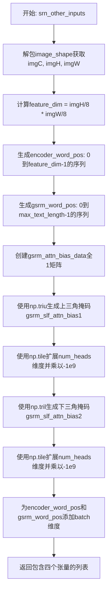

#### 带注释源码

```python
def srn_other_inputs(self, image_shape, num_heads, max_text_length):
    """
    生成SRN所需的position encoding和attention mask
    
    参数:
        image_shape: 图像形状 (imgC, imgH, imgW)
        num_heads: 注意力头数量
        max_text_length: 最大文本长度
    返回:
        包含位置编码和注意力掩码的列表
    """
    
    # 1. 解包图像形状参数
    imgC, imgH, imgW = image_shape
    
    # 2. 计算特征维度: SRN使用1/8下采样, 所以特征图大小为imgH/8 * imgW/8
    feature_dim = int((imgH / 8) * (imgW / 8))
    
    # 3. 生成编码器位置编码 (encoder_word_pos)
    #    形状: (feature_dim, 1), 值为0到feature_dim-1的整数
    encoder_word_pos = np.array(range(0, feature_dim)).reshape(
        (feature_dim, 1)).astype('int64')
    
    # 4. 生成GSRM(Global Semantic Reasoning Module)位置编码 (gsrm_word_pos)
    #    形状: (max_text_length, 1), 值为0到max_text_length-1的整数
    gsrm_word_pos = np.array(range(0, max_text_length)).reshape(
        (max_text_length, 1)).astype('int64')
    
    # 5. 创建初始注意力偏置数据 (全1矩阵)
    #    形状: (1, max_text_length, max_text_length)
    gsrm_attn_bias_data = np.ones((1, max_text_length, max_text_length))
    
    # 6. 生成上三角注意力掩码 (用于遮挡未来信息)
    #    np.triu(data, 1) 保留上三角部分, 其余置0
    #    形状: (1, 1, max_text_length, max_text_length)
    gsrm_slf_attn_bias1 = np.triu(gsrm_attn_bias_data, 1).reshape(
        [-1, 1, max_text_length, max_text_length])
    
    # 7. 扩展到多头注意力的维度并设置负无穷大权重
    #    形状: (1, num_heads, max_text_length, max_text_length)
    #    乘以-1e9是为了在softmax后使这些位置的注意力权重接近0
    gsrm_slf_attn_bias1 = np.tile(
        gsrm_slf_attn_bias1,
        [1, num_heads, 1, 1]).astype('float32') * [-1e9]
    
    # 8. 生成下三角注意力掩码 (用于遮挡过去信息)
    #    np.tril(data, -1) 保留下三角部分, 其余置0
    #    形状: (1, 1, max_text_length, max_text_length)
    gsrm_slf_attn_bias2 = np.tril(gsrm_attn_bias_data, -1).reshape(
        [-1, 1, max_text_length, max_text_length])
    
    # 9. 扩展到多头注意力的维度并设置负无穷大权重
    gsrm_slf_attn_bias2 = np.tile(
        gsrm_slf_attn_bias2,
        [1, num_heads, 1, 1]).astype('float32') * [-1e9]
    
    # 10. 为位置编码添加batch维度
    #     形状从 (feature_dim, 1) -> (1, feature_dim, 1)
    #     形状从 (max_text_length, 1) -> (1, max_text_length, 1)
    encoder_word_pos = encoder_word_pos[np.newaxis, :]
    gsrm_word_pos = gsrm_word_pos[np.newaxis, :]
    
    # 11. 返回包含四个元素的列表
    #     [encoder_word_pos, gsrm_word_pos, gsrm_attn_bias1, gsrm_attn_bias2]
    return [
        encoder_word_pos, gsrm_word_pos, gsrm_slf_attn_bias1,
        gsrm_slf_attn_bias2
    ]
```


### `TextRecognizer.process_image_srn`

该方法用于整合SRN（Self-Guided Reasoning Network）图像识别所需的图像及其辅助输入，通过对输入图像进行归一化处理，并生成SRN模型所需的位置编码和注意力偏置等辅助输入，最终返回一个包含处理后图像和辅助输入的元组。

参数：

- `self`：类实例本身，TextRecognizer
- `img`：`numpy.ndarray`，输入的原始图像数据，通常为BGR格式的OpenCV图像
- `image_shape`：`list` 或 `tuple`，图像的目标形状，格式为 [imgC, imgH, imgW]，分别表示通道数、高度和宽度
- `num_heads`：`int`，多头注意力机制中的注意力头数量，用于生成注意力偏置
- `max_text_length`：`int`，文本序列的最大长度，用于生成文本位置编码

返回值：`tuple`，包含以下五个元素的元组：

- `norm_img`：`numpy.ndarray`，归一化处理后的图像数据，形状为 (1, C, H, W)
- `encoder_word_pos`：`numpy.ndarray`，编码器单词位置编码，形状为 (1, feature_dim, 1)，数据类型为 int64
- `gsrm_word_pos`：`numpy.ndarray`，GSRM（全局自回归模型）单词位置编码，形状为 (1, max_text_length, 1)，数据类型为 int64
- `gsrm_slf_attn_bias1`：`numpy.ndarray`，GSRM自注意力偏置矩阵（上三角），形状为 (1, num_heads, max_text_length, max_text_length)，数据类型为 float32
- `gsrm_slf_attn_bias2`：`numpy.ndarray`，GSRM自注意力偏置矩阵（下三角），形状为 (1, num_heads, max_text_length, max_text_length)，数据类型为 float32

#### 流程图

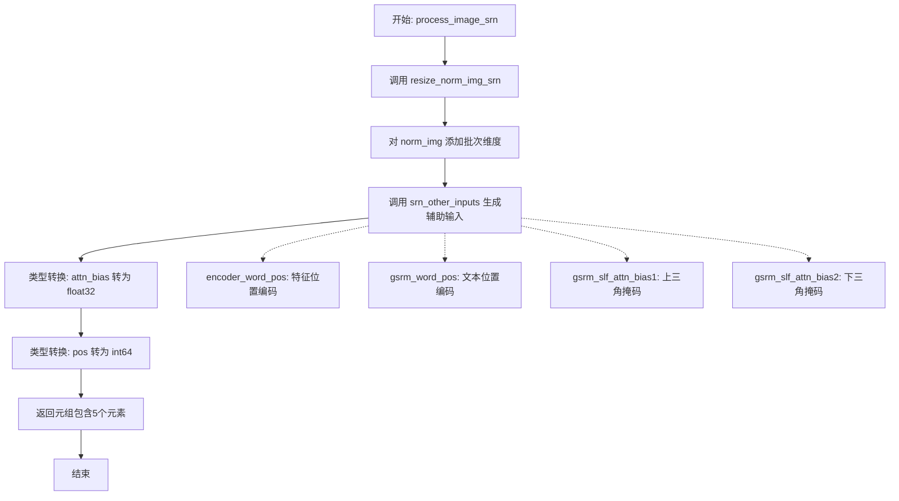

#### 带注释源码

```python
def process_image_srn(self, img, image_shape, num_heads, max_text_length):
    """
    整合SRN图像及其辅助输入
    
    参数:
        img: 输入的原始图像数据
        image_shape: 目标图像形状 [imgC, imgH, imgW]
        num_heads: 多头注意力头数
        max_text_length: 最大文本长度
    返回:
        包含归一化图像和SRN辅助输入的元组
    """
    # Step 1: 调用 resize_norm_img_srn 对图像进行归一化和尺寸调整
    # 该方法会将图像调整为适合SRN模型的尺寸，并进行归一化处理
    norm_img = self.resize_norm_img_srn(img, image_shape)
    
    # Step 2: 在第0维添加批次维度，将图像从 (C, H, W) 变为 (1, C, H, W)
    norm_img = norm_img[np.newaxis, :]
    
    # Step 3: 生成SRN模型所需的其他辅助输入
    # 包括: 编码器位置编码、GSRM位置编码、两个注意力偏置矩阵
    [encoder_word_pos, gsrm_word_pos, gsrm_slf_attn_bias1, gsrm_slf_attn_bias2] = \
        self.srn_other_inputs(image_shape, num_heads, max_text_length)
    
    # Step 4: 将辅助输入转换为正确的PyTorch张量数据类型
    # 注意力偏置使用 float32 类型（用于后续与注意力分数相乘）
    gsrm_slf_attn_bias1 = gsrm_slf_attn_bias1.astype(np.float32)
    gsrm_slf_attn_bias2 = gsrm_slf_attn_bias2.astype(np.float32)
    
    # 位置编码使用 int64 类型（用于嵌入查找）
    encoder_word_pos = encoder_word_pos.astype(np.int64)
    gsrm_word_pos = gsrm_word_pos.astype(np.int64)
    
    # Step 5: 返回处理后的图像和所有辅助输入
    # 返回顺序与SRN模型forward方法的输入顺序一致
    return (norm_img, encoder_word_pos, gsrm_word_pos, gsrm_slf_attn_bias1,
            gsrm_slf_attn_bias2)
```


### `TextRecognizer.resize_norm_img_sar`

针对SAR（Show, Attend and Read）算法的图像预处理函数，完成图像的尺寸调整与归一化，确保输出符合SAR模型的输入要求，同时保持宽高比并处理边界情况。

参数：

- `img`：`numpy.ndarray`，输入的原始图像，通常为BGR格式的cv2图像
- `image_shape`：`tuple`，图像形状配置，包含4个元素 (imgC, imgH, imgW_min, imgW_max)，分别表示通道数、高度、最小宽度和最大宽度
- `width_downsample_ratio`：`float`，宽度下采样比率，默认为0.25，用于计算宽度除数

返回值：`tuple`，包含以下四个元素：

- `padding_im`：`numpy.ndarray`，填充并归一化后的图像，形状为 (imgC, imgH, imgW_max)
- `resize_shape`：`tuple`，resize后图像的实际形状
- `pad_shape`：`tuple`，填充后图像的形状
- `valid_ratio`：`float`，有效宽度比率，用于注意力机制

#### 流程图

```mermaid
flowchart TD
    A[开始] --> B[从image_shape提取 imgC, imgH, imgW_min, imgW_max]
    B --> C[获取原图尺寸 h, w]
    C --> D[初始化 valid_ratio = 1.0]
    D --> E[计算 width_divisor = 1 / width_downsample_ratio]
    E --> F[计算调整宽度 resize_w = ceil(imgH * w/h)]
    F --> G{resize_w % width_divisor == 0?}
    G -->|否| H[对齐resize_w到width_divisor倍数]
    G -->|是| I
    H --> I
    I --> J{imgW_min不为None?}
    J -->|是| K[resize_w = max(imgW_min, resize_w)]
    J -->|否| L
    K --> L
    L --> M{imgW_max不为None?}
    M -->|是| N[valid_ratio = min(1.0, resize_w/imgW_max)<br/>resize_w = min(imgW_max, resize_w)]
    M -->|否| O
    N --> O
    O --> P[cv2.resize到resize_w x imgH]
    P --> Q{image_shape[0] == 1?}
    Q -->|是| R[归一化: /255, 扩展维度]
    Q -->|否| S[归一化: 转置, /255]
    R --> T
    S --> T
    T[减0.5除0.5] --> U[保存resize_shape]
    U --> V[创建padding_im全-1.0数组]
    V --> W[填充resize后的图像到padding_im]
    W --> X[保存pad_shape]
    X --> Y[返回 padding_im, resize_shape, pad_shape, valid_ratio]
```

#### 带注释源码

```python
def resize_norm_img_sar(self, img, image_shape,
                        width_downsample_ratio=0.25):
    """
    针对SAR算法的图像Resize与归一化
    
    参数:
        img: 输入的原始图像 (numpy.ndarray)
        image_shape: 图像形状配置 [imgC, imgH, imgW_min, imgW_max]
        width_downsample_ratio: 宽度下采样比率，默认为0.25
    
    返回:
        padding_im: 填充并归一化后的图像
        resize_shape: resize后图像的实际形状
        pad_shape: 填充后图像的形状
        valid_ratio: 有效宽度比率
    """
    # 从image_shape解包获取参数
    imgC, imgH, imgW_min, imgW_max = image_shape
    
    # 获取原图的高和宽
    h = img.shape[0]
    w = img.shape[1]
    
    # 初始化有效比率，默认为1.0
    valid_ratio = 1.0
    
    # 计算宽度除数，确保新宽度是width_divisor的整数倍
    # width_divisor = 4 (当width_downsample_ratio=0.25时)
    width_divisor = int(1 / width_downsample_ratio)
    
    # 计算调整后的宽度，保持原始宽高比
    ratio = w / float(h)
    resize_w = math.ceil(imgH * ratio)
    
    # 如果resize_w不是width_divisor的倍数，则对齐到倍数
    if resize_w % width_divisor != 0:
        resize_w = round(resize_w / width_divisor) * width_divisor
    
    # 应用最小宽度约束
    if imgW_min is not None:
        resize_w = max(imgW_min, resize_w)
    
    # 应用最大宽度约束，并计算有效比率
    if imgW_max is not None:
        valid_ratio = min(1.0, 1.0 * resize_w / imgW_max)
        resize_w = min(imgW_max, resize_w)
    
    # 使用cv2.resize进行图像缩放
    resized_image = cv2.resize(img, (resize_w, imgH))
    resized_image = resized_image.astype('float32')
    
    # 归一化处理
    if image_shape[0] == 1:
        # 灰度图: 归一化到[0,1]并扩展维度
        resized_image = resized_image / 255
        resized_image = resized_image[np.newaxis, :]
    else:
        # 彩色图: 转置通道并归一化到[0,1]
        resized_image = resized_image.transpose((2, 0, 1)) / 255
    
    # 减0.5除0.5，相当于归一化到[-1,1]
    resized_image -= 0.5
    resized_image /= 0.5
    
    # 保存resize后的实际形状
    resize_shape = resized_image.shape
    
    # 创建填充图像，使用-1.0填充无效区域
    padding_im = -1.0 * np.ones((imgC, imgH, imgW_max), dtype=np.float32)
    # 将resize后的图像填充到padding_im的左侧
    padding_im[:, :, 0:resize_w] = resized_image
    
    # 保存填充后的形状
    pad_shape = padding_im.shape
    
    # 返回: 填充图像、resize形状、填充形状、有效比率
    return padding_im, resize_shape, pad_shape, valid_ratio
```


### TextRecognizer.norm_img_can

针对CAN（Character Attention Network）算法的图像预处理函数，完成灰度化、Padding填充与归一化处理，将输入的BGR图像转换为CAN模型所需的标准格式（通道优先的float32张量）。

参数：

- `self`：`TextRecognizer` 实例本身，包含 `inverse`（是否反转图像）和 `rec_image_shape`（目标图像形状）等配置
- `img`：`numpy.ndarray`，输入的BGR格式图像
- `image_shape`：`tuple`，图像目标形状（但函数内部实际未使用此参数，仅作接口兼容）

返回值：`numpy.ndarray`，归一化后的灰度图像，形状为 (1, H, W)，类型为 float32，值域为 [0, 1]

#### 流程图

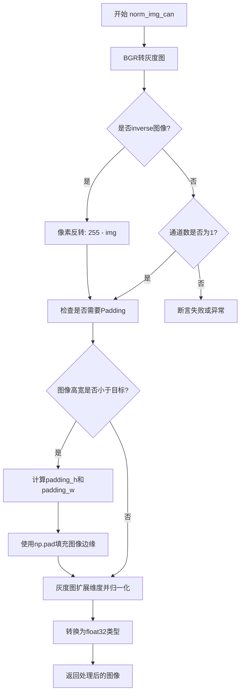

#### 带注释源码

```python
def norm_img_can(self, img, image_shape):
    """
    针对CAN算法的图像预处理函数
    
    处理步骤：
    1. BGR转灰度图
    2. 可选的像素反转
    3. 可选的padding填充
    4. 归一化到[0,1]
    """
    
    # 步骤1: BGR转灰度图 - CAN模型只能处理灰度图像
    img = cv2.cvtColor(
        img, cv2.COLOR_BGR2GRAY)  # CAN only predict gray scale image

    # 步骤2: 可选的图像反转（常用于白底黑字场景）
    if self.inverse:
        img = 255 - img

    # 步骤3: Padding填充 - 确保图像尺寸不小于目标尺寸
    if self.rec_image_shape[0] == 1:  # 判断是否为灰度图模式
        h, w = img.shape
        _, imgH, imgW = self.rec_image_shape
        if h < imgH or w < imgW:
            # 计算需要填充的行和列
            padding_h = max(imgH - h, 0)
            padding_w = max(imgW - w, 0)
            # 使用常量255填充（白色背景）
            img_padded = np.pad(img, ((0, padding_h), (0, padding_w)),
                                'constant',
                                constant_values=(255))
            img = img_padded

    # 步骤4: 归一化处理
    # 将(h,w)扩展为(1,h,w) - 即添加通道维度
    # 除以255.0将像素值归一化到[0,1]范围
    img = np.expand_dims(img, 0) / 255.0  # h,w,c -> c,h,w
    # 确保数据类型为float32（PyTorch模型要求）
    img = img.astype('float32')

    return img
```


### `TextRecognizer.__call__`

主推理方法，实现批量处理、预处理选择、推理与后处理流程。该方法接收图像列表，按照宽高比排序以优化批处理效率，根据不同的识别算法（SRN、SAR、SVTR、CAN等）选择相应的预处理方式，执行模型推理，最后通过后处理操作将模型输出转换为文本结果。

参数：

- `img_list`：`list`，需要进行文本识别的PIL图像或numpy数组列表
- `tqdm_enable`：`bool`，是否启用tqdm进度条（默认`False`）
- `tqdm_desc`：`str`，进度条显示的描述文本（默认`"OCR-rec Predict"`）

返回值：`tuple`，返回两个元素：
- `rec_res`：`list`，识别结果列表，每个元素为`(text, score)`元组，其中text为识别文本字符串，score为置信度分数
- `elapse`：`float`，整个推理过程耗时（秒）

#### 流程图

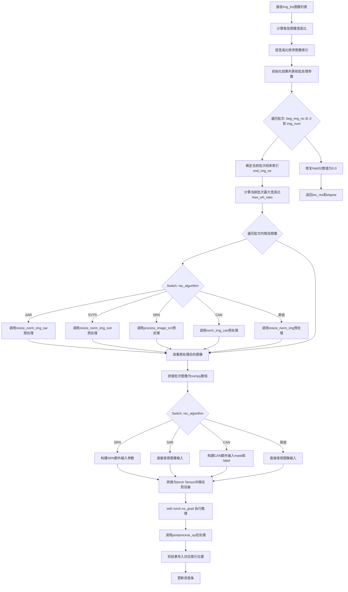

#### 带注释源码

```python
def __call__(self, img_list, tqdm_enable=False, tqdm_desc="OCR-rec Predict"):
    """
    主推理方法，批量处理图像并进行文本识别
    
    参数:
        img_list: list, 输入图像列表（PIL Image或numpy数组）
        tqdm_enable: bool, 是否显示进度条
        tqdm_desc: str, 进度条描述文本
    
    返回:
        tuple: (rec_res, elapse) - 识别结果列表和总耗时
    """
    img_num = len(img_list)
    
    # 计算所有文本条图像的宽高比，用于后续排序
    width_list = []
    for img in img_list:
        width_list.append(img.shape[1] / float(img.shape[0]))
    
    # 按宽高比排序索引，可加速识别过程（相似的宽高比图像一起处理更高效）
    indices = np.argsort(np.array(width_list))
    
    # 初始化结果列表，预填充空字符串和0.0分数
    rec_res = [['', 0.0]] * img_num
    batch_num = self.rec_batch_num  # 批处理大小
    elapse = 0  # 总耗时累加器
    
    # 使用tqdm显示进度条
    with tqdm(total=img_num, desc=tqdm_desc, disable=not tqdm_enable) as pbar:
        index = 0
        # 按批次遍历图像
        for beg_img_no in range(0, img_num, batch_num):
            end_img_no = min(img_num, beg_img_no + batch_num)
            norm_img_batch = []  # 存放当前批次的预处理图像
            
            # 获取当前批次中最大的宽高比，用于统一调整尺寸
            max_wh_ratio = width_list[indices[end_img_no - 1]]
            
            # 遍历当前批次内的每张图像
            for ino in range(beg_img_no, end_img_no):
                if self.rec_algorithm == "SAR":
                    # SAR算法专用预处理：返回norm_img、resize_shape、pad_shape、valid_ratio
                    norm_img, _, _, valid_ratio = self.resize_norm_img_sar(
                        img_list[indices[ino]], self.rec_image_shape)
                    norm_img = norm_img[np.newaxis, :]  # 增加batch维度
                    valid_ratio = np.expand_dims(valid_ratio, axis=0)
                    valid_ratios = []
                    valid_ratios.append(valid_ratio)
                    norm_img_batch.append(norm_img)
                
                elif self.rec_algorithm == "SVTR":
                    # SVTR算法专用预处理
                    norm_img = self.resize_norm_img_svtr(img_list[indices[ino]],
                                                         self.rec_image_shape)
                    norm_img = norm_img[np.newaxis, :]
                    norm_img_batch.append(norm_img)
                
                elif self.rec_algorithm == "SRN":
                    # SRN算法专用预处理：返回包含多个元素的元组
                    norm_img = self.process_image_srn(img_list[indices[ino]],
                                                      self.rec_image_shape, 8,
                                                      self.max_text_length)
                    encoder_word_pos_list = []
                    gsrm_word_pos_list = []
                    gsrm_slf_attn_bias1_list = []
                    gsrm_slf_attn_bias2_list = []
                    # 收集SRN额外的输入参数
                    encoder_word_pos_list.append(norm_img[1])
                    gsrm_word_pos_list.append(norm_img[2])
                    gsrm_slf_attn_bias1_list.append(norm_img[3])
                    gsrm_slf_attn_bias2_list.append(norm_img[4])
                    norm_img_batch.append(norm_img[0])
                
                elif self.rec_algorithm == "CAN":
                    # CAN算法专用预处理：支持灰度化和颜色反转
                    norm_img = self.norm_img_can(img_list[indices[ino]],
                                                 max_wh_ratio)
                    norm_img = norm_img[np.newaxis, :]
                    norm_img_batch.append(norm_img)
                    # CAN需要额外的mask和word_label
                    norm_image_mask = np.ones(norm_img.shape, dtype='float32')
                    word_label = np.ones([1, 36], dtype='int64')
                    norm_img_mask_batch = []
                    word_label_list = []
                    norm_img_mask_batch.append(norm_image_mask)
                    word_label_list.append(word_label)
                
                else:
                    # 默认预处理方式：适用于CRNN、Rosetta等算法
                    norm_img = self.resize_norm_img(img_list[indices[ino]],
                                                    max_wh_ratio)
                    norm_img = norm_img[np.newaxis, :]
                    norm_img_batch.append(norm_img)
            
            # 将批次内所有图像拼接成一个numpy数组
            norm_img_batch = np.concatenate(norm_img_batch)
            norm_img_batch = norm_img_batch.copy()  # 确保连续内存
            
            # ==================== 模型推理 ====================
            if self.rec_algorithm == "SRN":
                starttime = time.time()
                # 拼接SRN额外的输入参数
                encoder_word_pos_list = np.concatenate(encoder_word_pos_list)
                gsrm_word_pos_list = np.concatenate(gsrm_word_pos_list)
                gsrm_slf_attn_bias1_list = np.concatenate(gsrm_slf_attn_bias1_list)
                gsrm_slf_attn_bias2_list = np.concatenate(gsrm_slf_attn_bias2_list)
                
                with torch.no_grad():
                    # 转换为torch tensor并移动到指定设备
                    inp = torch.from_numpy(norm_img_batch)
                    encoder_word_pos_inp = torch.from_numpy(encoder_word_pos_list)
                    gsrm_word_pos_inp = torch.from_numpy(gsrm_word_pos_list)
                    gsrm_slf_attn_bias1_inp = torch.from_numpy(gsrm_slf_attn_bias1_list)
                    gsrm_slf_attn_bias2_inp = torch.from_numpy(gsrm_slf_attn_bias2_list)
                    
                    inp = inp.to(self.device)
                    encoder_word_pos_inp = encoder_word_pos_inp.to(self.device)
                    gsrm_word_pos_inp = gsrm_word_pos_inp.to(self.device)
                    gsrm_slf_attn_bias1_inp = gsrm_slf_attn_bias1_inp.to(self.device)
                    gsrm_slf_attn_bias2_inp = gsrm_slf_attn_bias2_inp.to(self.device)
                    
                    # 执行前向传播
                    backbone_out = self.net.backbone(inp)  # 骨干网络特征提取
                    prob_out = self.net.head(backbone_out, [encoder_word_pos_inp, 
                                                             gsrm_word_pos_inp, 
                                                             gsrm_slf_attn_bias1_inp, 
                                                             gsrm_slf_attn_bias2_inp])
                    preds = {"predict": prob_out["predict"]}
            
            elif self.rec_algorithm == "SAR":
                starttime = time.time()
                with torch.no_grad():
                    inp = torch.from_numpy(norm_img_batch)
                    inp = inp.to(self.device)
                    preds = self.net(inp)
            
            elif self.rec_algorithm == "CAN":
                starttime = time.time()
                # 准备CAN的额外输入
                norm_img_mask_batch = np.concatenate(norm_img_mask_batch)
                word_label_list = np.concatenate(word_label_list)
                inputs = [norm_img_batch, norm_img_mask_batch, word_label_list]
                
                inp = [torch.from_numpy(e_i) for e_i in inputs]
                inp = [e_i.to(self.device) for e_i in inp]
                with torch.no_grad():
                    outputs = self.net(inp)
                    outputs = [v.cpu().numpy() for k, v in enumerate(outputs)]
                preds = outputs
            
            else:  # CRNN、SVTR、Rosetta等默认算法
                starttime = time.time()
                with torch.no_grad():
                    inp = torch.from_numpy(norm_img_batch)
                    inp = inp.to(self.device)
                    preds = self.net(inp)
            
            # ==================== 后处理 ====================
            with torch.no_grad():
                # 调用后处理操作将模型输出转换为文本
                rec_result = self.postprocess_op(preds)
            
            # 将识别结果存放到正确的原始位置
            for rno in range(len(rec_result)):
                rec_res[indices[beg_img_no + rno]] = rec_result[rno]
            
            # 累加当前批次耗时
            elapse += time.time() - starttime
            
            # 更新进度条
            current_batch_size = min(batch_num, img_num - index * batch_num)
            index += 1
            pbar.update(current_batch_size)
    
    # 修复NaN值：若分数为NaN，替换为0.0
    for i in range(len(rec_res)):
        text, score = rec_res[i]
        if isinstance(score, float) and math.isnan(score):
            rec_res[i] = (text, 0.0)
    
    return rec_res, elapse
```

## 关键组件


### TextRecognizer 类

TextRecognizer是OCR文本识别核心类，继承自BaseOCRV20，负责加载模型、预处理图像、执行推理并对多种算法（SRN、SAR、SVTR、CAN等）进行后处理解码头实现文本识别。

### 图像预处理组件

包含多个针对不同识别算法的图像缩放与归一化方法：resize_norm_img（通用）、resize_norm_img_svtr（SVTR）、resize_norm_img_srn（SRN）、resize_norm_img_sar（SAR）、norm_img_can（CAN），实现图像尺寸适配、通道转换、归一化及padding处理。

### 多算法后处理解码头

根据rec_algorithm参数动态构建不同的后处理操作（CTCLabelDecode、SRNLabelDecode、AttnLabelDecode、NRTRLabelDecode、SARLabelDecode、ViTSTRLabelDecode、CANLabelDecode、RFLLabelDecode），将模型输出转换为可读文本。

### 批处理推理调度器

在__call__方法中实现，支持批量图像输入、按照宽高比排序以优化推理效率、分批次调用网络并进行结果重组，支持tqdm进度条显示。

### 模型量化与融合

使用torch.quantization.fuse_modules对ConvBNAct模块进行量化融合（conv+bn+act或conv+bn），提升推理性能。

### SRN专用输入生成器

srn_other_inputs方法为SRN算法生成额外的注意力机制输入，包括encoder_word_pos、gsrm_word_pos、gsrm_slf_attn_bias1、gsrm_slf_attn_bias2等位置编码和注意力偏置矩阵。

### CAN图像归一化

norm_img_can方法针对CAN算法实现灰度转换、可选颜色反转、padding处理，支持word_label和mask生成。


## 问题及建议


### 已知问题

-   **长__init__方法**：__init__方法中包含大量if-elif分支处理不同算法(SRN/RARE/NRTR/SAR/ViTSTR/CAN/RFL)，违反开闭原则，新增算法需修改此类
-   **重复的图像预处理逻辑**：存在多个功能相似的resize方法(resize_norm_img、resize_norm_img_svtr、resize_norm_img_srn、resize_norm_img_sar、norm_img_can)，代码重复度高
-   **硬编码参数**：多处硬编码值如SRN的num_heads=8、max_text_length=36、CAN的word_label形状[1,36]等，缺乏配置灵活性
-   **CAN算法处理不完整**：在__call__方法中，CAN分支创建了norm_image_mask和word_label但未传递给net()进行实际推理，导致这些变量无实际作用
-   **图像归一化参数分散**：归一化参数(127.5/255、0.5、1等)在多处重复出现，应提取为常量或配置
-   **缺少输入验证**：未对img_list进行有效性检查(如None检查、空列表检查)
-   **内存效率问题**：np.concatenate和np.copy的频繁使用可能导致不必要的内存分配
-   **进度条逻辑错误**：pbar.update使用index*batch_num计算，但index是在更新前递增的，导致计数不准确
-   **NaN处理位置不当**：结果后处理后才检查NaN，应在postprocess_op中处理
-   **未使用的变量**：rec_res初始化为[['', 0.0]] * img_num使用乘数复制，后续可能被覆盖但保留了引用问题风险

### 优化建议

-   **策略模式重构**：将不同算法的图像预处理和后处理逻辑抽取为独立的策略类，消除__init__和__call__中的if-elif分支
-   **统一预处理接口**：设计通用的resize_norm_img接口，内部根据算法类型分发到具体实现
-   **配置中心化**：将硬编码参数提取到配置类或yaml文件中统一管理
-   **完善CAN算法实现**：确保norm_image_mask和word_label正确传递给模型推理
-   **添加输入验证**：在__call__开头添加img_list有效性检查
-   **优化内存使用**：减少不必要的copy操作，考虑使用torch.cat替代numpy的concatenate后转为tensor
-   **修复进度条逻辑**：修正pbar.update的参数计算方式
-   **类型注解**：为方法添加详细的类型注解和文档字符串
-   **错误处理**：添加try-except块处理模型推理中的异常情况
-   **常量提取**：将归一化参数定义为类常量或模块级常量


## 其它


### 设计目标与约束

本模块旨在实现一个高精度的文本识别（OCR）系统，支持多种深度学习算法（SRN、SAR、CAN、NRTR、ViTSTR、RFL、SVTR等），能够对批量图像进行快速、准确的文本提取。设计约束包括：1）设备支持CPU和GPU；2）支持动态批处理以优化推理性能；3）必须兼容PyTorch框架；4）图像预处理需适配不同算法的输入要求；5）最大文本长度和图像尺寸存在限制。

### 错误处理与异常设计

1）图像格式错误：代码假设输入为OpenCV读取的BGR图像，若输入格式不符可能导致处理异常；2）模型加载错误：`read_pytorch_weights`和`load_state_dict`可能抛出文件不存在或权重格式不匹配的异常；3）算法不支持错误：当`rec_algorithm`不匹配任何已知算法时，使用默认处理逻辑但未给出明确提示；4）数值异常：识别结果中可能出现NaN值，代码已通过`math.isnan`检查并将分数置为0.0；5）设备转换错误：Tensor从CPU到GPU的转移可能因CUDA不可用而失败。

### 数据流与状态机

数据流主要分为以下阶段：1）图像输入阶段：接收图像列表，按宽高比排序以优化批处理；2）图像预处理阶段：根据不同算法调用对应的`resize_norm_img*`方法进行归一化和padding；3）模型推理阶段：将预处理后的图像转换为PyTorch Tensor并移至目标设备，执行前向传播；4）后处理阶段：调用`postprocess_op`将模型输出解码为文本和置信度；5）结果组装阶段：将识别结果按原始图像索引重新排列。状态转换主要体现在算法分支判断上，通过`self.rec_algorithm`选择不同的处理流程。

### 外部依赖与接口契约

核心依赖包括：1）PIL (Pillow)：用于图像格式转换（NRTR/ViTSTR算法）；2）OpenCV (cv2)：用于图像读取、灰度转换、resize等操作；3）NumPy：用于数值计算和数组操作；4）PyTorch：用于模型加载、推理和张量计算；5）Tqdm：用于显示进度条；6）项目内部模块：`BaseOCRV20`（基类）、`pytorchocr_utility`（配置读取）、`build_post_process`（后处理构建）、`ConvBNAct`（主干网络模块）。接口契约方面：`__call__`方法接收`img_list`（OpenCV图像列表）、`tqdm_enable`（是否显示进度条）、`tqdm_desc`（进度条描述），返回`rec_res`（识别结果列表，每项为元组[文本, 置信度]）和`elapse`（推理耗时）。

### 性能考虑与优化建议

1）批处理优化：代码已按宽高比排序图像以提高批处理效率；2）GPU加速：模型和数据已移至指定设备；3）量化融合：对`ConvBNAct`模块进行了`fuse_modules`操作以提升推理速度；4）内存优化：使用`torch.no_grad()`禁用梯度计算以减少显存占用；5）建议优化：可加入动态批大小调整、混合精度推理（FP16）、TensorRT加速转换；6）当前不足：SAR算法中`valid_ratios`未被正确用于推理输入；7）进度条更新逻辑存在小问题：最后一个batch的索引计算可能不准确。

### 安全性考虑

1）模型安全：加载外部权重文件时需验证文件完整性和来源可信性；2）输入验证：未对输入图像列表进行空值或类型检查，可能导致后续处理异常；3）路径安全：`weights_path`和`yaml_path`来自命令行参数，需防止路径遍历攻击；4）内存安全：大批量图像处理时需控制单次加载数量防止OOM。

### 配置管理

配置主要通过`args`参数传入，包括：1）设备配置：`args.device`；2）模型路径：`args.rec_model_path`、`args.rec_yaml_path`；3）算法参数：`args.rec_algorithm`、`args.rec_char_type`、`args.max_text_length`；4）图像参数：`args.rec_image_shape`、`args.limited_max_width`、`args.limited_min_width`；5）字符集：`args.rec_char_dict_path`、`args.use_space_char`；6）特殊算法参数：`args.rec_image_inverse`（CAN算法用）。这些参数在`__init__`中被读取并存储为实例属性。

### 版本兼容性与平台适配

1）PyTorch版本：需兼容PyTorch 1.x版本，量化相关API在不同版本可能有差异；2）NumPy版本：数组操作使用较常用接口，兼容性较好；3）OpenCV版本：部分API如`cv2.BGR2GRAY`需确认OpenCV已安装；4）设备兼容性：代码支持CPU和CUDA设备，若CUDA不可用会自动回退但需注意tensor设备转移逻辑。

### 单元测试策略建议

1）图像预处理测试：针对每种算法验证输出shape和数值范围；2）模型加载测试：验证权重加载和推理输出的有效性；3）端到端测试：使用标准OCR测试集验证识别准确率；4）边界测试：测试极端宽高比图像、空图像列表、单字符图像等；5）性能测试：记录不同batch_size下的推理耗时。

### 部署注意事项

1）环境依赖：需确保安装PyTorch、OpenCV、Pillow、NumPy等依赖；2）模型文件：需提前准备对应的`.pth`权重文件和YAML配置文件；3）字符字典：需根据实际应用场景准备字符映射文件；4）内存占用：大批量处理时需监控显存/内存使用；5）多进程：如有并发需求需考虑PyTorch的多进程加载策略。


    