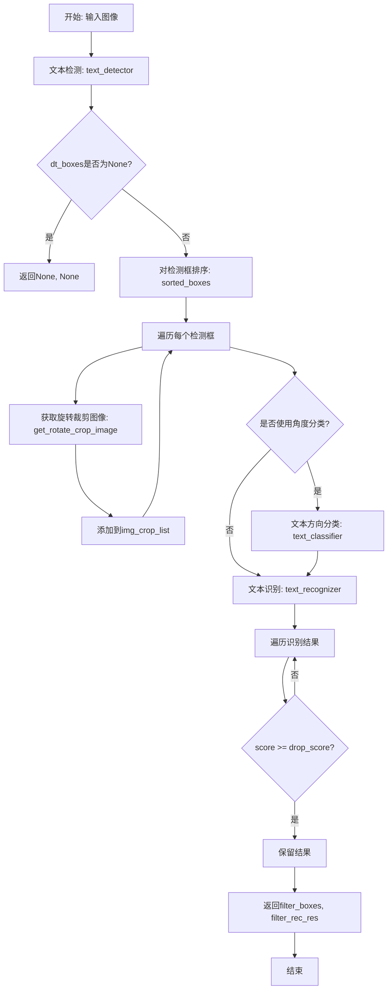
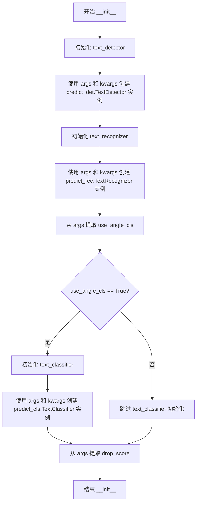
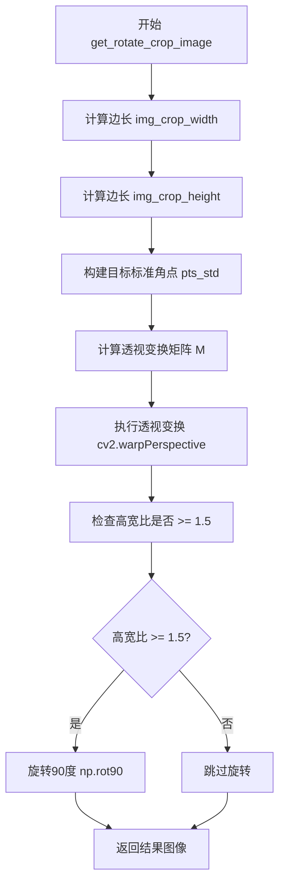
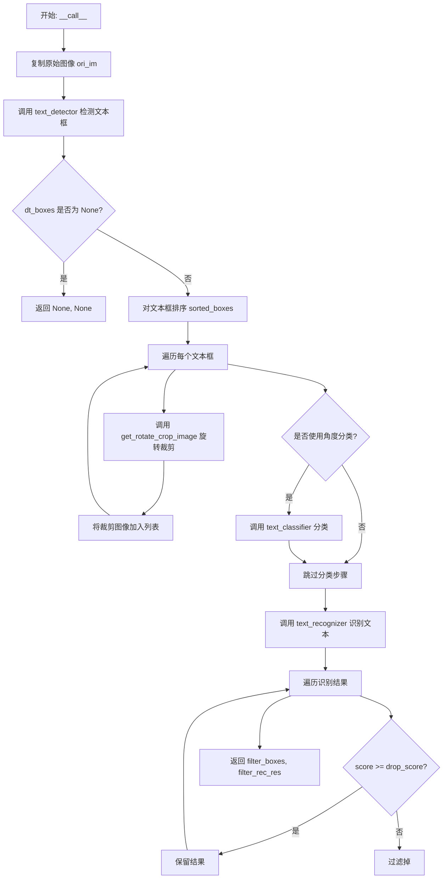

# `MinerU\mineru\model\utils\tools\infer\predict_system.py` 详细设计文档

这是一个端到端的文本识别系统，整合了文本检测、方向分类和文本识别模块，能够对图像中的文字区域进行检测、方向校正和内容识别，并返回通过置信度过滤的识别结果。

## 整体流程



## 类结构

```
TextSystem (文本系统主类)
├── 字段
│   ├── text_detector (文本检测器)
│   ├── text_recognizer (文本识别器)
│   ├── text_classifier (文本分类器, 可选)
│   ├── use_angle_cls (是否使用角度分类)
│   └── drop_score (置信度阈值)
└── 方法
    ├── __init__ (初始化)
    ├── get_rotate_crop_image (获取旋转裁剪图像)
    └── __call__ (主处理流程)

sorted_boxes (全局排序函数)
```

## 全局变量及字段


### `predict_rec`
    
文本识别模块，提供TextRecognizer类用于识别图像中的文字

类型：`module`
    


### `predict_det`
    
文本检测模块，提供TextDetector类用于检测图像中的文本区域

类型：`module`
    


### `predict_cls`
    
文本分类模块，提供TextClassifier类用于文本角度分类

类型：`module`
    


### `sorted_boxes`
    
对检测到的文本框进行排序，按照从上到下、从左到右的顺序排列

类型：`function`
    


### `TextSystem.text_detector`
    
文本检测器实例，用于检测图像中的文本区域

类型：`TextDetector`
    


### `TextSystem.text_recognizer`
    
文本识别器实例，用于识别检测到的文本区域中的文字内容

类型：`TextRecognizer`
    


### `TextSystem.text_classifier`
    
文本分类器实例，用于文本角度分类，仅当use_angle_cls为True时存在

类型：`TextClassifier`
    


### `TextSystem.use_angle_cls`
    
是否使用角度分类的标志位

类型：`bool`
    


### `TextSystem.drop_score`
    
置信度阈值，用于过滤低置信度的识别结果

类型：`float`
    
    

## 全局函数及方法


### `sorted_boxes`

对检测到的文本框按照从上到下、从左到右的顺序进行排序输出。首先按行的 y 坐标排序，对于在同一行的框，再按 x 坐标排序。

参数：

- `dt_boxes`：`numpy.ndarray`，检测到的文本框数组，形状为 [n, 4, 2]，其中 n 为框的数量，每个框由 4 个点组成，每个点包含 (x, y) 坐标

返回值：`list`，排序后的文本框列表，顺序为从上到下、从左到右

#### 流程图

```mermaid
flowchart TD
    A[开始] --> B[获取 dt_boxes 数量 num_boxes]
    B --> C[按 第一点的y坐标 为第一关键字<br/>第一点的x坐标 为第二关键字 排序]
    C --> D[将排序结果转换为列表 _boxes]
    D --> E{遍历 i 从 0 到 num_boxes-2}
    E --> F{判断相邻两box的y坐标差小于10<br/>且下一box的x坐标小于当前box的x坐标}
    F -->|是| G[交换 _boxes[i] 和 _boxes[i+1]]
    F -->|否| H[不交换]
    G --> I[i 递增]
    H --> I
    I --> E
    E --> J{遍历结束?}
    J -->|否| E
    J -->|是| K[返回排序后的 _boxes]
    K --> L[结束]
```

#### 带注释源码

```
def sorted_boxes(dt_boxes):
    """
    对文本框进行排序，从上到下、从左到右
    参数:
        dt_boxes (array): 检测到的文本框，形状为 [4, 2]
    返回:
        sorted boxes (array): 排序后的文本框，形状为 [4, 2]
    """
    # 获取文本框的数量
    num_boxes = dt_boxes.shape[0]
    
    # 第一次排序：先按第一点的 y 坐标（行）排序，再按 x 坐标（列）排序
    # key=lambda x: (x[0][1], x[0][0]) 表示先按 y 坐标，再按 x 坐标
    sorted_boxes = sorted(dt_boxes, key=lambda x: (x[0][1], x[0][0]))
    
    # 转换为列表以便后续交换操作
    _boxes = list(sorted_boxes)

    # 第二次排序：处理同一行内的左右顺序
    # 遍历所有相邻的文本框对
    for i in range(num_boxes - 1):
        # 判断条件：
        # 1. 相邻两框的 y 坐标差小于 10 像素（视为同一行）
        # 2. 下一框的 x 坐标小于当前框的 x 坐标（需要交换左右顺序）
        if abs(_boxes[i + 1][0][1] - _boxes[i][0][1]) < 10 and \
                (_boxes[i + 1][0][0] < _boxes[i][0][0]):
            # 交换两个框的位置
            tmp = _boxes[i]
            _boxes[i] = _boxes[i + 1]
            _boxes[i + 1] = tmp
    
    # 返回排序后的文本框列表
    return _boxes
```


### TextSystem.__init__

初始化文本系统各组件，包括文本检测器、文本识别器和可选的角度分类器，并配置相关参数。

参数：

- `self`：`TextSystem`，TextSystem 类实例本身
- `args`：包含配置参数的对象（如 `use_angle_cls`、`drop_score` 等属性），用于初始化各组件
- `**kwargs`：关键字参数，任意额外的配置参数，传递给子组件（文本检测器、识别器、分类器）

返回值：`None`，`__init__` 方法不返回值，仅完成对象初始化

#### 流程图



#### 带注释源码

```python
def __init__(self, args, **kwargs):
    '''
    初始化文本系统各组件
    参数:
        args: 包含配置参数的对象，需要具有 use_angle_cls 等属性
        **kwargs: 额外的关键字参数，传递给子组件
    '''
    # 初始化文本检测器，用于检测图像中的文本区域
    self.text_detector = predict_det.TextDetector(args, **kwargs)
    
    # 初始化文本识别器，用于识别检测到的文本区域内容
    self.text_recognizer = predict_rec.TextRecognizer(args, **kwargs)
    
    # 从 args 中提取角度分类器开关配置
    self.use_angle_cls = args.use_angle_cls
    
    # 从 args 中提取置信度阈值，低于该分数的识别结果将被过滤
    self.drop_score = args.drop_score
    
    # 如果启用角度分类器，则初始化文本方向分类器
    if self.use_angle_cls:
        self.text_classifier = predict_cls.TextClassifier(args, **kwargs)
```


### `TextSystem.get_rotate_crop_image`

对图像进行透视变换和旋转校正，根据给定的四个角点坐标计算透视变换矩阵，将原始图像扭曲校正为规则的矩形文本区域图像，若校正后图像高宽比大于1.5则进行90度旋转。

参数：

- `self`：`TextSystem`，TextSystem 类的实例，包含文本检测、识别和分类器
- `img`：`numpy.ndarray`，输入的原始图像，通常为 BGR 格式
- `points`：`numpy.ndarray`，文本区域的四个角点坐标，形状为 [4, 2]，按顺序为左上、右上、右下、左下

返回值：`numpy.ndarray`，经过透视变换和旋转校正后的图像

#### 流程图



#### 带注释源码

```python
def get_rotate_crop_image(self, img, points):
    '''
    对图像进行透视变换和旋转校正
    
    参数:
        img: 输入的原始图像 (numpy.ndarray)
        points: 文本区域的四个角点坐标，形状为 [4, 2]
               按顺序为: 左上, 右上, 右下, 左下
    返回:
        dst_img: 校正后的图像
    '''
    # 注意: 下面这段代码被注释掉了，原本用于简单的裁剪
    # img_height, img_width = img.shape[0:2]
    # left = int(np.min(points[:, 0]))
    # right = int(np.max(points[:, 0]))
    # top = int(np.min(points[:, 1]))
    # bottom = int(np.max(points[:, 1]))
    # img_crop = img[top:bottom, left:right, :].copy()
    # points[:, 0] = points[:, 0] - left
    # points[:, 1] = points[:, 1] - top
    
    # 计算裁剪图像的宽度: 取点0-1和点2-3之间欧几里得距离的最大值
    # points[0] 到 points[1] 是上边缘
    # points[2] 到 points[3] 是下边缘
    img_crop_width = int(
        max(
            np.linalg.norm(points[0] - points[1]),  # 上边缘长度
            np.linalg.norm(points[2] - points[3])))  # 下边缘长度
    
    # 计算裁剪图像的高度: 取点0-3和点1-2之间欧几里得距离的最大值
    # points[0] 到 points[3] 是左边缘
    # points[1] 到 points[2] 是右边缘
    img_crop_height = int(
        max(
            np.linalg.norm(points[0] - points[3]),  # 左边缘长度
            np.linalg.norm(points[1] - points[2])))  # 右边缘长度
    
    # 定义透视变换后的标准目标角点
    # 将原始不规则四边形映射为左上(0,0)、右上(width,0)、右下(width,height)、左下(0,height)的矩形
    pts_std = np.float32([[0, 0], [img_crop_width, 0],
                          [img_crop_width, img_crop_height],
                          [0, img_crop_height]])
    
    # 计算透视变换矩阵
    # 输入参数: points - 源图像上的四个角点, pts_std - 目标图像上的四个角点
    # 输出: 3x3 的透视变换矩阵 M
    M = cv2.getPerspectiveTransform(points, pts_std)
    
    # 执行透视变换
    # 参数说明:
    #   img: 源图像
    #   M: 透视变换矩阵
    #   (img_crop_width, img_crop_height): 输出图像尺寸
    #   borderMode=cv2.BORDER_REPLICATE: 边界扩展方式，复制边缘像素
    #   flags=cv2.INTER_CUBIC: 插值方法，使用双三次插值
    dst_img = cv2.warpPerspective(
        img,
        M, (img_crop_width, img_crop_height),
        borderMode=cv2.BORDER_REPLICATE,
        flags=cv2.INTER_CUBIC)
    
    # 获取变换后图像的尺寸
    dst_img_height, dst_img_width = dst_img.shape[0:2]
    
    # 检查高宽比，如果 >= 1.5 则旋转90度
    # 这主要是为了处理竖排文本的情况
    if dst_img_height * 1.0 / dst_img_width >= 1.5:
        dst_img = np.rot90(dst_img)  # 逆时针旋转90度
    
    return dst_img
```


### `TextSystem.__call__`

该方法是 TextSystem 类的主调用方法，执行完整的文本检测、分类、识别流程，接收输入图像，经过文本检测、角度分类（可选）和文本识别后，返回过滤后的文本框和识别结果。

参数：

- `self`：`TextSystem`，TextSystem 实例本身
- `img`：`numpy.ndarray`，输入的原始图像

返回值：

- `filter_boxes`：`list`，过滤后的文本框列表，每个元素为包含4个顶点的坐标数组
- `filter_rec_res`：`list`，过滤后的识别结果列表，每个元素为 (text, score) 元组

#### 流程图



#### 带注释源码

```python
def __call__(self, img):
    """
    主调用方法，执行完整的文本检测、分类、识别流程
    
    参数:
        img: 输入的原始图像 (numpy.ndarray)
    
    返回:
        filter_boxes: 过滤后的文本框列表
        filter_rec_res: 过滤后的识别结果列表
    """
    # 复制原始图像，避免修改输入数据
    ori_im = img.copy()
    
    # 步骤1: 文本检测 - 检测图像中的文本框
    dt_boxes, elapse = self.text_detector(img)
    
    # 打印检测结果数量和耗时
    print("dt_boxes num : {}, elapse : {}".format(
        len(dt_boxes), elapse))
    
    # 如果没有检测到文本框，直接返回 None
    if dt_boxes is None:
        return None, None
    
    # 初始化裁剪图像列表
    img_crop_list = []
    
    # 步骤2: 对检测到的文本框进行排序（从上到下、从左到右）
    dt_boxes = sorted_boxes(dt_boxes)
    
    # 步骤3: 遍历每个文本框，进行旋转裁剪
    for bno in range(len(dt_boxes)):
        # 深拷贝文本框坐标，避免修改原始数据
        tmp_box = copy.deepcopy(dt_boxes[bno])
        # 调用透视变换方法获取旋转裁剪图像
        img_crop = self.get_rotate_crop_image(ori_im, tmp_box)
        # 将裁剪后的图像添加到列表
        img_crop_list.append(img_crop)
    
    # 步骤4: 角度分类（可选）
    # 如果启用角度分类，对裁剪的图像进行方向分类
    if self.use_angle_cls:
        img_crop_list, angle_list, elapse = self.text_classifier(
            img_crop_list)
        print("cls num  : {}, elapse : {}".format(
            len(img_crop_list), elapse))
    
    # 步骤5: 文本识别 - 识别裁剪图像中的文字
    rec_res, elapse = self.text_recognizer(img_crop_list)
    print("rec_res num  : {}, elapse : {}".format(
        len(rec_res), elapse))
    
    # 步骤6: 过滤低置信度结果
    # 根据 drop_score 阈值过滤识别结果
    filter_boxes, filter_rec_res = [], []
    for box, rec_reuslt in zip(dt_boxes, rec_res):
        text, score = rec_reuslt
        # 只保留置信度高于阈值的识别结果
        if score >= self.drop_score:
            filter_boxes.append(box)
            filter_rec_res.append(rec_reuslt)
    
    # 返回过滤后的文本框和识别结果
    return filter_boxes, filter_rec_res
```

#### 关键组件信息

| 组件名称 | 一句话描述 |
|---------|-----------|
| `text_detector` | 文本检测器，负责检测图像中的文本区域 |
| `text_recognizer` | 文本识别器，负责识别裁剪图像中的文字内容 |
| `text_classifier` | 角度分类器，用于分类文本方向（可选） |
| `get_rotate_crop_image` | 透视变换裁剪方法，将任意四边形区域裁剪为矩形 |
| `sorted_boxes` | 全局排序函数，按从上到下、从左到右顺序排列文本框 |

#### 潜在的技术债务或优化空间

1. **缺少异常处理**：代码未对 `img` 为空、格式不正确等情况进行验证，可能导致运行时错误
2. **硬编码阈值**：排序时的高度差阈值 10 是硬编码的，应考虑作为可配置参数
3. **深拷贝开销**：`copy.deepcopy` 在循环中使用可能带来性能开销，可考虑使用数组切片等方式优化
4. **日志输出方式**：使用 `print` 而非标准日志框架，不利于生产环境的日志管理
5. **返回值不一致**：当检测失败时返回 `(None, None)`，但未在文档中明确说明
6. **缺乏类型注解**：方法参数和返回值缺少类型注解，降低了代码的可读性和可维护性
7. **旋转裁剪逻辑**：图像旋转判断逻辑 `dst_img_height * 1.0 / dst_img_width >= 1.5` 是经验值，缺乏灵活性

#### 其它项目

**设计目标与约束：**
- 设计目标：提供端到端的文本识别解决方案，整合检测、分类、识别三个模块
- 约束：依赖外部模块 `predict_det`、`predict_rec`、`predict_cls` 的实现

**错误处理与异常设计：**
- 当文本检测器返回 `None` 时，直接返回 `(None, None)`，上层调用者需自行处理
- 未对图像格式、通道数进行校验
- 未对识别结果为空的情况进行特殊处理

**数据流与状态机：**
- 数据流：`原始图像` → `文本检测` → `文本框排序` → `旋转裁剪` → `角度分类(可选)` → `文本识别` → `结果过滤` → `输出`
- 状态机：主要经历 检测 → 裁剪 → 分类 → 识别 → 过滤 五个状态

**外部依赖与接口契约：**
- 依赖 `cv2` (OpenCV) 进行图像处理
- 依赖 `numpy` 进行数值计算
- 依赖 `copy` 进行深拷贝操作
- 依赖 `predict_det.TextDetector`、`predict_rec.TextRecognizer`、`predict_cls.TextClassifier` 三个外部模块

## 关键组件


### TextSystem（文本识别系统）

核心类，封装了文本检测、角度分类和文本识别的完整流程，协调各个子模块完成端到端的文本识别任务。

### TextDetector（文本检测器）

调用predict_det.TextDetector进行文本检测，返回检测到的文本框坐标和耗时。

### TextRecognizer（文本识别器）

调用predict_rec.TextRecognizer对裁剪后的文本图像进行识别，返回识别结果和耗时。

### TextClassifier（角度分类器）

调用predict_cls.TextClassifier对文本图像进行方向分类，仅在use_angle_cls为True时启用，用于判断文本方向（0°、90°、180°、270°）。

### get_rotate_crop_image（旋转裁剪图像方法）

使用透视变换将任意四边形的文本区域裁剪为矩形图像，处理倾斜文本的矫正，支持长宽比判断并自动旋转90度。

### sorted_boxes（文本框排序函数）

将检测到的文本框按从上到下、从左到右的顺序排序，处理相近高度文本框的左右顺序问题，阈值设为10像素。

### filter_boxes与filter_rec_res（结果过滤）

根据drop_score阈值过滤低置信度的识别结果，只保留分数高于阈值的文本框和识别结果。

### dt_boxes（检测框）

存储文本检测器输出的文本区域坐标，形状为[N, 4, 2]，每个文本框由4个顶点组成。

### img_crop_list（裁剪图像列表）

存储经旋转矫正后的文本图像列表，供角度分类器和文本识别器使用。

### rec_res（识别结果）

存储文本识别器的输出，每个元素为(text, score)元组，包含识别文本内容和置信度分数。


## 问题及建议


### 已知问题

- 代码中存在大量未清理的注释代码（get_rotate_crop_image 方法中已注释的旧逻辑），增加理解成本且可能导致未来维护混乱
- 使用 print 语句进行日志输出，不适合生产环境，应使用专业的日志框架
- sorted_boxes 函数定义在模块级别但被当作内部函数使用，代码组织不够清晰
- 使用 copy.deepcopy 进行box拷贝，效率低下，可以使用 numpy 的 copy 或直接切片
- 缺少异常处理机制，当 text_detector 返回 None 或空列表时，虽然有检查但处理方式较为简单
- 缺少类型注解（Type Hints），降低代码可读性和 IDE 支持
- get_rotate_crop_image 方法中的旋转判断逻辑（dst_img_height * 1.0 / dst_img_width >= 1.5）使用硬编码阈值 1.5，缺乏可配置性

### 优化建议

- 移除 get_rotate_crop_image 方法中的注释代码块，或添加 TODO 注释说明保留原因
- 将 print 语句替换为 logging 模块，并根据日志级别配置不同的输出目标
- 将 sorted_boxes 函数重构为 TextSystem 类的静态方法或私有方法，提升代码内聚性
- 将 copy.deepcopy(dt_boxes[bno]) 替换为 dt_boxes[bno].copy() 或 np.array(dt_boxes[bno], dtype=np.float32)，减少不必要的内存开销
- 添加参数校验和异常捕获逻辑，例如验证输入图像格式、尺寸，检查 args 参数的必要属性是否存在
- 为所有方法添加类型注解，使用 typing 模块声明参数和返回值类型
- 将旋转判断阈值 1.5 提取为类属性或初始化参数，提升可配置性
- 考虑将 __call__ 方法中的处理逻辑拆分为更细粒度的私有方法，提升可读性和可测试性

## 其它


### 设计目标与约束

设计目标：构建一个端到端的文本识别系统，能够对图像中的文本进行检测、角度分类（可选）和识别，返回识别出的文本内容及其位置信息。设计约束：1) 文本检测器、文本识别器和文本分类器必须预先训练并可用；2) 支持可选的角度分类功能，通过use_angle_cls参数控制；3) 文本识别结果需根据drop_score阈值进行过滤；4) 支持旋转文本的检测和识别。

### 错误处理与异常设计

代码中主要通过以下方式进行错误处理：1) 文本检测器返回None时，直接返回(None, None)，调用方需进行None检查；2) 文本识别结果根据score与drop_score比较进行过滤，低于阈值的結果不返回；3) 使用copy.deepcopy避免原始box被修改；4) cv2.warpPerspective使用BORDER_REPLICATE模式处理边界。潜在改进：增加更多异常捕获，如图像格式错误、模型加载失败、显存不足等情况。

### 数据流与状态机

数据流：输入图像 → 文本检测(dt_boxes) → 排序(sorted_boxes) → 旋转裁剪(get_rotate_crop_image) → 角度分类(可选) → 文本识别(rec_res) → 分数过滤 → 输出(filter_boxes, filter_rec_res)。状态机：系统初始化状态(加载模型) → 处理状态(接收图像) → 返回结果状态(返回检测和识别结果)。

### 外部依赖与接口契约

外部依赖：1) cv2 (OpenCV)：图像处理和透视变换；2) numpy：数值计算和数组操作；3) copy：深拷贝操作；4) predict_det.TextDetector：文本检测模型；5) predict_rec.TextRecognizer：文本识别模型；6) predict_cls.TextClassifier：文本角度分类模型(可选)。接口契约：输入img为numpy数组格式的图像；输出为两个list：filter_boxes(检测到的文本框)和filter_rec_res(识别结果列表，每项为(text, score)元组)；所有模型通过args参数传递配置信息。

### 性能考虑与优化空间

性能考虑：1) 使用sorted_boxes对检测框进行排序，减少后续处理错误；2) 批量处理图像crop列表而非逐个处理；3) 使用np.linalg.norm计算距离而非逐点遍历。优化空间：1) get_rotate_crop_image中注释掉的简单裁剪代码可以作为一种快速的备选方案；2) 可添加批处理(batching)支持以提高GPU利用率；3) 可添加缓存机制避免重复处理；4) 可使用多线程/多进程加速图像预处理。

### 安全性考虑

1) 输入图像需进行有效性检查，确保图像格式正确、尺寸合理；2) 模型文件路径需进行验证，防止路径遍历攻击；3) drop_score阈值需在合理范围内[0,1]，防止异常值导致系统行为异常；4) 建议对输入图像进行尺寸限制，防止大图像导致内存溢出。

### 配置管理

主要配置通过args参数传递，包括：1) use_angle_cls：是否使用角度分类；2) drop_score：文本识别结果过滤阈值。模型相关配置在各自初始化时传入。建议使用配置文件或命令行参数统一管理这些配置，便于不同场景下的调整。

### 测试策略

单元测试：1) 测试sorted_boxes函数对不同排列的box进行正确排序；2) 测试get_rotate_crop_image对标准矩形和旋转矩形的裁剪效果；3) 测试TextSystem初始化各种参数组合。集成测试：1) 使用标准数据集测试端到端的检测和识别准确率；2) 测试不同尺寸、不同角度文本的识别效果；3) 测试use_angle_cls开关对结果的影响。

### 部署注意事项

1) 模型文件需随代码一起部署，确保路径正确；2) 需要安装OpenCV、numpy等依赖库；3) GPU版本部署需确保CUDA和cuDNN版本兼容；4) 建议设置环境变量控制日志输出级别；5) 生产环境建议添加请求限流，防止资源耗尽；6) 建议添加健康检查接口。

### 监控与日志

日志输出：1) 文本检测boxes数量和处理时间；2) 角度分类数量和处理时间(如启用)；3) 文本识别结果数量和处理时间。监控指标：1) 处理吞吐量(FPS)；2) 平均处理延迟；3) 文本检测数量统计；4) 识别置信度分布；5) 错误率和异常统计。

### 版本兼容性

代码依赖：1) Python 3.x；2) OpenCV 3.x/4.x；3) numpy 1.x。向下兼容性：sorted_boxes函数使用Python内置sorted，确保兼容性。向上兼容性：建议使用try-except捕获新增OpenCV函数的兼容性问题。

### 关键算法说明

1) 透视变换：使用cv2.getPerspectiveTransform和cv2.warpPerspective实现任意四边形的矩形化；2) 旋转检测：通过计算dst_img_height/dst_img_width比例判断是否需要旋转90度；3) 排序逻辑：首先按y坐标排序(y优先)，再按x坐标排序；对于y坐标差小于10的boxes，按x坐标调整顺序，实现从左到右、从上到下的阅读顺序。

    