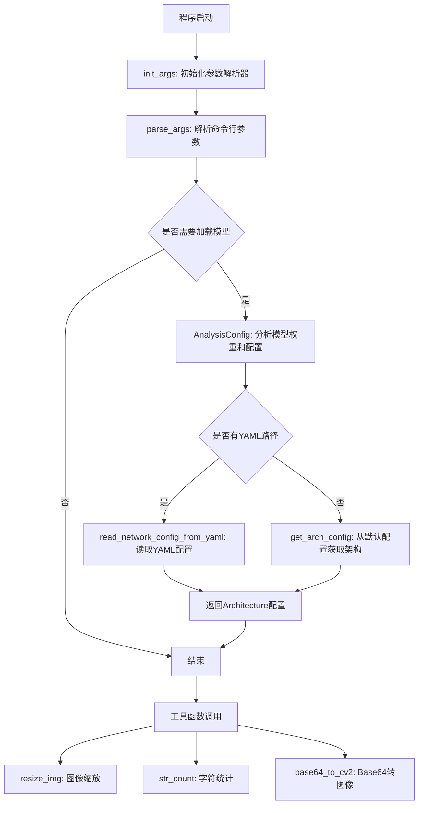
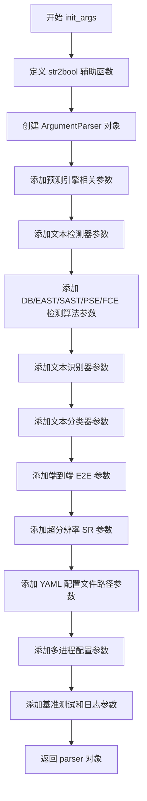
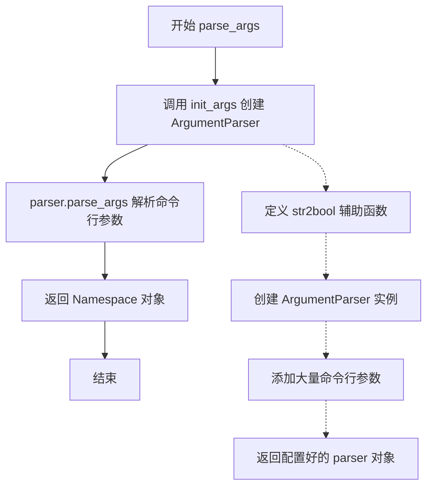
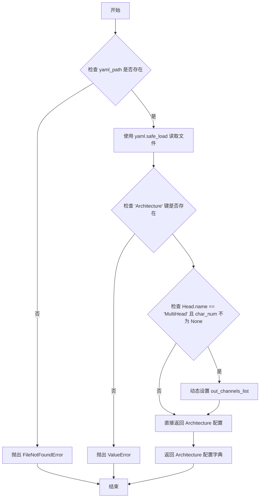
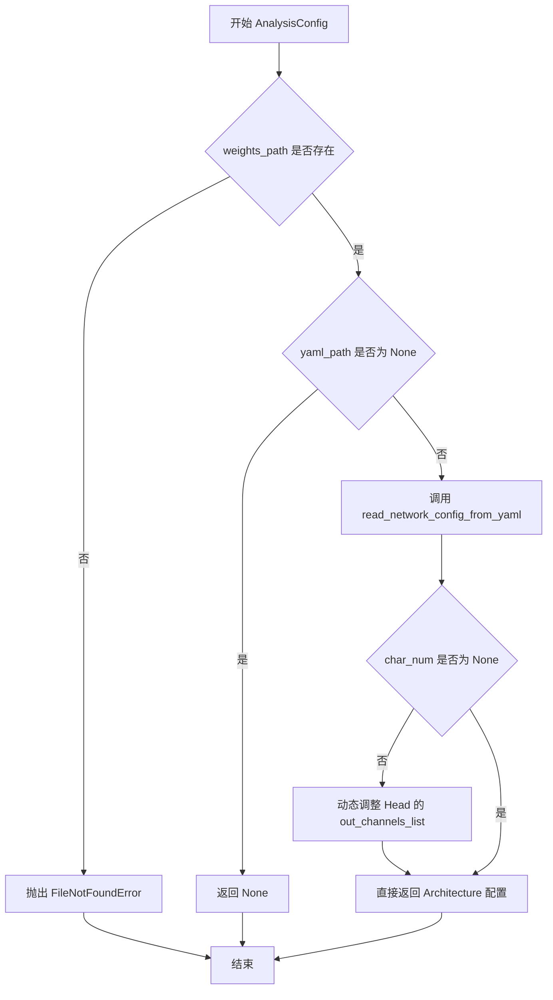
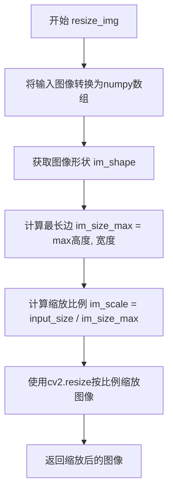
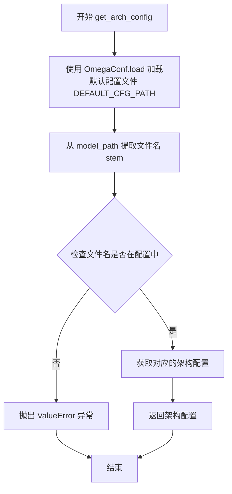

# `MinerU\mineru\model\utils\tools\infer\pytorchocr_utility.py` 详细设计文档

这是一个PyTorch OCR工具的配置管理模块，提供命令行参数解析、YAML配置文件读取、网络架构配置获取、图像预处理和基础工具函数，支持文本检测、识别、端到端OCR、超分辨率等多种模型的配置管理。

## 整体流程



## 类结构

```
无类定义 (纯模块级函数)
```

## 全局变量及字段


### `root_dir`
    
项目根目录路径，通过获取当前文件路径的父目录的父目录的父目录得到

类型：`Path`
    


### `DEFAULT_CFG_PATH`
    
默认架构配置文件路径，指向pytorchocr/utils/resources/arch_config.yaml

类型：`Path`
    


    

## 全局函数及方法


### `init_args`

该函数是OCR系统的命令行参数解析器初始化函数，内部定义了`str2bool`辅助转换函数用于将字符串类型的命令行参数转换为布尔值，然后创建一个`argparse.ArgumentParser`对象，并按照功能分类（预测引擎、文本检测器、文本识别器、文本分类器、端到端模型、超分辨率模型、YAML配置、多进程等）添加了数十个OCR相关的配置参数，最终返回配置好的解析器对象供后续命令行参数解析使用。

参数：无

返回值：`argparse.ArgumentParser`，返回配置好的命令行参数解析器对象

#### 流程图



#### 带注释源码

```python
def init_args():
    """
    初始化命令行参数解析器，定义所有OCR相关参数
    """
    # 定义字符串转布尔值的辅助函数，用于处理命令行传入的字符串参数
    def str2bool(v):
        # 将输入转换为小写并检查是否为真值
        return v.lower() in ("true", "t", "1")

    # 创建 ArgumentParser 对象，用于解析命令行参数
    parser = argparse.ArgumentParser()
    
    # ==================== 预测引擎参数 ====================
    # 是否使用 GPU 进行推理
    parser.add_argument("--use_gpu", type=str2bool, default=False)
    # 是否启用文本检测模型
    parser.add_argument("--det", type=str2bool, default=True)
    # 是否启用文本识别模型
    parser.add_argument("--rec", type=str2bool, default=True)
    # 指定运行设备，可选 'cpu' 或 'cuda'
    parser.add_argument("--device", type=str, default='cpu')
    # GPU 显存大小，单位 MB
    parser.add_argument("--gpu_mem", type=int, default=500)
    # 是否进行模型预热
    parser.add_argument("--warmup", type=str2bool, default=False)

    # ==================== 文本检测器参数 ====================
    # 输入图像目录路径
    parser.add_argument("--image_dir", type=str)
    # 文本检测算法，可选 'DB', 'EAST', 'SAST', 'PSE', 'FCE' 等
    parser.add_argument("--det_algorithm", type=str, default='DB')
    # 文本检测模型路径
    parser.add_argument("--det_model_path", type=str)
    # 检测输入图像的限长边长度
    parser.add_argument("--det_limit_side_len", type=float, default=960)
    # 限长类型，'max' 表示限制较长边，'min' 表示限制较短边
    parser.add_argument("--det_limit_type", type=str, default='max')

    # ------------------- DB 算法参数 -------------------
    # DB 阈值，用于二值化文本区域
    parser.add_argument("--det_db_thresh", type=float, default=0.3)
    # DB 文本框阈值，用于过滤低置信度的文本框
    parser.add_argument("--det_db_box_thresh", type=float, default=0.6)
    # DB 文本框扩展比例，用于文本框的扩张
    parser.add_argument("--det_db_unclip_ratio", type=float, default=1.5)
    # 批处理最大样本数
    parser.add_argument("--max_batch_size", type=int, default=10)
    # 是否使用图像膨胀预处理
    parser.add_argument("--use_dilation", type=str2bool, default=False)
    # DB 分数计算模式，可选 'fast' 或 'slow'
    parser.add_argument("--det_db_score_mode", type=str, default="fast")

    # ------------------- EAST 算法参数 -------------------
    # EAST 文本检测得分阈值
    parser.add_argument("--det_east_score_thresh", type=float, default=0.8)
    # EAST 文本覆盖阈值
    parser.add_argument("--det_east_cover_thresh", type=float, default=0.1)
    # EAST 非极大值抑制阈值
    parser.add_argument("--det_east_nms_thresh", type=float, default=0.2)

    # ------------------- SAST 算法参数 -------------------
    # SAST 文本检测得分阈值
    parser.add_argument("--det_sast_score_thresh", type=float, default=0.5)
    # SAST 非极大值抑制阈值
    parser.add_argument("--det_sast_nms_thresh", type=float, default=0.2)
    # SAST 是否输出多边形
    parser.add_argument("--det_sast_polygon", type=str2bool, default=False)

    # ------------------- PSE 算法参数 -------------------
    # PSE 文本检测阈值
    parser.add_argument("--det_pse_thresh", type=float, default=0)
    # PSE 文本框阈值
    parser.add_argument("--det_pse_box_thresh", type=float, default=0.85)
    # PSE 最小文本区域面积
    parser.add_argument("--det_pse_min_area", type=float, default=16)
    # PSE 文本框类型，可选 'box' 或 'poly'
    parser.add_argument("--det_pse_box_type", type=str, default='box')
    # PSE 缩放因子
    parser.add_argument("--det_pse_scale", type=int, default=1)

    # ------------------- FCE 算法参数 -------------------
    # FCE 缩放比例列表
    parser.add_argument("--scales", type=list, default=[8, 16, 32])
    # FCE 透明度参数 alpha
    parser.add_argument("--alpha", type=float, default=1.0)
    # FCE 透明度参数 beta
    parser.add_argument("--beta", type=float, default=1.0)
    # FCE 傅里叶变换 degree
    parser.add_argument("--fourier_degree", type=int, default=5)
    # FCE 文本框类型
    parser.add_argument("--det_fce_box_type", type=str, default='poly')

    # ==================== 文本识别器参数 ====================
    # 文本识别算法，默认使用 CRNN
    parser.add_argument("--rec_algorithm", type=str, default='CRNN')
    # 文本识别模型路径
    parser.add_argument("--rec_model_path", type=str)
    # 是否反转图像颜色（将白底黑字转为黑底白字）
    parser.add_argument("--rec_image_inverse", type=str2bool, default=True)
    # 识别输入图像 shape，格式为 "C,H,W"
    parser.add_argument("--rec_image_shape", type=str, default="3, 48, 320")
    # 识别字符类型，可选 'ch', 'en', 'ml' 等
    parser.add_argument("--rec_char_type", type=str, default='ch')
    # 识别批处理大小
    parser.add_argument("--rec_batch_num", type=int, default=6)
    # 最大文本长度限制
    parser.add_argument("--max_text_length", type=int, default=25)
    # 是否使用空格字符
    parser.add_argument("--use_space_char", type=str2bool, default=True)
    # 置信度过滤阈值，低于此分数的识别结果将被丢弃
    parser.add_argument("--drop_score", type=float, default=0.5)
    # 限制图像最大宽度
    parser.add_argument("--limited_max_width", type=int, default=1280)
    # 限制图像最小宽度
    parser.add_argument("--limited_min_width", type=int, default=16)
    # 可视化字体路径，用于绘制识别结果
    parser.add_argument(
        "--vis_font_path", type=str,
        default=os.path.join(os.path.dirname(os.path.dirname(os.path.dirname(os.path.abspath(__file__)))), 'doc/fonts/simfang.ttf'))
    # 识别字符字典路径
    parser.add_argument(
        "--rec_char_dict_path",
        type=str,
        default=os.path.join(os.path.dirname(os.path.dirname(os.path.dirname(os.path.abspath(__file__)))),
                             'pytorchocr/utils/ppocr_keys_v1.txt'))

    # ==================== 文本分类器参数 ====================
    # 是否启用方向分类器（用于判断文本方向 0° 或 180°）
    parser.add_argument("--use_angle_cls", type=str2bool, default=False)
    # 方向分类模型路径
    parser.add_argument("--cls_model_path", type=str)
    # 分类输入图像 shape
    parser.add_argument("--cls_image_shape", type=str, default="3, 48, 192")
    # 分类标签列表
    parser.add_argument("--label_list", type=list, default=['0', '180'])
    # 分类批处理大小
    parser.add_argument("--cls_batch_num", type=int, default=6)
    # 分类置信度阈值
    parser.add_argument("--cls_thresh", type=float, default=0.9)
    # 是否启用 MKLDNN 加速
    parser.add_argument("--enable_mkldnn", type=str2bool, default=False)
    # 是否使用 PaddleServing 部署
    parser.add_argument("--use_pdserving", type=str2bool, default=False)

    # ==================== 端到端 E2E 参数 ====================
    # 端到端算法，默认使用 PGNet
    parser.add_argument("--e2e_algorithm", type=str, default='PGNet')
    # 端到端模型路径
    parser.add_argument("--e2e_model_path", type=str)
    # E2E 限长边长度
    parser.add_argument("--e2e_limit_side_len", type=float, default=768)
    # E2E 限长类型
    parser.add_argument("--e2e_limit_type", type=str, default='max')

    # ------------------- PGNet 参数 -------------------
    # PGNet 得分阈值
    parser.add_argument("--e2e_pgnet_score_thresh", type=float, default=0.5)
    # E2E 字符字典路径
    parser.add_argument(
        "--e2e_char_dict_path", type=str,
        default=os.path.join(os.path.dirname(os.path.dirname(os.path.dirname(os.path.abspath(__file__)))),
                             'pytorchocr/utils/ic15_dict.txt'))
    # PGNet 验证集类型
    parser.add_argument("--e2e_pgnet_valid_set", type=str, default='totaltext')
    # PGNet 是否输出多边形
    parser.add_argument("--e2e_pgnet_polygon", type=bool, default=True)
    # PGNet 模式，可选 'fast' 或 'slow'
    parser.add_argument("--e2e_pgnet_mode", type=str, default='fast')

    # ==================== 超分辨率 SR 参数 ====================
    # 超分辨率模型路径
    parser.add_argument("--sr_model_path", type=str)
    # SR 输入图像 shape
    parser.add_argument("--sr_image_shape", type=str, default="3, 32, 128")
    # SR 批处理大小
    parser.add_argument("--sr_batch_num", type=int, default=1)

    # ==================== YAML 配置文件路径参数 ====================
    # 检测器 YAML 配置路径
    parser.add_argument("--det_yaml_path", type=str, default=None)
    # 识别器 YAML 配置路径
    parser.add_argument("--rec_yaml_path", type=str, default=None)
    # 分类器 YAML 配置路径
    parser.add_argument("--cls_yaml_path", type=str, default=None)
    # E2E YAML 配置路径
    parser.add_argument("--e2e_yaml_path", type=str, default=None)
    # SR YAML 配置路径
    parser.add_argument("--sr_yaml_path", type=str, default=None)

    # ==================== 多进程配置参数 ====================
    # 是否启用多进程
    parser.add_argument("--use_mp", type=str2bool, default=False)
    # 总进程数
    parser.add_argument("--total_process_num", type=int, default=1)
    # 当前进程 ID
    parser.add_argument("--process_id", type=int, default=0)

    # ==================== 基准测试和日志参数 ====================
    # 是否运行基准测试
    parser.add_argument("--benchmark", type=str2bool, default=False)
    # 日志保存路径
    parser.add_argument("--save_log_path", type=str, default="./log_output/")
    # 是否显示日志
    parser.add_argument("--show_log", type=str2bool, default=True)

    # 返回配置好的参数解析器
    return parser
```


### `parse_args`

解析命令行传入的参数，返回包含所有配置参数的命名空间对象。

参数：
- 该函数无显式参数

返回值：`argparse.Namespace`，包含从命令行解析的所有参数，以属性形式存储

#### 流程图



#### 带注释源码

```python
def parse_args():
    """
    解析命令行传入的参数
    
    该函数是命令行参数解析的入口点，封装了参数初始化的逻辑。
    它调用 init_args() 创建参数解析器，然后使用 parse_args()
    解析命令行中传递的参数，返回一个包含所有参数值的 Namespace 对象。
    
    典型用法:
        python script.py --use_gpu true --det true --rec true
        args = parse_args()
        print(args.use_gpu)  # 输出: True
    """
    # 步骤1: 初始化参数解析器
    # init_args() 函数会创建一个配置完整的 ArgumentParser 实例
    # 该解析器包含了 OCR 系统所需的所有配置参数
    parser = init_args()
    
    # 步骤2: 解析命令行参数
    # parse_args() 会读取 sys.argv，解析其中的命令行参数
    # 并返回一个 Namespace 对象，其属性对应各个命令行参数
    # 如果命令行中未提供某个参数，则使用默认值
    return parser.parse_args()
```

---

#### 关联信息

**关键组件信息：**
- `init_args`：参数解析器初始化函数，内部定义了 `str2bool` 辅助转换函数，并配置了大量 OCR 相关参数
- `argparse.ArgumentParser`：Python 标准库，用于命令行选项、参数和子命令的解析

**潜在技术债务或优化空间：**
1. `parse_args` 函数实现过于简单，可以考虑将 `init_args` 的部分逻辑内联以减少函数调用开销
2. `init_args` 中定义的 `str2bool` 是嵌套函数，每次调用 `init_args` 都会重新定义，建议提升到模块级别
3. 大量硬编码的默认路径和参数值，缺乏配置中心的统一管理

**其它说明：**
- **设计目标**：为 OCR 系统提供统一的命令行参数入口，支持文本检测、识别、分类、端到端等多种任务的配置
- **错误处理**：本函数本身不处理错误，错误处理由调用方负责（如缺少必需参数时 `argparse` 会自动报错）
- **外部依赖**：完全依赖 Python 标准库 `argparse`，无第三方依赖
- **返回值使用示例**：
  ```python
  args = parse_args()
  use_gpu = args.use_gpu          # 获取布尔参数
  det_model = args.det_model_path # 获取字符串路径参数
  batch_size = args.max_batch_size # 获取整型参数
  ```


### `get_default_config`

将命令行参数对象（argparse.Namespace）转换为字典格式返回。

参数：

- `args`：`argparse.Namespace`，包含所有命令行参数的对象

返回值：`dict`，返回参数字典，键为参数名称，值为参数值

#### 流程图

```mermaid
flowchart TD
    A[开始] --> B[接收 args 参数]
    B --> C[调用 vars(args) 转换为字典]
    C --> D[返回字典]
```

#### 带注释源码

```python
def get_default_config(args):
    """
    将参数对象转换为字典格式
    
    参数:
        args: argparse.Namespace 对象，包含从命令行解析的参数
        
    返回:
        dict: 包含所有参数名称和值的字典
    """
    return vars(args)
```


### `read_network_config_from_yaml`

该函数用于从YAML文件中读取网络架构配置，验证配置文件的有效性，并根据可选的字符数量参数动态调整多任务头（MultiHead）的输出通道列表。

参数：

- `yaml_path`：`str`，YAML配置文件的路径
- `char_num`：`int`，可选参数，用于设置多任务头的输出通道数量

返回值：`dict`，返回解析后的网络架构配置字典（`Architecture`部分）

#### 流程图



#### 带注释源码

```python
def read_network_config_from_yaml(yaml_path, char_num=None):
    """
    从YAML文件读取网络架构配置
    
    参数:
        yaml_path: str, YAML配置文件的路径
        char_num: int, 可选参数，用于设置多任务头的输出通道数量
    
    返回:
        dict: 返回解析后的网络架构配置字典（Architecture部分）
    """
    # 检查配置文件是否存在
    if not os.path.exists(yaml_path):
        raise FileNotFoundError('{} is not existed.'.format(yaml_path))
    
    # 动态导入yaml模块（延迟导入）
    import yaml
    
    # 读取并解析YAML文件
    with open(yaml_path, encoding='utf-8') as f:
        res = yaml.safe_load(f)
    
    # 验证配置文件中是否包含Architecture键
    if res.get('Architecture') is None:
        raise ValueError('{} has no Architecture'.format(yaml_path))
    
    # 如果是多任务头配置且提供了char_num，则动态调整输出通道数
    if res['Architecture']['Head']['name'] == 'MultiHead' and char_num is not None:
        res['Architecture']['Head']['out_channels_list'] = {
            'CTCLabelDecode': char_num,
            'SARLabelDecode': char_num + 2,
            'NRTRLabelDecode': char_num + 3
        }
    
    # 返回解析后的Architecture配置
    return res['Architecture']
```


### `AnalysisConfig`

该函数用于分析模型权重文件并返回对应的网络架构配置。它首先检查权重文件是否存在，如果提供了 YAML 配置文件路径，则从 YAML 文件中读取并返回架构配置信息，同时支持根据字符数量动态调整多任务头的输出通道数。

参数：

- `weights_path`：`str`，模型权重文件的路径，用于验证文件是否存在
- `yaml_path`：`str | None`，可选参数，YAML 配置文件的路径，如果为 `None` 则可能使用默认配置
- `char_num`：`int | None`，可选参数，字符集数量，用于动态调整多任务头的输出通道数

返回值：`dict`，返回从 YAML 文件中读取的 `Architecture` 架构配置字典，包含模型的头部、网络主干等配置信息

#### 流程图



#### 带注释源码

```python
def AnalysisConfig(weights_path, yaml_path=None, char_num=None):
    """
    分析模型权重文件并返回对应的架构配置
    
    参数:
        weights_path: 模型权重文件的路径
        yaml_path: 可选的 YAML 配置文件路径
        char_num: 可选的字符数量，用于多任务头配置
    
    返回:
        字典形式的架构配置信息
    """
    # 检查权重文件是否存在，如果不存在则抛出 FileNotFoundError 异常
    if not os.path.exists(os.path.abspath(weights_path)):
        raise FileNotFoundError('{} is not found.'.format(weights_path))

    # 如果提供了 yaml_path，则从 YAML 文件读取网络配置
    if yaml_path is not None:
        # 调用 read_network_config_from_yaml 函数获取架构配置
        # 并传入 char_num 参数用于动态调整输出通道
        return read_network_config_from_yaml(yaml_path, char_num=char_num)
    
    # 如果没有提供 yaml_path，函数隐式返回 None
```


### `resize_img`

将图像缩放到指定最长边长度，保持宽高比不变。

参数：

-  `img`：`图像数据`（支持numpy数组、list或其他OpenCV可读取的图像格式），输入的需要调整大小的图像
-  `input_size`：`int`，目标最长边的长度，默认为600

返回值：`numpy.ndarray`，调整大小后的图像

#### 流程图



#### 带注释源码

```python
def resize_img(img, input_size=600):
    """
    resize img and limit the longest side of the image to input_size
    
    参数:
        img: 输入图像，支持numpy数组、list或其他OpenCV可读取的图像格式
        input_size: 目标最长边的长度，默认为600
    
    返回:
        numpy.ndarray: 调整大小后的图像
    """
    # 将输入图像转换为numpy数组，确保后续操作的一致性
    img = np.array(img)
    
    # 获取图像的形状信息（高度, 宽度, 通道数）
    im_shape = img.shape
    
    # 计算图像的最长边（高度和宽度中的最大值）
    im_size_max = np.max(im_shape[0:2])
    
    # 计算缩放比例：将最长边缩放到input_size
    im_scale = float(input_size) / float(im_size_max)
    
    # 使用OpenCV的resize函数进行图像缩放
    # fx和fy设置为相同的缩放比例，保持宽高比不变
    img = cv2.resize(img, None, None, fx=im_scale, fy=im_scale)
    
    # 返回缩放后的图像
    return img
```


### `str_count`

统计字符串中的字符类型数量，根据字符类型（中文、英文、数字、标点等）计算"中文字符数"。该函数常用于文本处理场景中计算有效字符数（中文计为1，英文/数字计为0.5）。

参数：

- `s`：`str`，待处理的输入字符串

返回值：`int`，计算后的中文字符数量（中文全计，英文/数字按半个计算）

#### 流程图

```mermaid
flowchart TD
    A[开始 str_count] --> B[初始化变量: count_zh=0, count_pu=0, s_len=len(s), en_dg_count=0]
    B --> C{遍历字符串 s 中的每个字符 c}
    C --> D{c 是字母/数字/空格?}
    D -->|是| E[en_dg_count += 1]
    D -->|否| F{c 是其他字母?}
    F -->|是| G[count_zh += 1]
    F -->|否| H[count_pu += 1]
    E --> I{还有更多字符?}
    G --> I
    H --> I
    I -->|是| C
    I -->|否| J[返回 s_len - math.ceil(en_dg_count / 2)]
    J --> K[结束]
```

#### 带注释源码

```python
def str_count(s):
    """
    Count the number of Chinese characters,
    a single English character and a single number
    equal to half the length of Chinese characters.
    args:
        s(string): the input of string
    return(int):
        the number of Chinese characters
    """
    import string
    # 初始化计数变量
    count_zh = 0      # 中文字符计数（当前未使用）
    count_pu = 0      # 标点符号计数（当前未使用）
    s_len = len(s)    # 字符串总长度
    en_dg_count = 0   # 英文/数字/空格字符计数
    
    # 遍历字符串中的每个字符
    for c in s:
        # 判断是否为英文字母、数字或空格
        if c in string.ascii_letters or c.isdigit() or c.isspace():
            en_dg_count += 1
        # 判断是否为其他字母（如中文、日文等）
        elif c.isalpha():
            count_zh += 1
        # 其余情况视为标点符号
        else:
            count_pu += 1
    
    # 计算返回值：总长度减去英文/数字字符数的一半（向上取整）
    return s_len - math.ceil(en_dg_count / 2)
```


### `base64_to_cv2`

该函数是 PyTorchOCR 工具库中的图像解码辅助函数，负责将前端或接口传入的 Base64 编码字符串转换为 OpenCV 可处理的图像格式（NumPy 数组），以便进行后续的文本检测与识别。

参数：
- `b64str`：`str`，Base64 编码的图像数据字符串。

返回值：`numpy.ndarray`，OpenCV 图像对象（BGR 格式）。如果解码失败，返回 `None`。

#### 流程图

```mermaid
graph TD
    A[输入: Base64 字符串] -->|encode('utf8')| B[字节流]
    B -->|base64.b64decode| C[二进制图像数据]
    C -->|np.fromstring / frombuffer| D[一维 NumPy 数组]
    D -->|cv2.imdecode| E[三维 OpenCV 图像]
    E --> F[输出: CV2 图像]
```

#### 带注释源码

```python
def base64_to_cv2(b64str):
    """
    将 Base64 编码的图像字符串解码为 OpenCV 图像格式。

    参数:
        b64str (str): Base64 编码的图像字符串。

    返回值:
        numpy.ndarray: OpenCV 图像 (BGR 格式)。如果解码失败返回 None。
    """
    import base64
    
    # 1. 将 Base64 字符串编码为 UTF-8 字节，然后解码为原始二进制图像数据
    data = base64.b64decode(b64str.encode('utf8'))
    
    # 2. 将二进制数据转换为 NumPy 的 uint8 类型数组
    # 注意：np.fromstring 已在 NumPy 1.20+ 中弃用，建议使用 np.frombuffer 以获得更好的性能和安全性
    data = np.fromstring(data, np.uint8)
    
    # 3. 使用 OpenCV 的 imdecode 函数将数据解码为图像
    # cv2.IMREAD_COLOR 表示强制以彩色图像(BGR)读取
    data = cv2.imdecode(data, cv2.IMREAD_COLOR)
    
    return data
```

关键组件信息：
- `base64.b64decode`：Python 标准库函数，负责 Base64 算法的解码。
- `numpy`：`np.fromstring` (或 `np.frombuffer`) 用于将内存中的二进制字节串转换为数值数组。
- `cv2.imdecode`：OpenCV 函数，用于从内存缓冲区的数据中解码图像。

潜在的技术债务或优化空间：
1. **弃用 API**：使用了已弃用的 `np.fromstring`。在新版 NumPy (>=1.20) 中应改为 `np.frombuffer(data, np.uint8)`，这在处理大图像时更高效且更安全。
2. **缺少错误处理**：未对 `base64.b64decode` 和 `cv2.imdecode` 进行异常捕获。如果输入的 `b64str` 不是合法的 Base64 或图像数据损坏，程序会直接崩溃。
3. **模块导入位置**：`import base64` 放在函数内部，虽然是延迟加载的常见做法，但建议移至文件顶部（全局导入），避免在高频调用时重复执行导入语句。

其它项目：
- **输入约束**：输入必须是有效的 UTF-8 编码的 Base64 字符串。
- **数据格式**：通常用于处理 PNG 或 JPEG 格式编码后的 Base64 字符串。


### `get_arch_config`

从默认配置文件加载指定模型的架构配置，使用模型文件的文件名作为键在配置文件中查找对应的架构配置。

参数：

- `model_path`：`str`，模型文件的路径，函数将使用该路径的文件名（不含扩展名）作为键在配置文件中查找对应的架构配置。

返回值：`Any`（OmegaConf 配置对象），从 `arch_config.yaml` 中加载的指定模型的架构配置。

#### 流程图



#### 带注释源码

```python
def get_arch_config(model_path):
    """
    从默认配置文件加载指定模型的架构配置
    
    Args:
        model_path: 模型文件的路径，用于提取文件名作为配置键
        
    Returns:
        arch_config: 从配置文件中获取的架构配置
        
    Raises:
        ValueError: 当模型文件名不在配置文件中时抛出
    """
    # 从 omegaconf 导入 OmegaConf 用于加载 YAML 配置文件
    from omegaconf import OmegaConf
    
    # 使用 OmegaConf 加载默认的架构配置文件 arch_config.yaml
    all_arch_config = OmegaConf.load(DEFAULT_CFG_PATH)
    
    # 将模型路径转换为 Path 对象
    path = Path(model_path)
    
    # 获取文件名（不含扩展名），作为在配置文件中的键
    file_name = path.stem
    
    # 检查文件名是否存在于配置文件中
    if file_name not in all_arch_config:
        # 如果不存在，抛出详细的错误信息
        raise ValueError(f"architecture {file_name} is not in arch_config.yaml")
    
    # 从配置字典中获取对应文件名的架构配置
    arch_config = all_arch_config[file_name]
    
    # 返回架构配置对象
    return arch_config
```

## 关键组件


### 参数解析模块 (init_args / parse_args)

负责解析命令行参数，涵盖文字检测、识别、分类、端到端、超分辨率等所有OCR相关配置，支持GPU/CPU、模型路径、阈值参数、批处理大小等关键参数设置。

### YAML配置读取 (read_network_config_from_yaml / AnalysisConfig)

从YAML文件读取网络架构配置，支持动态修改输出通道数（针对不同字符集），处理Architecture、Head等关键网络结构配置。

### 默认配置管理 (get_arch_config)

使用OmegaConf从arch_config.yaml加载预定义的模型架构配置，通过模型文件名匹配对应架构。

### 图像处理工具 (resize_img / base64_to_cv2)

提供图像预处理功能：限制最长边进行等比例缩放，支持base64编码图像转换为OpenCV格式。

### 文本处理工具 (str_count)

计算字符串中中文字符、英文字母、数字、标点的混合计数，中文计1，英文/数字计0.5。

### 全局配置路径 (DEFAULT_CFG_PATH)

定义默认的架构配置文件路径，用于模型架构的默认加载。


## 问题及建议


### 已知问题

-   **使用已弃用的numpy函数**：`np.fromstring`在numpy 1.16版本后已弃用，应改用`np.frombuffer`
-   **导入位置不规范**：部分模块导入（如`yaml`、`base64`、`string`）放在函数内部而非文件顶部，影响性能和代码可读性
-   **路径构建方式混乱**：混合使用`os.path`和`pathlib.Path`，且使用多层嵌套的`os.path.dirname`构建路径，代码脆弱且难以维护
-   **缺少类型注解**：所有函数都缺少参数和返回值的类型提示，降低了代码的可维护性和IDE支持
-   **魔法数字散布**：大量硬编码的默认值（如960、0.3、0.6等）散落在代码各处，缺乏解释和集中管理
-   **argparse参数类型问题**：使用`type=list`定义参数（如`scales`）实际上无法正常工作，argparse不支持直接解析列表类型
-   **配置文件路径假设**：DEFAULT_CFG_PATH假设了特定的目录结构，如果目录不存在会导致运行时错误
-   **错误处理不一致**：部分函数抛出异常，部分函数可能静默失败，缺乏统一的错误处理策略
-   **嵌套函数定义**：`str2bool`定义在`init_args()`内部，但实际上可以在模块级别定义以提高可测试性

### 优化建议

-   **重构numpy函数**：将`np.fromstring(data, np.uint8)`替换为`np.frombuffer(data, np.uint8)`
-   **统一路径处理**：全面使用`pathlib.Path`替代`os.path`，创建专门的路径工具类或函数
-   **前移导入语句**：将所有模块级导入移至文件顶部，使用条件导入处理可选依赖
-   **添加类型注解**：为所有函数添加完整的类型注解，包括参数和返回值类型
-   **提取配置常量**：创建专门的配置类或常量文件，集中管理所有默认参数和魔法数字
-   **修复列表参数**：对于`scales`等列表参数，使用`action='append'`或自定义类型转换函数
-   **改进错误处理**：创建自定义异常类，提供更具体和一致的错误信息
-   **解耦依赖**：将`str2bool`等工具函数提取到独立的工具模块，提高可测试性
-   **添加配置验证**：在`AnalysisConfig`和`get_arch_config`中添加更完善的配置验证逻辑
-   **考虑配置分离**：将极长的参数列表重构为配置类或配置字典，提高代码组织性


## 其它


### 设计目标与约束

本模块作为PyTorchOCR工具的配置中枢，负责统一管理文本检测、识别、分类、端到端识别以及超分辨率等各环节的配置参数。设计目标包括：1）通过argparse提供灵活的命令行参数配置接口，支持CPU/GPU切换、多模型路径指定、多算法选择（DB/EAST/SAST/PSE/FCE）；2）提供YAML配置文件读取能力，支持从arch_config.yaml动态加载网络架构；3）实现配置与代码解耦，便于不同场景下的参数调优；4）提供基础图像预处理和字符串处理工具函数。约束条件包括：依赖Python标准库argparse、yaml处理库、外部OCR模型文件路径需预先配置、仅支持指定格式的模型权重和字典文件。

### 错误处理与异常设计

代码中的异常处理设计如下：1）FileNotFoundError：检测模型权重文件、YAML配置文件、字符字典文件不存在时抛出；2）ValueError：检测YAML配置文件中缺少Architecture字段或architecture名称不匹配时抛出；3）参数类型错误：str2bool函数对布尔类型参数进行转换，非预期值时返回False；4）YAML解析异常：使用yaml.safe_load安全加载配置文件。改进建议：应增加更具体的异常类定义（如ConfigFileNotFoundError、InvalidArchitectureError），为关键函数添加try-except包装并记录详细错误日志，对配置参数增加合法性校验（如模型路径格式、数值范围检查）。

### 数据流与状态机

本模块不涉及复杂状态机，主要数据流如下：1）命令行参数输入 → init_args()解析 → parse_args()生成Namespace对象 → get_default_config()转换为字典；2）模型权重路径 + YAML路径 → AnalysisConfig() → read_network_config_from_yaml()读取网络架构配置；3）图像输入 → resize_img()进行尺寸归一化处理；4）Base64字符串 → base64_to_cv2()解码为OpenCV图像格式；5）字符串 → str_count()计算包含中英文的字符长度。建议增加配置验证状态机，确保在模型加载前所有必需参数已完成配置。

### 外部依赖与接口契约

核心外部依赖包括：1）os、math、pathlib：Python标准库；2）numpy：数值计算库，用于图像数组操作；3）cv2（OpenCV）：图像处理；4）argparse：命令行参数解析；5）yaml：配置文件读取；6）omegaconf：可选依赖，用于OmegaConf配置加载；7）base64：Python标准库用于Base64编解码。接口契约方面：init_args()返回argparse.ArgumentParser对象；parse_args()返回Namespace对象；get_default_config()返回参数字典；read_network_config_from_yaml()返回Architecture配置字典；resize_img()接受图像数组和目标尺寸，返回resize后的图像数组；str_count()返回字符串有效字符数；base64_to_cv2()接受Base64字符串返回BGR图像数组；get_arch_config()接受模型路径返回架构配置。

### 性能考虑与优化空间

当前代码性能瓶颈和优化建议：1）str_count函数中每次调用都import string模块，建议在模块顶部统一导入；2）resize_img函数使用np.array()重复转换，建议增加类型检查避免不必要的转换；3）多次os.path.dirname嵌套调用（如vis_font_path和rec_char_dict_path），可使用Path.parent简化；4）get_arch_config中OmegaConf.load每次调用都会重新加载配置文件，建议增加缓存机制；5）YAML文件读取未使用缓存，重复调用开销较大；6）建议增加@functools.lru_cache装饰器缓存频繁调用的配置读取函数。

### 安全性考虑

安全相关设计：1）yaml.safe_load防止恶意YAML文件执行任意代码；2）os.path.abspath防止路径注入攻击；3）模型文件和配置文件路径需严格控制访问权限。潜在安全风险：1）Base64解码未验证数据合法性，可能导致内存溢出，建议增加数据大小限制；2）命令行参数未做输入验证，恶意参数可能导致异常；3）配置文件路径来自用户输入，需增加路径遍历检查（防止../../etc/passwd类攻击）。

### 配置管理与版本兼容性

配置管理策略：1）默认配置通过argparse的default参数设定；2）支持YAML文件覆盖默认配置；3）模型特定配置通过arch_config.yaml集中管理。版本兼容性考虑：1）Python版本需支持argparse（Python 3.2+）；2）yaml库在Python 3.6+内置；3）omegaconf为可选依赖，需做try-except处理；4）numpy和cv2版本需兼容OpenCV图像解码格式；5）建议增加Python版本检查（>=3.6），在文档中明确依赖库版本要求。

### 测试策略建议

单元测试应覆盖：1）init_args()参数完整性验证；2）parse_args()默认值解析正确性；3）str_count()中英文混合字符串计数准确性；4）resize_img()图像尺寸缩放比例；5）base64_to_cv2()编解码一致性；6）read_network_config_from_yaml()文件不存在、格式错误、字段缺失等异常情况。集成测试应验证：1）命令行参数到配置字典的完整转换流程；2）与实际模型文件的配置加载流程；3）多算法参数组合的兼容性。

### 部署与运行环境

部署环境要求：1）Python 3.6+；2）numpy>=1.15；3）opencv-python>=4.0；4）PyYAML>=5.0；5）omegaconf>=7.0（可选）。环境变量：可增加OCR_MODEL_ROOT、OCR_CONFIG_ROOT等环境变量支持。Docker化建议：提供基础镜像包含CUDA（若使用GPU）、Python 3.8+、所有依赖库，预装常用字体文件。运行模式：支持命令行直接运行、服务化部署（--use_pdserving）、多进程模式（--use_mp）。

    