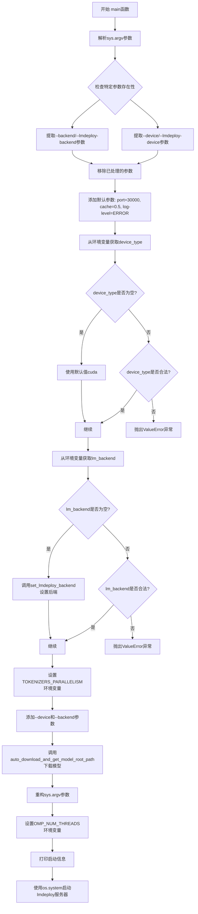
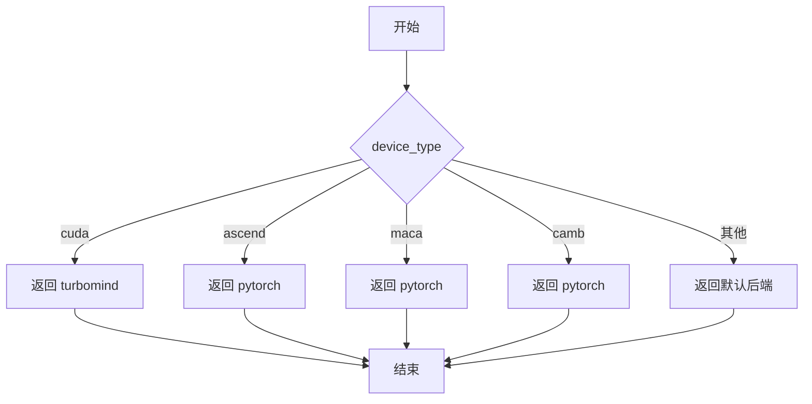
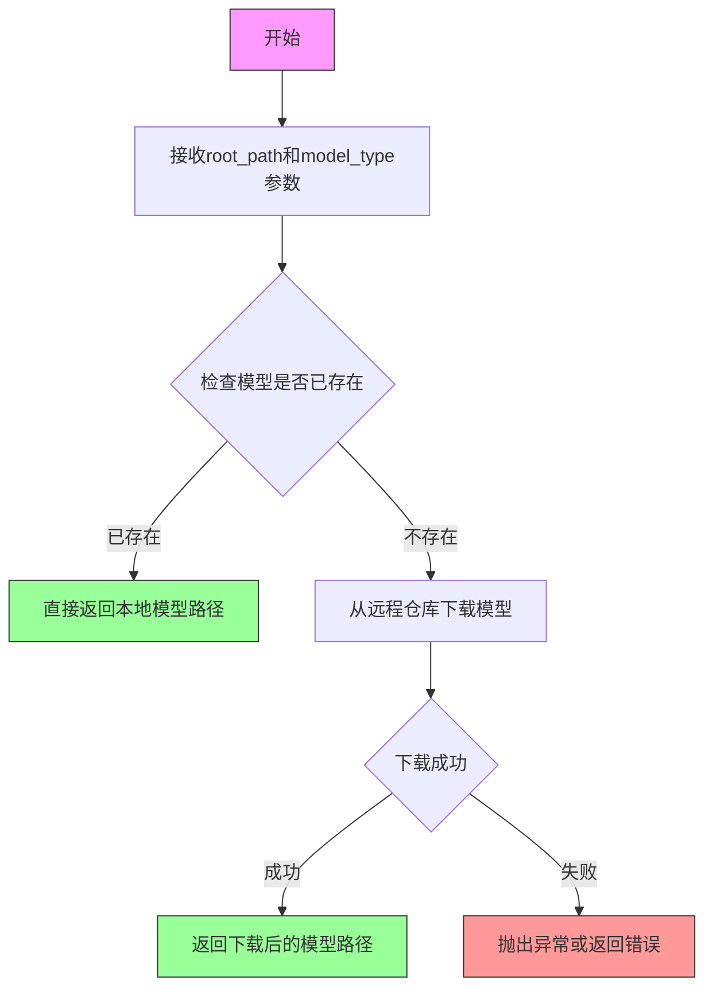

# `MinerU\mineru\model\vlm\lmdeploy_server.py` 详细设计文档

这是一个用于启动lmdeploy推理服务器的脚本，主要功能是解析命令行参数，从环境变量或默认值获取lmdeploy的设备类型和后端配置，自动下载VLM模型，并最终通过os.system调用启动lmdeploy服务器。

## 整体流程



## 类结构

```
无类定义（脚本文件）
└── main() [入口函数]
```

## 全局变量及字段


### `args`
    
存储处理后的命令行参数列表

类型：`List[str]`
    


### `has_port_arg`
    
标记是否显式指定了server-port参数

类型：`bool`
    


### `has_gpu_memory_utilization_arg`
    
标记是否显式指定了cache-max-entry-count参数

类型：`bool`
    


### `has_log_level_arg`
    
标记是否显式指定了log-level参数

类型：`bool`
    


### `device_type`
    
目标计算设备类型（如cuda/ascend/maca/camb）

类型：`str`
    


### `lm_backend`
    
lmdeploy后端类型（如pytorch/turbomind）

类型：`str`
    


### `indices_to_remove`
    
需要从args中移除的参数索引集合

类型：`List[int]`
    


### `model_path`
    
vlm模型的下载路径或本地路径

类型：`str`
    


    

## 全局函数及方法


### `main`

该函数作为入口点，解析命令行参数，配置 lmdeploy 服务器的设备类型和后端，获取模型路径，并启动 lmdeploy 服务。

参数：
-  `args`：`list`，命令行参数列表（通过 `sys.argv[1:]` 获取）

返回值：`None`，无返回值（通过 `os.system` 启动外部进程）

#### 流程图

```mermaid
graph TD
A([开始]) --> B[获取命令行参数 args = sys.argv[1:]]
B --> C[初始化标志位和变量]
C --> D[遍历 args 查找特定参数并记录索引]
D --> E{找到参数}
E -->|是| F[记录索引和值]
E -->|否| G[继续遍历]
F --> G
G --> H{遍历完成?}
H -->|否| D
H -->|是| I[从后往前删除特定参数]
I --> J{检查标志}
J -->|has_port_arg=False| K[添加 --server-port 30000]
J -->|has_gpu_memory_utilization_arg=False| L[添加 --cache-max-entry-count 0.5]
J -->|has_log_level_arg=False| M[添加 --log-level ERROR]
K --> N[从环境变量获取 device_type 或默认值]
L --> N
M --> N
N --> O{验证 device_type 合法性}
O -->|非法| P[抛出 ValueError]
O -->|合法| Q[从环境变量或函数获取 lm_backend]
Q --> R{验证 lm_backend 合法性}
R -->|非法| S[抛出 ValueError]
R -->|合法| T[设置 TOKENIZERS_PARALLELISM（如果需要）]
T --> U[添加 --device 和 --backend 参数]
U --> V[获取模型路径]
V --> W[重构 sys.argv]
W --> X[设置 OMP_NUM_THREADS（如果需要）]
X --> Y[打印启动信息]
Y --> Z[启动 lmdeploy 服务器]
Z --> AA([结束])
```

#### 带注释源码

```python
def main():
    """
    主函数，用于启动 lmdeploy 服务器。
    解析命令行参数，配置设备和后端，获取模型路径，并启动服务。
    """
    # 获取命令行参数（不包括脚本名称）
    args = sys.argv[1:]

    # 初始化标志位，用于检查是否在参数中明确指定了相关选项
    has_port_arg = False
    has_gpu_memory_utilization_arg = False
    has_log_level_arg = False
    device_type = ""  # 设备类型（如 cuda, ascend 等）
    lm_backend = ""   # lmdeploy 后端（如 pytorch, turbomind）

    # 用于存储需要删除的参数索引，避免在遍历时修改列表导致索引错位
    indices_to_remove = []

    # 遍历所有命令行参数，检查特定选项
    for i, arg in enumerate(args):
        # 检查 --server-port 参数
        if arg == "--server-port" or arg.startswith("--server-port="):
            has_port_arg = True
        # 检查 --cache-max-entry-count 参数（用于 GPU 内存利用率的配置）
        if arg == "--cache-max-entry-count" or arg.startswith("--cache-max-entry-count="):
            has_gpu_memory_utilization_arg = True
        # 检查 --log-level 参数
        if arg == "--log-level" or arg.startswith("--log-level="):
            has_log_level_arg = True
        # 检查 --backend 或 --lmdeploy-backend 参数
        if arg == "--backend" or arg == "--lmdeploy-backend":
            if i + 1 < len(args):
                lm_backend = args[i + 1]
                indices_to_remove.extend([i, i + 1])
        elif arg.startswith("--backend=") or arg.startswith("--lmdeploy-backend="):
            lm_backend = arg.split("=", 1)[1]
            indices_to_remove.append(i)
        # 检查 --device 或 --lmdeploy-device 参数
        if arg == "--device" or arg == "--lmdeploy-device":
            if i + 1 < len(args):
                device_type = args[i + 1]
                indices_to_remove.extend([i, i + 1])
        elif arg.startswith("--device=") or arg.startswith("--lmdeploy-device="):
            device_type = arg.split("=", 1)[1]
            indices_to_remove.append(i)

    # 从后往前删除参数，避免索引错位
    for i in sorted(set(indices_to_remove), reverse=True):
        args.pop(i)

    # 如果参数中未指定 port，则添加默认端口
    if not has_port_arg:
        args.extend(["--server-port", "30000"])
    # 如果参数中未指定 GPU 内存利用率，则添加默认值
    if not has_gpu_memory_utilization_arg:
        args.extend(["--cache-max-entry-count", "0.5"])
    # 如果参数中未指定日志级别，则添加默认级别
    if not has_log_level_arg:
        args.extend(["--log-level", "ERROR"])

    # 从环境变量获取 device_type，如果环境变量未设置则使用默认值
    device_type = os.getenv("MINERU_LMDEPLOY_DEVICE", device_type)
    if device_type == "":
        device_type = "cuda"  # 默认使用 CUDA 设备
    elif device_type not in ["cuda", "ascend", "maca", "camb"]:
        raise ValueError(f"Unsupported lmdeploy device type: {device_type}")
    
    # 从环境变量获取 lm_backend，如果环境变量未设置则调用函数获取
    lm_backend = os.getenv("MINERU_LMDEPLOY_BACKEND", lm_backend)
    if lm_backend == "":
        lm_backend = set_lmdeploy_backend(device_type)
    elif lm_backend not in ["pytorch", "turbomind"]:
        raise ValueError(f"Unsupported lmdeploy backend: {lm_backend}")
    
    # 记录设备类型和后端信息
    logger.info(f"lmdeploy device is: {device_type}, lmdeploy backend is: {lm_backend}")

    # 如果使用 PyTorch 后端，则设置 TOKENIZERS_PARALLELISM 为 false 以避免死锁
    if lm_backend == "pytorch":
        os.environ["TOKENIZERS_PARALLELISM"] = "false"

    # 将 device 和 backend 参数添加到命令行参数列表
    args.extend(["--device", device_type])
    args.extend(["--backend", lm_backend])

    # 获取模型根路径
    model_path = auto_download_and_get_model_root_path("/", "vlm")

    # 重构 sys.argv，将模型路径作为位置参数插入
    sys.argv = [sys.argv[0]] + ["serve", "api_server", model_path] + args

    # 如果未设置 OMP_NUM_THREADS 环境变量，则设置为 1
    if os.getenv('OMP_NUM_THREADS') is None:
        os.environ["OMP_NUM_THREADS"] = "1"

    # 打印启动信息
    print(f"start lmdeploy server: {sys.argv}")

    # 使用 os.system 启动 lmdeploy 服务器
    os.system("lmdeploy " + " ".join(sys.argv[1:]))
```


### `set_lmdeploy_backend`

根据代码导入和使用方式推断的函数信息。该函数定义在 `mineru.backend.vlm.utils` 模块中，用于根据设备类型设置合适的 LMDeploy 后端。

参数：

- `device_type`：`str`，设备类型，可选值为 "cuda", "ascend", "maca", "camb" 等

返回值：`str`，LMDeploy 后端类型，返回 "pytorch" 或 "turbomind" 等后端名称

#### 流程图



#### 带注释源码

```python
# 注意：此函数定义在 mineru.backend.vlm.utils 模块中
# 以下是基于代码调用方式的推断实现

def set_lmdeploy_backend(device_type: str) -> str:
    """
    根据设备类型设置合适的 LMDeploy 后端
    
    参数:
        device_type: 设备类型字符串，如 "cuda", "ascend", "maca", "camb"
    
    返回:
        LMDeploy 后端字符串，"pytorch" 或 "turbomind"
    """
    # 根据设备类型选择后端
    # cuda 设备通常使用 turbomind 后端以获得更好性能
    # 其他设备（如 ascend, maca, camb）使用 pytorch 后端
    if device_type == "cuda":
        return "turbomind"
    else:
        return "pytorch"
```

#### 备注

- 该函数的具体定义位于 `mineru.backend.vlm.utils` 模块中，代码中仅导入了该函数并进行了调用
- 从调用逻辑来看，当 `device_type` 为 "cuda" 时，返回 "turbomind" 后端；其他设备类型返回 "pytorch" 后端
- 这是代码中的使用方式：
  ```python
  lm_backend = os.getenv("MINERU_LMDEPLOY_BACKEND", lm_backend)
  if lm_backend == "":
      lm_backend = set_lmdeploy_backend(device_type)
  ```


### `auto_download_and_get_model_root_path`

该函数是模型下载工具函数，用于根据指定的模型类型自动下载并获取模型的根目录路径。在提供的代码中，通过传入根路径"/"和模型类型"vlm"来获取VLM模型的存储路径。

参数：

-  `root_path`：`str`，根路径参数，指定模型下载的基础目录
-  `model_type`：`str`，模型类型参数，指定要下载的模型类型（如"vlm"表示视觉语言模型）

返回值：`str`，返回下载后或已存在的模型根目录的绝对路径

#### 流程图



#### 带注释源码

由于该函数定义在外部模块 `mineru.utils.models_download_utils` 中，源代码未在当前代码文件中展示。以下为基于函数调用的推断源码结构：

```
# mineru/utils/models_download_utils.py

def auto_download_and_get_model_root_path(root_path: str, model_type: str) -> str:
    """
    自动下载并获取模型根目录路径
    
    参数:
        root_path: 根路径，指定模型存放的基础目录
        model_type: 模型类型，如"vlm"代表视觉语言模型
    
    返回:
        模型的根目录绝对路径
    """
    # 1. 根据model_type确定要下载的模型名称和版本
    model_name = get_model_name(model_type)
    
    # 2. 拼接完整的模型存储路径
    model_full_path = os.path.join(root_path, model_name)
    
    # 3. 检查本地是否已存在模型
    if os.path.exists(model_full_path):
        logger.info(f"Model already exists at: {model_full_path}")
        return model_full_path
    
    # 4. 如果不存在，则从远程仓库下载模型
    logger.info(f"Downloading model: {model_name}")
    download_model_from_hub(model_name, root_path)
    
    # 5. 返回下载后的模型路径
    return model_full_path
```

#### 备注

该函数的具体实现需要查看 `mineru.utils.models_download_utils` 模块的源代码。上述源码为基于函数调用方式和函数名的合理推断。实际实现可能包含更多的错误处理、模型版本管理、进度显示等功能。


## 关键组件


### 参数解析与处理

负责解析命令行参数，检测并移除特定的lmdeploy相关参数（如--backend、--device等），为后续添加默认值和启动服务器做准备。

### 环境变量配置管理

通过os.getenv读取MINERU_LMDEPLOY_DEVICE和MINERU_LMDEPLOY_BACKEND环境变量，实现配置的可覆盖性，支持用户自定义设备类型和后端。

### 默认参数设置

当用户未指定时，自动添加默认参数：服务器端口30000、缓存最大条目数0.5、日志级别ERROR。

### 设备与后端验证

对device_type和lm_backend进行合法性校验，确保仅支持cuda/ascend/maca/camb设备和pytorch/turbomind后端。

### 模型路径获取

调用auto_download_and_get_model_root_path自动下载并获取VLM模型根路径。

### Lmdeploy服务器启动

使用os.system调用lmdeploy CLI命令启动API服务器，传入模型路径和所有配置参数。


## 问题及建议


### 已知问题

- **使用 os.system 而非 subprocess**：代码使用 `os.system("lmdeploy " + " ".join(sys.argv[1:]))` 启动进程，无法获取进程返回码、无法有效处理子进程的标准输入输出流，且存在潜在的命令注入风险。
- **参数解析逻辑重复**：检查 `--server-port`、`--cache-max-entry-count`、`--log-level`、`--backend`、`--device` 等参数的逻辑存在大量重复模式，代码冗余且难以维护。
- **缺乏错误处理**：未对 `auto_download_and_get_model_root_path` 的返回值进行空值检查，也未对 `os.system` 的执行结果进行错误检查和异常捕获。
- **日志输出不一致**：代码混合使用 `logger.info`/`logger.debug` 和 `print` 两种方式输出日志，应统一使用日志框架。
- **环境变量与命令行参数优先级不明确**：环境变量会覆盖命令行参数，但这一行为未在代码注释中说明，可能导致用户困惑。
- **缺少类型注解和文档注释**：整个文件没有函数参数和返回值的类型注解，也没有 docstring 文档。

### 优化建议

- **替换 os.system 为 subprocess**：使用 `subprocess.run()` 或 `subprocess.Popen()` 替代，可获得进程退出码、更好地控制进程、避免 shell 注入风险。
- **抽取参数解析函数**：将重复的参数检查逻辑抽取为通用函数，如 `check_arg_exists(args, arg_name)`，减少代码冗余。
- **添加错误处理**：使用 try-except 包装关键操作，对 `auto_download_and_get_model_root_path` 返回值进行校验，对 `os.system` 返回值进行检查。
- **统一日志输出**：移除 `print` 语句，统一使用 `logger` 进行日志记录。
- **增加类型注解**：为函数参数、返回值添加类型注解，提升代码可读性和 IDE 支持。
- **添加文档注释**：为 main 函数和关键逻辑添加 docstring，说明函数功能、参数和返回值。
- **考虑配置管理**：将默认值（如端口号、内存利用率）抽取为配置文件或常量，避免硬编码。

## 其它


### 设计目标与约束

该脚本的设计目标是在Minerva项目中启动lmdeploy VLM（视觉语言模型）服务器。主要约束包括：支持多种设备类型（cuda、ascend、maca、camb）、支持两种后端（pytorch、turbomind）、通过环境变量灵活配置、确保模型自动下载、提供默认参数以简化启动流程。

### 错误处理与异常设计

代码中存在两个主要的异常抛出点：1) 设备类型不支持时抛出ValueError；2) 后端类型不支持时抛出ValueError。脚本通过检查环境变量和参数来设置默认值，但如果auto_download_and_get_model_root_path函数失败或lmdeploy命令执行失败，错误会直接向上传播。建议增加更完善的异常捕获和处理机制。

### 数据流与状态机

数据流如下：1) 解析sys.argv获取原始参数；2) 提取并移除--backend/--device相关参数；3) 从环境变量读取配置；4) 验证设备类型和后端类型；5) 设置环境变量TOKENIZERS_PARALLELISM（当使用pytorch后端时）；6) 调用auto_download_and_get_model_root_path获取模型路径；7) 重组sys.argv并使用os.system启动lmdeploy服务。没有复杂的状态机，主要是配置解析和传递的过程。

### 外部依赖与接口契约

主要外部依赖包括：1) loguru日志库；2) mineru.backend.vlm.utils.set_lmdeploy_backend函数；3) mineru.utils.models_download_utils.auto_download_and_get_model_root_path函数；4) lmdeploy命令行工具；5) 环境变量MINERU_LMDEPLOY_DEVICE、MINERU_LMDEPLOY_BACKEND、OMP_NUM_THREADS。接口契约方面，脚本接收标准命令行参数，输出为启动lmdeploy服务器的操作系统命令。

### 配置管理

配置通过三种方式优先级从高到低获取：1) 命令行参数；2) 环境变量（MINERU_LMDEPLOY_DEVICE、MINERU_LMDEPLOY_BACKEND）；3) 代码中的默认值（设备默认为cuda，后端通过set_lmdeploy_backend自动推断）。服务器端口默认30000，缓存相关参数默认0.5，日志级别默认ERROR，OMP_NUM_THREADS默认为1。

### 安全性考虑

代码存在一些潜在安全隐患：1) 使用os.system执行命令存在命令注入风险，虽然参数经过一定处理但仍需谨慎；2) 环境变量未做严格校验；3) 模型路径自动下载未验证安全性。建议在后续版本中改用subprocess.run并采用列表形式传参以提高安全性。

### 性能考虑

性能相关配置包括：1) 使用pytorch后端时设置TOKENIZERS_PARALLELISM为false以避免多线程竞争；2) 设置OMP_NUM_THREADS为1限制OpenMP线程数。这些配置有助于在多模型部署场景下控制资源使用，但当前实现较为简单，可能需要根据实际硬件情况调整。

### 兼容性考虑

代码需要Python 3.x环境，需确保loguru、mineru等依赖包版本兼容。lmdeploy命令行工具需预先安装并配置在系统PATH中。设备类型支持与lmdeploy版本相关，不同版本的lmdeploy可能支持不同的设备类型。

### 部署注意事项

部署时需注意：1) 确保lmdeploy已正确安装；2) 模型会自动下载到指定目录；3) 端口30000需确保未被占用；4) 设备类型需与实际硬件匹配；5) 环境变量可在部署时灵活设置以覆盖默认值。建议使用supervisor或systemd管理该服务进程。

    