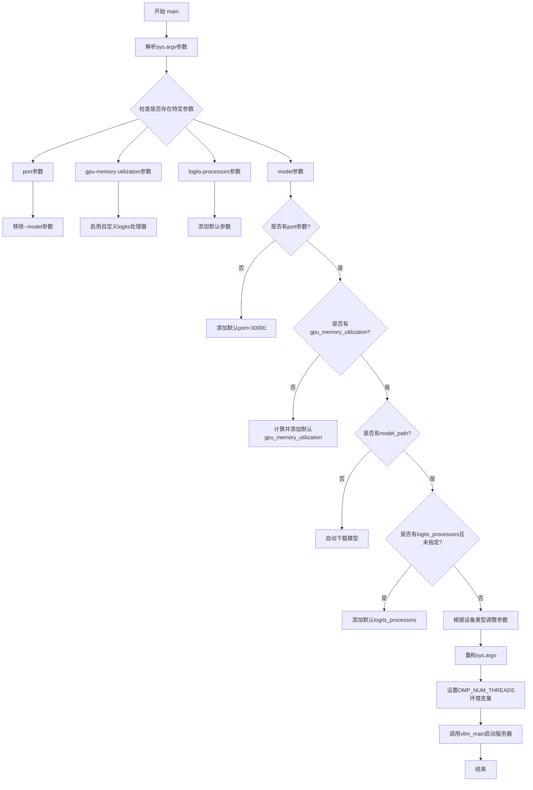
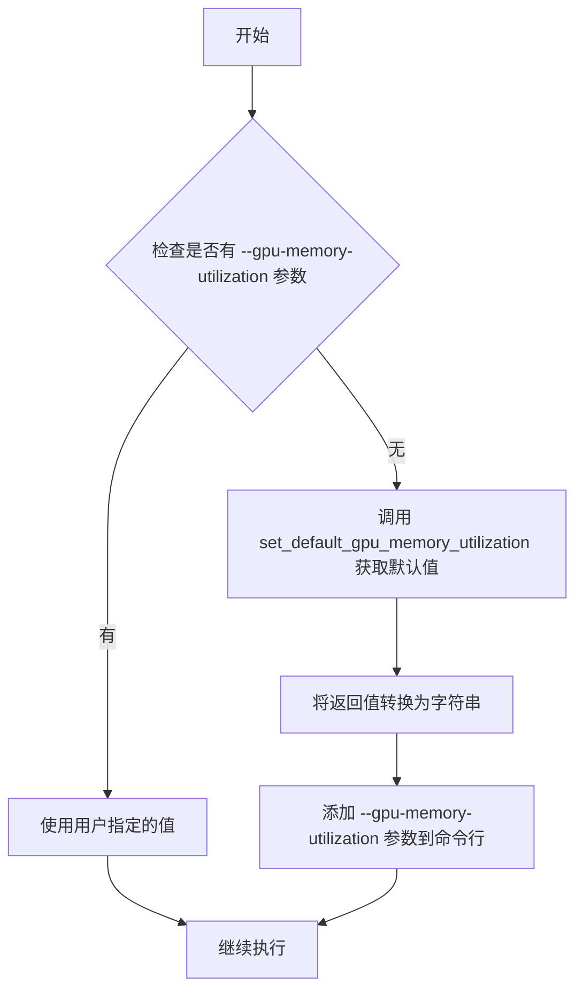
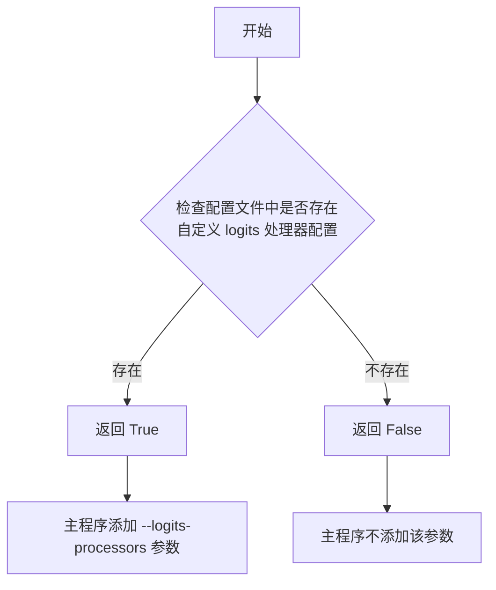
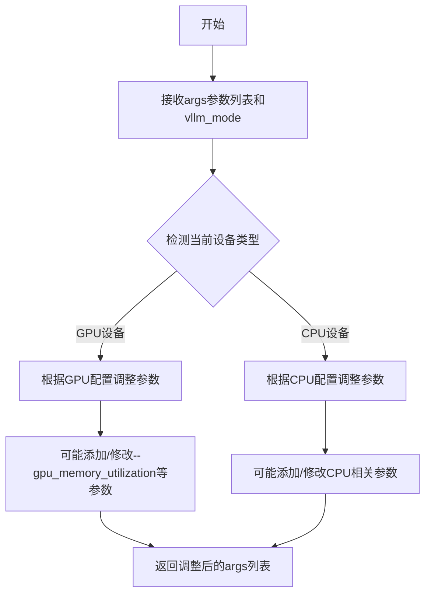
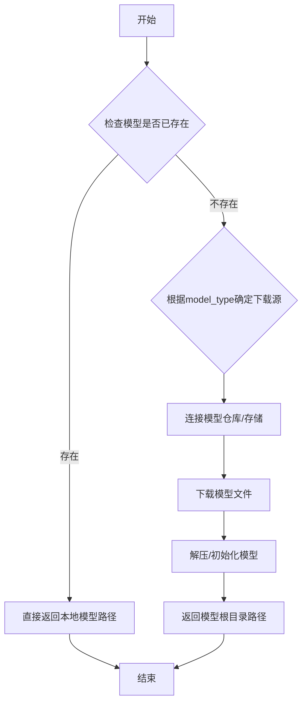

# `MinerU\mineru\model\vlm\vllm_server.py` 详细设计文档

这是一个vLLM服务器启动脚本，用于部署视觉语言模型(VLM)。该脚本自动处理命令行参数，设置默认的GPU内存利用率、端口和logits处理器，并支持自动下载模型，最终启动vLLM服务器。

## 整体流程



## 类结构

```
无类定义（脚本级代码）
└── main() 函数（主入口点）
```

## 全局变量及字段


### `args`
    
命令行参数列表，从sys.argv[1:]获取

类型：`list[str]`
    


### `has_port_arg`
    
标志位，表示是否显式指定了port参数

类型：`bool`
    


### `has_gpu_memory_utilization_arg`
    
标志位，表示是否显式指定了gpu-memory-utilization参数

类型：`bool`
    


### `has_logits_processors_arg`
    
标志位，表示是否显式指定了logits-processors参数

类型：`bool`
    


### `model_path`
    
模型路径，可能为None或从参数/自动下载获取

类型：`str | None`
    


### `model_arg_indices`
    
model参数在args中的索引位置列表

类型：`list[int]`
    


### `custom_logits_processors`
    
自定义logits处理器对象，由enable_custom_logits_processors()返回

类型：`object | bool`
    


### `gpu_memory_utilization`
    
GPU内存利用率字符串，由set_default_gpu_memory_utilization()返回并转为字符串

类型：`str`
    


    

## 全局函数及方法


### `main()`

描述：主函数，负责解析命令行参数、设置默认配置（如GPU内存利用率、自定义logits处理器、模型路径等），并启动vLLM服务器。

参数：

- 无显式参数（通过 `sys.argv` 隐式接收命令行参数）

返回值：`None`，无返回值，仅执行启动vLLM服务器的副作用

#### 流程图

```mermaid
flowchart TD
    A[开始 main] --> B[获取 sys.argv[1:] 参数列表]
    B --> C[初始化标志变量和model_path]
    C --> D{遍历参数列表}
    D -->|检测到 --port| E[设置 has_port_arg = True]
    D -->|检测到 --gpu-memory-utilization| F[设置 has_gpu_memory_utilization_arg = True]
    D -->|检测到 --logits-processors| G[设置 has_logits_processors_arg = True]
    D -->|检测到 --model| H[提取 model_path 并记录索引]
    D -->|检测到 --model=| I[提取 model_path 并记录索引]
    D --> J{参数遍历结束?}
    J -->|否| D
    J -->|是| K[移除 --model 参数及其值]
    K --> L[调用 enable_custom_logits_processors 获取自定义处理器]
    L --> M{has_port_arg 为 False?}
    M -->|是| N[添加默认端口 30000]
    M -->|否| O
    N --> O{has_gpu_memory_utilization_arg 为 False?}
    O -->|是| P[调用 set_default_gpu_memory_utilization 获取默认值并添加]
    O -->|否| Q{model_path 为空?}
    P --> Q
    Q -->|是| R[调用 auto_download_and_get_model_root_path 自动下载模型]
    Q -->|否| S{has_logits_processors_arg 为 False 且存在自定义处理器?}
    R --> S
    S -->|是| T[添加默认 logits-processors 参数]
    S -->|否| U[调用 mod_kwargs_by_device_type 调整参数]
    T --> U
    U --> V[重构 sys.argv: serve model_path + 原始参数]
    V --> W{OMP_NUM_THREADS 环境变量未设置?}
    W -->|是| X[设置 OMP_NUM_THREADS = 1]
    W -->|否| Y[打印启动信息]
    X --> Y
    Y --> Z[调用 vllm_main 启动 vLLM 服务器]
    Z --> AA[结束]
```

#### 带注释源码

```python
def main():
    """
    主函数，负责参数处理和vLLM服务器启动
    """
    # 获取命令行参数（排除脚本名称）
    args = sys.argv[1:]

    # 初始化标志变量，用于检测是否用户已指定相关参数
    has_port_arg = False                          # 是否显式指定了 --port
    has_gpu_memory_utilization_arg = False       # 是否显式指定了 --gpu-memory-utilization
    has_logits_processors_arg = False            # 是否显式指定了 --logits-processors
    model_path = None                            # 模型路径
    model_arg_indices = []                       # --model 参数的索引列表

    # 遍历所有参数，检测用户指定的配置
    for i, arg in enumerate(args):
        # 检测端口参数
        if arg == "--port" or arg.startswith("--port="):
            has_port_arg = True
        # 检测GPU内存利用率参数
        if arg == "--gpu-memory-utilization" or arg.startswith("--gpu-memory-utilization="):
            has_gpu_memory_utilization_arg = True
        # 检测logits处理器参数
        if arg == "--logits-processors" or arg.startswith("--logits-processors="):
            has_logits_processors_arg = True
        # 检测模型路径参数（两种格式：--model <path> 或 --model=<path>）
        if arg == "--model":
            if i + 1 < len(args):
                model_path = args[i + 1]
                model_arg_indices.extend([i, i + 1])  # 记录--model和值的索引
        elif arg.startswith("--model="):
            model_path = arg.split("=", 1)[1]
            model_arg_indices.append(i)

    # 从参数列表中移除 --model 参数及其值（因为后续要作为位置参数）
    if model_arg_indices:
        for index in sorted(model_arg_indices, reverse=True):
            args.pop(index)

    # 启用自定义logits处理器，获取处理器对象（可能为None）
    custom_logits_processors = enable_custom_logits_processors()

    # 添加默认参数（仅当用户未指定时）
    # 1. 默认端口 30000
    if not has_port_arg:
        args.extend(["--port", "30000"])
    # 2. 默认GPU内存利用率
    if not has_gpu_memory_utilization_arg:
        gpu_memory_utilization = str(set_default_gpu_memory_utilization())
        args.extend(["--gpu-memory-utilization", gpu_memory_utilization])
    # 3. 默认模型路径（自动下载）
    if not model_path:
        model_path = auto_download_and_get_model_root_path("/", "vlm")
    # 4. 默认logits处理器
    if (not has_logits_processors_arg) and custom_logits_processors:
        args.extend(["--logits-processors", "mineru_vl_utils:MinerULogitsProcessor"])

    # 根据设备类型调整参数（如CPU/GPU模式差异）
    args = mod_kwargs_by_device_type(args, vllm_mode="server")

    # 重构参数，将模型路径作为位置参数放在serve命令之后
    # 格式: python script serve <model_path> [options...]
    sys.argv = [sys.argv[0]] + ["serve", model_path] + args

    # 设置OpenMP线程数为1（避免多线程竞争，提升稳定性）
    if os.getenv('OMP_NUM_THREADS') is None:
        os.environ["OMP_NUM_THREADS"] = "1"

    # 打印启动命令信息
    print(f"start vllm server: {sys.argv}")
    # 调用vLLM的入口函数启动服务器
    vllm_main()
```


### `set_default_gpu_memory_utilization`

获取默认GPU内存利用率。当用户未在命令行指定 `--gpu-memory-utilization` 参数时，调用此函数获取默认值并添加到启动参数中。

**注意**：该函数定义在 `mineru.backend.vlm.utils` 模块中，但当前提供的代码片段仅展示了其调用方式，未包含具体实现。以下信息基于代码调用推断。

参数：

- （无参数）

返回值：`float` 或 `int`，返回默认的GPU内存利用率数值（通常为 0.0 到 1.0 之间的浮点数，表示占用比例）

#### 流程图



#### 带注释源码

```python
# 从 mineru.backend.vlm.utils 模块导入（具体实现未在当前代码片段中显示）
from mineru.backend.vlm.utils import set_default_gpu_memory_utilization

# 在 main() 函数中的调用方式：
if not has_gpu_memory_utilization_arg:
    # 调用函数获取默认GPU内存利用率（无参数）
    gpu_memory_utilization = str(set_default_gpu_memory_utilization())
    # 将其作为命令行参数添加
    args.extend(["--gpu-memory-utilization", gpu_memory_utilization])
```

> **说明**：由于源代码片段仅包含调用方代码，未展示 `set_default_gpu_memory_utilization` 函数的实际实现（可能在该项目的 `mineru/backend/vlm/utils.py` 文件中定义），因此无法提供完整的函数内部逻辑。根据调用方式推测，该函数应返回一个表示 GPU 内存利用率比例的数值（0.0~1.0）。


从提供的代码来看，`enable_custom_logits_processors()` 是从 `mineru.backend.vlm.utils` 模块导入的，但**该函数的实现源码并未在当前代码片段中提供**。以下是基于调用上下文进行的分析：

---

### `enable_custom_logits_processors`

该函数用于检测项目是否配置了自定义的 logits 处理器。如果已配置则返回 `True`，主程序据此决定是否向 vLLM 服务传递 `--logits-processors` 参数。

参数：**无**

返回值：`bool`，返回是否启用了自定义 logits 处理器（`True` 表示启用，`False` 表示未启用）

#### 流程图



#### 带注释源码

```python
# 注意：此为基于调用上下文的推断实现，实际实现需查看 mineru.backend.vlm.utils 模块源码
def enable_custom_logits_processors():
    """
    检查是否配置了自定义 logits 处理器。
    
    通常实现逻辑为：
    1. 读取配置文件（如 .json, .yaml 或环境变量）
    2. 检查是否存在 logits_processor 相关的自定义配置
    3. 返回布尔值
    """
    # 推测实现：检查环境变量或配置文件
    # 例如：检查 MINERU_CUSTOM_LOGITS_PROCESSORS 环境变量
    # 或者读取某个配置文件判断是否有自定义处理器
    
    # 从上下文看：返回 True 时会添加 "mineru_vl_utils:MinerULogitsProcessor"
    return True  # 或 False，取决于实际配置检测结果
```

---

## 补充说明

由于 `enable_custom_logits_processors` 的实现源码不在当前代码片段中，上述分析基于以下调用上下文推断：

1. **调用方式**：`custom_logits_processors = enable_custom_logits_processors()`
2. **返回值使用**：`if (not has_logits_processors_arg) and custom_logits_processors:`
3. **条件分支**：当返回 `True` 时，程序添加 `--logits-processors mineru_vl_utils:MinerULogitsProcessor` 参数

如需获取该函数的完整实现，建议查看 `mineru/backend/vlm/utils.py` 源文件。


### `mod_kwargs_by_device_type`

根据设备类型调整命令行参数列表，用于适配不同硬件环境的vLLM启动配置。

参数：

- `args`：`List[str]`，命令行参数列表，包含vLLM的各种启动参数
- `vllm_mode`：`str`，可选关键字参数，vLLM运行模式，默认为"server"

返回值：`List[str]`，调整后的命令行参数列表

#### 流程图



#### 带注释源码

由于`mod_kwargs_by_device_type`函数定义在`mineru.backend.vlm.utils`模块中，题目提供的代码仅包含其调用点。以下为基于函数签名的推断：

```
# 推断的函数签名和实现逻辑
def mod_kwargs_by_device_type(args: List[str], vllm_mode: str = "server") -> List[str]:
    """
    根据设备类型调整vLLM启动参数
    
    参数:
        args: 命令行参数列表
        vllm_mode: vLLM运行模式（如"server"）
    
    返回:
        调整后的参数列表
    """
    # 1. 检测当前设备类型（GPU/CPU）
    # 2. 根据设备类型调整参数
    #    - GPU: 可能调整GPU内存利用率、Tensor并行等参数
    #    - CPU: 可能禁用GPU相关参数
    # 3. 返回修改后的参数列表
    
    return modified_args
```

#### 在main()中的调用上下文

```python
# 第57行 - 在main()函数中调用
args = mod_kwargs_by_device_type(args, vllm_mode="server")

# 调用时机:
# 1. 解析完所有命令行参数后
# 2. 设置完默认参数（端口、GPU内存利用率）后
# 3. 在重构sys.argv参数之前
# 4. 功能: 根据实际硬件设备类型进一步调整vLLM启动参数
```


### `auto_download_and_get_model_root_path`

自动下载模型（如果未存在）并返回模型根目录的路径。

参数：

- `model_path_or_prefix`：`str`，模型路径或前缀，用于指定下载目标路径或模型标识前缀
- `model_type`：`str`，模型类型（如 "vlm"），用于确定要下载的模型种类

返回值：`str`，返回模型的根目录路径。

#### 流程图



#### 带注释源码

```python
# 该函数定义在 mineru.utils.models_download_utils 模块中
# 以下为根据函数调用和上下文推断的函数签名和逻辑

def auto_download_and_get_model_root_path(model_path_or_prefix: str, model_type: str) -> str:
    """
    自动下载并获取模型根路径
    
    参数:
        model_path_or_prefix: str - 模型路径或前缀，用于指定下载位置或模型标识
        model_type: str - 模型类型，如 "vlm" 用于视觉语言模型
    
    返回:
        str - 模型根目录的绝对路径
    """
    
    # 1. 检查本地是否已存在模型
    #    如果 model_path_or_prefix 是有效路径且模型已下载，直接返回
    
    # 2. 如果模型不存在，根据 model_type 确定下载源
    #    - 可能从 HuggingFace、ModelScope 或其他模型仓库下载
    
    # 3. 执行模型下载
    #    - 下载必要的模型文件（权重、配置、tokenizer等）
    #    - 可能包括大文件处理和进度显示
    
    # 4. 返回模型根目录的绝对路径
    
    # 示例逻辑（基于代码中的调用）:
    # if model_type == "vlm":
    #     # 下载 VLM 相关模型
    #     model_root = _download_vlm_model(model_path_or_prefix)
    # return model_root
```

> **注意**：由于源代码中仅提供了该函数的导入和调用，未包含函数的具体实现，以上源码为根据函数名称、调用方式和常见模型下载工具模式推断的理想化实现。实际的实现细节可能包含更多的错误处理、缓存机制和特定的模型仓库逻辑。


### `main`

该函数是 mineru_backend 的主入口点，负责解析命令行参数、配置默认设置（如端口、GPU内存利用率、模型路径）、处理自定义 logits 处理器，并根据设备类型调整参数，最后调用 vLLM 的 main 函数启动推理服务器。

**注**：该代码文件位于 `mineru_backend` 包中，实际对外暴露的入口函数是模块级定义的 `main()`，它封装了对 `vllm.entrypoints.cli.main` 的调用。

参数：

- 无显式参数（通过 `sys.argv` 隐式获取命令行输入）

返回值：`None`，该函数不返回值，仅执行副作用（启动 vLLM 服务）

#### 流程图

```mermaid
flowchart TD
    A[启动 main 函数] --> B[获取 sys.argv 参数列表]
    B --> C[初始化标志位和变量]
    C --> D{遍历参数列表}
    D -->|port 参数| E[设置 has_port_arg = True]
    D -->|gpu-memory-utilization 参数| F[设置 has_gpu_memory_utilization_arg = True]
    D -->|logits-processors 参数| G[设置 has_logits_processors_arg = True]
    D -->|model 参数| H[提取 model_path 并记录索引]
    D --> I[结束遍历]
    I --> J{存在 model 参数?}
    J -->|是| K[从 args 中移除 --model 参数]
    J -->|否| L[继续]
    K --> L
    L --> M[调用 enable_custom_logits_processors 获取自定义处理器]
    M --> N{没有 port 参数?}
    N -->|是| O[添加默认 --port 30000]
    N -->|否| P
    O --> P
    P --> Q{没有 gpu-memory-utilization 参数?}
    Q -->|是| R[计算并添加默认 GPU 内存利用率]
    Q -->|否| S
    R --> S
    S --> T{没有 model_path?}
    T -->|是| U[调用 auto_download_and_get_model_root_path 自动下载模型]
    T -->|否| V
    U --> V
    V --> W{没有 logits-processors 且有自定义处理器?}
    W -->|是| X[添加 mineru_vl_utils:MinerULogitsProcessor]
    W -->|否| Y
    X --> Y
    Y --> Z[调用 mod_kwargs_by_device_type 调整参数]
    Z --> AA[重构 sys.argv 为 ['serve', model_path, ...args]]
    AA --> AB{OMP_NUM_THREADS 未设置?}
    AB -->|是| AC[设置 OMP_NUM_THREADS=1]
    AB -->|否| AD
    AC --> AD
    AD --> AE[打印启动信息]
    AE --> AF[调用 vllm_main 启动 vLLM 服务器]
```

#### 带注释源码

```python
import os
import sys

# 导入 vLM 工具函数：设置默认 GPU 内存利用率、启用自定义 logits 处理器、按设备类型修改参数
from mineru.backend.vlm.utils import set_default_gpu_memory_utilization, enable_custom_logits_processors, \
    mod_kwargs_by_device_type
# 导入模型自动下载工具
from mineru.utils.models_download_utils import auto_download_and_get_model_root_path

# 导入 vLLM CLI 主入口函数
from vllm.entrypoints.cli.main import main as vllm_main


def main():
    """
    mineru_backend 主入口函数。
    解析命令行参数，配置默认参数，并启动 vLLM 服务器。
    """
    # 获取命令行参数（排除脚本名称）
    args = sys.argv[1:]

    # 标志位：标记是否在参数中显式指定了相关配置
    has_port_arg = False                     # 是否显式指定了 --port
    has_gpu_memory_utilization_arg = False   # 是否显式指定了 --gpu-memory-utilization
    has_logits_processors_arg = False        # 是否显式指定了 --logits-processors
    model_path = None                         # 模型路径
    model_arg_indices = []                    # --model 参数及其值的索引位置

    # ----------------------------------------
    # 步骤 1：检查现有参数
    # 遍历所有命令行参数，检测是否包含需要特殊处理的选项
    # ----------------------------------------
    for i, arg in enumerate(args):
        # 检测 --port 参数（支持 --port=8000 和 --port 8000 两种形式）
        if arg == "--port" or arg.startswith("--port="):
            has_port_arg = True
        # 检测 --gpu-memory-utilization 参数
        if arg == "--gpu-memory-utilization" or arg.startswith("--gpu-memory-utilization="):
            has_gpu_memory_utilization_arg = True
        # 检测 --logits-processors 参数
        if arg == "--logits-processors" or arg.startswith("--logits-processors="):
            has_logits_processors_arg = True
        # 检测 --model 参数（支持 --model /path/to/model 和 --model=/path/to/model）
        if arg == "--model":
            if i + 1 < len(args):
                model_path = args[i + 1]  # 获取模型路径值
                model_arg_indices.extend([i, i + 1])  # 记录索引以便后续删除
        elif arg.startswith("--model="):
            # 处理 --model=/path/to/model 形式
            model_path = arg.split("=", 1)[1]
            model_arg_indices.append(i)

    # ----------------------------------------
    # 步骤 2：从参数列表中移除 --model 参数
    # 需要将 model_path 作为位置参数传递给 vLLM，因此移除 --model 标志
    # ----------------------------------------
    if model_arg_indices:
        for index in sorted(model_arg_indices, reverse=True):
            args.pop(index)

    # ----------------------------------------
    # 步骤 3：启用自定义 logits 处理器
    # ----------------------------------------
    custom_logits_processors = enable_custom_logits_processors()

    # ----------------------------------------
    # 步骤 4：添加默认参数
    # 如果用户未显式指定，则使用默认值
    # ----------------------------------------
    
    # 默认端口 30000
    if not has_port_arg:
        args.extend(["--port", "30000"])
    
    # 默认 GPU 内存利用率（根据设备动态计算）
    if not has_gpu_memory_utilization_arg:
        gpu_memory_utilization = str(set_default_gpu_memory_utilization())
        args.extend(["--gpu-memory-utilization", gpu_memory_utilization])
    
    # 默认模型路径（自动下载）
    if not model_path:
        model_path = auto_download_and_get_model_root_path("/", "vlm")
    
    # 默认 logits 处理器（如果存在自定义处理器且用户未指定）
    if (not has_logits_processors_arg) and custom_logits_processors:
        args.extend(["logits-processors", "mineru_vl_utils:MinerULogitsProcessor"])

    # ----------------------------------------
    # 步骤 5：根据设备类型调整参数
    # 针对不同硬件平台进行参数适配
    # ----------------------------------------
    args = mod_kwargs_by_device_type(args, vllm_mode="server")

    # ----------------------------------------
    # 步骤 6：重构参数，将模型路径作为位置参数
    # vLLM CLI 期望格式：python -m vllm serve <model_path> [options]
    # ----------------------------------------
    sys.argv = [sys.argv[0]] + ["serve", model_path] + args

    # ----------------------------------------
    # 步骤 7：设置 OpenMP 线程数
    # 避免多线程竞争，提升推理性能
    # ----------------------------------------
    if os.getenv('OMP_NUM_THREADS') is None:
        os.environ["OMP_NUM_THREADS"] = "1"

    # ----------------------------------------
    # 步骤 8：启动 vLLM 服务器
    # ----------------------------------------
    print(f"start vllm server: {sys.argv}")
    vllm_main()


if __name__ == "__main__":
    main()
```

#### 关键组件信息

| 组件名称 | 一句话描述 |
|---------|-----------|
| `set_default_gpu_memory_utilization` | 根据当前 GPU 设备计算并返回合理的默认内存利用率阈值 |
| `enable_custom_logits_processors` | 加载并启用 mineru 自定义的 logits 处理器扩展 |
| `mod_kwargs_by_device_type` | 根据目标硬件设备类型（如 CUDA, CPU, TPU）调整 vLLM 启动参数 |
| `auto_download_and_get_model_root_path` | 自动从远程仓库下载所需模型并返回本地缓存路径 |
| `vllm_main` | vLLM 官方 CLI 主入口函数，负责初始化推理引擎并启动服务 |

#### 潜在技术债务与优化空间

1. **参数解析方式原始**：使用手动遍历 `sys.argv` 列表进行参数解析，未使用成熟的 CLI 框架（如 argparse、click），导致参数处理逻辑分散且难以维护。建议重构为统一的参数解析层。

2. **硬编码默认值**：端口号 `30000` 和 `OMP_NUM_THREADS=1` 采用硬编码方式，缺乏可配置性。建议抽取为配置文件或环境变量。

3. **模型路径提取逻辑重复**：检测 `--model` 参数的逻辑同时处理了 `--model path` 和 `--model=path` 两种形式，可简化为统一的形式。

4. **缺少错误处理**：参数提取和模型下载过程中缺乏异常捕获机制，可能导致服务启动失败时用户无法获得清晰的错误信息。

5. **日志输出不完善**：仅使用 `print` 输出启动信息，缺少分级日志（DEBUG/INFO/WARNING/ERROR），生产环境可观测性不足。

#### 其他项目

**设计目标与约束：**
- **目标**：封装 vLLM 官方 CLI，提供开箱即用的推理服务启动脚本，同时注入 mineru 特定的配置（自定义 logits 处理器、GPU 内存优化、模型自动下载）。
- **约束**：必须保持与 vLLM 官方 CLI 参数的兼容性，不应破坏 vLLM 原有的参数解析逻辑。

**错误处理与异常设计：**
- 当前实现缺少显式的错误处理，建议在以下位置添加异常捕获：
  - `auto_download_and_get_model_root_path`：模型下载失败时给出友好提示并退出
  - `vllm_main()` 调用：捕获 vLLM 初始化异常，上报用户

**数据流与状态机：**
```
用户输入 → 参数解析 → 默认值填充 → 参数重构 → 环境变量设置 → vLLM 初始化 → HTTP/gRPC 服务就绪
```

**外部依赖与接口契约：**
- 依赖 `vllm.entrypoints.cli.main` 模块，隐式依赖 vLLM 版本兼容性
- 依赖 `mineru.backend.vlm.utils` 和 `mineru.utils.models_download_utils`，需确保这些模块版本与当前脚本匹配


## 关键组件


### 参数检查模块

检查命令行参数中是否包含 --port、--gpu-memory-utilization、--logits-processors 和 --model，并根据参数类型（等号形式或空格形式）进行不同处理。

### 模型路径解析模块

从参数列表中提取模型路径，支持 --model path 和 --model=path 两种格式，并将模型相关参数的索引记录以便后续移除。

### 默认参数设置模块

当参数未在命令行中指定时，自动添加默认值：port 默认 30000，gpu-memory-utilization 调用 set_default_gpu_memory_utilization() 获取，model 调用 auto_download_and_get_model_root_path 自动下载，logits-processors 默认为 mineru_vl_utils:MinerULogitsProcessor。

### 自定义Logits处理器模块

通过 enable_custom_logits_processors() 启用自定义 logits 处理器，仅在用户未指定且启用成功时才添加处理器参数。

### 设备适配模块

调用 mod_kwargs_by_device_type 根据设备类型修改参数列表，适应不同硬件环境下的 vLLM 运行需求。

### 环境变量配置模块

检查并设置 OMP_NUM_THREADS 环境变量，确保在未设置时默认为 1 以优化 CPU 线程使用。

### vLLM服务启动模块

重构 sys.argv 参数，将模型路径作为 serve 命令的位置参数，最终调用 vllm_main() 启动 vLLM 服务器。


## 问题及建议


### 已知问题

- **手动参数解析易出错**：代码使用自定义逻辑解析命令行参数（`if arg == "--port"` 和 `arg.startswith("--port=")`），逻辑重复且容易遗漏边界情况，例如 `--model=` 的解析在值包含等号时会截断
- **参数删除逻辑复杂且脆弱**：通过 `model_arg_indices` 列表追踪参数索引，然后逆序 `pop` 删除，这种方式在参数顺序变化时容易出错
- **函数职责过载**：`main()` 函数同时承担了参数解析、默认值设置、模型路径处理、环境变量配置和服务器启动等多个职责，违反单一职责原则
- **缺少异常处理**：对 `auto_download_and_get_model_root_path`、`set_default_gpu_memory_utilization` 等可能失败的操作没有 try-except 保护
- **硬编码配置值**：端口号 "30000" 直接写在代码中，应抽取为配置常量或从环境变量读取
- **使用 print 而非日志框架**：生产环境应使用 `logging` 模块，便于日志级别管理和输出控制
- **环境变量修改副作用**：`OMP_NUM_THREADS` 设置为 "1" 会影响整个进程，可能对其他组件产生意外影响
- **缺少类型注解**：函数参数、返回值和变量均无类型标注，降低代码可读性和静态分析工具的效用
- **模型路径未验证**：`model_path` 获取后未检查路径是否存在或有效就直接使用
- **参数修改后未校验**：经过 `mod_kwargs_by_device_type` 处理后的参数没有验证合法性

### 优化建议

- 使用 `argparse` 或 `click` 等标准库重构参数解析逻辑，利用其内置的默认值、类型转换和冲突检测功能
- 将 `main()` 拆分为多个单一职责函数：`parse_args()`, `apply_defaults()`, `validate_config()`, `start_server()`
- 将端口号等配置抽取为常量或从环境变量/配置文件读取，使用 `os.getenv('PORT', '30000')` 形式
- 为关键函数调用添加异常处理，特别是网络请求和文件操作相关的函数
- 将 `print` 替换为 `logging.getLogger(__name__).info()`，并配置日志格式和级别
- 添加类型注解（`typing` 模块），如 `def main() -> None:`，提升代码可维护性
- 在使用 `model_path` 前添加存在性检查：`if model_path and not os.path.exists(model_path): raise ValueError(...)`
- 考虑将参数处理结果封装为 dataclass 或 TypedDict，提高代码结构化程度
- 添加参数校验逻辑，确保必要参数（如 model_path）有效后再启动服务
- 考虑将 `OMP_NUM_THREADS` 的设置封装为可选功能，或在文档中明确说明其影响范围

## 其它


### 设计目标与约束

本代码旨在提供一个便捷的vllm服务器启动入口，通过封装默认参数配置和模型自动下载功能，降低部署门槛。主要设计约束包括：1) 保持与vllm原生命令行接口的兼容性；2) 默认使用MinerU自定义的logits处理器；3) 支持GPU内存利用率的自动优化配置；4) 必须在GPU环境下运行。

### 错误处理与异常设计

代码采用防御性编程风格，在遍历参数时进行边界检查（如`i + 1 < len(args)`）。主要异常场景包括：1) 模型路径为空且自动下载失败时可能导致程序异常；2) GPU内存利用率设置可能受限于硬件条件；3) 环境变量设置可能受系统限制。对于关键操作缺乏显式的异常捕获机制，建议在生产环境中增加try-except块处理可能的异常情况。

### 数据流与状态机

程序执行流程如下：1) 解析阶段 - 遍历sys.argv识别现有参数；2) 处理阶段 - 移除--model参数并设置默认值；3) 转换阶段 - 通过mod_kwargs_by_device_type调整参数；4) 启动阶段 - 重构sys.argv并调用vllm_main。状态转换简单线性，无复杂状态机设计。

### 外部依赖与接口契约

核心依赖包括：1) mineru.backend.vlm.utils模块提供的GPU内存设置和logits处理器配置函数；2) mineru.utils.models_download_utils提供的模型自动下载功能；3) vllm.entrypoints.cli.main提供的服务器启动接口。接口契约方面：--port默认30000，--gpu-memory-utilization动态计算，--model支持路径或模型名称，--logits-processors使用mineru_vl_utils:MinerULogitsProcessor。

### 配置管理

配置通过命令行参数和环境变量两种方式管理。命令行参数支持覆盖默认值，环境变量主要涉及OMP_NUM_THREADS。默认配置包括：端口30000、GPU内存利用率自动计算、logits处理器启用。配置优先级为：用户显式指定 > 环境变量默认值 > 代码硬编码默认值。

### 性能考虑

代码在启动时进行参数解析和模型准备，存在以下性能考量：1) OMP_NUM_THREADS默认设置为1以避免多线程竞争；2) 模型路径解析和自动下载可能耗时较长；3) GPU内存利用率动态计算需考虑显存碎片化。建议在首次运行时预先下载模型以减少启动延迟。

### 安全性考虑

代码主要涉及服务器启动，未直接处理用户输入或敏感数据。潜在安全风险包括：1) 模型自动下载来源的可靠性验证；2) 网络请求的安全性；3) GPU资源访问控制。建议在生产环境中对下载的模型进行完整性校验。

### 兼容性考虑

代码设计考虑了多种参数格式兼容性：支持`--port`和`--port=`两种形式；支持`--model`后跟值或`--model=`形式；支持参数覆盖检测。依赖vllm版本兼容性，需确保安装的vllm版本与代码调用的接口匹配。

### 部署注意事项

部署时需注意：1) 确保CUDA环境正确配置；2) 提前下载所需模型或保证网络畅通；3) 检查GPU显存是否满足模型运行需求；4) 端口30000需确保未被占用；5) 建议设置适当的OMP_NUM_THREADS值以优化性能。

    