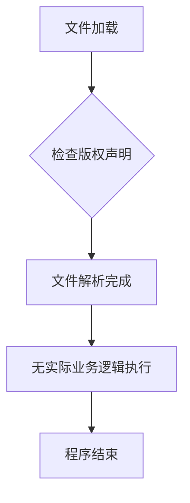

# `MinerU\mineru\utils\__init__.py` 详细设计文档

该文件仅包含Opendatalab项目的版权声明信息，不包含任何实际的功能代码、类定义或函数实现，属于项目文件的标准头部注释。

## 整体流程



## 类结构

```

```

## 全局变量及字段


    

## 全局函数及方法


## 关键组件


### 代码片段分析

提供的代码片段仅包含版权声明（`# Copyright (c) Opendatalab. All rights reserved.`），未包含任何可执行的源代码实现。因此无法从中识别出如"张量索引与惰性加载、反量化支持、量化策略"等关键组件，或进行逻辑分析。

### 文件整体运行流程

由于缺乏源代码，无法描述运行流程。

### 类的详细信息

由于缺乏源代码，无法提供类的详细信息。

### 关键组件信息

由于缺乏源代码，无法提供关键组件信息。

### 潜在的技术债务或优化空间

由于缺乏源代码，无法识别技术债务或优化空间。

### 其它项目

由于缺乏源代码，无法提供设计目标与约束、错误处理与异常设计、数据流与状态机、外部依赖与接口契约等相关信息。


## 问题及建议


### 已知问题

- 该文件仅包含版权声明，缺少实际功能代码，无法进行详细设计分析
- 缺少必要的模块文档字符串（docstring）来说明文件用途
- 缺少必要的导入语句和基础架构代码
- 该文件目前不具有任何实际功能，属于占位符状态

### 优化建议

- 添加完整的模块文档字符串，描述该模块的设计目标和职责
- 根据项目需求实现相应的核心功能代码
- 添加必要的导入语句和依赖配置
- 建立清晰的类结构和方法定义
- 补充完整的类型注解和注释说明
- 遵循项目的代码规范和架构模式进行开发
- 建议在后续迭代中补充完整的单元测试用例
- 考虑添加日志记录和错误处理机制


## 其它


### 设计目标与约束

由于代码仅包含版权声明，未包含任何实际功能实现，无法提取设计目标与约束信息。该部分应待实际代码实现后补充。

### 错误处理与异常设计

由于代码仅包含版权声明，未包含任何实际功能实现，无法提取错误处理与异常设计信息。该部分应待实际代码实现后补充。

### 数据流与状态机

由于代码仅包含版权声明，未包含任何实际功能实现，无法提取数据流与状态机信息。该部分应待实际代码实现后补充。

### 外部依赖与接口契约

由于代码仅包含版权声明，未包含任何实际功能实现，无法提取外部依赖与接口契约信息。该部分应待实际代码实现后补充。

### 性能考虑与资源管理

由于代码仅包含版权声明，未包含任何实际功能实现，无法提取性能考虑与资源管理信息。该部分应待实际代码实现后补充。

### 安全考虑

由于代码仅包含版权声明，未包含任何实际功能实现，无法提取安全考虑信息。该部分应待实际代码实现后补充。

### 版本兼容性

由于代码仅包含版权声明，未包含任何实际功能实现，无法提取版本兼容性信息。该部分应待实际代码实现后补充。

### 测试策略

由于代码仅包含版权声明，未包含任何实际功能实现，无法提取测试策略信息。该部分应待实际代码实现后补充。

### 部署与配置

由于代码仅包含版权声明，未包含任何实际功能实现，无法提取部署与配置信息。该部分应待实际代码实现后补充。


    