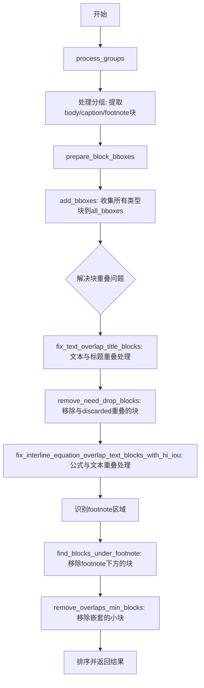
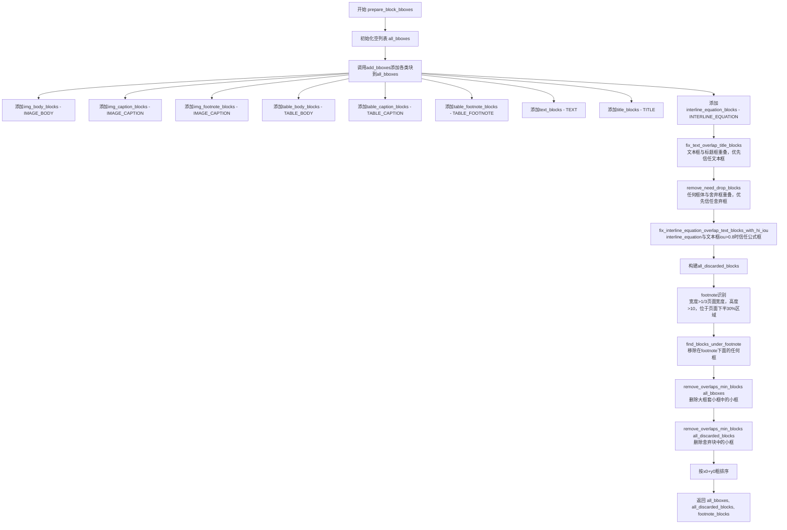
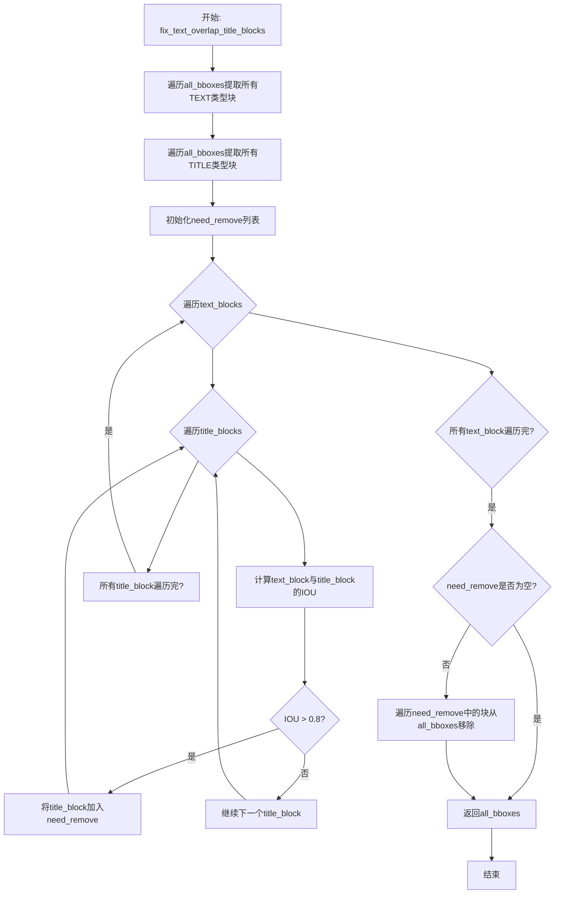
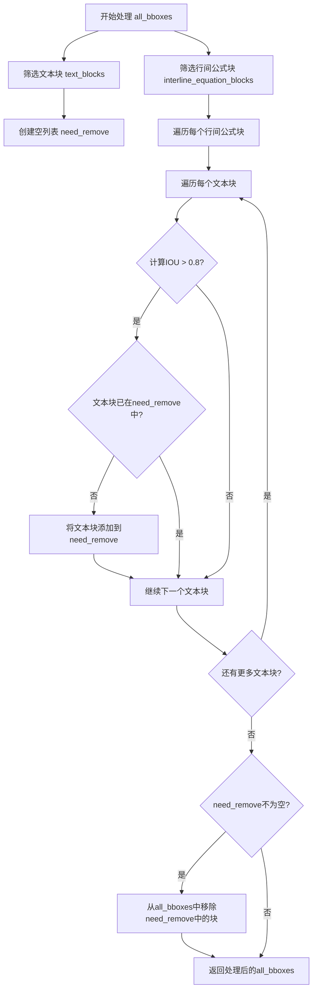
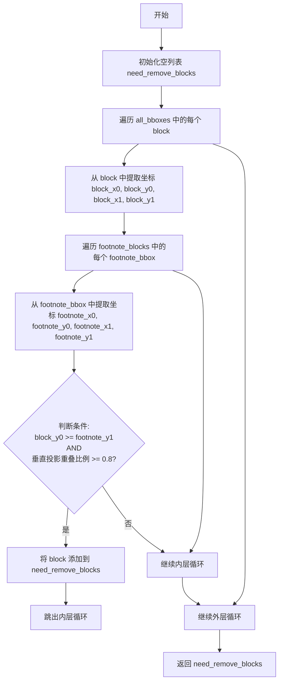
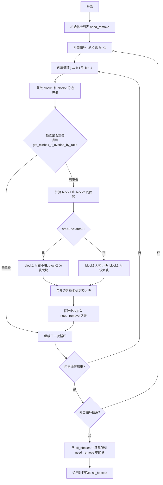

# `MinerU\mineru\utils\block_pre_proc.py` 详细设计文档

该代码是文档布局分析模块的核心处理单元，主要负责解析和整理PDF/文档中的各类内容块（包含文本、标题、图像、表格、公式等），通过计算边界框重叠度、IoU等算法解决块嵌套和冲突问题，并识别页脚区域，最终输出规范化的块布局信息。

## 整体流程



## 类结构

```
模块: mineru.utils.layout (无类定义)
├── 导入依赖
│   ├── boxbase模块 (6个函数)
│   └── enum_class.BlockType (枚举)
└── 函数列表 (8个全局函数)
```

## 全局变量及字段


### `calculate_iou`
    
计算两个边界框的IoU（交并比）

类型：`function`
    


### `calculate_overlap_area_in_bbox1_area_ratio`
    
计算重叠面积与第一个边界框面积的比率

类型：`function`
    


### `calculate_vertical_projection_overlap_ratio`
    
计算纵向投影重叠比率

类型：`function`
    


### `get_minbox_if_overlap_by_ratio`
    
如果两个边界框按比例重叠，获取最小的包围框

类型：`function`
    


### `BlockType`
    
块类型枚举，包含IMAGE_BODY、IMAGE_CAPTION、IMAGE_FOOTNOTE、TABLE_BODY、TABLE_CAPTION、TABLE_FOOTNOTE、TEXT、TITLE、INTERLINE_EQUATION、DISCARDED等

类型：`enum_class`
    


### `groups`
    
输入的组列表，每个组包含body、caption、footnote等键对应的块

类型：`List[dict]`
    


### `body_key`
    
body部分的键名，如'image_body'或'table_body'

类型：`str`
    


### `caption_key`
    
caption部分的键名，如'image_caption'或'table_caption'

类型：`str`
    


### `footnote_key`
    
footnote部分的键名，如'image_footnote'或'table_footnote'

类型：`str`
    


### `body_blocks`
    
处理后的body块列表

类型：`List[dict]`
    


### `caption_blocks`
    
处理后的caption块列表

类型：`List[dict]`
    


### `footnote_blocks`
    
处理后的footnote块列表

类型：`List[dict]`
    


### `maybe_text_image_blocks`
    
可能只有文本图像内容的块列表（无caption和footnote）

类型：`List[dict]`
    


### `img_body_blocks`
    
图像body块列表

类型：`List[dict]`
    


### `img_caption_blocks`
    
图像caption块列表

类型：`List[dict]`
    


### `img_footnote_blocks`
    
图像footnote块列表

类型：`List[dict]`
    


### `table_body_blocks`
    
表格body块列表

类型：`List[dict]`
    


### `table_caption_blocks`
    
表格caption块列表

类型：`List[dict]`
    


### `table_footnote_blocks`
    
表格footnote块列表

类型：`List[dict]`
    


### `discarded_blocks`
    
需要舍弃的块列表

类型：`List[dict]`
    


### `text_blocks`
    
文本块列表

类型：`List[dict]`
    


### `title_blocks`
    
标题块列表

类型：`List[dict]`
    


### `interline_equation_blocks`
    
行间公式块列表

类型：`List[dict]`
    


### `page_w`
    
页面宽度

类型：`float`
    


### `page_h`
    
页面高度

类型：`float`
    


### `all_bboxes`
    
所有块的边界框列表，每个元素为[x0, y0, x1, y1, None, None, None, block_type, None, None, None, None, score, group_id]

类型：`List[List]`
    


### `all_discarded_blocks`
    
所有舍弃块的边界框列表

类型：`List[List]`
    


### `footnote_blocks`
    
识别出的footnote块边界框列表

类型：`List[List]`
    


### `blocks`
    
输入的块列表

类型：`List[dict]`
    


### `block_type`
    
块类型枚举值

类型：`BlockType`
    


### `bboxes`
    
输出边界框列表

类型：`List[List]`
    


### `text_block`
    
文本块边界框数据

类型：`List`
    


### `title_block`
    
标题块边界框数据

类型：`List`
    


### `text_block_bbox`
    
文本块边界框坐标(x0, y0, x1, y1)

类型：`Tuple[float, float, float, float]`
    


### `title_block_bbox`
    
标题块边界框坐标(x0, y0, x1, y1)

类型：`Tuple[float, float, float, float]`
    


### `need_remove`
    
需要移除的块列表

类型：`List`
    


### `discarded_block`
    
舍弃块字典

类型：`dict`
    


### `interline_equation_block`
    
行间公式块边界框数据

类型：`List`
    


### `interline_equation_block_bbox`
    
行间公式块边界框坐标

类型：`Tuple[float, float, float, float]`
    


### `block_x0, block_y0, block_x1, block_y1`
    
块的边界框坐标

类型：`float`
    


### `footnote_bbox`
    
footnote块的边界框坐标

类型：`Tuple[float, float, float, float]`
    


### `footnote_x0, footnote_y0, footnote_x1, footnote_y1`
    
footnote块的坐标

类型：`float`
    


### `need_remove_blocks`
    
需要移除的块列表

类型：`List`
    


### `block1, block2`
    
用于比较的两个块

类型：`List`
    


### `block1_bbox, block2_bbox`
    
块的边界框坐标

类型：`Tuple[float, float, float, float]`
    


### `overlap_box`
    
重叠区域边界框

类型：`Tuple[float, float, float, float] or None`
    


### `area1, area2`
    
块的面积

类型：`float`
    


### `block_to_remove`
    
需要移除的较小块

类型：`List`
    


### `large_block`
    
保留的较大块

类型：`List`
    


    

## 全局函数及方法


### `process_groups`

该函数用于将文档解析出的分组（groups）数据进行处理，根据body、caption、footnote三种块类型进行分类，并为每个块设置group_id索引。其中当body_key为'image_body'且组内无caption和footnote时，将该body块放入maybe_text_image_blocks单独返回。

参数：

- `groups`：`List[dict]`，待处理的分组列表，每个分组是一个字典，包含body_key、caption_key、footnote_key对应的块数据
- `body_key`：`str`，分组中body块的键名（如'image_body'或'table_body'）
- `caption_key`：`str`，分组中caption块的键名（如'image_caption'或'table_caption'）
- `footnote_key`：`str`，分组中footnote块的键名（如'image_footnote'或'table_footnote'）

返回值：`Tuple[List[dict], List[dict], List[dict], List[dict]]`，返回一个包含4个列表的元组，依次为body块列表、caption块列表、footnote块列表和可能为纯文本图片的body块列表

#### 流程图

```mermaid
flowchart TD
    A[开始 process_groups] --> B[初始化空列表: body_blocks, caption_blocks, footnote_blocks, maybe_text_image_blocks]
    B --> C[遍历 groups 枚举索引 i]
    C --> D{body_key == 'image_body' 且<br/>caption_key 和 footnote_key 为空?}
    D -->|是| E[设置 group[body_key]['group_id'] = i]
    E --> F[将 group[body_key] 添加到 maybe_text_image_blocks]
    F --> G[继续下一次循环]
    D -->|否| H[设置 group[body_key]['group_id'] = i]
    H --> I[将 group[body_key] 添加到 body_blocks]
    I --> J[遍历 group[caption_key] 中的每个 caption_block]
    J --> K[设置 caption_block['group_id'] = i 并添加到 caption_blocks]
    K --> L[遍历 group[footnote_key] 中的每个 footnote_block]
    L --> M[设置 footnote_block['group_id'] = i 并添加到 footnote_blocks]
    M --> N{遍历完成?}
    N -->|否| C
    N -->|是| O[返回 body_blocks, caption_blocks, footnote_blocks, maybe_text_image_blocks]
```

#### 带注释源码

```python
def process_groups(groups, body_key, caption_key, footnote_key):
    """
    处理文档解析出的分组数据，将body、caption、footnote块分别归类
    
    参数:
        groups: 分组列表，每个分组包含body、caption、footnote三种块
        body_key: body块的键名
        caption_key: caption块的键名
        footnote_key: footnote块的键名
    
    返回:
        body_blocks, caption_blocks, footnote_blocks, maybe_text_image_blocks
    """
    # 初始化4个空列表用于存储不同类型的块
    body_blocks = []        # 存储body块
    caption_blocks = []     # 存储caption块
    footnote_blocks = []    # 存储footnote块
    maybe_text_image_blocks = []  # 存储可能为纯文本图片的body块
    
    # 遍历每个分组，枚举索引作为group_id
    for i, group in enumerate(groups):
        # 特殊处理：当body类型为image且无caption和footnote时
        if body_key == 'image_body' and len(group[caption_key]) == 0 and len(group[footnote_key]) == 0:
            # 如果没有caption和footnote，则不需要将group_id添加到image_body中
            # 这种情况下该image_body被认为是纯文本图片，单独处理
            group[body_key]['group_id'] = i
            maybe_text_image_blocks.append(group[body_key])
            continue
        else:
            # 常规处理：为body块设置group_id并添加到对应列表
            group[body_key]['group_id'] = i
            body_blocks.append(group[body_key])
            
            # 遍历该分组下的所有caption块，设置group_id后添加到caption_blocks
            for caption_block in group[caption_key]:
                caption_block['group_id'] = i
                caption_blocks.append(caption_block)
            
            # 遍历该分组下的所有footnote块，设置group_id后添加到footnote_blocks
            for footnote_block in group[footnote_key]:
                footnote_block['group_id'] = i
                footnote_blocks.append(footnote_block)
    
    # 返回4类块的列表
    return body_blocks, caption_blocks, footnote_blocks, maybe_text_image_blocks
```


### `prepare_block_bboxes`

该函数是PDF/文档版面分析中的核心处理函数，负责收集并整合页面中所有类型的块（图像、表格、文本、标题、行间公式等）的边界框信息，同时解决块之间的重叠嵌套问题，识别脚注区域，并输出最终处理后的边界框列表、被舍弃的块以及检测到的脚注块。

参数：

- `img_body_blocks`：`List[Dict]`，图片body块的列表，每个块包含bbox坐标和score等信息
- `img_caption_blocks`：`List[Dict]`，图片标题(caption)块的列表
- `img_footnote_blocks`：`List[Dict]`，图片脚注(footnote)块的列表
- `table_body_blocks`：`List[Dict]`，表格body块的列表
- `table_caption_blocks`：`List[Dict]`，表格标题(caption)块的列表
- `table_footnote_blocks`：`List[Dict]`，表格脚注(footnote)块的列表
- `discarded_blocks`：`List[Dict]`，被舍弃的块的列表，用于过滤冲突
- `text_blocks`：`List[Dict]`，文本块的列表
- `title_blocks`：`List[Dict]`，标题块的列表
- `interline_equation_blocks`：`List[Dict]`，行间公式块的列表
- `page_w`：`float`，页面的宽度
- `page_h`：`float`，页面的高度

返回值：`Tuple[List, List, List]`，返回一个包含三个元素的元组：(1) all_bboxes: 处理后所有边界框的列表；(2) all_discarded_blocks: 所有被舍弃的块列表；(3) footnote_blocks: 识别出的脚注块列表

#### 流程图



#### 带注释源码

```python
def prepare_block_bboxes(
    img_body_blocks,        # 图片主体块列表
    img_caption_blocks,     # 图片标题块列表
    img_footnote_blocks,   # 图片脚注块列表
    table_body_blocks,     # 表格主体块列表
    table_caption_blocks,   # 表格标题块列表
    table_footnote_blocks, # 表格脚注块列表
    discarded_blocks,       # 舍弃块列表
    text_blocks,            # 文本块列表
    title_blocks,           # 标题块列表
    interline_equation_blocks, # 行间公式块列表
    page_w,                 # 页面宽度
    page_h,                 # 页面高度
):
    """
    收集并整合页面中所有类型块的边界框，解决重叠嵌套问题，识别脚注区域
    
    处理流程：
    1. 收集所有块的边界框
    2. 解决块之间的重叠冲突（文本>标题、舍弃块>其他、行间公式>文本）
    3. 识别脚注并移除脚注下方的块
    4. 处理大框套小框的情况
    5. 排序返回结果
    """
    all_bboxes = []  # 初始化所有边界框列表

    # Step 1: 将各类块添加到边界框列表，并为每种块指定对应的BlockType
    add_bboxes(img_body_blocks, BlockType.IMAGE_BODY, all_bboxes)
    add_bboxes(img_caption_blocks, BlockType.IMAGE_CAPTION, all_bboxes)
    add_bboxes(img_footnote_blocks, BlockType.IMAGE_CAPTION, all_bboxes)
    add_bboxes(table_body_blocks, BlockType.TABLE_BODY, all_bboxes)
    add_bboxes(table_caption_blocks, BlockType.TABLE_CAPTION, all_bboxes)
    add_bboxes(table_footnote_blocks, BlockType.TABLE_FOOTNOTE, all_bboxes)
    add_bboxes(text_blocks, BlockType.TEXT, all_bboxes)
    add_bboxes(title_blocks, BlockType.TITLE, all_bboxes)
    add_bboxes(interline_equation_blocks, BlockType.INTERLINE_EQUATION, all_bboxes)

    """block嵌套问题解决"""
    """文本框与标题框重叠，优先信任文本框"""
    # 当文本框和标题框的IOU大于0.8时，判定为重叠，移除标题框
    all_bboxes = fix_text_overlap_title_blocks(all_bboxes)
    
    """任何框体与舍弃框重叠，优先信任舍弃框"""
    # 当某块与舍弃块的重叠面积比例超过0.6时，移除该块
    all_bboxes = remove_need_drop_blocks(all_bboxes, discarded_blocks)

    # interline_equation 与title或text框冲突的情况，分两种情况处理
    """interline_equation框与文本类型框iou比较接近1的时候，信任行间公式框"""
    # 当行间公式与文本块的IOU大于0.8时，移除文本块
    all_bboxes = fix_interline_equation_overlap_text_blocks_with_hi_iou(all_bboxes)
    
    """interline_equation框被包含在文本类型框内，且interline_equation比文本区块小很多时信任文本框，这时需要舍弃公式框"""
    # 通过后续大框套小框逻辑删除

    """discarded_blocks"""
    # 构建被舍弃块的边界框列表
    all_discarded_blocks = []
    add_bboxes(discarded_blocks, BlockType.DISCARDED, all_discarded_blocks)

    """footnote识别：宽度超过1/3页面宽度的，高度超过10的，处于页面下半30%区域的"""
    # 识别潜在的脚注块：根据宽度、高度和位置条件
    footnote_blocks = []
    for discarded in discarded_blocks:
        x0, y0, x1, y1 = discarded['bbox']
        # 条件：宽度>1/3页面宽度，高度>10，位于页面下半30%区域(y0 > 0.7*page_h)
        if (x1 - x0) > (page_w / 3) and (y1 - y0) > 10 and y0 > (page_h * 0.7):
            footnote_blocks.append([x0, y0, x1, y1])

    """移除在footnote下面的任何框"""
    # 找出位于脚注下方的块（纵向投影重叠>=80%且y0>=脚注y1）
    need_remove_blocks = find_blocks_under_footnote(all_bboxes, footnote_blocks)
    if len(need_remove_blocks) > 0:
        for block in need_remove_blocks:
            all_bboxes.remove(block)              # 从主列表移除
            all_discarded_blocks.append(block)    # 加入舍弃列表

    """经过以上处理后，还存在大框套小框的情况，则删除小框"""
    # 对所有块进行重叠处理，删除被完全包含的小框
    all_bboxes = remove_overlaps_min_blocks(all_bboxes)
    all_discarded_blocks = remove_overlaps_min_blocks(all_discarded_blocks)

    """粗排序后返回"""
    # 按x0+y1的和进行粗排序（先按y再按x的近似排序）
    all_bboxes.sort(key=lambda x: x[0]+x[1])
    return all_bboxes, all_discarded_blocks, footnote_blocks
```


### `add_bboxes`

该函数是PDF文档版面分析中的核心数据转换函数，负责将各类块（文本、标题、图像、表格等）的边界框信息从字典格式转换为统一的多维列表格式，并根据块类型决定是否包含group_id信息，以便后续的块处理和布局分析。

参数：

- `blocks`：`List[Dict]`，待处理的块列表，每个块为包含'bbox'键的字典，可能还包含'score'和'group_id'键
- `block_type`：`BlockType`，枚举类型，表示当前块所属的类别（如IMAGE_BODY、TEXT、TITLE等）
- `bboxes`：`List[List]`，用于存储转换后的边界框信息的列表，通过引用传递直接修改

返回值：`None`，该函数直接修改传入的`bboxes`列表，不返回任何值

#### 流程图

```mermaid
flowchart TD
    A[开始 add_bboxes] --> B{遍历 blocks 列表}
    B -->|当前block| C[提取 block['bbox'] 得到 x0, y0, x1, y1]
    C --> D{block_type 是否为图像/表格相关类型?}
    D -->|是| E[包含 group_id 的边界框]
    D -->|否| F[不包含 group_id 的边界框]
    E --> G[将边界框信息追加到 bboxes]
    F --> G
    G --> H{blocks 是否遍历完成?}
    H -->|否| B
    H -->|是| I[结束]
    
    subgraph 边界框格式
    E -.-> E1[格式: x0, y0, x1, y1, None, None, None, block_type, None, None, None, None, score, group_id]
    F -.-> F1[格式: x0, y0, x1, y1, None, None, None, block_type, None, None, None, None, score]
    end
```

#### 带注释源码

```python
def add_bboxes(blocks, block_type, bboxes):
    """
    将块列表中的边界框信息转换为统一格式并添加到bboxes列表中
    
    参数:
        blocks: 包含多个块的列表，每个块是字典，必须包含'bbox'键
                对于图像/表格类块，还应包含'score'和'group_id'键
        block_type: BlockType枚举值，表示块的类型
        bboxes: 目标列表，通过引用传递，函数执行后包含转换后的边界框信息
    
    返回值:
        None (直接修改bboxes列表)
    """
    # 遍历所有待处理的块
    for block in blocks:
        # 从当前块的字典中提取边界框坐标
        # bbox格式为 [x0, y0, x1, y1]，分别表示左上角和右下角坐标
        x0, y0, x1, y1 = block['bbox']
        
        # 判断当前块类型是否为图像或表格相关类型
        # 这类特殊块需要记录group_id用于后续分组处理
        if block_type in [
            BlockType.IMAGE_BODY,       # 图像主体
            BlockType.IMAGE_CAPTION,    # 图像标题
            BlockType.IMAGE_FOOTNOTE,   # 图像脚注
            BlockType.TABLE_BODY,       # 表格主体
            BlockType.TABLE_CAPTION,    # 表格标题
            BlockType.TABLE_FOOTNOTE,   # 表格脚注
        ]:
            # 对于图像/表格类块，构造14元素的边界框信息
            # 格式: [x0, y0, x1, y1, col1, col2, col3, block_type, col5, col6, col7, col8, score, group_id]
            bboxes.append([
                x0, y0, x1, y1,  # 边界框坐标
                None, None, None,  # 保留字段(列信息等)
                block_type,  # 块类型标识
                None, None, None, None,  # 保留字段
                block['score'],  # 置信度分数
                block['group_id']  # 组ID，用于关联caption/footnote与body
            ])
        else:
            # 对于文本、标题等普通块，构造13元素的边界框信息
            # 格式: [x0, y0, x1, y1, col1, col2, col3, block_type, col5, col6, col7, col8, score]
            bboxes.append([
                x0, y0, x1, y1,  # 边界框坐标
                None, None, None,  # 保留字段
                block_type,  # 块类型标识
                None, None, None, None,  # 保留字段
                block['score']  # 置信度分数（普通块不包含group_id）
            ])
```


### `fix_text_overlap_title_blocks`

该函数用于修复文本框（TEXT）与标题框（TITLE）之间的重叠问题。当文本框与标题框的IOU（Intersection over Union）超过0.8时，认为两者存在严重重叠，此时优先信任文本框，移除重叠的标题框。

参数：

- `all_bboxes`：`List`，包含所有边界框的列表，每个边界框是一个列表，包含坐标、类型等信息，其中索引7表示块类型（BlockType）

返回值：`List`，返回处理后的边界框列表，移除了与文本框重叠的标题框

#### 流程图



#### 带注释源码

```python
def fix_text_overlap_title_blocks(all_bboxes):
    """
    修复文本框与标题框重叠问题，优先信任文本框
    
    Args:
        all_bboxes: 所有边界框的列表，每个元素为 [x0, y0, x1, y1, ... , block_type, ...] 
                    其中索引7为block_type
    
    Returns:
        处理后的边界框列表，移除了与文本框重叠的标题框
    """
    # 第一步：先提取所有text和title block
    # 从all_bboxes中筛选出类型为TEXT的块
    text_blocks = []
    for block in all_bboxes:
        if block[7] == BlockType.TEXT:
            text_blocks.append(block)
    
    # 从all_bboxes中筛选出类型为TITLE的块
    title_blocks = []
    for block in all_bboxes:
        if block[7] == BlockType.TITLE:
            title_blocks.append(block)

    # 用于存储需要移除的标题框
    need_remove = []

    # 第二步：遍历每个文本框，与每个标题框进行IOU计算
    for text_block in text_blocks:
        for title_block in title_blocks:
            # 提取文本框的边界框坐标 [x0, y0, x1, y1]
            text_block_bbox = text_block[:4]
            # 提取标题框的边界框坐标 [x0, y0, x1, y1]
            title_block_bbox = title_block[:4]
            
            # 计算两个边界框的IOU（交集面积/并集面积）
            if calculate_iou(text_block_bbox, title_block_bbox) > 0.8:
                # 如果IOU大于0.8，认为存在严重重叠
                # 优先信任文本框，将标题框标记为需要移除
                if title_block not in need_remove:
                    need_remove.append(title_block)

    # 第三步：移除需要删除的标题框
    if len(need_remove) > 0:
        for block in need_remove:
            all_bboxes.remove(block)

    return all_bboxes
```


### `remove_need_drop_blocks`

该函数用于移除与丢弃块（discarded_blocks）重叠面积比例超过阈值的块。它遍历所有块，检查每个块与丢弃块的重叠情况，将重叠比例超过0.6的块标记为需要移除，并从块列表中删除。

参数：

- `all_bboxes`：list，所有块的列表，每个块是一个列表（如 `[x0, y0, x1, y1, ...]`），包含边界框信息
- `discarded_blocks`：list，丢弃块的列表，每个块是一个字典，必须包含 'bbox' 键（如 `{'bbox': [x0, y0, x1, y1]}`）

返回值：list，返回处理后的块列表，移除了与丢弃块重叠比例超过阈值的块

#### 流程图

```mermaid
flowchart TD
    A[开始 remove_need_drop_blocks] --> B[初始化空列表 need_remove]
    B --> C[遍历 all_bboxes 中的每个 block]
    C --> D[遍历 discarded_blocks 中的每个 discarded_block]
    D --> E[获取 block 的边界框 block_bbox]
    E --> F{calculate_overlap_area_in_bbox1_area_ratio<br/>block_bbox 与 discarded_block['bbox'] > 0.6?}
    F -->|是| G{block 是否已在 need_remove 中?}
    G -->|否| H[将 block 添加到 need_remove]
    H --> I[跳出内层循环，继续下一个 block]
    G -->|是| I
    F -->|否| D
    D --> C
    C --> J{need_remove 列表长度 > 0?}
    J -->|是| K[遍历 need_remove 中的每个 block]
    K --> L[从 all_bboxes 中移除该 block]
    L --> J
    J -->|否| M[返回处理后的 all_bboxes]
    I --> J
```

#### 带注释源码

```python
def remove_need_drop_blocks(all_bboxes, discarded_blocks):
    """
    移除与丢弃块重叠面积比例超过阈值的块
    
    参数:
        all_bboxes: 所有块的列表，每个块是一个列表，包含边界框信息
        discarded_blocks: 丢弃块的列表，每个块是字典，必须包含 'bbox' 键
    
    返回:
        处理后的 all_bboxes 列表
    """
    # 存储需要移除的块
    need_remove = []
    
    # 遍历所有块
    for block in all_bboxes:
        # 遍历所有丢弃块
        for discarded_block in discarded_blocks:
            # 提取当前块的边界框（前4个元素为坐标）
            block_bbox = block[:4]
            
            # 计算当前块与丢弃块的重叠面积比例
            # 如果重叠比例大于0.6，则认为需要移除
            if (
                calculate_overlap_area_in_bbox1_area_ratio(
                    block_bbox, discarded_block['bbox']
                )
                > 0.6
            ):
                # 如果该块不在需要移除的列表中，则添加进去
                if block not in need_remove:
                    need_remove.append(block)
                    # 找到一个重叠就跳出内层循环，检查下一个块
                    break

    # 如果有需要移除的块
    if len(need_remove) > 0:
        # 从 all_bboxes 中移除所有标记的块
        for block in need_remove:
            all_bboxes.remove(block)
    
    # 返回处理后的块列表
    return all_bboxes
```


### `fix_interline_equation_overlap_text_blocks_with_hi_iou`

该函数用于解决行间公式块与文本块之间的重叠问题。当行间公式块与文本块的IOU（Intersection over Union）超过0.8时，认为两者高度重叠，此时优先信任行间公式块，移除重叠的文本块。

参数：

- `all_bboxes`：`List`，包含所有页面元素边界框的列表，每个元素是一个列表，其中索引7表示BlockType（块类型），前4个元素表示边界框坐标(x0, y0, x1, y1)

返回值：`List`，处理后的边界框列表，移除了与行间公式块高度重叠的文本块

#### 流程图



#### 带注释源码

```python
def fix_interline_equation_overlap_text_blocks_with_hi_iou(all_bboxes):
    """
    修复行间公式块与文本块高度重叠的问题
    
    当行间公式块与文本块的IOU超过0.8时，优先保留行间公式块，
    移除重叠的文本块。这个函数解决了行间公式被误识别为文本的问题。
    """
    
    # 第一步：从所有边界框中筛选出文本类型的块
    text_blocks = []
    for block in all_bboxes:
        # block[7] 存储了BlockType，通过对比判断是否为文本块
        if block[7] == BlockType.TEXT:
            text_blocks.append(block)
    
    # 第二步：从所有边界框中筛选出行间公式块
    interline_equation_blocks = []
    for block in all_bboxes:
        # 同样通过block[7]判断是否为行间公式块
        if block[7] == BlockType.INTERLINE_EQUATION:
            interline_equation_blocks.append(block)

    # 创建一个列表用于存储需要移除的文本块
    need_remove = []

    # 第三步：双重循环遍历行间公式块和文本块
    for interline_equation_block in interline_equation_blocks:
        for text_block in text_blocks:
            # 提取两个块的前4个坐标值[x0, y0, x1, y1]
            interline_equation_block_bbox = interline_equation_block[:4]
            text_block_bbox = text_block[:4]
            
            # 计算两个边界框的IOU（Intersection over Union）
            # IOU = 相交面积 / 并集面积
            if calculate_iou(interline_equation_block_bbox, text_block_bbox) > 0.8:
                # 当IOU大于0.8时，认为两者高度重叠
                # 此时优先信任行间公式块，将文本块标记为需要移除
                if text_block not in need_remove:
                    need_remove.append(text_block)

    # 第四步：如果存在需要移除的块，则从all_bboxes中移除
    if len(need_remove) > 0:
        for block in need_remove:
            all_bboxes.remove(block)

    # 返回处理后的边界框列表
    return all_bboxes
```


### `find_blocks_under_footnote`

该函数用于识别并返回位于页面脚注区域下方的所有块。在文档版面处理中，脚注通常位于页面底部，该函数通过比较块与脚注的垂直位置关系和投影重叠比例，找出那些位于脚注下方且与脚注垂直投影重叠超过80%的块，这些块将被标记为需要移除。

参数：

- `all_bboxes`：`List[List[float]]`，包含所有块的边界框信息，每个块是一个列表，前四个元素为 `[x0, y0, x1, y1]` 表示块的坐标
- `footnote_blocks`：`List[List[float]]`，包含脚注块的边界框信息，每个脚注是一个 `[x0, y0, x1, y1]` 列表

返回值：`List[List[float]]`，返回需要移除的块列表，这些块位于脚注下方且与脚注的垂直投影重叠比例大于等于0.8

#### 流程图



#### 带注释源码

```python
def find_blocks_under_footnote(all_bboxes, footnote_blocks):
    """
    找出位于脚注下方的块
    
    该函数用于识别那些位于页面脚注区域下方的文档块。
    在PDF或图片文档中，脚注通常占据页面底部区域，位于脚注下方的
    块很可能是不应该被保留的页脚内容或页码等信息。
    
    判断逻辑：
    1. 块的顶部y坐标(block_y0)必须大于等于脚注的底部y坐标(footnote_y1)
    2. 块与脚注的垂直投影重叠比例必须 >= 0.8
    
    Args:
        all_bboxes: 所有块的边界框列表，每个元素为[x0, y0, x1, y1, ...]格式
        footnote_blocks: 脚注块的边界框列表，每个元素为[x0, y0, x1, y1]格式
    
    Returns:
        need_remove_blocks: 需要移除的块列表
    """
    # 初始化需要移除的块列表
    need_remove_blocks = []
    
    # 遍历所有文档块
    for block in all_bboxes:
        # 提取当前块的边界坐标（前4个元素为x0, y0, x1, y1）
        block_x0, block_y0, block_x1, block_y1 = block[:4]
        
        # 遍历所有脚注块
        for footnote_bbox in footnote_blocks:
            # 提取脚注块的边界坐标
            footnote_x0, footnote_y0, footnote_x1, footnote_y1 = footnote_bbox
            
            # 判断块是否位于脚注下方且垂直投影重叠
            # 条件1: block_y0 >= footnote_y1
            #   - 确保块的顶部不低于脚注的底部（即块在脚注下方或与脚注平齐）
            # 条件2: calculate_vertical_projection_overlap_ratio(...) >= 0.8
            #   - 计算垂直投影重叠比例，确保块与脚注在垂直方向上有足够的重叠
            #   - 重叠比例 >= 0.8 表示块的垂直投影80%以上被脚注覆盖
            if (
                block_y0 >= footnote_y1
                and calculate_vertical_projection_overlap_ratio(
                    (block_x0, block_y0, block_x1, block_y1), footnote_bbox
                )
                >= 0.8
            ):
                # 如果满足条件，将该块添加到需要移除的列表中
                if block not in need_remove_blocks:
                    need_remove_blocks.append(block)
                # 找到一个匹配的脚注后即可退出内层循环
                # 因为一个块只需要被一个脚注覆盖就可以被移除
                break
    
    # 返回需要移除的块列表
    return need_remove_blocks
```


### `remove_overlaps_min_blocks`

该函数用于处理边界框列表中的重叠问题，通过比较重叠边界框的面积，将较小的边界框合并到较大的边界框中，并从列表中移除较小的边界框，最终返回处理后的边界框列表。

参数：

- `all_bboxes`：`list`，包含所有边界框的列表，每个边界框是一个列表，前4个元素为坐标 `[x0, y0, x1, y1]`，后续元素包含类型、分数等信息

返回值：`list`，处理后的边界框列表，移除了重叠的较小边界框，较大的边界框被扩展以包含被移除的较小边界框的面积

#### 流程图



#### 带注释源码

```python
def remove_overlaps_min_blocks(all_bboxes):
    """
    移除重叠的边界框，保留较大的块并将较小的块合并到大块中
    
    参数:
        all_bboxes: 包含所有边界框的列表，每个元素是一个列表
                    前4个元素为 [x0, y0, x1, y1]，后续元素包含类型、分数等信息
    
    返回:
        处理后的边界框列表，移除了重叠的较小边界框
    """
    # 初始化需要移除的块列表
    need_remove = []
    
    # 遍历所有边界框对
    for i in range(len(all_bboxes)):
        for j in range(i + 1, len(all_bboxes)):
            block1 = all_bboxes[i]
            block2 = all_bboxes[j]
            
            # 提取边界框坐标（前4个元素）
            block1_bbox = block1[:4]
            block2_bbox = block2[:4]
            
            # 检查两个边界框是否重叠，重叠阈值比例为0.8
            overlap_box = get_minbox_if_overlap_by_ratio(
                block1_bbox, block2_bbox, 0.8
            )
            
            # 如果存在重叠
            if overlap_box is not None:
                # 计算每个块的面积
                # 面积 = (x1 - x0) * (y1 - y0)
                area1 = (block1[2] - block1[0]) * (block1[3] - block1[1])
                area2 = (block2[2] - block2[0]) * (block2[3] - block2[1])

                # 比较面积大小，确定需要移除的较小块
                if area1 <= area2:
                    block_to_remove = block1  # 较小块
                    large_block = block2       # 较大块
                else:
                    block_to_remove = block2  # 较小块
                    large_block = block1       # 较大块

                # 如果较小块不在待移除列表中
                if block_to_remove not in need_remove:
                    # 合并边界框坐标：将较大块的边界扩展到包含较小块
                    x1, y1, x2, y2 = large_block[:4]
                    sx1, sy1, sx2, sy2 = block_to_remove[:4]
                    
                    # 更新较大块的边界，取两个块的最小x0/y0和最大x1/y1
                    x1 = min(x1, sx1)
                    y1 = min(y1, sy1)
                    x2 = max(x2, sx2)
                    y2 = max(y2, sy2)
                    
                    # 更新较大块的坐标
                    large_block[:4] = [x1, y1, x2, y2]
                    
                    # 将较小块加入待移除列表
                    need_remove.append(block_to_remove)

    # 从列表中移除所有需要删除的块
    for block in need_remove:
        if block in all_bboxes:
            all_bboxes.remove(block)

    return all_bboxes
```

## 关键组件


### process_groups

处理文档中的分组块（body、caption、footnote），将分组数据拆分为独立的块列表，并为每个块分配group_id

### prepare_block_bboxes

准备所有类型块的边界框，处理块之间的重叠问题，包括文本与标题重叠、块与舍弃块重叠、行间公式与文本重叠、页脚区域清理以及大框套小框的合并

### add_bboxes

将各类块（图像、表格、文本、标题、行间公式）的边界框添加到列表中，并根据块类型设置特定的格式和属性

### fix_text_overlap_title_blocks

修复文本框与标题框重叠问题，当IoU大于0.8时，优先信任文本块而移除标题块

### remove_need_drop_blocks

移除与舍弃块重叠的块，当重叠面积比例超过0.6时，将该块从结果中移除

### fix_interline_equation_overlap_text_blocks_with_hi_iou

修复行间公式框与文本框的高IoU重叠，当IoU大于0.8时信任行间公式块而移除文本块

### find_blocks_under_footnote

查找位于页脚下方的块，当块的纵向投影被页脚覆盖80%以上且位于页脚下方时标记为需移除

### remove_overlaps_min_blocks

处理边界框重叠问题，删除较小的重叠块并将其合并到较大的块中，形成更大的包围盒


## 问题及建议


### 已知问题

- **时间复杂度问题**：多个函数（`fix_text_overlap_title_blocks`、`remove_need_drop_blocks`、`fix_interline_equation_overlap_text_blocks_with_hi_iou`、`remove_overlaps_min_blocks`）使用嵌套循环遍历所有块组合，导致O(n²)或更高的时间复杂度，在处理大量块时性能可能较差
- **重复代码**：提取特定类型块的逻辑在多个函数中重复出现（如多次遍历`all_bboxes`提取`text_blocks`、`title_blocks`等），未进行抽象复用
- **硬编码阈值**：代码中多处使用魔数（如0.8、0.6、0.7、10、3、0.3等）且缺乏注释说明，可读性和可维护性差
- **使用列表remove方法**：在循环中多次调用`all_bboxes.remove(block)`（O(n)操作），应改用集合或标记删除方式提升性能
- **数据结构不规范**：边界框使用位置索引（如`block[0]`、`block[7]`）访问元素，缺少文档说明，易产生混淆且不利于维护
- **函数副作用**：`add_bboxes`函数直接修改传入的`bboxes`列表，不符合函数式编程最佳实践
- **边界条件处理不足**：未对空列表、`None`输入等边界情况进行显式检查和处理

### 优化建议

- **性能优化**：使用空间索引（如R树）或按类型分组处理，减少遍历次数；改用集合存储待删除块，避免在循环中频繁调用`remove`方法
- **代码复用**：提取通用的块过滤逻辑为独立函数，如`get_blocks_by_type(all_bboxes, block_type)`
- **配置化**：将硬编码的阈值提取为配置文件或函数参数，增加代码可读性和可维护性
- **数据结构优化**：考虑使用命名元组或 dataclass 定义边界框结构，或添加详细的结构体文档说明
- **函数式改造**：让`add_bboxes`返回新的列表而非修改原列表，减少副作用
- **增加边界检查**：在函数入口处增加必要的空值和类型检查

## 其它


### 设计目标与约束

1. **核心目标**：对文档页面中的各类元素（文本、标题、图片、表格、脚注、行间公式等）的边界框（bbox）进行整合、排重、优先级处理和位置修正，确保输出准确且无冲突的区块列表
2. **处理原则**：
   - 文本框优先级高于标题框（当重叠度>0.8时移除标题框）
   - 舍弃框（discarded）优先级最高（任何与之重叠>60%的区块均被移除）
   - 行间公式与文本框重叠度高（>0.8）时信任行间公式框
   - 大框套小框时删除较小的区块，并与大区块合并
   - 脚注区域（页面下半30%、宽度>1/3页面宽、高度>10）下的区块需要移除
3. **性能约束**：需要处理大量bbox的循环比较，时间复杂度较高，预期用于离线批处理场景

### 错误处理与异常设计

1. **输入校验**：函数假设传入的blocks列表中每个block都包含`bbox`字段和`score`字段，若缺少字段可能导致`KeyError`或解包错误
2. **边界条件**：
   - 空列表处理：大部分函数对空列表有自然的空循环处理，不会抛异常
   - bbox格式：假设bbox为`[x0, y0, x1, y1]`的四元组，若维度不对可能导致索引越界
3. **异常传播**：依赖的外部函数`calculate_iou`、`calculate_overlap_area_in_bbox1_area_ratio`等若抛异常会直接向上传播
4. **建议改进**：增加输入参数的类型检查和字段完整性校验，对异常输入返回空列表或抛出明确的业务异常

### 数据流与状态机

1. **主数据流**：
   ```
   groups输入 → process_groups()分类 → prepare_block_bboxes()整合
   → add_bboxes()统一格式 → 多轮修复处理
   → remove_overlaps_min_blocks()去重 → 输出排序后的all_bboxes
   ```
2. **多轮修复流程**：
   - 第1轮：fix_text_overlap_title_blocks（文本与标题重叠处理）
   - 第2轮：remove_need_drop_blocks（与舍弃框重叠处理）
   - 第3轮：fix_interline_equation_overlap_text_blocks_with_hi_iou（行间公式与文本重叠处理）
   - 第4轮：脚注区域下区块移除
   - 第5轮：remove_overlaps_min_blocks（大框套小框处理）
3. **状态变化**：blocks从原始分类状态经过多轮过滤和合并，最终输出清理后的有序bbox列表

### 外部依赖与接口契约

1. **内部依赖（mineru.utils.boxbase）**：
   - `calculate_iou(bbox1, bbox2)`：计算两个bbox的IoU值
   - `calculate_overlap_area_in_bbox1_area_ratio(bbox1, bbox2)`：计算bbox1在bbox2中的面积占比
   - `calculate_vertical_projection_overlap_ratio(bbox1, bbox2)`：计算纵向投影重叠比
   - `get_minbox_if_overlap_by_ratio(bbox1, bbox2, ratio)`：获取重叠的小框
2. **内部依赖（mineru.utils.enum_class）**：
   - `BlockType`：枚举类，定义区块类型（IMAGE_BODY, IMAGE_CAPTION, TEXT, TITLE等）
3. **输入契约**：
   - `groups`：列表，每个元素为包含body_key、caption_key、footnote_key的字典
   - `*_blocks`：各类区块列表，每个block需包含`bbox`和`score`字段
   - `discarded_blocks`：舍弃区块列表
   - `page_w, page_h`：页面宽高（float或int）
4. **输出契约**：
   - `all_bboxes`：二维列表，每元素为`[x0, y0, x1, y1, None, None, None, block_type, None, None, None, None, score, group_id]`
   - `all_discarded_blocks`：格式同all_bboxes
   - `footnote_blocks`：二维列表，每元素为`[x0, y0, x1, y1]`

### 性能考虑

1. **时间复杂度**：多重嵌套循环（如`remove_overlaps_min_blocks`使用O(n²)比较），在区块数量较多时可能成为瓶颈
2. **空间复杂度**：创建大量临时列表（如text_blocks、title_blocks等），内存占用较高
3. **优化建议**：
   - 使用空间索引（如R-tree）加速空间查询和重叠检测
   - 对于固定阈值（如0.8、0.6）可提取为配置参数
   - 考虑使用NumPy向量化操作替代部分Python循环

### 可维护性与扩展性

1. **模块化设计**：各修复函数职责单一（fix_*, remove_*, find_*），便于理解和测试
2. **硬编码问题**：
   - 多处魔法数字（如0.8、0.6、0.7、10、1/3）散落在代码中
   - block_type列表在`add_bboxes`中重复出现
3. **扩展性**：
   - 新增区块类型需同时修改`BlockType`枚举和`add_bboxes`中的类型判断
   - 新增修复规则可通过在`prepare_block_bboxes`中追加函数调用实现
4. **代码注释**：中文注释清晰描述了处理逻辑，但部分函数缺少文档字符串（docstring）

### 测试策略建议

1. **单元测试**：针对每个修复函数设计测试用例，覆盖正常输入、边界输入（空列表、单元素列表）
2. **集成测试**：使用真实文档数据验证整体流程的正确性
3. **回归测试**：确保修复规则不会导致已有功能退化
4. **边界测试**：
   - bbox完全重合、完全不重合、 partial重叠
   - 页面边缘的区块（x0=0或y0=0）
   - 极小区块（宽或高接近0）

### 部署与运维

1. **部署方式**：作为mineru库的内部模块，无独立部署需求
2. **监控指标**：
   - 输入区块数量与输出区块数量的比例
   - 各修复函数的处理时间
   - 脚注检测的覆盖率
3. **日志记录**：建议在关键处理节点添加日志，便于问题排查

### 其它项目

1. **代码风格**：遵循Python命名规范，但部分变量名可读性可提升（如`need_remove`、`all_bboxes`可更明确）
2. **版本兼容**：依赖`BlockType`枚举需与外部模块保持同步更新
3. **文档完善**：建议为每个公开函数添加Google风格的docstring，说明参数、返回值和抛出的异常

    