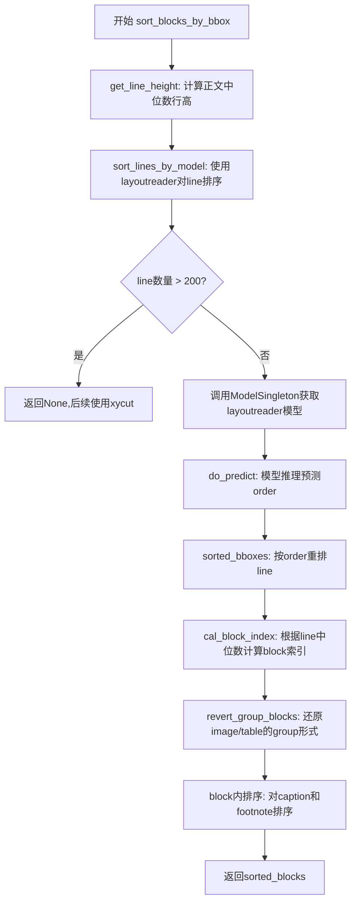
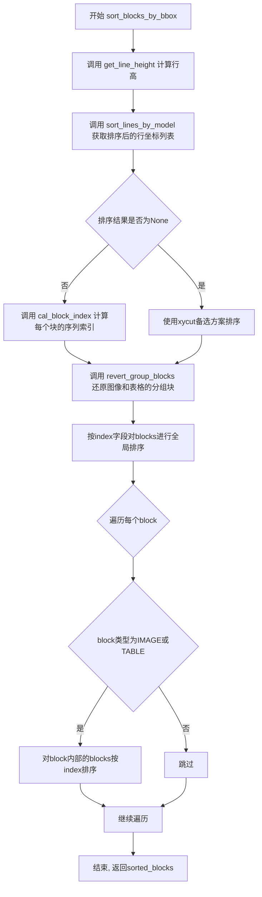
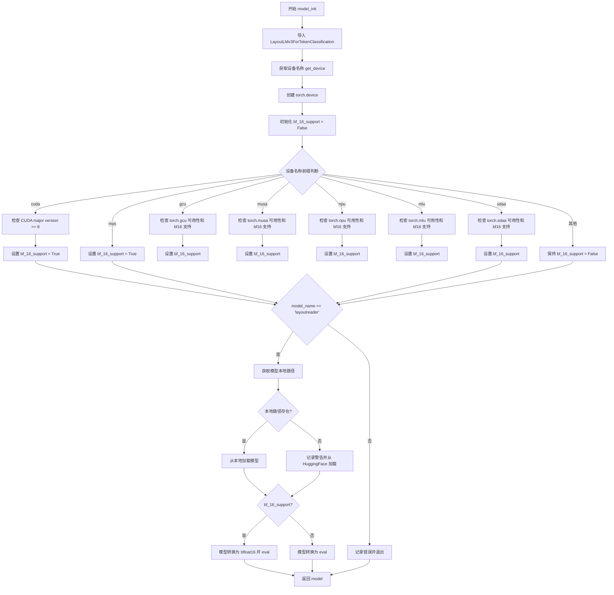
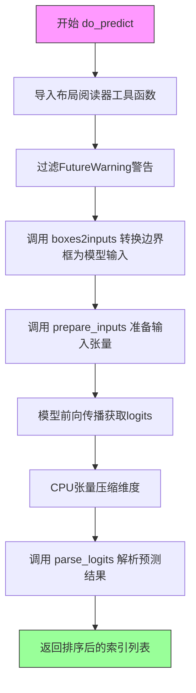
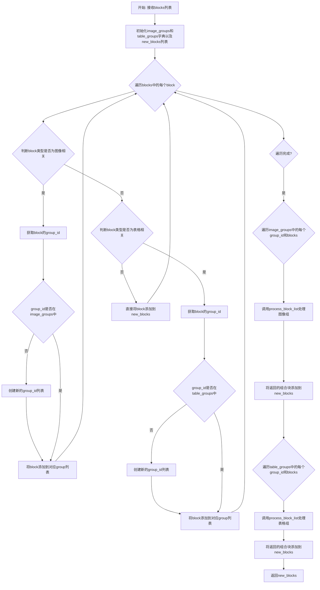
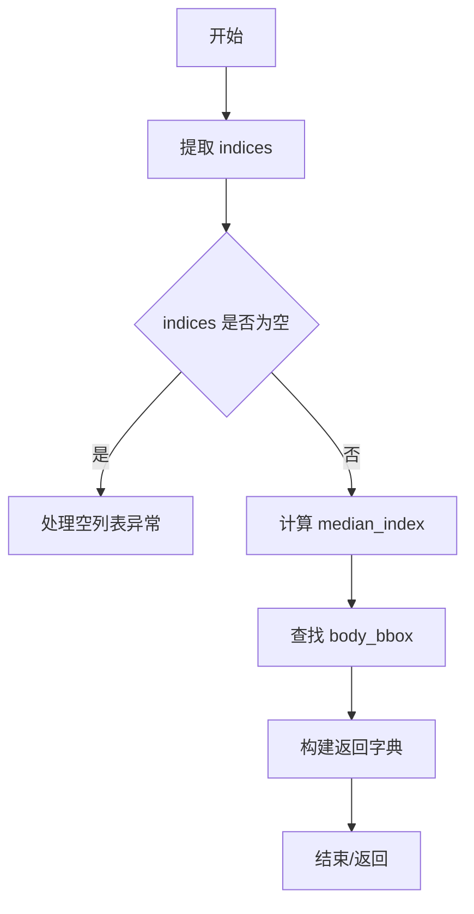
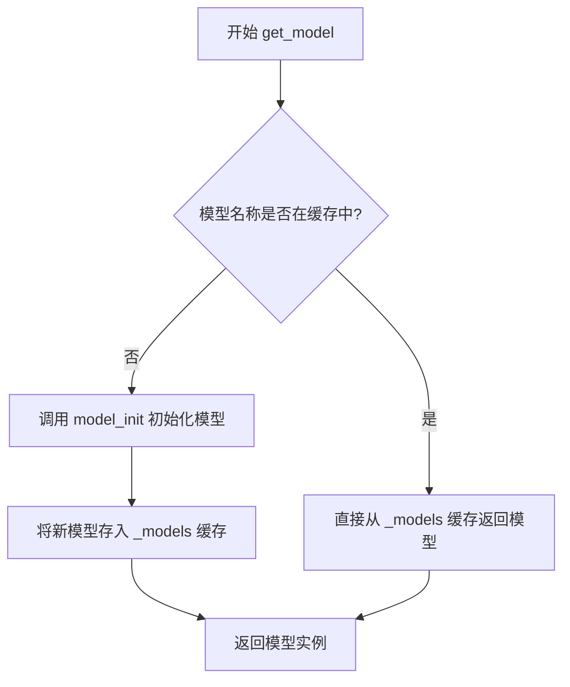

# `MinerU\mineru\utils\block_sort.py` 详细设计文档

该代码实现了一个文档布局理解模块,主要功能是对PDF或文档中的各种内容块(text、image、table等)进行阅读顺序排序。代码通过LayoutLMv3模型(或备选的xycut算法)分析块的空间位置关系,计算每个块的索引序号,从而确定内容块的正确阅读顺序。

## 整体流程



## 类结构

```
ModelSingleton (单例模型管理器)
└── 负责管理LayoutLMv3模型实例
```

## 全局变量及字段


### `ModelSingleton._instance`
    
单例实例，用于存储ModelSingleton的唯一实例

类型：`ModelSingleton`
    


### `ModelSingleton._models`
    
模型缓存字典，用于存储已加载的模型实例，键为模型名称，值为模型对象

类型：`dict`
    
    

## 全局函数及方法


### `sort_blocks_by_bbox`

该函数是文档页面元素排序的核心入口，通过计算行高、使用布局阅读器（layoutreader）进行阅读顺序预测、计算块索引、还原分组块等步骤，实现对页面中文字、标题、图像、表格、脚注等元素的全局排序。

参数：

- `blocks`：`List`，页面中待排序的所有块元素列表
- `page_w`：`int` 或 `float`，页面的宽度
- `page_h`：`int` 或 `float`，页面的高度
- `footnote_blocks`：`List`，页面中的脚注块列表

返回值：`List`，排序完成后的块列表

#### 流程图



#### 带注释源码

```python
def sort_blocks_by_bbox(blocks, page_w, page_h, footnote_blocks):
    """
    对页面中的所有块元素进行阅读顺序排序
    
    处理流程:
    1. 计算正文的行高作为参考基准
    2. 使用layoutreader模型预测行的阅读顺序
    3. 根据行序列计算块的排序索引
    4. 将图像和表格的身体块与标题/脚注还原为分组形式
    5. 最终按索引排序并返回结果
    """
    
    """获取所有line并计算正文line的高度"""
    line_height = get_line_height(blocks)

    """获取所有line并对line排序"""
    # 调用sort_lines_by_model获取排序后的行坐标列表
    sorted_bboxes = sort_lines_by_model(blocks, page_w, page_h, line_height, footnote_blocks)

    """根据line的中位数算block的序列关系"""
    # 根据排序后的行坐标计算每个块的索引
    blocks = cal_block_index(blocks, sorted_bboxes)

    """将image和table的block还原回group形式参与后续流程"""
    # 将之前拆分的图像/表格组件还原为分组块
    blocks = revert_group_blocks(blocks)

    """重排block"""
    # 按计算得到的index字段对所有块进行排序
    sorted_blocks = sorted(blocks, key=lambda b: b['index'])

    """block内重排(img和table的block内多个caption或footnote的排序)"""
    # 对图像和表格类型的块，进一步排序其内部的子块（标题、脚注等）
    for block in sorted_blocks:
        if block['type'] in [BlockType.IMAGE, BlockType.TABLE]:
            # 对block内部的blocks列表按index进行二次排序
            block['blocks'] = sorted(block['blocks'], key=lambda b: b['index'])

    return sorted_blocks
```


### `get_line_height`

该函数用于从文档块（blocks）中提取文本类块（文本、标题、图片标题/脚注、表格标题/脚注）的行高列表，并计算其中位数作为页面正文的行高参考值。如果不存在任何行，则返回默认值 10。

参数：

-  `blocks`：`List[dict]`，包含多个文档块的列表，每个块应包含 `type` 字段和 `lines` 列表，每个 `line` 包含 `bbox`（边界框坐标 `[x0, y0, x1, y1]`）

返回值：`int`，返回所有符合条件的行高中位数，如果不存在任何行则返回默认值 `10`

#### 流程图

```mermaid
flowchart TD
    A[开始 get_line_height] --> B[初始化空列表 page_line_height_list]
    B --> C{遍历 blocks 中的每个 block}
    C --> D{block['type'] 是否属于<br/>TEXT, TITLE, IMAGE_CAPTION,<br/>IMAGE_FOOTNOTE, TABLE_CAPTION,<br/>TABLE_FOOTNOTE}
    D -->|是| E[遍历 block 中的每个 line]
    D -->|否| C
    E --> F[提取 line['bbox']]
    F --> G[计算行高: bbox[3] - bbox[1]]
    G --> H[将行高转换为整数并加入列表]
    H --> C
    C --> I{page_line_height_list 长度 > 0?}
    I -->|是| J[返回列表的中位数]
    I -->|否| K[返回默认值 10]
    J --> L[结束]
    K --> L
```

#### 带注释源码

```python
def get_line_height(blocks):
    """
    计算页面文本类块的正文中位数行高
    
    该函数从所有文本类型的块（TEXT, TITLE, 各类CAPTION和FOOTNOTE）中
    提取每一行的边界框高度，然后返回这些高度的中位数作为参考行高。
    中位数比平均值更能代表典型行高，因为可以排除异常大或小的行（如标题行）。
    
    参数:
        blocks: 文档块列表，每个block包含type和lines字段
        
    返回:
        int: 行高整数值，如果没有文本行则返回10作为默认值
    """
    # 用于存储所有符合条件的行高
    page_line_height_list = []
    
    # 遍历所有文档块
    for block in blocks:
        # 只处理文本类型的块，排除图片BODY、表格BODY、公式等
        if block['type'] in [
            BlockType.TEXT, BlockType.TITLE,
            BlockType.IMAGE_CAPTION, BlockType.IMAGE_FOOTNOTE,
            BlockType.TABLE_CAPTION, BlockType.TABLE_FOOTNOTE
        ]:
            # 遍历该块中的所有行
            for line in block['lines']:
                # 提取行的边界框 [x0, y0, x1, y1]
                bbox = line['bbox']
                # 计算行高: 底部y坐标 - 顶部y坐标
                # bbox[3] 是 bottom, bbox[1] 是 top
                page_line_height_list.append(int(bbox[3] - bbox[1]))
    
    # 判断是否存在有效行高数据
    if len(page_line_height_list) > 0:
        # 使用中位数而非平均值，可以更好地反映典型行高
        # 中位数不受极端值影响，更适合作为排版参考
        return statistics.median(page_line_height_list)
    else:
        # 如果文档中没有文本行，返回一个合理的默认行高值10
        # 10可能是基于默认字体大小的经验值
        return 10
```


### `sort_lines_by_model`

该函数使用 LayoutReader 模型对文档中的行（lines）进行阅读顺序排序。它首先收集页面中所有文本行的边界框，根据页面尺寸进行缩放，然后调用深度学习模型预测行的正确排序顺序，最后返回排序后的边界框列表。如果行数超过200条（模型支持的最大值），则返回 None。

参数：

- `fix_blocks`：`List[dict]`，需要排序的文档块列表，每个块包含类型、边界框、行信息等
- `page_w`：`float`，页面的宽度
- `page_h`：`float`，页面的高度
- `line_height`：`float`，文档正文的行高，用于分割空块
- `footnote_blocks`：`List[dict]`，脚注块列表，需要参与排序

返回值：`List[List[float]]` 或 `None`，排序后的行边界框列表，如果行数超过200则返回 None

#### 流程图

```mermaid
flowchart TD
    A[开始 sort_lines_by_model] --> B[初始化 page_line_list 为空列表]
    B --> C{遍历 fix_blocks 中的每个 block}
    C -->|block.type 是 TEXT/TITLE/IMAGE_CAPTION 等| D{检查 block.lines 长度}
    D -->|len == 0| E[调用 add_lines_to_block 添加行]
    D -->|type 是 TITLE 且只有1行但高度>2*line_height| F[保存 real_lines 并添加行]
    D -->|其他情况| G[直接将每行 bbox 添加到 page_line_list]
    C -->|block.type 是 IMAGE_BODY/TABLE_BODY/INTERLINE_EQUATION| H[保存 real_lines 并添加行]
    C -->|其他类型| I[跳过不处理]
    E --> J{继续遍历}
    F --> J
    G --> J
    H --> J
    J -->|遍历完成| K{遍历 footnote_blocks}
    K --> L[为每个脚注块调用 add_lines_to_block]
    L --> M{检查 len(page_line_list) > 200}
    M -->|是| N[返回 None]
    M -->|否| O[计算缩放系数 x_scale, y_scale]
    O --> P{遍历 page_line_list 中的每个 bbox}
    P --> Q[验证并裁剪坐标到有效范围 [0, page_w] 或 [0, page_h]]
    Q --> R[应用缩放: left* x_scale, 乘以 y_scale 并四舍五入]
    R --> S[验证缩放后坐标在 [0, 1000] 范围内]
    S --> T[将处理后的 bbox 添加到 boxes 列表]
    T --> U{继续遍历}
    U -->|完成| V[获取 LayoutReader 模型实例]
    V --> W[使用 torch.no_grad 禁用梯度计算]
    W --> X[调用 do_predict 获取预测的顺序]
    X --> Y[根据顺序索引重新排列 page_line_list]
    Y --> Z[返回 sorted_bboxes]
```

#### 带注释源码

```python
def sort_lines_by_model(fix_blocks, page_w, page_h, line_height, footnote_blocks):
    """
    使用 LayoutReader 模型对文档行进行阅读顺序排序
    
    参数:
        fix_blocks: 需要排序的文档块列表
        page_w: 页面宽度
        page_h: 页面高度
        line_height: 行高
        footnote_blocks: 脚注块列表
    返回:
        排序后的边界框列表，或None（超过200行时）
    """
    # 初始化页面行列表，用于存储所有需要排序的行边界框
    page_line_list = []

    def add_lines_to_block(b):
        """
        内部函数：将块分割成行并添加到页面行列表
        
        参数:
            b: 需要处理的块字典
        """
        # 使用插入算法将块边界框分割成多个行边界框
        line_bboxes = insert_lines_into_block(b['bbox'], line_height, page_w, page_h)
        # 初始化块的lines列表
        b['lines'] = []
        # 为每个行边界框创建行字典
        for line_bbox in line_bboxes:
            b['lines'].append({'bbox': line_bbox, 'spans': []})
        # 将所有行边界框添加到页面行列表
        page_line_list.extend(line_bboxes)

    # 遍历主文档块，处理文本类块
    for block in fix_blocks:
        # 只处理文本相关类型的块
        if block['type'] in [
            BlockType.TEXT, BlockType.TITLE,
            BlockType.IMAGE_CAPTION, BlockType.IMAGE_FOOTNOTE,
            BlockType.TABLE_CAPTION, BlockType.TABLE_FOOTNOTE
        ]:
            # 如果块没有行内容，调用插入函数生成行
            if len(block['lines']) == 0:
                add_lines_to_block(block)
            # 处理标题块：只有一行且高度超过2倍行高的情况
            elif block['type'] in [BlockType.TITLE] and len(block['lines']) == 1 and (block['bbox'][3] - block['bbox'][1]) > line_height * 2:
                # 保存原始行到 real_lines
                block['real_lines'] = copy.deepcopy(block['lines'])
                add_lines_to_block(block)
            else:
                # 直接将现有行的边界框添加到列表
                for line in block['lines']:
                    bbox = line['bbox']
                    page_line_list.append(bbox)
        # 处理图像、表格和行间公式的body块
        elif block['type'] in [BlockType.IMAGE_BODY, BlockType.TABLE_BODY, BlockType.INTERLINE_EQUATION]:
            # 保存原始行信息
            block['real_lines'] = copy.deepcopy(block['lines'])
            add_lines_to_block(block)

    # 遍历脚注块，为每个脚注创建虚拟块并处理
    for block in footnote_blocks:
        footnote_block = {'bbox': block[:4]}
        add_lines_to_block(footnote_block)

    # 检查行数是否超过模型支持的最大值（200行）
    if len(page_line_list) > 200:  # layoutreader最高支持512line
        return None

    # 计算缩放系数，将任意页面尺寸映射到1000x1000的正方形
    x_scale = 1000.0 / page_w
    y_scale = 1000.0 / page_h
    boxes = []
    
    # 遍历所有行边界框，进行坐标验证和缩放
    for left, top, right, bottom in page_line_list:
        # 检查并修正越界坐标
        if left < 0:
            logger.warning(
                f'left < 0, left: {left}, right: {right}, top: {top}, bottom: {bottom}, page_w: {page_w}, page_h: {page_h}'
            )
            left = 0
        if right > page_w:
            logger.warning(
                f'right > page_w, left: {left}, right: {right}, top: {top}, bottom: {bottom}, page_w: {page_w}, page_h: {page_h}'
            )
            right = page_w
        if top < 0:
            logger.warning(
                f'top < 0, left: {left}, right: {right}, top: {top}, bottom: {bottom}, page_w: {page_w}, page_h: {page_h}'
            )
            top = 0
        if bottom > page_h:
            logger.warning(
                f'bottom > page_h, left: {left}, right: {right}, top: {top}, bottom: {bottom}, page_w: {page_w}, page_h: {page_h}'
            )
            bottom = page_h

        # 应用缩放变换
        left = round(left * x_scale)
        top = round(top * y_scale)
        right = round(right * x_scale)
        bottom = round(bottom * y_scale)
        
        # 验证缩放后的坐标有效性
        assert (
            1000 >= right >= left >= 0 and 1000 >= bottom >= top >= 0
        ), f'Invalid box. right: {right}, left: {left}, bottom: {bottom}, top: {top}'
        boxes.append([left, top, right, bottom])
    
    # 获取 LayoutReader 模型单例
    model_manager = ModelSingleton()
    model = model_manager.get_model('layoutreader')
    
    # 使用模型进行推理预测阅读顺序
    with torch.no_grad():
        orders = do_predict(boxes, model)
    
    # 根据预测的顺序重新排列原始边界框
    sorted_bboxes = [page_line_list[i] for i in orders]

    return sorted_bboxes
```


### `insert_lines_into_block`

该函数根据块的边界框、页面尺寸和行高，将一个块区域分割成多个"行"（虚拟线）的边界框列表，用于后续的阅读顺序排序。

参数：

- `block_bbox`：`tuple`，块的边界框，格式为 `(x0, y0, x1, y1)`，其中 `(x0, y0)` 是左下角坐标，`(x1, y1)` 是右上角坐标
- `line_height`：`float`，正文行的中位数高度，用于作为分割的参考单位
- `page_w`：`float`，页面的宽度
- `page_h`：`float`，页面的高度

返回值：`List[List[int]]`，返回由多个小矩形边界框组成的列表，每个元素 `[x0, y0, x1, y1]` 代表一个虚拟"行"的位置信息

#### 流程图

```mermaid
flowchart TD
    A[开始: insert_lines_into_block] --> B[解包block_bbox: x0, y0, x1, y1]
    B --> C[计算block_height = y1 - y0]
    B --> D[计算block_weight = x1 - x0]
    D --> E{line_height * 2 < block_height?}
    
    E -->|否| Z[返回原始块: [[x0, y0, x1, y1]]]
    E -->|是| F{block_height > page_h * 0.25<br/>且 page_w * 0.5 > block_weight > page_w * 0.25?}
    
    F -->|是| G[计算lines = int(block_height / line_height)<br/>可能是双列结构]
    F -->|否| H{block_weight > page_w * 0.4?}
    
    H -->|是| I[lines = 3<br/>宽度大,不能切太细]
    H -->|否| J{block_weight > page_w * 0.25?}
    
    J -->|是| K[lines = int(block_height / line_height)<br/>可能是三列结构]
    J -->|否| L{block_height / block_weight > 1.2?}
    
    L -->|是| M[返回细长块: [[x0, y0, x1, y1]]]
    L -->|否| N[lines = 2<br/>不细长,分成两行]
    
    G --> O[计算line_height = (y1 - y0) / lines]
    I --> O
    K --> O
    N --> O
    
    O --> P[current_y = y0]
    P --> Q[初始化lines_positions = []]
    Q --> R{i < lines?}
    
    R -->|是| S[添加 [x0, current_y, x1, current_y + line_height] 到 lines_positions]
    S --> T[current_y += line_height]
    T --> R
    
    R -->|否| U[返回 lines_positions]
```

#### 带注释源码

```
def insert_lines_into_block(block_bbox, line_height, page_w, page_h):
    # block_bbox是一个元组(x0, y0, x1, y1)，其中(x0, y0)是左下角坐标，(x1, y1)是右上角坐标
    x0, y0, x1, y1 = block_bbox

    # 计算块的高度和宽度
    block_height = y1 - y0
    block_weight = x1 - x0

    # 如果block高度小于2倍行高，则直接返回block的bbox（不分割）
    if line_height * 2 < block_height:
        # 检查是否是双列结构：高度>25%页面且宽度在25%-50%页面之间
        if (
            block_height > page_h * 0.25 and page_w * 0.5 > block_weight > page_w * 0.25
        ):  # 可能是双列结构，可以切细点
            # 根据高度和行高计算行数
            lines = int(block_height / line_height)
        else:
            # 如果block的宽度超过0.4页面宽度，则将block分成3行(是一种复杂布局，图不能切的太细)
            if block_weight > page_w * 0.4:
                lines = 3
            elif block_weight > page_w * 0.25:  # （可能是三列结构，也切细点）
                lines = int(block_height / line_height)
            else:  # 判断长宽比
                if block_height / block_weight > 1.2:  # 细长的不分
                    return [[x0, y0, x1, y1]]
                else:  # 不细长的还是分成两行
                    lines = 2

        # 重新计算每行的高度（等分块高度）
        line_height = (y1 - y0) / lines

        # 确定从哪个y位置开始绘制线条
        current_y = y0

        # 用于存储线条的位置信息[(x0, y), ...]
        lines_positions = []

        # 循环生成每行的边界框
        for i in range(lines):
            lines_positions.append([x0, current_y, x1, current_y + line_height])
            current_y += line_height
        return lines_positions

    else:
        # 块高度不够，直接返回原始边界框（不分割）
        return [[x0, y0, x1, y1]]
```


### `model_init`

该函数负责初始化深度学习模型（特别是LayoutReader模型），支持多种硬件设备（CUDA、MPS、GCU、MUSA、NPU、MLU、SDAA），并自动检测bfloat16支持情况，从本地缓存或远程HuggingFace加载预训练模型。

参数：

- `model_name`：`str`，模型名称，用于指定要初始化的模型类型

返回值：`model`，返回初始化后的模型对象（`LayoutLMv3ForTokenClassification`类型）

#### 流程图



#### 带注释源码

```python
def model_init(model_name: str):
    """
    初始化指定的深度学习模型
    
    参数:
        model_name: str - 要初始化的模型名称，目前支持 'layoutreader'
    
    返回:
        model: 初始化后的模型对象
    """
    # 从transformers库导入LayoutLMv3模型用于token分类任务
    from transformers import LayoutLMv3ForTokenClassification
    
    # 获取当前可用的设备信息（CPU/CUDA/MPS等）
    device_name = get_device()
    
    # 创建PyTorch设备对象
    device = torch.device(device_name)
    
    # 初始化bfloat16支持标志为False
    bf_16_support = False
    
    # 根据不同设备类型检测bfloat16支持
    if device_name.startswith("cuda"):
        # CUDA设备：检查GPU计算能力，major版本>=8支持bfloat16（如A100、H100）
        if torch.cuda.get_device_properties(device).major >= 8:
            bf_16_support = True
    elif device_name.startswith("mps"):
        # Apple MPS设备：原生支持bfloat16
        bf_16_support = True
    elif device_name.startswith("gcu"):
        # GCU设备（Graphcore）：检查可用性和bfloat16支持
        if hasattr(torch, 'gcu') and torch.gcu.is_available():
            if torch.gcu.is_bf16_supported():
                bf_16_support = True
    elif device_name.startswith("musa"):
        # MUSA设备（Meta）：检查可用性和bfloat16支持
        if hasattr(torch, 'musa') and torch.musa.is_available():
            if torch.musa.is_bf16_supported():
                bf_16_support = True
    elif device_name.startswith("npu"):
        # NPU设备（华为昇腾）：检查可用性和bfloat16支持
        if hasattr(torch, 'npu') and torch.npu.is_available():
            if torch.npu.is_bf16_supported():
                bf_16_support = True
    elif device_name.startswith("mlu"):
        # MLU设备（寒武纪）：检查可用性和bfloat16支持
        if hasattr(torch, 'mlu') and torch.mlu.is_available():
            if torch.mlu.is_bf16_supported():
                bf_16_support = True
    elif device_name.startswith("sdaa"):
        # SDAA设备（天数智芯）：检查可用性和bfloat16支持
        if hasattr(torch, 'sdaa') and torch.sdaa.is_available():
            if torch.sdaa.is_bf16_supported():
                bf_16_support = True  

    # 处理layoutreader模型初始化
    if model_name == 'layoutreader':
        # 拼接模型本地缓存路径
        layoutreader_model_dir = os.path.join(
            auto_download_and_get_model_root_path(ModelPath.layout_reader), 
            ModelPath.layout_reader
        )
        
        # 检查本地缓存目录是否存在
        if os.path.exists(layoutreader_model_dir):
            # 从本地预训练模型加载
            model = LayoutLMv3ForTokenClassification.from_pretrained(
                layoutreader_model_dir
            )
        else:
            # 本地模型不存在，记录警告并从HuggingFace远程加载
            logger.warning(
                'local layoutreader model not exists, use online model from huggingface'
            )
            model = LayoutLMv3ForTokenClassification.from_pretrained(
                'hantian/layoutreader'
            )
        
        # 根据bfloat16支持情况将模型部署到目标设备
        if bf_16_support:
            # 支持bfloat16时使用更精确的量化精度
            model.to(device).eval().bfloat16()
        else:
            # 不支持时使用标准float32
            model.to(device).eval()
    else:
        # 不支持的模型名称，记录错误并退出程序
        logger.error('model name not allow')
        exit(1)
    
    return model
```


### `do_predict`

该函数是文档阅读顺序预测的核心方法，接收一组边界框和预训练的LayoutLMv3模型，通过模型推理预测各元素的阅读顺序，返回排序后的索引列表。

参数：

- `boxes`：`List[List[int]]`，待排序的边界框列表，每个边界框为 `[left, top, right, bottom]` 格式的整数坐标
- `model`：模型对象，预训练好的 LayoutLMv3ForTokenClassification 模型实例

返回值：`List[int]`，排序后的边界框索引列表，表示各元素按阅读顺序的排列位置

#### 流程图



#### 带注释源码

```python
def do_predict(boxes: List[List[int]], model) -> List[int]:
    """
    使用LayoutLMv3模型预测边界框的阅读顺序
    
    参数:
        boxes: 边界框列表，每个元素为[left, top, right, bottom]
        model: 预训练的LayoutLMv3ForTokenClassification模型
    
    返回:
        排序后的索引列表
    """
    # 从布局阅读器模块导入必要的工具函数
    # boxes2inputs: 将边界框列表转换为模型输入格式
    # parse_logits: 将模型输出logits解析为排序索引
    # prepare_inputs: 准备和预处理输入张量
    from mineru.model.reading_order.layout_reader import (
        boxes2inputs, parse_logits, prepare_inputs)

    # 捕获并过滤transformers库的FutureWarning警告，避免日志冗余
    with warnings.catch_warnings():
        warnings.filterwarnings("ignore", category=FutureWarning, module="transformers")

        # 第一步：将原始边界框数据转换为模型所需的输入格式
        # 输入: [[x1,y1,x2,y2], [x1,y1,x2,y2], ...]
        # 输出: 包含input_ids, attention_mask, bbox等的字典
        inputs = boxes2inputs(boxes)
        
        # 第二步：进一步准备输入张量，包括tokenization和编码
        # 确保输入符合模型的输入规范（如最大长度、格式等）
        inputs = prepare_inputs(inputs, model)
        
        # 第三步：模型推理
        # **inputs解包字典为关键字参数传入模型
        # .logits获取分类 logits 输出
        # .cpu()将结果从GPU移至CPU
        # .squeeze(0)移除批量维度的1，得到单样本输出
        logits = model(**inputs).logits.cpu().squeeze(0)
    
    # 第四步：解析模型输出
    # 将高维logits转换为阅读顺序索引
    # len(boxes)用于确定输出序列长度
    return parse_logits(logits, len(boxes))
```


### `cal_block_index`

该函数根据排序后的线条边界框（sorted_bboxes）为每个文档块（block）及其内部的线条（line）计算索引值。当sorted_bboxes不为空时，使用LayoutReader模型排序结果；否则使用XYCut算法进行备选排序。同时，该函数负责处理包含虚拟行（real_lines）的特殊块类型（如图片正文、表格正文、标题等），将虚拟行信息保存到virtual_lines并恢复真实行。

参数：

- `fix_blocks`：List[Dict]，需要计算索引的文档块列表，每个block是一个包含'bbox'、'type'、'lines'等键的字典
- `sorted_bboxes`：Optional[List[List[int]]]，排序后的线条边界框列表，如果为None则使用XYCut算法进行排序

返回值：`List[Dict]`：返回处理后的fix_blocks列表，每个block和line都添加了'index'字段用于表示阅读顺序

#### 流程图

```mermaid
flowchart TD
    A[开始 cal_block_index] --> B{sorted_bboxes is not None?}
    
    B -->|Yes| C[使用LayoutReader排序]
    C --> D[遍历每个block]
    D --> E{len(block['lines']) == 0?}
    E -->|Yes| F[block['index'] = sorted_bboxes.index(block['bbox'])]
    E -->|No| G[遍历block中的每条line]
    G --> H[line['index'] = sorted_bboxes.index(line['bbox'])]
    H --> I[收集所有line_index到line_index_list]
    I --> J[block['index'] = statistics.median(line_index_list)]
    J --> K{block['type'] in<br/>[IMAGE_BODY, TABLE_BODY,<br/>TITLE, INTERLINE_EQUATION]?}
    K -->|Yes| L[将lines保存到virtual_lines<br/>用real_lines恢复lines<br/>删除real_lines]
    K -->|No| M[继续处理下一个block]
    L --> M
    M --> N[返回fix_blocks]
    
    B -->|No| O[使用XYCut排序]
    O --> P[遍历每个block]
    P --> Q[将block['bbox']中负值置为0]
    Q --> R[将block['bbox']添加到block_bboxes]
    R --> S{block['type'] in<br/>[IMAGE_BODY, TABLE_BODY,<br/>TITLE, INTERLINE_EQUATION]?}
    S -->|Yes| T[处理虚拟行<br/>virtual_lines和lines替换]
    S -->|No| U[继续下一个block]
    T --> U
    U --> V[将block_bboxes转为numpy数组]
    V --> W[随机打乱boxes顺序]
    W --> X[调用recursive_xy_cut进行分割]
    X --> Y[获取排序后的索引序列]
    Y --> Z[为每个block分配index]
    Z --> AA[按index排序blocks]
    AA --> BB[为每条line分配递增的index]
    BB --> N
    
    N --> END[结束]
```

#### 带注释源码

```python
def cal_block_index(fix_blocks, sorted_bboxes):
    """
    根据排序后的线条边界框为每个文档块及其内部的线条计算索引值
    
    参数:
        fix_blocks: 需要计算索引的文档块列表
        sorted_bboxes: 排序后的线条边界框列表，如果为None则使用XYCut算法
    
    返回:
        处理后的fix_blocks列表，每个block和line都添加了'index'字段
    """
    
    # 情况一：使用LayoutReader的排序结果
    if sorted_bboxes is not None:
        # 使用layoutreader排序
        for block in fix_blocks:
            line_index_list = []
            
            # 如果block没有线条，直接使用block的bbox作为索引依据
            if len(block['lines']) == 0:
                block['index'] = sorted_bboxes.index(block['bbox'])
            else:
                # 遍历block中的每条线条，为每条线计算索引
                for line in block['lines']:
                    # 将线条的bbox在排序列表中的位置作为该线条的索引
                    line['index'] = sorted_bboxes.index(line['bbox'])
                    line_index_list.append(line['index'])
                
                # 取所有线条索引的中位数作为block的索引
                median_value = statistics.median(line_index_list)
                block['index'] = median_value

            # 删除图表body block中的虚拟line信息, 并用real_lines信息回填
            # 处理特殊类型的block（图片正文、表格正文、标题、行内公式）
            if block['type'] in [BlockType.IMAGE_BODY, BlockType.TABLE_BODY, BlockType.TITLE, BlockType.INTERLINE_EQUATION]:
                if 'real_lines' in block:
                    # 将当前lines保存为virtual_lines（虚拟行）
                    block['virtual_lines'] = copy.deepcopy(block['lines'])
                    # 用real_lines恢复lines
                    block['lines'] = copy.deepcopy(block['real_lines'])
                    # 删除real_lines键
                    del block['real_lines']
    
    # 情况二：使用XYCut算法进行排序（备选方案）
    else:
        # 使用xycut排序
        block_bboxes = []
        
        # 预处理：处理边界框和收集需要处理的block
        for block in fix_blocks:
            # 如果block['bbox']任意值小于0，将其置为0（边界校正）
            block['bbox'] = [max(0, x) for x in block['bbox']]
            block_bboxes.append(block['bbox'])

            # 处理特殊类型block的虚拟行信息
            if block['type'] in [BlockType.IMAGE_BODY, BlockType.TABLE_BODY, BlockType.TITLE, BlockType.INTERLINE_EQUATION]:
                if 'real_lines' in block:
                    block['virtual_lines'] = copy.deepcopy(block['lines'])
                    block['lines'] = copy.deepcopy(block['real_lines'])
                    del block['real_lines']

        # 导入XYCut算法所需的模块
        import numpy as np
        from mineru.model.reading_order.xycut import recursive_xy_cut

        # 将block边界框转换为numpy数组
        random_boxes = np.array(block_bboxes)
        
        # 随机打乱boxes顺序（XYCut算法要求输入随机顺序以避免偏向）
        np.random.shuffle(random_boxes)
        
        # 调用递归XYCut分割算法
        res = []
        recursive_xy_cut(np.asarray(random_boxes).astype(int), np.arange(len(block_bboxes)), res)
        
        # 确保结果数量与输入数量一致
        assert len(res) == len(block_bboxes)
        
        # 根据排序结果重新组织boxes
        sorted_boxes = random_boxes[np.array(res)].tolist()

        # 为每个block分配排序后的索引
        for i, block in enumerate(fix_blocks):
            block['index'] = sorted_boxes.index(block['bbox'])

        # 生成line index：按block的index排序后，为每条line分配递增索引
        sorted_blocks = sorted(fix_blocks, key=lambda b: b['index'])
        line_index = 1
        for block in sorted_blocks:
            for line in block['lines']:
                line['index'] = line_index
                line_index += 1

    return fix_blocks
```


### `revert_group_blocks`

该函数用于将图像（IMAGE）和表格（TABLE）相关的分散块（包含IMAGE_BODY、IMAGE_CAPTION、IMAGE_FOOTNOTE或TABLE_BODY、TABLE_CAPTION、TABLE_FOOTNOTE）按照group_id重新组合回group形式，以便后续流程统一处理。

参数：

- `blocks`：`List[dict]`，包含页面中所有块的列表，每个块为包含type、bbox、group_id等字段的字典

返回值：`List[dict]`，返回重新组合后的块列表，其中图像和表格块被合并为一个包含完整信息的group块

#### 流程图



#### 带注释源码

```python
def revert_group_blocks(blocks):
    """
    将图像和表格相关的分散块（body、caption、footnote）按group_id重新组合回group形式
    
    参数:
        blocks: 包含页面中所有块的列表
        
    返回:
        重新组合后的块列表
    """
    # 用于存储按group_id分组的图像块
    image_groups = {}
    # 用于存储按group_id分组的表格块
    table_groups = {}
    # 存储非图像/表格类型的块以及最终重组后的块
    new_blocks = []
    
    # 第一次遍历：将所有块按type和group_id分类到对应的group字典中
    for block in blocks:
        # 判断是否为图像相关的块类型
        if block['type'] in [BlockType.IMAGE_BODY, BlockType.IMAGE_CAPTION, BlockType.IMAGE_FOOTNOTE]:
            # 获取该块所属的group_id
            group_id = block['group_id']
            # 如果该group_id尚未存在于image_groups中，则创建新列表
            if group_id not in image_groups:
                image_groups[group_id] = []
            # 将当前块添加到对应group_id的列表中
            image_groups[group_id].append(block)
        # 判断是否为表格相关的块类型
        elif block['type'] in [BlockType.TABLE_BODY, BlockType.TABLE_CAPTION, BlockType.TABLE_FOOTNOTE]:
            group_id = block['group_id']
            if group_id not in table_groups:
                table_groups[group_id] = []
            table_groups[group_id].append(block)
        # 其他类型的块直接添加到new_blocks中
        else:
            new_blocks.append(block)

    # 第二次遍历：处理图像组，将同一group_id下的所有图像块合并为一个IMAGE类型的块
    for group_id, blocks in image_groups.items():
        # 调用process_block_list将分散的图像块组合成一个完整的IMAGE块
        new_blocks.append(process_block_list(blocks, BlockType.IMAGE_BODY, BlockType.IMAGE))

    # 第三次遍历：处理表格组，将同一group_id下的所有表格块合并为一个TABLE类型的块
    for group_id, blocks in table_groups.items():
        # 调用process_block_list将分散的表格块组合成一个完整的TABLE块
        new_blocks.append(process_block_list(blocks, BlockType.TABLE_BODY, BlockType.TABLE))

    # 返回重组后的块列表
    return new_blocks
```


### `process_block_list`

该函数接收一组关联的 block（如图片或表格相关的 caption、footnote、body），根据它们的索引计算排序中位数，并提取特定类型 block 的边界框，最终返回一个整合后的 group block 结构。

参数：

- `blocks`：`List[dict]`，包含多个相关 block 的列表（例如图片的 caption、body、footnote）。
- `body_type`：`BlockType`，枚举类型，用于指定从 `blocks` 列表中提取哪个类型的 block 的边界框（bbox）作为主 bbox。
- `block_type`：`BlockType`，枚举类型，指定返回的整合 block 的类型（例如将 IMAGE_CAPTION, IMAGE_BODY 整合为 IMAGE）。

返回值：`dict`，返回一个包含整合后信息的字典，包含 `type`（块类型）、`bbox`（主体边界框）、`blocks`（子块列表）、`index`（排序索引）。

#### 流程图



#### 带注释源码

```python
def process_block_list(blocks, body_type, block_type):
    """处理并整合一组相关的 block（如图片或表格组）"""
    
    # 1. 从 blocks 列表中提取所有 block 的 'index' 字段
    indices = [block['index'] for block in blocks]
    
    # 2. 计算索引的中位数，作为该组 block 的排序依据
    # 使用中位数可以有效减少极端值带来的排序偏差
    median_index = statistics.median(indices)

    # 3. 从 blocks 中查找类型为 body_type 的 block 的 bbox
    # 例如对于图片组，查找 IMAGE_BODY 的 bbox 作为该组的代表区域
    # next() 会返回第一个匹配的元素，如果没找到则返回空列表 []
    body_bbox = next((block['bbox'] for block in blocks if block.get('type') == body_type), [])

    # 4. 构建并返回聚合后的 block 字典
    return {
        'type': block_type,         # 设置为传入的聚合类型（如 TABLE）
        'bbox': body_bbox,          # 填充主体部分的边界框
        'blocks': blocks,           # 保留原始的子 block 列表
        'index': median_index,      # 填充计算出的中位数索引
    }
```

#### 潜在的技术债务或优化空间

1.  **异常处理缺失**：
    - `statistics.median()` 在列表为空时会抛出 `StatisticsError`，虽然调用方通常保证了非空，但缺乏防御性检查。
    - `next()` 函数在未找到匹配元素时返回默认值 `[]`，但如果 `body_type` 确实不存在，返回的 `bbox` 为空列表，可能导致下游处理（如计算宽高）出错。
2.  **逻辑假设**：函数假设传入的 `blocks` 列表中必定存在 `body_type` 对应的 block。如果该假设不成立，返回的 `bbox` 将为空，可能影响后续的坐标计算。
3.  **性能**：每次调用都会遍历一次 `blocks` 列表来查找 `body_bbox`，时间复杂度为 O(N)。如果调用频繁，可考虑优化。


### `ModelSingleton.__new__`

创建或返回单例实例，确保全局只有一个 `ModelSingleton` 实例存在。

参数：

- `cls`：`type`，Python 内部隐式传递的类对象，表示被实例化的类（这里是 `ModelSingleton` 本身）
- `*args`：`tuple`，可变位置参数列表，将传递给类的 `__init__` 方法（当前未被使用）
- `**kwargs`：`dict`，可变关键字参数列表，将传递给类的 `__init__` 方法（当前未被使用）

返回值：`ModelSingleton`，返回单例实例对象（如果已存在则返回现有实例，否则返回新创建的实例）

#### 流程图

```mermaid
flowchart TD
    A[开始 __new__ 调用] --> B{cls._instance 是否为 None?}
    B -->|是, 首次创建| C[调用 super().__new__ 创建新实例]
    C --> D[将新实例赋值给 cls._instance]
    D --> E[返回 cls._instance]
    B -->|否, 已存在| E
    E --> F[结束]
    
    style A fill:#f9f,stroke:#333
    style E fill:#9f9,stroke:#333
    style F fill:#9f9,stroke:#333
```

#### 带注释源码

```python
class ModelSingleton:
    """模型单例类，用于管理全局唯一的模型实例"""
    _instance = None       # 类变量，存储单例实例
    _models = {}           # 类变量，存储已加载的模型字典

    def __new__(cls, *args, **kwargs):
        """
        创建或返回单例实例的魔术方法
        
        Args:
            cls: 指向当前类 ModelSingleton 的类对象
            *args: 可变位置参数，预留给 __init__ 使用（当前未使用）
            **kwargs: 可变关键字参数，预留给 __init__ 使用（当前未使用）
        
        Returns:
            ModelSingleton: 单例实例对象
        """
        # 检查是否已存在实例
        if cls._instance is None:
            # 首次调用：调用父类的 __new__ 方法创建新实例
            cls._instance = super().__new__(cls)
        
        # 返回单例实例（无论新创建还是已存在）
        return cls._instance
```


### `ModelSingleton.get_model`

获取或初始化指定的模型实例。如果模型已经存在则直接返回缓存的模型，否则调用 model_init 进行初始化并缓存。

参数：

- `model_name`：`str`，模型名称，用于指定需要获取的模型（如 'layoutreader'）

返回值：`torch.nn.Module`，返回初始化后的模型对象（LayoutLMv3ForTokenClassification 实例）

#### 流程图



#### 带注释源码

```python
def get_model(self, model_name: str):
    """
    获取模型实例的惰性加载方法。
    使用单例模式缓存已加载的模型，避免重复加载。
    
    参数:
        model_name: str - 模型名称，目前支持 'layoutreader'
    
    返回:
        torch.nn.Module - 加载的模型实例
    """
    # 检查模型是否已存在于缓存字典中
    if model_name not in self._models:
        # 模型不存在，则调用 model_init 进行初始化
        # 并将初始化后的模型存入缓存字典
        self._models[model_name] = model_init(model_name=model_name)
    
    # 返回缓存的模型实例（无论是新初始化还是已缓存的）
    return self._models[model_name]
```

## 关键组件


### 张量索引与惰性加载

模型采用懒加载机制，通过ModelSingleton单例模式管理，确保模型仅在首次调用时初始化，避免重复加载开销。推理时使用torch.no_grad()禁用梯度计算，减少内存占用。

### 反量化支持

代码支持多种硬件平台的bfloat16精度推理，包括CUDA、MPS、GCU、MUSA、NPU、MLU、SDAA等设备。通过检测设备计算能力特性，动态选择最优计算精度。

### 量化策略

模型初始化时自动检测设备支持情况，对于支持bfloat16的设备自动转换为对应精度，不支持的设备降级为默认精度执行。

### 排序策略

支持两种排序策略：基于LayoutLMv3的layoutreader模型排序（优先使用）和基于xycut的递归切割排序（fallback方案）。当模型返回结果超过512行时自动降级。

### 块类型处理

针对TEXT、TITLE、IMAGE_CAPTION、IMAGE_FOOTNOTE、TABLE_CAPTION、TABLE_FOOTLINE、IMAGE_BODY、TABLE_BODY、INTERLINE_EQUATION等多种块类型分别处理，支持虚拟行与真实行的转换。

### 异常边界处理

对边界坐标进行校验与修正，当left<0、right>page_w、top<0、bottom>page_h时自动修正为合法值并记录警告日志。


## 问题及建议


### 已知问题

-   **O(n²)时间复杂度性能瓶颈**：在`cal_block_index`函数中使用`sorted_bboxes.index(block['bbox'])`和`sorted_bboxes.index(line['bbox'])`进行查找，在循环中调用造成O(n²)复杂度，应改为使用字典或哈希表进行O(1)查找
-   **单例模式线程不安全**：`ModelSingleton`类没有使用线程锁，在多线程环境下可能存在竞态条件导致模型重复初始化或状态错误
-   **魔法数字缺乏解释**：代码中存在多个硬编码数值（如200行限制、0.25/0.5/0.4等比例系数），缺乏常量定义和注释说明
-   **变量名拼写错误**：代码中`line_inedx`应为`line_index`，影响代码可读性
-   **类型提示不完整**：多处函数参数和返回值缺少类型注解，如`sort_blocks_by_bbox`、`insert_lines_into_block`等关键函数
-   **重复代码**：`cal_block_index`函数中两处处理`real_lines`的代码完全相同，应提取为独立函数
-   **浅拷贝与深拷贝混用**：在`cal_block_index`中使用`copy.deepcopy`后立即`del`操作，逻辑冗余，可直接赋值
-   **缺少模型加载失败处理**：`model_init`函数中当本地模型不存在时仅打印warning继续使用在线模型，没有优雅降级策略
-   **边界条件返回值不一致**：`get_line_height`在无有效行时返回固定值10，未考虑页面尺寸差异
-   **异常处理缺失**：关键操作如模型推理、文件读取缺少try-except保护

### 优化建议

-   将`sorted_bboxes`转换为字典结构存储（键为bbox元组，值为索引），将查找操作优化为O(1)
-   为`ModelSingleton`添加线程锁（使用`threading.Lock`）或在文档中明确说明该类的使用限制
-   提取魔法数字为模块级常量或配置文件，如`MAX_LINE_COUNT = 200`、`DOUBLE_COLUMN_RATIO = 0.25`等
-   修正拼写错误`line_inedx`为`line_index`
-   为所有公共函数添加完整的类型注解
-   将重复的`real_lines`处理逻辑提取为独立函数如`_restore_real_lines(block)`
-   添加模型加载失败时的fallback机制和重试逻辑
-   考虑使用`functools.lru_cache`或类似机制缓存模型推理结果
-   在关键操作周围添加异常处理和日志记录

## 其它


### 设计目标与约束

本模块的设计目标是实现文档页面中各类元素（文本、标题、图像、表格、脚注等）的阅读顺序排序，通过layoutreader深度学习模型或xycut算法确定合理的阅读顺序，并处理多栏布局、图像表格分组等复杂场景。核心约束包括：1) layoutreader模型最多支持512行元素排序；2) 需要处理左右坐标超出页面边界、坐标归一化到1000x1000尺度等边界情况；3) 支持双栏和三栏布局的识别与切分；4) 需要在CPU/GPU等多种设备上运行。

### 错误处理与异常设计

模块在多个关键点进行了错误处理：1) 坐标边界检查：对left<0、right>page_w、top<0、bottom>page_h的情况进行警告并强制修正为边界值；2) 模型加载失败时降级使用HuggingFace在线模型；3) 排序结果验证：检查排序后的坐标是否在有效范围内(0-1000)；4) 空列表处理：行高列表为空时返回默认值10；5) xycut排序结果长度一致性检查；6) 异常捕获：使用warnings.filterwarnings抑制FutureWarning警告。

### 数据流与状态机

数据流主要分为四个阶段：1) 行高计算阶段：提取所有文本行的中位数作为基准行高；2) 行列框生成阶段：将blocks转换为line列表，处理空行和特殊类型（标题、图像body等）；3) 排序阶段：优先使用layoutreader模型排序，若行数超过200则降级使用xycut算法；4) 索引计算阶段：为每个block和line分配index，用于最终排序。状态转换包括：正常排序流程、降级到xycut的流程、group blocks的还原与分组流程。

### 外部依赖与接口契约

核心依赖包括：1) mineru.utils.config_reader.get_device：获取运行设备；2) mineru.utils.enum_class.BlockType/ModelPath：枚举类型定义；3) mineru.utils.models_download_utils.auto_download_and_get_model_root_path：模型下载工具；4) transformers.LayoutLMv3ForTokenClassification：layoutreader模型；5) mineru.model.reading_order.layout_reader：boxes2inputs、parse_logits、prepare_inputs函数；6) mineru.model.reading_order.xycut：recursive_xy_cut函数；7) torch库：设备检测和模型推理。输入为blocks列表、页面宽高、脚注blocks；输出为按阅读顺序排序的blocks列表。

### 性能考虑与优化空间

性能关键点：1) 模型推理使用torch.no_grad()禁用梯度计算；2) 使用ModelSingleton单例模式缓存模型避免重复加载；3) 行数超过200时降级使用轻量级xycut算法；4) 坐标计算中的乘除法优化。优化空间：1) 坐标边界检查可以批量向量化处理；2) 可以增加缓存机制存储已计算的line_height；3) 模型推理可以考虑使用ONNX加速；4) 多线程处理多个页面的排序任务。

### 安全性考虑

模块主要涉及数据处理和模型推理，安全性考虑包括：1) 模型加载路径校验，防止路径遍历攻击；2) 坐标值范围校验，防止整数溢出；3) 模型来源校验，优先使用本地缓存模型；4) 警告信息中不暴露敏感路径信息。

### 配置管理与参数说明

关键配置参数：1) line_height阈值：行高中位数用于基准计算；2) 200行阈值：决定使用layoutreader还是xycut；3) 0.25/0.4/0.5页面宽度比例：用于双栏/三栏布局判断；4) 1.2长宽比阈值：判断是否细长block；5) 模型路径配置：通过ModelPath枚举管理；6) 设备选择：支持cuda/mps/gcu/musa/npu/mlu/sdaa等多种设备。

### 版本兼容性与平台支持

设备支持检测逻辑：1) CUDA：要求计算能力major>=8以支持bfloat16；2) MPS：Apple Silicon GPU支持；3) GCU：Intel GPU支持；4) MUSA：Moonsense AI加速器；5) NPU：华为昇腾芯片；6) MLU：寒武纪芯片；7) SDAA：天数智芯芯片。模型兼容性：支持从本地模型目录或HuggingFace远程加载LayoutLMv3ForTokenClassification模型。

    