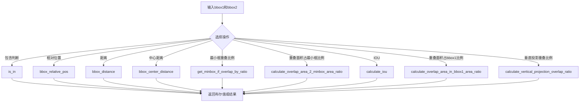
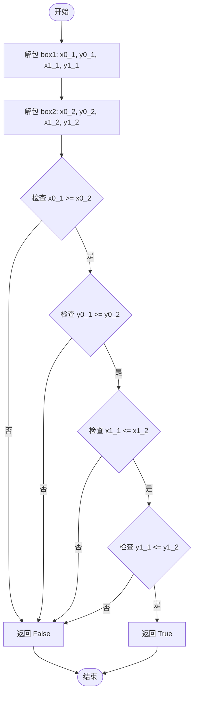
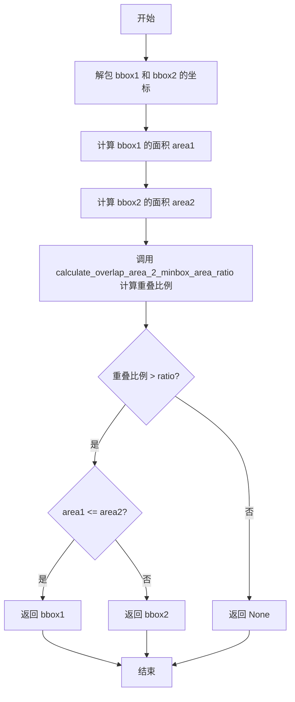
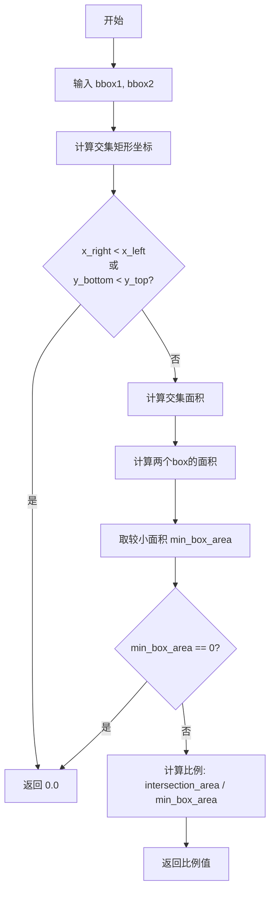

# `MinerU\mineru\utils\boxbase.py` 详细设计文档

该代码文件提供了一系列用于处理二维边界框（矩形框）的工具函数，包括判断包含关系、计算相对位置、欧氏距离、中心点距离、重叠面积、IOU以及垂直投影重叠比例等操作，主要用于目标检测、图像识别等场景中的边界框分析。

## 整体流程



## 类结构

```
Module: bbox_utils.py (全局函数模块，无类层次结构)
├── is_in (判断box1是否完全在box2内)
├── bbox_relative_pos (判断两个矩形框的相对位置)
├── bbox_distance (计算两个矩形框的距离)
├── bbox_center_distance (计算两个矩形框中心点之间的欧氏距离)
├── get_minbox_if_overlap_by_ratio (根据重叠比例返回最小框)
├── calculate_overlap_area_2_minbox_area_ratio (计算重叠面积占最小框面积的比例)
├── calculate_iou (计算两个边界框的交并比)
├── calculate_overlap_area_in_bbox1_area_ratio (计算重叠面积占bbox1面积的比例)
└── calculate_vertical_projection_overlap_ratio (计算垂直投影重叠比例)
```

## 全局变量及字段


    

## 全局函数及方法


### `is_in`

判断第一个矩形框（box1）是否完全包含在第二个矩形框（box2）内部。

参数：

- `box1`：`tuple[float, float, float, float]`，第一个矩形框的坐标，格式为 (x0, y0, x1, y1)，其中 (x0, y0) 为左上角坐标，(x1, y1) 为右下角坐标
- `box2`：`tuple[float, float, float, float]`，第二个矩形框的坐标，格式为 (x0, y0, x1, y1)，其中 (x0, y0) 为左上角坐标，(x1, y1) 为右下角坐标

返回值：`bool`，如果 box1 完全在 box2 内部则返回 True，否则返回 False

#### 流程图



#### 带注释源码

```python
def is_in(box1, box2) -> bool:
    """box1是否完全在box2里面."""
    # 解包第一个矩形框的坐标
    # box1 格式: (x0_1, y0_1, x1_1, y1_1) -> (左上角x, 左上角y, 右下角x, 右下角y)
    x0_1, y0_1, x1_1, y1_1 = box1
    
    # 解包第二个矩形框的坐标
    # box2 格式: (x0_2, y0_2, x1_2, y1_2) -> (左上角x, 左上角y, 右下角x, 右下角y)
    x0_2, y0_2, x1_2, y1_2 = box2

    # 判断 box1 是否完全在 box2 内部
    # 需要满足四个条件：
    # 1. box1 的左边界 >= box2 的左边界（box1 不在 box2 的左侧）
    # 2. box1 的上边界 >= box2 的上边界（box1 不在 box2 的上方）
    # 3. box1 的右边界 <= box2 的右边界（box1 不在 box2 的右侧）
    # 4. box1 的下边界 <= box2 的下边界（box1 不在 box2 的下方）
    return (
        x0_1 >= x0_2  # box1的左边界不在box2的左边外
        and y0_1 >= y0_2  # box1的上边界不在box2的上边外
        and x1_1 <= x1_2  # box1的右边界不在box2的右边外
        and y1_1 <= y1_2  # box1的下边界不在box2的下边外
    )
```


### `bbox_relative_pos`

该函数用于判断两个矩形边界框（bbox）之间的相对位置关系，通过比较两个矩形框的边界坐标来确定第一个矩形框相对于第二个矩形框位于左侧、右侧、上方还是下方。

参数：

- `bbox1`：`tuple`，第一个矩形框的坐标，格式为 (x1, y1, x1b, y1b)，其中 (x1, y1) 为左上角坐标，(x1b, y1b) 为右下角坐标
- `bbox2`：`tuple`，第二个矩形框的坐标，格式为 (x2, y2, x2b, y2b)，其中 (x2, y2) 为左上角坐标，(x2b, y2b) 为右下角坐标

返回值：`tuple`，返回四个布尔值 (left, right, bottom, top)，分别表示 bbox1 是否在 bbox2 的左侧、右侧、下方、上方

#### 流程图

```mermaid
flowchart TD
    A[开始 bbox_relative_pos] --> B[解包 bbox1 = x1, y1, x1b, y1b]
    B --> C[解包 bbox2 = x2, y2, x2b, y2b]
    C --> D[left = x2b < x1]
    D --> E[right = x1b < x2]
    E --> F[bottom = y2b < y1]
    F --> G[top = y1b < y2]
    G --> H[返回 (left, right, bottom, top)]
```

#### 带注释源码

```python
def bbox_relative_pos(bbox1, bbox2):
    """判断两个矩形框的相对位置关系.

    Args:
        bbox1: 一个四元组，表示第一个矩形框的左上角和右下角的坐标，格式为(x1, y1, x1b, y1b)
        bbox2: 一个四元组，表示第二个矩形框的左上角和右下角的坐标，格式为(x2, y2, x2b, y2b)

    Returns:
        一个四元组，表示矩形框1相对于矩形框2的位置关系，格式为(left, right, bottom, top)
        其中，left表示矩形框1是否在矩形框2的左侧，right表示矩形框1是否在矩形框2的右侧，
        bottom表示矩形框1是否在矩形框2的下方，top表示矩形框1是否在矩形框2的上方
    """
    # 解包第一个矩形框的坐标
    # x1, y1: 左上角坐标; x1b, y1b: 右下角坐标
    x1, y1, x1b, y1b = bbox1
    
    # 解包第二个矩形框的坐标
    # x2, y2: 左上角坐标; x2b, y2b: 右下角坐标
    x2, y2, x2b, y2b = bbox2

    # 判断 bbox1 是否在 bbox2 的左侧
    # 条件：bbox2 的右边界 (x2b) 小于 bbox1 的左边界 (x1)
    left = x2b < x1
    
    # 判断 bbox1 是否在 bbox2 的右侧
    # 条件：bbox1 的右边界 (x1b) 小于 bbox2 的左边界 (x2)
    right = x1b < x2
    
    # 判断 bbox1 是否在 bbox2 的下方
    # 条件：bbox2 的下边界 (y2b) 小于 bbox1 的上边界 (y1)
    # 注意：y轴向下为正方向，所以 y 值越大越靠下
    bottom = y2b < y1
    
    # 判断 bbox1 是否在 bbox2 的上方
    # 条件：bbox1 的下边界 (y1b) 小于 bbox2 的上边界 (y2)
    top = y1b < y2
    
    # 返回四个方向的位置关系布尔值
    return left, right, bottom, top
```


### `bbox_distance`

计算两个矩形框（Bounding Box）之间的最小距离，根据两个框的相对位置关系（上下左右、角落等）采用不同的距离计算策略。

参数：

- `bbox1`：`tuple`，第一个矩形框的坐标，格式为 (x1, y1, x2, y2)，其中 (x1, y1) 为左上角坐标，(x2, y2) 为右下角坐标
- `bbox2`：`tuple`，第二个矩形框的坐标，格式为 (x1, y1, x2, y2)，其中 (x1, y1) 为左上角坐标，(x2, y2) 为右下角坐标

返回值：`float`，矩形框之间的距离

#### 流程图

```mermaid
flowchart TD
    A[开始 bbox_distance] --> B[定义内部函数 dist 计算欧氏距离]
    B --> C[解包 bbox1: x1, y1, x1b, y1b]
    C --> D[解包 bbox2: x2, y2, x2b, y2b]
    D --> E[调用 bbox_relative_pos 获取相对位置]
    E --> F{top AND left?}
    F -->|Yes| G[返回 dist((x1,y1b), (x2b,y2))]
    F -->|No| H{left AND bottom?}
    H -->|Yes| I[返回 dist((x1,y1), (x2b,y2b))]
    H -->|No| J{bottom AND right?}
    J -->|Yes| K[返回 dist((x1b,y1), (x2,y2b))]
    J -->|No| L{right AND top?}
    L -->|Yes| M[返回 dist((x1b,y1b), (x2,y2))]
    L -->|No| N{left?}
    N -->|Yes| O[返回 x1 - x2b]
    N -->|No| P{right?}
    P -->|Yes| Q[返回 x2 - x1b]
    P -->|No| R{bottom?}
    R -->|Yes| S[返回 y1 - y2b]
    R -->|No| T{top?}
    T -->|Yes| U[返回 y2 - y1b]
    T -->|No| V[返回 0.0]
```

#### 带注释源码

```python
def bbox_distance(bbox1, bbox2):
    """计算两个矩形框的距离。

    Args:
        bbox1 (tuple): 第一个矩形框的坐标，格式为 (x1, y1, x2, y2)，其中 (x1, y1) 为左上角坐标，(x2, y2) 为右下角坐标。
        bbox2 (tuple): 第二个矩形框的坐标，格式为 (x1, y1, x2, y2)，其中 (x1, y1) 为左上角坐标，(x2, y2) 为右下角坐标。

    Returns:
        float: 矩形框之间的距离。
    """
    
    # 定义内部函数：计算两个点之间的欧氏距离
    def dist(point1, point2):
        return math.sqrt((point1[0] - point2[0]) ** 2 + (point1[1] - point2[1]) ** 2)

    # 解包第一个边界框坐标
    x1, y1, x1b, y1b = bbox1  # bbox1的左上角(x1,y1)和右下角(x1b,y1b)
    
    # 解包第二个边界框坐标
    x2, y2, x2b, y2b = bbox2  # bbox2的左上角(x2,y2)和右下角(x2b,y2b)

    # 获取两个边界框的相对位置关系
    # left: bbox1在bbox2左侧, right: bbox1在bbox2右侧
    # bottom: bbox1在bbox2下方, top: bbox1在bbox2上方
    left, right, bottom, top = bbox_relative_pos(bbox1, bbox2)

    # 情况1：bbox1在bbox2的左上角（对角关系）
    # 计算bbox1左下角到bbox2右上角的距离
    if top and left:
        return dist((x1, y1b), (x2b, y2))
    
    # 情况2：bbox1在bbox2的左下角（对角关系）
    # 计算bbox1左上角到bbox2右下角的距离
    elif left and bottom:
        return dist((x1, y1), (x2b, y2b))
    
    # 情况3：bbox1在bbox2的右下角（对角关系）
    # 计算bbox1右上角到bbox2左下角的距离
    elif bottom and right:
        return dist((x1b, y1), (x2, y2b))
    
    # 情况4：bbox1在bbox2的右上角（对角关系）
    # 计算bbox1右下角到bbox2左上角的距离
    elif right and top:
        return dist((x1b, y1b), (x2, y2))
    
    # 情况5：bbox1在bbox2左侧（水平距离）
    elif left:
        return x1 - x2b
    
    # 情况6：bbox1在bbox2右侧（水平距离）
    elif right:
        return x2 - x1b
    
    # 情况7：bbox1在bbox2下方（垂直距离）
    elif bottom:
        return y1 - y2b
    
    # 情况8：bbox1在bbox2上方（垂直距离）
    elif top:
        return y2 - y1b
    
    # 情况9：两个边界框重叠或接触，返回0
    return 0.0
```


### `bbox_center_distance`

计算两个矩形框中心点之间的欧氏距离。该函数接收两个边界框坐标，解包出左上角和右下角坐标，计算各自的几何中心点，然后使用欧几里得距离公式求出中心点间的距离。

参数：

- `bbox1`：`tuple`，第一个矩形框的坐标，格式为 (x1, y1, x2, y2)，其中 (x1, y1) 为左上角坐标，(x2, y2) 为右下角坐标
- `bbox2`：`tuple`，第二个矩形框的坐标，格式为 (x1, y1, x2, y2)，其中 (x1, y1) 为左上角坐标，(x2, y2) 为右下角坐标

返回值：`float`，两个矩形框中心点之间的欧氏距离

#### 流程图

```mermaid
flowchart TD
    A[开始 bbox_center_distance] --> B[解包 bbox1: x1, y1, x1b, y1b]
    B --> C[解包 bbox2: x2, y2, x2b, y2b]
    C --> D[计算 bbox1 中心点: center1_x = (x1 + x1b) / 2, center1_y = (y1 + y1b) / 2]
    D --> E[计算 bbox2 中心点: center2_x = (x2 + x2b) / 2, center2_y = (y2 + y2b) / 2]
    E --> F[计算欧氏距离: dist = sqrt((center1_x - center2_x)² + (center1_y - center2_y)²)]
    F --> G[返回距离值]
```

#### 带注释源码

```python
def bbox_center_distance(bbox1, bbox2):
    """计算两个矩形框中心点之间的欧氏距离。

    Args:
        bbox1 (tuple): 第一个矩形框的坐标，格式为 (x1, y1, x2, y2)
        bbox2 (tuple): 第二个矩形框的坐标，格式为 (x1, y1, x2, y2)

    Returns:
        float: 两个矩形框中心点之间的距离
    """
    # 解包第一个边界框的坐标
    # bbox1 格式: (x1, y1, x1b, y1b) -> (左上角x, 左上角y, 右下角x, 右下角y)
    x1, y1, x1b, y1b = bbox1
    
    # 解包第二个边界框的坐标
    # bbox2 格式: (x2, y2, x2b, y2b) -> (左上角x, 左上角y, 右下角x, 右下角y)
    x2, y2, x2b, y2b = bbox2

    # 计算第一个矩形框的中心点坐标
    # 中心点 x 坐标 = (左边界 + 右边界) / 2
    center1_x = (x1 + x1b) / 2
    # 中心点 y 坐标 = (上边界 + 下边界) / 2
    center1_y = (y1 + y1b) / 2

    # 计算第二个矩形框的中心点坐标
    center2_x = (x2 + x2b) / 2
    center2_y = (y2 + y2b) / 2

    # 使用欧几里得距离公式计算两个中心点之间的距离
    # 距离 = sqrt((x1 - x2)² + (y1 - y2)²)
    return math.sqrt((center1_x - center2_x) ** 2 + (center1_y - center2_y) ** 2)
```


### `get_minbox_if_overlap_by_ratio`

该函数通过计算两个边界框的重叠面积占较小边界框面积的比例，如果该比例超过指定阈值，则返回较小的那个边界框，否则返回None，常用于目标检测中的重叠框过滤场景。

参数：

- `bbox1`：`tuple`，第一个边界框的坐标，格式为 (x1, y1, x2, y2)，其中 (x1, y1) 为左上角坐标，(x2, y2) 为右下角坐标
- `bbox2`：`tuple`，第二个边界框的坐标，格式为 (x1, y1, x2, y2)，其中 (x1, y1) 为左上角坐标，(x2, y2) 为右下角坐标
- `ratio`：`float`，重叠比例阈值，用于判断两个边界框是否足够重叠

返回值：`tuple | None`，如果两个边界框的重叠比例大于指定的 ratio，则返回面积较小的那个边界框（bbox1 或 bbox2）；否则返回 None

#### 流程图



#### 带注释源码

```python
def get_minbox_if_overlap_by_ratio(bbox1, bbox2, ratio):
    """通过calculate_overlap_area_2_minbox_area_ratio计算两个bbox重叠的面积占最小面积的box的比例
    如果比例大于ratio，则返回小的那个bbox, 否则返回None."""
    # 解包第一个边界框的坐标
    x1_min, y1_min, x1_max, y1_max = bbox1
    # 解包第二个边界框的坐标
    x2_min, y2_min, x2_max, y2_max = bbox2
    
    # 计算第一个边界框的面积
    area1 = (x1_max - x1_min) * (y1_max - y1_min)
    # 计算第二个边界框的面积
    area2 = (x2_max - x2_min) * (y2_max - y2_min)
    
    # 计算两个边界框的重叠面积占较小面积的比例
    overlap_ratio = calculate_overlap_area_2_minbox_area_ratio(bbox1, bbox2)
    
    # 判断重叠比例是否超过阈值
    if overlap_ratio > ratio:
        # 如果第一个边界框面积小于等于第二个边界框面积，返回第一个边界框
        if area1 <= area2:
            return bbox1
        # 否则返回第二个边界框
        else:
            return bbox2
    else:
        # 重叠比例未超过阈值，返回 None
        return None
```


### `calculate_overlap_area_2_minbox_area_ratio`

该函数用于计算两个矩形边界框（Bounding Box）的重叠面积占两者中面积较小的那个边界框面积的比例，常用于目标检测中判断两个框的重叠程度是否超过指定阈值。

参数：

- `bbox1`：`tuple[float, float, float, float]`，第一个矩形边界框，格式为 (x1, y1, x2, y2)，其中 (x1, y1) 为左上角坐标，(x2, y2) 为右下角坐标
- `bbox2`：`tuple[float, float, float, float]`，第二个矩形边界框，格式同 bbox1

返回值：`float`，返回值范围为 [0, 1]，表示重叠面积占最小边界框面积的比例。当两个边界框不相交时返回 0.0，当完全重合时返回 1.0

#### 流程图



#### 带注释源码

```python
def calculate_overlap_area_2_minbox_area_ratio(bbox1, bbox2):
    """计算box1和box2的重叠面积占最小面积的box的比例.
    
    Args:
        bbox1: 第一个矩形框的坐标，格式为 (x1, y1, x2, y2)
        bbox2: 第二个矩形框的坐标，格式为 (x1, y1, x2, y2)
    
    Returns:
        float: 重叠面积占最小box面积的比例，取值范围为 [0, 1]
    """
    # 确定交集矩形的边界坐标
    # 取两个bbox左上角坐标的最大值作为交集矩形的左上角
    x_left = max(bbox1[0], bbox2[0])
    y_top = max(bbox1[1], bbox2[1])
    # 取两个bbox右下角坐标的最小值作为交集矩形的右下角
    x_right = min(bbox1[2], bbox2[2])
    y_bottom = min(bbox1[3], bbox2[3])

    # 判断两个矩形是否相交
    # 如果交集矩形的右边框在左边框左侧，或下边框在上边框上方，则无交集
    if x_right < x_left or y_bottom < y_top:
        return 0.0

    # 计算交集区域的面积
    # 交集宽度 * 交集高度
    intersection_area = (x_right - x_left) * (y_bottom - y_top)
    
    # 计算两个bbox各自的面积
    # 面积 = (x2 - x1) * (y2 - y1)
    bbox1_area = (bbox1[2] - bbox1[0]) * (bbox1[3] - bbox1[1])
    bbox2_area = (bbox2[2] - bbox2[0]) * (bbox2[3] - bbox2[1])
    
    # 取两个面积中的较小值
    min_box_area = min([bbox1_area, bbox2_area])
    
    # 防止除零错误
    if min_box_area == 0:
        return 0
    else:
        # 返回重叠面积占最小box面积的比例
        return intersection_area / min_box_area
```


### `calculate_iou`

计算两个边界框的交并比（Intersection over Union，IoU），用于衡量两个矩形框的重叠程度，取值范围为 [0, 1]，其中 1 表示完全重叠，0 表示完全不重叠。

参数：

- `bbox1`：`list[float]`，第一个边界框的坐标，格式为 [x1, y1, x2, y2]，其中 (x1, y1) 为左上角坐标，(x2, y2) 为右下角坐标
- `bbox2`：`list[float]`，第二个边界框的坐标，格式与 `bbox1` 相同

返回值：`float`，两个边界框的交并比（IOU），取值范围为 [0, 1]

#### 流程图

```mermaid
flowchart TD
    A[开始 calculate_iou] --> B[获取交集区域坐标]
    B --> C{x_right < x_left or y_bottom < y_top?}
    C -->|是| D[返回 0.0 - 不重叠]
    C -->|否| E[计算交集面积 intersection_area]
    E --> F[计算 bbox1 面积]
    F --> G[计算 bbox2 面积]
    G --> H{bbox1_area == 0 or bbox2_area == 0?}
    H -->|是| I[返回 0 - 存在面积为0的框]
    H -->|否| J[计算 IoU = intersection_area / (bbox1_area + bbox2_area - intersection_area)]
    J --> K[返回 IoU]
```

#### 带注释源码

```python
def calculate_iou(bbox1, bbox2):
    """计算两个边界框的交并比(IOU)。

    Args:
        bbox1 (list[float]): 第一个边界框的坐标，格式为 [x1, y1, x2, y2]，其中 (x1, y1) 为左上角坐标，(x2, y2) 为右下角坐标。
        bbox2 (list[float]): 第二个边界框的坐标，格式与 `bbox1` 相同。

    Returns:
        float: 两个边界框的交并比(IOU)，取值范围为 [0, 1]。
    """
    # 确定交集矩形的坐标：取两个框左上角的最大值作为交集左上角，右下角的最小值作为交集右下角
    x_left = max(bbox1[0], bbox2[0])
    y_top = max(bbox1[1], bbox2[1])
    x_right = min(bbox1[2], bbox2[2])
    y_bottom = min(bbox1[3], bbox2[3])

    # 如果交集矩形的右边小于左边，或下边小于上边，说明两个框不重叠
    if x_right < x_left or y_bottom < y_top:
        return 0.0

    # 计算交集面积
    intersection_area = (x_right - x_left) * (y_bottom - y_top)

    # 计算两个矩形各自的面积
    bbox1_area = (bbox1[2] - bbox1[0]) * (bbox1[3] - bbox1[1])
    bbox2_area = (bbox2[2] - bbox2[0]) * (bbox2[3] - bbox2[1])

    # 如果任一矩形面积为0，返回0（避免除零错误）
    if any([bbox1_area == 0, bbox2_area == 0]):
        return 0

    # 计算交并比：交集面积 / (box1面积 + box2面积 - 交集面积)
    # 即：交集面积 / 并集面积
    iou = intersection_area / float(bbox1_area + bbox2_area - intersection_area)

    return iou
```


### `calculate_overlap_area_in_bbox1_area_ratio`

该函数用于计算两个矩形边界框（Bounding Box）的重叠区域面积占第一个边界框（bbox1）面积的比例，常用于目标检测中的重叠度评估。

参数：

- `bbox1`：`tuple`，第一个矩形边界框的坐标，格式为 `(x1, y1, x2, y2)`，其中 `(x1, y1)` 为左上角坐标，`(x2, y2)` 为右下角坐标
- `bbox2`：`tuple`，第二个矩形边界框的坐标，格式为 `(x1, y1, x2, y2)`，其中 `(x1, y1)` 为左上角坐标，`(x2, y2)` 为右下角坐标

返回值：`float`，重叠面积占 bbox1 面积的比例，取值范围为 [0, 1]

#### 流程图

```mermaid
flowchart TD
    A[开始] --> B[输入 bbox1, bbox2]
    B --> C[计算交集左边界: x_left = max(bbox1[0], bbox2[0])]
    C --> D[计算交集上边界: y_top = max(bbox1[1], bbox2[1])]
    D --> E[计算交集右边界: x_right = min(bbox1[2], bbox2[2])]
    E --> F[计算交集下边界: y_bottom = min(bbox1[3], bbox2[3])]
    F --> G{判断是否有交集}
    G -->|否| H[返回 0.0]
    G -->|是| I[计算交集面积: intersection_area = (x_right - x_left) * (y_bottom - y_top)]
    I --> J[计算 bbox1 面积: bbox1_area = (bbox1[2] - bbox1[0]) * (bbox1[3] - bbox1[1])]
    J --> K{bbox1_area == 0?}
    K -->|是| H
    K -->|否| L[计算比例: intersection_area / bbox1_area]
    L --> M[返回比例值]
    H --> N[结束]
    M --> N
```

#### 带注释源码

```python
def calculate_overlap_area_in_bbox1_area_ratio(bbox1, bbox2):
    """计算box1和box2的重叠面积占bbox1的比例."""
    # 确定交集矩形的边界坐标
    # 取两个 bbox 在 x 轴上的最大左边界和最小右边界
    x_left = max(bbox1[0], bbox2[0])
    # 取两个 bbox 在 y 轴上的最大上边界和最小下边界
    y_top = max(bbox1[1], bbox2[1])
    x_right = min(bbox1[2], bbox2[2])
    y_bottom = min(bbox1[3], bbox2[3])

    # 判断两个矩形是否有交集
    # 如果右边界小于左边界，或者下边界小于上边界，则无交集
    if x_right < x_left or y_bottom < y_top:
        return 0.0

    # 计算交集区域的面积
    # 交集宽度 * 交集高度
    intersection_area = (x_right - x_left) * (y_bottom - y_top)
    
    # 计算 bbox1 的面积
    # 宽度 * 高度
    bbox1_area = (bbox1[2] - bbox1[0]) * (bbox1[3] - bbox1[1])
    
    # 防止除零错误
    if bbox1_area == 0:
        return 0
    else:
        # 返回重叠面积占 bbox1 面积的比例
        return intersection_area / bbox1_area
```


### `calculate_vertical_projection_overlap_ratio`

计算两个矩形块在x轴方向上的垂直投影重叠比例，用于衡量两个块在水平方向上的重叠程度。

参数：

- `block1`：`tuple`，第一个块的坐标，格式为 (x0, y0, x1, y1)，其中 (x0, y0) 为左上角坐标，(x1, y1) 为右下角坐标
- `block2`：`tuple`，第二个块的坐标，格式为 (x0, y0, x1, y1)，其中 (x0, y0) 为左上角坐标，(x1, y1) 为右下角坐标

返回值：`float`，两个块的垂直投影在x轴上重叠的比例，取值范围为 [0, 1]

#### 流程图

```mermaid
flowchart TD
    A[开始] --> B[输入block1, block2]
    B --> C[提取block1的x坐标: x0_1, x1_1]
    C --> D[提取block2的x坐标: x0_2, x1_2]
    D --> E[计算交集左边界: x_left = max(x0_1, x0_2)]
    E --> F[计算交集右边界: x_right = min(x1_1, x1_2)]
    F --> G{判断 x_right < x_left?}
    G -->|是| H[返回 0.0]
    G -->|否| I[计算交集长度: intersection_length = x_right - x_left]
    I --> J[计算block1在x轴的长度: block1_length = x1_1 - x0_1]
    J --> K{判断 block1_length == 0?}
    K -->|是| H
    K -->|否| L[计算重叠比例: ratio = intersection_length / block1_length]
    L --> M[返回 ratio]
```

#### 带注释源码

```python
def calculate_vertical_projection_overlap_ratio(block1, block2):
    """
    Calculate the proportion of the x-axis covered by the vertical projection of two blocks.

    Args:
        block1 (tuple): Coordinates of the first block (x0, y0, x1, y1).
        block2 (tuple): Coordinates of the second block (x0, y0, x1, y1).

    Returns:
        float: The proportion of the x-axis covered by the vertical projection of the two blocks.
    """
    # 从block1中提取x坐标，忽略y坐标（下划线表示不需要）
    x0_1, _, x1_1, _ = block1
    # 从block2中提取x坐标，忽略y坐标
    x0_2, _, x1_2, _ = block2

    # 计算两个块在x轴上的交集边界
    # 取两个块左边界中的最大值作为交集左边界
    x_left = max(x0_1, x0_2)
    # 取两个块右边界中的最小值作为交集右边界
    x_right = min(x1_1, x1_2)

    # 判断两个块在x轴上是否有交集
    # 如果右边界小于左边界，说明没有交集，返回0.0
    if x_right < x_left:
        return 0.0

    # 计算交集的长度
    intersection_length = x_right - x_left

    # 计算第一个块在x轴上的投影长度
    block1_length = x1_1 - x0_1

    # 如果第一个块的长度为0，避免除零错误，返回0.0
    if block1_length == 0:
        return 0.0

    # 计算交集长度占第一个块长度的比例
    # 即两个块垂直投影在x轴上的重叠比例
    # logger.info(f"intersection_length: {intersection_length}, block1_length: {block1_length}")
    return intersection_length / block1_length
```

## 关键组件


### 边界框相对位置判断组件

用于判断两个矩形框的相对位置关系，包括左侧、右侧、上方、下方等位置关系。

### 边界框距离计算组件

计算两个矩形框之间的最短距离，考虑各种相对位置情况（对角线、水平、垂直等）。

### 边界框中心点距离计算组件

计算两个矩形框中心点之间的欧氏距离。

### 边界框重叠面积计算组件

计算两个矩形框重叠面积的多种度量方式：占最小box面积的比例、占box1面积的比例等。

### IOU（交并比）计算组件

计算两个边界框的交并比（Intersection over Union），是目标检测中常用的评估指标。

### 垂直投影重叠比例计算组件

计算两个块在x轴上的垂直投影重叠比例，用于判断块之间的水平对齐程度。

### 边界框包含判断组件

判断一个边界框是否完全包含在另一个边界框内部。


## 问题及建议


### 已知问题

-   **坐标表示不一致**：代码中混用了多种坐标命名方式，如 `x0_1, y0_1, x1_1, y1_1`（is_in函数）与 `x1, y1, x1b, y1b`（其他函数），容易造成混淆
-   **重复代码**：多个函数（如 `calculate_iou`、`calculate_overlap_area_in_bbox1_area_ratio`、`calculate_overlap_area_2_minbox_area_ratio`）都重复计算了交集坐标 `x_left, y_top, x_right, y_bottom`
-   **缺乏输入验证**：所有函数均未对输入的合法性进行校验，如坐标数据类型、坐标顺序（x1<x1b, y1<y1b）等，可能导致意外错误或难以调试的行为
-   **内部函数定义**：`bbox_distance` 函数内部定义了 `dist` 函数，增加了函数复杂度且无法被复用
-   **注释错误**：`is_in` 函数注释中存在笔误"下边界不在box2的下边外"，且注释不完整（缺少返回值描述）
-   **函数命名不一致**：部分函数使用缩写（如 `bbox_distance`、`calculate_iou`），部分使用完整单词（如 `bbox_center_distance`），缺乏统一的命名规范
-   **冗余计算**：在 `calculate_iou` 中先计算了 `bbox1_area` 和 `bbox2_area`，后续计算 `min_box_area` 时又重复计算了面积，可优化
-   **魔法数字**：如 `ratio` 参数没有提供默认值，且缺乏对其有效范围（0-1）的校验

### 优化建议

-   **统一坐标表示**：统一使用 `x1, y1, x2, y2` 或 `x_min, y_min, x_max, y_max` 表示矩形框，并保持所有函数一致
-   **提取公共函数**：将计算交集坐标的代码提取为独立的辅助函数，如 `get_intersection_coords(bbox1, bbox2)`，减少代码重复
-   **添加输入验证**：在函数入口添加参数校验，如类型检查、坐标顺序检查、零面积矩形处理等
-   **重构内部函数**：将 `dist` 函数移至模块级别作为全局函数，或使用 `math.hypot` 替代
-   **完善文档**：为所有函数补充完整的文档字符串，包括返回值描述；修正注释中的错别字
-   **统一命名规范**：采用一致的函数命名风格（如全部使用下划线分隔的全小写命名）
-   **优化性能**：避免重复计算面积，可预先计算并存入变量
-   **添加类型注解**：为所有函数参数和返回值添加类型提示，提高代码可读性和可维护性
-   **添加单元测试**：补充对边界情况（如空矩形、重叠、零面积等）的测试用例

## 其它


### 设计目标与约束

本模块的设计目标是为二维矩形框（边界框/bounding box）提供一套完整的几何计算工具函数，主要用于目标检测、图像处理、碰撞检测等场景。约束条件包括：1）输入的边界框坐标格式统一为(x1, y1, x2, y2)，其中(x1, y1)为左上角坐标，(x2, y2)为右下角坐标；2）所有坐标值应为数值类型（int或float）；3）假设输入的边界框是有效的（即x1 <= x2, y1 <= y2）；4）函数设计为纯函数，无副作用，便于并行调用。

### 错误处理与异常设计

当前代码采用防御式编程风格，对于无效输入（如重叠面积为0、除数为0等情况）直接返回0或False，而非抛出异常。具体处理方式包括：1）在计算重叠相关指标时，先判断是否真的存在重叠（x_right < x_left or y_bottom < y_top），若不存在则返回0.0；2）在计算比值时检查分母是否为0，若为0则返回0；3）所有函数均未进行输入类型和数值合法性的校验。改进建议：可考虑添加输入验证函数，对输入的bbox格式、类型、数值范围进行统一校验，并根据业务需求决定是抛出异常还是返回默认值。

### 数据流与状态机

本模块的数据流较为简单，属于无状态函数集合。输入为两个边界框的四元组，输出为计算结果（布尔值、浮点数或四元组）。数据流方向为：外部调用者 → 输入参数解析 → 核心计算逻辑 → 返回值。模块内部函数存在依赖关系：bbox_distance依赖bbox_relative_pos的结果；get_minbox_if_overlap_by_ratio依赖calculate_overlap_area_2_minbox_area_ratio的结果；多个函数（如calculate_iou、calculate_overlap_area_2_minbox_area_ratio、calculate_overlap_area_in_bbox1_area_ratio）有重复的交集区域计算逻辑，存在优化空间。

### 外部依赖与接口契约

本模块仅依赖Python标准库math模块，无第三方依赖。接口契约如下：所有bbox相关函数接受两个参数bbox1和bbox2，均为四元组类型tuple[float]，格式统一为(x1, y1, x2, y2)；ratio参数为浮点数，取值范围通常为[0, 1]；返回值类型包括bool、float、tuple(bool, bool, bool, bool)、tuple(float, float, float, float)或None。调用者需保证输入格式正确，且x1 <= x2, y1 <= y2。

### 算法复杂度分析

各主要函数的时间复杂度如下：is_in、bbox_relative_pos、bbox_center_distance为O(1)；bbox_distance包含条件分支，但基本为O(1)；calculate_iou、calculate_overlap_area_2_minbox_area_ratio、calculate_overlap_area_in_bbox1_area_ratio、calculate_vertical_projection_overlap_ratio均包含交集计算，时间复杂度为O(1)。空间复杂度方面，所有函数均为O(1)，仅使用常数个临时变量。

### 边界条件处理

代码对以下边界条件进行了处理：1）边界框完全不相交的情况：返回0.0或False；2）边界框面积为0的情况：返回0避免除零错误；3）边界框刚好相切（边缘接触）的情况：视为不相交，返回0.0；4）边界框完全重合的情况：calculate_iou返回1.0。潜在未处理边界：1）输入坐标为负数的情况；2）输入坐标数值非常大的情况可能导致浮点精度问题；3）输入为非数值类型的情况。

### 单元测试建议

建议覆盖以下测试场景：1）边界框完全不相交的情况；2）边界框完全包含的情况；3）边界框部分重叠的情况；4）边界框刚好相切的情况；5）边界框完全重合的情况；6）边界框面积为0的情况（退化为点或线）；7）负坐标输入；8）大规模坐标输入测试浮点精度；9）ratio参数的边界值测试（0、0.5、1.0）。

### 性能考虑与优化建议

当前实现存在以下优化空间：1）calculate_overlap_area_2_minbox_area_ratio和calculate_iou中有重复的交集计算逻辑，可提取公共函数compute_intersection；2）bbox_distance函数中多次调用bbox_relative_pos，可优化为直接计算；3）可考虑使用numpy向量化操作批量计算多个边界框的距离或IOU，适用于大规模数据处理场景；4）对于极端坐标值，可考虑使用decimal模块提高精度；5）可添加缓存机制（lru_cache）存储已计算的结果，当相同边界框重复计算时提高性能。
    