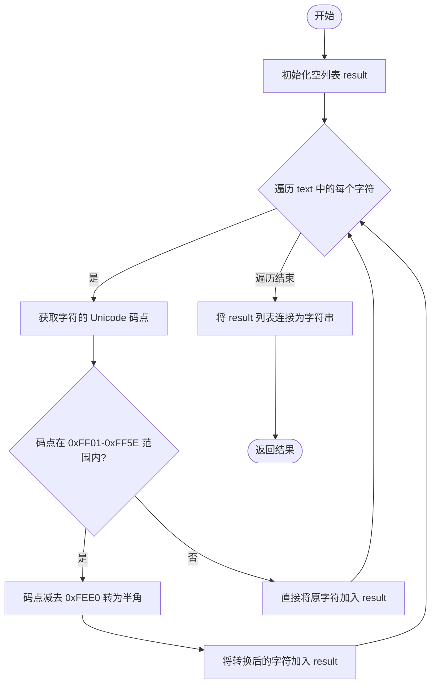

# `MinerU\mineru\utils\char_utils.py` 详细设计文档

提供全角到半角字符转换的工具模块，包含两个转换函数（分别处理标点符号和全部字符）以及一个行尾连字符检查辅助函数，主要用于文本规范化处理场景。

## 整体流程

```mermaid
graph TD
    A[开始] --> B{调用函数}
    B --> C[is_hyphen_at_line_end]
    B --> D[full_to_half_exclude_marks]
    B --> E[full_to_half]

    C --> C1[接收line参数]
    C1 --> C2[使用正则 r'[A-Za-z]+-\s*$' 匹配]
    C2 --> C3{匹配成功?}
    C3 -- 是 --> C4[返回True]
    C3 -- 否 --> C5[返回False]

    D --> D1[接收text参数]
    D1 --> D2[遍历text中每个字符]
    D2 --> D3{字符码点在FF21-FF3A 或 FF41-FF5A 或 FF10-FF19?}
    D3 -- 是 --> D4[code - 0xFEE0 转半角]
    D3 -- 否 --> D5[保留原字符]
    D4 --> D6[追加到result列表]
    D5 --> D6
    D6 --> D7{还有更多字符?}
    D7 -- 是 --> D2
    D7 -- 否 --> D8[返回''.join(result)]

    E --> E1[接收text参数]
    E1 --> E2[遍历text中每个字符]
    E2 --> E3{字符码点在FF01-FF5E?}
    E3 -- 是 --> E4[code - 0xFEE0 转半角]
    E3 -- 否 --> E5[保留原字符]
    E4 --> E6[追加到result列表]
    E5 --> E6
    E6 --> E7{还有更多字符?}
    E7 -- 是 --> E2
    E7 -- 否 --> E8[返回''.join(result)]
```

## 类结构

```
utils.py (工具模块，无类)
└── 全局函数集合
    ├── is_hyphen_at_line_end
    ├── full_to_half_exclude_marks
    └── full_to_half
```

## 全局变量及字段


### `re`
    
Python正则表达式模块，用于模式匹配

类型：`module`
    


    

## 全局函数及方法


### `is_hyphen_at_line_end`

检查一行是否以一个或多个字母后跟连字符结尾，常用于文本处理中判断行是否在单词中间被断开（如连字符连接的分行词）。

参数：

- `line`：`str`，要检查的文本行

返回值：`bool`，如果行以一个或多个字母后跟连字符结尾则返回 `True`，否则返回 `False`

#### 流程图

```mermaid
flowchart TD
    A[开始] --> B[接收line参数]
    B --> C{检查line是否匹配正则<br/>r'[A-Za-z]+-\s*$'}
    C -->|匹配| D[返回True]
    C -->|不匹配| E[返回False]
    D --> F[结束]
    E --> F
```

#### 带注释源码

```python
def is_hyphen_at_line_end(line):
    """Check if a line ends with one or more letters followed by a hyphen.

    Args:
    line (str): The line of text to check.

    Returns:
    bool: True if the line ends with one or more letters followed by a hyphen, False otherwise.
    """
    # Use regex to check if the line ends with one or more letters followed by a hyphen
    # 正则解释:
    # [A-Za-z]+ - 匹配一个或多个字母
    # -         - 匹配连字符
    # \s*       - 匹配零个或多个空白字符
    # $         - 行尾锚点
    return bool(re.search(r'[A-Za-z]+-\s*$', line))
```


### `full_to_half_exclude_marks`

该函数用于将文本中的全角字母和数字转换为半角形式，同时保留标点符号和其他字符不变，通过Unicode码点偏移实现全角到半角的映射转换。

参数：

- `text`：`str`，需要转换的包含全角字符的字符串

返回值：`str`，将全角字母和数字转换为半角后的字符串

#### 流程图

```mermaid
flowchart TD
    A([开始]) --> B[输入字符串 text]
    B --> C[初始化空列表 result]
    C --> D{遍历 text 中的每个字符}
    D --> E[获取当前字符的 Unicode 码点 code = ord(char)]
    F{判断码点范围} -->|0xFF21 ≤ code ≤ 0xFF3A<br>全角大写字母| G[执行 code - 0xFEE0]
    F -->|0xFF41 ≤ code ≤ 0xFF5A<br>全角小写字母| G
    F -->|0xFF10 ≤ code ≤ 0xFF19<br>全角数字| G
    F -->|其他码点| H[保留原字符]
    G --> I[chr转换后添加到 result]
    H --> I
    I --> J{还有更多字符?}
    J -->|是| D
    J -->|否| K[''.join(result)]
    K --> L([返回转换后的字符串])
```

#### 带注释源码

```python
def full_to_half_exclude_marks(text: str) -> str:
    """Convert full-width characters to half-width characters using code point manipulation.

    Args:
        text: String containing full-width characters

    Returns:
        String with full-width characters converted to half-width
    """
    result = []  # 用于存储转换后的字符列表
    for char in text:  # 遍历输入字符串的每个字符
        code = ord(char)  # 获取当前字符的 Unicode 码点（十进制）
        
        # Full-width letters and numbers 
        # 全角大写字母范围: 0xFF21-0xFF3A (Ａ-Ｚ)
        # 全角小写字母范围: 0xFF41-0xFF5A (ａ-ｚ)
        # 全角数字范围: 0xFF10-0xFF19 (０-９)
        if (0xFF21 <= code <= 0xFF3A) or (0xFF41 <= code <= 0xFF5A) or (0xFF10 <= code <= 0xFF19):
            # 通过减去 0xFEE0 将全角字符码点转换为对应的 ASCII 码点
            # 例如: 'Ａ'(0xFF21) - 0xFEE0 = 'A'(0x0041)
            result.append(chr(code - 0xFEE0))
        else:
            # 非全角字母/数字，保持原字符不变（标点符号等被排除）
            result.append(char)
    
    # 将字符列表重新组合为字符串并返回
    return ''.join(result)
```


### `full_to_half`

将全角字符（包含字母、数字和标点符号）转换为对应的半角字符，通过码点偏移实现。

参数：

- `text`：`str`，包含全角字符的字符串

返回值：`str`，全角字符转换为半角字符后的字符串

#### 流程图



#### 带注释源码

```python
def full_to_half(text: str) -> str:
    """Convert full-width characters to half-width characters using code point manipulation.

    Args:
        text: String containing full-width characters

    Returns:
        String with full-width characters converted to half-width
    """
    result = []  # 用于存储转换后的字符列表
    for char in text:  # 遍历输入字符串的每个字符
        code = ord(char)  # 获取当前字符的 Unicode 码点
        # Full-width letters, numbers and punctuation (FF01-FF5E)
        if 0xFF01 <= code <= 0xFF5E:  # 判断是否为全角字符范围
            result.append(chr(code - 0xFEE0))  # Shift to ASCII range 将码点偏移转换为半角字符
        else:
            result.append(char)  # 非全角字符直接保留
    return ''.join(result)  # 将字符列表连接成字符串并返回
```

## 关键组件


### is_hyphen_at_line_end

检测文本行是否以一个或多个字母后跟连字符结尾，用于识别需要换行的连字符标记。

### full_to_half_exclude_marks

将全角字母（A-Z, a-z）和数字（0-9）转换为对应的半角字符，但排除标点符号的转换。

### full_to_half

将所有全角字符（字母、数字、标点符号，范围0xFF01-0xFF5E）转换为对应的半角字符。

### Unicode码点转换逻辑

使用Unicode码点偏移量0xFEE0将全角字符映射到半角ASCII范围，是全角/半角转换的核心算法。

### 正则表达式匹配

使用正则表达式`[A-Za-z]+-\s*$`匹配行尾的字母连字符模式，用于文本处理中的行分割逻辑。


## 问题及建议


### 已知问题

-   **正则表达式未预编译**：`is_hyphen_at_line_end` 函数每次调用都重新编译相同的正则表达式 `r'[A-Za-z]+-\s*$'`，在循环或高频调用场景下会产生性能开销
-   **代码重复**：`full_to_half_exclude_marks` 和 `full_to_half` 两个函数结构高度相似，遍历逻辑完全相同，仅在判断条件上有差异，存在明显的代码重复问题
-   **字符串构建效率低**：两个全角转半角函数都使用 `result.append()` 循环后 `''.join(result)` 的方式，可以改用更简洁的列表推导式或 `str.translate()` 方法提升可读性和性能
-   **硬编码Unicode范围缺乏说明**：代码中使用了 `0xFF21`, `0xFF3A`, `0xFEE0` 等Magic Number，虽然有注释说明但缺乏对这些Unicode码点具体含义的清晰解释
-   **类型注解不完整**：`is_hyphen_at_line_end` 函数的参数和返回值缺少类型注解，与其他两个函数的风格不一致
-   **函数命名歧义**：`full_to_half_exclude_marks` 函数名中的 "exclude_marks" 表述不够明确，调用者可能误解其具体排除的字符类型

### 优化建议

-   **预编译正则表达式**：将正则表达式提升为模块级常量，使用 `re.compile()` 预编译
    ```python
    _HYPHEN_END_PATTERN = re.compile(r'[A-Za-z]+-\s*$')
    ```
-   **合并重复逻辑**：可以通过参数化或策略模式合并 `full_to_half_exclude_marks` 和 `full_to_half` 的共同逻辑，或使用 `str.translate()` 方法更优雅地实现
    ```python
    def full_to_half(text: str, include_punctuation: bool = False) -> str:
        # 使用translate方法或列表推导式
    ```
-   **使用列表推导式**：将循环构建列表改为列表推导式，提升代码简洁性和性能
-   **提取Magic Number**：将Unicode范围定义为具名常量或枚举类，提高代码可维护性
-   **补充类型注解**：为 `is_hyphen_at_line_end` 添加完整的类型注解 `-> bool`
-   **改进函数命名**：考虑将 `full_to_half_exclude_marks` 重命名为更清晰的名称，如 `full_to_half_alphanumeric`


## 其它


### 设计目标与约束

本模块主要用于全角字符（full-width）到半角字符（half-width）的转换，以及简单的文本行格式检查。设计目标包括：1）提供两种转换模式，分别处理纯字母数字和包含标点符号的完整全角字符集；2）通过Unicode码点直接计算转换，避免复杂的映射表；3）保持函数简单、纯粹，便于独立使用和测试。

### 错误处理与异常设计

本模块采用防御性编程策略，但由于函数逻辑简单，错误场景有限。主要考虑：1）输入验证：假设输入为字符串类型，若传入非字符串应抛出TypeError；2）空输入处理：空字符串输入应返回空字符串；3）异常传播：不做额外的异常捕获，让调用方处理可能的异常。

### 数据流与状态机

数据流较为简单：输入字符串 → 逐字符遍历 → 字符类型判断 → 码点转换或保留 → 结果拼接。无状态机设计，函数为纯函数，无副作用。

### 外部依赖与接口契约

本模块仅依赖Python标准库`re`模块（用于正则表达式），无其他第三方依赖。接口契约：1）所有函数接收字符串参数，返回字符串；2）`is_hyphen_at_line_end`返回布尔值；3）输入输出均为Unicode字符串。

### 性能考虑

当前实现使用列表追加后join的方式，在Python中这是高效的字符串构建方式。对于超长文本，复杂度为O(n)。潜在优化点：对于大规模文本处理，可考虑使用生成器或内存映射，但当前实现对于一般文本处理已足够高效。

### 安全性考虑

本模块不涉及文件操作、网络通信或用户输入验证，安全性风险较低。主要注意：1）输入验证防止类型错误；2）不执行任何代码解析或eval操作。

### 测试策略

建议测试用例包括：1）空字符串边界测试；2）全角字母数字转换测试；3）混合全角半角字符测试；4）标点符号转换测试（区分两个转换函数）；5）Unicode边界字符测试；6）连字符行尾检测各种场景。

### 使用示例

```python
# 全角转半角
full_text = "ＡＢＣ１２３！"
print(full_to_half(full_text))  # 输出: ABC123!

# 排除标点符号的转换
print(full_to_half_exclude_marks(full_text))  # 输出: ABC123！

# 检查行尾连字符
line = "hello-"
print(is_hyphen_at_line_end(line))  # 输出: True
```

### 版本历史

当前版本：1.0.0

变更记录：
- 初始版本，实现全角转半角转换功能和行尾连字符检测功能

    