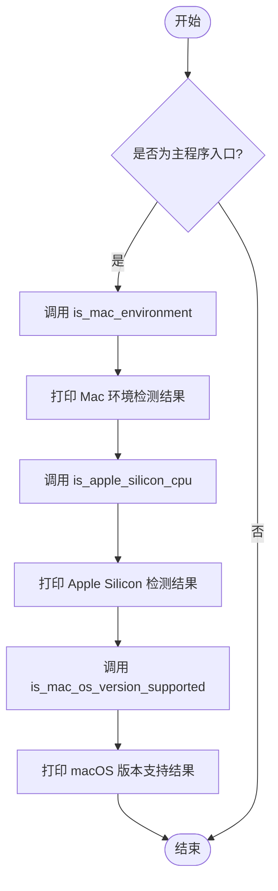
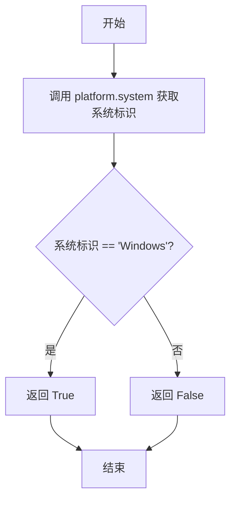
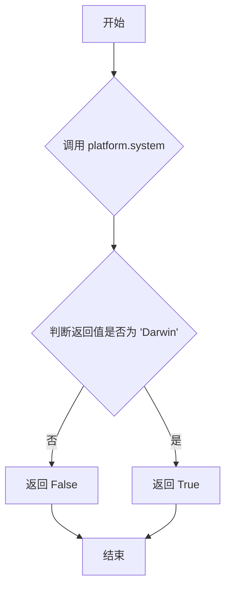
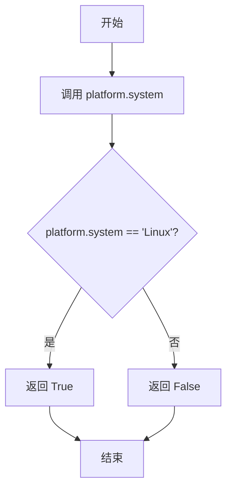

# `MinerU\mineru\utils\check_sys_env.py` 详细设计文档

该代码是一个跨平台环境检测工具，通过Python标准库`platform`模块和`packaging`库，检测当前操作系统类型（Windows/macOS/Linux）、CPU架构（特别是Apple Silicon），并验证macOS版本是否满足最低要求（>=13.5），主要用于兼容性检查。

## 整体流程



## 类结构

```
无类层次结构（该代码仅包含全局函数）
```

## 全局变量及字段


### `platform`
    
Python内置模块，用于获取操作系统和硬件信息

类型：`module`
    


### `version`
    
packaging模块的子模块，用于版本解析和比较

类型：`module`
    


    

## 全局函数及方法


### `is_windows_environment`

该函数用于检测当前运行环境是否为 Windows 操作系统，通过调用 Python 标准库的 `platform.system()` 方法获取系统标识符并与 "Windows" 字符串进行比较后返回布尔值结果。

参数： 无

返回值：`bool`，返回 `True` 表示当前环境是 Windows 系统，返回 `False` 表示当前环境不是 Windows 系统。

#### 流程图



#### 带注释源码

```python
# 导入 platform 模块，用于获取底层平台信息
import platform

# 从 packaging 模块导入 version，用于版本比较（虽然此函数未直接使用，但同文件其他函数使用）
from packaging import version


def is_windows_environment() -> bool:
    """
    检测当前运行环境是否为 Windows 操作系统。
    
    Returns:
        bool: 如果当前操作系统是 Windows 则返回 True，否则返回 False
    """
    # 调用 platform.system() 获取当前操作系统名称
    # 在 Windows 上返回 'Windows'，在 macOS 上返回 'Darwin'，在 Linux 上返回 'Linux'
    return platform.system() == "Windows"
```


### `is_mac_environment`

检测当前运行环境是否为 macOS (Mac 计算机)环境。

参数：

- 无参数

返回值：`bool`，返回 `True` 表示当前环境是 macOS 系统，返回 `False` 表示不是 macOS 系统。

#### 流程图



#### 带注释源码

```python
# Detect if the current environment is a Mac computer
def is_mac_environment() -> bool:
    """
    检测当前环境是否为 macOS (Mac 计算机) 环境。
    
    Returns:
        bool: 如果当前操作系统是 Darwin (macOS的内核)，返回 True；否则返回 False。
    """
    return platform.system() == "Darwin"
```


### `is_linux_environment`

检测当前操作系统是否为 Linux 环境。

参数：

- （无参数）

返回值：`bool`，如果当前操作系统是 Linux 则返回 `True`，否则返回 `False`

#### 流程图



#### 带注释源码

```python
# 检测当前操作系统是否为 Linux 环境
# 参数: 无
# 返回值: bool - 如果当前系统是 Linux 返回 True, 否则返回 False
def is_linux_environment() -> bool:
    # 使用 platform.system() 获取当前操作系统名称
    # 在 Linux 系统上，该函数返回 "Linux"
    return platform.system() == "Linux"
```


### `is_apple_silicon_cpu`

检测当前 CPU 架构是否为 Apple Silicon（arm64 或 aarch64）。

参数： 无

返回值：`bool`，如果 CPU 是 Apple Silicon 架构（arm64 或 aarch64）返回 `True`，否则返回 `False`

#### 流程图

```mermaid
flowchart TD
    A[开始] --> B[调用 platform.machine 获取 CPU 架构]
    B --> C{判断架构是否在 [arm64, aarch64] 中}
    C -->|是| D[返回 True]
    C -->|否| E[返回 False]
    D --> F[结束]
    E --> F
```

#### 带注释源码

```python
# 检测 CPU 是否为 Apple Silicon 架构
def is_apple_silicon_cpu() -> bool:
    """
    检测当前 CPU 架构是否为 Apple Silicon（arm64 或 aarch64）。
    
    Apple Silicon 是苹果公司自研的 ARM 架构芯片，包括 M1、M2、M3 等系列。
    在不同操作系统上，platform.machine() 返回值可能为 'arm64'（macOS）
    或 'aarch64'（Linux 等）。
    
    Returns:
        bool: 如果 CPU 是 Apple Silicon 架构返回 True，否则返回 False
    """
    # 使用 platform.machine() 获取机器硬件架构名称
    # 在 Apple Silicon Mac 上返回 'arm64'
    # 在 Linux ARM 设备上可能返回 'aarch64'
    return platform.machine() in ["arm64", "aarch64"]
```


### `is_mac_os_version_supported`

该函数用于检测当前环境是否为支持 Apple Silicon 架构的 Mac 电脑，并且 macOS 版本是否达到指定的最低版本要求（默认为 13.5）。它通过调用平台检测函数和版本比较逻辑来返回布尔值结果。

参数：

- `min_version`：`str`，最低支持的 macOS 版本，默认为 "13.5"

返回值：`bool`，如果当前环境是 Mac 系统且为 Apple Silicon 架构，且 macOS 版本大于等于最小版本要求则返回 True，否则返回 False

#### 流程图

```mermaid
flowchart TD
    A[开始] --> B{is_mac_environment?}
    B -->|否| C[返回 False]
    B -->|是| D{is_apple_silicon_cpu?}
    D -->|否| C
    D -->|是| E[获取 mac_version = platform.mac_ver()[0]]
    F{mac_version 存在?}
    E --> F
    F -->|否| C
    F -->|是| G[解析版本: version.parse(mac_version) >= version.parse(min_version)]
    G --> H[返回比较结果]
```

#### 带注释源码

```python
# 如果 Mac 电脑且为 Apple Silicon 架构，检查 macOS 版本是否满足最低要求
def is_mac_os_version_supported(min_version: str = "13.5") -> bool:
    # 首先检查是否为 Mac 环境且是否为 Apple Silicon CPU
    # 如果任一条件不满足，直接返回 False
    if not is_mac_environment() or not is_apple_silicon_cpu():
        return False
    
    # 获取 Mac 操作系统的版本号
    mac_version = platform.mac_ver()[0]
    
    # 如果无法获取到版本号，返回 False
    if not mac_version:
        return False
    
    # 打印调试信息（已注释）
    # print("Mac OS Version:", mac_version)
    
    # 使用 packaging.version 比较实际版本与最低要求版本
    # 返回 True 表示版本满足要求，False 表示不满足
    return version.parse(mac_version) >= version.parse(min_version)
```

## 关键组件


### 平台环境检测模块

该代码是一个跨平台环境检测工具模块，用于识别当前运行系统的类型（Windows、macOS、Linux）、检测Apple Silicon CPU架构（arm64/aarch64）以及验证macOS版本是否满足最低要求（13.5及以上）。

### 环境检测函数集合

提供四个核心检测函数：`is_windows_environment()`、`is_macos_environment()`、`is_linux_environment()`用于判断操作系统类型，以及`is_apple_silicon_cpu()`用于检测Apple Silicon架构。

### Apple Silicon架构识别

通过`platform.machine()`获取机器架构标识，判断是否为arm64或aarch64，以识别Apple Silicon Mac电脑。

### macOS版本兼容性验证

`is_mac_os_version_supported()`函数结合平台检测和版本比较，使用`packaging.version`模块进行语义化版本比较，确保macOS版本不低于指定的最低版本要求（默认13.5）。


## 问题及建议


### 已知问题

- **异常处理缺失**：`platform.system()`、`platform.mac_ver()`等函数在某些边缘情况下可能抛出异常（如权限问题或系统信息获取失败），缺乏try-except保护
- **函数调用冗余**：`is_mac_os_version_supported()`内部多次调用`is_mac_environment()`和`is_apple_silicon_cpu()`，造成重复计算
- **版本解析逻辑脆弱**：`version.parse(mac_version)`依赖`mac_version`字符串格式标准化，若返回空字符串或非法格式会抛出异常
- **硬编码版本号**：`"13.5"`作为默认参数但未使用常量定义，魔法数字不利于维护
- **缺乏文档注释**：所有函数均无docstring，调用者难以理解函数用途和返回值含义
- **测试覆盖缺失**：作为工具模块，没有对应的单元测试验证各函数的正确性
- **返回值一致性**：`is_mac_os_version_supported()`返回bool，但未明确处理边界情况（如老版本macOS但非Apple Silicon）
- **平台API兼容风险**：`platform.mac_ver()`在不同macOS版本返回格式可能有差异，直接解析可能存在兼容性问题

### 优化建议

- 添加try-except块包装`platform`相关函数调用，捕获可能的`OSError`或`AttributeError`
- 将`is_mac_environment()`和`is_apple_silicon_cpu()`的调用结果缓存或合并逻辑，减少重复调用
- 在版本比较前增加格式验证，使用`version.parse()`时添加异常处理
- 定义常量类`MIN_MACOS_VERSION = "13.5"`替代硬编码字符串
- 为所有公共函数添加详细的docstring，包括参数说明、返回值描述和示例
- 编写单元测试覆盖各平台分支和边界情况
- 考虑使用`functools.lru_cache`缓存平台检测结果，避免频繁调用系统API
- 统一导出接口，可通过`__all__`显式声明公共API

## 其它


### 设计目标与约束

本模块旨在为应用程序提供跨平台环境检测能力，支持Windows、macOS、Linux操作系统的识别，以及Apple Silicon芯片的检测和macOS版本验证。设计约束包括：无外部业务逻辑依赖，仅使用Python标准库和packaging库，函数设计遵循纯函数原则，无副作用。

### 错误处理与异常设计

本模块采用返回布尔值和False进行错误处理，不抛出异常。当环境检测失败或无法获取版本信息时，返回False。例如is_mac_os_version_supported()在非Mac环境、非Apple Silicon CPU或无法获取版本时均返回False，避免异常中断调用方流程。

### 数据流与状态机

数据流为：platform.system() -> is_*_environment() 布尔值；platform.machine() -> is_apple_silicon_cpu() 布尔值；platform.mac_ver() -> is_mac_os_version_supported() 布尔值验证。无复杂状态机，仅为单向数据转换流程。

### 外部依赖与接口契约

仅依赖Python标准库platform和第三方库packaging。packaging.version.parse()用于语义化版本比较。接口契约：所有is_*函数返回bool类型，is_mac_os_version_supported()接受min_version可选字符串参数，默认"13.5"。

### 性能考虑

使用Python内置platform模块，无I/O操作，函数调用开销极低。version.parse()在每次调用时解析版本字符串，可考虑缓存解析结果以优化高频调用场景。

### 安全性考虑

本模块仅执行只读系统信息检测，无敏感数据操作，无安全风险。

### 可维护性分析

代码结构清晰，每个函数职责单一。存在重复逻辑：is_mac_os_version_supported()中同时检查is_mac_environment()和is_apple_silicon_cpu()，可考虑重构为更统一的平台检测框架。

### 测试策略

建议覆盖：各操作系统的is_*_environment()返回值验证；Apple Silicon和非Apple Silicon环境的版本检测；版本边界值测试（如13.4 vs 13.5）；空版本字符串处理。

### 版本兼容性

代码兼容Python 3.7+及packaging库当前所有稳定版本。platform.mac_ver()在非macOS系统返回('')，需注意空字符串处理。

### 使用示例

```python
# 检测是否在支持的Mac环境运行
if is_mac_environment() and is_apple_silicon_cpu() and is_mac_os_version_supported():
    print("Running on supported Apple Silicon Mac")

# 根据操作系统执行不同逻辑
if is_windows_environment():
    # Windows特定逻辑
elif is_mac_environment():
    # macOS特定逻辑
elif is_linux_environment():
    # Linux特定逻辑
```

    