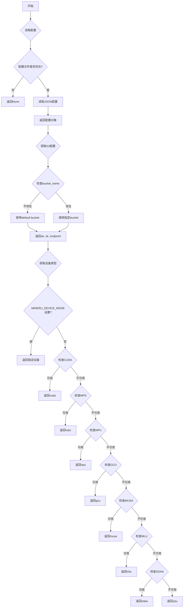
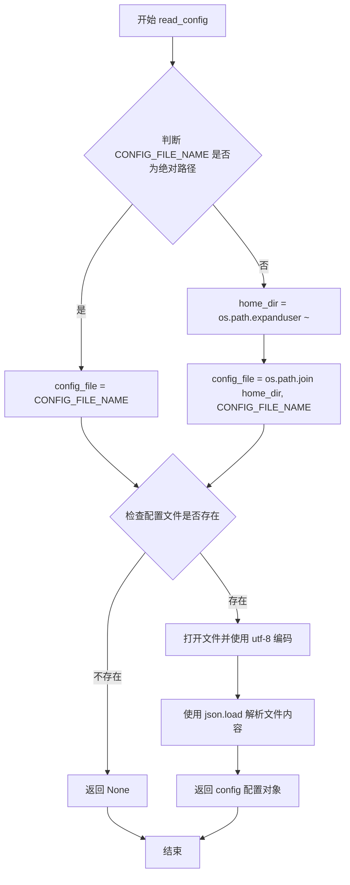
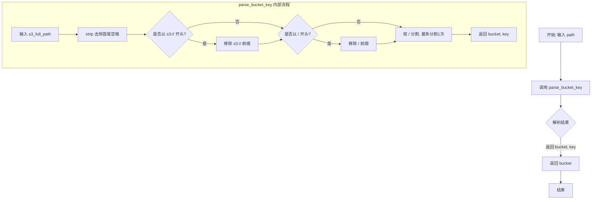
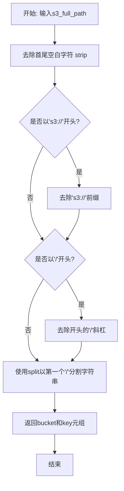
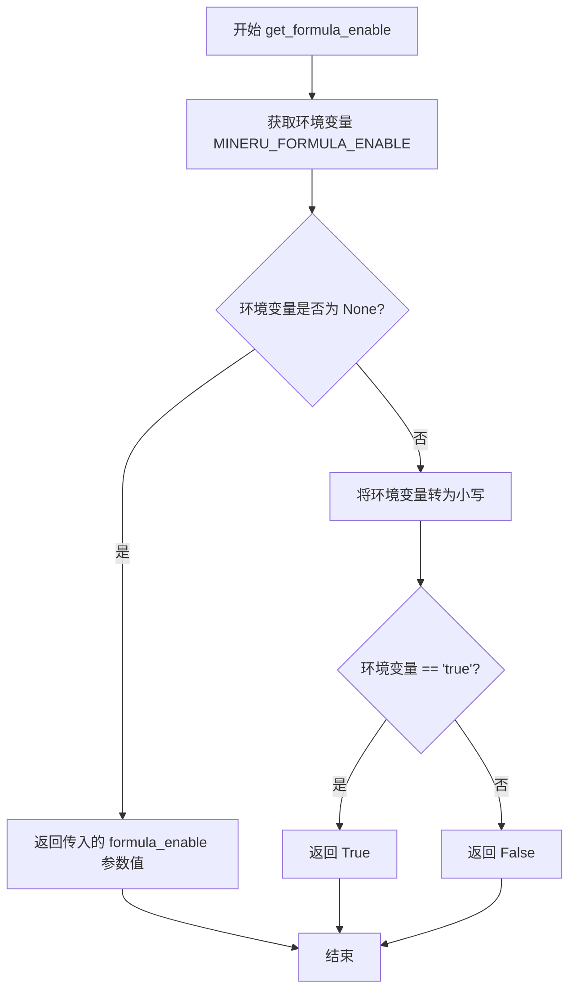
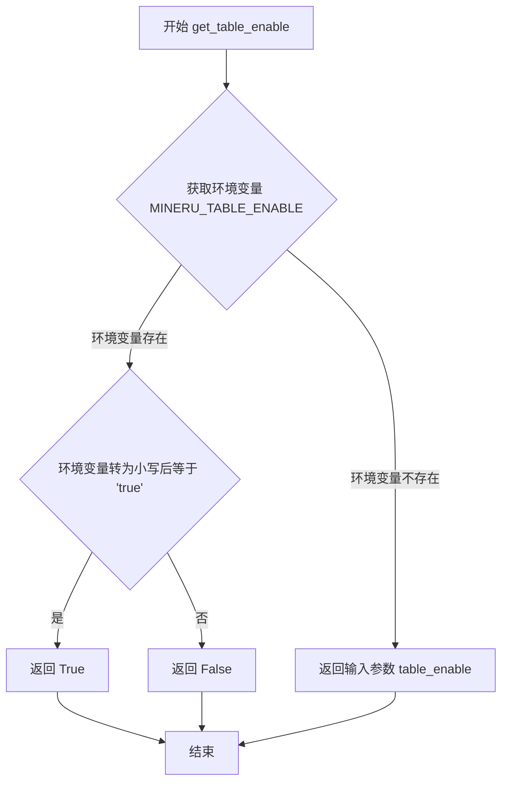
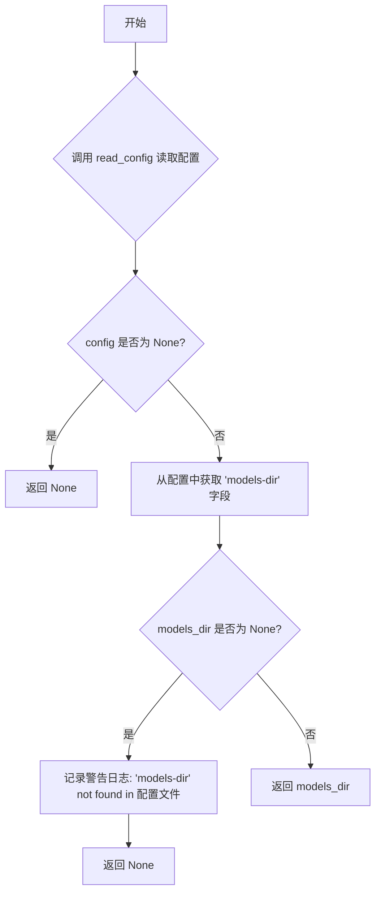

# `MinerU\mineru\utils\config_reader.py` 详细设计文档

该代码是一个配置管理模块，主要功能是读取JSON配置文件以获取S3存储配置、LaTeX分隔符配置、LLM辅助配置等信息，并提供设备检测功能以自动识别可用的计算设备（CPU、CUDA、MPS、NPU等）。

## 整体流程



## 类结构

```
该文件为纯模块文件，无类定义
所有功能通过全局函数实现
```

## 全局变量及字段


### `CONFIG_FILE_NAME`
    
全局常量，配置文件路径，可通过环境变量MINERU_TOOLS_CONFIG_JSON设置，默认为mineru.json

类型：`str`
    


    

## 全局函数及方法


### `read_config`

该函数用于读取并返回JSON配置文件的内容，支持绝对路径和用户主目录下的配置文件路径，如果文件不存在则返回None。

参数：该函数无参数

返回值：`dict | None`，返回从JSON配置文件读取的配置对象（字典类型），如果配置文件不存在则返回None

#### 流程图



#### 带注释源码

```python
def read_config():
    """
    读取并返回JSON配置文件内容
    
    配置文件路径规则：
    - 如果 CONFIG_FILE_NAME 是绝对路径，则直接使用
    - 否则，默认在用户主目录下查找
    
    Returns:
        dict | None: 配置文件内容字典，文件不存在时返回 None
    """
    # 判断配置文件名是否为绝对路径
    if os.path.isabs(CONFIG_FILE_NAME):
        # 绝对路径直接使用
        config_file = CONFIG_FILE_NAME
    else:
        # 相对路径则在用户主目录下查找
        home_dir = os.path.expanduser('~')
        config_file = os.path.join(home_dir, CONFIG_FILE_NAME)

    # 检查配置文件是否存在
    if not os.path.exists(config_file):
        # 文件不存在时记录警告日志（已注释）并返回 None
        # logger.warning(f'{config_file} not found, using default configuration')
        return None
    else:
        # 文件存在时打开并读取JSON内容
        with open(config_file, 'r', encoding='utf-8') as f:
            config = json.load(f)
        return config
```


### `get_s3_config`

获取指定 bucket 的 S3 配置信息（access_key、secret_key、storage_endpoint）。该函数从配置文件中读取 bucket_info，根据传入的 bucket_name 返回对应的 S3 认证信息；若指定的 bucket 不存在，则使用默认配置；若配置缺失则抛出异常。

参数：

- `bucket_name`：`str`，要获取配置的 bucket 名称

返回值：`tuple[str, str, str]`，返回 (access_key, secret_key, storage_endpoint) 三元组

#### 流程图

```mermaid
flowchart TD
    A[开始 get_s3_config] --> B[调用 read_config 读取配置文件]
    B --> C{配置文件是否存在?}
    C -->|否| D[config = None]
    C -->|是| E[加载 JSON 配置]
    E --> F[获取 bucket_info 字典]
    F --> G{bucket_name 在 bucket_info 中?}
    G -->|是| H[获取 bucket_name 对应的配置]
    G -->|否| I[获取 [default] 默认配置]
    H --> J{配置完整?}
    I --> J
    J -->|是| K[返回 access_key, secret_key, storage_endpoint]
    J -->|否| L[抛出异常: ak, sk or endpoint not found]
```

#### 带注释源码

```python
def get_s3_config(bucket_name: str):
    """~/magic-pdf.json 读出来."""
    # 步骤1: 读取全局配置文件
    config = read_config()

    # 步骤2: 从配置中获取 bucket_info 字典
    bucket_info = config.get('bucket_info')
    
    # 步骤3: 判断传入的 bucket_name 是否在 bucket_info 中
    # 如果不存在则使用默认配置 '[default]'
    if bucket_name not in bucket_info:
        access_key, secret_key, storage_endpoint = bucket_info['[default]']
    else:
        access_key, secret_key, storage_endpoint = bucket_info[bucket_name]

    # 步骤4: 验证配置完整性,若任一配置项为空则抛出异常
    if access_key is None or secret_key is None or storage_endpoint is None:
        raise Exception(f'ak, sk or endpoint not found in {CONFIG_FILE_NAME}')

    # 步骤5: 返回 S3 配置三元组
    # logger.info(f"get_s3_config: ak={access_key}, sk={secret_key}, endpoint={storage_endpoint}")

    return access_key, secret_key, storage_endpoint
```


### `get_s3_config_dict`

获取S3配置并以字典格式返回，包含访问密钥(ak)、秘密密钥(sk)和存储端点(endpoint)。

参数：

- `path`：`str`，S3对象路径，格式如 `s3://bucket/path/to/file`

返回值：`dict`，包含S3配置的字典，键为 `ak`（访问密钥）、`sk`（秘密密钥）、`endpoint`（存储端点）

#### 流程图

```mermaid
flowchart TD
    A[开始 get_s3_config_dict] --> B[调用 get_bucket_name path]
    B --> C[获取 bucket 名称]
    C --> D[调用 get_s3_config bucket_name]
    D --> E[获取 access_key, secret_key, storage_endpoint]
    E --> F[构建返回字典]
    F --> G[返回 {'ak': ak, 'sk': sk, 'endpoint': endpoint}]
    
    B -.->|使用| parse_bucket_key
    D -.->|使用| read_config
```

#### 带注释源码

```python
def get_s3_config_dict(path: str):
    """
    获取S3配置并以字典格式返回
    
    参数:
        path: S3对象路径，格式如 s3://bucket/path/to/file
        
    返回:
        dict: 包含ak, sk, endpoint的字典
    """
    # 步骤1: 从path中提取bucket名称
    # 调用get_bucket_name函数，get_bucket_name内部会调用parse_bucket_key解析路径
    bucket_name = get_bucket_name(path)
    
    # 步骤2: 根据bucket名称获取S3配置(ak, sk, endpoint)
    # get_s3_config会从配置文件中读取对应bucket的凭证信息
    # 如果bucket不存在于配置中，则使用默认配置
    access_key, secret_key, storage_endpoint = get_s3_config(bucket_name)
    
    # 步骤3: 将配置组装为字典格式并返回
    # 返回字典包含三个键: ak(访问密钥), sk(秘密密钥), endpoint(存储端点)
    return {'ak': access_key, 'sk': secret_key, 'endpoint': storage_endpoint}
```


### `get_bucket_name`

从 S3 路径中提取并返回 bucket 名称的函数。

参数：

- `path`：`str`，S3 完整路径，格式如 `s3://bucket/path/to/file.txt`

返回值：`str`，提取出的 bucket 名称

#### 流程图



#### 带注释源码

```python
def get_bucket_name(path):
    """
    从 S3 路径中提取 bucket 名称
    
    参数:
        path: S3 完整路径，格式如 s3://bucket/path/to/file.txt 或 /bucket/path/to/file.txt
        
    返回:
        bucket 名称字符串
    """
    # 调用 parse_bucket_key 函数解析路径，返回 bucket 和 key 两个部分
    # parse_bucket_key 会处理 s3:// 前缀和开头的 / 符号
    bucket, key = parse_bucket_key(path)
    
    # 返回解析得到的 bucket 名称
    return bucket
```


### `parse_bucket_key`

该函数用于解析S3完整路径，将包含bucket名称和对象键的完整路径拆分为bucket名称和key（对象路径）两部分返回，支持`s3://bucket/key`、`/bucket/key`或`bucket/key`三种输入格式。

参数：

- `s3_full_path`：`str`，S3完整路径，格式为`s3://bucket/path/to/file.txt`或`/bucket/path/to/file.txt`或`bucket/path/to/file.txt`

返回值：`tuple[str, str]`，返回元组，第一个元素为bucket名称，第二个元素为key（对象在bucket中的路径）

#### 流程图



#### 带注释源码

```python
def parse_bucket_key(s3_full_path: str):
    """
    输入 s3://bucket/path/to/my/file.txt
    输出 bucket, path/to/my/file.txt
    """
    # 步骤1: 去除字符串首尾的空白字符
    s3_full_path = s3_full_path.strip()
    
    # 步骤2: 如果路径以's3://'开头，去除这5个字符的前缀
    if s3_full_path.startswith("s3://"):
        s3_full_path = s3_full_path[5:]
    
    # 步骤3: 如果路径以'/'开头，去除开头的斜杠
    if s3_full_path.startswith("/"):
        s3_full_path = s3_full_path[1:]
    
    # 步骤4: 以第一个'/'为分隔符分割字符串，得到bucket和key
    bucket, key = s3_full_path.split("/", 1)
    
    # 步骤5: 返回bucket名称和key组成的元组
    return bucket, key
```


### `get_device`

该函数用于自动检测并返回当前可用的计算设备，优先检查环境变量配置，然后按硬件支持优先级（CUDA > MPS > NPU > GCU > MUSA > MLU > SDAA）自动选择可用设备，兜底返回 CPU。

参数：

- （无参数）

返回值：`str`，返回设备标识字符串，如 `"cuda"`、`"mps"`、`"npu"`、`"gcu"`、`"musa"`、`"mlu"`、`"sdaa"` 或 `"cpu"`

#### 流程图

```mermaid
flowchart TD
    A[开始 get_device] --> B{检查 MINERU_DEVICE_MODE<br>环境变量是否存在}
    B -->|是| C[返回 MINERU_DEVICE_MODE 值]
    B -->|否| D{torch.cuda.is_available}
    D -->|True| E[返回 "cuda"]
    D -->|False| F{torch.backends.mps.is_available}
    F -->|True| G[返回 "mps"]
    F -->|False| H{尝试 torch_npu.npu.is_available}
    H -->|成功且可用| I[返回 "npu"]
    H -->|异常或不可用| J{尝试 torch.gcu.is_available}
    J -->|成功且可用| K[返回 "gcu"]
    J -->|异常或不可用| L{尝试 torch.musa.is_available}
    L -->|成功且可用| M[返回 "musa"]
    L -->|异常或不可用| N{尝试 torch.mlu.is_available}
    N -->|成功且可用| O[返回 "mlu"]
    N -->|异常或不可用| P{尝试 torch.sdaa.is_available}
    P -->|成功且可用| Q[返回 "sdaa"]
    P -->|异常或不可用| R[返回 "cpu"]
```

#### 带注释源码

```python
def get_device():
    """
    自动检测并返回可用的计算设备。
    
    检测优先级：
    1. 环境变量 MINERU_DEVICE_MODE（手动指定）
    2. CUDA (NVIDIA GPU)
    3. MPS (Apple Silicon/Mac)
    4. NPU (华为昇腾)
    5. GCU (通用计算单元)
    6. MUSA (沐曦)
    7. MLU (寒武纪)
    8. SDAA (天数智芯)
    9. CPU (兜底)
    
    Returns:
        str: 可用设备标识字符串，如 "cuda", "mps", "npu", "gcu", "musa", "mlu", "sdaa", "cpu"
    """
    # 步骤1: 优先读取环境变量，允许用户手动指定设备
    device_mode = os.getenv('MINERU_DEVICE_MODE', None)
    if device_mode is not None:
        return device_mode
    else:
        # 步骤2: 自动检测硬件加速设备
        
        # 2.1 检测 NVIDIA GPU (CUDA)
        if torch.cuda.is_available():
            return "cuda"
        
        # 2.2 检测 Apple Silicon (MPS)
        elif torch.backends.mps.is_available():
            return "mps"
        
        else:
            # 2.3 尝试检测多种国产AI加速卡
            # 使用 try-except 包裹，因为这些库可能未安装或版本不兼容
            try:
                if torch_npu.npu.is_available():
                    return "npu"
            except Exception as e:
                pass
            
            try:
                if torch.gcu.is_available():
                    return "gcu"
            except Exception as e:
                pass
            
            try:
                if torch.musa.is_available():
                    return "musa"
            except Exception as e:
                pass
            
            try:
                if torch.mlu.is_available():
                    return "mlu"
            except Exception as e:
                pass
            
            try:
                if torch.sdaa.is_available():
                    return "sdaa"
            except Exception as e:
                pass
                                                           
    # 步骤3: 所有加速设备均不可用，返回 CPU
    return "cpu"
```


### `get_formula_enable`

获取公式处理启用配置。该函数首先检查环境变量 `MINERU_FORMULA_ENABLE` 是否设置，如果未设置则返回传入的默认配置值，如果已设置则将环境变量值转换为布尔类型返回。

参数：

- `formula_enable`：`bool`，传入的公式启用配置默认值

返回值：`bool`，返回最终的公式启用配置（优先使用环境变量配置，否则使用传入的默认配置）

#### 流程图



#### 带注释源码

```python
def get_formula_enable(formula_enable):
    """
    获取公式处理启用配置。
    
    优先使用环境变量 MINERU_FORMULA_ENABLE 的值，
    如果环境变量未设置则使用传入的默认参数值。
    
    Args:
        formula_enable: bool, 传入的公式启用配置默认值
        
    Returns:
        bool, 返回最终的公式启用配置
    """
    # 从环境变量中获取公式启用配置
    # 如果未设置则返回 None
    formula_enable_env = os.getenv('MINERU_FORMULA_ENABLE')
    
    # 如果环境变量未设置，直接返回传入的默认配置
    # 如果环境变量已设置，将其转换为小写并与 'true' 比较，转换为布尔值
    formula_enable = formula_enable if formula_enable_env is None else formula_enable_env.lower() == 'true'
    
    # 返回最终的配置值
    return formula_enable
```


### `get_table_enable`

获取表格处理启用配置，优先从环境变量 `MINERU_TABLE_ENABLE` 读取，若环境变量未设置则返回传入的默认值。

参数：

- `table_enable`：`bool`，表格处理启用配置的默认值

返回值：`bool`，最终确定的是否启用表格处理（若环境变量已设置则返回环境变量的布尔值，否则返回参数值）

#### 流程图



#### 带注释源码

```python
def get_table_enable(table_enable):
    """
    获取表格处理启用配置
    
    优先从环境变量 MINERU_TABLE_ENABLE 读取配置，
    如果环境变量未设置则使用传入的默认值。
    
    参数:
        table_enable: 表格处理启用配置的默认值
        
    返回值:
        bool: 最终确定的是否启用表格处理
    """
    # 从环境变量获取表格启用配置
    table_enable_env = os.getenv('MINERU_TABLE_ENABLE')
    
    # 如果环境变量存在，则将环境变量值转为小写并与 'true' 比较
    # 如果环境变量不存在，则使用传入的 table_enable 参数值
    table_enable = table_enable if table_enable_env is None else table_enable_env.lower() == 'true'
    
    # 返回最终确定的表格启用配置
    return table_enable
```


### `get_latex_delimiter_config`

获取LaTeX分隔符配置。该函数从配置文件中读取`latex-delimiter-config`配置项，如果配置文件不存在或配置项缺失则返回`None`。

参数：该函数无参数。

返回值：`dict` 或 `None`，返回LaTeX分隔符配置字典，如果配置文件不存在或配置项缺失则返回`None`。

#### 流程图


#### 带注释源码

```python
def get_latex_delimiter_config():
    """
    获取LaTeX分隔符配置
    
    从配置文件中读取 'latex-delimiter-config' 配置项，
    如果配置文件不存在或配置项缺失则返回 None。
    
    Returns:
        dict | None: LaTeX分隔符配置字典，或None（配置不存在时）
    """
    # 步骤1：读取配置文件
    config = read_config()
    
    # 步骤2：检查配置文件是否存在
    if config is None:
        # 配置文件不存在，返回None
        return None
    
    # 步骤3：从配置中获取 latex-delimiter-config 键
    latex_delimiter_config = config.get('latex-delimiter-config', None)
    
    # 步骤4：检查配置项是否存在
    if latex_delimiter_config is None:
        # 配置项不存在，记录日志（已注释）并返回None
        # logger.warning(f"'latex-delimiter-config' not found in {CONFIG_FILE_NAME}, use 'None' as default")
        return None
    else:
        # 配置项存在，返回配置值
        return latex_delimiter_config
```


### `get_llm_aided_config`

获取LLM辅助配置，用于从配置文件中读取并返回LLM辅助功能的相关配置参数。

参数： 无

返回值：`dict` 或 `None`，返回配置文件中的 `llm-aided-config` 字段内容，如果配置文件不存在或该字段不存在则返回 `None`

#### 流程图


#### 带注释源码

```python
def get_llm_aided_config():
    """
    获取LLM辅助配置
    
    从配置文件中读取 'llm-aided-config' 字段并返回
    如果配置文件不存在或字段不存在则返回 None
    
    Returns:
        dict or None: 配置文件中的 llm-aided-config 内容，不存在则返回 None
    """
    # 步骤1: 读取全局配置文件
    config = read_config()
    
    # 步骤2: 检查配置是否读取成功
    if config is None:
        # 配置文件不存在或读取失败，返回 None
        return None
    
    # 步骤3: 从配置中获取 llm-aided-config 字段
    llm_aided_config = config.get('llm-aided-config', None)
    
    # 步骤4: 检查 llm-aided-config 是否存在
    if llm_aided_config is None:
        # 配置文件中不存在该字段，返回 None
        # logger.warning(f"'llm-aided-config' not found in {CONFIG_FILE_NAME}, use 'None' as default")
        return None
    else:
        # 存在该配置，返回配置内容
        return llm_aided_config
```


### `get_local_models_dir`

获取本地模型目录路径，从配置文件中读取 `models-dir` 字段。如果配置文件不存在或配置中未找到该字段，则返回 `None` 并记录警告日志。

参数：

- （无参数）

返回值：`Optional[str]`，返回从配置文件中读取的模型目录路径，如果配置不存在或字段不存在则返回 `None`

#### 流程图



#### 带注释源码

```python
def get_local_models_dir():
    """
    获取本地模型目录路径。
    
    从配置文件中读取 'models-dir' 字段的值。
    如果配置文件不存在或配置中未找到该字段，则返回 None。
    
    Returns:
        Optional[str]: 模型目录路径，如果未配置则返回 None
    """
    # 步骤1: 读取配置文件
    config = read_config()
    
    # 步骤2: 如果配置文件不存在或读取失败，直接返回 None
    if config is None:
        return None
    
    # 步骤3: 从配置中获取 'models-dir' 字段
    models_dir = config.get('models-dir')
    
    # 步骤4: 如果字段不存在，记录警告日志并返回 None
    if models_dir is None:
        logger.warning(f"'models-dir' not found in {CONFIG_FILE_NAME}, use None as default")
    
    # 步骤5: 返回获取到的模型目录路径（可能是 None）
    return models_dir
```

## 关键组件


### 配置文件读取机制

负责从用户主目录读取JSON格式的配置文件，支持环境变量指定配置文件路径，提供配置加载失败时的默认行为。

### S3路径解析与配置获取

解析S3完整路径（s3://bucket/path格式），提取bucket名称和对象键；同时提供从配置文件中获取对应bucket的AK/SK和存储端点信息的统一接口。

### 设备自动检测与选择

自动检测并选择可用的计算设备，按优先级依次尝试CUDA、MPS、NPU、GCU、MUSA、MLU、SDAA，最后回退到CPU，支持环境变量手动指定设备模式。

### 功能开关配置管理

提供公式识别和表格识别功能的开关配置，支持通过环境变量覆盖代码中的默认值，实现运行时动态控制。

### LaTeX分隔符配置获取

从配置文件中读取LaTeX分隔符配置，供下游模块使用文档解析功能。

### LLM辅助配置获取

从配置文件中读取LLM辅助识别相关配置，包括模型路径、API端点等参数。

### 本地模型目录获取

从配置文件中获取本地模型存储目录路径，若未配置则记录警告日志。


## 问题及建议


### 已知问题

- **配置文件重复读取**：所有配置获取函数（`get_s3_config`、`get_latex_delimiter_config`、`get_llm_aided_config`、`get_local_models_dir`）每次调用都会重新读取并解析JSON文件，没有实现缓存机制，在高频调用场景下会造成严重的I/O性能问题。
- **空值异常风险**：`get_s3_config` 函数在 `config` 为 `None` 时会抛出 `AttributeError`；`bucket_info` 为 `None` 时也会导致程序崩溃，缺乏防御性编程。
- **设备检测嵌套过深**：`get_device` 函数包含多层嵌套的 try-except 块，代码可读性极差，且每次调用都需重新检测硬件，没有缓存结果。
- **静默错误处理**：大量使用空 `except` 块和 `pass` 语句，错误被静默吞掉，例如 `torch_npu` 导入失败时没有任何日志或提示。
- **代码重复**：`get_formula_enable` 和 `get_table_enable` 函数结构完全相同，仅变量名不同，可通过参数化重构。
- **配置解析脆弱**：`parse_bucket_key` 函数在输入仅包含 bucket 名称（无斜杠）时会抛出 `ValueError`，缺乏边界情况处理。
- **缺少类型注解**：部分函数（如 `read_config`、`parse_bucket_key`）缺少返回类型注解，影响代码可维护性。
- **JSON解析错误未捕获**：`json.load()` 可能抛出 `json.JSONDecodeError`，但未被捕获处理。

### 优化建议

- **引入配置缓存**：使用 `@functools.lru_cache` 或类成员变量缓存 `read_config()` 的结果，避免重复读取文件。
- **添加空值保护**：在访问 `config.get()` 返回值前增加 `None` 检查，或使用 `dict.get()` 的默认值参数。
- **重构设备检测逻辑**：将设备检测提取为独立函数并缓存结果，使用列表或字典存储设备优先级以减少嵌套层级。
- **统一错误处理**：为关键异常添加日志记录，使用 `logger.warning` 或 `logger.error` 替代静默 `pass`。
- **消除重复代码**：将 `get_formula_enable` 和 `get_table_enable` 合并为 `get_bool_config(key, default)` 函数。
- **增强输入校验**：在 `parse_bucket_key` 中增加对输入格式的校验，处理空字符串、单bucket等情况。
- **完善类型注解**：为所有函数添加完整的类型注解，包括返回值类型。
- **异常捕获扩展**：为 `json.load()` 添加 `try-except` 捕获 `json.JSONDecodeError`，并提供有意义的错误信息。


## 其它


### 设计目标与约束

本模块主要提供配置管理、设备检测、S3存储配置获取等基础工具函数，支持多种运行环境（CPU/CUDA/MPS/NPU/GCU/MUSA/MLU/SDAA），通过环境变量和配置文件实现灵活的配置管理。设计约束包括：配置文件采用JSON格式，默认路径为~/mineru.json，支持绝对路径和相对路径配置。

### 错误处理与异常设计

1. **配置文件读取异常**：当配置文件不存在时返回None，不抛出异常；2. **S3配置获取异常**：当bucket_info中不存在指定bucket或缺少必要的ak/sk/endpoint时抛出Exception；3. **设备检测异常**：设备检测采用嵌套try-except捕获各平台的可用性检查异常，确保任一平台可用都能返回对应设备；4. **环境变量解析异常**：环境变量不存在时使用默认值，不抛出异常。

### 数据流与状态机

1. **配置读取流程**：read_config() -> get_s3_config/get_local_models_dir等 -> 返回配置字典或None；2. **设备检测流程**：get_device() -> 检查环境变量MINERU_DEVICE_MODE -> 依次检测CUDA/MPS/NPU/GCU/MUSA/MLU/SDAA可用性 -> 返回设备字符串；3. **S3路径解析流程**：get_bucket_name/parse_bucket_key -> 解析s3://bucket/key格式 -> 返回bucket和key。

### 外部依赖与接口契约

1. **JSON配置文件**：依赖mineru.json格式的配置文件，需要包含bucket_info、latex-delimiter-config、llm-aided-config、models-dir等字段；2. **环境变量接口**：MINERU_TOOLS_CONFIG_JSON（配置文件路径）、MINERU_DEVICE_MODE（设备模式）、MINERU_FORMULA_ENABLE（公式识别开关）、MINERU_TABLE_ENABLE（表格识别开关）；3. **PyTorch依赖**：torch、torch_npu、torch.musa、torch.mlu、torch.sdaa等可选依赖，通过try-except处理导入失败情况。

### 安全性考虑

1. **敏感信息处理**：S3的access_key和secret_key通过配置文件获取，代码中不硬编码敏感信息；2. **路径安全**：使用os.path.expanduser处理用户路径，防止路径注入；3. **配置验证**：get_s3_config中对必要字段进行非空校验。

### 性能考虑

1. **配置缓存**：每次调用get_s3_config等函数都重新读取配置文件，可考虑添加缓存机制；2. **设备检测优化**：设备检测逻辑较为冗长，可使用列表循环简化；3. **异常捕获开销**：嵌套的try-except可能影响性能，可考虑重构为统一的设备检测框架。

### 配置管理

配置文件采用JSON格式，支持以下字段：
- bucket_info: S3存储桶配置，包含默认桶和自定义桶的ak/sk/endpoint
- latex-delimiter-config: LaTeX分隔符配置
- llm-aided-config: LLM辅助配置
- models-dir: 本地模型目录路径

环境变量优先级高于配置文件中的同名配置。

### 配置文件格式示例

```json
{
    "bucket_info": {
        "[default]": ["ak", "sk", "endpoint"],
        "my-bucket": ["ak2", "sk2", "endpoint2"]
    },
    "latex-delimiter-config": {...},
    "llm-aided-config": {...},
    "models-dir": "/path/to/models"
}
```

### 返回值规范

1. read_config(): 返回dict或None
2. get_s3_config(): 返回tuple(access_key, secret_key, storage_endpoint)
3. get_s3_config_dict(): 返回dict{'ak': str, 'sk': str, 'endpoint': str}
4. get_bucket_name(): 返回str
5. parse_bucket_key(): 返回tuple(bucket, key)
6. get_device(): 返回str ("cuda"/"mps"/"npu"/"gcu"/"musa"/"mlu"/"sdaa"/"cpu")
7. get_formula_enable()/get_table_enable(): 返回bool
8. get_latex_delimiter_config()/get_llm_aided_config(): 返回dict或None
9. get_local_models_dir(): 返回str或None

### 潜在技术债务与优化空间

1. **配置缓存缺失**：每次调用配置相关函数都重新读取JSON文件，建议添加@lru_cache装饰器或全局缓存变量；2. **设备检测冗余**：嵌套的try-except代码冗长，可重构为循环检测方式；3. **日志缺失**：代码中大量logger调用被注释，建议统一日志级别和格式；4. **类型注解不完整**：部分函数缺少类型注解（如parse_bucket_key的返回值）；5. **魔法字符串**：s3://前缀等硬编码字符串可提取为常量。

    